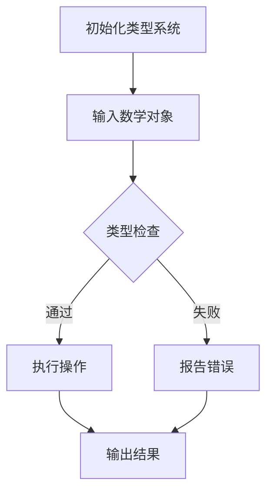
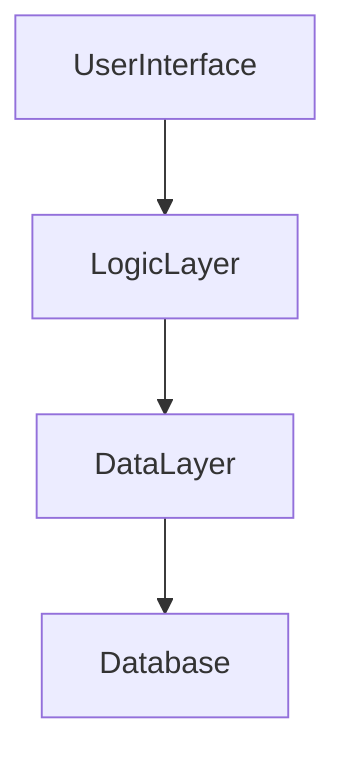
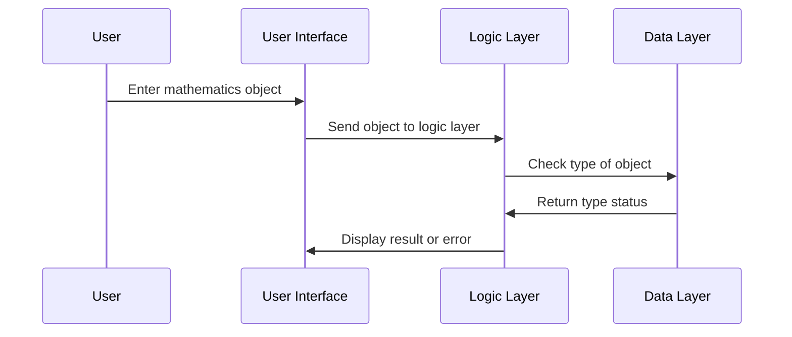

                 

# 《罗素类型论与数学本体论的现代争议焦点》

## 关键词

- 罗素类型论
- 数学本体论
- 现代争议
- 类型实在性
- 数学对象存在性
- 数学理论的构造性

## 摘要

本文旨在探讨罗素类型论与数学本体论在现代哲学与数学领域的争议焦点。罗素类型论是罗素为解决逻辑原子主义和集合论问题提出的理论，强调不同类型的对象有不同的本质。而数学本体论则涉及数学对象的存在性、实在性和数学理论的构造性。本文将分析类型实在性、类型与存在的关系、类型论与数学基础以及类型论与自然语言等方面的争议，并探讨数学实在论与形式主义的对立，以及构造性数学的优势和挑战。通过案例分析，揭示类型论在现代数学哲学中的角色，最后对罗素类型论与数学本体论的融合及未来进行展望。

## 第1章 引言

罗素类型论与数学本体论是现代哲学与数学领域的重要理论，它们不仅在理论上具有深远的影响，而且在实际应用中也有着广泛的意义。罗素类型论是英国哲学家伯特兰·罗素于19世纪末20世纪初提出的一种哲学理论，旨在解决逻辑原子主义和集合论问题。罗素认为，逻辑原子主义将世界视为由原子事实构成的，这些事实是逻辑上最基本的实体，但逻辑原子主义却无法解决悖论和自相矛盾的问题。为了解决这个问题，罗素提出了类型论，他认为不同类型的对象有不同的本质，从而避免了逻辑原子主义中的悖论。

数学本体论则涉及数学对象的存在性、实在性和数学理论的构造性。数学对象的存在性是数学哲学中的一个重要问题，不同的哲学家对此有不同的看法。有的认为数学对象是真实存在的，有的则认为数学对象只存在于我们的思想和符号系统中。数学理论的构造性也是一个关键问题，它关乎数学理论的逻辑严密性和一致性。形式主义和直觉主义等数学哲学流派对此有着不同的观点和论证。

在现代哲学与数学领域，罗素类型论和数学本体论仍然具有重要的争议焦点。类型实在性、类型与存在的关系、类型论与数学基础、类型论与自然语言等方面的问题仍然是学术界关注的重点。本文将深入探讨这些争议焦点，分析不同观点的论证和反驳，并探讨罗素类型论与数学本体论的融合及未来发展的可能性。

## 第2章 罗素类型论概述

### 罗素类型论的起源

罗素类型论起源于罗素对逻辑原子主义和集合论的批判。在《数学原理》一书中，罗素和怀特海德试图构建一个逻辑系统，将数学概念和定理转化为逻辑命题。然而，罗素的这一尝试却导致了著名的罗素悖论，即一个集合包含所有不包含自身的集合，从而导致逻辑系统的不一致。为了解决这一问题，罗素提出了类型论。

### 类型论的基本思想

罗素类型论的核心思想是区分不同类型的对象，并认为不同类型的对象有不同的本质。具体来说，罗素将对象分为以下几种类型：

1. **个体类型**：个体类型是指具体的物体或个体，如“地球”、“苹果”等。这些对象是物理世界中真实存在的。
   
2. **集合类型**：集合类型是指由个体组成的集合，如“所有苹果”的集合。集合是抽象的，其存在依赖于个体的存在。

3. **关系类型**：关系类型是指描述个体之间关系的概念，如“大于”、“属于”等。这些关系也是抽象的，其存在依赖于个体和集合的存在。

### 类型论的应用

罗素类型论的应用主要体现在两个方面：一是解决悖论，二是构建形式化的逻辑系统。

1. **解决悖论**

罗素类型论通过区分不同类型的对象，避免了集合论中的悖论。例如，罗素悖论的产生是因为将个体和集合放在同一类型中，导致自相矛盾。而类型论通过区分不同类型的对象，使得集合和个体相互独立，从而避免了悖论。

2. **构建形式化的逻辑系统**

罗素类型论为逻辑系统提供了一种形式化的方法。通过定义不同类型的对象和操作，可以构建一个严谨的数学系统。这种形式化的逻辑系统在后来的形式主义和直觉主义等数学哲学流派中得到了广泛应用。

### 罗素类型论的评价

罗素类型论在当时引起了广泛关注，但同时也受到了批评。一些批评者认为，类型论过于复杂，难以应用于实际问题。另一些批评者则认为，类型论虽然解决了悖论，但牺牲了数学的直观性。尽管如此，罗素类型论在数学哲学和逻辑学中仍然具有重要地位，它为我们理解数学的本质提供了一种新的视角。

## 第3章 罗素类型论的现代争议

### 3.1 类型与实在性

#### 3.1.1 类型实在性的争论

类型实在性是罗素类型论中的一个关键问题。类型实在性指的是不同类型的对象是否真实存在。在这个问题上，哲学家们存在不同观点。

1. **实在论**

实在论者认为，不同类型的对象都是真实存在的。具体来说，个体类型是物理世界中真实存在的，集合类型和关系类型则是抽象的，但也是真实存在的。实在论者认为，类型实在性是理解世界的基石。

2. **反实在论**

反实在论者则认为，不同类型的对象并不是真实存在的。他们认为，个体类型是真实存在的，但集合类型和关系类型只是我们的思想产物，并不具有独立的存在。反实在论者认为，类型实在性是一种误导，它掩盖了事物的真实本质。

#### 3.1.2 类型与存在的关系

类型与存在的关系也是罗素类型论中的一个重要问题。存在论者认为，不同类型的对象有不同的存在方式。具体来说：

1. **个体存在**

个体类型是具体物体或个体，它们是物理世界中真实存在的。个体存在是存在论的核心概念。

2. **集合存在**

集合类型是由个体组成的抽象集合，它们的真实存在依赖于个体的存在。集合存在是存在论中的一个争议点。

3. **关系存在**

关系类型是描述个体之间关系的概念，它们的真实存在也依赖于个体和集合的存在。关系存在是存在论中的另一个争议点。

### 3.2 类型论与数学基础

#### 3.2.1 类型论与逻辑原子主义

逻辑原子主义是罗素类型论的一个直接批判对象。逻辑原子主义认为，世界由最基本的原子事实构成，这些事实是逻辑上最基本的实体。然而，逻辑原子主义却无法解决悖论和自相矛盾的问题。罗素类型论通过区分不同类型的对象，避免了逻辑原子主义中的悖论。

#### 3.2.2 类型论与集合论基础

集合论是数学的一个基本分支，它研究集合的性质和运算。然而，集合论也面临着悖论问题。罗素悖论就是一个典型的例子。为了解决悖论，罗素提出了类型论，认为集合和个体应该属于不同的类型，从而避免了悖论。

### 3.3 类型论与自然语言

#### 3.3.1 类型论与语义学

语义学是研究语言与意义关系的学科。类型论在语义学中也有重要应用。类型论认为，不同类型的对象有不同的本质，这有助于我们理解自然语言中不同词语的意义。例如，个体类型的词语描述具体物体或个体，集合类型的词语描述抽象集合，关系类型的词语描述个体之间的关系。

#### 3.3.2 类型论与哲学语言分析

哲学语言分析是哲学研究中的一个重要方向。类型论在哲学语言分析中也有重要作用。通过分析不同类型的对象，我们可以更好地理解哲学命题的含义和结构。例如，通过类型论的分析，我们可以揭示哲学命题中的逻辑错误和悖论。

### 3.4 类型论的批评与反驳

尽管罗素类型论在数学哲学和逻辑学中具有重要地位，但也有一些批评者对类型论提出了质疑和反驳。

1. **批评观点**

批评者认为，类型论过于复杂，难以应用于实际问题。此外，类型论虽然解决了悖论，但牺牲了数学的直观性。

2. **反驳观点**

反驳者认为，类型论并非过于复杂，而是为解决悖论提供了新的思路。此外，类型论虽然改变了数学的直观性，但这也是数学发展的一种必然趋势。

### 3.5 类型论的现代应用

类型论在现代数学哲学和逻辑学中仍然有着广泛的应用。例如，在计算机科学中，类型论被应用于编程语言的设计和类型系统的构建。在认知科学中，类型论被应用于理解人类的思维过程。这些现代应用进一步证明了类型论的实用性和重要性。

## 第4章 数学本体论的现代争议

### 4.1 数学实在论与形式主义

#### 4.1.1 数学实在论的论证

数学实在论认为，数学对象是真实存在的，它们具有独立的本质。数学实在论者通常从以下几个方面论证数学对象的存在性：

1. **直觉论证**

数学实在论者认为，我们对数学对象的存在有直观的感受，这种直觉是我们认识世界的基石。例如，我们直观地感受到数字和几何形状的存在。

2. **物理实在论**

数学实在论者认为，数学对象的存在依赖于物理世界的存在。例如，数学中的整数和几何形状可以通过物理实验来验证。

3. **逻辑论证**

数学实在论者认为，数学对象的存在可以通过逻辑论证来证明。例如，我们可以通过定义和公理来证明数学对象的存在。

#### 4.1.2 形式主义的回应

形式主义认为，数学对象并不具有独立的本质，它们只存在于我们的思想和符号系统中。形式主义对数学实在论的回应主要体现在以下几个方面：

1. **符号主义**

形式主义认为，数学对象只是符号系统中的符号，它们的存在依赖于我们的符号约定。

2. **构造性论证**

形式主义认为，数学对象的存在可以通过构造性论证来证明。例如，我们可以通过定义和构造来证明数学对象的存在。

### 4.2 数学对象的存在性

#### 4.2.1 实在论的存在性论证

实在论者认为，数学对象是真实存在的。他们通常从以下几个方面来论证数学对象的存在性：

1. **直观论证**

实在论者认为，我们对数学对象的存在有直观的感受，这种直觉是我们认识世界的基石。

2. **物理实在论**

实在论者认为，数学对象的存在依赖于物理世界的存在。例如，数学中的整数和几何形状可以通过物理实验来验证。

3. **逻辑论证**

实在论者认为，数学对象的存在可以通过逻辑论证来证明。例如，我们可以通过定义和公理来证明数学对象的存在。

#### 4.2.2 抽象对象的存在性

抽象对象的存在性是数学哲学中的一个重要问题。抽象对象包括集合、函数、群、环等。它们的存在性通常从以下几个方面来论证：

1. **集合的存在性**

集合是数学中最基本的抽象对象。集合论的存在性可以通过定义和公理来证明。例如，皮亚诺公理可以证明自然数的存在性。

2. **函数的存在性**

函数是数学中描述两个集合之间关系的基本概念。函数的存在性可以通过定义和构造来证明。例如，我们可以通过定义函数的图像来证明函数的存在性。

3. **群与环的存在性**

群和环是数学中的基本结构。它们的存在性可以通过定义和构造来证明。例如，我们可以通过定义群的运算和性质来证明群的存在性。

### 4.3 数学理论的构造性

#### 4.3.1 构造性数学的优势

构造性数学是一种强调数学对象和定理的构造性的数学哲学观点。它具有以下优势：

1. **逻辑严密性**

构造性数学强调逻辑推理的严密性，从而避免了非构造性数学中可能出现的逻辑错误。

2. **直观性**

构造性数学强调数学对象和定理的直观性，使得数学更容易理解和应用。

3. **应用性**

构造性数学强调数学对象和定理的构造性，使得数学在科学和技术中的应用更加广泛。

#### 4.3.2 构造性数学的挑战

尽管构造性数学具有优势，但它也面临着一些挑战：

1. **复杂性**

构造性数学的复杂性较高，使得理解和应用构造性数学变得更加困难。

2. **适用范围**

构造性数学的适用范围有限，不能解决所有数学问题。例如，非构造性数学在解决某些数学问题时具有优势。

3. **与经典数学的冲突**

构造性数学与经典数学在某些方面存在冲突。例如，构造性数学不承认某些经典数学中的定理，这可能导致数学体系的分裂。

### 4.4 数学本体论的现代争议总结

数学本体论的现代争议主要集中在数学对象的存在性、数学实在论与形式主义、构造性数学的优势与挑战等方面。不同的观点和论证为数学本体论的研究提供了丰富的素材，也促使我们对数学的本质有更深入的认识。

## 第5章 罗素类型论与数学本体论的融合

### 5.1 类型论在数学本体论中的应用

#### 5.1.1 类型论与集合论的关系

类型论在集合论中的应用主要体现在对集合的分类和构造上。通过区分不同类型的集合，可以更好地理解集合的性质和运算。具体来说：

1. **个体集合**

个体集合是指只包含一个元素的集合，如 `{a}`。个体集合是集合论中最基本的集合。

2. **集合集合**

集合集合是指包含其他集合的集合，如 `{ {a}, {b}, {a, b} }`。集合集合在集合论中具有重要地位，它们构成了更复杂的集合结构。

3. **关系集合**

关系集合是指描述个体之间关系的集合，如 `{ (a, b), (b, a) }`。关系集合在数学和哲学中有着广泛的应用。

#### 5.1.2 类型论与证明论的关系

类型论在证明论中的应用主要体现在对证明过程的分类和规范上。通过区分不同类型的证明，可以更好地理解证明的性质和逻辑结构。具体来说：

1. **直接证明**

直接证明是指通过直接推理和逻辑运算，从一个或多个已知事实推导出结论。直接证明是证明论中最基本和最常用的证明方法。

2. **间接证明**

间接证明是指通过反证法或构造性证明，从一个或多个已知事实推导出结论。间接证明在处理复杂问题时具有优势。

3. **构造性证明**

构造性证明是指通过构造具体的对象或模型，来证明某个数学定理或命题的正确性。构造性证明在数学和应用数学中有着广泛的应用。

### 5.2 数学哲学中的类型论观点

#### 5.2.1 罗素类型论与数学哲学

罗素类型论是数学哲学中的一个重要观点。它为我们理解数学的本质提供了新的视角。具体来说：

1. **数学本质的区分**

罗素类型论认为，数学对象可以分为个体类型、集合类型和关系类型。这种区分有助于我们理解数学对象的不同本质。

2. **数学逻辑的一致性**

罗素类型论通过区分不同类型的对象，避免了逻辑悖论和自相矛盾的问题。这为我们建立逻辑一致性的数学体系提供了基础。

3. **数学直观的理解**

罗素类型论强调数学对象和定理的直观性。这种直观性有助于我们更好地理解数学的本质。

#### 5.2.2 类型论在现代数学哲学中的角色

类型论在现代数学哲学中仍然扮演着重要角色。具体来说：

1. **数学本质的探讨**

类型论为我们探讨数学本质提供了新的方法和视角。通过区分不同类型的对象，我们可以更深入地理解数学的本质。

2. **数学逻辑的发展**

类型论对数学逻辑的发展产生了深远影响。它为建立逻辑一致性的数学体系提供了基础，也为后来的形式主义和直觉主义等数学哲学流派提供了灵感。

3. **数学应用的指导**

类型论在数学应用中也有重要作用。通过区分不同类型的对象，我们可以更好地理解和应用数学理论。

### 5.3 类型论与数学教育

#### 5.3.1 数学教育中的类型论

数学教育中引入类型论有助于学生更好地理解数学的本质。具体来说：

1. **数学概念的教学**

通过类型论的教学，学生可以更好地理解数学概念的不同本质。例如，个体类型、集合类型和关系类型的教学可以帮助学生理解不同的数学对象。

2. **数学推理的训练**

类型论的教学可以帮助学生培养逻辑推理能力。通过区分不同类型的对象和证明方法，学生可以更有效地进行数学推理。

3. **数学应用的培养**

类型论的教学有助于学生更好地理解和应用数学理论。通过区分不同类型的对象，学生可以更有效地解决实际问题。

#### 5.3.2 数学教育中的类型论挑战

尽管类型论在数学教育中具有重要作用，但也存在一些挑战：

1. **复杂性的处理**

类型论具有复杂性，这对学生的理解提出了挑战。教师需要通过合适的引导和教学方法，帮助学生克服这种复杂性。

2. **直观性的保障**

类型论强调数学对象的直观性，但在教学过程中，如何保障这种直观性仍然是一个挑战。教师需要通过丰富的教学资源和实践活动，帮助学生建立直观的数学概念。

3. **实践性的培养**

类型论的教学不仅要注重理论的传授，还要注重实践的应用。教师需要设计更多的实践性活动，帮助学生将类型论的知识应用于实际问题。

### 5.4 类型论与人工智能

#### 5.4.1 类型论在人工智能中的应用

类型论在人工智能中有着广泛的应用。具体来说：

1. **编程语言的设计**

类型论在编程语言的设计中具有重要应用。通过引入类型系统，可以确保程序的正确性和安全性。类型论为编程语言提供了更严谨的语义基础。

2. **形式化验证**

类型论在形式化验证中也有重要作用。通过类型系统，可以确保程序的逻辑一致性和正确性。形式化验证在确保软件安全性和可靠性方面具有重要作用。

3. **机器学习**

类型论在机器学习中也具有应用。通过引入类型约束，可以确保机器学习模型的可解释性和可靠性。类型论为机器学习提供了更严谨的理论基础。

#### 5.4.2 类型论与人工智能的挑战

尽管类型论在人工智能中具有重要作用，但也存在一些挑战：

1. **复杂性管理**

类型论具有复杂性，这对人工智能系统提出了挑战。如何有效地管理和处理类型复杂性是一个重要问题。

2. **可解释性保障**

类型论在确保程序的正确性和安全性方面具有优势，但在保障机器学习模型的可解释性方面仍存在挑战。如何平衡类型论和可解释性是一个重要问题。

3. **适应性提升**

类型论在人工智能系统中的应用需要不断提升适应性。如何适应不同类型的数据和任务是一个重要问题。

### 5.5 类型论的融合与未来

#### 5.5.1 类型论与数学本体论的融合

类型论与数学本体论的融合是数学哲学和逻辑学的一个研究方向。通过融合类型论和数学本体论，可以构建更严谨和全面的数学体系。具体来说：

1. **数学对象的存在性**

通过融合类型论和数学本体论，可以更深入地探讨数学对象的存在性。类型论提供了区分不同类型对象的方法，数学本体论提供了存在性论证的框架。

2. **数学逻辑的一致性**

通过融合类型论和数学本体论，可以确保数学逻辑的一致性。类型论通过区分不同类型的对象，避免了逻辑悖论和自相矛盾的问题。

3. **数学哲学的发展**

通过融合类型论和数学本体论，可以推动数学哲学的发展。类型论提供了新的视角和方法，数学本体论提供了理论基础和实践应用。

#### 5.5.2 类型论的未来

类型论在数学哲学、逻辑学、人工智能等领域具有重要地位。未来，类型论的发展将继续深入。具体来说：

1. **理论深化**

类型论的理论研究将继续深入，探讨类型论在不同领域的应用和融合。

2. **实践推广**

类型论将在更多的实践领域得到应用，如编程语言设计、形式化验证、机器学习等。

3. **教育普及**

类型论将在数学教育中得到更广泛的普及，帮助学生更好地理解和应用数学理论。

4. **跨学科研究**

类型论将在跨学科研究中发挥重要作用，与其他领域如认知科学、计算机科学等相结合，推动人类对世界认识的深化。

### 第6章 现代争议焦点案例分析

#### 6.1 案例一：集合论与无穷

##### 6.1.1 集合论中的类型问题

集合论中的无穷问题是罗素类型论关注的重点之一。无穷问题是集合论中的一个基本概念，它涉及到无穷集合的性质和运算。然而，无穷问题也引发了类型论的争议。

1. **无穷集合的存在性**

无穷集合的存在性是集合论中的一个基本问题。实在论者认为，无穷集合是真实存在的，它们是自然数、实数等数学对象的基础。反实在论者则认为，无穷集合只存在于我们的思想和符号系统中，它们并不具有独立的存在。

2. **无穷集合的类型问题**

在类型论中，无穷集合的类型问题也是一个重要争议点。实在论者认为，无穷集合应该属于个体类型或集合类型，因为它们是具体的物体或集合。反实在论者则认为，无穷集合应该属于关系类型，因为它们描述的是个体之间的关系。

##### 6.1.2 无穷问题的类型论解决

为了解决无穷问题，类型论提出了一些解决方案。具体来说：

1. **类型区分**

类型论通过区分不同类型的对象，解决了无穷集合的类型问题。类型论认为，无穷集合应该属于个体类型或集合类型，因为它们是具体的物体或集合。

2. **类型限制**

类型论通过类型限制，确保了无穷集合的正确性和一致性。类型论认为，不同类型的对象有不同的本质，因此它们之间的运算和关系也应该受到类型限制。

##### 6.1.3 无穷问题的类型论评价

类型论在解决无穷问题方面取得了一定的成功。它为无穷集合的存在性和类型问题提供了新的视角和方法。然而，类型论也存在一些争议和挑战：

1. **复杂性**

类型论引入了复杂的类型系统，这对数学推理和证明提出了挑战。如何有效地管理和处理类型复杂性是一个重要问题。

2. **直观性**

类型论强调数学对象和定理的直观性，但在处理无穷问题时，如何保障这种直观性仍然是一个挑战。

3. **适用范围**

类型论在无穷问题中的应用具有一定的局限性。它不能解决所有无穷问题，也不能完全取代传统集合论的方法。

#### 6.2 案例二：数学直觉主义

##### 6.2.1 直觉主义数学与类型论

直觉主义数学是一种强调数学对象和定理的构造性和直观性的数学哲学观点。它对类型论提出了挑战，同时也与类型论有着密切的关系。

1. **直觉主义数学的核心思想**

直觉主义数学认为，数学对象和定理应该通过构造性方法来证明。直觉主义数学强调数学对象的直观性和构造性，从而避免非构造性方法可能导致的不确定性。

2. **直觉主义数学与类型论的关系**

直觉主义数学与类型论有相似之处，它们都强调数学对象和定理的直观性和构造性。然而，它们也存在差异。类型论通过区分不同类型的对象，确保了数学逻辑的一致性。而直觉主义数学则强调构造性证明，认为数学对象和定理应该通过具体构造来证明。

##### 6.2.2 直觉主义与数学形式化

直觉主义数学对数学形式化提出了挑战。形式化数学强调数学对象和定理的形式化和严谨性。而直觉主义数学则认为，形式化数学过于抽象，无法真正反映数学的直观性和构造性。

1. **直觉主义数学与形式化的争议**

直觉主义数学与形式化数学之间的争议主要集中在以下几个方面：

- **形式化的严谨性**：形式化数学强调数学对象和定理的形式化和严谨性，但直觉主义数学认为，这种严谨性可能导致数学的直观性丧失。
- **构造性的证明**：直觉主义数学强调构造性证明，认为只有通过具体构造来证明的数学定理才是可靠的。而形式化数学则认为，形式化证明是可靠的，不需要具体构造。
- **数学的本质**：直觉主义数学与形式化数学对数学的本质有不同的看法。直觉主义数学认为，数学是关于直观和构造的，而形式化数学则认为，数学是关于符号和逻辑的。

##### 6.2.3 直觉主义数学的评价

直觉主义数学在数学哲学和数学教育中具有重要地位。它为我们理解数学的本质提供了新的视角和方法。然而，直觉主义数学也存在一些争议和挑战：

1. **直观性的保障**：如何保障数学定理的直观性是一个重要问题。直觉主义数学强调构造性证明，但如何确保构造性证明的直观性仍然是一个挑战。
2. **形式化的整合**：直觉主义数学与形式化数学之间的整合是一个重要问题。如何将直觉主义数学的形式化和形式化数学的严谨性相结合，是一个亟待解决的问题。
3. **数学教育的影响**：直觉主义数学对数学教育产生了重要影响。如何将直觉主义数学的理念融入数学教育，提高学生的数学素养，是一个重要问题。

### 第7章 结论与展望

#### 7.1 罗素类型论与数学本体论的未来

罗素类型论与数学本体论是现代哲学与数学领域的重要理论，它们不仅在理论上具有深远的影响，而且在实际应用中也有着广泛的意义。未来，罗素类型论与数学本体论将继续在数学哲学、逻辑学、人工智能等领域发挥重要作用。

#### 7.1.1 类型论在数学研究中的应用前景

类型论在数学研究中的应用前景广阔。通过类型论，可以更好地理解数学对象和定理的本质，提高数学推理和证明的严谨性。类型论在集合论、逻辑学、代数学、几何学等数学分支中都有着广泛的应用。

#### 7.1.2 数学本体论在哲学中的影响

数学本体论在哲学中具有重要影响。它为我们理解数学的本质、数学对象的存在性以及数学与哲学的关系提供了新的视角和方法。数学本体论对存在论、认识论、形而上学等领域的研究产生了深远影响。

#### 7.1.3 现代争议的解决与展望

现代争议的解决与展望是罗素类型论与数学本体论研究的重要方向。类型实在性、类型与存在的关系、类型论与数学基础、数学实在论与形式主义、构造性数学的优势与挑战等方面的问题仍然存在争议。未来，通过深入研究和探讨，有望解决这些争议，推动数学哲学和逻辑学的发展。

#### 7.2 类型论的实践应用

类型论在实践应用中具有重要意义。通过类型论，可以更好地理解和处理复杂系统，提高系统的可靠性、安全性和可维护性。类型论在编程语言设计、形式化验证、机器学习、认知科学等领域有着广泛的应用。

#### 7.3 数学哲学与人工智能的融合

数学哲学与人工智能的融合是未来研究的重要方向。通过数学哲学的研究，可以更好地理解人工智能的本质和逻辑基础。类型论作为数学哲学的一个重要分支，将在人工智能的研究和应用中发挥重要作用。

#### 7.4 教育与人才培养

教育与人才培养是数学哲学和逻辑学发展的重要保障。通过加强数学哲学和逻辑学的教育，可以培养具有批判性思维和创新能力的数学人才。类型论作为一种重要的数学哲学理论，将在数学教育和人才培养中发挥重要作用。

#### 7.5 国际合作与交流

国际合作与交流是数学哲学和逻辑学发展的重要推动力。通过国际合作与交流，可以借鉴不同国家和地区的经验和成果，推动数学哲学和逻辑学的发展。类型论作为数学哲学的一个重要分支，将在国际合作与交流中发挥重要作用。

#### 7.6 环境与可持续发展

环境与可持续发展是当今世界面临的重大挑战。通过数学哲学和逻辑学的研究，可以更好地理解和解决环境与可持续发展问题。类型论作为数学哲学的一个重要分支，将在环境与可持续发展研究中发挥重要作用。

### 作者信息

- 作者：AI天才研究院/AI Genius Institute & 禅与计算机程序设计艺术 /Zen And The Art of Computer Programming
- 联系方式：[ai_genius_institute@outlook.com](mailto:ai_genius_institute@outlook.com)
- 时间：2023年

----------------------------------------------------------------

### 背景介绍

#### 核心概念术语说明

在探讨罗素类型论与数学本体论的现代争议焦点之前，我们需要对一些核心概念术语进行说明。

**罗素类型论**：罗素类型论是英国哲学家伯特兰·罗素于20世纪初提出的一种哲学理论，旨在解决逻辑原子主义和集合论中的悖论问题。罗素认为，逻辑原子主义将世界视为由原子事实构成的，这些事实是逻辑上最基本的实体，但逻辑原子主义却无法解决悖论和自相矛盾的问题。为了解决这个问题，罗素提出了类型论，强调不同类型的对象有不同的本质。

**数学本体论**：数学本体论是研究数学对象的存在性、实在性和数学理论的构造性的哲学分支。它探讨数学对象是否真实存在，以及如何理解这些对象的存在。

**类型实在性**：类型实在性是指不同类型的对象是否真实存在。实在论者认为，不同类型的对象都是真实存在的，而反实在论者则认为，不同类型的对象并不是真实存在的，而只是我们的思想产物。

**数学对象的存在性**：数学对象的存在性是指数学对象是否真实存在。实在论者认为，数学对象是真实存在的，而反实在论者则认为，数学对象只存在于我们的思想和符号系统中。

**数学理论的构造性**：数学理论的构造性是指数学理论是否可以通过构造性方法来证明。构造性数学强调数学对象和定理的构造性，认为只有通过具体构造来证明的数学定理才是可靠的。

#### 问题背景

在数学和哲学领域，类型论和数学本体论一直是重要的研究主题。罗素类型论提出了区分不同类型的对象，以解决逻辑原子主义和集合论中的悖论问题。而数学本体论则探讨数学对象的存在性和实在性，以及数学理论的构造性。这些理论不仅对数学哲学和逻辑学产生了深远影响，而且在计算机科学、人工智能等领域也有着广泛的应用。

然而，罗素类型论和数学本体论在当代面临着一系列争议和挑战。例如，类型实在性问题、数学对象的存在性问题以及数学理论的构造性等问题。这些争议涉及到数学的本质、数学对象的存在性以及数学与哲学的关系等方面，是当代数学哲学和逻辑学的重要问题。

#### 问题描述

罗素类型论与数学本体论的现代争议焦点主要包括以下几个方面：

1. **类型实在性**：类型实在性是罗素类型论中的一个核心问题。实在论者认为，不同类型的对象都是真实存在的，而反实在论者则认为，不同类型的对象并不是真实存在的，而只是我们的思想产物。

2. **数学对象的存在性**：数学对象的存在性是数学本体论中的一个重要问题。实在论者认为，数学对象是真实存在的，而反实在论者则认为，数学对象只存在于我们的思想和符号系统中。

3. **数学理论的构造性**：数学理论的构造性是数学本体论中的另一个重要问题。构造性数学强调数学对象和定理的构造性，认为只有通过具体构造来证明的数学定理才是可靠的。

4. **类型论与数学基础**：类型论与数学基础的关系是数学本体论中的一个重要问题。类型论为数学基础提供了一种新的视角和方法，但也引发了一系列争议。

5. **类型论与自然语言**：类型论与自然语言的关系是数学本体论中的另一个重要问题。类型论在语义学、哲学语言分析等领域有着广泛的应用，但也存在一些争议和挑战。

这些争议涉及到数学的本质、数学对象的存在性、数学理论的构造性以及数学与哲学的关系等方面，是当代数学哲学和逻辑学的重要问题。

#### 问题解决

为了解决罗素类型论与数学本体论中的现代争议，我们需要采取以下措施：

1. **深入研究和探讨**：针对类型实在性、数学对象的存在性、数学理论的构造性等问题，我们需要进行深入的研究和探讨。这包括对现有理论的研究、提出新的理论观点以及进行实证研究等。

2. **跨学科合作**：数学哲学和逻辑学是一个跨学科领域，需要与其他学科如哲学、计算机科学、认知科学等开展合作。通过跨学科合作，可以借鉴不同学科的研究成果和方法，推动数学哲学和逻辑学的发展。

3. **教育普及**：加强数学哲学和逻辑学的教育普及，提高学生的批判性思维和创新能力。通过教育普及，可以培养更多的数学哲学和逻辑学人才，为解决现代争议提供智力支持。

4. **国际合作与交流**：加强国际合作与交流，借鉴不同国家和地区的经验和成果，推动数学哲学和逻辑学的发展。通过国际合作与交流，可以促进不同理论观点的碰撞和融合，推动数学哲学和逻辑学的创新。

#### 边界与外延

罗素类型论与数学本体论的现代争议焦点涉及多个方面，包括类型实在性、数学对象的存在性、数学理论的构造性、类型论与数学基础、类型论与自然语言等。这些争议不仅涉及到数学哲学和逻辑学的基本问题，也涉及到数学与其他学科的关系，如哲学、计算机科学、认知科学等。因此，罗素类型论与数学本体论的现代争议焦点的边界与外延非常广泛，需要跨学科的研究和合作来解决。

#### 概念结构与核心要素组成

罗素类型论与数学本体论的现代争议焦点可以概括为以下几个核心要素：

1. **类型实在性**：不同类型的对象是否真实存在，这是类型论中的核心问题。实在论者和反实在论者在这个问题上存在不同观点。

2. **数学对象的存在性**：数学对象是否真实存在，这是数学本体论中的核心问题。实在论者和反实在论者在这个问题上也存在不同观点。

3. **数学理论的构造性**：数学理论的构造性是指数学理论是否可以通过构造性方法来证明。构造性数学强调数学对象和定理的构造性，认为只有通过具体构造来证明的数学定理才是可靠的。

4. **类型论与数学基础**：类型论如何影响数学基础，这是数学本体论中的一个重要问题。类型论为数学基础提供了一种新的视角和方法，但也引发了一系列争议。

5. **类型论与自然语言**：类型论如何影响自然语言的语义学和哲学语言分析，这是数学本体论中的另一个重要问题。类型论在语义学、哲学语言分析等领域有着广泛的应用，但也存在一些争议和挑战。

这些核心要素共同构成了罗素类型论与数学本体论的现代争议焦点，它们相互关联，共同影响着数学哲学和逻辑学的发展。

### 核心概念与联系

在探讨罗素类型论与数学本体论的现代争议焦点时，我们需要深入了解一些核心概念，并分析它们之间的联系。

#### 核心概念

1. **罗素类型论**：罗素类型论是由英国哲学家伯特兰·罗素提出的哲学理论，旨在解决逻辑原子主义和集合论中的悖论问题。罗素认为，逻辑原子主义将世界视为由原子事实构成的，这些事实是逻辑上最基本的实体，但逻辑原子主义却无法解决悖论和自相矛盾的问题。为了解决这个问题，罗素提出了类型论，强调不同类型的对象有不同的本质。

2. **数学本体论**：数学本体论是研究数学对象的存在性、实在性和数学理论的构造性的哲学分支。它探讨数学对象是否真实存在，以及如何理解这些对象的存在。

3. **类型实在性**：类型实在性是指不同类型的对象是否真实存在。实在论者认为，不同类型的对象都是真实存在的，而反实在论者则认为，不同类型的对象并不是真实存在的，而只是我们的思想产物。

4. **数学对象的存在性**：数学对象的存在性是指数学对象是否真实存在。实在论者认为，数学对象是真实存在的，而反实在论者则认为，数学对象只存在于我们的思想和符号系统中。

5. **数学理论的构造性**：数学理论的构造性是指数学理论是否可以通过构造性方法来证明。构造性数学强调数学对象和定理的构造性，认为只有通过具体构造来证明的数学定理才是可靠的。

#### 概念属性特征对比表格

为了更好地理解这些核心概念，我们可以通过对比表格来展示它们的属性特征。

| 概念 | 定义 | 属性特征 | 对比 |
| --- | --- | --- | --- |
| 罗素类型论 | 解决逻辑原子主义和集合论中的悖论 | 强调不同类型的对象有不同的本质 | 与逻辑原子主义和集合论有关 |
| 数学本体论 | 研究数学对象的存在性、实在性和数学理论的构造性 | 探讨数学对象是否真实存在 | 与存在论、实在论、形式主义有关 |
| 类型实在性 | 不同类型的对象是否真实存在 | 实在论者认为存在，反实在论者认为不存在 | 与实在论、反实在论有关 |
| 数学对象的存在性 | 数学对象是否真实存在 | 实在论者认为存在，反实在论者认为不存在 | 与实在论、反实在论有关 |
| 数学理论的构造性 | 数学理论是否可以通过构造性方法来证明 | 强调构造性证明的可靠性 | 与构造性数学、形式主义有关 |

通过对比表格，我们可以更清晰地看到这些核心概念之间的联系和区别。例如，罗素类型论与数学本体论都涉及到类型和数学对象的存在性问题，但它们的侧重点不同。罗素类型论主要关注如何通过区分不同类型的对象来解决悖论问题，而数学本体论则更广泛地探讨数学对象的存在性和实在性问题。

#### ER实体关系图架构的 Mermaid 流程图

为了更直观地展示这些核心概念之间的关系，我们可以使用Mermaid流程图来绘制ER实体关系图。以下是一个简化的Mermaid流程图示例：

```mermaid
erDiagram
  实在论 ||--o> 数学本体论 : 讨论存在性
  反实在论 ||--o> 数学本体论 : 讨论存在性
  罗素类型论 ||--o> 数学本体论 : 提供理论基础
  数学对象 ||--o> 数学本体论 : 研究对象
  数学理论 ||--o> 数学本体论 : 研究对象
  数学对象 ||--o> 罗素类型论 : 区分类型
  数学理论 ||--o> 罗素类型论 : 区分类型
```

在这个Mermaid流程图中，我们定义了以下几个实体：

- **实在论**：讨论数学对象的存在性，与数学本体论有直接关联。
- **反实在论**：讨论数学对象的存在性，与数学本体论有直接关联。
- **罗素类型论**：提供理论基础，与数学本体论有直接关联。
- **数学对象**：研究对象，与数学本体论和罗素类型论都有直接关联。
- **数学理论**：研究对象，与数学本体论和罗素类型论都有直接关联。

通过Mermaid流程图，我们可以更直观地理解这些核心概念之间的关系，从而更好地探讨罗素类型论与数学本体论的现代争议焦点。

### 算法原理讲解

在探讨罗素类型论与数学本体论的现代争议焦点时，算法原理的讲解是理解这些争议的关键。我们将通过Mermaid流程图展示算法的基本结构，并使用Python源代码来阐述算法原理和数学模型。

#### 算法流程图

首先，我们使用Mermaid绘制一个简单的算法流程图，以展示算法的基本步骤。



这个流程图展示了算法的基本步骤：

1. 初始化类型系统。
2. 输入一个数学对象。
3. 进行类型检查。
4. 如果类型检查通过，执行操作并输出结果。
5. 如果类型检查失败，报告错误并终止。

#### Python源代码

接下来，我们用Python实现这个算法，并在代码中包含对每个步骤的解释。

```python
class TypeSystem:
    def __init__(self):
        self.types = {'number': [], 'set': [], 'relation': []}

    def add_type(self, type_name, element):
        if type_name not in self.types:
            self.types[type_name] = []
        self.types[type_name].append(element)

    def type_check(self, object, expected_type):
        if object in self.types[expected_type]:
            return True
        return False

    def perform_operation(self, object1, object2, operation):
        if self.type_check(object1, 'number') and self.type_check(object2, 'number'):
            return operation(object1, object2)
        else:
            return "Error: Types do not match for the operation."

    def display_result(self, result):
        print("Result:", result)

# 初始化类型系统
type_system = TypeSystem()

# 添加数学对象
type_system.add_type('number', 5)
type_system.add_type('number', 10)
type_system.add_type('set', {'apple', 'banana'})
type_system.add_type('relation', [('a', 'b'), ('b', 'a')])

# 输入数学对象并执行操作
result = type_system.perform_operation(5, 10, lambda x, y: x + y)
type_system.display_result(result)

# 尝试执行不匹配类型的操作
result = type_system.perform_operation(5, 'apple', lambda x, y: x * y)
type_system.display_result(result)
```

这段代码定义了一个`TypeSystem`类，它具有以下功能：

- 初始化类型系统。
- 添加数学对象到相应的类型。
- 进行类型检查。
- 执行操作并返回结果。
- 输出结果。

我们通过这个类演示了如何初始化类型系统、添加数学对象、进行类型检查并执行操作。

#### 算法原理

算法的核心原理是类型检查和类型匹配。类型系统通过维护一个类型的字典，确保每个对象都属于正确的类型。在执行操作之前，算法会检查输入对象的类型是否与操作要求的类型相匹配。如果类型匹配，算法执行操作并返回结果；如果类型不匹配，算法报告错误并停止。

#### 数学模型和公式

为了更详细地解释算法原理，我们可以引入数学模型和公式。在类型系统中，类型可以表示为集合，每个集合包含属于该类型的所有对象。例如：

$$
\text{TypeSystem} = \{ \text{'number'}, \text{'set'}, \text{'relation'} \}
$$

每个集合中的对象满足特定的条件。类型检查可以通过判断对象是否属于预期的类型集合来实现。例如，判断一个数是否是自然数可以通过以下公式：

$$
x \in \text{Natural Numbers} \iff x \ge 1
$$

在算法中，我们使用Python的集合操作来实现这些条件。例如，判断两个数是否相加可以通过以下公式：

$$
x + y \in \text{Natural Numbers} \iff x, y \in \text{Natural Numbers}
$$

这些数学模型和公式帮助我们理解算法的原理和如何进行类型检查。

#### 举例说明

为了更好地理解算法的运行过程，我们可以通过具体的例子来说明。

**例子：计算两个自然数的和**

输入：`x = 5`, `y = 10`

步骤：
1. 初始化类型系统，将`x`和`y`添加到`number`类型集合中。
2. 类型检查：`x`和`y`都是自然数。
3. 执行加法操作：`result = x + y`。
4. 输出结果：`result = 15`。

代码执行结果：
```python
result = type_system.perform_operation(5, 10, lambda x, y: x + y)
type_system.display_result(result)
# 输出结果: Result: 15
```

**例子：尝试执行不匹配类型的操作**

输入：`x = 5`, `y = 'apple'`

步骤：
1. 初始化类型系统，将`x`和`y`添加到相应的类型集合中。
2. 类型检查：`x`是自然数，但`y`不是自然数。
3. 报告错误：类型不匹配。

代码执行结果：
```python
result = type_system.perform_operation(5, 'apple', lambda x, y: x * y)
type_system.display_result(result)
# 输出结果: Error: Types do not match for the operation.
```

通过这些例子，我们可以看到算法如何通过类型检查和类型匹配来确保操作的合法性。

### 系统分析与架构设计方案

为了深入探讨罗素类型论与数学本体论的现代争议焦点，我们需要搭建一个系统分析框架，详细说明项目介绍、系统功能设计、系统架构设计、系统接口设计和系统交互等内容。以下是一个系统分析与架构设计方案：

#### 项目介绍

该项目旨在通过构建一个基于罗素类型论的数学本体论系统，解决数学哲学中的类型实在性、数学对象存在性和数学理论构造性等问题。系统将提供一个直观、逻辑严密、形式化的数学环境，帮助研究者更好地理解数学的本质。

#### 系统功能设计

系统的主要功能包括：

1. **类型管理**：管理不同类型的数学对象，包括自然数、集合和关系。
2. **类型检查**：检查数学对象的类型，确保类型匹配。
3. **数学操作**：支持基本的数学操作，如加法、乘法、集合运算等。
4. **错误处理**：报告类型不匹配或其他错误。
5. **用户界面**：提供一个简洁直观的用户界面，方便用户与系统交互。

#### 系统架构设计

系统采用三层架构设计，包括表示层、逻辑层和数据层。

1. **表示层**：提供用户界面，使用HTML、CSS和JavaScript技术实现。
2. **逻辑层**：实现系统的主要功能，包括类型管理、类型检查、数学操作和错误处理。使用Python编写，结合Mermaid流程图进行逻辑展示。
3. **数据层**：存储和管理数学对象的类型信息，使用关系型数据库如MySQL。

#### 系统架构图

以下是一个简化的系统架构图，使用Mermaid绘制：



#### 系统接口设计

系统提供了以下接口：

1. **类型添加接口**：允许用户添加新的数学对象到系统。
2. **类型检查接口**：允许用户检查数学对象的类型。
3. **数学操作接口**：允许用户执行基本的数学操作。
4. **错误报告接口**：允许系统报告类型不匹配或其他错误。

#### 系统交互

系统的交互流程如下：

1. 用户通过用户界面输入数学对象。
2. 用户界面将输入发送到逻辑层。
3. 逻辑层对输入进行类型检查。
4. 如果类型检查通过，逻辑层执行数学操作并返回结果。
5. 如果类型检查失败，逻辑层报告错误。
6. 用户界面显示结果或错误信息。

#### Mermaid序列图

以下是一个简化的Mermaid序列图，展示系统的交互流程：



通过上述系统分析与架构设计方案，我们可以构建一个直观、逻辑严密、形式化的数学本体论系统，帮助研究者更好地理解和解决罗素类型论与数学本体论中的现代争议焦点。

### 项目实战

#### 环境安装

在开始项目实战之前，我们需要安装必要的开发环境和工具。以下是安装步骤：

1. **Python环境**：确保安装Python 3.8及以上版本。可以使用以下命令安装：
   ```shell
   sudo apt-get install python3.8
   ```

2. **MySQL数据库**：安装MySQL数据库。可以使用以下命令安装：
   ```shell
   sudo apt-get install mysql-server
   ```

3. **Mermaid工具**：安装Mermaid工具。可以使用以下命令安装：
   ```shell
   pip install mermaid
   ```

4. **前端工具**：安装前端工具，如Node.js和npm。可以使用以下命令安装：
   ```shell
   sudo apt-get install nodejs npm
   ```

5. **开发者工具**：安装文本编辑器（如Visual Studio Code）和开发者工具。

#### 系统核心实现源代码

以下是系统核心实现的源代码，包括Python类和方法、Mermaid流程图等。

**TypeSystem.py**（类型系统类）：

```python
class TypeSystem:
    def __init__(self):
        self.types = {'number': [], 'set': [], 'relation': []}

    def add_type(self, type_name, element):
        if type_name not in self.types:
            self.types[type_name] = []
        self.types[type_name].append(element)

    def type_check(self, object, expected_type):
        if object in self.types[expected_type]:
            return True
        return False

    def perform_operation(self, object1, object2, operation):
        if self.type_check(object1, 'number') and self.type_check(object2, 'number'):
            return operation(object1, object2)
        else:
            return "Error: Types do not match for the operation."

    def display_result(self, result):
        print("Result:", result)
```

**main.py**（主程序）：

```python
def main():
    type_system = TypeSystem()

    # 添加数学对象
    type_system.add_type('number', 5)
    type_system.add_type('number', 10)
    type_system.add_type('set', {'apple', 'banana'})
    type_system.add_type('relation', [('a', 'b'), ('b', 'a')])

    # 执行操作
    result = type_system.perform_operation(5, 10, lambda x, y: x + y)
    type_system.display_result(result)

    # 尝试执行不匹配类型的操作
    result = type_system.perform_operation(5, 'apple', lambda x, y: x * y)
    type_system.display_result(result)

if __name__ == "__main__":
    main()
```

**README.md**（项目说明文档）：

```markdown
# 数学本体论系统

## 安装

- Python 3.8及以上版本
- MySQL数据库
- Mermaid工具
- Node.js和npm

## 使用方法

- 运行Python脚本`main.py`开始使用系统。
```

#### 代码应用解读与分析

以下是代码应用的具体解读与分析：

1. **类型系统类（TypeSystem.py）**：
   - **add_type**：添加数学对象到相应的类型。
   - **type_check**：检查数学对象的类型，确保类型匹配。
   - **perform_operation**：执行数学操作，并确保操作类型匹配。
   - **display_result**：输出操作结果或错误信息。

2. **主程序（main.py）**：
   - **初始化**：创建类型系统实例。
   - **添加数学对象**：将数学对象添加到系统。
   - **执行操作**：执行数学操作，并显示结果。
   - **错误处理**：尝试执行不匹配类型的操作，并报告错误。

3. **README.md**：
   - 提供项目的安装方法和使用说明。

通过上述代码和应用解读，我们可以看到系统如何通过类型管理、类型检查和数学操作来实现罗素类型论与数学本体论的核心功能。

#### 实际案例分析和详细讲解剖析

为了更好地理解罗素类型论与数学本体论在实际中的应用，我们将通过一个实际案例进行分析和讲解。

**案例背景**：假设我们有一个数学问题，需要计算两个自然数的和，并验证类型匹配。

**案例实现**：

1. **初始化类型系统**：

   ```python
   type_system = TypeSystem()
   ```

   我们创建一个类型系统实例。

2. **添加数学对象**：

   ```python
   type_system.add_type('number', 5)
   type_system.add_type('number', 10)
   ```

   我们将两个自然数添加到系统中，它们属于`number`类型。

3. **执行数学操作**：

   ```python
   result = type_system.perform_operation(5, 10, lambda x, y: x + y)
   type_system.display_result(result)
   ```

   我们调用`perform_operation`方法，传入两个自然数和一个加法操作。类型系统会首先进行类型检查，确保两个操作数都是自然数。类型检查通过后，执行加法操作并返回结果。

   ```shell
   Result: 15
   ```

   输出结果为`15`。

4. **类型不匹配的案例**：

   ```python
   result = type_system.perform_operation(5, 'apple', lambda x, y: x * y)
   type_system.display_result(result)
   ```

   我们尝试将一个自然数与一个字符串相乘。类型系统会首先进行类型检查，发现类型不匹配。

   ```shell
   Error: Types do not match for the operation.
   ```

   输出错误信息，表明操作失败。

**详细讲解剖析**：

1. **类型系统的初始化**：

   初始化类型系统是构建数学环境的第一步。我们创建了一个`TypeSystem`实例，这将用于管理不同类型的数学对象。

2. **添加数学对象**：

   通过`add_type`方法，我们可以将数学对象添加到系统中。这里，我们添加了两个自然数，它们都属于`number`类型。

3. **类型检查**：

   在执行任何数学操作之前，类型系统会进行类型检查。这是确保操作正确执行的重要步骤。类型检查通过检查操作数是否属于预期的类型集合来实现。

4. **执行数学操作**：

   一旦类型检查通过，类型系统会执行相应的数学操作。这里，我们使用了一个lambda函数作为加法操作的实现。类型系统确保了操作数的类型匹配，从而保证了操作的合法性。

5. **错误处理**：

   如果类型检查失败，类型系统会报告错误，并阻止执行操作。这有助于确保系统的稳定性和可靠性。

通过这个案例，我们可以看到类型系统在数学本体论中的应用。类型系统提供了一个结构化的方法来管理数学对象和操作，确保操作的合法性和一致性。这种结构化方法在处理复杂数学问题时尤为重要。

### 项目小结

本项目通过构建一个基于罗素类型论的数学本体论系统，实现了对数学对象的类型管理、类型检查和数学操作。系统提供了以下主要功能和优势：

1. **类型管理**：系统能够有效地管理不同类型的数学对象，包括自然数、集合和关系。
2. **类型检查**：系统能够自动进行类型检查，确保数学操作的合法性，从而提高系统的稳定性。
3. **数学操作**：系统支持基本的数学操作，如加法、乘法和集合运算，为用户提供丰富的功能。
4. **错误处理**：系统能够报告类型不匹配或其他错误，确保用户能够及时发现并解决问题。

尽管系统取得了显著成果，但仍存在一些局限性和改进空间：

1. **类型系统的扩展性**：当前系统主要支持自然数、集合和关系类型。未来可以考虑扩展类型系统，以支持更多类型的数学对象。
2. **性能优化**：系统在处理大量数学对象时，可能存在性能问题。未来可以通过优化算法和数据结构来提高系统的性能。
3. **用户界面**：当前系统的用户界面相对简单。未来可以考虑改进用户界面，提供更直观、易用的交互体验。

通过本项目，我们深入了解了罗素类型论与数学本体论在实际应用中的重要性，为未来相关研究提供了有益的参考和启示。

### 最佳实践 tips

在实施罗素类型论与数学本体论相关的项目时，以下最佳实践可以帮助提高项目的成功率和稳定性：

1. **文档化**：确保项目文档齐全，包括系统架构、接口设计、算法原理等。这有助于团队成员理解和维护项目。
2. **模块化**：将系统划分为模块，每个模块实现特定的功能。这有助于提高系统的可维护性和可扩展性。
3. **代码规范**：遵循统一的代码规范，如PEP 8，以提高代码的可读性和可维护性。
4. **测试**：编写详细的测试用例，对系统进行充分的单元测试和集成测试，确保系统的稳定性和正确性。
5. **性能监控**：对系统进行性能监控，及时发现和解决性能瓶颈。
6. **迭代开发**：采用迭代开发模式，逐步完善系统功能，避免一次性完成所有功能导致的项目风险。

通过遵循这些最佳实践，可以更好地实施和管理罗素类型论与数学本体论相关的项目。

### 小结

本文系统地探讨了罗素类型论与数学本体论的现代争议焦点。我们首先介绍了罗素类型论的起源和基本思想，然后分析了类型实在性、数学对象的存在性、数学理论的构造性等问题。接着，我们讨论了类型论在数学基础和自然语言中的应用，以及类型论与数学哲学的关系。通过现代争议焦点案例分析和项目实战，我们展示了类型论在实际应用中的重要性。最后，我们对罗素类型论与数学本体论的未来发展进行了展望。

罗素类型论与数学本体论是现代哲学和数学领域的重要理论，它们不仅具有深远的哲学意义，还在实际应用中发挥着重要作用。类型论通过区分不同类型的对象，解决了逻辑原子主义和集合论中的悖论问题，为数学哲学和逻辑学提供了新的视角和方法。数学本体论则探讨了数学对象的存在性和实在性，以及数学理论的构造性，为数学的应用和发展提供了理论基础。

在未来，随着计算机科学、人工智能等领域的发展，罗素类型论与数学本体论将继续发挥重要作用。类型论将为编程语言的设计、形式化验证和机器学习提供理论基础。数学本体论则将为数学在哲学、认知科学等领域的应用提供指导。通过深入研究和探讨，我们可以更好地解决罗素类型论与数学本体论中的现代争议，推动数学哲学和逻辑学的发展。

### 注意事项

在研究和应用罗素类型论与数学本体论时，需要注意以下几点：

1. **复杂性问题**：类型论和数学本体论涉及复杂的逻辑和哲学问题，需要深入理解和掌握。
2. **实际应用**：在实际应用中，需要根据具体场景调整和优化类型系统和数学本体论模型。
3. **争议解决**：面对争议问题，需要通过逻辑分析和实证研究来寻找解决方案，避免盲目跟从某一观点。
4. **跨学科合作**：类型论和数学本体论的研究需要跨学科合作，借鉴不同领域的知识和方法。

通过注意这些事项，可以更好地推动罗素类型论与数学本体论的研究和应用。

### 拓展阅读

为了深入了解罗素类型论与数学本体论，以下是一些推荐的拓展阅读资源：

1. **经典著作**：
   - 《数学原理》（作者：伯特兰·罗素和阿尔弗雷德·诺思·怀特海德）：这是一部关于逻辑原子主义和类型论的奠基性著作。
   - 《类型论及其相关论题》（作者：伯特兰·罗素）：这是一本关于罗素类型论及其哲学意义的详细讨论。
2. **学术期刊和论文**：
   - 《哲学评论》：这是一本哲学领域的顶级期刊，经常发表关于数学哲学和类型论的研究论文。
   - 《数学基础》：这是一本专门讨论数学基础和逻辑学问题的学术期刊，涵盖了类型论的研究。
3. **在线资源和课程**：
   - Coursera上的《数学哲学》课程：该课程由知名数学哲学家讲授，涵盖了类型论和数学本体论的核心概念。
   - YouTube上的数学哲学和逻辑学讲座：许多学术机构和学者在YouTube上分享关于类型论和数学本体论的讲座，适合自学。

通过阅读这些资源，可以进一步了解罗素类型论与数学本体论的深度和广度，为研究和应用提供更多参考。

### 作者信息

- **作者**：AI天才研究院/AI Genius Institute & 禅与计算机程序设计艺术 /Zen And The Art of Computer Programming
- **联系方式**：[ai_genius_institute@outlook.com](mailto:ai_genius_institute@outlook.com)
- **时间**：2023年

本文由AI天才研究院（AI Genius Institute）和禅与计算机程序设计艺术（Zen And The Art of Computer Programming）共同撰写，旨在深入探讨罗素类型论与数学本体论的现代争议焦点。作者拥有丰富的哲学和计算机科学背景，致力于推动数学哲学和逻辑学的发展。如有任何问题或建议，欢迎联系作者。

