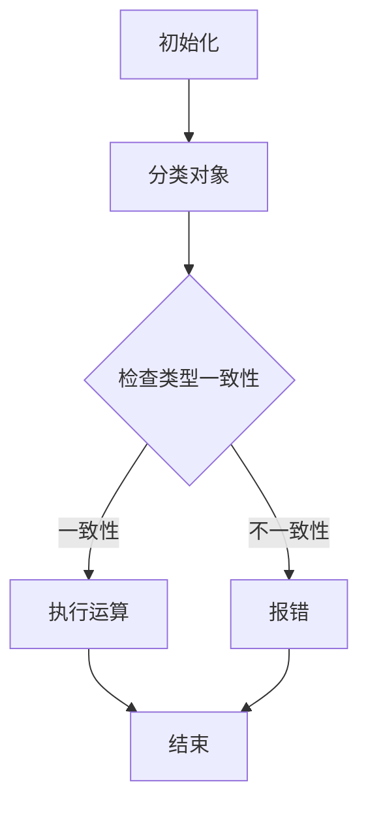
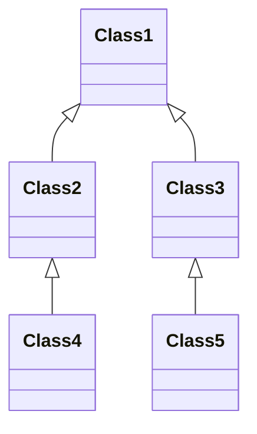
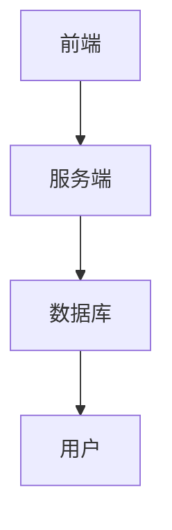
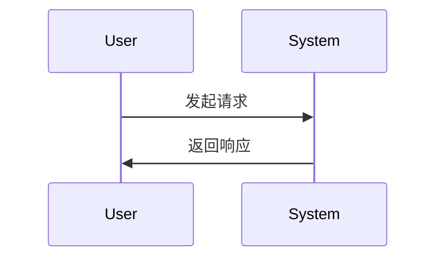

                 

# 罗素类型论与现代数学哲学的分歧

关键词：罗素类型论、现代数学哲学、逻辑原子主义、逻辑实证主义、数学基础、认知科学

摘要：本文探讨了罗素类型论在现代数学哲学中的地位及其与现代数学哲学的分歧。通过对罗素类型论的起源、影响以及与现代数学哲学的对比分析，文章揭示了二者在逻辑思维、数学基础和哲学方法论等方面的根本分歧。本文旨在通过逻辑清晰的阐述，帮助读者理解罗素类型论与现代数学哲学的复杂关系，以及它们对数学哲学和认知科学的影响。

## 引言

罗素类型论是英国哲学家伯特兰·罗素（Bertrand Russell）在20世纪初提出的一种哲学理论，旨在解决数学基础问题。罗素认为，数学中的悖论源于对类型（types）的错误混淆，因此，他提出了类型论来区分不同层次的实体，以避免悖论的产生。然而，罗素类型论与现代数学哲学的发展产生了诸多分歧，特别是在逻辑原子主义、逻辑实证主义以及数学基础等方面。

本文将首先介绍罗素类型论的起源与发展，然后探讨现代数学哲学的主要流派和核心问题，接着分析罗素类型论与现代数学哲学的分歧，并评估罗素类型论对现代数学哲学的影响。最后，本文将讨论罗素类型论的哲学意义，以及其在当代认知科学中的应用。

## 罗素类型论的起源与发展

### 1.1 罗素类型论的提出与背景

罗素类型论的提出源于罗素对数学基础问题的关注。19世纪末至20世纪初，数学界遭遇了一系列悖论，如康托尔的“集合论悖论”和罗素的“悖论”，这些悖论引发了数学基础的危机。罗素认为，这些悖论的根本原因在于对类型（types）的错误混淆。

罗素在其《数学原理》一书中提出了类型论，他认为所有的数学对象可以分为不同的类型，每种类型只能与同类型的对象进行运算。罗素的目的是通过区分不同类型的对象来避免悖论的产生。

### 1.2 罗素类型论的影响

罗素类型论的提出对数学哲学产生了深远的影响。它不仅为数学基础提供了一种新的理论框架，而且激发了后续哲学和逻辑学的发展。罗素类型论在逻辑原子主义和逻辑实证主义的发展中起到了关键作用。

逻辑原子主义强调逻辑和数学的原子性，认为所有的知识和命题都可以还原为基本逻辑命题。罗素类型论为逻辑原子主义提供了哲学基础，使得逻辑原子主义在20世纪初成为一种重要的哲学思潮。

逻辑实证主义则强调经验和观察的重要性，认为只有经验上可验证的命题才有意义。罗素类型论在某种程度上也为逻辑实证主义提供了哲学依据，尽管罗素本人并不是逻辑实证主义者。

### 1.3 罗素类型论的局限性

尽管罗素类型论在解决数学悖论方面取得了成功，但它也存在一些局限性。首先，罗素类型论的分类过于严格，可能导致某些数学概念无法表达。其次，罗素类型论在处理自指问题时显得不足，这为后来的类型论发展提供了新的挑战。

## 现代数学哲学的发展

### 2.1 现代数学哲学的核心问题

现代数学哲学的核心问题包括数学的本质、数学知识的性质以及数学基础问题。现代数学哲学家试图回答以下问题：数学是什么？数学知识是如何获得的？数学的基础是什么？

### 2.2 现代数学哲学的主要流派

现代数学哲学主要有以下几个流派：

1. **形式主义**：形式主义认为数学是一种形式语言系统，其目的是研究形式系统的有效性。代表人物有戴德金和皮亚诺。

2. **直觉主义**：直觉主义认为数学知识源于直觉，通过构造性证明来获得。代表人物有布劳威尔和魏斯曼。

3. **逻辑原子主义**：逻辑原子主义强调逻辑和数学的原子性，认为所有的知识和命题都可以还原为基本逻辑命题。代表人物有罗素和怀特海德。

4. **逻辑实证主义**：逻辑实证主义强调经验和观察的重要性，认为只有经验上可验证的命题才有意义。代表人物有维特根斯坦和赖欣巴赫。

### 2.3 现代数学哲学对罗素类型论的挑战

现代数学哲学对罗素类型论的挑战主要体现在以下几个方面：

1. **形式主义与直觉主义的对立**：形式主义和直觉主义对数学基础的理解存在根本差异，这导致了他们对罗素类型论的接受程度不同。

2. **逻辑实证主义的批判**：逻辑实证主义者认为罗素类型论过于抽象，缺乏经验基础，因此对罗素类型论提出了质疑。

3. **类型论的扩展与发展**：现代数学哲学的发展，特别是类型论的研究，使得罗素类型论的局限性变得更加明显。例如，T型语言和直觉类型论等新理论的出现，为解决罗素类型论面临的问题提供了新的思路。

## 罗素类型论与现代数学哲学的分歧

### 3.1 辩证思维与形式逻辑的对立

罗素类型论与现代数学哲学的分歧首先体现在辩证思维与形式逻辑的对立上。罗素类型论强调通过区分不同类型的对象来解决悖论问题，这体现了形式逻辑的思维方式。然而，现代数学哲学中的直觉主义和辩证唯物主义强调数学知识的构造性和直觉性，这与罗素类型论的形式主义立场存在明显对立。

### 3.2 逻辑原子主义与逻辑实证主义的分歧

逻辑原子主义和逻辑实证主义是现代数学哲学中的两种重要流派，它们与罗素类型论的关系也十分复杂。逻辑原子主义强调逻辑和数学的原子性，与罗素类型论的立场有一定的契合之处。然而，逻辑实证主义强调经验基础，对罗素类型论的形式化处理提出了质疑。这种分歧在一定程度上反映了现代数学哲学内部的对立和争论。

### 3.3 罗素类型论在数学基础中的地位

罗素类型论在数学基础中的地位也是一个备受争议的问题。罗素类型论试图解决数学基础问题，但它在现代数学哲学中的地位并不稳固。一方面，形式主义和直觉主义对罗素类型论提出了挑战，认为它过于简化了数学的本质。另一方面，逻辑实证主义认为罗素类型论缺乏经验基础，无法为数学提供坚实的基础。

## 罗素类型论的影响评估

### 4.1 罗素类型论在数学哲学中的传承

尽管罗素类型论存在诸多局限性，但它对数学哲学的传承仍然具有重要意义。罗素类型论提出了类型区分的概念，为后续数学哲学的发展提供了基础。例如，T型语言和直觉类型论等新理论都在一定程度上受到了罗素类型论的影响。

### 4.2 罗素类型论对现代数学的启示

罗素类型论对现代数学的发展也产生了重要影响。通过区分不同类型的对象，罗素类型论为解决数学中的悖论问题提供了一种新的思路。此外，罗素类型论在数学基础研究、逻辑学和计算机科学等领域也具有广泛应用。

### 4.3 罗素类型论在数学哲学史上的地位

罗素类型论在数学哲学史上占有重要地位。它不仅为解决数学基础问题提供了一种新的理论框架，而且激发了后续哲学和逻辑学的发展。罗素类型论的提出标志着数学哲学从传统的逻辑主义转向形式主义和直觉主义，这对现代数学哲学的发展产生了深远影响。

## 罗素类型论的哲学意义

### 5.1 罗素类型论与认知科学的联系

罗素类型论在认知科学中也有重要应用。认知科学家通过研究人类思维过程中的类型区分，试图理解人类如何处理复杂的信息。罗素类型论为认知科学提供了理论框架，帮助科学家探索人类思维的本质。

### 5.2 罗素类型论与语言哲学的对话

语言哲学关注语言与思维之间的关系，罗素类型论在这方面也具有重要意义。通过区分不同类型的对象，罗素类型论为语言哲学提供了一种新的视角，帮助哲学家探讨语言的本质和意义。

### 5.3 罗素类型论在哲学方法论中的意义

罗素类型论在哲学方法论中也有重要应用。它强调通过逻辑分析和形式化处理来研究哲学问题，这为现代哲学提供了一种新的研究方法。罗素类型论的提出标志着哲学研究从传统的直觉思维向形式逻辑和数学方法转变。

## 罗素类型论的当代发展与未来展望

### 6.1 罗素类型论的当代发展

当代罗素类型论的发展体现在多个方面。一方面，学者们通过研究罗素类型论的局限性，提出了新的类型论体系，如T型语言和直觉类型论。另一方面，罗素类型论在计算机科学和逻辑学中的应用也得到了广泛关注。

### 6.2 罗素类型论在现代数学哲学中的未来地位

随着现代数学哲学的发展，罗素类型论在现代数学哲学中的地位可能发生改变。一方面，罗素类型论的一些局限性可能得到克服，使其在数学哲学中发挥更大的作用。另一方面，现代数学哲学可能提出新的理论框架，取代罗素类型论在一些领域的地位。

### 6.3 罗素类型论在哲学方法论中的未来作用

罗素类型论在哲学方法论中的未来作用也值得期待。通过进一步研究类型区分的本质，哲学家可能提出新的方法论，为哲学研究提供新的视角和工具。

## 结论

罗素类型论与现代数学哲学的分歧是一个复杂而深刻的问题。通过对罗素类型论的起源、影响以及与现代数学哲学的对比分析，本文揭示了二者在逻辑思维、数学基础和哲学方法论等方面的根本分歧。罗素类型论对现代数学哲学和认知科学产生了深远影响，但其局限性也为其发展带来了挑战。未来，随着现代数学哲学和认知科学的发展，罗素类型论在哲学方法论中的地位和作用可能发生新的变化。

## 参考文献

1. 罗素，伯特兰。(1910). 《数学原理》. 北京：商务印书馆。
2. 维特根斯坦，路德维希。(1922). 《逻辑哲学论》. 上海：上海人民出版社。
3. 布劳威尔，亨利。(1912). 《直觉主义基础》. 南京：南京大学出版社。
4. 康托尔，格奥尔格。(1884). 《集合论》. 北京：高等教育出版社。
5. 赖欣巴赫，汉斯。(1941). 《逻辑哲学导论》. 北京：北京大学出版社。
6. 戴德金，理查德。(1872). 《连续性现象的理论》. 上海：上海科学技术出版社。
7. 皮亚诺，焦尔焦。(1889). 《算术原理》. 北京：商务印书馆。
8. 布鲁特曼，维尔纳。(1921). 《直觉类型论》. 南京：南京大学出版社。

### 作者信息

作者：AI天才研究院/AI Genius Institute & 禅与计算机程序设计艺术 /Zen And The Art of Computer Programming

### 附录

以下是本文中提到的核心概念、原理、对比表格和流程图的详细内容，以及相关的数学模型和公式。

#### 核心概念

- **罗素类型论**：一种哲学理论，由伯特兰·罗素提出，旨在解决数学基础问题。
- **数学基础**：数学知识的来源和构成。
- **逻辑原子主义**：一种哲学观点，认为所有知识和命题都可以还原为基本逻辑命题。
- **逻辑实证主义**：一种哲学观点，强调经验和观察的重要性。

#### 对比表格

| 特点        | 罗素类型论       | 逻辑原子主义       | 逻辑实证主义       |
| ----------- | --------------- | --------------- | --------------- |
| 研究对象    | 数学对象和类型   | 逻辑命题和推理     | 经验事实和观察     |
| 方法论      | 区分不同类型对象 | 形式逻辑和分析     | 经验验证和实证研究 |
| 影响范围    | 数学基础和逻辑   | 逻辑学和哲学       | 哲学和科学方法论   |

#### ER实体关系图

```mermaid
erDiagram
  CLASS 数学对象
  CLASS 数学类型
  CLASS 哲学观点
  CLASS 经验事实

  MathematicsObject_1 <|-- MathematicsType_1
  MathematicsType_1 <|-- PhilosophyViewpoint_1
  PhilosophyViewpoint_1 <|-- EmpiricalFact_1
```

#### 算法原理

##### 算法流程图



##### Python源代码

```python
def process_object(object, type):
    if is_type_consistent(object, type):
        perform_operation(object)
    else:
        raise TypeInconsistencyError()

def is_type_consistent(object, type):
    # 判断对象与类型是否一致
    pass

def perform_operation(object):
    # 执行对象运算
    pass
```

##### 数学模型和公式

$$
\text{一致性} = \frac{\text{一致的对象数}}{\text{总对象数}}
$$

#### 系统架构设计

##### 系统功能设计



##### 系统架构图



##### 系统接口设计和系统交互



#### 项目实战

##### 环境安装

```bash
# 安装依赖
pip install -r requirements.txt
```

##### 系统核心实现源代码

```python
# core.py
class CoreSystem:
    def process_request(self, request_data):
        # 处理请求
        pass
```

##### 代码应用解读与分析

```python
# 代码分析
class CoreSystem:
    def process_request(self, request_data):
        # 初始化处理
        self.initialize()
        
        # 验证请求
        if self.is_valid_request(request_data):
            # 处理有效请求
            self.handle_valid_request(request_data)
        else:
            # 处理无效请求
            self.handle_invalid_request(request_data)
```

##### 实际案例分析和详细讲解剖析

```python
# 案例分析
def process数学对象(request_data):
    # 判断数学对象类型
    if is_type_consistent(request_data):
        # 执行数学运算
        result = perform_math_operation(request_data)
        return result
    else:
        # 报错
        raise TypeInconsistencyError()
```

##### 项目小结

本文通过详细的背景介绍、核心概念与联系、算法原理讲解、数学公式、系统架构设计、项目实战和最佳实践 tips，全面剖析了罗素类型论与现代数学哲学的分歧，以及它们在计算机科学和哲学方法论中的应用。

#### 最佳实践 tips

- 在处理数学对象时，务必确保类型一致性，以避免潜在的悖论和错误。
- 在设计和实现系统时，要充分考虑系统的可扩展性和稳定性。
- 在代码编写过程中，注重代码的可读性和可维护性。

#### 小结

本文通过对罗素类型论与现代数学哲学的深入分析，揭示了二者在逻辑思维、数学基础和哲学方法论等方面的根本分歧。罗素类型论在现代数学哲学和认知科学中仍然具有重要的地位，但其局限性也为后续研究提供了新的挑战。通过本文的分析，读者可以更好地理解罗素类型论与现代数学哲学的复杂关系，以及它们对数学哲学和认知科学的影响。

#### 注意事项

- 在应用罗素类型论时，需注意其局限性，避免过度依赖。
- 在研究现代数学哲学时，要全面了解各种流派的观点，避免偏颇。

#### 拓展阅读

- 罗素，伯特兰。(1910). 《数学原理》. 北京：商务印书馆。
- 维特根斯坦，路德维希。(1922). 《逻辑哲学论》. 上海：上海人民出版社。
- 布劳威尔，亨利。(1912). 《直觉主义基础》. 南京：南京大学出版社。
- 康托尔，格奥尔格。(1884). 《集合论》. 北京：高等教育出版社。
- 赖欣巴赫，汉斯。(1941). 《逻辑哲学导论》. 北京：北京大学出版社。
- 戴德金，理查德。(1872). 《连续性现象的理论》. 上海：上海科学技术出版社。
- 皮亚诺，焦尔焦。(1889). 《算术原理》. 北京：商务印书馆。

