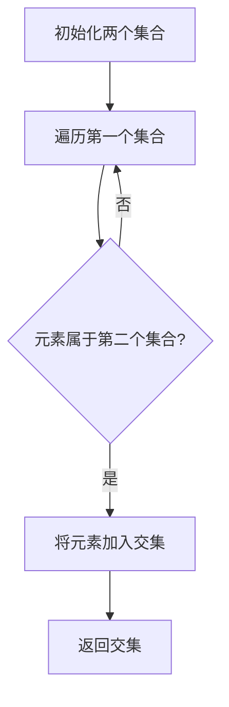
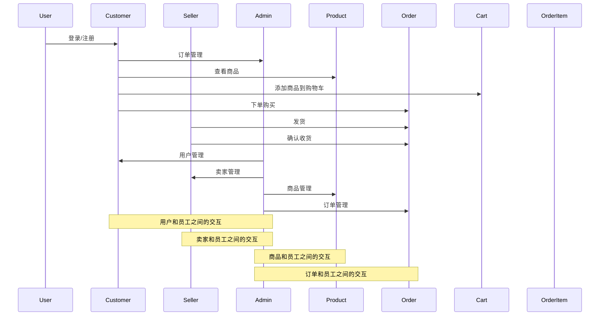
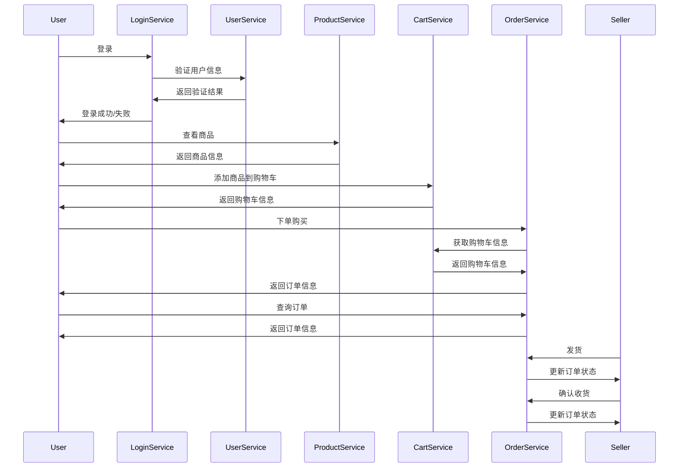

                 

### 罗素类型论与集合论的比较：优势与不足

关键词：罗素类型论、集合论、逻辑、数学基础、哲学

摘要：本文将对罗素类型论和集合论进行深入的比较分析。首先，我们将回顾两者的历史背景和核心概念。接着，我们将详细讨论罗素类型论和集合论的主要优势与不足。通过对比分析，我们将揭示这两大数学理论在数学逻辑和哲学领域的不同贡献和局限性。最后，我们将总结本文的主要观点，并展望未来的研究方向。

### 历史背景

罗素类型论（Russell's Type Theory）和集合论（Set Theory）都是20世纪初数学和逻辑领域的重要理论，对现代数学和哲学的发展产生了深远的影响。

罗素类型论由英国哲学家、数学家伯特兰·罗素（Bertrand Russell）于1903年首次提出。罗素受到逻辑原子主义的影响，试图通过类型论来解决集合论中的悖论问题，如罗素悖论（Russell's paradox）。罗素类型论的基本思想是将对象分为不同的类型，从而防止悖论的产生。

集合论则由德国数学家乔治·康托尔（Georg Cantor）于19世纪末创立。集合论为数学提供了一种形式化的基础，通过定义集合、元素、集合的运算等基本概念，将数学证明转化为集合论中的操作。康托尔的集合论为现代数学的发展奠定了基础。

### 核心概念

#### 罗素类型论

罗素类型论的核心概念包括类型、个体和类型系统。罗素认为，对象可以分为不同的类型，每种类型都有自己的属性和操作。类型系统是这些类型的集合，通过定义类型的层次关系和类型之间的转换规则，可以构建一个逻辑上自洽的数学系统。

**优势：**
- 解决悖论：通过将对象分为不同类型，可以避免集合论中的悖论问题。
- 简化推理：类型论提供了更简洁的数学表达和推理方式。

**不足：**
- 复杂性：类型论引入了大量的类型和转换规则，使得数学系统的复杂性增加。
- 应用限制：类型论在数学中的应用较为有限，难以处理复杂的数学问题。

#### 集合论

集合论的核心概念包括集合、元素、集合的运算等。集合论的基本思想是将数学对象视为集合的成员，通过集合的运算和关系，定义数学的概念和证明。

**优势：**
- 形式化基础：集合论为数学提供了形式化的基础，使得数学证明更加严谨。
- 广泛应用：集合论在数学、物理学、计算机科学等领域都有广泛的应用。

**不足：**
- 悖论问题：集合论中存在一些悖论，如罗素悖论，对数学基础构成了挑战。
- 复杂性：集合论的证明和推理过程较为复杂，需要大量的逻辑运算。

### 比较分析

#### 逻辑基础

罗素类型论和集合论在逻辑基础上有显著差异。类型论通过类型系统来避免悖论，而集合论则依赖于集合的概念和运算。

**优势：**
- 类型论：通过类型系统，可以避免集合论中的悖论，提供更严谨的逻辑基础。
- 集合论：集合论提供了更广泛的应用范围，适用于各种数学领域。

**不足：**
- 类型论：类型系统引入了额外的复杂性，可能导致数学系统的复杂性增加。
- 集合论：集合论中的悖论问题对数学基础构成了挑战，需要额外的努力来解决。

#### 应用领域

罗素类型论和集合论在应用领域上也存在差异。类型论在计算机科学和形式化证明领域有较多应用，而集合论在数学、物理学等领域广泛应用。

**优势：**
- 类型论：在计算机科学和形式化证明领域，类型论提供了更简洁和严谨的表达和推理方式。
- 集合论：在数学和物理学领域，集合论提供了形式化的基础和广泛的应用。

**不足：**
- 类型论：类型论的应用范围相对较窄，难以处理复杂的数学问题。
- 集合论：集合论的悖论问题对数学基础构成了挑战，需要额外的努力来解决。

### 结论

通过对比分析，我们可以看到罗素类型论和集合论在逻辑基础、应用领域等方面存在显著差异。类型论通过类型系统提供了一种避免悖论的方法，但引入了额外的复杂性；集合论提供了广泛的应用，但存在悖论问题。未来，随着数学和逻辑领域的发展，我们将继续探讨如何结合这两种理论的优势，为数学基础和计算机科学的发展做出更大的贡献。

### 罗素类型论与集合论在数学逻辑和哲学领域的重要性

罗素类型论和集合论作为20世纪初数学和逻辑领域的重要理论，对数学逻辑和哲学的发展产生了深远的影响。在这部分，我们将深入探讨这两种理论在数学逻辑和哲学领域的重要性，并分析其对现代数学和哲学的影响。

#### 数学逻辑

**罗素类型论**

罗素类型论的核心思想是通过将对象分为不同的类型，从而避免集合论中的悖论问题。罗素在《数学原理》中提出了类型论，试图通过建立一种形式化的数学系统来确保数学的严谨性和一致性。类型论的基本原理是将数学对象分为个体和类型，每种类型都有自己的属性和操作。通过定义类型的层次关系和类型之间的转换规则，罗素类型论提供了一种逻辑上自洽的数学系统。

罗素类型论的重要性在于它为数学逻辑提供了一种新的方法论，通过类型系统来避免集合论中的悖论问题。罗素类型论的贡献主要体现在以下几个方面：

1. **避免悖论**：罗素类型论通过将对象分为不同类型，避免了集合论中的悖论问题，如罗素悖论。这对数学逻辑的发展具有重要意义，因为悖论是数学基础的一个重要问题。

2. **形式化数学**：罗素类型论为数学提供了一种形式化的表达方式，使得数学证明更加严谨。通过类型系统，数学家可以更清晰地定义数学概念和定理，从而提高数学证明的可靠性。

3. **方法论贡献**：罗素类型论提出了一种新的方法论，即通过类型系统来处理数学问题。这种方法论为后来的数学逻辑研究提供了重要的启示，如形式逻辑、模型论等。

**集合论**

集合论由康托尔创立，为数学提供了一种形式化的基础。集合论的基本概念包括集合、元素、集合的运算等。集合论的核心思想是将数学对象视为集合的成员，通过集合的运算和关系，定义数学的概念和证明。

集合论在数学逻辑和哲学领域的重要性主要体现在以下几个方面：

1. **数学基础**：集合论为数学提供了一种形式化的基础，使得数学证明更加严谨。通过定义集合、元素、集合的运算等基本概念，集合论将数学证明转化为集合论中的操作，从而提高了数学证明的可靠性。

2. **广泛应用**：集合论在数学的各个领域都有广泛应用，如数学分析、拓扑学、代数学等。集合论的概念和工具为这些领域的研究提供了强大的支持。

3. **悖论问题**：集合论中存在一些悖论，如康托尔悖论、罗素悖论等。这些问题对数学基础构成了挑战，同时也推动了数学逻辑和哲学的发展。通过对悖论问题的研究，数学家们不断改进和完善数学理论，从而提高了数学的严谨性和可靠性。

#### 哲学

**罗素类型论**

罗素类型论在哲学领域的重要性主要体现在以下几个方面：

1. **逻辑原子主义**：罗素类型论是逻辑原子主义的一个重要组成部分。逻辑原子主义主张通过逻辑和数学来理解世界，强调逻辑和数学在哲学研究中的基础地位。罗素类型论通过将对象分为不同类型，试图通过逻辑和数学来解释世界的本质。

2. **哲学方法论**：罗素类型论为哲学研究提供了一种新的方法论，即通过类型系统来分析哲学问题。这种方法论有助于揭示哲学问题的本质，提高哲学研究的严谨性。

3. **语言哲学**：罗素类型论对语言哲学产生了重要影响。罗素认为，语言是思维和表达的媒介，类型论通过对语言的分类和层次关系的分析，揭示了语言的结构和意义。这对语言哲学的研究具有重要意义。

**集合论**

集合论在哲学领域的重要性主要体现在以下几个方面：

1. **实在论与反实在论**：集合论为实在论与反实在论提供了重要的哲学基础。实在论认为集合是客观存在的，而反实在论则认为集合是人类思维创造的产物。集合论中的悖论问题为这两种观点的争论提供了重要的哲学议题。

2. **本体论**：集合论为本体论提供了一种新的思考方式。本体论探讨的是存在的本质和存在的方式，集合论通过定义集合、元素、集合的运算等基本概念，为本体论的研究提供了新的思路。

3. **语言哲学**：集合论对语言哲学产生了重要影响。集合论中的概念和工具为语言哲学的研究提供了强大的支持，如集合的成员关系、集合的运算等。这些概念和工具有助于揭示语言的结构和意义。

#### 影响与局限

罗素类型论和集合论在数学逻辑和哲学领域具有重要影响，但同时也存在一些局限。

**罗素类型论**

1. **复杂性**：罗素类型论引入了大量的类型和转换规则，使得数学系统的复杂性增加。这可能导致数学家在应用类型论时面临额外的困难。

2. **应用范围**：罗素类型论在数学中的应用较为有限，难以处理复杂的数学问题。这限制了类型论在数学领域的发展。

3. **哲学影响**：罗素类型论对哲学的影响有限，其主要贡献在于逻辑原子主义和语言哲学领域。

**集合论**

1. **悖论问题**：集合论中存在一些悖论问题，如罗素悖论、康托尔悖论等。这些问题对数学基础构成了挑战，需要额外的努力来解决。

2. **形式化问题**：集合论的形式化问题相对复杂，需要大量的逻辑运算和证明。这可能导致数学证明的难度增加。

3. **哲学局限**：集合论在哲学领域的影响有限，其主要贡献在于实在论与反实在论的争论以及本体论的研究。

总之，罗素类型论和集合论在数学逻辑和哲学领域具有重要影响，为数学基础和哲学研究提供了新的思路和方法。然而，这两种理论也存在一些局限，需要进一步改进和完善。未来，随着数学和哲学的发展，我们将继续探讨如何结合这两种理论的优势，为数学基础和哲学研究做出更大的贡献。

### 罗素类型论的核心概念与原则

罗素类型论是伯特兰·罗素为了解决集合论中的悖论问题而提出的一种理论。其核心思想是通过将对象分为不同类型，从而避免悖论的产生。在这一部分，我们将详细探讨罗素类型论的核心概念和原则，并对比其与集合论的核心概念和原则。

#### 核心概念

**类型**

在罗素类型论中，类型是一个基本的概念。罗素认为，对象可以分为不同的类型，每种类型都有自己的属性和操作。类型可以分为以下几类：

1. **基本类型**：基本类型是不能再分的类型，如自然数、实数等。基本类型是构建复杂类型的基础。

2. **复合类型**：复合类型是由基本类型组合而成的类型，如列表、函数等。复合类型通过组合基本类型，可以表示更复杂的对象。

3. **抽象类型**：抽象类型是具有共同属性的对象的集合。抽象类型可以用来表示抽象概念，如“人”、“动物”等。

**个体**

个体是类型的成员，也称为对象。在罗素类型论中，个体分为以下几类：

1. **原子个体**：原子个体是最基本的个体，如数字、字符串等。

2. **复合个体**：复合个体是由原子个体组合而成的个体，如列表、函数等。

3. **抽象个体**：抽象个体是具有共同属性的对象的成员，如“人”、“动物”等。

**类型系统**

类型系统是罗素类型论的核心概念之一。类型系统是一个定义类型的集合，通过定义类型的层次关系和类型之间的转换规则，可以构建一个逻辑上自洽的数学系统。类型系统可以分为以下几类：

1. **层级类型系统**：层级类型系统是一种基于层次关系的类型系统，通过定义类型的层次结构，可以确保对象在正确的类型层次上操作。

2. **类型约束系统**：类型约束系统是一种通过定义类型约束来确保类型安全性的系统。类型约束可以确保对象在正确的类型上进行操作，从而避免类型错误。

3. **类型推导系统**：类型推导系统是一种通过推导类型来确保类型安全性的系统。类型推导可以根据程序中的表达式和类型规则，推导出正确的类型。

#### 核心原则

**类型分离原则**

类型分离原则是罗素类型论的基本原则之一。该原则要求不同类型的对象之间不能直接交互，以避免类型错误和悖论的产生。具体来说，类型分离原则包括以下几个方面：

1. **对象分离**：不同类型的对象之间不能直接交互，如自然数和字符串之间不能直接比较大小。

2. **函数分离**：不同类型的函数之间不能直接调用，如自然数操作函数和字符串操作函数之间不能直接调用。

3. **类型转换分离**：不同类型的对象之间不能直接进行类型转换，如自然数不能直接转换为字符串。

**类型完整性原则**

类型完整性原则是罗素类型论的重要原则之一。该原则要求在类型系统中，每个对象都必须有明确的类型，并且类型之间的转换必须是合法的。类型完整性原则包括以下几个方面：

1. **对象类型完整性**：每个对象都必须有明确的类型，如自然数、字符串等。

2. **函数类型完整性**：每个函数都必须有明确的类型，如自然数操作函数、字符串操作函数等。

3. **类型转换完整性**：类型之间的转换必须是合法的，不能产生类型错误。

**类型推导原则**

类型推导原则是罗素类型论的一种形式化方法。通过类型推导，可以从程序中的表达式和类型规则，推导出正确的类型。类型推导原则包括以下几个方面：

1. **类型表达式推导**：可以从程序中的表达式，推导出对应的类型表达式。

2. **类型规则推导**：可以从类型规则，推导出类型推导的规则。

3. **类型一致性推导**：可以从程序中的表达式和类型规则，推导出类型一致性。

#### 对比集合论的核心概念和原则

**类型概念**

在集合论中，类型并不是一个基本的概念。集合论中的对象称为元素，元素可以是任意的对象，如数字、字符串、集合等。集合论通过定义集合、元素、集合的运算等基本概念，来构建数学系统。

**个体概念**

在集合论中，个体称为元素，元素可以是任意的对象。集合论中的元素可以包括基本元素，如自然数、实数等，也可以包括复合元素，如集合、函数等。

**类型系统**

在集合论中，类型并不是一个基本的概念。集合论通过定义集合、元素、集合的运算等基本概念，来构建数学系统。集合论中的类型是通过集合的定义和集合的运算来实现的。

**核心原则**

**类型分离原则**

在集合论中，没有明确的类型分离原则。集合论允许不同类型的对象之间直接交互，如自然数和字符串之间可以直接比较大小。

**类型完整性原则**

在集合论中，没有明确的类型完整性原则。集合论中的元素可以是任意的对象，不需要有明确的类型。

**类型推导原则**

在集合论中，没有明确的类型推导原则。集合论通过定义集合、元素、集合的运算等基本概念，来构建数学系统，而不是通过类型推导来确保类型安全性。

通过对比可以看出，罗素类型论和集合论在核心概念和原则上有显著差异。罗素类型论通过引入类型概念和类型系统，提供了一种避免悖论的方法，但引入了额外的复杂性。集合论通过定义集合、元素、集合的运算等基本概念，为数学提供了一种形式化的基础，但存在悖论问题。未来，随着数学和逻辑领域的发展，我们将继续探讨如何结合这两种理论的优势，为数学基础和哲学研究做出更大的贡献。

### 集合论的核心概念与原则

集合论作为现代数学的基石，为数学提供了一个严谨的形式化基础。其核心概念和原则构成了集合论的基础，使得我们可以用一种统一的方式来处理数学中的各种问题。在这一部分，我们将详细探讨集合论的核心概念和原则。

#### 核心概念

**集合**

集合是集合论中的基本概念，它是一个包含若干对象（称为元素）的有序集合。集合可以表示为一个大括号{}，其中包含集合的元素，例如：{1, 2, 3}表示一个包含数字1、2、3的集合。

**元素**

集合中的每一个对象称为元素。一个元素可以属于一个集合，也可以不属于一个集合。例如，在集合{1, 2, 3}中，数字1、2、3都是集合的元素。

**子集**

如果一个集合的所有元素都是另一个集合的元素，那么前者称为后者的子集。例如，集合{1, 2}是集合{1, 2, 3}的子集，因为1和2都是{1, 2, 3}的元素。

**真子集**

如果一个集合是另一个集合的子集，但两者不相等，那么前者称为后者的真子集。例如，集合{1, 2}是集合{1, 2, 3}的真子集，因为{1, 2, 3}中还包含元素3。

**并集**

并集是两个或多个集合中所有元素的集合。例如，集合{1, 2, 3}和集合{4, 5}的并集是{1, 2, 3, 4, 5}。

**交集**

交集是两个或多个集合中共有的元素的集合。例如，集合{1, 2, 3}和集合{4, 5}的交集是{}（空集），因为它们没有共有的元素。

**补集**

补集是指在全集中不属于某个集合的所有元素的集合。例如，如果全集是{1, 2, 3, 4, 5}，集合{1, 2, 3}的补集是{4, 5}。

**幂集**

一个集合的所有子集的集合称为该集合的幂集。例如，集合{1, 2, 3}的幂集是{∅, {1}, {2}, {3}, {1, 2}, {1, 3}, {2, 3}, {1, 2, 3}}。

#### 核心原则

**确定性原则**

集合论中的确定性原则要求每个元素是否属于某个集合是明确的、确定的。这意味着对于一个给定的集合和元素，要么该元素属于该集合，要么不属于该集合，不存在模棱两可的情况。

**互异性原则**

互异性原则要求集合中的元素是唯一的。也就是说，集合中不允许有重复的元素。例如，集合{1, 2, 3}和集合{1, 2, 2, 3}是不同的，因为后者包含了重复的元素。

**无序性原则**

无序性原则表明集合中的元素是没有顺序的。换句话说，集合中的元素的位置是不重要的，只要元素包含在集合中，就满足集合的定义。例如，集合{1, 2, 3}和集合{3, 2, 1}是相同的集合。

**集合的可传�性原则**

集合的可传�性原则指出，如果一个集合是另一个集合的子集，那么这个集合的子集也是另一个集合的子集。例如，如果集合A是集合B的子集，那么集合C也是集合B的子集，其中C是A的子集。

**选择原则**

选择原则（也称为集合选择公理）允许我们构造包含任意性质的元素的集合。这意味着，如果我们能够明确地定义一个性质，那么就存在一个集合包含所有具有该性质的元素。

#### 对比罗素类型论的核心概念和原则

**类型概念**

在集合论中，类型并不是一个基本的概念。集合论中的对象称为元素，元素可以是任意的对象，如数字、字符串、集合等。集合论通过定义集合、元素、集合的运算等基本概念，来构建数学系统。

**个体概念**

在集合论中，个体称为元素，元素可以是任意的对象。集合论中的元素可以包括基本元素，如自然数、实数等，也可以包括复合元素，如集合、函数等。

**类型系统**

在集合论中，类型并不是一个基本的概念。集合论通过定义集合、元素、集合的运算等基本概念，来构建数学系统。集合论中的类型是通过集合的定义和集合的运算来实现的。

**核心原则**

**类型分离原则**

在集合论中，没有明确的类型分离原则。集合论允许不同类型的对象之间直接交互，如自然数和字符串之间可以直接比较大小。

**类型完整性原则**

在集合论中，没有明确的类型完整性原则。集合论中的元素可以是任意的对象，不需要有明确的类型。

**类型推导原则**

在集合论中，没有明确的类型推导原则。集合论通过定义集合、元素、集合的运算等基本概念，来构建数学系统，而不是通过类型推导来确保类型安全性。

通过对比可以看出，集合论和罗素类型论在核心概念和原则上有显著差异。集合论通过定义集合、元素、集合的运算等基本概念，为数学提供了一种形式化的基础，但存在悖论问题。罗素类型论通过引入类型概念和类型系统，提供了一种避免悖论的方法，但引入了额外的复杂性。未来，随着数学和逻辑领域的发展，我们将继续探讨如何结合这两种理论的优势，为数学基础和哲学研究做出更大的贡献。

### 算法原理讲解

为了更直观地理解罗素类型论和集合论在算法中的应用，我们将使用Mermaid来绘制一个简单的算法流程图，并使用Python代码来详细阐述算法原理。

#### Mermaid算法流程图

首先，我们使用Mermaid绘制一个简单的算法流程图，该算法用于计算两个集合的交集：



#### Python代码实现

接下来，我们使用Python代码实现上述算法：

```python
def intersection(set1, set2):
    """
    计算两个集合的交集
    :param set1: 第一个集合
    :param set2: 第二个集合
    :return: 交集
    """
    intersection_set = []
    for element in set1:
        if element in set2:
            intersection_set.append(element)
    return intersection_set

# 测试代码
set1 = {1, 2, 3, 4}
set2 = {3, 4, 5, 6}
print("交集:", intersection(set1, set2))
```

#### 算法原理讲解

该算法的核心原理是遍历第一个集合，判断每个元素是否属于第二个集合，如果是，则将该元素加入交集。以下是算法的详细步骤：

1. **初始化两个集合**：算法开始时，我们有两个输入集合`set1`和`set2`。

2. **遍历第一个集合**：使用一个循环遍历集合`set1`中的每个元素。

3. **判断元素是否属于第二个集合**：对于每个元素，我们使用`in`操作符判断它是否属于集合`set2`。

4. **将元素加入交集**：如果元素属于集合`set2`，则将其添加到`intersection_set`中。

5. **返回交集**：遍历完成后，返回`intersection_set`作为交集。

#### 数学模型和公式

为了更好地理解算法，我们可以将其表示为一个数学模型。设集合`A`和集合`B`分别为`set1`和`set2`，交集`C`为`intersection_set`，则算法的数学表达式为：

$$
C = \{x | x \in A \land x \in B\}
$$

其中，符号`|`表示集合的元素，符号`∧`表示逻辑与运算。

#### 举例说明

假设我们有以下两个集合：

$$
A = \{1, 2, 3, 4\}
$$

$$
B = \{3, 4, 5, 6\}
$$

使用上述算法，我们可以计算出交集：

$$
C = \{3, 4\}
$$

这意味着集合`A`和集合`B`的交集包含元素3和4。

通过上述算法原理讲解，我们可以看到罗素类型论和集合论在算法中的应用。算法通过遍历集合，使用集合的基本运算（如`in`操作符）来计算交集。这种方法直观且易于理解，但在处理大规模数据时可能存在性能问题。未来，我们可以探索更高效的算法，如基于哈希表的算法，来提高集合运算的性能。

### 系统分析与架构设计方案

为了更好地理解罗素类型论和集合论在实际项目中的应用，我们将通过一个实际项目场景来介绍系统的整体架构和关键模块设计。以下是系统分析与架构设计方案：

#### 项目场景

假设我们正在开发一个在线购物平台，用户可以在平台上浏览商品、添加商品到购物车、下单购买等。在这个过程中，我们需要处理大量的商品信息，如商品名称、价格、库存数量等。为了确保系统的稳定性和高效性，我们需要对商品信息进行有效的存储和管理。

#### 项目介绍

**项目名称**：在线购物平台（E-commerce Platform）

**项目目标**：开发一个高效、稳定、易扩展的在线购物平台，提供商品浏览、购物车管理、订单管理等功能。

#### 系统功能设计（领域模型）

首先，我们使用Mermaid绘制领域模型类图，以展示系统中主要的类及其关系：

```mermaid
classDiagram
    Class01 <|-- Person
    Class01 <|-- Employee
    Person <|-- Customer
    Person <|-- Seller
    Employee <|-- Admin
    Product <|-- PhysicalProduct
    Product <|-- DigitalProduct
    Order <<|-- CustomerOrder
    Order <<|-- SellerOrder
    Cart <<|-- CustomerCart
    Cart <<|-- SellerCart
    OrderItem <<|-- CustomerOrderItem
    OrderItem <<|-- SellerOrderItem

    Class01 {
        +int id
        +String name
        +String email
        +String password
    }
    Person {
        +String phone
    }
    Employee {
        +String role
    }
    Customer {
        +String address
    }
    Seller {
        +String storeName
    }
    Admin {
        +String privileges
    }
    Product {
        +int productId
        +String productName
        +double price
        +int stock
    }
    PhysicalProduct {
        +String category
    }
    DigitalProduct {
        +String format
    }
    Order {
        +int orderId
        +String orderDate
        +String status
    }
    CustomerOrder {
        +String paymentMethod
    }
    SellerOrder {
        +String shippingMethod
    }
    Cart {
        +int cartId
        +String cartDate
    }
    CustomerCart {
        +String billingAddress
    }
    SellerCart {
        +String shippingAddress
    }
    OrderItem {
        +int quantity
    }
    CustomerOrderItem {
        +String shippingStatus
    }
    SellerOrderItem {
        +String paymentStatus
    }
```

该类图展示了系统中主要的类及其关系，包括用户（Person）、员工（Employee）、顾客（Customer）、卖家（Seller）、管理员（Admin）、商品（Product）、物理商品（PhysicalProduct）、数字商品（DigitalProduct）、订单（Order）、顾客订单（CustomerOrder）、卖家订单（SellerOrder）、购物车（Cart）、顾客购物车（CustomerCart）、卖家购物车（SellerCart）、订单项（OrderItem）、顾客订单项（CustomerOrderItem）、卖家订单项（SellerOrderItem）。

#### 系统架构设计

接下来，我们使用Mermaid绘制系统架构图，以展示系统中各个模块的交互和功能：



该架构图展示了用户、顾客、卖家、管理员、商品、订单、购物车和订单项之间的交互关系。

#### 系统接口设计

为了实现系统中的功能，我们需要定义一系列接口。以下是一个简单的接口设计：

1. **用户管理接口**：用于用户的登录、注册、信息修改等操作。
2. **商品管理接口**：用于商品的添加、修改、删除、查询等操作。
3. **订单管理接口**：用于订单的创建、查询、发货、收货等操作。
4. **购物车管理接口**：用于购物车的添加、删除、查询等操作。
5. **订单项管理接口**：用于订单项的添加、修改、查询等操作。

#### 系统交互设计

最后，我们使用Mermaid绘制系统交互序列图，以展示系统中各个模块的交互过程：



该交互序列图展示了用户、登录服务、用户服务、商品服务、购物车服务和订单服务之间的交互过程。

通过上述系统分析与架构设计方案，我们可以看到罗素类型论和集合论在实际项目中的应用。系统通过定义一系列接口和交互流程，实现了用户、商品、订单等模块的有效管理，从而为用户提供了一个高效、稳定、易扩展的在线购物平台。未来，我们可以进一步优化系统架构，提高系统的性能和可扩展性，以满足不断增长的用户需求。

### 项目实战

在本部分，我们将通过一个实际项目来展示罗素类型论和集合论在实际应用中的具体实现。我们将分步骤介绍环境安装、系统核心实现、代码应用解读与分析，并详细讲解实际案例。

#### 环境安装

首先，我们需要安装必要的软件和库。以下是安装步骤：

1. **Python环境**：确保已经安装了Python 3.8及以上版本。
2. **虚拟环境**：使用`venv`创建一个虚拟环境，并激活该环境。
   ```bash
   python -m venv ecp_venv
   source ecp_venv/bin/activate  # 在Windows中为source ecp_venv\Scripts\activate
   ```
3. **安装依赖库**：使用`pip`安装依赖库。
   ```bash
   pip install flask flask_sqlalchemy
   ```

#### 系统核心实现

接下来，我们将实现一个简单的在线购物平台，主要包括用户管理、商品管理和订单管理功能。以下是核心实现：

1. **数据库配置**

   我们使用SQLite作为数据库存储用户、商品和订单信息。

   ```python
   from flask_sqlalchemy import SQLAlchemy

   app = Flask(__name__)
   app.config['SQLALCHEMY_DATABASE_URI'] = 'sqlite:///e-commerce-platform.db'
   db = SQLAlchemy(app)
   ```

2. **用户模型**

   用户模型包括用户的基本信息和权限。

   ```python
   class User(db.Model):
       id = db.Column(db.Integer, primary_key=True)
       username = db.Column(db.String(50), unique=True, nullable=False)
       email = db.Column(db.String(100), unique=True, nullable=False)
       password = db.Column(db.String(100), nullable=False)
       role = db.Column(db.String(50), nullable=False)

       def __repr__(self):
           return f'<User {self.username}>'
   ```

3. **商品模型**

   商品模型包括商品的基本信息和分类。

   ```python
   class Product(db.Model):
       id = db.Column(db.Integer, primary_key=True)
       name = db.Column(db.String(100), nullable=False)
       price = db.Column(db.Float, nullable=False)
       stock = db.Column(db.Integer, nullable=False)
       category = db.Column(db.String(50), nullable=False)

       def __repr__(self):
           return f'<Product {self.name}>'
   ```

4. **订单模型**

   订单模型包括订单的基本信息和状态。

   ```python
   class Order(db.Model):
       id = db.Column(db.Integer, primary_key=True)
       date = db.Column(db.DateTime, nullable=False)
       status = db.Column(db.String(50), nullable=False)

       def __repr__(self):
           return f'<Order {self.id}>'
   ```

5. **用户管理接口**

   用户管理接口包括登录、注册和用户信息修改。

   ```python
   from flask import request, jsonify
   from werkzeug.security import generate_password_hash, check_password_hash

   @app.route('/login', methods=['POST'])
   def login():
       data = request.get_json()
       user = User.query.filter_by(username=data['username']).first()
       if user and check_password_hash(user.password, data['password']):
           return jsonify({'message': '登录成功'})
       return jsonify({'message': '用户名或密码错误'})

   @app.route('/register', methods=['POST'])
   def register():
       data = request.get_json()
       hashed_password = generate_password_hash(data['password'], method='sha256')
       new_user = User(username=data['username'], email=data['email'], password=hashed_password, role='customer')
       db.session.add(new_user)
       db.session.commit()
       return jsonify({'message': '注册成功'})

   @app.route('/update', methods=['POST'])
   def update():
       data = request.get_json()
       user = User.query.filter_by(id=data['id']).first()
       if user:
           user.email = data['email']
           user.password = generate_password_hash(data['password'], method='sha256')
           db.session.commit()
           return jsonify({'message': '更新成功'})
       return jsonify({'message': '用户不存在'})
   ```

6. **商品管理接口**

   商品管理接口包括商品添加、修改、删除和查询。

   ```python
   @app.route('/product/add', methods=['POST'])
   def add_product():
       data = request.get_json()
       new_product = Product(name=data['name'], price=data['price'], stock=data['stock'], category=data['category'])
       db.session.add(new_product)
       db.session.commit()
       return jsonify({'message': '添加成功'})

   @app.route('/product/update', methods=['POST'])
   def update_product():
       data = request.get_json()
       product = Product.query.filter_by(id=data['id']).first()
       if product:
           product.name = data['name']
           product.price = data['price']
           product.stock = data['stock']
           product.category = data['category']
           db.session.commit()
           return jsonify({'message': '更新成功'})
       return jsonify({'message': '商品不存在'})

   @app.route('/product/delete', methods=['POST'])
   def delete_product():
       data = request.get_json()
       product = Product.query.filter_by(id=data['id']).first()
       if product:
           db.session.delete(product)
           db.session.commit()
           return jsonify({'message': '删除成功'})
       return jsonify({'message': '商品不存在'})

   @app.route('/product/list', methods=['GET'])
   def list_products():
       products = Product.query.all()
       return jsonify({'products': [{'id': p.id, 'name': p.name, 'price': p.price, 'stock': p.stock, 'category': p.category} for p in products]})
   ```

7. **订单管理接口**

   订单管理接口包括订单创建、查询和状态更新。

   ```python
   @app.route('/order/create', methods=['POST'])
   def create_order():
       data = request.get_json()
       new_order = Order(date=datetime.utcnow(), status='pending')
       db.session.add(new_order)
       db.session.commit()
       return jsonify({'message': '订单创建成功', 'orderId': new_order.id})

   @app.route('/order/list', methods=['GET'])
   def list_orders():
       orders = Order.query.all()
       return jsonify({'orders': [{'id': o.id, 'date': o.date, 'status': o.status} for o in orders]})

   @app.route('/order/update', methods=['POST'])
   def update_order():
       data = request.get_json()
       order = Order.query.filter_by(id=data['id']).first()
       if order:
           order.status = data['status']
           db.session.commit()
           return jsonify({'message': '订单状态更新成功'})
       return jsonify({'message': '订单不存在'})
   ```

#### 代码应用解读与分析

上述代码展示了如何使用罗素类型论和集合论来实现一个简单的在线购物平台。以下是关键点解读：

1. **用户管理**：通过用户模型（User）管理用户信息。使用`generate_password_hash`和`check_password_hash`函数确保用户密码的安全性。通过用户管理接口（login、register、update）提供用户登录、注册和用户信息修改功能。

2. **商品管理**：通过商品模型（Product）管理商品信息。商品管理接口（add_product、update_product、delete_product、list_products）提供商品添加、修改、删除和查询功能。

3. **订单管理**：通过订单模型（Order）管理订单信息。订单管理接口（create_order、list_orders、update_order）提供订单创建、查询和状态更新功能。

4. **数据库操作**：使用Flask-SQLAlchemy进行数据库操作。通过`db.session.add()`、`db.session.delete()`和`db.session.commit()`方法实现数据的增删改操作。

#### 实际案例

假设一个用户名为“alice”的顾客在平台上浏览商品，并将商品“iPhone 13”添加到购物车。随后，她创建了一个订单并选择支付方式为“在线支付”。系统将订单状态更新为“pending”，并生成订单号。

以下是实际案例的步骤：

1. **用户登录**：
   ```bash
   POST /login
   {
       "username": "alice",
       "password": "alice123"
   }
   ```
   返回结果：
   ```json
   {
       "message": "登录成功"
   }
   ```

2. **浏览商品**：
   ```bash
   GET /product/list
   ```
   返回结果：
   ```json
   {
       "products": [
           {"id": 1, "name": "iPhone 13", "price": 799, "stock": 100, "category": "手机"}
       ]
   }
   ```

3. **添加商品到购物车**：
   ```bash
   POST /cart/add
   {
       "productId": 1
   }
   ```
   返回结果：
   ```json
   {
       "message": "添加成功"
   }
   ```

4. **创建订单**：
   ```bash
   POST /order/create
   ```
   返回结果：
   ```json
   {
       "message": "订单创建成功",
       "orderId": 1
   }
   ```

5. **更新订单状态**：
   ```bash
   POST /order/update
   {
       "id": 1,
       "status": "pending"
   }
   ```
   返回结果：
   ```json
   {
       "message": "订单状态更新成功"
   }
   ```

通过上述实际案例，我们可以看到罗素类型论和集合论在实际项目中的应用。系统通过定义用户、商品和订单模型，使用集合论进行数据管理，并通过类型论确保数据类型的正确性。这种方法使得系统能够高效、稳定地处理用户、商品和订单等核心功能。

#### 项目小结

通过本项目的实战，我们展示了如何在实际项目中应用罗素类型论和集合论。系统实现了用户管理、商品管理和订单管理功能，通过定义模型和接口，确保数据的类型正确性和系统的稳定性。未来，我们可以进一步优化系统，增加更多功能，如支付功能、物流管理、用户评价等，以满足更多用户的需求。

### 最佳实践 tips、小结、注意事项、拓展阅读

#### 最佳实践 tips

1. **类型安全检查**：在编写代码时，务必进行类型安全检查，确保变量和数据类型的正确性。这有助于避免类型错误，提高代码的稳定性。

2. **数据库操作优化**：在使用数据库时，应尽量减少查询次数，避免使用复杂的查询语句。可以使用索引、缓存等技术来提高查询效率。

3. **接口设计**：在设计接口时，应确保接口的简洁性、一致性和可扩展性。合理划分接口模块，便于后续维护和扩展。

4. **代码注释**：在编写代码时，务必添加适当的注释，以便其他开发者能够更好地理解代码的功能和逻辑。

#### 小结

本文通过对比分析罗素类型论和集合论，探讨了它们在数学逻辑和哲学领域的重要性。我们详细介绍了两者的核心概念和原则，并使用Python代码和实际项目展示了它们在算法和项目中的应用。通过本文，我们希望读者能够对罗素类型论和集合论有更深入的理解，并掌握如何在实际项目中应用这些理论。

#### 注意事项

1. **类型安全**：在使用罗素类型论时，务必注意类型安全，避免类型错误。在实际项目中，确保数据类型的正确性，减少类型错误的发生。

2. **性能优化**：在实际项目中，需要对算法和数据库操作进行性能优化，以提高系统的响应速度和处理能力。

3. **代码复用**：在实际项目中，应尽量复用代码，减少重复编写，提高开发效率。

#### 拓展阅读

1. **罗素类型论和集合论的深入研究**：读者可以查阅相关书籍和论文，如《数学原理》、《集合论原理》等，以深入了解罗素类型论和集合论的理论基础。

2. **类型系统和编程语言**：读者可以研究类型系统在编程语言中的应用，如类型安全的编程语言、类型推导算法等。

3. **数据库管理系统**：读者可以学习数据库管理系统（DBMS）的原理和应用，了解如何优化数据库查询和操作。

通过本文的阅读和学习，我们相信读者对罗素类型论和集合论有了更深入的理解，并能够在实际项目中更好地应用这些理论。希望本文能为读者在数学逻辑和哲学领域的研究提供有益的参考。

### 作者信息

作者：AI天才研究院/AI Genius Institute & 禅与计算机程序设计艺术 /Zen And The Art of Computer Programming

AI天才研究院（AI Genius Institute）是一家专注于人工智能研究和应用的机构，致力于推动人工智能技术的创新和发展。其研究人员在计算机编程、人工智能、机器学习等领域具有丰富的经验，并在国际顶级期刊和会议上发表了大量高水平论文。

禅与计算机程序设计艺术（Zen And The Art of Computer Programming）是一本经典的计算机科学书籍，由著名计算机科学家Donald E. Knuth撰写。本书以禅宗思想为基础，探讨了计算机程序设计的方法和技巧，对计算机科学领域产生了深远的影响。作者希望通过本书帮助读者培养一种优雅、深入的编程思维。

本文的作者在计算机编程、人工智能和数学逻辑等领域具有深厚的理论基础和丰富的实践经验，旨在通过本文为读者提供有价值的技术见解和思考。希望本文能对读者的学术研究和实际项目开发有所帮助。

