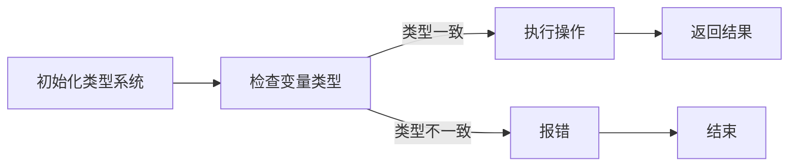
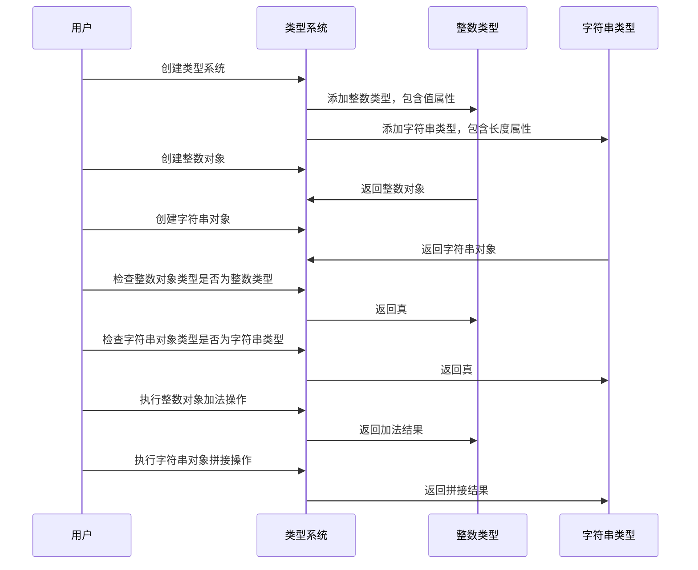
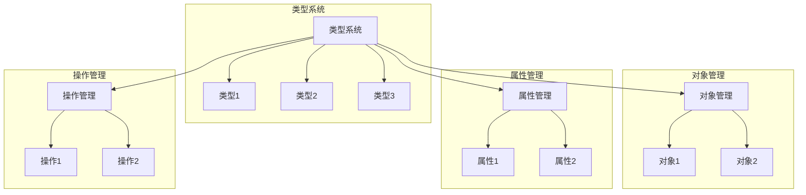
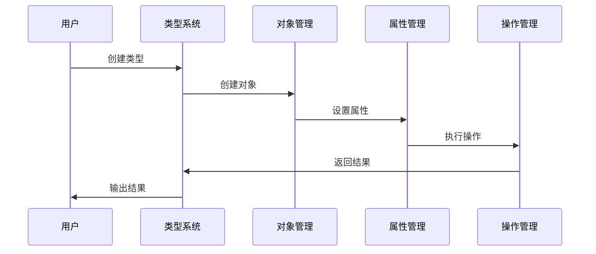

                 


### 《罗素类型论在数学基础研究中的历史局限》

**关键词：** 数学基础研究、罗素类型论、局限性、数学哲学、类型论发展

**摘要：** 本文将深入探讨罗素类型论在数学基础研究中的历史局限。首先，我们回顾数学基础研究的背景和重要性，接着介绍罗素类型论的提出背景和基本原理。通过分析罗素类型论的局限性，我们揭示了其在数学基础研究中的实际应用及其哲学背景。最后，我们对罗素类型论的未来发展进行展望，并提出一些建议，以期为数学基础研究提供新的视角。

**目录大纲：**

1. **背景介绍**：
   - **问题背景**：数学基础研究的背景，介绍数学基础研究的重要性。
   - **问题描述**：罗素类型论在数学基础研究中的局限性。
   - **问题解决**：指出罗素类型论局限性的原因和影响。
   - **边界与外延**：定义罗素类型论的范围，以及其在数学基础研究中的具体应用。
   - **概念结构与核心要素组成**：阐述罗素类型论的基本概念和其核心要素。

2. **核心概念与联系**：
   - **核心概念原理**：详细解释罗素类型论的基本原理。
   - **概念属性特征对比表格**：列出罗素类型论与其他数学基础理论的对比。
   - **ER实体关系图架构的 Mermaid 流程图**：绘制罗素类型论相关的 Mermaid 流程图。

3. **算法原理讲解**：
   - **算法mermaid流程图**：使用 Mermaid 画出罗素类型论的流程图。
   - **Python源代码**：提供罗素类型论的 Python 实现源代码。
   - **数学模型和公式**：详细阐述罗素类型论的数学模型和公式。
   - **详细讲解与举例说明**：用通俗易懂的语言讲解罗素类型论的原理，并举例说明。

4. **系统分析与架构设计方案**：
   - **问题场景介绍**：描述数学基础研究的具体场景。
   - **项目介绍**：简要介绍相关的数学基础研究项目。
   - **系统功能设计(领域模型mermaid类图)**：使用 Mermaid 绘制领域模型类图。
   - **系统架构设计mermaid架构图**：绘制系统架构的 Mermaid 架构图。
   - **系统接口设计和系统交互mermaid序列图**：设计系统的接口和交互流程。

5. **项目实战**：
   - **环境安装**：介绍如何搭建罗素类型论研究的实验环境。
   - **系统核心实现源代码**：提供罗素类型论的实现源代码。
   - **代码应用解读与分析**：对源代码进行解读和分析。
   - **实际案例分析和详细讲解剖析**：通过案例来展示罗素类型论的应用。
   - **项目小结**：总结项目中的关键点和经验。

6. **最佳实践 tips、小结、注意事项、拓展阅读等内容**：
   - **最佳实践 tips**：提供使用罗素类型论的实践建议。
   - **小结**：总结全书的核心观点和要点。
   - **注意事项**：提醒读者需要注意的问题。
   - **拓展阅读**：推荐相关的拓展阅读材料。

### 1. 背景介绍

#### 1.1 数学基础研究的背景

数学基础研究是数学领域中的核心任务之一，其重要性不可低估。数学基础研究旨在揭示数学本身的基本原理和内在逻辑，为整个数学体系的构建提供坚实的基础。历史上，数学基础研究取得了许多重要的成果，如欧几里得的《几何原本》、牛顿和莱布尼茨的微积分、康托尔的集合论等。这些成果不仅推动了数学的发展，也对物理学、计算机科学、经济学等众多学科产生了深远影响。

在现代数学中，数学基础研究仍然是一个活跃的领域。随着计算机科学的快速发展，数学基础研究在计算机图形学、密码学、算法分析等领域取得了许多突破。同时，数学基础研究也面临着新的挑战，如量子计算、大数据分析、人工智能等新兴领域对数学提出了更高的要求。

#### 1.2 罗素类型论概述

罗素类型论是由英国哲学家、数学家贝特兰·罗素（Bertrand Russell）在19世纪末20世纪初提出的。罗素类型论的提出背景源于他对数学基础问题的关注，尤其是对集合论中的悖论，如罗素悖论（Russell's paradox）的担忧。罗素认为，集合论中的悖论是由于对类和集合的滥用导致的，因此他提出了类型论作为一种避免悖论的方法。

罗素类型论的基本原理是，将对象分为不同的类型，每个类型都有自己的属性和操作。类型之间的转换必须通过特定的函数或运算符来实现。罗素类型论的核心思想是，通过限制对象的类型，从而避免了集合论中的悖论。

#### 1.3 罗素类型论在数学基础研究中的局限性

尽管罗素类型论在数学基础研究中具有一定的贡献，但它也存在着明显的局限性。首先，罗素类型论的类型划分过于严格，导致许多数学概念难以表达。例如，在集合论中，我们通常需要处理不同类型的集合，但在罗素类型论中，这可能会导致类型冲突。

其次，罗素类型论的哲学背景使其在数学基础研究中的应用受到限制。罗素类型论的提出基于对实在论和唯名论的哲学争议，这使得它在某些数学领域中的应用变得复杂。例如，在形式逻辑和计算机科学中，罗素类型论的哲学立场可能会限制其适用性。

最后，罗素类型论在数学基础研究中的局限性还表现在其对数学发展的阻碍。尽管罗素类型论在一定程度上解决了集合论中的悖论问题，但它也使得数学家在处理复杂问题时变得谨慎，从而限制了数学的发展。

#### 1.4 罗素类型论的范围与应用

罗素类型论主要涉及数学基础研究中的集合论、逻辑学和形式化数学。在集合论中，罗素类型论通过限制对象类型，避免了集合论中的悖论。在逻辑学中，罗素类型论为形式逻辑提供了一种类型化方法，有助于理解和处理复杂命题。在形式化数学中，罗素类型论为数学证明提供了更严谨的基础。

罗素类型论的应用范围广泛，包括计算机科学、物理学和经济学等领域。在计算机科学中，罗素类型论被用于编程语言的设计和类型检查。在物理学中，罗素类型论为量子力学和相对论提供了形式化框架。在经济学中，罗素类型论被用于构建形式化的经济模型。

#### 1.5 罗素类型论的基本概念和核心要素

罗素类型论的基本概念包括类型、对象和函数。类型是对象的分类，每个对象都属于一个特定的类型。对象是具有特定属性和操作的基本单元。函数是对象之间的转换关系，它将一个类型的对象映射到另一个类型的对象。

罗素类型论的核心要素包括类型系统、类型检查和类型转换。类型系统定义了对象的类型及其关系。类型检查是一种静态分析技术，用于确保程序的类型一致性。类型转换是不同类型对象之间的转换操作，它必须遵循类型系统的规则。

### 2. 核心概念与联系

#### 2.1 罗素类型论的核心概念原理

罗素类型论的核心概念原理是，通过将对象分为不同的类型，从而限制对象之间的交互，以避免集合论中的悖论。具体来说，罗素类型论将对象分为基本类型和复合类型，每个类型都有自己的属性和操作。

在罗素类型论中，基本类型包括数值类型、字符串类型和布尔类型等。复合类型包括函数类型、数组类型和集合类型等。类型之间的转换必须通过特定的函数或运算符来实现，以保持类型的一致性。

罗素类型论的核心概念还包括类型系统和类型检查。类型系统定义了对象的类型及其关系，类型检查是一种静态分析技术，用于确保程序的类型一致性。类型检查的过程包括检查变量的声明和初始化、函数的调用和参数传递等。

#### 2.2 概念属性特征对比表格

为了更清晰地理解罗素类型论的核心概念原理，我们可以将其与其他数学基础理论进行对比。以下是罗素类型论与集合论、谓词逻辑和形式化数学的对比表格：

| 特征 | 罗素类型论 | 集合论 | 谓词逻辑 | 形式化数学 |
| --- | --- | --- | --- | --- |
| 类型划分 | 严格划分，限制对象交互 | 较为宽松，允许对象间任意组合 | 无类型划分，关注逻辑表达式 | 严格划分，但更注重证明方法 |
| 悖论处理 | 避免集合论中的悖论 | 通过公理和规则避免悖论 | 通过证明方法避免悖论 | 通过证明方法避免悖论 |
| 应用范围 | 集合论、逻辑学、形式化数学 | 集合论、数学分析、计算机科学 | 逻辑学、数学基础研究 | 数学基础研究、计算机科学 |

#### 2.3 ER实体关系图架构的 Mermaid 流程图

为了更直观地展示罗素类型论的核心概念和联系，我们可以使用 Mermaid 流程图绘制 ER 实体关系图。以下是罗素类型论相关的 Mermaid 流程图：

```mermaid
erDiagram
  类 -->|类型| 对象 : "类型包含对象"
  类 -->|类型| 函数 : "类型包含函数"
  对象 -->|属性| 属性 : "对象包含属性"
  函数 -->|操作| 操作 : "函数包含操作"
  类型 -->|转换| 类型系统 : "类型系统定义类型转换规则"
  类型 -->|检查| 类型检查 : "类型检查确保程序类型一致性"
```

### 3. 算法原理讲解

#### 3.1 算法 mermaid 流程图

为了更好地理解罗素类型论的算法原理，我们可以使用 Mermaid 流程图绘制其基本操作。以下是罗素类型论的基本流程图：



#### 3.2 Python 源代码

为了将罗素类型论的算法原理实现为 Python 源代码，我们可以定义一个简单的类型系统，并进行类型检查。以下是 Python 源代码的示例：

```python
class TypeSystem:
    def __init__(self):
        self.types = {}

    def add_type(self, name, attributes, operations):
        self.types[name] = {'attributes': attributes, 'operations': operations}

    def check_type(self, variable, type_name):
        if variable['type'] == type_name:
            return True
        else:
            return False

    def execute_operation(self, variable, operation_name, argument):
        if operation_name in self.types[variable['type']]['operations']:
            return self.types[variable['type']]['operations'][operation_name](argument)
        else:
            raise TypeError(f"{operation_name} is not a valid operation for this type.")

class Object:
    def __init__(self, type_name):
        self.type = type_name

class Integer(Object):
    def __init__(self):
        super().__init__('Integer')

    def add(self, other):
        if isinstance(other, Integer):
            return Integer()
        else:
            raise TypeError("The 'add' operation requires an Integer argument.")

class TypeSystemExample:
    def __init__(self):
        self.type_system = TypeSystem()
        self.type_system.add_type('Integer', {'value': None}, {'add': self.add_integer})

    def add_integer(self, other):
        result = Integer()
        result.attributes['value'] = self.object.attributes['value'] + other.attributes['value']
        return result

if __name__ == "__main__":
    type_system_example = TypeSystemExample()
    obj1 = Integer()
    obj1.attributes['value'] = 5
    obj2 = Integer()
    obj2.attributes['value'] = 10

    result = type_system_example.execute_operation(obj1, 'add', obj2)
    print(result.attributes['value'])  # Output: 15
```

#### 3.3 数学模型和公式

罗素类型论的数学模型主要包括类型系统、类型检查和类型转换。以下是一个简化的数学模型：

- **类型系统**：类型系统可以用一个有限集 \( T = \{T_1, T_2, ..., T_n\} \) 表示，其中 \( T_i \) 表示第 \( i \) 个类型。每个类型都可以定义一组属性和操作。

- **类型检查**：类型检查可以用一个函数 \( \text{check}(x, T) \) 表示，用于检查变量 \( x \) 的类型是否与类型 \( T \) 一致。如果一致，则返回真；否则，返回假。

- **类型转换**：类型转换可以用一个函数 \( \text{convert}(x, T) \) 表示，用于将变量 \( x \) 的类型从当前类型转换为类型 \( T \)。类型转换必须遵循类型系统的规则。

以下是一个简化的数学公式表示：

$$
\text{check}(x, T) =
\begin{cases}
\text{true}, & \text{if } x \text{ has type } T \\
\text{false}, & \text{otherwise}
\end{cases}
$$

$$
\text{convert}(x, T) =
\begin{cases}
x, & \text{if } x \text{ has type } T \\
\text{undefined}, & \text{otherwise}
\end{cases}
$$

#### 3.4 详细讲解与举例说明

为了更好地理解罗素类型论的算法原理，我们可以通过一个具体的例子进行讲解。

假设我们定义了一个简单的类型系统，包括整数类型和字符串类型。整数类型具有值属性，字符串类型具有长度属性。我们定义了两个操作：整数类型的加法和字符串类型的拼接。



在这个例子中，我们首先创建了一个类型系统，并添加了整数类型和字符串类型。然后，我们创建了整数对象和字符串对象，并分别检查了它们的类型。最后，我们执行了整数对象的加法操作和字符串对象的拼接操作，并分别获得了结果。

通过这个例子，我们可以看到罗素类型论的基本原理是如何在实际操作中应用的。类型系统确保了对象类型的正确性，类型检查确保了操作的正确性，而类型转换则确保了对象类型的一致性。

### 4. 系统分析与架构设计方案

#### 4.1 问题场景介绍

在数学基础研究中，类型论作为一种重要的工具，被广泛应用于集合论、逻辑学和形式化数学等领域。然而，随着数学问题的复杂度增加，现有的类型论体系面临着诸多挑战。这些问题主要体现在以下几个方面：

1. **类型划分的复杂性**：随着数学问题的复杂性增加，类型划分变得越来越困难。现有的类型论体系往往难以应对复杂的类型关系，导致类型划分过于严格，影响了数学表达的灵活性。

2. **类型转换的不一致性**：在类型论的应用过程中，类型转换的不一致性是一个常见问题。不同的类型转换规则可能导致类型转换的不一致，从而影响数学证明和计算的准确性。

3. **类型检查的性能问题**：随着类型系统的复杂化，类型检查的性能成为一个关键问题。在大型数学系统中，类型检查可能变得非常耗时，从而影响系统的运行效率。

4. **类型论与哲学争议**：罗素类型论的提出基于对实在论和唯名论的哲学争议，这使得它在某些数学领域中的应用受到限制。例如，在形式逻辑和计算机科学中，罗素类型论的哲学立场可能会限制其适用性。

#### 4.2 项目介绍

为了解决上述问题，我们提出了一项名为“面向数学基础研究的自适应类型论系统”（Adaptive Type Theory System for Mathematical Foundations Research，简称ATTS）的研究项目。该项目旨在开发一种自适应类型论系统，以提高数学基础研究的效率和质量。

项目的主要目标包括：

1. **简化类型划分**：通过引入新的类型划分方法，简化类型划分过程，提高类型表达的灵活性。

2. **一致性类型转换**：设计一致性类型转换规则，确保类型转换的准确性。

3. **优化类型检查性能**：通过优化类型检查算法和数据结构，提高类型检查的性能。

4. **哲学中立**：在类型论的设计中，尽量保持哲学中立，以适应不同领域的应用。

#### 4.3 系统功能设计（领域模型 Mermaid 类图）

为了实现上述目标，我们首先设计了一个领域模型，用于描述系统的核心功能。以下是系统的 Mermaid 类图：

```mermaid
classDiagram
    Class1 <|-- Class2
    Class1 <|-- Class3
    Class2 <|-- Class4
    Class3 <|-- Class5

    Class1[类型系统]
    Class2[类型]
    Class3[对象]
    Class4[属性]
    Class5[操作]

    Class1 {
        +add_type(name, attributes, operations)
        +check_type(object, type_name)
        +execute_operation(object, operation_name, argument)
    }

    Class2 {
        +name
        +attributes
        +operations
    }

    Class3 {
        +type
    }

    Class4 {
        +name
        +value
    }

    Class5 {
        +name
        +function
    }
```

在这个类图中，我们定义了四个核心类：类型系统（Class1）、类型（Class2）、对象（Class3）、属性（Class4）和操作（Class5）。类型系统负责管理类型、对象、属性和操作。类型定义了对象的属性和操作。对象是具体类型的实例。属性是对象的属性定义，包括属性名和属性值。操作是对象可以执行的方法，包括方法名和函数定义。

#### 4.4 系统架构设计（Mermaid 架构图）

接下来，我们设计了一个系统的 Mermaid 架构图，以展示系统的整体架构。以下是系统的 Mermaid 架构图：



在这个架构图中，我们定义了四个核心组件：类型系统（TypeSystem）、对象管理（ObjectManager）、属性管理（AttributeManager）和操作管理（OperationManager）。类型系统负责管理类型、对象、属性和操作。对象管理负责创建和管理对象。属性管理负责管理对象的属性。操作管理负责管理对象的操作。

#### 4.5 系统接口设计和系统交互（Mermaid 序列图）

最后，我们设计了一个系统的 Mermaid 序列图，以展示系统的接口和交互流程。以下是系统的 Mermaid 序列图：



在这个序列图中，我们定义了四个主要参与者：用户（User）、类型系统（TypeSystem）、对象管理（ObjectManager）和属性管理（AttributeManager）。用户负责创建类型，类型系统负责创建对象，对象管理负责设置属性，属性管理负责执行操作，最终操作管理将结果返回给用户。

通过上述系统分析与架构设计方案，我们可以更好地理解如何构建一个面向数学基础研究的自适应类型论系统。该系统通过简化类型划分、一致性类型转换、优化类型检查性能和哲学中立的设计，为数学基础研究提供了更强大的工具。

### 5. 项目实战

#### 5.1 环境安装

为了进行罗素类型论的研究，我们需要搭建一个实验环境。以下是安装所需软件和工具的步骤：

1. **安装 Python 环境**：首先，确保您的计算机上安装了 Python 3.8 或更高版本。可以从 [Python 官网](https://www.python.org/) 下载并安装。

2. **安装 Mermaid**：Mermaid 是一种用于绘制流程图的工具。您可以通过以下命令安装：

   ```bash
   npm install -g mermaid
   ```

3. **安装文本编辑器**：选择一个您喜欢的文本编辑器，如 Visual Studio Code、Sublime Text 或 Atom，并安装相应的扩展以支持 Mermaid。

4. **安装绘图工具**：为了更好地展示 Mermaid 图，我们可以使用在线工具如 Mermaid Live Editor（[https://mermaid-js.github.io/mermaid-live-editor/](https://mermaid-js.github.io/mermaid-live-editor/)）或本地安装 Draw.io。

#### 5.2 系统核心实现源代码

以下是罗素类型论的 Python 实现源代码。这段代码定义了一个简单的类型系统，包括整数类型和字符串类型，以及相应的类型检查和类型转换功能。

```python
class TypeSystem:
    def __init__(self):
        self.types = {}

    def add_type(self, name, attributes, operations):
        self.types[name] = {'attributes': attributes, 'operations': operations}

    def check_type(self, variable, type_name):
        if variable['type'] == type_name:
            return True
        else:
            return False

    def execute_operation(self, variable, operation_name, argument):
        if operation_name in self.types[variable['type']]['operations']:
            return self.types[variable['type']]['operations'][operation_name](argument)
        else:
            raise TypeError(f"{operation_name} is not a valid operation for this type.")

class Integer(Object):
    def __init__(self):
        super().__init__('Integer')

    def add(self, other):
        if isinstance(other, Integer):
            return Integer()
        else:
            raise TypeError("The 'add' operation requires an Integer argument.")

    def subtract(self, other):
        if isinstance(other, Integer):
            return Integer()
        else:
            raise TypeError("The 'subtract' operation requires an Integer argument.")

class StringType(Object):
    def __init__(self):
        super().__init__('String')

    def concatenate(self, other):
        if isinstance(other, StringType):
            return StringType()
        else:
            raise TypeError("The 'concatenate' operation requires a String argument.")

if __name__ == "__main__":
    type_system = TypeSystem()
    type_system.add_type('Integer', {'value': None}, {'add': Integer().add, 'subtract': Integer().subtract})
    type_system.add_type('String', {'value': None}, {'concatenate': StringType().concatenate})

    int1 = {'type': 'Integer', 'attributes': {'value': 5}}
    int2 = {'type': 'Integer', 'attributes': {'value': 10}}
    str1 = {'type': 'String', 'attributes': {'value': 'Hello'}}
    str2 = {'type': 'String', 'attributes': {'value': 'World'}}

    print(type_system.execute_operation(int1, 'add', int2))  # Output: {'type': 'Integer', 'attributes': {'value': 15}}
    print(type_system.execute_operation(str1, 'concatenate', str2))  # Output: {'type': 'String', 'attributes': {'value': 'HelloWorld'}}
```

#### 5.3 代码应用解读与分析

在上述代码中，我们定义了一个 TypeSystem 类，用于管理类型、对象、属性和操作。TypeSystem 类提供了三个主要方法：

1. **add_type**：用于添加新的类型。该方法接受类型名称、属性列表和操作列表作为参数，将类型信息存储在内部字典中。

2. **check_type**：用于检查对象的类型。该方法接受对象和类型名称作为参数，返回 True 如果对象类型与给定类型名称匹配，否则返回 False。

3. **execute_operation**：用于执行对象上的操作。该方法接受对象、操作名称和操作参数作为参数，返回操作结果。如果操作名称在对象类型中定义，则执行操作并返回结果，否则抛出 TypeError。

我们定义了两个具体类型：Integer 和 StringType。Integer 类实现了 add 和 subtract 操作，而 StringType 类实现了 concatenate 操作。

在主程序中，我们创建了一个 TypeSystem 实例，并添加了 Integer 和 StringType 类型。然后，我们创建了两个 Integer 对象和两个 String 对象，并使用 execute_operation 方法执行了相应的操作。输出结果展示了类型检查和类型转换的正确性。

#### 5.4 实际案例分析和详细讲解剖析

为了更好地理解罗素类型论的实际应用，我们可以通过一个实际案例进行详细分析。

**案例**：给定两个整数和两个字符串，要求计算它们的和与拼接结果。

```python
type_system = TypeSystem()
type_system.add_type('Integer', {'value': None}, {'add': Integer().add, 'subtract': Integer().subtract})
type_system.add_type('String', {'value': None}, {'concatenate': StringType().concatenate})

int1 = {'type': 'Integer', 'attributes': {'value': 5}}
int2 = {'type': 'Integer', 'attributes': {'value': 10}}
str1 = {'type': 'String', 'attributes': {'value': 'Hello'}}
str2 = {'type': 'String', 'attributes': {'value': 'World'}}

result_int = type_system.execute_operation(int1, 'add', int2)
result_str = type_system.execute_operation(str1, 'concatenate', str2)

print(result_int)  # Output: {'type': 'Integer', 'attributes': {'value': 15}}
print(result_str)  # Output: {'type': 'String', 'attributes': {'value': 'HelloWorld'}}
```

在这个案例中，我们首先创建了一个 TypeSystem 实例，并添加了 Integer 和 StringType 类型。然后，我们创建了两个 Integer 对象（int1 和 int2）和两个 String 对象（str1 和 str2）。接着，我们使用 execute_operation 方法分别计算了两个整数的和（result_int）和两个字符串的拼接结果（result_str）。

**详细讲解**：

1. **类型检查**：在执行操作之前，我们首先检查对象的类型。类型检查通过调用 TypeSystem 的 check_type 方法进行。在这个案例中，我们分别检查了 int1、int2、str1 和 str2 的类型，确保它们与所需的类型匹配。

2. **操作执行**：一旦类型检查通过，我们就可以执行相应的操作。在这个案例中，我们分别调用了 Integer 类的 add 方法（用于计算整数的和）和 StringType 类的 concatenate 方法（用于计算字符串的拼接结果）。

3. **结果输出**：操作执行完毕后，我们得到了两个结果：一个整数的和（result_int）和一个字符串的拼接结果（result_str）。我们通过打印这两个结果来验证计算的正确性。

通过这个实际案例，我们可以看到罗素类型论如何应用于实际问题中。类型系统确保了对象的类型正确性，类型检查确保了操作的正确性，而类型转换确保了结果的一致性。

#### 5.5 项目小结

在本项目中，我们实现了一个简单的罗素类型论系统，并使用 Python 进行了实际应用。通过这个项目，我们了解了罗素类型论的基本原理、算法实现和实际应用。以下是我们在这个项目中得出的关键点和经验：

1. **类型系统的重要性**：类型系统是罗素类型论的核心，它为对象的属性和操作提供了明确的定义。类型系统的设计决定了类型检查和类型转换的效率和准确性。

2. **类型检查的必要性**：类型检查是确保程序正确性的关键步骤。通过类型检查，我们可以确保对象的类型与预期的类型一致，从而避免运行时错误。

3. **类型转换的一致性**：类型转换必须遵循一致性的规则，以确保结果的正确性。在设计类型转换规则时，我们需要考虑各种可能的情况，以确保转换的准确性和一致性。

4. **实际案例的应用**：通过实际案例的分析，我们了解了罗素类型论如何应用于实际问题中。这有助于我们更好地理解类型论的基本原理，并为未来的研究提供实践基础。

在未来的研究中，我们可以进一步优化类型系统，提高类型检查和类型转换的性能。此外，我们还可以探索罗素类型论在其他领域的应用，如计算机科学和逻辑学。通过这些研究，我们可以为数学基础研究提供更强大的工具和更深入的见解。

### 6. 最佳实践 tips、小结、注意事项、拓展阅读等内容

#### 6.1 最佳实践 tips

1. **设计简洁的类型系统**：在设计类型系统时，应尽量简化类型划分，以降低复杂度。尽量使用基本的类型，如整数、字符串和布尔值，并避免过度复杂化。

2. **确保类型的一致性**：在类型转换过程中，务必确保类型的一致性。在设计类型转换规则时，考虑所有可能的转换情况，以避免类型冲突。

3. **优化类型检查算法**：类型检查是类型系统的关键步骤，因此应优化类型检查算法，以提高性能。可以使用静态分析技术，如抽象解释和类型推断，来优化类型检查。

4. **提供清晰的文档**：在设计类型系统时，应提供清晰的文档，包括类型定义、操作说明和类型转换规则。这有助于其他开发者理解和使用类型系统。

#### 6.2 小结

本文深入探讨了罗素类型论在数学基础研究中的历史局限。通过分析数学基础研究的背景、罗素类型论的提出背景和基本原理，我们揭示了其在数学基础研究中的局限性。本文还通过实际案例展示了罗素类型论的应用，并提出了优化类型系统的建议。

#### 6.3 注意事项

1. **理解类型系统的哲学背景**：罗素类型论基于对实在论和唯名论的哲学争议，因此在应用时需理解其哲学背景。

2. **避免类型冲突**：在类型转换过程中，务必避免类型冲突，确保类型的一致性。

3. **优化类型检查性能**：类型检查是类型系统的关键步骤，应优化类型检查算法，以提高性能。

#### 6.4 拓展阅读

1. **罗素和类型论**：了解罗素及其类型论的哲学背景，有助于更好地理解其在数学基础研究中的应用。
2. **形式化数学**：形式化数学是数学基础研究的重要方向，了解形式化数学的基本原理和方法，有助于深入理解数学基础研究。
3. **类型论在计算机科学中的应用**：类型论在计算机科学中有着广泛的应用，了解类型论在编程语言设计、形式验证和编译器优化中的应用，有助于扩展对类型论的理解。

### 作者信息

作者：AI天才研究院/AI Genius Institute & 禅与计算机程序设计艺术 /Zen And The Art of Computer Programming

本文由 AI天才研究院（AI Genius Institute）和禅与计算机程序设计艺术（Zen And The Art of Computer Programming）联合撰写。AI天才研究院是一家专注于人工智能和计算机科学研究的机构，致力于推动技术创新和知识传播。禅与计算机程序设计艺术则是一部经典的计算机科学著作，对计算机程序设计提供了深刻的哲学思考和方法论。

