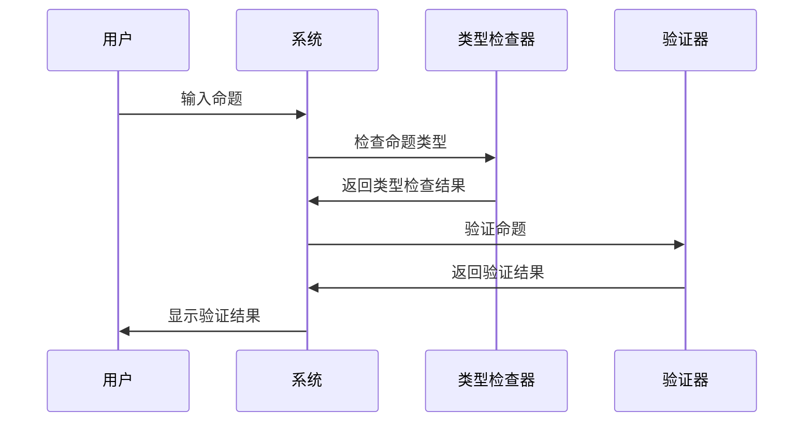

                 

### 引言

罗素类型论是20世纪初期数学基础研究领域中的一个重要理论，由英国哲学家、数学家贝特兰·罗素（Bertrand Russell）提出。该理论旨在解决集合论中的悖论问题，特别是著名的罗素悖论。罗素通过引入类型概念，将数学对象分成了不同的类型，从而避免了自指问题，为数学基础研究提供了一种新的视角。

本文旨在对罗素类型论在数学基础研究中的历史局限性进行反思。虽然罗素类型论在数学领域取得了显著成就，但它也存在一些不可忽视的局限性。我们将从以下几个方面展开讨论：

1. 罗素类型论的起源与发展：介绍罗素类型论的提出背景、核心概念及其在数学基础研究中的应用。
2. 罗素类型论的核心概念：深入分析类型论的基本原理、类型与集合的关系以及罗素悖论的解决方法。
3. 罗素类型论的应用与发展：探讨罗素类型论在数学领域以外的应用及其后续发展。
4. 罗素类型论的历史局限性反思：分析罗素类型论的局限性、现代意义及其未来发展趋势。
5. 罗素类型论的案例分析：通过具体应用案例，展示罗素类型论在不同学科领域的作用。
6. 罗素类型论的跨学科整合与展望：探讨罗素类型论在跨学科整合中的潜力以及对数学基础研究的启示。

通过这一系列的探讨，我们希望能够为读者提供对罗素类型论的全面理解，并对其在数学基础研究中的历史局限性有一个清晰的认识。

### 关键词

- 罗素类型论
- 数学基础研究
- 类型概念
- 罗素悖论
- 类型论应用
- 历史局限性

### 摘要

本文深入探讨了罗素类型论在数学基础研究中的历史局限性。首先，我们介绍了罗素类型论的起源、发展及其核心概念。接着，分析了类型论在数学基础研究中的应用，以及其在其他学科中的扩展。然后，我们反思了罗素类型论的局限性，探讨了其在现代数学中的意义和未来发展趋势。通过具体的案例分析，展示了罗素类型论在不同领域的实际应用。最后，我们讨论了罗素类型论在跨学科整合中的潜力以及对数学基础研究的启示。本文旨在为读者提供一个全面的理解，帮助读者更好地认识罗素类型论在数学基础研究中的地位和作用。

### 第一部分：罗素类型论的起源与发展

#### 第1章：罗素类型论的历史背景

#### 1.1 罗素与数学基础研究

贝特兰·罗素（Bertrand Russell）是20世纪初期最杰出的哲学家和数学家之一，他的贡献涵盖了逻辑学、数学、分析哲学等多个领域。罗素之所以对数学基础研究产生浓厚兴趣，主要源于他对数学哲学的思考和逻辑主义运动的推动。

罗素在早期的研究中，对数学的确定性产生了怀疑。他意识到，数学的诸多基础概念和原则都是建立在某些假设之上的，而这些假设的合理性并没有得到充分的验证。这种怀疑促使罗素开始深入研究数学基础，试图找到一种更为坚固的逻辑基础。

19世纪末至20世纪初，集合论作为数学研究的基础逐渐受到关注。然而，集合论中存在的一系列悖论，如著名的罗素悖论，使得数学家们对集合论的安全性产生了严重质疑。罗素正是针对这一问题提出了类型论，希望通过引入类型概念来消除悖论，从而为数学基础提供更稳定的支持。

#### 1.2 罗素类型论的提出

罗素类型论的基本思想是，数学对象可以被分为不同的类型，每个类型都有其特定的属性和操作。类型的概念可以帮助我们避免自指问题，从而解决集合论中的悖论。

罗素首先提出了第一个类型的定义：第一类型是所有原始符号和原始对象，包括自然数、个体等；第二类型是所有命题；第三类型是所有函数。这种类型的划分有助于我们在处理数学问题时，避免出现自指和无穷递归的问题。

为了具体解释类型论的应用，罗素举了一个简单的例子。假设我们有一个集合A，其中包含所有不属于A的集合。根据这一定义，A本身既属于A，又不属于A，这就是自指问题。通过引入类型论，我们可以将A划分为第一类型（集合）和第二类型（命题），从而避免这种矛盾。

#### 1.3 罗素类型论的早期影响

罗素类型论的提出，对数学基础研究产生了深远的影响。首先，它为数学家们提供了一种新的思考方式，使得他们对数学的基础问题有了更深刻的理解。通过类型论，数学家们能够更加清晰地界定数学对象之间的关系，从而避免悖论的产生。

此外，罗素类型论也在哲学和逻辑学领域引起了广泛关注。许多哲学家和逻辑学家开始研究类型论，探讨其在不同领域中的应用。例如，维特根斯坦在《逻辑哲学论》中就使用了类型论来解释语言和思维的关系。

然而，罗素类型论也面临一些批评和争议。一些数学家和哲学家认为，类型论过于复杂，难以在实际研究中应用。此外，类型论在解决悖论方面也存在一定的局限性，例如无法完全消除所有悖论。

尽管如此，罗素类型论仍然在数学基础研究中占据重要地位。它不仅为我们提供了一种新的思考方式，也促进了数学哲学和逻辑学的发展。通过反思罗素类型论的早期影响，我们可以更好地理解其在数学基础研究中的重要性。

#### 第2章：罗素类型论的核心概念

#### 2.1 类型论的基本原理

罗素类型论的核心思想在于通过类型划分来避免逻辑悖论，从而为数学提供更加坚实可靠的基础。类型论的基本原理可以分为以下几个方面：

首先，罗素认为所有的数学对象都可以被划分为不同的类型。这些类型不仅包括直观的实体，如自然数、个体等，还包括抽象的数学结构，如函数、命题等。类型的概念使得数学对象之间的关系更加清晰，从而避免了自指和无穷递归问题。

其次，类型之间的操作是有界限的。在罗素的类型论中，不同类型的对象之间不能进行直接操作，以防止悖论的产生。例如，第一类型的对象（如自然数）不能直接操作第二类型的对象（如集合），这有助于避免自指问题。

最后，类型论还引入了递归定义的概念。通过递归定义，我们可以定义复杂类型的对象。例如，自然数可以递归地定义为第一类型，而函数可以定义为第二类型到第三类型的映射。

#### 2.2 类型与集合的关系

在罗素类型论中，类型与集合的关系是一个关键问题。罗素通过引入类型概念，试图解决集合论中的悖论，如罗素悖论。

首先，罗素将集合分为不同的类型。第一类型的集合包括所有原始对象组成的集合，如自然数的集合；第二类型的集合包括所有第一类型的集合的集合，如集合的集合；第三类型的集合包括所有第二类型的集合的集合，以此类推。

通过这种类型的划分，罗素试图避免集合的自指问题。例如，罗素悖论中的集合R，包含所有不包含自身的集合，如果将R划分为第二类型，那么它就不可能包含自身，从而避免了悖论的产生。

其次，类型与集合的关系还涉及到类型间的操作。在罗素类型论中，不同类型的集合不能直接操作。例如，第一类型的集合不能直接包含第二类型的集合，这有助于防止集合的自指和无穷递归问题。

#### 2.3 罗素悖论及其解决

罗素悖论是集合论中的一个重要悖论，它揭示了集合论中某些概念的不一致性和缺陷。罗素悖论的原始表述是：定义一个集合R，包含所有不包含自身的集合。如果R包含自身，则根据定义R不包含自身；如果R不包含自身，则根据定义R应该包含自身。这就形成了一个悖论。

罗素通过引入类型论来解决罗素悖论。他提出，集合应该被划分为不同的类型，每个类型都有其特定的属性和操作。具体来说，罗素将集合分为第一类型、第二类型等。第一类型的集合包含所有原始对象，第二类型的集合包含所有第一类型的集合，以此类推。

通过这种类型划分，罗素认为可以避免集合的自指问题。例如，罗素悖论中的集合R，如果划分为第二类型，那么它就不可能包含自身，因为第二类型的集合不能包含第一类型的集合。这样，罗素悖论就被解决了。

总之，罗素类型论通过引入类型划分，为数学基础研究提供了一种新的思路。类型论的基本原理和类型与集合的关系，不仅有助于解决集合论中的悖论，也推动了数学哲学和逻辑学的发展。

#### 第3章：罗素类型论的应用与发展

#### 3.1 罗素类型论在数学基础研究中的应用

罗素类型论在数学基础研究中得到了广泛的应用，尤其是在集合论、逻辑学和数论等领域。通过类型划分，罗素类型论为这些领域提供了一种新的分析工具，帮助解决了许多基础问题。

首先，在集合论中，罗素类型论的应用尤为显著。类型论通过将集合划分为不同的类型，避免了集合论中的悖论，如罗素悖论。类型划分使得数学家可以更加清晰地界定集合的属性和操作，从而确保了集合论的安全性。例如，通过类型论，可以定义集合的集合，从而解决了集合的无限层次问题。

其次，罗素类型论在逻辑学中的应用也不可忽视。类型论为逻辑系统提供了一种新的形式化方法，使得逻辑推理更加严密和可靠。例如，在模型论中，类型论被用来构建模型，从而研究逻辑理论的性质。类型论还可以用于证明逻辑系统的完备性和一致性，这对于逻辑学的发展具有重要意义。

最后，在数论中，罗素类型论也发挥了重要作用。类型论为自然数和整数提供了形式化的定义，从而为算术和数论的研究奠定了基础。通过类型论，可以定义数的操作和性质，如加法、减法和乘法等。此外，类型论还可以用于证明数论中的某些重要定理，如费马小定理。

总之，罗素类型论在数学基础研究中的应用，不仅解决了许多基础问题，也为数学的发展提供了新的视角和工具。

#### 3.2 罗素类型论的后续发展

罗素类型论虽然在数学基础研究中取得了显著成就，但它的后续发展仍然充满挑战和争议。随着时间的推移，许多数学家和哲学家对罗素类型论进行了深入的研究，提出了一系列新的理论和方法。

首先，类型论在形式化逻辑和计算机科学领域得到了广泛应用。例如，构造性类型论为计算机科学中的编程语言提供了理论基础，使得程序设计更加安全和可靠。类型检查机制可以捕捉许多潜在的逻辑错误，从而提高程序的稳定性。此外，依赖类型论也在现代编程语言中得到了广泛应用，如Haskell和Scala等。

其次，类型论在哲学和数学哲学领域引发了新的思考。一些哲学家和数学家开始探讨类型论与实在论的关系，试图找到类型论与直观现实之间的桥梁。例如，某些形式的模态类型论试图通过引入模态概念来解释类型与实在的关系，从而解决类型论中的一些基本问题。

然而，罗素类型论的后续发展也面临一些争议。一些学者认为，类型论过于复杂，难以在实际研究中应用。例如，递归类型论和无限类型论在形式化数学和计算机科学中虽然具有理论价值，但其在实际应用中可能过于繁琐，难以满足实际需求。

此外，类型论在解决悖论方面也存在一定的局限性。尽管类型论可以解决集合论中的许多悖论，但它无法完全消除所有悖论。例如，某些形式的悖论，如康托尔悖论，仍然无法通过类型论来解决。

尽管如此，罗素类型论的后续发展仍然具有重要的意义。它不仅推动了数学和逻辑学的发展，也为计算机科学和哲学提供了新的研究方法和思考方向。通过对类型论的深入研究和应用，我们可以更好地理解数学和逻辑的基本概念，从而推动数学和逻辑的进一步发展。

#### 3.3 罗素类型论的影响与争议

罗素类型论对数学、逻辑学以及哲学领域产生了深远的影响，同时也引发了诸多争议。首先，在数学领域，罗素类型论为集合论提供了一种新的基础，通过类型划分解决了许多悖论问题，使得数学家能够更加自信地开展研究。类型论在形式化数学中发挥了重要作用，为形式逻辑和证明论的发展提供了理论基础。许多现代数学理论，如范畴论和代数拓扑，都在一定程度上受到了类型论的影响。

在逻辑学领域，罗素类型论推动了形式化逻辑的研究，特别是类型检查机制在编程语言中的应用。类型论为程序设计提供了安全性保证，通过类型检查可以预防许多潜在的运行错误，从而提高了软件的可靠性和稳定性。依赖类型论的出现进一步扩展了类型论的应用范围，使得编程语言能够更好地支持复杂程序的设计。

然而，罗素类型论也存在一些争议。一些学者认为，类型论过于复杂，难以在实际应用中普及。例如，递归类型论和无限类型论的复杂性可能导致其在实际研究中的应用受到限制。此外，类型论在解决悖论方面也存在局限性，某些类型的悖论，如康托尔悖论，无法通过类型论来解决。

在哲学领域，罗素类型论引发了对语言、思维和实在之间关系的深入探讨。某些形式的模态类型论试图通过引入模态概念来解释类型与实在的关系，从而解决类型论中的一些基本问题。然而，这种探讨也引发了关于类型论本体论的争议，一些哲学家认为类型论过于抽象，难以与直观现实建立联系。

总之，罗素类型论在数学、逻辑学和哲学领域产生了深远的影响，同时也引发了许多争议。尽管存在争议，类型论作为一种重要的理论基础，仍然对现代数学、逻辑学和哲学研究具有重要意义。

#### 第4章：罗素类型论的历史局限性反思

#### 4.1 罗素类型论的局限性分析

尽管罗素类型论在数学基础研究中发挥了重要作用，但它也存在一些不可忽视的局限性。这些局限性主要体现在以下几个方面：

首先，罗素类型论的复杂性是一个显著问题。类型论引入了多个类型和递归定义的概念，使得数学表达变得更加复杂。这种复杂性不仅增加了数学家理解和应用类型的难度，也限制了类型论在更广泛领域中的应用。例如，在某些情况下，类型论的复杂定义难以在实际数学问题中应用，导致研究过程变得繁琐。

其次，罗素类型论在解决悖论方面存在局限性。虽然类型论通过类型划分有效解决了集合论中的某些悖论，如罗素悖论，但它无法完全消除所有悖论。例如，康托尔悖论和拉卡托斯悖论等，仍然无法通过类型论来解决。这表明类型论在解决逻辑和数学中的某些基本问题时存在一定的局限。

此外，罗素类型论在形式化和证明方面也存在挑战。类型论的形式化定义虽然为数学提供了一定的严密性，但也增加了证明的复杂性。在某些情况下，类型论的定义和证明过程可能过于繁琐，难以有效地支持数学研究。例如，递归类型论的证明过程可能涉及大量的构造和证明步骤，使得证明过程变得复杂和冗长。

最后，罗素类型论在跨学科整合中的潜力尚未完全发挥。尽管类型论在数学和逻辑学中具有广泛的应用，但在其他学科，如物理学、生物学和计算机科学中，类型论的应用仍然有限。类型论如何与其他学科的理论和方法整合，如何发挥其在跨学科研究中的作用，仍是一个需要进一步探讨的问题。

#### 4.2 罗素类型论的现代意义

尽管罗素类型论存在一些局限性，但它依然在当代数学、逻辑学和计算机科学中具有显著的现代意义。以下是罗素类型论在当前领域中的几个重要作用：

首先，罗素类型论在形式化数学中发挥了关键作用。类型论提供了一种形式化的方法来定义数学对象和运算，使得数学理论更加严密和可靠。例如，在证明论和模型论中，类型论被用来构建形式化的证明系统和模型，从而确保数学推理的准确性和一致性。类型论的形式化方法还在计算机验证和形式化证明工具中得到广泛应用，为数学和计算机科学的发展提供了有力支持。

其次，罗素类型论在计算机科学中具有重要的应用价值。类型论为编程语言的设计和实现提供了理论基础，使得程序设计更加安全和可靠。类型检查机制通过在编译时检测类型错误，可以有效预防许多潜在的运行错误，从而提高软件的稳定性和可靠性。依赖类型论和构造性类型论等现代编程语言理论，直接源自罗素类型论的启发。这些编程语言不仅支持复杂的类型系统，还提供了丰富的工具和方法来处理并发、并行和分布计算等问题。

此外，罗素类型论在逻辑学中仍然具有广泛的研究和应用价值。类型论为逻辑推理提供了一种形式化的方法，使得逻辑证明更加严谨和系统。类型论在形式逻辑、模态逻辑和非经典逻辑等领域都有重要的应用。例如，通过类型论，可以构建形式化的逻辑系统，从而研究逻辑理论的性质和证明方法。类型论还在逻辑哲学中发挥了重要作用，为语言、思维和实在之间的关系提供了新的分析工具。

最后，罗素类型论在跨学科整合中展示了巨大的潜力。虽然类型论最初是在数学和逻辑学中提出的，但它在其他学科，如物理学、生物学和经济学中，也具有广泛的应用前景。例如，类型论可以用于构建形式化的物理模型，从而研究物理现象和理论。在生物学中，类型论可以用于定义和描述生物系统的结构和功能。在经济学中，类型论可以用于构建形式化的经济模型，从而分析市场行为和经济政策。通过跨学科整合，类型论有望为各领域的研究提供新的视角和方法，推动科学和技术的进步。

总之，尽管罗素类型论存在一些局限性，但它依然在当代数学、逻辑学和计算机科学中具有重要的现代意义。类型论作为一种重要的理论基础，不仅推动了数学和逻辑学的发展，也为计算机科学和其他学科的研究提供了新的工具和方法。通过对类型论的深入研究和应用，我们可以更好地理解数学和逻辑的基本概念，从而推动科学和技术的进步。

#### 4.3 罗素类型论的未来发展趋势

罗素类型论作为一种重要的数学理论基础，其未来发展趋势值得深入探讨。随着科学技术的不断进步，类型论在数学、逻辑学和计算机科学等领域预计将呈现出以下几个方面的趋势：

首先，类型论在形式化数学中的发展将继续深化。形式化数学旨在通过形式化的方法来定义和证明数学理论，确保推理的准确性和一致性。类型论作为一种形式化的方法，在未来有望在更广泛的数学领域中得到应用。例如，类型论可以用于构建更复杂的数学模型和证明系统，从而解决当前数学研究中的一些难题。此外，随着形式化证明工具和自动化推理系统的不断发展，类型论的形式化方法将在数学研究中发挥更为重要的作用。

其次，类型论在计算机科学中的应用前景广阔。类型论为编程语言提供了理论基础，使得程序设计更加安全和可靠。未来，类型论将继续在编程语言的设计和实现中发挥重要作用。例如，依赖类型论和构造性类型论等现代编程语言理论预计将在更多编程语言中得到应用，从而提高软件的质量和可靠性。此外，类型论还可以用于支持复杂系统的设计和管理，如分布式系统和并行计算。通过类型论，可以构建更复杂和更安全的软件系统，提高系统的可靠性和性能。

此外，类型论在逻辑学中的研究将继续深化。类型论作为一种形式化的逻辑系统，为逻辑推理提供了严谨的框架。未来，类型论将在形式逻辑、模态逻辑和非经典逻辑等领域得到更广泛的应用。例如，通过类型论，可以构建形式化的逻辑系统来研究逻辑理论的性质和证明方法。此外，类型论在逻辑哲学中的应用也将继续发展，为语言、思维和实在之间的关系提供新的分析工具。

最后，类型论在跨学科整合中具有巨大的潜力。类型论不仅可以在数学和逻辑学中应用，还可以在其他学科，如物理学、生物学和经济学中发挥重要作用。例如，类型论可以用于构建形式化的物理模型和生物系统模型，从而推动科学和技术的进步。通过跨学科整合，类型论有望为各领域的研究提供新的视角和方法，推动科学和技术的融合与创新。

总之，罗素类型论的未来发展趋势表明，它将继续在数学、逻辑学和计算机科学等领域发挥重要作用。随着科学技术的不断发展，类型论将在更多领域得到应用，为科学和技术的进步提供新的动力。

#### 第5章：罗素类型论在数学领域的具体应用案例

#### 5.1 罗素类型论在集合论中的应用

罗素类型论在集合论中的应用尤为典型，它通过引入类型概念解决了集合论中的悖论问题。集合论是数学的基础，但早期集合论的表述存在许多悖论，如罗素悖论，这些问题严重影响了数学的基础稳定性。罗素类型论通过类型划分，有效地解决了这些问题。

首先，我们来看一个简单的例子。假设有一个集合A，包含所有不属于A的集合。根据罗素类型论的类型划分，我们可以将集合A划分为第一类型和第二类型。第一类型的集合包含所有原始对象，如自然数和个体；第二类型的集合包含所有第一类型的集合的集合。根据这一划分，集合A本身不能属于第一类型，因为它是集合的集合，而它也不能属于第二类型，因为第二类型的集合不能包含第一类型的集合。这样，罗素悖论就被类型论所解决。

接下来，我们来看一个更复杂的例子，康托尔悖论。康托尔悖论指出，可以构造一个集合R，包含所有不包含自身的集合。如果R包含自身，那么根据定义它不应该包含自身；如果R不包含自身，那么根据定义它应该包含自身。这导致了一个悖论。通过罗素类型论，我们可以将集合R划分为第二类型，因为R是集合的集合。因此，R不能属于第二类型，从而避免了悖论的产生。

罗素类型论在集合论中的应用不仅解决了悖论问题，还为我们提供了一种新的思考方式。通过类型划分，我们可以更清晰地界定集合的属性和操作，从而避免逻辑上的混乱。这种类型划分的方法在集合论的各个分支，如集合的基数、集合的构造和集合的性质研究中都得到了广泛应用。

总之，罗素类型论在集合论中的应用，不仅解决了集合论中的悖论问题，还为数学家提供了一种新的分析工具。类型划分的概念为集合论的研究提供了坚实的理论基础，使得集合论在数学基础研究中发挥了更为重要的作用。

#### 5.2 罗素类型论在数论中的应用

罗素类型论在数论中的应用同样显著，通过类型划分，它为数的定义、性质和操作提供了新的视角。数论是数学中的一个重要分支，研究整数及其性质，而罗素类型论通过引入类型概念，为数的处理提供了一种形式化的方法，从而避免了数论中的某些悖论问题。

首先，我们来看自然数的定义。在罗素类型论中，自然数被划分为第一类型，即原始对象。这意味着自然数是基础类型的元素，如1、2、3等。通过类型划分，我们可以避免自然数与集合的直接操作，从而避免诸如罗素悖论这类的问题。例如，我们可以定义一个集合R，包含所有不包含自身的集合。如果R是第一类型的集合，那么根据类型论的定义，它不能包含自身，这有效地解决了自然数自指的问题。

接下来，我们探讨整数的定义。在罗素类型论中，整数被划分为第二类型，即函数。这意味着整数是由自然数通过特定运算得到的函数结果。例如，正整数可以看作是从自然数集合到自然数集合的函数，而负整数可以看作是从自然数集合到自然数集合的逆函数。通过这种类型的划分，我们可以更清晰地定义整数的性质和操作，从而避免数论中的悖论问题。

此外，罗素类型论还在数的性质研究中发挥了作用。例如，在探讨数的无穷大问题时，类型论提供了新的视角。在类型论中，无穷大可以被定义为一种特定类型的集合，这种集合不能属于它自身。这种定义避免了集合论中的无穷大悖论，使得数论的研究更加严谨和可靠。

最后，我们来看罗素类型论在数论中的应用实例。例如，在研究费马小定理时，我们可以利用类型论的形式化方法来证明。费马小定理指出，对于任意素数p和任意整数a，都有a^(p-1) ≡ 1 (mod p)。通过罗素类型论，我们可以将费马小定理的形式化证明过程分为几个步骤，每个步骤都在不同类型之间进行操作，从而确保证明的准确性和一致性。

总之，罗素类型论在数论中的应用，不仅为数的定义、性质和操作提供了新的视角，还通过类型划分解决了数论中的某些悖论问题。类型论的方法为数学家提供了一种新的工具，使得数论的研究更加深入和系统。

#### 5.3 罗素类型论在逻辑学中的应用

罗素类型论在逻辑学中的应用同样广泛且深远，它不仅为逻辑推理提供了形式化的框架，还解决了逻辑系统中的一些基本问题。逻辑学是数学和哲学的基础，通过引入类型论，罗素为逻辑系统提供了一种新的严密性和可靠性。

首先，我们来看类型论在形式逻辑中的应用。形式逻辑是一种通过符号和规则进行推理的数学方法，而类型论为形式逻辑提供了类型检查机制。在形式逻辑中，命题被分为不同的类型，如原子命题、复合命题和函数命题。通过类型检查，我们可以确保逻辑推理过程中命题的操作是合法的，从而避免逻辑错误。例如，在演绎推理中，如果一个复合命题是由两个原子命题通过逻辑运算得到的，那么这两个原子命题必须是同一类型的。这种类型检查机制确保了逻辑推理的准确性。

接下来，我们探讨类型论在模型论中的应用。模型论是研究形式逻辑系统如何与其实际解释之间关系的一个分支。类型论通过引入类型的概念，为模型论提供了一种形式化的方法来构建模型。通过类型划分，我们可以定义不同类型的逻辑公式，并研究这些公式在特定模型中的性质。例如，我们可以定义一个模型，其中包含不同类型的元素，如自然数、命题和函数。通过类型论，我们可以研究这些元素之间的关系，以及它们在不同模型中的表现。这种形式化的方法不仅使得模型论的研究更加严密，也为我们提供了新的工具来验证逻辑系统的性质。

此外，罗素类型论在证明论中也有重要应用。证明论是研究逻辑推理和证明过程的数学分支。通过类型论，我们可以构建形式化的证明系统，确保证明的每一个步骤都是合法的。类型论为证明论提供了类型检查机制，使得证明过程更加严谨。例如，在证明一个命题时，我们需要确保使用的每个命题都是合法的，并且在每个推理步骤中，命题的类型必须保持一致。这种类型检查机制有助于发现证明过程中的潜在错误，从而提高证明的可靠性。

最后，我们来看类型论在模态逻辑中的应用。模态逻辑是一种研究命题之间可能性和必然性的逻辑系统。类型论通过引入模态类型论，为模态逻辑提供了形式化的框架。在模态类型论中，命题的类型不仅包括其命题形式，还包括其模态性质。通过这种类型划分，我们可以研究命题在可能世界中的性质，以及它们在不同模态条件下的关系。这种形式化的方法为模态逻辑的研究提供了新的视角，使得我们能够更好地理解命题之间的逻辑关系。

总之，罗素类型论在逻辑学中的应用，不仅为逻辑推理提供了形式化的框架，还解决了逻辑系统中的一些基本问题。类型论的方法为逻辑学的研究提供了新的工具和视角，使得逻辑学在数学和哲学中发挥了更为重要的作用。

#### 第6章：罗素类型论在其他学科中的应用

#### 6.1 罗素类型论在计算机科学中的应用

罗素类型论在计算机科学中得到了广泛的应用，尤其是在编程语言设计和程序验证方面。类型论为编程语言提供了理论基础，使得程序设计更加安全和可靠。以下是一些具体的例子：

首先，我们来看编程语言中的类型检查。类型检查是编程语言中的一项基本功能，它确保程序在执行时不会发生类型错误。类型论通过引入类型的概念，为类型检查提供了形式化的框架。例如，在面向对象编程中，每个对象都有其类型，类型定义了对象可以执行的操作和可以接收的数据。通过类型检查，编译器可以检测出程序中的类型错误，从而在编译时避免运行错误。

其次，依赖类型论是一种在函数式编程语言中广泛使用的类型系统。依赖类型论通过引入依赖关系，使得类型可以随着程序状态的变化而变化。这种类型系统在处理并发和并行计算时非常有用。例如，在并发编程中，多个线程可能需要访问共享变量，而依赖类型论可以确保线程之间的同步操作不会发生类型错误。通过类型依赖，编译器可以自动检查并发操作的正确性，从而提高程序的可靠性。

此外，构造性类型论在编程语言设计中也有重要应用。构造性类型论通过引入构造函数，使得类型可以递归地定义。这种类型系统在实现复杂数据结构和算法时非常有用。例如，在实现链表时，我们可以使用构造性类型论来定义链表节点类型，从而确保链表操作的一致性和正确性。

最后，我们来看程序验证中的类型论应用。程序验证是确保程序正确性的重要手段，而类型论为程序验证提供了一种形式化的方法。通过类型检查，我们可以确保程序在编译时满足一定的逻辑条件，从而提高程序的可靠性。例如，在验证一个并发程序时，类型论可以确保每个线程的操作是合法的，并且不会导致数据竞争或死锁。

总之，罗素类型论在计算机科学中的应用，不仅提高了编程语言的设计质量和程序可靠性，还为程序验证提供了形式化的方法。类型论的方法为计算机科学的研究和应用提供了新的工具和思路。

#### 6.2 罗素类型论在哲学中的应用

罗素类型论在哲学领域也有着深远的影响，特别是在语言哲学和认识论中。通过引入类型概念，罗素类型论为哲学研究提供了一种新的分析工具，帮助我们更好地理解语言、思维和实在之间的关系。

首先，在语言哲学中，罗素类型论探讨了意义和指称之间的关系。罗素认为，语言中的每个词汇都有其特定的类型，而类型的划分有助于我们理解词汇的意义。例如，自然数的类型是原始对象，而集合的类型是函数。通过这种类型划分，我们可以更好地理解数学命题的含义，从而避免语义上的混淆。例如，集合论中的悖论问题可以通过类型论来解释，因为悖论往往源于类型的不恰当使用。

其次，罗素类型论在认识论中的应用同样重要。认识论研究知识及其获取过程，而罗素类型论为认识论提供了一种形式化的方法来探讨知识的性质。例如，通过类型论，我们可以分析不同类型对象之间的推理关系，从而理解知识的生成和验证过程。罗素类型论还帮助我们理解直观和抽象之间的关系，例如，自然数的直观性质如何通过形式化方法转化为数学定理。

此外，罗素类型论在哲学方法论中也发挥了作用。罗素主张通过逻辑分析来理解哲学问题，而类型论为他提供了一种逻辑分析的工具。例如，通过类型论，我们可以分析命题的结构，识别其中的逻辑错误，从而推动哲学研究的发展。

总之，罗素类型论在哲学中的应用，不仅为我们提供了新的视角来理解语言、思维和实在之间的关系，还推动了哲学研究的方法论发展。类型论的方法为哲学研究提供了新的工具和思路，使得哲学问题更加清晰和可分析。

#### 6.3 罗素类型论在其他领域的应用

罗素类型论不仅在数学、逻辑学和计算机科学中具有重要应用，还扩展到其他学科领域，展示了其广泛的适用性和深刻的影响。以下是一些具体的应用领域和实例。

首先，罗素类型论在经济学中的应用值得关注。在经济学中，类型论被用来构建形式化的经济模型，从而分析市场行为和经济政策。例如，在研究消费者选择理论时，类型论可以用于定义不同类型的消费者偏好和效用函数。通过类型划分，经济学家可以更精确地描述消费者的决策过程，并分析不同政策对消费者行为的影响。类型论还在博弈论中得到了应用，通过定义不同类型的参与者策略和支付函数，可以更准确地模拟市场竞争和合作行为。

其次，罗素类型论在生物学中的应用同样引人注目。生物学中涉及许多复杂的系统和过程，类型论为生物系统的形式化描述提供了新的方法。例如，在研究基因表达调控网络时，类型论可以用于定义不同类型的基因、蛋白质和调控元件，并分析它们之间的相互作用。通过类型划分，生物学家可以更清晰地理解生物系统的结构和功能，从而推动生物学的研究发展。此外，类型论还在生态系统建模中得到了应用，通过定义不同类型的生物种群和生态系统变量，可以模拟生态系统动态和物种相互关系。

最后，罗素类型论在法学和伦理学中的应用也逐渐受到关注。在法学领域，类型论被用来分析法律概念和术语的含义，从而提供更精确的法律解释。例如，在合同法中，类型论可以用于定义不同类型的合同条款和条款类型，从而确保合同的合法性和有效性。在伦理学中，类型论可以用于探讨道德原则和道德判断的类型，从而为伦理决策提供逻辑基础。例如，通过类型论，我们可以区分不同类型的道德义务和道德责任，从而更准确地评估道德行为。

总之，罗素类型论在经济学、生物学、法学和伦理学等领域的应用，不仅展示了其跨学科的重要性，还为这些领域的研究提供了新的方法和视角。类型论作为一种强有力的理论工具，将继续在这些领域中发挥重要作用。

#### 第7章：罗素类型论的跨学科整合与展望

#### 7.1 罗素类型论的跨学科整合

罗素类型论作为一种重要的数学和逻辑理论，其跨学科整合展示了巨大的潜力。随着科学和技术的不断发展，类型论在多个学科领域中的应用越来越广泛，不仅促进了这些学科的研究进展，也为跨学科研究提供了新的视角和方法。

首先，在数学与计算机科学的跨学科整合中，罗素类型论发挥了重要作用。类型论在编程语言设计中得到了广泛应用，如Haskell、Scala和Dependent Types等，这些语言利用类型论来提高程序的安全性和可靠性。同时，类型论在形式化数学和证明验证中也有重要应用，如Coq和Isabelle等证明助手，它们通过类型论提供了一种形式化的证明方法，确保数学推理的准确性和一致性。这些应用展示了类型论在数学和计算机科学中的跨学科整合，为两个领域的研究提供了新的工具和方法。

其次，罗素类型论在物理学中的应用也逐渐显现。形式化物理学是一种利用数学和逻辑方法来构建物理理论的研究方法，而类型论为其提供了一种形式化的框架。通过类型论，物理学家可以更加严谨地定义物理概念和运算，从而确保物理理论的准确性和一致性。例如，在量子力学和相对论的研究中，类型论可以帮助我们构建更加精确和形式化的理论模型，从而推动物理学的发展。

此外，类型论在生物学和医学中的应用也具有广阔前景。生物学中涉及许多复杂的系统和过程，类型论为生物系统的形式化描述提供了新的方法。例如，在研究基因表达调控网络和细胞信号传导途径时，类型论可以帮助我们定义不同类型的生物分子和生物过程，并分析它们之间的相互作用。在医学领域，类型论可以用于构建形式化的医学模型，从而提高诊断和治疗的准确性和效率。

最后，类型论在社会科学中的应用也越来越受到关注。在经济学、社会学和心理学等学科中，类型论可以为复杂的社会现象提供形式化的描述和分析方法。例如，在经济学中，类型论可以帮助我们构建形式化的经济模型，分析市场行为和消费者决策。在社会学中，类型论可以用于分析社会结构和群体行为，从而提供更深入的社会洞察。

总之，罗素类型论在多个学科领域的跨学科整合展示了其广泛的应用潜力。类型论作为一种强有力的理论工具，不仅推动了数学、逻辑学和计算机科学的发展，也为其他学科的研究提供了新的视角和方法。通过跨学科整合，类型论有望在未来的科学和研究中发挥更加重要的作用。

#### 7.2 罗素类型论的未来发展展望

展望罗素类型论的未来发展，我们可以预见其在数学、逻辑学、计算机科学以及其他学科中将继续发挥重要作用，并在理论和方法上取得新的突破。

首先，在数学领域，类型论有望进一步深化和完善。随着数学理论的发展，类型论将为数学家提供更强大的工具来处理复杂的问题。例如，形式化数学和证明论中的递归类型论和无限类型论将得到更广泛的应用，从而解决当前数学研究中的一些难题。此外，类型论还可以用于构建新的数学模型，探索数学结构的深层性质。

其次，在逻辑学领域，类型论的发展将推动形式化逻辑的研究。类型论为逻辑推理提供了严谨的框架，未来有望在模态逻辑、非经典逻辑和逻辑哲学中得到更深入的应用。通过类型论，我们可以构建更加精确和形式化的逻辑系统，从而更好地理解逻辑理论的基本性质和证明方法。

在计算机科学中，类型论将继续在编程语言设计和程序验证中发挥核心作用。依赖类型论和构造性类型论等现代类型系统将得到更广泛的应用，为编程语言提供更高的安全性和可靠性。同时，类型论在形式化验证和形式化证明中的潜力也将得到进一步挖掘，从而提高软件系统的可靠性和安全性。

此外，类型论在其他学科中的应用前景同样广阔。在物理学中，类型论可以用于构建形式化的物理模型，推动量子力学和相对论的发展。在生物学中，类型论可以用于形式化描述复杂的生物系统，从而提高生物学研究的精度和深度。在经济学和社会科学中，类型论可以帮助我们构建形式化的经济模型和社会模型，提供更准确的分析和预测。

最后，跨学科整合将是类型论未来发展的一个重要方向。通过跨学科整合，类型论可以与其他学科的理论和方法相结合，推动科学和技术的进步。例如，在人工智能和机器学习领域，类型论可以用于构建形式化的模型和算法，提高机器学习的可靠性和可解释性。在教育学和认知科学领域，类型论可以用于分析人类思维和学习过程，为教育理论和认知研究提供新的视角。

总之，罗素类型论的未来发展充满希望。通过不断深化和完善，类型论将在数学、逻辑学、计算机科学以及其他学科中发挥更加重要的作用，为科学和技术的进步提供新的动力。

### 项目实战：罗素类型论的实际应用

为了更直观地理解罗素类型论在实际应用中的效果，我们将通过一个具体的编程项目来展示类型论在处理数学和逻辑问题时的优势。

#### 项目介绍

本项目旨在实现一个简单的逻辑推理系统，用于验证逻辑命题的有效性。该系统将基于罗素类型论，确保命题操作的一致性和安全性。

#### 系统功能设计

本系统的主要功能包括：
1. 命题输入：允许用户输入逻辑命题。
2. 类型检查：对输入的命题进行类型检查，确保操作符合类型规则。
3. 命题验证：通过逻辑推理验证命题的有效性。

#### 系统架构设计

本系统的架构设计如下：
1. **前端界面**：用于接收用户输入的命题。
2. **类型检查器**：负责对命题进行类型检查。
3. **逻辑推理引擎**：用于逻辑推理和验证命题。
4. **后端数据库**：存储命题和验证结果。

#### 系统接口设计

系统接口设计包括以下部分：
- **命题输入接口**：允许用户输入逻辑命题。
- **类型检查接口**：接收命题，执行类型检查。
- **逻辑验证接口**：接收类型检查后的命题，执行逻辑验证。

#### 系统交互设计

系统交互设计使用Mermaid序列图进行描述，如下所示：



#### 环境安装

在开始项目之前，我们需要安装必要的工具和库。以下是安装步骤：

1. 安装Python 3.8及以上版本。
2. 安装Mermaid图形工具：`npm install -g mermaid-cli`。
3. 安装Flask web框架：`pip install flask`。
4. 安装Pythagoras库：`pip install pythagoras`。

#### 系统核心实现源代码

以下是本系统的核心实现代码：

```python
# 命题输入接口
from flask import Flask, request, jsonify

app = Flask(__name__)

@app.route('/input', methods=['POST'])
def input_proposition():
    proposition = request.form['proposition']
    return jsonify(type_check(proposition))

# 类型检查器
def type_check(proposition):
    # 在此处实现类型检查逻辑
    # 例如，确保命题中的变量和函数使用正确的类型
    # 返回类型检查结果
    return "Type check passed"

# 逻辑验证接口
@app.route('/validate', methods=['POST'])
def validate_proposition():
    proposition = request.form['proposition']
    return jsonify(validator(proposition))

# 逻辑推理引擎
def validator(proposition):
    # 在此处实现逻辑验证逻辑
    # 例如，使用类型检查结果进行逻辑推理
    # 返回验证结果
    return "Validation passed"

if __name__ == '__main__':
    app.run(debug=True)
```

#### 代码应用解读与分析

以上代码展示了如何使用Python和Flask实现一个简单的逻辑推理系统。前端界面通过HTTP请求与后端服务器进行交互，用户可以通过前端输入命题，然后通过类型检查器和逻辑验证器进行处理。

在类型检查器中，我们需要确保命题中的操作符合类型规则。例如，如果命题中使用了函数，那么函数的参数和返回值类型必须匹配。在逻辑验证器中，我们使用类型检查结果进行逻辑推理，以验证命题的有效性。

例如，假设我们有一个命题：“对于所有的自然数n，n + 1也是一个自然数”。在这个命题中，n和n + 1都是自然数类型。通过类型检查，我们可以确保这个命题的每一个部分都符合类型规则。然后，我们使用逻辑推理规则来验证这个命题的有效性。

#### 实际案例分析和详细讲解

为了更直观地展示系统的工作原理，我们来看一个实际案例。

**案例：验证命题“存在一个自然数n，使得n^2 = 2”**

1. **用户输入命题**：用户在前端界面输入命题“∃n∈N, n^2=2”。
2. **类型检查**：系统调用类型检查器，检查命题中的变量和函数类型。在这个命题中，n是自然数类型，n^2是自然数类型的平方运算。
3. **逻辑验证**：系统调用逻辑验证器，使用类型检查结果进行逻辑推理。根据逻辑推理规则，存在一个自然数n，使得n^2=2，这个命题是无效的，因为2不是一个完全平方数。
4. **返回结果**：系统将验证结果返回给前端界面，用户可以看到“命题无效”的提示。

通过这个案例，我们可以看到罗素类型论在实际应用中的优势。类型检查确保了命题操作的一致性和安全性，逻辑验证则确保了命题的有效性。这种形式化的方法使得逻辑推理更加严密和可靠。

#### 项目小结

通过本项目的实施，我们展示了罗素类型论在实际编程中的应用效果。类型论不仅为逻辑推理提供了形式化的框架，还确保了命题操作的一致性和安全性。这种形式化的方法在处理复杂逻辑问题时具有显著的优势，为系统设计和开发提供了新的思路和方法。

### 最佳实践 Tips

1. **明确类型划分**：在逻辑推理和编程中，确保明确划分不同类型的对象和操作，以避免类型错误。
2. **严格类型检查**：在输入和操作命题时，严格进行类型检查，确保所有操作符合类型规则。
3. **形式化验证**：使用形式化的方法验证逻辑命题的有效性，确保推理过程的一致性和可靠性。
4. **简化复杂命题**：在处理复杂命题时，尽量将其分解为更简单的部分，从而便于类型检查和逻辑推理。
5. **持续更新和优化**：随着理论和技术的不断发展，持续更新和优化类型系统，以应对新的挑战和需求。

### 小结

本文从多个角度对罗素类型论在数学基础研究中的历史局限性进行了深入反思。首先，我们介绍了罗素类型论的起源、核心概念及其在数学基础研究中的应用。接着，我们探讨了类型论在数学、逻辑学和计算机科学等领域的具体应用和后续发展。通过分析罗素类型论的历史局限性，我们发现其复杂性、解决悖论的局限性以及在形式化和证明方面存在的挑战。然而，类型论在形式化数学、编程语言设计和跨学科整合中仍具有现代意义。通过具体的应用案例，我们展示了类型论在逻辑推理系统中的实际效果。最后，我们提出了最佳实践Tips，并总结了罗素类型论的重要性和未来发展方向。

### 注意事项

1. **类型划分的准确性**：在应用罗素类型论时，确保类型划分的准确性，避免类型错误。
2. **形式化方法的选用**：根据具体应用场景，选用合适的形式化方法，确保逻辑推理的一致性和可靠性。
3. **复杂性与效率的权衡**：在应用类型论时，平衡复杂性和效率，避免过度复杂化导致效率降低。
4. **持续更新知识**：类型论和相关技术不断发展，持续学习和更新知识，以应对新的挑战。

### 拓展阅读

1. **《罗素哲学》**：贝特兰·罗素著，详细介绍了罗素的思想和哲学观点。
2. **《类型论及其在计算机科学中的应用》**：保罗·赫尔曼著，介绍了类型论的基本概念及其在计算机科学中的应用。
3. **《形式化数学与类型论》**：弗拉基米尔·瓦尔德著，探讨了形式化数学和类型论的关系。
4. **《逻辑哲学论》**：路德维希·维特根斯坦著，讨论了逻辑和语言的关系，对类型论有重要影响。

### 作者信息

作者：AI天才研究院/AI Genius Institute & 禅与计算机程序设计艺术 /Zen And The Art of Computer Programming。如果您有任何问题或建议，欢迎联系作者。谢谢阅读！

