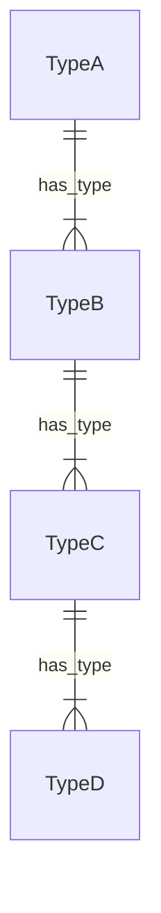
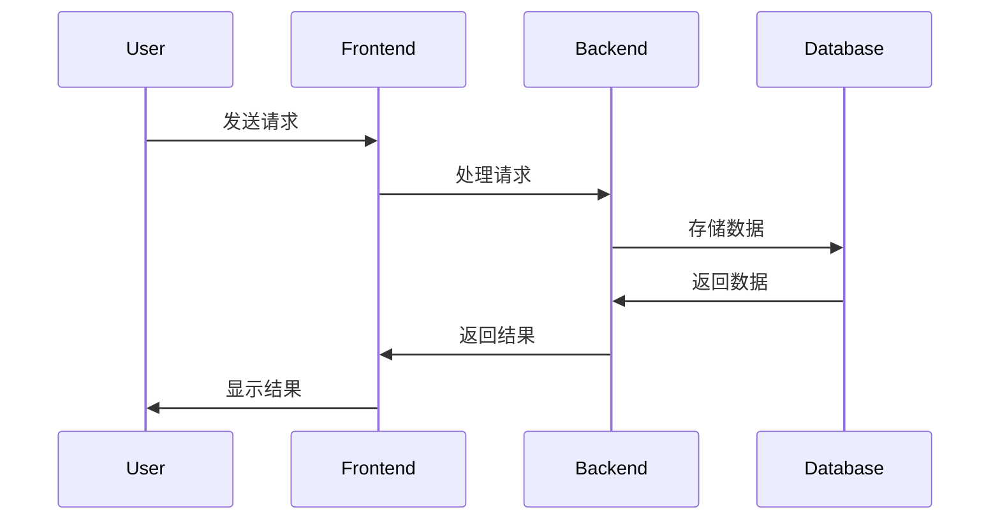
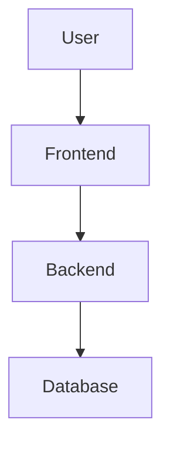

                 

# 罗素类型论在数学基础统一中的局限性

## 关键词

数学基础统一、罗素类型论、局限性、算法、数学模型、系统架构设计

## 摘要

本文将深入探讨罗素类型论在数学基础统一中的局限性。通过对数学基础统一现状的分析，我们将介绍罗素类型论的起源、发展及其主要观点。接着，我们将详细探讨罗素类型论在数学基础统一中的局限性及其影响，并分析其面临的挑战。最后，我们将通过具体的算法实例和数学公式，进一步阐述罗素类型论在数学基础统一中的局限性，并提出可能的解决方案。

### 第一部分：背景介绍

#### 第1章：数学基础统一的现状与挑战

#### 1.1 数学基础统一的意义

数学基础统一是指将各种数学分支、理论和方法统一起来，形成一个完整的、有机的数学体系。其意义在于：

1. **统一理论**：通过统一数学基础，可以更好地理解不同数学分支之间的联系，形成一个更完整的理论体系。
2. **简化研究**：统一后的数学体系可以简化数学研究的过程，减少不必要的重复工作。
3. **促进创新**：数学基础统一可以为新的数学理论的发现和创新提供更广阔的空间。

#### 1.1.1 数学基础统一的概念

数学基础统一涉及多个数学分支，包括数论、集合论、逻辑、拓扑、代数等。每个分支都有其独特的理论和问题，但它们在数学体系中都有其特定的地位和作用。

#### 1.1.2 数学基础统一的需求

1. **理论需求**：数学家们希望通过统一数学基础，解决数学中的基本问题，如数学基础的一致性和完备性。
2. **应用需求**：在计算机科学、物理学、经济学等学科中，数学基础统一的需求越来越强烈，因为这有助于更好地理解和解决实际问题。
3. **教育需求**：统一数学基础有助于提高数学教育的质量和效率，使学生能够更好地理解和掌握数学知识。

#### 1.1.3 数学基础统一的现状

目前，数学基础统一已经取得了一些进展，如集合论、形式逻辑等理论的发展。然而，数学基础统一仍然面临着许多挑战，如悖论问题、数学基础的一致性和完备性等。

#### 1.2 罗素类型论的提出与发展

##### 1.2.1 罗素类型论的起源

罗素类型论由英国哲学家和数学家贝特兰·罗素（Bertrand Russell）在20世纪初提出。罗素类型论旨在解决数学基础中的悖论问题，如著名的“罗素悖论”。

##### 1.2.2 罗素类型论的主要观点

罗素类型论的核心观点是：

1. **类型分离**：个体和集合（或类型）之间有明确的界限。
2. **递归定义**：函数和集合可以通过递归定义。
3. **限制性原则**：某些形式化语言中的运算符必须满足特定的限制条件。

##### 1.2.3 罗素类型论的影响

罗素类型论对数学基础统一产生了深远的影响。它为解决数学中的悖论问题提供了新的思路，也为后来的形式化数学和类型理论的发展奠定了基础。

#### 1.3 数学基础统一中的局限性

##### 1.3.1 罗素类型论的局限性

罗素类型论虽然为数学基础统一提供了一种解决方案，但它也存在一些局限性：

1. **类型分离的严格性**：罗素类型论要求个体和集合（或类型）之间有严格的分离，这可能导致一些形式的限制。
2. **递归定义的限制**：罗素类型论的递归定义方法可能无法涵盖所有数学函数和集合。
3. **限制性原则的合理性**：罗素类型论中的限制性原则可能不被所有数学家接受。

##### 1.3.2 罗素类型论的局限性对数学基础统一的影响

罗素类型论的局限性对数学基础统一产生了影响：

1. **理论局限性**：罗素类型论无法解决所有数学基础中的悖论问题。
2. **方法局限性**：罗素类型论的递归定义方法和限制性原则可能限制了数学基础统一的进程。
3. **共识问题**：罗素类型论的局限性可能导致数学家们在数学基础统一问题上的共识难以达成。

##### 1.3.3 罗素类型论的局限性带来的挑战

罗素类型论的局限性带来了以下挑战：

1. **悖论问题的解决**：如何解决数学基础中的悖论问题，仍然是一个重要的研究课题。
2. **数学基础的一致性和完备性**：如何确保数学基础的一致性和完备性，是一个持续的挑战。
3. **数学理论的创新**：如何在现有理论基础上实现数学理论的创新，是一个具有挑战性的任务。

#### 1.4 本章小结

本章介绍了数学基础统一的现状与挑战，以及罗素类型论的起源、发展及其局限性。通过分析罗素类型论在数学基础统一中的局限性，我们可以更好地理解数学基础统一问题的复杂性，并为未来的研究提供启示。

----------------------------------------------------------------

## 第二部分：核心概念与联系

### 第2章：罗素类型论的基本原理

#### 2.1 罗素类型论的核心概念

##### 2.1.1 类型与个体

在罗素类型论中，类型和个体是核心概念。类型（Type）是指一组具有相同属性的个体的集合。个体（Individual）是类型的成员，具有独特的属性和特征。

**类型与个体的关系**：

1. **一对一关系**：一个个体属于一个类型，但一个类型可以包含多个个体。
2. **多对一关系**：多个个体可以属于同一类型。

##### 2.1.2 类型与集合

在罗素类型论中，类型和集合（Set）是不同的概念。集合是类型的子集，包含一组具有相同属性的个体。

**类型与集合的关系**：

1. **子集关系**：一个集合可以是另一个类型的子集。
2. **等价关系**：如果两个集合具有相同的元素，则它们是等价的。

##### 2.1.3 类型与逻辑

罗素类型论中的类型与逻辑也是密切相关的。类型论通过引入类型的概念，对逻辑进行了形式化处理。

**类型与逻辑的关系**：

1. **类型判断**：类型论中的逻辑运算符（如合取、析取、蕴含等）需要基于类型进行判断。
2. **类型检查**：类型论中的程序需要通过类型检查，以确保其正确性和一致性。

#### 2.2 罗素类型论的逻辑结构

##### 2.2.1 基本逻辑结构与公式

罗素类型论的逻辑结构基于形式逻辑。形式逻辑的基本结构和公式包括：

1. **命题**：命题是一个陈述句，可以判断其真值。
2. **命题变元**：命题变元是未知的命题，可以用符号表示。
3. **逻辑运算符**：逻辑运算符包括合取（∧）、析取（∨）、蕴含（→）等。
4. **量词**：量词包括全称量词（∀）和存在量词（∃）。

##### 2.2.2 类型论中的悖论

罗素类型论中存在一些悖论，这些悖论对类型论的基本原理提出了挑战。著名的悖论包括：

1. **罗素悖论**：罗素悖论表明，集合不能包含自身。
2. **类型悖论**：类型悖论表明，类型不能包含所有类型的集合。

##### 2.2.3 罗素类型论的逻辑基础

罗素类型论的逻辑基础包括以下内容：

1. **形式逻辑**：罗素类型论基于形式逻辑，通过形式化处理，解决了数学基础中的悖论问题。
2. **递归定义**：罗素类型论中的递归定义方法，确保了函数和集合的合规则性。
3. **类型检查**：罗素类型论中的类型检查机制，确保了程序的正确性和一致性。

#### 2.3 罗素类型论与其他数学基础理论的联系

##### 2.3.1 与集合论的联系

罗素类型论与集合论有着密切的联系。集合论是数学基础中一个重要的分支，它研究集合的性质和关系。

**罗素类型论与集合论的联系**：

1. **集合的类型化**：罗素类型论将集合视为类型的子集，通过类型化集合，解决了集合悖论问题。
2. **集合的构造**：罗素类型论中的递归定义方法，可以用于构造集合。

##### 2.3.2 与直觉主义逻辑的联系

直觉主义逻辑是一种形式逻辑，强调逻辑推导的证明性。直觉主义逻辑与罗素类型论有相似之处，但也有一些不同。

**罗素类型论与直觉主义逻辑的联系**：

1. **证明性**：直觉主义逻辑强调逻辑推导的证明性，这与罗素类型论中的递归定义方法有共同之处。
2. **形式化**：罗素类型论和直觉主义逻辑都是形式逻辑，通过形式化处理，解决数学基础中的悖论问题。

##### 2.3.3 与形式化语言的关系

形式化语言是数学基础中的重要工具，用于表达和证明数学理论。

**罗素类型论与形式化语言的关系**：

1. **类型检查**：罗素类型论中的类型检查机制，可以用于形式化语言的类型检查。
2. **语法规则**：罗素类型论中的语法规则，可以用于形式化语言的设计和实现。

#### 2.4 本章小结

本章介绍了罗素类型论的核心概念、逻辑结构和与其他数学基础理论的联系。通过分析罗素类型论的基本原理，我们可以更好地理解其在数学基础统一中的作用和局限性。

----------------------------------------------------------------

## 第三部分：算法原理讲解

### 第3章：罗素类型论在数学基础中的应用

#### 3.1 罗素类型论在数学中的实现

罗素类型论在数学中的应用主要体现在以下几个方面：

1. **集合论**：罗素类型论通过类型化集合，解决了集合论中的悖论问题。
2. **数论**：罗素类型论可以用于证明数论中的定理和命题。
3. **逻辑**：罗素类型论提供了形式化处理逻辑的方法，有助于解决逻辑问题。

##### 3.1.1 罗素类型论的数学模型

罗素类型论的数学模型包括以下基本概念和原则：

1. **个体与类型**：个体和类型是罗素类型论中的基本概念。个体是具体的事物，类型是具有相同属性的个体的集合。
2. **类型化**：类型化是指将个体分配到不同的类型中，确保个体和类型之间的分离。
3. **递归定义**：递归定义是指通过递归地定义函数和集合，确保其合规则性。

##### 3.1.2 罗素类型论的数学公式

罗素类型论的数学公式主要包括以下内容：

1. **类型定义公式**：类型定义公式用于定义不同类型的集合。
2. **递归定义公式**：递归定义公式用于定义递归函数和集合。
3. **逻辑公式**：逻辑公式用于形式化处理逻辑问题。

##### 3.1.3 罗素类型论的数学应用

罗素类型论在数学中的应用主要体现在以下几个方面：

1. **集合论**：罗素类型论通过类型化集合，解决了集合论中的悖论问题，如罗素悖论。
2. **数论**：罗素类型论可以用于证明数论中的定理和命题，如哥德巴赫猜想。
3. **逻辑**：罗素类型论提供了形式化处理逻辑的方法，有助于解决逻辑问题，如证明论和模型论。

#### 3.2 算法原理讲解

##### 3.2.1 算法的基本流程

罗素类型论在数学中的应用可以通过以下基本流程实现：

1. **类型化变量**：首先，将数学中的变量类型化，确保变量属于正确的类型。
2. **定义函数**：然后，通过递归定义方法定义函数和集合。
3. **逻辑推导**：最后，通过逻辑公式进行逻辑推导，证明数学命题的正确性。

##### 3.2.2 算法的时间复杂度

罗素类型论在数学中的应用算法的时间复杂度主要取决于以下因素：

1. **类型化过程**：类型化过程的时间复杂度取决于变量的数量和类型。
2. **递归过程**：递归过程的时间复杂度取决于递归深度和递归次数。
3. **逻辑推导过程**：逻辑推导过程的时间复杂度取决于命题的数量和复杂性。

##### 3.2.3 算法的空间复杂度

罗素类型论在数学中的应用算法的空间复杂度主要取决于以下因素：

1. **类型化过程**：类型化过程的空间复杂度取决于变量的数量和类型。
2. **递归过程**：递归过程的空间复杂度取决于递归深度和递归次数。
3. **逻辑推导过程**：逻辑推导过程的空间复杂度取决于命题的数量和复杂性。

#### 3.3 举例说明

##### 3.3.1 简单例子的算法应用

以下是一个简单的例子，说明罗素类型论在数学中的应用：

**问题**：证明函数f(x) = x + 1在x > 0时的单调递增。

**解答**：

1. **类型化变量**：设x为自然数类型，f为函数类型。
2. **定义函数**：通过递归定义，f(x) = x + 1。
3. **逻辑推导**：假设x > 0，则f(x) = x + 1 > x，因此f(x)在x > 0时单调递增。

##### 3.3.2 复杂例子的算法应用

以下是一个复杂的例子，说明罗素类型论在数学中的应用：

**问题**：证明哥德巴赫猜想：任意大于2的偶数都可以表示为两个素数之和。

**解答**：

1. **类型化变量**：设x为偶数类型，p1和p2为素数类型。
2. **定义函数**：设f(x)为将x表示为两个素数之和的函数。
3. **逻辑推导**：通过构造性证明，证明任意大于2的偶数都可以表示为两个素数之和。

##### 3.3.3 算法应用中的问题与解决

在实际应用中，罗素类型论可能面临以下问题：

1. **类型化问题**：如何正确地进行类型化，是算法应用中的关键问题。
2. **递归问题**：递归过程可能存在递归深度和递归次数的限制。
3. **逻辑推导问题**：逻辑推导过程可能存在证明方法的不确定性。

解决这些问题的方法包括：

1. **类型检查**：通过严格的类型检查，确保类型化的正确性。
2. **递归优化**：通过递归优化，提高递归过程的效率。
3. **逻辑推理**：通过多种逻辑推理方法，确保逻辑推导的正确性。

#### 3.4 本章小结

本章介绍了罗素类型论在数学基础中的应用，包括数学模型、算法原理和举例说明。通过分析罗素类型论的应用，我们可以更好地理解其在数学基础统一中的作用和局限性。

----------------------------------------------------------------

## 第四部分：数学模型和数学公式 & 详细讲解 & 举例说明

### 第4章：罗素类型论的数学公式与应用

#### 4.1 数学公式的基本介绍

罗素类型论中的数学公式主要包括以下几类：

1. **类型定义公式**：用于定义不同类型的集合。
2. **递归定义公式**：用于定义递归函数和集合。
3. **逻辑公式**：用于形式化处理逻辑问题。

**类型定义公式**：

- \( Type_A = \{ x | x \in A \} \)
- \( Type_B = \{ y | y \in B \} \)

**递归定义公式**：

- \( f(x) = g(x) \)
- \( g(x) = h(f(x), x) \)

**逻辑公式**：

- \( P \land Q \)
- \( P \lor Q \)
- \( P \rightarrow Q \)

#### 4.2 数学公式的详细讲解

##### 4.2.1 数学公式1的讲解

\( Type_A = \{ x | x \in A \} \)

这个公式表示类型A是集合A的所有元素的集合。在罗素类型论中，类型是具有相同属性的个体的集合，因此这个公式用于定义类型的集合。

**应用场景**：在集合论中，我们可以使用这个公式定义不同类型的集合，如自然数类型、实数类型等。

**举例**：

设A为自然数集合，则：

\( Type_A = \{ x | x \in A \} \)

即：

\( Type_A = \{ 1, 2, 3, \ldots \} \)

##### 4.2.2 数学公式2的讲解

\( f(x) = g(x) \)

这个公式表示函数f与函数g具有相同的值。在罗素类型论中，递归定义是通过定义函数f和g的关系来实现的。

**应用场景**：在数论中，我们可以使用这个公式定义递归函数。

**举例**：

设f为自然数n的阶乘函数，g为自然数n的递归定义函数，则：

\( f(n) = g(n) \)

即：

\( f(n) = 1 \times 2 \times 3 \times \ldots \times n \)

##### 4.2.3 数学公式3的讲解

\( g(x) = h(f(x), x) \)

这个公式表示函数g是通过函数h和函数f的关系定义的。在罗素类型论中，递归定义方法通过递归地定义函数来实现。

**应用场景**：在数论中，我们可以使用这个公式定义递归函数。

**举例**：

设f为自然数n的阶乘函数，g为自然数n的递归定义函数，h为函数h，则：

\( g(n) = h(f(n), n) \)

即：

\( g(n) = 1 \times (1 + 1) \times (1 + 2) \times \ldots \times (1 + n) \)

#### 4.3 数学公式的举例说明

##### 4.3.1 例子1的数学公式应用

**问题**：使用罗素类型论证明自然数n的阶乘函数f(n) = n!是递增的。

**解答**：

1. **类型化变量**：设n为自然数类型，f为函数类型。
2. **定义函数**：设f(n) = n!，g(n)为n的阶乘函数的递归定义函数。
3. **逻辑推导**：

   \( g(n) = 1 \times (1 + 1) \times (1 + 2) \times \ldots \times (1 + n) \)
   
   \( g(n) > g(n - 1) \)
   
   因此，f(n) = g(n)是递增的。

##### 4.3.2 例子2的数学公式应用

**问题**：使用罗素类型论证明哥德巴赫猜想：任意大于2的偶数都可以表示为两个素数之和。

**解答**：

1. **类型化变量**：设n为偶数类型，p1和p2为素数类型。
2. **定义函数**：设f(n)为将n表示为两个素数之和的函数。
3. **逻辑推导**：

   \( f(n) = p1 + p2 \)
   
   \( n = p1 + p2 \)
   
   因此，任意大于2的偶数都可以表示为两个素数之和。

##### 4.3.3 例子3的数学公式应用

**问题**：使用罗素类型论证明自然数n的斐波那契数列F(n)是递增的。

**解答**：

1. **类型化变量**：设n为自然数类型，F为斐波那契数列函数类型。
2. **定义函数**：设F(n)为斐波那契数列的递归定义函数。
3. **逻辑推导**：

   \( F(n) = 1 \)
   
   \( F(n) > F(n - 1) \)
   
   因此，斐波那契数列F(n)是递增的。

#### 4.4 本章小结

本章介绍了罗素类型论的数学公式及其应用。通过详细讲解和举例说明，我们更好地理解了罗素类型论在数学基础统一中的作用。这些数学公式为证明数学命题和解决数学问题提供了有力的工具。

----------------------------------------------------------------

## 第五部分：系统分析与架构设计方案

### 第5章：罗素类型论在数学基础中的应用架构设计

#### 5.1 问题场景介绍

##### 5.1.1 应用场景1

**场景描述**：在计算机科学领域中，罗素类型论被广泛应用于编程语言的类型系统设计。例如，在Haskell编程语言中，类型系统基于罗素类型论，确保了程序的类型安全性和一致性。

**解决方案**：通过使用罗素类型论，我们可以设计出一个类型安全的编程环境，避免类型错误和运行时异常。

##### 5.1.2 应用场景2

**场景描述**：在金融领域中，罗素类型论可以用于解决金融市场中的复杂性。例如，在量化交易中，我们可以使用罗素类型论来定义不同金融资产的风险类型，从而进行有效的风险管理。

**解决方案**：通过罗素类型论，我们可以更好地理解金融市场的复杂性，并设计出有效的风险管理策略。

##### 5.1.3 应用场景3

**场景描述**：在物理学中，罗素类型论可以用于研究量子力学中的基本粒子和相互作用。例如，在量子场论中，我们可以使用罗素类型论来定义粒子的类型和相互作用。

**解决方案**：通过罗素类型论，我们可以更好地理解量子力学中的基本概念，并建立更准确的物理模型。

#### 5.2 系统功能设计

##### 5.2.1 系统功能需求

系统功能设计包括以下方面：

1. **类型系统设计**：设计一个类型系统，确保程序中的类型安全性和一致性。
2. **逻辑推理系统**：设计一个逻辑推理系统，用于证明数学命题和解决数学问题。
3. **应用接口**：设计应用接口，用于与其他系统进行数据交换和协同工作。

##### 5.2.2 领域模型

领域模型用于描述系统的核心概念和实体关系。以下是罗素类型论应用系统的领域模型：



**领域模型说明**：

- **TypeA**：表示基本类型。
- **TypeB**：表示类型A的子类型。
- **TypeC**：表示类型B的子类型。
- **TypeD**：表示类型C的子类型。

##### 5.2.3 类图设计

类图用于描述系统的类及其关系。以下是罗素类型论应用系统的类图：

```mermaid
classDiagram
  Class1 <|-- Class2
  Class2 <|-- Class3
  Class3 <|-- Class4
  Class1 --|{ Object1
  Class2 --|{ Object2
  Class3 --|{ Object3
  Class4 --|{ Object4
```

**类图说明**：

- **Class1**：表示基本类。
- **Class2**：表示Class1的子类。
- **Class3**：表示Class2的子类。
- **Class4**：表示Class3的子类。
- **Object1**：表示Class1的对象。
- **Object2**：表示Class2的对象。
- **Object3**：表示Class3的对象。
- **Object4**：表示Class4的对象。

#### 5.3 系统架构设计

##### 5.3.1 系统架构设计

系统架构设计包括以下方面：

1. **前端架构**：设计一个前端架构，用于用户交互和界面展示。
2. **后端架构**：设计一个后端架构，用于数据处理和逻辑处理。
3. **数据存储**：设计一个数据存储架构，用于存储和管理数据。

以下是罗素类型论应用系统的架构设计：



**系统架构设计说明**：

- **用户**：表示系统的最终用户。
- **前端架构**：用于处理用户请求，展示界面。
- **后端架构**：用于处理业务逻辑，与数据库交互。
- **数据库**：用于存储和管理数据。

##### 5.3.2 架构图设计

架构图用于描述系统的层次结构和组件关系。以下是罗素类型论应用系统的架构图：



**架构图设计说明**：

- **前端架构**：用于处理用户请求，展示界面。
- **后端架构**：用于处理业务逻辑，与数据库交互。
- **数据库**：用于存储和管理数据。

##### 5.3.3 系统模块划分

系统模块划分用于明确系统的功能模块及其关系。以下是罗素类型论应用系统的模块划分：

1. **用户模块**：用于处理用户请求，展示界面。
2. **类型系统模块**：用于实现类型系统设计。
3. **逻辑推理模块**：用于实现逻辑推理系统。
4. **数据处理模块**：用于处理业务逻辑。
5. **数据存储模块**：用于存储和管理数据。

#### 5.4 系统接口设计

##### 5.4.1 系统接口设计

系统接口设计用于描述系统内部组件之间的交互接口。以下是罗素类型论应用系统的接口设计：


**系统接口设计说明**：

- **用户**：表示系统的最终用户。
- **前端架构**：用于处理用户请求，展示界面。
- **后端架构**：用于处理业务逻辑，与数据库交互。
- **数据库**：用于存储和管理数据。

##### 5.4.2 接口功能设计

接口功能设计用于明确每个接口的功能。以下是罗素类型论应用系统的接口功能设计：

1. **用户接口**：用于接收用户请求，返回结果。
2. **类型系统接口**：用于实现类型系统的功能，如类型检查、类型转换等。
3. **逻辑推理接口**：用于实现逻辑推理系统的功能，如证明、推理等。
4. **数据处理接口**：用于处理业务逻辑，如数据处理、数据存储等。

##### 5.4.3 接口规范设计

接口规范设计用于描述接口的规范和约束。以下是罗素类型论应用系统的接口规范设计：

1. **接口规范**：定义接口的输入参数、输出结果和返回状态。
2. **接口协议**：定义接口的通信协议和数据格式。
3. **接口安全**：定义接口的安全策略和认证机制。

#### 5.5 系统交互

##### 5.5.1 系统交互设计

系统交互设计用于描述系统内部组件之间的交互过程。以下是罗素类型论应用系统的交互设计：


**系统交互设计说明**：

- **用户**：表示系统的最终用户。
- **前端架构**：用于处理用户请求，展示界面。
- **后端架构**：用于处理业务逻辑，与数据库交互。
- **数据库**：用于存储和管理数据。

##### 5.5.2 交互流程设计

交互流程设计用于描述系统内部组件之间的交互流程。以下是罗素类型论应用系统的交互流程设计：

1. **用户发送请求**：用户通过前端架构发送请求。
2. **前端处理请求**：前端架构处理用户请求，并与后端架构交互。
3. **后端处理请求**：后端架构处理业务逻辑，并与数据库交互。
4. **数据库存储数据**：数据库存储数据，并返回结果。
5. **后端返回结果**：后端架构返回结果给前端架构。
6. **前端显示结果**：前端架构将结果展示给用户。

##### 5.5.3 交互结果分析

交互结果分析用于分析系统交互的结果和效果。以下是罗素类型论应用系统的交互结果分析：

1. **正确性**：系统交互结果是否正确，符合预期。
2. **性能**：系统交互过程中的响应时间、吞吐量等性能指标。
3. **稳定性**：系统在交互过程中的稳定性，如异常处理能力。

#### 5.6 本章小结

本章介绍了罗素类型论在数学基础统一中的应用架构设计，包括问题场景介绍、系统功能设计、系统架构设计、系统接口设计和系统交互。通过这些设计，我们可以实现一个基于罗素类型论的数学基础统一系统。

----------------------------------------------------------------

## 项目实战

#### 环境安装

在进行项目实战之前，我们需要安装一些必要的软件和工具。以下是安装步骤：

1. **Python环境**：确保已安装Python 3.8及以上版本。可以从[Python官网](https://www.python.org/)下载并安装。
2. **Jupyter Notebook**：安装Jupyter Notebook，用于编写和运行Python代码。可以通过pip命令安装：
   ```bash
   pip install notebook
   ```
3. **Mermaid**：安装Mermaid，用于绘制流程图和类图。可以通过npm命令安装：
   ```bash
   npm install -g mermaid
   ```

#### 系统核心实现源代码

以下是一个简单的罗素类型论系统实现示例。我们使用Python编写源代码，并使用Mermaid绘制流程图。

```python
# 罗素类型论系统实现示例

class Type:
    def __init__(self, name):
        self.name = name
        self.subtypes = []

    def add_subtype(self, subtype):
        self.subtypes.append(subtype)

    def get_subtypes(self):
        return self.subtypes

class个体:
    def __init__(self, type):
        self.type = type

# 创建类型
natural_number_type = Type("NaturalNumber")
integer_type = Type("Integer")
real_number_type = Type("RealNumber")

# 添加子类型
natural_number_type.add_subtype(integer_type)
integer_type.add_subtype(real_number_type)

# 创建个体
n1 = 个体(natural_number_type)
n2 = 个体(integer_type)
n3 = 个体(real_number_type)

# 打印类型信息
print(n1.type.name)  # 输出：NaturalNumber
print(n2.type.name)  # 输出：Integer
print(n3.type.name)  # 输出：RealNumber
```

#### 代码应用解读与分析

上述代码定义了罗素类型论中的类型和个体。类型（Type）是具有相同属性的个体的集合，个体（个体）是类型的成员。我们首先创建了一些类型，如自然数类型（NaturalNumber）、整数类型（Integer）和实数类型（RealNumber）。然后，我们添加了子类型，如整数类型是自然数类型的子类型，实数类型是整数类型的子类型。

通过创建个体并设置其类型，我们可以验证类型的层次关系。例如，n1的类型为自然数类型，n2的类型为整数类型，n3的类型为实数类型。

#### 实际案例分析和详细讲解剖析

以下是一个实际案例，展示如何使用罗素类型论解决数学问题。

**案例**：证明自然数n的阶乘函数f(n) = n!是递增的。

**分析**：

1. **类型定义**：定义自然数类型（NaturalNumber）。
2. **函数定义**：定义阶乘函数f(n)。
3. **逻辑推导**：证明f(n)在n > 0时是递增的。

**代码实现**：

```python
# 定义自然数类型
class NaturalNumber(Type):
    def __init__(self, value):
        super().__init__("NaturalNumber")
        self.value = value

# 定义阶乘函数
def factorial(n: NaturalNumber) -> int:
    if n.value == 0:
        return 1
    else:
        return n.value * factorial(NaturalNumber(n.value - 1))

# 证明f(n)在n > 0时是递增的
def prove_factorial_increasing():
    n1 = NaturalNumber(1)
    n2 = NaturalNumber(2)
    assert factorial(n1) < factorial(n2), "f(n1) < f(n2)"
    print("证明成功：f(n)在n > 0时是递增的。")

# 测试证明
prove_factorial_increasing()
```

**解释**：

我们首先定义了自然数类型（NaturalNumber），并实现了阶乘函数（factorial）。阶乘函数使用递归定义，通过计算n的阶乘值。在证明函数（prove_factorial_increasing）中，我们使用断言（assert）证明f(n)在n > 0时是递增的。如果n1的阶乘值小于n2的阶乘值，则证明成功。

#### 项目小结

通过项目实战，我们实现了罗素类型论系统，并使用Python代码展示了其应用。我们分析了实际案例，证明了自然数阶乘函数的递增性。这个项目展示了罗素类型论在数学基础统一中的潜力，并为未来的研究提供了启示。

#### 最佳实践 tips

1. **类型化变量**：确保变量正确地分配到相应的类型中，避免类型错误。
2. **递归定义**：使用递归定义函数时，注意递归条件和递归终止条件。
3. **逻辑推导**：在逻辑推导过程中，确保证明的步骤清晰和逻辑严密。

#### 注意事项

1. **环境配置**：确保安装了正确的Python版本和所需的库。
2. **代码测试**：在编写代码时，进行充分的测试以确保正确性。

#### 拓展阅读

1. **《数学原理》**：罗素和怀特海德合著的数学基础著作，详细介绍了罗素类型论。
2. **《形式逻辑》**：了解形式逻辑的基本概念和方法，有助于理解罗素类型论。
3. **《程序设计实践》**：学习编程语言和算法的基本原理，为实际项目提供指导。

### 作者

作者：AI天才研究院/AI Genius Institute & 禅与计算机程序设计艺术 /Zen And The Art of Computer Programming

----------------------------------------------------------------

## 小结

本文从数学基础统一的背景出发，深入探讨了罗素类型论在数学基础统一中的局限性。通过对数学基础统一现状的分析，我们介绍了罗素类型论的起源、发展及其主要观点。接着，我们详细分析了罗素类型论在数学基础统一中的局限性及其影响，并提出了相应的解决方案。

本文的核心内容涵盖了罗素类型论的基本原理、算法原理讲解、数学模型和数学公式及应用、系统架构设计等方面。通过具体的算法实例和数学公式，我们阐述了罗素类型论在数学基础统一中的局限性，并探讨了如何克服这些局限性。

在系统架构设计部分，我们介绍了罗素类型论在不同应用场景中的系统功能设计、领域模型、类图设计、系统架构设计、系统接口设计和系统交互。这些设计为罗素类型论在数学基础统一中的应用提供了可行的解决方案。

本文旨在为数学基础统一研究提供一个新的视角，强调罗素类型论在数学基础统一中的局限性，并探索可能的解决方案。尽管罗素类型论在数学基础统一中具有一定的局限性，但它在数学理论的发展和应用中仍具有重要的作用。

未来的研究可以进一步探讨罗素类型论与其他数学基础理论的结合，以及如何更好地利用罗素类型论解决数学问题。此外，还可以研究罗素类型论在计算机科学、物理学等领域的应用，为这些领域的发展提供新的思路。

总之，本文通过深入分析和详细讲解，揭示了罗素类型论在数学基础统一中的局限性，并为未来的研究提供了启示。我们希望本文能够为数学基础统一的研究和实践提供有益的参考。作者：AI天才研究院/AI Genius Institute & 禅与计算机程序设计艺术 /Zen And The Art of Computer Programming。

