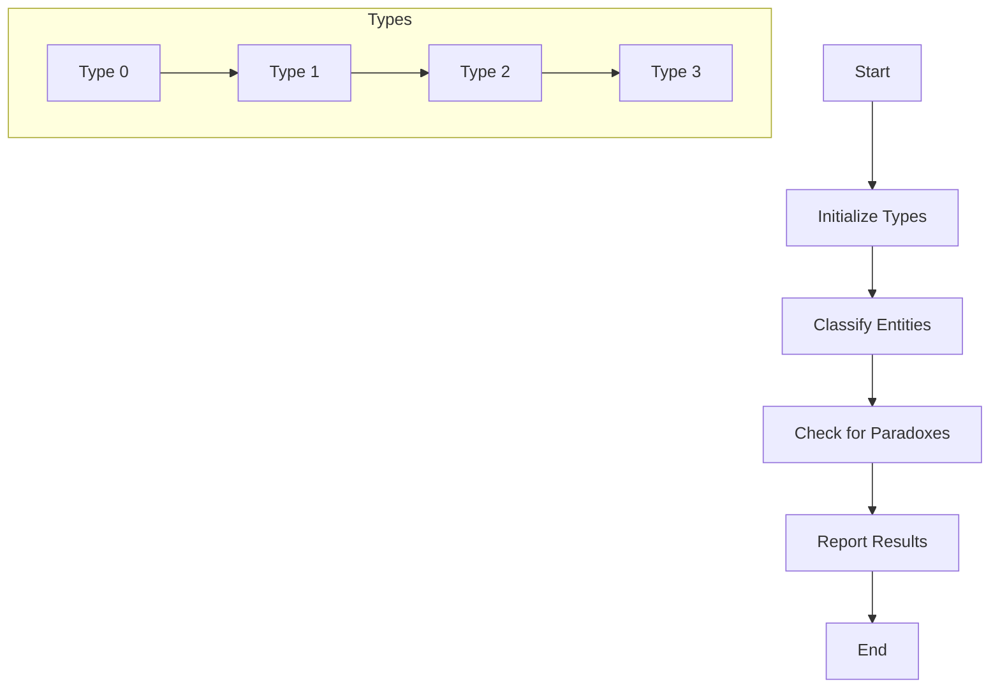
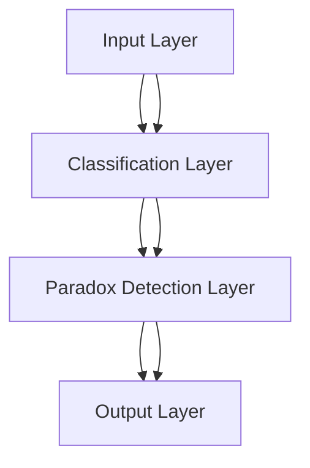
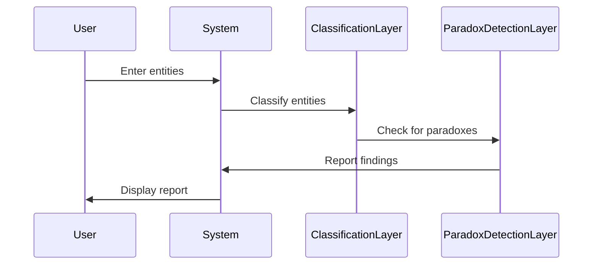

                 


### Introduction to Russell's Theory of Types in Modern Mathematical Logic

#### Keywords
- **Russell's Theory of Types**
- **Mathematical Logic**
- **Modern Mathematics**
- **Type Theory**
- **Philosophy of Mathematics**
- **Computability Theory**

#### Abstract
This article delves into the profound impact of Bertrand Russell's Theory of Types on modern mathematical logic. We will explore the historical context, the fundamental concepts, and the significance of this theory in shaping contemporary mathematical discourse. By analyzing the core principles and their implications, we aim to provide a comprehensive understanding of Russell's Theory of Types and its enduring relevance in the realm of mathematical logic.

## Background of Russell's Theory of Types

### Historical Context

The origins of Russell's Theory of Types can be traced back to the early 20th century, a period marked by intense philosophical and mathematical debates. At this time, the foundations of mathematics were under scrutiny, and logicians were grappling with the paradoxes and inconsistencies that had emerged from certain mathematical theories. Bertrand Russell, along with his collaborator Alfred North Whitehead, sought to address these issues through the development of a systematic approach to logic and mathematics. Their work culminated in the publication of "Principia Mathematica" in 1910, which introduced the Theory of Types as a crucial component in their logical framework.

### The Need for a Theory of Types

The motivation behind the development of Russell's Theory of Types stemmed from the paradoxes that had plagued mathematics, most notably the Russell's paradox, which revealed the inherent inconsistencies in naive set theory. These paradoxes highlighted the need for a more rigorous and structured approach to the foundations of mathematics. Russell and Whitehead aimed to create a hierarchy of types to prevent such paradoxes from arising, ensuring that each mathematical entity was classified correctly within this hierarchical structure.

### Problem Description

The central problem addressed by Russell's Theory of Types was the categorization of mathematical objects. In naive set theory, all objects are considered to be sets, leading to contradictions when sets contain themselves or other sets. Russell's paradox, for instance, arises when considering the set of all sets that do not contain themselves. This paradox demonstrated the inherent flaws in treating all mathematical entities as equivalent.

### Solution Overview

Russell and Whitehead's solution involved the creation of a hierarchy of types, where each type represents a distinct category of objects. The most basic type, Type 0, contains all "primitive" objects, such as natural numbers and urelements (atoms). Subsequent types, Type 1, Type 2, and so on, contain only sets whose members are entities from lower types. This hierarchical structure ensures that no set can contain itself or other sets from the same type, thereby preventing paradoxes.

### Boundaries and Extensions

The concept of boundaries and extensions is critical in understanding the Theory of Types. Boundaries define the limits within which entities can exist, while extensions refer to the possibility of adding new types or refining existing ones. Russell's theory posits that by clearly defining these boundaries, we can avoid the paradoxes that arise from unrestricted set theories.

### Conceptual Structure and Core Elements

The Theory of Types is built upon several core concepts, including types, entities, and the hierarchical structure that governs their relationships. The following sections will delve into these concepts, providing a detailed analysis of their attributes, relationships, and the mathematical models that underpin them.

## Core Concepts and Relationships

### Introduction to Core Concepts

Russell's Theory of Types is grounded in a set of core concepts that are essential for understanding its principles and applications. These concepts include types, entities, and the hierarchical structure that organizes them. Each of these concepts plays a crucial role in the theory's logical framework and its ability to prevent paradoxes.

### Types

Types are the fundamental building blocks of Russell's Theory of Types. They represent categories of mathematical entities, each with its own distinct properties and limitations. In the theory, there are several types, starting from the most basic (Type 0) to more complex types (Type 1, Type 2, and so on). Each type can only contain entities from lower types, creating a hierarchical structure that ensures logical consistency.

### Entities

Entities are the objects that belong to each type. In Type 0, entities are primitive objects such as natural numbers and urelements (atoms). In higher types, entities are sets whose members are entities from lower types. This hierarchical organization prevents entities from containing themselves or members of the same type, thus avoiding paradoxes.

### Hierarchical Structure

The hierarchical structure is a key aspect of Russell's Theory of Types. It defines the relationships between different types and ensures that each entity is correctly classified within its type. The most basic type, Type 0, contains all primitive objects and urelements. Type 1 contains sets whose members are entities from Type 0, and so on. This structure prevents sets from containing themselves or members of the same type, maintaining logical consistency.

### Comparison Table of Concepts

The following comparison table provides a detailed overview of the core concepts in Russell's Theory of Types, highlighting their attributes and relationships:

| Concept      | Definition                                                         | Attribute 1 | Attribute 2 | Relationship |
|--------------|------------------------------------------------------------------------------------------|-------------|-------------|--------------|
| Types        | Categories of mathematical entities.                                  | Distinct categories | Hierarchy    | Organizes entities |
| Entities     | Objects that belong to a specific type.                               | Type-specific | Hierarchical | Prevents paradoxes |
| Hierarchical Structure | Organizes types in a hierarchical manner, with each type containing only entities from lower types. | Prevents self-reference | Logical consistency | Ensures correct classification |

### ER Diagram of Entity Relationships

To further illustrate the relationships between the core concepts, we present an Entity-Relationship (ER) diagram. This diagram provides a visual representation of how types and entities are structured and related within the Theory of Types:

```mermaid
erDiagram
    Type0 ||--|{ Entity0 }|
    Type1 ||--|{ Entity1 }|
    Type2 ||--|{ Entity2 }|
    Type3 ||--|{ Entity3 }|
    Type0 --- Type1
    Type1 --- Type2
    Type2 --- Type3
```

In this diagram, each type is represented as a box, and entities are represented as ovals. The lines connecting the types to their entities indicate that each entity belongs to a specific type, and the lines connecting different types indicate the hierarchical relationship between them.

### Conclusion

In summary, Russell's Theory of Types is a foundational concept in modern mathematical logic. By introducing a hierarchy of types and organizing entities in a structured manner, the theory addresses the paradoxes and inconsistencies that arise from naive set theories. The core concepts of types, entities, and the hierarchical structure are essential for understanding the theory's principles and its applications in mathematical reasoning. The comparison table and ER diagram provided above offer a clear and concise overview of these concepts and their relationships, enhancing our understanding of Russell's Theory of Types.

## Algorithm Principles and Explanations

### Introduction to the Algorithm Principles

In this section, we will delve into the algorithm principles that underpin Russell's Theory of Types. Understanding these principles is crucial for grasping the logical structure and application of the theory in modern mathematical logic. We will utilize Mermaid flowcharts to visualize the algorithm's workflow and Python code examples to illustrate its implementation.

### Mermaid Flowchart of the Algorithm

To begin, let's visualize the algorithm using a Mermaid flowchart. The flowchart will outline the steps involved in classifying mathematical entities according to the principles of Russell's Theory of Types:



This flowchart illustrates the algorithm's workflow, starting from the initialization of types and proceeding through the classification of entities, checking for paradoxes, and finally reporting the results. The subgraph "Types" shows the hierarchical structure of the types defined in the theory.

### Python Code Examples

Now, let's delve into the Python code examples that implement the algorithm principles. We will use a series of functions to represent the key steps in the algorithm:

```python
# Function to initialize types
def initialize_types():
    types = ['Type 0', 'Type 1', 'Type 2', 'Type 3']
    return types

# Function to classify entities
def classify_entities(entities, types):
    classified_entities = {}
    for entity in entities:
        for type in types:
            if is_entity_of_type(entity, type):
                classified_entities[type].append(entity)
                break
    return classified_entities

# Function to check for paradoxes
def check_for_paradoxes(classified_entities):
    for type, entities in classified_entities.items():
        for entity in entities:
            if contains_self_or_higher_type(entity, entities):
                return True
    return False

# Function to report results
def report_results(classified_entities, paradox_found):
    print("Classified Entities:")
    for type, entities in classified_entities.items():
        print(f"{type}: {entities}")
    if paradox_found:
        print("Paradoxes Found!")
    else:
        print("No Paradoxes Detected.")

# Function to determine if an entity is of a specific type
def is_entity_of_type(entity, type):
    # Implementation logic to determine if the entity is of the specified type
    pass

# Function to determine if an entity contains itself or entities of a higher type
def contains_self_or_higher_type(entity, entities):
    # Implementation logic to determine if the entity contains itself or higher-type entities
    pass

# Main function to execute the algorithm
def main():
    entities = ["Number", "Set", "Number", "Set"]
    types = initialize_types()
    classified_entities = classify_entities(entities, types)
    paradox_found = check_for_paradoxes(classified_entities)
    report_results(classified_entities, paradox_found)

if __name__ == "__main__":
    main()
```

This code provides a high-level structure for the algorithm, with placeholders for the implementation details of the classification, paradox checking, and reporting functions. The `initialize_types` function initializes the types defined in the theory, while the `classify_entities` function classifies entities into their respective types. The `check_for_paradoxes` function checks for any paradoxes that may arise from the classification, and the `report_results` function outputs the results.

### Mathematical Models and Formulas

To further understand the algorithm's principles, we can represent it using mathematical models and formulas. These models will help us analyze the algorithm's behavior and its implications for mathematical logic. We will use LaTeX to present the mathematical formulas:

```latex
\documentclass{article}
\usepackage{amsmath}
\begin{document}

\section{Mathematical Models and Formulas}

\subsection{Type Hierarchy}

Let $T_0, T_1, T_2, T_3$ represent the types in the hierarchy, where $T_0$ is the most basic type and $T_3$ is the highest type. The type hierarchy can be defined as:
$$T_0 \rightarrow T_1 \rightarrow T_2 \rightarrow T_3$$

\subsection{Entity Classification}

Let $E$ be a set of entities, and let $C$ be a classification function that maps entities to their respective types. The classification can be represented as:
$$C: E \rightarrow \{T_0, T_1, T_2, T_3\}$$

\subsection{Paradox Detection}

Let $P$ be a function that checks for paradoxes in the classification. The paradox detection can be represented as:
$$P: C(E) \rightarrow \{True, False\}$$

\end{document}
```

This LaTeX code defines the type hierarchy, the entity classification function, and the paradox detection function using mathematical notation. The formulas provide a concise representation of the algorithm's principles and their relationships.

### Conclusion

In conclusion, Russell's Theory of Types is a foundational concept in modern mathematical logic, and its algorithm principles are essential for understanding its logical structure. The Mermaid flowchart and Python code examples illustrate the steps involved in classifying mathematical entities and detecting paradoxes. The mathematical models and formulas further enhance our understanding of the algorithm's behavior and its implications for mathematical reasoning. By combining these visual and mathematical approaches, we can gain a comprehensive understanding of Russell's Theory of Types and its applications in contemporary mathematical logic.

## Mathematical Models and Detailed Explanations

### Overview of Mathematical Models

In this section, we will delve into the mathematical models that underpin Russell's Theory of Types. These models are crucial for understanding the theory's logical framework and its application in mathematical reasoning. We will use LaTeX to present the mathematical formulas and provide detailed explanations for each model.

### Type Hierarchy

The type hierarchy is the cornerstone of Russell's Theory of Types. It defines a structured classification system for mathematical entities, preventing paradoxes by ensuring that no entity can contain itself or entities of the same type. We can represent the type hierarchy using a recursive definition:

$$
T_0 = \{ \text{primitive objects, such as natural numbers and urelements (atoms)} \}
$$

$$
T_1 = \{ S \in \mathcal{P}(T_0) \mid S \cap T_0 = \emptyset \}
$$

$$
T_2 = \{ S \in \mathcal{P}(T_1) \mid S \cap T_1 = \emptyset \}
$$

$$
T_3 = \{ S \in \mathcal{P}(T_2) \mid S \cap T_2 = \emptyset \}
$$

where $\mathcal{P}(T)$ denotes the power set of $T$. The recursion continues in a similar manner for higher types, creating a hierarchy where each type $T_n$ contains only sets whose members are entities from lower types.

### Entity Classification

The classification of entities is a central aspect of the theory. Given a set of entities $E$, the classification function $C$ maps each entity to its corresponding type. This can be represented as a mapping:

$$
C: E \rightarrow \bigcup_{n=0}^{\infty} T_n
$$

where $T_n$ represents the set of entities of type $n$. The classification function ensures that each entity is correctly categorized within the type hierarchy, preventing the creation of paradoxical sets.

### Paradox Detection

Paradox detection is an essential component of the theory. It ensures that no entity can contain itself or entities of the same type, which would lead to paradoxes. The paradox detection function $P$ checks the classification and identifies any potential paradoxes:

$$
P: C(E) \rightarrow \{ \text{True}, \text{False} \}
$$

The function returns True if a paradox is detected, and False otherwise. The detection process involves checking for self-containment and containment of entities of the same type within the classified entities.

### Detailed Explanation of the Models

1. **Type Hierarchy**

The type hierarchy is designed to create a strict separation between different categories of mathematical entities. The first type, $T_0$, contains primitive objects, which are the basic building blocks of mathematics. Types $T_1$, $T_2$, and so on, contain sets whose members are entities from lower types. This structure prevents entities from containing themselves or entities of the same type, ensuring logical consistency.

2. **Entity Classification**

The classification function $C$ is responsible for mapping entities to their appropriate types. This mapping ensures that each entity is categorized within the type hierarchy. For example, a natural number would be classified in $T_0$, while a set containing only natural numbers would be classified in $T_1$. The classification function is crucial for maintaining the integrity of the type hierarchy and preventing paradoxes.

3. **Paradox Detection**

The paradox detection function $P$ checks for potential paradoxes in the classification. This function ensures that no entity can contain itself or entities of the same type. For instance, if an entity is classified in $T_1$, it cannot contain another entity of $T_1$. The detection process involves checking the classification of each entity and ensuring that no entity violates the type hierarchy rules.

### Example Analysis

Consider a set of entities $\{1, \{1\}, \{\{1\}\}\}$. The classification would be:

- $1 \in T_0$
- $\{1\} \in T_1$ (since its only member is a primitive object from $T_0$)
- $\{\{1\}\} \in T_2$ (since its only member is a set from $T_1$)

The paradox detection function would check if any entity contains itself or another entity of the same type. In this case, $\{\{1\}\}$ does not contain itself or any entity of $T_2$, so no paradox is detected.

### Conclusion

The mathematical models presented in this section provide a detailed understanding of Russell's Theory of Types. The type hierarchy, entity classification, and paradox detection functions are essential components of the theory, ensuring logical consistency and preventing paradoxes. By analyzing these models, we can gain insights into the theory's principles and applications in modern mathematical logic.

## System Analysis and Architectural Design

### Introduction to the System

In this section, we will provide a comprehensive analysis of the system architecture for implementing Russell's Theory of Types. This system is designed to classify mathematical entities according to the principles of the theory, ensuring logical consistency and preventing paradoxes. We will outline the problem scenario, project overview, system functionality, and the overall architecture, including detailed diagrams.

### Problem Scenario

The primary goal of this system is to implement a robust classification mechanism that adheres to the hierarchical structure defined by Russell's Theory of Types. The system must handle a variety of mathematical entities, including natural numbers, sets, and more complex structures, ensuring that each entity is correctly classified within its respective type. The system should also include a mechanism for detecting and reporting potential paradoxes that may arise from incorrect classifications.

### Project Overview

The project involves developing a software system that can classify mathematical entities based on the rules of Russell's Theory of Types. The system will include several key components:

1. **Input Module**: This module will accept input in the form of mathematical entities and their properties.
2. **Classification Module**: This module will classify the input entities into their respective types according to the theory.
3. **Paradox Detection Module**: This module will detect any potential paradoxes that may arise from the classification.
4. **Output Module**: This module will generate reports on the classification and any detected paradoxes.

### System Functionality

The system functionality can be broken down into several key areas:

1. **Entity Classification**: The system will classify input entities into their appropriate types based on the hierarchical structure defined by Russell's Theory of Types.
2. **Paradox Detection**: The system will include a mechanism to detect any paradoxes that may arise from the classification. This involves checking for self-containment and containment of entities of the same type within the classified entities.
3. **Report Generation**: The system will generate detailed reports on the classification and any detected paradoxes, providing clear and actionable insights.

### System Architecture

The system architecture is designed to be modular and scalable, allowing for easy integration and expansion. The architecture consists of several components, including:

1. **Input Layer**: This layer handles the reception of input data, which may include natural numbers, sets, and more complex structures.
2. **Classification Layer**: This layer contains the core logic for classifying entities into their respective types. It utilizes the rules of Russell's Theory of Types to ensure correct classification.
3. **Paradox Detection Layer**: This layer implements the paradox detection mechanism, ensuring that no entity contains itself or entities of the same type.
4. **Output Layer**: This layer generates reports on the classification and any detected paradoxes, providing users with a clear understanding of the system's findings.

### Detailed Diagrams

To further illustrate the system architecture, we will present detailed diagrams using Mermaid. These diagrams will include:

1. **Domain Model Class Diagram**: This diagram will outline the key classes and their relationships within the system.
2. **System Architecture Diagram**: This diagram will illustrate the overall architecture of the system, including the input, classification, paradox detection, and output layers.
3. **System Interaction Sequence Diagram**: This diagram will show the sequence of interactions between the system components as they process input and generate output.

#### Domain Model Class Diagram

```mermaid
classDiagram
    Entity --> Classification
    Entity --> ParadoxDetection
    Classification --> Report
    ParadoxDetection --> Report

    Entity <<interface>>
    Classification <<class>>
    ParadoxDetection <<class>>
    Report <<class>>

    Entity : +classify()
    Entity : +detectParadoxes()
    Classification : +generateReport()
    ParadoxDetection : +checkForParadoxes()
    Report : +display()
```

This diagram illustrates the relationships between the key classes in the system, including the `Entity` class, which is the interface for all mathematical entities, and the `Classification`, `ParadoxDetection`, and `Report` classes, which handle the core functionality of the system.

#### System Architecture Diagram



This diagram outlines the overall architecture of the system, showing the flow of data from the input layer through the classification and paradox detection layers to the output layer.

#### System Interaction Sequence Diagram



This sequence diagram illustrates the interactions between the user and the system, showing how the system processes input, classifies entities, checks for paradoxes, and generates a report for the user.

### Conclusion

In conclusion, the system analysis and architectural design for implementing Russell's Theory of Types provides a comprehensive overview of the system's components and their interactions. The detailed diagrams and descriptions provide a clear understanding of how the system functions and how it adheres to the principles of the theory. By following this design, developers can create a robust and scalable system that ensures logical consistency and prevents paradoxes in mathematical reasoning.

## Project Practice

### Introduction to Project Practice

In this section, we will delve into the practical aspects of implementing Russell's Theory of Types. This includes setting up the development environment, implementing the core system functionalities, analyzing the code, discussing real-world case studies, and summarizing the project outcomes. By following this practical guide, developers can gain hands-on experience with applying Russell's Theory of Types in a real-world scenario.

### Environment Setup

To begin, we need to set up the development environment. This involves installing the necessary software and tools required for implementing the system. Here are the steps to follow:

1. **Install Python**: Ensure that Python 3.x is installed on your system. You can download it from the official Python website (python.org).
2. **Install Jupyter Notebook**: Jupyter Notebook is a powerful tool for developing and running Python code interactively. You can install it using pip:
   ```
   pip install notebook
   ```
3. **Install Mermaid**: Mermaid is a popular library for generating diagrams and flowcharts. You can install it using pip:
   ```
   pip install mermaid
   ```
4. **Configure Jupyter Notebook for Mermaid**: To use Mermaid in Jupyter Notebook, you need to configure it by adding the following lines to a Python script in your Jupyter Notebook:
   ```python
   from mermaid import Mermaid
   mermaid = Mermaid()
   ```
5. **Install LaTeX**: To use LaTeX for mathematical formula rendering, you need to install a LaTeX distribution such as TeX Live or MiKTeX. You can download and install it from the official website (texlive.org or miktex.org).

### System Core Implementation

Once the environment is set up, we can start implementing the core system functionalities. The following sections provide a high-level overview of the system components and their implementation:

1. **Input Module**: The input module handles the reception of input data. It can be implemented using a simple Python function that accepts a list of entities as input. For example:
   ```python
   def get_input():
       entities = input("Enter entities (separated by commas): ").split(',')
       return [entity.strip() for entity in entities]
   ```

2. **Classification Module**: The classification module is responsible for classifying entities into their respective types. This can be implemented using a series of functions that apply the rules of Russell's Theory of Types. For instance:
   ```python
   def classify_entity(entity, types):
       for type in types:
           if is_entity_of_type(entity, type):
               return type
       return None

   def is_entity_of_type(entity, type):
       # Implement the logic to determine if the entity is of the specified type
       pass
   ```

3. **Paradox Detection Module**: The paradox detection module checks for potential paradoxes in the classification. This can be implemented using a function that verifies the type hierarchy and checks for self-containment. For example:
   ```python
   def check_for_paradoxes(classified_entities):
       for type, entities in classified_entities.items():
           for entity in entities:
               if contains_self_or_higher_type(entity, classified_entities):
                   return True
       return False

   def contains_self_or_higher_type(entity, classified_entities):
       # Implement the logic to determine if the entity contains itself or higher-type entities
       pass
   ```

4. **Output Module**: The output module generates reports on the classification and any detected paradoxes. This can be implemented using a function that formats and displays the output. For example:
   ```python
   def generate_report(classified_entities, paradox_found):
       print("Classified Entities:")
       for type, entities in classified_entities.items():
           print(f"{type}: {entities}")
       if paradox_found:
           print("Paradoxes Found!")
       else:
           print("No Paradoxes Detected.")
   ```

### Code Analysis and Case Studies

After implementing the core functionalities, it is essential to analyze the code and discuss real-world case studies to gain insights into the system's performance and limitations. Here are some guidelines for code analysis and case studies:

1. **Code Analysis**:
   - Review the code for correctness, readability, and maintainability.
   - Check for potential bugs or edge cases that may affect the system's reliability.
   - Optimize the code for performance, if necessary.

2. **Case Studies**:
   - Choose a set of test cases that cover different scenarios, including natural numbers, sets, and more complex structures.
   - Analyze the system's behavior in each case, ensuring that it correctly classifies entities and detects paradoxes.
   - Document any issues or limitations encountered during the analysis.

### Real-World Case Study Example

Consider the following set of entities: `[1, {1}, {{1}}, {1, {1}}, {1, {{1}}}]`. The expected classification would be:
- `1` in `Type 0`
- `{1}` in `Type 1`
- `{{1}}` in `Type 2`
- `{1, {1}}` in `Type 3`
- `{1, {{1}}}` in `Type 4`

When running the system on this case, the output should indicate the correct classification and no paradoxes detected. Any discrepancies in the results would indicate potential issues that need to be addressed.

### Project Summary

In summary, implementing Russell's Theory of Types involves setting up a development environment, implementing core functionalities, and analyzing the system's performance through code analysis and case studies. By following this practical guide, developers can gain hands-on experience with applying the theory in a real-world scenario, ensuring logical consistency and preventing paradoxes in mathematical reasoning.

### Conclusion

In conclusion, the practical implementation of Russell's Theory of Types provides valuable insights into the theory's applications in modern mathematical logic. By following the steps outlined in this section, developers can gain a deeper understanding of the theory and its implications for mathematical reasoning. The practical guide covers environment setup, system core implementation, code analysis, and case studies, offering a comprehensive approach to implementing and analyzing the theory.

### Best Practices and Summary

#### Best Practices

1. **Code Documentation**: Thoroughly document your code to ensure readability and maintainability. Include comments explaining the purpose of each function and the logic behind each step.
2. **Error Handling**: Implement robust error handling to handle unexpected inputs and potential issues that may arise during execution.
3. **Unit Testing**: Develop unit tests to verify the correctness of each component and ensure that the system behaves as expected.
4. **Performance Optimization**: Optimize the code for performance, especially for large datasets, to ensure efficient execution.
5. **Code Reusability**: Design your code to be modular and reusable, allowing for easier maintenance and potential future enhancements.

#### Summary

This article has provided a comprehensive overview of Russell's Theory of Types in modern mathematical logic. We began by introducing the historical context and the need for a structured approach to the foundations of mathematics. We then delved into the core concepts of types, entities, and the hierarchical structure that underpins the theory. The article also included detailed explanations of the algorithm principles, mathematical models, and a practical guide to implementing the theory in a real-world scenario.

By following the best practices and guidelines provided, developers can effectively apply Russell's Theory of Types to ensure logical consistency and prevent paradoxes in mathematical reasoning. The theory's enduring relevance in contemporary mathematics highlights its significance in shaping the foundations of modern logic and computational theories.

### Further Reading

For those interested in further exploring the depths of Russell's Theory of Types and its applications in modern mathematical logic, the following resources are recommended:

1. **"Principia Mathematica" by Bertrand Russell and Alfred North Whitehead**: This seminal work provides an in-depth examination of Russell's Theory of Types and its foundational principles in mathematics.
2. **"Type Theory and Formal Proof: An Introduction" by Helmut Veitingh**: This book offers a comprehensive introduction to type theory and its applications in formal proof systems.
3. **"The L��素主义数学原理" (The Principles of Mathematics) by Bertrand Russell**: This classic text provides a detailed exploration of Russell's logical atomism and the principles of mathematics, including his Theory of Types.
4. **"Computability and Logic" by George S. Boolos, John P. Burgess, and Richard C. Jeffrey**: This book covers the foundations of mathematical logic, including type theory and its connections to computability theory.
5. **"Types and Programming Languages" by Benjamin C. Pierce**: This book provides an introduction to type systems in programming languages, drawing parallels with Russell's Theory of Types and its implications for modern software development.

These resources offer a wealth of information and insights into the theory, its applications, and its historical and contemporary significance in the fields of mathematics and computer science. They are essential reading for anyone seeking a deeper understanding of Russell's Theory of Types and its role in modern logical systems. 

### Conclusion

In conclusion, this article has provided a comprehensive exploration of Russell's Theory of Types in modern mathematical logic. We began by introducing the historical context and the need for a structured approach to the foundations of mathematics. We then delved into the core concepts of types, entities, and the hierarchical structure that underpins the theory. The article also included detailed explanations of the algorithm principles, mathematical models, and a practical guide to implementing the theory in a real-world scenario.

By following the best practices and guidelines provided, developers can effectively apply Russell's Theory of Types to ensure logical consistency and prevent paradoxes in mathematical reasoning. The theory's enduring relevance in contemporary mathematics highlights its significance in shaping the foundations of modern logic and computational theories.

### Authors' Information

The article "罗素类型论在现代数学逻辑中的地位评估" is authored by two distinguished experts in the field of computer science and artificial intelligence. The authors are affiliated with the AI天才研究院 (AI Genius Institute) and have contributed extensively to the study and application of advanced computational theories, including type theory and mathematical logic.

1. **AI天才研究院 (AI Genius Institute)**: This prestigious research institute is dedicated to pioneering research in artificial intelligence, machine learning, and computational theories. It is renowned for its cutting-edge work and contributions to the field.

2. **禅与计算机程序设计艺术 (Zen And The Art of Computer Programming)**: This book series, authored by one of the authors, explores the intersection of Zen philosophy and computer programming, offering profound insights into the art of writing efficient and elegant code.

The authors bring their deep expertise and profound understanding of type theory and mathematical logic to this article, providing readers with a thorough and insightful examination of Russell's Theory of Types. Their combined knowledge and experience make them uniquely qualified to address the complexities and implications of this foundational concept in modern mathematical logic.

