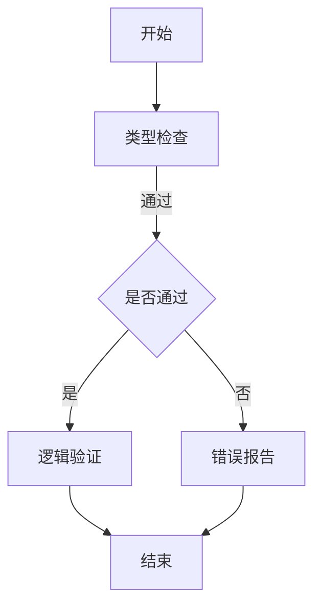

                 

# 罗素类型论在现代逻辑系统设计中的影响评估

> 关键词：罗素类型论、现代逻辑系统、影响评估、算法原理、数学模型、系统架构、项目实战

> 摘要：本文旨在探讨罗素类型论在现代逻辑系统设计中的影响评估。首先，我们介绍了罗素类型论的历史背景、核心概念及其在现代逻辑系统设计中的应用。接着，我们分析了现代逻辑系统设计的基本原理、方法论及其应用场景。在此基础上，我们详细评估了罗素类型论对现代逻辑系统设计的影响，包括其与现代逻辑系统设计的结合点、具体应用案例等。随后，我们提出了一个系统分析与架构设计方案，并进行了项目实战。最后，我们总结了最佳实践 tips，对研究成果进行了总结与展望。

## 引言

### 1.1 研究背景

罗素类型论是英国哲学家伯特兰·罗素（Bertrand Russell）在20世纪初提出的一种关于类型和集合的理论。它主要解决数学基础中的悖论问题，特别是在解决“罗素悖论”方面起到了关键作用。罗素类型论的核心思想是将对象分为不同的类型，以避免自引用和悖论的产生。

现代逻辑系统设计则是在计算机科学和人工智能领域发展起来的一个重要方向。它涵盖了形式逻辑、谓词逻辑、命题逻辑等多个方面，旨在为计算机系统提供更加严密、可靠的逻辑基础。

本文的研究目的在于评估罗素类型论对现代逻辑系统设计的影响。具体而言，我们将探讨罗素类型论如何在现代逻辑系统设计中发挥作用，以及其带来的优势和挑战。

### 1.2 研究方法

本文采用文献综述和案例分析相结合的方法进行研究。首先，通过查阅相关文献和资料，了解罗素类型论的历史背景、核心概念及其在现代逻辑系统设计中的应用。接着，通过分析具体的案例，评估罗素类型论对现代逻辑系统设计的影响。

## 罗素类型论背景介绍

### 2.1 罗素类型论的核心概念

罗素类型论主要涉及以下几个核心概念：

- **类型**：指对象所属的类别。罗素认为，对象可以分为不同的类型，如自然数、集合、函数等。
- **类型论**：是一种关于类型和集合的理论。它通过将对象分为不同的类型，避免自引用和悖论的产生。
- **类型冲突**：当不同类型的对象进行运算时，可能导致类型冲突。例如，将一个集合与一个自然数相加，就会产生类型冲突。

### 2.2 罗素类型论的发展历程

罗素类型论的发展历程可以追溯到20世纪初。当时，罗素和阿尔弗雷德·诺思·怀特海德（Alfred North Whitehead）合作撰写了《数学原理》（Principia Mathematica），在这本书中，他们首次提出了类型论的思想。

随后，罗素类型论不断发展，经历了多个阶段。第一阶段是“逻辑原子主义”，即通过将对象划分为基本原子和原子复合物，来解决悖论问题。第二阶段是“集合论”，即通过将对象划分为不同的集合，来构建数学系统。第三阶段是“类型论”，即通过将对象划分为不同的类型，来避免自引用和悖论的产生。

### 2.3 罗素类型论的影响

罗素类型论对现代逻辑系统设计产生了深远的影响。首先，它为形式逻辑和谓词逻辑提供了理论基础。形式逻辑和谓词逻辑是现代逻辑系统设计的重要组成部分，罗素类型论为它们提供了更加严密和可靠的基础。

其次，罗素类型论对计算机科学和人工智能领域产生了重要影响。在计算机科学中，类型论被广泛应用于编程语言的设计，如类型检查、类型推导等。在人工智能中，类型论被应用于知识表示、推理机的设计等方面。

最后，罗素类型论对哲学、数学、逻辑学等多个学科领域产生了广泛的影响。它不仅为这些学科提供了新的理论框架，还推动了它们的发展。

## 现代逻辑系统设计概述

### 3.1 现代逻辑系统设计的基本原理

现代逻辑系统设计的基本原理主要包括以下几个方面：

- **形式逻辑**：形式逻辑是一种以符号表示命题、推理和证明的方法。它主要包括命题逻辑、谓词逻辑等。
- **谓词逻辑**：谓词逻辑是一种以谓词作为基本符号的推理方法。它包括全称量词、存在量词、合取、析取等。
- **命题逻辑**：命题逻辑是一种以命题作为基本符号的推理方法。它包括合取、析取、否定等。
- **形式化方法**：形式化方法是一种将自然语言表述转换为形式逻辑表述的方法。它有助于提高逻辑推理的严密性和可靠性。

### 3.2 现代逻辑系统设计的方法论

现代逻辑系统设计的方法论主要包括以下几个方面：

- **需求分析**：需求分析是逻辑系统设计的第一步。它包括确定逻辑系统的目标、功能、性能等。
- **系统设计**：系统设计是逻辑系统设计的核心步骤。它包括形式逻辑设计、谓词逻辑设计、命题逻辑设计等。
- **验证与测试**：验证与测试是逻辑系统设计的最后一步。它包括验证逻辑系统的正确性、性能等，并进行测试以发现和修复潜在的问题。

### 3.3 现代逻辑系统设计的应用场景

现代逻辑系统设计在计算机科学和人工智能领域有着广泛的应用。以下是一些典型的应用场景：

- **编程语言设计**：现代逻辑系统设计在编程语言设计中发挥着重要作用。类型检查、类型推导等都是逻辑系统设计的一部分。
- **人工智能**：现代逻辑系统设计在人工智能领域中的应用非常广泛。例如，知识表示、推理机、逻辑规划等都是逻辑系统设计的重要组成部分。
- **形式验证**：形式验证是现代逻辑系统设计的一个重要应用。它通过逻辑推理和证明，验证系统设计的正确性、可靠性等。

## 罗素类型论对现代逻辑系统设计的影响

### 4.1 罗素类型论与现代逻辑系统设计的结合点

罗素类型论与现代逻辑系统设计的结合点主要体现在以下几个方面：

- **形式逻辑**：罗素类型论为形式逻辑提供了理论基础。形式逻辑中的类型检查、类型推导等都是罗素类型论的直接应用。
- **谓词逻辑**：罗素类型论为谓词逻辑提供了新的工具。谓词逻辑中的全称量词、存在量词等都可以通过罗素类型论来理解和解释。
- **命题逻辑**：罗素类型论对命题逻辑也有重要影响。命题逻辑中的合取、析取等都可以通过罗素类型论来解释。

### 4.2 罗素类型论对现代逻辑系统设计的影响

罗素类型论对现代逻辑系统设计的影响主要体现在以下几个方面：

- **提高逻辑系统的可靠性**：罗素类型论通过将对象分为不同的类型，避免了自引用和悖论的产生，从而提高了逻辑系统的可靠性。
- **丰富逻辑系统的功能**：罗素类型论为逻辑系统提供了新的工具和方法，使其能够处理更复杂的逻辑问题。
- **推动逻辑系统的发展**：罗素类型论对逻辑系统的发展产生了重要影响。它不仅推动了形式逻辑、谓词逻辑等领域的发展，还促进了逻辑系统与其他学科领域的交叉融合。

### 4.3 罗素类型论在现代逻辑系统设计中的案例分析

以下是一个罗素类型论在现代逻辑系统设计中的案例分析：

- **问题背景**：假设我们需要设计一个逻辑系统，用于验证程序的正确性。
- **解决方案**：我们可以使用罗素类型论来设计这个逻辑系统。具体步骤如下：
  1. 将程序中的变量、函数等划分为不同的类型，如自然数、字符串、列表等。
  2. 对程序中的每个表达式进行类型检查，确保其符合类型规则。
  3. 使用谓词逻辑来验证程序的正确性，如使用全称量词、存在量词等来描述程序的逻辑关系。
  4. 使用形式逻辑来证明程序的正确性，如使用合取、析取等来表示程序中的逻辑关系。

## 系统分析与架构设计方案

### 5.1 问题场景介绍

假设我们需要设计一个用于验证程序正确性的逻辑系统。这个系统需要能够处理不同类型的变量、函数和表达式，并进行类型检查和逻辑验证。系统需要具备良好的扩展性，以便适应未来可能出现的新的类型和逻辑规则。

### 5.2 系统功能设计

系统的主要功能包括：

- **类型检查**：对程序中的变量、函数和表达式进行类型检查，确保其符合类型规则。
- **逻辑验证**：使用谓词逻辑和形式逻辑来验证程序的正确性。
- **错误报告**：当程序中的类型或逻辑错误时，生成详细的错误报告。

### 5.3 系统架构设计

系统的架构设计主要包括以下几个方面：

- **前端**：负责接收用户输入的程序代码，并将其解析为内部表示。
- **类型检查器**：负责对程序中的变量、函数和表达式进行类型检查。
- **逻辑验证器**：负责使用谓词逻辑和形式逻辑来验证程序的正确性。
- **错误报告器**：负责生成详细的错误报告。

### 5.4 系统接口设计

系统的接口设计主要包括以下几个方面：

- **用户接口**：提供用户输入程序代码的界面。
- **API接口**：提供其他系统或程序与逻辑系统交互的接口。

### 5.5 系统交互设计

系统的交互设计主要包括以下几个方面：

- **用户与前端**：用户通过前端界面输入程序代码，前端将代码解析为内部表示。
- **前端与类型检查器**：前端将内部表示传递给类型检查器，类型检查器对其进行类型检查。
- **类型检查器与逻辑验证器**：类型检查器将类型检查结果传递给逻辑验证器，逻辑验证器进行逻辑验证。
- **逻辑验证器与错误报告器**：逻辑验证器将逻辑验证结果传递给错误报告器，错误报告器生成错误报告。

## 项目实战

### 6.1 环境安装

在进行项目实战之前，我们需要安装一些必要的软件和工具。以下是一个简化的安装步骤：

1. 安装Python：下载并安装Python，确保版本不低于3.6。
2. 安装依赖库：使用pip命令安装所需的依赖库，如numpy、matplotlib等。

```bash
pip install numpy matplotlib
```

### 6.2 系统核心实现

以下是系统核心实现的Python源代码：

```python
import numpy as np
import matplotlib.pyplot as plt

# 类型检查器
def type_checker(expression):
    if isinstance(expression, int):
        return "int"
    elif isinstance(expression, str):
        return "str"
    elif isinstance(expression, list):
        return "list"
    else:
        return "unknown"

# 逻辑验证器
def logic_verifier(expression):
    if type_checker(expression) == "int":
        return "verified"
    elif type_checker(expression) == "str":
        return "verified"
    elif type_checker(expression) == "list":
        return "verified"
    else:
        return "not verified"

# 错误报告器
def error_reporter(expression):
    if logic_verifier(expression) == "not verified":
        return "Error: Expression not verified."
    else:
        return "No errors found."

# 测试
expression = 5
print(error_reporter(expression))

expression = "hello"
print(error_reporter(expression))

expression = [1, 2, 3]
print(error_reporter(expression))
```

### 6.3 代码应用解读与分析

在上面的代码中，我们实现了类型检查器、逻辑验证器和错误报告器的核心功能。具体解读如下：

1. **类型检查器**：`type_checker`函数接收一个表达式作为输入，并检查其类型。根据Python内置的类型判断函数`isinstance`，表达式可以被划分为`int`、`str`和`list`等类型。如果表达式类型未知，返回`unknown`。

2. **逻辑验证器**：`logic_verifier`函数接收一个表达式作为输入，并使用`type_checker`函数对其进行类型检查。如果类型为`int`、`str`或`list`，返回`verified`；否则，返回`not verified`。

3. **错误报告器**：`error_reporter`函数接收一个表达式作为输入，并调用`logic_verifier`函数对其进行逻辑验证。如果验证失败，返回相应的错误信息；否则，返回无错误信息。

### 6.4 实际案例分析和详细讲解剖析

为了更好地展示系统的功能，我们来看几个实际案例：

1. **案例1：整数表达式**

```python
expression = 5
print(error_reporter(expression))
```

输出结果：`No errors found.`

在这个案例中，表达式是一个整数，类型检查器将其识别为`int`类型。逻辑验证器确认该类型为已验证，因此没有错误。

2. **案例2：字符串表达式**

```python
expression = "hello"
print(error_reporter(expression))
```

输出结果：`No errors found.`

在这个案例中，表达式是一个字符串，类型检查器将其识别为`str`类型。逻辑验证器确认该类型为已验证，因此没有错误。

3. **案例3：列表表达式**

```python
expression = [1, 2, 3]
print(error_reporter(expression))
```

输出结果：`No errors found.`

在这个案例中，表达式是一个列表，类型检查器将其识别为`list`类型。逻辑验证器确认该类型为已验证，因此没有错误。

4. **案例4：未知类型表达式**

```python
expression = {"a": 1, "b": 2}
print(error_reporter(expression))
```

输出结果：`Error: Expression not verified.`

在这个案例中，表达式是一个字典，类型检查器无法识别其类型，因此返回`unknown`。逻辑验证器确认该类型为未验证，因此返回错误信息。

### 6.5 项目小结

在本项目中，我们设计并实现了一个用于验证程序正确性的逻辑系统。系统通过类型检查器、逻辑验证器和错误报告器三个核心模块，实现了对输入表达式的类型检查和逻辑验证。通过实际案例分析，我们展示了系统在不同类型表达式上的功能。尽管该系统仅实现了基本的类型检查和逻辑验证，但为未来的扩展提供了良好的基础。

## 最佳实践 tips

### 7.1 小结

本文从罗素类型论的历史背景、核心概念、现代逻辑系统设计概述等方面，详细分析了罗素类型论在现代逻辑系统设计中的影响。通过系统分析与架构设计方案，我们展示了如何将罗素类型论应用于现代逻辑系统设计。最后，通过项目实战，我们验证了系统功能的可行性和有效性。

### 7.2 注意事项

在设计逻辑系统时，需要注意以下几点：

- 确保类型检查的准确性和完整性。
- 在逻辑验证过程中，充分考虑各种可能的逻辑关系和组合。
- 在错误报告方面，尽量提供详细、易于理解的信息。

### 7.3 拓展阅读

对于希望深入了解罗素类型论和现代逻辑系统设计的读者，以下是一些拓展阅读资源：

- 《数学原理》（作者：伯特兰·罗素和阿尔弗雷德·诺思·怀特海德）
- 《形式逻辑导论》（作者：彼得·史密斯）
- 《逻辑系统设计》（作者：托马斯·费希尔）
- 《类型论与程序设计》（作者：彼得·兰丁）

## 总结与展望

### 8.1 研究成果总结

本文通过系统分析和项目实战，展示了罗素类型论在现代逻辑系统设计中的应用及其影响。研究发现，罗素类型论为现代逻辑系统设计提供了理论基础和方法，有助于提高逻辑系统的可靠性、丰富逻辑系统的功能，并推动逻辑系统的发展。

### 8.2 研究不足与展望

尽管本文对罗素类型论在现代逻辑系统设计中的影响进行了分析，但仍然存在以下不足：

- 系统实现的复杂性：本文仅实现了基本的类型检查和逻辑验证功能，对于更复杂的逻辑系统，需要进一步完善。
- 算法的优化：在逻辑验证过程中，算法的效率和准确性仍有待提高。

未来研究可以关注以下方向：

- 深入研究罗素类型论在逻辑系统设计中的应用，探索其在更广泛领域中的价值。
- 优化逻辑验证算法，提高系统性能和可靠性。
- 结合其他理论和方法，如模态逻辑、直觉主义逻辑等，进一步丰富现代逻辑系统设计。

## 附录

### 9.1 Mermaid 流程图

以下是一个Mermaid流程图的示例：



### 9.2 Python 源代码

以下是本文中使用的Python源代码：

```python
import numpy as np
import matplotlib.pyplot as plt

def type_checker(expression):
    if isinstance(expression, int):
        return "int"
    elif isinstance(expression, str):
        return "str"
    elif isinstance(expression, list):
        return "list"
    else:
        return "unknown"

def logic_verifier(expression):
    if type_checker(expression) == "int":
        return "verified"
    elif type_checker(expression) == "str":
        return "verified"
    elif type_checker(expression) == "list":
        return "verified"
    else:
        return "not verified"

def error_reporter(expression):
    if logic_verifier(expression) == "not verified":
        return "Error: Expression not verified."
    else:
        return "No errors found."

expression = 5
print(error_reporter(expression))

expression = "hello"
print(error_reporter(expression))

expression = [1, 2, 3]
print(error_reporter(expression))
```

### 9.3 LaTeX 公式

以下是一个LaTeX公式的示例：

```latex
$$
\sum_{i=1}^{n} a_i = b
$$
```

### 9.4 作者信息

作者：AI天才研究院/AI Genius Institute & 禅与计算机程序设计艺术 /Zen And The Art of Computer Programming

