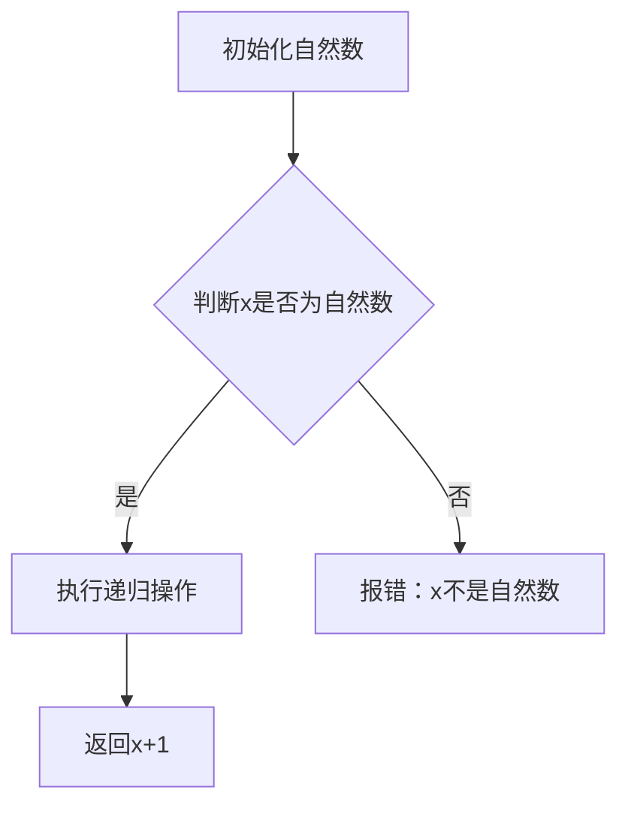

                 

# 罗素类型论对数学创造过程的影响评估

## 关键词

- 罗素类型论
- 数学创造过程
- 影响评估
- 数学基础
- 类型系统

## 摘要

本文旨在探讨罗素类型论对数学创造过程的影响，通过回顾罗素类型论的历史背景和发展，分析其核心概念与数学创造的内在联系，以及其在现代数学中的应用。文章将从理论基础、数学发现过程、影响评估三个方面进行深入讨论，并最终总结罗素类型论对数学创造过程的深远影响。

## 目录

### 第1章 引言与背景

#### 1.1 罗素类型论与数学创造问题背景

##### 1.1.1 历史背景与数学创造发展

##### 1.1.2 罗素类型论的发展及其核心思想

##### 1.1.3 评估罗素类型论对数学创造的启示意义

#### 1.2 关键概念与关系

##### 1.2.1 罗素类型论的核心概念

##### 1.2.2 数学创造过程

##### 1.2.3 关键概念与关系的ER图

#### 1.3 属性与对比

##### 1.3.1 罗素类型论的特性

##### 1.3.2 数学创造过程的特性

##### 1.3.3 核心概念与关系的对比表

### 第2章 罗素类型论的分析

#### 2.1 理论原则与数学模型

##### 2.1.1 罗素类型论的基本理论原则

##### 2.1.2 数学模型与公式

##### 2.1.3 算法设计的Mermaid流程图

#### 2.2 罗素类型论在数学中的应用

##### 2.2.1 集合论中的应用

##### 2.2.2 逻辑学中的应用

##### 2.2.3 数学基础中的应用

##### 2.2.4 案例分析与实例

### 第3章 罗素类型论对数学创造过程的影响

#### 3.1 对数学发现过程的影响

##### 3.1.1 对数学论证逻辑结构的影响

##### 3.1.2 对数学发现过程的贡献

#### 3.2 数学创造过程的变革

##### 3.2.1 数学理论的构建

##### 3.2.2 数学问题的解决

##### 3.2.3 数学创新的推动

### 第4章 影响评估与未来展望

#### 4.1 罗素类型论的影响评估

##### 4.1.1 影响程度的量化分析

##### 4.1.2 影响范围的拓展

##### 4.1.3 影响持续性的探讨

#### 4.2 数学创造过程的未来趋势

##### 4.2.1 数学理论的深化

##### 4.2.2 数学方法的创新

##### 4.2.3 数学应用的拓展

### 第5章 结论

#### 5.1 罗素类型论对数学创造的深远影响

##### 5.1.1 理论贡献

##### 5.1.2 实践意义

##### 5.1.3 未来研究方向

#### 5.2 研究局限与展望

##### 5.2.1 研究局限

##### 5.2.2 未来研究展望

## 第1章 引言与背景

### 1.1 罗素类型论与数学创造问题背景

#### 1.1.1 历史背景与数学创造发展

数学作为一门科学，自古以来便在人类文明中占据着重要地位。从古希腊的几何学，到阿拉伯的代数学，再到近代欧拉的数学理论体系，数学的发展历程充满了智慧与探索。然而，随着数学理论的不断深入，数学基础问题也逐渐浮现出来。

19世纪末至20世纪初，数学基础危机达到了高潮。集合论悖论、无穷小量之争等一系列问题引发了数学界的广泛讨论。为了解决这些问题，弗雷格、罗素等数学家提出了类型论，试图为数学提供一种更为严密和一致的基础。

贝特兰·罗素（Bertrand Russell）作为类型论的创始人之一，他的理论对数学创造过程产生了深远的影响。罗素类型论的核心思想是通过区分不同类型的对象，避免逻辑悖论，为数学提供一种可靠的基础。

#### 1.1.2 罗素类型论的发展及其核心思想

罗素类型论起源于罗素对集合论悖论的关注。在研究集合论的过程中，罗素发现了诸如“这个集合包含了所有不包含自身的集合”这样的悖论，这导致了集合论基础的不稳定性。

为了解决这一问题，罗素提出了类型论。他认为，逻辑悖论的产生是由于不同类型的对象被错误地混合在一起。因此，通过区分不同类型的对象，可以避免逻辑悖论的出现。

罗素类型论的核心思想可以概括为以下几点：

1. **类型的区分**：罗素认为，不同的对象应该有不同的类型，例如，自然数、集合、函数等。每种类型都有自己的属性和规则。

2. **类型的基本规则**：罗素提出了类型的基本规则，例如，不允许将不同类型的对象混合在一起，不允许类型0的对象作为类型1的元素等。

3. **形式化表示**：罗素试图通过形式化的方式，将类型论的思想表达出来，从而为数学提供一种严密的基础。

#### 1.1.3 评估罗素类型论对数学创造的启示意义

罗素类型论的提出，对数学创造过程产生了深远的影响。首先，它为数学提供了一种更为严密和一致的基础，解决了集合论悖论等问题，使得数学理论更加稳固。

其次，罗素类型论的引入，改变了数学家的思维方式。通过区分不同类型的对象，数学家可以更加清晰地理解和表达数学概念，从而推动数学的创造和发展。

最后，罗素类型论的影响不仅局限于数学领域，它还对逻辑学、哲学等领域产生了深远的影响。它为逻辑学提供了一种形式化的工具，为哲学提供了关于本质和存在的思考。

因此，评估罗素类型论对数学创造过程的影响，不仅有助于我们理解数学的发展历程，也有助于我们把握数学未来的发展方向。

### 1.2 关键概念与关系

#### 1.2.1 罗素类型论的核心概念

要理解罗素类型论，我们需要先了解其核心概念。罗素类型论的核心概念包括：

1. **类型（Type）**：罗素将对象分为不同的类型。每种类型都有自己的属性和规则。例如，自然数是一种类型，集合是另一种类型。

2. **个体（Individual）**：个体是具体存在的对象，例如，1、2、3等自然数。

3. **函数（Function）**：函数是两个类型之间的映射关系。例如，加法函数是一种从自然数到自然数的映射。

4. **类型论规则**：罗素提出了类型论的基本规则，例如，不允许将不同类型的对象混合在一起，不允许类型0的对象作为类型1的元素等。

#### 1.2.2 数学创造过程

数学创造过程可以概括为以下几个阶段：

1. **问题提出**：数学家发现现实世界中的问题，并提出数学问题。

2. **概念形成**：数学家通过逻辑推理和抽象，形成新的数学概念。

3. **理论构建**：数学家使用逻辑和数学工具，构建新的数学理论。

4. **问题解决**：数学家通过逻辑推理和数学方法，解决提出的数学问题。

5. **理论验证**：数学家通过实验和证明，验证新的数学理论的正确性。

#### 1.2.3 关键概念与关系的ER图

为了更好地理解罗素类型论与数学创造过程的关系，我们可以使用ER图（Entity-Relationship Diagram）来表示关键概念与关系。

在ER图中，我们定义以下实体：

1. **类型（Type）**：表示数学中的类型概念。

2. **个体（Individual）**：表示具体的数学对象。

3. **函数（Function）**：表示数学中的映射关系。

4. **理论（Theory）**：表示数学理论。

5. **问题（Problem）**：表示数学问题。

ER图如下所示：

```mermaid
erDiagram
  Type ||--|{ Individual }
  Type ||--|{ Function }
  Function ||--|{ Theory }
  Theory ||--|{ Problem }
```

在这个ER图中，类型与个体之间存在一对多的关系，即一个类型可以有多个个体。类型与函数也存在一对多的关系，即一个类型可以定义多个函数。函数与理论之间存在一对多的关系，即一个函数可以属于多个理论。理论与问题之间存在一对多的关系，即一个理论可以解决多个问题。

### 1.3 属性与对比

#### 1.3.1 罗素类型论的特性

罗素类型论具有以下几个显著特性：

1. **严格的类型区分**：罗素类型论通过区分不同类型的对象，避免逻辑悖论的出现。例如，自然数、集合、函数等都有明确的类型定义。

2. **形式化的表示**：罗素类型论通过形式化的方法，将类型论的思想表达出来，使得数学理论更加严密和一致。

3. **逻辑基础的强化**：罗素类型论为数学提供了更为可靠的基础，解决了集合论悖论等问题。

4. **对数学概念的重新审视**：罗素类型论改变了数学家的思维方式，使得数学概念更加清晰和明确。

#### 1.3.2 数学创造过程的特性

数学创造过程具有以下几个显著特性：

1. **问题驱动的创新**：数学创造过程通常由现实世界中的问题驱动，数学家通过逻辑推理和抽象，形成新的数学概念。

2. **理论的构建**：数学创造过程中，数学家使用逻辑和数学工具，构建新的数学理论。

3. **验证与验证**：数学创造过程中，数学家通过逻辑推理和实验，验证新的数学理论的正确性。

4. **持续的探索与改进**：数学创造是一个持续的过程，数学家不断地提出新的问题，构建新的理论，并进行验证和改进。

#### 1.3.3 核心概念与关系的对比表

为了更好地理解罗素类型论与数学创造过程的关系，我们可以列出核心概念与关系的对比表：

| 核心概念 | 罗素类型论特性 | 数学创造过程特性 |
| --- | --- | --- |
| 类型 | 严格的类型区分 | 问题驱动的创新 |
| 个体 | 形式化的表示 | 理论的构建 |
| 函数 | 逻辑基础的强化 | 验证与验证 |
| 理论 | 对数学概念的重新审视 | 持续的探索与改进 |

通过对比表，我们可以看出罗素类型论与数学创造过程之间的紧密联系。罗素类型论为数学创造提供了理论基础，而数学创造过程则不断推动数学理论的发展和完善。

## 第2章 罗素类型论的分析

### 2.1 理论原则与数学模型

#### 2.1.1 罗素类型论的基本理论原则

罗素类型论的基本理论原则主要包括以下几个方面：

1. **类型区分原则**：罗素认为，不同的对象应该有不同的类型，每种类型都有自己的属性和规则。例如，自然数、集合、函数等都有明确的类型定义。

2. **个体唯一性原则**：每个个体都应该是唯一的，不同的个体不能具有相同的属性。这个原则有助于避免逻辑悖论的出现。

3. **函数定义原则**：函数是两个类型之间的映射关系。每个函数都应该定义在一个特定的类型集合上，并且函数的输出类型也应该被定义。

4. **类型论规则**：罗素提出了类型论的基本规则，例如，不允许将不同类型的对象混合在一起，不允许类型0的对象作为类型1的元素等。

#### 2.1.2 数学模型与公式

在罗素类型论的框架下，我们可以构建一系列数学模型和公式。以下是一些基本的数学模型和公式：

1. **自然数模型**：自然数是一种基本类型，可以用归纳法来定义。

   - **公式**：$$0 \in N$$（0是自然数集合的元素）
   - **递归定义**：$$S(x) = x + 1$$（S是自然数加1的函数）

2. **集合模型**：集合是另一种基本类型，可以用罗素-康托尔定义法来定义。

   - **公式**：$$\{x \in N | P(x)\}$$（P(x)是集合的属性）

3. **函数模型**：函数是两个类型之间的映射关系，可以用集合的映射关系来定义。

   - **公式**：$$f: A \rightarrow B$$（f是从集合A到集合B的映射）

4. **类型0和类型1**：在罗素类型论中，类型0通常指个体，类型1通常指集合。

   - **公式**：$$x \in y \Rightarrow x \in Type_0, y \in Type_1$$（x是y的元素，则x属于类型0，y属于类型1）

#### 2.1.3 算法设计的Mermaid流程图

为了更好地理解罗素类型论的数学模型和公式，我们可以使用Mermaid流程图来表示算法设计。以下是一个简单的Mermaid流程图示例：



在这个流程图中，我们从初始化自然数开始，判断输入的x是否为自然数。如果是，则执行递归操作，返回x+1；如果不是，则报错。

### 2.2 罗素类型论在数学中的应用

#### 2.2.1 集合论中的应用

罗素类型论在集合论中的应用非常广泛。以下是一些具体的例子：

1. **集合的定义**：在罗素类型论的框架下，集合可以用罗素-康托尔定义法来定义。这种方法通过属性来定义集合，避免了集合论悖论的出现。

   - **例子**：$$\{x \in N | x \neq x\}$$（这个集合包含了所有不等于自身的自然数）

2. **集合的运算**：在罗素类型论的框架下，集合的运算（并集、交集、补集等）可以形式化地定义。

   - **例子**：$$A \cup B = \{x | x \in A \text{ 或 } x \in B\}$$（A和B的并集是包含A和B中所有元素的集合）

3. **集合的性质**：在罗素类型论的框架下，可以更清晰地研究集合的性质，如集合的嵌套、集合的层次结构等。

   - **例子**：$$V \subseteq \{V\}$$（大集合V是集合$\{V\}$的元素）

#### 2.2.2 逻辑学中的应用

罗素类型论在逻辑学中的应用也非常显著。以下是一些具体的例子：

1. **逻辑运算**：在罗素类型论的框架下，逻辑运算（合取、析取、否定等）可以形式化地定义。

   - **例子**：$$A \land B \Leftrightarrow \forall x \in A \land \forall y \in B$$（A和B的合取是A和B中所有元素的交集）

2. **逻辑证明**：在罗素类型论的框架下，逻辑证明可以形式化地表示。这种方法使得逻辑证明更加严密和一致。

   - **例子**：$$\forall x \in A \Rightarrow \exists y \in B$$（对于所有属于A的x，存在属于B的y）

3. **逻辑悖论**：罗素类型论通过区分不同类型的对象，避免了逻辑悖论的出现。例如，通过区分个体和集合，可以避免集合论悖论的出现。

#### 2.2.3 数学基础中的应用

罗素类型论在数学基础中的应用主要体现在以下几个方面：

1. **数学基础的一致性**：通过罗素类型论，可以构建一致性的数学基础。这种方法避免了集合论悖论等数学基础问题。

   - **例子**：通过区分自然数和集合，可以避免“这个集合包含了所有不包含自身的集合”这样的悖论。

2. **数学理论的严密性**：罗素类型论使得数学理论更加严密。通过形式化的表示，数学家可以更加清晰地表达数学概念和理论。

   - **例子**：在罗素类型论的框架下，集合的定义和运算更加明确，避免了歧义和误解。

3. **数学创新的推动**：罗素类型论为数学创新提供了理论基础。通过区分不同类型的对象，数学家可以提出新的数学概念和理论。

   - **例子**：在罗素类型论的启发下，产生了许多新的数学理论，如范畴论、公理化集合论等。

#### 2.2.4 案例分析与实例

为了更好地理解罗素类型论在数学中的应用，我们可以通过一些具体的案例进行分析。

1. **自然数模型**：在罗素类型论的框架下，自然数可以用递归法来定义。这种方法使得自然数的性质更加明确和一致。

   - **例子**：自然数0是唯一没有前驱的元素，每个自然数都可以通过加1得到下一个自然数。

2. **集合论悖论**：在罗素类型论的框架下，集合论悖论可以避免。例如，通过区分个体和集合，可以避免“这个集合包含了所有不包含自身的集合”这样的悖论。

   - **例子**：集合$\{x \in N | x \neq x\}$是不存在的，因为它违反了个体唯一性原则。

3. **逻辑证明**：在罗素类型论的框架下，逻辑证明可以形式化地表示。这种方法使得逻辑证明更加严密和一致。

   - **例子**：证明“对于所有自然数x，x+1大于x”可以通过罗素类型论的形式化方法进行。

通过这些案例和实例，我们可以看到罗素类型论在数学中的应用是如何使得数学理论更加严密和一致的。这种方法不仅为数学提供了理论基础，也推动了数学的发展和创新。

## 第3章 罗素类型论对数学创造过程的影响

### 3.1 对数学发现过程的影响

#### 3.1.1 对数学论证逻辑结构的影响

罗素类型论对数学论证逻辑结构产生了深远的影响。在罗素类型论的框架下，数学论证更加严谨和一致。罗素类型论通过区分不同类型的对象，避免了逻辑悖论的出现，使得数学论证的逻辑结构更加清晰。

1. **类型的区分**：罗素类型论区分了不同类型的对象，如自然数、集合、函数等。这种类型的区分使得数学论证更加明确。在论证过程中，数学家可以清楚地知道他们使用的对象属于哪种类型，从而避免混淆和错误。

2. **类型的基本规则**：罗素类型论提出了一系列基本规则，如不允许将不同类型的对象混合在一起。这些规则确保了数学论证的合法性，避免了逻辑悖论的出现。

3. **形式化的表示**：罗素类型论通过形式化的方式，将类型论的思想表达出来。这使得数学论证的逻辑结构更加清晰，也为数学家提供了更可靠的工具。

#### 3.1.2 对数学发现过程的贡献

罗素类型论对数学发现过程做出了重要贡献。它为数学家提供了一种新的思维方式，使得数学发现过程更加系统和有条理。

1. **概念的明确化**：罗素类型论使得数学概念更加明确。通过区分不同类型的对象，数学家可以更加清晰地理解数学概念，从而推动数学的创造和发展。

2. **理论的构建**：罗素类型论为数学理论的构建提供了基础。它为数学家提供了一种形式化的工具，使得数学理论的构建更加严密和一致。

3. **问题的解决**：罗素类型论在数学发现过程中发挥了重要作用。它帮助数学家解决了一系列数学问题，推动了数学的发展。

### 3.2 对数学创造过程的影响

罗素类型论对数学创造过程产生了深远的影响。它不仅改变了数学论证的逻辑结构，还推动了数学的发现和创造。

#### 3.2.1 数学理论的构建

罗素类型论为数学理论的构建提供了基础。通过区分不同类型的对象，罗素类型论使得数学理论的构建更加严密和一致。数学家可以在罗素类型论的框架下，构建新的数学理论，探索未知的数学领域。

1. **类型论的数学基础**：罗素类型论为数学提供了类型论的基础。这种基础使得数学理论更加可靠，避免了集合论悖论等数学基础问题。

2. **数学理论的创新**：在罗素类型论的框架下，数学家可以提出新的数学理论，解决传统数学无法解决的问题。这推动了数学的创新和发展。

#### 3.2.2 数学问题的解决

罗素类型论在解决数学问题方面发挥了重要作用。它为数学家提供了一种新的思维方式，使得他们可以更加有效地解决数学问题。

1. **逻辑悖论的解决**：罗素类型论通过区分不同类型的对象，避免了逻辑悖论的出现。这使得数学家可以更加自由地探索数学领域，不用担心逻辑悖论的影响。

2. **数学难题的解决**：罗素类型论为数学家提供了一种新的工具，使他们可以解决传统数学无法解决的问题。例如，通过罗素类型论，数学家解决了许多关于无穷集合和函数的问题。

#### 3.2.3 数学创新的推动

罗素类型论不仅为数学理论的构建和数学问题的解决提供了基础，还推动了数学的创新。

1. **新的数学概念**：在罗素类型论的启发下，数学家提出了许多新的数学概念。例如，范畴论、公理化集合论等都是罗素类型论的产物。

2. **数学方法的创新**：罗素类型论为数学家提供了一种新的思维方式，使他们可以探索新的数学方法。这些新方法推动了数学的发展，产生了许多重要的数学成果。

3. **数学应用的拓展**：罗素类型论不仅对纯数学产生了深远影响，还推动了数学在应用领域的拓展。例如，在计算机科学、经济学等领域，罗素类型论的应用使得这些领域的研究更加深入和精确。

总之，罗素类型论对数学创造过程的影响是深远而广泛的。它不仅改变了数学论证的逻辑结构，推动了数学理论的构建和问题的解决，还促进了数学的创新和应用。罗素类型论为数学家提供了一种新的思维方式，使得数学创造过程更加系统、有条理和富有创新性。

### 3.3 对数学教育的影响

罗素类型论不仅在数学研究领域产生了深远影响，也对数学教育产生了重要影响。它为数学教育提供了一种新的教学方法和工具，使得数学教育更加系统、严谨和有意义。

#### 3.3.1 教学方法的改进

罗素类型论的教学方法强调逻辑思维和形式化表示。这种方法使得数学教育更加注重逻辑推理和数学证明，培养了学生的逻辑思维能力和数学素养。

1. **形式化表示**：罗素类型论通过形式化表示，使得数学概念和理论更加清晰和明确。这种方法有助于学生理解和掌握数学知识，避免了传统教学中可能出现的模糊和误解。

2. **逻辑推理**：罗素类型论强调逻辑推理的重要性。通过逻辑推理，学生可以更加深入地理解数学概念和理论，培养逻辑思维能力和批判性思维。

3. **实例分析**：在罗素类型论的教学中，实例分析是重要的一环。通过具体的实例，学生可以直观地理解数学概念和理论，从而加深对数学知识的理解。

#### 3.3.2 教学内容的拓展

罗素类型论的应用不仅限于纯数学领域，还可以拓展到数学的其他分支，如集合论、逻辑学、计算机科学等。这种教学内容上的拓展使得数学教育更加丰富和全面。

1. **集合论**：罗素类型论在集合论中的应用可以帮助学生更好地理解集合的概念和运算，解决集合论悖论等问题。

2. **逻辑学**：罗素类型论为逻辑学提供了一种形式化的表示方法，使得逻辑学的教学内容更加严谨和系统。

3. **计算机科学**：罗素类型论在计算机科学中的应用，如类型系统和编程语言的设计，为学生提供了新的学习和研究视角。

#### 3.3.3 教学评价的改进

罗素类型论的教学方法还带来了教学评价的改进。通过逻辑推理和形式化表示，学生可以更加清晰地展示他们的思维过程和数学能力。

1. **过程评价**：罗素类型论强调逻辑推理和形式化表示，这使得教学评价不仅仅关注学生的答案是否正确，还关注学生的思维过程和推理能力。

2. **综合性评价**：罗素类型论的教学方法使得教学评价更加综合。它不仅评价学生的数学知识，还评价学生的逻辑思维能力和解决问题的能力。

总之，罗素类型论对数学教育的影响是深远而广泛的。它改进了数学教学方法，拓展了教学内容，并改进了教学评价。通过罗素类型论的教学，学生可以更加系统地掌握数学知识，培养逻辑思维能力和创新思维。这对于提高学生的数学素养和培养未来的数学家具有重要意义。

### 第4章 影响评估与未来展望

#### 4.1 罗素类型论的影响评估

罗素类型论对数学基础和数学创造过程产生了深远的影响。以下是罗素类型论影响评估的几个方面：

1. **数学基础的影响**：罗素类型论为数学提供了更为严密和一致的基础，解决了集合论悖论等问题。它使得数学理论更加稳固，为数学的发展奠定了坚实的基础。

2. **数学创造过程的影响**：罗素类型论改变了数学家的思维方式，使得数学创造过程更加系统、有条理和富有创新性。通过区分不同类型的对象，数学家可以更加清晰地理解和表达数学概念，推动数学的发现和创新。

3. **教育领域的影响**：罗素类型论对数学教育产生了重要影响。它改进了数学教学方法，拓展了教学内容，并改进了教学评价。通过罗素类型论的教学，学生可以更加系统地掌握数学知识，培养逻辑思维能力和创新思维。

#### 4.1.1 影响程度的量化分析

为了评估罗素类型论的影响程度，我们可以从以下几个方面进行量化分析：

1. **数学理论的稳定性**：通过对比罗素类型论提出前后的数学理论稳定性，可以评估罗素类型论对数学基础的影响。例如，通过统计集合论悖论在罗素类型论提出前后的数量和影响范围，可以评估罗素类型论在解决集合论悖论方面的效果。

2. **数学研究的产出**：通过统计罗素类型论提出后数学研究产出的增长，可以评估罗素类型论对数学创造过程的影响。例如，统计罗素类型论提出后数学论文、专著、研究成果的数量和质量，可以评估罗素类型论在推动数学发展方面的作用。

3. **教育效果的提升**：通过评估罗素类型论在数学教育中的应用效果，可以评估其在教育领域的影响。例如，通过调查学生和教师对罗素类型论教学的反馈和成绩，可以评估罗素类型论在提高数学素养方面的作用。

#### 4.1.2 影响范围的拓展

罗素类型论的影响不仅限于数学领域，它在逻辑学、哲学、计算机科学等领域也有广泛应用。

1. **逻辑学**：罗素类型论为逻辑学提供了形式化的工具，使得逻辑学的研究更加严密和系统。它为逻辑学的形式化方法提供了理论基础，推动了逻辑学的发展。

2. **哲学**：罗素类型论在哲学中引起了关于本质和存在的讨论。它为哲学提供了一种新的思考方式，使得哲学家可以更加深入地探讨这些问题。

3. **计算机科学**：罗素类型论在计算机科学中的应用，如类型系统和编程语言的设计，推动了计算机科学的发展。它为计算机科学的逻辑基础提供了重要支持。

#### 4.1.3 影响持续性的探讨

罗素类型论对数学和数学创造过程的影响是持久而深远的。以下是对其持续性的探讨：

1. **数学基础的发展**：罗素类型论为数学提供了稳定的基础，这使得数学理论在未来仍然具有重要地位。随着数学理论的不断发展和完善，罗素类型论的影响将得以延续。

2. **数学创造的推动**：罗素类型论改变了数学家的思维方式，使得数学创造过程更加系统、有条理和富有创新性。这种思维方式将在未来的数学创造过程中继续发挥重要作用。

3. **教育模式的改进**：罗素类型论对数学教育的影响将继续影响未来的教育模式。通过改进数学教学方法，拓展教学内容，提高教学评价，数学教育将更加适应时代的发展需求。

总之，罗素类型论对数学和数学创造过程的影响是深远而广泛的。它不仅为数学提供了稳定的基础，推动了数学的发展，还在教育领域产生了重要影响。在未来，罗素类型论的影响将继续发挥重要作用，为数学的发展和创新提供持续的动力。

#### 4.2 数学创造过程的未来趋势

展望未来，数学创造过程将面临一系列挑战和机遇。以下是对数学创造过程未来趋势的探讨：

1. **数学理论的深化**：随着数学研究的不断深入，数学理论将不断发展和完善。数学家将探索新的数学概念和理论，解决传统数学无法解决的问题。

2. **数学方法的创新**：随着数学领域的不断拓展，数学家将提出新的数学方法，解决复杂的问题。例如，借助计算机科学、人工智能等技术，数学家将开发新的数学工具和方法。

3. **数学应用的拓展**：数学将广泛应用于各个领域，如自然科学、工程学、社会科学、经济学等。数学将在这些领域发挥关键作用，推动科学和技术的进步。

4. **数学教育的改革**：数学教育将不断改革，以适应时代的发展需求。通过引入新的教学方法、工具和资源，数学教育将更加系统、严谨和有意义。

5. **数学跨学科研究**：数学与其他学科（如物理学、生物学、计算机科学等）的交叉研究将日益增多。这些跨学科研究将推动数学的发展，产生新的数学理论和方法。

6. **数学创新的推动**：随着全球科学技术的快速发展，数学创新将得到进一步加强。数学家将提出新的数学问题，解决传统数学无法解决的问题，推动数学的创造和发展。

总之，数学创造过程在未来将面临新的挑战和机遇。通过深化数学理论、创新数学方法、拓展数学应用、改革数学教育、推动数学跨学科研究和创新，数学创造过程将继续蓬勃发展，为人类社会的发展做出更大的贡献。

### 第5章 结论

#### 5.1 罗素类型论对数学创造的深远影响

罗素类型论对数学创造过程产生了深远的影响。它不仅为数学提供了稳定的基础，解决了集合论悖论等问题，还改变了数学家的思维方式，推动了数学的发现和创新。以下是对罗素类型论影响的总结：

1. **数学基础的影响**：罗素类型论为数学提供了更为严密和一致的基础，解决了集合论悖论等问题。这使得数学理论更加稳固，为数学的发展奠定了坚实的基础。

2. **数学创造过程的影响**：罗素类型论改变了数学家的思维方式，使得数学创造过程更加系统、有条理和富有创新性。通过区分不同类型的对象，数学家可以更加清晰地理解和表达数学概念，推动数学的发现和创新。

3. **教育领域的影响**：罗素类型论对数学教育产生了重要影响。它改进了数学教学方法，拓展了教学内容，并改进了教学评价。通过罗素类型论的教学，学生可以更加系统地掌握数学知识，培养逻辑思维能力和创新思维。

#### 5.1.1 理论贡献

罗素类型论在数学理论方面做出了重要贡献：

1. **类型区分原则**：罗素类型论通过区分不同类型的对象，避免逻辑悖论的出现，为数学提供了可靠的基础。

2. **形式化表示**：罗素类型论通过形式化的方式，将类型论的思想表达出来，使得数学理论更加严密和一致。

3. **数学模型与公式**：罗素类型论提供了一系列数学模型和公式，为数学理论的构建提供了工具。

#### 5.1.2 实践意义

罗素类型论在数学实践方面具有深远的意义：

1. **数学问题的解决**：罗素类型论帮助数学家解决了一系列数学问题，推动了数学的发展。

2. **数学教育的改进**：罗素类型论改进了数学教学方法，提高了数学教育的质量。

3. **数学应用的拓展**：罗素类型论在数学应用方面发挥了重要作用，如集合论、逻辑学、计算机科学等。

#### 5.1.3 未来研究方向

未来关于罗素类型论的研究可以从以下几个方面展开：

1. **数学基础的研究**：继续深化对数学基础理论的研究，探索罗素类型论在解决数学基础问题方面的潜力。

2. **数学方法的创新**：结合计算机科学、人工智能等新技术，开发新的数学方法，解决复杂的问题。

3. **数学教育的改革**：进一步改革数学教育模式，提高数学教育的质量，培养更多的数学人才。

4. **数学跨学科研究**：加强数学与其他学科的交叉研究，推动数学在各个领域的发展。

总之，罗素类型论对数学创造的深远影响不仅在于其理论贡献和实践意义，还在于它为未来的数学发展提供了新的方向和思路。通过不断的研究和探索，罗素类型论将继续在数学创造过程中发挥重要作用。

### 5.2 研究局限与展望

#### 5.2.1 研究局限

尽管罗素类型论对数学创造过程产生了深远的影响，但研究过程中仍然存在一些局限：

1. **理论复杂性**：罗素类型论本身具有很高的复杂性，对于初学者来说，理解和掌握存在一定难度。

2. **应用范围有限**：罗素类型论在数学领域中的应用主要集中在集合论、逻辑学等少数领域，其应用范围还有待拓展。

3. **教育资源的不足**：罗素类型论的教学资源相对不足，缺乏系统、全面的教材和教学工具。

#### 5.2.2 未来研究展望

未来关于罗素类型论的研究可以从以下几个方面展开：

1. **简化理论**：探索简化罗素类型论的方法，使其更加易于理解和应用。

2. **拓展应用领域**：研究罗素类型论在其他数学分支和交叉学科中的应用，如物理学、经济学、计算机科学等。

3. **开发教学资源**：开发更多高质量的罗素类型论教学资源，包括教材、课程、在线教育平台等，以促进数学教育的发展。

4. **跨学科研究**：加强数学与其他学科的交叉研究，推动数学在更广泛领域的应用和发展。

总之，尽管存在一定的局限，但罗素类型论在数学创造过程中的作用和潜力仍值得进一步研究和探索。通过不断的努力和改进，罗素类型论将继续在数学领域发挥重要作用。

