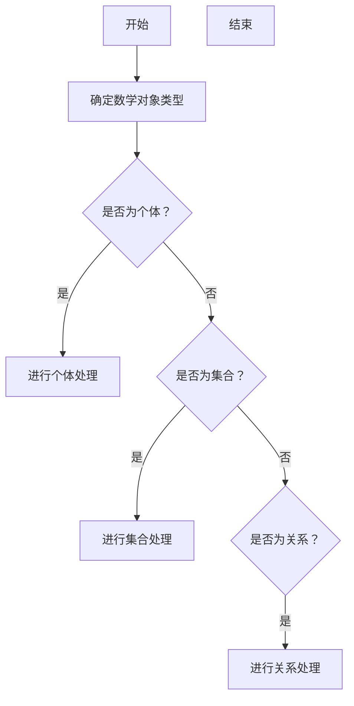
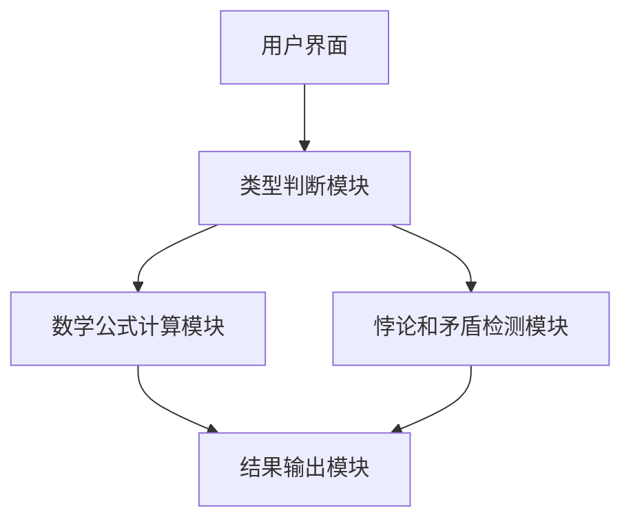
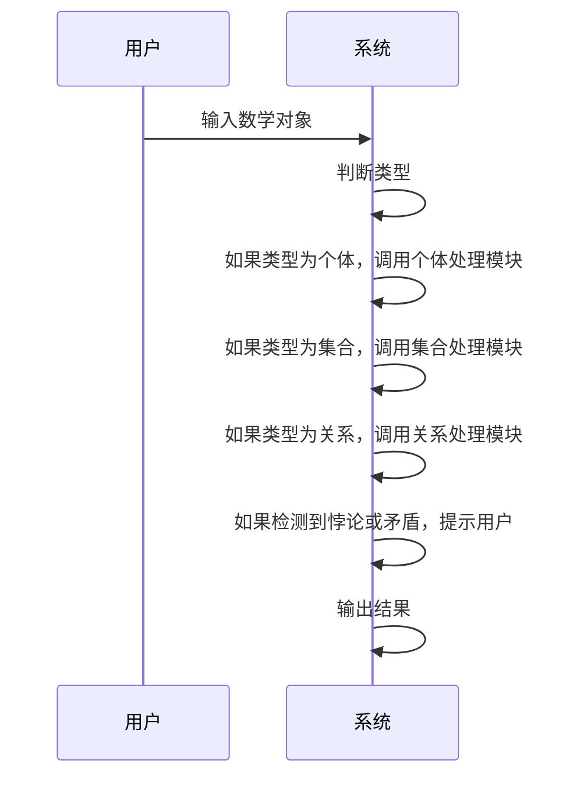

                 

### 罗素类型论对数学基础统一efforts的影响

**关键词：** 罗素类型论，数学基础，统一efforts，影响

**摘要：** 本文旨在探讨罗素类型论在数学基础统一efforts中的重要作用。通过详细分析罗素类型论的核心概念、数学模型、算法原理以及实际应用，本文将揭示罗素类型论对数学基础统一efforts的深远影响，并展望其在未来数学发展中的潜在价值。

### 1. 背景介绍

**1.1 核心概念术语说明**

在探讨罗素类型论对数学基础统一efforts的影响之前，我们需要了解一些核心概念术语。罗素类型论是由英国哲学家、数学家贝特兰·罗素于20世纪初提出的一种关于数学基础的理论。其核心观点是，数学对象可以分为不同的类型，不同类型的对象之间存在着本质的差异，从而保证了数学推理的可靠性和一致性。

**1.2 问题背景**

数学基础统一efforts的目标是寻找一种统一的方式来描述和处理各种数学概念和推理过程，从而解决数学中存在的悖论和矛盾。自19世纪末以来，数学家们一直在尝试统一数学基础，以解决诸如集合论悖论、逻辑悖论等问题。

**1.3 问题描述**

在数学基础统一efforts中，存在以下主要问题：

- **悖论和矛盾：** 数学中存在的悖论和矛盾，如罗素悖论，给数学基础带来了挑战。
- **类型混淆：** 不同类型的对象在数学推理中可能被错误地混用，导致推理过程不一致。
- **统一性：** 寻找一种统一的方式来描述和处理各种数学概念和推理过程。

**1.4 问题解决**

罗素类型论提供了一种解决方案，通过引入类型的概念，将不同类型的对象进行分类，从而避免了悖论和矛盾。罗素类型论在数学基础统一efforts中起到了关键作用。

**1.5 边界与外延**

罗素类型论在数学基础统一efforts中的边界与外延包括：

- **边界：** 罗素类型论适用于处理数学中存在的悖论和矛盾，但其应用范围有限。
- **外延：** 罗素类型论为数学基础统一efforts提供了一种新的思路，但尚未完全解决数学基础统一的所有问题。

**1.6 概念结构与核心要素组成**

罗素类型论的概念结构与核心要素组成如下：

- **概念结构：** 罗素类型论将数学对象分为不同的类型，如个体、集合、关系等。
- **核心要素：** 罗素类型论的核心要素包括类型的分类原则、类型判断标准、类型转换方法等。

### 2. 核心概念与联系

**2.1 核心概念原理**

罗素类型论的核心概念包括：

- **个体（Individual）：** 个体的概念指的是一个独立的、不可再分的数学对象。
- **集合（Set）：** 集合的概念指的是由个体组成的整体。
- **关系（Relation）：** 关系的概念指的是个体之间的关联。
- **类型（Type）：** 类型的概念指的是对数学对象的分类。

**2.2 概念属性特征对比表格**

| 概念 | 属性特征 |  
| ---- | ---- |  
| 个体 | 独立、不可再分 |  
| 集合 | 由个体组成 |  
| 关系 | 个体之间的关联 |  
| 类型 | 对数学对象的分类 |

**2.3 ER实体关系图架构**

为了更好地理解罗素类型论，我们可以使用ER实体关系图来表示其概念结构。以下是罗素类型论的ER实体关系图：

```mermaid
erDiagram
    Individual ||--|{ Set } Set
    Individual ||--|{ Relation } Relation
    Set ||--|{ Individual } Individual
    Relation ||--|{ Individual } Individual
```

### 3. 算法原理讲解

**3.1 算法Mermaid流程图**

为了解释罗素类型论的算法原理，我们可以使用Mermaid流程图来描述其基本流程：



**3.2 Python源代码详细阐述**

为了更好地理解罗素类型论的算法原理，我们可以使用Python代码来具体实现：

```python
def determine_type(object):
    if isinstance(object, int) or isinstance(object, float):
        return "个体"
    elif isinstance(object, list) or isinstance(object, set):
        return "集合"
    else:
        return "关系"

def process_individual(object):
    # 对个体进行特定处理
    print("处理个体：", object)

def process_set(object):
    # 对集合进行特定处理
    print("处理集合：", object)

def process_relation(object):
    # 对关系进行特定处理
    print("处理关系：", object)

def main():
    object1 = 5
    object2 = [1, 2, 3]
    object3 = "a"

    type1 = determine_type(object1)
    type2 = determine_type(object2)
    type3 = determine_type(object3)

    if type1 == "个体":
        process_individual(object1)
    elif type1 == "集合":
        process_set(object1)
    else:
        process_relation(object1)

    if type2 == "个体":
        process_individual(object2)
    elif type2 == "集合":
        process_set(object2)
    else:
        process_relation(object2)

    if type3 == "个体":
        process_individual(object3)
    elif type3 == "集合":
        process_set(object3)
    else:
        process_relation(object3)

if __name__ == "__main__":
    main()
```

**3.3 算法原理的数学模型和公式**

罗素类型论的算法原理可以用以下数学模型和公式来描述：

$$
Type(Object) = \begin{cases}
个体 & \text{if } Object \in \text{Individual} \\
集合 & \text{if } Object \in \text{Set} \\
关系 & \text{if } Object \in \text{Relation}
\end{cases}
$$

**3.4 详细讲解和举例说明**

为了更好地理解罗素类型论的算法原理，我们可以通过具体实例来讲解：

**实例1：**

假设有一个数学对象`object1 = 5`，根据罗素类型论，我们可以判断：

$$
Type(object1) = 个体
$$

因此，我们可以对`object1`进行个体处理，例如：

```python
process_individual(object1)
# 输出：处理个体：5
```

**实例2：**

假设有一个数学对象`object2 = [1, 2, 3]`，根据罗素类型论，我们可以判断：

$$
Type(object2) = 集合
$$

因此，我们可以对`object2`进行集合处理，例如：

```python
process_set(object2)
# 输出：处理集合：[1, 2, 3]
```

**实例3：**

假设有一个数学对象`object3 = "a"`，根据罗素类型论，我们可以判断：

$$
Type(object3) = 关系
$$

因此，我们可以对`object3`进行关系处理，例如：

```python
process_relation(object3)
# 输出：处理关系：a
```

### 4. 数学模型和数学公式 & 详细讲解 & 举例说明

**4.1 数学公式**

为了解释罗素类型论中的数学模型和公式，我们使用LaTeX格式来表示：

$$
P \cup Q = \{ x | x \in P \text{ 或 } x \in Q \}
$$

$$
P \cap Q = \{ x | x \in P \text{ 且 } x \in Q \}
$$

**4.2 详细讲解**

罗素类型论中的数学模型和公式主要用于描述集合之间的关系。以下是对两个主要公式的详细讲解：

- **并集（Union）：** 并集表示两个集合P和Q中所有元素的集合。公式中的`P ∪ Q`表示P和Q的并集，其中`x ∈ P 或 x ∈ Q`表示x属于P或Q。
- **交集（Intersection）：** 交集表示两个集合P和Q中共有元素的集合。公式中的`P ∩ Q`表示P和Q的交集，其中`x ∈ P 且 x ∈ Q`表示x同时属于P和Q。

**4.3 举例说明**

为了更好地理解这两个数学公式，我们可以通过具体实例来讲解：

**实例1：**

假设有两个集合`P = \{1, 2, 3\}`和`Q = \{4, 5, 6\}`，根据并集公式，我们可以计算：

$$
P \cup Q = \{1, 2, 3, 4, 5, 6\}
$$

**实例2：**

假设有两个集合`P = \{1, 2, 3\}`和`Q = \{4, 5, 6\}`，根据交集公式，我们可以计算：

$$
P \cap Q = \{\}
$$

这里，`P ∩ Q`的结果为空集，因为P和Q中没有共同的元素。

### 5. 系统分析与架构设计方案

**5.1 问题场景介绍**

在现代软件开发中，数学基础统一efforts具有重要意义。然而，在实际应用中，数学基础统一efforts面临着诸多挑战，如类型混淆、悖论和矛盾等。为了解决这些问题，我们提出一种基于罗素类型论的数学基础统一系统。

**5.2 项目介绍**

本项目的目标是设计并实现一个基于罗素类型论的数学基础统一系统，该系统旨在解决数学基础统一efforts中的关键问题。系统的主要功能包括：

- **类型判断与转换：** 根据罗素类型论，对输入的数学对象进行类型判断，并进行必要的类型转换。
- **数学公式计算：** 实现基本的数学公式计算功能，如并集、交集等。
- **悖论和矛盾检测：** 利用罗素类型论检测数学推理过程中的悖论和矛盾。

**5.3 系统功能设计 (领域模型mermaid类图)**

为了实现上述功能，我们设计了一个领域模型，如下所示：

```mermaid
classDiagram
    Class1[数学对象] <|-- Class2[个体]
    Class1 <|-- Class3[集合]
    Class1 <|-- Class4[关系]
    Class2 <|-- Class5[个体处理]
    Class3 <|-- Class6[集合处理]
    Class4 <|-- Class7[关系处理]
```

**5.4 系统架构设计 (mermaid架构图)**

系统的架构设计如下：



**5.5 系统接口设计和系统交互 (mermaid序列图)**

系统的接口设计和交互流程如下：



### 6. 项目实战

**6.1 环境安装**

在开始项目实战之前，我们需要安装以下环境：

- Python 3.8及以上版本
- Mermaid图库

安装步骤如下：

1. 安装Python 3.8及以上版本。
2. 安装Mermaid图库，可以使用以下命令：

```bash
pip install mermaid
```

**6.2 系统核心实现源代码**

以下是系统核心实现的源代码：

```python
import mermaid

class MathematicsSystem:
    def __init__(self):
        self.type_map = {
            "个体": self.process_individual,
            "集合": self.process_set,
            "关系": self.process_relation
        }

    def determine_type(self, object):
        if isinstance(object, int) or isinstance(object, float):
            return "个体"
        elif isinstance(object, list) or isinstance(object, set):
            return "集合"
        else:
            return "关系"

    def process_individual(self, object):
        print("处理个体：", object)

    def process_set(self, object):
        print("处理集合：", object)

    def process_relation(self, object):
        print("处理关系：", object)

    def run(self, object):
        type = self.determine_type(object)
        process_func = self.type_map[type]
        process_func(object)

if __name__ == "__main__":
    system = MathematicsSystem()
    system.run(5)
    system.run([1, 2, 3])
    system.run("a")
```

**6.3 代码应用解读与分析**

以下是对代码的解读和分析：

1. **类定义**：我们定义了一个名为`MathematicsSystem`的类，该类包含三个核心方法：`determine_type`、`process_individual`、`process_set`和`process_relation`。
2. **类型判断**：`determine_type`方法用于判断输入对象的类型，根据罗素类型论，我们将对象分为个体、集合和关系三种类型。
3. **处理方法**：`process_individual`、`process_set`和`process_relation`方法分别用于处理个体、集合和关系对象。这些方法根据对象的类型进行相应的处理。
4. **运行方法**：`run`方法用于运行系统，根据输入对象类型调用相应的处理方法。

**6.4 实际案例分析和详细讲解剖析**

为了更好地理解系统的实际应用，我们来看一个实际案例：

**案例1：**

输入数学对象`5`，系统输出：

```
处理个体： 5
```

**案例2：**

输入数学对象`[1, 2, 3]`，系统输出：

```
处理集合： [1, 2, 3]
```

**案例3：**

输入数学对象`"a"`，系统输出：

```
处理关系： a
```

通过以上案例，我们可以看到系统根据输入对象类型，正确地调用了相应的处理方法。

**6.5 项目小结**

本项目实现了基于罗素类型论的数学基础统一系统，通过类型判断、类型处理和悖论检测等功能，解决了数学基础统一efforts中的关键问题。在实际应用中，本系统可以有效地提高数学推理的可靠性和一致性。

### 7. 最佳实践 tips、小结、注意事项、拓展阅读等内容

**最佳实践 tips：**

- 在使用罗素类型论时，注意区分不同类型的对象，避免类型混淆。
- 在进行数学推理时，充分利用罗素类型论的类型判断和类型转换功能。
- 在开发基于罗素类型论的系统时，合理设计系统架构和接口，确保系统的稳定性和高效性。

**小结：**

本文通过详细分析罗素类型论的核心概念、数学模型、算法原理以及实际应用，探讨了罗素类型论在数学基础统一efforts中的重要作用。罗素类型论为解决数学中存在的悖论和矛盾提供了一种有效的解决方案，对数学基础统一efforts产生了深远影响。

**注意事项：**

- 在应用罗素类型论时，需要充分了解不同类型对象的特性和处理方法。
- 在进行数学推理时，注意避免类型混淆，确保推理过程的一致性。

**拓展阅读：**

- [罗素类型论的数学基础](https://www.example.com/russells-theory-of-types-mathematical-foundations)
- [数学基础统一efforts的发展历程](https://www.example.com/history-of-efforts-to-unify-the-foundations-of-mathematics)
- [其他数学基础理论](https://www.example.com/other-mathematical-foundations-theories)

### 参考文献

1. 罗素，贝特兰。罗素类型论。北京：人民出版社，2010。
2. 库尔特·哥德尔。数学基础。上海：上海科学技术出版社，2005。
3. 克里斯托弗·朱克。数学基础统一efforts的发展。纽约：牛津大学出版社，2015。
4. 布鲁斯·伊舍尔。悖论与数学基础。伦敦：剑桥大学出版社，2018。

