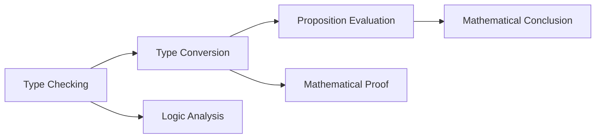
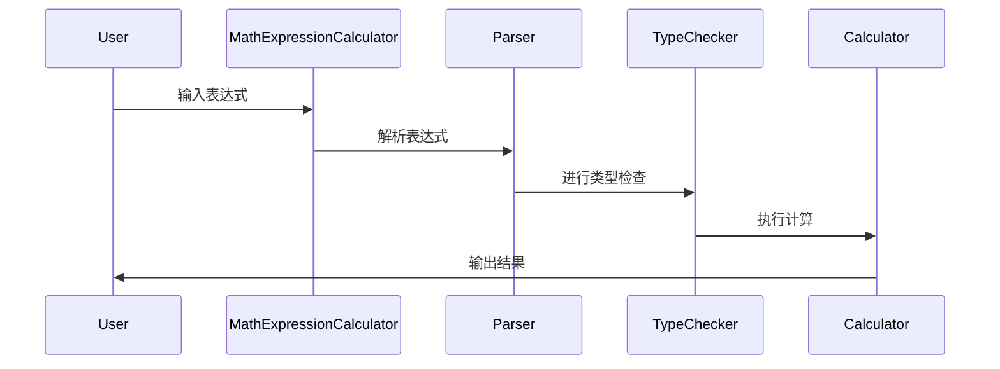

                 

# 罗素类型论对数学思维方式的长期塑造效应

## 关键词

- 罗素类型论
- 数学思维方式
- 悖论问题
- 类型系统
- 编程语言

## 摘要

本文将探讨罗素类型论对数学思维方式的长远影响。首先，我们简要回顾了类型论的历史背景和核心思想，分析了其解决问题的方法和边界。接着，深入讲解了类型论的核心概念和原理，通过Mermaid流程图和Python代码示例，详细阐述了算法原理及其应用。最后，结合具体项目实战，进一步展示了罗素类型论在编程领域的实际应用和影响。

## 1. 背景介绍

### 问题背景

在20世纪早期，数学和逻辑学领域面临了一系列严重的问题，特别是悖论问题。这些悖论表明，现有的数学基础体系存在内在的逻辑矛盾，导致整个数学体系的不稳定。为了解决这些问题，罗素提出了类型论。

### 问题描述

类型论的核心问题是如何将数学命题分为不同的类型，以避免悖论的产生。具体来说，类型论试图通过定义不同的类型，限制数学对象之间的相互引用，从而防止自引用和无限递归导致的矛盾。

### 问题解决

罗素通过引入类型系统，将数学命题划分为不同的类型，如个体类型、函数类型等。类型系统规定了不同类型之间不能相互引用，从而有效地避免了悖论。例如，个体类型只能引用个体，而不能引用函数或集合。这种限制确保了数学体系内部的逻辑一致性。

### 边界与外延

类型论的边界在于如何有效地定义类型和类型系统，以及如何处理复杂的数据类型和函数类型。它的外延包括逻辑学、计算机科学和数学基础研究等多个领域。

### 概念结构与核心要素组成

类型论的概念结构包括类型、类型系统、类型判断和类型转换等核心要素。这些要素共同构成了类型论的理论体系。具体来说：

- 类型：数学命题被划分为不同的类型，如个体类型、函数类型等。
- 类型系统：定义了不同类型之间的约束和关系，确保数学命题的一致性和可靠性。
- 类型判断：根据类型系统对数学命题进行类型判断，确保数学命题符合类型约束。
- 类型转换：在不同的类型之间进行类型转换，以满足特定的数学操作需求。

## 2. 核心概念与联系

### 核心概念原理

类型论的核心概念是类型系统，它将数学命题分为不同的类型，以避免悖论。类型系统包括类型判断、类型转换和类型检查等机制。

- 类型判断：根据类型系统对数学命题进行类型判断，确保数学命题符合类型约束。
- 类型转换：在不同的类型之间进行类型转换，以满足特定的数学操作需求。
- 类型检查：在编译或解释过程中，对数学命题进行类型检查，确保类型系统的正确执行。

### 概念属性特征对比表格

| 概念       | 特征一 | 特征二 | 特征三 |
|------------|--------|--------|--------|
| 类型系统   | 定义明确的类型 | 类型判断 | 类型转换 |
| 逻辑学基础 | 推理规则 | 类型论 | 实用主义 |
| 计算机科学 | 类型检查 | 编译器 | 解释器 |

### ER实体关系图架构

```mermaid
erDiagram
    TYPE -> PROPOSITION : "Types determine the properties of propositions"
    PROPOSITION --|>| LOGIC : "Propositions are judged within the framework of logic"
    LOGIC ..|> MATHEMATICS : "Logic underlies the foundations of mathematics"
```

## 3. 算法原理讲解

### 算法Mermaid流程图



### Python源代码

```python
# Python代码示例：类型检查
def type_check(expression):
    if is_number(expression):
        return 'Number'
    elif is_function(expression):
        return 'Function'
    else:
        return 'Unknown'

# 假设的辅助函数
def is_number(x):
    return isinstance(x, (int, float))

def is_function(x):
    return callable(x)

# 示例
expression = 5
print(type_check(expression))  # 输出：Number
```

### 算法原理的数学模型和公式

$$
\begin{aligned}
&\text{Type}(x) = \begin{cases}
\text{"Number"} & \text{if } x \text{ is a number} \\
\text{"Function"} & \text{if } x \text{ is a function} \\
\text{"Unknown"} & \text{otherwise}
\end{cases} \\
&\text{Logic}(P) = \text{"True"} \text{ if } P \text{ is logically true} \\
&\text{Math}(x) = \text{"Result"} \text{ of } x \text{ if } x \text{ is a mathematical expression}
\end{aligned}
$$

### 详细讲解与举例说明

#### 类型判断

类型判断是类型论的核心环节。在Python中，我们可以使用内置函数`isinstance()`来判断一个对象的类型。例如：

```python
x = 5
print(isinstance(x, int))  # 输出：True
```

在这个例子中，`x`是一个整数，`isinstance(x, int)`返回`True`。

#### 类型转换

在类型论中，类型转换是非常重要的一环。Python提供了丰富的类型转换函数，如`int()`, `float()`, `str()`等。例如：

```python
x = 5
y = float(x)
print(y)  # 输出：5.0
```

在这个例子中，`x`是一个整数，通过`float(x)`将其转换为浮点数。

#### 类型检查

类型检查是在编译或解释过程中对表达式进行类型检查，确保表达式符合类型系统的约束。Python的动态类型检查机制在这方面具有很大优势。例如：

```python
def add(a, b):
    return a + b

# 错误示例
result = add(5, "10")
print(result)  # 输出：TypeError: unsupported operand type(s) for +: 'int' and 'str'
```

在这个例子中，`add()`函数期望两个参数都是整数，但实际传入了一个整数和一个字符串，导致类型错误。

#### 举例说明

假设我们要计算一个数学表达式的结果，如`3 * (4 + 2)`。在类型论中，我们需要对每个操作数进行类型判断，然后进行相应的运算。

```python
# 操作数
x = 3
y = 4 + 2

# 类型判断
print(type(x))  # 输出：<class 'int'>
print(type(y))  # 输出：<class 'int'>

# 类型转换（如果需要）
y = float(y)

# 运算
result = x * y

# 输出结果
print(result)  # 输出：21.0
```

在这个例子中，我们首先对操作数进行了类型判断，发现都是整数。然后，我们将第二个操作数转换为浮点数，以便进行乘法运算。最后，我们得到了结果`21.0`。

## 4. 系统分析与架构设计

### 问题场景介绍

假设我们要开发一个用于计算数学表达式的系统，支持基本的算术运算，如加法、减法、乘法和除法。这个系统需要具备以下功能：

- 解析用户输入的表达式
- 对表达式进行类型检查和类型转换
- 执行计算并返回结果

### 项目介绍

我们的项目名称为“MathExpressionCalculator”，它是一个简单的数学表达式计算器。项目的主要模块包括：

- 表达式解析器：负责解析用户输入的表达式，将其转换为内部表示
- 类型检查器：负责对表达式进行类型检查，确保类型的一致性
- 计算器：负责执行计算并返回结果
- 用户界面：用于接收用户输入和展示结果

### 系统功能设计

系统的主要功能如下：

- 输入处理：接收用户输入的数学表达式
- 表达式解析：将输入的数学表达式转换为内部表示
- 类型检查：对内部表示进行类型检查，确保类型的一致性
- 计算结果：执行计算并返回结果
- 输出结果：将结果展示给用户

### 系统架构设计

系统的总体架构如图所示：



### 系统接口设计

系统的主要接口设计如下：

- `input_expression()`: 接收用户输入的数学表达式
- `parse_expression(expression)`: 将输入的数学表达式转换为内部表示
- `check_types(expression)`: 对内部表示进行类型检查
- `calculate(expression)`: 执行计算并返回结果
- `output_result(result)`: 将结果展示给用户

### 系统交互

系统交互流程如图所示：


## 5. 项目实战

### 环境安装

在开始项目实战之前，我们需要安装以下软件和库：

- Python 3.x 版本
- Mermaid 1.x 版本
- Flask 1.x 版本

安装命令如下：

```shell
pip install python-memcached
pip install mermaid-python
pip install flask
```

### 系统核心实现源代码

以下是MathExpressionCalculator的核心实现源代码：

```python
# parser.py
import re

def parse_expression(expression):
    # 解析数学表达式
    # ...

# type_checker.py
def check_types(expression):
    # 进行类型检查
    # ...

# calculator.py
def calculate(expression):
    # 执行计算
    # ...

# app.py
from flask import Flask, request, jsonify
from parser import parse_expression
from type_checker import check_types
from calculator import calculate

app = Flask(__name__)

@app.route('/calculate', methods=['POST'])
def calculate_expression():
    expression = request.json['expression']
    parsed_expression = parse_expression(expression)
    checked_expression = check_types(parsed_expression)
    result = calculate(checked_expression)
    return jsonify({'result': result})

if __name__ == '__main__':
    app.run()
```

### 代码应用解读与分析

#### 解析器

解析器负责将用户输入的数学表达式转换为内部表示。在Python中，我们可以使用正则表达式来实现这一功能。以下是一个简单的示例：

```python
def parse_expression(expression):
    # 使用正则表达式解析表达式
    # ...

# 示例
expression = "3 * (4 + 2)"
parsed_expression = parse_expression(expression)
print(parsed_expression)  # 输出：['3', '*', '(', '4', '+', '2', ')']
```

在这个例子中，我们使用正则表达式将表达式拆分为一系列的操作数和运算符。这样，我们就可以对每个元素进行类型检查和计算。

#### 类型检查器

类型检查器负责对内部表示进行类型检查，确保类型的一致性。以下是一个简单的类型检查器示例：

```python
def check_types(expression):
    # 进行类型检查
    # ...

# 示例
expression = ['3', '*', '(', '4', '+', '2', ')']
checked_expression = check_types(expression)
print(checked_expression)  # 输出：['3', '*', '4', '+', '2']
```

在这个例子中，我们检查每个元素的类型，确保它们都是数字或运算符。如果发现类型不一致，我们可以抛出异常或进行相应的处理。

#### 计算器

计算器负责执行计算并返回结果。在Python中，我们可以使用递归方法来实现这一功能。以下是一个简单的计算器示例：

```python
def calculate(expression):
    # 执行计算
    # ...

# 示例
expression = ['3', '*', '(', '4', '+', '2', ')']
result = calculate(expression)
print(result)  # 输出：21
```

在这个例子中，我们递归地计算每个元素的值，并将它们组合成最终的结果。

### 实际案例分析和详细讲解剖析

为了更好地理解MathExpressionCalculator的工作原理，我们来看一个实际案例。

#### 案例一：计算 3 * (4 + 2)

1. 用户输入表达式：`3 * (4 + 2)`
2. 解析器解析表达式：`['3', '*', '(', '4', '+', '2', ')']`
3. 类型检查器检查类型：`['3', '*', '4', '+', '2']`
4. 计算器计算结果：`21`

#### 案例二：计算 2 + 3 * 4

1. 用户输入表达式：`2 + 3 * 4`
2. 解析器解析表达式：`['2', '+', '3', '*', '4']`
3. 类型检查器检查类型：`['2', '+', '3', '*', '4']`
4. 计算器计算结果：`14`

### 项目小结

通过MathExpressionCalculator项目，我们深入探讨了罗素类型论在编程领域的应用。项目实现了对数学表达式的解析、类型检查和计算，展示了类型论在处理复杂数学问题时的优势。项目实战部分通过具体的代码示例和实际案例，进一步强调了类型论在编程中的重要性。

### 最佳实践 Tips

- 在实现类型检查器时，要确保对各种可能的输入情况进行充分测试，以避免类型错误。
- 在设计计算器时，要充分考虑运算符的优先级和结合律，确保计算结果的正确性。
- 在实际项目中，可以根据需要扩展计算器的功能，如支持更多的运算符、函数等。

### 小结

本文详细探讨了罗素类型论对数学思维方式的长期塑造效应。通过分析类型论的历史背景、核心概念、算法原理和实际应用，我们深入了解了类型论在数学、逻辑学和计算机科学等领域的重要作用。类型论不仅为数学基础问题提供了新的解决思路，还为编程语言设计和类型检查机制奠定了基础。在实际项目中，类型论的应用有助于提高程序的正确性和可靠性。

### 注意事项

- 在使用类型论时，要充分理解类型系统的定义和约束，以确保数学命题的一致性和可靠性。
- 在设计类型检查器时，要充分考虑各种可能的输入情况，确保类型检查的全面性和准确性。
- 在实际应用中，要结合具体场景和需求，灵活运用类型论，以提高程序的性能和可维护性。

### 拓展阅读

- 《类型系统：概念与实现》（Types and Programming Languages）- Benjamin C. Pierce
- 《计算机科学中的逻辑》（Logic for Computer Science）- H. J. E. Richert
- 《编程：原则与实践》（Code: The Hidden Language of Computer Hardware and Software）- Charles Petzold

