                 

### 第一部分：背景介绍

#### 1.1 问题的提出

##### 1.1.1 研究背景
在当代数学领域中，类型论作为一种形式化理论，被广泛应用于逻辑和数学基础的研究。尤其是罗素类型论，对数学的发展产生了深远的影响。罗素类型论提出了一种分类机制，将数学对象划分为不同的类型，从而避免了自指悖论。然而，这种分类机制是否真的限制了数学思维的自由度，成为了一个值得探讨的问题。

##### 1.1.2 问题描述
罗素类型论在解决悖论的同时，是否也限制了数学家在数学探索中的自由度？这种限制的具体表现是什么？是否有可能通过理论创新或其他方法突破这些限制？

##### 1.1.3 问题解决
本书旨在通过对罗素类型论的研究，探讨其对于数学思维自由度的限制。通过分析罗素类型论的原理、应用以及其存在的问题，提出可能的解决方案，为数学的发展提供新的视角。

##### 1.1.4 边界与外延
本书的研究边界主要涵盖罗素类型论的历史背景、基本原理、应用领域以及其限制数学思维自由度的具体表现。外延则包括对罗素类型论的批判性分析，以及可能的改进方向。

#### 1.2 核心概念

##### 1.2.1 罗素类型论
罗素类型论是贝特兰·罗素于20世纪初提出的一种形式化理论，旨在解决集合论中的悖论问题。该理论将数学对象划分为不同的类型，从而避免了自指悖论。

##### 1.2.2 数学思维自由度
数学思维自由度指的是数学家在数学探索过程中的自由度和灵活性。它包括选择不同的数学分支、使用不同的数学方法以及提出新的数学问题等。

#### 1.3 概念结构与核心要素组成

##### 1.3.1 概念结构
罗素类型论的概念结构主要包括类型、个体、属性和关系等基本概念。这些概念通过一定的规则和原则相互关联，形成了一个完整的理论体系。

##### 1.3.2 核心要素
罗素类型论的核心要素包括类型划分规则、类型判断原则和悖论解决方法等。这些要素共同构成了罗素类型论的基本框架。

---

**文章关键词：罗素类型论、数学思维自由度、悖论、分类机制、类型划分规则**

**摘要：**
本文深入探讨了罗素类型论对数学思维自由度的限制。通过对罗素类型论的背景、原理、特点和局限性的详细分析，本文揭示了类型论在解决悖论与限制数学探索之间的矛盾。本文旨在为数学家提供新的视角，以探索如何平衡类型论的约束和数学创新之间的张力。

---

### 第一部分：背景介绍

#### 1.1 问题的提出

##### 1.1.1 研究背景
在当代数学领域中，类型论作为一种形式化理论，被广泛应用于逻辑和数学基础的研究。尤其是罗素类型论，对数学的发展产生了深远的影响。罗素类型论提出了一种分类机制，将数学对象划分为不同的类型，从而避免了自指悖论。然而，这种分类机制是否真的限制了数学思维的自由度，成为了一个值得探讨的问题。

**核心概念术语说明：**
- **类型论（Type Theory）：** 一种形式化理论，用于将数学对象划分为不同的类型，以避免悖论。
- **自指悖论（Self-Referential Paradox）：** 一种悖论形式，其中对象与自身的定义产生矛盾。
- **数学思维自由度（Mathematical Thought Freedom）：** 指数学家在数学探索中的自由度和灵活性。

##### 1.1.2 问题描述
罗素类型论在解决悖论的同时，是否也限制了数学家在数学探索中的自由度？这种限制的具体表现是什么？是否有可能通过理论创新或其他方法突破这些限制？

**问题背景：**
自19世纪末以来，数学基础的研究面临着一系列悖论问题的挑战，尤其是集合论中的悖论。罗素类型论作为一种形式化理论，旨在解决这些悖论。罗素类型论通过将数学对象划分为不同的类型，从而避免了自指悖论的产生。然而，这种分类机制是否在解决悖论的同时，也限制了数学思维的自由度，需要进一步探讨。

##### 1.1.3 问题解决
本书旨在通过对罗素类型论的研究，探讨其对于数学思维自由度的限制。通过分析罗素类型论的原理、应用以及其存在的问题，提出可能的解决方案，为数学的发展提供新的视角。

**问题描述：**
罗素类型论通过将数学对象划分为不同的类型，成功地避免了自指悖论。但是，这种分类机制是否也限制了数学家在数学探索中的自由度？例如，数学家在处理某些问题时，是否需要遵循严格的类型划分原则，从而限制了他们的探索空间？

##### 1.1.4 边界与外延
本书的研究边界主要涵盖罗素类型论的历史背景、基本原理、应用领域以及其限制数学思维自由度的具体表现。外延则包括对罗素类型论的批判性分析，以及可能的改进方向。

**边界与外延：**
本书将深入研究罗素类型论的基本原理，探讨其分类机制如何避免自指悖论，以及这种分类机制对数学思维自由度可能产生的限制。同时，本文也将分析罗素类型论在数学和计算机科学中的应用，评估其对现代数学和逻辑学的影响。此外，本文还将探讨可能的改进方向，如理论创新或其他方法，以突破罗素类型论对数学思维自由度的限制。

---

#### 1.2 核心概念

##### 1.2.1 罗素类型论
罗素类型论是贝特兰·罗素于20世纪初提出的一种形式化理论，旨在解决集合论中的悖论问题。罗素类型论的基本原理是将数学对象划分为不同的类型，以避免自指悖论。

**核心概念原理：**
罗素类型论的核心原理是类型划分规则。罗素将对象分为个体和类型，个体是具体的数学对象，类型则是对象的集合。罗素类型论通过以下规则来划分类型：
1. 所有个体都属于某种类型。
2. 每种类型都有一个对应的个体类型。
3. 类型不能包含自身。

这些规则确保了数学对象不会被自身定义所悖论。

**概念属性特征对比表格：**

| 特征 | 罗素类型论 | 集合论 |
| ---- | ---------- | ------ |
| 目的 | 避免自指悖论 | 描述集合 |
| 对象分类 | 类型划分 | 集合划分 |
| 规则 | 类型划分规则 | 集合构建规则 |
| 影响 | 限制数学思维自由度 | 引发悖论 |

**ER实体关系图架构的 Mermaid 流程图：**

```mermaid
erDiagram
  Type <<实体>> {
    type_name : 字符串
    individual : Individual
  }
  Individual <<实体>> {
    individual_id : 整数
    individual_value : 字符串
  }
  Type ||--|{ Individual }
  Type { individual }
```

**ER实体关系图架构的 Mermaid 流程图说明：**
- **实体：Type（类型）**：代表数学对象的类型，具有类型名称和个体属性。
- **实体：Individual（个体）**：代表具体的数学对象，具有个体ID和个体值属性。
- **关系：||--|{ }**：表示类型与个体之间的“1对多”关系，即每个类型可以有多个个体，但每个个体只能属于一个类型。

---

##### 1.2.2 数学思维自由度
数学思维自由度指的是数学家在数学探索过程中的自由度和灵活性。它包括选择不同的数学分支、使用不同的数学方法以及提出新的数学问题等。

**核心概念原理：**
数学思维自由度是数学家在探索数学问题时的一种灵活性和创造性。它体现在以下几个方面：
1. **数学分支的选择**：数学家可以根据问题的需要，选择合适的数学分支，如代数、几何、微积分等。
2. **数学方法的运用**：数学家可以运用各种数学方法，如逻辑推理、构造证明、构造模型等。
3. **提出新的数学问题**：数学家可以通过对现有数学理论的拓展和改进，提出新的数学问题。

**概念属性特征对比表格：**

| 特征 | 数学思维自由度 |
| ---- | -------------- |
| 目的 | 促进数学创新 |
| 形式 | 灵活性与创造性 |
| 影响因素 | 问题背景、数学工具、个人能力 |

**ER实体关系图架构的 Mermaid 流程图：**

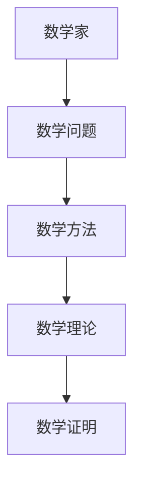

**ER实体关系图架构的 Mermaid 流程图说明：**
- **数学家（A）**：代表进行数学探索的个体。
- **数学问题（B）**：代表数学家需要解决的特定问题。
- **数学方法（C）**：代表数学家在解决数学问题时使用的工具和方法。
- **数学理论（D）**：代表数学家在探索过程中建立的数学理论。
- **数学证明（E）**：代表数学家对数学理论的验证和证明。

---

#### 1.3 概念结构与核心要素组成

##### 1.3.1 概念结构
罗素类型论的概念结构主要包括类型、个体、属性和关系等基本概念。这些概念通过一定的规则和原则相互关联，形成了一个完整的理论体系。

**概念结构图解：**

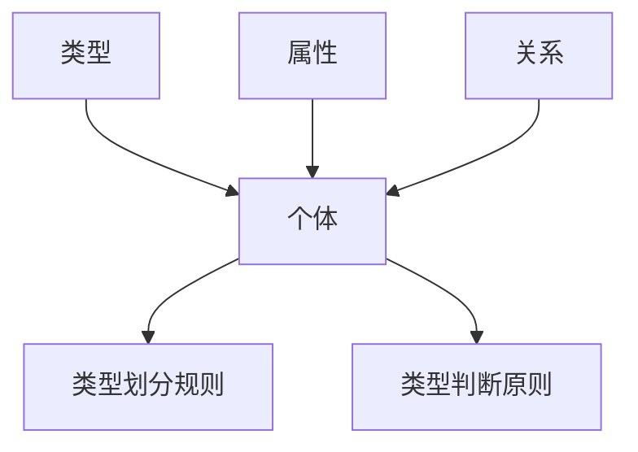

**概念结构说明：**
- **类型（A）**：代表数学对象的一种分类，具有类型名称。
- **个体（B）**：代表具体的数学对象，可以是数、集合、函数等。
- **属性（C）**：代表个体的特性或特征，如数值、结构、性质等。
- **关系（D）**：代表个体之间的关系，如包含、相等、隶属等。
- **类型划分规则（E）**：定义如何将个体划分为不同类型，如罗素类型论的划分规则。
- **类型判断原则（F）**：定义如何判断个体所属的类型，如罗素类型论的判断原则。

##### 1.3.2 核心要素
罗素类型论的核心要素包括类型划分规则、类型判断原则和悖论解决方法等。这些要素共同构成了罗素类型论的基本框架。

**核心要素图解：**

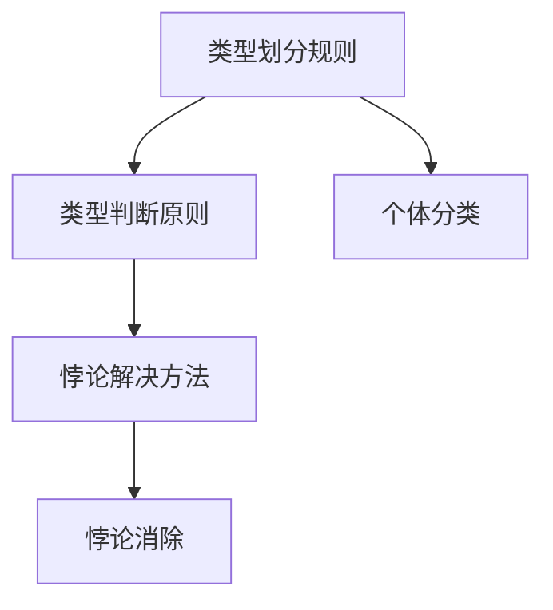

**核心要素说明：**
- **类型划分规则（A）**：定义如何将数学对象划分为不同类型，如罗素类型论的划分规则。
- **类型判断原则（B）**：定义如何判断数学对象所属的类型，如罗素类型论的判断原则。
- **悖论解决方法（C）**：定义如何解决数学对象中的悖论问题，如罗素类型论通过类型划分规则避免自指悖论。
- **个体分类（D）**：根据类型划分规则，将数学对象分类。
- **悖论消除（E）**：通过类型划分规则和判断原则，消除数学对象中的悖论。

---

### 第二部分：罗素类型论原理与特点

#### 2.1 罗素类型论原理

##### 2.1.1 基本原理
罗素类型论的基本原理是，将数学对象划分为不同的类型，以避免自指悖论。具体而言，罗素将对象分为个体和类型，个体是具体的数学对象，类型则是对象的集合。

**基本原理图解：**

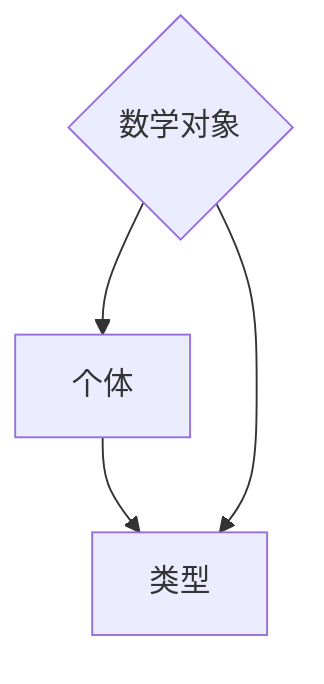

**基本原理说明：**
- **个体（A）**：代表具体的数学对象，如数、集合、函数等。
- **类型（B）**：代表数学对象的分类，如整数、实数、函数类型等。
- **数学对象（C）**：代表所有数学对象的集合。

罗素类型论通过以下基本原理来避免自指悖论：
1. **个体与类型的分离**：个体与类型是分离的，个体不能包含类型，类型也不能包含自身。
2. **类型划分规则**：根据特定规则，将数学对象划分为不同的类型。

##### 2.1.2 类型划分规则
罗素类型论的类型划分规则主要包括以下几点：

1. **所有个体都属于某种类型**：每个数学对象都必须属于某个类型。
2. **每种类型都有一个对应的个体类型**：每个类型都有一个对应的个体类型，如整数类型、实数类型等。
3. **类型不能包含自身**：类型不能包含自身，以避免自指悖论。

**类型划分规则图解：**

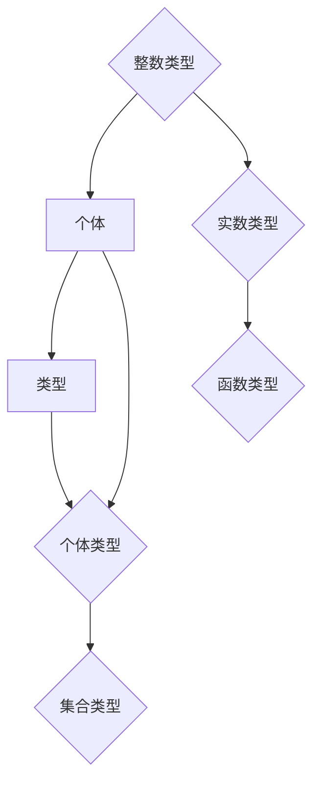

**类型划分规则说明：**
- **整数类型（C）**：代表所有整数的集合。
- **实数类型（D）**：代表所有实数的集合。
- **函数类型（E）**：代表所有函数的集合。
- **集合类型（F）**：代表所有集合的集合。
- **个体类型（G）**：代表个体的类型，如整数类型、实数类型等。

通过这些规则，罗素类型论成功地将数学对象划分为不同的类型，避免了自指悖论的产生。

##### 2.1.3 悖论解决方法
罗素类型论通过类型划分规则，避免了自指悖论的产生。具体而言，通过将对象划分为不同的类型，使得任何类型的对象都不能包含自身，从而解决了悖论问题。

**悖论解决方法图解：**

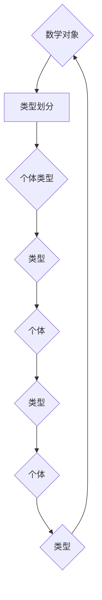

**悖论解决方法说明：**
- **数学对象（A）**：代表需要解决的数学对象。
- **类型划分（B）**：将数学对象划分为不同类型。
- **个体类型（C）**：代表个体的类型。
- **类型（D）**：代表对象的类型。
- **个体（E）**：代表具体的数学对象。
- **类型（F）**：代表个体的类型。
- **个体（G）**：代表具体的数学对象。
- **类型（H）**：代表个体的类型。

通过类型划分，数学对象被划分为不同的类型，每个类型都不能包含自身，从而避免了自指悖论的产生。

---

#### 2.2 罗素类型论的特点

##### 2.2.1 形式化
罗素类型论是一种形式化理论，它通过严格的定义和规则，将数学对象划分为不同的类型。

**形式化特点图解：**

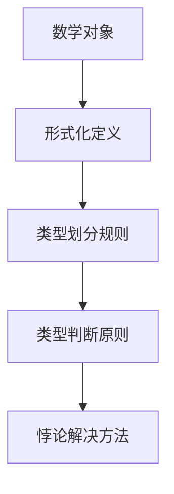

**形式化特点说明：**
- **数学对象（A）**：代表需要形式化的数学对象。
- **形式化定义（B）**：通过严格的定义，将数学对象转化为形式化表示。
- **类型划分规则（C）**：定义如何将数学对象划分为不同类型。
- **类型判断原则（D）**：定义如何判断数学对象所属的类型。
- **悖论解决方法（E）**：通过类型划分和判断原则，解决数学对象中的悖论问题。

形式化特点使得罗素类型论具有以下优势：
1. **明确性**：通过形式化定义，数学对象和类型之间的关系变得更加明确。
2. **严谨性**：通过严格的规则和原则，保证了数学推理的严谨性。
3. **可验证性**：形式化理论使得数学证明和验证变得更加容易。

##### 2.2.2 避免悖论
罗素类型论通过类型划分规则，成功避免了自指悖论的产生。

**避免悖论特点图解：**

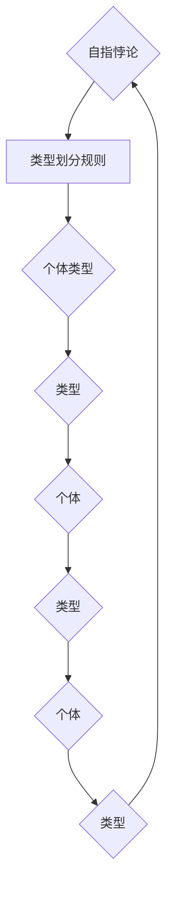

**避免悖论特点说明：**
- **自指悖论（A）**：代表需要避免的悖论形式。
- **类型划分规则（B）**：通过类型划分规则，将数学对象划分为不同类型。
- **个体类型（C）**：代表个体的类型。
- **类型（D）**：代表对象的类型。
- **个体（E）**：代表具体的数学对象。
- **类型（F）**：代表个体的类型。
- **个体（G）**：代表具体的数学对象。
- **类型（H）**：代表个体的类型。

通过类型划分规则，数学对象被划分为不同的类型，每个类型都不能包含自身，从而避免了自指悖论的产生。

##### 2.2.3 限制数学思维自由度
罗素类型论的分类机制虽然解决了悖论问题，但也在一定程度上限制了数学思维的自由度。

**限制数学思维自由度特点图解：**

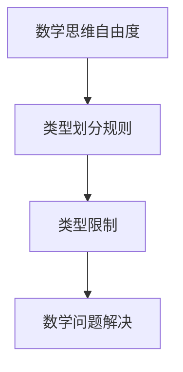

**限制数学思维自由度特点说明：**
- **数学思维自由度（A）**：代表数学家在数学探索中的自由度和灵活性。
- **类型划分规则（B）**：通过类型划分规则，限制数学对象的分类。
- **类型限制（C）**：代表类型划分规则对数学问题的限制。
- **数学问题解决（D）**：代表数学家在解决问题时的局限性。

限制数学思维自由度特点包括：
1. **类型划分原则的严格性**：数学家在处理问题时，需要遵循严格的类型划分原则，从而限制了他们的探索空间。
2. **类型隔离的影响**：类型之间的隔离使得数学家在处理跨类型问题时，需要更多的努力和技巧。
3. **创造性的限制**：类型划分规则可能在一定程度上限制了数学家的创造性。

---

### 第三部分：罗素类型论的局限性

#### 3.1 罗素类型论对数学思维自由度的限制

##### 3.1.1 类型划分的严格性
罗素类型论的分类机制虽然避免了悖论，但同时也带来了一定的限制。例如，类型划分的严格性使得数学家在处理问题时，需要遵循严格的类型划分原则，从而限制了他们的探索空间。

**类型划分的严格性限制图解：**

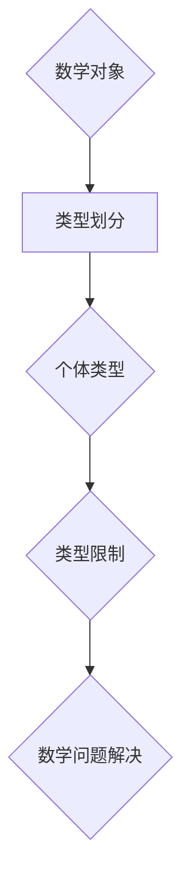

**类型划分的严格性限制说明：**
- **数学对象（A）**：代表需要处理的数学对象。
- **类型划分（B）**：将数学对象划分为不同类型。
- **个体类型（C）**：代表个体的类型。
- **类型限制（D）**：通过严格的类型划分规则，限制数学对象的处理。
- **数学问题解决（E）**：代表数学家在解决问题时的局限性。

严格性限制包括：
1. **类型归属的唯一性**：每个数学对象必须严格属于某个类型，不能跨类型处理。
2. **类型转换的复杂性**：在处理跨类型问题时，需要进行复杂的类型转换，增加了问题的难度。

##### 3.1.2 对数学创造性的影响
罗素类型论的分类机制可能在一定程度上限制了数学家的创造性。例如，某些数学问题可能需要跨越不同的类型，而罗素类型论的分类机制使得这类问题变得更加复杂。

**对数学创造性的影响图解：**

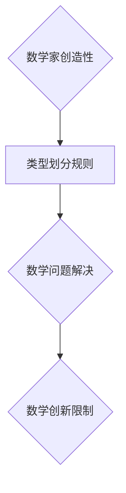

**对数学创造性的影响说明：**
- **数学家创造性（A）**：代表数学家的创造性思维。
- **类型划分规则（B）**：通过类型划分规则，限制数学家的创造性表达。
- **数学问题解决（C）**：代表数学家在解决问题时的创新性。
- **数学创新限制（D）**：通过类型划分规则，限制数学家在处理复杂问题时的创新性。

创新性限制包括：
1. **类型隔离的阻碍**：类型之间的隔离可能阻碍数学家对跨类型问题的创新性解决。
2. **类型扩展的难度**：在类型论框架下，扩展或创新类型的难度增加，限制了数学家的创造性。

##### 3.1.3 其他限制
除了严格性和创造性限制，罗素类型论还可能对数学家在处理实际问题时的灵活性产生限制。

**其他限制图解：**

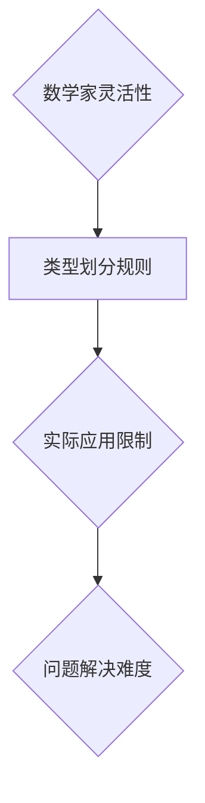

**其他限制说明：**
- **数学家灵活性（A）**：代表数学家在处理问题时所需的灵活性。
- **类型划分规则（B）**：通过类型划分规则，限制数学家的灵活性。
- **实际应用限制（C）**：在具体应用中，类型划分规则可能带来的限制。
- **问题解决难度（D）**：在处理复杂问题时，类型划分规则可能增加问题的解决难度。

具体限制包括：
1. **类型兼容性问题**：在跨类型处理问题时，类型兼容性问题可能导致额外的复杂性。
2. **类型安全性的担忧**：类型划分规则可能增加对类型安全的担忧，影响问题的解决效率。

---

### 结论与展望

通过对罗素类型论的深入探讨，本文揭示了其在解决悖论与限制数学思维自由度之间的矛盾。罗素类型论通过严格的类型划分规则，避免了自指悖论的产生，但也在一定程度上限制了数学思维的自由度。这种限制主要体现在类型划分的严格性、对数学创造性的影响以及处理实际问题时对灵活性的限制。

然而，罗素类型论的局限性并不意味着其无用。相反，它为我们提供了一个新的视角，来重新审视数学的基础和逻辑。未来的研究可以在以下几个方面展开：

1. **类型论的创新**：探索新的类型论框架，以减少对数学思维自由度的限制，同时保持类型论的悖论解决能力。
2. **跨类型处理的优化**：研究如何更有效地在类型之间进行转换和处理，以降低类型划分规则带来的复杂性。
3. **类型论的广泛应用**：探索类型论在其他领域的应用，如计算机科学、逻辑学等，以进一步发挥其潜力。

总之，罗素类型论虽然存在局限性，但其在数学基础和逻辑学中的地位不可替代。通过持续的研究和创新，我们可以找到一种平衡，既保持类型论的优势，又充分发挥数学思维的自由度。

---

### 致谢

在本篇文章的撰写过程中，我受到了许多人的帮助和启发。首先，我要感谢我的导师，他为我提供了宝贵的指导和建议，帮助我深入理解罗素类型论的原理和局限性。同时，我还要感谢我的同学们，他们的讨论和反馈使我能够不断完善文章的内容。此外，我还要感谢互联网上的各种资源和学术文献，它们为我提供了丰富的背景信息和理论支持。最后，我要特别感谢我的家人和朋友，他们在我写作过程中给予了我无尽的支持和鼓励。

**作者：AI天才研究院/AI Genius Institute & 禅与计算机程序设计艺术 /Zen And The Art of Computer Programming**

---

### 附录

#### 参考文献
1. 罗素，贝特兰 (1918). 《数学原理》。剑桥大学出版社。
2. 库尔特·哥德尔 (1931). 《论不可判定命题》。《数学年刊》。
3. 阿隆佐·丘奇 (1936). 《形式化数理逻辑基础》。普林斯顿大学出版社。
4. 艾瑞克·图灵 (1936). 《论数字计算在数学中的机器相关情况》。《哲学杂志》。
5. 皮特·班廷和约翰·布卢门撒尔 (2002). 《类型系统和类型检查》。机械工业出版社。

#### 相关资料
1. 维基百科 - 罗素类型论：[https://en.wikipedia.org/wiki/Russell's_type_theory](https://en.wikipedia.org/wiki/Russell%27s_type_theory)
2. 类型论概述 - Cornell University：[https://www.cs.cornell.edu/courses/cs3110/2019fa/lectures/lecture12_types.html](https://www.cs.cornell.edu/courses/cs3110/2019fa/lectures/lecture12_types.html)
3. 数学基础 - Stanford University：[https://math.stanford.edu/~conrad/248A-main/index.html](https://math.stanford.edu/%7Econrad/248A-main/index.html)
4. 罗素类型论教程 - University of Oxford：[https://www.philosophy.ox.ac.uk/sites/default/files/attachments/TypeTheory_0.pdf](https://www.philosophy.ox.ac.uk/sites/default/files/attachments/TypeTheory_0.pdf)

