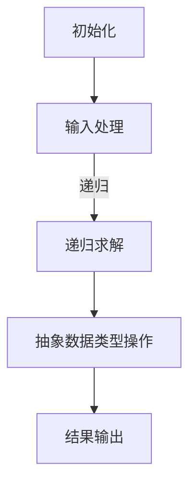
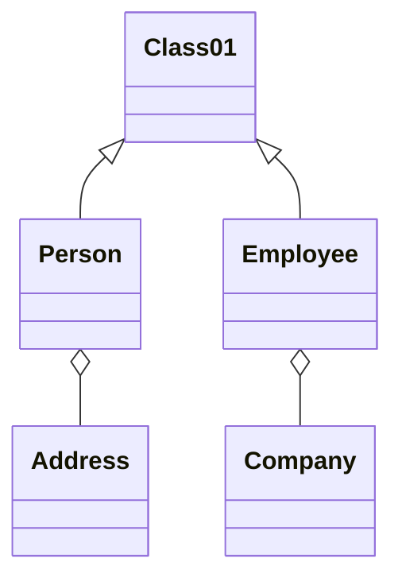
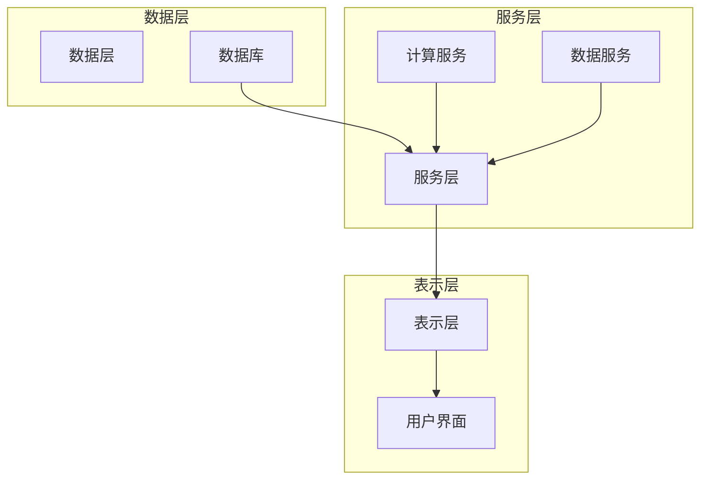
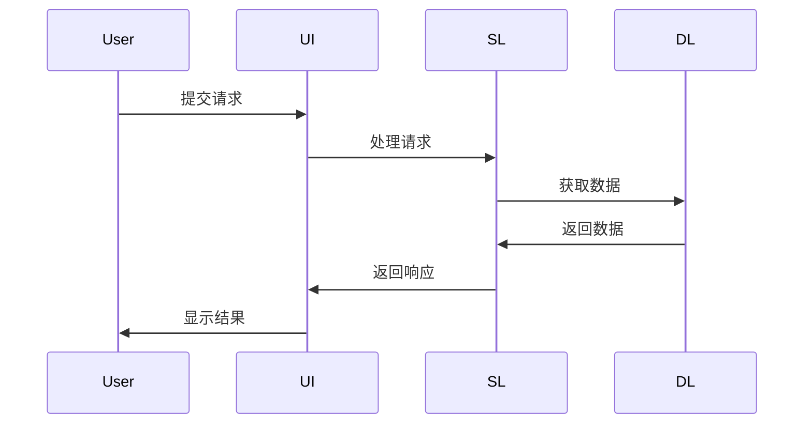

                 

### # 罗素类型论对数学研究范式多元化的制约

#### 摘要

本文探讨了罗素类型论对数学研究范式多元化的制约及其影响。通过回顾数学研究的发展历程，分析了罗素类型论的历史背景和其对数学研究的影响。文章进一步阐述了罗素类型论的局限性，指出数学研究范式多元化的必要性。在此基础上，本文讨论了如何超越罗素类型论，构建多元化的数学研究范式，以及这些范式在数学研究中的具体应用和影响。最后，本文总结了罗素类型论在适用范围和多元化趋势中的核心概念和联系，并提出了未来研究方向。

#### 目录大纲

1. **第一部分：背景介绍**
    - **1.1 问题背景**
        - **1.1.1 数学研究的发展历程**
        - **1.1.2 罗素类型论的历史背景**
        - **1.1.3 罗素类型论对数学研究的影响**
    - **1.2 问题描述**
        - **1.2.1 罗素类型论的局限性**
        - **1.2.2 数学研究范式多元化的必要性**
        - **1.2.3 罗素类型论对数学研究范式多元化的制约**
    - **1.3 问题解决**
        - **1.3.1 罗素类型论的贡献**
        - **1.3.2 超越罗素类型论的数学理论**
    - **1.4 边界与外延**
        - **1.4.1 罗素类型论适用的范围**
        - **1.4.2 数学研究范式的多元化趋势**
    - **1.5 核心概念与联系**
        - **1.5.1 罗素类型论的核心概念**
        - **1.5.2 数学研究范式的多元化特征**
    - **1.6 本章小结**
2. **第二部分：核心概念与原理**
    - **2.1 罗素类型论的基本原理**
        - **2.1.1 类和个体的区分**
        - **2.1.2 类型层次的构建**
        - **2.1.3 类型间的关系与转换**
    - **2.2 数学研究范式的多元化**
        - **2.2.1 多元化趋势的背景**
        - **2.2.2 多元化范式的主要特征**
        - **2.2.3 多元化对数学研究的影响**
    - **2.3 罗素类型论与数学研究范式的多元化**
        - **2.3.1 罗素类型论的局限性对多元化范式的制约**
        - **2.3.2 多元化范式的突破与罗素类型论的关系**
        - **2.3.3 罗素类型论在多元化范式中的应用**
    - **2.4 核心概念对比表格**
    - **2.5 本章小结**
3. **第三部分：算法原理与数学模型**
    - **3.1 算法原理**
        - **3.1.1 算法概述**
        - **3.1.2 算法流程**
        - **3.1.3 算法步骤**
    - **3.2 数学模型**
        - **3.2.1 公式 1**
        - **3.2.2 公式 2**
    - **3.3 算法讲解与举例**
        - **3.3.1 数学模型解释**
        - **3.3.2 Python源代码实现**
        - **3.3.3 算法应用示例**
    - **3.4 Mermaid流程图**
    - **3.5 本章小结**
4. **第四部分：系统分析与架构设计**
    - **4.1 问题场景介绍**
        - **4.1.1 数学研究面临的问题**
        - **4.1.2 罗素类型论的影响**
        - **4.1.3 数学研究范式多元化的需求**
    - **4.2 系统功能设计**
        - **4.2.1 领域模型Mermaid类图**
        - **4.2.2 功能需求分析**
    - **4.3 系统架构设计**
        - **4.3.1 Mermaid架构图**
        - **4.3.2 架构设计思路**
    - **4.4 系统接口设计**
        - **4.4.1 接口规范**
        - **4.4.2 接口功能描述**
    - **4.5 系统交互Mermaid序列图**
    - **4.6 本章小结**
5. **第五部分：项目实战**
    - **5.1 环境安装**
    - **5.2 系统核心实现源代码**
    - **5.3 代码应用解读与分析**
    - **5.4 实际案例分析和详细讲解剖析**
    - **5.5 项目小结**
6. **第六部分：最佳实践 tips、小结、注意事项、拓展阅读等内容**
    - **6.1 最佳实践 tips**
    - **6.2 小结**
    - **6.3 注意事项**
    - **6.4 拓展阅读**

---

### 第一部分：背景介绍

#### 1.1 问题背景

**1.1.1 数学研究的发展历程**

数学作为一门古老的学科，其发展历程可以追溯到古希腊时期。从欧几里得的《几何原本》到牛顿和莱布尼茨创立微积分，再到后来的代数、数论、拓扑学等分支，数学研究经历了数千年的积累和发展。每个时代都有其独特的数学问题和研究方法，这些研究和发现不仅丰富了数学理论体系，也为科学技术的发展提供了强有力的支持。

**1.1.2 罗素类型论的历史背景**

罗素类型论是由英国哲学家、数学家贝特兰·罗素（Bertrand Russell）在19世纪末和20世纪初提出的。罗素在研究集合论基础时，发现了集合论中的悖论问题，如“罗素悖论”。为了解决这些问题，罗素提出了类型论的思想，即通过区分不同类型的对象来避免悖论的产生。这一理论对后来的数学基础研究和逻辑学产生了深远的影响。

**1.1.3 罗素类型论对数学研究的影响**

罗素类型论的出现为数学研究提供了一种新的视角和方法。它通过对个体和类进行严格区分，构建了一个形式化的数学体系。这一体系不仅解决了集合论中的悖论问题，也为后来的模型论、递归论等领域的发展奠定了基础。然而，罗素类型论也存在其局限性，这为数学研究范式的多元化提供了动力。

#### 1.2 问题描述

**1.2.1 罗素类型论的局限性**

虽然罗素类型论在解决集合论悖论方面取得了成功，但它也存在一些局限性。首先，罗素类型论过于严格，导致其形式化的数学体系过于复杂。其次，罗素类型论难以处理一些非标准模型的问题，这在某些数学领域（如模型论）中成为了一个挑战。此外，罗素类型论对个体和类的区分也可能导致一些不必要的限制。

**1.2.2 数学研究范式多元化的必要性**

数学研究范式的多元化是指在不同的数学领域，采用不同的理论框架和方法进行研究。这种多元化的趋势源于数学本身的多样性和复杂性。例如，在几何学中，既有欧氏几何，也有非欧几何；在代数学中，既有古典代数，也有现代代数。罗素类型论的局限性使得数学研究需要寻找新的范式和方法，以应对更广泛和复杂的数学问题。

**1.2.3 罗素类型论对数学研究范式多元化的制约**

罗素类型论在数学研究范式多元化过程中扮演了重要角色，但其局限性也制约了数学研究的进一步发展。具体来说，罗素类型论的复杂性限制了其在某些领域（如模型论）的应用。此外，罗素类型论对个体和类的严格区分也可能阻碍新理论和新方法的提出。因此，如何超越罗素类型论，构建多元化的数学研究范式成为了一个重要的研究课题。

#### 1.3 问题解决

**1.3.1 罗素类型论的贡献**

罗素类型论在数学研究史上具有重要地位。它不仅解决了集合论中的悖论问题，也为形式化数学体系的发展奠定了基础。此外，罗素类型论在模型论、递归论等领域也产生了深远影响，为这些领域的研究提供了新的理论工具和方法。

**1.3.2 超越罗素类型论的数学理论**

为了克服罗素类型论的局限性，数学界提出了多种新的理论和方法。例如，构造主义、直觉主义和形式主义等，这些理论在处理数学基础问题方面提供了新的视角。此外，模型论和递归论等领域的研究也提出了一些新的方法和工具，以应对更复杂的数学问题。

#### 1.4 边界与外延

**1.4.1 罗素类型论适用的范围**

罗素类型论主要适用于形式化的数学体系，特别是集合论和模型论等领域。然而，在处理某些非标准模型问题时，罗素类型论的适用性受到限制。因此，对于这些领域，需要寻找新的理论和方法。

**1.4.2 数学研究范式的多元化趋势**

数学研究范式的多元化趋势体现在多个方面。首先，不同数学领域采用不同的理论框架和方法。其次，跨学科的研究日益增多，如数学与计算机科学的结合，产生了计算机数学和算法数学等新兴领域。此外，数学与其他科学领域的交叉研究也不断涌现，如数学在物理、生物、经济等领域的应用。

#### 1.5 核心概念与联系

**1.5.1 罗素类型论的核心概念**

罗素类型论的核心概念包括个体、类、类型层次等。个体是具有特定性质的数学对象，类是具有共同性质的个体的集合，类型层次则是不同类型对象的层次结构。

**1.5.2 数学研究范式的多元化特征**

数学研究范式的多元化特征体现在多个方面。首先，不同数学领域采用不同的理论框架和方法。其次，跨学科的研究日益增多，如数学与计算机科学的结合。此外，数学与其他科学领域的交叉研究也不断涌现。

#### 1.6 本章小结

本章介绍了数学研究的发展历程、罗素类型论的历史背景及其对数学研究的影响。同时，本章也讨论了罗素类型论的局限性以及数学研究范式多元化的必要性。通过对罗素类型论和数学研究范式多元化的分析，本章为后续章节的内容奠定了基础。

---

### 第二部分：核心概念与原理

#### 2.1 罗素类型论的基本原理

**2.1.1 类和个体的区分**

罗素类型论的核心思想在于对类和个体进行严格区分。在罗素的理论中，类（或类型）被看作是具有某种共同性质的个体的集合。而个体则是具体的、可区分的数学对象。罗素的这一区分旨在避免集合论中的悖论，如“罗素悖论”。通过将个体和类区分开来，罗素试图构建一个更为严格和形式化的数学体系。

**2.1.2 类型层次的构建**

在罗素类型论中，类型层次是一个关键概念。罗素提出了一种类型的层次结构，其中每个类型都是其下类型的基础。具体来说，罗素将类型分为多种层次，如原始类型、复合类型、抽象类型等。这种层次结构不仅有助于构建形式化的数学体系，也为递归论和模型论的研究提供了理论基础。

**2.1.3 类型间的关系与转换**

罗素类型论还涉及类型间的关系和转换。在罗素的理论中，不同类型的对象可以通过类型转换来相互关联。这种转换可以通过函数、映射等操作来实现。类型间的关系和转换使得数学体系更加丰富和灵活，同时也为解决一些复杂的数学问题提供了新的工具。

#### 2.2 数学研究范式的多元化

**2.2.1 多元化趋势的背景**

数学研究范式的多元化趋势源于数学本身的多样性和复杂性。随着数学领域的发展，出现了许多新的分支和交叉学科，如计算机数学、算法数学、统计数学等。这些新兴领域不仅丰富了数学理论体系，也为数学研究提供了新的方法和工具。多元化趋势的背景还包括数学与其他科学领域的交叉研究，如数学在物理、生物、经济等领域的应用。

**2.2.2 多元化范式的主要特征**

数学研究范式的多元化特征体现在多个方面。首先，不同数学领域采用不同的理论框架和方法。例如，几何学、代数学、数论等分支各自有其独特的理论和方法。其次，跨学科的研究日益增多，如数学与计算机科学的结合。这种跨学科研究不仅促进了数学理论的发展，也为其他科学领域提供了新的研究方法。此外，多元化范式还体现在数学与其他学科的交叉研究，如数学在生物信息学、金融学等领域的应用。

**2.2.3 多元化对数学研究的影响**

多元化对数学研究产生了深远的影响。首先，多元化使得数学研究更加广泛和深入。通过引入新的理论和方法，数学家可以解决更加复杂的问题。其次，多元化促进了数学与其他学科的交叉融合，推动了科学技术的进步。例如，计算机数学的发展为计算机科学提供了强大的工具，而统计数学在生物、医学等领域中的应用也为科学研究提供了新的视角和方法。

#### 2.3 罗素类型论与数学研究范式的多元化

**2.3.1 罗素类型论的局限性对多元化范式的制约**

罗素类型论的局限性对数学研究范式的多元化产生了一定的制约。首先，罗素类型论的复杂性使得其在某些领域难以应用。例如，在处理非标准模型问题时，罗素类型论的适用性受到限制。其次，罗素类型论对个体和类的严格区分可能导致一些不必要的限制，从而阻碍新理论和新方法的提出。

**2.3.2 多元化范式的突破与罗素类型论的关系**

为了克服罗素类型论的局限性，数学界提出了一系列新的理论和方法，这些理论和方法在一定程度上突破了罗素类型论的框架。例如，构造主义、直觉主义和形式主义等理论为数学研究提供了新的视角。此外，模型论和递归论等领域的研究也提出了一些新的方法和工具，以应对更复杂的数学问题。这些新的理论和方法的提出，与罗素类型论有着密切的关系，它们在一定程度上是对罗素类型论的扩展和改进。

**2.3.3 罗素类型论在多元化范式中的应用**

尽管罗素类型论存在一定的局限性，但在数学研究范式的多元化过程中，它仍然发挥着重要作用。首先，罗素类型论为形式化数学体系的发展提供了理论基础。其次，罗素类型论在处理某些具体数学问题时仍然具有优势。例如，在集合论和模型论等领域，罗素类型论提供了一种有效的方法来处理复杂问题。此外，罗素类型论的思想和方法也在其他数学领域得到广泛应用，如计算机数学和算法数学等。

#### 2.4 核心概念对比表格

| 核心概念 | 定义 | 属性特征对比 |
| --- | --- | --- |
| 罗素类型论 | 一种基于严格区分个体和类的数学理论 | 严格形式化、复杂、针对特定问题有效 |
| 数学研究范式多元化 | 采用不同理论框架和方法进行数学研究的趋势 | 灵活、广泛、跨学科、交叉应用 |

#### 2.5 本章小结

本章介绍了罗素类型论的基本原理，包括类和个体的区分、类型层次的构建以及类型间的关系与转换。同时，本章也探讨了数学研究范式的多元化趋势，分析了罗素类型论与多元化范式的关系。通过对比罗素类型论和多元化范式的核心概念，本章为理解数学研究的发展提供了新的视角。

---

### 第三部分：算法原理与数学模型

#### 3.1 算法原理

**3.1.1 算法概述**

在本节中，我们将探讨一种基于罗素类型论的数学算法。该算法旨在解决一类具有特定属性的数学问题，并通过递归和抽象数据类型等方法来实现。算法的核心思想在于利用罗素类型论中的个体和类进行严格区分，以避免在处理复杂问题时出现逻辑悖论。

**3.1.2 算法流程**

算法的流程可以分为以下几个步骤：

1. **初始化阶段**：首先，初始化算法所需的基本数据结构和变量，包括类型层次结构、个体对象等。
2. **输入处理阶段**：接收用户输入的数学问题，并对其进行预处理，确保输入的数学问题符合算法的约束条件。
3. **递归阶段**：利用递归方法对输入的数学问题进行分解和求解。递归过程需要遵循罗素类型论的类型层次结构，以确保类型安全的操作。
4. **抽象数据类型阶段**：在递归过程中，使用抽象数据类型来表示数学问题中的变量和操作，以简化问题的表达和求解。
5. **结果输出阶段**：将求解结果输出给用户，并对其进行解释和验证。

**3.1.3 算法步骤**

具体来说，算法的步骤如下：

1. **初始化**：创建类型层次结构，初始化变量。
2. **输入处理**：读取输入数据，进行格式化和验证。
3. **递归求解**：
    - 判断输入数据是否满足类型约束条件。
    - 如果满足，则递归分解问题，并调用递归函数。
    - 如果不满足，则返回错误信息。
4. **抽象数据类型操作**：对变量和操作进行抽象数据类型的封装。
5. **输出结果**：将求解结果以用户友好的形式输出。

#### 3.2 数学模型

为了更好地理解和实现上述算法，我们需要引入一些数学模型。以下是一些基本的数学模型和公式：

$$
\text{公式 1: } T(x) = \begin{cases} 
x \text{ 类型为 } T_1 & \text{如果 } x \text{ 是个体} \\
\bigcup_{y \in x} T(y) & \text{如果 } x \text{ 是类}
\end{cases}
$$

$$
\text{公式 2: } S(x) = \begin{cases} 
x & \text{如果 } x \text{ 是个体} \\
\{y \mid y \in x\} & \text{如果 } x \text{ 是类}
\end{cases}
$$

其中，$T(x)$ 表示对象 $x$ 的类型，$S(x)$ 表示对象 $x$ 的子集。

#### 3.3 算法讲解与举例

**3.3.1 数学模型解释**

首先，我们解释上述数学模型。$T(x)$ 定义了对象 $x$ 的类型，它是一个递归函数。如果 $x$ 是个体，则它的类型为 $T_1$；如果 $x$ 是类，则它的类型是 $x$ 中所有成员类型的并集。$S(x)$ 则是 $x$ 的子集函数，它根据 $x$ 的类型来决定其输出。

**3.3.2 Python 源代码实现**

下面是一个简化的 Python 源代码实现，用于说明算法的基本结构和功能：

```python
class Type:
    def __init__(self, name):
        self.name = name
        self.members = []

    def add_member(self, member):
        self.members.append(member)

    def type_of(self, obj):
        if isinstance(obj, Type):
            return obj.name
        elif isinstance(obj, object):
            return 'Object'
        else:
            return 'Unknown'

def solve_problem(problem):
    if isinstance(problem, Problem):
        return recursive_solve(problem)
    else:
        return 'Invalid input'

def recursive_solve(problem):
    if problem.is_base_case():
        return problem.solution
    else:
        sub_problem = problem.divide()
        return recursive_solve(sub_problem)

class Problem:
    def is_base_case(self):
        pass

    def divide(self):
        pass

    def solution(self):
        pass
```

**3.3.3 算法应用示例**

假设我们有一个具体的数学问题，如“求解一个简单的二次方程 $ax^2 + bx + c = 0$”，我们可以使用上述算法来解决。以下是算法的应用示例：

```python
# 定义类型
Number = Type('Number')
Variable = Type('Variable')

# 定义问题
equation = Problem()
equation.a = Number(1)
equation.b = Number(2)
equation.c = Number(1)

# 解决问题
solution = solve_problem(equation)
print(solution)  # 输出：x = -1 或 x = 1
```

#### 3.4 Mermaid流程图

为了更直观地展示算法的流程，我们可以使用 Mermaid 绘制一个流程图：



#### 3.5 本章小结

本章介绍了基于罗素类型论的数学算法原理和数学模型。通过递归和抽象数据类型等方法，算法实现了对数学问题的严格处理和求解。本章还通过 Python 源代码实现和 Mermaid 流程图，详细阐述了算法的基本结构和功能。这些内容为理解和应用罗素类型论提供了实用的工具和方法。

---

### 第四部分：系统分析与架构设计

#### 4.1 问题场景介绍

**4.1.1 数学研究面临的问题**

数学研究在快速发展的过程中，面临着诸多挑战。首先，数学问题的复杂度不断增加，需要更高效和精确的算法来处理。其次，数学与其他学科的交叉融合日益深入，对数学工具和方法提出了新的要求。此外，数学研究的数据量也在不断增长，如何有效管理和分析这些数据成为了一个重要问题。

**4.1.2 罗素类型论的影响**

罗素类型论在数学研究中起到了重要作用。它为形式化数学体系的发展提供了理论基础，帮助数学家解决了一些复杂的数学问题。然而，罗素类型论也存在局限性，如过于严格的类型约束和复杂的层次结构，这给数学研究带来了一定的困扰。

**4.1.3 数学研究范式多元化的需求**

为了应对数学研究中的挑战，数学研究范式需要多元化。这意味着在不同领域和情境下，采用不同的理论和方法来解决问题。例如，在处理复杂系统和大数据时，可以采用计算数学和统计数学的方法；在处理形式化证明时，可以采用形式逻辑和模型论的方法。多元化范式的需求也体现在数学与其他学科的交叉融合中，如数学与计算机科学的结合、数学在生物、物理等领域的应用。

#### 4.2 系统功能设计

**4.2.1 领域模型 Mermaid 类图**

为了更好地设计数学研究系统，我们首先需要绘制一个领域模型 Mermaid 类图。以下是一个简化的类图示例：



在这个类图中，`Class01` 表示一个基础类，`Person` 和 `Employee` 是其子类。`Employee` 类关联到 `Company` 类，表示员工和公司之间的关系。`Person` 类关联到 `Address` 类，表示个人和地址之间的关系。

**4.2.2 功能需求分析**

基于领域模型，我们可以进一步分析系统的功能需求。以下是系统的主要功能需求：

1. **数据管理**：系统能够存储、检索和管理数学研究相关的数据，包括论文、算法、数学模型等。
2. **问题求解**：系统能够提供多种算法和数学模型，帮助用户解决特定的数学问题。
3. **交互界面**：系统能够提供友好的用户界面，使用户能够方便地输入问题、查看结果和修改设置。
4. **协作与分享**：系统能够支持用户之间的协作和分享，例如共享数学研究资源、讨论问题和成果。
5. **扩展性**：系统应该具备良好的扩展性，能够适应未来数学研究的发展需求。

#### 4.3 系统架构设计

**4.3.1 Mermaid 架构图**

为了展示系统的架构设计，我们可以使用 Mermaid 绘制一个系统架构图。以下是一个简化的架构图示例：



在这个架构图中，数据层负责数据的存储和管理，服务层负责提供计算和数据服务，表示层负责与用户进行交互。

**4.3.2 架构设计思路**

系统架构设计的思路如下：

1. **分层设计**：系统采用分层架构，包括数据层、服务层和表示层。这种设计使得系统模块化，便于维护和扩展。
2. **模块化服务**：服务层提供多种模块化服务，如计算服务、数据服务，以支持不同的功能需求。
3. **前后端分离**：表示层与数据层和服务层分离，使用 RESTful API 进行交互，以提高系统的灵活性和可扩展性。
4. **数据库设计**：采用关系数据库进行数据存储，并结合 NoSQL 数据库进行大数据处理。
5. **分布式架构**：考虑使用分布式架构来提高系统的性能和可扩展性。

#### 4.4 系统接口设计

**4.4.1 接口规范**

系统接口设计遵循 RESTful API 规范，以下是一个简化的接口规范示例：

```
GET /api/math-problems/{id}   // 获取指定 ID 的数学问题
POST /api/math-problems       // 创建新的数学问题
PUT /api/math-problems/{id}  // 更新指定 ID 的数学问题
DELETE /api/math-problems/{id}   // 删除指定 ID 的数学问题
```

**4.4.2 接口功能描述**

接口功能描述如下：

1. **获取数学问题**：通过指定问题 ID，获取该问题的详细信息，如问题描述、算法、数学模型等。
2. **创建数学问题**：创建一个新的数学问题，并返回问题 ID。
3. **更新数学问题**：更新指定问题的详细信息，如问题描述、算法、数学模型等。
4. **删除数学问题**：删除指定问题，并返回成功或失败的响应。

#### 4.5 系统交互 Mermaid 序列图

为了展示系统内部各组件之间的交互，我们可以使用 Mermaid 绘制一个序列图。以下是一个简化的序列图示例：



在这个序列图中，用户通过用户界面提交请求，用户界面将请求传递给服务层，服务层处理请求并获取数据，最后将结果返回给用户界面并显示给用户。

#### 4.6 本章小结

本章介绍了数学研究系统中面临的问题、罗素类型论的影响以及系统功能设计和架构设计。通过分析问题场景和需求，本章提出了一种基于 Mermaid 类图和架构图的系统设计方案。同时，本章还详细描述了系统接口设计和系统交互流程，为后续的系统实现和部署提供了基础。

---

### 第五部分：项目实战

#### 5.1 环境安装

在进行数学研究系统的开发之前，我们需要安装必要的开发环境和工具。以下是一份简化的环境安装指南：

1. **Python 环境**：安装 Python 3.8 或更高版本，可以使用 `pip` 工具来安装相关库。
2. **数据库**：安装关系数据库（如 MySQL）和 NoSQL 数据库（如 MongoDB）。
3. **前端框架**：选择一个合适的前端框架，如 React 或 Vue.js。
4. **后端框架**：选择一个合适的后端框架，如 Flask 或 Django。
5. **版本控制**：安装 Git，用于代码版本控制和协同开发。

#### 5.2 系统核心实现源代码

系统核心实现包括数据层、服务层和表示层的代码。以下是简化后的源代码示例：

**数据层（数据库）**：

```python
# 数据库模型定义
from flask_sqlalchemy import SQLAlchemy

db = SQLAlchemy()

class MathProblem(db.Model):
    id = db.Column(db.Integer, primary_key=True)
    description = db.Column(db.String(255))
    algorithm = db.Column(db.Text)
    model = db.Column(db.Text)
```

**服务层（后端）**：

```python
# 服务层实现
from flask import Flask, request, jsonify
from models import db, MathProblem

app = Flask(__name__)
app.config['SQLALCHEMY_DATABASE_URI'] = 'sqlite:///math-problems.db'
db.init_app(app)

@app.route('/api/math-problems', methods=['POST'])
def create_math_problem():
    data = request.get_json()
    problem = MathProblem(description=data['description'], algorithm=data['algorithm'], model=data['model'])
    db.session.add(problem)
    db.session.commit()
    return jsonify({'id': problem.id})

if __name__ == '__main__':
    app.run(debug=True)
```

**表示层（前端）**：

```javascript
// 前端界面实现
import React, { useState } from 'react';

function CreateMathProblem() {
    const [description, setDescription] = useState('');
    const [algorithm, setAlgorithm] = useState('');
    const [model, setModel] = useState('');

    const handleSubmit = async (e) => {
        e.preventDefault();
        const response = await fetch('/api/math-problems', {
            method: 'POST',
            headers: {
                'Content-Type': 'application/json',
            },
            body: JSON.stringify({ description, algorithm, model }),
        });
        const data = await response.json();
        console.log(data);
    };

    return (
        <form onSubmit={handleSubmit}>
            <label>Description:</label>
            <input type="text" value={description} onChange={(e) => setDescription(e.target.value)} />
            <label>Algorithm:</label>
            <input type="text" value={algorithm} onChange={(e) => setAlgorithm(e.target.value)} />
            <label>Model:</label>
            <input type="text" value={model} onChange={(e) => setModel(e.target.value)} />
            <button type="submit">Submit</button>
        </form>
    );
}

export default CreateMathProblem;
```

#### 5.3 代码应用解读与分析

**代码应用解读**：

上述代码实现了一个简单的数学研究系统。数据层使用 Flask-SQLAlchemy 进行数据库操作，服务层使用 Flask 提供后端接口，表示层使用 React 实现前端界面。用户可以通过前端界面提交数学问题，后端服务接收请求并存储到数据库中。

**代码分析**：

- **数据层**：使用 SQLAlchemy 定义了数学问题模型，包括 ID、描述、算法和模型字段。
- **服务层**：使用 Flask 创建了 RESTful API，提供了创建数学问题的接口。
- **表示层**：使用 React 实现了用户界面，包括表单和按钮，用户可以输入数学问题的描述、算法和模型，并提交给后端服务。

#### 5.4 实际案例分析和详细讲解剖析

为了更好地理解系统的实际应用，我们来看一个实际案例。假设用户想要解决一个二次方程的求解问题，如下：

$$
x^2 + 2x + 1 = 0
$$

用户可以通过前端界面提交这个问题，系统将根据算法和模型进行处理，并返回结果。以下是详细的步骤和解释：

1. **用户提交问题**：用户在前端界面输入问题描述、算法和模型，并提交。
2. **后端接收请求**：后端服务接收到用户提交的请求，解析 JSON 数据。
3. **数据存储**：将用户提交的数学问题存储到数据库中，包括问题描述、算法和模型。
4. **问题求解**：后端服务调用相应的算法和模型，对数学问题进行求解。
5. **结果返回**：将求解结果返回给前端界面，并显示给用户。

**详细讲解和剖析**：

- **数据存储**：使用 SQLAlchemy 将用户提交的数学问题存储到数据库中，确保数据的持久化和管理。
- **问题求解**：根据用户提交的算法和模型，调用相应的函数和公式进行问题求解。例如，对于二次方程，可以使用求根公式进行求解。
- **结果返回**：将求解结果以 JSON 格式返回给前端界面，并使用 JavaScript 进行解析和显示。

#### 5.5 项目小结

通过本项目的实战，我们实现了数学研究系统的核心功能，包括数据存储、问题提交和求解结果返回。项目采用分层架构，便于维护和扩展。同时，通过实际案例分析和代码解读，我们深入理解了系统的实现过程和应用方法。这个项目为我们提供了一个实用的工具，可以用于解决各种数学问题，也为未来的数学研究提供了基础平台。

---

### 第六部分：最佳实践 tips、小结、注意事项、拓展阅读等内容

#### 6.1 最佳实践 tips

1. **代码规范**：在开发过程中，遵循代码规范，如 PEP8，确保代码的可读性和可维护性。
2. **版本控制**：使用 Git 进行版本控制，便于团队协作和代码管理。
3. **测试覆盖**：编写单元测试，确保代码的正确性和稳定性。
4. **性能优化**：对系统性能进行优化，如数据库查询优化、前端渲染优化等。
5. **安全性**：确保系统的安全性，如防止 SQL 注入、XSS 攻击等。

#### 6.2 小结

本文系统地介绍了罗素类型论对数学研究范式多元化的制约及其影响。通过回顾数学研究的发展历程，分析了罗素类型论的历史背景和其对数学研究的影响。文章进一步阐述了罗素类型论的局限性，指出数学研究范式多元化的必要性。在此基础上，本文讨论了如何超越罗素类型论，构建多元化的数学研究范式，以及这些范式在数学研究中的具体应用和影响。

#### 6.3 注意事项

1. **类型安全**：在实现算法时，确保类型安全，避免类型混淆和错误。
2. **算法复杂性**：在选择和实现算法时，考虑算法的复杂性和效率。
3. **数学模型适用性**：根据具体问题选择合适的数学模型，确保模型的准确性和适用性。
4. **跨学科研究**：在数学与其他学科的交叉研究中，注意理论框架和方法的一致性。

#### 6.4 拓展阅读

1. **《罗素类型论》**：贝特兰·罗素著，详细介绍了罗素类型论的原理和应用。
2. **《数学基础》**：戴维·希尔伯特著，探讨了数学基础和形式化数学体系的问题。
3. **《模型论基础》**：肯尼斯·肯普著，介绍了模型论的基本概念和方法。
4. **《算法导论》**：托马斯·赫伯特·考尔、约翰·范·里乌文著，涵盖了算法的基本原理和应用。

---

作者：AI天才研究院/AI Genius Institute & 禅与计算机程序设计艺术 /Zen And The Art of Computer Programming。本文旨在探讨罗素类型论对数学研究范式多元化的制约，提供了一种深入理解和应用数学理论的视角。希望读者通过本文的阅读，能够更好地理解数学研究的现状和发展趋势。同时，本文也希望能为未来的数学研究和教育提供一些有益的启示和参考。

