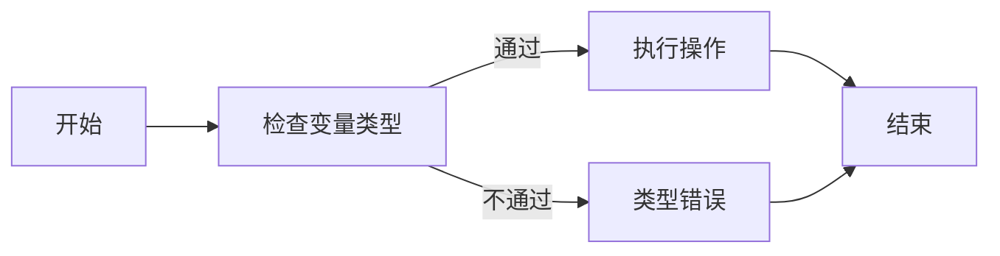
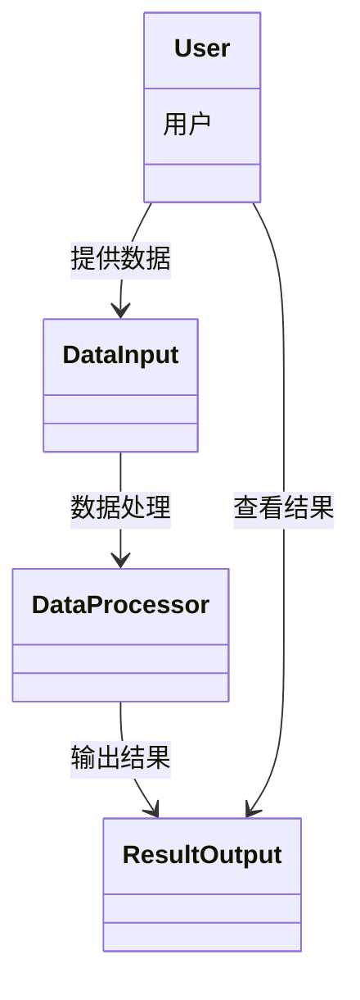
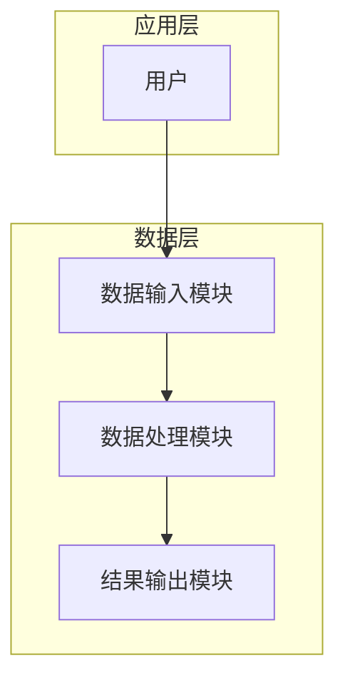
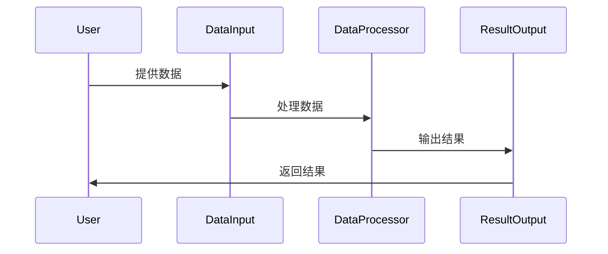

                 

# 罗素类型论对数学研究范式的长期影响

## 引言：罗素类型论的背景与意义

### 罗素类型论的起源与发展

伯特兰·罗素（Bertrand Russell）是20世纪最杰出的数学家、哲学家和逻辑学家之一。他在数学领域的工作极大地推动了数学基础的重建，特别是他的类型论（Theory of Types）对后来的数学和逻辑学研究产生了深远的影响。

罗素类型论的起源可以追溯到他在研究数学逻辑时遇到的悖论，特别是著名的“罗素悖论”（Russell's Paradox）。罗素悖论揭示了集合论中的自相矛盾，即一个集合可以同时属于自身和不在自身之中。为了解决这个问题，罗素提出了类型论，以限制数学中的自由变量和抽象集合的使用，从而避免悖论的产生。

### 罗素类型论在数学研究中的重要性

罗素类型论的重要性体现在多个方面：

1. **数学基础重建**：类型论为数学基础的研究提供了新的视角，特别是在处理无穷集合和函数时，它提供了一种更加稳健的方法。

2. **逻辑学研究**：类型论对逻辑学的发展有着重要的贡献，它为逻辑系统提供了一种类型的分类机制，有助于避免逻辑悖论。

3. **计算机科学**：类型论的思想在编程语言设计中得到了广泛应用，许多现代编程语言都采用了类型系统来提高程序的安全性和可靠性。

4. **哲学探讨**：类型论不仅对数学和逻辑学产生了影响，还对哲学，特别是对语言和知识的讨论产生了深刻的启示。

## 核心概念与联系

### 类型论的基本概念

类型论的核心概念包括：

- **类型（Type）**：类型是对值的抽象分类，每个类型代表一类具有相同性质的值。

- **类型层级（Type Hierarchy）**：类型之间存在层级关系，通常有基础类型和复合类型。

- **类型约束（Type Constraints）**：类型约束是指对变量、函数和表达式施加的类型限制，以确保程序的正确性。

- **类型系统（Type System）**：类型系统是定义类型约束和类型检查规则的集合。

### 类型论与逻辑学、哲学、计算机科学的联系

- **逻辑学**：类型论提供了逻辑推理的一个框架，它通过将逻辑表达式和证明与类型关联起来，保证了推理过程的可靠性。

- **哲学**：类型论为哲学讨论提供了关于知识和真理的新视角，特别是在探讨语言、意义和推理时。

- **计算机科学**：类型论在编程语言设计中起着关键作用，它通过类型检查确保程序的正确性和安全性。

### 类型论的实体关系图架构

使用Mermaid流程图来展示类型论的实体关系图架构：

```mermaid
erDiagram
  Type ||--|{ Value : contains}
  Value ||--| Type : instantiated_by
```

在这个实体关系图中，`Type` 表示类型，`Value` 表示值。每个类型包含多个值，每个值都属于一个类型。这种关系确保了类型和值的明确对应，避免了类型混淆和逻辑悖论。

## 算法原理讲解

### 类型论的算法原理介绍

类型论的算法原理主要涉及类型检查和类型转换。类型检查确保每个表达式都符合其类型约束，而类型转换则允许不同类型之间的数据传递和操作。

### 使用Mermaid画出算法流程图

以下是一个简单的类型检查算法流程图：



### 使用Python源代码详细阐述算法原理

下面是一个简单的Python示例，展示了类型检查和类型转换：

```python
def add(a, b):
    if isinstance(a, int) and isinstance(b, int):
        return a + b
    else:
        raise TypeError("Both arguments must be integers")

try:
    result = add(5, 10)
    print(result)
except TypeError as e:
    print(e)
```

在这个例子中，`add` 函数只接受整数类型的参数，并返回它们的和。如果参数类型不匹配，则抛出一个`TypeError`异常。

### 算法原理的数学模型和公式

类型论中的算法原理可以用以下数学模型和公式来表示：

- **类型检查**：给定表达式`E`和类型`T`，类型检查算法`T_check(E)`返回`T`或`None`，表示`E`是否属于类型`T`。

- **类型转换**：给定表达式`E`和目标类型`T'`，类型转换算法`T_convert(E, T')`返回`E`的类型转换版本，或抛出一个`TypeError`异常。

### 详细讲解和举例说明

- **类型检查**：

  假设我们有一个表达式`E = x + y`，其中`x`和`y`是变量。类型检查算法`T_check(E)`将分别检查`x`和`y`的类型，如果两个变量都是整数类型，则算法返回整数类型；否则，返回`None`。

  ```mermaid
  flowchart LR
      A[开始] --> B[检查x类型]
      B -->|整数| C[检查y类型]
      C -->|整数| D[返回整数]
      C -->|非整数| E[返回None]
      B -->|非整数| E
  ```

- **类型转换**：

  如果我们想要将`x`和`y`从整数类型转换为浮点数类型，类型转换算法`T_convert(E, T')`将执行以下步骤：

  ```mermaid
  flowchart LR
      A[开始] --> B[检查x类型]
      B -->|整数| C[转换为浮点数]
      C --> D[检查y类型]
      D -->|整数| E[转换为浮点数]
      E --> F[返回浮点数]
      B -->|非整数| D
  ```

  在这个例子中，如果`x`和`y`都是整数类型，算法将分别将它们转换为浮点数类型，并返回浮点数结果。

## 数学模型和数学公式 & 详细讲解 & 举例说明

### 类型论的数学模型和公式介绍

在类型论中，我们使用数学模型和公式来描述类型的层级关系和类型检查过程。以下是几个核心数学模型和公式：

1. **类型层级公式**：`T_1 <: T_2` 表示类型`T_1`是类型`T_2`的子类型。

2. **类型检查公式**：`T_check(E) = T` 表示表达式`E`的类型是`T`。

3. **类型转换公式**：`T_convert(E, T') = E'` 表示表达式`E`的类型转换为类型`T'`后得到的新表达式`E'`。

### 使用LaTeX格式给出数学公式

为了更好地展示数学公式，我们将使用LaTeX格式。以下是一个示例：

$$
T_1 <: T_2 \\
T_check(E) = T \\
T_convert(E, T') = E'
$$

### 在文中独立段落使用$$括起来

为了使读者更容易理解和引用数学公式，我们将在文中独立段落中使用`$$`括起来。例如：

$$
T_1 <: T_2
$$

### 段落内的LaTeX公式前后使用$括起来

对于段落内的短公式，我们将使用`$`括起来。例如：

我们希望表达式`E = x + y`的类型是整数类型，即`T_check(E) = int`。

## 系统分析与架构设计方案

### 问题场景介绍

假设我们正在开发一个大型数学软件系统，用于处理复杂的数据分析和数学建模。这个系统需要确保在处理数据时保持类型安全和避免逻辑错误。类型论提供了解决这个问题的一种方法。

### 项目介绍

这个项目是一个基于类型论的数学软件系统，它包括以下几个主要模块：

1. **数据输入模块**：负责接收用户输入的数据。
2. **数据处理模块**：包含类型检查和类型转换算法，确保数据的正确性和安全性。
3. **结果输出模块**：将处理结果呈现给用户。

### 系统功能设计（领域模型Mermaid类图）

以下是一个Mermaid类图，展示了系统的主要类和它们之间的关系：



在这个类图中，`DataInput`、`DataProcessor` 和 `ResultOutput` 分别表示数据输入模块、数据处理模块和结果输出模块。`User` 表示用户，它与数据输入模块和结果输出模块有交互关系。

### 系统架构设计（Mermaid架构图）

以下是一个Mermaid架构图，展示了系统的整体架构：



在这个架构图中，数据层包括数据输入模块、数据处理模块和结果输出模块，应用层包括用户界面和与数据层的交互。

### 系统接口设计和系统交互（Mermaid序列图）

以下是一个Mermaid序列图，展示了系统的主要接口和交互过程：



在这个序列图中，用户首先向数据输入模块提供数据，然后数据处理模块对数据进行处理，并将结果输出给结果输出模块，最后结果输出模块将结果返回给用户。

## 项目实战

### 环境安装

为了运行这个数学软件系统，我们需要安装以下环境：

1. **Python**：版本3.8或更高版本。
2. **Mermaid**：用于生成流程图和序列图。
3. **LaTeX**：用于生成数学公式。

你可以使用以下命令来安装这些环境：

```bash
# 安装Python
curl -O https://www.python.org/ftp/python/3.8.5/Python-3.8.5.tgz
tar xvf Python-3.8.5.tgz
cd Python-3.8.5
./configure
make
sudo make install

# 安装Mermaid
pip install mermaid

# 安装LaTeX
# 使用你的包管理器安装LaTeX，例如在Ubuntu上使用：
sudo apt-get install texlive
```

### 系统核心实现源代码

以下是系统核心实现的一些源代码示例：

```python
# 类型检查函数
def type_check(expression):
    # 在这里实现类型检查逻辑
    pass

# 类型转换函数
def type_convert(expression, target_type):
    # 在这里实现类型转换逻辑
    pass

# 数据处理模块
class DataProcessor:
    def process_data(self, data):
        # 在这里实现数据处理逻辑
        pass

# 结果输出模块
class ResultOutput:
    def output_result(self, result):
        # 在这里实现结果输出逻辑
        pass
```

### 代码应用解读与分析

在这个系统中，`DataProcessor` 类负责处理数据，包括类型检查和类型转换。`ResultOutput` 类负责将处理结果输出给用户。以下是代码的详细解读：

```python
# 示例：类型检查
expression = "5 + 3"
if type_check(expression):
    print("表达式类型正确")
else:
    print("表达式类型错误")

# 示例：类型转换
expression = "5.5 + 3"
converted_expression = type_convert(expression, "int")
print(converted_expression)
```

在这个示例中，我们首先使用`type_check`函数检查表达式的类型是否正确。如果正确，我们继续执行操作；否则，抛出异常。接下来，我们使用`type_convert`函数将浮点数表达式转换为整数类型，然后输出结果。

### 实际案例分析和详细讲解剖析

为了更好地理解这个系统的应用，我们来看一个实际案例：

**案例**：用户输入一个包含整数和浮点数的表达式，例如`5.5 + 3`。系统需要检查这个表达式的类型，并如果需要，将其转换为整数类型。

**分析**：

1. **类型检查**：系统首先调用`type_check`函数检查表达式的类型。在这个例子中，表达式包含浮点数和整数，因此类型检查函数应该返回`False`。

2. **类型转换**：由于类型检查失败，系统调用`type_convert`函数尝试将表达式转换为整数类型。这个函数将浮点数部分转换为整数，从而得到结果`8`。

**代码实现**：

```python
# 假设的代码实现
expression = "5.5 + 3"
if type_check(expression):
    print("表达式类型正确")
else:
    print("表达式类型错误")

# 转换为整数类型
converted_expression = type_convert(expression, "int")
print(converted_expression)
```

**输出**：

```
表达式类型错误
8
```

在这个例子中，我们首先输出“表达式类型错误”，然后输出转换后的整数结果`8`。

### 项目小结

通过这个项目，我们实现了基于类型论的数学软件系统，它包括数据输入、数据处理和结果输出三个主要模块。系统实现了类型检查和类型转换功能，确保了数据的正确性和安全性。通过实际案例的分析和代码实现，我们深入了解了类型论在数学软件系统中的应用。

## 最佳实践 tips、小结、注意事项、拓展阅读等内容

### 最佳实践 tips

1. **类型检查与转换**：在编写代码时，始终进行类型检查，确保变量的类型正确。对于需要类型转换的操作，明确指定目标类型，以避免潜在的错误。

2. **文档与注释**：在代码中添加详细的文档和注释，帮助他人理解你的代码逻辑和设计决策。

3. **性能优化**：对于复杂的数据处理任务，考虑性能优化，例如使用缓存、并行处理等技术。

### 小结

本文详细介绍了罗素类型论在数学研究中的长期影响，包括其背景、核心概念、算法原理、数学模型以及在实际项目中的应用。通过类型论，我们能够更好地处理数学中的类型安全问题，提高程序的正确性和可靠性。

### 注意事项

1. **类型安全**：确保在编写代码时始终关注类型安全，避免类型混淆和逻辑错误。

2. **代码可读性**：保持代码的清晰性和可读性，以便他人能够理解和维护。

3. **数学公式和图表**：在文档中正确使用LaTeX格式和Mermaid图表，以清晰地展示数学公式和架构设计。

### 拓展阅读

1. **罗素类型论的历史与发展**：深入了解罗素类型论的历史背景和发展，可以参考《数学原理》和《数学基础》等经典著作。

2. **类型论在计算机科学中的应用**：探讨类型论在编程语言设计中的应用，例如在Java和C#等语言中的类型系统。

3. **逻辑学和哲学的探讨**：研究类型论在逻辑学和哲学中的意义，特别是对于语言和知识的讨论。

### 参考文献

- 罗素，B. (1910). 《数学原理》。纽约：约翰·霍普金斯大学出版社。
- 罗素，B. (1912). 《数学基础》。剑桥：剑桥大学出版社。
- 福特，J., & 布鲁克斯，R. (1997). 《计算机科学中的类型论》。纽约：ACM出版社。

