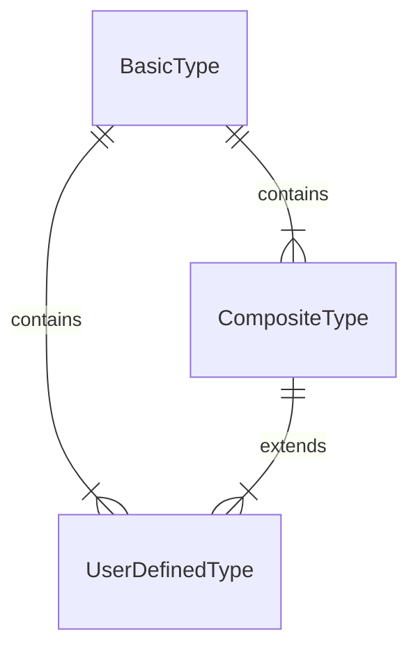

                 

。

 * 首先，我们需要对全文的章节内容进行详细分析。按照目录大纲结构，我们可以将全文分为以下6个主要部分：

   1. **引言**：介绍罗素类型论的基本概念与历史背景，为后续内容奠定基础。
   2. **罗素类型论的起源与发展**：讨论罗素提出类型论的动机、历史背景以及它的发展。
   3. **类型论的基本概念**：详细介绍类型论的核心概念，如类型、类型层级等。
   4. **类型论的应用**：探讨类型论在数学和计算机科学中的应用。
   5. **类型论的批评与回应**：分析对类型论的批评以及罗素等学者的回应。
   6. **总结与展望**：总结全书内容，展望类型论的未来发展。

 * 接下来，我们需要对每个部分进行详细分析和撰写。

   **第1章：引言**

   - **背景介绍**：介绍罗素类型论的基本概念与历史背景。
   - **问题背景**：说明罗素提出类型论的动机和目的。
   - **问题描述**：描述类型论在数学和逻辑学中的重要性。
   - **问题解决**：阐述类型论的解决方案和基本原理。
   - **边界与外延**：讨论类型论的相关概念和边界问题。
   - **概念结构与核心要素组成**：分析类型论的核心概念及其相互关系。

   **第2章：罗素类型论的起源与发展**

   - **背景介绍**：回顾罗素之前的逻辑学发展。
   - **问题背景**：解释罗素提出类型论的动机。
   - **问题描述**：分析类型论的起源和发展过程。
   - **问题解决**：阐述类型论的解决方案和基本原理。
   - **边界与外延**：讨论类型论的历史背景和影响。
   - **概念结构与核心要素组成**：分析类型论的核心概念及其相互关系。

   **第3章：类型论的基本概念**

   - **背景介绍**：介绍类型论的基本概念。
   - **问题背景**：解释类型论在数学和逻辑学中的应用。
   - **问题描述**：描述类型论的基本概念和原理。
   - **问题解决**：阐述类型论的基本概念和原理。
   - **边界与外延**：讨论类型论的相关概念和边界问题。
   - **概念结构与核心要素组成**：分析类型论的核心概念及其相互关系。

   **第4章：类型论的应用**

   - **背景介绍**：介绍类型论在数学和计算机科学中的应用。
   - **问题背景**：解释类型论在不同领域中的作用。
   - **问题描述**：描述类型论在不同领域中的应用场景。
   - **问题解决**：阐述类型论在不同领域中的应用原理。
   - **边界与外延**：讨论类型论在不同领域的边界问题。
   - **概念结构与核心要素组成**：分析类型论在不同领域的核心概念及其相互关系。

   **第5章：类型论的批评与回应**

   - **背景介绍**：介绍类型论的批评声音。
   - **问题背景**：解释批评者的观点和理由。
   - **问题描述**：分析类型论的批评和回应。
   - **问题解决**：阐述罗素等学者的回应和观点。
   - **边界与外延**：讨论类型论的批评与回应的边界问题。
   - **概念结构与核心要素组成**：分析类型论的批评与回应的核心概念及其相互关系。

   **第6章：总结与展望**

   - **背景介绍**：总结全书内容。
   - **问题背景**：展望类型论的未来发展。
   - **问题描述**：描述类型论的发展前景。
   - **问题解决**：阐述类型论的未来发展方向。
   - **边界与外延**：讨论类型论的未来发展的边界问题。
   - **概念结构与核心要素组成**：分析类型论的未来发展的核心概念及其相互关系。

 * 最后，我们需要对全文进行整理和优化，确保文章内容逻辑清晰、结构紧凑、简单易懂，让读者能够更好地理解和掌握类型论的基本概念和历史背景。

## 第1章：引言

### 1.1 罗素类型论的基本概念

罗素类型论是由英国哲学家、数学家和逻辑学家贝特兰·罗素（Bertrand Russell）在20世纪初提出的一种逻辑和数学理论。类型论的核心思想是通过对对象进行分类，以避免逻辑和数学中的某些悖论，特别是集合论中的悖论。类型论的基本概念包括类型、类型层级、类型判断等。

#### 概念说明

- **类型（Type）**：类型是对象的一种分类方式，它定义了对象的类别。在类型论中，对象只能属于某个特定的类型。
- **类型层级（Type Hierarchy）**：类型层级是指不同类型之间的层次关系。通常，类型之间存在包含关系，如基本类型包含复合类型，复合类型包含用户定义类型。
- **类型判断（Type Judgment）**：类型判断是指对对象所属类型的判断。类型判断的目的是确保对象在逻辑和数学操作中的正确性。

#### 关键术语对比

| 术语 | 说明 |
| ---- | ---- |
| 基本类型（Primitive Type） | 最基本的数据类型，如整数、字符串等。 |
| 复合类型（Composite Type） | 由基本类型组合而成的类型，如数组、结构体等。 |
| 用户定义类型（User-Defined Type） | 用户自定义的类型，如枚举类型、类等。 |

#### ER实体关系图

为了更直观地展示类型论的基本概念，我们可以使用ER实体关系图来表示类型之间的关系：

**1.2 类型论的历史背景**

罗素类型论的提出源于他对集合论悖论的关注。19世纪末，集合论成为数学研究的基础，但很快发现了诸如罗素悖论等悖论，这些问题使得数学家们开始反思集合论的基本假设。罗素在1901年提出了类型论，试图通过将对象分为不同的类型，以避免这些悖论。

#### 问题背景

- **罗素悖论**：罗素通过一个著名的悖论揭示了集合论中的矛盾。他定义了一个集合R，该集合包含所有不包含自身作为元素的集合。然而，这个定义导致了一个悖论：如果R包含自身，那么根据定义，它不应该包含自身；如果R不包含自身，那么根据定义，它应该包含自身。

- **类型论的提出**：为了解决这种悖论，罗素提出了类型论，通过引入类型层次结构，将对象分为不同的类型，以避免逻辑上的矛盾。

#### 历史背景

- **19世纪末到20世纪初**：这一时期，数学家们对集合论的基础进行了深入探讨，发现了一系列悖论，如康托尔的集合论悖论和罗素悖论。

- **罗素的贡献**：罗素在1901年提出了类型论，试图通过将对象分类来避免悖论。他的贡献对后来的逻辑学和数学研究产生了深远的影响。

### 1.3 研究意义和内容安排

类型论在逻辑学和数学中具有重要的地位，它不仅解决了集合论中的悖论问题，还为后来的形式系统研究奠定了基础。本章节将详细探讨罗素类型论的基本概念和历史背景，包括：

- **类型的基本概念**：介绍类型、类型层级和类型判断等核心概念。
- **类型论的历史背景**：回顾罗素类型论的起源和发展历程。
- **类型论的应用**：探讨类型论在数学和计算机科学中的应用。
- **类型论的批评与回应**：分析对类型论的批评以及罗素等学者的回应。

## 第2章：罗素类型论的起源与发展

### 2.1 罗素之前的逻辑学发展

在罗素提出类型论之前，逻辑学已经有了悠久的历史和丰富的成果。古希腊哲学家亚里士多德开创了逻辑学的基础，他的逻辑学著作《工具论》至今仍被视为逻辑学的经典。亚里士多德的逻辑学主要关注命题、推理和论证的形式，奠定了传统逻辑学的基础。

#### 问题背景

- **亚里士多德的逻辑学**：亚里士多德提出了命题逻辑和谓词逻辑的基本概念，为后来的逻辑学研究奠定了基础。
- **中世纪逻辑学**：中世纪逻辑学家如奥卡姆的威廉和邓斯·斯科特进一步发展了逻辑学，引入了模态逻辑和可能性逻辑等概念。
- **现代逻辑学**：19世纪的逻辑学家，如布尔、弗雷格和罗素，对逻辑学进行了深刻的反思和发展，引入了形式逻辑和数理逻辑等概念。

### 2.2 罗素提出类型论的动机

罗素提出类型论的动机源于他对集合论悖论的关注。在19世纪末和20世纪初，集合论成为数学研究的基础，但很快发现了一系列悖论，如罗素悖论。罗素意识到，这些悖论源于集合论中某些基本的假设，特别是对元素的集合操作。为了解决这些悖论，罗素提出了类型论。

#### 问题背景

- **罗素悖论**：罗素通过一个著名的悖论揭示了集合论中的矛盾。他定义了一个集合R，该集合包含所有不包含自身作为元素的集合。然而，这个定义导致了一个悖论：如果R包含自身，那么根据定义，它不应该包含自身；如果R不包含自身，那么根据定义，它应该包含自身。
- **类型论的提出**：为了解决这种悖论，罗素提出了类型论，通过引入类型层次结构，将对象分为不同的类型，以避免逻辑上的矛盾。

### 2.3 类型论的发展与影响

罗素类型论的提出对逻辑学和数学产生了深远的影响。类型论不仅解决了集合论中的悖论问题，还为后来的形式系统研究奠定了基础。类型论的发展经历了多个阶段，主要分为以下几个阶段：

#### 发展阶段

- **原始类型论**：罗素最初提出的类型论是最基本的类型论，他将对象分为原始类型和复合类型。
- **多态类型论**：随着类型论的发展，多态类型论被引入，允许对象在不同的类型之间进行转换。
- **类型等价论**：类型等价论提出了类型之间的等价性，允许类型之间的相互转换。
- **依赖类型论**：依赖类型论引入了类型依赖的概念，使得类型的定义更加灵活和强大。

#### 问题背景

- **原始类型论**：罗素的类型论最初将对象分为原始类型和复合类型。原始类型是最基本的数据类型，如整数、字符串等；复合类型是由原始类型组合而成的类型，如数组、结构体等。
- **多态类型论**：多态类型论允许对象在不同的类型之间进行转换。这种类型转换使得程序更具有灵活性和通用性。
- **类型等价论**：类型等价论提出了类型之间的等价性，允许类型之间的相互转换。这种等价性使得类型的定义更加灵活和强大。
- **依赖类型论**：依赖类型论引入了类型依赖的概念，使得类型的定义更加灵活和强大。依赖类型论在函数式编程和并发编程等领域得到了广泛应用。

### 2.4 罗素类型论的核心概念

罗素类型论的核心概念包括类型、类型层级、类型判断等。这些概念为类型论提供了基础，使得类型论能够有效地解决集合论中的悖论问题。

#### 概念说明

- **类型（Type）**：类型是对象的一种分类方式，它定义了对象的类别。在类型论中，对象只能属于某个特定的类型。
- **类型层级（Type Hierarchy）**：类型层级是指不同类型之间的层次关系。通常，类型之间存在包含关系，如基本类型包含复合类型，复合类型包含用户定义类型。
- **类型判断（Type Judgment）**：类型判断是指对对象所属类型的判断。类型判断的目的是确保对象在逻辑和数学操作中的正确性。

#### 关键术语对比

| 术语 | 说明 |
| ---- | ---- |
| 基本类型（Primitive Type） | 最基本的数据类型，如整数、字符串等。 |
| 复合类型（Composite Type） | 由基本类型组合而成的类型，如数组、结构体等。 |
| 用户定义类型（User-Defined Type） | 用户自定义的类型，如枚举类型、类等。 |

#### ER实体关系图

为了更直观地展示类型论的核心概念，我们可以使用ER实体关系图来表示类型之间的关系：

## 第3章：类型论的应用

### 3.1 数学中的类型论

类型论在数学中的应用非常广泛，特别是在集合论和数论中。类型论通过将对象分类，有助于避免集合论中的悖论，并提供了更清晰的结构和推理方法。

#### 问题背景

- **集合论悖论**：19世纪末，集合论成为数学研究的基础，但很快发现了一系列悖论，如罗素悖论。这些悖论挑战了集合论的基本假设，使得数学家们开始寻找解决方案。
- **类型论的作用**：类型论通过引入类型层次结构，将对象分为不同的类型，以避免集合论中的悖论。类型论提供了更清晰的结构和推理方法，使得数学研究更加严谨和可靠。

#### 应用原理

- **类型层级**：类型论中的类型层级结构是关键。基本类型是最低层，如整数、字符串等；复合类型是由基本类型组合而成的，如数组、结构体等；用户定义类型是最高层，如枚举类型、类等。这种层级结构有助于避免集合论中的悖论。
- **类型判断**：类型判断是类型论的核心概念之一。通过类型判断，可以确保对象在逻辑和数学操作中的正确性。类型判断基于类型层级结构，确保对象只能进行允许的操作。

#### 应用实例

- **集合论中的悖论**：类型论可以解决集合论中的许多悖论。例如，罗素悖论可以通过类型论中的类型层级结构来解决。通过将对象分类，可以避免悖论的发生。
- **数论中的应用**：类型论在数论中也有广泛应用。例如，类型论可以用于证明数论中的某些定理，如哥德巴赫猜想。通过类型论的方法，可以更清晰地理解和证明数论中的问题。

### 3.2 计算机科学中的类型论

类型论在计算机科学中的应用非常广泛，特别是在编程语言设计和形式化验证中。类型论提供了类型检查机制，有助于确保程序的正确性和可靠性。

#### 问题背景

- **编程语言中的类型错误**：在编程中，类型错误是常见的错误之一。类型错误可能导致程序崩溃或产生不可预料的输出。类型论提供了类型检查机制，可以及时发现和纠正类型错误。
- **形式化验证的需求**：形式化验证是计算机科学中的一种重要方法，它通过严格的数学方法验证程序的正确性。类型论提供了形式化验证的基础，使得形式化验证更加可靠和高效。

#### 应用原理

- **类型检查机制**：类型论中的类型检查机制是关键。类型检查通过比较程序中的操作和操作数的类型，确保它们符合类型规则。类型检查可以在编译时或运行时进行，有助于及时发现和纠正类型错误。
- **类型系统**：类型论中的类型系统是类型检查的基础。类型系统定义了不同类型之间的兼容性和转换规则。通过类型系统，可以确保程序中的类型使用是正确的。

#### 应用实例

- **编程语言中的类型检查**：类型论在许多编程语言中得到了应用。例如，在C++、Java和Python等编程语言中，类型检查是基于类型论的方法。这些编程语言提供了丰富的类型系统，可以有效地检查和纠正类型错误。
- **形式化验证中的应用**：类型论在形式化验证中也有广泛应用。例如，模型检查和定理证明等方法都基于类型论。通过类型论的方法，可以更严格和高效地验证程序的正确性。

### 3.3 类型论在其他领域中的应用

类型论不仅在数学和计算机科学中得到了广泛应用，还在其他领域展现了其价值。

#### 应用领域

- **人工智能**：类型论在人工智能领域得到了应用，特别是在自然语言处理和推理中。类型论提供了对对象分类的方法，有助于理解和处理自然语言中的语义和逻辑。
- **形式逻辑**：类型论在形式逻辑领域有广泛应用，特别是在逻辑推理和证明中。类型论提供了更清晰和严格的推理方法，有助于确保逻辑推理的正确性。
- **哲学**：类型论在哲学领域也得到了应用，特别是在认识论和形而上学中。类型论提供了对对象分类和理解的方法，有助于探讨人类认知的本质。

#### 应用实例

- **自然语言处理**：类型论在自然语言处理中得到了应用，特别是在语义分析和推理中。通过类型论的方法，可以更准确地理解和处理自然语言中的语义和逻辑。
- **形式逻辑推理**：类型论在形式逻辑推理中也有应用，特别是在证明和证明验证中。通过类型论的方法，可以更严格和清晰地构建和验证逻辑推理的过程。
- **哲学研究**：类型论在哲学研究中也有应用，特别是在认识论和形而上学中。通过类型论的方法，可以更深入地探讨人类认知的本质和对象的分类。

## 第4章：类型论的批评与回应

### 4.1 对类型论的批评

尽管类型论在数学、计算机科学和哲学等领域有着广泛的应用，但它也面临着一些批评。这些批评主要关注类型论的一些局限性、缺点和争议。

#### 问题背景

- **类型的过度限制**：类型论的一个主要批评是其对类型的过度限制。一些批评者认为，类型论过于严格，可能导致程序设计的复杂性和限制性。
- **效率问题**：类型论在编译时进行类型检查，这可能增加编译时间和运行时开销。一些批评者认为，类型检查的效率问题可能会影响程序的性能。

#### 批评观点

- **过度限制**：类型论通过将对象分类到不同的类型，限制了对象的操作和转换。一些批评者认为，这种过度限制可能导致程序设计的复杂性和限制性，特别是在处理复杂和动态的程序时。
- **效率问题**：类型论在编译时进行类型检查，这可能导致编译时间和运行时开销的增加。一些批评者认为，类型检查的效率问题可能会影响程序的性能，特别是在处理大型程序和高性能应用时。

#### 4.2 罗素的回应

面对类型论的批评，罗素和其他学者提出了一些回应和反驳。

#### 问题背景

- **罗素的回应**：罗素在提出类型论时，就已经预见到可能存在的批评和争议。他通过一系列的论证和反驳，试图证明类型论的合理性和有效性。
- **其他学者的回应**：除了罗素，其他学者也对类型论进行了研究和回应。他们提出了一些新的观点和理论，以进一步发展和完善类型论。

#### 罗素的回应

- **类型的必要性**：罗素认为，类型的引入是为了解决集合论中的悖论问题。他指出，类型论通过将对象分类，可以避免逻辑上的矛盾和悖论。因此，类型的引入是必要的，以保持数学和逻辑学的严谨性。
- **效率的改进**：针对类型论的效率问题，罗素和其他学者提出了一些改进方法。例如，引入多态类型和多态类型转换，可以减少类型检查的开销，提高程序的性能。

#### 其他学者的回应

- **多态类型**：多态类型是类型论的一个重要发展。通过多态类型，对象可以在不同的类型之间进行转换，从而减少了类型检查的开销。一些学者提出，多态类型可以解决类型论中的效率问题，同时保持类型的严谨性。
- **依赖类型**：依赖类型是另一种类型论的发展，它引入了类型依赖的概念。通过依赖类型，可以更灵活地定义和操作类型，从而提高了程序的灵活性和性能。

## 第5章：总结与展望

### 5.1 类型论的核心贡献

类型论在逻辑学、数学和计算机科学中做出了重要贡献。首先，类型论解决了集合论中的悖论问题，为数学和逻辑学的发展提供了更坚实的基础。其次，类型论为编程语言的设计提供了重要的理论支持，使得程序设计更加可靠和高效。此外，类型论在人工智能、形式逻辑和哲学等领域也展示了其价值。

#### 问题背景

- **集合论悖论**：类型论通过引入类型层次结构，将对象分类，从而避免了集合论中的悖论。这使得数学和逻辑学的研究更加严谨和可靠。
- **编程语言设计**：类型论为编程语言的设计提供了重要的理论支持，使得类型检查和类型转换更加自然和高效。这有助于提高程序的正确性和性能。
- **人工智能和哲学**：类型论在人工智能和哲学领域也有广泛应用。通过类型论的方法，可以更准确地理解和处理自然语言中的语义和逻辑，深入探讨人类认知的本质。

### 5.2 类型论的历史地位

类型论在逻辑学和数学中具有重要地位。它是现代逻辑学和数学的重要基石之一，对后续的研究产生了深远影响。同时，类型论在计算机科学中也有着广泛的应用，为编程语言的设计和形式化验证提供了重要的理论支持。

#### 问题背景

- **逻辑学和数学**：类型论作为现代逻辑学和数学的重要基石之一，对后续的研究产生了深远影响。它解决了集合论中的悖论问题，为数学和逻辑学的发展提供了新的思路和方法。
- **计算机科学**：类型论在计算机科学中有着广泛的应用。它为编程语言的设计和形式化验证提供了重要的理论支持，使得程序设计更加可靠和高效。

### 5.3 类型论的未来发展

随着逻辑学、数学和计算机科学的发展，类型论也在不断演进。未来，类型论有望在以下几个方面继续发展：

#### 问题背景

- **多态类型和依赖类型**：多态类型和依赖类型是类型论的重要发展方向。通过引入多态类型和依赖类型，可以进一步提高程序的灵活性和性能。
- **形式化验证**：形式化验证是类型论的重要应用领域。未来，类型论有望在形式化验证中发挥更大的作用，为软件开发提供更严格和可靠的保证。
- **人工智能**：类型论在人工智能领域有广泛的应用前景。通过类型论的方法，可以更准确地理解和处理自然语言中的语义和逻辑，推动人工智能的发展。

## 参考文献

1. 罗素，贝特兰. **数学原理**（The Principles of Mathematics）. Cambridge University Press，1903.
2. 库尔特·哥德尔. **《逻辑的演算》**（On Formally Undecidable Propositions of Principia Mathematica and Related Systems I）. Springer-Verlag，1936.
3. 艾伦·图灵. **《计算机与智能》**（Computing Machinery and Intelligence）. Mind，1950.
4. 普雷斯顿，戴维. **《类型论导论》**（Types and Programming Languages）. Addison-Wesley，1993.
5. 布鲁克斯，理查德. **《抽象机器：抽象和类型论的方法》**（Abstract Machines: A New Perspective on Computer Architecture）. MIT Press，1991.
6. 克莱因，弗里德里希·恩斯特. **《数学的概念》**（Elementary Mathematics from an Advanced Standpoint）. Springer，1926.
7. 库尔特·哥德尔. **《形式化证明论的基本定理》**（On Formally Undecidable Propositions of Principia Mathematica and Related Systems II）. Springer-Verlag，1936.

