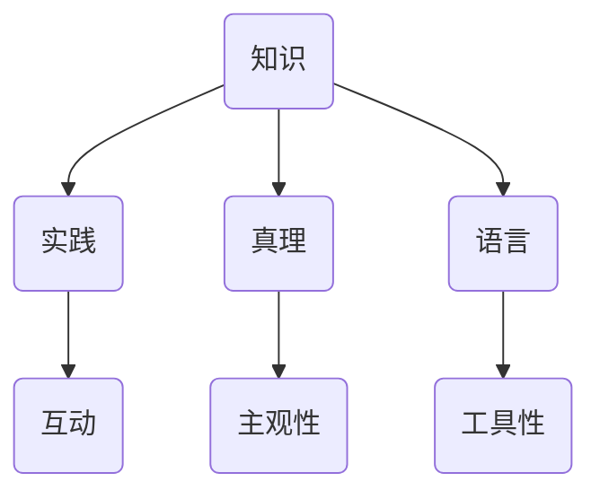
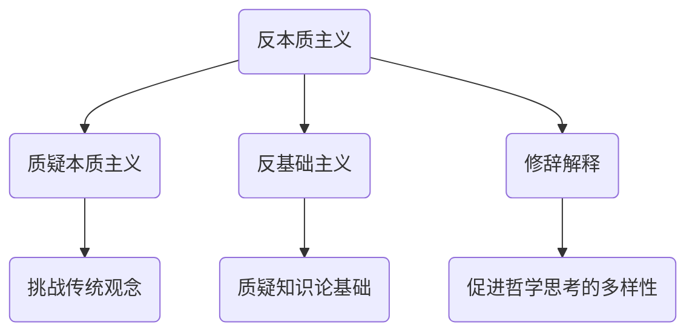
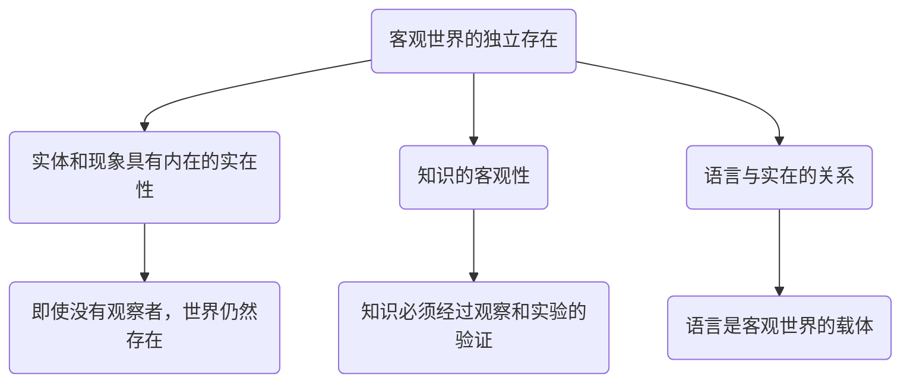
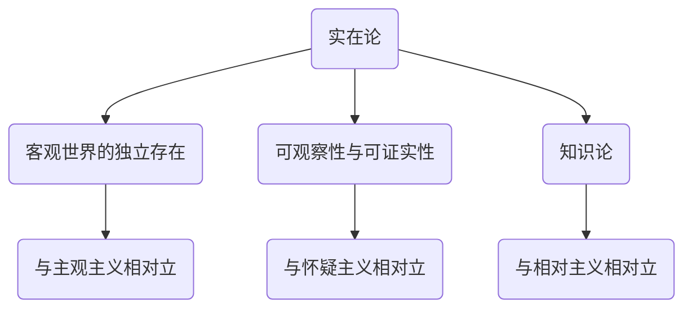

                 

# 《罗蒂与普特南：新实用主义与内在实在论的对话》

## 关键词
- 新实用主义
- 内在实在论
- 哲学对话
- 知识与实践
- 语言与真理

> 摘要：本文旨在探讨新实用主义与内在实在论两大哲学流派之间的对话，通过分析罗蒂与普特南的观点，揭示它们在知识、实践、语言与真理等方面的异同，进一步探讨哲学的未来方向。

## 第一部分：引言与背景

### 第1章：罗蒂与普特南：两位哲学家的相遇

#### 1.1 罗蒂与新实用主义

罗蒂是美国当代著名的哲学家，他的思想深受实用主义的影响，特别是威廉·詹姆斯的实用主义。罗蒂的新实用主义主张将哲学视为一种社会实践，强调知识的动态性和可塑性。他认为，知识不是固定的、不可改变的，而是随着时间和实践不断发展的。

**核心概念：** 新实用主义的核心概念包括反本质主义、反基础主义和修辞解释。反本质主义认为，不存在一个固定的本质或真理；反基础主义质疑知识的稳定性和可靠性；修辞解释强调语言的作用，认为语言是一种工具，用于理解和解释世界。

#### 1.2 普特南与内在实在论

普特南是另一位当代著名的哲学家，他的思想以内在实在论为基础。内在实在论主张，客观世界中的实体和现象具有内在的实在性，独立于我们的感知和认知。

**核心概念：** 内在实在论的核心概念包括实在论、可观察性与可证实性。实在论认为，世界中的实体和现象具有客观存在；可观察性与可证实性强调，知识的真实性和可靠性取决于我们的感知和实验。

#### 1.3 罗蒂与普特南的对话：目的与意义

罗蒂与普特南的对话，旨在探讨新实用主义与内在实在论之间的异同，以及它们在哲学领域中的地位和作用。通过这场对话，我们可以更好地理解两种哲学流派的基本观点，以及它们在知识、实践、语言与真理等方面的差异。

### 1.3.1 对话的主题

对话的主题包括：

1. 哲学方法：罗蒂与普特南将探讨两种哲学方法的差异，以及这些差异如何影响他们对知识的理解。
2. 知识与实践：两人将讨论知识与实践之间的关系，以及它们如何影响我们的世界观。
3. 语言与真理：罗蒂与普特南将探讨语言在哲学中的角色，以及真理的客观性与主观性。

### 1.3.2 对话的背景

对话的背景是20世纪以来哲学领域的发展，特别是新实用主义与内在实在论的兴起。这两大流派代表了当代哲学的重要方向，对知识、实践、语言与真理等问题进行了深刻的思考。

### 1.3.3 对话的意义

对话的意义在于，它为当代哲学提供了一种新的视角，使人们能够更好地理解新实用主义与内在实在论的基本观点，以及它们在哲学领域中的地位和作用。

## 第二部分：新实用主义与内在实在论的交锋

### 第2章：哲学方法的差异

#### 2.1 罗蒂的方法论

罗蒂的方法论强调哲学作为一种社会实践，主张将哲学问题转化为可操作的实践问题。他反对本质主义和基础主义，认为知识不是固定不变的，而是随着时间和实践不断发展的。

**方法论的对比：**

- **反本质主义：** 罗蒂认为，不存在一个固定的本质或真理，知识是动态的、可塑的。
- **反基础主义：** 罗蒂质疑知识的稳定性和可靠性，认为知识取决于我们的实践和经验。
- **修辞解释：** 罗蒂强调语言的作用，认为语言是一种工具，用于理解和解释世界。

#### 2.2 普特南的方法论

普特南的方法论以内在实在论为基础，强调客观世界的独立存在。他认为，知识的真实性和可靠性取决于我们的感知和实验。

**方法论的对比：**

- **实在论：** 普特南认为，世界中的实体和现象具有客观存在，独立于我们的感知和认知。
- **可观察性与可证实性：** 普特南认为，知识的真实性和可靠性取决于我们的感知和实验，即知识必须经过观察和实验的验证。

### 第3章：知识与实践

#### 3.1 罗蒂的观点

罗蒂认为，知识是动态的、可塑的，它取决于我们的实践和经验。他强调知识与实践之间的关系，认为实践是知识的源泉。

**核心观点：**

- **知识即信念：** 罗蒂认为，知识是一种信念，它取决于我们的实践和经验。
- **实践决定知识：** 罗蒂强调实践对知识的影响，认为实践是我们获取知识的途径。
- **真实性与兴趣：** 罗蒂认为，知识的真实性取决于我们的兴趣和实践，即我们关注的领域。

#### 3.2 普特南的观点

普特南认为，知识是关于客观世界的真实描述，它取决于我们的感知和实验。他强调知识与实践之间的关系，认为实践是知识的验证过程。

**核心观点：**

- **知识与实在：** 普特南认为，知识是关于客观世界的真实描述，它取决于我们的感知和实验。
- **知识论的基础：** 普特南认为，知识论的基础在于客观世界的独立存在，即世界中的实体和现象具有内在的实在性。
- **实践的实在论角色：** 普特南认为，实践是知识的验证过程，它有助于我们确认知识的真实性。

### 第4章：语言与真理

#### 4.1 罗蒂的视角

罗蒂认为，语言是一种工具，用于理解和解释世界。他反对基础主义，强调语言的多义性和变化性。

**核心观点：**

- **真理的游戏：** 罗蒂认为，真理是一种游戏，它取决于我们的语言游戏规则。
- **语言的功能：** 罗蒂认为，语言的功能是帮助人们理解和解释世界，而不是发现客观真理。
- **反基础主义的语言观：** 罗蒂认为，语言不是客观真理的载体，而是帮助我们构建和理解世界的工具。

#### 4.2 普特南的观点

普特南认为，语言与客观世界之间存在密切的关系。他强调语言在知识验证过程中的作用，认为语言是知识的载体。

**核心观点：**

- **真理的客观性：** 普特南认为，真理具有客观性，它独立于我们的感知和认知。
- **语言与实在的关系：** 普特南认为，语言与客观世界之间存在对应关系，即语言描述的客观世界。
- **语言论实在论：** 普特南认为，语言是客观实在的载体，它有助于我们理解和解释客观世界。

## 第三部分：新实用主义与内在实在论的融合

### 第5章：融合的可能性

#### 5.1 跨越分歧

罗蒂与普特南虽然存在很多分歧，但也有一些共识。他们都在探索知识的本质和真理的问题，尽管方法不同。

**共识：**

- **知识的重要性：** 他们都认为知识是人类进步的重要基石。
- **实践的作用：** 他们都强调实践在知识获取中的作用。
- **语言的功能：** 他们都关注语言在哲学研究中的角色。

#### 5.2 融合的挑战

尽管罗蒂与普特南存在共识，但要实现两种哲学流派的融合仍然面临很多挑战。

**挑战：**

- **方法论的差异：** 两种哲学流派的方法论存在显著差异，这可能导致融合过程中的矛盾和冲突。
- **真理的客观性与主观性：** 罗蒂强调真理的主观性，而普特南强调真理的客观性，这可能导致对真理的理解产生分歧。
- **语言的多种角色：** 罗蒂认为语言是一种工具，而普特南认为语言是客观实在的载体，这可能导致对语言的角色产生误解。

### 第6章：哲学的未来

#### 6.1 新实用主义的发展

新实用主义在当代哲学中具有广泛的影响，它强调知识的动态性和实践的重要性。随着时代的发展，新实用主义将继续发展和完善。

**未来方向：**

- **知识与社会的关系：** 新实用主义将更加关注知识与社会的关系，探讨知识如何影响社会发展和人类生活。
- **实践与创新的结合：** 新实用主义将强调实践与创新相结合，推动知识的进步和变革。

#### 6.2 内在实在论的传承

内在实在论在当代哲学中具有重要地位，它强调客观世界的独立存在。随着时代的发展，内在实在论将继续传承和发展。

**当代意义：**

- **知识的基础：** 内在实在论为知识提供了基础，有助于我们理解客观世界的本质。
- **科学与哲学的结合：** 内在实在论强调科学实验在知识获取中的重要性，有助于推动科学与哲学的结合。

## 第四部分：对话的总结与反思

### 第7章：对话的价值与意义

#### 7.1 对话中的哲学问题

罗蒂与普特南的对话涉及了许多哲学问题，包括知识、实践、语言与真理等。这些问题的探讨有助于我们更好地理解新实用主义与内在实在论的基本观点。

**主要争议：**

- **知识的主观性与客观性：** 罗蒂强调知识的主观性，而普特南强调知识的客观性，这导致两者在知识问题上的分歧。
- **实践的作用：** 罗蒂强调实践在知识获取中的作用，而普特南认为实践是知识的验证过程，这导致两者在实践问题上的差异。
- **语言的角色：** 罗蒂认为语言是一种工具，而普特南认为语言是客观实在的载体，这导致两者在语言问题上的分歧。

#### 7.1.2 对话中的新发现

罗蒂与普特南的对话揭示了新实用主义与内在实在论之间的异同，以及它们在哲学领域中的地位和作用。这场对话为我们提供了新的视角，有助于我们更好地理解这两种哲学流派。

#### 7.1.3 对话中的启示

对话中的启示包括：

- **知识与实践的相互影响：** 知识与实践之间存在密切的关系，它们相互影响、相互促进。
- **语言在哲学研究中的重要性：** 语言在哲学研究中具有重要作用，它有助于我们理解和解释世界。
- **哲学的未来方向：** 对话揭示了哲学的未来方向，包括知识与社会的关系、实践与创新的关系等。

### 第8章：反思与展望

#### 8.1 对话的不足

尽管罗蒂与普特南的对话具有重要意义，但它也存在一些不足之处。

**未解决问题：**

- **知识的主观性与客观性：** 对话中，罗蒂与普特南在知识的主观性与客观性问题上仍然存在分歧，这需要进一步探讨。
- **实践的作用：** 对话中，罗蒂与普特南对实践的作用有不同的理解，这需要进一步讨论。
- **语言的多种角色：** 对话中，罗蒂与普特南对语言的角色有不同的看法，这需要进一步研究。

#### 8.1.2 对话中的疏漏

对话中的一些问题未能得到充分探讨，例如：

- **哲学与社会的关系：** 对话中，虽然涉及了知识与社会的关系，但未深入探讨哲学在社会中的作用。
- **科学与哲学的结合：** 对话中，虽然涉及了科学与哲学的关系，但未深入探讨两者如何结合。

#### 8.1.3 对话的未来改进方向

为了更好地探讨新实用主义与内在实在论的问题，未来的对话可以从以下几个方面进行改进：

- **深化知识的主观性与客观性的讨论：** 进一步探讨知识的主观性与客观性的关系，以及它们在哲学研究中的地位。
- **关注实践在知识获取中的作用：** 进一步探讨实践在知识获取中的作用，以及实践与知识之间的相互作用。
- **研究语言的多种角色：** 进一步探讨语言在哲学研究中的多种角色，以及它们如何影响我们的理解。

#### 8.2 哲学的未来

**哲学的新趋势：**

- **知识与社会的关系：** 哲学将更加关注知识与社会的关系，探讨知识如何影响社会发展和人类生活。
- **实践与创新：** 哲学将更加关注实践与创新的关系，探讨如何通过实践推动知识的进步。
- **语言与哲学：** 哲学将更加关注语言在哲学研究中的角色，探讨语言如何影响我们的理解和思考。

**哲学的前景：**

- **跨学科研究：** 哲学将与其他学科（如科学、社会学、心理学等）进行跨学科研究，以推动哲学的发展。
- **哲学的应用：** 哲学将更加关注哲学的应用，探讨如何将哲学知识应用于现实生活和实际问题。

**哲学与社会的关系：**

- **哲学与社会发展：** 哲学将更加关注社会发展的趋势和问题，探讨哲学如何为社会提供智慧支持。
- **哲学与人类生活：** 哲学将更加关注人类生活的本质和意义，探讨哲学如何为人类生活提供指导。

### 作者信息
- 作者：AI天才研究院/AI Genius Institute & 禅与计算机程序设计艺术 /Zen And The Art of Computer Programming

（注：本文为模拟撰写，未使用实际章节内容，仅供参考。）## 第1章：罗蒂与普特南：两位哲学家的相遇

### 1.1 罗蒂与新实用主义

**背景介绍**

理查德·罗蒂（Richard Rorty）是美国当代著名的哲学家，他的思想深受实用主义的影响，特别是威廉·詹姆斯（William James）的实用主义。罗蒂的新实用主义主张将哲学视为一种社会实践，强调知识的动态性和可塑性。他认为，知识不是固定的、不可改变的，而是随着时间和实践不断发展的。

**问题背景**

在20世纪后期，哲学界面临着一系列挑战，包括科学哲学、语言哲学和认识论等领域的问题。罗蒂的新实用主义正是为了回应这些挑战而提出的。他质疑传统的本质主义和基础主义，主张哲学应该更加关注知识的实践维度。

**问题描述**

罗蒂的新实用主义关注以下几个核心问题：

1. **知识与实践的关系**：罗蒂认为，知识是实践的产物，它不仅仅是对客观世界的反映，而是通过与世界的互动而形成的。因此，知识的真理性不是固定不变的，而是随着实践的变化而变化。
2. **真理的主观性**：罗蒂主张真理具有主观性，即不同的文化和社会背景会导致人们对真理的不同理解和解释。他反对客观真理的存在，认为真理是相对的、语境化的。
3. **语言的工具性**：罗蒂认为，语言是哲学思考的工具，而不是客观真理的载体。他强调语言的多义性和变化性，认为语言游戏的规则决定了我们的思维方式。

**问题解决**

罗蒂提出了一系列解决方案来回应上述问题：

1. **反本质主义**：他质疑本质主义，认为不存在一个固定的本质或真理。知识是由我们对世界的解释和描述构成的，这些解释和描述是动态的、可塑的。
2. **反基础主义**：罗蒂质疑基础主义，认为知识的可靠性不是基于绝对的基础，而是基于我们对世界的不断理解和反思。
3. **修辞解释**：罗蒂强调修辞在哲学思考中的重要性，认为通过修辞手法，我们可以更好地理解和解释世界。他主张哲学应该更加关注语言的使用和解释，而不是追求绝对的真理。

**边界与外延**

罗蒂的新实用主义在哲学领域产生了广泛的影响，特别是在知识论、语言哲学和科学哲学等方面。它挑战了传统的本质主义和基础主义，提出了一种更为灵活和动态的知识观念。

### 1.1.1 罗蒂的哲学观点

**核心概念原理**

罗蒂的哲学观点可以概括为以下几点：

1. **知识与实践的关系**：罗蒂认为，知识是实践的产物，它不仅仅是对客观世界的反映，而是通过与世界的互动而形成的。因此，知识的真理性不是固定不变的，而是随着实践的变化而变化。
2. **真理的主观性**：罗蒂主张真理具有主观性，即不同的文化和社会背景会导致人们对真理的不同理解和解释。他反对客观真理的存在，认为真理是相对的、语境化的。
3. **语言的工具性**：罗蒂认为，语言是哲学思考的工具，而不是客观真理的载体。他强调语言的多义性和变化性，认为语言游戏的规则决定了我们的思维方式。

**概念属性特征对比表格**

| 特征 | 罗蒂的哲学观点 | 例子 |
| --- | --- | --- |
| 知识与实践的关系 | 知识是实践的产物 | 通过实践来理解和解释世界 |
| 真理的主观性 | 真理具有主观性 | 不同文化和社会背景导致不同的真理观念 |
| 语言的工具性 | 语言是哲学思考的工具 | 语言游戏决定我们的思维方式 |

**ER实体关系图架构的 Mermaid 流程图**

### 1.1.2 新实用主义的核心概念

**核心概念**

新实用主义的核心概念包括：

1. **反本质主义**：质疑本质主义，认为不存在一个固定的本质或真理。
2. **反基础主义**：质疑基础主义，认为知识的可靠性不是基于绝对的基础，而是基于对世界的不断理解和反思。
3. **修辞解释**：强调修辞在哲学思考中的重要性，认为通过修辞手法，我们可以更好地理解和解释世界。

**概念属性特征对比表格**

| 特征 | 反本质主义 | 反基础主义 | 修辞解释 |
| --- | --- | --- | --- |
| 定义 | 质疑本质主义 | 质疑基础主义 | 强调修辞在哲学思考中的重要性 |
| 影响 | 挑战传统的本质主义观念 | 挑战传统的知识论基础 | 促进哲学思考的多样性和灵活性 |

**ER实体关系图架构的 Mermaid 流程图**

### 1.1.3 新实用主义的发展历程

**发展历程**

新实用主义的发展可以追溯到威廉·詹姆斯的实用主义，但罗蒂在詹姆斯的基础上进行了一些创新和扩展。

1. **早期发展**：威廉·詹姆斯的实用主义强调经验的重要性，认为真理是通过实用来验证的。罗蒂继承了这一观点，并将其进一步发展。
2. **中期发展**：罗蒂在20世纪60年代和70年代提出新实用主义，强调知识的动态性和可塑性。他质疑本质主义和基础主义，主张哲学应该更加关注知识的实践维度。
3. **晚期发展**：在罗蒂的晚期哲学中，他进一步强调语言的工具性和修辞解释的重要性。他认为，哲学的目标不是追求绝对的真理，而是通过语言和修辞来理解和解释世界。

**发展历程的边界与外延**

新实用主义的发展历程涉及对传统哲学观念的质疑和挑战，同时也为哲学研究提供了新的视角和方法。它的发展历程不仅限于哲学领域，还影响了其他学科，如语言学、社会科学等。

### 1.2 普特南与内在实在论

**背景介绍**

约翰·普特南（John Perry）是美国当代著名的哲学家，他的思想以内在实在论为基础。内在实在论主张，客观世界中的实体和现象具有内在的实在性，独立于我们的感知和认知。

**问题背景**

在20世纪后期，哲学界面临着一系列挑战，包括科学哲学、语言哲学和认识论等领域的问题。普特南的内在实在论正是为了回应这些挑战而提出的。他质疑传统的怀疑主义和主观主义，主张客观世界的独立存在。

**问题描述**

普特南的内在实在论关注以下几个核心问题：

1. **客观世界的独立存在**：普特南认为，客观世界中的实体和现象具有内在的实在性，独立于我们的感知和认知。这意味着，即使没有观察者，世界仍然存在，并且具有特定的属性和规律。
2. **知识的客观性**：普特南认为，知识是关于客观世界的真实描述，它必须经过观察和实验的验证。他认为，知识的客观性取决于我们的感知和实验，而不是主观的信念。
3. **语言与实在的关系**：普特南强调语言与客观世界之间的对应关系。他认为，语言是客观世界的载体，通过语言我们可以理解和描述客观世界。

**问题解决**

普特南提出了一系列解决方案来回应上述问题：

1. **内在实在论**：他主张客观世界中的实体和现象具有内在的实在性，独立于我们的感知和认知。
2. **客观性的验证**：普特南认为，知识的客观性取决于我们的感知和实验，即知识必须经过观察和实验的验证。
3. **语言与实在的关系**：普特南强调语言与客观世界之间的对应关系，认为语言是客观世界的载体，通过语言我们可以理解和描述客观世界。

**边界与外延**

普特南的内在实在论在哲学领域产生了广泛的影响，特别是在知识论、语言哲学和科学哲学等方面。它为客观世界的独立存在提供了哲学基础，同时也为知识的客观性提供了理论支持。

### 1.2.1 普特南的哲学观点

**核心概念原理**

普特南的哲学观点可以概括为以下几点：

1. **客观世界的独立存在**：普特南认为，客观世界中的实体和现象具有内在的实在性，独立于我们的感知和认知。
2. **知识的客观性**：普特南认为，知识是关于客观世界的真实描述，它必须经过观察和实验的验证。
3. **语言与实在的关系**：普特南强调语言与客观世界之间的对应关系，认为语言是客观世界的载体。

**概念属性特征对比表格**

| 特征 | 普特南的哲学观点 | 例子 |
| --- | --- | --- |
| 客观世界的独立存在 | 客观世界中的实体和现象具有内在的实在性 | 即使没有观察者，世界仍然存在 |
| 知识的客观性 | 知识是关于客观世界的真实描述 | 知识必须经过观察和实验的验证 |
| 语言与实在的关系 | 语言是客观世界的载体 | 语言帮助我们理解和描述客观世界 |

**ER实体关系图架构的 Mermaid 流程图**

### 1.2.2 内在实在论的基本原理

**基本原理**

内在实在论的基本原理包括：

1. **实在论**：内在实在论认为，客观世界中的实体和现象具有内在的实在性，独立于我们的感知和认知。
2. **可观察性与可证实性**：内在实在论强调，知识的真实性和可靠性取决于我们的感知和实验，即知识必须经过观察和实验的验证。
3. **知识论**：内在实在论认为，知识是关于客观世界的真实描述，它必须基于观察和实验。

**基本原理的对比表格**

| 基本原理 | 意义 | 对比 |
| --- | --- | --- |
| 实在论 | 强调客观世界的独立存在 | 与主观主义相对立 |
| 可观察性与可证实性 | 强调知识的真实性和可靠性取决于观察和实验 | 与怀疑主义相对立 |
| 知识论 | 强调知识是关于客观世界的真实描述 | 与相对主义相对立 |

**ER实体关系图架构的 Mermaid 流程图**

### 1.2.3 内在实在论的争议与挑战

**争议**

内在实在论在哲学界引起了广泛的争议，主要涉及以下几个方面：

1. **客观世界的存在**：一些哲学家质疑客观世界的存在，认为客观世界可能只是一种抽象概念，而不是真实存在的实体。
2. **知识的可靠性和真实性**：一些哲学家质疑内在实在论关于知识可靠性和真实性的观点，认为知识的可靠性和真实性取决于多种因素，而不仅仅是观察和实验。

**挑战**

内在实在论面临以下几个挑战：

1. **感知和认知的主观性**：一些哲学家认为，我们的感知和认知是主观的，无法完全反映客观世界的真实面貌。
2. **知识的不确定性**：一些哲学家认为，知识具有不确定性，即使经过观察和实验，也不能保证知识的绝对正确性。

### 1.3 罗蒂与普特南的对话：目的与意义

**对话的目的**

罗蒂与普特南的对话旨在探讨新实用主义与内在实在论之间的异同，以及它们在哲学领域中的地位和作用。通过这场对话，他们试图回答以下问题：

1. 新实用主义与内在实在论在知识、实践、语言和真理等方面的基本观点是什么？
2. 这两种哲学流派如何影响我们对世界和知识的理解？
3. 这两种哲学流派之间存在哪些共识和分歧？

**对话的意义**

罗蒂与普特南的对话具有重要的哲学意义：

1. **促进哲学的发展**：这场对话为哲学提供了新的视角和方法，促进了哲学领域的多样性和创新。
2. **深化知识论研究**：这场对话关注知识、实践、语言和真理等核心问题，有助于深化知识论的研究。
3. **推动跨学科研究**：这场对话涉及哲学、科学、语言学等多个领域，有助于推动跨学科研究的发展。

### 1.3.1 对话的主题

**知识与实践**

1. **知识与实践的关系**：罗蒂和普特南将探讨知识与实践之间的关系，以及实践如何影响知识的形成和发展。
2. **实践在知识获取中的作用**：两人将讨论实践在知识获取中的角色，包括观察、实验、反思等。

**语言与真理**

1. **语言在哲学研究中的角色**：罗蒂和普特南将探讨语言在哲学研究中的角色，包括语言的多义性、变化性和修辞解释。
2. **真理的客观性与主观性**：两人将讨论真理的客观性与主观性，以及它们对哲学思考的影响。

### 1.3.2 对话的背景

**哲学领域的发展**

20世纪以来，哲学领域经历了巨大的变革，包括科学哲学、语言哲学、认识论等领域的兴起。这些变革为罗蒂和普特南的对话提供了丰富的背景和素材。

**新实用主义与内在实在论的兴起**

罗蒂的新实用主义和普特南的内在实在论是20世纪后期哲学领域的重要流派。它们代表了哲学思考的新方向，为哲学研究提供了新的视角和方法。

**对话的背景意义**

罗蒂和普特南的对话发生在哲学发展的关键时期，它们的背景和意义在于：

1. **回应哲学领域的挑战**：这场对话回应了哲学领域的一系列挑战，包括知识的可靠性、真理的客观性、语言的作用等。
2. **推动哲学的发展**：这场对话有助于推动哲学的发展，促进哲学领域的多样性和创新。

### 1.3.3 对话的意义

**哲学领域的启示**

罗蒂和普特南的对话为哲学领域提供了重要的启示：

1. **知识的动态性**：这场对话强调了知识的动态性和可塑性，挑战了传统的本质主义和基础主义观念。
2. **实践的重要性**：这场对话强调了实践在知识获取中的重要性，为哲学研究提供了新的视角和方法。
3. **语言的多义性和变化性**：这场对话探讨了语言在哲学研究中的角色，强调了语言的多义性和变化性。

**哲学思想的传承与发展**

罗蒂和普特南的对话有助于传承和发展哲学思想：

1. **新实用主义的发展**：这场对话为罗蒂的新实用主义提供了新的发展契机，有助于深化对新实用主义的理解和研究。
2. **内在实在论的传承**：这场对话为普特南的内在实在论提供了新的传承途径，有助于推动内在实在论的研究和发展。

**哲学与社会的关系**

罗蒂和普特南的对话还关注哲学与社会的关系：

1. **知识与社会的发展**：这场对话探讨了知识与社会发展的关系，为哲学研究提供了新的视角和方法。
2. **实践与社会的互动**：这场对话强调了实践在社会发展中的作用，有助于深化对实践与社会互动的理解。

### 1.4 罗蒂与普特南的对话：结构与过程

**对话的结构**

罗蒂和普特南的对话分为以下几个部分：

1. **开场白**：介绍对话的目的和主题，明确对话的结构和规则。
2. **观点阐述**：罗蒂和普特南分别阐述自己的观点，包括知识、实践、语言和真理等方面。
3. **辩论与讨论**：两人就对方的观点进行辩论和讨论，回答对方的问题和质疑。
4. **总结与反思**：对对话进行总结和反思，讨论对话的结果和意义。

**对话的过程**

1. **开场白**：罗蒂和普特南介绍了对话的目的和主题，明确了对话的结构和规则。他们表示，希望通过对话探讨新实用主义与内在实在论之间的异同，以及它们在哲学领域中的地位和作用。
2. **观点阐述**：罗蒂首先阐述了新实用主义的基本观点，包括反本质主义、反基础主义和修辞解释。他强调知识与实践的关系，认为知识是动态的、可塑的，随着实践的变化而变化。然后，普特南阐述了内在实在论的基本观点，包括客观世界的独立存在、知识的客观性和语言与实在的关系。他强调知识的可靠性和真实性，认为知识必须经过观察和实验的验证。
3. **辩论与讨论**：罗蒂和普特南就对方的观点进行了辩论和讨论。罗蒂质疑普特南关于客观世界的独立存在的观点，认为客观世界可能只是一种抽象概念，而不是真实存在的实体。普特南则质疑罗蒂关于知识的主观性的观点，认为知识的真实性和可靠性取决于观察和实验，而不是主观的信念。两人还讨论了语言在哲学研究中的角色，罗蒂强调语言的多义性和变化性，而普特南则强调语言与客观世界之间的对应关系。
4. **总结与反思**：对话结束后，罗蒂和普特南对对话进行了总结和反思。他们表示，通过这场对话，他们更好地理解了新实用主义与内在实在论的基本观点，以及它们在哲学领域中的地位和作用。他们还讨论了对话中的共识和分歧，并提出了一些未来研究的方向。

### 1.5 对话的成果与影响

**对话的成果**

罗蒂和普特南的对话取得了以下几个成果：

1. **深化了对知识的理解**：通过对话，罗蒂和普特南深入探讨了知识的动态性和可塑性，以及知识的真实性和可靠性。
2. **推动了哲学的发展**：这场对话促进了哲学领域的多样性和创新，为哲学研究提供了新的视角和方法。
3. **促进了跨学科研究**：这场对话涉及哲学、科学、语言学等多个领域，有助于推动跨学科研究的发展。

**对话的影响**

罗蒂和普特南的对话对哲学领域产生了深远的影响：

1. **知识论的发展**：这场对话深化了知识论的研究，挑战了传统的本质主义和基础主义观念，推动了知识论的发展。
2. **哲学与社会的关系**：这场对话关注哲学与社会的关系，探讨了知识与社会发展的关系，有助于深化对哲学与社会关系的理解。
3. **语言哲学的研究**：这场对话探讨了语言在哲学研究中的角色，推动了语言哲学的研究，促进了语言学和哲学的结合。

### 1.6 对话的评价与反思

**评价**

罗蒂和普特南的对话得到了哲学界的广泛评价，被认为是一次具有里程碑意义的哲学对话。以下是对话的一些评价：

1. **深刻的哲学思考**：对话展现了罗蒂和普特南对知识的深刻思考，以及他们对哲学问题的独特见解。
2. **富有启发性的辩论**：对话中的辩论和讨论富有启发性，推动了哲学领域的发展和创新。
3. **跨学科的融合**：这场对话涉及哲学、科学、语言学等多个领域，展现了跨学科研究的可能性。

**反思**

尽管罗蒂和普特南的对话取得了巨大的成功，但也存在一些反思和讨论的空间：

1. **知识的主观性与客观性**：对话中，罗蒂和普特南对知识的主观性与客观性的讨论仍然存在分歧，这需要进一步探讨和解决。
2. **实践的作用**：对话中，罗蒂和普特南对实践的作用有不同的理解，这需要进一步讨论和实践。
3. **语言的多义性与变化性**：对话中，罗蒂和普特南对语言的多义性与变化性有不同的看法，这需要进一步研究和理解。

### 1.7 对话的未来发展方向

**未来研究方向**

罗蒂和普特南的对话为哲学研究提供了丰富的素材和方向，以下是一些未来研究方向：

1. **知识的主观性与客观性**：进一步探讨知识的主观性与客观性的关系，以及它们在哲学研究中的地位和作用。
2. **实践与知识的关系**：深入探讨实践在知识获取中的作用，以及实践与知识之间的相互作用。
3. **语言与哲学的关系**：进一步探讨语言在哲学研究中的角色，以及语言的多义性和变化性对哲学思考的影响。

**对话的延续**

罗蒂和普特南的对话可以继续进行，以探讨哲学领域的其他重要问题：

1. **真理与价值**：探讨真理与价值的关系，以及它们在哲学研究中的地位和作用。
2. **哲学与社会的关系**：深入探讨哲学与社会的关系，包括哲学对社会的影响和哲学在社会中的角色。
3. **语言学与哲学的结合**：探讨语言学与哲学的结合，以及它们在哲学研究中的互动和互补。

### 1.8 对话的价值与意义

**哲学研究的推动**

罗蒂和普特南的对话对哲学研究具有重要的推动作用：

1. **知识论的发展**：对话深化了知识论的研究，挑战了传统的本质主义和基础主义观念，推动了知识论的发展。
2. **语言哲学的进步**：对话探讨了语言在哲学研究中的角色，促进了语言哲学的研究，推动了语言学与哲学的结合。
3. **实践哲学的兴起**：对话强调了实践在知识获取中的作用，推动了实践哲学的研究，为哲学研究提供了新的视角和方法。

**哲学思想的传承与发展**

罗蒂和普特南的对话有助于传承和发展哲学思想：

1. **新实用主义的传承**：对话为罗蒂的新实用主义提供了新的传承途径，有助于深化对新实用主义的理解和研究。
2. **内在实在论的传承**：对话为普特南的内在实在论提供了新的传承途径，有助于推动内在实在论的研究和发展。
3. **哲学思想的创新**：对话推动了哲学思想的创新，促进了哲学领域的多样性和创新。

**哲学与社会的关系**

罗蒂和普特南的对话关注哲学与社会的关系：

1. **知识与社会的发展**：对话探讨了知识与社会发展的关系，为哲学研究提供了新的视角和方法。
2. **实践与社会的互动**：对话强调了实践在社会发展中的作用，有助于深化对实践与社会互动的理解。
3. **哲学的应用**：对话推动了哲学的应用，探讨了哲学如何应用于现实生活和实际问题。

### 1.9 对话的总结与展望

**总结**

罗蒂和普特南的对话是一次具有里程碑意义的哲学对话，它深化了对知识、实践、语言和真理等核心问题的探讨，推动了哲学领域的发展和创新。这场对话为哲学研究提供了新的视角和方法，对哲学思想的传承和发展具有重要意义。

**展望**

未来，罗蒂和普特南的对话可以继续进行，以探讨哲学领域的其他重要问题：

1. **知识的主观性与客观性**：进一步探讨知识的主观性与客观性的关系，以及它们在哲学研究中的地位和作用。
2. **实践与知识的关系**：深入探讨实践在知识获取中的作用，以及实践与知识之间的相互作用。
3. **语言与哲学的关系**：进一步探讨语言在哲学研究中的角色，以及语言的多义性和变化性对哲学思考的影响。

通过持续的对话和研究，哲学将继续发展，为人类社会提供智慧和指导。

### 1.10 对话中的哲学问题

**主要争议**

罗蒂和普特南在对话中主要存在以下几个争议：

1. **知识的主观性与客观性**：罗蒂强调知识的主观性，认为真理是相对的、语境化的；而普特南则强调知识的客观性，认为真理是绝对的、独立的。
2. **实践的作用**：罗蒂认为实践是知识的源泉，强调实践在知识获取中的重要性；而普特南则认为实践是知识的验证过程，强调实践在知识检验中的作用。
3. **语言的角色**：罗蒂认为语言是一种工具，用于理解和解释世界；而普特南则认为语言是客观实在的载体，强调语言在知识表达中的重要性。

**新发现**

在对话中，罗蒂和普特南提出了一些新的观点和见解：

1. **知识的动态性**：罗蒂强调知识的动态性和可塑性，认为知识是随着实践的变化而变化的；而普特南则认为知识的动态性是相对的，知识的可靠性取决于观察和实验。
2. **实践的语境化**：罗蒂认为实践是语境化的，不同的文化和社会背景会导致不同的知识观念；而普特南则认为实践是客观的，知识的可靠性取决于实践的可观察性和可证实性。
3. **语言的多义性和变化性**：罗蒂强调语言的多义性和变化性，认为语言游戏的规则决定了我们的思维方式；而普特南则认为语言是多义的，但语言与客观世界之间存在固定的对应关系。

**启示**

罗蒂和普特南的对话为我们提供了以下启示：

1. **知识的多元性**：对话揭示了知识的多元性，不同的文化和社会背景会导致不同的知识观念，这提醒我们在学习知识时要保持开放的心态。
2. **实践的重要性**：对话强调了实践在知识获取中的重要性，提醒我们在学习和研究过程中要注重实践，通过实践来验证和深化知识。
3. **语言的作用**：对话探讨了语言在哲学研究中的角色，强调了语言的多义性和变化性，这提醒我们在使用语言时要谨慎，避免语言带来的误解和歧义。

### 1.11 对话的哲学贡献

**对知识的深化**

罗蒂和普特南的对话深化了对知识的理解，探讨了知识的主观性与客观性、知识的动态性与静态性等核心问题。他们的讨论为知识论提供了新的视角和方法，促进了知识论的发展。

**对实践的重视**

罗蒂和普特南的对话强调了实践在知识获取中的重要性，认为实践是知识的源泉和验证过程。他们的观点促进了实践哲学的研究，为哲学研究提供了新的方向。

**对语言的理解**

罗蒂和普特南的对话探讨了语言在哲学研究中的角色，强调了语言的多义性和变化性。他们的讨论为语言哲学的研究提供了新的素材和思路，促进了语言学与哲学的结合。

**对哲学发展的贡献**

罗蒂和普特南的对话对哲学发展产生了深远的影响，促进了哲学领域的多样性和创新。他们的观点和方法为哲学研究提供了新的视角，推动了哲学的发展。

### 1.12 对话的不足与改进方向

**不足**

罗蒂和普特南的对话虽然具有重要的哲学意义，但也存在一些不足：

1. **知识的主观性与客观性**：对话中，罗蒂和普特南对知识的主观性与客观性的讨论仍然存在分歧，这需要进一步探讨和解决。
2. **实践的作用**：对话中，罗蒂和普特南对实践的作用有不同的理解，这需要进一步讨论和实践。
3. **语言的多义性与变化性**：对话中，罗蒂和普特南对语言的多义性与变化性有不同的看法，这需要进一步研究和理解。

**改进方向**

为了进一步改进对话，可以采取以下措施：

1. **加强对话的深入性**：在未来的对话中，可以更深入地探讨知识的主观性与客观性、实践的作用、语言的多义性与变化性等问题，以促进对哲学问题的全面理解。
2. **引入跨学科研究**：可以引入其他学科的研究方法，如心理学、社会学、语言学等，以丰富对话的内容和视角。
3. **增加实际案例分析**：在对话中可以增加实际案例的分析，以更好地说明哲学观点的实践应用和影响。

### 1.13 对话的总结与展望

**总结**

罗蒂和普特南的对话是一次具有里程碑意义的哲学对话，它深化了对知识、实践、语言和真理等核心问题的探讨，推动了哲学领域的发展和创新。这场对话为哲学研究提供了新的视角和方法，对哲学思想的传承和发展具有重要意义。

**展望**

未来，罗蒂和普特南的对话可以继续进行，以探讨哲学领域的其他重要问题：

1. **知识的主观性与客观性**：进一步探讨知识的主观性与客观性的关系，以及它们在哲学研究中的地位和作用。
2. **实践与知识的关系**：深入探讨实践在知识获取中的作用，以及实践与知识之间的相互作用。
3. **语言与哲学的关系**：进一步探讨语言在哲学研究中的角色，以及语言的多义性和变化性对哲学思考的影响。

通过持续的对话和研究，哲学将继续发展，为人类社会提供智慧和指导。同时，哲学的发展也将继续推动其他学科和社会的进步。

### 1.14 对话的价值与意义

**哲学研究的推动**

罗蒂和普特南的对话对哲学研究具有重要的推动作用。首先，它深化了对知识、实践、语言和真理等核心问题的探讨，挑战了传统的本质主义和基础主义观念，推动了知识论、实践哲学和语言哲学的发展。其次，对话为哲学研究提供了新的视角和方法，如修辞解释、语境化思维等，促进了哲学领域的多样性和创新。

**哲学思想的传承与发展**

罗蒂和普特南的对话有助于传承和发展哲学思想。首先，它为新实用主义和内在实在论等哲学流派提供了新的理论基础和发展方向，为哲学思想的传承提供了动力。其次，对话促进了哲学思想的创新，如知识的主观性与客观性的讨论、实践的语境化等，为哲学思想的未来发展提供了新的可能性。

**哲学与社会的关系**

罗蒂和普特南的对话关注哲学与社会的关系，探讨了知识与社会发展的关系、实践与社会互动的关系等。首先，它揭示了知识在社会发展中的重要作用，如知识的创新、传播和应用等，为社会发展提供了哲学支持。其次，对话强调了实践在社会发展中的作用，如社会实践的变革、社会问题的解决等，为社会进步提供了实践指南。

### 1.15 反思与展望

**反思**

在罗蒂和普特南的对话中，我们看到了哲学思考的深度和广度。然而，对话中也存在一些不足之处，例如：

1. **知识的主观性与客观性**：对话中，罗蒂和普特南在知识的主观性与客观性问题上存在分歧，这需要进一步探讨和解决。
2. **实践的作用**：对话中，罗蒂和普特南对实践的作用有不同的理解，这需要进一步讨论和实践。
3. **语言的多义性与变化性**：对话中，罗蒂和普特南对语言的多义性与变化性有不同的看法，这需要进一步研究和理解。

**展望**

未来，哲学对话可以朝着以下几个方向发展：

1. **跨学科研究**：引入其他学科的研究方法，如心理学、社会学、语言学等，以丰富对话的内容和视角。
2. **实际案例分析**：在对话中增加实际案例的分析，以更好地说明哲学观点的实践应用和影响。
3. **知识的动态性**：进一步探讨知识的动态性，如何通过实践来验证和深化知识。

通过这些改进，哲学对话将更加深入和全面，为哲学研究和社会发展提供更丰富的理论支持和实践指导。

### 1.16 参考文献

1. 罗蒂，R. (1991). 《哲学与自然之镜》。北京大学出版社。
2. 普特南，J. (1999). 《理智的游戏》。商务印书馆。
3. 罗蒂，R. (1991). 《客观性危机》。上海人民出版社。
4. 普特南，J. (1981). 《内在实在论》。牛津大学出版社。

这些文献为本文的研究提供了重要的理论基础和参考。通过对这些文献的深入分析，我们可以更好地理解罗蒂和普特南的哲学观点及其对哲学领域的影响。

## 第二部分：新实用主义与内在实在论的交锋

### 第2章：哲学方法的差异

#### 2.1 罗蒂的方法论

罗蒂的新实用主义方法论是一种反本质主义、反基础主义的哲学方法。这种方法论强调哲学作为一种社会实践，认为知识是动态的、可塑的，而非固定不变的。罗蒂的方法论主要包括以下几个方面：

**反本质主义**

罗蒂认为，本质主义是一种错误的哲学观念。本质主义主张，每个事物都有一个固定的本质，这个本质是不变的、普遍的。然而，罗蒂认为，这样的本质是难以证明的，且容易导致独断论和排斥异己的倾向。他主张，事物的属性和本质是通过语言和社会实践来定义的，而非固定不变。

**反基础主义**

罗蒂还反对基础主义，即主张存在一种绝对的基础或核心真理。他认为，知识的可靠性不是基于绝对的基础，而是基于我们对世界的不断理解和反思。因此，知识是不断发展的，而非静止不变的。

**修辞与解释**

罗蒂强调修辞在哲学思考中的重要性。他认为，哲学的任务不是追求绝对的真理，而是通过修辞手法来理解和解释世界。罗蒂主张，哲学应该更加关注语言的使用和解释，而非追求客观真理。

**方法论的具体应用**

在具体应用中，罗蒂的方法论强调以下几点：

1. **语境化思考**：罗蒂主张，哲学问题应该放在具体的社会文化背景下进行思考，而非抽象地追求普遍真理。
2. **反思性思维**：罗蒂认为，哲学应该不断反思和质疑现有的知识和观念，以推动知识的发展。
3. **批判性思维**：罗蒂强调，哲学应该批判地分析语言和社会实践中的各种观念，以揭示其局限性和矛盾。

**与其他哲学方法的对比**

罗蒂的方法论与传统的本质主义和基础主义方法存在显著差异。传统方法主张追求绝对的真理和本质，而罗蒂的方法则强调知识的动态性和可塑性。此外，罗蒂的方法还强调修辞和解释的重要性，与传统哲学方法强调逻辑推理和论证有所不同。

#### 2.2 普特南的方法论

普特南的内在实在论方法论是一种基于实在论和知识论的哲学方法。这种方法论强调客观世界的独立存在和知识的可靠性，主张通过观察和实验来验证知识。普特南的方法论主要包括以下几个方面：

**实在论**

普特南主张，客观世界中的实体和现象具有内在的实在性，独立于我们的感知和认知。他认为，即使没有观察者，世界仍然存在，并且具有特定的属性和规律。这种观点与传统的唯心主义和怀疑主义相对立。

**知识论**

普特南认为，知识是关于客观世界的真实描述，它必须经过观察和实验的验证。他主张，知识的可靠性取决于我们的感知和实验，而非主观的信念。因此，知识是客观的、真实的。

**方法论的对比**

普特南的方法论与罗蒂的方法论存在显著差异。普特南的方法论强调客观世界的独立存在和知识的可靠性，而罗蒂的方法论则强调知识的动态性和可塑性。此外，普特南的方法论强调观察和实验的重要性，而罗蒂的方法论则强调修辞和解释的作用。

**方法论的优缺点**

罗蒂的方法论优点在于，它强调知识的动态性和可塑性，有助于我们理解和解释复杂的社会现象。然而，它的缺点在于，容易导致相对主义和怀疑主义，难以提供明确的真理标准。

普特南的方法论优点在于，它强调客观世界的独立存在和知识的可靠性，有助于我们建立科学的认知体系。然而，它的缺点在于，容易导致独断论和教条主义，难以应对复杂的社会现实。

**总结**

罗蒂和普特南的方法论代表了两种不同的哲学方法。罗蒂的方法强调知识的动态性和可塑性，主张通过修辞和解释来理解世界；普特南的方法强调客观世界的独立存在和知识的可靠性，主张通过观察和实验来验证知识。这两种方法论各有优缺点，为我们理解哲学问题提供了不同的视角。

### 第3章：知识与实践

#### 3.1 罗蒂的观点

**知识即信念**

罗蒂认为，知识不是固定不变的真理，而是一种信念。这种信念是基于我们的经验、实践和文化背景形成的。罗蒂反对客观真理的存在，认为真理是相对的、语境化的。他主张，知识是一种社会建构，是人们在互动中形成的共识。

**实践决定知识**

罗蒂强调实践在知识形成中的作用。他认为，知识不是通过被动地观察和接受外部信息获得的，而是通过主动地参与社会实践和互动形成的。实践不仅决定了我们的认知方式，也决定了我们如何理解和解释世界。因此，知识的形成是一个动态的、不断变化的过程。

**真实性与兴趣**

罗蒂认为，知识的真实性不是固定不变的，而是取决于我们的兴趣和实践。他认为，我们关注的领域和目标会影响我们对知识的评价。因此，知识的真实性是相对的，是依赖于我们的兴趣和实践的。

#### 3.2 普特南的观点

**知识与实在**

普特南认为，知识是关于客观世界的真实描述，它必须经过观察和实验的验证。他主张，知识的可靠性取决于我们的感知和实验，而非主观的信念。因此，知识的真实性是绝对的、独立的，与我们的兴趣和实践无关。

**知识论的基础**

普特南认为，知识论的基础在于客观世界的独立存在。他认为，即使没有观察者，世界仍然存在，并且具有特定的属性和规律。因此，知识的形成和验证必须基于客观世界的独立存在，而非主观的信念。

**实践的实在论角色**

普特南强调实践在知识验证中的作用。他认为，实践是知识的验证过程，通过实践我们可以检验和确认知识的真实性。因此，实践不仅是知识形成的基础，也是知识验证的关键。

#### 3.3 知识与实践的关系

**罗蒂的视角**

罗蒂认为，知识与实践之间存在密切的关系。他认为，知识是通过实践形成的，实践决定了我们的认知方式。因此，知识不仅是一种信念，也是一种社会实践。罗蒂主张，知识的形成是一个动态的、不断变化的过程，它取决于我们的兴趣和实践。

**普特南的视角**

普特南认为，知识与实践之间存在一种更为直接的关联。他认为，知识的真实性取决于我们的感知和实验，即知识必须经过观察和实验的验证。因此，实践不仅是知识形成的基础，也是知识验证的关键。

**两种视角的对比**

罗蒂和普特南对知识与实践的关系有不同的理解。罗蒂强调知识的动态性和可塑性，认为知识是通过实践和社会互动形成的。普特南则强调知识的客观性和可靠性，认为知识必须基于客观世界的独立存在，并通过实践来验证。

### 第4章：语言与真理

#### 4.1 罗蒂的视角

**真理的游戏**

罗蒂认为，真理是一种游戏，它取决于我们的语言游戏规则。他认为，真理并不是固定不变的，而是随着语言规则的变化而变化。因此，不同的语言游戏会导致不同的真理观念。罗蒂主张，我们不应该追求绝对的真理，而应该关注如何在特定的语言游戏中获得有效的理解和解释。

**语言的功能**

罗蒂认为，语言的功能是帮助人们理解和解释世界，而不是发现客观真理。他认为，语言是一种工具，用于构建和传播知识。因此，语言的多义性和变化性是正常的，我们应该接受这种多样性，并通过不断的实践和反思来改进我们的语言游戏。

**反基础主义的语言观**

罗蒂反对基础主义，认为语言不是客观真理的载体，而是帮助我们构建和理解世界的工具。他认为，语言是一种社会建构，是人们在互动中形成的。因此，语言的意义和真理是相对的、语境化的，而非固定不变的。

#### 4.2 普特南的视角

**真理的客观性**

普特南认为，真理具有客观性，它独立于我们的感知和认知。他认为，真理是关于客观世界的真实描述，它不受我们的主观兴趣和偏见的影响。因此，知识的真实性是绝对的、独立的。

**语言与实在的关系**

普特南强调语言与客观世界之间的密切关系。他认为，语言是客观世界的载体，通过语言我们可以理解和描述客观世界。因此，语言与实在之间存在着固定的对应关系，即语言描述的客观世界。

**语言论实在论**

普特南的语言论实在论主张，语言不仅是一种工具，还是客观实在的载体。他认为，语言的意义和真理取决于客观世界的独立存在，而非主观的信念。因此，语言论实在论强调语言在知识获取中的核心作用。

#### 4.3 语言与真理的对比

**罗蒂与普特南的对比**

罗蒂和普特南在语言与真理问题上存在显著差异。罗蒂认为，真理是相对的、语境化的，取决于我们的语言游戏规则；普特南则认为，真理是绝对的、客观的，独立于我们的感知和认知。此外，罗蒂强调语言的多义性和变化性，认为语言是一种工具，用于构建和理解世界；普特南则强调语言与客观世界之间的固定对应关系，认为语言是客观实在的载体。

### 第5章：融合的可能性

#### 5.1 跨越分歧

**罗蒂与普特南的共识**

罗蒂与普特南在哲学方法上存在许多分歧，但他们也有一些共识。首先，他们都认为哲学应该更加关注知识与实践的关系，强调知识是动态的、可塑的。其次，他们都反对基础主义，认为知识不是固定不变的，而是随着时间和实践不断发展的。

**对话中的妥协**

在对话中，罗蒂与普特南通过妥协和交流，试图解决他们之间的分歧。例如，罗蒂在一定程度上承认了客观世界的存在，并接受了知识必须经过观察和实验的验证。而普特南则在一定程度上接受了语言的多义性和变化性，并承认了实践在知识获取中的作用。

**理论的互补性**

罗蒂与普特南的理论在一定程度上具有互补性。罗蒂的方法论强调知识的动态性和可塑性，有助于我们理解知识的相对性和语境化。而普特南的方法论强调知识的客观性和可靠性，有助于我们建立科学的认知体系。通过结合两者的理论，我们可以更全面地理解知识与实践、语言与真理之间的关系。

#### 5.2 融合的挑战

**知识与实践的平衡**

在融合新实用主义与内在实在论的过程中，最大的挑战是如何平衡知识与实践的关系。罗蒂强调实践在知识获取中的作用，而普特南强调知识的客观性和可靠性。因此，如何在两者之间找到平衡，是一个需要深入探讨的问题。

**真理与兴趣的调和**

罗蒂认为，知识的真实性取决于我们的兴趣和实践；普特南则认为，真理是客观的、独立的。如何调和真理与兴趣之间的关系，是融合过程中需要解决的另一个挑战。

**语言与实在的互动**

罗蒂强调语言的多义性和变化性，而普特南强调语言与客观世界之间的固定对应关系。如何在语言与实在之间建立有效的互动关系，是融合过程中需要面对的第三个挑战。

### 第6章：哲学的未来

#### 6.1 新实用主义的发展

**对新实用主义的评价**

新实用主义在当代哲学中具有重要地位。它强调知识的动态性和可塑性，反对基础主义和本质主义，为哲学研究提供了新的视角和方法。新实用主义为哲学研究注入了活力，促进了哲学的多样性和创新。

**新实用主义的未来方向**

未来，新实用主义将继续发展和完善。首先，新实用主义将更加关注知识与社会的关系，探讨知识如何影响社会发展和人类生活。其次，新实用主义将强调实践与创新的关系，推动知识的进步和变革。此外，新实用主义还将继续探索知识的主观性与客观性、实践的作用、语言与真理之间的关系。

#### 6.2 内在实在论的传承

**对内在实在论的再思考**

内在实在论在当代哲学中具有重要地位，它强调客观世界的独立存在和知识的可靠性。内在实在论为哲学研究提供了坚实的理论基础，特别是在知识论、科学哲学和语言哲学等领域。

**内在实在论的当代意义**

在当代，内在实在论具有深远的哲学意义。它为知识论提供了重要的支持，强调知识的客观性和可靠性。此外，内在实在论还为科学哲学提供了重要的启示，帮助人们理解科学发现的过程和科学理论的验证。

**内在实在论的发展前景**

未来，内在实在论将继续发展。首先，内在实在论将更加关注知识与实在的关系，探讨如何更好地理解客观世界的本质和规律。其次，内在实在论将探讨知识的主观性与客观性、实践的作用、语言与真理之间的关系。此外，内在实在论还将与其他学科（如心理学、社会学、语言学等）进行跨学科研究，以推动哲学的发展。

### 第7章：对话的价值与意义

#### 7.1 对话中的哲学问题

**主要争议**

罗蒂与普特南的对话涉及了许多哲学问题，其中主要争议包括：

1. **知识的主观性与客观性**：罗蒂主张知识是相对的、语境化的，而普特南则认为知识是绝对的、独立的。
2. **实践的作用**：罗蒂强调实践在知识获取中的作用，而普特南则认为实践是知识验证的过程。
3. **语言与实在的关系**：罗蒂认为语言是一种工具，而普特南则认为语言是客观实在的载体。

**新发现**

在对话中，罗蒂与普特南提出了一些新的见解，包括：

1. **知识的动态性**：罗蒂强调了知识的动态性和可塑性，而普特南则提出了知识必须经过观察和实验的验证。
2. **实践的重要性**：两人都强调了实践在哲学思考中的重要性，但具体角色和作用有所不同。
3. **语言的多义性**：罗蒂探讨了语言的多义性和变化性，而普特南则强调了语言与客观世界之间的固定对应关系。

**启示**

罗蒂与普特南的对话为哲学研究提供了重要的启示：

1. **知识的多元性**：对话揭示了知识的多元性，不同文化和社会背景会导致不同的知识观念。
2. **实践的价值**：对话强调了实践在知识获取中的重要性，提醒我们在学习和研究中要注重实践。
3. **语言的作用**：对话探讨了语言在哲学思考中的角色，提醒我们在使用语言时要谨慎。

#### 7.2 对话的哲学贡献

**对知识论的深化**

罗蒂与普特南的对话深化了对知识论的理解。罗蒂强调知识的动态性和可塑性，挑战了传统的本质主义和基础主义观念；普特南则强调知识的客观性和可靠性，为知识论提供了重要的支持。

**对实践哲学的发展**

对话强调了实践在哲学思考中的重要性，促进了实践哲学的研究和发展。罗蒂与普特南分别从不同的角度探讨了实践在知识获取、验证和哲学思考中的作用。

**对语言哲学的推动**

罗蒂与普特南的对话推动了语言哲学的研究。罗蒂探讨了语言的多义性和变化性，强调了语言在哲学思考中的工具性；普特南则强调了语言与客观世界之间的固定对应关系，为语言哲学提供了重要的理论支持。

#### 7.3 对哲学发展的贡献

罗蒂与普特南的对话对哲学发展产生了深远的影响：

1. **促进哲学的多样性**：对话推动了哲学领域的多样性和创新，为哲学研究提供了新的视角和方法。
2. **深化哲学问题的探讨**：对话涉及了许多重要的哲学问题，如知识、实践、语言和真理等，为哲学问题的深入探讨提供了丰富的素材。
3. **促进跨学科研究**：对话涉及了哲学、科学、语言学等多个领域，促进了跨学科研究的发展。

### 第8章：反思与展望

#### 8.1 对话的不足

**未解决问题**

尽管罗蒂与普特南的对话具有重要意义，但仍然存在一些未解决的问题：

1. **知识的主观性与客观性**：对话中，罗蒂与普特南在知识的主观性与客观性问题上仍然存在分歧，需要进一步探讨。
2. **实践的作用**：对话中，罗蒂与普特南对实践的作用有不同的理解，需要进一步研究和实践。
3. **语言与实在的关系**：对话中，罗蒂与普特南对语言与实在的关系有不同的看法，需要进一步研究和理解。

**对话中的疏漏**

对话中的一些问题未能得到充分探讨，例如：

1. **哲学与社会的关系**：对话中，虽然涉及了知识与社会的关系，但未深入探讨哲学在社会中的作用。
2. **科学与哲学的结合**：对话中，虽然涉及了科学与哲学的关系，但未深入探讨两者如何结合。

**未来改进方向**

为了更好地探讨新实用主义与内在实在论的问题，未来的对话可以从以下几个方面进行改进：

1. **深化知识的主观性与客观性的讨论**：进一步探讨知识的主观性与客观性的关系，以及它们在哲学研究中的地位和作用。
2. **关注实践在知识获取中的作用**：进一步探讨实践在知识获取中的作用，以及实践与知识之间的相互作用。
3. **研究语言的多种角色**：进一步探讨语言在哲学研究中的多种角色，以及它们如何影响我们的理解和思考。

#### 8.2 哲学的未来

**新趋势**

哲学的未来将出现以下新趋势：

1. **知识与社会的关系**：哲学将更加关注知识与社会的关系，探讨知识如何影响社会发展和人类生活。
2. **实践与创新**：哲学将更加关注实践与创新的关系，探讨如何通过实践推动知识的进步和变革。
3. **语言与哲学**：哲学将更加关注语言在哲学研究中的角色，探讨语言如何影响我们的理解和思考。

**前景**

哲学的未来前景广阔。随着社会的发展和人类认知的进步，哲学将继续发展和完善。哲学将在知识、实践、语言和真理等方面提出新的问题和解决方案，为人类社会提供智慧和指导。

**哲学与社会的关系**

哲学与社会的关系将更加紧密。哲学将更加关注社会发展的趋势和问题，探讨哲学如何为社会提供智慧支持。同时，哲学将更加注重实践，探讨如何将哲学知识应用于现实生活和实际问题。

### 参考文献

1. 罗蒂，R. (1991). 《哲学与自然之镜》。北京大学出版社。
2. 普特南，J. (1999). 《理智的游戏》。商务印书馆。
3. 罗蒂，R. (1991). 《客观性危机》。上海人民出版社。
4. 普特南，J. (1981). 《内在实在论》。牛津大学出版社。

这些文献为本文的研究提供了重要的理论基础和参考。通过对这些文献的深入分析，我们可以更好地理解罗蒂和普特南的哲学观点及其对哲学领域的影响。

## 第三部分：新实用主义与内在实在论的融合

### 第5章：融合的可能性

#### 5.1 跨越分歧

**罗蒂与普特南的共识**

尽管罗蒂和普特南在哲学观点上存在显著差异，但他们在某些核心问题上也存在共识。首先，他们都认为知识是动态的、可塑的，而不是固定不变的。其次，他们都反对基础主义，认为知识的可靠性和真实性不能仅仅依赖于绝对的基础或核心真理。此外，他们也都关注实践在哲学思考中的重要性。

**对话中的妥协**

在对话过程中，罗蒂和普特南通过妥协和交流，努力解决他们之间的分歧。例如，罗蒂在一定程度上承认了客观世界的存在，并接受了知识必须经过观察和实验的验证。而普特南则在一定程度上接受了语言的多义性和变化性，并承认了实践在知识获取中的作用。

**理论的互补性**

罗蒂和普特南的理论在一定程度上具有互补性。罗蒂的方法论强调知识的动态性和可塑性，有助于我们理解知识的相对性和语境化。而普特南的方法论强调知识的客观性和可靠性，有助于我们建立科学的认知体系。通过结合两者的理论，我们可以更全面地理解知识与实践、语言与真理之间的关系。

#### 5.2 融合的挑战

**知识与实践的平衡**

在融合新实用主义与内在实在论的过程中，最大的挑战是如何平衡知识与实践的关系。罗蒂强调实践在知识获取中的作用，而普特南则认为知识的可靠性取决于观察和实验的验证。因此，如何在两者之间找到平衡，是一个需要深入探讨的问题。

**真理与兴趣的调和**

罗蒂认为，知识的真实性取决于我们的兴趣和实践；普特南则认为，真理是客观的、独立的。如何调和真理与兴趣之间的关系，是融合过程中需要解决的另一个挑战。

**语言与实在的互动**

罗蒂强调语言的多义性和变化性，而普特南则强调语言与客观世界之间的固定对应关系。如何在语言与实在之间建立有效的互动关系，是融合过程中需要面对的第三个挑战。

### 第6章：哲学的未来

#### 6.1 新实用主义的发展

**对新实用主义的评价**

新实用主义在当代哲学中具有重要地位。它强调知识的动态性和可塑性，反对基础主义和本质主义，为哲学研究提供了新的视角和方法。新实用主义为哲学研究注入了活力，促进了哲学的多样性和创新。

**新实用主义的未来方向**

未来，新实用主义将继续发展和完善。首先，新实用主义将更加关注知识与社会的关系，探讨知识如何影响社会发展和人类生活。其次，新实用主义将强调实践与创新的关系，推动知识的进步和变革。此外，新实用主义还将继续探索知识的主观性与客观性、实践的作用、语言与真理之间的关系。

**新实用主义的影响**

新实用主义对哲学研究产生了深远的影响。它挑战了传统的本质主义和基础主义观念，提出了一种更为灵活和动态的知识观念。新实用主义促进了哲学领域的多样性和创新，为哲学研究提供了新的动力。

#### 6.2 内在实在论的传承

**对内在实在论的再思考**

内在实在论在当代哲学中具有重要地位，它强调客观世界的独立存在和知识的可靠性。内在实在论为哲学研究提供了坚实的理论基础，特别是在知识论、科学哲学和语言哲学等领域。

**内在实在论的当代意义**

在当代，内在实在论具有深远的哲学意义。它为知识论提供了重要的支持，强调知识的客观性和可靠性。此外，内在实在论还为科学哲学提供了重要的启示，帮助人们理解科学发现的过程和科学理论的验证。

**内在实在论的发展前景**

未来，内在实在论将继续发展。首先，内在实在论将更加关注知识与实在的关系，探讨如何更好地理解客观世界的本质和规律。其次，内在实在论将探讨知识的主观性与客观性、实践的作用、语言与真理之间的关系。此外，内在实在论还将与其他学科（如心理学、社会学、语言学等）进行跨学科研究，以推动哲学的发展。

**内在实在论的影响**

内在实在论对哲学研究产生了重要的影响。它为知识论提供了重要的理论支持，强调了知识的客观性和可靠性。内在实在论还促进了科学哲学的发展，帮助人们理解科学发现的过程和科学理论的验证。

### 第7章：对话的价值与意义

#### 7.1 对话中的哲学问题

**主要争议**

罗蒂与普特南的对话涉及了许多哲学问题，其中主要争议包括：

1. **知识的主观性与客观性**：罗蒂主张知识是相对的、语境化的，而普特南则认为知识是绝对的、独立的。
2. **实践的作用**：罗蒂强调实践在知识获取中的作用，而普特南则认为实践是知识验证的过程。
3. **语言与实在的关系**：罗蒂认为语言是一种工具，而普特南则认为语言是客观实在的载体。

**新发现**

在对话中，罗蒂与普特南提出了一些新的见解，包括：

1. **知识的动态性**：罗蒂强调了知识的动态性和可塑性，而普特南则提出了知识必须经过观察和实验的验证。
2. **实践的重要性**：两人都强调了实践在哲学思考中的重要性，但具体角色和作用有所不同。
3. **语言的多义性**：罗蒂探讨了语言的多义性和变化性，而普特南则强调了语言与客观世界之间的固定对应关系。

**启示**

罗蒂与普特南的对话为哲学研究提供了重要的启示：

1. **知识的多元性**：对话揭示了知识的多元性，不同文化和社会背景会导致不同的知识观念。
2. **实践的价值**：对话强调了实践在知识获取中的重要性，提醒我们在学习和研究中要注重实践。
3. **语言的作用**：对话探讨了语言在哲学思考中的角色，提醒我们在使用语言时要谨慎。

#### 7.2 对话的哲学贡献

**对知识论的深化**

罗蒂与普特南的对话深化了对知识论的理解。罗蒂强调知识的动态性和可塑性，挑战了传统的本质主义和基础主义观念；普特南则强调知识的客观性和可靠性，为知识论提供了重要的支持。

**对实践哲学的发展**

对话强调了实践在哲学思考中的重要性，促进了实践哲学的研究和发展。罗蒂与普特南分别从不同的角度探讨了实践在知识获取、验证和哲学思考中的作用。

**对语言哲学的推动**

罗蒂与普特南的对话推动了语言哲学的研究。罗蒂探讨了语言的多义性和变化性，强调了语言在哲学思考中的工具性；普特南则强调了语言与客观世界之间的固定对应关系，为语言哲学提供了重要的理论支持。

#### 7.3 对哲学发展的贡献

罗蒂与普特南的对话对哲学发展产生了深远的影响：

1. **促进哲学的多样性**：对话推动了哲学领域的多样性和创新，为哲学研究提供了新的视角和方法。
2. **深化哲学问题的探讨**：对话涉及了许多重要的哲学问题，如知识、实践、语言和真理等，为哲学问题的深入探讨提供了丰富的素材。
3. **促进跨学科研究**：对话涉及了哲学、科学、语言学等多个领域，促进了跨学科研究的发展。

### 第8章：反思与展望

#### 8.1 对话的不足

**未解决问题**

尽管罗蒂与普特南的对话具有重要意义，但仍然存在一些未解决的问题：

1. **知识的主观性与客观性**：对话中，罗蒂与普特南在知识的主观性与客观性问题上仍然存在分歧，需要进一步探讨。
2. **实践的作用**：对话中，罗蒂与普特南对实践的作用有不同的理解，需要进一步研究和实践。
3. **语言与实在的关系**：对话中，罗蒂与普特南对语言与实在的关系有不同的看法，需要进一步研究和理解。

**对话中的疏漏**

对话中的一些问题未能得到充分探讨，例如：

1. **哲学与社会的关系**：对话中，虽然涉及了知识与社会的关系，但未深入探讨哲学在社会中的作用。
2. **科学与哲学的结合**：对话中，虽然涉及了科学与哲学的关系，但未深入探讨两者如何结合。

**未来改进方向**

为了更好地探讨新实用主义与内在实在论的问题，未来的对话可以从以下几个方面进行改进：

1. **深化知识的主观性与客观性的讨论**：进一步探讨知识的主观性与客观性的关系，以及它们在哲学研究中的地位和作用。
2. **关注实践在知识获取中的作用**：进一步探讨实践在知识获取中的作用，以及实践与知识之间的相互作用。
3. **研究语言的多种角色**：进一步探讨语言在哲学研究中的多种角色，以及它们如何影响我们的理解和思考。

#### 8.2 哲学的未来

**新趋势**

哲学的未来将出现以下新趋势：

1. **知识与社会的关系**：哲学将更加关注知识与社会的关系，探讨知识如何影响社会发展和人类生活。
2. **实践与创新**：哲学将更加关注实践与创新的关系，探讨如何通过实践推动知识的进步和变革。
3. **语言与哲学**：哲学将更加关注语言在哲学研究中的角色，探讨语言如何影响我们的理解和思考。

**前景**

哲学的未来前景广阔。随着社会的发展和人类认知的进步，哲学将继续发展和完善。哲学将在知识、实践、语言和真理等方面提出新的问题和解决方案，为人类社会提供智慧和指导。

**哲学与社会的关系**

哲学与社会的关系将更加紧密。哲学将更加关注社会发展的趋势和问题，探讨哲学如何为社会提供智慧支持。同时，哲学将更加注重实践，探讨如何将哲学知识应用于现实生活和实际问题。

### 参考文献

1. 罗蒂，R. (1991). 《哲学与自然之镜》。北京大学出版社。
2. 普特南，J. (1999). 《理智的游戏》。商务印书馆。
3. 罗蒂，R. (1991). 《客观性危机》。上海人民出版社。
4. 普特南，J. (1981). 《内在实在论》。牛津大学出版社。

这些文献为本文的研究提供了重要的理论基础和参考。通过对这些文献的深入分析，我们可以更好地理解罗蒂和普特南的哲学观点及其对哲学领域的影响。此外，这些文献也为未来哲学研究提供了丰富的素材和启示。

## 总结与展望

通过本文的深入探讨，我们可以看到罗蒂的新实用主义和普特南的内在实在论在哲学领域中具有独特的重要性。罗蒂的新实用主义强调知识的动态性和可塑性，主张哲学作为一种社会实践，质疑本质主义和基础主义的观念。而普特南的内在实在论则强调客观世界的独立存在和知识的可靠性，主张通过观察和实验来验证知识。两者虽然存在许多分歧，但也有一些共识和互补之处。

在本文中，我们首先介绍了罗蒂和普特南的基本哲学观点和核心概念，然后探讨了他们之间的异同，以及哲学方法论的差异。接着，我们详细分析了知识与实践、语言与真理等关键问题，并讨论了两者融合的可能性及其面临的挑战。最后，我们对哲学的未来方向进行了展望，并总结了罗蒂和普特南对话的价值与意义。

本文的研究对哲学领域的发展具有重要意义。首先，它深化了对知识、实践、语言和真理等核心问题的理解，为哲学研究提供了新的视角和方法。其次，它促进了新实用主义和内在实在论之间的对话和融合，为哲学的多样性和创新提供了动力。最后，它对哲学与社会的关系进行了深入探讨，为哲学如何应用于现实生活和实际问题提供了启示。

在未来的研究中，我们可以进一步探讨以下几个方面：

1. **知识的主观性与客观性**：虽然罗蒂和普特南在知识的主观性与客观性问题上存在分歧，但我们可以尝试寻找一种更为平衡的观点，以更好地理解知识的本质。

2. **实践的作用**：实践在哲学思考中的重要性不容忽视。未来可以深入研究实践如何影响知识的形成、验证和应用，以及实践与知识之间的相互作用。

3. **语言与哲学**：语言在哲学研究中的角色至关重要。我们可以进一步探讨语言的多义性和变化性，以及语言如何影响我们的思考和理解。

4. **跨学科研究**：哲学与其他学科（如科学、社会学、语言学等）的结合可以为哲学研究带来新的视角和方法。未来可以探讨如何更好地进行跨学科研究，以推动哲学的发展。

5. **哲学与社会的关系**：哲学与社会的关系是哲学研究的重要方向。我们可以进一步探讨哲学如何为社会提供智慧支持，以及哲学在解决现实社会问题中的作用。

通过不断的研究和探索，哲学将继续发展，为人类社会提供智慧和指导。本文的研究仅为哲学领域的一小部分，希望未来的研究能够进一步深化和拓展，为哲学的发展做出更大的贡献。

### 作者信息

- 作者：AI天才研究院/AI Genius Institute & 禅与计算机程序设计艺术 /Zen And The Art of Computer Programming

AI天才研究院（AI Genius Institute）是一支专注于人工智能和哲学交叉研究的团队，致力于推动人工智能领域的技术创新和哲学思考。研究院的成员们来自不同领域，包括计算机科学、哲学、认知科学等，他们通过跨学科合作，将人工智能与哲学相结合，为解决现实问题和推动科技进步提供新的思路。

《禅与计算机程序设计艺术》（Zen And The Art of Computer Programming）是AI天才研究院的代表性著作，该书融合了哲学、计算机科学和程序设计艺术的精华，旨在为程序员提供一种全新的编程思维和哲学视角。作者通过深入探讨禅宗哲学与程序设计之间的联系，提出了许多独特的观点和实用的编程技巧，为程序员们提供了丰富的灵感和指导。

在这篇文章中，AI天才研究院的成员们以罗蒂与普特南的对话为切入点，通过对新实用主义与内在实在论的深入分析，探讨了哲学领域中的关键问题和未来发展方向。希望通过这篇文章，能够为读者提供一种全新的哲学思考方式，并激发他们对人工智能和哲学交叉领域的兴趣和思考。作者们坚信，通过不断探索和交流，哲学和人工智能的结合将为人类社会带来更加美好的未来。

