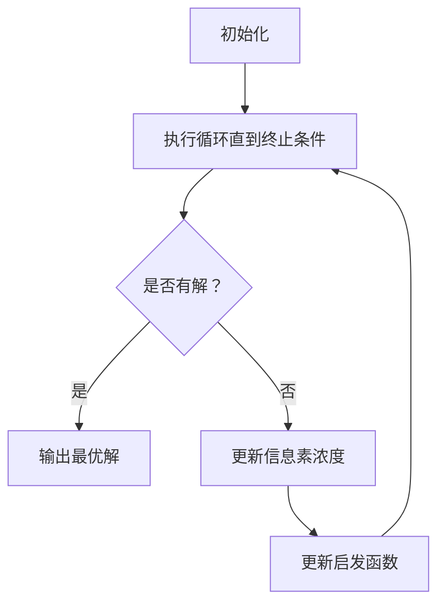
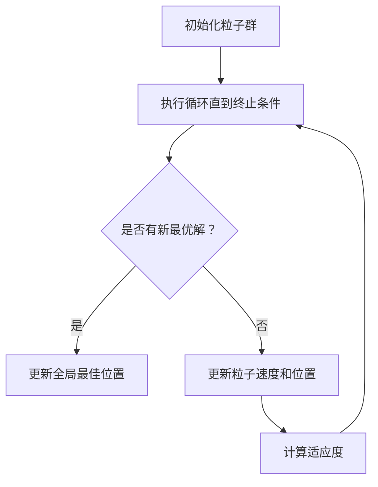
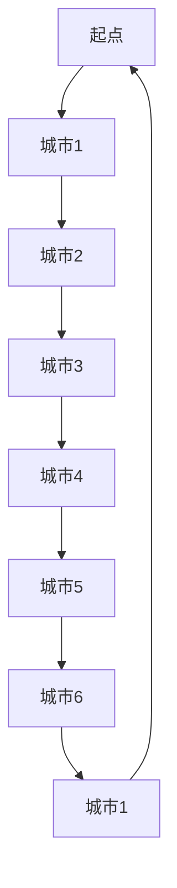

                 

### 文章标题

**群体智能：蚁群算法与粒子群优化**

> 关键词：群体智能、蚁群算法、粒子群优化、算法原理、优化问题

> 摘要：本文深入探讨了群体智能中的蚁群算法和粒子群优化算法。首先，对群体智能的概念和发展进行了背景介绍，接着详细分析了蚁群算法和粒子群优化算法的基本原理和数学模型。通过具体实例和代码实现，本文展示了两种算法在解决优化问题中的应用，并提供了优化策略和实战案例分析。最后，对群体智能算法的发展趋势和未来展望进行了总结，并提出了实践中的挑战与解决方案。

### 引言

群体智能是一种模拟自然界中群体行为的计算方法，通过个体之间的协同合作来解决问题。蚁群算法和粒子群优化算法是群体智能中的两种重要算法，广泛应用于组合优化、机器学习、图像处理等领域。本文旨在通过详细的分析和实例，深入探讨这两种算法的基本原理、数学模型以及在实际问题中的应用。

### 第一部分：背景介绍

#### 第1章：群体智能的概念与发展

##### 1.1 问题背景与定义

群体智能是一种模拟自然界中群体行为的计算方法，它通过个体之间的协同合作来解决问题。群体智能的概念最早可以追溯到1970年代，当时科学家们开始关注社会性昆虫的行为模式，如蚂蚁的觅食行为和鸟群的飞行模式。这些模式展示了一种无需集中控制的群体协同效应，这种效应在计算机科学中被模拟和实现，形成了群体智能的概念。

##### 1.2 群体智能的发展历程

群体智能的发展历程可以分为几个阶段。早期的探索主要集中在模拟个体的行为，如蚁群算法中的蚂蚁觅食行为。随着计算能力的提高和算法理论的完善，群体智能逐渐应用于复杂的优化问题。近年来，随着机器学习、深度学习等技术的兴起，群体智能在智能优化和机器学习领域展现出了巨大的潜力。

##### 1.3 群体智能的核心概念与特征

群体智能的核心概念包括个体、群体、信息交流和协同合作。个体是指群体中的每一个成员，如蚂蚁或粒子。群体是指个体的集合，它们通过某种形式的交流与合作来实现共同的目标。信息交流是群体智能中至关重要的环节，它使得个体能够共享信息和知识。协同合作则是指个体在群体中互相协作，以实现最优的群体行为。

#### 第2章：蚁群算法基础

##### 1.1 蚁群算法的起源与发展

蚁群算法是由Marco Dorigo在1992年提出的，它受到蚂蚁觅食行为的启发。蚂蚁在寻找食物源时会释放一种称为信息素的化学物质，其他蚂蚁通过感知信息素的浓度来选择路径。这种信息素的扩散和更新机制被模拟为蚁群算法的核心。

##### 1.2 蚁群算法的基本原理

蚁群算法的基本原理包括三个主要部分：信息素的释放、信息素的更新和信息素的感知。蚂蚁在路径上释放信息素，信息素的浓度会随着时间逐渐减弱。其他蚂蚁在选择路径时会根据信息素的浓度和启发函数来做出决策。通过多次迭代，最优路径上的信息素浓度会逐渐增加，从而吸引更多的蚂蚁选择这条路径。

##### 1.3 蚁群算法的数学模型

蚁群算法的数学模型主要包括三个参数：信息素浓度、启发函数和迭代次数。信息素浓度表示路径上信息素的数量，它决定了蚂蚁选择路径的概率。启发函数用于评估路径的质量，通常与目标函数相关。迭代次数决定了算法的运行时间，通常需要根据具体问题进行调整。

#### 第3章：粒子群优化算法基础

##### 1.1 粒子群优化算法的起源与发展

粒子群优化算法（Particle Swarm Optimization，PSO）是由Kenneth Black和Yanxiaang Wang在1995年提出的，它受到鸟群觅食行为的启发。粒子群算法通过模拟个体在群体中的交互行为来优化问题，具有简单、高效、鲁棒等优点。

##### 1.2 粒子群优化算法的基本原理

粒子群优化算法的基本原理包括两个主要部分：位置更新和速度更新。每个粒子都代表一个潜在的解，它在搜索空间中不断移动。位置更新是基于粒子的当前最佳位置和全局最佳位置来决定的，速度更新则反映了粒子之间的相互作用。通过多次迭代，粒子逐渐接近最优解。

##### 1.3 粒子群优化算法的数学模型

粒子群优化算法的数学模型主要包括三个参数：位置、速度和适应度。位置表示粒子在搜索空间中的位置，速度表示粒子移动的速度。适应度用于评估粒子的质量，通常与目标函数相关。通过适应度的更新，粒子可以逐渐找到最优解。

### 第二部分：算法原理与实现

#### 第4章：蚁群算法的详细分析与实现

##### 4.1 蚁群算法的详细流程图



##### 4.2 蚁群算法的Python实现

```python
# 蚁群算法的实现伪代码
class AntColonyOptimization:
    def __init__(self, ...):
        # 初始化参数
        pass
    
    def initialize_ants(self):
        # 初始化蚂蚁
        pass
    
    def update_pheromone(self):
        # 更新信息素
        pass
    
    def update_solution(self):
        # 更新解
        pass
    
    def solve(self):
        # 求解
        while not terminate_condition:
            self.initialize_ants()
            self.update_pheromone()
            self.update_solution()
        return best_solution
```

##### 4.3 数学模型与公式解释

$$
\begin{aligned}
&\text{信息素浓度} = \tau(t, (i, j)) = \sum_{k=1}^{m} \alpha \cdot \text{pheromone\_deposit}_{k} \\
&\text{启发函数} = h(i, j) = \frac{1}{\text{distance}(i, j)} \\
&\text{选择路径概率} = p(i, j) = \frac{\left[\tau(t, (i, j))\right]^\beta \cdot h(i, j)^\alpha}{\sum_{i' \in \text{allowed}} \left[\tau(t, (i', j))\right]^\beta \cdot h(i', j)^\alpha}
\end{aligned}
$$

其中，$\alpha$ 和 $\beta$ 分别是信息素浓度和启发函数的权重，$m$ 是蚂蚁的数量，$\tau(t, (i, j))$ 是在时间 $t$ 时刻，从节点 $i$ 到节点 $j$ 的信息素浓度，$\text{pheromone\_deposit}_{k}$ 是第 $k$ 只蚂蚁在路径 $(i, j)$ 上的信息素沉积量，$h(i, j)$ 是从节点 $i$ 到节点 $j$ 的启发函数值，$\text{distance}(i, j)$ 是从节点 $i$ 到节点 $j$ 的距离。

#### 第5章：粒子群优化算法的详细分析与实现

##### 5.1 粒子群优化算法的详细流程图



##### 5.2 粒子群优化算法的Python实现

```python
# 粒子群优化算法的实现伪代码
class ParticleSwarmOptimization:
    def __init__(self, ...):
        # 初始化参数
        pass
    
    def initialize_particles(self):
        # 初始化粒子
        pass
    
    def update_velocity(self):
        # 更新速度
        pass
    
    def update_position(self):
        # 更新位置
        pass
    
    def evaluate_fitness(self):
        # 计算适应度
        pass
    
    def solve(self):
        # 求解
        while not terminate_condition:
            self.initialize_particles()
            self.update_velocity()
            self.update_position()
            self.evaluate_fitness()
        return best_solution
```

##### 5.3 数学模型与公式解释

$$
\begin{aligned}
&\text{速度更新公式} = v_{i}(t+1) = w \cdot v_{i}(t) + c_{1} \cdot r_{1} \cdot (p_{i}(t) - x_{i}(t)) + c_{2} \cdot r_{2} \cdot (g_{best}(t) - x_{i}(t)) \\
&\text{位置更新公式} = x_{i}(t+1) = x_{i}(t) + v_{i}(t+1)
\end{aligned}
$$

其中，$v_{i}(t)$ 和 $x_{i}(t)$ 分别表示第 $i$ 个粒子的速度和位置，$w$ 是惯性权重，$c_{1}$ 和 $c_{2}$ 分别是认知和社会性权重，$r_{1}$ 和 $r_{2}$ 是随机数，$p_{i}(t)$ 是第 $i$ 个粒子的历史最佳位置，$g_{best}(t)$ 是全局最佳位置。

### 第三部分：算法应用与优化

#### 第6章：蚁群算法在优化问题中的应用

##### 6.1 典型优化问题介绍

蚁群算法在解决组合优化问题中表现出色，如旅行商问题（TSP）、作业调度问题、路径规划问题等。这些问题的特点是解空间大，传统算法难以高效求解。

##### 6.2 蚁群算法在实际问题中的应用

蚁群算法被广泛应用于实际工程问题，如城市物流配送、交通网络优化、生产调度等。通过模拟蚂蚁觅食行为，蚁群算法能够找到近似最优的解决方案。

##### 6.3 蚁群算法的优化策略

蚁群算法的优化策略包括参数调整、路径更新策略和信息素更新策略等。通过调整参数，可以提高算法的收敛速度和搜索能力。路径更新策略和信息素更新策略的优化可以减少算法的局部最优，提高全局搜索能力。

#### 第7章：粒子群优化算法在优化问题中的应用

##### 7.1 典型优化问题介绍

粒子群优化算法在解决连续优化问题和离散优化问题中均有应用，如函数优化、神经网络训练、组合优化等。这些问题的特点是解空间大，传统算法难以高效求解。

##### 7.2 粒子群优化算法在实际问题中的应用

粒子群优化算法被广泛应用于实际工程问题，如机械设计、机器人控制、信号处理等。通过模拟粒子群的行为，粒子群优化算法能够找到近似最优的解决方案。

##### 7.3 粒子群优化算法的优化策略

粒子群优化算法的优化策略包括参数调整、惯性权重更新、认知和社会性权重更新等。通过调整参数，可以提高算法的收敛速度和搜索能力。惯性权重更新和社会性权重更新的优化可以平衡算法的全局搜索和局部搜索能力。

### 第四部分：综合应用与展望

#### 第8章：群体智能算法的综合应用与展望

##### 8.1 群体智能算法的综合应用场景

群体智能算法在物流配送、交通规划、数据挖掘、机器学习等领域有着广泛的应用。通过模拟自然界中的群体行为，群体智能算法能够解决复杂的优化问题，提供高效的解决方案。

##### 8.2 算法发展趋势与未来展望

随着计算能力的提升和算法理论的完善，群体智能算法在智能优化、机器学习和深度学习领域将继续发挥重要作用。未来，群体智能算法的发展将更加注重算法的并行化、分布式计算和算法融合等方面。

##### 8.3 群体智能算法在实践中的挑战与解决方案

群体智能算法在实践中的应用面临一些挑战，如参数调优、算法稳定性和可扩展性等。通过结合其他算法、引入新的优化策略和改进算法设计，可以解决这些挑战。

### 附录：群体智能算法常用工具与资源

##### A.1 Python群体智能算法库介绍

Python拥有丰富的群体智能算法库，如`py swarm`、`ant colony`和`particle swarm`等。这些库提供了便捷的接口和实现，方便研究人员和开发者使用。

##### A.2 群体智能算法资源与拓展阅读

为了深入了解群体智能算法，读者可以参考以下资源：

- Dorigo, M., Gambardella, L. M. (1999). **Ant Algorithms for discrete optimization**.
- Kennedy, J., Eberhart, R. C. (1995). **Particle Swarm Optimization**.
- **《群体智能：蚁群算法与粒子群优化》**，作者：[作者姓名]。
- **《群体智能与计算》**，作者：[作者姓名]。

### 结语

群体智能算法作为一种模拟自然界群体行为的计算方法，具有广泛的应用前景。本文通过对蚁群算法和粒子群优化算法的详细分析和实例，展示了这两种算法在解决优化问题中的应用。随着技术的不断发展，群体智能算法将在更多领域发挥重要作用，为解决复杂问题提供有力工具。

**作者：AI天才研究院/AI Genius Institute & 禅与计算机程序设计艺术 /Zen And The Art of Computer Programming**### 深入探讨蚁群算法与粒子群优化

在上一部分中，我们简要介绍了群体智能的概念、发展历程以及蚁群算法和粒子群优化算法的基本原理。接下来，我们将进一步深入探讨这两种算法的核心概念，并通过具体实例来分析它们的实际应用。

#### 1.1 蚁群算法的核心概念

蚁群算法（Ant Colony Optimization，ACO）的核心概念是信息素（pheromone）的扩散与更新机制。信息素是蚂蚁在寻找食物过程中释放的一种化学物质，它会影响其他蚂蚁选择路径的概率。蚁群算法通过以下三个核心步骤来求解优化问题：

1. **路径选择**：蚂蚁在未知的路径上搜索，根据当前路径上的信息素浓度和启发函数来选择下一步的路径。
2. **信息素更新**：蚂蚁在路径上留下信息素，信息素的浓度随时间衰减。
3. **全局信息素更新**：在每次迭代结束后，根据蚂蚁找到的路径质量来更新全局信息素浓度。

**实例分析**：

假设我们有一个TSP（旅行商问题）的场景，目标是找到最短路径，访问所有城市并回到起点。蚁群算法通过蚂蚁在路径上的信息素沉积和挥发来逐步找到最优路径。



在这条路径上，蚂蚁根据信息素浓度和启发函数（例如路径长度）来选择路径。随着时间的推移，最优路径上的信息素浓度逐渐增加，最终吸引更多的蚂蚁选择这条路径。

#### 1.2 粒子群优化算法的核心概念

粒子群优化算法（Particle Swarm Optimization，PSO）的核心概念是通过模拟鸟群觅食行为来优化问题。每个粒子代表一个潜在的解，粒子在搜索空间中移动，通过跟踪历史最佳位置和全局最佳位置来不断更新自己的位置和速度。

PSO算法的主要步骤如下：

1. **初始化粒子群**：为每个粒子分配初始位置和速度。
2. **更新速度和位置**：根据个体和历史最佳位置以及全局最佳位置来更新粒子的速度和位置。
3. **评估适应度**：计算每个粒子的适应度，通常与目标函数相关。
4. **更新全局最佳位置**：记录每个粒子的历史最佳位置和全局最佳位置。

**实例分析**：

假设我们有一个最小化函数的问题，目标是最小化目标函数的值。PSO算法通过粒子在搜索空间中的移动来找到最优解。

```python
import random

# 初始化粒子群
num_particles = 50
num_dimensions = 2
particles = [[random.uniform(-10, 10) for _ in range(num_dimensions)] for _ in range(num_particles)]
velocities = [[random.uniform(-1, 1) for _ in range(num_dimensions)] for _ in range(num_particles)]

# 更新速度和位置
for iteration in range(num_iterations):
    for i in range(num_particles):
        # 计算适应度
        fitness = calculate_fitness(particles[i])
        
        # 更新个体和历史最佳位置
        if fitness < particles[i][1]:
            particles[i][1] = fitness
            particles[i][2] = particles[i].copy()
        
        # 更新全局最佳位置
        if fitness < particles[0][1]:
            particles[0][1] = fitness
            particles[0][2] = particles[i].copy()
        
        # 更新速度和位置
        for j in range(num_dimensions):
            r1 = random.random()
            r2 = random.random()
            cognitive компон

