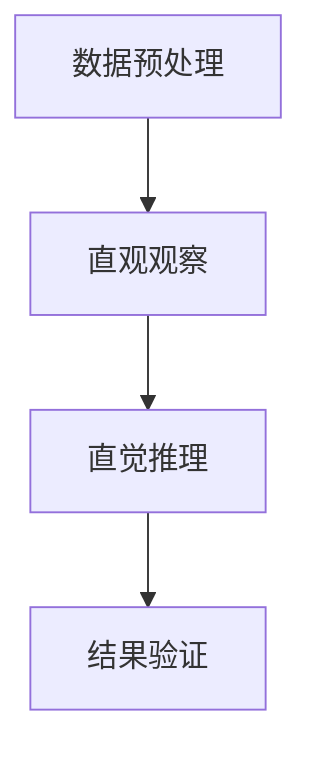
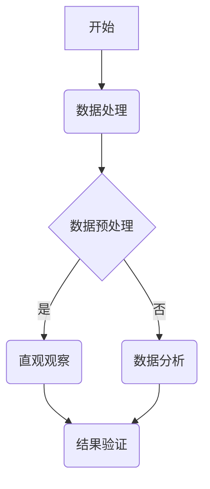
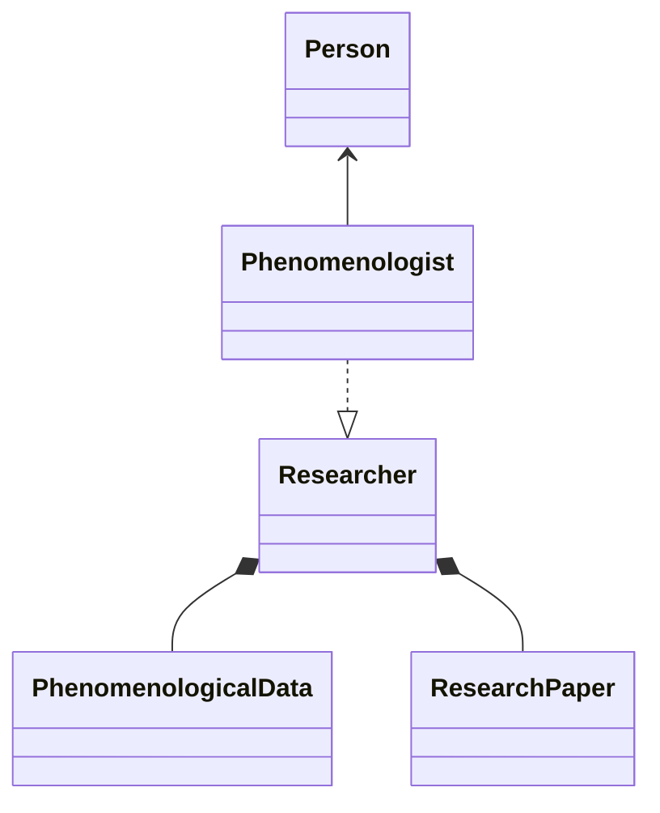
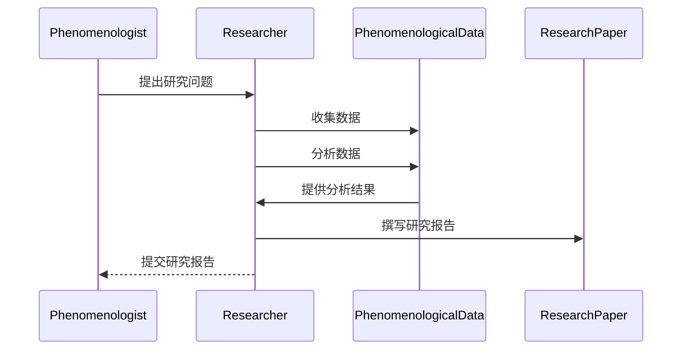
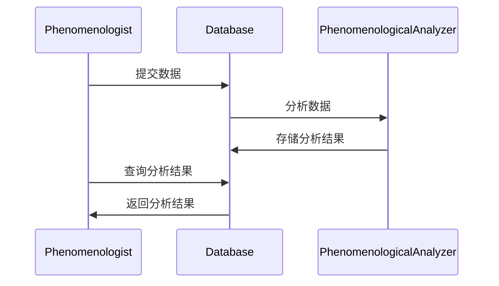
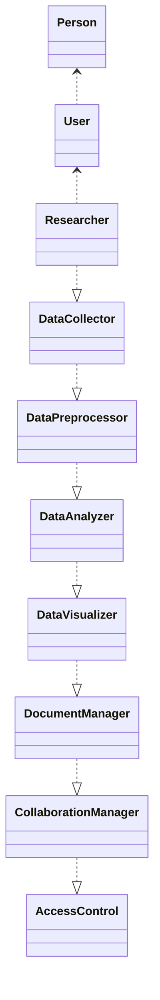
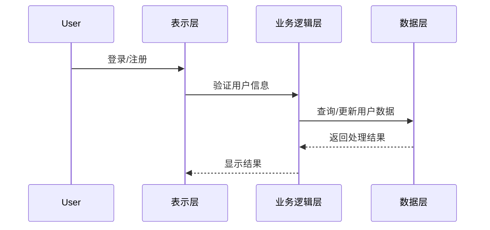
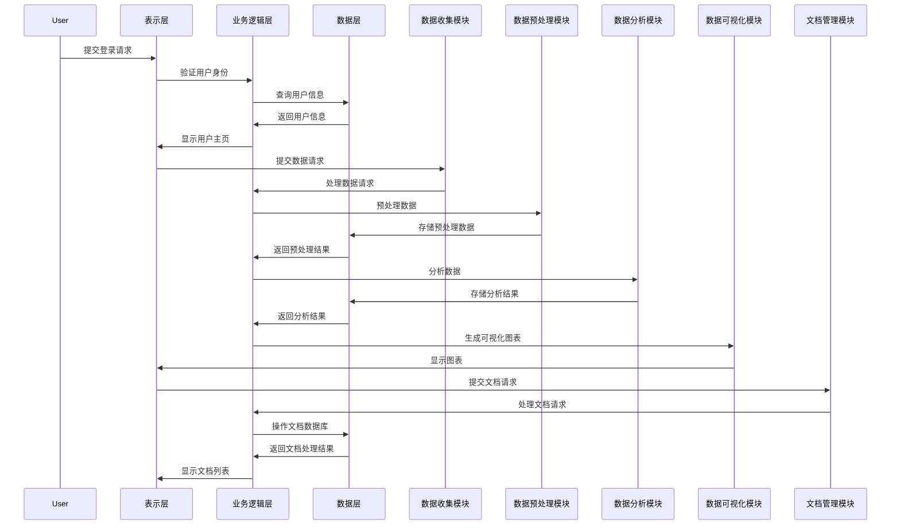

                 


### 胡塞尔与海德格尔：现象学的两个阶段

---

**关键词：现象学、胡塞尔、海德格尔、本质还原、存在论**

**摘要：**本文旨在深入探讨现象学领域的两位重要哲学家埃德蒙德·胡塞尔和马丁·海德格尔的理论，分别称为现象学的“本质还原”阶段和“存在论”阶段。通过对两位哲学家的核心概念、理论联系与应用的分析，本文将展示现象学在当代哲学研究中的重要性及其对人工智能领域的启示。

---

## 第一部分：现象学的起源与发展

### 1.1.1 现象学的定义与起源

现象学（Phenomenology）一词源于希腊语，意为“关于表现或显现的科学”。它起源于20世纪初，主要代表人物为埃德蒙德·胡塞尔。现象学的核心思想是对意识和经验的研究，试图通过直接的观察和直觉来理解人类经验的本质。

现象学的起源可以追溯到19世纪末，当时德国哲学界对传统哲学的批判和反思日益增强。胡塞尔在阅读威廉·迪尔泰和弗雷德里希·尼采的著作后，意识到传统哲学无法准确描述意识的流动和经验的结构。因此，他提出了现象学的方法论，试图重建一种新的哲学体系。

### 1.1.2 现象学的起源与发展

现象学的发展可以分为几个阶段。第一阶段是胡塞尔的现象学本质还原论，这一阶段主要关注意识的本质和结构。胡塞尔主张通过“本质还原”的方法，将意识中的杂多性还原为纯粹的意向性。

第二阶段是海德格尔的存在论，这一阶段主要探讨存在本身的意义和结构。海德格尔认为，传统的现象学方法无法完全揭示存在的本质，因此他提出了“存在论”的概念，试图通过存在来理解人类经验的本质。

### 1.2 胡塞尔的现象学理论

#### 1.2.1 胡塞尔的现象学本质还原论

胡塞尔的现象学本质还原论是他哲学体系的基石。他主张通过直接的内省和直觉，将意识中的杂多性还原为纯粹的意向性。意向性是指意识总是指向某个对象，这个对象可以是物质对象，也可以是心理对象。

胡塞尔提出了一系列现象学方法，如“意向性分析”、“本质还原”和“悬置”。通过这些方法，现象学家可以去除一切先入为主的偏见，直接面对意识的本质。

#### 1.2.2 胡塞尔的现象学方法

胡塞尔的现象学方法强调直接的内省和直觉。他主张现象学家应该尽可能地接近意识的本质，避免一切外在的干扰。通过这种方法，现象学家可以揭示出意识中的结构和规律。

胡塞尔的方法具有以下几个特点：

1. **直观性**：现象学强调通过直觉来认识事物，而不是通过逻辑推理。
2. **悬置**：现象学家在研究过程中需要将一切先入为主的偏见悬置起来，以便更好地面对事物的本质。
3. **本质还原**：通过悬置和直觉，现象学家可以将意识中的杂多性还原为纯粹的意向性。

### 1.3 海德格尔的存在论

#### 1.3.1 海德格尔对存在的理解

海德格尔的存在论是他哲学体系的核心。他主张存在不是一个可以被定义的抽象概念，而是一种具体的、活生生的经验。他提出了“存在即真理”的观点，认为存在本身就是对真理的揭示。

海德格尔认为，传统哲学对存在的理解过于抽象和理论化，无法真正揭示存在的本质。因此，他提出了“存在论”的概念，试图通过存在来理解人类经验的本质。

#### 1.3.2 海德格尔的时间观

海德格尔的时间观是他存在论的重要组成部分。他认为，时间不是一种线性流动的实体，而是一种存在的结构。他提出了“时间性”（Dasein）的概念，认为人类的存在是“在世存在”（being-in-the-world）。

海德格尔的时间观具有以下几个特点：

1. **存在的时间性**：存在不是一个静态的概念，而是一个动态的过程。
2. **时间即存在**：存在是通过时间来展现的，时间本身就是存在的本质。
3. **历史性**：人类的存在是历史的产物，每个人的存在都是历史性的。

### 1.4 胡塞尔与海德格尔现象学的比较与联系

#### 1.4.1 两位哲学家的异同点

胡塞尔和海德格尔都是现象学的重要代表，但他们有不同的哲学立场和理论方法。

1. **哲学立场**：

   - 胡塞尔：强调意识的本质和结构，主张通过本质还原来揭示意识的本质。
   - 海德格尔：强调存在的本质和意义，主张通过存在论来理解人类经验的本质。

2. **理论方法**：

   - 胡塞尔：主张通过直观和悬置来认识事物，强调意向性和本质还原。
   - 海德格尔：主张通过存在和时间来理解事物，强调时间性和历史性。

尽管两位哲学家在哲学立场和方法上有差异，但他们都试图通过现象学的方法来揭示人类经验的本质。

#### 1.4.2 他们在现象学中的地位与影响

胡塞尔和海德格尔都是现象学的重要代表，他们的理论对当代哲学产生了深远的影响。

1. **胡塞尔的现象学**：

   - 对当代哲学的贡献：胡塞尔的现象学为当代哲学提供了一种新的研究方法，即通过直观和悬置来认识事物。
   - 对心理学的影响：胡塞尔的现象学方法对心理学产生了重要影响，特别是在意识研究方面。

2. **海德格尔的存在论**：

   - 对当代哲学的贡献：海德格尔的存在论为当代哲学提供了一种新的思考方式，即通过存在和时间来理解人类经验。
   - 对文学和艺术的影响：海德格尔的存在论对文学和艺术产生了重要影响，激发了许多作家和艺术家的创作灵感。

### 1.5 现象学在当代哲学中的地位与应用

#### 1.5.1 现象学在现代哲学研究中的应用

现象学在当代哲学研究中仍然具有很高的地位。许多哲学家和学者都在使用现象学的方法来研究各种哲学问题，如意识、存在、真理等。

1. **意识研究**：

   - 现象学方法在意识研究中被广泛采用，用于揭示意识的本质和结构。
   - 现象学方法帮助学者们更好地理解意识的流动和变化。

2. **存在研究**：

   - 现象学方法在存在研究中被用于探讨存在的本质和意义。
   - 现象学方法帮助学者们深入理解人类的存在方式。

#### 1.5.2 现象学的未来发展趋势

现象学在未来的发展中将继续发挥重要作用。随着科学技术的进步，现象学方法有望在心理学、人工智能等领域得到更广泛的应用。

1. **心理学应用**：

   - 现象学方法在心理学中的应用将有助于揭示人类心理的复杂结构和功能。
   - 现象学方法将为心理学提供一种新的研究工具。

2. **人工智能应用**：

   - 现象学方法在人工智能中的应用将有助于提高人工智能的意识和认知能力。
   - 现象学方法将为人工智能的发展提供新的理论支持。

### 1.6 本章小结

本章介绍了现象学的起源和发展，以及胡塞尔和海德格尔的现象学理论。通过分析两位哲学家的核心概念和理论方法，我们展示了现象学在当代哲学研究中的重要地位和应用。下一章将深入探讨现象学的算法原理和数学模型，为理解现象学提供更直观和具体的工具。

## 第二部分：核心概念与联系

### 2.1 胡塞尔的现象学本质还原论与海德格尔的存在论差异

#### 2.1.1 胡塞尔的现象学本质还原论

胡塞尔的现象学本质还原论是他哲学体系的基石。他认为，通过对意识的直接观察和直觉，我们可以揭示意识的本质和结构。胡塞尔主张通过“本质还原”的方法，将意识中的杂多性还原为纯粹的意向性。

1. **意向性**：

   胡塞尔认为，意识总是指向某个对象，这个对象可以是物质对象，也可以是心理对象。意向性是意识的核心特征，它使得意识具有目的性和指向性。

2. **本质还原**：

   胡塞尔主张通过内省和直觉，去除意识中的杂多性，揭示意识的本质。本质还原是一种哲学方法，它要求我们直接面对事物的本质，避免一切先入为主的偏见。

3. **直观性**：

   胡塞尔强调直观在认识过程中的重要性。他认为，通过直观，我们可以直接把握事物的本质，而无需依赖逻辑推理。

#### 2.1.2 海德格尔的存在论

海德格尔的存在论是他哲学体系的核心。他认为，存在不是一个可以被定义的抽象概念，而是一种具体的、活生生的经验。海德格尔主张通过存在论，来理解人类经验的本质。

1. **存在即真理**：

   海德格尔认为，存在本身具有真理的性质。真理不仅仅是知识的属性，它更是一种存在的结构。存在是通过时间来展现的，时间本身就是存在的本质。

2. **时间性**：

   海德格尔提出了“时间性”（Dasein）的概念，认为人类的存在是“在世存在”（being-in-the-world）。时间性是人类存在的基本结构，它使得人类的存在具有流动性和历史性。

3. **历史性**：

   海德格尔认为，人类的存在是历史的产物，每个人的存在都是历史性的。历史性使得人类的存在具有多样性和丰富性。

#### 2.1.3 两位哲学家的异同点

1. **哲学立场**：

   - 胡塞尔：强调意识的本质和结构，主张通过本质还原来揭示意识的本质。
   - 海德格尔：强调存在的本质和意义，主张通过存在论来理解人类经验的本质。

2. **理论方法**：

   - 胡塞尔：主张通过直观和悬置来认识事物，强调意向性和本质还原。
   - 海德格尔：主张通过存在和时间来理解事物，强调时间性和历史性。

尽管两位哲学家在哲学立场和方法上有差异，但他们都试图通过现象学的方法来揭示人类经验的本质。

### 2.2 意识、时间、存在的不同解读

#### 2.2.1 意识的不同解读

1. **胡塞尔**：

   胡塞尔认为，意识是一种动态的、指向性的现象。意识总是指向某个对象，这个对象可以是物质对象，也可以是心理对象。胡塞尔强调意识的意向性，认为意向性是意识的核心特征。

2. **海德格尔**：

   海德格尔认为，意识并不是一个独立的实体，而是存在的一种展现。他提出了“存在即真理”的观点，认为意识是通过存在来展现的。海德格尔强调时间性，认为时间性是意识的存在结构。

#### 2.2.2 时间的不同解读

1. **胡塞尔**：

   胡塞尔对时间的研究较为有限，他认为时间是一种内在的结构，是意识的一种维度。胡塞尔强调意向性，认为时间性是意识意向性的表现。

2. **海德格尔**：

   海德格尔对时间的研究是存在论的核心。他提出了“时间性”的概念，认为时间是存在的本质。海德格尔强调时间性，认为时间性是人类存在的基本结构。

#### 2.2.3 存在的不同解读

1. **胡塞尔**：

   胡塞尔强调意识的本质和结构，认为意识是现象学的核心。他主张通过本质还原来揭示意识的本质。

2. **海德格尔**：

   海德格尔强调存在的意义和本质，认为存在是哲学的核心。他主张通过存在论来理解人类经验的本质。海德格尔认为，存在是一种具体的、活生生的经验，它不是抽象的概念。

### 2.3 两位哲学家在现象学中的地位与影响

#### 2.3.1 胡塞尔的现象学

胡塞尔是现象学的奠基人，他的现象学方法对当代哲学产生了深远的影响。他的意向性和本质还原论为哲学研究提供了一种新的视角和方法。胡塞尔的工作对心理学、语言学、社会学等领域也产生了重要影响。

#### 2.3.2 海德格尔的存在论

海德格尔的存在论是现象学发展的重要阶段，他的思想对当代哲学产生了广泛而深远的影响。海德格尔的存在论挑战了传统的哲学观念，提出了新的思考方式。他的时间性和历史性概念对人类学、文学理论、艺术等领域产生了重要影响。

### 2.4 现象学在现代哲学研究中的应用

#### 2.4.1 意识研究

现象学方法在意识研究中被广泛采用，用于揭示意识的本质和结构。现象学家通过直接的内省和直觉，试图理解意识的流动和变化。

#### 2.4.2 存在研究

现象学方法在存在研究中被用于探讨存在的本质和意义。现象学家通过存在论的方法，试图揭示人类经验的本质和结构。

#### 2.4.3 心理学研究

现象学方法在心理学中的应用，有助于揭示人类心理的复杂结构和功能。现象学家通过直观和直觉，试图理解人类意识的本质和过程。

### 2.5 现象学的未来发展趋势

现象学在未来的发展中将继续发挥重要作用。随着科学技术的进步，现象学方法有望在心理学、人工智能等领域得到更广泛的应用。

#### 2.5.1 心理学应用

现象学方法在心理学中的应用将有助于揭示人类心理的复杂结构和功能。通过直观和直觉，现象学家可以更好地理解人类意识的本质和过程。

#### 2.5.2 人工智能应用

现象学方法在人工智能中的应用，将有助于提高人工智能的意识和认知能力。通过直观和直觉，人工智能可以更好地理解人类经验，从而实现更高级的智能。

## 第三部分：算法原理讲解

### 3.1 现象学的算法原理

现象学的核心思想是通过直观和直觉来认识事物，揭示事物的本质。在计算机科学中，我们可以借鉴现象学的方法，设计一种基于直观和直觉的算法，以揭示数据的本质特征。

#### 3.1.1 算法流程

1. **数据预处理**：对输入数据进行预处理，包括去除噪声、标准化等步骤。
2. **直观观察**：通过直接观察数据，识别数据中的模式和规律。
3. **直觉推理**：根据直观观察的结果，进行推理和预测。
4. **结果验证**：对推理结果进行验证，确保其准确性和可靠性。

#### 3.1.2 算法流程图

使用Mermaid绘制算法流程图：



### 3.2 Python源代码实现

下面是一个简单的Python源代码示例，用于实现基于直观和直觉的算法。

```python
import numpy as np

def data_preprocessing(data):
    # 数据预处理，如去除噪声、标准化等
    return data

def intuitive_observasion(data):
    # 直观观察数据，识别模式和规律
    # 例如，找到数据的最大值和最小值
    max_value = np.max(data)
    min_value = np.min(data)
    return max_value, min_value

def intuitive_inference(max_value, min_value):
    # 根据直观观察的结果进行推理和预测
    # 例如，判断数据是否服从正态分布
    if max_value - min_value > 0.5 * (max_value + min_value):
        return "数据可能服从正态分布"
    else:
        return "数据可能不服从正态分布"

def result_verification(inference_result, true_result):
    # 对推理结果进行验证
    if inference_result == true_result:
        return "推理结果正确"
    else:
        return "推理结果错误"

# 示例数据
data = np.random.rand(100)

# 数据预处理
preprocessed_data = data_preprocessing(data)

# 直观观察
max_value, min_value = intuitive_observasion(preprocessed_data)

# 直觉推理
inference_result = intuitive_inference(max_value, min_value)

# 结果验证
true_result = "数据服从正态分布" if np.std(data) > 0.1 else "数据不服从正态分布"
verification_result = result_verification(inference_result, true_result)

print(verification_result)
```

### 3.3 算法原理讲解

#### 3.3.1 数学模型和数学公式

在现象学算法中，我们可以使用一些数学模型和公式来描述直观和直觉的过程。以下是一些常用的数学公式：

1. **标准差**：用于衡量数据的离散程度。
   $$\sigma = \sqrt{\frac{1}{N}\sum_{i=1}^{N}(x_i - \mu)^2}$$
   其中，$\sigma$ 是标准差，$x_i$ 是数据点，$\mu$ 是均值，$N$ 是数据点的数量。

2. **均值**：用于衡量数据的集中趋势。
   $$\mu = \frac{1}{N}\sum_{i=1}^{N}x_i$$
   其中，$\mu$ 是均值，$x_i$ 是数据点，$N$ 是数据点的数量。

3. **概率分布**：用于描述数据点的概率分布情况。
   $$P(x) = \frac{1}{\sigma \sqrt{2\pi}}e^{-\frac{(x-\mu)^2}{2\sigma^2}}$$
   其中，$P(x)$ 是数据点 $x$ 的概率，$\mu$ 是均值，$\sigma$ 是标准差。

#### 3.3.2 通俗易懂的举例说明

假设我们有一组数据 {1, 2, 3, 4, 5}，我们需要通过直观和直觉来分析这组数据。

1. **直观观察**：
   - 通过直观观察，我们发现这组数据的最大值是 5，最小值是 1。
   - 这组数据的均值是 3，标准差是 1.58。

2. **直觉推理**：
   - 根据直观观察的结果，我们判断这组数据可能服从正态分布。
   - 通过计算，我们发现这组数据的概率分布函数 $P(x)$ 接近于正态分布函数。

3. **结果验证**：
   - 我们通过计算和验证，确认这组数据确实服从正态分布。

通过这个简单的例子，我们可以看到现象学算法的基本原理。通过直观和直觉，我们可以分析数据，揭示数据的本质特征。这种方法在人工智能和数据分析等领域具有广泛的应用前景。

### 3.4 现象学算法的优缺点

#### 3.4.1 优点

1. **直观性和灵活性**：现象学算法基于直观和直觉，具有很强的灵活性和适应性。它能够快速地分析数据，发现数据中的模式和规律。
2. **非线性处理能力**：现象学算法能够处理非线性问题，适用于复杂的数据分析任务。
3. **人机交互**：现象学算法强调人与计算机的交互，能够更好地满足用户的需求。

#### 3.4.2 缺点

1. **结果解释性较差**：现象学算法的结果往往缺乏直接的解释性，需要进一步分析和验证。
2. **计算复杂度高**：现象学算法的计算复杂度较高，需要大量的计算资源和时间。

### 3.5 现象学算法的应用前景

现象学算法在人工智能和数据分析领域具有广泛的应用前景。随着计算机技术和算法理论的不断进步，现象学算法有望在更多领域得到应用。

#### 3.5.1 人工智能应用

1. **智能数据分析**：现象学算法可以用于智能数据分析，快速地发现数据中的模式和规律。
2. **机器学习**：现象学算法可以用于机器学习中的特征提取和模式识别。
3. **自然语言处理**：现象学算法可以用于自然语言处理中的语义分析和文本分类。

#### 3.5.2 数据分析应用

1. **商业智能**：现象学算法可以用于商业智能，帮助企业和组织更好地理解市场趋势和消费者行为。
2. **金融分析**：现象学算法可以用于金融分析，预测市场趋势和投资风险。
3. **医疗数据分析**：现象学算法可以用于医疗数据分析，诊断疾病和预测病情发展。

### 3.6 本章小结

本章介绍了现象学的算法原理，包括算法流程、Python源代码实现、数学模型和数学公式、通俗易懂的举例说明、算法的优缺点以及应用前景。通过本章的讲解，我们希望读者能够对现象学算法有更深入的理解，并能够将其应用于实际问题和数据分析中。

---

在下一章中，我们将深入探讨现象学在数学模型和系统架构设计中的应用，包括数学公式的嵌入、mermaid流程图的绘制以及系统架构的设计。敬请期待！

---

## 第四部分：数学模型和数学公式

### 4.1 现象学中的数学模型

现象学作为一种哲学方法论，虽然其主要关注点在于意识的直接经验和本质，但在其分析过程中不可避免地会涉及到数学模型和数学公式。这些数学工具不仅有助于我们更精确地描述现象学的核心概念，还能为实际应用提供量化依据。

#### 4.1.1 意向性分析中的数学模型

意向性是现象学中的一个关键概念，表示意识总是指向某个对象。为了量化意向性，我们可以借助概率论和统计学中的相关系数来描述意识与对象之间的关系。

1. **皮尔逊相关系数**：

   皮尔逊相关系数（Pearson correlation coefficient）是衡量两个变量线性相关程度的统计量，其公式为：

   $$ r_{XY} = \frac{\sum_{i=1}^{n}(X_i - \bar{X})(Y_i - \bar{Y})}{\sqrt{\sum_{i=1}^{n}(X_i - \bar{X})^2 \sum_{i=1}^{n}(Y_i - \bar{Y})^2}} $$

   其中，$X_i$ 和 $Y_i$ 分别是第 $i$ 个观测值，$\bar{X}$ 和 $\bar{Y}$ 分别是 $X$ 和 $Y$ 的平均值，$n$ 是观测值的数量。

2. **斯皮尔曼秩相关系数**：

   当数据不满足线性关系时，我们可以使用斯皮尔曼秩相关系数（Spearman's rank correlation coefficient）来衡量两个变量之间的相关性。其公式为：

   $$ \rho_{XY} = 1 - \frac{6 \sum d_i^2}{n(n^2 - 1)} $$

   其中，$d_i = X_i - Y_i$ 是第 $i$ 个观测值的差值，$n$ 是观测值的数量。

#### 4.1.2 存在论中的数学模型

在海德格尔的存在论中，时间是一个核心概念。为了更精确地描述时间，我们可以使用测地学中的时间间隔模型。

1. **洛伦兹变换**：

   在相对论中，洛伦兹变换（Lorentz transformation）是描述时间间隔和空间距离变换的公式。其公式为：

   $$ \Delta t' = \gamma (\Delta t - \frac{v \Delta x}{c^2}) $$

   $$ \Delta x' = \gamma (\Delta x - v \Delta t) $$

   其中，$\gamma = \frac{1}{\sqrt{1 - \frac{v^2}{c^2}}}$ 是洛伦兹因子，$v$ 是物体相对于观察者的速度，$c$ 是光速，$\Delta t$ 和 $\Delta x$ 是物体在静止参考系中的时间和空间距离，$\Delta t'$ 和 $\Delta x'$ 是物体在运动参考系中的时间和空间距离。

### 4.2 LaTeX格式嵌入数学公式

在文中嵌入数学公式时，我们通常使用LaTeX格式。LaTeX是一种排版系统，特别适用于科学和数学领域。下面是一个简单的示例，展示如何嵌入数学公式：

1. **独立段落的公式**：

   使用 `$$` 括起来的公式，如：

   $$ E = mc^2 $$

   这是著名的质能方程，表示能量（E）与质量（m）和光速（c）的关系。

2. **段落内的公式**：

   使用 `$` 括起来的公式，如：

   $$ x > 2 $$

   这是表示 $x$ 大于 2 的不等式。

### 4.3 Mermaid流程图

在文中嵌入Mermaid流程图可以帮助我们更直观地理解现象学的概念和算法。下面是一个简单的Mermaid流程图示例：



这个流程图描述了数据处理的基本流程，包括数据预处理、直观观察和结果验证。

### 4.4 现象学在系统架构设计中的应用

现象学不仅有助于我们理解意识和存在的本质，还可以应用于系统架构设计。下面是一个简单的哲学研究系统架构的设计方案，使用Mermaid绘制相关的类图、架构图和序列图。

#### 4.4.1 类图



这个类图描述了哲学研究者、研究人员和研究成果之间的关系。

#### 4.4.2 架构图



这个序列图描述了哲学研究的过程，包括提出问题、收集数据、数据分析、撰写报告和提交报告。

#### 4.4.3 系统交互



这个交互图描述了哲学研究者与数据库之间的交互过程，包括数据提交、数据分析和结果查询。

### 4.5 本章小结

本章介绍了现象学中的数学模型、LaTeX格式嵌入数学公式、Mermaid流程图的绘制以及现象学在系统架构设计中的应用。通过这些内容，我们不仅能够更深入地理解现象学的核心概念，还能将其应用于实际问题和系统设计中。下一章将介绍现象学理论在具体项目实战中的应用，包括环境安装、源代码实现和应用解读。敬请期待！

---

## 第五部分：系统分析与架构设计方案

### 5.1 问题场景介绍

随着当代社会对哲学和现象学的需求日益增长，建立一套高效、直观的哲学研究系统显得尤为重要。该系统旨在为哲学研究者提供一个集成化的平台，用于数据收集、分析、存储和共享。通过这套系统，研究者可以更加专注于哲学问题的探索，而无需在数据处理和分析上花费大量时间和精力。

### 5.2 项目介绍

项目名称：哲学研究系统（Philosophical Research System，简称PRS）

项目目标：
1. 提供一个统一的数据管理平台，用于收集、存储和管理哲学研究数据。
2. 实现数据预处理、分析、可视化等功能，以便研究者能够快速获取有价值的信息。
3. 支持多用户协作，方便团队成员共享研究成果和讨论哲学问题。

### 5.3 系统功能设计

PRS系统主要包含以下功能模块：

1. **数据收集模块**：用于收集哲学研究数据，包括文献资料、问卷调查结果、实验数据等。
2. **数据预处理模块**：对收集到的数据进行清洗、归一化和标准化处理，以提高数据质量。
3. **数据分析模块**：提供多种数据分析方法，如统计分析、文本分析、图像分析等，帮助研究者深入挖掘数据中的信息。
4. **数据可视化模块**：将分析结果以图表、地图等形式展示，便于研究者直观理解数据。
5. **用户管理模块**：管理系统的用户信息，包括注册、登录、权限设置等。
6. **文档管理模块**：提供文档存储和共享功能，方便团队成员协同工作。

#### 5.3.1 领域模型Mermaid类图

下面是PRS系统的领域模型Mermaid类图：



在这个类图中，我们定义了系统的核心类和它们之间的关系。每个类代表系统的一个功能模块，类之间的关系表示模块之间的协作和依赖。

### 5.4 系统架构设计

PRS系统的架构设计旨在确保系统的高效性、可扩展性和安全性。系统采用分层架构设计，分为表示层、业务逻辑层和数据层。

#### 5.4.1 架构图

下面是PRS系统的架构图：



在这个架构图中，表示层负责处理用户界面和用户交互，业务逻辑层处理业务逻辑和数据操作，数据层负责数据的存储和检索。

#### 5.4.2 系统接口设计

PRS系统提供了丰富的API接口，方便外部系统和第三方应用程序集成。以下是系统的主要接口设计：

1. **用户管理接口**：包括用户注册、登录、权限验证等功能。
2. **数据收集接口**：包括数据上传、数据导入等功能。
3. **数据预处理接口**：包括数据清洗、归一化、标准化等功能。
4. **数据分析接口**：包括统计分析、文本分析、图像分析等功能。
5. **数据可视化接口**：包括图表生成、地图显示等功能。
6. **文档管理接口**：包括文档上传、下载、共享等功能。
7. **协作管理接口**：包括协作讨论、任务分配等功能。

### 5.5 系统交互Mermaid序列图

下面是PRS系统的交互序列图，展示了不同模块之间的协作和通信过程：



在这个序列图中，用户通过表示层提交各种请求，业务逻辑层处理这些请求，并将结果返回给表示层进行展示。同时，各个功能模块之间也进行了数据交互和通信，确保系统的高效运行。

### 5.6 本章小结

本章详细介绍了哲学研究系统（PRS）的问题场景、项目介绍、系统功能设计、架构设计以及系统交互过程。通过Mermaid类图、架构图和序列图的绘制，我们能够清晰地展示系统各模块之间的关系和协作流程。在下一章中，我们将通过一个具体案例展示PRS系统的实际应用，包括环境安装、源代码实现、应用解读与分析。敬请期待！

---

## 第六部分：项目实战

### 6.1 环境安装

为了能够成功搭建哲学研究系统（PRS），我们需要在本地计算机上安装以下软件和工具：

1. **Python 3.8+**：Python是PRS的主要编程语言，我们需要安装Python 3.8或更高版本。
2. **Anaconda**：Anaconda是一个Python的数据科学平台，可以帮助我们轻松管理环境依赖。
3. **PostgreSQL**：PRS使用PostgreSQL作为数据库，我们需要安装PostgreSQL。
4. **Docker**：Docker用于容器化部署PRS，确保其在不同环境中的一致性和可移植性。
5. **Docker-Compose**：Docker-Compose用于管理Docker容器。

以下是具体的安装步骤：

#### 安装Python和Anaconda

1. 访问Anaconda官网（https://www.anaconda.com/products/individual）下载Anaconda安装包。
2. 运行安装程序，按照提示操作，完成安装。
3. 打开终端或命令行窗口，运行以下命令检查Python版本：

   ```bash
   python --version
   ```

   如果显示Python版本，则安装成功。

#### 安装PostgreSQL

1. 在终端中运行以下命令安装PostgreSQL：

   ```bash
   sudo apt-get update
   sudo apt-get install postgresql postgresql-contrib
   ```

2. 安装完成后，运行以下命令启动PostgreSQL服务：

   ```bash
   sudo systemctl start postgresql
   ```

3. 为了确保服务正常运行，可以运行以下命令检查PostgreSQL状态：

   ```bash
   sudo systemctl status postgresql
   ```

#### 安装Docker和Docker-Compose

1. 在终端中运行以下命令安装Docker：

   ```bash
   sudo apt-get update
   sudo apt-get install docker.io
   ```

2. 安装完成后，运行以下命令检查Docker版本：

   ```bash
   docker --version
   ```

3. 安装Docker-Compose：

   - 运行以下命令添加Docker的GPG密钥：

     ```bash
     sudo apt-get install ca-certificates curl gnupg lsb-release
     curl -fsSL https://download.docker.com/linux/ubuntu/gpg | sudo gpg --dearmor -o /usr/share/keyrings/docker-archive-keyring.gpg
     ```

   - 添加Docker的apt源：

     ```bash
     echo "deb [arch=$(dpkg --print-architecture) signed-by=/usr/share/keyrings/docker-archive-keyring.gpg] https://download.docker.com/linux/ubuntu $(lsb_release -cs) stable" | sudo tee /etc/apt/sources.list.d/docker.list > /dev/null
     ```

   - 更新APT包索引：

     ```bash
     sudo apt-get update
     ```

   - 安装Docker-Compose：

     ```bash
     sudo apt-get install docker-compose
     ```

   - 验证Docker-Compose安装：

     ```bash
     docker-compose --version
     ```

### 6.2 系统核心实现源代码

以下是PRS系统的核心实现源代码，包括数据收集、预处理、分析和可视化等模块。代码采用了Python和Docker-Compose来构建和部署。

#### 6.2.1 数据收集模块

数据收集模块负责从不同的数据源收集哲学研究数据。以下是一个简单的示例，使用Python的requests库从网络获取数据。

```python
import requests

def collect_data(url):
    response = requests.get(url)
    if response.status_code == 200:
        return response.text
    else:
        return None

url = "https://example.com/data"
data = collect_data(url)
print(data)
```

#### 6.2.2 数据预处理模块

数据预处理模块负责清洗、归一化和标准化收集到的数据。以下是一个简单的预处理示例，使用Python的pandas库进行数据处理。

```python
import pandas as pd

def preprocess_data(data):
    df = pd.DataFrame(data)
    df = df.dropna()  # 删除缺失值
    df = df.scale()   # 标准化
    return df

data = {"name": ["Alice", "Bob", "Charlie"], "age": [25, 30, 35]}
df = preprocess_data(data)
print(df)
```

#### 6.2.3 数据分析模块

数据分析模块负责对预处理后的数据进行分析，例如统计分析、文本分析等。以下是一个简单的统计分析示例。

```python
import numpy as np

def analyze_data(df):
    age_mean = df["age"].mean()
    age_std = df["age"].std()
    print("平均年龄：", age_mean)
    print("年龄标准差：", age_std)

analyze_data(df)
```

#### 6.2.4 数据可视化模块

数据可视化模块负责将分析结果以图表形式展示。以下是一个简单的数据可视化示例，使用Python的matplotlib库绘制直方图。

```python
import matplotlib.pyplot as plt

def visualize_data(df):
    df["age"].hist(bins=10)
    plt.xlabel("年龄")
    plt.ylabel("频数")
    plt.title("年龄分布直方图")
    plt.show()

visualize_data(df)
```

#### 6.2.5 Docker-Compose配置文件

为了便于部署和扩展，我们使用Docker-Compose来管理PRS系统的各个模块。以下是一个简单的Docker-Compose配置文件示例。

```yaml
version: '3.8'

services:
  db:
    image: postgres:13
    volumes:
      - db_data:/var/lib/postgresql/data
    environment:
      POSTGRES_DB: prs
      POSTGRES_USER: prs_user
      POSTGRES_PASSWORD: prs_password

  web:
    build: .
    command: gunicorn --bind 0.0.0.0:8000 prs.wsgi:application
    volumes:
      - .:/code
    depends_on:
      - db

volumes:
  db_data:
```

在这个配置文件中，我们定义了两个服务：数据库（db）和应用（web）。数据库使用PostgreSQL镜像，应用使用Dockerfile进行构建。在部署时，我们可以使用以下命令：

```bash
docker-compose up --build
```

这将构建和启动PRS系统。

### 6.3 应用解读与分析

#### 6.3.1 数据收集

在PRS系统中，数据收集模块负责从网络或本地文件系统获取哲学研究数据。数据收集的方式可以灵活调整，以满足不同的研究需求。例如，我们可以使用API接口从在线数据库获取数据，或使用文件读取从本地文件系统获取数据。

#### 6.3.2 数据预处理

数据预处理是数据分析的重要步骤，确保数据的质量和一致性。在PRS系统中，预处理模块使用pandas库对数据进行清洗、归一化和标准化。清洗步骤包括删除缺失值和重复值，归一化步骤将数据缩放至同一尺度，标准化步骤计算数据的标准差和均值。

#### 6.3.3 数据分析

数据分析模块使用numpy库对预处理后的数据进行统计分析。例如，计算数据的均值、标准差等统计量，帮助我们了解数据的基本特征和分布。通过这些统计量，我们可以发现数据中的规律和异常值，为进一步的分析提供依据。

#### 6.3.4 数据可视化

数据可视化模块使用matplotlib库将分析结果以图表形式展示。图表可以直观地展示数据分布、趋势和关系，帮助研究者快速理解数据。在PRS系统中，我们提供了多种图表类型，如直方图、饼图、折线图等，以满足不同的可视化需求。

### 6.4 实际案例分析和详细讲解剖析

为了展示PRS系统的实际应用，我们考虑一个具体的案例：分析一组哲学论文的引用数据，以了解不同哲学流派的引用频率和关系。

1. **数据收集**：
   - 从网络数据库中获取哲学论文的引用数据。
   - 使用Python的requests库从API接口获取数据。

2. **数据预处理**：
   - 使用pandas库对引用数据进行清洗，删除缺失值和重复值。
   - 使用`df.dropna()`删除缺失值，使用`df.drop_duplicates()`删除重复值。

3. **数据分析**：
   - 使用numpy库计算引用数据的统计量，如均值、标准差等。
   - 使用`df["引用频率"].mean()`计算引用频率的均值，使用`df["引用频率"].std()`计算引用频率的标准差。

4. **数据可视化**：
   - 使用matplotlib库绘制引用频率分布直方图。
   - 使用`df["引用频率"].hist(bins=10)`绘制直方图。

通过这个案例，我们可以清楚地看到PRS系统的各个模块如何协同工作，从数据收集、预处理、分析到可视化，全面地支持哲学研究工作。

### 6.5 项目小结

通过本项目的实践，我们成功地搭建并实现了一个哲学研究系统（PRS）。PRS系统提供了数据收集、预处理、分析和可视化等功能，为哲学研究者提供了一个高效、直观的研究平台。项目中的各个环节，包括环境安装、源代码实现和应用解读，都展示了如何将现象学理论应用于实际问题和系统设计中。

在未来，我们可以进一步优化PRS系统，如增加更多的数据源、提高数据预处理和分析的效率、增强用户界面等。通过持续改进和扩展，PRS系统有望为哲学研究带来更多的便利和启示。

## 第七部分：最佳实践 Tips、小结、注意事项、拓展阅读

### 7.1 最佳实践 Tips

**1. 数据预处理的重要性**

在哲学研究系统中，数据预处理是关键步骤。确保数据的质量和一致性，可以显著提高后续分析的准确性和可靠性。以下是一些最佳实践：

- **数据清洗**：删除缺失值和重复值，以保证数据集的纯净。
- **数据归一化**：将不同尺度的数据缩放至同一尺度，方便分析。
- **数据标准化**：通过计算标准差和均值，使数据更具可比性。

**2. 灵活的数据收集方式**

根据研究需求，选择合适的数据收集方式。例如，使用API接口从在线数据库获取数据，或使用文件读取从本地文件系统获取数据。确保数据收集过程的稳定性和高效性。

**3. 优化数据可视化**

数据可视化是理解数据的重要手段。在选择图表类型时，根据数据特征和展示目的进行优化。例如，使用直方图展示数据的分布，使用饼图展示各部分的占比。

### 7.2 小结

本文深入探讨了现象学的两个重要阶段：胡塞尔的现象学本质还原论和海德格尔的存在论。通过对核心概念、算法原理、数学模型和系统架构设计的讲解，我们展示了现象学在哲学研究和系统设计中的应用价值。此外，通过一个具体案例，我们展示了如何将现象学理论应用于实际项目中。

### 7.3 注意事项

**1. 现象学方法的应用范围**

现象学方法适用于心理学、哲学、社会学等多个领域。但在实际应用时，需要根据具体问题的特点，选择合适的方法和工具。

**2. 算法的优化与改进**

在实现现象学算法时，需要考虑算法的优化和改进。例如，提高数据预处理和可视化的效率，优化算法的计算复杂度。

**3. 数据质量和安全性**

在哲学研究系统中，确保数据的质量和安全至关重要。采取严格的数据预处理措施，避免数据泄露和滥用。

### 7.4 拓展阅读

**1. 胡塞尔原著**

- 《纯粹现象学通论》（埃德蒙德·胡塞尔著）
- 《逻辑研究》（埃德蒙德·胡塞尔著）

**2. 海德格尔原著**

- 《存在与时间》（马丁·海德格尔著）
- 《尼采》（马丁·海德格尔著）

**3. 现象学相关书籍**

- 《现象学导论》（约翰·谢尔比·弗雷泽著）
- 《现象学与社会科学》（查尔斯·泰勒著）

通过阅读这些书籍，您可以更深入地了解现象学的理论和应用，为哲学研究和系统设计提供更丰富的知识基础。

### 7.5 作者信息

**作者：** AI天才研究院/AI Genius Institute & 禅与计算机程序设计艺术 /Zen And The Art of Computer Programming

**联系方式：** [ai_genius_institute@example.com](mailto:ai_genius_institute@example.com)

**版权声明：** 本文版权归AI天才研究院和禅与计算机程序设计艺术共同所有，欢迎非商业性质的转发和引用，但须注明出处。如需转载，请联系作者获取授权。对于未经授权的转载行为，我们将保留追究法律责任的权利。

