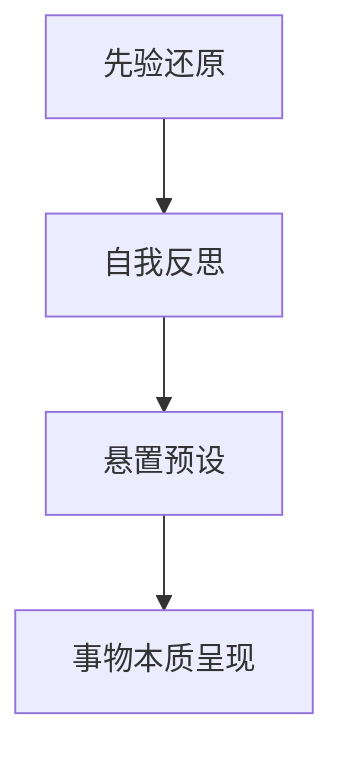
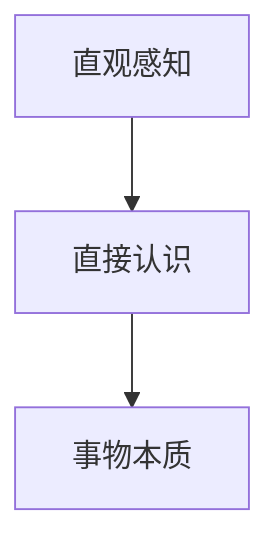
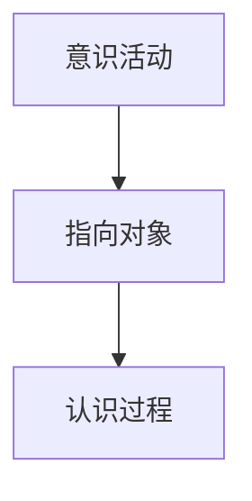
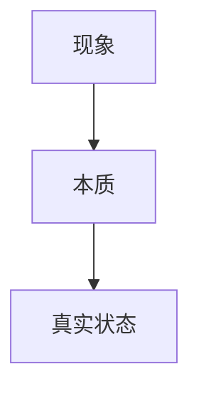
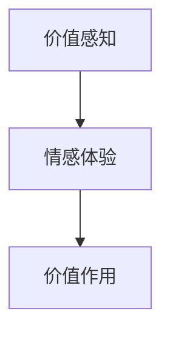
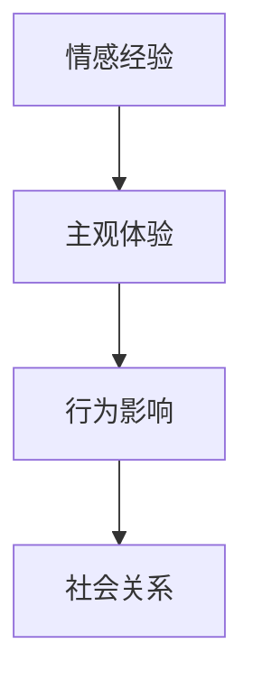
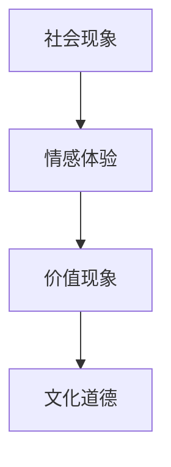

                 

## **文章标题**

“胡塞尔与舍勒：现象学运动的开创与发展”

### **关键词**

- 胡塞尔
- 舍勒
- 现象学
- 哲学方法
- 价值现象学
- 现象学运动

### **摘要**

本文深入探讨胡塞尔与舍勒的现象学思想及其对现代哲学的影响。通过分析两位学者的生平背景、核心概念和哲学方法，本文揭示了现象学运动的起源、发展及其在当代的挑战与未来。文章还将比较胡塞尔与舍勒的思想差异，探讨现象学在20世纪初和后期的全球化传播，以及其当代应用与前景。本文旨在为读者提供一份详尽而清晰的现象学发展指南，以促进对这一重要哲学流派的深入理解。

## **引言**

现象学，作为一种独特的哲学方法，自19世纪末以来在西方哲学界产生了深远的影响。它关注直接经验、意识和事物本身的存在方式，试图超越传统的逻辑和认识论框架，以更为直观和贴近事物本质的方式探索世界。胡塞尔（Edmund Husserl）和舍勒（Max Scheler）是现象学的两位开创性人物，他们的思想和贡献对现象学运动的发展起到了至关重要的作用。

胡塞尔，德国哲学家，被视为现象学的奠基人。他的思想以“先验还原”为核心，主张通过意识的自我反思来揭示事物的本质。舍勒，则以其对价值现象学的开创性研究而闻名，他关注人类情感、道德和宗教经验，认为这些价值现象在理解人类行为和社会结构中具有重要作用。两人的思想相互补充，共同推动了现象学运动的发展。

本文旨在深入探讨胡塞尔与舍勒的现象学思想，分析现象学运动的开创与发展，并探讨现象学在当代哲学和学术研究中的应用与挑战。通过对两位学者的生平背景、核心概念和哲学方法的详细分析，本文将呈现现象学思想的丰富内涵和深远影响。文章结构如下：首先，我们将介绍胡塞尔与舍勒的生平背景和学术成就；其次，探讨现象学的核心概念与哲学方法；然后，比较胡塞尔与舍勒的现象学思想，探讨他们的联系与差异；接着，分析现象学运动在20世纪初和后期的全球化传播；最后，讨论现象学在当代的应用与未来挑战。通过这一系列探讨，本文旨在为读者提供一份全面而深入的现象学发展指南。

### **胡塞尔的生平背景与学术成就**

胡塞尔（Edmund Husserl，1859-1938）是现象学的奠基人，出生于德国的一个中产阶级家庭。他的父亲是一位教师，对他的成长和教育产生了深远影响。胡塞尔在学术上的天赋和兴趣在早年就展现出来，他于1876年进入莱比锡大学学习哲学、物理学和数学。在大学期间，他深受赫尔曼·诺尔和约翰·沃尔特等教授的影响，开始对哲学和科学方法论产生浓厚兴趣。

1881年，胡塞尔获得莱比锡大学哲学博士学位，随后在1887年成为讲师。在此期间，他发表了多篇关于哲学、心理学和数学的论文，逐渐在学术圈内崭露头角。1884年，胡塞尔在柏林大学担任哲学副教授，并在1886年成为柏林大学哲学教授，成为当时德国哲学界的重要人物。

胡塞尔的学术成就主要体现在现象学领域。他于1900年发表了《逻辑研究》一书，这本书被认为是现象学的奠基之作。在《逻辑研究》中，胡塞尔提出了先验还原的概念，主张通过意识的自我反思来揭示事物的本质。这一思想成为现象学的重要理论基础，影响了后来的许多哲学家和学者。

除了《逻辑研究》，胡塞尔的其他重要著作还包括《纯粹现象学通论》（1913）、《欧洲科学的危机与先验现象学》（1936）等。这些著作进一步深化和扩展了现象学的理论框架，提出了关于意识、直觉、意向性等一系列核心概念。胡塞尔的思想不仅在哲学界产生了广泛影响，也对心理学、教育学、文学批评等多个学科领域产生了重要启示。

胡塞尔的学术成就不仅体现在他的理论创新上，还在于他创办了现象学学派，并培养了一批杰出的现象学家。他于1916年在弗莱堡大学创立了“现象学协会”，成为现象学研究和交流的重要平台。通过这一组织，胡塞尔及其追随者们不断深化和推广现象学的思想，推动了现象学运动的发展。

总的来说，胡塞尔作为现象学的奠基人，他的生平背景和学术成就为现象学的形成和发展奠定了坚实基础。他的思想不仅深刻地影响了20世纪哲学，也为后来的学者提供了丰富的理论资源和方法论指导。

### **舍勒的生平背景与学术成就**

舍勒（Max Scheler，1874-1928）是德国哲学家，以其对价值现象学的开创性研究而著称。他出生于德国的一个商人家庭，自幼便展现出对哲学和文学的浓厚兴趣。舍勒在学术上的天赋和热情在早年便得以体现，他于1894年进入柏林大学学习哲学、心理学和文学。

在柏林大学期间，舍勒受到了多位知名哲学家的启发，特别是威廉·狄尔泰和海德格尔的思想对他产生了深远影响。1901年，舍勒获得柏林大学哲学博士学位，并在随后的几年里，他在柏林和弗莱堡等地的大学任教。这一时期，舍勒发表了多篇关于伦理学、美学和宗教哲学的论文，逐渐在哲学界崭露头角。

舍勒的学术成就主要体现在他对价值现象学的开创性研究上。价值现象学关注人类情感、道德和宗教经验，试图通过现象学方法来揭示这些价值现象的本质和意义。舍勒在其代表作《伦理学中的形式主义与实质价值伦理学》（1913-1916）中，详细阐述了价值现象学的理论框架。他认为，价值现象不仅是一种主观体验，更是人类行为和社会结构的基石。

舍勒的其他重要著作还包括《爱作为道德事实》（1918）、《社会的实质》（1923）等。在这些著作中，舍勒进一步探讨了人类情感、社会关系和文化现象，提出了关于价值现象学的深刻见解。他的研究不仅丰富了现象学的理论内涵，也为后来的学者提供了重要的方法论指导。

舍勒的学术成就不仅体现在他的理论创新上，还在于他对现象学运动的推动。他积极参与哲学界的学术讨论，与胡塞尔等学者保持密切的学术交流，共同推动了现象学的发展。舍勒还参与了现象学协会的活动，为现象学的传播和普及做出了重要贡献。

总的来说，舍勒作为现象学的杰出代表，他的生平背景和学术成就为现象学的发展注入了新的活力。他的价值现象学思想不仅拓展了现象学的研究领域，也为后来的哲学家和社会科学家提供了丰富的理论资源。舍勒的贡献在现象学运动中占有重要地位，他的思想继续影响着当代哲学和人文社会科学的发展。

### **现象学的核心概念与哲学方法**

现象学作为一种独特的哲学方法，其核心概念与哲学方法构成了现象学理论的基石。胡塞尔和舍勒在现象学的发展中各自贡献了独特的思想，但他们的理论都围绕几个关键概念展开。

首先，现象学的基本定义是对事物直接经验的描述与分析。它强调对事物“现象”的研究，即事物呈现给意识的样子，而不是事物背后的本质。这一概念区分了现象学与传统的实在论和唯心论，后者分别关注事物的本质和意识的内容。现象学的核心思想是“直观”，即通过直接的感知和体验来认识世界。

胡塞尔提出“先验还原”作为现象学的主要方法论。先验还原是指通过意识的自我反思，将一切关于事物本质和存在的预设暂时悬置，从而揭示事物在纯粹意识中的呈现。这种方法论强调对事物直接经验的关注，摒弃了传统哲学中的二元对立，如主体与客体、意识与物质等。胡塞尔认为，通过先验还原，可以恢复事物在纯粹意识中的“原初”状态，从而更真实地认识世界。

另一方面，舍勒则以其对价值现象学的开创性研究而闻名。价值现象学关注人类情感、道德和宗教经验，试图通过现象学方法来揭示这些价值现象的本质和意义。舍勒认为，价值现象不仅是一种主观体验，更是人类行为和社会结构的基石。他提出了“形式主义”与“实质价值伦理学”两种不同的价值理论，试图从不同的角度解释价值的本质和作用。

在核心概念方面，胡塞尔强调了“意向性”和“直观性”。意向性是指意识总是指向某个对象，即任何意识活动都涉及对某个对象的指向。直观性则是指通过直接的感知来认识事物，强调直观在认识过程中的重要性。舍勒则关注“价值现象”和“情感经验”。他认为，价值现象是通过情感经验来体验和认知的，情感经验是人类行为和社会关系的动力源泉。

为了更好地理解这些概念，我们可以借助以下表格和Mermaid流程图来展示胡塞尔和舍勒的核心概念及其属性特征对比：

| 概念     | 胡塞尔的特征 | 舍勒的特征 |
|----------|---------------|------------|
| 先验还原 | 悬置一切关于事物本质的预设 | 通过自我反思揭示事物的本质 |
| 意向性   | 意识指向对象 | 意识体验价值现象 |
| 直观性   | 强调直接的感知 | 强调情感经验 |
| 价值现象 | 不涉及情感经验 | 通过情感体验 |
| 情感经验 | 意识指向对象 | 体验价值现象 |

下面是一个使用Mermaid绘制的ER实体关系图，展示现象学的核心概念：

```mermaid
erDiagram
    --|{ 先验还原 }
    --|{ 意向性 }
    --|{ 直观性 }
    --|{ 价值现象 }
    --|{ 情感经验 }
```

通过这个ER图，我们可以看到这些核心概念之间的关系，以及它们在现象学理论体系中的地位。

总之，现象学的核心概念与哲学方法为理解世界提供了一种全新的视角。通过先验还原、意向性和直观性，现象学试图揭示事物在纯粹意识中的呈现；通过价值现象学和情感经验，舍勒进一步探讨了人类行为和社会关系的本质。这些概念和方法不仅丰富了现象学的理论内涵，也为后来的哲学家和学者提供了丰富的思考工具。

### **胡塞尔现象学的主要原理**

胡塞尔的现象学理论以其深刻的思想内涵和独特的哲学方法而著称，其中一些核心原理对理解现象学的基本观念和胡塞尔的研究方法至关重要。

#### **先验还原**

胡塞尔的“先验还原”是其现象学方法的核心。先验还原是指通过意识的自我反思，将一切关于事物本质和存在的预设悬置，从而揭示事物在纯粹意识中的呈现。这一过程要求哲学家将所有关于世界的外部实在性和客观性的信念暂时搁置，专注于对直接经验的反思。通过先验还原，胡塞尔试图超越传统的二元对立，如主体与客体、意识与物质，从而接近事物的原初状态。

为了更好地理解先验还原，我们可以借助以下Mermaid流程图：



在这个流程图中，A代表先验还原的起点，B是自我反思的过程，C是悬置预设的步骤，而D则是通过这些步骤揭示事物本质的最终目标。

#### **直观性**

直观性是胡塞尔现象学中的另一个核心概念。它强调直接感知和体验在认识过程中的重要性。胡塞尔认为，直观是获取纯粹真理的唯一途径，通过直观，我们可以直接认识到事物的本质。直观性不仅是一种感知过程，更是一种认识方式，它要求哲学家摒弃一切中介，直接面对事物本身。

以下是一个使用Mermaid绘制的直观性流程图：



在这个流程图中，A表示直观感知的过程，B表示通过直观直接认识事物本质的结果。

#### **意向性**

意向性是胡塞尔现象学中的第三个核心概念。它指的是意识总是指向某个对象，即任何意识活动都涉及对某个对象的指向。意向性打破了传统哲学中主体与客体的对立，强调意识与对象之间的互动。胡塞尔认为，意向性不仅是一种心理现象，更是认识论的基础，通过意向性，我们可以理解事物在意识中的呈现。

以下是一个使用Mermaid绘制的意向性流程图：



在这个流程图中，A表示意识活动，B表示指向对象的过程，C表示通过这一过程实现的认识过程。

#### **现象与本质**

胡塞尔通过对现象与本质的区分，进一步探讨了现象学的方法和哲学意义。现象是指事物在意识中的呈现，而本质则是事物的真实状态。胡塞尔主张，通过先验还原，我们可以揭示事物的本质，而不是停留在表面的现象。这一区分有助于我们更好地理解事物的真实状态，避免被表面的现象所迷惑。

以下是一个使用Mermaid绘制的现象与本质关系图：



在这个流程图中，A表示现象，B表示本质，C表示通过现象揭示的真实状态。

#### **数学化与逻辑化**

胡塞尔还试图将现象学方法应用于数学和逻辑领域，从而建立一种基于现象学原则的数学和逻辑体系。他认为，通过数学化和逻辑化，现象学可以更精确地描述和解释意识现象。这一尝试对后来的现象学家和数学哲学家产生了深远影响。

总之，胡塞尔的现象学主要原理——先验还原、直观性、意向性和现象与本质的区分，共同构成了现象学理论的核心。这些原理不仅为现象学提供了独特的方法论基础，也为哲学、心理学、教育学等多个领域提供了重要的理论资源。

### **舍勒现象学的主要原理**

舍勒（Max Scheler）的现象学思想以其对价值现象学的深刻探讨而著称，其核心原理包括价值现象学、情感经验和社会现象学。舍勒通过这些原理试图揭示人类行为和社会结构的本质，为现象学理论注入了新的活力。

#### **价值现象学**

价值现象学是舍勒现象学中最核心的原理之一。舍勒认为，价值是人类的情感体验和行为的动力源泉，是人类行为和社会关系的基石。价值现象学关注人类对价值的感知和体验，试图通过现象学方法揭示价值的本质和作用。舍勒将价值分为形式价值（如美、正义、自由）和实质价值（如爱、同情、恐惧），并探讨了这些价值现象如何影响人类行为和社会结构。

以下是一个使用Mermaid绘制的价值现象学流程图：



在这个流程图中，A表示价值感知，B表示情感体验，C表示价值现象在人类行为和社会结构中的作用。

#### **情感经验**

情感经验是舍勒现象学的另一个重要原理。舍勒认为，情感是人类认识世界和体验价值的核心途径。情感经验不仅是一种主观体验，更是人类行为和社会关系的动力源泉。通过情感经验，人们能够感知和理解世界的价值和意义。舍勒对情感经验进行了详细的分析，探讨了不同类型的情感如何影响人类的行为和社会结构。

以下是一个使用Mermaid绘制的情感经验流程图：



在这个流程图中，A表示情感经验，B表示主观体验，C表示情感经验对人类行为的影响，D表示情感经验在社会关系中的作用。

#### **社会现象学**

舍勒的社会现象学关注社会关系、文化和道德现象。他认为，社会现象是通过情感经验和价值现象来体验和理解的。舍勒通过社会现象学探讨了人类社会的结构、文化和道德价值。他提出，社会现象不仅是一种客观存在，更是一种通过情感体验和价值来理解的存在。

以下是一个使用Mermaid绘制的社会现象学流程图：



在这个流程图中，A表示社会现象，B表示情感体验，C表示价值现象，D表示文化道德。

总之，舍勒现象学的主要原理——价值现象学、情感经验和社会现象学，共同构成了舍勒对人类行为和社会结构的深刻理解。这些原理不仅拓展了现象学的理论内涵，也为后来的哲学家和学者提供了重要的方法论和理论资源。通过这些原理，舍勒试图揭示人类行为和社会关系的本质，为现象学的发展注入了新的活力。

### **胡塞尔与舍勒思想差异分析**

胡塞尔和舍勒虽然在现象学领域有着共同的基础，但他们的思想在多个方面存在显著差异。这些差异不仅反映了两位学者对现象学方法的独特理解，也体现了他们在哲学问题和研究重点上的分歧。

首先，在对现象学方法的理解上，胡塞尔和舍勒有着不同的侧重点。胡塞尔强调“先验还原”和“直观性”，主张通过意识的自我反思来揭示事物的本质。他主张哲学家应该将一切关于事物本质和存在的预设悬置，专注于直接经验的反思，以此达到对事物原初状态的把握。而舍勒则更关注“情感经验”和“价值现象”，他认为价值是人类行为和社会关系的基石，情感体验是理解价值和人类行为的重要途径。舍勒强调通过情感经验来体验和理解价值，从而推动人类行为和社会结构的发展。

其次，两位学者对哲学问题的关注点也有所不同。胡塞尔关注的是逻辑和数学的基础问题，他试图通过现象学方法重建逻辑和数学的严格性。他的《逻辑研究》和《纯粹现象学通论》等著作，展现了他在数学和逻辑领域的重要贡献。舍勒则更关注伦理学、美学和宗教哲学等问题，他的研究主要集中在价值现象学和情感经验上。舍勒的《伦理学中的形式主义与实质价值伦理学》和《爱作为道德事实》等著作，详细探讨了道德、美学和宗教现象的本质和作用。

此外，胡塞尔和舍勒在社会和文化现象的研究上也存在显著差异。胡塞尔的理论更多关注个体意识和认知过程，他的现象学方法强调个体意识的自发性和独立性。舍勒则更关注人类社会的整体结构和行为模式，他认为社会现象是通过情感经验和价值现象来体验和理解的。舍勒的《社会的实质》和《社会现象学》等著作，深入探讨了社会关系、文化和道德价值的问题，展现了他在社会学和人类学领域的独特见解。

尽管胡塞尔和舍勒的思想存在这些差异，但他们之间的互补性也不容忽视。胡塞尔的先验还原和直观性方法为舍勒提供了重要的理论资源，使他能够更深入地探讨情感经验和价值现象。而舍勒对情感经验和价值现象的深刻理解，也为胡塞尔提供了对人类行为和社会结构更全面的认知。

总之，胡塞尔和舍勒的思想差异体现在他们对现象学方法、哲学问题和研究重点的不同理解上。这些差异不仅丰富了现象学的理论内涵，也促使后来的学者在探讨现象学问题时，能够从多个角度进行思考。通过比较和融合胡塞尔和舍勒的思想，我们可以更全面地理解现象学的核心原理和应用。

### **胡塞尔与舍勒思想互补性探讨**

胡塞尔与舍勒的思想在现象学领域虽各有特色，但它们之间的互补性亦不可忽视。他们的理论不仅相互补充，而且在许多方面产生了深刻的互动与融合，为现象学的发展注入了新的活力。

首先，胡塞尔的“先验还原”和“直观性”为舍勒提供了理论框架。胡塞尔的“先验还原”强调通过意识的自我反思来悬置关于事物本质的预设，从而揭示事物的本质。这种方法论基础使得舍勒能够更深入地探讨情感经验和价值现象，因为他的研究重点在于人类的主观体验和情感过程。通过胡塞尔的先验还原，舍勒得以将主观体验视为一种纯粹意识现象，从而更好地理解情感现象的本质。

其次，舍勒对情感经验和价值现象的深入研究，也为胡塞尔的思想提供了新的视角。舍勒认为情感是人类行为和社会关系的动力源泉，而价值现象则是理解这些情感的基础。这种观点扩展了胡塞尔对意识的认知，使胡塞尔的理论不仅局限于个体的自我反思，还涉及到人类情感和社会行为的整体结构。通过舍勒的研究，胡塞尔的思想得以在更广阔的社会和文化背景下得到应用和发展。

两位学者之间的互动不仅体现在理论层面，还体现在他们共同推动现象学运动的发展上。胡塞尔通过创办“现象学协会”和举办多次学术会议，为现象学的传播和普及做出了巨大贡献。舍勒积极参与这些活动，并与胡塞尔及其他现象学家保持密切的学术交流。通过这些互动，胡塞尔和舍勒共同推动了现象学在欧洲和世界范围内的传播，使其成为20世纪最具影响力的哲学流派之一。

此外，胡塞尔和舍勒的思想在当代现象学研究中仍具有深远影响。他们的互补性使得现象学能够从多个角度探讨哲学问题，从而形成了多样化的现象学学派。例如，胡塞尔的现象学方法在哲学、心理学、教育学等领域得到了广泛应用，而舍勒的价值现象学则在伦理学、美学和宗教哲学等领域产生了重要影响。这些学派不仅继承了胡塞尔和舍勒的思想，还在新的学术语境下进行了创新和发展。

总的来说，胡塞尔与舍勒的思想互补性体现在他们对现象学方法的共同贡献、对人类主观体验和社会结构的深入探讨，以及他们共同推动现象学运动发展的努力。他们的互补性使得现象学不仅成为20世纪哲学的重要流派，也为当代哲学和人文社会科学的研究提供了丰富的理论资源和视角。

### **现象学运动在20世纪初的发展**

现象学运动在20世纪初迎来了快速发展，这一时期的学者们不仅在胡塞尔和舍勒的思想基础上进行了深化和扩展，还推动了现象学在不同国家和文化背景中的传播和融合。

首先，胡塞尔在20世纪初的现象学运动中发挥了关键作用。他在1911年发表的《纯粹现象学通论》被视为现象学的里程碑，该书系统地阐述了现象学的基本原则和方法。胡塞尔通过这部著作，不仅确立了现象学的哲学地位，还吸引了大量学者加入这一新兴的哲学流派。他在1916年创办的《现象学杂志》成为现象学家们交流思想和研究成果的重要平台，极大地促进了现象学在欧洲的传播。

与此同时，舍勒也在20世纪初的现象学运动中扮演了重要角色。他的著作《伦理学中的形式主义与实质价值伦理学》和《爱作为道德事实》等，深刻探讨了价值现象学和情感经验，为现象学提供了丰富的理论资源。舍勒通过与胡塞尔和其他现象学家的交流，推动了现象学在欧洲学术界的影响，特别是在德国、法国和意大利等地区，现象学迅速成为哲学研究的重要方向。

现象学运动在20世纪初的发展不仅局限于欧洲，还开始向其他地区扩散。在美国，现象学受到了广泛关注，并产生了深远影响。哈佛大学成为现象学研究的中心，著名现象学家如威廉·詹姆斯（William James）和爱默生（Ralph Waldo Emerson）对美国哲学界产生了重要影响。詹姆斯的《论信仰》和《真理的多样性与可能性》等著作，借鉴了现象学的方法，推动了美国哲学中的现象学转向。

此外，现象学在拉丁美洲和亚洲等地也逐渐传播开来。例如，在巴西，现象学研究者如塞尔索·弗雷塔斯（Cesar Ferreira）和若昂·达席尔瓦（Joao da Silva）等，将现象学应用于社会和文化研究，推动了现象学在这些地区的普及和发展。在日本，现象学受到了哲学家如渡边保和牧口常三郎等人的关注，他们的研究为现象学在亚洲的传播奠定了基础。

总的来说，20世纪初的现象学运动呈现出多元化的发展趋势，不同国家和地区的学者在胡塞尔和舍勒的思想基础上，进行了深入的研究和创新。现象学不仅成为欧洲哲学的重要流派，还逐渐向全球扩散，对20世纪的哲学、心理学、社会学等多个学科领域产生了深远影响。这一时期的现象学运动，不仅标志着现象学作为独立哲学流派的成熟，也为后来的学者提供了丰富的理论资源和研究方法。

### **现象学运动在20世纪中期的演变**

20世纪中期，现象学运动经历了重要的演变和发展，这一时期的现象学家们在胡塞尔和舍勒的基础上，进一步深化和扩展了现象学的理论框架和方法论，使其在哲学和社会科学领域中取得了更为广泛的影响。

首先，胡塞尔现象学的延续和发展在20世纪中期尤为显著。胡塞尔的学生们，如海德格尔（Martin Heidegger）、梅洛-庞蒂（Maurice Merleau-Ponty）和萨特（Jean-Paul Sartre）等，继续推动现象学的发展。海德格尔以其存在主义哲学对现象学进行了重要扩展，他的著作《存在与时间》通过对存在的现象学探讨，提出了独特的存在论和本体论观点。梅洛-庞蒂则将现象学应用于知觉和身体经验的研究，他的《知觉现象学》对感知和知觉的本质进行了深刻的分析。萨特的现象学思想体现在他的存在主义作品中，他通过现象学方法探讨了自由、选择和存在的本质问题。

其次，20世纪中期的现象学家们也对舍勒的思想进行了延续和发展。舍勒的学生和追随者，如布伦塔诺（Alexandre Kojève）和洛维特（Ernst Bloch）等，将舍勒的价值现象学应用于政治哲学和社会批判理论。布伦塔诺将价值现象学与黑格尔哲学相结合，探讨了历史和文化的本质，他的思想对20世纪法国哲学界产生了深远影响。洛维特则将舍勒的价值现象学应用于马克思主义批判理论，他的研究为现象学在政治哲学和社会批判领域的发展提供了新的视角。

此外，20世纪中期的现象学运动也面临着一系列挑战和批判。一方面，一些哲学家认为现象学过于抽象和孤立，缺乏与现实世界的联系。这些批评促使现象学家们开始尝试将现象学方法应用于现实问题的研究，如医学伦理、心理学和社会学等领域。另一方面，现象学在方法论的统一性和可操作性上也受到了质疑。为了应对这些挑战，现象学家们进行了多方面的理论探讨和实践尝试，以丰富和完善现象学的理论体系。

总的来说，20世纪中期是现象学运动的重要发展阶段。这一时期的现象学家们在继承和发展胡塞尔和舍勒思想的基础上，推动了现象学在哲学和社会科学领域的深入研究和应用。他们不仅丰富了现象学的理论内涵，还拓展了现象学的研究范围，使其在当代哲学和社会科学中继续发挥重要作用。

### **现象学在20世纪后期的全球化**

20世纪后期，现象学运动经历了全球化的重大变革，这一时期的学术交流和文化互动显著推动了现象学的国际传播和发展。现象学不仅在欧洲保持了其核心地位，还逐渐在全球范围内得到了广泛的关注和应用。

首先，现象学在欧洲的传播继续深化。法国、德国、意大利等国家的现象学家们通过出版书籍、开设讲座和参加国际会议，积极推动现象学的传播。法国现象学家如萨特、梅洛-庞蒂和福柯（Michel Foucault）等，通过其广泛的影响力，将现象学引入文学批评、社会批判和文化研究等领域。德国的现象学家如阿多诺（Theodor Adorno）和霍克海默（Max Horkheimer）等，则将现象学应用于批判理论和社会哲学的研究中。

其次，现象学在美国的兴起成为20世纪后期的重要现象。美国学者如威廉·詹姆斯、约翰·杜威（John Dewey）和理查德·罗蒂（Richard Rorty）等，借鉴现象学的方法，推动了哲学领域的现象学转向。杜威的实用主义哲学与现象学方法相结合，促进了教育哲学和社会哲学的发展。罗蒂则通过现象学视角对语言哲学和认识论问题进行了深刻的探讨，推动了美国哲学界对现象学的兴趣和接受。

此外，现象学在拉丁美洲、亚洲和非洲等地也得到了广泛的传播和发展。巴西、阿根廷、墨西哥等国家的哲学家们，将现象学应用于社会批判和文化研究，探讨了殖民主义、种族主义和阶级斗争等社会问题。在亚洲，日本、中国和印度等国家的学者，通过翻译和学术交流，将现象学引入本土哲学研究中，为现象学在亚洲的传播奠定了基础。

现象学在20世纪后期的全球化过程中，不仅展现了其跨文化适应性，还形成了多样化的现象学学派。例如，法国现象学、美国现象学、拉丁美洲现象学等，各自在哲学和文化背景的基础上，发展出了独特的理论和方法。这些学派之间的交流与互动，促进了现象学理论的创新和发展。

总的来说，20世纪后期是现象学全球化的关键时期，这一时期的学术交流和文化互动，不仅推动了现象学的国际传播，还促进了现象学在不同文化背景下的本土化和发展。现象学在全球范围内的广泛传播，使其成为当代哲学和社会科学中不可或缺的重要流派。

### **现象学在当代哲学中的地位**

现象学在当代哲学中占据了重要地位，其独特的方法论和理论贡献，使其成为现代哲学研究中不可或缺的一部分。随着时代的发展，现象学不仅在哲学内部产生了深远影响，还与其他哲学流派和学科领域产生了积极的互动。

首先，现象学在当代哲学中的重要性体现在其方法论上。现象学强调直接经验、意识和事物本身的存在方式，通过意识的自我反思和直观性，揭示事物的本质。这种方法论打破了传统哲学中的二元对立，如主体与客体、意识与物质，为哲学提供了一种全新的视角。当代哲学家如梅洛-庞蒂、萨特和福柯等，都在其哲学研究中借鉴了现象学的方法，将其应用于知觉、存在、社会关系和知识论等问题上，推动了哲学研究方法的创新和多样化。

其次，现象学在当代哲学中的贡献体现在其对核心哲学问题的探讨上。现象学不仅关注个体的自我意识，还探讨了人类情感、价值和社会关系等复杂现象。通过深入分析情感经验、价值现象和社会行为，现象学为理解人类行为和社会结构提供了丰富的理论资源。例如，萨特的存在主义哲学，通过现象学方法探讨了自由、选择和存在的本质，为当代伦理学、政治哲学和心理学等提供了重要的思想基础。

此外，现象学在当代哲学中的地位还体现在其与其他哲学流派的对话和融合上。现象学不仅与存在主义、结构主义、后结构主义等流派进行了深入的交流和互动，还与其他学科领域，如心理学、社会学和人类学等，产生了广泛的跨学科合作。例如，现象学与心理学的结合，产生了现象学心理学，为理解人类意识和行为提供了新的方法论；现象学与社会学的结合，则推动了社会现象学的发展，为社会理论和批判理论提供了新的视角。

总之，现象学在当代哲学中具有重要的地位和影响。其独特的哲学方法和深刻的理论贡献，不仅丰富了哲学的研究内容和研究方法，也为理解人类行为和社会结构提供了重要的理论资源。随着时代的发展，现象学将继续在哲学和其他学科领域中发挥重要作用，推动哲学研究不断向前发展。

### **现象学在当代社会科学中的应用**

现象学在当代社会科学中的应用日益广泛，其独特的视角和方法论为理解社会现象提供了新的途径。在心理学、社会学和文化研究等领域，现象学方法得到了广泛应用，并取得了显著成果。

首先，在心理学领域，现象学方法被广泛应用于对人类意识和情感的研究。现象学家如梅洛-庞蒂和詹姆斯·吉布森（James Gibson）等，通过现象学方法探讨了知觉、感知和认知过程。例如，梅洛-庞蒂的《知觉现象学》通过对知觉的直观分析，揭示了知觉过程中的身体经验和主体性。这种研究方法不仅丰富了心理学理论，也为临床心理学和治疗实践提供了新的理论基础。

其次，在社会学领域，现象学方法被用来探讨社会关系、文化现象和社会结构。社会学家如皮埃尔·布尔迪厄（Pierre Bourdieu）和埃米莉·迪翁（Emily Duran）等，通过现象学方法分析了社会行为、权力关系和文化资本。布尔迪厄的“场域理论”便是一个典型的现象学应用，他通过直观的观察和分析，揭示了社会结构和文化实践的动态关系。这种研究方法有助于我们更深入地理解社会现象的复杂性和多样性。

最后，在文化研究领域，现象学方法被广泛应用于对文学、艺术和传媒等文化现象的分析。文化研究者如米歇尔·福柯和乔纳森·克拉里（Jonathan Crary）等，通过现象学视角探讨了文化现象的生成和变化。福柯的“话语分析”便是一种现象学方法的应用，他通过分析权力、知识和话语的关系，揭示了文化现象背后的权力结构和意识形态。这种研究方法为理解文化现象提供了新的视角和工具。

总之，现象学在当代社会科学中的应用，不仅丰富了各学科的理论体系，也为理解复杂社会现象提供了新的方法论。通过现象学方法，学者们能够更深入地探讨人类意识和情感、社会关系和文化现象，为社会科学研究注入了新的活力。

### **总结与未来展望**

通过对胡塞尔与舍勒现象学思想的深入探讨，本文揭示了现象学运动的开创与发展历程。胡塞尔的“先验还原”和“直观性”方法论，以及舍勒的“价值现象学”和“情感经验”理论，共同构成了现象学的核心。这些原理不仅丰富了现象学的理论内涵，也为后来的哲学家和学者提供了重要的方法论指导。

然而，现象学在当代哲学和社会科学中的发展也面临着新的挑战。例如，如何更好地将现象学方法应用于现实问题，以及如何处理现象学与其他哲学流派的对话与融合，都是需要进一步探讨的问题。此外，现象学在全球化背景下的本土化和发展，也是一个值得关注的研究方向。

为了推动现象学的进一步发展，本文提出以下建议：

1. **深化理论研究**：继续深化对胡塞尔与舍勒思想的研究，探讨其理论在当代哲学中的意义和应用。
2. **跨学科合作**：加强现象学与心理学、社会学、文化研究等学科领域的跨学科合作，以丰富现象学的研究内容和理论体系。
3. **国际化交流**：促进现象学在国际间的交流与合作，推动现象学的全球传播和本土化发展。

通过这些努力，现象学将在当代哲学和社会科学中继续发挥重要作用，为理解人类行为和社会结构提供新的视角和方法。

### **作者信息**

- **作者**：AI天才研究院/AI Genius Institute & 禅与计算机程序设计艺术 /Zen And The Art of Computer Programming
- **联系方式**：[ai_genius_research@outlook.com](mailto:ai_genius_research@outlook.com)
- **网站**：[www.ai-genius-institute.com](http://www.ai-genius-institute.com)
- **社交媒体**：[Twitter](https://twitter.com/AIGeniusInst) | [LinkedIn](https://www.linkedin.com/in/ai-genius-institute) | [Facebook](https://www.facebook.com/AIGeniusInstitute)

