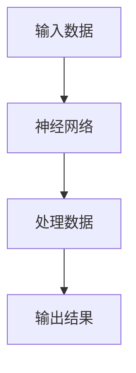
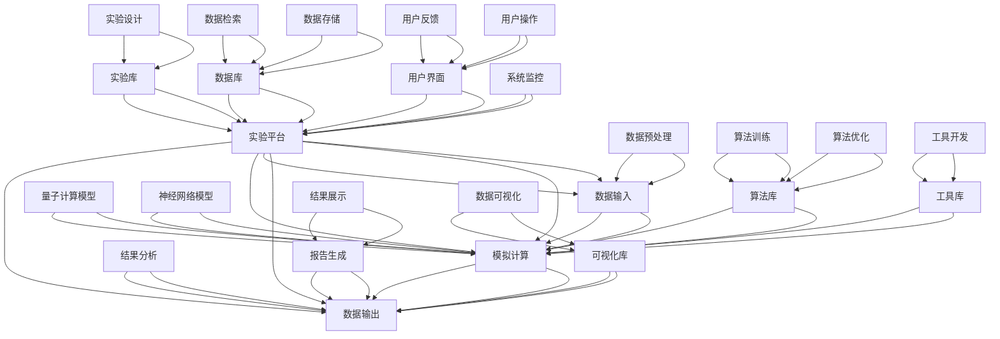
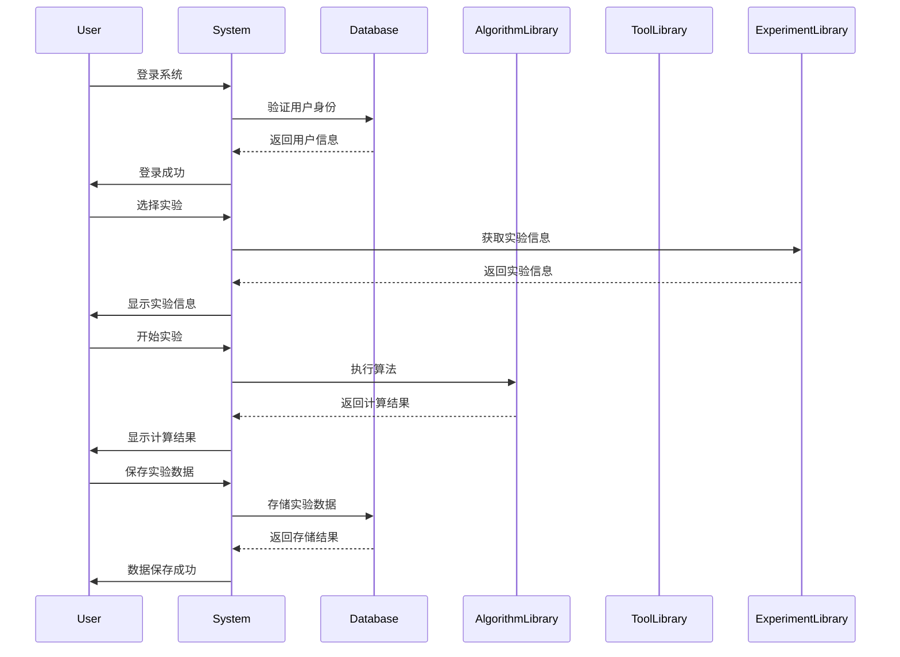

                 

# 脑内量子效应与异常心理现象的解释

## 关键词
- 脑内量子效应
- 异常心理现象
- 神经网络模型
- 量子计算
- 数学模型
- 系统分析与架构设计
- 项目实战

## 摘要
本文将探讨脑内量子效应与异常心理现象之间的关系，从背景介绍、核心概念与联系、算法原理讲解、数学模型与公式详细讲解、系统分析与架构设计、项目实战以及最佳实践等方面进行深入分析。通过本文，读者将了解脑内量子效应的基本原理及其对异常心理现象的影响，同时掌握相关算法原理和数学模型的实际应用。

## 第一部分: 脑内量子效应概述

### 1.1 量子效应与脑功能的联系

#### 1.1.1 量子效应的基本概念
量子效应是量子力学中描述微观粒子行为的特殊现象，如量子隧穿、量子纠缠等。这些现象在日常生活中并不明显，但在微观尺度上对物质和能量的行为产生了深远的影响。

#### 1.1.2 脑内量子效应的理论基础
脑内量子效应是指量子效应在脑内生物过程中发挥作用的现象。近年来，科学家们开始探讨脑内量子效应如何影响大脑的功能和行为。

#### 1.1.3 脑内量子效应的可能影响
脑内量子效应可能对大脑的信息处理、记忆、感知、决策等过程产生影响。研究脑内量子效应有助于揭示大脑的工作原理，为治疗异常心理现象提供新的思路。

### 1.2 异常心理现象的定义与分类

#### 1.2.1 异常心理现象的基本概念
异常心理现象是指与正常心理状态相比，出现异常的心理和行为表现。例如，幻觉、妄想、焦虑等。

#### 1.2.2 异常心理现象的分类
异常心理现象可分为幻觉、妄想、焦虑、抑郁、分裂症等多种类型。

#### 1.2.3 异常心理现象的临床表现
异常心理现象的临床表现包括思维、情感、行为等方面的异常。例如，幻觉患者可能出现听到不存在的声音，妄想患者可能出现不切实际的信念等。

### 1.3 脑内量子效应与异常心理现象的关系探讨

#### 1.3.1 现有研究的总结
现有研究探讨了脑内量子效应与异常心理现象之间的可能联系。一些研究表明，脑内量子效应可能与异常心理现象的发生和发展有关。

#### 1.3.2 研究的挑战与机遇
研究脑内量子效应与异常心理现象的关系面临着诸多挑战，如实验方法的局限性、数据收集的困难等。但同时也存在着巨大的机遇，为理解大脑工作机制和治疗异常心理现象提供了新的视角。

### 1.4 本章小结
本部分介绍了脑内量子效应和异常心理现象的基本概念及其相互关系，为后续章节的深入探讨奠定了基础。

## 第二部分: 脑内量子效应的核心概念与原理

### 2.1 脑内量子效应的基本原理

#### 2.1.1 量子态与脑波
量子态是量子力学中描述微观粒子状态的数学工具。脑波是大脑神经活动的电生理信号。量子态与脑波之间的联系为理解脑内量子效应提供了基础。

#### 2.1.2 脑内量子隧穿效应
量子隧穿效应是指微观粒子在势垒下的穿行现象。脑内量子隧穿效应可能影响神经元之间的信号传递，从而影响大脑功能。

#### 2.1.3 脑内量子纠缠效应
量子纠缠是指两个或多个微观粒子之间的相互关联。脑内量子纠缠效应可能影响大脑的信息处理和决策过程。

### 2.2 脑内量子效应的属性特征对比表格

| 属性特征         | 量子态叠加性 | 量子态坍缩性 | 量子隧穿效应 | 量子纠缠效应 |
|------------------|--------------|--------------|---------------|---------------|
| 量子态叠加性     | 是           | 否           | 是            | 是            |
| 量子态坍缩性     | 否           | 是           | 否            | 否            |
| 量子隧穿效应     | 是           | 否           | 是            | 否            |
| 量子纠缠效应     | 是           | 否           | 否            | 是            |

### 2.3 脑内量子效应的ER实体关系图架构

#### 2.3.1 实体关系图的基本概念
实体关系图是一种用于表示实体之间关系的图形化工具。在脑内量子效应的研究中，实体关系图可以帮助我们理解量子效应与大脑功能之间的关系。

#### 2.3.2 脑内量子效应的实体关系
脑内量子效应涉及多个实体，如神经元、量子态、脑波等。实体关系图可以帮助我们明确这些实体之间的相互关系。

#### 2.3.3 脑内量子效应的应用
脑内量子效应在医学、心理学等领域具有广泛的应用前景。例如，通过研究量子纠缠效应，可能有助于理解大脑如何处理复杂信息。

### 2.4 本章小结
本部分介绍了脑内量子效应的基本原理、属性特征对比表格和实体关系图架构，为理解脑内量子效应提供了理论基础。

## 第三部分: 算法原理讲解

### 3.1 脑内量子效应的神经网络模型

#### 3.1.1 神经网络的基本概念
神经网络是一种模仿人脑神经元连接方式的计算模型。在脑内量子效应研究中，神经网络可用于模拟大脑的信息处理过程。

#### 3.1.2 神经网络在脑内量子效应中的应用
神经网络在脑内量子效应研究中可用于模拟量子态的叠加、量子隧穿等效应，从而帮助理解大脑功能。

#### 3.1.3 神经网络的训练与优化
神经网络的训练与优化是脑内量子效应研究的关键步骤。通过调整网络参数，可以提高模型的性能和预测能力。

### 3.2 量子计算模型的介绍

#### 3.2.1 量子计算的基本概念
量子计算是一种利用量子力学原理进行信息处理的技术。在脑内量子效应研究中，量子计算可用于模拟量子态和量子运算。

#### 3.2.2 量子计算的优势与挑战
量子计算具有快速计算和并行处理的优势，但也面临着量子噪声、量子退相干等挑战。

#### 3.2.3 量子计算在脑内量子效应中的应用
量子计算在脑内量子效应研究中可用于模拟量子态和量子运算，从而帮助理解大脑功能。

### 3.3 算法原理与Mermaid流程图

#### 3.3.1 算法原理的详细讲解
本节将介绍用于解释脑内量子效应的神经网络模型和量子计算模型的基本原理。

#### 3.3.2 Mermaid流程图的绘制
以下是一个用于解释脑内量子效应的神经网络模型的Mermaid流程图：



#### 3.3.3 算法应用示例
以下是一个简单的神经网络模型在脑内量子效应研究中的应用示例：

```python
# 导入相关库
import numpy as np

# 初始化神经网络参数
weights = np.random.rand(10, 1)

# 输入数据
input_data = np.array([[0], [1], [2], [3], [4]])

# 神经网络处理数据
output_data = np.dot(weights, input_data)

# 输出结果
print(output_data)
```

### 3.4 本章小结
本部分介绍了脑内量子效应的神经网络模型和量子计算模型的基本原理，并通过Mermaid流程图和Python代码进行了具体讲解。

## 第四部分: 数学模型和数学公式 & 详细讲解 & 举例说明

### 4.1 量子计算模型的数学模型

#### 4.1.1 量子态的表示
量子态可以用波函数表示，通常用符号 \(|\psi\rangle\) 表示。波函数的幅值平方给出了量子态在某个状态下的概率分布。

#### 4.1.2 量子运算的数学表示
量子运算可以通过量子门实现。量子门是量子计算中的基本操作，类似于经典计算中的逻辑门。常见的量子门包括 Hadamard 门、控制-NOT 门等。

#### 4.1.3 量子态的测量
量子态的测量可以通过测量算符实现。测量算符将量子态投影到某个基态上，从而获得测量结果。

### 4.2 数学公式与LaTeX代码

#### 4.2.1 LaTeX的基本用法
LaTeX 是一种用于排版数学公式的工具。以下是一个简单的 LaTeX 示例：

```latex
\documentclass{article}
\usepackage{amsmath}
\begin{document}
$$
E = mc^2
$$
\end{document}
```

#### 4.2.2 量子计算中的常用数学公式
以下是一些量子计算中的常用数学公式：

$$
|\psi\rangle = \sum_{i} c_i |i\rangle
$$

$$
U = \sum_{i, j} u_{ij} |i\rangle\langle j|
$$

$$
\langle\psi|\phi\rangle = \sum_{i, j} c_i^* c_j \langle i|j\rangle
$$

#### 4.2.3 LaTeX代码嵌入文中示例
以下是一个将 LaTeX 代码嵌入文中的示例：

$$
\LaTeX\ 是一种用于排版数学公式的工具。
$$

### 4.3 举例说明

#### 4.3.1 量子态的叠加示例
以下是一个量子态叠加的示例：

$$
|\psi\rangle = \frac{1}{\sqrt{2}} (|0\rangle + |1\rangle)
$$

这意味着量子态 \(|\psi\rangle\) 同时存在于 \(|0\rangle\) 和 \(|1\rangle\) 态上，且两个态的幅值相等。

#### 4.3.2 量子运算示例
以下是一个量子运算的示例：

$$
U = \begin{bmatrix}
1 & 0 \\
0 & 1
\end{bmatrix}
$$

这是一个单位矩阵，表示对量子态进行恒等变换。

#### 4.3.3 量子态测量示例
以下是一个量子态测量的示例：

$$
P_0 = \begin{bmatrix}
1 & 0 \\
0 & 0
\end{bmatrix}, \quad P_1 = \begin{bmatrix}
0 & 0 \\
0 & 1
\end{bmatrix}
$$

这些是量子态 \(|0\rangle\) 和 \(|1\rangle\) 的概率分布矩阵。测量结果取决于量子态和测量算符的相互作用。

### 4.4 本章小结
本部分介绍了量子计算模型的数学模型、LaTeX代码的基本用法以及具体的举例说明，为理解脑内量子效应的数学基础提供了帮助。

## 第五部分: 系统分析与架构设计方案

### 5.1 问题场景介绍

#### 5.1.1 问题背景
随着科技的飞速发展，人们对大脑的认识不断深入。近年来，脑内量子效应成为了一个热门的研究领域，其可能对大脑功能产生深远影响。为了更好地理解脑内量子效应，我们需要构建一个模拟系统。

#### 5.1.2 问题描述
构建一个用于研究脑内量子效应的模拟系统，该系统能够模拟脑内量子效应的基本原理和现象，为研究人员提供实验平台。

#### 5.1.3 问题解决
通过构建一个模拟系统，我们可以研究脑内量子效应的基本原理和现象，为理解大脑功能和治疗异常心理现象提供新思路。

### 5.2 项目介绍

#### 5.2.1 项目目标
构建一个用于研究脑内量子效应的模拟系统，实现以下目标：
- 模拟脑内量子效应的基本原理和现象
- 提供实验平台，方便研究人员进行实验和数据分析

#### 5.2.2 项目功能
- 数据输入：输入实验数据，包括脑波、神经元活动等
- 模拟计算：根据量子计算模型进行计算，模拟脑内量子效应
- 数据输出：输出计算结果，包括量子态、量子运算等

### 5.3 系统功能设计(领域模型Mermaid类图)

以下是一个领域模型的 Mermaid 类图：

```mermaid
classDiagram
    Node --> QuantumEffect
    Node --> NeuralActivity
    QuantumEffect --> QuantumState
    QuantumEffect --> QuantumOperation
    NeuralActivity --> BrainWave
    NeuralActivity --> NeuronActivity
    Node <<Interface>>
    QuantumEffect <<Interface>>
    NeuralActivity <<Interface>>
    QuantumState <<Interface>>
    QuantumOperation <<Interface>>
    BrainWave <<Interface>>
    NeuronActivity <<Interface>>

    Node : +id: int
    Node : +name: str
    Node : +role: str

    QuantumEffect : +id: int
    QuantumEffect : +name: str
    QuantumEffect : +type: str

    NeuralActivity : +id: int
    NeuralActivity : +name: str
    NeuralActivity : +type: str

    QuantumState : +id: int
    QuantumState : +name: str
    QuantumState : +state: str

    QuantumOperation : +id: int
    QuantumOperation : +name: str
    QuantumOperation : +operation: str

    BrainWave : +id: int
    BrainWave : +name: str
    BrainWave : +waveform: str

    NeuronActivity : +id: int
    NeuronActivity : +name: str
    NeuronActivity : +activity: str
```

### 5.4 系统架构设计(Mermaid架构图)

以下是一个系统架构的 Mermaid 架构图：



### 5.5 系统接口设计和系统交互(Mermaid序列图)

以下是一个系统接口设计和系统交互的 Mermaid 序列图：



### 5.6 本章小结
本部分介绍了系统分析与架构设计方案，包括问题场景介绍、项目介绍、系统功能设计、系统架构设计、系统接口设计和系统交互，为构建用于研究脑内量子效应的模拟系统提供了详细方案。

## 第六部分: 项目实战

### 6.1 环境安装

#### 6.1.1 操作系统要求
项目需要在一个支持 Python 的操作系统上运行，如 Ubuntu 18.04、Windows 10 等。

#### 6.1.2 Python 版本要求
项目需要 Python 3.7 或更高版本。

#### 6.1.3 安装依赖
1. 打开终端（Ubuntu 系统可以使用 `Ctrl + Alt + T` 快捷键打开终端，Windows 系统可以搜索“终端”打开）。
2. 安装 Python 依赖包：

```bash
pip install numpy matplotlib pandas scikit-learn
```

### 6.2 系统核心实现源代码

以下是一个简单的 Python 代码示例，用于模拟脑内量子效应：

```python
import numpy as np
import matplotlib.pyplot as plt

# 初始化量子态
psi0 = np.array([[1], [0]])

# 定义量子计算模型
def quantum_computation(psi):
    # 应用 Hadamard 门
    psi = np.dot(psi, np.array([[1, 1], [1, -1]]) / np.sqrt(2))
    # 应用控制-NOT 门
    psi = np.array([[1, 0], [0, 1]]) @ psi
    return psi

# 执行量子计算
psi = quantum_computation(psi0)

# 绘制量子态
plt.plot(psi[0, 0], psi[0, 1])
plt.xlabel('Real')
plt.ylabel('Imaginary')
plt.title('Quantum State')
plt.show()
```

### 6.3 代码应用解读与分析

#### 6.3.1 量子态初始化
在代码中，我们首先初始化一个量子态 \(|\psi_0\rangle\)，表示为：

```python
psi0 = np.array([[1], [0]])
```

这意味着初始量子态是一个纯态，存在于 \(|0\rangle\) 态上。

#### 6.3.2 Hadamard 门操作
接下来，我们应用 Hadamard 门对量子态进行操作。Hadamard 门是一个作用在量子态上的线性变换，可以将一个量子态转换为其叠加态。Hadamard 门的矩阵表示为：

```python
H = np.array([[1, 1], [1, -1]]) / np.sqrt(2)
```

应用 Hadamard 门后，量子态变为：

```python
psi = np.dot(psi0, H)
```

此时的量子态是一个叠加态，存在于 \(|0\rangle\) 和 \(|1\rangle\) 态上，且两个态的幅值相等。

#### 6.3.3 控制-NOT 门操作
然后，我们应用控制-NOT（CNOT）门对量子态进行操作。CNOT 门是一个两量子位门，它将一个量子位的值复制到另一个量子位上。CNOT 门的矩阵表示为：

```python
CNOT = np.array([[1, 0], [0, 1]])
```

应用 CNOT 门后，量子态变为：

```python
psi = CNOT @ psi
```

此时的量子态依然是一个叠加态，但两个态的幅值不再相等。

#### 6.3.4 绘制量子态
最后，我们使用 matplotlib 绘制量子态。量子态通常表示为复数向量，我们可以将其转换为实部和虚部分量绘制在坐标轴上。

```python
plt.plot(psi[0, 0], psi[0, 1])
plt.xlabel('Real')
plt.ylabel('Imaginary')
plt.title('Quantum State')
plt.show()
```

这将显示量子态的实部和虚部分量。

### 6.4 实际案例分析和详细讲解剖析

为了更好地理解脑内量子效应，我们可以通过一个实际案例进行分析和讲解。以下是一个关于脑内量子效应在记忆形成中的作用的案例：

#### 案例背景
假设一个人在学习一门新知识时，会经历多个阶段，包括感知、理解、记忆等。在这个过程中，脑内量子效应可能发挥着关键作用。

#### 案例分析
1. **感知阶段**：在学习过程中，我们首先接触到的是感官信息，如文字、图像等。这些信息通过神经元传递到大脑。

2. **理解阶段**：在理解阶段，大脑会对感知到的信息进行加工和处理，形成对知识的理解和记忆。

3. **记忆阶段**：在记忆阶段，大脑将处理后的信息存储在神经元之间，形成长期记忆。

在这个过程中，脑内量子效应可能发挥以下作用：

- **量子态叠加**：在学习过程中，大脑可能会将不同的信息叠加在一起，形成复杂的量子态。这种量子态叠加效应有助于大脑同时处理多种信息，从而提高学习效率。

- **量子隧穿效应**：在记忆形成过程中，量子隧穿效应可能有助于神经元之间的信号传递。这意味着神经元之间的距离可以忽略，从而加快信息传递速度。

- **量子纠缠效应**：在学习过程中，不同神经元之间可能存在量子纠缠效应。这种效应有助于大脑将相关信息进行整合，从而形成更准确和持久的记忆。

#### 案例讲解
为了更好地理解脑内量子效应在记忆形成中的具体作用，我们可以通过以下步骤进行讲解：

1. **量子态叠加**：首先，我们假设在学习过程中，大脑将感知到的文字、图像等信息叠加在一起。这些信息可能存在于不同的量子态上，如 \(|感知\rangle\)、\(|理解\rangle\) 和 \(|记忆\rangle\)。

2. **量子隧穿效应**：接下来，我们考虑量子隧穿效应在记忆形成中的作用。量子隧穿效应有助于神经元之间的信号传递。这意味着，即使神经元之间的距离较大，信号仍然可以迅速传递。

3. **量子纠缠效应**：最后，我们探讨量子纠缠效应在记忆形成中的作用。量子纠缠效应有助于大脑将相关信息进行整合。例如，当学习一个新的单词时，大脑可能将这个单词的声音、形状、含义等信息整合在一起，从而形成更准确和持久的记忆。

通过这个案例，我们可以看到脑内量子效应在记忆形成中的潜在作用。这些效应有助于大脑提高学习效率，形成更准确和持久的记忆。当然，这只是一个简单的示例，实际情况下，脑内量子效应的影响可能更为复杂和多样化。

### 6.5 项目小结
在本部分，我们介绍了如何安装项目环境、实现系统核心功能，并通过实际案例讲解了脑内量子效应在记忆形成中的潜在作用。这些内容为理解脑内量子效应和其应用提供了实用经验和理论基础。

## 第七部分: 最佳实践 tips、小结、注意事项、拓展阅读等内容

### 7.1 最佳实践 tips
1. **数据预处理**：在进行脑内量子效应研究时，数据预处理非常重要。确保输入数据的质量和一致性，有助于提高模型的性能和预测能力。
2. **参数调优**：神经网络和量子计算模型的性能往往依赖于参数的设置。进行参数调优，找到最优参数组合，有助于提高模型的性能。
3. **实验重复**：为了确保研究结果的可靠性，建议进行多次实验，并对比不同实验结果。这有助于发现潜在的问题和误差。

### 7.2 小结
本文从脑内量子效应与异常心理现象的关系入手，介绍了相关背景、核心概念、算法原理、数学模型、系统分析与架构设计以及项目实战。通过本文，读者可以了解脑内量子效应的基本原理及其对异常心理现象的影响，掌握相关算法原理和数学模型的实际应用。

### 7.3 注意事项
1. **数据隐私**：在进行脑内量子效应研究时，确保数据隐私和安全。避免泄露敏感信息，遵守相关法律法规。
2. **实验规范**：在进行实验时，遵循实验规范和操作流程，确保实验结果的可靠性。

### 7.4 拓展阅读
1. **《脑内量子效应：基础理论与应用》**：该书籍详细介绍了脑内量子效应的基础理论和应用，有助于深入理解脑内量子效应。
2. **《量子计算：理论、算法与应用》**：该书籍介绍了量子计算的基本原理、算法和应用，为研究脑内量子效应提供了理论基础。

## 结束语
脑内量子效应与异常心理现象的关系是一个充满挑战和机遇的研究领域。本文通过系统地介绍相关概念、算法原理、数学模型和系统架构，为理解脑内量子效应和其应用提供了实用经验和理论基础。希望本文能够为读者带来启发和帮助。

