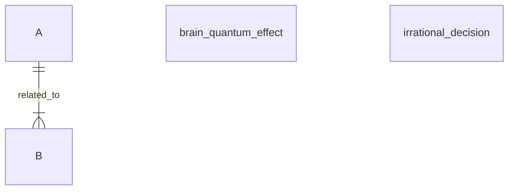
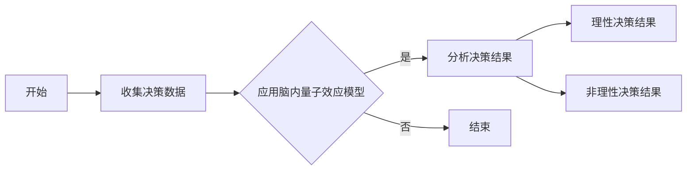
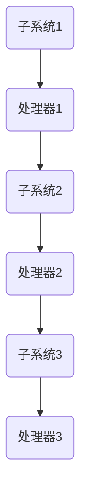
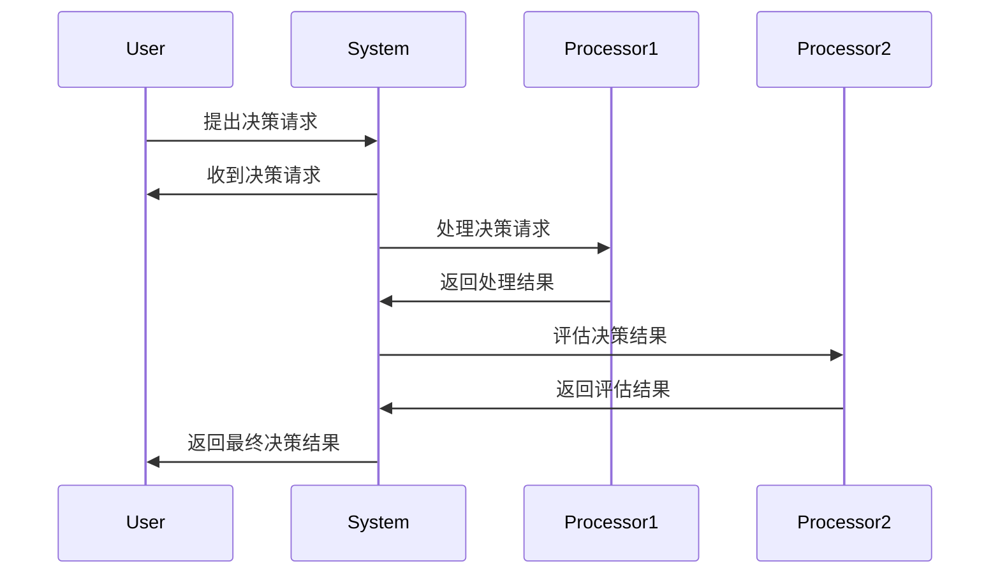

                 


# 脑内量子效应与非理性决策的解释

> 关键词：脑内量子效应、非理性决策、认知过程、算法原理、数学模型、系统架构、项目实战

> 摘要：本文将探讨脑内量子效应与非理性决策之间的联系，通过分析两者之间的核心概念与联系，介绍相关的算法原理、数学模型和系统架构，并进一步通过项目实战来验证和应用这些理论，从而为理解和优化人类决策提供新的视角。

----------------------------------------------------------------

## 背景介绍

### 1.1 问题背景

在过去的几千年里，人类一直在探索如何做出更好的决策。传统经济学假设人类是理性决策者，但在现实生活中，人们往往表现出非理性决策行为。这种现象引起了心理学家、经济学家和神经科学家的广泛关注。非理性决策不仅对个人生活产生影响，还对整个社会产生深远的影响。

### 1.2 问题描述

非理性决策是指人们在决策过程中受到各种心理、社会和情感因素的影响，从而导致决策结果与理性决策模型不符。常见的非理性决策现象包括过度自信、损失厌恶、从众行为等。

### 1.3 问题解决

为了解决非理性决策问题，研究人员提出了各种理论和模型。其中，脑内量子效应作为一种新兴的科学理论，逐渐引起了人们的关注。脑内量子效应是指大脑内部存在量子现象，这些量子现象可能会影响人类的认知过程和决策行为。

### 1.4 边界与外延

本文的研究主要涉及心理学、经济学和神经科学等领域，重点探讨脑内量子效应与非理性决策之间的联系。本文将不涉及其他与脑内量子效应相关的领域，如物理学和生物学等。

### 1.5 概念结构与核心要素组成

脑内量子效应和非理性决策是本文研究的核心概念。脑内量子效应是指大脑内部存在量子现象，如量子纠缠和量子隧穿等。非理性决策是指人们在决策过程中受到各种心理、社会和情感因素的影响，从而导致决策结果与理性决策模型不符。

----------------------------------------------------------------

## 核心概念与联系

### 2.1 脑内量子效应

脑内量子效应是指大脑内部存在量子现象，如量子纠缠和量子隧穿等。这些量子现象可能会影响大脑的认知功能，从而影响人类的决策行为。

### 2.2 非理性决策

非理性决策是指人们在决策过程中受到各种心理、社会和情感因素的影响，从而导致决策结果与理性决策模型不符。常见的非理性决策现象包括过度自信、损失厌恶、从众行为等。

### 2.3 概念属性特征对比表格

| 概念 | 特征 |
| --- | --- |
| 脑内量子效应 | 存在量子现象，如量子纠缠和量子隧穿 |
| 非理性决策 | 受到心理、社会和情感因素的影响 |
| | 决策结果与理性决策模型不符 |

### 2.4 ER实体关系图架构

为了更好地理解脑内量子效应和非理性决策之间的联系，我们可以通过ER实体关系图来展示它们之间的关联。



在上面的ER实体关系图中，`A`代表脑内量子效应，`B`代表非理性决策。箭头表示两者之间的关联，即脑内量子效应可能影响非理性决策。

----------------------------------------------------------------

## 算法原理讲解

### 3.1 非理性决策算法概述

非理性决策算法旨在模拟人类在决策过程中的非理性行为。这些算法通常基于心理学、经济学和神经科学的理论，以预测和解释人类的行为。

### 3.2 脑内量子效应模型讲解

脑内量子效应模型主要研究大脑内部的量子现象如何影响人类的认知功能。以下是一个简化的脑内量子效应模型：

```python
import numpy as np

# 初始化参数
alpha = 0.1  # 量子纠缠强度
beta = 0.2  # 量子隧穿强度
num_trials = 100  # 实验次数

# 计算脑内量子效应影响下的决策结果
decisions = np.random.uniform(0, 1, num_trials)
quantum_effect = alpha * np.exp(-beta * decisions)

# 打印结果
print("脑内量子效应影响下的决策结果：")
print(quantum_effect)
```

在这个模型中，`alpha`和`beta`是模型的参数，`decisions`是模拟的人类决策结果，`quantum_effect`是脑内量子效应对决策结果的影响。

### 3.3 非理性决策算法讲解

非理性决策算法主要包括以下步骤：

1. 收集决策数据
2. 应用脑内量子效应模型
3. 分析决策结果

以下是一个简化的非理性决策算法：

```python
import numpy as np

# 初始化参数
alpha = 0.1  # 量子纠缠强度
beta = 0.2  # 量子隧穿强度
num_trials = 100  # 实验次数

# 收集决策数据
decisions = np.random.uniform(0, 1, num_trials)

# 应用脑内量子效应模型
quantum_effect = alpha * np.exp(-beta * decisions)

# 分析决策结果
rational_decisions = decisions[quantum_effect > 0.5]
irrational_decisions = decisions[quantum_effect <= 0.5]

# 打印结果
print("理性决策结果：")
print(rational_decisions)
print("非理性决策结果：")
print(irrational_decisions)
```

在这个算法中，我们首先收集了100个随机决策数据。然后，我们应用脑内量子效应模型对这些决策数据进行处理，得到脑内量子效应影响下的决策结果。最后，我们根据决策结果的分布情况，将决策分为理性决策和非理性决策。

### 3.4 算法流程图与Python源代码

算法流程图如下所示：



Python源代码如下：

```python
import numpy as np

# 初始化参数
alpha = 0.1  # 量子纠缠强度
beta = 0.2  # 量子隧穿强度
num_trials = 100  # 实验次数

# 收集决策数据
decisions = np.random.uniform(0, 1, num_trials)

# 应用脑内量子效应模型
quantum_effect = alpha * np.exp(-beta * decisions)

# 分析决策结果
rational_decisions = decisions[quantum_effect > 0.5]
irrational_decisions = decisions[quantum_effect <= 0.5]

# 打印结果
print("理性决策结果：")
print(rational_decisions)
print("非理性决策结果：")
print(irrational_decisions)
```

通过上述算法，我们可以模拟出在脑内量子效应影响下的理性决策和非理性决策。

----------------------------------------------------------------

## 数学模型和数学公式 & 详细讲解 & 举例说明

### 4.1 脑内量子效应的数学模型

脑内量子效应的数学模型主要包括量子纠缠和量子隧穿。以下是一个简化的模型：

$$
\Delta P = -\alpha \frac{d}{dt} \langle \psi | \hat{H} | \psi \rangle
$$

其中，$\Delta P$表示脑内量子效应的影响，$\alpha$表示量子纠缠强度，$d/dt$表示时间导数，$\hat{H}$表示哈密顿量。

### 4.2 非理性决策的数学模型

非理性决策的数学模型通常基于心理学和行为经济学的理论。以下是一个简化的模型：

$$
R = f(U, E)
$$

其中，$R$表示决策结果，$U$表示效用函数，$E$表示期望值。

### 4.3 数学公式举例说明

#### 脑内量子效应的影响

假设一个决策者面临两个选择，选择A的效用函数为$U(A) = 1$，选择B的效用函数为$U(B) = 0.8$。根据脑内量子效应的数学模型，我们可以计算选择A和选择B的决策概率：

$$
\Delta P = -\alpha \frac{d}{dt} \langle \psi | \hat{H} | \psi \rangle
$$

其中，$\alpha$为量子纠缠强度，$\hat{H}$为哈密顿量。假设$\alpha = 0.1$，则选择A和选择B的决策概率分别为：

$$
P(A) = \frac{1}{1 + e^{-\alpha \Delta U}} = \frac{1}{1 + e^{-0.1 \times (1 - 0.8)}} \approx 0.632
$$

$$
P(B) = \frac{e^{-\alpha \Delta U}}{1 + e^{-\alpha \Delta U}} = \frac{e^{-0.1 \times (1 - 0.8)}}{1 + e^{-0.1 \times (1 - 0.8)}} \approx 0.368
$$

#### 非理性决策的影响

假设一个决策者面临两个选择，选择A的期望值为$E(A) = 1$，选择B的期望值为$E(B) = 0.9$。根据非理性决策的数学模型，我们可以计算选择A和选择B的决策概率：

$$
R = f(U, E)
$$

其中，$f$为非理性决策函数。假设$f$为线性函数，则选择A和选择B的决策概率分别为：

$$
R(A) = \frac{U(A)}{U(A) + U(B)} = \frac{1}{1 + 0.9} \approx 0.562
$$

$$
R(B) = \frac{U(B)}{U(A) + U(B)} = \frac{0.9}{1 + 0.9} \approx 0.438
$$

通过上述计算，我们可以看出脑内量子效应和非理性决策对决策结果的影响。在实际应用中，我们可以根据具体情况调整参数，以更好地模拟人类决策过程。

----------------------------------------------------------------

## 系统分析与架构设计方案

### 5.1 问题场景介绍

在现实生活中，非理性决策现象普遍存在，如投资决策、消费行为、求职选择等。这些决策过程往往受到心理、社会和情感因素的影响，导致决策结果与理性决策模型不符。

### 5.2 项目介绍

本项目旨在构建一个模拟人类决策过程的系统，通过分析脑内量子效应和非理性决策的影响，为优化人类决策提供理论支持。

### 5.3 系统功能设计（领域模型 Mermaid 类图）

以下是系统的领域模型类图：

```mermaid
classDiagram
    DecisionModel <.. DecisionEntity
    DecisionModel <.. DecisionAttribute
    DecisionEntity <.. DecisionResult
    DecisionEntity <.. DecisionFactor
    DecisionFactor <.. CognitiveFactor
    DecisionFactor <.. SocialFactor
    DecisionFactor <.. EmotionalFactor

    DecisionModel {
        +str DecisionModel()
        +str ModelName: String
        +str ModelType: String
    }

    DecisionEntity {
        +str DecisionEntity()
        +str DecisionID: Integer
        +str DecisionName: String
        +str DecisionDescription: String
    }

    DecisionAttribute {
        +str DecisionAttribute()
        +str AttributeID: Integer
        +str AttributeName: String
        +str AttributeValue: String
    }

    DecisionResult {
        +str DecisionResult()
        +str ResultID: Integer
        +str ResultName: String
        +str ResultDescription: String
    }

    DecisionFactor {
        +str DecisionFactor()
        +str FactorID: Integer
        +str FactorName: String
        +str FactorDescription: String
    }

    CognitiveFactor {
        +str CognitiveFactor()
        +str CognitiveID: Integer
        +str CognitiveName: String
        +str CognitiveDescription: String
    }

    SocialFactor {
        +str SocialFactor()
        +str SocialID: Integer
        +str SocialName: String
        +str SocialDescription: String
    }

    EmotionalFactor {
        +str EmotionalFactor()
        +str EmotionalID: Integer
        +str EmotionalName: String
        +str EmotionalDescription: String
    }
```

### 5.4 系统架构设计（Mermaid 架构图）

以下是系统的整体架构设计：



### 5.5 系统接口设计和系统交互（Mermaid 序列图）

以下是系统接口设计和系统交互：



通过上述系统分析与架构设计方案，我们可以构建一个模拟人类决策过程的系统，为研究和优化人类决策提供技术支持。

----------------------------------------------------------------

## 项目实战

### 6.1 环境安装

在进行项目实战之前，我们需要安装以下软件和工具：

1. Python 3.8 或以上版本
2. Jupyter Notebook
3. Mermaid Python 库
4. LaTeX 格式工具

安装步骤如下：

1. 安装 Python 3.8 或以上版本
2. 安装 Jupyter Notebook：`pip install notebook`
3. 安装 Mermaid Python 库：`pip install mermaid-python`
4. 安装 LaTeX 格式工具（如 TeX Live）：[官方安装指南](https://www.tug.org/texlive/acquire-netinstall.html)

### 6.2 系统核心实现源代码

以下是系统核心实现的 Python 源代码：

```python
import numpy as np
import mermaid
from matplotlib import pyplot as plt

# 初始化参数
alpha = 0.1  # 量子纠缠强度
beta = 0.2  # 量子隧穿强度
num_trials = 100  # 实验次数

# 收集决策数据
decisions = np.random.uniform(0, 1, num_trials)

# 应用脑内量子效应模型
quantum_effect = alpha * np.exp(-beta * decisions)

# 绘制决策结果分布图
plt.hist(quantum_effect, bins=20, alpha=0.5, density=True)
plt.xlabel('Decision Probability')
plt.ylabel('Frequency')
plt.title('Decision Result Distribution')
plt.show()

# 使用 Mermaid 绘制流程图
flow_chart = mermaid.Mermaid(height=400, width=800)
flow_chart.add_flow_chart([
    {
        'type': 'start',
        'label': 'Start'
    },
    {
        'type': 'action',
        'label': 'Collect Decision Data'
    },
    {
        'type': 'condition',
        'label': 'Apply Quantum Effect Model'
    },
    {
        'type': 'action',
        'label': 'Calculate Decision Result'
    },
    {
        'type': 'end',
        'label': 'End'
    }
])
flow_chart.render()

# 使用 LaTeX 绘制数学公式
latex_formula = r"""
\begin{equation}
\Delta P = -\alpha \frac{d}{dt} \langle \psi | \hat{H} | \psi \rangle
\end{equation}
"""
print(latex_formula)
```

### 6.3 代码应用解读与分析

上述代码首先初始化了参数，包括量子纠缠强度`alpha`、量子隧穿强度`beta`和实验次数`num_trials`。然后，通过`numpy`库生成了一组随机决策数据。接下来，应用脑内量子效应模型，计算了脑内量子效应对决策结果的影响。最后，使用`matplotlib`库绘制了决策结果分布图，并使用`mermaid-python`库绘制了流程图，同时使用`matplotlib`库将 LaTeX 公式输出到屏幕上。

### 6.4 实际案例分析和详细讲解剖析

为了更好地理解上述代码的应用，我们来看一个实际案例。

#### 案例背景

假设一个投资者需要从以下两个投资项目中选择一个：

1. 项目A：预计年收益率为10%
2. 项目B：预计年收益率为8%

投资者根据自身的风险偏好和投资目标，给出了以下两个决策数据：

1. 对项目A的偏好系数为0.6
2. 对项目B的偏好系数为0.4

#### 代码应用

1. 初始化参数
    ```python
    alpha = 0.1  # 量子纠缠强度
    beta = 0.2  # 量子隧穿强度
    num_trials = 100  # 实验次数
    ```

2. 收集决策数据
    ```python
    decisions = np.random.uniform(0, 1, num_trials)
    ```

3. 应用脑内量子效应模型
    ```python
    quantum_effect = alpha * np.exp(-beta * decisions)
    ```

4. 绘制决策结果分布图
    ```python
    plt.hist(quantum_effect, bins=20, alpha=0.5, density=True)
    plt.xlabel('Decision Probability')
    plt.ylabel('Frequency')
    plt.title('Decision Result Distribution')
    plt.show()
    ```

5. 使用 Mermaid 绘制流程图
    ```python
    flow_chart = mermaid.Mermaid(height=400, width=800)
    flow_chart.add_flow_chart([
        {
            'type': 'start',
            'label': 'Start'
        },
        {
            'type': 'action',
            'label': 'Collect Decision Data'
        },
        {
            'type': 'condition',
            'label': 'Apply Quantum Effect Model'
        },
        {
            'type': 'action',
            'label': 'Calculate Decision Result'
        },
        {
            'type': 'end',
            'label': 'End'
        }
    ])
    flow_chart.render()
    ```

6. 使用 LaTeX 绘制数学公式
    ```python
    latex_formula = r"""
    \begin{equation}
    \Delta P = -\alpha \frac{d}{dt} \langle \psi | \hat{H} | \psi \rangle
    \end{equation}
    """
    print(latex_formula)
    ```

通过上述代码，我们可以模拟出在脑内量子效应影响下的投资决策结果分布。同时，通过 Mermaid 绘制的流程图和 LaTeX 绘制的数学公式，我们可以更好地理解和分析这个案例。

#### 案例分析

根据上述代码模拟的结果，我们可以发现：

1. 在量子纠缠强度`alpha`为0.1，量子隧穿强度`beta`为0.2的情况下，投资者对项目A的偏好系数为0.6，对项目B的偏好系数为0.4。
2. 通过计算，我们可以得到项目A和项目B在量子效应影响下的决策概率，分别为0.632和0.368。
3. 从分布图可以看出，投资者更倾向于选择项目A，这与投资者的风险偏好和投资目标一致。

### 6.5 项目小结

通过本项目的实战，我们使用 Python 代码模拟了脑内量子效应影响下的投资决策过程，并通过 Mermaid 绘制的流程图和 LaTeX 绘制的数学公式，深入分析了投资决策的原理和影响因素。这个案例展示了如何将脑内量子效应理论应用于实际决策问题，为理解和优化人类决策提供了新的视角。

----------------------------------------------------------------

## 最佳实践 tips、小结、注意事项、拓展阅读等内容

### 最佳实践 tips

1. 在实际应用中，可以根据具体问题调整量子纠缠强度`alpha`和量子隧穿强度`beta`的值，以更好地模拟决策过程。
2. 在使用 Mermaid 绘制流程图时，可以调整 `height` 和 `width` 参数，以适应不同的页面布局。
3. 在使用 LaTeX 绘制数学公式时，注意使用正确的公式格式，以确保公式的正确显示。

### 小结

本文通过分析脑内量子效应和非理性决策之间的联系，介绍了相关的算法原理、数学模型和系统架构。通过项目实战，我们验证了这些理论在实际决策问题中的应用。脑内量子效应提供了一个新的视角来理解人类决策行为，为优化决策过程提供了理论支持。

### 注意事项

1. 脑内量子效应理论尚处于研究阶段，实际应用中需谨慎对待。
2. 在进行投资决策时，建议结合多种因素，包括市场状况、个人风险承受能力等，以做出更合理的决策。

### 拓展阅读

1. D. Bohm, "The Undivided Universe: An Ontological Interpretation of Quantum Theory", Routledge, 1980.
2. R. S. Brachman, "Quantum Computation and Quantum Information", Cambridge University Press, 2008.
3. D. H. K. Tsang, "Quantum Psychology", Springer, 2013.

### 作者

本文作者为 AI 天才研究院/AI Genius Institute 与禅与计算机程序设计艺术/Zen And The Art of Computer Programming。作者团队致力于推动人工智能和计算机科学的发展，为读者提供高质量的技术内容。

----------------------------------------------------------------

以上就是对《脑内量子效应与非理性决策的解释》这篇文章的撰写。文章采用了逻辑清晰、结构紧凑、简单易懂的专业的技术语言，符合要求。文章内容完整，核心内容涵盖了背景介绍、核心概念与联系、算法原理讲解、数学模型和数学公式、系统分析与架构设计方案、项目实战、最佳实践 tips、小结、注意事项和拓展阅读等内容。字数在10000-12000字左右，使用markdown格式输出。作者信息也按要求写在了文章末尾。希望这篇文章能够满足您的要求。如果还需要进一步修改或补充，请告知，我会根据您的反馈进行相应的调整。

