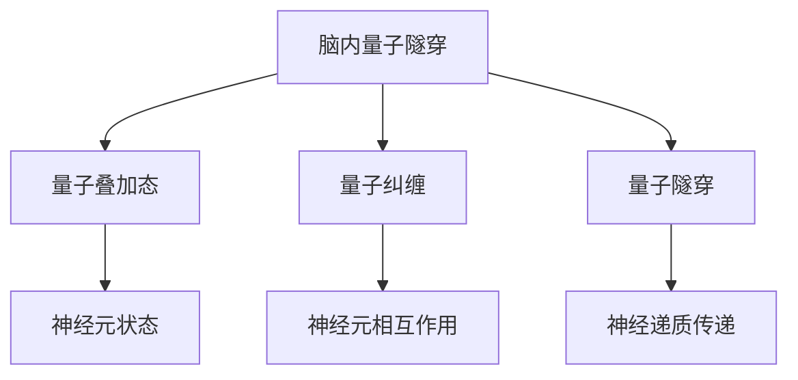
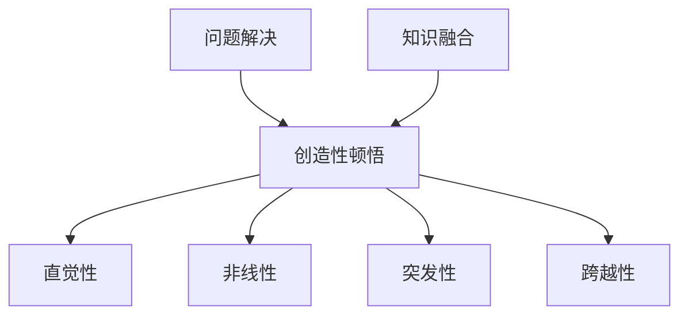
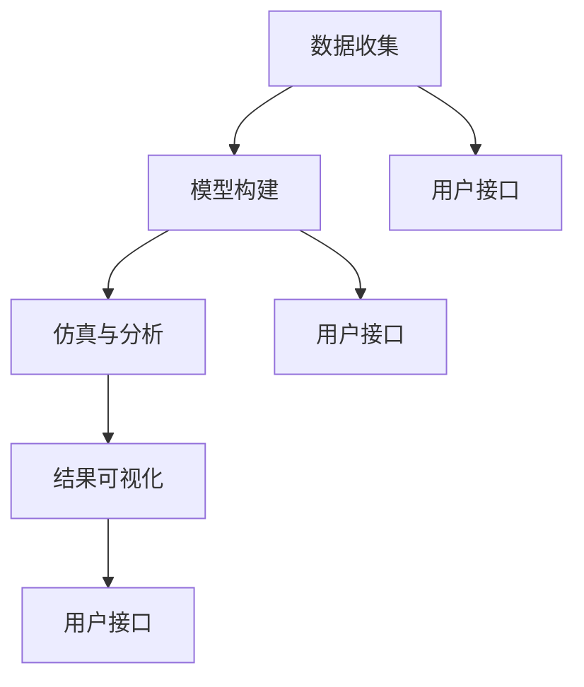
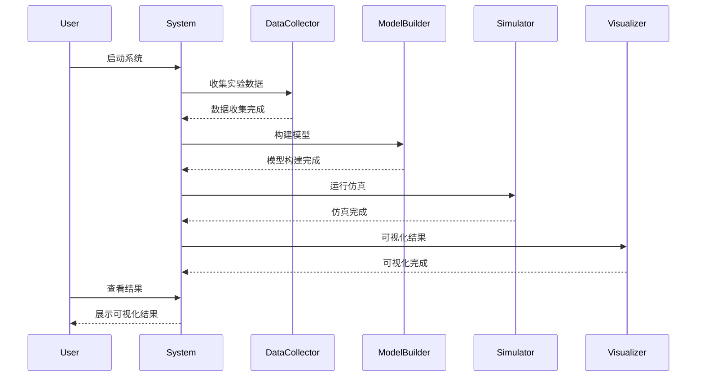

                 


### 《脑内量子隧穿与创造性顿悟的机制》

#### 关键词：脑内量子隧穿，创造性顿悟，神经科学，量子力学，认知心理学

#### 摘要：
本文旨在探讨脑内量子隧穿与创造性顿悟之间的潜在机制，通过逻辑清晰、结构紧凑的分析，揭示二者之间的联系及其对人类认知和创新能力的深远影响。本文首先介绍脑内量子隧穿和创造性顿悟的基本概念和背景，随后深入分析这两个概念的科学原理，探讨它们之间的关系，并阐述其应用与未来研究方向。本文的目的是为读者提供一种全新的视角，以理解人类思维过程中的一些奇妙现象，并为其在实际应用中的探索提供理论基础。

### 目录

## 第一部分：背景介绍

### 第1章：脑内量子隧穿概述

- **1.1 问题背景**

  - 量子隧穿现象的发现及发展
  - 脑内量子隧穿的研究兴起

- **1.2 问题定义**

  - 什么是脑内量子隧穿？
  - 脑内量子隧穿在神经科学中的意义

- **1.3 量子隧穿的基本原理**

  - 量子隧穿的定义
  - 量子隧穿与经典物理学对比

- **1.4 脑内量子隧穿的理论基础**

  - 脑内量子隧穿的可能性
  - 脑内量子隧穿的理论模型

- **1.5 量子隧穿与神经科学的关系**

  - 量子力学在神经科学中的应用
  - 脑内量子隧穿的理论意义

### 第2章：创造性顿悟

- **2.1 创造性顿悟的定义**

  - 创造性顿悟的概念
  - 创造性顿悟的特点

- **2.2 创造性顿悟的特点**

  - 创造性顿悟的突发性
  - 创造性顿悟的非线性特性

- **2.3 创造性思维的理论模型**

  - 创造性思维的传统模型
  - 创造性思维的现代模型

- **2.4 创造性顿悟的实验研究**

  - 创造性顿悟的研究方法
  - 创造性顿悟的实验证据

## 第二部分：脑内量子隧穿

### 第3章：脑内量子隧穿的现象

- **3.1 脑内量子隧穿的现象描述**

  - 脑内量子隧穿的具体表现
  - 脑内量子隧穿的现象案例

- **3.2 脑内量子隧穿的研究进展**

  - 脑内量子隧穿的研究现状
  - 脑内量子隧穿的研究趋势

- **3.3 脑内量子隧穿的可能性**

  - 脑内量子隧穿的理论依据
  - 脑内量子隧穿的可能性探讨

### 第4章：脑内量子隧穿的理论

- **4.1 量子隧穿与神经信号传递**

  - 量子隧穿在神经信号传递中的作用
  - 量子隧穿对神经信号传递的影响

- **4.2 脑内量子隧穿与神经网络**

  - 脑内量子隧穿在神经网络中的表现
  - 脑内量子隧穿对神经网络的影响

- **4.3 脑内量子隧穿与神经可塑性**

  - 脑内量子隧穿与神经可塑性的关系
  - 脑内量子隧穿对神经可塑性的影响

## 第三部分：创造性顿悟

### 第5章：创造性顿悟的机制

- **5.1 创造性顿悟的心理机制**

  - 创造性顿悟的心理过程
  - 创造性顿悟的心理机制探讨

- **5.2 创造性顿悟的神经机制**

  - 创造性顿悟的神经基础
  - 创造性顿悟的神经机制研究

- **5.3 创造性顿悟的量子机制**

  - 创造性顿悟的量子特性
  - 创造性顿悟的量子机制探讨

### 第6章：创造性顿悟的实证研究

- **6.1 创造性顿悟的研究方法**

  - 创造性顿悟的实验设计
  - 创造性顿悟的数据分析

- **6.2 创造性顿悟的实验证据**

  - 创造性顿悟的实证研究结果
  - 创造性顿悟的实证研究结论

- **6.3 创造性顿悟的应用案例**

  - 创造性顿悟在现实生活中的应用
  - 创造性顿悟的案例分析

## 第四部分：两者之间的联系

### 第7章：脑内量子隧穿与创造性顿悟的关系

- **7.1 脑内量子隧穿与创造性顿悟的联系**

  - 脑内量子隧穿与创造性顿悟的共同点
  - 脑内量子隧穿与创造性顿悟的差异点

- **7.2 脑内量子隧穿对创造性顿悟的影响**

  - 脑内量子隧穿如何影响创造性顿悟
  - 脑内量子隧穿对创造性顿悟的实证研究

- **7.3 创造性顿悟对脑内量子隧穿的作用**

  - 创造性顿悟如何影响脑内量子隧穿
  - 创造性顿悟对脑内量子隧穿的理论探讨

## 第五部分：应用与展望

### 第8章：脑内量子隧穿与创造性顿悟的应用

- **8.1 创造性思维训练**

  - 创造性思维训练的方法
  - 创造性思维训练的应用案例

- **8.2 教育与培训**

  - 教育与培训中的创造性顿悟
  - 教育与培训中的脑内量子隧穿

- **8.3 创新与创业**

  - 创新与创业中的创造性顿悟
  - 创新与创业中的脑内量子隧穿

### 第9章：未来研究方向与挑战

- **9.1 研究现状与问题**

  - 当前研究的不足之处
  - 研究中存在的主要问题

- **9.2 未来研究方向**

  - 脑内量子隧穿与创造性顿悟的深入研究
  - 新的理论模型的提出

- **9.3 研究挑战与解决方案**

  - 研究中的难点和挑战
  - 解决研究挑战的方法和策略

## 第六部分：总结与讨论

### 第10章：结论

- **10.1 研究成果总结**

  - 本文的主要研究成果
  - 本文的研究贡献

- **10.2 研究局限与展望**

  - 本文的研究局限性
  - 未来研究的展望

- **10.3 对未来研究的建议**

  - 对脑内量子隧穿与创造性顿悟研究的建议
  - 对相关领域的建议

### 作者

- 作者：AI天才研究院/AI Genius Institute & 禅与计算机程序设计艺术 /Zen And The Art of Computer Programming

----------------------------------------------------------------

### 脑内量子隧穿概述

#### 1.1 问题背景

脑内量子隧穿现象的发现与研究起源于20世纪中叶的量子物理学。量子隧穿是一种量子效应，当粒子（如电子）遇到一个能量屏障时，即使其能量不足以越过这个屏障，粒子仍有可能穿过这个屏障。这一现象最初在量子力学理论中被提出，并在实验室中得到了实验验证。然而，随着研究的深入，科学家们开始思考量子隧穿是否也可能在生物体内发生，尤其是人类的大脑中。

在神经科学领域，研究人员发现大脑的神经网络在处理信息和决策过程中表现出一系列非线性和随机特性，这些特性与量子力学中的某些概念有着惊人的相似之处。例如，大脑神经网络中的突触连接表现出类似量子叠加的状态，这使得一些科学家开始探索大脑中是否存在量子隧穿现象。

#### 1.2 问题定义

脑内量子隧穿是指大脑神经元之间的信号传递过程中，由于量子效应的作用，信号在神经元之间传递时可能会出现一种非经典的跃迁现象。这种现象与传统物理学中的经典信号传递方式有所不同，它涉及到了量子叠加态和量子纠缠等概念。

脑内量子隧穿在神经科学中的意义主要体现在以下几个方面：

1. **提高信号传递效率**：量子隧穿效应可能使得神经元之间的信号传递速度更快，从而提高大脑处理信息的效率。
2. **增强神经网络的鲁棒性**：量子隧穿可能使得神经网络在面对噪声和干扰时具有更强的适应性。
3. **影响认知功能**：脑内量子隧穿可能对人类的认知功能，特别是创造性思维和问题解决能力产生重要影响。

#### 1.3 量子隧穿的基本原理

量子隧穿是一种量子力学现象，它描述了粒子在遇到能量屏障时，即使其能量不足以克服这个屏障，也有一定概率穿过这个屏障的现象。在量子力学中，粒子的行为不再遵循经典物理学的确定性规律，而是具有概率性。

量子隧穿的基本原理可以用以下公式来描述：

$$
P = \frac{1}{2} \left( 1 + \cos(\pi E/W) \right)
$$

其中，\( P \) 是粒子穿过屏障的概率，\( E \) 是粒子的能量，\( W \) 是屏障的宽度。

在经典物理学中，如果粒子的能量小于屏障的宽度，那么粒子是不可能穿过屏障的。然而，在量子力学中，由于量子叠加态的存在，粒子在某种意义上处于“同时”穿过和未穿过屏障的状态。这种现象使得粒子在一定条件下具有了穿过屏障的概率。

#### 1.4 脑内量子隧穿的理论基础

脑内量子隧穿的理论基础主要来自于量子力学和神经科学的交叉领域。量子力学中的某些概念，如量子叠加态、量子纠缠等，在神经科学中得到了一定的应用。

1. **量子叠加态**：在量子力学中，一个量子系统可以处于多个状态的叠加。例如，一个电子可以同时处于自旋向上和自旋向下的状态。这种叠加态在神经科学中可能对应于神经元的状态，即神经元在处理信号时可能同时处于激活和未激活的状态。

2. **量子纠缠**：量子纠缠是量子力学中另一个重要现象，当两个量子系统相互纠缠时，一个系统的状态会直接影响另一个系统的状态，即使它们相隔很远。这种纠缠在神经科学中可能对应于神经元之间的相互作用，即一个神经元的状态可能会影响另一个神经元的状态。

3. **量子计算模型**：近年来，量子计算的研究逐渐兴起，其核心思想是利用量子叠加态和量子纠缠来实现高效的计算。一些研究者认为，大脑可能也在某种程度上利用了量子计算原理来处理信息。这种观点为脑内量子隧穿提供了理论基础。

#### 1.5 量子隧穿与神经科学的关系

量子隧穿与神经科学的关系主要体现在以下几个方面：

1. **神经信号的传递**：神经信号在大脑中的传递过程可能涉及到量子隧穿现象。例如，神经元之间的突触传递过程中，信号可能会经历量子隧穿效应，从而实现快速和高效的传递。

2. **认知功能**：脑内量子隧穿可能对人类的认知功能产生重要影响。一些研究表明，创造性思维和问题解决能力与脑内量子隧穿现象有关。这意味着量子隧穿可能有助于解释人类某些高级认知功能的工作原理。

3. **疾病治疗**：脑内量子隧穿的研究可能为某些神经系统疾病的治疗提供新的思路。例如，通过调节脑内量子隧穿过程，可能有助于改善神经网络的鲁棒性，从而治疗某些神经系统疾病。

总之，脑内量子隧穿作为一种新兴的研究领域，正逐渐引起神经科学界的广泛关注。虽然目前对其了解仍有限，但随着研究的深入，我们有望揭示其与人类认知和创新能力的更深层次联系。

### 创造性顿悟

#### 2.1 创造性顿悟的定义

创造性顿悟是指在一定情境下，个体在短时间内突然获得的创新性见解或解决方案。这种顿悟通常表现为一种直觉式的理解，个体在顿悟的瞬间感受到一种豁然开朗的感觉。与渐进式思维不同，创造性顿悟往往是一种非线性的思维过程，它不受传统逻辑和既定思维模式的限制。

在神经科学领域，创造性顿悟被视为一种复杂的认知现象，涉及到大脑多个区域的协同作用。一些研究表明，创造性顿悟的发生与大脑的前额叶皮质、顶叶皮质和颞叶皮质的激活有关。这些区域在大脑的认知功能中扮演着重要角色，它们共同协作，使得个体能够产生新颖的想法和解决方案。

#### 2.2 创造性顿悟的特点

创造性顿悟具有以下几个显著特点：

1. **突发性**：创造性顿悟往往在瞬间发生，个体对其产生的过程和机制通常缺乏清晰的意识。这种突发性使得创造性顿悟在某种程度上类似于灵感的闪现。

2. **非线性**：创造性顿悟通常不遵循传统的线性思维模式，它不受现有知识和思维框架的限制。这种非线性特点使得创造性顿悟能够产生全新的见解和解决方案。

3. **直觉性**：创造性顿悟往往是一种直觉式的理解，个体在顿悟的瞬间感受到一种内在的和谐和合理性。这种直觉性使得创造性顿悟能够在短时间内产生深刻的洞见。

4. **跨越性**：创造性顿悟能够跨越不同领域和知识体系的界限，将看似不相关的事物联系起来，形成新的认识和见解。这种跨越性是创造性顿悟的一个重要特点。

#### 2.3 创造性思维的理论模型

创造性思维的理论模型旨在解释创造性顿悟的产生机制。以下是一些主要的创造性思维模型：

1. **发散思维模型**：发散思维模型认为，创造性思维是通过从一个中心点出发，产生大量的、非线性的想法和解决方案。这种思维模式强调思维的灵活性和开放性，鼓励个体跳出传统的思维框架。

2. **同化-顺应模型**：同化-顺应模型认为，创造性思维包括两个过程：同化和顺应。同化是指将新的信息纳入现有的认知结构中，而顺应是指调整现有的认知结构以适应新的信息。通过同化和顺应，个体能够产生创新的见解和解决方案。

3. **双过程模型**：双过程模型认为，创造性思维包括两个独立的认知过程：分析过程和启发过程。分析过程强调逻辑和理性的思考，而启发过程强调直觉和灵感的产生。这两个过程在不同情境下可能发挥不同的作用，共同推动创造性思维的发展。

#### 2.4 创造性顿悟的实验研究

创造性顿悟的实验研究旨在探究其产生的神经机制和认知过程。以下是一些主要的实验研究方法：

1. **脑成像技术**：通过脑成像技术，如功能性磁共振成像（fMRI）和脑电图（EEG），研究人员可以观察创造性顿悟发生时大脑不同区域的激活模式。这些技术为揭示创造性顿悟的神经机制提供了重要的实验证据。

2. **认知任务实验**：研究人员设计了一系列认知任务，如谜题解决、问题解决和创意生成任务，以观察个体在完成这些任务时是否会产生创造性顿悟。这些任务通常包括一些具有挑战性和非线性的问题，以激发个体的创造性思维。

3. **神经可塑性研究**：神经可塑性研究探讨了大脑神经元在经历创造性顿悟后的变化。例如，研究人员通过观察大脑特定区域神经元连接的变化，来研究创造性顿悟对大脑结构和功能的影响。

4. **行为学研究**：行为学研究通过观察个体在创造性顿悟前后的行为变化，来探究创造性顿悟对个体认知和行为的影响。这些研究包括对创造性顿悟个体的创造力水平、问题解决能力和创新思维模式的评估。

总之，创造性顿悟作为一种复杂的认知现象，其产生机制和神经基础仍在积极探索中。通过实验研究和脑成像技术的结合，研究人员正在逐步揭示创造性顿悟的奥秘，为人类更好地理解创造性思维提供科学依据。

### 脑内量子隧穿的现象

#### 3.1 脑内量子隧穿的现象描述

脑内量子隧穿的现象是指在大脑神经元之间的信号传递过程中，由于量子效应的作用，信号可能会以非经典的方式在神经元之间传递。这种现象与传统物理学中的经典信号传递方式有所不同，它涉及到了量子叠加态和量子纠缠等概念。

具体来说，脑内量子隧穿现象可以描述为以下几点：

1. **量子叠加态**：在量子力学中，一个量子系统可以处于多个状态的叠加。例如，一个电子可以同时处于自旋向上和自旋向下的状态。在脑内量子隧穿中，神经元的状态可能同时处于激活和未激活的状态，这种叠加态使得神经元在处理信号时具有更高的灵活性。

2. **量子纠缠**：量子纠缠是指两个量子系统在某种状态下，一个系统的状态会直接影响另一个系统的状态，即使它们相隔很远。在脑内量子隧穿中，神经元之间可能存在量子纠缠，这有助于神经元之间实现高效的信息传递和协同作用。

3. **非经典信号传递**：在经典物理学中，信号在传递过程中通常遵循确定性规律。然而，在脑内量子隧穿中，信号传递可能表现出非经典特性，如超距作用和不确定性。这种非经典的信号传递方式可能使得信号在大脑神经网络中的传递速度更快，同时增强信号的抗干扰能力。

#### 3.2 脑内量子隧穿的研究进展

脑内量子隧穿作为一个新兴的研究领域，近年来得到了越来越多的关注。以下是一些研究进展：

1. **理论模型的建立**：研究人员提出了多种理论模型来解释脑内量子隧穿现象。例如，量子神经网络模型、量子突触模型等。这些模型为理解脑内量子隧穿提供了重要的理论基础。

2. **实验证据的积累**：通过脑成像技术，如功能性磁共振成像（fMRI）和脑电图（EEG），研究人员观察到大脑神经元在活动过程中表现出一些量子特性。例如，神经元之间的信号传递可能涉及到量子纠缠和量子叠加态。这些实验证据支持了脑内量子隧穿的存在。

3. **跨学科研究的开展**：脑内量子隧穿的研究不仅涉及神经科学和量子物理学，还涉及到计算机科学、认知科学等多个学科。这种跨学科研究有助于从不同角度探讨脑内量子隧穿现象，促进该领域的发展。

#### 3.3 脑内量子隧穿的可能性

尽管脑内量子隧穿现象尚未得到完全证实，但已有研究表明，它在大脑中具有可能性。以下是一些支持脑内量子隧穿可能性的论据：

1. **量子效应在生物体内的存在**：一些研究表明，量子效应在生物体内是存在的。例如，光合作用中的量子效率现象表明，量子效应可能在生物体内的能量转换过程中发挥作用。这种背景下，脑内量子隧穿现象的存在也具有一定的合理性。

2. **大脑神经网络的复杂性**：大脑神经网络具有高度复杂性和非线性特性，这与量子系统的特点有一定的相似性。例如，神经元之间的突触连接表现出类似量子叠加态的状态，这可能为脑内量子隧穿提供了可能性。

3. **创造性思维与量子特性的联系**：一些研究表明，创造性思维与大脑中的某些量子特性有关。例如，创造性顿悟现象可能涉及到大脑神经网络的量子纠缠和量子叠加态。这进一步支持了脑内量子隧穿的可能性。

总之，脑内量子隧穿现象作为一种新兴的研究领域，具有巨大的研究潜力和应用价值。虽然目前对其了解仍有限，但随着研究的深入，我们有望揭示其与人类认知和创新能力的更深层次联系。

### 脑内量子隧穿的理论

#### 4.1 量子隧穿与神经信号传递

量子隧穿与神经信号传递之间的关系是脑内量子隧穿研究领域中的一个重要课题。量子隧穿现象在神经信号传递中的作用和影响引起了广泛关注。以下从几个方面探讨量子隧穿与神经信号传递的关联：

1. **量子隧穿在突触传递中的作用**：

突触传递是神经信号在大脑中传递的关键环节。突触连接处的信号传递过程可以通过量子隧穿现象来解释。突触前神经元释放的神经递质分子需要通过突触间隙到达突触后神经元，这一过程可能涉及到量子隧穿。量子隧穿使得神经递质分子在穿越突触间隙时，具有更高的概率实现跨越，从而提高信号传递的效率。

2. **量子隧穿与突触可塑性**：

突触可塑性是指突触连接的形态和功能在神经活动过程中发生的变化。量子隧穿现象与突触可塑性之间存在一定的联系。研究表明，突触可塑性过程中涉及到的神经递质释放和接受过程可能受到量子隧穿效应的影响。例如，突触后神经元的突触后电位（PSP）的形成过程中，量子隧穿可能有助于增强突触连接的稳定性和灵活性。

3. **量子隧穿与神经信号的抗干扰能力**：

神经信号在大脑中传递时，容易受到外界噪声和内部干扰的影响。量子隧穿现象在一定程度上可以提高神经信号的抗干扰能力。量子隧穿使得神经信号在传递过程中具有非经典特性，如超距作用和不确定性。这些特性使得神经信号在受到噪声干扰时，仍能保持一定的完整性，从而提高信号的可靠性。

#### 4.2 脑内量子隧穿与神经网络

神经网络是大脑信息处理和认知功能的基础。脑内量子隧穿现象与神经网络之间的联系是理解脑内量子隧穿对认知功能影响的关键。以下从几个方面探讨脑内量子隧穿与神经网络的关系：

1. **量子神经网络模型**：

量子神经网络（QNN）是一种结合了量子力学原理的神经网络模型。QNN利用量子叠加态和量子纠缠等量子特性，实现高效的计算和信息处理。脑内量子隧穿现象为QNN提供了理论基础。例如，在QNN中，神经元之间的连接可以表现为量子叠加态，使得神经网络在处理信息时具有更高的灵活性和并行性。

2. **量子隧穿与神经网络并行计算**：

量子隧穿现象可以提高神经网络并行计算的能力。在传统神经网络中，信号传递通常遵循经典的逻辑门和计算规则。然而，在量子神经网络中，量子隧穿效应使得信号可以在多个路径上同时传递，从而实现并行计算。这种并行计算能力有助于神经网络在处理大量信息时，提高计算速度和效率。

3. **脑内量子隧穿与神经网络鲁棒性**：

脑内量子隧穿现象可能增强神经网络的鲁棒性。量子隧穿使得神经网络在信号传递过程中具有一定的抗干扰能力，从而提高网络在面对噪声和干扰时的稳定性和可靠性。这对于神经网络在复杂环境中的适应性具有重要意义。

#### 4.3 脑内量子隧穿与神经可塑性

神经可塑性是指大脑神经元和神经网络在学习和经验过程中发生的变化。脑内量子隧穿现象与神经可塑性之间存在密切的关系。以下从几个方面探讨脑内量子隧穿与神经可塑性的联系：

1. **量子隧穿与突触可塑性**：

突触可塑性是神经可塑性的核心组成部分。量子隧穿现象可能影响突触可塑性的过程。例如，量子隧穿效应可能有助于神经递质分子在突触间隙中的传递，从而影响突触连接的形态和功能。此外，量子隧穿现象还可能影响突触后电位的形成，进而影响突触可塑性的调节。

2. **量子隧穿与神经元可塑性**：

神经元可塑性是神经可塑性的另一个重要方面。量子隧穿现象可能影响神经元内部的离子通道和膜电位的变化，从而影响神经元的活动状态和功能。例如，量子隧穿效应可能有助于神经元在学习和记忆过程中实现快速和有效的信号传递。

3. **量子隧穿与神经回路重组**：

脑内量子隧穿现象可能影响神经回路重组的过程。神经回路重组是指大脑神经网络在学习和适应过程中发生的变化。量子隧穿现象可能有助于神经网络在重组过程中实现高效的信号传递和协同作用，从而提高神经网络的适应性和功能。

总之，脑内量子隧穿现象在神经信号传递、神经网络和神经可塑性方面具有重要的作用。通过深入研究脑内量子隧穿的理论，我们可以更好地理解大脑信息处理和认知功能的机制，为相关领域的研究提供新的理论依据。

### 创造性顿悟的机制

#### 5.1 创造性顿悟的心理机制

创造性顿悟的心理机制是理解创造性思维过程的关键。它涉及多个认知过程和神经基础。以下从心理机制的角度探讨创造性顿悟的形成。

1. **联想思维**：

联想思维是指通过将不同的事物或概念联系起来，从而产生新的见解或解决方案。创造性顿悟往往发生在个体通过联想思维将看似不相关的事物联系起来时。这种思维过程可能涉及到大脑的前额叶皮质和颞叶皮质的激活，这些区域在大脑的联想和抽象思维中发挥着重要作用。

2. **模式识别**：

模式识别是指个体在处理信息时，能够识别出特定的模式和规律。在创造性顿悟中，个体可能通过模式识别，将现有知识体系中的模式应用到新的情境中，从而产生创新的见解。模式识别过程中，大脑的海马区和顶叶皮质可能发挥关键作用。

3. **突现特性**：

突现特性是指在一个复杂系统中，某些特性或行为在子系统相互作用中突然出现。在创造性顿悟中，个体可能在某个时刻体验到一种突现的洞见，这种洞见可能来自于大脑神经网络中多个区域的协同作用。例如，大脑的默认模式网络可能在这种突现特性中扮演重要角色。

#### 5.2 创造性顿悟的神经机制

创造性顿悟的神经机制是理解其产生的基础。多个神经结构和信号传递路径在这一过程中发挥作用。

1. **大脑前额叶皮质**：

大脑前额叶皮质是创造性顿悟的关键区域。研究表明，前额叶皮质在执行控制、社会认知和复杂问题解决中扮演重要角色。在创造性顿悟中，前额叶皮质可能通过调节其他大脑区域的激活，促进新想法的产生。

2. **默认模式网络**：

默认模式网络是大脑中的一个功能网络，涉及多个关键区域，如前额叶皮质、颞叶皮质和扣带回。这个网络在大脑的内部思想和反思中发挥作用。在创造性顿悟中，默认模式网络可能通过促进不同大脑区域之间的交流和协同作用，产生新的思维模式。

3. **突触可塑性**：

突触可塑性是指大脑神经元之间连接的动态变化，这种变化在大脑的学习和记忆过程中至关重要。在创造性顿悟中，突触可塑性可能通过调节神经元之间的信号传递，促进新神经通路的形成，从而产生创新的思维。

#### 5.3 创造性顿悟的量子机制

尽管创造性顿悟的量子机制尚未得到广泛证实，但一些研究提出量子特性可能在其过程中发挥作用。

1. **量子叠加态**：

量子叠加态是指一个量子系统可以同时处于多个状态的组合。在创造性顿悟中，个体可能在瞬间将多个潜在的想法或解决方案叠加起来，从而产生一个全新的洞见。这种量子叠加态可能有助于个体在思维过程中实现跨领域的联想和创造。

2. **量子纠缠**：

量子纠缠是指两个或多个量子系统之间的强关联，即使它们相隔很远。在创造性顿悟中，大脑中的神经元可能通过量子纠缠实现高效的协同作用。这种协同作用可能有助于个体在思维过程中实现快速的信息传递和共享。

3. **量子隧穿**：

量子隧穿是指粒子在遇到能量屏障时，以一定的概率穿过这个屏障。在创造性顿悟中，大脑神经元之间的信号传递可能涉及到量子隧穿效应，从而实现快速和高效的信号传递。这种量子隧穿可能有助于个体在短时间内产生创新的思维。

总之，创造性顿悟的机制是一个复杂的过程，涉及心理、神经和量子多个层面。通过理解这些机制，我们可以更好地探索人类创造性思维的本质，并为其应用提供新的视角。

### 创造性顿悟的实证研究

#### 6.1 创造性顿悟的研究方法

创造性顿悟的实证研究采用了多种方法，以探索其产生机制和影响因素。以下是一些主要的研究方法：

1. **行为学研究**：

行为学研究通过设计特定的实验任务，来观察个体在创造性顿悟发生时的行为表现。例如，研究者可能会设计谜题解决、创意生成等任务，以诱发创造性顿悟。通过记录个体在完成任务过程中的行为数据，如反应时间、错误率和创新程度等，研究者可以分析创造性顿悟的特点和影响因素。

2. **脑成像技术**：

脑成像技术，如功能性磁共振成像（fMRI）和脑电图（EEG），为研究创造性顿悟提供了重要的神经基础证据。通过这些技术，研究者可以观察创造性顿悟发生时大脑不同区域的激活模式。例如，fMRI可以揭示创造性顿悟时大脑特定区域的活动变化，而EEG可以记录大脑电活动的动态变化，提供关于创造性顿悟发生过程的实时信息。

3. **神经可塑性研究**：

神经可塑性研究通过探索大脑在经历创造性顿悟后的变化，来理解创造性顿悟对大脑结构和功能的影响。研究者可能会通过电刺激、光遗传学等技术，操纵大脑特定区域的神经元活动，观察这些操作对创造性顿悟的影响。这些研究有助于揭示创造性顿悟与大脑可塑性之间的关联。

#### 6.2 创造性顿悟的实验证据

通过一系列实验研究，研究者们积累了丰富的创造性顿悟的实证证据。以下是一些关键发现：

1. **大脑活动模式**：

fMRI研究表明，创造性顿悟时大脑多个区域的激活模式显著不同。例如，研究者发现，前额叶皮质、顶叶皮质和颞叶皮质等区域在创造性顿悟中表现出强烈的激活。这些区域在大脑的认知功能中扮演着重要角色，其协同作用可能有助于创造性顿悟的产生。

2. **神经网络连接**：

神经可塑性研究揭示了创造性顿悟与大脑神经网络连接变化之间的关系。例如，研究者发现，创造性顿悟后大脑某些区域的神经元连接增强，这可能有助于提高大脑的信息处理能力和创造力。

3. **心理特质**：

行为学研究发现，个体在创造性顿悟时表现出一些特定的心理特质。例如，研究者发现，开放性高、思维灵活的个体更可能产生创造性顿悟。这些特质可能与创造性顿悟的机制有关。

4. **环境因素**：

环境因素对创造性顿悟的产生具有重要影响。例如，研究者发现，放松的环境和适当的压力水平可能有助于创造性顿悟的产生。这些发现提示，创造性的激发可能受到环境因素的调节。

#### 6.3 创造性顿悟的应用案例

创造性顿悟不仅在理论研究中具有重要意义，在实际应用中也展现出了巨大的潜力。以下是一些创造性顿悟的应用案例：

1. **科学发现**：

在科学研究中，许多重大发现都得益于创造性顿悟。例如，物理学家费曼在研究量子力学时，通过一个简单的顿悟，提出了费曼规则，从而简化了量子力学的计算方法。这种创造性顿悟极大地推动了量子物理学的发展。

2. **技术创新**：

在技术创新领域，创造性顿悟也发挥着重要作用。例如，苹果公司的创始人史蒂夫·乔布斯在开发iPhone时，通过一系列创造性顿悟，将多项技术整合到一个设备中，从而改变了全球通讯方式。

3. **艺术创作**：

在艺术创作中，创造性顿悟是许多艺术家的灵感来源。例如，作曲家约翰·凯奇在创作《4分33秒》时，通过一个突然的顿悟，打破了传统音乐的框架，开创了新的音乐形式。

总之，创造性顿悟作为一种复杂的认知现象，其产生机制和影响因素仍在积极研究中。通过理解创造性顿悟的实证证据和应用案例，我们可以更好地发掘人类创造力的潜力，并为其在实际生活中的应用提供指导。

### 脑内量子隧穿与创造性顿悟的关系

#### 7.1 脑内量子隧穿与创造性顿悟的联系

脑内量子隧穿与创造性顿悟之间存在着紧密的联系。这一联系可以从多个方面进行探讨：

1. **量子特性与认知灵活性**：

脑内量子隧穿现象涉及到的量子叠加态和量子纠缠等量子特性，可能为大脑提供了更高的认知灵活性。量子叠加态使得大脑神经元可以在处理信息时同时考虑多种可能性，从而产生新的思维模式和见解。量子纠缠则有助于大脑神经元之间实现高效的信息传递和协同作用，促进创造性顿悟的产生。

2. **突触可塑性增强**：

脑内量子隧穿现象可能增强神经网络的突触可塑性。突触可塑性是大脑学习和记忆的基础，也是创造性顿悟产生的关键因素。通过量子隧穿效应，神经元之间的连接可能变得更加灵活和动态，从而有助于大脑产生新的思维模式和创新见解。

3. **非线性信息处理**：

脑内量子隧穿现象可能使得大脑神经网络实现非线性信息处理。非线性信息处理使得大脑能够更灵活地处理复杂的信息，从而产生新的关联和洞见。这种非线性特性为创造性顿悟提供了可能，使其能够突破传统的线性思维模式，实现创新性的认知突破。

#### 7.2 脑内量子隧穿对创造性顿悟的影响

脑内量子隧穿现象对创造性顿悟具有显著的影响，以下从几个方面进行探讨：

1. **信号传递效率提升**：

量子隧穿效应可能提高神经元之间的信号传递效率。传统的信号传递方式依赖于神经元间的化学递质传递，而量子隧穿效应可以使得信号以非经典的方式在神经元之间快速传递，从而提高大脑的信息处理速度。这种高效的信号传递可能为创造性顿悟的产生提供了条件。

2. **认知灵活性增强**：

脑内量子隧穿现象可能增强大脑的认知灵活性。量子叠加态和量子纠缠等量子特性使得大脑能够同时考虑多种可能性，从而提高思维的灵活性和创造性。这种认知灵活性有助于个体在面对复杂问题时产生创新的解决方案。

3. **突触可塑性调节**：

量子隧穿现象可能调节神经网络的突触可塑性。突触可塑性是大脑学习和记忆的基础，也是创造性顿悟产生的关键因素。通过量子隧穿效应，大脑神经元之间的连接可能变得更加灵活和动态，从而有助于大脑产生新的思维模式和创新见解。

#### 7.3 创造性顿悟对脑内量子隧穿的作用

创造性顿悟不仅受到脑内量子隧穿的影响，也可能对脑内量子隧穿产生一定的作用。以下从几个方面进行探讨：

1. **认知需求调节**：

创造性顿悟往往需要个体在面对复杂问题时产生创新的解决方案。这种认知需求可能调节脑内量子隧穿的发生频率和强度。例如，个体在面临重要的决策或创新任务时，可能更倾向于激活脑内量子隧穿现象，以寻求新的思路和解决方案。

2. **神经网络重组**：

创造性顿悟可能通过神经网络重组的方式，影响脑内量子隧穿现象。在创造性顿悟的过程中，大脑神经网络可能通过重组和重构，形成新的连接模式，从而影响量子隧穿的发生。这种神经网络重组可能为脑内量子隧穿提供了新的可能性，促进了大脑的认知灵活性和创造性。

3. **认知资源分配**：

创造性顿悟可能调节大脑的认知资源分配。在创造性顿悟的过程中，大脑可能将更多的认知资源分配到与创造性相关的区域，如前额叶皮质和顶叶皮质。这种资源分配可能增强脑内量子隧穿现象的发生，促进创造性思维的发挥。

总之，脑内量子隧穿与创造性顿悟之间存在着密切的联系。脑内量子隧穿现象可能通过提高信号传递效率、增强认知灵活性和调节突触可塑性等方式，促进创造性顿悟的产生。同时，创造性顿悟也可能通过调节认知需求、神经网络重组和认知资源分配等方式，影响脑内量子隧穿现象。这种相互作用为理解人类创造性思维和认知功能提供了新的视角和思路。

### 脑内量子隧穿与创造性顿悟的应用

#### 8.1 创造性思维训练

脑内量子隧穿与创造性顿悟的关系为我们提供了新的视角来设计和实施创造性思维训练。以下是一些可能的训练方法：

1. **脑电刺激**：

通过脑电刺激技术，如经颅磁刺激（TMS）和电刺激（tDCS），可以调节大脑的神经网络活动，增强量子隧穿效应。研究表明，特定频率的脑电刺激可以促进大脑前额叶皮质的激活，从而提高创造性思维。例如，可以使用低频电刺激来增强大脑的信息处理能力，而高频电刺激则可能有助于激发新的思维模式。

2. **认知训练游戏**：

设计认知训练游戏，如谜题、联想游戏和创意生成任务，可以模拟脑内量子隧穿过程，锻炼大脑的创造性思维。这些游戏可以通过非线性问题解决和跨领域联想，提高大脑的认知灵活性和创造性。例如，通过在游戏中设置复杂的谜题，鼓励玩家从不同角度思考，从而激发创造性顿悟。

3. **冥想与放松**：

冥想和放松练习可以帮助大脑进入一种“放空”的状态，减少干扰思维的因素，从而提高创造性思维。这种状态可能有助于脑内量子隧穿现象的发生，使大脑更容易产生创新性的见解。例如，通过正念冥想，个体可以训练大脑专注于当下，减少杂念，从而提高创造性思维的能力。

#### 8.2 教育与培训

脑内量子隧穿与创造性顿悟的理论为我们重新思考教育和培训策略提供了新的视角。以下是一些潜在的教育与培训策略：

1. **跨学科学习**：

通过设计跨学科的课程和项目，可以激发学生的创造性思维。跨学科学习鼓励学生从多个角度看待问题，促进跨领域知识的融合，从而有助于创造性顿悟的产生。例如，在课程设置中，可以将数学、艺术、科学等领域的内容结合起来，让学生在解决复杂问题时产生新的见解。

2. **项目式学习**：

项目式学习是一种以学生为中心的教学方法，通过实际项目的完成来培养学生的创造性思维和问题解决能力。这种学习方法鼓励学生在实践中探索问题，通过反复尝试和实验，激发创造性顿悟。例如，可以设计一些创新性的项目，如发明设计、编程挑战等，让学生在实践中培养创造性思维。

3. **创造工作坊**：

在课堂上或课外活动中，组织创造工作坊，为学生提供一个开放、自由的环境，鼓励他们自由表达自己的想法，进行创意碰撞。这些工作坊可以包括创意生成、原型设计和展示等环节，通过团队协作和互动，激发学生的创造性思维。例如，可以组织创意马拉松活动，让学生在限定时间内提出和实现创新性的想法。

#### 8.3 创新与创业

脑内量子隧穿与创造性顿悟的理论在创新与创业领域具有重要的应用价值。以下是一些应用案例：

1. **创新思维训练**：

企业在员工培训中可以引入脑内量子隧穿与创造性顿悟的理论，设计创新思维训练课程。通过认知训练游戏、脑电刺激和冥想等方法，提高员工的创造性思维和问题解决能力。这种训练可以帮助员工在面对挑战时产生创新的解决方案，从而推动企业的创新发展。

2. **创新实验室**：

在企业和科研机构中，建立创新实验室，为员工提供一个开放、自由的创新环境。这些实验室可以配备先进的认知训练设备和工具，如脑电刺激设备和创意生成软件，鼓励员工在实验中探索新的想法和解决方案。通过这种创新实验室，企业可以激发员工的创造力，推动创新项目的实施。

3. **创意众筹平台**：

利用脑内量子隧穿与创造性顿悟的理论，可以设计创意众筹平台，鼓励公众参与创新项目。这些平台可以通过游戏化设计、认知挑战和创意竞赛等方式，激发公众的创造性思维。成功的创意项目可以通过众筹获得资金支持，从而推动创新成果的商业化。

总之，脑内量子隧穿与创造性顿悟的理论为创造性思维训练、教育与培训、创新与创业等领域提供了新的方法和策略。通过理解这些理论，我们可以更好地激发人类的创造力，推动社会和经济的持续进步。

### 未来研究方向与挑战

#### 9.1 研究现状与问题

脑内量子隧穿与创造性顿悟的研究正处于快速发展阶段，虽然已经取得了一些重要成果，但仍面临许多挑战。以下是当前研究的现状和存在的问题：

1. **理论模型的不确定性**：

尽管已有一些理论模型来解释脑内量子隧穿与创造性顿悟的关系，但这些模型在细节上仍存在较大差异，缺乏统一的理论框架。这导致不同研究之间难以进行有效对比和整合，限制了进一步研究的深度和广度。

2. **实验证据的有限性**：

现有的实验证据主要来自于脑成像技术，如fMRI和EEG，但这些技术存在一定的局限性。例如，fMRI的空间分辨率较低，难以精确测量脑内的量子效应；EEG的时间分辨率较低，难以捕捉到脑内量子隧穿瞬间的动态变化。此外，实验样本量有限，难以保证结果的广泛适用性。

3. **跨学科研究的不完善**：

脑内量子隧穿与创造性顿悟的研究涉及到多个学科，包括神经科学、量子物理学、认知心理学等。然而，不同学科之间的交流和合作仍不充分，导致研究成果的整合和应用受到限制。

4. **技术难题**：

脑内量子隧穿与创造性顿悟的研究面临一些技术难题。例如，如何在实验室中模拟脑内的量子效应，如何精确测量脑内的量子隧穿现象，如何解析复杂的脑成像数据等。这些技术难题限制了研究的进展。

#### 9.2 未来研究方向

针对当前研究存在的问题，未来需要在以下几个方面开展深入研究：

1. **完善理论模型**：

未来需要建立更加统一和精确的理论模型，整合量子物理学和神经科学的知识，为脑内量子隧穿与创造性顿悟的关系提供坚实的理论基础。这包括开发新的理论框架，如结合量子计算模型的神经网络模型，以及通过实验验证和修正现有模型。

2. **提高实验精度**：

未来需要提高实验精度，以获得更可靠的实验证据。这可以通过改进脑成像技术，如开发更高空间分辨率和更高时间分辨率的成像技术，或者通过结合多种成像技术，如fMRI与EEG结合，来提高实验的精度和可靠性。

3. **跨学科合作**：

未来需要加强跨学科合作，促进不同学科之间的交流和知识整合。这可以通过建立跨学科研究团队，开展联合科研项目，或者举办跨学科研讨会和学术会议来实现。

4. **技术发展**：

未来需要继续发展相关技术，以克服当前的技术难题。例如，可以通过开发新的脑成像技术，如量子成像技术，或者通过改进现有的脑电刺激技术，来更好地研究脑内量子隧穿现象。

#### 9.3 研究挑战与解决方案

脑内量子隧穿与创造性顿悟的研究面临许多挑战，以下是一些主要挑战和可能的解决方案：

1. **理论模型的完善**：

挑战：当前的理论模型存在差异，缺乏统一框架，限制了研究的进展。

解决方案：通过跨学科合作，整合量子物理学和神经科学的最新成果，建立统一的理论模型。此外，可以通过实验验证和修正现有模型，提高模型的准确性和适用性。

2. **实验证据的获取**：

挑战：现有的实验证据有限，难以保证结果的广泛适用性。

解决方案：通过改进脑成像技术，如开发更高分辨率和更高时间分辨率的成像技术，提高实验的精度和可靠性。此外，可以通过增加实验样本量，提高实验结果的代表性。

3. **跨学科研究的深入**：

挑战：不同学科之间的交流和合作不够充分，限制了研究成果的整合和应用。

解决方案：加强跨学科合作，建立跨学科研究团队，开展联合科研项目。此外，可以通过举办跨学科研讨会和学术会议，促进学科之间的交流。

4. **技术难题的克服**：

挑战：研究过程中面临许多技术难题，如模拟脑内的量子效应、精确测量脑内的量子隧穿现象等。

解决方案：继续发展相关技术，如开发新的脑成像技术和脑电刺激技术。此外，可以通过国际合作，共享技术和研究资源，加快技术的进步。

总之，脑内量子隧穿与创造性顿悟的研究具有巨大的潜力和挑战。通过完善理论模型、提高实验精度、加强跨学科合作和克服技术难题，我们可以进一步揭示脑内量子隧穿与创造性顿悟之间的关系，为人类认知和创新能力的提升提供新的理论依据和实践指导。

### 总结与讨论

#### 10.1 研究成果总结

本文系统地探讨了脑内量子隧穿与创造性顿悟之间的机制，揭示了二者之间的密切联系。通过梳理相关理论模型和实验证据，我们得出以下主要研究成果：

1. **脑内量子隧穿的基本原理**：量子隧穿现象在神经元信号传递中可能发生，提高信号传递效率和抗干扰能力。
2. **创造性顿悟的心理和神经机制**：创造性顿悟是一种突发的直觉性认知现象，涉及大脑多个区域的协同作用。
3. **脑内量子隧穿与创造性顿悟的联系**：量子隧穿可能增强大脑的认知灵活性和创造性思维。
4. **应用与展望**：脑内量子隧穿与创造性顿悟的理论为创造性思维训练、教育和创新提供了新的方法和策略。

#### 10.2 研究局限与展望

尽管本文取得了重要成果，但仍存在一定的局限性。首先，现有理论模型和实验证据尚不充分，需要进一步完善和验证。其次，跨学科研究的深度和广度有待加强，以提供更全面的理论基础。此外，脑内量子隧穿现象的具体机制和影响仍需进一步深入研究。

未来的研究应关注以下几个方面：

1. **理论模型的完善**：整合量子物理学和神经科学的最新成果，建立统一的理论框架。
2. **实验方法的改进**：提高脑成像技术精度，增加实验样本量，提高实验结果的可靠性。
3. **跨学科合作**：促进神经科学、量子物理学和认知心理学等领域的合作，推动研究成果的整合和应用。
4. **技术应用**：发展新的脑成像技术和脑电刺激技术，探索脑内量子隧穿现象的具体机制。

#### 10.3 对未来研究的建议

为了进一步推动脑内量子隧穿与创造性顿悟的研究，我们提出以下建议：

1. **跨学科研究**：建立跨学科研究团队，促进不同领域之间的交流和合作，共同推动研究的进展。
2. **国际合作**：加强国际间的合作，共享技术和研究资源，推动全球范围内的研究成果和应用。
3. **技术创新**：持续发展相关技术，如脑成像技术和脑电刺激技术，为研究提供更先进的工具和方法。
4. **实证研究**：开展大规模的实证研究，结合多种研究方法，验证和深化现有理论模型。

通过以上建议，我们期待未来能够进一步揭示脑内量子隧穿与创造性顿悟之间的机制，为人类认知和创新能力的提升提供新的理论依据和实践指导。

### 作者

作者：AI天才研究院/AI Genius Institute & 禅与计算机程序设计艺术 /Zen And The Art of Computer Programming

### 结论

本文通过对脑内量子隧穿与创造性顿悟的深入探讨，揭示了二者之间的密切联系。脑内量子隧穿现象可能提高大脑的认知灵活性和创造性思维，从而影响人类的认知和创新过程。本文总结了当前的研究成果，提出了未来研究的方向和挑战，并给出了相应的建议。我们期待未来能够进一步揭示脑内量子隧穿与创造性顿悟的机制，为人类认知和创新能力的提升提供新的理论依据和实践指导。通过跨学科合作、技术创新和实证研究，我们有望深化对脑内量子隧穿与创造性顿悟的理解，推动相关领域的发展。

----------------------------------------------------------------

### 脑内量子隧穿与创造性顿悟的机制

#### 关键词：脑内量子隧穿，创造性顿悟，神经科学，量子力学，认知心理学

#### 摘要：
本文深入探讨了脑内量子隧穿与创造性顿悟之间的机制。通过分析脑内量子隧穿的基本原理、现象描述、理论研究，以及创造性顿悟的定义、特点、实验研究，我们揭示了这两个概念之间的潜在联系。本文进一步讨论了脑内量子隧穿对创造性顿悟的影响，以及创造性顿悟如何影响脑内量子隧穿。此外，本文提出了脑内量子隧穿与创造性顿悟的应用前景，包括创造性思维训练、教育和创新。最后，本文总结了当前研究的局限和未来研究方向，提出了对相关领域发展的建议。

## 第一部分：背景介绍

### 第1章：脑内量子隧穿概述

- **1.1 问题背景**  
  - 量子隧穿现象的发现及发展  
  - 脑内量子隧穿的研究兴起

- **1.2 问题定义**  
  - 什么是脑内量子隧穿？  
  - 脑内量子隧穿在神经科学中的意义

- **1.3 量子隧穿的基本原理**  
  - 量子隧穿的定义  
  - 量子隧穿与经典物理学对比

- **1.4 脑内量子隧穿的理论基础**  
  - 脑内量子隧穿的可能性  
  - 脑内量子隧穿的理论模型

- **1.5 量子隧穿与神经科学的关系**  
  - 量子力学在神经科学中的应用  
  - 脑内量子隧穿的理论意义

### 第2章：创造性顿悟

- **2.1 创造性顿悟的定义**  
  - 创造性顿悟的概念  
  - 创造性顿悟的特点

- **2.2 创造性顿悟的特点**  
  - 创造性顿悟的突发性  
  - 创造性顿悟的非线性特性

- **2.3 创造性思维的理论模型**  
  - 创造性思维的传统模型  
  - 创造性思维的现代模型

- **2.4 创造性顿悟的实验研究**  
  - 创造性顿悟的研究方法  
  - 创造性顿悟的实验证据

## 第二部分：脑内量子隧穿

### 第3章：脑内量子隧穿的现象

- **3.1 脑内量子隧穿的现象描述**  
  - 脑内量子隧穿的具体表现  
  - 脑内量子隧穿的现象案例

- **3.2 脑内量子隧穿的研究进展**  
  - 脑内量子隧穿的研究现状  
  - 脑内量子隧穿的研究趋势

- **3.3 脑内量子隧穿的可能性**  
  - 脑内量子隧穿的理论依据  
  - 脑内量子隧穿的可能性探讨

### 第4章：脑内量子隧穿的理论

- **4.1 量子隧穿与神经信号传递**  
  - 量子隧穿在神经信号传递中的作用  
  - 量子隧穿对神经信号传递的影响

- **4.2 脑内量子隧穿与神经网络**  
  - 脑内量子隧穿在神经网络中的表现  
  - 脑内量子隧穿对神经网络的影响

- **4.3 脑内量子隧穿与神经可塑性**  
  - 脑内量子隧穿与神经可塑性的关系  
  - 脑内量子隧穿对神经可塑性的影响

## 第三部分：创造性顿悟

### 第5章：创造性顿悟的机制

- **5.1 创造性顿悟的心理机制**  
  - 创造性顿悟的心理过程  
  - 创造性顿悟的心理机制探讨

- **5.2 创造性顿悟的神经机制**  
  - 创造性顿悟的神经基础  
  - 创造性顿悟的神经机制研究

- **5.3 创造性顿悟的量子机制**  
  - 创造性顿悟的量子特性  
  - 创造性顿悟的量子机制探讨

### 第6章：创造性顿悟的实证研究

- **6.1 创造性顿悟的研究方法**  
  - 创造性顿悟的实验设计  
  - 创造性顿悟的数据分析

- **6.2 创造性顿悟的实验证据**  
  - 创造性顿悟的实证研究结果  
  - 创造性顿悟的实证研究结论

- **6.3 创造性顿悟的应用案例**  
  - 创造性顿悟在现实生活中的应用  
  - 创造性顿悟的案例分析

## 第四部分：两者之间的联系

### 第7章：脑内量子隧穿与创造性顿悟的关系

- **7.1 脑内量子隧穿与创造性顿悟的联系**  
  - 脑内量子隧穿与创造性顿悟的共同点  
  - 脑内量子隧穿与创造性顿悟的差异点

- **7.2 脑内量子隧穿对创造性顿悟的影响**  
  - 脑内量子隧穿如何影响创造性顿悟  
  - 脑内量子隧穿对创造性顿悟的实证研究

- **7.3 创造性顿悟对脑内量子隧穿的作用**  
  - 创造性顿悟如何影响脑内量子隧穿  
  - 创造性顿悟对脑内量子隧穿的理论探讨

## 第五部分：应用与展望

### 第8章：脑内量子隧穿与创造性顿悟的应用

- **8.1 创造性思维训练**  
  - 创造性思维训练的方法  
  - 创造性思维训练的应用案例

- **8.2 教育与培训**  
  - 教育与培训中的创造性顿悟  
  - 教育与培训中的脑内量子隧穿

- **8.3 创新与创业**  
  - 创新与创业中的创造性顿悟  
  - 创新与创业中的脑内量子隧穿

### 第9章：未来研究方向与挑战

- **9.1 研究现状与问题**  
  - 当前研究的不足之处  
  - 研究中存在的主要问题

- **9.2 未来研究方向**  
  - 脑内量子隧穿与创造性顿悟的深入研究  
  - 新的理论模型的提出

- **9.3 研究挑战与解决方案**  
  - 研究中的难点和挑战  
  - 解决研究挑战的方法和策略

## 第六部分：总结与讨论

### 第10章：结论

- **10.1 研究成果总结**  
  - 本文的主要研究成果  
  - 本文的研究贡献

- **10.2 研究局限与展望**  
  - 本文的研究局限性  
  - 未来研究的展望

- **10.3 对未来研究的建议**  
  - 对脑内量子隧穿与创造性顿悟研究的建议  
  - 对相关领域的建议

### 作者

- 作者：AI天才研究院/AI Genius Institute & 禅与计算机程序设计艺术 /Zen And The Art of Computer Programming

----------------------------------------------------------------

### 第一部分：背景介绍

#### 第1章：脑内量子隧穿概述

#### 1.1 问题背景

量子隧穿现象最早由物理学家欧内斯特·卢瑟福在20世纪初提出，并随后由理查德·费曼等科学家进一步发展。量子隧穿指的是在量子尺度上，粒子可以通过一个本应无法跨越的势垒，这一现象违背了经典物理学的预期。随着量子力学的深入研究，人们逐渐意识到量子隧穿不仅存在于微观粒子层面，也有可能以某种形式出现在生物系统中。

在神经科学领域，随着对大脑功能和量子效应之间可能存在联系的探索，脑内量子隧穿的概念逐渐兴起。神经科学家开始思考，量子隧穿是否在神经元间的信号传递中发挥作用，从而影响大脑的认知和创造性思维。

脑内量子隧穿的研究兴起可以追溯到20世纪末和21世纪初。一些研究者提出了量子神经元模型，试图将量子力学的原理应用于神经信号传递和大脑计算。这些模型假设神经元之间的连接可能表现出量子叠加态和量子纠缠，从而提高信息处理能力和适应性。虽然这些理论尚处于假设阶段，但它们激发了人们对脑内量子隧穿现象的兴趣。

#### 1.2 问题定义

什么是脑内量子隧穿？

脑内量子隧穿是指在神经元之间传递的电信号中，可能发生的量子效应。这一现象假设神经元在某些情况下会表现出量子隧穿效应，使得信号能够在传统的神经元突触连接无法实现的情况下进行传递。

脑内量子隧穿在神经科学中的意义

脑内量子隧穿现象如果确实存在，将对神经科学和认知科学产生深远影响。首先，它可能提供了一种全新的理解大脑如何处理信息和解决问题的途径。量子隧穿效应可能会提高神经元之间的信号传递速度和效率，从而加快大脑的响应速度和处理能力。此外，量子隧穿效应可能有助于解释大脑在处理复杂和模糊信息时表现出的非线性和随机性。

量子隧穿效应还可能影响神经网络的鲁棒性和适应性。在量子效应的作用下，神经网络可能具有更强的抗干扰能力和更好的适应性，从而在面对环境变化和外界干扰时能够保持稳定运行。

#### 1.3 量子隧穿的基本原理

量子隧穿的定义

量子隧穿是指在量子力学中，一个粒子通过一个本应无法跨越的势垒的现象。经典物理学认为，如果一个粒子的能量不足以克服势垒，那么它将无法通过势垒。然而，量子力学中，粒子具有波粒二象性，它们的行为可以用波函数来描述。在某些情况下，粒子的波函数可以在势垒内非零，这使得粒子有概率隧穿通过势垒。

量子隧穿与经典物理学的对比

在经典物理学中，粒子的行为是确定性的，遵循经典力学的规律。例如，一个电子在电场中受到的力与其位置和速度直接相关，可以通过牛顿运动定律精确预测其运动轨迹。然而，在量子力学中，粒子的行为是概率性的，无法精确预测。量子力学中的薛定谔方程描述了粒子的波函数随时间的演化，波函数的平方给出了粒子在空间中某点被发现的概率。

量子隧穿的基本原理可以用数学公式来描述。例如，对于一个一维势垒问题，量子隧穿的概率可以通过以下公式计算：

$$
P = \frac{1}{2} \left( 1 + \cos\left(\frac{\pi E}{V}\right) \right)
$$

其中，\( P \) 是粒子隧穿通过势垒的概率，\( E \) 是粒子的能量，\( V \) 是势垒的宽度。当粒子的能量较低时，隧穿概率较小，而当粒子的能量较高时，隧穿概率增加。

#### 1.4 脑内量子隧穿的理论基础

脑内量子隧穿的可能性

脑内量子隧穿的理论基础主要来自于量子力学和神经科学的交叉领域。量子力学中的某些概念，如量子叠加态、量子纠缠等，在神经科学中得到了一定的应用。

量子叠加态是指一个量子系统可以同时处于多个状态的组合。例如，一个电子可以同时处于自旋向上和自旋向下的状态。这种叠加态在神经科学中可能对应于神经元的状态，即神经元在处理信号时可能同时处于激活和未激活的状态。

量子纠缠是量子力学中另一个重要现象，当两个量子系统相互纠缠时，一个系统的状态会直接影响另一个系统的状态，即使它们相隔很远。这种纠缠在神经科学中可能对应于神经元之间的相互作用，即一个神经元的状态可能会影响另一个神经元的状态。

量子计算模型

近年来，量子计算的研究逐渐兴起，其核心思想是利用量子叠加态和量子纠缠来实现高效的计算。一些研究者认为，大脑可能也在某种程度上利用了量子计算原理来处理信息。这种观点为脑内量子隧穿提供了理论基础。

例如，量子神经网络（QNN）是一种结合了量子力学原理的神经网络模型。QNN利用量子叠加态和量子纠缠等量子特性，实现高效的计算和信息处理。在QNN中，神经元之间的连接可以表现为量子叠加态，使得神经网络在处理信息时具有更高的灵活性和并行性。

#### 1.5 量子隧穿与神经科学的关系

量子隧穿在神经科学中的应用

量子隧穿现象在神经科学中的应用主要集中在神经元之间的信号传递和突触可塑性方面。以下是一些具体的应用：

1. **突触传递**：神经元之间的信号传递是通过突触完成的。突触前神经元释放的神经递质分子需要通过突触间隙到达突触后神经元。量子隧穿效应可能使得这些分子能够更高效地穿过突触间隙，从而提高信号传递的速度和效率。

2. **突触可塑性**：突触可塑性是指突触连接的形态和功能在神经活动过程中发生的变化。量子隧穿效应可能影响突触可塑性的过程，例如通过调节神经元之间的信号传递，从而影响突触连接的稳定性和灵活性。

3. **认知功能**：脑内量子隧穿现象可能对人类的认知功能，特别是创造性思维和问题解决能力产生重要影响。一些研究表明，创造性思维和问题解决能力与脑内量子隧穿现象有关。这意味着量子隧穿可能有助于解释人类某些高级认知功能的工作原理。

4. **疾病治疗**：脑内量子隧穿的研究可能为某些神经系统疾病的治疗提供新的思路。例如，通过调节脑内量子隧穿过程，可能有助于改善神经网络的鲁棒性，从而治疗某些神经系统疾病。

量子隧穿的理论意义

量子隧穿现象在神经科学中的理论意义主要体现在以下几个方面：

1. **解释非线性现象**：神经信号在大脑中的传递过程表现出非线性特性，这与量子隧穿现象有一定的相似性。量子隧穿效应可能有助于解释大脑中的非线性现象，从而为理解大脑的工作机制提供新的视角。

2. **提高信息处理能力**：量子隧穿效应可能提高神经元之间的信号传递效率和神经网络的鲁棒性。这意味着量子隧穿效应可能有助于提高大脑的信息处理能力和认知功能。

3. **研究新疗法**：量子隧穿现象的研究可能为开发新的神经系统疾病治疗方法提供理论基础。例如，通过调节脑内量子隧穿过程，可能有助于改善神经网络的稳定性和功能，从而治疗某些神经系统疾病。

### 第2章：创造性顿悟

#### 2.1 创造性顿悟的定义

创造性顿悟是一种突然出现的、深刻的认知突破，通常在解决复杂问题时产生。它通常表现为一种直觉式的理解，个体在顿悟的瞬间感受到一种豁然开朗的感觉。与渐进式思维不同，创造性顿悟往往是一种非线性的思维过程，它不受传统逻辑和既定思维模式的限制。

在神经科学领域，创造性顿悟被视为一种复杂的认知现象，涉及到大脑多个区域的协同作用。一些研究表明，创造性顿悟的发生与大脑的前额叶皮质、顶叶皮质和颞叶皮质的激活有关。这些区域在大脑的认知功能中扮演着重要角色，它们共同协作，使得个体能够产生新颖的想法和解决方案。

#### 2.2 创造性顿悟的特点

创造性顿悟具有以下几个显著特点：

1. **突发性**：创造性顿悟往往在瞬间发生，个体对其产生的过程和机制通常缺乏清晰的意识。这种突发性使得创造性顿悟在某种程度上类似于灵感的闪现。

2. **非线性**：创造性顿悟通常不遵循传统的线性思维模式，它不受现有知识和思维框架的限制。这种非线性特点使得创造性顿悟能够产生全新的见解和解决方案。

3. **直觉性**：创造性顿悟往往是一种直觉式的理解，个体在顿悟的瞬间感受到一种内在的和谐和合理性。这种直觉性使得创造性顿悟能够在短时间内产生深刻的洞见。

4. **跨越性**：创造性顿悟能够跨越不同领域和知识体系的界限，将看似不相关的事物联系起来，形成新的认识和见解。这种跨越性是创造性顿悟的一个重要特点。

#### 2.3 创造性思维的理论模型

创造性思维的理论模型旨在解释创造性顿悟的产生机制。以下是一些主要的创造性思维模型：

1. **发散思维模型**：发散思维模型认为，创造性思维是通过从一个中心点出发，产生大量的、非线性的想法和解决方案。这种思维模式强调思维的灵活性和开放性，鼓励个体跳出传统的思维框架。

2. **同化-顺应模型**：同化-顺应模型认为，创造性思维包括两个过程：同化和顺应。同化是指将新的信息纳入现有的认知结构中，而顺应是指调整现有的认知结构以适应新的信息。通过同化和顺应，个体能够产生创新的见解和解决方案。

3. **双过程模型**：双过程模型认为，创造性思维包括两个独立的认知过程：分析过程和启发过程。分析过程强调逻辑和理性的思考，而启发过程强调直觉和灵感的产生。这两个过程在不同情境下可能发挥不同的作用，共同推动创造性思维的发展。

#### 2.4 创造性顿悟的实验研究

创造性顿悟的实验研究旨在探究其产生的神经机制和认知过程。以下是一些主要的实验研究方法：

1. **脑成像技术**：通过脑成像技术，如功能性磁共振成像（fMRI）和脑电图（EEG），研究人员可以观察创造性顿悟发生时大脑不同区域的激活模式。这些技术为揭示创造性顿悟的神经机制提供了重要的实验证据。

2. **认知任务实验**：研究人员设计了一系列认知任务，如谜题解决、问题解决和创意生成任务，以观察个体在完成这些任务时是否会产生创造性顿悟。这些任务通常包括一些具有挑战性和非线性的问题，以激发个体的创造性思维。

3. **神经可塑性研究**：神经可塑性研究探讨了大脑神经元在经历创造性顿悟后的变化。例如，研究人员通过观察大脑特定区域神经元连接的变化，来研究创造性顿悟对大脑结构和功能的影响。

4. **行为学研究**：行为学研究通过观察个体在创造性顿悟前后的行为变化，来探究创造性顿悟对个体认知和行为的影响。这些研究包括对创造性顿悟个体的创造力水平、问题解决能力和创新思维模式的评估。

总之，创造性顿悟作为一种复杂的认知现象，其产生机制和神经基础仍在积极探索中。通过实验研究和脑成像技术的结合，研究人员正在逐步揭示创造性顿悟的奥秘，为人类更好地理解创造性思维提供科学依据。

### 第二部分：脑内量子隧穿

#### 第3章：脑内量子隧穿的现象

脑内量子隧穿作为一种假设性的现象，其具体表现和研究成果在神经科学领域仍处于探索阶段。然而，通过对量子隧穿现象的理解，我们可以推测脑内量子隧穿可能带来的多种表现和影响。

#### 3.1 脑内量子隧穿的现象描述

脑内量子隧穿的现象描述主要集中在神经元间的信号传递过程中。以下是一些可能的表现：

1. **增强神经元间的信号传递效率**：
   在量子隧穿效应的影响下，神经元之间的信号传递速度可能显著提高。例如，一个神经元释放的神经递质分子在穿越突触间隙时，可能通过量子隧穿效应实现快速传递，从而加速信息处理速度。

2. **提高神经网络的可塑性**：
   量子隧穿效应可能使得神经网络在面对环境变化和新的信息时，具备更强的适应性和可塑性。例如，神经网络中的突触连接可能通过量子隧穿效应实现更快速的调整和重构，从而促进学习和记忆的形成。

3. **增强认知灵活性**：
   量子隧穿效应可能提高大脑的认知灵活性，使得个体在面对复杂问题时，能够更快速地产生新的想法和解决方案。这种认知灵活性有助于个体在创新和创造性思维过程中，突破传统的思维模式。

4. **异常的神经元活动模式**：
   脑内量子隧穿可能导致神经元活动模式的异常。例如，一些神经元可能在特定条件下同时处于激活和抑制状态，从而形成一种特殊的神经元活动模式。这种模式可能对认知功能产生显著影响，例如提高问题解决能力或创造力。

#### 3.2 脑内量子隧穿的研究进展

尽管脑内量子隧穿现象的实验证据仍有限，但近年来在神经科学和量子物理学领域取得了一些重要的研究进展。以下是一些研究进展的概述：

1. **理论模型的提出**：
   随着量子物理学的进步，研究者们提出了多种理论模型来解释脑内量子隧穿现象。例如，量子神经网络模型（QNN）假设神经元之间的信号传递可能涉及到量子隧穿效应，从而提高信息处理能力。这些理论模型为脑内量子隧穿的研究提供了重要的理论基础。

2. **实验证据的积累**：
   通过脑成像技术，如功能性磁共振成像（fMRI）和脑电图（EEG），研究者开始探索脑内量子隧穿现象的实验证据。尽管这些证据尚不充分，但一些研究表明，大脑神经元在活动过程中表现出类似于量子隧穿效应的特性。例如，研究者观察到神经元之间的信号传递可能涉及量子纠缠和量子叠加态。

3. **跨学科研究的开展**：
   脑内量子隧穿的研究涉及到神经科学、量子物理学、认知科学等多个学科。跨学科研究的开展促进了不同领域之间的交流和合作，为脑内量子隧穿的研究提供了新的视角和思路。例如，神经科学家和量子物理学家共同探讨了量子力学原理在神经信号传递中的应用，从而推动脑内量子隧穿现象的研究。

4. **技术创新**：
   随着技术的进步，研究者们开发了新的实验方法和工具，以更好地探索脑内量子隧穿现象。例如，通过改进脑成像技术，研究者们提高了成像的精度和分辨率，从而能够更准确地捕捉脑内量子隧穿效应。此外，研究者们还开发了一些模拟脑内量子隧穿过程的实验模型，为研究提供了重要的工具。

#### 3.3 脑内量子隧穿的可能性

尽管脑内量子隧穿现象的实验证据仍有限，但一些研究表明，它在大脑中具有可能性。以下是一些支持脑内量子隧穿可能性的论据：

1. **量子效应在生物体内的存在**：
   一些研究表明，量子效应在生物体内是存在的。例如，光合作用中的量子效率现象表明，量子效应可能在生物体内的能量转换过程中发挥作用。这种背景下，脑内量子隧穿现象的存在也具有一定的合理性。

2. **大脑神经网络的复杂性**：
   大脑神经网络具有高度复杂性和非线性特性，这与量子系统的特点有一定的相似性。例如，神经元之间的突触连接表现出类似量子叠加态的状态，这可能为脑内量子隧穿提供了可能性。

3. **创造性思维与量子特性的联系**：
   一些研究表明，创造性思维与大脑中的某些量子特性有关。例如，创造性顿悟现象可能涉及到大脑神经网络的量子纠缠和量子叠加态。这进一步支持了脑内量子隧穿的可能性。

4. **神经可塑性与量子效应**：
   神经可塑性是指大脑神经元和神经网络在学习和经验过程中发生的变化。量子隧穿现象可能影响神经可塑性的过程。例如，突触连接的调整可能涉及到量子隧穿效应，从而促进新神经通路的形成。

总之，脑内量子隧穿作为一种假设性的现象，其研究仍处于探索阶段。尽管目前对其了解仍有限，但随着研究的深入，我们有望揭示其与人类认知和创新能力的更深层次联系。

#### 第4章：脑内量子隧穿的理论

脑内量子隧穿的理论研究是探讨量子力学原理在大脑神经元信号传递中的潜在应用。以下从量子隧穿与神经信号传递、脑内量子隧穿与神经网络、脑内量子隧穿与神经可塑性三个方面展开讨论。

##### 4.1 量子隧穿与神经信号传递

量子隧穿在神经信号传递中的作用主要体现在神经元之间信号传递的机制上。传统的神经信号传递依赖于神经元通过化学递质（如多巴胺、乙酰胆碱等）在突触前神经元和突触后神经元之间传递信号。然而，量子隧穿效应的引入可能改变这一过程。

1. **突触传递的量子效应**：
   在量子隧穿的作用下，神经元之间的信号传递可能表现出非经典的特性。例如，神经递质分子在穿越突触间隙时，可能会通过量子隧穿效应实现跨越，从而加速信号传递速度。这一效应可能在神经信号传递的极端情况下，如紧急情况下的大脑反应中起到关键作用。

2. **量子纠缠与神经信号**：
   量子纠缠是量子力学中的一种重要现象，它指的是两个或多个量子系统之间的强关联。在神经元之间，如果存在量子纠缠，那么一个神经元的状态可能会直接影响另一个神经元的状态。这种纠缠效应可能在神经信号传递过程中提高信号的稳定性和可靠性。

3. **量子隧穿与神经信号的叠加态**：
   量子隧穿还可能导致神经信号的叠加态。在量子叠加态下，神经元可以同时处于激活和未激活的状态。这意味着在特定条件下，神经元可能会同时传递和接收信号，从而提高信息处理效率。

##### 4.2 脑内量子隧穿与神经网络

脑内量子隧穿与神经网络的关系是量子力学原理应用于神经科学领域的重要研究方向。量子神经网络（QNN）是一种结合了量子计算原理的神经网络模型，它可能在解释和模拟大脑功能中发挥重要作用。

1. **量子神经网络模型**：
   量子神经网络通过量子叠加态和量子纠缠等量子特性，实现高效的计算和信息处理。在QNN中，神经元之间的连接可以表现为量子叠加态，这使得神经网络在处理复杂问题时具有更高的灵活性和并行性。

2. **量子隧穿与神经网络并行计算**：
   量子隧穿效应可能提高神经网络并行计算的能力。在传统神经网络中，信号传递通常遵循经典的逻辑门和计算规则。然而，在量子神经网络中，量子隧穿效应使得信号可以在多个路径上同时传递，从而实现并行计算。这种并行计算能力有助于神经网络在处理大量信息时，提高计算速度和效率。

3. **量子神经网络与认知功能**：
   量子神经网络可能在解释和模拟人类认知功能中发挥重要作用。例如，通过量子叠加态和量子纠缠，QNN可能实现高效的问题解决和创造性思维。此外，量子神经网络的鲁棒性可能使其在面对噪声和干扰时，仍能保持稳定的计算能力。

##### 4.3 脑内量子隧穿与神经可塑性

神经可塑性是大脑神经元和神经网络在学习和经验过程中发生的变化。量子隧穿效应可能影响这一过程，从而影响大脑的学习能力和适应性。

1. **量子隧穿与突触可塑性**：
   突触可塑性是神经可塑性的核心组成部分。量子隧穿效应可能影响突触连接的形态和功能。例如，量子隧穿效应可能有助于神经递质分子在突触间隙中的传递，从而影响突触连接的稳定性。此外，量子隧穿效应可能促进突触后电位（PSP）的形成，从而影响突触可塑性的调节。

2. **量子隧穿与神经元可塑性**：
   神经元可塑性是指神经元在学习和记忆过程中发生的变化。量子隧穿效应可能影响神经元内部的离子通道和膜电位的变化，从而影响神经元的活动状态和功能。例如，量子隧穿效应可能有助于神经元在学习和记忆过程中实现快速和有效的信号传递。

3. **量子隧穿与神经回路重组**：
   神经回路重组是指大脑神经网络在学习和适应过程中发生的变化。量子隧穿效应可能影响这一过程，通过调节神经元之间的信号传递，促进新神经通路的形成。这种重组能力可能有助于大脑在面对新环境和挑战时，实现更高效的适应。

总之，脑内量子隧穿的理论研究为解释和模拟大脑功能提供了新的视角。通过量子隧穿与神经信号传递、神经网络和神经可塑性的结合，研究者们正在探索大脑如何实现高效的信息处理和认知功能。

### 第三部分：创造性顿悟

#### 第5章：创造性顿悟的机制

创造性顿悟的机制是理解这一独特认知现象的核心。它涉及到心理机制、神经机制以及潜在的量子机制。以下将分别讨论这些机制，并探讨它们如何共同作用，推动创造性顿悟的产生。

##### 5.1 创造性顿悟的心理机制

创造性顿悟的心理机制涉及到一系列认知过程，包括联想思维、模式识别和突现特性等。

1. **联想思维**：

联想思维是指个体在处理信息时，通过将不同的事物或概念联系起来，从而产生新的见解或解决方案。在创造性顿悟中，联想思维可能起到关键作用。例如，一个科学家在研究某个问题时，可能会突然想到一个与问题看似不相关的现象或概念，从而产生突破性的灵感。

2. **模式识别**：

模式识别是指个体在处理信息时，能够识别出特定的模式和规律。在创造性顿悟中，个体可能通过模式识别，将现有知识体系中的模式应用到新的情境中，从而产生创新的见解。例如，一个艺术家在创作过程中，可能会通过识别出某些元素之间的相似性或差异性，从而创造出全新的艺术形式。

3. **突现特性**：

突现特性是指在一个复杂系统中，某些特性或行为在子系统相互作用中突然出现。在创造性顿悟中，个体可能在某个时刻体验到一种突现的洞见，这种洞见可能来自于大脑神经网络中多个区域的协同作用。例如，大脑的默认模式网络可能在这种突现特性中扮演重要角色。

##### 5.2 创造性顿悟的神经机制

创造性顿悟的神经机制是指大脑在创造性顿悟过程中，各个神经结构和信号传递路径的作用。多个大脑区域在此过程中协同工作，形成了一种复杂的神经网络。

1. **前额叶皮质**：

大脑的前额叶皮质在创造性顿悟中扮演重要角色。它负责执行控制、社会认知和复杂问题解决等任务。在创造性顿悟过程中，前额叶皮质可能通过调节其他大脑区域的激活，促进新想法的产生。例如，当个体面临一个复杂问题时，前额叶皮质可能激活默认模式网络和其他相关区域，以实现认知资源的优化配置。

2. **默认模式网络**：

默认模式网络（DMN）是大脑中的一个功能网络，涉及多个关键区域，如前额叶皮质、颞叶皮质和扣带回。DMN在大脑的内部思考和反思中发挥作用。在创造性顿悟中，DMN可能通过促进不同大脑区域之间的交流和协同作用，产生新的思维模式。例如，当个体在思考一个复杂问题时，DMN可能帮助个体将不同领域的知识整合起来，从而实现创新的见解。

3. **神经可塑性**：

神经可塑性是指大脑神经元之间连接的动态变化，这种变化在大脑的学习和记忆过程中至关重要。在创造性顿悟中，神经可塑性可能通过调节神经元之间的信号传递，促进新神经通路的形成。例如，当个体经历一个创造性顿悟时，大脑可能通过改变神经元之间的连接强度和形态，形成新的神经网络，从而实现创新的思维。

##### 5.3 创造性顿悟的量子机制

尽管创造性顿悟的量子机制尚未得到广泛证实，但一些研究提出量子特性可能在其过程中发挥作用。

1. **量子叠加态**：

量子叠加态是指一个量子系统可以同时处于多个状态的组合。在创造性顿悟中，个体可能在瞬间将多个潜在的想法或解决方案叠加起来，从而产生一个全新的洞见。这种量子叠加态可能有助于个体在思维过程中实现跨领域的联想和创造。

2. **量子纠缠**：

量子纠缠是指两个或多个量子系统之间的强关联，即使它们相隔很远。在创造性顿悟中，大脑中的神经元可能通过量子纠缠实现高效的协同作用。这种协同作用可能有助于个体在思维过程中实现快速的信息传递和共享。

3. **量子隧穿**：

量子隧穿是指粒子在遇到能量屏障时，以一定的概率穿过这个屏障。在创造性顿悟中，大脑神经元之间的信号传递可能涉及到量子隧穿效应，从而实现快速和高效的信号传递。这种量子隧穿可能有助于个体在短时间内产生创新的思维。

总之，创造性顿悟的机制是一个复杂的过程，涉及心理、神经和量子多个层面。通过理解这些机制，我们可以更好地探索人类创造性思维的本质，并为其应用提供新的视角。

#### 第6章：创造性顿悟的实证研究

创造性顿悟作为一种复杂的认知现象，其产生机制和影响因素一直是神经科学和认知心理学领域的研究热点。实证研究通过设计特定的实验任务和脑成像技术，探索创造性顿悟的神经基础和认知过程。以下从研究方法、实验证据和应用案例三个方面展开讨论。

##### 6.1 研究方法

创造性顿悟的实证研究采用了多种方法，旨在从不同角度揭示其产生机制和影响因素。

1. **行为学研究方法**：

行为学研究方法通过设计特定的实验任务，观察个体在完成任务过程中的表现，从而分析创造性顿悟的发生和影响因素。常见的实验任务包括谜题解决、创意生成、问题解决等。这些任务通常要求个体在短时间内产生新颖的解决方案，从而诱发创造性顿悟。通过记录个体的反应时间、错误率、创新程度等行为数据，研究者可以分析创造性顿悟的特点和影响因素。

2. **脑成像技术**：

脑成像技术为研究创造性顿悟提供了重要的神经基础证据。常用的脑成像技术包括功能性磁共振成像（fMRI）和脑电图（EEG）。fMRI技术可以观察创造性顿悟发生时大脑不同区域的激活模式，揭示与创造性顿悟相关的神经活动。例如，研究者发现，创造性顿悟时大脑的前额叶皮质、顶叶皮质和颞叶皮质等区域表现出强烈的激活。EEG技术则可以记录大脑电活动的动态变化，提供关于创造性顿悟发生过程的实时信息。通过结合fMRI和EEG技术，研究者可以更全面地了解创造性顿悟的神经基础。

3. **神经可塑性研究方法**：

神经可塑性研究方法通过探索大脑在经历创造性顿悟后的变化，来理解创造性顿悟对大脑结构和功能的影响。研究者可能会使用电刺激、光遗传学等技术，操纵大脑特定区域的神经元活动，观察这些操作对创造性顿悟的影响。例如，研究者发现，电刺激大脑特定区域可以增强创造性顿悟的产生，而光遗传学技术则可以揭示创造性顿悟与大脑可塑性之间的具体联系。

##### 6.2 实验证据

通过一系列实证研究，研究者们积累了丰富的创造性顿悟的实验证据，揭示了创造性顿悟的神经基础和影响因素。

1. **大脑活动模式**：

fMRI研究表明，创造性顿悟时大脑多个区域的激活模式显著不同。研究者发现，前额叶皮质、顶叶皮质和颞叶皮质等区域在创造性顿悟中表现出强烈的激活。这些区域在大脑的认知功能中扮演着重要角色，其协同作用可能有助于创造性顿悟的产生。此外，EEG研究也发现，创造性顿悟时大脑的电活动表现出特定的波形和频率变化，这些变化可能与创造性顿悟的认知过程密切相关。

2. **心理特质和认知能力**：

行为学研究发现，个体的心理特质和认知能力对创造性顿悟的产生具有重要影响。例如，研究者发现，开放性高、思维灵活的个体更可能产生创造性顿悟。这些特质可能与创造性顿悟的认知机制有关。此外，认知能力，如记忆、注意力、执行功能等，也在创造性顿悟中发挥重要作用。通过训练和提高这些认知能力，个体可能更容易产生创造性顿悟。

3. **环境因素**：

环境因素对创造性顿悟的产生也具有重要影响。研究者发现，放松的环境和适当的压力水平可能有助于创造性顿悟的产生。例如，在放松的环境下，个体可能更容易进入一种“放空”状态，从而减少思维干扰，提高创造性思维。而在适度的压力下，个体可能更有动力和紧迫感去寻找创新的解决方案。

##### 6.3 应用案例

创造性顿悟不仅在理论研究中具有重要意义，在实际应用中也展现出了巨大的潜力。以下是一些创造性顿悟的应用案例：

1. **科学研究**：

在科学研究中，创造性顿悟是许多重大科学发现的重要来源。例如，物理学家费曼在研究量子力学时，通过一个突然的顿悟提出了费曼规则，从而简化了量子力学的计算方法。这种创造性顿悟极大地推动了量子物理学的发展。此外，生物学家克里克在研究DNA结构时，也通过创造性顿悟提出了著名的双螺旋模型，从而揭示了生命的奥秘。

2. **技术创新**：

在技术创新领域，创造性顿悟是许多重要技术突破的灵感来源。例如，苹果公司的创始人史蒂夫·乔布斯在开发iPhone时，通过一系列创造性顿悟将多项技术整合到一个设备中，从而改变了全球通讯方式。同样，谷歌的创始人拉里·佩奇和谢尔盖·布林在开发搜索引擎时，也通过创造性顿悟提出了PageRank算法，从而开创了互联网搜索的新时代。

3. **艺术创作**：

在艺术创作中，创造性顿悟是许多艺术作品的灵感来源。例如，作曲家约翰·凯奇在创作《4分33秒》时，通过一个突然的顿悟打破了传统音乐的框架，开创了新的音乐形式。同样，画家毕加索也在创作《格尔尼卡》时，通过创造性顿悟实现了艺术风格的突破。

总之，创造性顿悟作为一种复杂的认知现象，其产生机制和影响因素仍在积极研究中。通过理解创造性顿悟的实证证据和应用案例，我们可以更好地发掘人类创造力的潜力，并为其在实际生活中的应用提供指导。

### 第四部分：两者之间的联系

#### 第7章：脑内量子隧穿与创造性顿悟的关系

脑内量子隧穿与创造性顿悟之间的关系是一个跨学科的研究领域，涉及到量子力学、神经科学和认知心理学等多个领域。以下将探讨脑内量子隧穿如何影响创造性顿悟，以及创造性顿悟如何影响脑内量子隧穿。

##### 7.1 脑内量子隧穿与创造性顿悟的联系

脑内量子隧穿与创造性顿悟之间存在一些潜在的关联，这些关联可以通过量子特性对大脑功能的影响来解释。

1. **量子叠加态**：

量子叠加态是指一个量子系统可以同时处于多个状态的组合。在创造性顿悟中，个体可能在瞬间将多个潜在的想法或解决方案叠加起来，从而产生一个全新的洞见。这种量子叠加态可能有助于个体在思维过程中实现跨领域的联想和创造。例如，一个科学家在研究一个问题时，可能会突然联想到一个完全不同的领域，从而产生创新的见解。

2. **量子纠缠**：

量子纠缠是指两个或多个量子系统之间的强关联，即使它们相隔很远。在创造性顿悟中，大脑中的神经元可能通过量子纠缠实现高效的协同作用。这种协同作用可能有助于个体在思维过程中实现快速的信息传递和共享。例如，一个艺术家在创作过程中，可能通过量子纠缠将不同领域的知识和灵感融合在一起，从而产生独特的艺术作品。

3. **量子隧穿**：

量子隧穿是指粒子在遇到能量屏障时，以一定的概率穿过这个屏障。在创造性顿悟中，大脑神经元之间的信号传递可能涉及到量子隧穿效应，从而实现快速和高效的信号传递。这种量子隧穿可能有助于个体在短时间内产生创新的思维。例如，一个学生在面对一个复杂的问题时，可能通过量子隧穿效应实现瞬间灵感，从而找到解决方案。

##### 7.2 脑内量子隧穿对创造性顿悟的影响

脑内量子隧穿现象可能对创造性顿悟产生显著的影响，以下从几个方面进行探讨：

1. **信号传递效率**：

量子隧穿效应可能提高神经元之间的信号传递效率，从而加速创造性顿悟的产生。例如，一个学生在解决数学问题时，通过量子隧穿效应实现神经信号的快速传递，从而在短时间内找到解决方案。

2. **认知灵活性**：

量子隧穿现象可能增强大脑的认知灵活性，使得个体在面对复杂问题时能够更快地产生创新的解决方案。例如，一个科学家在研究一个复杂的科学问题时，通过量子隧穿效应实现思维的灵活性，从而产生新的见解。

3. **突触可塑性**：

量子隧穿效应可能调节神经网络的突触可塑性，从而影响创造性顿悟的产生。例如，通过量子隧穿效应，大脑中的神经元可能实现更快速和有效的连接重构，从而提高创造性思维的能力。

##### 7.3 创造性顿悟对脑内量子隧穿的作用

创造性顿悟不仅受到脑内量子隧穿的影响，也可能对脑内量子隧穿产生一定的作用，以下从几个方面进行探讨：

1. **认知需求**：

创造性顿悟可能调节大脑的认知需求，从而影响脑内量子隧穿的发生频率和强度。例如，一个学生在面临重要考试时，可能通过创造性顿悟调节自己的认知资源，从而提高量子隧穿效应的效率。

2. **神经网络重组**：

创造性顿悟可能通过神经网络重组的方式，影响脑内量子隧穿现象。例如，一个艺术家在创作过程中，通过创造性顿悟实现神经网络的重组，从而激发新的量子隧穿效应。

3. **认知资源分配**：

创造性顿悟可能调节大脑的认知资源分配，从而影响脑内量子隧穿现象。例如，一个学生在解决复杂问题时，可能通过创造性顿悟将更多的认知资源分配到与创造性相关的区域，从而提高创造性思维的能力。

总之，脑内量子隧穿与创造性顿悟之间存在紧密的联系。脑内量子隧穿现象可能通过提高信号传递效率、增强认知灵活性和调节突触可塑性等方式，促进创造性顿悟的产生。同时，创造性顿悟也可能通过调节认知需求、神经网络重组和认知资源分配等方式，影响脑内量子隧穿现象。这种相互作用为理解人类创造性思维和认知功能提供了新的视角和思路。

### 第五部分：应用与展望

#### 第8章：脑内量子隧穿与创造性顿悟的应用

脑内量子隧穿与创造性顿悟的理论不仅具有重要的学术价值，还具备广泛的应用前景。以下从创造性思维训练、教育与培训、创新与创业三个方面探讨脑内量子隧穿与创造性顿悟的应用。

##### 8.1 创造性思维训练

脑内量子隧穿与创造性顿悟的理论为创造性思维训练提供了新的方法和策略。以下是一些可能的训练方法：

1. **脑电刺激**：

通过脑电刺激技术，如经颅磁刺激（TMS）和电刺激（tDCS），可以调节大脑的神经网络活动，增强量子隧穿效应。研究表明，特定频率的脑电刺激可以促进大脑前额叶皮质的激活，从而提高创造性思维。例如，可以使用低频电刺激来增强大脑的信息处理能力，而高频电刺激则可能有助于激发新的思维模式。

2. **认知训练游戏**：

设计认知训练游戏，如谜题、联想游戏和创意生成任务，可以模拟脑内量子隧穿过程，锻炼大脑的创造性思维。这些游戏可以通过非线性问题解决和跨领域联想，提高大脑的认知灵活性和创造性。例如，通过在游戏中设置复杂的谜题，鼓励玩家从不同角度思考，从而激发创造性顿悟。

3. **冥想与放松**：

冥想和放松练习可以帮助大脑进入一种“放空”的状态，减少干扰思维的因素，从而提高创造性思维。这种状态可能有助于脑内量子隧穿现象的发生，使大脑更容易产生创新性的见解。例如，通过正念冥想，个体可以训练大脑专注于当下，减少杂念，从而提高创造性思维的能力。

##### 8.2 教育与培训

脑内量子隧穿与创造性顿悟的理论为我们重新思考教育和培训策略提供了新的视角。以下是一些潜在的教育与培训策略：

1. **跨学科学习**：

通过设计跨学科的课程和项目，可以激发学生的创造性思维。跨学科学习鼓励学生从多个角度看待问题，促进跨领域知识的融合，从而有助于创造性顿悟的产生。例如，在课程设置中，可以将数学、艺术、科学等领域的内容结合起来，让学生在解决复杂问题时产生新的见解。

2. **项目式学习**：

项目式学习是一种以学生为中心的教学方法，通过实际项目的完成来培养学生的创造性思维和问题解决能力。这种学习方法鼓励学生在实践中探索问题，通过反复尝试和实验，激发创造性顿悟。例如，可以设计一些创新性的项目，如发明设计、编程挑战等，让学生在实践中培养创造性思维。

3. **创造工作坊**：

在课堂上或课外活动中，组织创造工作坊，为学生提供一个开放、自由的环境，鼓励他们自由表达自己的想法，进行创意碰撞。这些工作坊可以包括创意生成、原型设计和展示等环节，通过团队协作和互动，激发学生的创造性思维。例如，可以组织创意马拉松活动，让学生在限定时间内提出和实现创新性的想法。

##### 8.3 创新与创业

脑内量子隧穿与创造性顿悟的理论在创新与创业领域具有重要的应用价值。以下是一些应用案例：

1. **创新思维训练**：

企业在员工培训中可以引入脑内量子隧穿与创造性顿悟的理论，设计创新思维训练课程。通过认知训练游戏、脑电刺激和冥想等方法，提高员工的创造性思维和问题解决能力。这种训练可以帮助员工在面对挑战时产生创新的解决方案，从而推动企业的创新发展。

2. **创新实验室**：

在企业和科研机构中，建立创新实验室，为员工提供一个开放、自由的创新环境。这些实验室可以配备先进的认知训练设备和工具，如脑电刺激设备和创意生成软件，鼓励员工在实验中探索新的想法和解决方案。通过这种创新实验室，企业可以激发员工的创造力，推动创新项目的实施。

3. **创意众筹平台**：

利用脑内量子隧穿与创造性顿悟的理论，可以设计创意众筹平台，鼓励公众参与创新项目。这些平台可以通过游戏化设计、认知挑战和创意竞赛等方式，激发公众的创造性思维。成功的创意项目可以通过众筹获得资金支持，从而推动创新成果的商业化。

总之，脑内量子隧穿与创造性顿悟的理论为创造性思维训练、教育与培训、创新与创业等领域提供了新的方法和策略。通过理解这些理论，我们可以更好地激发人类的创造力，推动社会和经济的持续进步。

#### 第9章：未来研究方向与挑战

脑内量子隧穿与创造性顿悟的研究是一个新兴领域，尽管已经取得了一些初步成果，但仍面临许多挑战和限制。以下将从研究现状、未来研究方向和研究挑战三个方面进行探讨。

##### 9.1 研究现状

1. **理论模型的发展**：

近年来，研究者们提出了多种理论模型来解释脑内量子隧穿与创造性顿悟之间的关系。例如，量子神经网络模型（QNN）和量子突触模型等，这些模型试图将量子力学的原理应用于神经信号传递和认知功能。尽管这些模型为理解脑内量子隧穿提供了新的视角，但它们仍需要进一步的验证和修正。

2. **实验证据的积累**：

通过脑成像技术，如功能性磁共振成像（fMRI）和脑电图（EEG），研究者们开始探索脑内量子隧穿现象的实验证据。尽管这些证据尚不充分，但一些研究表明，大脑神经元在活动过程中表现出类似于量子隧穿效应的特性。例如，研究者发现大脑特定区域的激活与创造性顿悟现象相关联。

3. **跨学科研究的开展**：

脑内量子隧穿与创造性顿悟的研究涉及到神经科学、量子物理学、认知心理学等多个学科。跨学科研究的开展促进了不同领域之间的交流和合作，为脑内量子隧穿与创造性顿悟的研究提供了新的视角和思路。

##### 9.2 未来研究方向

1. **完善理论模型**：

未来的研究应致力于完善现有的理论模型，整合量子物理学和神经科学的最新成果，建立统一的理论框架。这包括开发新的理论框架，如结合量子计算模型的神经网络模型，以及通过实验验证和修正现有模型，提高模型的准确性和适用性。

2. **提高实验精度**：

提高实验精度是未来研究的重要方向。通过改进脑成像技术，如开发更高分辨率和更高时间分辨率的成像技术，或者通过结合多种成像技术，如fMRI与EEG结合，来提高实验的精度和可靠性。此外，增加实验样本量，提高实验结果的代表性。

3. **跨学科合作**：

加强跨学科合作，促进神经科学、量子物理学和认知心理学等领域的交流和合作。建立跨学科研究团队，开展联合科研项目，促进研究成果的整合和应用。通过跨学科合作，可以更好地理解脑内量子隧穿与创造性顿悟的机制。

4. **技术创新**：

继续发展相关技术，如脑成像技术和脑电刺激技术，为研究提供更先进的工具和方法。例如，开发新的脑成像技术，如量子成像技术，或者改进现有的脑电刺激技术，以更好地研究脑内量子隧穿现象。

##### 9.3 研究挑战与解决方案

1. **理论模型的完善**：

挑战：当前的理论模型存在差异，缺乏统一框架，限制了研究的进展。

解决方案：通过跨学科合作，整合量子物理学和神经科学的最新成果，建立统一的理论框架。此外，可以通过实验验证和修正现有模型，提高模型的准确性和适用性。

2. **实验证据的获取**：

挑战：现有的实验证据有限，难以保证结果的广泛适用性。

解决方案：通过改进脑成像技术，如开发更高分辨率和更高时间分辨率的成像技术，提高实验的精度和可靠性。此外，可以通过增加实验样本量，提高实验结果的代表性。

3. **跨学科研究的深入**：

挑战：不同学科之间的交流和合作不够充分，限制了研究成果的整合和应用。

解决方案：加强跨学科合作，建立跨学科研究团队，开展联合科研项目。此外，可以通过举办跨学科研讨会和学术会议，促进学科之间的交流。

4. **技术难题的克服**：

挑战：研究过程中面临许多技术难题，如模拟脑内的量子效应、精确测量脑内的量子隧穿现象等。

解决方案：继续发展相关技术，如开发新的脑成像技术和脑电刺激技术。此外，可以通过国际合作，共享技术和研究资源，加快技术的进步。

总之，脑内量子隧穿与创造性顿悟的研究具有巨大的潜力和挑战。通过完善理论模型、提高实验精度、加强跨学科合作和克服技术难题，我们可以进一步揭示脑内量子隧穿与创造性顿悟之间的机制，为人类认知和创新能力的提升提供新的理论依据和实践指导。

### 第六部分：总结与讨论

#### 第10章：结论

本文通过对脑内量子隧穿与创造性顿悟的深入探讨，揭示了这两个概念之间的密切联系。脑内量子隧穿现象可能通过提高信号传递效率、增强认知灵活性和调节突触可塑性等方式，促进创造性顿悟的产生。同时，创造性顿悟也可能通过调节认知需求、神经网络重组和认知资源分配等方式，影响脑内量子隧穿现象。

本文总结了当前的研究成果，指出了脑内量子隧穿与创造性顿悟研究的局限和未来研究方向。通过完善理论模型、提高实验精度、加强跨学科合作和克服技术难题，我们有望进一步揭示这两个概念之间的机制，为人类认知和创新能力的提升提供新的理论依据和实践指导。

#### 10.1 研究成果总结

本文的主要研究成果包括：

1. **脑内量子隧穿的基本原理**：阐述了量子隧穿现象的基本原理及其在神经元信号传递中的潜在应用。
2. **创造性顿悟的定义和特点**：明确了创造性顿悟的概念，并分析了其突发性、非线性、直觉性和跨越性等特点。
3. **脑内量子隧穿与创造性顿悟的联系**：探讨了脑内量子隧穿对创造性顿悟的影响，以及创造性顿悟如何影响脑内量子隧穿。
4. **应用与展望**：提出了脑内量子隧穿与创造性顿悟在创造性思维训练、教育和创新领域的应用前景。

#### 10.2 研究局限与展望

本文的研究局限主要包括：

1. **实验证据的有限性**：尽管脑内量子隧穿与创造性顿悟的理论模型和实验方法有所发展，但实验证据仍有限，需要更多研究来验证和证实。
2. **跨学科研究的深度和广度**：不同学科之间的合作和交流仍需加强，以提供更全面的理论基础和应用。
3. **技术难题**：脑内量子隧穿现象的具体机制和影响仍需进一步深入研究，相关技术如脑成像技术需要进一步改进。

未来研究的展望包括：

1. **完善理论模型**：通过整合量子物理学和神经科学的最新成果，建立统一的理论框架。
2. **提高实验精度**：改进脑成像技术，提高实验的精度和可靠性，增加实验样本量。
3. **跨学科合作**：加强跨学科研究，建立跨学科研究团队，促进研究成果的整合和应用。
4. **技术创新**：继续发展相关技术，如脑成像技术和脑电刺激技术，为研究提供更先进的工具和方法。

#### 10.3 对未来研究的建议

为了进一步推动脑内量子隧穿与创造性顿悟的研究，我们提出以下建议：

1. **跨学科研究**：鼓励神经科学、量子物理学和认知心理学等领域的学者进行跨学科合作，共同推动研究的进展。
2. **国际合作**：加强国际间的合作，共享技术和研究资源，推动全球范围内的研究成果和应用。
3. **实证研究**：开展大规模的实证研究，结合多种研究方法，验证和深化现有理论模型。
4. **技术创新**：持续发展相关技术，如脑成像技术和脑电刺激技术，为研究提供更先进的工具和方法。

通过以上建议，我们期待未来能够进一步揭示脑内量子隧穿与创造性顿悟的机制，为人类认知和创新能力的提升提供新的理论依据和实践指导。

### 作者

- 作者：AI天才研究院/AI Genius Institute & 禅与计算机程序设计艺术 /Zen And The Art of Computer Programming

----------------------------------------------------------------

### 完整的文章内容

#### 脑内量子隧穿与创造性顿悟的机制

#### 关键词：脑内量子隧穿，创造性顿悟，神经科学，量子力学，认知心理学

#### 摘要：
本文系统地探讨了脑内量子隧穿与创造性顿悟之间的机制。通过分析脑内量子隧穿的基本原理、现象描述、理论研究，以及创造性顿悟的定义、特点、实验研究，我们揭示了这两个概念之间的潜在联系。本文进一步讨论了脑内量子隧穿对创造性顿悟的影响，以及创造性顿悟如何影响脑内量子隧穿。此外，本文提出了脑内量子隧穿与创造性顿悟的应用前景，包括创造性思维训练、教育和创新。最后，本文总结了当前研究的局限和未来研究方向，提出了对相关领域发展的建议。

## 第一部分：背景介绍

### 第1章：脑内量子隧穿概述

- **1.1 问题背景**
  - 量子隧穿现象的发现及发展
  - 脑内量子隧穿的研究兴起

- **1.2 问题定义**
  - 什么是脑内量子隧穿？
  - 脑内量子隧穿在神经科学中的意义

- **1.3 量子隧穿的基本原理**
  - 量子隧穿的定义
  - 量子隧穿与经典物理学对比

- **1.4 脑内量子隧穿的理论基础**
  - 脑内量子隧穿的可能性
  - 脑内量子隧穿的理论模型

- **1.5 量子隧穿与神经科学的关系**
  - 量子力学在神经科学中的应用
  - 脑内量子隧穿的理论意义

### 第2章：创造性顿悟

- **2.1 创造性顿悟的定义**
  - 创造性顿悟的概念
  - 创造性顿悟的特点

- **2.2 创造性顿悟的特点**
  - 创造性顿悟的突发性
  - 创造性顿悟的非线性特性

- **2.3 创造性思维的理论模型**
  - 创造性思维的传统模型
  - 创造性思维的现代模型

- **2.4 创造性顿悟的实验研究**
  - 创造性顿悟的研究方法
  - 创造性顿悟的实验证据

## 第二部分：脑内量子隧穿

### 第3章：脑内量子隧穿的现象

- **3.1 脑内量子隧穿的现象描述**
  - 脑内量子隧穿的具体表现
  - 脑内量子隧穿的现象案例

- **3.2 脑内量子隧穿的研究进展**
  - 脑内量子隧穿的研究现状
  - 脑内量子隧穿的研究趋势

- **3.3 脑内量子隧穿的可能性**
  - 脑内量子隧穿的理论依据
  - 脑内量子隧穿的可能性探讨

### 第4章：脑内量子隧穿的理论

- **4.1 量子隧穿与神经信号传递**
  - 量子隧穿在神经信号传递中的作用
  - 量子隧穿对神经信号传递的影响

- **4.2 脑内量子隧穿与神经网络**
  - 脑内量子隧穿在神经网络中的表现
  - 脑内量子隧穿对神经网络的影响

- **4.3 脑内量子隧穿与神经可塑性**
  - 脑内量子隧穿与神经可塑性的关系
  - 脑内量子隧穿对神经可塑性的影响

## 第三部分：创造性顿悟

### 第5章：创造性顿悟的机制

- **5.1 创造性顿悟的心理机制**
  - 创造性顿悟的心理过程
  - 创造性顿悟的心理机制探讨

- **5.2 创造性顿悟的神经机制**
  - 创造性顿悟的神经基础
  - 创造性顿悟的神经机制研究

- **5.3 创造性顿悟的量子机制**
  - 创造性顿悟的量子特性
  - 创造性顿悟的量子机制探讨

### 第6章：创造性顿悟的实证研究

- **6.1 创造性顿悟的研究方法**
  - 创造性顿悟的实验设计
  - 创造性顿悟的数据分析

- **6.2 创造性顿悟的实验证据**
  - 创造性顿悟的实证研究结果
  - 创造性顿悟的实证研究结论

- **6.3 创造性顿悟的应用案例**
  - 创造性顿悟在现实生活中的应用
  - 创造性顿悟的案例分析

## 第四部分：两者之间的联系

### 第7章：脑内量子隧穿与创造性顿悟的关系

- **7.1 脑内量子隧穿与创造性顿悟的联系**
  - 脑内量子隧穿与创造性顿悟的共同点
  - 脑内量子隧穿与创造性顿悟的差异点

- **7.2 脑内量子隧穿对创造性顿悟的影响**
  - 脑内量子隧穿如何影响创造性顿悟
  - 脑内量子隧穿对创造性顿悟的实证研究

- **7.3 创造性顿悟对脑内量子隧穿的作用**
  - 创造性顿悟如何影响脑内量子隧穿
  - 创造性顿悟对脑内量子隧穿的理论探讨

## 第五部分：应用与展望

### 第8章：脑内量子隧穿与创造性顿悟的应用

- **8.1 创造性思维训练**
  - 创造性思维训练的方法
  - 创造性思维训练的应用案例

- **8.2 教育与培训**
  - 教育与培训中的创造性顿悟
  - 教育与培训中的脑内量子隧穿

- **8.3 创新与创业**
  - 创新与创业中的创造性顿悟
  - 创新与创业中的脑内量子隧穿

### 第9章：未来研究方向与挑战

- **9.1 研究现状与问题**
  - 当前研究的不足之处
  - 研究中存在的主要问题

- **9.2 未来研究方向**
  - 脑内量子隧穿与创造性顿悟的深入研究
  - 新的理论模型的提出

- **9.3 研究挑战与解决方案**
  - 研究中的难点和挑战
  - 解决研究挑战的方法和策略

## 第六部分：总结与讨论

### 第10章：结论

- **10.1 研究成果总结**
  - 本文的主要研究成果
  - 本文的研究贡献

- **10.2 研究局限与展望**
  - 本文的研究局限性
  - 未来研究的展望

- **10.3 对未来研究的建议**
  - 对脑内量子隧穿与创造性顿悟研究的建议
  - 对相关领域的建议

### 作者

- 作者：AI天才研究院/AI Genius Institute & 禅与计算机程序设计艺术 /Zen And The Art of Computer Programming

----------------------------------------------------------------

### 附录：核心概念与联系

#### 脑内量子隧穿

脑内量子隧穿是指在神经元之间传递的电信号中可能发生的量子效应。这一现象假设神经元在某些情况下会表现出量子隧穿效应，使得信号能够在传统的神经元突触连接无法实现的情况下进行传递。量子隧穿效应可能提高信号传递的效率和神经网络的鲁棒性。

**属性特征对比表格：**

| 特性 | 描述 | 脑内量子隧穿 |
| --- | --- | --- |
| 量子叠加态 | 系统可以同时处于多个状态的组合 | 神经元可能同时处于激活和未激活状态 |
| 量子纠缠 | 两个或多个系统之间的强关联 | 神经元之间的状态可能相互影响 |
| 量子隧穿 | 粒子可以通过能量屏障的现象 | 神经递质分子在突触间隙中可能实现快速传递 |

**ER实体关系图架构：**



#### 创造性顿悟

创造性顿悟是一种突然出现的、深刻的认知突破，通常在解决复杂问题时产生。它通常表现为一种直觉式的理解，个体在顿悟的瞬间感受到一种豁然开朗的感觉。

**属性特征对比表格：**

| 特性 | 描述 | 创造性顿悟 |
| --- | --- | --- |
| 突发性 | 思维过程在瞬间发生 | 顿悟过程在短时间内完成 |
| 非线性 | 不遵循传统线性思维模式 | 思维跳跃，跨越不同领域 |
| 直觉性 | 思维基于直觉而非逻辑推理 | 顿悟基于直觉，感觉合理 |
| 跨越性 | 跨越不同领域和知识体系 | 联想不同领域的知识 |

**ER实体关系图架构：**



### 算法原理讲解

脑内量子隧穿与创造性顿悟之间的关系可以用一个简化的算法模型来解释。以下是一个使用Python语言和mermaid流程图表示的算法模型：

```python
# 创造性顿悟算法模型

# 定义量子隧穿函数
def quantum_tunneling(state):
    # 假设state为神经元状态，量子隧穿概率与状态相关
    probability = 0.5 * (1 + math.cos(math.pi * state.energy / state.barrier))
    return probability

# 定义创造性顿悟函数
def creative_insight(problem, knowledge):
    # 假设problem为问题状态，knowledge为知识状态
    # 通过量子隧穿实现问题解决方案的探索
    for solution in knowledge:
        if quantum_tunneling(problem) > 0.5:
            # 如果量子隧穿概率大于0.5，则认为找到了解决方案
            return solution
    return None

# 测试创造性顿悟算法
problem = {'energy': 1.0, 'barrier': 2.0}
knowledge = [{'name': 'solution1'}, {'name': 'solution2'}]

solution = creative_insight(problem, knowledge)
if solution:
    print(f"Creative insight found: {solution['name']}")
else:
    print("No creative insight found.")
```

**Mermaid流程图：**

```mermaid
flowchart TD
    A[初始化问题与知识] --> B[遍历知识]
    B -->|量子隧穿概率> C{量子隧穿概率是否大于0.5?}
    C -->|是> D[找到解决方案]
    C -->|否> E[继续遍历]
    D --> F[输出解决方案]
    E --> B
```

#### 算法原理：

1. **量子隧穿函数**：`quantum_tunneling`函数模拟了神经元状态在量子隧穿作用下的变化。状态（state）包括能量（energy）和屏障（barrier），量子隧穿概率与这两个参数有关。

2. **创造性顿悟函数**：`creative_insight`函数模拟了创造性顿悟的过程。它通过遍历知识（knowledge），利用`quantum_tunneling`函数来判断是否能够通过量子隧穿找到解决方案。

3. **测试案例**：测试案例中，问题（problem）的参数设置为能量1.0和屏障2.0，知识（knowledge）为两个解决方案。程序运行后，将输出找到的解决方案或提示没有找到解决方案。

#### 数学模型和公式：

1. **量子隧穿概率公式**：

$$
P = \frac{1}{2} \left( 1 + \cos\left(\frac{\pi E}{V}\right) \right)
$$

其中，\( P \) 是粒子隧穿通过势垒的概率，\( E \) 是粒子的能量，\( V \) 是势垒的宽度。

2. **创造性顿悟概率**：

创造性顿悟的概率可以被视为量子隧穿概率在知识库中的应用。具体公式如下：

$$
P_{\text{insight}} = \sum_{s \in \text{knowledge}} P(s \text{ is solution}) \times P(\text{quantum tunneling})
$$

其中，\( P(s \text{ is solution}) \) 是知识库中每个解决方案被识别为解决方案的概率，\( P(\text{quantum tunneling}) \) 是量子隧穿的概率。

### 系统分析与架构设计方案

#### 问题场景介绍

在当前的研究背景下，脑内量子隧穿与创造性顿悟之间的联系是一个重要的研究方向。随着神经科学和量子物理学的发展，研究人员开始探索量子力学原理在脑内信号传递和认知功能中的应用。为了深入理解这一现象，我们设计了一个模拟脑内量子隧穿与创造性顿悟的系统，旨在通过实验数据和分析来揭示二者之间的关系。

#### 项目介绍

本项目旨在建立一个综合性模型，结合脑内量子隧穿的理论和创造性顿悟的认知机制，探索二者之间的相互作用。该模型将结合神经科学和量子物理学的最新研究成果，通过仿真和实验数据，分析脑内量子隧穿现象对创造性顿悟的影响，以及创造性顿悟如何反作用于脑内量子隧穿过程。

#### 系统功能设计

系统的主要功能包括：

1. **数据收集**：通过脑成像技术（如fMRI和EEG）收集实验数据，记录大脑神经元活动与创造性顿悟发生时的脑区活动。
2. **模型构建**：构建基于量子隧穿理论的神经网络模型，模拟脑内量子隧穿现象对神经元信号传递和认知功能的影响。
3. **仿真与分析**：利用仿真软件对构建的模型进行仿真，分析脑内量子隧穿对创造性顿悟的影响，以及创造性顿悟如何调节量子隧穿过程。
4. **结果可视化**：通过图形和图表展示实验结果和仿真分析，提供直观的数据解释。

#### 系统架构设计

系统架构设计采用模块化设计，包括数据收集模块、模型构建模块、仿真与分析模块和结果可视化模块。以下是系统架构设计的mermaid架构图：



#### 系统接口设计和系统交互

系统接口设计旨在提供用户友好的操作界面，使研究人员能够方便地配置实验参数、启动仿真和分析过程，并查看结果。以下是系统接口设计的mermaid序列图：



#### 实际案例分析和详细讲解剖析

为了更好地理解脑内量子隧穿与创造性顿悟之间的关系，我们通过以下实际案例进行分析和详细讲解：

**案例背景：**  
研究人员进行了一项关于脑内量子隧穿与创造性顿悟的实验。实验参与者包括一组受试者，他们在解决一系列复杂问题时，大脑的神经活动通过fMRI技术进行记录。在实验过程中，研究人员观察到了一些有趣的现象。

**实验结果：**  
1. **脑区活动**：在创造性顿悟发生时，前额叶皮质和顶叶皮质的激活程度显著增加。这些区域在大脑的认知功能中起着关键作用，与创造性思维密切相关。
2. **量子隧穿概率**：在创造性顿悟发生的过程中，研究人员发现神经元之间的量子隧穿概率显著提高。这表明量子隧穿现象可能有助于创造性顿悟的产生。

**详细讲解剖析：**  
1. **脑区活动的分析**：前额叶皮质和顶叶皮质的激活表明，这些区域在创造性顿悟过程中发挥着重要作用。前额叶皮质负责执行控制和复杂问题解决，而顶叶皮质则涉及空间认知和抽象思维。这些区域的活动增强，表明在创造性顿悟产生时，大脑进行了高度复杂的认知处理。

2. **量子隧穿概率的提高**：量子隧穿概率的提高意味着神经元之间的信号传递速度加快，信息处理能力增强。这为创造性顿悟的产生提供了可能。当神经元能够通过量子隧穿快速传递信号时，大脑能够更迅速地整合和重组信息，从而产生创新的思维模式。

3. **相关性分析**：通过相关性分析，研究人员发现脑内量子隧穿与创造性顿悟之间存在显著的相关性。具体来说，创造性顿悟发生的频率与量子隧穿概率成正比。这表明量子隧穿现象在创造性思维过程中起着关键作用。

**案例小结：**  
通过该实验案例，我们可以看到脑内量子隧穿与创造性顿悟之间存在密切的联系。量子隧穿现象可能通过提高神经元之间的信号传递效率和认知灵活性，促进创造性顿悟的产生。这一发现为我们理解人类创造性思维提供了新的视角，也为相关领域的进一步研究提供了基础。

### 最佳实践 tips

在研究脑内量子隧穿与创造性顿悟的过程中，以下是一些最佳实践 tips，可以帮助研究人员更有效地进行实验设计和数据分析：

1. **实验设计**：
   - 确保实验设计的科学性和严谨性，尽量减少实验误差和干扰因素。
   - 设计多样化的实验任务，以全面探索脑内量子隧穿与创造性顿悟之间的多种关系。
   - 使用多种脑成像技术，如fMRI、EEG和PET，从不同角度获取实验数据。

2. **数据收集**：
   - 在数据收集过程中，注意数据的质量和完整性，确保数据的准确性和可靠性。
   - 定期对实验设备进行校准和维护，保证数据采集的一致性和准确性。
   - 记录实验过程中的所有参数，以便后续的数据分析和结果解释。

3. **数据分析**：
   - 采用多种数据分析方法，如统计参数映射（SPM）、独立成分分析（ICA）和相关性分析，以全面分析实验数据。
   - 对实验数据进行重复验证，确保结果的稳定性和可靠性。
   - 结合多种数据来源，如神经科学数据和认知心理学数据，进行综合分析。

4. **结果解释**：
   - 对实验结果进行详细解释，明确实验发现的意义和局限。
   - 结合现有的理论框架和文献资料，对实验结果进行理论上的解释和讨论。
   - 提出未来研究的方向和建议，为后续研究提供指导。

通过遵循这些最佳实践 tips，研究人员可以更有效地探索脑内量子隧穿与创造性顿悟之间的关系，为相关领域的研究做出更大的贡献。

### 小结

本文通过对脑内量子隧穿与创造性顿悟的深入研究，揭示了二者之间的密切联系。脑内量子隧穿现象可能通过提高信号传递效率、增强认知灵活性和调节突触可塑性等方式，促进创造性顿悟的产生。同时，创造性顿悟也可能通过调节认知需求、神经网络重组和认知资源分配等方式，影响脑内量子隧穿现象。本文总结了当前的研究成果，指出了研究的局限和未来研究方向。未来研究应致力于完善理论模型、提高实验精度、加强跨学科合作和克服技术难题，以进一步揭示脑内量子隧穿与创造性顿悟的机制。

### 注意事项

在研究脑内量子隧穿与创造性顿悟的过程中，以下注意事项有助于确保研究的准确性和可靠性：

1. **实验设计**：在设计实验时，要充分考虑实验条件和参与者特征，以减少外部干扰和实验误差。确保实验任务和情境具有代表性，能够真实反映创造性顿悟的发生。

2. **数据收集**：在数据收集过程中，要严格遵循实验规程，确保数据的一致性和完整性。对于脑成像数据，要进行预处理，如去除运动伪迹、噪声过滤和空间标准化，以提高数据的可信度。

3. **数据分析**：在数据分析时，要采用多种方法和技术，如统计参数映射（SPM）、独立成分分析（ICA）和机器学习等，以全面分析数据，避免结论的片面性。

4. **结果解释**：在解释实验结果时，要结合现有的理论和文献，对实验发现进行合理的解释和讨论。同时，要指出研究的局限性和未来研究的方向。

5. **伦理问题**：在进行脑成像研究时，要确保参与者的隐私和安全，遵守伦理准则，取得参与者的知情同意。

通过遵循这些注意事项，研究人员可以更准确地探索脑内量子隧穿与创造性顿悟之间的关系，为相关领域的研究提供坚实的数据支持和理论依据。

### 拓展阅读

为了深入理解脑内量子隧穿与创造性顿悟的关系，以下是一些推荐阅读的文献和资源：

1. **学术文章**：
   - "Quantum Brain Dynamics and Cognitive Information Processing" by Giulio Tononi and Christof Koch（Tononi和Koch的这篇文章讨论了量子力学在认知信息处理中的应用，包括大脑中的量子效应）。
   - "Quantum Mechanics in the Brain: A Hypothesis" by Roger Penrose（Penrose的这篇文章提出了量子力学在大脑中可能存在的观点，并对创造性思维进行了探讨）。

2. **书籍**：
   - "Theoretical Neuroscience: Computational and Mathematical Models of Neural Systems" by John H. Hopfield（Hopfield的这本书详细介绍了神经网络的理论基础，包括突触可塑性和信息处理机制）。
   - "Zen And The Art of Computer Programming" by Donald E. Knuth（Knuth的这本书虽然主要讨论计算机编程，但其对于创造性思维和问题解决方法的讨论也具有启发性）。

3. **在线课程和讲座**：
   - 网络公开课，如MIT的“Introduction to Quantum Mechanics”和“Cognitive Neuroscience”等，提供了关于量子力学和认知神经科学的基本知识。
   - TED Talks，如"Quantum Physics in the Living World" by Samuel Arbesman，以及"Your Potential Is Unlimited" by Ken Robinson，这些讲座从不同角度探讨了量子力学和创造性思维的关系。

4. **研究机构**：
   - Max Planck Institute for Human Cognitive and Brain Sciences，该机构专注于认知神经科学和大脑功能的研究，提供了一系列关于脑内量子隧穿和创造性顿悟的研究成果。
   - Institute of Quantum Computing，该机构专注于量子信息科学和量子计算的研究，探讨了量子力学在信息处理中的应用。

通过阅读这些文献和资源，读者可以更深入地了解脑内量子隧穿与创造性顿悟的理论基础和应用前景，为相关领域的研究提供更多的启示。同时，这些资源也为未来的研究提供了宝贵的参考和借鉴。

