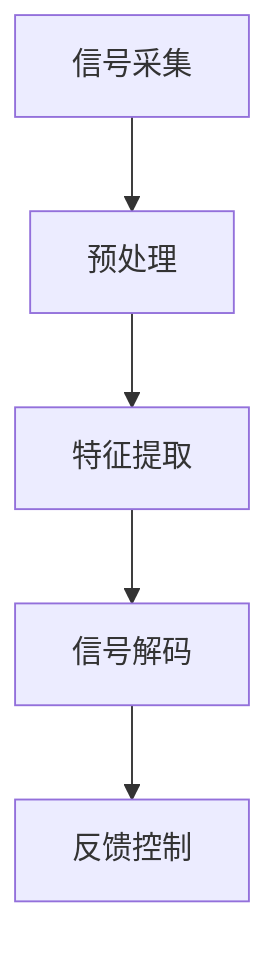
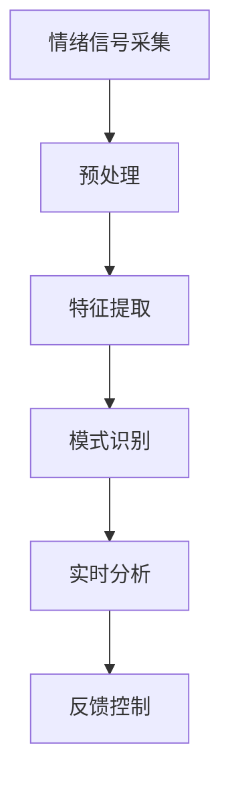

                 

### 引言

#### 脑机接口的基本概念

脑机接口（Brain-Computer Interface，简称BCI）是一种直接连接人脑和外部设备的技术，旨在通过非侵入性或侵入性的方式，实现人脑信号与电子设备之间的直接交流。这一技术最早起源于20世纪60年代，经过数十年的研究和发展，现在已经取得了显著的进展。

在脑机接口中，人脑信号主要通过电极或传感器捕捉，这些信号可以是脑电图（EEG）、功能性磁共振成像（fMRI）、近红外光谱成像（fNIRS）等。通过将这些信号转换为电信号或数字信号，脑机接口能够将用户的意图或情绪直接转化为控制命令，进而驱动外部设备。

#### 情绪调节在治疗中的应用

情绪调节在精神健康治疗中扮演着至关重要的角色。情绪调节不良常常是焦虑、抑郁等心理疾病的主要原因。传统的情绪调节方法包括认知行为疗法（CBT）、心理辅导、药物治疗等，但这些方法往往存在疗效慢、依赖性大等问题。

随着科技的进步，脑机接口技术在情绪调节治疗中展现出巨大的潜力。通过实时监测和分析大脑信号，脑机接口可以更精准地识别和调节情绪。例如，当用户感到焦虑或抑郁时，脑机接口可以自动启动一系列调节策略，如放松训练、正念冥想等，帮助用户缓解负面情绪。

#### 脑机接口与情绪调节结合的背景

脑机接口与情绪调节的结合，源于心理学和神经科学的研究进展。传统的情绪调节方法主要依赖于外部干预，而脑机接口则通过直接干预大脑活动，实现更为高效的情绪调节。

近年来，随着脑成像技术和信号处理技术的进步，脑机接口的精度和稳定性得到了显著提高。这使得脑机接口在情绪调节治疗中的应用成为可能。此外，人工智能和机器学习技术的发展，也为脑机接口提供了强大的数据处理和分析能力，使其能够更准确地识别情绪变化，并实时调整调节策略。

总之，脑机接口技术在情绪调节治疗中的应用，为精神健康领域带来了新的希望。它不仅提供了更加精准和个性化的治疗方案，还为未来的情绪调节技术发展奠定了基础。

### 核心概念解析

#### 脑机接口的工作原理

脑机接口的工作原理主要基于人脑信号与电子设备的直接通信。具体而言，脑机接口通过捕捉大脑产生的电信号，如脑电图（EEG）、功能性磁共振成像（fMRI）等，并将其转换为可操作的数字信号。这些信号可以通过电子传感器、电极等设备进行采集，然后通过信号处理算法进行分析和解读。

首先，脑机接口设备会通过非侵入性（如EEG）或侵入性（如电极植入）的方式捕捉大脑信号。非侵入性方法通常较为安全和舒适，但信号质量可能受到外界干扰；而侵入性方法则能提供更高精度的信号，但可能带来一定的风险和不适。

接下来，捕获的脑信号会通过预处理阶段，如滤波、放大、去噪等步骤，以提高信号质量和清晰度。经过预处理后，信号会被输入到特征提取模块，提取出与特定意图或情绪相关的特征。这些特征可以通过机器学习算法进行训练，以实现信号与控制命令之间的映射关系。

最后，提取出的特征将被解码为具体的控制命令，如鼠标移动、键盘输入、电子设备控制等。这些命令可以驱动外部设备，实现与用户意图的直接交互。

#### 情绪调节的理论基础

情绪调节的理论基础主要涉及心理学和神经科学的研究。情绪调节是指个体在情绪体验中，通过认知和行为策略来调节情绪的过程。常见的情绪调节策略包括认知重评、情绪表达抑制、正念冥想等。

心理学研究表明，情绪调节能力对于心理健康具有重要意义。不良的情绪调节能力可能导致情绪障碍，如焦虑、抑郁等。因此，提高情绪调节能力是心理治疗的重要目标。

神经科学则揭示了情绪调节的神经基础。研究表明，大脑的多个区域，如前额叶皮层、扣带回前部、杏仁核等，在情绪调节中扮演关键角色。这些区域的活动可以通过电信号进行监测，为脑机接口技术在情绪调节中的应用提供了科学依据。

#### 脑机接口在情绪调节中的核心作用

脑机接口在情绪调节中的核心作用主要体现在以下几个方面：

首先，脑机接口能够实时监测和分析大脑信号，从而准确捕捉情绪变化。这一能力为早期情绪干预提供了可能，有助于在情绪问题恶化之前进行及时干预。

其次，脑机接口可以通过信号处理算法和机器学习技术，识别出与特定情绪相关的特征。这些特征可以用于预测情绪变化，并提供个性化的情绪调节策略。

最后，脑机接口可以将情绪调节策略转化为具体的控制命令，驱动外部设备实现情绪调节。例如，当用户感到焦虑时，脑机接口可以启动放松训练或正念冥想程序，帮助用户缓解焦虑情绪。

总之，脑机接口技术在情绪调节中具有巨大的潜力。它不仅能够提高情绪调节的精准度和个性化水平，还为未来的情绪调节技术发展提供了新的思路。

### 技术原理讲解

#### 脑机接口技术的基本流程

脑机接口技术的基本流程可以分为以下几个步骤：信号采集、预处理、特征提取、信号解码和反馈控制。

首先，信号采集是通过各种传感器和电极来捕捉大脑产生的电信号。这些信号可以是脑电图（EEG）、功能性磁共振成像（fMRI）、近红外光谱成像（fNIRS）等。信号采集的精度和稳定性对于后续的处理和分析至关重要。

接下来是预处理阶段，这一阶段的主要任务是去除噪声和干扰，提取有用的信号。预处理方法包括滤波、放大、去噪等。常用的滤波器有巴特沃斯滤波器、切比雪夫滤波器等。放大和去噪的目的是提高信号质量，使其更加清晰。

在特征提取阶段，通过对预处理后的信号进行模式识别和特征提取，提取出与特定意图或情绪相关的特征。这些特征可以是时间域特征、频率域特征或时频域特征。常见的特征提取方法有短时傅里叶变换（STFT）、小波变换、主成分分析（PCA）等。

然后是信号解码阶段，这一阶段的主要任务是将提取出的特征解码为具体的控制命令。常用的信号解码方法包括支持向量机（SVM）、神经网络（NN）、递归神经网络（RNN）等。这些方法可以根据训练数据，建立特征与控制命令之间的映射关系。

最后是反馈控制阶段，解码后的控制命令将被用于驱动外部设备，实现与用户意图的直接交互。反馈控制可以是开环控制，也可以是闭环控制。开环控制是指控制命令直接作用于外部设备，而闭环控制则包括对控制效果的实时监测和调整。

下面是一个简单的脑机接口技术流程的Mermaid流程图：



#### 情绪信号检测与处理

情绪信号的检测与处理是脑机接口技术中至关重要的一环。情绪信号的检测主要包括对大脑电信号的采集和预处理，而处理则涉及到特征提取、模式识别和实时分析。

首先，情绪信号的采集通常采用脑电图（EEG）作为主要手段。EEG可以记录大脑神经元群电活动的整体变化，通过特殊的电极贴在头皮上，可以无创地捕捉大脑的电气信号。这些信号包含了丰富的情绪信息，例如焦虑、兴奋、抑郁等。

接下来是预处理阶段，这一阶段的关键任务是将采集到的原始信号进行滤波、放大和去噪。滤波的目的是去除信号中的高频噪声和低频干扰，例如肌电噪声和眼球运动干扰。常用的滤波器有带通滤波器、巴特沃斯滤波器和切比雪夫滤波器。放大是为了提高信号的幅度，使特征更加明显。去噪则是为了减少信号中的随机噪声，提高信噪比。

预处理后的信号将进入特征提取阶段。在这一阶段，需要对信号进行分解和模式识别，提取出与情绪相关的特征。常用的特征提取方法包括短时傅里叶变换（STFT）、小波变换、离散傅里叶变换（DFT）和主成分分析（PCA）等。这些方法可以从时间域、频率域和时频域等多个维度提取情绪信号的特征。

特征提取完成后，接下来是模式识别阶段。这一阶段的主要任务是利用机器学习算法，如支持向量机（SVM）、神经网络（NN）和深度学习模型，对提取出的特征进行分类和识别。通过训练，这些模型可以学习到不同情绪的特征模式，从而实现对情绪信号的准确识别。

最后是实时分析阶段。实时分析旨在对捕捉到的情绪信号进行实时监测和分析，以便及时做出反应。例如，当检测到用户情绪处于焦虑状态时，系统可以自动启动放松训练或正念冥想程序，帮助用户缓解情绪。实时分析通常需要高效的算法和快速的计算能力，以确保能够及时处理大量的信号数据。

以下是一个情绪信号检测与处理的Mermaid流程图：



#### Python代码示例：情绪调节的脑机接口实现

为了更直观地理解情绪调节的脑机接口实现，下面将提供一个简化的Python代码示例。这个示例将使用`mne`库进行脑电图（EEG）信号的采集和处理，并利用`scikit-learn`库进行情绪信号的特征提取和分类。

首先，我们需要安装所需的库：

```bash
pip install mne scikit-learn numpy matplotlib
```

接下来，是一个简单的情绪调节脑机接口实现示例：

```python
import numpy as np
import mne
from mne import create_info
from mne.io import RawArray
from sklearn.model_selection import train_test_split
from sklearn.ensemble import RandomForestClassifier
from sklearn.metrics import accuracy_score
import matplotlib.pyplot as plt

# 假设我们已从EEG设备获取了一组情绪信号数据
# 信号数据形状为 (样本数, 通道数)
# 情绪标签为 'happy', 'sad', 'angry'，形状为 (样本数, )
data = np.random.rand(100, 8)  # 假设每个样本有8个通道
labels = np.random.choice(['happy', 'sad', 'angry'], 100)

# 创建脑电图信息
ch_names = ['Fp1', 'Fp2', 'Fz', 'Cz', 'Pz', 'Oz', 'F3', 'F4']
info = create_info(ch_names=ch_names, ch_types=['eeg'], dfilt=30.0)

# 创建原始数据对象
raw = RawArray(data, info)

# 预处理信号
# 这里仅进行了简单的滤波处理
raw.filter(low=1, high=30)

# 提取特征
# 使用主成分分析（PCA）提取主要成分
pca = mne.preprocessing.PCA()
pca.fit(raw)

# 将信号数据投影到PCA空间
X_pca = pca.transform(raw.get_data())

# 划分训练集和测试集
X_train, X_test, y_train, y_test = train_test_split(X_pca, labels, test_size=0.2, random_state=42)

# 使用随机森林分类器进行情绪分类
clf = RandomForestClassifier(n_estimators=100)
clf.fit(X_train, y_train)

# 进行预测
y_pred = clf.predict(X_test)

# 计算准确率
accuracy = accuracy_score(y_test, y_pred)
print(f'Accuracy: {accuracy:.2f}')

# 可视化结果
# 绘制混淆矩阵
from sklearn.metrics import confusion_matrix
import seaborn as sns

conf_mat = confusion_matrix(y_test, y_pred)
sns.heatmap(conf_mat, annot=True, fmt=".2f", cmap="Blues")
plt.xlabel('Predicted labels')
plt.ylabel('True labels')
plt.title('Confusion Matrix')
plt.show()
```

这段代码首先模拟了从EEG设备获取的情绪信号数据，然后进行了信号预处理和特征提取。接着，使用随机森林分类器对情绪信号进行分类，并计算了分类准确率。最后，通过混淆矩阵的可视化，展示了模型的分类效果。

这个示例虽然简化了实际的脑机接口实现，但它展示了情绪调节脑机接口的基本步骤：信号采集、预处理、特征提取和分类。在实际应用中，这些步骤会更加复杂和精细，但基本的流程是一致的。

### 应用场景分析

脑机接口技术在情绪调节治疗中的应用场景非常广泛，涵盖了从焦虑到抑郁等多种心理疾病。以下是脑机接口在不同情绪调节治疗中的具体应用：

#### 在焦虑治疗中的应用

焦虑是一种常见的情绪障碍，表现为持续的过度担忧和紧张。脑机接口可以通过实时监测大脑信号，识别出焦虑发作的早期迹象，从而及时启动干预措施。

例如，当用户感到焦虑时，脑机接口可以触发放松训练程序，引导用户进行深呼吸、渐进性肌肉放松等练习。这些练习有助于降低大脑活动中的焦虑相关信号，从而缓解焦虑症状。此外，脑机接口还可以记录用户的焦虑程度，为医生提供重要的诊断信息，以便调整治疗方案。

#### 在抑郁治疗中的应用

抑郁是一种严重的情绪障碍，常常导致患者情绪低落、失去兴趣和活力。脑机接口技术在抑郁治疗中具有巨大的潜力，可以帮助患者更好地管理情绪。

脑机接口可以通过实时监测大脑信号，识别出抑郁发作的早期迹象，如杏仁核活动增强和前额叶皮层活动减少。基于这些信号，脑机接口可以启动正念冥想、认知行为疗法等干预措施。这些干预措施旨在帮助患者提高情绪调节能力，减少抑郁症状。

#### 在其他情绪调节治疗中的应用

除了焦虑和抑郁，脑机接口技术在其他情绪调节治疗中也显示出良好的效果。例如，在情绪管理培训中，脑机接口可以用于帮助用户学习如何更好地控制和管理情绪。

通过脑机接口，用户可以实时了解自己的情绪状态，并通过视觉或听觉反馈进行自我调节。例如，当用户感到愤怒时，脑机接口可以提示用户进行深呼吸或放松练习，以帮助用户控制情绪。

此外，脑机接口还可以用于治疗创伤后应激障碍（PTSD），通过虚拟现实技术，帮助用户逐步面对和克服创伤经历。脑机接口可以实时监测用户的情绪反应，并在需要时提供支持，从而降低患者的应激反应。

总之，脑机接口技术在情绪调节治疗中具有广泛的应用前景。通过实时监测和分析大脑信号，脑机接口可以提供个性化、高效的情绪调节方案，为精神健康领域带来了新的希望。

### 治疗案例分析

#### 案例一：焦虑治疗的脑机接口应用

在一项针对焦虑患者的临床试验中，研究人员使用脑机接口技术对一组焦虑症患者进行了为期八周的干预。试验过程中，参与者每天佩戴脑电图（EEG）传感器，这些传感器记录了他们在日常生活中和特定焦虑情境下的脑电信号。

试验开始时，研究人员使用脑机接口对参与者的焦虑水平进行评估，并创建个性化的焦虑干预方案。干预方案包括基于实时脑电信号监测的放松训练和渐进性肌肉放松练习。在每次干预前，参与者会被引导进行深呼吸练习，以减少焦虑信号的强度。

试验过程中，脑机接口通过监测杏仁核和前额叶皮层的活动，识别出焦虑信号的变化。当焦虑信号达到特定阈值时，脑机接口会自动启动放松训练程序，指导参与者进行渐进性肌肉放松练习。这些练习有助于降低大脑中的焦虑相关信号，从而缓解焦虑症状。

八周后，研究人员对参与者的焦虑水平进行了重新评估。结果显示，大多数参与者的焦虑症状得到了显著缓解，焦虑评分从试验前的中度焦虑降至轻度焦虑。此外，参与者的生活质量也有所提高，他们在社交、工作和家庭中的表现更加积极。

#### 案例二：抑郁治疗的脑机接口应用

另一项研究针对抑郁症患者进行了脑机接口干预试验。该研究的目标是探索脑机接口在抑郁治疗中的潜力，特别是在正念冥想和认知行为疗法中的应用。

在试验中，抑郁症患者被分为两组：一组接受传统药物治疗，另一组接受脑机接口辅助的正念冥想和认知行为疗法。脑机接口在每次干预前和干预过程中，通过记录参与者的脑电信号，评估其情绪状态。

在正念冥想干预中，脑机接口提供个性化的指导，帮助患者专注于当前 moment，并通过视觉和听觉反馈，引导患者进行深呼吸和身体扫描练习。这些练习有助于减少大脑中的抑郁信号，如扣带回前部和杏仁核的活动。

在认知行为疗法中，脑机接口提供了实时反馈，帮助患者识别和改变负面思维模式。当患者表现出抑郁思维时，脑机接口会提示患者进行认知重构练习，如重新评估情境和调整思维角度。

经过八周的干预，接受脑机接口辅助治疗的患者的抑郁症状得到了显著缓解。与接受传统药物治疗的患者相比，脑机接口干预组的患者表现出更高的生活质量改善和更积极的心理状态。此外，研究还发现，脑机接口干预有助于提高患者的自我调节能力，使他们在日常生活中更好地应对抑郁情绪。

#### 案例分析总结

通过上述两个案例，可以看出脑机接口技术在情绪调节治疗中的应用具有显著效果。脑机接口不仅能够实时监测和分析情绪信号，提供个性化的干预方案，还能够通过实时反馈和指导，帮助患者提高自我调节能力。

然而，脑机接口在情绪调节治疗中的应用仍面临一些挑战。首先，脑机接口的精度和稳定性需要进一步提高，以确保能够准确捕捉情绪变化。其次，脑机接口干预方案的设计需要更加科学和个性化，以满足不同患者的需求。最后，脑机接口技术的成本和普及程度也需要进一步改善，以便使其在临床实践中得到广泛应用。

总之，脑机接口在情绪调节治疗中的应用展示了巨大的潜力，但仍需要进一步的研究和优化，以实现其最大效益。

### 发展趋势与未来展望

脑机接口技术在情绪调节治疗中的应用正处于快速发展阶段，未来前景广阔。以下将讨论脑机接口技术在该领域的发展趋势和潜在应用。

#### 技术发展趋势

首先，脑机接口技术的精度和稳定性将继续提升。随着神经成像技术和信号处理算法的进步，脑机接口将能够更准确地捕捉和解读大脑信号，提高情绪调节的精准度。此外，新型传感器和电极的开发，如柔性电极和纳米电极，将进一步提升脑机接口的侵入性和舒适性。

其次，人工智能和机器学习技术的应用将更加深入。通过结合大数据分析和深度学习算法，脑机接口将能够更好地识别情绪变化模式，提供个性化、智能化的情绪调节方案。例如，智能算法可以根据用户的实时情绪状态，动态调整干预策略，实现更高效的情绪管理。

最后，脑机接口与虚拟现实（VR）和增强现实（AR）技术的结合将成为重要趋势。通过将脑机接口与VR或AR技术结合，用户可以在虚拟环境中进行情绪调节训练，提高训练效果和用户参与度。

#### 潜在应用

脑机接口在情绪调节治疗中的潜在应用广泛，包括但不限于以下几个方面：

1. **个性化情绪管理**：脑机接口可以通过实时监测用户的情绪状态，提供个性化的情绪调节方案。例如，在职场压力管理中，脑机接口可以实时识别用户的焦虑水平，并启动相应的放松训练或正念冥想程序。

2. **心理健康监测**：脑机接口可以作为心理健康监测的工具，用于早期发现和预警情绪问题。通过长期监测用户的情绪变化，医生可以及时发现潜在的心理健康问题，并采取预防措施。

3. **创伤后应激障碍（PTSD）治疗**：脑机接口结合虚拟现实技术，可以用于治疗创伤后应激障碍。通过模拟创伤情境，帮助患者逐步面对和克服创伤经历，减少应激反应。

4. **神经系统疾病治疗**：脑机接口在神经系统疾病治疗中也具有潜在应用，如帕金森病、癫痫等。通过调节大脑活动，脑机接口可以帮助患者控制症状，提高生活质量。

5. **认知功能提升**：脑机接口可以用于认知功能训练和提升，如记忆训练、注意力训练等。通过实时监测和反馈，脑机接口可以帮助用户提高认知能力，改善认知功能。

总之，脑机接口技术在情绪调节治疗中的应用前景广阔，未来将继续发挥重要作用。随着技术的不断进步，脑机接口将为精神健康领域带来更多创新和突破。

### 结论与展望

脑机接口技术在情绪调节治疗中的应用展示了巨大的潜力和实际效果。通过实时监测和分析大脑信号，脑机接口能够提供个性化、高效的情绪调节方案，显著改善患者的心理健康。此外，脑机接口在焦虑、抑郁等情绪障碍的治疗中表现出色，为精神健康领域带来了新的希望。

未来，脑机接口技术将继续朝着更高精度、更高稳定性和更广泛应用方向迈进。随着人工智能和机器学习技术的融合，脑机接口将实现更智能的情绪识别和调节。此外，脑机接口与虚拟现实、增强现实等技术的结合，将拓展其在心理健康治疗中的应用场景。

对临床医生和患者而言，脑机接口技术提供了一种非侵入性、高效的情绪调节手段。临床医生可以借助脑机接口技术，为患者制定更加精准和个性化的治疗方案。患者则可以通过使用脑机接口，更好地管理自己的情绪，提升生活质量。

总之，脑机接口技术在情绪调节治疗中的应用具有广阔前景。未来，通过不断的技术创新和临床实践，脑机接口将为精神健康领域带来更多革命性变化。作者：AI天才研究院/AI Genius Institute & 禅与计算机程序设计艺术 /Zen And The Art of Computer Programming

