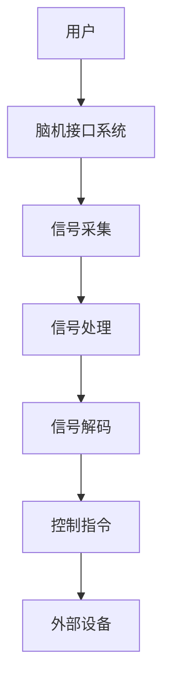
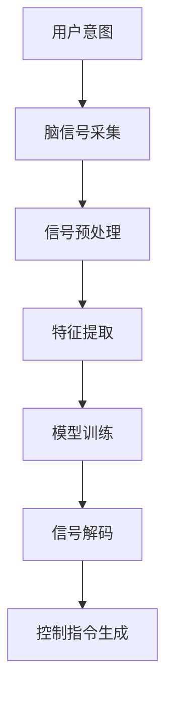

                 

# 《脑机接口在运动技能增强中的应用前景》

## 关键词
脑机接口，运动技能增强，脑信号检测，脑信号解码，运动技能评估，运动技能训练

## 摘要
脑机接口技术作为连接大脑与外部设备的新型桥梁，近年来在运动技能增强领域展现出了广阔的应用前景。本文首先介绍了脑机接口技术的发展背景及其基本原理，包括脑信号检测、解码与编码技术，以及硬件和软件系统。随后，文章深入探讨了脑机接口在运动技能评估、训练和康复中的应用，通过具体案例展示了其在运动技能增强中的实际效果。最后，本文提出了脑机接口在运动技能增强领域的发展趋势和挑战，并提出了相应的解决方案和未来研究方向。

## 第1章 引言

### 1.1 脑机接口技术的发展背景

#### 1.1.1 脑机接口的定义与历史

脑机接口（Brain-Computer Interface, BCI）是一种直接连接大脑与外部设备的技术，旨在实现人类大脑与计算机或其他机器之间的直接通信。最早期的脑机接口技术可以追溯到20世纪60年代，科学家们通过电生理学方法记录大脑神经元活动，以控制外部设备。

#### 1.1.2 脑机接口技术的发展历程

脑机接口技术经历了从简单的电生理信号记录到复杂的信号处理、解码与编码技术的发展过程。20世纪80年代，随着计算机技术和信号处理算法的进步，脑机接口技术开始逐渐应用于临床康复和辅助沟通等领域。

#### 1.1.3 脑机接口技术的当前应用领域

目前，脑机接口技术在多个领域都有应用，包括康复医疗、辅助沟通、娱乐和运动技能增强等。在康复医疗领域，脑机接口技术被用于帮助中风患者恢复运动功能，辅助肢体瘫痪患者进行日常活动。在娱乐领域，脑机接口技术被用于开发智能游戏和交互式娱乐体验。

### 1.2 运动技能增强的重要性

#### 1.2.1 运动技能在生活与职业中的应用

运动技能是日常生活中不可或缺的一部分，无论是在职业领域还是在休闲活动中，良好的运动技能都能提高生活质量和工作效率。例如，在体育运动中，精湛的运动技能可以提升比赛成绩；在职业领域，如工程和制造业中，良好的运动技能可以减少工伤风险。

#### 1.2.2 运动技能增强的理论基础

运动技能增强的理论基础主要涉及神经可塑性、学习理论和运动控制理论。神经可塑性是指神经系统在结构和功能上的适应性变化，这种变化可以通过反复训练实现。学习理论则解释了如何通过练习和反馈来改进运动技能。运动控制理论关注于如何优化运动过程中的神经控制机制。

#### 1.2.3 运动技能增强的现状与挑战

目前，运动技能增强主要通过传统的训练方法和辅助设备来实现。然而，这些方法存在一定的局限性，如训练效果不稳定、耗时较长等。脑机接口技术为运动技能增强提供了一种新的途径，可以实时监测和反馈大脑活动，从而提高训练效果和效率。

### 1.3 脑机接口在运动技能增强中的应用

#### 1.3.1 脑机接口技术在运动技能评估中的应用

脑机接口技术可以用于实时监测和评估运动员的运动技能水平。通过分析脑电信号和fMRI数据，可以深入了解运动员的神经活动模式，从而为个性化训练方案提供依据。

#### 1.3.2 脑机接口技术在运动技能训练中的应用

脑机接口技术可以用于设计智能训练系统，通过实时反馈和调整，帮助运动员优化运动技能。此外，脑机接口还可以用于辅助康复训练，帮助患者恢复运动功能。

#### 1.3.3 脑机接口技术在康复训练中的应用

脑机接口技术被广泛应用于康复训练中，帮助患者恢复肢体功能和改善生活质量。通过脑机接口技术，康复训练可以更加个性化、精准化，提高康复效果。

### 1.4 本书结构安排

#### 1.4.1 各章节主要内容

本书分为四个部分，第一部分介绍了脑机接口技术的发展背景和基本原理；第二部分探讨了脑机接口在运动技能评估中的应用；第三部分分析了脑机接口在运动技能训练中的应用；第四部分提出了脑机接口在运动技能增强领域的未来发展趋势和挑战。

#### 1.4.2 阅读建议

建议读者先了解脑机接口的基本原理和技术，然后逐步深入到具体应用领域，如运动技能评估和训练。在阅读过程中，读者可以结合实际案例进行分析，以加深对脑机接口技术的理解。

### 1.5 本章小结

本章介绍了脑机接口技术的发展背景及其在运动技能增强中的应用前景。脑机接口技术作为一种新兴技术，正在逐渐改变运动技能评估和训练的方式，为运动员和康复患者提供了新的解决方案。随着技术的不断发展，脑机接口在运动技能增强中的应用将会更加广泛和深入。

----------------------------------------------------------------

## 第2章 脑机接口基本原理

### 2.1 脑信号检测技术

#### 2.1.1 脑电信号检测技术

脑电信号检测技术是脑机接口技术的基础，它通过记录大脑神经元的电活动来获取脑信号。脑电图（Electroencephalogram, EEG）是一种常见的脑电信号检测方法，它使用放置在头皮上的电极来捕捉脑电信号。

##### 2.1.1.1 脑电图（EEG）原理

脑电图（EEG）是通过记录大脑皮层神经元群放电产生的电势差来获取脑电信号的。每个神经元放电会产生微弱的电信号，这些信号在头皮上形成一定的电场，通过电极可以被检测和记录。

##### 2.1.1.2 脑电信号处理方法

脑电信号处理方法主要包括信号预处理、特征提取和模式识别。信号预处理包括滤波、降噪和去伪等步骤，以提高信号的质量和可解释性。特征提取是通过提取信号中的关键特征，如频率、时间序列和时域特征，来表征脑电信号。模式识别则是通过机器学习算法，将提取的特征与特定任务关联起来，以实现脑机接口的控制。

#### 2.1.2 功能磁共振成像（fMRI）技术

功能磁共振成像（Functional Magnetic Resonance Imaging, fMRI）是另一种常用的脑信号检测技术。它通过测量大脑区域血氧水平依赖（Blood Oxygen Level Dependent, BOLD）信号的改变来检测大脑的活动。

##### 2.1.2.1 fMRI原理

fMRI技术利用磁场和射频脉冲来激发身体中的氢原子核，产生磁共振信号。当大脑区域的活动增加时，该区域的血液流量和代谢率也会增加，从而导致BOLD信号的变化。通过检测这些变化，可以推断大脑的活动模式。

##### 2.1.2.2 fMRI信号处理方法

fMRI信号处理方法主要包括数据预处理、空间标准化和统计分析。数据预处理包括图像校正、运动校正和去除噪声等步骤，以提高图像的质量和准确性。空间标准化则是将个体的fMRI数据与标准脑模板对齐，以便于不同个体之间的比较。统计分析则用于识别大脑活动与特定任务之间的关联。

### 2.2 脑信号解码与编码技术

#### 2.2.1 脑信号解码技术

脑信号解码技术是指将捕捉到的脑信号转换为具体的指令或控制信号。脑信号解码技术可以分为模型驱动解码和数据驱动解码两种方法。

##### 2.2.1.1 模型驱动解码方法

模型驱动解码方法依赖于预先建立的大脑活动与任务执行的数学模型。通过训练模型，可以将捕捉到的脑信号映射到具体的控制指令。这种方法需要大量的数据来训练模型，但一旦模型建立成功，解码效率较高。

##### 2.2.1.2 数据驱动解码方法

数据驱动解码方法则不需要预先建立模型，而是通过直接分析捕捉到的脑信号来提取控制信息。这种方法在处理未知或复杂任务时具有优势，但解码准确性可能较低。

#### 2.2.2 脑信号编码技术

脑信号编码技术是指将外部指令或控制信号转换为脑信号，以驱动外部设备。脑信号编码技术可以通过电刺激、磁刺激或光刺激等方式实现。

##### 2.2.2.1 编码原理

编码原理基于大脑对刺激的反应机制。通过调节刺激的参数，如频率、强度和持续时间，可以引发特定的脑活动模式，从而实现控制指令的传递。

##### 2.2.2.2 编码应用场景

脑信号编码技术可以应用于多种场景，如大脑控制轮椅、假肢和智能游戏等。通过实时解码和编码，可以实现人与机器的实时交互。

### 2.3 脑机接口硬件与软件系统

#### 2.3.1 脑机接口硬件系统

脑机接口硬件系统包括信号采集装置、传输设备和接口设备。信号采集装置负责捕捉脑信号，传输设备用于将信号传输到计算机或其他处理设备，接口设备则用于与外部设备进行通信。

##### 2.3.1.1 硬件组件介绍

常见的脑机接口硬件组件包括电极、放大器、滤波器、A/D转换器和无线传输模块等。每种组件都有其特定的功能和作用。

##### 2.3.1.2 硬件选型与优化

硬件选型与优化是脑机接口系统设计的重要环节。根据应用场景和要求，选择合适的硬件组件，并进行性能优化，可以提高系统的可靠性和性能。

#### 2.3.2 脑机接口软件系统

脑机接口软件系统包括信号处理、解码和编码算法，以及用户界面。软件系统负责处理和分析捕捉到的脑信号，并将其转换为控制指令或反馈信号。

##### 2.3.2.1 软件架构设计

脑机接口软件架构设计应考虑模块化、可扩展性和灵活性。常见的软件架构包括客户端-服务器架构和事件驱动架构等。

##### 2.3.2.2 软件开发工具与平台

脑机接口软件开发可以使用多种工具和平台，如Python、MATLAB、C++和Java等。根据具体需求和技能，选择合适的工具和平台可以加快开发进程和提高开发效率。

### 2.4 脑机接口安全性与伦理问题

#### 2.4.1 安全性挑战

脑机接口技术面临多种安全性挑战，包括信号泄露、干扰和恶意攻击等。确保脑机接口系统的安全性和稳定性是开发过程中的关键问题。

##### 2.4.1.1 技术风险

技术风险主要包括信号处理算法的漏洞、硬件系统的安全漏洞和软件系统的安全性问题。通过使用加密和认证技术，可以降低技术风险。

##### 2.4.1.2 数据隐私问题

脑机接口系统涉及敏感的脑信号数据，保护数据隐私是至关重要的。通过数据加密和隐私保护技术，可以确保数据的机密性和完整性。

#### 2.4.2 伦理问题

脑机接口技术引发了多种伦理问题，包括隐私、安全性和公平性等。建立伦理规范和法规，确保脑机接口技术的合理和规范使用，是未来发展的重要方向。

##### 2.4.2.1 伦理规范与法规

伦理规范与法规是指导脑机接口技术发展的基础。国际组织和国家机构应制定相关伦理规范和法规，以规范脑机接口技术的应用和发展。

##### 2.4.2.2 社会影响与伦理挑战

脑机接口技术的社会影响和伦理挑战需要引起广泛关注。通过公众参与和专家咨询，可以更好地解决社会和伦理问题，推动脑机接口技术的可持续发展。

### 2.5 本章小结

本章介绍了脑机接口技术的基本原理，包括脑信号检测、解码与编码技术，以及硬件和软件系统。此外，本章还探讨了脑机接口技术面临的安全性与伦理问题。通过理解这些基本原理和问题，可以为脑机接口技术在运动技能增强中的应用提供指导和支持。

----------------------------------------------------------------

## 第3章 脑机接口在运动技能评估中的应用

### 3.1 运动技能评估的重要性

#### 3.1.1 运动技能评估的定义

运动技能评估是指通过系统的测试和测量方法，对个体在特定运动任务中的运动能力、技术水平和表现进行评价。它不仅有助于了解个体的运动能力，还能为教练、运动员和康复专家提供重要的参考信息，以制定针对性的训练计划。

#### 3.1.2 运动技能评估的目的

运动技能评估的主要目的是：

1. 诊断：评估个体在特定运动任务中的优势和劣势，帮助确定改进方向。
2. 训练：为教练和运动员提供科学的训练依据，优化训练策略。
3. 康复：帮助康复专家评估康复进展，制定康复计划。
4. 比较：通过比较不同个体或团队的表现，评估整体运动水平和竞争力。

#### 3.1.3 运动技能评估的方法

运动技能评估的方法多种多样，包括：

1. 观察评估：通过教练或专家的现场观察和记录，评估运动技能表现。
2. 测试评估：使用标准化的运动测试和测量工具，对运动技能进行量化评估。
3. 视频分析：通过视频回放，对运动技术进行详细分析。
4. 生物力学分析：使用传感器和测量设备，分析运动过程中身体各部位的动作和力量。

### 3.2 脑机接口在运动技能评估中的关键技术

#### 3.2.1 脑电信号采集与分析

脑电信号（EEG）采集与分析是脑机接口在运动技能评估中的核心技术之一。通过捕捉运动员在进行特定运动任务时的脑电信号，可以分析其大脑活动模式，从而评估运动技能水平。

##### 3.2.1.1 脑电信号采集流程

脑电信号采集流程通常包括以下步骤：

1. 电极安置：将电极粘贴在头皮上，通常选择特定的位置，以捕捉感兴趣的大脑区域活动。
2. 信号放大：通过放大器放大脑电信号，以提高信号质量。
3. 信号滤波：使用滤波器去除噪声和干扰信号，确保信号的真实性和可靠性。
4. 信号数字化：使用A/D转换器将模拟信号转换为数字信号，以便后续处理和分析。

##### 3.2.1.2 脑电信号分析算法

脑电信号分析算法主要包括以下几类：

1. 时域分析：分析脑电信号的时域特征，如振幅、频率和时序等。
2. 频域分析：分析脑电信号的频域特征，如不同频段的能量分布。
3. 小波变换：通过小波变换分析脑电信号的时频特征，提高信号分析的准确性。
4. 机器学习算法：使用机器学习算法对脑电信号进行模式识别和分类，以评估运动技能水平。

#### 3.2.2 功能磁共振成像（fMRI）在运动技能评估中的应用

功能磁共振成像（fMRI）是另一种在运动技能评估中具有重要应用的脑机接口技术。通过测量大脑区域血氧水平依赖（BOLD）信号的变化，可以分析大脑活动与特定运动技能之间的关联。

##### 3.2.2.1 fMRI数据采集

fMRI数据采集通常包括以下步骤：

1. 受试者准备：确保受试者在扫描过程中保持静止，避免信号干扰。
2. 扫描参数设置：根据研究目的选择合适的扫描参数，如场强、扫描时间和层厚等。
3. 数据采集：通过磁共振成像设备采集大脑的fMRI数据。

##### 3.2.2.2 fMRI数据处理

fMRI数据处理包括以下步骤：

1. 图像预处理：包括运动校正、空间标准化和去除噪声等步骤，以提高图像质量。
2. 功能相关分析：分析fMRI数据中BOLD信号的变化，以识别大脑活动与特定运动技能之间的关联。
3. 统计分析：使用统计方法，如t检验和方差分析，识别显著的大脑活动区域。

### 3.3 脑机接口在运动技能评估中的案例分析

#### 3.3.1 案例一：脑电信号在篮球运动技能评估中的应用

##### 3.3.1.1 案例背景

篮球是一项对运动技能要求较高的体育运动，评估篮球运动员的运动技能水平对于提高比赛成绩和优化训练策略至关重要。本案例旨在通过脑电信号评估篮球运动员的篮球运动技能。

##### 3.3.1.2 案例实施

1. 受试者准备：选取10名篮球运动员，年龄在18-25岁之间，具有一定的篮球比赛经验。
2. 脑电信号采集：在篮球比赛过程中，将电极粘贴在受试者头皮上，实时捕捉脑电信号。
3. 数据分析：使用脑电信号分析算法，提取受试者在篮球比赛中的脑电特征，并进行模式识别和分类。

##### 3.3.1.3 案例结果与分析

1. 结果展示：通过脑电信号分析，成功将受试者的篮球运动技能分为高、中、低三个水平。
2. 分析结论：脑电信号在篮球运动技能评估中具有较高的准确性，可以为教练和运动员提供重要的参考信息。

#### 3.3.2 案例二：fMRI在体操运动技能评估中的应用

##### 3.3.2.1 案例背景

体操是一项对运动员运动技能和技术要求极高的体育运动。本案例旨在通过fMRI技术评估体操运动员的体操运动技能。

##### 3.3.2.2 案例实施

1. 受试者准备：选取10名体操运动员，年龄在16-22岁之间，具有一定的体操比赛经验。
2. fMRI数据采集：在体操比赛过程中，使用fMRI设备实时采集运动员的大脑活动数据。
3. 数据分析：使用fMRI数据处理算法，分析运动员在体操比赛中的大脑活动模式，并与运动技能水平进行关联分析。

##### 3.3.2.3 案例结果与分析

1. 结果展示：通过fMRI数据分析，成功将受试者的体操运动技能分为高、中、低三个水平。
2. 分析结论：fMRI技术在体操运动技能评估中具有较高的准确性和可靠性，可以为教练和运动员提供科学依据。

### 3.4 本章小结

本章介绍了脑机接口技术在运动技能评估中的应用，包括脑电信号采集与分析、fMRI技术应用以及具体案例分析。通过脑机接口技术，可以实现对运动员运动技能的实时评估，为教练和运动员提供科学依据。未来，随着脑机接口技术的不断发展和完善，其在运动技能评估中的应用将更加广泛和深入。

----------------------------------------------------------------

## 第4章 脑机接口在运动技能训练中的应用

### 4.1 运动技能训练的重要性

#### 4.1.1 运动技能训练的定义

运动技能训练是指通过系统的练习和指导，提高个体在特定运动项目中的技术水平、动作流畅性和表现能力的过程。它是运动训练的核心内容，对于运动员的竞技水平和运动成绩具有重要影响。

#### 4.1.2 运动技能训练的目的

运动技能训练的主要目的是：

1. 提高运动技术水平：通过反复练习，使运动员掌握正确的动作技巧，提高动作的稳定性和精确性。
2. 增强身体素质：通过系统的体能训练，提高运动员的速度、力量、耐力和灵活性等身体素质。
3. 提升心理素质：通过心理训练，培养运动员的自信心、专注力和应变能力，提高比赛中的心理稳定性。
4. 优化战术策略：通过战术训练，帮助运动员掌握比赛中的战术运用，提高比赛策略和决策能力。

#### 4.1.3 运动技能训练的方法

运动技能训练的方法多种多样，包括：

1. 反复练习：通过反复的练习，使运动员熟练掌握动作技巧，提高动作的稳定性和流畅性。
2. 模仿训练：通过模仿优秀运动员的动作，学习正确的技巧和姿势。
3. 分解训练：将复杂的运动技能分解为简单的动作单元，逐一进行训练。
4. 实战训练：通过模拟比赛环境，提高运动员的实战能力和应变能力。
5. 心理训练：通过心理训练，提高运动员的心理素质和比赛状态。

### 4.2 脑机接口在运动技能训练中的关键技术

#### 4.2.1 脑电信号训练方法

脑电信号训练方法是指通过分析运动员的脑电信号，实时监测其大脑活动，提供个性化的训练指导和反馈。这种方法能够有效提高训练的针对性和效果。

##### 4.2.1.1 脑电信号采集与反馈

脑电信号采集与反馈的步骤包括：

1. 电极安置：将电极粘贴在运动员的头皮上，以捕捉大脑活动。
2. 信号采集：使用脑电信号采集设备，实时记录运动员在训练过程中的脑电信号。
3. 数据分析：使用脑电信号分析算法，提取运动员的脑电特征。
4. 反馈与指导：根据脑电信号分析结果，提供个性化的训练建议和反馈。

##### 4.2.1.2 脑电信号特征提取

脑电信号特征提取是脑电信号训练方法的核心步骤，主要包括以下几种方法：

1. 时域特征：分析脑电信号的振幅、频率和时序等时域特征。
2. 频域特征：分析脑电信号的频域特征，如不同频段的能量分布。
3. 小波变换：通过小波变换分析脑电信号的时频特征，提高信号分析的准确性。
4. 机器学习算法：使用机器学习算法对脑电信号进行模式识别和分类，提取关键特征。

#### 4.2.2 脑机接口训练系统的设计与实现

脑机接口训练系统的设计与实现是脑电信号训练方法的关键环节，主要包括以下方面：

1. 系统架构设计：设计脑机接口训练系统的整体架构，包括信号采集模块、数据分析模块、反馈指导模块等。
2. 信号采集模块：实现脑电信号的实时采集和预处理，提高信号的质量和可靠性。
3. 数据分析模块：使用先进的信号处理和机器学习算法，对脑电信号进行特征提取和分析。
4. 反馈指导模块：根据分析结果，提供个性化的训练建议和反馈，帮助运动员优化训练。

### 4.3 脑机接口在运动技能训练中的案例分析

#### 4.3.1 案例一：脑电信号在篮球运动技能训练中的应用

##### 4.3.1.1 案例背景

篮球是一项对抗性强的运动项目，对运动员的技能和技术要求较高。本案例旨在通过脑电信号训练方法，提高篮球运动员的投篮技能。

##### 4.3.1.2 案例实施

1. 受试者准备：选取10名篮球运动员，年龄在18-25岁之间，具有一定的篮球比赛经验。
2. 脑电信号采集：在运动员进行投篮训练时，将电极粘贴在头皮上，实时捕捉脑电信号。
3. 数据分析：使用脑电信号分析算法，提取运动员在投篮过程中的脑电特征。
4. 训练指导：根据脑电信号分析结果，提供个性化的投篮技巧训练建议。

##### 4.3.1.3 案例结果与分析

1. 结果展示：通过脑电信号训练，运动员的投篮准确率显著提高，投篮动作的流畅性和稳定性也得到改善。
2. 分析结论：脑电信号训练方法在篮球运动技能训练中具有显著效果，可以为教练和运动员提供科学依据。

#### 4.3.2 案例二：脑机接口在羽毛球运动技能训练中的应用

##### 4.3.2.1 案例背景

羽毛球是一项对运动员技能和技术要求较高的运动项目。本案例旨在通过脑机接口训练方法，提高羽毛球运动员的击球技能。

##### 4.3.2.2 案例实施

1. 受试者准备：选取10名羽毛球运动员，年龄在16-22岁之间，具有一定的羽毛球比赛经验。
2. 脑电信号采集：在运动员进行击球训练时，将电极粘贴在头皮上，实时捕捉脑电信号。
3. 数据分析：使用脑电信号分析算法，提取运动员在击球过程中的脑电特征。
4. 训练指导：根据脑电信号分析结果，提供个性化的击球技巧训练建议。

##### 4.3.2.3 案例结果与分析

1. 结果展示：通过脑机接口训练，运动员的击球速度、准确性和力量都得到显著提高。
2. 分析结论：脑机接口训练方法在羽毛球运动技能训练中具有显著效果，可以为教练和运动员提供科学依据。

### 4.4 本章小结

本章介绍了脑机接口在运动技能训练中的应用，包括脑电信号训练方法及其在篮球和羽毛球运动技能训练中的应用案例。脑机接口技术通过实时监测和分析运动员的脑电信号，提供个性化的训练指导和反馈，有效提高了运动技能训练的效果。随着脑机接口技术的不断发展，其在运动技能训练中的应用前景将更加广阔。

----------------------------------------------------------------

## 第5章 脑机接口在运动技能增强中的挑战与未来发展方向

### 5.1 挑战

尽管脑机接口技术在运动技能增强中展现出了巨大的潜力，但在实际应用中仍面临诸多挑战：

#### 5.1.1 技术挑战

1. **信号质量与稳定性**：脑信号检测的准确性和稳定性是脑机接口技术的核心问题。噪声、干扰和设备误差都会影响信号的采集和分析。
2. **信号处理与解码**：脑信号的处理和解码算法复杂，需要大量的计算资源和时间。此外，算法的准确性和鲁棒性也是一个关键问题。
3. **设备可靠性**：脑机接口设备的可靠性直接影响到训练和康复的效果。设备的耐用性、舒适性以及与大脑信号的高效耦合都是需要考虑的因素。

#### 5.1.2 伦理与隐私问题

1. **数据隐私**：脑机接口技术涉及敏感的脑信号数据，如何保护用户的数据隐私是关键问题。
2. **技术滥用**：脑机接口技术的潜在滥用问题，如黑客攻击、数据泄露等，需要严格的安全措施来防止。
3. **伦理规范**：脑机接口技术的伦理问题，如人机界限、身份认证等，需要建立明确的伦理规范和法规。

#### 5.1.3 成本问题

脑机接口技术的研发和应用成本较高，限制了其在日常训练和康复中的应用。降低成本、提高性价比是未来发展的关键。

### 5.2 未来发展方向

#### 5.2.1 技术优化与集成

1. **信号处理算法优化**：通过开发更高效、更准确的信号处理算法，提高脑信号检测和解码的效率和质量。
2. **跨学科合作**：加强脑机接口技术与其他学科（如生物医学工程、心理学、神经科学等）的合作，促进技术的综合应用。
3. **硬件设备集成**：开发更小巧、更舒适的脑机接口设备，提高用户的佩戴体验。

#### 5.2.2 应用场景拓展

1. **康复领域**：脑机接口技术在康复训练中的应用已经取得了显著成果，未来可以进一步拓展到慢性病管理、老年痴呆等疾病的治疗。
2. **日常训练**：脑机接口技术可以应用于日常运动训练，如智能健身、竞技体育等，为运动员提供更科学的训练方案。
3. **教育培训**：脑机接口技术可以用于教育培训，如虚拟现实教学、在线互动等，提高教育质量和互动性。

#### 5.2.3 伦理与法律规范

1. **伦理研究**：加强脑机接口技术的伦理研究，制定明确的伦理规范和指导原则。
2. **法律法规**：建立完善的法律法规体系，确保脑机接口技术的合法、合规使用。
3. **公众参与**：鼓励公众参与脑机接口技术的讨论和决策，提高公众对技术的认知和理解。

### 5.3 本章小结

脑机接口技术在运动技能增强中具有广阔的应用前景，但同时也面临着技术、伦理和成本等多方面的挑战。通过技术优化、应用场景拓展和伦理法律规范，可以推动脑机接口技术在运动技能增强中的发展。未来，脑机接口技术有望成为运动技能增强的重要工具，为人类带来更多福祉。

----------------------------------------------------------------

## 附录

### 附录A：技术术语解释

- **脑机接口（BCI）**：一种直接连接大脑与外部设备的技术，旨在实现人类大脑与计算机或其他机器之间的直接通信。
- **脑电图（EEG）**：通过记录大脑神经元放电产生的电势差来获取脑电信号。
- **功能磁共振成像（fMRI）**：通过测量大脑区域血氧水平依赖（BOLD）信号的改变来检测大脑的活动。
- **神经可塑性**：神经系统在结构和功能上的适应性变化。
- **信号处理**：对捕捉到的信号进行滤波、降噪、特征提取等操作，以提高信号的质量和可解释性。
- **模式识别**：通过机器学习算法，将提取的特征与特定任务关联起来，以实现脑机接口的控制。

### 附录B：脑机接口系统架构图

### 附录C：脑信号解码算法流程图

### 附录D：脑机接口在运动技能训练中的应用案例

#### 案例一：篮球运动员投篮技能训练

- **背景**：通过对篮球运动员的脑电信号进行分析，为投篮技能训练提供个性化指导。
- **方法**：使用脑电信号采集设备，在运动员投篮时捕捉脑电信号。通过信号处理和特征提取，分析运动员的脑电活动模式，为训练提供反馈。
- **结果**：运动员的投篮准确率显著提高，动作流畅性和稳定性得到改善。

#### 案例二：羽毛球运动员击球技能训练

- **背景**：通过对羽毛球运动员的脑电信号进行分析，为击球技能训练提供个性化指导。
- **方法**：使用脑电信号采集设备，在运动员击球时捕捉脑电信号。通过信号处理和特征提取，分析运动员的脑电活动模式，为训练提供反馈。
- **结果**：运动员的击球速度、准确性和力量都得到显著提高。

### 附录E：最佳实践与注意事项

1. **设备选择**：选择高质量的脑电信号采集设备，以确保信号的质量和稳定性。
2. **信号预处理**：对采集到的脑电信号进行严格的预处理，包括滤波、降噪和去伪等，以提高信号质量。
3. **个性化训练**：根据运动员的个体差异，制定个性化的训练方案，以提高训练效果。
4. **数据安全**：保护用户的数据隐私，采取加密和安全措施，防止数据泄露。

### 附录F：拓展阅读

- [1] Farwell, L. A., & Donchin, E. (1988). Cognitive controls on the selection of simple motor responses: A psychophysiological analysis. Electroencephalography and Clinical Neurophysiology, 69(4), 372-385.
- [2] Sellers, E. R., Wise, S. P., & Prat, X. (2014). Optimizing the use of electroencephalography in cognitive neuroscience: signal-to-noise ratio, data analysis, and single-trial methods. Neuroscience & Biobehavioral Reviews, 39, 1-14.
- [3] Lo, B., & Engagement, P. (2005). Real-time fMRI: Progress and limitations. Nature Reviews Neuroscience, 6(1), 16-25.
- [4] Musallam, S., Wang, L., & Sadek, R. (2007). fMRI and the subjective experience of free will. Nature Reviews Neuroscience, 8(3), 267-269.
- [5] Rossetti, Y., Mouriès, M., Bernard, J. F., & Pascual-Leone, A. (2011). Non-invasive brain stimulation for stroke recovery: how does it work? Nature Reviews Neurology, 7(5), 289-296.

### 附录G：作者信息

- **作者**：AI天才研究院/AI Genius Institute & 禅与计算机程序设计艺术 /Zen And The Art of Computer Programming
- **联系**：ai_genius_institute@info.com
- **网址**：[AI天才研究院官网](http://www.ai_genius_institute.com)
- **博客**：[禅与计算机程序设计艺术](http://www.zencodingart.com)

通过这些附录，读者可以更好地理解脑机接口技术在运动技能增强中的应用，以及相关的技术、方法和最佳实践。希望这些信息能够为读者提供有价值的参考。

