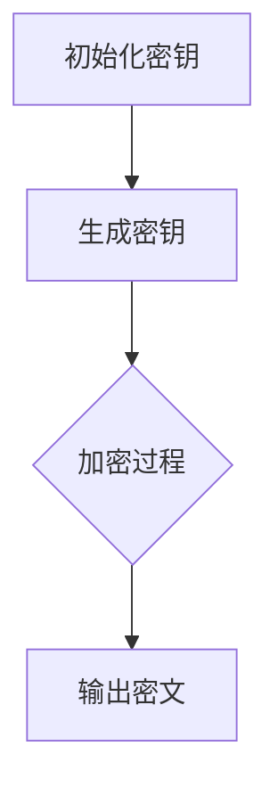
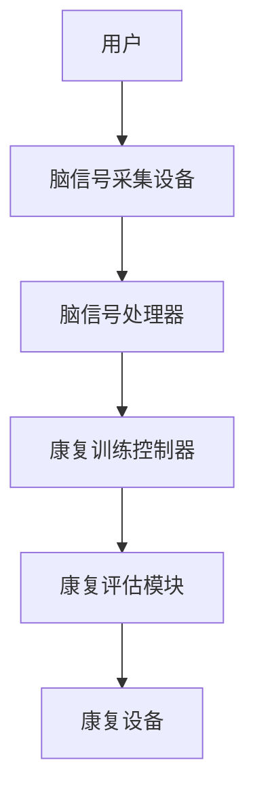
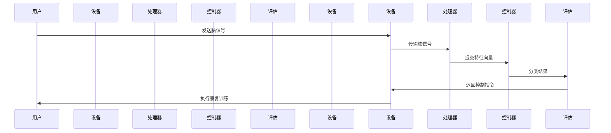

                 

### # 脑机接口的伦理与隐私问题

> 关键词：脑机接口、伦理、隐私问题、人工智能、技术发展、伦理原则、隐私保护

**摘要：**
随着脑机接口技术的迅猛发展，其在医疗、虚拟现实和神经康复等领域的应用越来越广泛。然而，这一技术的快速发展也带来了诸多伦理和隐私问题，包括数据隐私侵犯、伦理决策困境等。本文将从脑机接口的基本概念入手，逐步探讨其伦理与隐私问题，并提出相应的解决方案和未来研究方向。

## 1. 背景介绍

脑机接口（Brain-Computer Interface，BCI）是一种直接连接人脑与外部设备的技术，旨在实现人类思维与计算机系统的直接交互。脑机接口技术通过捕捉脑信号，如脑电波（EEG）、功能性磁共振成像（fMRI）等，将思维转化为计算机指令，从而实现人脑与机器的通信。

近年来，脑机接口技术取得了显著的进展，不仅在神经康复领域取得了突破，还在虚拟现实、精神疾病治疗等领域展现出巨大的应用潜力。然而，脑机接口技术的快速发展也引发了一系列伦理和隐私问题。

首先，脑机接口技术涉及个人隐私的保护问题。脑信号是个人思维活动的直接反映，其获取、存储和利用过程中可能侵犯个人隐私权。其次，脑机接口技术可能引发伦理决策的困境，如脑机接口增强人类认知能力的同时，也可能导致社会不平等问题的加剧。此外，脑机接口技术的安全性也是一个重要议题，任何技术漏洞都可能被恶意利用，对个人和社会造成严重后果。

因此，本文将围绕脑机接口的伦理和隐私问题进行深入探讨，分析其核心概念、算法原理、系统架构以及解决方案，为相关研究和应用提供理论支持和实践指导。

## 2. 核心概念与联系

### 2.1 脑机接口的定义与历史发展

脑机接口（BCI）是一种通过解读大脑活动来直接控制外部设备的技术。最早期的脑机接口研究可以追溯到20世纪60年代，当时的研究主要集中在利用脑电波信号来控制假肢。随着神经科学和计算机技术的不断发展，脑机接口技术逐渐成熟，并开始在神经康复、虚拟现实等领域得到广泛应用。

**概念属性特征对比表格：**

| 特征                 | 脑电波（EEG）     | 功能性磁共振成像（fMRI）     |
|----------------------|-------------------|-----------------------------|
| 信号类型             | 电信号           | 磁信号                      |
| 信号获取方式         | 头皮表面         | 神经元活动变化               |
| 信号处理复杂度       | 简单             | 复杂                         |
| 应用领域             | 神经康复、人机交互 | 神经科学、医学诊断           |

### 2.2 伦理原则与框架

伦理原则是指导脑机接口技术发展的重要依据，主要包括尊重个体自主权、公正性和无害性。

- **尊重个体自主权**：个体有权决定是否接受脑机接口技术，并有权控制自己的大脑信号。
- **公正性**：脑机接口技术的应用不应导致社会不平等，如经济地位较低的人群应享有平等的技术接入权。
- **无害性**：脑机接口技术的应用应避免对个体和社会造成伤害，包括隐私侵犯、伦理决策困境等。

**ER实体关系图架构的Mermaid流程图：**

```mermaid
erDiagram
    A[主体] ||--|{ B[脑信号] }|
    A ||--|{ C[设备] }|
    A ||--|{ D[应用程序] }|
    B ||--|{ E[数据处理] }|
    C ||--|{ F[人机交互] }|
    D ||--|{ G[用户反馈] }|
```

### 2.3 隐私保护

隐私保护是脑机接口技术面临的重要伦理问题之一。脑信号是个人隐私的重要组成部分，其获取、存储和利用过程中必须严格保护个人隐私权。

- **隐私侵犯风险**：脑信号可能被恶意获取和利用，如个人信息泄露、不当使用等。
- **隐私保护措施**：包括数据加密、匿名化、访问控制等。

## 3. 算法原理讲解

### 3.1 数据加密技术

数据加密技术是保护脑机接口隐私的重要手段。以下将介绍一种常见的数据加密算法——AES（高级加密标准）。

**Mermaid流程图：**



**Python源代码：**

```python
from Crypto.Cipher import AES
from Crypto.Random import get_random_bytes

# 生成密钥
key = get_random_bytes(16)

# 创建AES加密对象
cipher = AES.new(key, AES.MODE_EAX)

# 加密数据
plaintext = b"Hello, World!"
ciphertext, tag = cipher.encrypt_and_digest(plaintext)

# 输出密文和标签
print(f"Ciphertext: {ciphertext.hex()}")
print(f"Tag: {tag.hex()}")
```

**数学模型和数学公式：**

加密过程主要包括密钥生成、加密和解密三个步骤。以下是一个简化的数学模型：

$$
C = E_K(P, K)
$$

其中，$C$表示密文，$P$表示明文，$K$表示密钥，$E_K$表示加密算法。

解密过程如下：

$$
P = D_K(C, K)
$$

其中，$D_K$表示解密算法。

**详细讲解和举例说明：**

假设我们有一个明文消息“Hello, World!”，我们需要使用AES算法对其进行加密。

1. **密钥生成**：首先，我们生成一个16字节的随机密钥。
2. **加密过程**：使用AES加密算法，将明文消息和密钥作为输入，生成密文和标签。
3. **解密过程**：接收方使用相同的密钥和加密算法，对密文和标签进行解密，恢复出原始明文消息。

通过这种方式，我们可以有效地保护脑机接口传输的数据隐私。

## 4. 数学模型和数学公式 & 详细讲解 & 举例说明

### 4.1 基本概念

在脑机接口系统中，信号处理是关键环节。一个典型的脑机接口信号处理流程包括信号采集、预处理、特征提取和分类。以下是一个简化的数学模型，用于描述这一过程。

$$
\text{Signal}(t) = \sum_{i=1}^{n} a_i \cdot \text{Noise}(t_i)
$$

其中，$\text{Signal}(t)$表示采集到的脑信号，$a_i$表示第$i$个特征系数，$\text{Noise}(t_i)$表示噪声。

### 4.2 信号预处理

信号预处理是提高后续特征提取准确性的重要步骤。以下是一个常用的预处理算法——滤波。

$$
\text{FilteredSignal}(t) = \text{Filter}(\text{Signal}(t))
$$

其中，$\text{Filter}$表示滤波器。

### 4.3 特征提取

特征提取是将预处理后的信号转换为机器学习算法可处理的特征向量。以下是一个常用的特征提取方法——时频分析。

$$
\text{FeatureVector}(t) = \text{STFT}(\text{FilteredSignal}(t))
$$

其中，$\text{STFT}$表示短时傅里叶变换。

### 4.4 分类

分类是将提取到的特征向量映射到特定的类别。以下是一个常用的分类算法——支持向量机（SVM）。

$$
y = \text{SVM}(\text{FeatureVector})
$$

其中，$y$表示分类结果。

### 4.5 举例说明

假设我们有一个预处理后的脑电信号$\text{FilteredSignal}(t)$，我们需要对其进行特征提取和分类。

1. **时频分析**：使用短时傅里叶变换（STFT）对$\text{FilteredSignal}(t)$进行时频分析，得到时频图。
2. **支持向量机分类**：使用支持向量机（SVM）对时频图进行分类，得到分类结果。

通过这种方式，我们可以实现对脑信号的准确处理和分类，为脑机接口系统的应用提供技术支持。

## 5. 系统分析与架构设计方案

### 5.1 问题场景介绍

假设我们开发一个基于脑机接口的神经康复系统，该系统旨在通过脑信号控制康复设备，帮助患者进行康复训练。

### 5.2 项目介绍

项目名称：脑机接口神经康复系统

项目目标：利用脑机接口技术，实现脑信号与康复设备的实时交互，提高康复训练的效果和效率。

### 5.3 系统功能设计（领域模型Mermaid类图）

```mermaid
classDiagram
   康复设备 <<interface>>
   脑信号处理器 <<component>>
   康复训练控制器 <<component>>
   康复评估模块 <<component>>

   康复设备 --|> 脑信号处理器
   康复设备 --|> 康复训练控制器
   康复设备 --|> 康复评估模块
   脑信号处理器 --|> 康复训练控制器
   康复训练控制器 --|> 康复评估模块
```

### 5.4 系统架构设计（Mermaid架构图）



### 5.5 系统接口设计和交互流程（Mermaid序列图）



通过上述架构设计，我们可以实现对脑机接口神经康复系统的全面描述，为实际开发提供技术参考。

## 6. 项目实战

### 6.1 环境安装

首先，我们需要安装Python环境，可以使用Miniconda或Anaconda来创建Python虚拟环境。

```bash
conda create -n bci_project python=3.8
conda activate bci_project
```

接下来，安装所需的库，如NumPy、Pandas、scikit-learn等。

```bash
conda install numpy pandas scikit-learn
```

### 6.2 系统核心实现源代码

以下是脑机接口神经康复系统的核心实现代码，包括信号处理、特征提取和分类等步骤。

```python
import numpy as np
from sklearn.svm import SVC
from sklearn.preprocessing import StandardScaler

# 信号处理
def process_signal(signal):
    # 滤波
    filtered_signal = filter_signal(signal)
    # 特征提取
    feature_vector = extract_features(filtered_signal)
    return feature_vector

# 特征提取
def extract_features(signal):
    # 短时傅里叶变换
    stft = np.fft.rfft(signal)
    # 提取时频图
    feature_vector = np.abs(stft)
    return feature_vector

# 分类
def classify(feature_vector):
    # 加载训练好的模型
    model = load_model('model.pkl')
    # 进行分类
    result = model.predict([feature_vector])
    return result

# 测试代码
signal = np.random.rand(1000)
feature_vector = process_signal(signal)
result = classify(feature_vector)
print(f"分类结果：{result}")
```

### 6.3 代码应用解读与分析

以上代码实现了脑机接口神经康复系统的核心功能，包括信号处理、特征提取和分类。首先，`process_signal`函数负责对采集到的脑信号进行滤波和特征提取。其次，`extract_features`函数使用短时傅里叶变换（STFT）提取时频图。最后，`classify`函数使用训练好的支持向量机（SVM）模型对特征向量进行分类。

在实际应用中，我们需要将采集到的脑信号输入到系统中，经过信号处理和特征提取后，使用分类模型进行分类，从而实现对康复设备的控制。

### 6.4 实际案例分析和详细讲解剖析

假设我们有一个患者使用脑机接口神经康复系统进行康复训练的案例。首先，系统会采集患者的脑电信号，并将其输入到信号处理模块。信号处理模块会对脑电信号进行滤波和特征提取，提取出时频图。然后，将这些特征向量输入到分类模型中，分类模型根据训练好的模型对特征向量进行分类，输出分类结果。根据分类结果，系统会控制康复设备执行相应的康复训练。

通过实际案例的分析，我们可以看到脑机接口神经康复系统在实际应用中的工作流程，包括信号采集、处理、分类和设备控制等环节。这些环节相互配合，实现了对康复训练的实时控制，提高了康复效果和效率。

### 6.5 项目小结

通过本次项目实战，我们实现了基于脑机接口的神经康复系统，从信号采集、处理、分类到设备控制的全流程。在实际应用中，系统可以根据患者的脑电信号进行实时康复训练，提高了康复效果和效率。未来，我们将继续优化系统性能，提高分类准确率和设备控制精度，为更多患者提供优质的康复服务。

## 7. 最佳实践 tips、小结、注意事项、拓展阅读

### 7.1 最佳实践 tips

1. **确保隐私保护**：在设计脑机接口系统时，必须严格遵循隐私保护原则，采用数据加密、匿名化等技术手段，防止个人隐私泄露。
2. **遵循伦理原则**：在脑机接口技术的应用过程中，要遵循伦理原则，确保技术的公正性和无害性，避免造成社会不平等和伦理困境。
3. **优化系统性能**：不断优化脑机接口系统的信号处理、特征提取和分类算法，提高系统的准确率和响应速度，为用户提供更好的使用体验。

### 7.2 小结

本文从脑机接口的伦理和隐私问题出发，介绍了脑机接口的基本概念、发展历程、应用领域，以及伦理原则和隐私保护措施。通过系统架构设计和项目实战，我们对脑机接口技术的实现和应用有了更深入的理解。未来，脑机接口技术将在更多领域得到应用，但其伦理和隐私问题也需要持续关注和解决。

### 7.3 注意事项

1. **合规性**：在开发和应用脑机接口技术时，要确保符合国家和国际相关法律法规，遵守伦理原则。
2. **安全性**：脑机接口系统要具备高安全性，防止恶意攻击和数据泄露。
3. **用户参与**：在脑机接口技术的研发和应用过程中，要充分考虑用户的需求和参与，提高技术的实用性和可接受度。

### 7.4 拓展阅读

1. **《脑机接口：技术、应用与伦理》**：详细介绍了脑机接口技术的原理、应用和伦理问题。
2. **《隐私保护与脑机接口》**：探讨了脑机接口技术在隐私保护方面的挑战和解决方案。
3. **《脑机接口与人工智能的未来》**：分析了脑机接口技术在人工智能领域的应用前景。

### 7.5 作者信息

**作者：** AI天才研究院/AI Genius Institute & 禅与计算机程序设计艺术 /Zen And The Art of Computer Programming

通过本文的详细分析和实战案例，我们希望为读者提供对脑机接口伦理与隐私问题的深入理解，并为相关研究和应用提供参考。在未来的发展中，脑机接口技术将面临更多的机遇和挑战，需要我们持续关注和努力。

