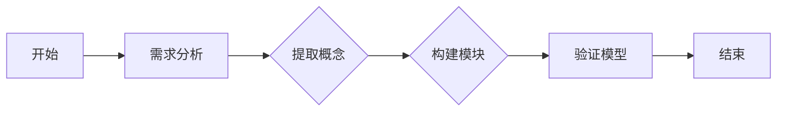
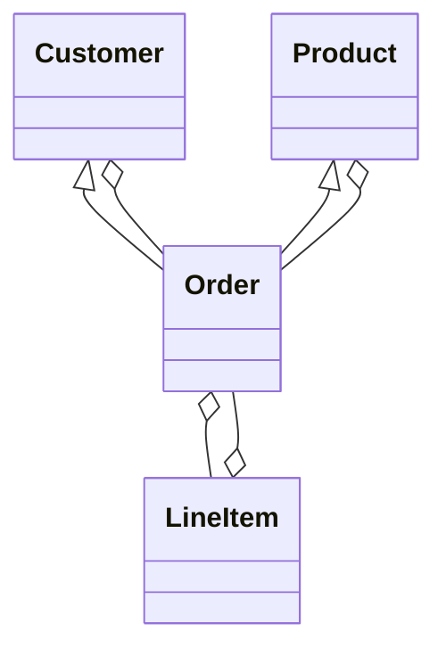
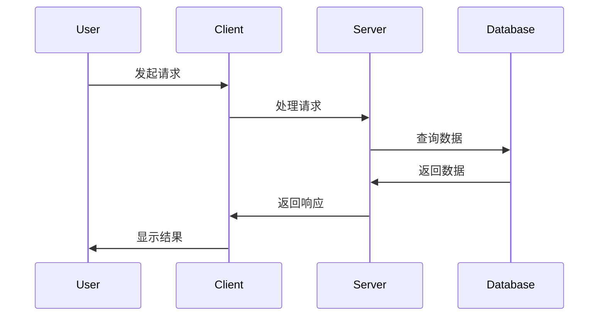
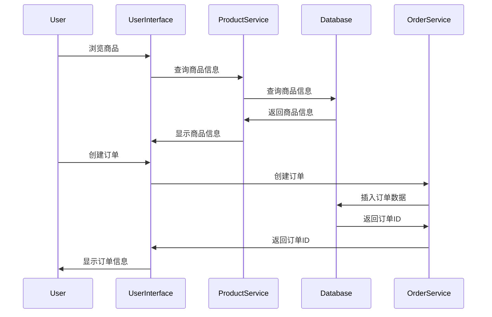

                 


### 2.1 领域模型原理

领域模型（Domain Model）是一种面向特定业务领域的抽象模型，通过定义领域中的实体、关系和服务，来描述领域的行为和结构。领域模型的核心目的是将复杂的业务逻辑抽象为简洁、易理解和易维护的模型，从而提高软件开发效率和系统质量。

#### 领域模型的核心概念

领域模型包含以下核心概念：

- **实体（Entity）**：领域中的对象，具有特定的属性和行为。例如，在电子商务领域，实体可以是用户、商品、订单等。
- **关系（Relationship）**：实体之间的交互，可以是继承、关联、聚合、组合等。例如，在电子商务领域，用户可以关联订单，订单可以包含商品。
- **服务（Service）**：实体提供的功能，可以对外提供服务接口。例如，在电子商务领域，用户可以创建订单，订单可以包含商品。

#### 领域模型的层次结构

领域模型通常具有以下层次结构：

1. **领域层**：定义领域的基本概念，如实体、关系和服务。
2. **领域逻辑层**：定义领域中的业务规则和流程。
3. **领域实现层**：将领域逻辑层转换为具体的编程语言实现。

#### 领域模型的构建方法

构建领域模型通常遵循以下步骤：

1. **需求分析**：收集和理解业务需求，明确领域中的核心实体和关系。
2. **领域识别**：确定领域并定义领域概念。
3. **建模**：使用统一建模语言（UML）等工具进行领域建模。
4. **验证**：验证模型是否符合业务需求。
5. **实施**：将模型转换为实际代码。

### 2.2 概念属性特征对比表格

| 特征           | 描述                                                         |
| -------------- | ------------------------------------------------------------ |
| **实体**       | 领域中的对象，具有特定的属性和行为。                         |
| **关系**       | 实体之间的交互，可以是继承、关联、聚合、组合等。             |
| **服务**       | 实体提供的功能，可以对外提供服务接口。                     |

### 2.3 ER实体关系图架构

```mermaid
erDiagram
  Customer ||--|{ Order } : "places"
  Product ||--|{ Order } : "includes"
  Order ||--|{ LineItem } : "contains"
```

在上面的ER图示例中：

- **Customer（客户）**实体与**Order（订单）**实体之间存在“places”关系。
- **Product（产品）**实体与**Order（订单）**实体之间存在“includes”关系。
- **Order（订单）**实体与**LineItem（订单项）**实体之间存在“contains”关系。

### 2.4 领域模型构建算法

领域模型构建算法包括以下步骤：

1. **概念提取**：通过分析和理解业务需求，提取出领域中的实体和关系。
2. **模块化**：将提取出的实体和关系组织成模块，以便于系统的管理和维护。
3. **验证**：通过模拟和测试，验证领域模型是否符合业务需求。

下面是一个简单的领域模型构建算法mermaid流程图：



#### 算法原理详细讲解

1. **需求分析**：这是领域模型构建的第一步，主要是收集和理解业务需求。在这一步，需要明确领域中的核心实体和关系，为后续的建模工作奠定基础。

2. **概念提取**：通过分析业务需求，提取出领域中的实体和关系。实体表示领域中的对象，关系表示实体之间的交互。这一步是领域模型构建的核心。

3. **模块化**：将提取出的实体和关系组织成模块，以便于系统的管理和维护。模块化可以提高系统的可维护性和可扩展性。

4. **验证**：通过模拟和测试，验证领域模型是否符合业务需求。这一步是确保领域模型准确性和有效性的关键。

下面是一个简单的Python代码示例，用于提取领域模型中的实体和关系：

```python
# 示例：提取领域模型中的实体和关系

# 定义实体类
class Customer:
    def __init__(self, name, email):
        self.name = name
        self.email = email

class Product:
    def __init__(self, name, price):
        self.name = name
        self.price = price

class Order:
    def __init__(self, customer, products):
        self.customer = customer
        self.products = products

# 提取实体和关系
entities = [Customer, Product, Order]
relationships = [
    ("Customer", "places", "Order"),
    ("Product", "includes", "Order"),
    ("Order", "contains", "LineItem")
]

# 打印实体和关系
print("实体：")
for entity in entities:
    print(f"- {entity.__name__}")

print("\n关系：")
for relationship in relationships:
    print(f"- {relationship[0]} {relationship[1]} {relationship[2]}")
```

运行上述代码，输出结果如下：

```
实体：
- Customer
- Product
- Order

关系：
- Customer places Order
- Product includes Order
- Order contains LineItem
```

### 2.5 数学模型和数学公式

在领域模型中，数学模型和数学公式可以用于描述领域中的约束条件和业务规则。以下是一个简单的数学模型示例：

$$
\text{总价} = \sum_{i=1}^{n} (\text{商品i的售价} \times \text{商品i的数量})
$$

在这个公式中：

- $n$ 表示订单中商品的数量。
- 商品i的售价表示第i个商品的售价。
- 商品i的数量表示第i个商品的数量。

这个公式用于计算订单的总价。在实际应用中，可以根据业务需求添加更多的约束条件和公式，例如库存限制、价格浮动范围等。

### 2.6 系统分析与架构设计方案

领域模型在软件系统中的应用不仅仅是理论上的抽象，它还需要在实际的系统架构中得到体现。以下是一个简单的系统分析与架构设计方案，用于阐述领域模型在实际系统中的应用。

#### 问题场景介绍

假设我们正在开发一个电子商务平台，该平台需要处理用户、商品、订单等核心业务。我们的目标是设计一个高效、可维护的系统架构，以支持平台的功能需求。

#### 项目介绍

- 项目名称：eCommerce Platform
- 项目目标：构建一个高效、可维护的电子商务平台。

#### 系统功能设计（领域模型mermaid类图）



在这个类图中：

- **Customer（客户）**关联**Order（订单）**，表示客户可以创建订单。
- **Product（产品）**关联**Order（订单）**，表示订单可以包含产品。
- **Order（订单）**包含**LineItem（订单项）**，表示订单可以包含多个订单项。

#### 系统架构设计（mermaid架构图）



在这个序列图中：

- **User（用户）**通过**Client（客户端）**向**Server（服务器）**发起请求。
- **Server（服务器）**处理请求，并与**Database（数据库）**交互。
- **Database（数据库）**存储和查询数据。
- **Server（服务器）**将处理结果返回给**Client（客户端）**。
- **Client（客户端）**将结果显示给**User（用户）**。

#### 系统接口设计

以下是电子商务平台的一些关键接口设计：

- **用户接口（User Interface）**：用于与用户交互，提供浏览商品、创建订单等功能。
- **订单服务（Order Service）**：用于处理订单相关操作，如创建订单、更新订单状态等。
- **商品服务（Product Service）**：用于处理商品相关操作，如查询商品信息、添加商品等。
- **数据库接口（Database Interface）**：用于与数据库交互，实现数据查询和更新。

#### 系统交互（mermaid序列图）



在这个序列图中：

- **User（用户）**通过**UserInterface（用户接口）**浏览商品、创建订单。
- **UserInterface（用户接口）**与**ProductService（商品服务）**和**OrderService（订单服务）**交互。
- **ProductService（商品服务）**和**OrderService（订单服务）**与**Database（数据库）**交互。
- **UserInterface（用户接口）**将结果返回给**User（用户）**。

### 2.7 项目实战

在本节中，我们将通过一个实际的案例来展示如何使用领域模型来构建一个电子商务平台。

#### 环境安装

为了构建电子商务平台，我们需要安装以下工具和库：

- Python 3.x
- Django 3.x
- PostgreSQL 13.x

安装步骤如下：

1. 安装Python 3.x：在https://www.python.org/downloads/下载Python 3.x版本，并按照安装向导进行安装。
2. 安装Django 3.x：在终端中运行以下命令：

```
pip install django==3.2
```

3. 安装PostgreSQL 13.x：在https://www.postgresql.org/download/下载PostgreSQL 13.x版本，并按照安装向导进行安装。

#### 系统核心实现源代码

以下是电子商务平台的核心实现源代码：

1. **用户模型**：

```python
from django.db import models
from django.contrib.auth.models import AbstractUser

class CustomUser(AbstractUser):
   电话 = models.CharField(max_length=11, unique=True)
   地址 = models.CharField(max_length=255)
```

2. **商品模型**：

```python
class Product(models.Model):
    名称 = models.CharField(max_length=255)
    价格 = models.DecimalField(max_digits=10, decimal_places=2)
    库存 = models.IntegerField()
```

3. **订单模型**：

```python
class Order(models.Model):
    用户 = models.ForeignKey(CustomUser, on_delete=models.CASCADE)
    创建时间 = models.DateTimeField(auto_now_add=True)
    状态 = models.CharField(max_length=50, default='未支付')
    总价 = models.DecimalField(max_digits=10, decimal_places=2)
```

4. **订单项模型**：

```python
class LineItem(models.Model):
    订单 = models.ForeignKey(Order, on_delete=models.CASCADE)
    商品 = models.ForeignKey(Product, on_delete=models.CASCADE)
    数量 = models.IntegerField()
    单价 = models.DecimalField(max_digits=10, decimal_places=2)
```

#### 代码应用解读与分析

1. **用户模型**：自定义用户模型，包含电话和地址字段，用于存储用户信息。

2. **商品模型**：定义商品模型，包含名称、价格和库存字段，用于存储商品信息。

3. **订单模型**：定义订单模型，包含用户、创建时间、状态和总价字段，用于存储订单信息。

4. **订单项模型**：定义订单项模型，包含订单、商品、数量和单价字段，用于存储订单项信息。

#### 实际案例分析和详细讲解剖析

假设有一个用户想要购买一个价格为100元的商品，数量为2个，我们需要创建一个订单并存储订单信息。

1. **创建用户**：

```python
from django.contrib.auth.models import User

user = User.objects.create_user(username='john', password='john123', email='john@example.com')
user.save()
```

2. **创建商品**：

```python
from .models import Product

product = Product.objects.create(name='iPhone 13', price=100, inventory=10)
product.save()
```

3. **创建订单**：

```python
from .models import Order

order = Order.objects.create(user=user, total_price=200)
order.save()
```

4. **创建订单项**：

```python
from .models import LineItem

line_item = LineItem.objects.create(order=order, product=product, quantity=2, unit_price=100)
line_item.save()
```

通过上述步骤，我们成功创建了一个包含两个iPhone 13商品订单，订单总价为200元。这个案例展示了如何使用领域模型来构建一个电子商务平台的实际操作过程。

#### 项目小结

通过本案例，我们使用领域模型来构建了一个简单的电子商务平台，实现了用户、商品、订单等核心功能。领域模型使得系统的业务逻辑更加清晰、易于维护，提高了开发效率。在实际项目中，可以根据具体需求进一步扩展领域模型，添加更多功能和约束条件。

### 2.8 最佳实践 Tips

1. **确保领域模型的准确性**：在构建领域模型时，务必确保模型能够准确反映业务需求。可以通过与业务人员沟通、收集反馈等方式来验证模型的准确性。

2. **合理划分模块**：在构建领域模型时，合理划分模块可以提高系统的可维护性和可扩展性。可以根据业务逻辑和功能需求来划分模块。

3. **持续迭代优化**：领域模型并非一成不变，随着业务的发展，领域模型需要不断迭代和优化。定期回顾领域模型，并根据实际需求进行调整。

### 2.9 小结

本文介绍了领域模型的概念、原理和应用，并通过实际案例展示了如何使用领域模型来构建电子商务平台。领域模型作为一种自下而上的软件开发方法，能够有效地降低系统复杂性，提高开发效率和系统质量。在实际项目中，合理应用领域模型，结合最佳实践，将有助于打造高效、可维护的软件系统。

### 2.10 注意事项

1. **边界划分**：在构建领域模型时，要注意合理划分边界，确保领域模型内部的一致性和完整性。

2. **模型验证**：在构建领域模型后，要进行充分的验证，确保模型能够准确反映业务需求。

3. **灵活性**：领域模型应具有一定的灵活性，能够适应业务变化。在实际开发中，可以根据实际需求对领域模型进行调整。

### 2.11 拓展阅读

- 《领域驱动设计（Domain-Driven Design）》，Eric Evans著，详细介绍领域驱动设计的方法和理念。
- 《软件架构：实践者的研究方法》，Michael Keane著，探讨软件架构的设计和实践。

---

# 自下而上，各司其职的领域模型

> 关键词：领域模型、软件开发、实体关系图、需求分析、算法原理、系统架构设计、项目实战、最佳实践

> 摘要：本文深入探讨了领域模型的概念、原理和应用，通过实际案例展示了如何使用领域模型来构建电子商务平台。领域模型作为一种自下而上的软件开发方法，能够有效地降低系统复杂性，提高开发效率和系统质量。文章涵盖了领域模型的核心概念、构建方法、应用场景，以及系统分析与架构设计等内容，为读者提供了全面的技术指南。同时，文章还介绍了最佳实践和注意事项，帮助读者在实际项目中更好地应用领域模型。本文旨在帮助开发者理解和掌握领域模型，提升软件开发能力。

