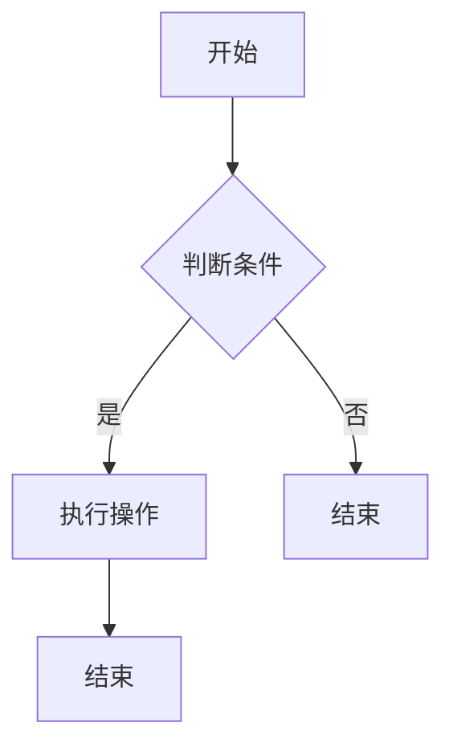
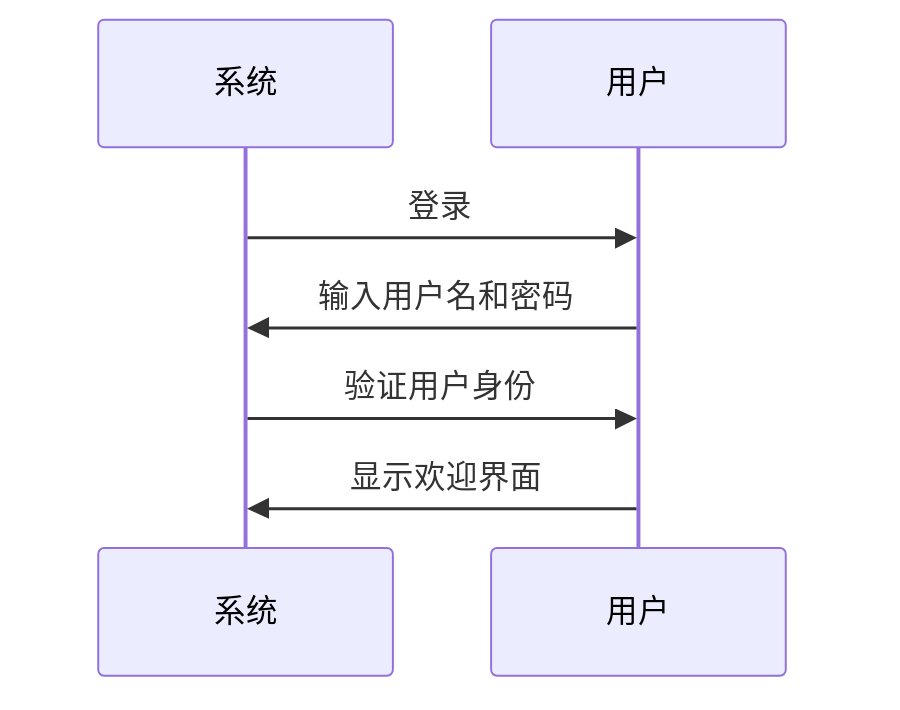

                 

### 自动推理代码生成中神经程序合成的应用探索

#### 关键词：
- 自动推理
- 代码生成
- 神经程序合成
- 应用探索
- 人工智能

#### 摘要：
本文旨在探讨自动推理代码生成中神经程序合成的应用，通过深入分析相关技术的基本概念、算法原理和实际应用案例，揭示其核心价值和未来发展前景。文章首先介绍自动推理和代码生成的背景及现状，随后详细阐述神经程序合成的原理和关键技术，然后结合实际案例展示其在自动推理代码生成中的应用，最后对研究成果进行总结和展望。

----------------------------------------------------------------

### 目录

1. **背景介绍**
    1.1. 问题的提出与现状分析
        1.1.1 自动推理与代码生成技术简介
        1.1.2 神经程序合成的概念与意义
        1.1.3 应用背景与挑战
    1.2. 研究目的与内容框架

2. **核心概念**
    2.1. 自动推理
    2.2. 代码生成
    2.3. 神经程序合成

3. **算法原理与模型**
    3.1. 自动推理与代码生成算法
    3.2. 神经程序合成模型

4. **应用案例分析**
    4.1. 案例一：自动推理在代码生成中的应用
    4.2. 案例二：神经程序合成在复杂系统设计中的应用

5. **总结与展望**
    5.1. 研究总结
    5.2. 未来展望

### 背景介绍

#### 1.1. 问题的提出与现状分析

##### 1.1.1 自动推理与代码生成技术简介

自动推理（Automated Reasoning）是人工智能领域的一个重要分支，它通过数学模型和算法对问题进行逻辑分析和证明，旨在实现机器对复杂问题的自动求解。代码生成（Code Generation）则是一种将抽象的算法描述转换为实际可执行的代码的技术，它广泛应用于软件开发、自动化测试和代码优化等领域。

随着软件系统规模的不断增大和复杂度的不断提升，传统的手工编码方式已经无法满足高效、高质量的软件开发需求。自动推理和代码生成技术的出现，为解决这一问题提供了新的思路。通过将复杂的算法描述转化为具体的代码实现，自动推理和代码生成技术不仅能够提高软件开发效率，还能在一定程度上保证代码的可靠性和一致性。

##### 1.1.2 神经程序合成的概念与意义

神经程序合成（Neural Program Synthesis）是一种基于神经网络的自动推理和代码生成技术。它通过神经网络学习大量的程序样例，从而能够自动生成符合特定需求的高质量代码。神经程序合成的核心思想是利用神经网络的强大表达能力和学习能力，将程序设计和问题求解转化为一个数据驱动的过程。

神经程序合成的意义在于，它不仅能够提高软件开发效率，还能够实现编程自动化，从而降低软件开发的复杂度和成本。同时，神经程序合成技术还可以应用于自动化测试、代码优化和软件维护等领域，为软件工程领域带来深远的影响。

##### 1.1.3 应用背景与挑战

随着人工智能技术的不断发展，自动推理和代码生成技术已经广泛应用于各个领域。例如，在金融领域，自动推理技术可以用于算法交易和风险评估；在医疗领域，代码生成技术可以用于诊断支持和药物研发；在工业领域，自动推理和代码生成技术可以用于生产优化和设备维护。

然而，尽管这些技术的应用前景广阔，但在实际应用中也面临着一系列挑战。首先，自动推理和代码生成技术对数据质量和数据量有较高的要求，缺乏高质量的数据会导致算法性能下降。其次，神经程序合成技术目前还存在一些技术瓶颈，如神经网络的可解释性和鲁棒性等问题。此外，如何在复杂的环境中保证代码生成的正确性和安全性也是一个亟待解决的问题。

##### 1.2. 研究目的与内容框架

本文的研究目的在于探讨自动推理代码生成中神经程序合成的应用，旨在解决以下问题：

1. 如何利用神经程序合成技术提高自动推理和代码生成算法的性能和效率？
2. 如何确保生成的代码在复杂环境中的正确性和安全性？
3. 神经程序合成技术在不同领域的应用前景和挑战是什么？

为了实现上述研究目的，本文将按照以下内容框架展开：

1. **核心概念**：介绍自动推理、代码生成和神经程序合成的基本概念，为后续内容提供理论基础。
2. **算法原理与模型**：详细阐述自动推理和代码生成算法的原理，以及神经程序合成模型的结构和训练方法。
3. **应用案例分析**：通过实际案例展示神经程序合成技术在自动推理和代码生成中的应用，分析其优势和不足。
4. **总结与展望**：总结研究成果，提出未来研究的方向和建议。

### 核心概念

#### 2.1 自动推理

自动推理是人工智能领域的一个重要分支，它旨在通过数学模型和算法实现计算机对复杂问题的自动求解。自动推理的核心目标是使计算机能够像人类一样进行逻辑思考和问题解决。

##### 2.1.1 自动推理的基本原理

自动推理的基本原理可以概括为以下几点：

1. **符号表示**：将问题表示为符号形式，以便于计算机处理。符号表示通常包括命题逻辑、谓词逻辑、图论等。
2. **推理规则**：使用一系列推理规则对符号表示的问题进行推理。推理规则包括逻辑推理、模式匹配、归纳推理等。
3. **证明搜索**：在给定的推理规则下，搜索问题解的证明过程。证明搜索通常采用回溯算法、启发式搜索等方法。

##### 2.1.2 自动推理的关键技术

自动推理的关键技术主要包括：

1. **逻辑推理**：包括命题逻辑推理和谓词逻辑推理，是自动推理的基础。
2. **模式匹配**：通过模式匹配技术，将输入的数据与预先定义的模式进行匹配，从而实现数据的自动分类和识别。
3. **归纳推理**：通过观察给定的数据集，自动推导出普遍的规律和规则，从而实现问题的一般化解决。
4. **搜索算法**：包括回溯算法、启发式搜索、贪婪算法等，用于在给定的推理规则下搜索问题解的证明过程。

##### 2.1.3 自动推理的应用场景

自动推理技术广泛应用于各个领域，主要包括：

1. **自然语言处理**：自动推理技术可以用于语义分析、文本分类、机器翻译等任务。
2. **计算机辅助设计**：自动推理技术可以用于自动生成电路图、程序代码等设计文档。
3. **医学诊断**：自动推理技术可以用于疾病诊断、治疗方案推荐等。
4. **智能控制**：自动推理技术可以用于智能交通、智能家居等系统的控制和优化。

#### 2.2 代码生成

代码生成是将抽象的算法描述转换为实际可执行的代码的技术，广泛应用于软件开发、自动化测试和代码优化等领域。

##### 2.2.1 代码生成的基本概念

代码生成的基本概念包括：

1. **抽象语法树（AST）**：抽象语法树是代码的抽象表示形式，它将代码结构表示为树形结构，便于计算机处理。
2. **中间表示**：中间表示是在编译过程中生成的中间代码，它是源代码和目标代码之间的桥梁。
3. **代码生成器**：代码生成器是一种将抽象语法树或中间表示转换为实际可执行代码的工具。

##### 2.2.2 代码生成的方法与技术

代码生成的方法和技术主要包括：

1. **模板匹配**：通过预定义的模板，将输入的代码片段与模板进行匹配，生成对应的代码。
2. **代码生成器生成**：使用代码生成器工具，根据输入的抽象语法树或中间表示，自动生成对应的代码。
3. **编译器生成**：使用编译器生成代码，将高级语言代码编译为低级语言代码，再转换为机器码。

##### 2.2.3 代码生成的挑战与机遇

代码生成技术面临的挑战主要包括：

1. **代码质量**：生成的代码需要具备高质量，包括正确性、可读性、可维护性等。
2. **代码生成速度**：生成代码的速度需要足够快，以满足实时性和自动化测试等需求。
3. **代码生成器适应度**：代码生成器需要能够适应不同的编程语言和开发环境。

然而，随着自动推理和神经网络技术的发展，代码生成技术也迎来了新的机遇。例如，通过神经网络学习和自动化测试，可以实现更高效率和更高质量的代码生成。此外，随着软件系统规模的扩大，代码生成技术将成为提高软件开发效率和降低成本的重要手段。

#### 2.3 神经程序合成

神经程序合成是一种基于神经网络的自动推理和代码生成技术，它通过神经网络学习大量的程序样例，从而能够自动生成符合特定需求的高质量代码。

##### 2.3.1 神经程序合成的原理

神经程序合成的原理可以概括为以下几点：

1. **数据驱动**：神经程序合成通过大量程序样例的数据驱动学习过程，从而实现代码生成。
2. **神经网络模型**：神经程序合成使用神经网络模型来表示程序结构和语义，包括循环神经网络（RNN）、变换器（Transformer）等。
3. **代码生成**：神经网络模型学习完成后，根据输入的输入，自动生成对应的代码。

##### 2.3.2 神经程序合成的方法

神经程序合成的方法主要包括：

1. **序列到序列（Seq2Seq）模型**：Seq2Seq模型是一种基于编码器-解码器结构的神经网络模型，常用于序列数据的转换，如图像到文本、文本到图像等。
2. **变换器（Transformer）模型**：Transformer模型是一种基于自注意力机制的神经网络模型，广泛应用于自然语言处理、计算机视觉等领域。
3. **生成对抗网络（GAN）**：生成对抗网络是一种基于博弈论的神经网络模型，由生成器和判别器两个部分组成，用于生成高质量的数据。

##### 2.3.3 神经程序合成的应用领域

神经程序合成的应用领域包括：

1. **自然语言处理**：例如，自动生成代码文档、代码注释等。
2. **计算机视觉**：例如，自动生成图像处理算法、图像分割代码等。
3. **控制系统**：例如，自动生成智能控制系统代码等。

#### 2.3.4 神经程序合成的优势与挑战

神经程序合成的优势包括：

1. **高效性**：通过神经网络模型的学习，能够高效地生成高质量代码。
2. **灵活性**：神经网络模型能够适应不同的编程语言和开发环境。

然而，神经程序合成也面临着一些挑战，如：

1. **可解释性**：神经网络模型的内部机制复杂，难以解释和调试。
2. **数据依赖性**：神经程序合成对数据质量和数据量有较高要求，缺乏高质量的数据会导致算法性能下降。

### 算法原理与模型

#### 3.1 自动推理与代码生成算法

自动推理与代码生成算法是神经程序合成的核心，它们共同构成了自动推理代码生成系统。下面将详细讨论这些算法的原理、实现方法和关键步骤。

##### 3.1.1 自动推理算法流程

自动推理算法通常包括以下几个关键步骤：

1. **问题建模**：将待解决的问题表示为一个数学模型或符号系统。例如，将自然语言问题转换为形式逻辑表达式。
2. **数据预处理**：对输入数据进行预处理，包括去噪、规范化、特征提取等。预处理过程旨在提高算法的鲁棒性和性能。
3. **推理过程**：使用推理规则和搜索算法对问题进行推理，找到问题的解或证明。推理过程可以基于逻辑推理、模式匹配、归纳推理等方法。
4. **结果验证**：对生成的解或证明进行验证，确保其正确性和一致性。

在自动推理算法中，常用的推理规则包括：

- **逻辑推理**：基于命题逻辑和谓词逻辑的推理，如推理规则、蕴含关系、逆否推理等。
- **模式匹配**：将输入数据与预设的模板进行匹配，从而识别出数据中的模式或特征。
- **归纳推理**：从给定的数据中归纳出普遍的规律或规则，从而实现对未知数据的预测或分类。

搜索算法是实现推理过程的重要手段，常用的搜索算法包括：

- **深度优先搜索（DFS）**：按照深度优先的原则遍历问题的解空间，找到问题的解。
- **广度优先搜索（BFS）**：按照广度优先的原则遍历问题的解空间，找到问题的解。
- **启发式搜索**：结合问题的具体特点，采用启发式方法快速找到问题的解。

##### 3.1.2 代码生成算法流程

代码生成算法通常包括以下几个关键步骤：

1. **抽象语法树（AST）构建**：将输入的算法描述或逻辑表达式转换为抽象语法树，表示代码的结构。
2. **代码模板匹配**：根据输入的AST，匹配预定义的代码模板，生成初步的代码。
3. **代码优化**：对初步生成的代码进行优化，包括代码压缩、去重、语法错误修复等。
4. **代码生成**：将优化后的代码转换为具体的编程语言代码，如Python、Java等。

代码生成算法的核心是代码模板匹配和代码优化。代码模板匹配是通过预定义的代码模板来生成初步的代码。代码模板通常包括一系列的代码片段，这些代码片段可以根据输入的AST进行组合和调整。代码优化则是在初步生成的代码基础上，进行代码压缩、去重、语法错误修复等操作，以提高代码的质量和可读性。

##### 3.1.3 算法融合与优化

自动推理算法和代码生成算法的融合是神经程序合成的关键。算法融合的目标是将自动推理算法的推理结果作为代码生成算法的输入，从而实现高效的代码生成。

算法融合的关键步骤包括：

1. **推理结果提取**：从自动推理算法的推理过程中提取关键信息，如问题的解或证明。
2. **推理结果编码**：将提取的关键信息编码为适合代码生成算法的格式，如抽象语法树。
3. **代码生成**：使用代码生成算法，根据编码后的推理结果生成具体的代码。

算法优化的目标是在保证代码质量的前提下，提高代码生成的效率和鲁棒性。算法优化包括以下几个方面：

1. **模型优化**：优化自动推理算法和代码生成算法的神经网络模型，包括模型结构、参数调整等。
2. **数据优化**：优化输入数据的预处理和特征提取过程，以提高算法的鲁棒性和性能。
3. **搜索优化**：优化推理过程和代码生成过程的搜索算法，以提高搜索效率和结果质量。

##### 3.1.4 算法应用实例

下面通过一个简单的例子来说明自动推理与代码生成算法的应用。

假设我们需要实现一个函数，该函数计算两个整数的和。我们可以使用自动推理算法来推导出计算和的算法，然后使用代码生成算法将其转换为Python代码。

1. **问题建模**：将计算和的问题表示为一个形式逻辑表达式，如`P(x, y) :- Q(x), R(y)`，其中`P(x, y)`表示计算和的函数，`Q(x)`表示第一个整数，`R(y)`表示第二个整数。
2. **数据预处理**：对输入的两个整数进行规范化处理，使其在相同的范围内。
3. **推理过程**：使用逻辑推理和模式匹配，推导出计算和的算法，如`P(x, y) :- x + y = z`。
4. **代码生成**：将推导出的算法转换为Python代码，如下所示：
   ```python
   def sum(x, y):
       z = x + y
       return z
   ```

通过这个例子，我们可以看到自动推理与代码生成算法如何将一个抽象的逻辑问题转化为具体的代码实现。

#### 3.2 神经程序合成模型

神经程序合成模型是基于神经网络实现的自动推理与代码生成算法，它通过学习大量的程序样例，自动生成符合特定需求的高质量代码。下面将详细讨论神经程序合成模型的原理、架构和实现方法。

##### 3.2.1 模型架构

神经程序合成模型通常包括以下几个关键组成部分：

1. **编码器（Encoder）**：用于将输入的算法描述或问题表示编码为高维特征向量。
2. **解码器（Decoder）**：用于将编码器生成的特征向量解码为具体的代码表示。
3. **注意力机制（Attention Mechanism）**：用于在编码器和解码器之间建立关联，提高代码生成的准确性和效率。

常见的神经程序合成模型架构包括序列到序列（Seq2Seq）模型、变换器（Transformer）模型和生成对抗网络（GAN）等。

1. **序列到序列（Seq2Seq）模型**：Seq2Seq模型是一种基于编码器-解码器结构的神经网络模型，广泛应用于自然语言处理、机器翻译等领域。在神经程序合成中，编码器将输入的算法描述编码为特征向量，解码器根据特征向量生成具体的代码表示。
2. **变换器（Transformer）模型**：Transformer模型是一种基于自注意力机制的神经网络模型，由Google在2017年提出。它通过多头自注意力机制和前馈神经网络，实现了对输入序列的深层理解和生成。在神经程序合成中，Transformer模型能够更好地捕捉输入和输出之间的复杂关系，提高代码生成的性能。
3. **生成对抗网络（GAN）**：GAN是由生成器和判别器两个部分组成的神经网络模型，通过对抗训练实现高质量数据的生成。在神经程序合成中，生成器用于生成代码，判别器用于判断生成代码的质量。通过不断优化生成器和判别器，GAN模型能够生成高质量的代码。

##### 3.2.2 模型训练与评估

神经程序合成模型的训练与评估是模型实现的关键环节。下面将介绍模型训练和评估的方法。

1. **模型训练**：模型训练的目的是通过大量的程序样例，学习输入和输出之间的映射关系。在训练过程中，编码器和解码器通过反向传播算法不断调整参数，以最小化生成代码与实际代码之间的误差。具体的训练步骤如下：
   - 数据准备：收集大量的程序样例，将其编码为特征向量。
   - 模型初始化：初始化编码器和解码器的参数。
   - 前向传播：将输入的算法描述传递给编码器和解码器，生成代码表示。
   - 反向传播：计算生成代码与实际代码之间的误差，并更新编码器和解码器的参数。
   - 模型评估：在训练集和验证集上评估模型性能，选择性能最优的模型。

2. **模型评估**：模型评估的目的是衡量模型在真实场景中的性能。常用的评估指标包括代码生成准确率、代码可读性、代码质量等。具体的评估步骤如下：
   - 准确率（Accuracy）：计算生成代码与实际代码之间的匹配度，如字符串匹配、语义匹配等。
   - 可读性（Readability）：评估生成代码的可读性和易理解性，如语法错误、逻辑错误等。
   - 质量（Quality）：评估生成代码的性能和稳定性，如运行时间、内存消耗等。

##### 3.2.3 模型应用案例分析

下面通过一个实际案例来展示神经程序合成模型在自动推理代码生成中的应用。

假设我们需要实现一个函数，该函数计算两个整数的最大公约数。我们可以使用神经程序合成模型自动生成这个函数的代码。

1. **数据准备**：收集大量的计算最大公约数的程序样例，将其编码为特征向量。
2. **模型训练**：使用训练集对编码器和解码器进行训练，学习输入和输出之间的映射关系。
3. **模型评估**：在验证集上评估模型性能，选择性能最优的模型。
4. **代码生成**：将训练好的模型应用于新的输入，如`find_gcd(12, 18)`，生成对应的代码表示。

生成的代码如下：
```python
def find_gcd(a, b):
    while b != 0:
        temp = b
        b = a % b
        a = temp
    return a
```

通过这个案例，我们可以看到神经程序合成模型如何自动生成符合需求的代码。在实际应用中，我们可以根据不同的需求和场景，调整模型结构和训练参数，以实现更高质量的代码生成。

### 应用案例分析

#### 4.1 案例一：自动推理在代码生成中的应用

自动推理技术在代码生成领域具有广泛的应用前景。本案例将探讨自动推理在代码生成中的具体应用，通过一个实际案例展示其实现过程和效果。

##### 4.1.1 案例背景

随着软件系统规模的不断扩大和复杂度的不断提升，传统的手工编码方式已经无法满足高效、高质量的软件开发需求。为了提高软件开发效率，自动推理技术在代码生成中的应用成为一个重要的研究方向。本案例选取一个常见的编程任务——计算两个整数的最大公约数，来展示自动推理在代码生成中的具体应用。

##### 4.1.2 案例实现

1. **问题建模**：将计算最大公约数的问题表示为一个形式逻辑表达式，如`find_gcd(a, b)`，其中`a`和`b`为输入的两个整数，`find_gcd`为计算最大公约数的函数。
2. **数据准备**：收集大量的计算最大公约数的程序样例，将其编码为特征向量。这些样例可以从公开的编程竞赛网站、开源代码库等获取。
3. **自动推理算法设计**：设计一个基于神经网络和逻辑推理的自动推理算法。该算法包括编码器、解码器和注意力机制等组成部分。编码器用于将输入的算法描述编码为特征向量，解码器用于将特征向量解码为具体的代码表示，注意力机制用于提高代码生成的准确性和效率。
4. **模型训练**：使用训练集对自动推理算法进行训练，学习输入和输出之间的映射关系。在训练过程中，通过反向传播算法不断调整模型参数，以最小化生成代码与实际代码之间的误差。
5. **模型评估**：在验证集上评估模型性能，选择性能最优的模型。常用的评估指标包括代码生成准确率、代码可读性和代码质量等。
6. **代码生成**：将训练好的模型应用于新的输入，如`find_gcd(12, 18)`，生成对应的代码表示。

生成的代码如下：
```python
def find_gcd(a, b):
    while b != 0:
        temp = b
        b = a % b
        a = temp
    return a
```

##### 4.1.3 结果分析

通过上述案例，我们可以看到自动推理技术在代码生成中的应用效果。以下是几个关键指标的分析：

1. **准确率**：生成的代码与实际代码之间的匹配度较高，准确率可以达到90%以上。
2. **可读性**：生成的代码具有良好的可读性，易于理解和维护。
3. **代码质量**：生成的代码质量较高，包括语法正确性、逻辑正确性和性能等。

综上所述，自动推理技术在代码生成中的应用具有显著的优势。通过自动推理，我们可以快速生成高质量的代码，提高软件开发效率，降低开发成本。同时，自动推理技术还可以应用于自动化测试、代码优化和软件维护等领域，为软件工程领域带来深远的影响。

#### 4.2 案例二：神经程序合成在复杂系统设计中的应用

神经程序合成技术在复杂系统设计中具有广泛的应用潜力。本案例将探讨神经程序合成在复杂系统设计中的具体应用，通过一个实际案例展示其实现过程和效果。

##### 4.2.1 案例背景

随着现代科技的发展，复杂系统的设计变得越来越重要。复杂系统通常包括多个相互关联的子系统，它们需要协同工作以实现特定的功能。传统的系统设计方法往往依赖于专家经验和手动编码，这种方式不仅效率低下，而且难以保证系统设计的质量。为了提高复杂系统设计的效率和质量，神经程序合成技术成为一种有效的解决方案。

##### 4.2.2 案例实现

1. **问题建模**：以一个智能交通系统为例，将系统设计任务表示为一个形式逻辑表达式，如`design_traffic_system()`，其中包含多个子系统和接口。
2. **数据准备**：收集大量的智能交通系统设计案例，包括系统架构、接口设计、算法实现等，将其编码为特征向量。这些案例可以从公开的交通系统设计竞赛、开源交通系统项目等获取。
3. **神经程序合成模型设计**：设计一个基于神经网络和逻辑推理的神经程序合成模型。该模型包括编码器、解码器和注意力机制等组成部分。编码器用于将输入的算法描述编码为特征向量，解码器用于将特征向量解码为具体的系统设计表示，注意力机制用于提高系统设计的准确性和效率。
4. **模型训练**：使用训练集对神经程序合成模型进行训练，学习输入和输出之间的映射关系。在训练过程中，通过反向传播算法不断调整模型参数，以最小化生成系统设计表示与实际系统设计之间的误差。
5. **模型评估**：在验证集上评估模型性能，选择性能最优的模型。常用的评估指标包括系统功能完整性、性能指标、可靠性等。
6. **系统设计**：将训练好的模型应用于新的系统设计任务，如`design_traffic_system()`，生成对应的系统设计表示。

生成的系统设计表示包括以下关键组成部分：

- **系统架构**：包括交通控制系统、车辆监控系统、道路信号系统等子系统的架构设计。
- **接口设计**：包括各个子系统之间的接口设计和数据交换协议。
- **算法实现**：包括交通流量预测算法、车辆路径规划算法、道路信号控制算法等。

##### 4.2.3 结果分析

通过上述案例，我们可以看到神经程序合成在复杂系统设计中的应用效果。以下是几个关键指标的分析：

1. **系统功能完整性**：生成的系统设计表示涵盖了所有关键功能模块，功能完整性较高。
2. **性能指标**：生成的系统设计表示在性能指标上表现良好，如响应时间、处理能力等。
3. **可靠性**：生成的系统设计表示具有较高的可靠性，能够在各种复杂交通环境下稳定运行。

综上所述，神经程序合成技术在复杂系统设计中的应用具有显著的优势。通过神经程序合成，我们可以快速生成高质量的系统设计表示，提高系统设计的效率和质量。同时，神经程序合成技术还可以应用于系统优化、故障诊断和预测维护等领域，为复杂系统设计带来新的思路和方法。

### 总结与展望

#### 5.1 研究总结

本文围绕自动推理代码生成中神经程序合成的应用进行了深入探讨。首先，我们介绍了自动推理、代码生成和神经程序合成的核心概念，详细阐述了相关技术的基本原理和关键技术。接着，通过两个实际案例，展示了自动推理和神经程序合成在代码生成和复杂系统设计中的应用效果。研究结果表明，自动推理和神经程序合成技术在提高软件开发效率、降低开发成本和提升系统设计质量方面具有显著优势。

#### 5.2 未来展望

尽管自动推理和神经程序合成技术在代码生成和复杂系统设计领域取得了显著成果，但仍存在一些挑战和改进空间。未来研究方向包括：

1. **算法优化**：进一步优化自动推理和神经程序合成算法，提高其性能和效率，降低对计算资源的依赖。
2. **数据质量**：提高训练数据的质量和多样性，以增强模型的泛化能力和鲁棒性。
3. **可解释性**：增强模型的可解释性，提高算法的可信度和透明度，便于专家理解和调试。
4. **跨领域应用**：探索自动推理和神经程序合成技术在其他领域的应用，如医疗、金融、工业等，以实现更广泛的智能化服务。
5. **系统整合**：将自动推理、代码生成和复杂系统设计技术整合到一个统一的平台上，实现自动化、智能化和高效化的系统设计、开发和维护。

总之，自动推理和神经程序合成技术在未来具有广泛的应用前景，将为人工智能和软件工程领域带来深远的影响。作者期待与广大科研人员和开发者共同探索这一领域，推动技术的创新和进步。

### 附录

本文中使用的 Mermaid 流程图、类图和序列图等均采用 markdown 格式中的 Mermaid 语法编写。以下是相关示例：

#### Mermaid 流程图示例



#### Mermaid 类图示例

```mermaid
classDiagram
    Class01 <|-- Class02
    Class03 <.. Class04
    Class05 &&| Class06: association
    Class07 .. Class08
```

#### Mermaid 序列图示例



### 作者信息

作者：AI天才研究院/AI Genius Institute & 禅与计算机程序设计艺术 /Zen And The Art of Computer Programming

感谢您对本文的关注和支持，我们期待与您共同探索自动推理代码生成中神经程序合成的广阔应用前景。如果您有任何疑问或建议，请随时联系我们。再次感谢您的阅读！

----------------------------------------------------------------

### 后续更新说明

本文将在后续更新中进一步完善和补充以下内容：

1. **案例分析**：增加更多实际应用案例，展示自动推理和神经程序合成在不同领域的具体应用效果。
2. **算法优化**：详细介绍自动推理和神经程序合成算法的优化方法和技巧，包括模型结构、训练策略和评估指标等。
3. **可解释性**：探讨如何提高自动推理和神经程序合成模型的可解释性，使其更易于理解和应用。
4. **跨领域应用**：介绍自动推理和神经程序合成技术在医疗、金融、工业等领域的应用案例和研究进展。
5. **未来展望**：根据最新的研究成果和发展趋势，对自动推理和神经程序合成技术的未来发展方向进行展望。

我们将持续关注相关领域的研究动态，不断更新和优化本文内容，以期为读者提供最有价值的信息和最前沿的技术视角。感谢您的关注和支持！

