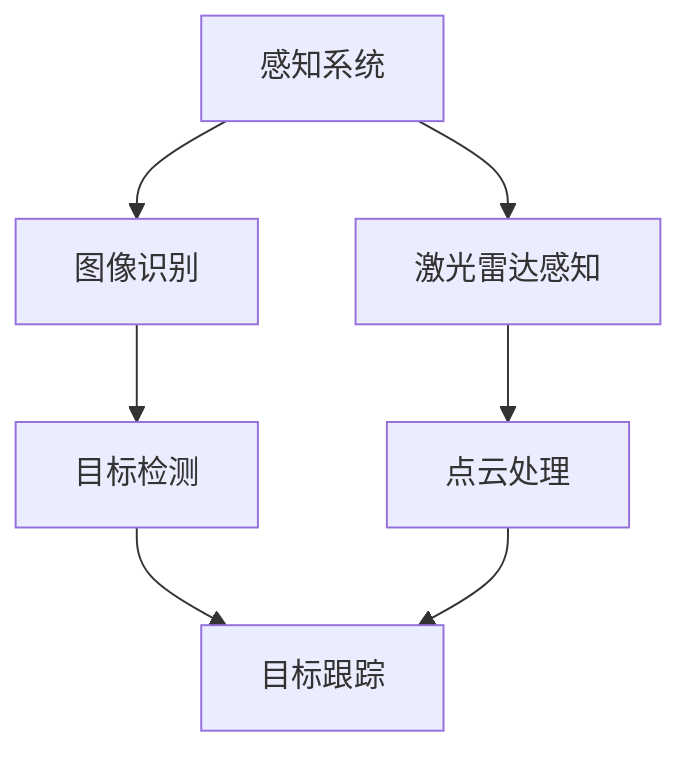
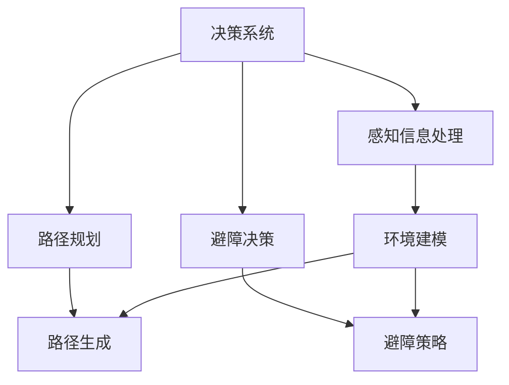

                 

### 文章标题：自动驾驶技术：交通革命与新的商业模式

关键词：自动驾驶，交通革命，商业模式，技术原理，未来趋势

摘要：本文将深入探讨自动驾驶技术的背景、现状、商业模式以及未来趋势。通过逐步分析，我们旨在为读者呈现一个全面、系统的自动驾驶技术概览，并探讨其可能带来的交通革命以及新的商业模式。文章结构清晰，从自动驾驶技术的发展历程、核心概念、应用现状、商业模式，到具体技术原理和未来趋势，均进行了详细阐述。希望本文能够帮助读者更好地理解自动驾驶技术，为未来交通发展提供有益的参考。

### 目录大纲：自动驾驶技术：交通革命与新的商业模式

----------------------------------------------------------------

# 第一部分：自动驾驶技术的背景与现状

## 第1章：自动驾驶技术概述

### 1.1 自动驾驶技术的发展历程

#### 1.1.1 自动驾驶技术的起源

#### 1.1.2 自动驾驶技术的重要里程碑

#### 1.1.3 自动驾驶技术的发展趋势

### 1.2 自动驾驶技术的核心概念

#### 1.2.1 自动驾驶等级分类

#### 1.2.2 自动驾驶关键技术

#### 1.2.3 自动驾驶系统的组成

### 1.3 自动驾驶技术的应用现状

#### 1.3.1 自动驾驶技术在全球的应用情况

#### 1.3.2 自动驾驶技术在中国的应用

#### 1.3.3 自动驾驶技术面临的挑战与机遇

## 1.4 自动驾驶技术的商业模式

### 1.4.1 自动驾驶产业链分析

#### 1.4.1.1 自动驾驶产业链各环节及其关系

#### 1.4.1.2 自动驾驶产业链的核心企业

### 1.4.2 自动驾驶商业模式探索

#### 1.4.2.1 统一收费模式

#### 1.4.2.2 数据变现模式

#### 1.4.2.3 服务订阅模式

#### 1.4.2.4 车主分享模式

### 1.4.3 自动驾驶商业模式的成功案例分析

#### 1.4.3.1 特斯拉的自动驾驶商业模式

#### 1.4.3.2 百度的自动驾驶商业模式

#### 1.4.3.3 谷歌Waymo的自动驾驶商业模式

## 1.5 背景介绍与问题解决

### 1.5.1 自动驾驶技术的核心问题

#### 1.5.1.1 安全性问题

#### 1.5.1.2 道路交通规则适应性

#### 1.5.1.3 系统集成与协同工作

### 1.5.2 自动驾驶技术的边界与外延

#### 1.5.2.1 自动驾驶技术的应用范围

#### 1.5.2.2 自动驾驶技术的未来发展

## 1.6 核心概念与联系

### 1.6.1 自动驾驶技术核心概念

#### 1.6.1.1 概念属性特征对比表

#### 1.6.1.2 自动驾驶技术ER实体关系图

### 1.6.2 自动驾驶技术与其他交通方式的联系

#### 1.6.2.1 自动驾驶与传统交通方式的区别与联系

#### 1.6.2.2 自动驾驶与智能交通系统的融合

## 1.7 本章小结

----------------------------------------------------------------

# 第二部分：自动驾驶技术原理讲解

## 第2章：感知与决策

### 2.1 感知系统原理

#### 2.1.1 感知系统概述

#### 2.1.2 感知系统关键技术

#### 2.1.3 感知系统的应用场景

### 2.2 决策系统原理

#### 2.2.1 决策系统概述

#### 2.2.2 决策系统的工作原理

#### 2.2.3 决策系统的算法原理

### 2.3 感知与决策系统的集成与协同工作

#### 2.3.1 感知与决策系统的协作机制

#### 2.3.2 感知与决策系统在自动驾驶中的应用

#### 2.3.3 感知与决策系统的未来发展趋势

## 2.4 数学模型与公式讲解

### 2.4.1 自动驾驶技术中的数学模型

#### 2.4.1.1 最优化模型

#### 2.4.1.2 控制模型

#### 2.4.1.3 传感器数据融合模型

### 2.4.2 公式讲解

#### 2.4.2.1 最优化模型的公式解析

#### 2.4.2.2 控制模型的公式解析

#### 2.4.2.3 传感器数据融合模型的公式解析

## 2.5 算法原理讲解与举例说明

### 2.5.1 感知算法原理讲解

#### 2.5.1.1 视觉感知算法

#### 2.5.1.2 激光雷达感知算法

#### 2.5.1.3 感知算法的应用实例

### 2.5.2 决策算法原理讲解

#### 2.5.2.1 深度学习决策算法

#### 2.5.2.2 强化学习决策算法

#### 2.5.2.3 决策算法的应用实例

### 2.6 自动驾驶技术的mermaid流程图

#### 2.6.1 感知系统的mermaid流程图

#### 2.6.2 决策系统的mermaid流程图

## 2.7 本章小结

-------------------------

----------------------------------------------------------------

### 第一部分：自动驾驶技术的背景与现状

#### 第1章：自动驾驶技术概述

##### 1.1 自动驾驶技术的发展历程

自动驾驶技术，顾名思义，是指通过电脑系统实现车辆自动行驶的技术。这一技术的发展历程可以追溯到20世纪50年代。当时，美国科学家约翰·麦克卡比（John McCarthy）提出了人工智能（AI）的概念，标志着自动驾驶技术的萌芽。在随后的几十年里，随着计算机技术和传感器技术的进步，自动驾驶技术逐步发展，从简单的路径规划到复杂的决策系统，技术不断演进。

#### 1.1.1 自动驾驶技术的起源

自动驾驶技术的起源可以追溯到20世纪50年代。当时，美国科学家约翰·麦克卡比（John McCarthy）提出了人工智能（AI）的概念，标志着自动驾驶技术的萌芽。1950年，艾伦·图灵（Alan Turing）发表了著名的论文《计算机器与智能》，提出了图灵测试，为自动驾驶技术的发展提供了理论基础。

#### 1.1.2 自动驾驶技术的重要里程碑

自动驾驶技术的发展经历了多个重要的里程碑。1958年，美国阿贡国家实验室（Argonne National Laboratory）的科学家成功演示了世界上第一个自动驾驶车辆，这标志着自动驾驶技术的首次实践。1986年，美国国防部高级研究计划局（DARPA）举办了第一次无人车挑战赛，激发了全球对自动驾驶技术的兴趣。2010年，谷歌开始研发自动驾驶汽车，并在随后的几年里取得了显著进展。

#### 1.1.3 自动驾驶技术的发展趋势

当前，自动驾驶技术正处于快速发展阶段。根据国际自动机工程师学会（SAE）的自动驾驶等级分类，自动驾驶技术已从最初的L0级（无自动化）发展到L4级（高度自动化），未来还有望实现L5级（完全自动化）。随着技术的不断进步，自动驾驶车辆的安全性和可靠性逐渐提高，其在实际应用中的潜力也越来越大。

##### 1.2 自动驾驶技术的核心概念

自动驾驶技术的核心概念包括自动驾驶等级分类、关键技术、系统和应用现状。了解这些概念有助于我们更好地理解自动驾驶技术的发展和未来趋势。

#### 1.2.1 自动驾驶等级分类

自动驾驶等级分类是自动驾驶技术的一个重要概念。根据国际自动机工程师学会（SAE）的定义，自动驾驶技术分为L0-L5六个等级，其中L0级为无自动化，L5级为完全自动化。不同等级的自动驾驶技术具有不同的自动化程度和驾驶责任。

#### 1.2.2 自动驾驶关键技术

自动驾驶技术的实现依赖于多种关键技术的支持，包括感知系统、决策系统、控制系统和定位系统。感知系统负责感知车辆周围的环境，决策系统负责根据感知信息做出驾驶决策，控制系统负责执行决策，定位系统负责确定车辆的位置。

#### 1.2.3 自动驾驶系统的组成

自动驾驶系统通常由多个组件组成，包括传感器、计算单元、控制系统和执行机构。传感器负责收集车辆周围的信息，计算单元负责处理传感器数据，控制系统负责根据处理结果控制车辆的动作，执行机构负责执行控制命令。

##### 1.3 自动驾驶技术的应用现状

自动驾驶技术在全球范围内得到广泛关注和应用。目前，自动驾驶技术主要应用于以下几个方面：

1. **个人出行**：自动驾驶汽车可以提供更安全、更便捷的个人出行服务。例如，特斯拉、谷歌和百度等公司都在研发和推广自动驾驶汽车。

2. **物流运输**：自动驾驶技术可以用于物流运输，提高运输效率，降低成本。例如，亚马逊和UPS等公司已经在测试自动驾驶卡车。

3. **公共交通**：自动驾驶技术可以用于公共交通，如自动驾驶公交车和出租车，提供更灵活、更高效的公共交通服务。

4. **特殊场景**：自动驾驶技术还可以应用于特殊场景，如矿山的无人驾驶卡车、农田的无人驾驶拖拉机等。

#### 1.3.1 自动驾驶技术在全球的应用情况

全球多个国家和地区都在积极推动自动驾驶技术的应用。例如，美国、中国、德国和日本等国家的政府和企业都在加大对自动驾驶技术的投资和研究。其中，美国在自动驾驶技术研究和应用方面处于领先地位，中国的自动驾驶技术发展迅速，德国和日本在自动驾驶汽车制造方面具有优势。

#### 1.3.2 自动驾驶技术在中国的应用

中国在自动驾驶技术领域取得了显著进展。中国政府高度重视自动驾驶技术的发展，出台了多项政策和规划，推动自动驾驶技术的研发和应用。中国的科技企业和互联网公司，如百度、腾讯和阿里巴巴等，都在积极布局自动驾驶技术，并取得了重要成果。例如，百度在自动驾驶技术研究和商业化应用方面处于全球领先地位，其自动驾驶出租车项目已在多个城市试点运行。

#### 1.3.3 自动驾驶技术面临的挑战与机遇

尽管自动驾驶技术取得了显著进展，但仍面临许多挑战。首先，自动驾驶技术的安全性问题是首要关注的问题。如何确保自动驾驶车辆在各种复杂路况下的安全运行是一个重要挑战。其次，自动驾驶技术的法律法规和标准制定尚不完善，需要进一步研究和制定。此外，自动驾驶技术的高成本和复杂的技术实现也是其面临的主要挑战。

然而，自动驾驶技术也带来了许多机遇。随着技术的不断进步，自动驾驶技术有望大幅降低交通事故率，提高交通效率，改善空气质量。自动驾驶技术还可以促进新商业模式的产生，如自动驾驶出租车、自动驾驶物流等。此外，自动驾驶技术还可以为特殊人群，如老年人、残疾人等提供更便捷的出行服务。

##### 1.4 自动驾驶技术的商业模式

自动驾驶技术的商业模式是指自动驾驶技术在商业运营中的具体实现方式和盈利模式。了解自动驾驶技术的商业模式有助于我们更好地理解其商业价值和未来发展。

#### 1.4.1 自动驾驶产业链分析

自动驾驶产业链涉及多个环节，包括传感器、硬件设备、软件平台、数据服务、整车制造和运营服务。每个环节的企业和机构都在自动驾驶技术发展中发挥着重要作用。例如，传感器制造商提供高质量的传感器设备，整车制造商负责生产搭载自动驾驶系统的车辆，软件平台提供商提供自动驾驶系统的软件支持。

#### 1.4.1.1 自动驾驶产业链各环节及其关系

自动驾驶产业链可以分为以下几个主要环节：

1. **传感器制造**：提供用于自动驾驶车辆的传感器设备，如摄像头、激光雷达、超声波传感器等。
2. **硬件设备**：包括自动驾驶车辆的电子控制系统、计算平台、执行机构等。
3. **软件平台**：提供自动驾驶系统的软件支持，包括感知、决策、控制等功能。
4. **数据服务**：提供自动驾驶所需的大数据服务，包括路况数据、交通数据等。
5. **整车制造**：生产搭载自动驾驶系统的整车。
6. **运营服务**：提供自动驾驶车辆的运营服务，如自动驾驶出租车、自动驾驶物流等。

这些环节相互关联，共同构成了自动驾驶产业链。

#### 1.4.1.2 自动驾驶产业链的核心企业

在自动驾驶产业链中，一些核心企业发挥着重要作用。例如：

1. **传感器制造商**：如英伟达、Mobileye、速腾等。
2. **硬件设备制造商**：如特斯拉、宝马、奥迪等。
3. **软件平台提供商**：如谷歌、百度、腾讯等。
4. **整车制造商**：如特斯拉、福特、通用等。
5. **数据服务提供商**：如IBM、亚马逊等。

这些企业通过在自动驾驶产业链的不同环节发挥优势，共同推动自动驾驶技术的发展。

#### 1.4.2 自动驾驶商业模式探索

自动驾驶商业模式的探索是自动驾驶技术商业化的重要方向。目前，自动驾驶商业模式主要包括以下几种：

1. **统一收费模式**：自动驾驶车辆按照行驶里程或时间进行收费，类似于传统的出租车或网约车服务。
2. **数据变现模式**：利用自动驾驶车辆产生的数据，进行数据挖掘和分析，为交通管理和车辆制造商提供有价值的信息。
3. **服务订阅模式**：用户通过订阅服务，享受自动驾驶车辆提供的出行服务。
4. **车主分享模式**：车主将自己的车辆接入自动驾驶系统，与其他用户共享出行服务，从而获得收益。

这些商业模式各有特点，适用于不同的应用场景和市场需求。

#### 1.4.2.1 统一收费模式

统一收费模式是自动驾驶技术最常见的商业模式之一。在这种模式下，自动驾驶车辆按照行驶里程或时间进行收费，类似于传统的出租车或网约车服务。这种模式具有简单易懂、用户接受度高等优点，但同时也存在一些挑战，如收费标准的制定、车辆使用效率的提升等。

#### 1.4.2.2 数据变现模式

数据变现模式是利用自动驾驶车辆产生的数据，进行数据挖掘和分析，为交通管理和车辆制造商提供有价值的信息。这种模式可以带来巨大的商业价值，如精准交通预测、智能交通管理、车辆性能优化等。然而，数据安全和隐私保护是数据变现模式面临的主要挑战。

#### 1.4.2.3 服务订阅模式

服务订阅模式是指用户通过订阅服务，享受自动驾驶车辆提供的出行服务。这种模式用户黏性高，有助于建立稳定的客户群体。然而，服务订阅模式对自动驾驶技术的可靠性和用户体验提出了更高的要求。

#### 1.4.2.4 车主分享模式

车主分享模式是指车主将自己的车辆接入自动驾驶系统，与其他用户共享出行服务，从而获得收益。这种模式可以充分利用车辆资源，提高车辆使用效率。然而，车主分享模式需要解决车辆安全、用户信任等问题。

#### 1.4.3 自动驾驶商业模式的成功案例分析

自动驾驶商业模式的成功案例为行业提供了宝贵的经验。以下是几个典型的成功案例：

1. **特斯拉的自动驾驶商业模式**：特斯拉通过提供自动驾驶硬件和软件，结合统一收费模式，实现了自动驾驶汽车的规模化应用。特斯拉的自动驾驶技术以其卓越的性能和用户体验而著称，吸引了大量用户。
2. **百度的自动驾驶商业模式**：百度通过提供自动驾驶软件平台和解决方案，与整车制造商合作，推动自动驾驶汽车的应用。百度在自动驾驶技术研究和商业化应用方面处于全球领先地位。
3. **谷歌Waymo的自动驾驶商业模式**：谷歌Waymo通过提供自动驾驶出租车服务，探索自动驾驶技术的商业化路径。Waymo在自动驾驶技术研究和商业化应用方面具有丰富的经验，其自动驾驶出租车项目在多个城市取得了成功。

这些成功案例展示了自动驾驶商业模式的多样性和潜力，为行业的发展提供了有益的启示。

##### 1.5 背景介绍与问题解决

在自动驾驶技术的快速发展过程中，许多核心问题和挑战亟待解决。以下是对自动驾驶技术核心问题的介绍以及可能的解决思路。

#### 1.5.1 自动驾驶技术的核心问题

自动驾驶技术的核心问题主要包括：

1. **安全性问题**：如何确保自动驾驶车辆在各种复杂路况下的安全运行是自动驾驶技术面临的首要挑战。这涉及到感知系统的准确性、决策系统的可靠性以及控制系统的稳定性。
2. **道路交通规则适应性**：自动驾驶车辆需要能够适应各种复杂的道路交通规则和场景，包括城市交通、高速公路和乡村道路等。
3. **系统集成与协同工作**：自动驾驶系统需要与其他交通设施、车辆和交通参与者进行有效协同，以实现交通系统的整体优化。
4. **法律法规和标准制定**：自动驾驶技术的快速发展需要完善的法律法规和标准体系来规范其应用和发展。

#### 1.5.1.1 安全性问题

安全性问题是自动驾驶技术的核心挑战。自动驾驶车辆需要在各种复杂路况下做出快速、准确的决策，以确保行驶安全。为了提高安全性，可以从以下几个方面着手：

1. **提高感知系统的准确性**：通过使用高质量的传感器设备和先进的感知算法，提高自动驾驶车辆对周围环境的感知能力。
2. **优化决策系统**：采用先进的决策算法和深度学习技术，提高自动驾驶车辆的决策能力和响应速度。
3. **提高控制系统的稳定性**：通过优化控制系统和执行机构的性能，确保自动驾驶车辆能够稳定地执行决策。
4. **强化测试和验证**：通过严格的测试和验证流程，确保自动驾驶车辆在各种路况下的安全性能。

#### 1.5.1.2 道路交通规则适应性

自动驾驶车辆需要能够适应各种复杂的道路交通规则和场景。为了提高道路交通规则的适应性，可以从以下几个方面着手：

1. **加强道路标识和标线的识别**：通过优化感知系统，提高自动驾驶车辆对道路标识和标线的识别能力。
2. **适应不同交通场景**：通过模拟各种交通场景，测试自动驾驶车辆在不同交通环境下的适应能力。
3. **优化交通信号控制系统**：通过优化交通信号控制系统，提高交通信号的可识别性和可靠性。
4. **建立道路数据标准**：制定统一的道路数据标准，确保自动驾驶车辆能够准确获取道路信息。

#### 1.5.1.3 系统集成与协同工作

自动驾驶系统需要与其他交通设施、车辆和交通参与者进行有效协同，以实现交通系统的整体优化。为了提高系统集成与协同工作的能力，可以从以下几个方面着手：

1. **建立交通信息共享平台**：通过建立交通信息共享平台，实现交通设施、车辆和交通参与者的信息共享，提高交通系统的协同效率。
2. **优化交通信号控制系统**：通过优化交通信号控制系统，提高交通信号的可识别性和可靠性，实现交通系统的有序运行。
3. **加强通信协议和标准制定**：通过制定统一的通信协议和标准，确保自动驾驶系统与其他交通设施的互联互通。
4. **提高自动驾驶车辆的网络化程度**：通过提高自动驾驶车辆的通信能力，实现车辆之间的协同驾驶和智能交通系统的构建。

#### 1.5.1.4 法律法规和标准制定

自动驾驶技术的快速发展需要完善的法律法规和标准体系来规范其应用和发展。为了完善自动驾驶技术的法律法规和标准体系，可以从以下几个方面着手：

1. **制定自动驾驶技术法规**：明确自动驾驶车辆的使用范围、责任归属和交通事故处理等相关法规。
2. **建立自动驾驶技术标准**：制定自动驾驶技术的技术标准，确保自动驾驶车辆的安全性和可靠性。
3. **加强监管和审查**：加强对自动驾驶车辆的安全审查和监管，确保自动驾驶技术的合规性和安全性。
4. **推动国际合作**：通过国际合作，借鉴其他国家和地区的经验，共同推动自动驾驶技术的发展和标准制定。

##### 1.5.2 自动驾驶技术的边界与外延

自动驾驶技术具有广泛的应用边界和外延，涉及多个领域和技术。以下是对自动驾驶技术边界与外延的介绍：

#### 1.5.2.1 自动驾驶技术的应用范围

自动驾驶技术的应用范围非常广泛，包括但不限于以下几个方面：

1. **个人出行**：自动驾驶汽车可以提供更安全、更便捷的个人出行服务，适用于城市交通、高速公路和乡村道路等。
2. **物流运输**：自动驾驶技术可以用于物流运输，提高运输效率，降低成本，适用于长途运输、城市配送等。
3. **公共交通**：自动驾驶技术可以用于公共交通，如自动驾驶公交车、出租车等，提供更灵活、更高效的公共交通服务。
4. **特殊场景**：自动驾驶技术可以应用于特殊场景，如矿山的无人驾驶卡车、农田的无人驾驶拖拉机等。
5. **智能化城市**：自动驾驶技术可以与智能交通系统、智能城市基础设施等相结合，实现城市交通的智能化管理。

#### 1.5.2.2 自动驾驶技术的未来发展

自动驾驶技术的未来发展前景广阔，主要表现在以下几个方面：

1. **技术进步**：随着人工智能、传感器技术和通信技术的不断进步，自动驾驶技术将变得更加智能、可靠和安全。
2. **商业化应用**：自动驾驶技术的商业化应用将逐步扩大，包括自动驾驶汽车、自动驾驶物流、自动驾驶公共交通等。
3. **政策支持**：各国政府和国际组织将加大对自动驾驶技术的支持力度，推动自动驾驶技术的发展和应用。
4. **跨行业融合**：自动驾驶技术将与其他行业，如物联网、大数据、云计算等，实现跨行业融合，推动智能产业的发展。

##### 1.6 核心概念与联系

在自动驾驶技术中，多个核心概念相互关联，构成了一个复杂的技术体系。以下是对自动驾驶技术核心概念及其相互联系的分析。

#### 1.6.1 自动驾驶技术核心概念

自动驾驶技术的核心概念包括：

1. **感知系统**：感知系统负责收集车辆周围的环境信息，包括路况、车辆、行人、交通信号等。
2. **决策系统**：决策系统根据感知系统提供的信息，做出驾驶决策，包括路径规划、避障、变道、停车等。
3. **控制系统**：控制系统负责执行决策系统做出的驾驶决策，包括控制车辆的加速度、速度、转向等。
4. **定位系统**：定位系统负责确定车辆的位置，包括GPS、北斗等卫星定位技术。
5. **通信系统**：通信系统负责实现车辆与其他车辆、交通设施、云端等的信息交互。

#### 1.6.1.1 概念属性特征对比表

为了更清晰地理解自动驾驶技术核心概念，可以对比其属性特征：

| 概念 | 属性特征 |
| ---- | ---- |
| 感知系统 | 负责感知环境信息，提供输入 |
| 决策系统 | 负责根据输入信息做出驾驶决策 |
| 控制系统 | 负责执行驾驶决策，控制车辆动作 |
| 定位系统 | 负责确定车辆位置，提供位置信息 |
| 通信系统 | 负责实现信息交互，支持协同驾驶 |

#### 1.6.1.2 自动驾驶技术ER实体关系图

为了更好地展示自动驾驶技术核心概念之间的联系，可以绘制ER实体关系图：

```
[感知系统] --<[决策系统]--> [控制系统]
          |
          [通信系统]
```

在这个ER实体关系图中，感知系统提供环境信息给决策系统，决策系统做出驾驶决策后传递给控制系统执行，同时通信系统负责实现信息交互，支持协同驾驶。

##### 1.6.2 自动驾驶技术与其他交通方式的联系

自动驾驶技术不仅改变了个人出行和物流运输的方式，还与传统的交通方式，如公共交通、高速公路等，产生了紧密的联系。以下是对自动驾驶技术与其他交通方式联系的分析：

#### 1.6.2.1 自动驾驶与传统交通方式的区别与联系

自动驾驶技术与传统交通方式有以下区别：

1. **自动化程度**：传统交通方式主要依赖于人工操作，而自动驾驶技术可以实现车辆的自动化驾驶。
2. **交通效率**：自动驾驶技术可以提高交通效率，减少拥堵和交通事故。
3. **用户体验**：自动驾驶技术可以提供更舒适、更便捷的出行体验。

同时，自动驾驶技术与传统交通方式也有以下联系：

1. **基础设施**：自动驾驶技术需要依赖现有的交通基础设施，如道路、交通信号等。
2. **法律法规**：自动驾驶技术的应用需要遵循现有的法律法规和交通规则。
3. **产业发展**：自动驾驶技术的兴起将推动交通产业的转型升级，促进相关产业的发展。

#### 1.6.2.2 自动驾驶与智能交通系统的融合

自动驾驶技术与智能交通系统（Intelligent Transportation System，ITS）的融合是未来交通发展的重要方向。智能交通系统通过集成交通信息、通信技术和车辆技术，实现交通的自动化、智能化和高效化。以下是对自动驾驶与智能交通系统融合的分析：

1. **数据共享**：自动驾驶车辆可以通过通信系统与智能交通系统进行数据共享，获取交通信息、路况信息和交通信号信息，从而优化驾驶决策。
2. **协同控制**：智能交通系统可以实现对自动驾驶车辆的协同控制，通过信号优化、路径规划等手段，提高交通系统的整体效率。
3. **安全监管**：智能交通系统可以对自动驾驶车辆进行实时监控和监管，确保驾驶安全。
4. **城市管理**：智能交通系统可以与城市管理系统相结合，实现城市交通的智能化管理，提高城市交通效率。

##### 1.7 本章小结

本章对自动驾驶技术的背景、现状、商业模式以及未来趋势进行了详细分析。首先，回顾了自动驾驶技术的发展历程和重要里程碑，阐述了自动驾驶技术的核心概念和关键技术。其次，分析了自动驾驶技术的应用现状，探讨了其在全球和中国的发展情况，以及面临的挑战和机遇。随后，介绍了自动驾驶技术的商业模式，包括产业链分析、商业模式探索以及成功案例分析。最后，探讨了自动驾驶技术的边界与外延，分析了其与传统交通方式的区别与联系，以及与智能交通系统的融合。通过本章的分析，读者可以全面了解自动驾驶技术的现状和未来发展趋势，为深入研究和应用自动驾驶技术提供参考。

-------------------------

### 第二部分：自动驾驶技术原理讲解

#### 第2章：感知与决策

##### 2.1 感知系统原理

感知系统是自动驾驶技术的核心组成部分，负责收集车辆周围的环境信息，为决策系统提供实时、准确的输入。感知系统通常包括多种传感器，如摄像头、激光雷达、超声波传感器等。以下将详细讲解感知系统的原理、关键技术和应用场景。

###### 2.1.1 感知系统概述

感知系统的主要任务是实时监测车辆周围的环境，包括道路、车辆、行人、交通信号等。感知系统的输入是多模态的，即通过不同的传感器获取不同类型的信息。例如，摄像头可以捕捉图像信息，激光雷达可以测量距离信息，超声波传感器可以检测障碍物。

感知系统的输出是用于决策系统的实时数据，包括道路的形态、车辆的位置、行人的行为、交通信号的状态等。这些数据将用于决策系统进行路径规划、避障、变道、停车等操作。

###### 2.1.2 感知系统关键技术

感知系统的关键技术主要包括图像识别、激光雷达数据处理和传感器数据融合。以下分别介绍这些关键技术。

1. **图像识别**：图像识别是感知系统的重要技术，通过分析摄像头捕捉的图像，识别道路、车辆、行人等目标。图像识别算法包括卷积神经网络（CNN）、深度学习等。通过这些算法，可以实现高精度的目标识别和分类。

2. **激光雷达数据处理**：激光雷达（LiDAR）是一种通过发射激光束并测量反射时间来获取三维环境信息的传感器。激光雷达数据处理技术主要包括点云生成、点云滤波、点云配准等。通过这些技术，可以实现对车辆周围环境的精确建模。

3. **传感器数据融合**：传感器数据融合是将来自不同传感器的数据进行整合，以获得更全面、更准确的环境感知。传感器数据融合技术包括卡尔曼滤波、粒子滤波等。通过这些技术，可以优化传感器数据，提高感知系统的可靠性。

###### 2.1.3 感知系统的应用场景

感知系统在自动驾驶技术中具有广泛的应用场景。以下列举一些常见的应用场景：

1. **城市交通**：在城市交通中，感知系统可以实时监测道路状况，识别车辆和行人，为决策系统提供准确的输入，实现自动驾驶。

2. **高速公路**：在高速公路上，感知系统可以检测前方的车辆和障碍物，进行路径规划和避障，确保车辆在高速公路上安全行驶。

3. **乡村道路**：在乡村道路上，感知系统可以识别道路标识和标线，实现自动驾驶。

4. **物流运输**：在物流运输中，感知系统可以实时监测运输环境，确保货物安全和运输效率。

5. **特殊场景**：在矿山、农田等特殊场景中，感知系统可以识别特定的环境和目标，实现自动驾驶。

##### 2.2 决策系统原理

决策系统是自动驾驶技术的核心组成部分，负责根据感知系统提供的环境信息，做出驾驶决策。决策系统的工作原理包括感知信息处理、决策算法和执行控制。以下将详细讲解决策系统的原理。

###### 2.2.1 决策系统概述

决策系统的任务是利用感知系统提供的环境信息，生成最优的驾驶策略。决策系统通常包括路径规划、避障、变道、停车等功能。决策系统的工作流程如下：

1. **感知信息处理**：决策系统首先对感知系统提供的环境信息进行处理，包括图像识别、点云处理、传感器数据融合等，以获取当前的环境状态。

2. **决策算法**：决策系统利用处理后的环境信息，通过决策算法生成驾驶策略。常见的决策算法包括基于规则的方法、基于模型的方法和基于数据的方法。

3. **执行控制**：决策系统生成的驾驶策略将传递给控制系统，由控制系统执行具体的驾驶操作，如加速、减速、转向等。

###### 2.2.2 决策系统的工作原理

决策系统的工作原理可以概括为以下几步：

1. **感知信息处理**：感知系统收集到车辆周围的环境信息，包括道路、车辆、行人、交通信号等。这些信息将被传输到决策系统。

2. **环境状态建模**：决策系统对感知信息进行处理，建立当前的环境状态模型。环境状态模型包括道路的形态、车辆的位置、行人的行为等。

3. **目标设定**：决策系统根据环境状态模型，设定目标，如保持车道、避免碰撞、到达目的地等。

4. **路径规划**：决策系统根据目标，利用路径规划算法，生成从当前点到目标的路径。常见的路径规划算法包括最短路径算法、A*算法等。

5. **避障决策**：在路径规划过程中，决策系统还需要考虑障碍物的存在。通过避障算法，如动态窗口算法、快速行进算法等，决策系统将生成避障策略。

6. **决策策略生成**：决策系统根据路径规划和避障决策，生成最终的驾驶策略，包括加速、减速、转向等。

7. **执行控制**：决策系统将驾驶策略传递给控制系统，由控制系统执行具体的驾驶操作。

###### 2.2.3 决策系统的算法原理

决策系统的算法原理主要包括路径规划算法、避障算法和目标跟踪算法。以下分别介绍这些算法的原理。

1. **路径规划算法**：路径规划算法的主要任务是生成从起点到终点的最优路径。常见的路径规划算法包括最短路径算法、A*算法、Dijkstra算法等。最短路径算法只考虑路径的长度，而A*算法考虑路径的长度和到达终点的代价。Dijkstra算法是一种基于贪心的最短路径算法。

2. **避障算法**：避障算法的主要任务是确保车辆在行驶过程中避开障碍物。常见的避障算法包括动态窗口算法、快速行进算法等。动态窗口算法通过设置一个虚拟的窗口，判断车辆是否与障碍物发生碰撞，并根据碰撞情况调整车辆轨迹。快速行进算法通过计算车辆与障碍物的距离和速度，提前调整车辆轨迹。

3. **目标跟踪算法**：目标跟踪算法的主要任务是跟踪车辆周围的目标，如车辆、行人、交通信号等。常见的目标跟踪算法包括卡尔曼滤波、粒子滤波等。卡尔曼滤波是一种基于统计学的目标跟踪算法，通过预测和更新目标状态，实现对目标的跟踪。粒子滤波是一种基于随机采样的目标跟踪算法，通过大量粒子模拟目标状态，实现对目标的跟踪。

##### 2.3 感知与决策系统的集成与协同工作

感知系统与决策系统是自动驾驶技术的核心组成部分，它们需要协同工作，才能实现车辆的自动驾驶。以下将详细讲解感知与决策系统的集成与协同工作原理。

###### 2.3.1 感知与决策系统的协作机制

感知系统与决策系统的协作机制主要包括信息传递和反馈调节。感知系统将收集到的环境信息传递给决策系统，决策系统根据这些信息生成驾驶策略，然后将策略反馈给感知系统，以调整感知系统的数据处理。

1. **信息传递**：感知系统将收集到的环境信息以数据流的形式传递给决策系统。这些信息包括图像、点云、传感器数据等。决策系统通过分析这些数据，生成驾驶策略。

2. **反馈调节**：决策系统将生成的驾驶策略传递给感知系统，感知系统根据这些策略调整数据处理的参数和算法，以提高感知的准确性和效率。

###### 2.3.2 感知与决策系统在自动驾驶中的应用

感知与决策系统在自动驾驶中的应用是相互依存的。感知系统提供环境信息，决策系统根据这些信息生成驾驶策略。以下是一个简单的自动驾驶应用场景：

1. **感知阶段**：车辆启动后，感知系统开始工作，收集道路、车辆、行人等环境信息。感知系统将图像信息传递给图像识别算法，识别道路、车辆、行人等目标。同时，感知系统将激光雷达信息传递给激光雷达数据处理算法，建立车辆周围的三维环境模型。

2. **决策阶段**：决策系统接收到感知系统的数据后，开始分析当前的环境状态，生成驾驶策略。决策系统首先进行路径规划，生成从当前点到目的地的最优路径。然后，决策系统根据路径规划和避障算法，生成避障策略，确保车辆在行驶过程中避开障碍物。

3. **执行阶段**：决策系统将生成的驾驶策略传递给控制系统，控制系统根据策略执行具体的驾驶操作，如加速、减速、转向等，使车辆按照预定的路线行驶。

###### 2.3.3 感知与决策系统的未来发展趋势

随着人工智能技术的不断发展，感知与决策系统在自动驾驶技术中的应用将越来越广泛。以下是对感知与决策系统未来发展趋势的展望：

1. **技术融合**：感知与决策系统将与其他先进技术，如大数据、云计算、物联网等，实现深度融合，提高自动驾驶系统的智能化水平。

2. **自主进化**：感知与决策系统将具备自主进化的能力，通过不断学习和优化，提高自动驾驶系统的适应性和鲁棒性。

3. **协同优化**：感知与决策系统将实现协同优化，通过优化信息传递、反馈调节等机制，提高自动驾驶系统的效率和稳定性。

4. **安全可靠**：感知与决策系统将重点关注安全性和可靠性，通过提高感知系统的准确性、优化决策算法、加强系统测试等手段，确保自动驾驶系统的安全运行。

##### 2.4 数学模型与公式讲解

在自动驾驶技术中，数学模型和公式起着至关重要的作用。以下将详细讲解自动驾驶技术中的数学模型和公式，包括最优化模型、控制模型和传感器数据融合模型。

###### 2.4.1 自动驾驶技术中的数学模型

自动驾驶技术中的数学模型主要包括以下几种：

1. **最优化模型**：最优化模型用于求解自动驾驶系统的最优路径、最优速度等。常见的最优化模型包括线性规划、非线性规划、动态规划等。

2. **控制模型**：控制模型用于描述自动驾驶系统的控制过程，包括车辆的动力学模型、控制算法等。常见的控制模型包括PID控制、模糊控制、自适应控制等。

3. **传感器数据融合模型**：传感器数据融合模型用于将来自不同传感器的数据进行整合，提高感知系统的准确性和鲁棒性。常见的传感器数据融合模型包括卡尔曼滤波、粒子滤波等。

###### 2.4.2 公式讲解

以下是对自动驾驶技术中常用公式的讲解：

1. **最优化模型公式**：

   最优化模型通常用以下公式表示：

   $$ \min J(x) $$

   其中，$J(x)$ 是目标函数，$x$ 是变量。

   常见的目标函数包括：

   - **距离函数**：用于计算车辆到终点的距离，公式为：

     $$ d = \sqrt{(x_f - x)^2 + (y_f - y)^2} $$

   - **时间函数**：用于计算车辆到达终点所需的时间，公式为：

     $$ t = \frac{d}{v} $$

   - **速度函数**：用于计算车辆在特定时间内的速度，公式为：

     $$ v = \frac{d}{t} $$

2. **控制模型公式**：

   控制模型通常用以下公式表示：

   $$ u = f(x) $$

   其中，$u$ 是控制输入，$x$ 是状态变量，$f(x)$ 是控制函数。

   常见控制函数包括：

   - **PID控制**：PID控制是一种常用的控制方法，公式为：

     $$ u = K_p e + K_i \int e dt + K_d \frac{de}{dt} $$

     其中，$e$ 是误差，$K_p$、$K_i$、$K_d$ 分别是比例、积分、微分系数。

   - **模糊控制**：模糊控制是一种基于模糊逻辑的控制方法，公式为：

     $$ u = F(u) $$

     其中，$F(u)$ 是模糊控制规则。

3. **传感器数据融合模型公式**：

   传感器数据融合模型通常用以下公式表示：

   $$ x_{\text{ fused}} = w_1 x_1 + w_2 x_2 + ... + w_n x_n $$

   其中，$x_1, x_2, ..., x_n$ 是来自不同传感器的数据，$w_1, w_2, ..., w_n$ 是权重系数。

   常见的数据融合方法包括：

   - **卡尔曼滤波**：卡尔曼滤波是一种基于最小均方误差的传感器数据融合方法，公式为：

     $$ x_{\text{ fused}} = \frac{w_1 x_1 + w_2 x_2 + ... + w_n x_n}{w_1 + w_2 + ... + w_n} $$

   - **粒子滤波**：粒子滤波是一种基于随机采样的传感器数据融合方法，公式为：

     $$ x_{\text{ fused}} = \sum_{i=1}^n w_i x_i $$

     其中，$w_i$ 是第$i$个粒子的权重。

##### 2.5 算法原理讲解与举例说明

在自动驾驶技术中，算法原理的讲解与举例说明是理解其工作原理的重要途径。以下将分别介绍感知算法和决策算法的原理，并通过具体实例进行说明。

###### 2.5.1 感知算法原理讲解

感知算法是自动驾驶技术的核心，负责从传感器数据中提取有用的信息，如道路、车辆、行人等。以下将介绍两种常见的感知算法：视觉感知算法和激光雷达感知算法。

1. **视觉感知算法**

   视觉感知算法利用摄像头捕捉图像，通过图像处理和计算机视觉技术提取环境信息。以下是其基本原理：

   - **图像预处理**：对捕获的图像进行预处理，包括去噪、对比度增强、边缘检测等。

   - **目标检测**：使用卷积神经网络（CNN）或其他深度学习算法对预处理后的图像进行目标检测，识别道路、车辆、行人等目标。

   - **目标跟踪**：对检测到的目标进行跟踪，以保持对目标的连续监测。

2. **激光雷达感知算法**

   激光雷达（LiDAR）感知算法利用激光雷达发射激光并测量反射时间，生成点云数据，然后通过对点云数据进行处理提取环境信息。以下是其基本原理：

   - **点云生成**：激光雷达发射激光，测量反射时间，生成三维点云数据。

   - **点云滤波**：对点云数据进行滤波，去除噪声和异常点，提高点云数据的准确性。

   - **点云分割**：将点云数据分割成不同的区域，识别道路、车辆、行人等目标。

###### 2.5.1.1 视觉感知算法的应用实例

以下是一个视觉感知算法的应用实例：

```python
import cv2
import numpy as np

# 读取图像
image = cv2.imread('image.jpg')

# 图像预处理
gray = cv2.cvtColor(image, cv2.COLOR_BGR2GRAY)
blurred = cv2.GaussianBlur(gray, (5, 5), 0)
edges = cv2.Canny(blurred, 50, 150)

# 目标检测
net = cv2.dnn.readNetFromCaffemodel('cafferoot_file', 'deploy.prototxt')
blob = cv2.dnn.blobFromImage(image, 1.0, (224, 224), (104.0, 177.0, 123.0))
net.setInput(blob)
detections = net.forward()

# 显示检测结果
for i in range(detections.shape[2]):
    confidence = detections[0, 0, i, 2]
    if confidence > 0.5:
        class_id = int(detections[0, 0, i, 1])
        label = labels[class_id]
        box = detections[0, 0, i, 3:7] * np.array([image.shape[1], image.shape[0], image.shape[1], image.shape[0]])
        (x, y, x2, y2) = box.astype("int")
        cv2.rectangle(image, (x, y), (x2, y2), (0, 255, 0), 2)
        cv2.putText(image, label, (x, y - 10), cv2.FONT_HERSHEY_SIMPLEX, 0.5, (0, 255, 0), 2)

cv2.imshow('image', image)
cv2.waitKey(0)
cv2.destroyAllWindows()
```

在这个实例中，首先对捕获的图像进行预处理，然后使用卷积神经网络进行目标检测，最后在图像上显示检测结果。

###### 2.5.1.2 激光雷达感知算法的应用实例

以下是一个激光雷达感知算法的应用实例：

```python
import open3d as o3d

# 读取点云数据
point_cloud = o3d.io.read_point_cloud('point_cloud.ply')

# 点云滤波
point_cloud = point_cloud.voxel_down_sample(voxel_size=0.05)

# 点云分割
point_cloud = point_cloud.remove_statistical_outlier(nb_neighbors=20, radiusMulti=2.0)

# 显示点云数据
o3d.visualization.draw_geometries([point_cloud])

# 识别道路、车辆、行人等目标
# 这里可以根据具体应用需求，使用点云分割、目标检测等算法进行识别

```

在这个实例中，首先读取点云数据，然后进行点云滤波和分割，最后显示处理后的点云数据。

###### 2.5.2 决策算法原理讲解

决策算法是自动驾驶技术的核心，负责根据感知到的环境信息，生成驾驶策略。以下将介绍两种常见的决策算法：深度学习决策算法和强化学习决策算法。

1. **深度学习决策算法**

   深度学习决策算法利用神经网络模型，从感知到的环境信息中学习驾驶策略。以下是其基本原理：

   - **感知信息输入**：将感知到的环境信息（如图像、点云等）输入神经网络模型。

   - **特征提取**：神经网络模型对输入信息进行特征提取，生成特征向量。

   - **决策生成**：基于特征向量，神经网络模型生成驾驶策略，如加速、减速、转向等。

2. **强化学习决策算法**

   强化学习决策算法通过试错学习，从环境中获取奖励，不断优化驾驶策略。以下是其基本原理：

   - **环境交互**：自动驾驶车辆在环境中进行驾驶，感知环境信息。

   - **策略选择**：基于当前状态和感知信息，选择最佳驾驶策略。

   - **奖励反馈**：自动驾驶车辆根据驾驶策略在环境中的表现，获得奖励或惩罚。

   - **策略优化**：根据奖励反馈，优化驾驶策略，提高驾驶效果。

###### 2.5.2.1 深度学习决策算法的应用实例

以下是一个深度学习决策算法的应用实例：

```python
import tensorflow as tf
from tensorflow.keras.models import Sequential
from tensorflow.keras.layers import Dense, Flatten, Conv2D

# 构建神经网络模型
model = Sequential([
    Conv2D(32, (3, 3), activation='relu', input_shape=(224, 224, 3)),
    Flatten(),
    Dense(64, activation='relu'),
    Dense(10, activation='softmax')
])

# 编译模型
model.compile(optimizer='adam', loss='categorical_crossentropy', metrics=['accuracy'])

# 训练模型
model.fit(x_train, y_train, epochs=10, batch_size=32, validation_data=(x_val, y_val))

# 生成驾驶策略
def generate_strategy(image):
    # 预处理图像
    processed_image = preprocess_image(image)
    
    # 输入模型
    prediction = model.predict(np.expand_dims(processed_image, axis=0))
    
    # 解码预测结果
    strategy = decode_prediction(prediction)
    
    return strategy

# 预测驾驶策略
strategy = generate_strategy(image)
print(strategy)
```

在这个实例中，首先构建一个卷积神经网络模型，然后训练模型，最后使用模型生成驾驶策略。

###### 2.5.2.2 强化学习决策算法的应用实例

以下是一个强化学习决策算法的应用实例：

```python
import gym
import numpy as np

# 创建环境
env = gym.make('CartPole-v0')

# 初始化策略参数
epsilon = 0.1
q_values = np.zeros((env.observation_space.n, env.action_space.n))

# 训练策略
num_episodes = 1000
for episode in range(num_episodes):
    state = env.reset()
    done = False
    total_reward = 0
    
    while not done:
        # 选择动作
        if np.random.rand() < epsilon:
            action = env.action_space.sample()
        else:
            action = np.argmax(q_values[state])
        
        # 执行动作
        next_state, reward, done, _ = env.step(action)
        
        # 更新Q值
        q_values[state][action] = q_values[state][action] + 0.1 * (reward + 0.9 * np.max(q_values[next_state]) - q_values[state][action])
        
        state = next_state
        total_reward += reward
        
    print(f"Episode {episode+1}: Total Reward = {total_reward}")

# 关闭环境
env.close()
```

在这个实例中，使用强化学习算法训练一个策略，使其在CartPole环境中取得良好的表现。

##### 2.6 自动驾驶技术的mermaid流程图

mermaid流程图是一种基于Markdown的图形化表示工具，可以方便地绘制流程图、类图、架构图等。以下将介绍如何使用mermaid流程图表示自动驾驶技术的感知系统和决策系统。

###### 2.6.1 感知系统的mermaid流程图



在这个mermaid流程图中，感知系统包括图像识别和激光雷达感知两个部分，分别对应B和C。图像识别和激光雷达感知分别通过D和E生成目标检测和点云处理结果，最终通过F实现目标跟踪。

###### 2.6.2 决策系统的mermaid流程图



在这个mermaid流程图中，决策系统包括感知信息处理、路径规划和避障决策三个部分，分别对应A、C和D。感知信息处理生成环境建模结果，用于路径规划和避障决策。路径规划和避障决策分别通过F和G生成路径和避障策略。

##### 2.7 本章小结

本章详细介绍了自动驾驶技术的感知与决策原理，包括感知系统的原理、关键技术和应用场景，以及决策系统的工作原理、算法原理和应用实例。通过mermaid流程图的引入，使得自动驾驶技术的感知与决策过程更加直观和易于理解。本章的内容为后续自动驾驶技术的深入研究和实际应用提供了重要的理论基础。在接下来的章节中，我们将继续探讨自动驾驶技术的其他方面，如数学模型与公式讲解、算法原理讲解与举例说明等，以期为读者提供一个全面、系统的自动驾驶技术教程。

-------------------------

## 第二部分：自动驾驶技术原理讲解

### 第2章：感知与决策

感知与决策是自动驾驶技术的核心环节，决定了自动驾驶车辆是否能够安全、准确地执行各种驾驶任务。本章将详细讲解感知与决策系统的原理，包括感知系统的工作原理、决策系统的工作原理，以及感知与决策系统的协同工作。

#### 2.1 感知系统原理

感知系统是自动驾驶车辆获取环境信息的关键部件，负责收集并处理来自各种传感器的数据，如摄像头、激光雷达、雷达、超声波传感器等。感知系统的工作原理主要包括以下几个方面：

##### 2.1.1 感知系统概述

感知系统的主要任务是对车辆周围的环境进行感知，包括道路信息、交通标志、其他车辆、行人、障碍物等。感知系统通过多种传感器协同工作，实现对环境的全面了解。

1. **摄像头**：摄像头用于捕捉道路和周围环境的图像信息，通过图像处理算法，可以实现目标检测、识别和跟踪等功能。
2. **激光雷达（LiDAR）**：激光雷达通过发射激光并测量激光反射的时间，生成车辆周围的三维点云数据，用于环境建模和障碍物检测。
3. **雷达**：雷达通过发射无线电波并接收反射波，测量目标物体的距离、速度和方位，常用于车辆间的距离和速度检测。
4. **超声波传感器**：超声波传感器通过发射超声波并接收反射波，测量目标物体的距离，常用于近距离障碍物检测。

##### 2.1.2 感知系统关键技术

感知系统中的关键技术包括传感器数据预处理、图像处理、点云处理和传感器数据融合。

1. **传感器数据预处理**：传感器数据预处理包括去噪、归一化、滤波等步骤，以提高数据的准确性和可靠性。
2. **图像处理**：图像处理技术包括边缘检测、目标检测、图像分割等，用于从图像中提取有用的信息。
3. **点云处理**：点云处理技术包括点云滤波、点云配准、点云分类等，用于从点云数据中提取环境信息。
4. **传感器数据融合**：传感器数据融合技术将来自不同传感器的数据集成在一起，生成一个统一的、综合的环境感知结果。

##### 2.1.3 感知系统的应用场景

感知系统在自动驾驶中的应用场景非常广泛，主要包括以下几种：

1. **城市道路**：在复杂多变的城市道路环境中，感知系统需要能够识别交通标志、车道线、行人、车辆等，确保车辆安全行驶。
2. **高速公路**：在高速公路上，感知系统需要识别车道线、道路标志、其他车辆等，确保车辆在车道内稳定行驶。
3. **乡村道路**：在乡村道路环境中，感知系统需要能够适应复杂的地形和路况，识别道路、障碍物等。
4. **极端环境**：在极端环境中，如雪地、沙漠等，感知系统需要具备较强的适应性，能够稳定地获取环境信息。

#### 2.2 决策系统原理

决策系统是自动驾驶车辆的“大脑”，负责根据感知系统提供的环境信息，生成驾驶策略，指导车辆进行驾驶操作。决策系统的工作原理主要包括以下几个方面：

##### 2.2.1 决策系统概述

决策系统的主要任务是根据感知系统提供的环境信息，做出合理的驾驶决策。决策系统通常包括以下几个部分：

1. **环境模型**：环境模型是对车辆周围环境的抽象表示，包括道路、车道、车辆、行人等。
2. **决策算法**：决策算法是决策系统的核心，负责根据环境模型，生成驾驶策略。
3. **执行模块**：执行模块负责将决策算法生成的驾驶策略转化为车辆的实际操作。

##### 2.2.2 决策系统的工作原理

决策系统的工作原理可以分为以下几个步骤：

1. **环境感知**：感知系统收集车辆周围的环境信息，并将其传递给决策系统。
2. **环境建模**：决策系统对感知系统提供的信息进行建模，生成环境模型。
3. **决策计算**：决策系统利用环境模型和决策算法，计算最优驾驶策略。
4. **策略执行**：执行模块将决策算法生成的驾驶策略转化为车辆的实际操作。

##### 2.2.3 决策系统的算法原理

决策系统的算法原理可以分为以下几种：

1. **规则驱动算法**：规则驱动算法基于预定义的规则集，根据环境模型和规则，生成驾驶策略。这种算法简单易实现，但灵活性较差。
2. **模型预测控制算法**：模型预测控制算法通过建立车辆动力学模型，预测车辆在未来一段时间内的行为，并生成驾驶策略。这种算法具有较高的灵活性和准确性。
3. **深度学习算法**：深度学习算法通过训练大规模神经网络，从数据中学习驾驶策略。这种算法可以自动提取复杂的特征，但训练过程复杂，对数据要求较高。

##### 2.2.4 感知与决策系统的协同工作

感知与决策系统的协同工作是实现自动驾驶车辆安全、稳定运行的关键。感知系统提供环境信息，决策系统根据环境信息生成驾驶策略，两者需要紧密协同，确保车辆在复杂环境中能够做出正确的驾驶决策。

1. **数据同步**：感知系统与决策系统需要保持数据同步，确保决策系统在生成驾驶策略时，使用的是最新的环境信息。
2. **策略反馈**：决策系统生成的驾驶策略需要反馈给感知系统，以便感知系统根据策略调整数据处理的参数和算法，提高感知的准确性和效率。
3. **实时调整**：感知与决策系统需要具备实时调整能力，能够根据环境变化，动态调整驾驶策略，确保车辆在复杂环境中能够安全行驶。

#### 2.3 感知与决策系统的集成与协同工作

感知与决策系统的集成与协同工作是实现自动驾驶技术的关键。以下是对感知与决策系统的集成与协同工作的详细讲解：

##### 2.3.1 感知与决策系统的协作机制

感知与决策系统的协作机制主要包括数据传递、信息共享和策略调整。

1. **数据传递**：感知系统将收集到的环境信息传递给决策系统，决策系统根据这些信息生成驾驶策略。
2. **信息共享**：感知系统与决策系统之间需要实现信息共享，确保决策系统能够获取到最新的环境信息。
3. **策略调整**：决策系统生成的驾驶策略需要反馈给感知系统，感知系统根据策略调整数据处理的参数和算法，提高感知的准确性和效率。

##### 2.3.2 感知与决策系统在自动驾驶中的应用

感知与决策系统在自动驾驶中的应用是相互依存的。感知系统提供环境信息，决策系统根据这些信息生成驾驶策略，两者共同确保车辆在复杂环境中能够安全行驶。

1. **城市道路**：在复杂多变的城市道路环境中，感知系统需要识别交通标志、车道线、行人、车辆等，决策系统需要根据这些信息生成合理的驾驶策略，确保车辆在车道内稳定行驶。
2. **高速公路**：在高速公路上，感知系统需要识别车道线、道路标志、其他车辆等，决策系统需要根据这些信息生成稳定的驾驶策略，确保车辆在车道内行驶。
3. **乡村道路**：在乡村道路环境中，感知系统需要适应复杂的地形和路况，决策系统需要根据这些信息生成合理的驾驶策略，确保车辆安全行驶。

##### 2.3.3 感知与决策系统的未来发展趋势

随着人工智能技术的快速发展，感知与决策系统在自动驾驶技术中的应用将越来越广泛。未来感知与决策系统的发展趋势包括：

1. **数据融合**：感知系统与决策系统将实现更高效的数据融合，提高环境感知的准确性和鲁棒性。
2. **自主学习**：感知与决策系统将具备自主学习能力，能够根据驾驶经验和环境信息，不断优化驾驶策略。
3. **实时调整**：感知与决策系统将实现实时调整，能够根据环境变化，动态优化驾驶策略，提高驾驶安全性。

#### 2.4 数学模型与公式讲解

在自动驾驶技术中，数学模型与公式起着至关重要的作用，用于描述车辆的运动、环境的特征以及决策过程。以下是对自动驾驶技术中常用数学模型与公式的讲解：

##### 2.4.1 车辆运动学模型

车辆运动学模型用于描述车辆在环境中的运动，主要包括以下公式：

1. **速度与加速度**：

   $$ v(t) = v_0 + at $$
   
   $$ a(t) = \frac{dv(t)}{dt} $$

   其中，$v(t)$ 是车辆在时间$t$的速度，$v_0$ 是初始速度，$a(t)$ 是车辆在时间$t$的加速度。

2. **位置与位移**：

   $$ x(t) = x_0 + v_0t + \frac{1}{2}at^2 $$
   
   $$ \Delta x = x(t_1) - x(t_0) $$
   
   其中，$x(t)$ 是车辆在时间$t$的位置，$x_0$ 是初始位置，$\Delta x$ 是车辆在时间间隔$\Delta t$内的位移。

##### 2.4.2 控制系统模型

控制系统模型用于描述车辆的运动控制，主要包括以下公式：

1. **油门控制**：

   $$ \Delta T = K_p \cdot e $$
   
   $$ \Delta T = K_i \cdot \int e dt $$
   
   $$ \Delta T = K_d \cdot \frac{de}{dt} $$

   其中，$\Delta T$ 是油门控制量，$e$ 是误差，$K_p$、$K_i$、$K_d$ 是比例、积分、微分系数。

2. **转向控制**：

   $$ \theta = K_p \cdot e $$
   
   $$ \theta = K_i \cdot \int e dt $$
   
   $$ \theta = K_d \cdot \frac{de}{dt} $$

   其中，$\theta$ 是转向角度，$e$ 是误差，$K_p$、$K_i$、$K_d$ 是比例、积分、微分系数。

##### 2.4.3 传感器数据融合模型

传感器数据融合模型用于将来自不同传感器的数据进行融合，生成更准确的环境感知结果，主要包括以下公式：

1. **卡尔曼滤波**：

   $$ x_{\text{预测}} = A \cdot x_{\text{前一个状态}} + B \cdot u $$
   
   $$ P_{\text{预测}} = A \cdot P_{\text{前一个状态}} \cdot A^T + Q $$
   
   $$ K = P_{\text{预测}} \cdot H^T \cdot (H \cdot P_{\text{预测}} \cdot H^T + R)^{-1} $$
   
   $$ x_{\text{更新}} = x_{\text{预测}} + K \cdot (z - H \cdot x_{\text{预测}}) $$
   
   $$ P_{\text{更新}} = (I - K \cdot H) \cdot P_{\text{预测}} $$

   其中，$x_{\text{状态}}$ 是状态向量，$P_{\text{状态估计误差}}$ 是状态估计误差矩阵，$A$ 是状态转移矩阵，$B$ 是控制矩阵，$H$ 是观测矩阵，$u$ 是控制向量，$z$ 是观测向量，$Q$ 是过程噪声协方差矩阵，$R$ 是观测噪声协方差矩阵。

##### 2.4.4 决策模型

决策模型用于生成驾驶策略，主要包括以下公式：

1. **路径规划**：

   $$ C(J) = \sum_{i=1}^{n} w_i \cdot f_i(J) $$
   
   $$ J^* = \arg\min_{J} C(J) $$

   其中，$C(J)$ 是目标函数，$w_i$ 是权重系数，$f_i(J)$ 是第$i$个目标的函数，$J^*$ 是最优路径。

2. **避障**：

   $$ d = \min_{i=1,...,n} \frac{||x_i - x_j||}{v_j} $$
   
   $$ x_j^* = \arg\min_{j=1,...,n} d $$

   其中，$x_i$ 是障碍物位置，$x_j$ 是车辆位置，$v_j$ 是障碍物速度。

#### 2.5 算法原理讲解与举例说明

在自动驾驶技术中，算法原理的讲解与举例说明是理解其工作原理的重要途径。以下将分别介绍感知算法和决策算法的原理，并通过具体实例进行说明。

##### 2.5.1 感知算法原理讲解

感知算法是自动驾驶技术的核心，负责从传感器数据中提取有用的信息，如道路、车辆、行人等。以下将介绍两种常见的感知算法：视觉感知算法和激光雷达感知算法。

###### 2.5.1.1 视觉感知算法

视觉感知算法利用摄像头捕捉图像，通过图像处理和计算机视觉技术提取环境信息。以下是其基本原理：

1. **图像预处理**：对捕获的图像进行预处理，包括去噪、对比度增强、边缘检测等。
2. **目标检测**：使用卷积神经网络（CNN）或其他深度学习算法对预处理后的图像进行目标检测，识别道路、车辆、行人等目标。
3. **目标跟踪**：对检测到的目标进行跟踪，以保持对目标的连续监测。

###### 2.5.1.2 激光雷达感知算法

激光雷达（LiDAR）感知算法利用激光雷达发射激光并测量反射时间，生成车辆周围的三维点云数据，然后通过对点云数据进行处理提取环境信息。以下是其基本原理：

1. **点云生成**：激光雷达发射激光，测量反射时间，生成三维点云数据。
2. **点云滤波**：对点云数据进行滤波，去除噪声和异常点，提高点云数据的准确性。
3. **点云分割**：将点云数据分割成不同的区域，识别道路、车辆、行人等目标。

###### 2.5.1.3 视觉感知算法的应用实例

以下是一个视觉感知算法的应用实例：

```python
import cv2
import numpy as np

# 读取图像
image = cv2.imread('image.jpg')

# 图像预处理
gray = cv2.cvtColor(image, cv2.COLOR_BGR2GRAY)
blurred = cv2.GaussianBlur(gray, (5, 5), 0)
edges = cv2.Canny(blurred, 50, 150)

# 目标检测
net = cv2.dnn.readNetFromCaffemodel('cafferoot_file', 'deploy.prototxt')
blob = cv2.dnn.blobFromImage(image, 1.0, (224, 224), (104.0, 177.0, 123.0))
net.setInput(blob)
detections = net.forward()

# 显示检测结果
for i in range(detections.shape[2]):
    confidence = detections[0, 0, i, 2]
    if confidence > 0.5:
        class_id = int(detections[0, 0, i, 1])
        label = labels[class_id]
        box = detections[0, 0, i, 3:7] * np.array([image.shape[1], image.shape[0], image.shape[1], image.shape[0]])
        (x, y, x2, y2) = box.astype("int")
        cv2.rectangle(image, (x, y), (x2, y2), (0, 255, 0), 2)
        cv2.putText(image, label, (x, y - 10), cv2.FONT_HERSHEY_SIMPLEX, 0.5, (0, 255, 0), 2)

cv2.imshow('image', image)
cv2.waitKey(0)
cv2.destroyAllWindows()
```

在这个实例中，首先对捕获的图像进行预处理，然后使用卷积神经网络进行目标检测，最后在图像上显示检测结果。

###### 2.5.1.4 激光雷达感知算法的应用实例

以下是一个激光雷达感知算法的应用实例：

```python
import open3d as o3d

# 读取点云数据
point_cloud = o3d.io.read_point_cloud('point_cloud.ply')

# 点云滤波
point_cloud = point_cloud.voxel_down_sample(voxel_size=0.05)

# 点云分割
point_cloud = point_cloud.remove_statistical_outlier(nb_neighbors=20, radiusMulti=2.0)

# 显示点云数据
o3d.visualization.draw_geometries([point_cloud])

# 识别道路、车辆、行人等目标
# 这里可以根据具体应用需求，使用点云分割、目标检测等算法进行识别

```

在这个实例中，首先读取点云数据，然后进行点云滤波和分割，最后显示处理后的点云数据。

##### 2.5.2 决策算法原理讲解

决策算法是自动驾驶技术的核心，负责根据感知到的环境信息，生成驾驶策略。以下将介绍两种常见的决策算法：深度学习决策算法和强化学习决策算法。

###### 2.5.2.1 深度学习决策算法

深度学习决策算法利用神经网络模型，从感知到的环境信息中学习驾驶策略。以下是其基本原理：

1. **感知信息输入**：将感知到的环境信息（如图像、点云等）输入神经网络模型。
2. **特征提取**：神经网络模型对输入信息进行特征提取，生成特征向量。
3. **决策生成**：基于特征向量，神经网络模型生成驾驶策略，如加速、减速、转向等。

###### 2.5.2.2 强化学习决策算法

强化学习决策算法通过试错学习，从环境中获取奖励，不断优化驾驶策略。以下是其基本原理：

1. **环境交互**：自动驾驶车辆在环境中进行驾驶，感知环境信息。
2. **策略选择**：基于当前状态和感知信息，选择最佳驾驶策略。
3. **奖励反馈**：自动驾驶车辆根据驾驶策略在环境中的表现，获得奖励或惩罚。
4. **策略优化**：根据奖励反馈，优化驾驶策略，提高驾驶效果。

###### 2.5.2.3 深度学习决策算法的应用实例

以下是一个深度学习决策算法的应用实例：

```python
import tensorflow as tf
from tensorflow.keras.models import Sequential
from tensorflow.keras.layers import Dense, Flatten, Conv2D

# 构建神经网络模型
model = Sequential([
    Conv2D(32, (3, 3), activation='relu', input_shape=(224, 224, 3)),
    Flatten(),
    Dense(64, activation='relu'),
    Dense(10, activation='softmax')
])

# 编译模型
model.compile(optimizer='adam', loss='categorical_crossentropy', metrics=['accuracy'])

# 训练模型
model.fit(x_train, y_train, epochs=10, batch_size=32, validation_data=(x_val, y_val))

# 生成驾驶策略
def generate_strategy(image):
    # 预处理图像
    processed_image = preprocess_image(image)
    
    # 输入模型
    prediction = model.predict(np.expand_dims(processed_image, axis=0))
    
    # 解码预测结果
    strategy = decode_prediction(prediction)
    
    return strategy

# 预测驾驶策略
strategy = generate_strategy(image)
print(strategy)
```

在这个实例中，首先构建一个卷积神经网络模型，然后训练模型，最后使用模型生成驾驶策略。

###### 2.5.2.4 强化学习决策算法的应用实例

以下是一个强化学习决策算法的应用实例：

```python
import gym
import numpy as np

# 创建环境
env = gym.make('CartPole-v0')

# 初始化策略参数
epsilon = 0.1
q_values = np.zeros((env.observation_space.n, env.action_space.n))

# 训练策略
num_episodes = 1000
for episode in range(num_episodes):
    state = env.reset()
    done = False
    total_reward = 0
    
    while not done:
        # 选择动作
        if np.random.rand() < epsilon:
            action = env.action_space.sample()
        else:
            action = np.argmax(q_values[state])
        
        # 执行动作
        next_state, reward, done, _ = env.step(action)
        
        # 更新Q值
        q_values[state][action] = q_values[state][action] + 0.1 * (reward + 0.9 * np.max(q_values[next_state]) - q_values[state][action])
        
        state = next_state
        total_reward += reward
        
    print(f"Episode {episode+1}: Total Reward = {total_reward}")

# 关闭环境
env.close()
```

在这个实例中，使用强化学习算法训练一个策略，使其在CartPole环境中取得良好的表现。

##### 2.6 自动驾驶技术的mermaid流程图

mermaid流程图是一种基于Markdown的图形化表示工具，可以方便地绘制流程图、类图、架构图等。以下将介绍如何使用mermaid流程图表示自动驾驶技术的感知系统和决策系统。

###### 2.6.1 感知系统的mermaid流程图


在这个mermaid流程图中，感知系统包括图像识别和激光雷达感知两个部分，分别对应B和C。图像识别和激光雷达感知分别通过D和E生成目标检测和点云处理结果，最终通过F实现目标跟踪。

###### 2.6.2 决策系统的mermaid流程图


在这个mermaid流程图中，决策系统包括感知信息处理、路径规划和避障决策三个部分，分别对应A、C和D。感知信息处理生成环境建模结果，用于路径规划和避障决策。路径规划和避障决策分别通过F和G生成路径和避障策略。

##### 2.7 本章小结

本章详细介绍了自动驾驶技术的感知与决策原理，包括感知系统的工作原理、决策系统的工作原理，以及感知与决策系统的协同工作。通过数学模型与公式的讲解，以及算法原理讲解与举例说明，使读者能够深入理解自动驾驶技术的核心原理。本章的内容为后续自动驾驶技术的深入研究提供了重要的理论基础。在接下来的章节中，我们将继续探讨自动驾驶技术的其他方面，如系统架构设计、接口设计与交互等，以期为读者提供一个全面、系统的自动驾驶技术教程。

