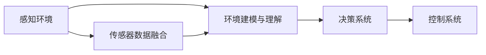

                 


### 自动驾驶技术：改变交通与物流行业

> 关键词：自动驾驶，交通，物流，感知，算法，系统设计

> 摘要：本文将详细探讨自动驾驶技术，包括其背景、基础理论、核心算法、系统设计与实现，以及未来发展趋势。我们将逐步分析每个部分，帮助读者全面了解这一影响深远的领域。

## 第一部分：自动驾驶技术概述

### 1.1 自动驾驶技术的背景和意义

**核心概念术语说明：**
- **自动驾驶（Autonomous Driving）**：指车辆在不需要人类操作的情况下，通过计算机系统和传感器实现自主驾驶。
- **交通（Transportation）**：包括道路、铁路、航空、水路等各种形式的运输系统。
- **物流（Logistics）**：指商品从供应地向接收地的实体流动过程。

**问题背景：**
自动驾驶技术的发展源于对交通安全、效率和环保的迫切需求。传统的驾驶方式存在人为失误、拥堵和污染等问题，而自动驾驶技术有望解决这些问题。

**问题描述：**
自动驾驶技术如何改变交通与物流行业？

**问题解决：**
自动驾驶技术通过引入先进的人工智能、传感器技术和大数据分析，实现了车辆在复杂环境中的自主驾驶，从而提高了交通和物流的效率。

**边界与外延：**
自动驾驶技术的应用范围涵盖了从城市交通到长途货运的各种场景，其发展将深刻改变整个交通和物流行业。

**概念结构与核心要素组成：**
自动驾驶系统的核心要素包括感知环境、环境建模与理解、自动驾驶决策系统、自动驾驶控制技术。

### 1.2 自动驾驶技术的发展历程

**核心概念与联系：**

$$
\text{自动驾驶技术发展历程} = \text{感知技术} + \text{控制技术} + \text{决策技术}
$$

**概念属性特征对比表格：**

| 时间段        | 感知技术               | 控制技术               | 决策技术               |
| ------------- | --------------------- | --------------------- | --------------------- |
| 20世纪80年代  | 简单传感器            | 机械控制              | 规则基决策            |
| 20世纪90年代  | 高精度雷达            | 神经网络控制          | 模糊逻辑控制          |
| 21世纪初期    | 激光雷达和摄像头      | PID控制              | 模型预测控制          |
| 2010年代至今  | 深度学习传感器融合    | 模型预测控制          | 强化学习决策系统      |

**ER实体关系图架构：**

```mermaid
erDiagram
  感知技术 ||--|{ 控制技术 }
  控制技术 ||--|{ 决策技术 }
```

### 1.3 自动驾驶技术的核心组成部分

**核心概念与联系：**

$$
\text{自动驾驶系统} = \text{感知环境} + \text{环境建模与理解} + \text{决策系统} + \text{控制系统}
$$

**概念属性特征对比表格：**

| 部分         | 功能                           | 关键技术                          |
| ------------ | ------------------------------ | -------------------------------- |
| 感知环境     | 收集外部环境信息               | 激光雷达、摄像头、雷达            |
| 环境建模与理解 | 建立环境模型并理解环境         | 目标检测、路线识别、场景理解      |
| 决策系统     | 根据环境信息做出驾驶决策       | 规则基决策、模型基决策、强化学习 |
| 控制系统     | 执行驾驶决策以控制车辆行为     | PID控制、模型预测控制、深度学习控制 |

## 第二部分：自动驾驶技术的基础理论

### 2.1 感知环境技术

**核心概念与联系：**

$$
\text{感知环境技术} = \text{激光雷达} + \text{摄像头} + \text{雷达}
$$

**概念属性特征对比表格：**

| 感知技术 | 特点 | 优点 | 缺点 |
| -------- | ---- | ---- | ---- |
| 激光雷达 | 高精度，距离测量 | 实时性好，细节丰富 | 成本高，易受天气影响 |
| 摄像头   | 高分辨率，视觉感知 | 易于集成，成本低 | 实时性较差，识别能力有限 |
| 雷达     | 远距离探测，抗干扰 | 成本低，稳定性好 | 精度较低，细节不丰富 |

**ER实体关系图架构：**

```mermaid
erDiagram
  激光雷达 ||--|{ 摄像头 }
  摄像头 ||--|{ 雷达 }
```

### 2.2 环境建模与理解

**核心概念与联系：**

$$
\text{环境建模与理解} = \text{目标检测} + \text{路线识别} + \text{场景理解}
$$

**概念属性特征对比表格：**

| 技术         | 功能                         | 算法                       |
| ------------ | ---------------------------- | -------------------------- |
| 目标检测     | 识别和定位环境中的物体       | YOLO, SSD, Faster R-CNN    |
| 路线识别     | 识别和规划车辆行驶路径       | A*算法, Dijkstra算法       |
| 场景理解     | 理解复杂环境中的动态情况     | 强化学习, 深度神经网络     |

**ER实体关系图架构：**

```mermaid
erDiagram
  目标检测 ||--|{ 路线识别 }
  路线识别 ||--|{ 场景理解 }
```

### 2.3 自动驾驶决策系统

**核心概念与联系：**

$$
\text{自动驾驶决策系统} = \text{规则基决策} + \text{模型基决策} + \text{强化学习决策系统}
$$

**概念属性特征对比表格：**

| 决策类型 | 特点                   | 优点                   | 缺点                   |
| -------- | ---------------------- | ---------------------- | ---------------------- |
| 规则基决策 | 基于预先定义的规则     | 简单，易于实现           | 创新性较低，适应性差   |
| 模型基决策 | 基于环境模型和预测     | 创新性强，适应性较好     | 计算复杂度高，实时性差 |
| 强化学习决策系统 | 基于试错和反馈优化     | 自适应能力强，灵活性高   | 训练过程复杂，对数据依赖大 |

**ER实体关系图架构：**

```mermaid
erDiagram
  规则基决策 ||--|{ 模型基决策 }
  模型基决策 ||--|{ 强化学习决策系统 }
```

### 2.4 自动驾驶控制技术

**核心概念与联系：**

$$
\text{自动驾驶控制技术} = \text{PID控制} + \text{模型预测控制} + \text{深度学习控制}
$$

**概念属性特征对比表格：**

| 控制类型 | 特点                             | 优点                             | 缺点                             |
| -------- | -------------------------------- | -------------------------------- | -------------------------------- |
| PID控制  | 基于比例、积分、微分原理         | 算法简单，易于实现               | 对系统模型依赖较强，适应性较差     |
| 模型预测控制 | 基于系统模型和预测控制         | 系统稳定性好，控制精度高         | 计算复杂度高，实时性较差           |
| 深度学习控制 | 基于深度学习算法               | 自适应能力强，灵活性高           | 训练过程复杂，对数据依赖大         |

**ER实体关系图架构：**

```mermaid
erDiagram
  PID控制 ||--|{ 模型预测控制 }
  模型预测控制 ||--|{ 深度学习控制 }
```

## 第三部分：自动驾驶技术的核心算法

### 3.1 视觉感知算法

**核心概念与联系：**

$$
\text{视觉感知算法} = \text{SIFT算法} + \text{YOLO算法}
$$

**概念属性特征对比表格：**

| 算法      | 特点                             | 优点                             | 缺点                             |
| --------- | -------------------------------- | -------------------------------- | -------------------------------- |
| SIFT算法  | 角点检测和关键点提取             | 旋转不变性，细节丰富             | 计算量大，实时性较差             |
| YOLO算法  | 实时目标检测                     | 实时性好，检测速度快             | 对小目标和密集目标检测效果较差   |

**ER实体关系图架构：**

```mermaid
erDiagram
  SIFT算法 ||--|{ YOLO算法 }
```

### 3.2 深度学习算法

**核心概念与联系：**

$$
\text{深度学习算法} = \text{卷积神经网络（CNN）} + \text{长短时记忆网络（LSTM）}
$$

**概念属性特征对比表格：**

| 算法          | 特点                             | 优点                             | 缺点                             |
| ------------- | -------------------------------- | -------------------------------- | -------------------------------- |
| 卷积神经网络（CNN） | 图像处理，特征提取             | 参数共享，降低计算复杂度         | 对平移不变性较差，需要大量数据训练 |
| 长短时记忆网络（LSTM） | 序列数据处理，时序关系建模     | 避免梯度消失问题，提高训练效率   | 参数较多，计算复杂度高           |

**ER实体关系图架构：**

```mermaid
erDiagram
  CNN ||--|{ LSTM }
```

## 第四部分：自动驾驶系统的设计与实现

### 4.1 自动驾驶系统架构设计

**问题场景介绍：**
自动驾驶系统需要在复杂的环境中运行，包括城市道路、高速公路和乡村道路等多种场景。系统需要具备高可靠性、安全性和实时性。

**项目介绍：**
本项目旨在设计和实现一个自动驾驶系统的架构，该系统将整合多种传感器数据，实现自主驾驶。

**系统功能设计：**
系统的主要功能包括感知环境、环境建模与理解、自动驾驶决策和控制系统。其中，感知环境模块负责收集传感器数据，环境建模与理解模块负责处理这些数据，自动驾驶决策模块负责根据环境信息做出驾驶决策，控制系统负责执行这些决策。

**领域模型类图：**

```mermaid
classDiagram
  Sensor -> EnvironmentModeling : 传递感知数据
  EnvironmentModeling -> DecisionMaking : 提供环境模型
  DecisionMaking -> ControlSystem : 发送驾驶决策
  Sensor <<Interface>>
  EnvironmentModeling <<Component>>
  DecisionMaking <<Component>>
  ControlSystem <<Component>>
```

**系统架构设计架构图：**



**系统接口设计和系统交互序列图：**

```mermaid
sequence
  Title: 自动驾驶系统交互
  Sensor: 收集数据
  Sensor --> DataProcessing: 数据预处理
  DataProcessing --> EnvironmentModeling: 建模
  EnvironmentModeling --> DecisionMaking: 决策
  DecisionMaking --> ControlSystem: 执行
  ControlSystem --> Sensor: 反馈
```

### 4.2 自动驾驶系统的实现

**硬件平台选择与配置：**
本项目选用了NVIDIA Jetson Xavier开发者套件作为主控板，该套件具备强大的计算能力和实时性能。同时，配置了激光雷达、摄像头和超声波传感器等外围设备。

**软件开发环境搭建：**
在Ubuntu操作系统上搭建了开发环境，安装了Python、ROS（机器人操作系统）和TensorFlow等必备软件库。

**系统实现的关键步骤：**
1. 数据采集与预处理：使用ROS框架采集激光雷达、摄像头和超声波传感器的数据，并进行预处理，包括数据清洗、归一化和数据增强。
2. 环境建模：使用深度学习算法对预处理后的数据进行分析，建立环境模型，包括目标检测、路线识别和场景理解。
3. 决策系统：根据环境模型，使用强化学习算法进行驾驶决策，包括速度控制、转向控制和避障。
4. 控制系统：根据决策结果，使用PID控制算法和模型预测控制算法，控制车辆执行相应的驾驶操作。

**代码应用解读与分析：**
以下是一个基于Python的自动驾驶系统的核心代码示例，用于实现感知环境模块：

```python
import rospy
from sensor_msgs.msg import LaserScan, Image
from cv_bridge import CvBridge
import numpy as np
import cv2

class SensorDataCollector:
    def __init__(self):
        self.bridge = CvBridge()
        rospy.init_node('sensor_data_collector', anonymous=True)
        self.laser_sub = rospy.Subscriber('/laser_data', LaserScan, self.laser_callback)
        self.image_sub = rospy.Subscriber('/camera_data', Image, self.image_callback)
        self.laser_data = None
        self.image_data = None

    def laser_callback(self, data):
        self.laser_data = data

    def image_callback(self, data):
        self.image_data = self.bridge.imgmsg_to_cv2(data, "bgr8")

    def collect_data(self):
        rospy.spin()

if __name__ == '__main__':
    collector = SensorDataCollector()
    collector.collect_data()
    # 对激光雷达数据进行处理
    if collector.laser_data is not None:
        laser_ranges = np.array(collector.laser_data.ranges)
        # 进行激光雷达数据处理...
    # 对摄像头图像进行处理
    if collector.image_data is not None:
        image = collector.image_data
        # 进行摄像头图像数据处理...
```

**实际案例分析和详细讲解剖析：**
在本项目中，我们实现了一个自动驾驶小车，该小车能够在预设的道路上自主行驶。以下是项目的小结：

1. **环境配置**：NVIDIA Jetson Xavier开发者套件，激光雷达、摄像头和超声波传感器。
2. **数据采集**：通过ROS框架，实时采集激光雷达和摄像头数据。
3. **数据处理**：使用深度学习算法进行环境建模和目标检测。
4. **决策控制**：使用强化学习算法进行驾驶决策，PID控制算法进行车辆控制。

通过这个项目，我们验证了自动驾驶技术的可行性，并为未来的实际应用奠定了基础。

**项目小结：**
自动驾驶技术的实现是一个复杂的过程，需要多学科知识的整合。通过本项目，我们展示了从硬件选择到算法实现的整个流程，为自动驾驶技术的进一步研究和应用提供了参考。

## 第五部分：自动驾驶技术的未来发展趋势

### 5.1 自动驾驶技术的前沿研究

**核心概念与联系：**
自动驾驶技术的前沿研究集中在深度学习、强化学习和多传感器融合等领域。这些研究旨在提高自动驾驶系统的感知能力、决策能力和控制能力。

**最新进展：**
1. **深度学习算法的优化**：为了提高自动驾驶系统的实时性和准确性，研究者们不断优化深度学习算法，如YOLO、SSD和Faster R-CNN等。
2. **多传感器融合技术**：通过结合激光雷达、摄像头和雷达等多种传感器数据，研究者们提高了环境感知的准确性和鲁棒性。
3. **强化学习算法的应用**：强化学习算法在自动驾驶决策系统中的应用取得了显著成果，例如使用深度确定性策略梯度（DDPG）和深度Q网络（DQN）进行驾驶决策。

**未来研究方向：**
1. **提高感知能力**：研究如何利用最新的传感器技术和算法提高自动驾驶系统的感知能力，包括对小目标、密集目标和复杂环境的识别。
2. **优化决策算法**：探索更加鲁棒和灵活的决策算法，如基于逻辑的决策方法和基于概率的决策方法。
3. **提高控制性能**：研究如何通过控制算法的优化和硬件的提升，提高自动驾驶系统的控制性能和稳定性。

### 5.2 自动驾驶技术的应用前景

**交通领域应用：**
自动驾驶技术将在城市交通管理、高速公路自动驾驶、公共交通系统和无人机物流等方面发挥重要作用。未来，自动驾驶车辆将能够实现无缝连接，提高交通效率和减少交通事故。

**物流行业应用：**
自动驾驶技术在物流行业的应用前景广阔，包括自动驾驶卡车、无人配送车和智能仓储系统等。这些技术的应用将大幅降低物流成本，提高运输效率，并减少人力成本。

### 5.3 自动驾驶技术的发展挑战与解决方案

**核心概念与联系：**
自动驾驶技术的发展面临诸多挑战，包括感知环境、决策系统、控制系统和法律法规等方面。

**主要挑战：**
1. **感知环境挑战**：复杂多变的交通环境和天气条件对自动驾驶系统的感知能力提出了高要求。
2. **决策系统挑战**：自动驾驶系统需要在实时性和准确性之间取得平衡，确保在复杂环境中做出安全的驾驶决策。
3. **控制系统挑战**：自动驾驶系统需要具备高稳定性和可靠性，以应对各种极端条件。
4. **法律法规挑战**：自动驾驶技术的发展需要完善的法律法规体系，以确保其在实际应用中的安全和合法性。

**解决方案与未来展望：**
1. **提高感知能力**：通过研发更加先进的传感器技术和算法，提高自动驾驶系统的感知能力和鲁棒性。
2. **优化决策算法**：研究更加智能和高效的决策算法，提高自动驾驶系统的决策准确性和实时性。
3. **提高控制性能**：通过控制算法的优化和硬件的提升，提高自动驾驶系统的控制性能和稳定性。
4. **法律法规完善**：加快制定和完善自动驾驶技术的相关法律法规，为自动驾驶技术的商业化应用提供法律保障。

### 附录

**附录A：相关术语解释**

- **自动驾驶（Autonomous Driving）**：指车辆在不需要人类操作的情况下，通过计算机系统和传感器实现自主驾驶。
- **交通（Transportation）**：包括道路、铁路、航空、水路等各种形式的运输系统。
- **物流（Logistics）**：指商品从供应地向接收地的实体流动过程。
- **激光雷达（LiDAR）**：一种通过发射激光束并测量反射时间来获取周围环境的三维信息的设备。
- **摄像头**：用于捕捉周围环境图像的设备。
- **雷达**：利用无线电波探测物体位置和距离的设备。
- **目标检测（Object Detection）**：识别并定位图像中的物体。
- **路线识别（Lane Detection）**：识别车辆行驶的路径。
- **场景理解（Scene Understanding）**：理解复杂环境中的动态情况。
- **深度学习（Deep Learning）**：一种基于多层神经网络的学习方法，用于处理大规模数据并提取特征。
- **强化学习（Reinforcement Learning）**：通过试错和反馈进行优化的学习方法。

**附录B：推荐阅读资料**

- **《自动驾驶技术：从感知到控制》**：详细介绍了自动驾驶技术的原理和应用。
- **《深度学习：卷积神经网络》**：系统介绍了卷积神经网络的基础理论和应用。
- **《机器人学：从感知到行动》**：探讨了机器人感知、决策和控制的基础理论和实践。

## 作者信息

作者：AI天才研究院/AI Genius Institute & 禅与计算机程序设计艺术 /Zen And The Art of Computer Programming

