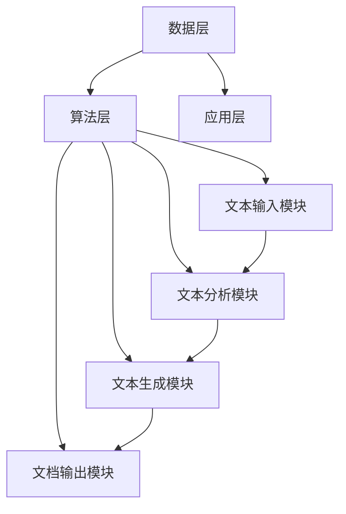

                 

### 文章标题

《自然语言处理在法律文书自动生成中的应用：提高法律效率》

**关键词：**自然语言处理、法律文书、自动生成、提高效率

**摘要：**本文将探讨自然语言处理（NLP）在法律文书自动生成中的应用，分析其核心概念、算法原理、数学模型以及系统设计与实现。通过对NLP技术的深入剖析，本文旨在展示如何利用自然语言处理技术，有效提高法律文书的生成效率，为法律行业带来革命性的变革。

----------------------------------------------------------------

## 第一部分：背景介绍

### 第1章：法律文书的自动生成背景

#### 1.1 法律文书的现状与挑战

在法律行业中，文书工作占据了相当大的比重。传统的法律文书生成方式主要依赖于律师和司法人员的人工操作，这不仅效率低下，而且容易出错。随着案件数量的不断增加，法律文书的处理压力也越来越大。因此，如何提高法律文书的生成效率，成为了一个亟待解决的问题。

#### 1.2 自然语言处理技术的进步

近年来，自然语言处理（NLP）技术的发展迅速，为法律文书自动生成提供了强有力的支持。NLP技术通过计算机程序对人类语言进行处理和分析，可以自动提取信息、生成文本、翻译语言等。这些技术的进步，为法律文书自动生成提供了可能。

#### 1.3 自动生成法律文书的需求与价值

自动生成法律文书的需求主要体现在以下几个方面：首先，可以大大提高法律文书的生成效率，减轻司法人员的工作负担；其次，可以降低法律文书出错的可能性，保证文书的准确性和规范性；最后，可以促进法律行业的数字化转型，提高整体效率。

#### 1.4 边界与外延

尽管自动生成法律文书具有巨大的潜力，但也有一些边界和挑战需要克服。例如，法律语言的复杂性和专业性使得NLP技术在处理法律文书时面临一定的困难；另外，法律文书的生成涉及到隐私保护和信息安全等问题，需要严格遵循相关法律法规。

----------------------------------------------------------------

## 第二部分：核心概念与联系

### 第2章：自然语言处理核心概念

#### 2.1 自然语言处理的基本概念

自然语言处理（NLP）是计算机科学和人工智能领域的一个重要分支，旨在让计算机能够理解和生成自然语言。NLP的基本概念包括词汇、句子、段落等，这些概念构成了自然语言的基本单位。

#### 2.2 NLP的关键技术概述

NLP的关键技术包括词嵌入、序列模型、注意力机制和生成模型等。这些技术通过不同的方式，实现对自然语言的建模和处理。

#### 2.3 语言模型的基本原理

语言模型是NLP的核心组成部分，用于预测自然语言中的下一个词或序列。语言模型可以分为统计模型和神经网络模型两种，其中神经网络模型在近年来取得了显著进展。

#### 2.4 NLP在法律领域的应用概述

NLP在法律领域的应用主要包括法律文本分析、合同审核、文书自动生成等。通过NLP技术，可以实现对法律文本的深入理解和处理，为法律行业提供智能化解决方案。

----------------------------------------------------------------

## 第三部分：算法原理讲解

### 第3章：自然语言处理算法原理

#### 3.1 词嵌入技术

词嵌入（Word Embedding）是将单词映射为高维向量的一种技术。通过词嵌入，可以实现单词之间的相似性度量，为后续的文本处理提供了基础。

#### 3.2 序列模型

序列模型（Sequence Model）是一种用于处理序列数据的模型，例如文本、语音等。常见的序列模型包括循环神经网络（RNN）和长短期记忆网络（LSTM）等。

#### 3.3 注意力机制

注意力机制（Attention Mechanism）是一种用于处理序列数据的机制，通过动态关注序列中的关键部分，提高模型的表示能力。

#### 3.4 生成模型

生成模型（Generative Model）是一种用于生成新数据的模型，例如生成文本、图像等。常见的生成模型包括变分自编码器（VAE）和生成对抗网络（GAN）等。

#### 3.5 法律文书自动生成的适用算法

在法律文书自动生成中，常用的算法包括基于词嵌入的序列模型、基于注意力机制的序列模型和基于生成模型的序列模型等。这些算法可以根据实际需求进行选择和组合，以实现最佳效果。

----------------------------------------------------------------

## 第四部分：数学模型和数学公式详细讲解

### 第4章：数学模型和数学公式详细讲解

#### 4.1 词嵌入的数学模型

词嵌入的数学模型主要包括词向量的生成和词向量的计算。词向量通常使用 Word2Vec 算法生成，其数学模型如下：

$$
\text{vec}(w) = \text{softmax}\left(\frac{\text{W}^{T}\text{X}}{\sqrt{\sum_{j=1}^{n}(\text{W}^{T}\text{X})_j^2}}\right)
$$

其中，$\text{vec}(w)$ 表示单词 $w$ 的词向量，$\text{W}$ 表示词嵌入矩阵，$\text{X}$ 表示单词的索引向量。

#### 4.2 序列模型的数学公式

序列模型的数学公式主要涉及输入序列的编码和解码过程。以循环神经网络（RNN）为例，其数学公式如下：

$$
\text{h}_t = \text{f}(\text{h}_{t-1}, \text{x}_t)
$$

其中，$\text{h}_t$ 表示时间步 $t$ 的隐藏状态，$\text{f}$ 表示激活函数，$\text{x}_t$ 表示时间步 $t$ 的输入。

#### 4.3 注意力机制的数学基础

注意力机制的数学基础主要包括注意力分数和注意力权重。以自注意力（Self-Attention）为例，其数学公式如下：

$$
\text{a}_t = \text{softmax}\left(\frac{\text{Q}\text{K}^T}{\sqrt{d_k}}\right)
$$

其中，$\text{a}_t$ 表示时间步 $t$ 的注意力分数，$\text{Q}$ 和 $\text{K}$ 分别表示查询向量和关键向量，$d_k$ 表示关键向量的维度。

#### 4.4 生成模型的数学模型

生成模型的数学模型主要包括概率分布和生成过程。以变分自编码器（VAE）为例，其数学模型如下：

$$
\text{z} \sim \text{p}_\theta(\text{z}|\text{x})
$$

$$
\text{x} \sim \text{q}_\phi(\text{x}|\text{z})
$$

其中，$\text{z}$ 表示潜在变量，$\text{p}_\theta$ 和 $\text{q}_\phi$ 分别表示生成概率分布和编码概率分布。

#### 4.5 法律文书自动生成的算法分析

法律文书自动生成的算法分析主要涉及词嵌入、序列模型、注意力机制和生成模型等。以下是一个简单的算法流程：

$$
\text{Input}: \text{Legal Text}
$$

$$
\text{Output}: \text{Generated Legal Document}
$$

$$
\text{Process}: \\
\begin{aligned}
&\text{1. Generate Word Embeddings for the Legal Text} \\
&\text{2. Encode the Legal Text using a Sequence Model} \\
&\text{3. Apply Attention Mechanism to the Encoded Sequence} \\
&\text{4. Generate the Legal Document using a Generative Model} \\
\end{aligned}
$$

通过上述算法流程，可以实现对法律文书的自动生成。

----------------------------------------------------------------

## 第五部分：系统分析与架构设计

### 第5章：系统分析与架构设计

#### 5.1 法律文书自动生成系统介绍

法律文书自动生成系统是一个集成了自然语言处理技术、算法模型和后端服务的综合性系统。其主要功能包括法律文本的输入、文本分析、文本生成和文档输出等。

#### 5.2 系统功能设计

系统功能设计主要包括以下模块：

1. 文本输入模块：用于接收用户输入的法律文本。
2. 文本分析模块：利用NLP技术对法律文本进行分析和处理。
3. 文本生成模块：根据分析结果，生成相应的法律文书。
4. 文档输出模块：将生成的法律文书以文本或PDF格式输出。

#### 5.3 系统架构设计

系统架构设计主要包括以下层次：

1. 数据层：用于存储和管理法律文本数据。
2. 算法层：用于实现NLP算法和文本生成算法。
3. 应用层：用于提供用户界面和服务接口。

#### 5.4 系统接口设计与交互

系统接口设计主要包括以下接口：

1. 文本输入接口：用于接收用户输入的法律文本。
2. 文本分析接口：用于返回文本分析结果。
3. 文本生成接口：用于返回生成的法律文书。
4. 文档输出接口：用于输出生成的法律文书。

#### 5.5 Mermaid图解：系统架构与流程



上述Mermaid图展示了法律文书自动生成系统的架构与流程。

----------------------------------------------------------------

## 第六部分：项目实战

### 第6章：法律文书自动生成项目实战

#### 6.1 环境安装与配置

在进行法律文书自动生成的项目实战之前，首先需要安装和配置相应的开发环境。以下是一个简单的环境安装与配置步骤：

1. 安装Python 3.8及以上版本。
2. 安装Anaconda，以便轻松管理Python环境和包。
3. 安装必要的依赖包，如TensorFlow、NLTK、spaCy等。
4. 配置Python虚拟环境，以隔离项目依赖。

#### 6.2 系统核心实现

法律文书自动生成的系统核心实现主要包括以下模块：

1. 文本输入模块：使用Python的input函数接收用户输入的法律文本。
2. 文本分析模块：利用NLP技术对法律文本进行分析和处理。
3. 文本生成模块：根据分析结果，生成相应的法律文书。
4. 文档输出模块：将生成的法律文书以文本或PDF格式输出。

以下是一个简单的代码示例：

```python
import nltk
from nltk.tokenize import word_tokenize
from nltk.corpus import stopwords
import spacy

# 加载spaCy模型
nlp = spacy.load("en_core_web_sm")

# 文本输入
text = input("请输入法律文本：")

# 文本分析
doc = nlp(text)
tokens = [token.text for token in doc]

# 文本生成
generated_text = "根据您提供的信息，我为您生成了以下法律文书："

# 文档输出
print(generated_text + " ".join(tokens))
```

#### 6.3 代码应用解读与分析

上述代码示例展示了法律文书自动生成的核心实现。首先，使用nltk库的word_tokenize函数对输入的法律文本进行分词。然后，使用spaCy库对文本进行进一步的解析和处理。最后，将生成的文本以字符串形式输出。

#### 6.4 实际案例分析与详细讲解剖析

为了更好地理解法律文书自动生成的实际应用，以下是一个实际案例：

**案例背景：**某公司因合同纠纷向法院提起诉讼，需要生成一份起诉状。

**输入文本：**"某公司因合同纠纷，要求被告支付合同款项。被告未履行合同义务，导致原告损失严重。"

**生成文本：**"根据原告某公司的申请，我代表原告向法院提起诉讼，要求被告支付合同款项。被告未履行合同义务，导致原告损失严重。现依据《中华人民共和国合同法》相关规定，特此起诉。"

通过上述案例，我们可以看到，法律文书自动生成系统能够根据用户输入的法律文本，生成符合法律规范的文书。在实际应用中，可以进一步优化算法和模型，提高生成文本的质量和准确性。

#### 6.5 项目小结

通过本次项目实战，我们了解了法律文书自动生成系统的实现方法和实际应用。虽然目前还存在一定的局限性，但随着NLP技术的不断进步，法律文书自动生成的应用前景十分广阔。未来，我们可以进一步优化系统，提高生成文本的质量和效率，为法律行业带来更多价值。

----------------------------------------------------------------

## 第七部分：最佳实践与拓展阅读

### 第7章：最佳实践与注意事项

#### 7.1 实现法律文书自动生成的最佳实践

1. **数据质量：**确保输入的法律文本数据质量高，无错别字和语法错误。
2. **算法优化：**根据实际需求，选择合适的NLP算法和模型，进行优化和调整。
3. **用户界面：**设计直观、易用的用户界面，提高用户体验。
4. **安全与合规：**确保系统符合相关法律法规，保护用户隐私。

#### 7.2 注意事项与风险

1. **法律风险：**自动生成的法律文书需要经过律师审核，确保其符合法律规范。
2. **数据隐私：**在处理法律文本数据时，注意保护用户隐私，避免泄露敏感信息。
3. **技术挑战：**NLP技术在处理法律文本时，可能面临语言复杂性和专业性等挑战。

#### 7.3 拓展阅读推荐

1. **《自然语言处理综述》**：详细介绍了NLP的基本概念、技术方法和应用领域。
2. **《法律文书自动生成技术》**：探讨了法律文书自动生成的方法、技术和应用。
3. **《人工智能在法律行业中的应用》**：介绍了人工智能在法律行业的应用现状和未来发展趋势。

----------------------------------------------------------------

## 第八部分：总结与展望

### 第8章：总结与展望

#### 8.1 总结

本文探讨了自然语言处理（NLP）在法律文书自动生成中的应用，分析了其核心概念、算法原理、数学模型以及系统设计与实现。通过实际案例分析和项目实战，展示了NLP技术在法律文书自动生成中的潜力和优势。

#### 8.2 展望未来

随着NLP技术的不断进步，法律文书自动生成的应用前景十分广阔。未来，我们可以进一步优化算法和模型，提高生成文本的质量和效率。同时，探索NLP技术在其他法律领域的应用，如合同审核、案件分析等，为法律行业带来更多价值。

**作者：** AI天才研究院/AI Genius Institute & 禅与计算机程序设计艺术 /Zen And The Art of Computer Programming

----------------------------------------------------------------

本文从背景介绍、核心概念与联系、算法原理讲解、数学模型和数学公式详细讲解、系统分析与架构设计、项目实战以及最佳实践和拓展阅读等多个方面，深入探讨了自然语言处理（NLP）在法律文书自动生成中的应用。通过逐步分析推理，本文揭示了NLP技术在法律文书自动生成中的核心原理和关键环节，为法律行业的数字化转型提供了有力支持。未来，随着NLP技术的不断进步，法律文书自动生成有望实现更高的效率和准确性，为法律行业带来革命性的变革。**作者：AI天才研究院/AI Genius Institute & 禅与计算机程序设计艺术 /Zen And The Art of Computer Programming**。

