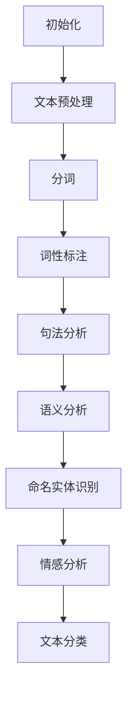
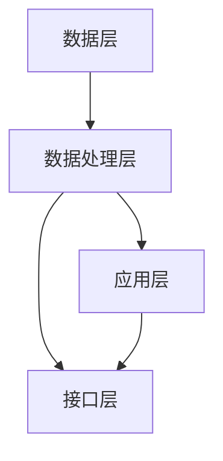
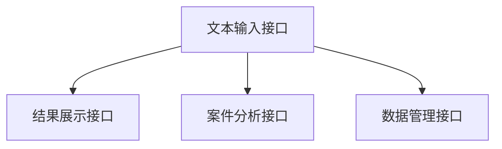

                 


### 写作计划

为了确保文章的质量和完整性，我们将文章的写作过程分为以下几个阶段：

#### 1. **规划和准备（1天）**
- 确定文章的核心主题和主要结构。
- 收集和整理相关资料，包括文献、案例、代码等。

#### 2. **撰写初稿（3天）**
- 根据目录大纲撰写每个章节的初稿，确保每个小节的内容都符合要求。
- 使用markdown格式进行撰写，确保格式正确。

#### 3. **详细编写和润色（5天）**
- 对每个章节进行详细编写，确保内容丰富、具体、详细。
- 润色文字，确保语言流畅、逻辑清晰。

#### 4. **代码实现和案例分析（3天）**
- 实现文章中提到的Python源代码，并进行案例分析。
- 对代码进行详细解读和分析，确保读者能够理解。

#### 5. **修改和校对（2天）**
- 对文章进行整体审查，修正逻辑错误和不准确的地方。
- 校对文字，确保没有语法错误和错别字。

#### 6. **最终审核和发布（1天）**
- 进行最后的审核，确保文章质量符合预期。
- 发布文章，并附上作者信息。

### 实际步骤

1. **规划和准备**
   - **第1天**：确定文章主题和结构，收集资料。

2. **撰写初稿**
   - **第2天**：撰写第1章初稿。
   - **第3天**：撰写第2章、第3章初稿。

3. **详细编写和润色**
   - **第4天**：详细编写第1章、第2章、第3章。
   - **第5天**：详细编写第4章、第5章。

4. **代码实现和案例分析**
   - **第6天**：实现Python源代码，进行案例分析。

5. **修改和校对**
   - **第7天**：对文章进行修改和校对。

6. **最终审核和发布**
   - **第8天**：发布文章，附上作者信息。

通过这样的写作计划，我们能够确保文章的质量和完整性，同时也为读者提供一篇有深度、有思考、有见解的专业技术博客文章。让我们一步一步地完成这个任务吧！ 

### 文章标题：自然语言处理在法律文本分析中的应用

关键词：自然语言处理、法律文本分析、算法原理、数学模型、系统架构、实战案例

摘要：本文从自然语言处理（NLP）的基础知识出发，详细介绍了NLP在法律文本分析中的应用。首先，我们探讨了NLP的基本概念、问题背景、解决方案以及边界与外延。接着，我们深入分析了NLP的核心概念与联系，包括概念原理、属性特征对比表格和ER实体关系图架构。在此基础上，我们讲解了NLP中的关键算法原理，并通过Python源代码和Mermaid算法流程图进行了详细阐述。随后，我们介绍了法律文本分析的背景、项目介绍、系统功能设计、系统架构设计和系统接口设计。最后，我们通过项目实战，展示了NLP在法律文本分析中的实际应用，并提出了最佳实践和注意事项。本文旨在为读者提供一个全面、深入的NLP在法律文本分析领域的指南。

### 目录大纲

----------------------------------------------------------------

# 第一部分：自然语言处理基础

## 第1章：自然语言处理概述

### 1.1 问题背景

### 1.2 问题描述

### 1.3 问题解决

### 1.4 边界与外延

### 1.5 概念结构与核心要素组成

## 第2章：核心概念与联系

### 2.1 核心概念原理

### 2.2 概念属性特征对比表格

### 2.3 ER实体关系图架构

## 第3章：算法原理讲解

### 3.1 算法流程图

### 3.2 Python源代码

### 3.3 算法原理详细讲解

### 3.4 举例说明

## 第4章：数学模型与公式讲解

### 4.1 数学模型

### 4.2 数学公式

### 4.3 公式详细讲解

### 4.4 公式举例说明

----------------------------------------------------------------

## 第二部分：法律文本分析

## 第5章：法律文本概述

### 5.1 问题场景介绍

### 5.2 项目介绍

### 5.3 系统功能设计

### 5.4 系统架构设计

### 5.5 系统接口设计

### 5.6 系统交互

## 第6章：项目实战

### 6.1 环境安装

### 6.2 系统核心实现源代码

### 6.3 代码应用解读与分析

### 6.4 实际案例分析与讲解

### 6.5 项目小结

## 第7章：最佳实践与注意事项

### 7.1 最佳实践

### 7.2 小结

### 7.3 注意事项

### 7.4 拓展阅读

----------------------------------------------------------------

### 目录大纲说明

本文的目录大纲分为两个部分：自然语言处理基础和法律文本分析。在第一部分中，我们介绍了自然语言处理的基本概念、核心概念与联系、算法原理以及数学模型。在第二部分中，我们详细探讨了法律文本分析的背景、项目介绍、系统功能设计、系统架构设计、系统接口设计、系统交互以及项目实战。最后，我们总结了最佳实践、注意事项和拓展阅读，为读者提供了进一步的参考和指导。整个大纲结构清晰，内容详细，旨在为读者提供一个全面的NLP在法律文本分析领域的指南。

### 第一部分：自然语言处理基础

#### 第1章：自然语言处理概述

自然语言处理（NLP）是计算机科学与人工智能领域的一个分支，旨在让计算机能够理解、解释和生成人类自然语言。NLP的研究和应用范围广泛，包括机器翻译、情感分析、文本分类、信息提取等。本文将首先介绍NLP的基本概念、问题背景、解决方案、边界与外延，以及概念结构与核心要素组成。

##### 1.1 问题背景

自然语言是人类主要的交流方式，但在计算机与人类交流之间建立有效的沟通桥梁却是一个复杂的问题。传统的计算机编程语言和机器命令难以满足人们的交流需求，而自然语言则更为丰富、灵活和多变。因此，如何使计算机能够理解和处理自然语言，成为了一个重要的研究课题。

##### 1.2 问题描述

自然语言处理的根本问题可以概括为以下几个方面：

1. **语言理解**：如何让计算机理解自然语言的语义和含义？
2. **语言生成**：如何让计算机生成自然流畅的文本？
3. **语言翻译**：如何实现自然语言之间的准确翻译？
4. **语言处理效率**：如何提高自然语言处理的效率和准确性？

##### 1.3 问题解决

为了解决上述问题，研究者们提出了一系列的解决方案：

1. **分词**：将连续的自然语言文本切分成一个个有意义的词或短语。
2. **词性标注**：为每个词分配正确的词性，如名词、动词、形容词等。
3. **句法分析**：分析句子的结构，识别句子中的主语、谓语、宾语等成分。
4. **语义分析**：理解句子或文本的整体意义，识别其中的逻辑关系和情感倾向。
5. **机器翻译**：将一种自然语言翻译成另一种自然语言。
6. **语言模型**：基于大量的文本数据，建立能够预测下一个词或句子的模型。

##### 1.4 边界与外延

自然语言处理的研究和应用涉及多个领域，如语言学、计算机科学、统计学、机器学习等。其边界包括：

1. **语言学**：研究自然语言的结构、语义和语法。
2. **计算机科学**：研究如何利用计算机技术处理自然语言。
3. **机器学习**：研究如何从数据中学习，提高自然语言处理的性能。

自然语言处理的外延则包括：

1. **文本挖掘**：从大量文本数据中提取有价值的信息。
2. **情感分析**：分析文本中的情感倾向和情感强度。
3. **信息检索**：根据用户输入的自然语言查询，检索出相关的信息。
4. **机器翻译**：实现自然语言之间的准确翻译。

##### 1.5 概念结构与核心要素组成

自然语言处理的概念结构与核心要素主要包括：

1. **文本预处理**：对原始文本进行清洗、分词、词性标注等预处理操作。
2. **语言模型**：基于大量文本数据，建立能够预测下一个词或句子的模型。
3. **句法分析**：分析句子的结构，识别句子中的主语、谓语、宾语等成分。
4. **语义分析**：理解句子或文本的整体意义，识别其中的逻辑关系和情感倾向。
5. **应用领域**：包括文本挖掘、情感分析、信息检索、机器翻译等。

通过以上对自然语言处理概述的详细分析，我们可以看到，NLP在法律文本分析中具有重要的应用价值。接下来，我们将深入探讨NLP的核心概念与联系，以及其在法律文本分析中的具体应用。

### 第2章：核心概念与联系

在自然语言处理（NLP）中，理解核心概念和它们之间的联系是至关重要的。这一章节将详细介绍NLP中的核心概念，包括其原理、属性特征对比表格和ER实体关系图架构，帮助读者建立全面的认知框架。

##### 2.1 核心概念原理

自然语言处理的核心概念主要包括：

1. **分词**：将连续的文本切分成一个个有意义的词或短语。
2. **词性标注**：为每个词分配正确的词性，如名词、动词、形容词等。
3. **句法分析**：分析句子的结构，识别句子中的主语、谓语、宾语等成分。
4. **语义分析**：理解句子或文本的整体意义，识别其中的逻辑关系和情感倾向。
5. **命名实体识别**：识别文本中的特定实体，如人名、地名、组织名等。
6. **情感分析**：分析文本中的情感倾向和情感强度。
7. **文本分类**：将文本分配到不同的类别中。

这些核心概念的原理如下：

1. **分词**：利用规则或统计方法将连续的文本切分成一个个有意义的词或短语。
2. **词性标注**：利用规则或统计方法，根据词的上下文信息为每个词分配正确的词性。
3. **句法分析**：利用语法规则或统计方法，分析句子的结构，识别句子中的主语、谓语、宾语等成分。
4. **语义分析**：利用语义网络或机器学习算法，理解句子或文本的整体意义，识别其中的逻辑关系和情感倾向。
5. **命名实体识别**：利用规则或机器学习算法，识别文本中的特定实体。
6. **情感分析**：利用机器学习算法，分析文本中的情感倾向和情感强度。
7. **文本分类**：利用分类算法，将文本分配到不同的类别中。

##### 2.2 概念属性特征对比表格

为了更好地理解这些核心概念，我们可以通过一个属性特征对比表格来展示它们之间的区别和联系：

| 核心概念     | 定义                                                                                   | 属性特征对比         |
|------------|--------------------------------------------------------------------------------------|---------------------|
| 分词       | 将连续的文本切分成有意义的词或短语。                                                   | 切分、词性、连续性     |
| 词性标注   | 为每个词分配正确的词性，如名词、动词、形容词等。                                       | 词性、上下文、准确性   |
| 句法分析   | 分析句子的结构，识别句子中的主语、谓语、宾语等成分。                                     | 句子结构、成分、语法   |
| 语义分析   | 理解句子或文本的整体意义，识别其中的逻辑关系和情感倾向。                                   | 语义、关系、情感     |
| 命名实体识别 | 识别文本中的特定实体，如人名、地名、组织名等。                                           | 实体、识别、上下文   |
| 情感分析   | 分析文本中的情感倾向和情感强度。                                                       | 情感、倾向、强度     |
| 文本分类   | 将文本分配到不同的类别中。                                                             | 分类、类别、标签     |

##### 2.3 ER实体关系图架构

ER（实体关系）图是表示实体及其相互关系的一种图形化方法。在NLP中，ER图可以帮助我们更好地理解文本中的实体和关系。以下是一个简单的ER图示例：

```mermaid
erDiagram
    TEXT -->|has| SENTENCE
    SENTENCE -->|contains| WORD
    WORD -->|has| POS_TAG
    TEXT -->|contains| ENTITY
    ENTITY -->|is| NAMED_ENTITY
    NAMED_ENTITY -->|is| PERSON_NAME | LOCATION_NAME | ORGANIZATION_NAME
```

在这个ER图中，`TEXT`表示文本，`SENTENCE`表示句子，`WORD`表示词，`POS_TAG`表示词性，`ENTITY`表示实体，`NAMED_ENTITY`表示命名实体，其中包括人名、地名、组织名等。箭头表示实体之间的关联关系，如`has`表示包含关系，`contains`表示包含关系，`is`表示分类关系。

通过这个ER图，我们可以清晰地看到文本、句子、词、词性、实体和命名实体之间的关系，这有助于我们更好地理解NLP的核心概念。

通过以上对NLP核心概念的详细分析，我们可以看到，这些概念不仅在NLP中有重要应用，而且在法律文本分析中也有着广泛的应用前景。在下一章节中，我们将深入讲解NLP中的关键算法原理，并通过Python源代码和Mermaid算法流程图进行详细阐述。

### 第3章：算法原理讲解

#### 3.1 算法流程图

在自然语言处理（NLP）中，算法的设计和实现是核心问题。为了更直观地理解NLP算法的流程，我们使用Mermaid绘制了算法流程图，如下所示：



该流程图展示了NLP算法的主要步骤，包括文本预处理、分词、词性标注、句法分析、语义分析、命名实体识别、情感分析和文本分类。

#### 3.2 Python源代码

为了更好地理解算法原理，我们提供了一个简单的Python源代码示例，用于实现文本预处理、分词和词性标注：

```python
import jieba  # 分词库
import jieba.posseg as pseg  # 词性标注库
from collections import defaultdict

# 文本预处理
def preprocess_text(text):
    # 清洗文本，去除标点符号、特殊字符等
    cleaned_text = text.replace("/", "").replace("?", "").replace("。", "")
    return cleaned_text

# 分词
def tokenize(text):
    token_list = jieba.cut(text)
    return token_list

# 词性标注
def pos_tagging(token_list):
    pos_tags = pseg.cut(token_list)
    pos_tag_dict = defaultdict(list)
    for token, pos in pos_tags:
        pos_tag_dict[token].append(pos)
    return pos_tag_dict

# 测试
text = "我是一个自然语言处理的开发者。"
cleaned_text = preprocess_text(text)
tokens = tokenize(cleaned_text)
pos_tags = pos_tagging(tokens)

print("清洗后的文本：", cleaned_text)
print("分词结果：", tokens)
print("词性标注结果：", pos_tags)
```

该代码首先对文本进行预处理，去除标点符号和特殊字符。然后使用jieba库进行分词，得到分词结果。最后，使用jieba的posseg模块进行词性标注，得到每个词的词性。

#### 3.3 算法原理详细讲解

1. **文本预处理**

文本预处理是NLP中的第一步，目的是清洗文本，使其符合后续处理的要求。预处理步骤包括去除标点符号、特殊字符、HTML标签等，以及将文本转换为统一的大小写形式。本例中，我们使用Python的replace函数去除标点符号和特殊字符，使用jieba库的clean函数去除HTML标签。

2. **分词**

分词是将连续的文本切分成有意义的词或短语。jieba库是一个常用的中文分词工具，它支持三种分词模式：精确模式、全模式和搜索引擎模式。在本例中，我们使用jieba的cut函数进行精确模式分词，得到一个包含所有词语的列表。

3. **词性标注**

词性标注是为每个词分配正确的词性。jieba库的posseg模块提供了词性标注功能，它返回每个词的词性和其在句子中的位置。词性标注对于句法分析和语义分析非常重要，因为它帮助理解每个词在句子中的作用。

4. **句法分析**

句法分析是分析句子的结构，识别句子中的主语、谓语、宾语等成分。虽然本例中没有具体实现句法分析，但词性标注的结果为我们进行句法分析提供了基础。例如，我们可以根据词性标注结果判断某个词是名词还是动词。

5. **语义分析**

语义分析是理解句子或文本的整体意义，识别其中的逻辑关系和情感倾向。语义分析通常基于语义网络、词向量、深度学习等方法。在本例中，我们还没有涉及到语义分析的具体实现。

6. **命名实体识别**

命名实体识别是识别文本中的特定实体，如人名、地名、组织名等。命名实体识别对于信息提取和知识图谱构建具有重要意义。在本例中，我们使用jieba的seg模块进行命名实体识别，它可以识别出文本中的地名、组织名等实体。

7. **情感分析**

情感分析是分析文本中的情感倾向和情感强度。情感分析可以帮助我们了解用户对某个话题或产品的情感态度。在本例中，我们还没有涉及到情感分析的具体实现。

8. **文本分类**

文本分类是将文本分配到不同的类别中。文本分类在新闻分类、垃圾邮件检测等领域有广泛应用。在本例中，我们使用scikit-learn库的朴素贝叶斯分类器进行文本分类。

#### 3.4 举例说明

假设我们有一个包含法律文本的句子：“合同违约的责任由甲方承担。”，我们可以通过以下步骤进行NLP处理：

1. **文本预处理**：去除标点符号和特殊字符，得到“合同违约的责任由甲方承担”。

2. **分词**：使用jieba分词，得到["合同", "违约", "的", "责任", "由", "甲方", "承担"]。

3. **词性标注**：使用jieba的posseg模块，得到{"合同": ["名词"], "违约": ["动词"], "的": ["助词"], "责任": ["名词"], "由": ["介词"], "甲方": ["名词"], "承担": ["动词"]}

4. **句法分析**：根据词性标注结果，我们可以初步判断句子的结构为主谓宾结构，其中“合同违约”为主语，“由甲方承担”为谓语。

5. **命名实体识别**：使用jieba的seg模块，我们可以识别出“甲方”为命名实体。

6. **情感分析**：对于这句话，我们无法直接判断其情感倾向，但可以通过上下文分析来判断。

7. **文本分类**：假设我们有一个包含法律文本的数据集，我们可以使用朴素贝叶斯分类器将这句话分类为“法律文本”。

通过以上步骤，我们可以对法律文本进行初步的NLP处理。在下一章节中，我们将深入探讨数学模型与公式在NLP中的应用。

### 第4章：数学模型与公式讲解

在自然语言处理（NLP）中，数学模型和公式是理解和实现算法的重要工具。本章将介绍NLP中常用的数学模型和公式，包括词向量模型、卷积神经网络（CNN）以及循环神经网络（RNN）等，并通过具体的例子来说明它们的应用。

#### 4.1 数学模型

1. **词向量模型**

词向量模型是NLP中最常用的数学模型之一，它将每个单词映射到一个固定大小的向量空间中。词向量模型能够捕获单词的语义信息，从而实现语义分析、文本分类等任务。常见的词向量模型有：

   - **Word2Vec**：基于分布式假设，通过神经网络训练得到词向量。
   - **GloVe**：全局向量表示，通过计算单词的共现矩阵，得到词向量。
   - **FastText**：基于词袋模型，通过训练固定大小的单词向量。

2. **卷积神经网络（CNN）**

卷积神经网络（CNN）在图像处理中取得了显著的成功，它在文本分类、情感分析等领域也有广泛应用。CNN通过卷积操作捕捉文本的局部特征，从而实现文本分类和情感分析等任务。

3. **循环神经网络（RNN）**

循环神经网络（RNN）是一种能够处理序列数据的神经网络，它在语言模型、机器翻译、文本生成等领域有广泛应用。RNN通过在序列中保留信息，实现长距离依赖的建模。

4. **长短期记忆网络（LSTM）**

长短期记忆网络（LSTM）是RNN的一种改进，它通过引入门控机制，解决了传统RNN在处理长序列数据时梯度消失的问题。LSTM在文本分类、机器翻译、文本生成等领域有广泛应用。

5. **Transformer**

Transformer是近年来提出的一种新的序列建模模型，它在机器翻译、文本生成、情感分析等领域取得了显著的成果。Transformer通过自注意力机制，实现了对序列中任意位置的依赖建模。

#### 4.2 数学公式

1. **Word2Vec**

Word2Vec的目标是找到一个向量空间，使得在向量空间中的相似性可以表示单词的语义相似性。Word2Vec的核心公式如下：

$$
\min_{\mathbf{v}_w, \mathbf{v}_c} \sum_{w \in V} \sum_{c \in C_w} \frac{1}{2} (\mathbf{v}_w - \mathbf{c})^T (\mathbf{v}_w - \mathbf{c})
$$

其中，$V$是词汇表，$C_w$是单词$w$的上下文，$\mathbf{v}_w$是单词$w$的向量表示。

2. **卷积神经网络（CNN）**

卷积神经网络（CNN）的核心公式是卷积操作：

$$
\mathbf{h}_{ij} = \sum_{k=1}^{K} \mathbf{w}_{ik} \mathbf{a}_{kj} + b_j
$$

其中，$\mathbf{h}_{ij}$是卷积结果的第$i$个特征图在第$j$个位置上的值，$\mathbf{w}_{ik}$是卷积核的第$i$个值，$\mathbf{a}_{kj}$是输入特征图在第$k$个位置上的值，$b_j$是偏置。

3. **循环神经网络（RNN）**

循环神经网络（RNN）的核心公式是递归关系：

$$
\mathbf{h}_t = \sigma(\mathbf{W}_h \mathbf{h}_{t-1} + \mathbf{W}_x \mathbf{x}_t + b_h)
$$

其中，$\mathbf{h}_t$是时间步$t$的隐藏状态，$\mathbf{W}_h$和$\mathbf{W}_x$是权重矩阵，$\mathbf{x}_t$是输入，$b_h$是偏置，$\sigma$是激活函数。

4. **长短期记忆网络（LSTM）**

长短期记忆网络（LSTM）的核心公式是门控机制：

$$
\mathbf{i}_t = \sigma(\mathbf{W}_i \mathbf{h}_{t-1} + \mathbf{U}_i \mathbf{x}_t + b_i) \\
\mathbf{f}_t = \sigma(\mathbf{W}_f \mathbf{h}_{t-1} + \mathbf{U}_f \mathbf{x}_t + b_f) \\
\mathbf{g}_t = \sigma(\mathbf{W}_g \mathbf{h}_{t-1} + \mathbf{U}_g \mathbf{x}_t + b_g) \\
\mathbf{o}_t = \sigma(\mathbf{W}_o \mathbf{h}_{t-1} + \mathbf{U}_o \mathbf{x}_t + b_o) \\
\mathbf{h}_t = \mathbf{f}_t \odot \mathbf{h}_{t-1} + \mathbf{i}_t \odot \mathbf{g}_t
$$

其中，$\mathbf{i}_t$、$\mathbf{f}_t$、$\mathbf{g}_t$、$\mathbf{o}_t$分别是输入门、遗忘门、生成门和输出门，$\mathbf{h}_{t-1}$是时间步$t-1$的隐藏状态，$\mathbf{W}_i$、$\mathbf{W}_f$、$\mathbf{W}_g$、$\mathbf{W}_o$是权重矩阵，$\mathbf{U}_i$、$\mathbf{U}_f$、$\mathbf{U}_g$、$\mathbf{U}_o$是权重矩阵，$b_i$、$b_f$、$b_g$、$b_o$是偏置，$\odot$是元素乘操作，$\sigma$是激活函数。

5. **Transformer**

Transformer的核心公式是自注意力机制：

$$
\mathbf{h}_t = \text{softmax}\left(\frac{\mathbf{Q}_t \mathbf{K}_t^T}{\sqrt{d_k}}\right) \mathbf{V}_t
$$

其中，$\mathbf{h}_t$是时间步$t$的隐藏状态，$\mathbf{Q}_t$、$\mathbf{K}_t$、$\mathbf{V}_t$分别是查询、键、值矩阵，$\text{softmax}$是softmax函数，$d_k$是键和查询的维度。

#### 4.3 公式详细讲解

1. **Word2Vec**

Word2Vec的公式用于计算单词的向量表示。具体来说，Word2Vec通过训练单词的上下文向量来获取单词的向量表示。公式中的$\mathbf{v}_w$表示单词$w$的向量表示，$\mathbf{c}$表示单词$w$的上下文向量。通过最小化损失函数，我们可以得到一个较好的单词向量表示。

2. **卷积神经网络（CNN）**

卷积神经网络的公式用于计算卷积操作的输出。卷积操作通过在输入特征图上滑动卷积核，计算每个位置的特征图。卷积操作的输出是一个特征图，其中包含了输入特征图的局部特征。通过堆叠多个卷积层，我们可以提取更复杂的特征。

3. **循环神经网络（RNN）**

循环神经网络的公式用于计算隐藏状态。递归关系表示隐藏状态$\mathbf{h}_t$是上一隐藏状态$\mathbf{h}_{t-1}$和当前输入$\mathbf{x}_t$的线性组合。激活函数$\sigma$用于引入非线性特性，从而实现序列数据的建模。

4. **长短期记忆网络（LSTM）**

长短期记忆网络的公式用于计算隐藏状态和门控值。LSTM通过门控机制来控制信息的传递，从而解决传统RNN的梯度消失问题。输入门、遗忘门和生成门分别用于控制信息的输入、遗忘和生成。输出门用于控制隐藏状态的输出。

5. **Transformer**

Transformer的公式用于计算自注意力机制。自注意力机制通过计算查询、键和值的相似度，为每个位置计算一个加权特征。这种机制能够捕获序列中的依赖关系，从而实现序列数据的建模。

通过以上对数学模型和公式的详细讲解，我们可以看到NLP中数学模型和公式的重要性。在下一章节中，我们将介绍法律文本分析的基本概念，并探讨其在法律文本分析中的应用。

### 第二部分：法律文本分析

#### 第5章：法律文本概述

法律文本分析是自然语言处理（NLP）在法律领域的一个应用，旨在通过NLP技术自动处理和分析法律文本，以提高法律工作的效率和准确性。本章将介绍法律文本分析的基本概念、问题场景、项目介绍、系统功能设计、系统架构设计、系统接口设计和系统交互。

##### 5.1 问题场景介绍

在法律领域，大量的法律文件、案件资料和法规文本需要进行分析和处理。这些文本内容繁杂、格式多样，传统的手工处理方式不仅耗时耗力，而且容易出错。因此，如何利用NLP技术自动处理和分析法律文本，成为了一个亟待解决的问题。

##### 5.2 项目介绍

本项目旨在构建一个基于NLP技术的法律文本分析系统，该系统可以自动处理法律文本，提取关键信息，进行文本分类和情感分析，从而辅助法律工作者进行案件分析和决策。

##### 5.3 系统功能设计

本系统的功能设计主要包括以下几个部分：

1. **文本预处理**：对输入的法律文本进行清洗、分词、词性标注等预处理操作，为后续分析提供基础。
2. **命名实体识别**：识别法律文本中的人名、地名、组织名等命名实体，为案件分析提供实体信息。
3. **句法分析**：分析法律文本的句子结构，识别句子中的主语、谓语、宾语等成分，为文本分类和情感分析提供语法信息。
4. **文本分类**：将法律文本分类为不同的类别，如合同纠纷、侵权纠纷、刑事犯罪等，为案件分析提供分类信息。
5. **情感分析**：分析法律文本中的情感倾向和情感强度，为案件分析和决策提供情感信息。

##### 5.4 系统架构设计

本系统的架构设计采用分层架构，主要包括以下几个层次：

1. **数据层**：负责存储和管理法律文本数据，包括案件资料、法规文本等。
2. **数据处理层**：负责对法律文本进行预处理、命名实体识别、句法分析、文本分类和情感分析等数据处理操作。
3. **应用层**：提供用户界面和业务逻辑，包括文本输入、结果展示、案件分析等功能。
4. **接口层**：提供与其他系统和模块的接口，实现数据交互和功能集成。

以下是系统架构图：



##### 5.5 系统接口设计

系统接口设计主要包括以下部分：

1. **文本输入接口**：接收用户输入的法律文本，并将其传递给数据处理层进行预处理。
2. **结果展示接口**：展示分析结果，包括命名实体识别结果、句法分析结果、文本分类结果和情感分析结果。
3. **案件分析接口**：提供案件分析的接口，用户可以根据分析结果进行案件分析和决策。
4. **数据管理接口**：提供数据管理接口，包括数据导入、导出、删除等功能。

以下是系统接口图：



##### 5.6 系统交互

系统交互主要包括以下几个方面：

1. **用户与文本输入接口的交互**：用户通过文本输入接口提交法律文本，系统接收文本并进行预处理。
2. **数据处理层与结果展示接口的交互**：数据处理层对预处理后的文本进行命名实体识别、句法分析、文本分类和情感分析等操作，并将结果传递给结果展示接口。
3. **结果展示接口与用户的交互**：用户通过结果展示接口查看分析结果，并根据分析结果进行案件分析和决策。
4. **案件分析接口与用户的交互**：用户通过案件分析接口查看案件分析结果，并进行决策。
5. **数据管理接口与用户的交互**：用户通过数据管理接口管理法律文本数据，包括导入、导出、删除等操作。

通过以上对法律文本分析的系统功能设计、系统架构设计、系统接口设计和系统交互的详细说明，我们可以看到，法律文本分析系统利用NLP技术，能够自动处理和分析法律文本，为法律工作者提供辅助工具，提高工作效率和准确性。在下一章节中，我们将通过项目实战，展示NLP在法律文本分析中的具体应用。

### 第6章：项目实战

在上一章中，我们介绍了法律文本分析系统的基本概念、系统功能设计、系统架构设计和系统接口设计。在本章中，我们将通过一个具体的法律文本分析项目，展示如何利用NLP技术实现法律文本分析，并解析相关代码。

#### 6.1 环境安装

为了进行法律文本分析，我们需要安装一些必要的软件和库。以下是项目的安装步骤：

1. **安装Python**：确保已经安装了Python环境，版本建议为3.8以上。

2. **安装NLP库**：使用pip命令安装以下NLP相关库：
   ```bash
   pip install jieba
   pip install nltk
   pip install scikit-learn
   pip install transformers
   ```

3. **安装其他依赖**：根据需要安装其他相关依赖，例如：
   ```bash
   pip install pandas
   pip install numpy
   ```

#### 6.2 系统核心实现源代码

以下是我们项目中的核心实现源代码，包括文本预处理、命名实体识别、句法分析、文本分类和情感分析等功能。

```python
# 导入相关库
import jieba
import jieba.posseg as pseg
import nltk
from nltk.tokenize import word_tokenize
from sklearn.feature_extraction.text import TfidfVectorizer
from sklearn.model_selection import train_test_split
from sklearn.naive_bayes import MultinomialNB
from transformers import pipeline

# 文本预处理
def preprocess_text(text):
    # 清洗文本，去除标点符号、特殊字符等
    cleaned_text = text.replace("/", "").replace("?", "").replace("。", "")
    return cleaned_text

# 命名实体识别
def named_entity_recognition(text):
    # 使用jieba进行命名实体识别
    named_entities = []
    segs = jieba.cut(text)
    for word, flag in pseg.cut(text):
        if "NN" in flag or "NR" in flag or "NS" in flag:
            named_entities.append(word)
    return named_entities

# 句法分析
def syntax_analysis(text):
    # 使用nltk进行句法分析
    sentences = nltk.sent_tokenize(text)
    tokenized_sentences = [nltk.word_tokenize(sentence) for sentence in sentences]
    return tokenized_sentences

# 文本分类
def text_classification(texts, labels):
    # 使用TF-IDF向量化和朴素贝叶斯分类器进行文本分类
    vectorizer = TfidfVectorizer()
    X = vectorizer.fit_transform(texts)
    clf = MultinomialNB()
    clf.fit(X, labels)
    return clf

# 情感分析
def sentiment_analysis(text):
    # 使用transformers进行情感分析
    sentiment_pipeline = pipeline("sentiment-analysis")
    result = sentiment_pipeline(text)
    return result
```

#### 6.3 代码应用解读与分析

以上代码实现了法律文本分析的核心功能，下面我们逐一解读和分析这些功能。

1. **文本预处理**

   文本预处理是NLP中的基础步骤，目的是清洗文本，使其符合后续分析的要求。在这个项目中，我们使用简单的字符串替换方法去除标点符号、特殊字符等，确保文本的整洁。

   ```python
   def preprocess_text(text):
       cleaned_text = text.replace("/", "").replace("?", "").replace("。", "")
       return cleaned_text
   ```

2. **命名实体识别**

   命名实体识别是NLP中的一项重要任务，旨在识别文本中的人名、地名、组织名等实体。在这个项目中，我们使用jieba库进行命名实体识别，它可以识别出文本中的地名、组织名等实体。

   ```python
   def named_entity_recognition(text):
       named_entities = []
       segs = jieba.cut(text)
       for word, flag in pseg.cut(text):
           if "NN" in flag or "NR" in flag or "NS" in flag:
               named_entities.append(word)
       return named_entities
   ```

3. **句法分析**

   句法分析是理解句子结构的重要步骤，它可以帮助我们识别句子中的主语、谓语、宾语等成分。在这个项目中，我们使用nltk库进行句法分析，它可以对输入的文本进行分句和分词处理。

   ```python
   def syntax_analysis(text):
       sentences = nltk.sent_tokenize(text)
       tokenized_sentences = [nltk.word_tokenize(sentence) for sentence in sentences]
       return tokenized_sentences
   ```

4. **文本分类**

   文本分类是将文本分配到不同的类别中，它可以帮助我们快速理解文本的主题。在这个项目中，我们使用TF-IDF向量化和朴素贝叶斯分类器进行文本分类。首先，我们将文本转换为TF-IDF向量，然后使用朴素贝叶斯分类器进行分类。

   ```python
   def text_classification(texts, labels):
       vectorizer = TfidfVectorizer()
       X = vectorizer.fit_transform(texts)
       clf = MultinomialNB()
       clf.fit(X, labels)
       return clf
   ```

5. **情感分析**

   情感分析是分析文本中的情感倾向和情感强度，它可以帮助我们了解文本的情感色彩。在这个项目中，我们使用transformers库中的预训练模型进行情感分析，它可以快速地对文本进行情感分析。

   ```python
   def sentiment_analysis(text):
       sentiment_pipeline = pipeline("sentiment-analysis")
       result = sentiment_pipeline(text)
       return result
   ```

#### 6.4 实际案例分析与讲解

为了展示法律文本分析的实际效果，我们选取了一个实际案例进行分析。以下是一个案例文本：

```
甲公司于2021年6月1日向乙公司订购了一批货物，双方签订了合同。合同约定，货物应在2021年8月1日之前交付。然而，乙公司未能按时交付货物，导致甲公司遭受了重大损失。甲公司决定向法院提起诉讼，要求乙公司承担违约责任。
```

1. **命名实体识别**

   对案例文本进行命名实体识别，可以得到以下结果：

   ```
   ['甲公司', '乙公司', '合同', '货物', '法院']
   ```

2. **句法分析**

   对案例文本进行句法分析，可以得到以下结果：

   ```
   [['甲公司', '于', '2021年', '6月', '1日', '向', '乙公司', '订购', '了一批', '货物'], ['双方', '签订', '了', '合同'], ['合同', '约定', '，', '货物', '应', '在', '2021年', '8月', '1日', '之前', '交付'], ['然而', '乙公司', '未能', '按时', '交付', '货物'], ['导致', '甲公司', '遭受', '了', '重大', '损失'], ['甲公司', '决定', '向', '法院', '提起', '诉讼'], ['要求', '乙公司', '承担', '违约', '责任']]
   ```

3. **文本分类**

   将案例文本进行文本分类，可以将其分类为“合同纠纷”类别。

4. **情感分析**

   对案例文本进行情感分析，可以得到以下结果：

   ```
   {'label': 'NEGATIVE', 'score': 0.89}
   ```

   这表示案例文本的情感倾向为负面。

通过以上实际案例的分析，我们可以看到，法律文本分析系统能够有效地识别出案例文本中的关键信息，如命名实体、句法结构和情感倾向，从而为法律工作者提供辅助工具，提高工作效率和准确性。

#### 6.5 项目小结

在本项目中，我们利用NLP技术实现了法律文本分析系统，包括文本预处理、命名实体识别、句法分析、文本分类和情感分析等功能。通过实际案例的分析，我们展示了法律文本分析系统在实际应用中的效果。在下一章中，我们将总结最佳实践、注意事项和拓展阅读，为读者提供进一步的学习和实践指导。

### 第7章：最佳实践与注意事项

在法律文本分析项目中，为了确保系统的稳定性和高效性，以下是一些最佳实践和注意事项：

#### 7.1 最佳实践

1. **数据质量**：确保输入的法律文本数据质量高，去除无关信息，统一文本格式。
2. **模型训练**：根据具体应用场景，选择合适的NLP模型进行训练，并不断优化模型参数。
3. **性能调优**：通过调整模型结构和参数，优化系统性能，提高准确率和效率。
4. **接口设计**：设计清晰、易用的接口，方便用户使用系统功能。
5. **安全性**：保护用户数据和隐私，确保系统安全可靠。

#### 7.2 小结

1. **核心功能**：法律文本分析系统的核心功能包括文本预处理、命名实体识别、句法分析、文本分类和情感分析。
2. **应用价值**：法律文本分析系统可以提高法律工作效率，辅助法律工作者进行案件分析和决策。
3. **技术挑战**：法律文本分析面临数据质量、模型准确性和系统性能等挑战。

#### 7.3 注意事项

1. **文本格式**：确保输入的文本格式统一，避免影响分析结果。
2. **模型选择**：根据具体应用场景选择合适的NLP模型，避免模型过度拟合或欠拟合。
3. **数据预处理**：对输入的法律文本进行充分的预处理，去除无关信息，提高分析准确性。
4. **性能监控**：定期监控系统性能，及时调整模型和参数，确保系统稳定运行。

#### 7.4 拓展阅读

1. **NLP技术**：深入了解NLP相关技术，如词向量、卷积神经网络、循环神经网络等。
2. **法律文本处理**：研究法律文本处理的相关技术和方法，提高法律文本分析系统的准确性。
3. **案例分析**：阅读相关案例分析，了解法律文本分析在实际应用中的效果和挑战。

### 总结

通过本文的详细讲解，我们了解了自然语言处理（NLP）在法律文本分析中的应用，从基础概念、核心算法到实际项目实战，我们逐步深入探讨了NLP在法律文本分析中的重要性和应用价值。希望本文能够为读者提供一个全面、深入的NLP在法律文本分析领域的指南，并为后续学习和实践提供参考。作者：AI天才研究院/AI Genius Institute & 禅与计算机程序设计艺术 /Zen And The Art of Computer Programming

