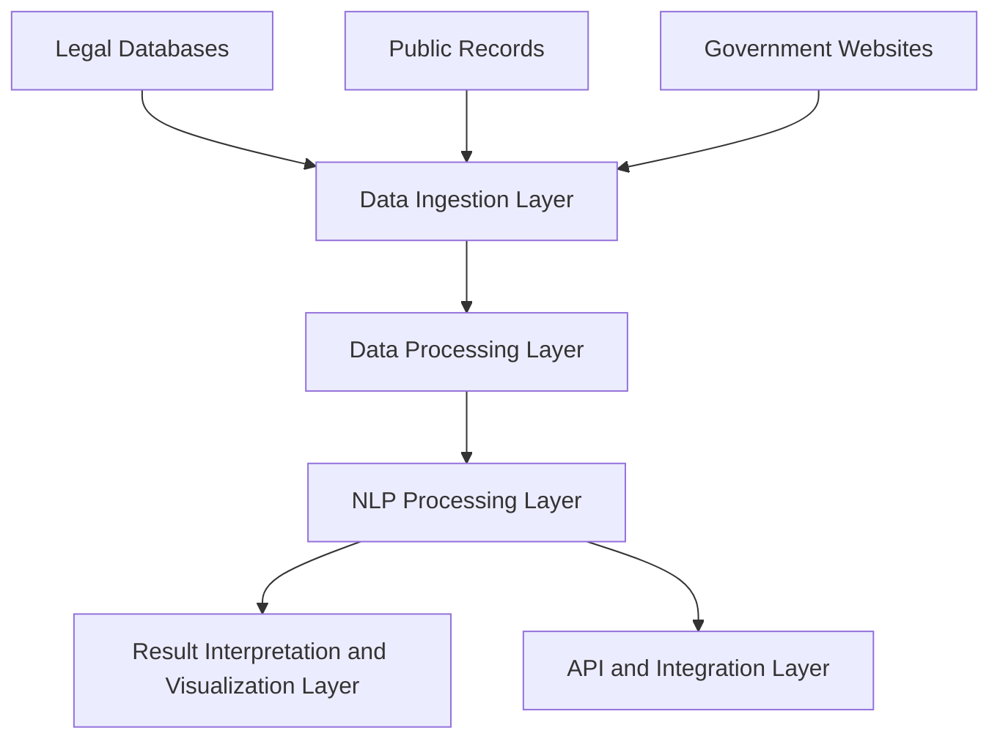
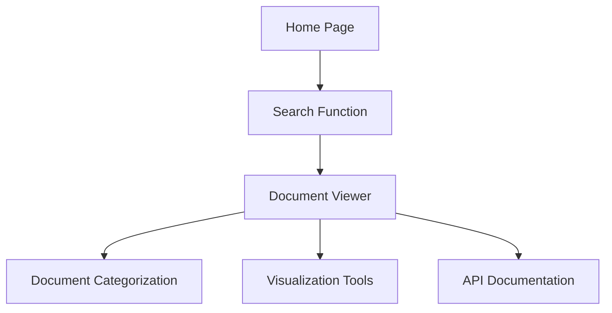

                 

### Part 1: Introduction to Legal Document Analysis and NLP

#### Chapter 1: Background of Legal Document Analysis and NLP

**1.1 Importance and Challenges in Legal Research**

Legal research is a crucial component of the legal profession, essential for law students, attorneys, judges, and legal scholars alike. The significance of legal research lies in its ability to provide foundational knowledge and ensure the accuracy and validity of legal arguments. However, the sheer volume of legal documents, ranging from case laws to statutes, regulations, and scholarly articles, presents significant challenges.

One of the primary challenges is the time and effort required to sift through vast amounts of text to extract relevant information. This task is further complicated by the complex and nuanced nature of legal language, which often involves specific terminology, citation styles, and legal jargon. Moreover, legal research often requires cross-referencing multiple documents to identify relevant precedents and build a coherent argument.

**1.2 The Role of NLP in Legal Document Analysis**

Natural Language Processing (NLP) offers a promising solution to these challenges by enabling computers to process and analyze legal text in a more efficient and effective manner. NLP techniques can automate the process of legal research, significantly reducing the time and effort required to extract and analyze relevant information from legal documents.

Key applications of NLP in legal document analysis include:

1. **Text Classification and Clustering**: NLP algorithms can classify legal documents into different categories (e.g., contracts, case laws, regulations) and clusters of similar documents, making it easier for legal professionals to locate relevant information.
2. **Named Entity Recognition (NER)**: NER identifies and classifies named entities within legal texts, such as people, organizations, locations, and legal terms. This enables more precise search and analysis of legal documents.
3. **Relation Extraction**: NLP techniques can identify relationships between named entities in legal texts, providing a deeper understanding of the content and context of the documents.
4. **Document Summarization**: NLP algorithms can summarize lengthy legal documents, extracting key information and presenting it in a concise and easily understandable format.
5. **Sentiment Analysis**: NLP can analyze the sentiment expressed in legal documents, providing insights into the emotional tone and opinions of authors or parties involved in legal disputes.

**1.3 Overview of NLP Techniques**

NLP encompasses a wide range of techniques and methodologies, including:

1. **Text Preprocessing**: This involves cleaning and preparing raw text data for further analysis, including tasks such as tokenization, stopword removal, and lemmatization.
2. **Tokenization**: Tokenization is the process of dividing a text into words or phrases (tokens), which are the fundamental units for analysis.
3. **Part-of-Speech Tagging**: This involves assigning a part of speech (noun, verb, adjective, etc.) to each token in a text.
4. **Named Entity Recognition (NER)**: NER identifies and classifies named entities within a text, such as people, organizations, locations, and legal terms.
5. **Relation Extraction**: Relation extraction involves identifying relationships between named entities in a text, providing insights into the content and context of the document.
6. **Text Classification and Clustering**: These techniques involve categorizing legal documents into different categories or clustering similar documents together based on their content.
7. **Document Summarization**: Document summarization involves extracting key information from a text and presenting it in a concise and easily understandable format.
8. **Sentiment Analysis**: Sentiment analysis involves analyzing the sentiment expressed in a text, providing insights into the emotional tone and opinions of authors or parties involved in legal disputes.

**1.4 Applications of NLP in Legal Research**

NLP has already proven to be a valuable tool in various aspects of legal research:

1. **Case Law Analysis**: NLP can analyze case laws to identify relevant precedents and trends, helping legal professionals build stronger arguments.
2. **Regulatory Compliance**: NLP can be used to analyze regulations and ensure compliance with legal requirements, reducing the risk of violations.
3. **Legal Document Review**: NLP can streamline the process of legal document review by automatically identifying relevant documents and extracting key information.
4. **Intellectual Property Analysis**: NLP can analyze patent applications and legal documents related to intellectual property, helping businesses and legal professionals understand potential risks and opportunities.

**1.5 Summary**

In summary, NLP offers a powerful set of tools and techniques for legal document analysis, enabling legal professionals to process and analyze legal texts more efficiently and effectively. By automating time-consuming tasks and providing deeper insights into legal documents, NLP can significantly enhance the efficiency and accuracy of legal research, freeing up time for legal professionals to focus on higher-value tasks.

### Chapter 2: Core Concepts and Theoretical Foundations of NLP

#### 2.1 Introduction to NLP

Natural Language Processing (NLP) is a field of computer science, artificial intelligence, and linguistics concerned with the interaction between computers and human languages. The primary goal of NLP is to enable computers to understand, interpret, and generate human language in a meaningful way. This involves developing algorithms and models that can process natural language text, extract information from it, and produce output that is both useful and coherent.

NLP has evolved significantly over the past few decades, driven by advancements in machine learning, deep learning, and computational linguistics. Today, NLP is a multidisciplinary field that combines techniques from various domains, including computer science, linguistics, cognitive science, and information science, to create systems that can perform a wide range of language-related tasks.

#### 2.2 Fundamental Concepts and Terminology

To understand NLP, it's essential to familiarize oneself with some fundamental concepts and terminology. Here are some key concepts:

1. **Text**: The raw data input to an NLP system, consisting of sentences, words, and other linguistic elements.
2. **Token**: The basic unit of text, typically a word or a phrase, that is processed by an NLP system.
3. **Tokenization**: The process of dividing a text into individual tokens.
4. **Part-of-Speech (POS) Tagging**: The process of assigning a part of speech (noun, verb, adjective, etc.) to each token in a text.
5. **Named Entity Recognition (NER)**: The task of identifying and classifying named entities (people, organizations, locations, etc.) within a text.
6. **Relation Extraction**: The task of identifying relationships between named entities in a text.
7. **Sentiment Analysis**: The process of determining the sentiment (positive, negative, neutral) expressed in a text.
8. **Text Classification**: The task of categorizing text documents into predefined categories or classes.
9. **Clustering**: The task of grouping text documents based on their content or similarity.
10. **Document Summarization**: The task of extracting key information from a text and presenting it in a concise and easily understandable format.

#### 2.3 Mathematical Models and Algorithms

NLP relies on a variety of mathematical models and algorithms to perform language processing tasks. Some of the key models and algorithms include:

1. **Markov Models**: A statistical model that describes the probability of a word sequence based on the probabilities of individual words. It is commonly used for language modeling and text generation.
2. **Hidden Markov Models (HMMs)**: A probabilistic model that describes the sequence of observed symbols based on an underlying sequence of unobservable symbols. HMMs are used for tasks like POS tagging and speech recognition.
3. **Conditional Random Fields (CRFs)**: A probabilistic model that uses features derived from the input sequence to predict the output sequence. CRFs are widely used for tasks like NER and relation extraction.
4. **Neural Networks**: A class of algorithms inspired by the structure and function of the human brain, capable of learning complex patterns from data. Neural networks, particularly deep learning models like Recurrent Neural Networks (RNNs) and Transformers, have revolutionized NLP by achieving state-of-the-art performance on various language processing tasks.
5. **Transformer Models**: A class of deep learning models that use self-attention mechanisms to process and generate sequences of text. Transformer models, such as BERT and GPT, have become the de facto standard for NLP tasks like text classification, sentiment analysis, and machine translation.

#### 2.4 Entity Recognition and Relation Extraction

Entity recognition and relation extraction are crucial tasks in NLP that enable systems to extract structured information from unstructured text. Here's a brief overview of each task:

1. **Named Entity Recognition (NER)**: The goal of NER is to identify and classify named entities in a text into predefined categories (e.g., person, organization, location). NER is typically performed using supervised learning techniques, with annotated datasets serving as training data.
2. **Relation Extraction**: The goal of relation extraction is to identify and classify relationships between named entities in a text. This involves detecting pairs of entities and determining the type of relationship that exists between them (e.g., works-for, located-in). Relation extraction techniques often leverage NER as a pre-processing step and employ various algorithms, including supervised learning, CRFs, and neural networks.

#### 2.5 Text Classification and Clustering

Text classification and clustering are two related tasks that involve organizing text documents based on their content or similarity. Here's a brief overview of each task:

1. **Text Classification**: The goal of text classification is to assign a text document to one or more predefined categories based on its content. This task is typically performed using supervised learning techniques, with labeled training data serving as input.
2. **Clustering**: The goal of clustering is to group text documents based on their similarity or content without predefined categories. Clustering algorithms, such as K-means and hierarchical clustering, are commonly used for this purpose.

#### 2.6 Summary

In summary, NLP is a multidisciplinary field that combines techniques from computer science, linguistics, and artificial intelligence to enable computers to understand, interpret, and generate human language. By understanding the fundamental concepts and theoretical foundations of NLP, we can better appreciate the capabilities and limitations of NLP systems and their applications in legal document analysis.

---

In the next section, we will delve deeper into the techniques and tools used for legal document analysis, starting with text preprocessing and cleaning.

### Chapter 3: Text Preprocessing and Cleaning

#### 3.1 Data Collection and Cleaning

The first step in analyzing legal documents using NLP techniques is data collection and cleaning. This process involves gathering the raw legal text data from various sources, such as case laws, statutes, regulations, and scholarly articles. Once collected, the data must be cleaned to remove any noise and inconsistencies that could affect the accuracy and reliability of subsequent NLP tasks.

**Data Collection**

Data collection for legal document analysis typically involves the following steps:

1. **Data Acquisition**: Legal documents can be acquired from various sources, including legal databases, public records, and government websites. In some cases, documents may need to be downloaded in bulk, requiring the use of web scraping tools or APIs.
2. **Data Integration**: Once collected, the documents are often stored in different formats and structures, requiring data integration to create a unified dataset.
3. **Data Categorization**: The dataset is then categorized into different types of legal documents, such as case laws, statutes, regulations, and scholarly articles. This step helps streamline the analysis process and ensures that the correct NLP techniques are applied to each document type.

**Data Cleaning**

Data cleaning is a crucial step in preparing legal documents for NLP analysis. This process involves several tasks:

1. **Removal of Non-Textual Elements**: Legal documents often contain non-textual elements, such as images, diagrams, and tables. These elements must be removed or converted into text to ensure the effectiveness of NLP techniques.
2. **Text Normalization**: Text normalization involves converting the text into a consistent format, such as lowercase or standardized abbreviations. This step is important for ensuring that the text is processed uniformly by NLP algorithms.
3. **Tokenization**: Tokenization is the process of dividing the text into individual words or phrases (tokens). This step is essential for subsequent NLP tasks, such as POS tagging and NER.
4. **Stopword Removal**: Stopwords are common words (e.g., "and", "the", "in") that do not carry much meaning and can be removed to reduce noise in the text. However, care must be taken to preserve important legal terms and phrases.
5. **Lemmatization**: Lemmatization involves reducing words to their base or root form. This step helps in reducing the size of the vocabulary and ensuring that similar words are treated uniformly.
6. **Handling Negations and Punctuation**: Legal texts often involve complex sentence structures and nuanced expressions, including negations and punctuation marks. These elements must be handled carefully to avoid misinterpretation by NLP algorithms.

**Example: Python Code for Text Preprocessing**

Here's an example of Python code for text preprocessing using the `nltk` library:

```python
import nltk
from nltk.tokenize import word_tokenize
from nltk.corpus import stopwords
from nltk.stem import WordNetLemmatizer
from nltk import pos_tag

# Download required resources
nltk.download('punkt')
nltk.download('stopwords')
nltk.download('wordnet')

# Load stopword list
stop_words = set(stopwords.words('english'))

# Initialize lemmatizer
lemmatizer = WordNetLemmatizer()

def preprocess_text(text):
    # Convert to lowercase
    text = text.lower()
    
    # Tokenization
    tokens = word_tokenize(text)
    
    # Remove stopwords
    tokens = [token for token in tokens if token not in stop_words]
    
    # Lemmatization
    tokens = [lemmatizer.lemmatize(token) for token in tokens]
    
    return tokens

# Example usage
text = "The quick brown fox jumps over the lazy dog."
preprocessed_text = preprocess_text(text)
print(preprocessed_text)
```

This code performs the following steps:

1. Converts the text to lowercase.
2. Tokenizes the text into words.
3. Removes stopwords.
4. Lemmatizes the tokens.

By following these steps, the code ensures that the text is in a consistent format, ready for further NLP analysis.

#### 3.2 Text Normalization and Tokenization

**Text Normalization**

Text normalization is the process of converting text into a consistent format, such as lowercase or standardized abbreviations. This step is crucial for ensuring that the text is processed uniformly by NLP algorithms. Text normalization can include the following tasks:

1. **Lowercasing**: Converting all characters in the text to lowercase to ensure case-insensitive processing.
2. **Abbreviation Expansion**: Expanding commonly used abbreviations (e.g., "e.g." to "for example") to their full forms.
3. **Standardization of Units and Quantities**: Converting units and quantities (e.g., "1000" to "one thousand") to a standardized format.
4. **Normalization of Dashes and Hyphens**: Converting dashes and hyphens to a consistent format (e.g., replacing em dashes with en dashes).

**Tokenization**

Tokenization is the process of dividing the text into individual words or phrases (tokens). This step is essential for subsequent NLP tasks, such as POS tagging and NER. Tokenization can be performed using various methods:

1. **Word-Level Tokenization**: Dividing the text into words based on whitespace and punctuation.
2. **Character-Level Tokenization**: Dividing the text into characters or subword units.
3. **Subword Tokenization**: Dividing the text into subword units, such as stems or combinations of characters, to handle out-of-vocabulary words and complex morphology.

**Example: Python Code for Text Normalization and Tokenization**

Here's an example of Python code for text normalization and tokenization using the `nltk` library:

```python
import nltk
from nltk.tokenize import word_tokenize
from nltk.tokenize import sent_tokenize

# Download required resources
nltk.download('punkt')

# Example text
text = "The quick brown fox jumps over the lazy dog. This is an example sentence for tokenization."

# Sentence tokenization
sentences = sent_tokenize(text)
print(sentences)

# Word tokenization
tokens = word_tokenize(text)
print(tokens)
```

This code performs the following steps:

1. Sentence tokenization, dividing the text into sentences.
2. Word tokenization, dividing the text into words.

By following these steps, the code ensures that the text is appropriately segmented for further NLP analysis.

#### 3.3 Stopword Removal and Lemmatization

**Stopword Removal**

Stopwords are common words (e.g., "and", "the", "in") that do not carry much meaning and can be removed to reduce noise in the text. However, care must be taken to preserve important legal terms and phrases. Stopword removal can be performed using predefined lists of stopwords or by identifying frequently occurring words that do not contribute to the meaning of the text.

**Lemmatization**

Lemmatization involves reducing words to their base or root form. This step helps in reducing the size of the vocabulary and ensuring that similar words are treated uniformly. Lemmatization is particularly useful for dealing with inflectional forms of words (e.g., "run", "runs", "running") and for normalizing variations of the same word (e.g., "researcher", "researches", "researching").

**Example: Python Code for Stopword Removal and Lemmatization**

Here's an example of Python code for stopwords removal and lemmatization using the `nltk` library:

```python
import nltk
from nltk.corpus import stopwords
from nltk.stem import WordNetLemmatizer

# Download required resources
nltk.download('stopwords')
nltk.download('wordnet')

# Load stopword list
stop_words = set(stopwords.words('english'))

# Initialize lemmatizer
lemmatizer = WordNetLemmatizer()

def preprocess_text(text):
    # Tokenization
    tokens = word_tokenize(text)
    
    # Stopword removal
    tokens = [token for token in tokens if token not in stop_words]
    
    # Lemmatization
    tokens = [lemmatizer.lemmatize(token) for token in tokens]
    
    return tokens

# Example usage
text = "The quick brown fox jumps over the lazy dog."
preprocessed_text = preprocess_text(text)
print(preprocessed_text)
```

This code performs the following steps:

1. Tokenization of the text.
2. Stopword removal.
3. Lemmatization.

By following these steps, the code ensures that the text is cleaned and prepared for further NLP analysis.

#### 3.4 Handling Negations and Punctuation

Legal texts often involve complex sentence structures and nuanced expressions, including negations and punctuation marks. These elements must be handled carefully to avoid misinterpretation by NLP algorithms.

**Handling Negations**

Negations are expressions that indicate the opposite of a statement, such as "not," "never," or "none." Handling negations correctly is crucial for understanding the meaning of legal texts. Some strategies for handling negations include:

1. **Detecting Negation Phrases**: Identifying phrases that express negation, such as "not only...but also" or "except for."
2. **Enhancing Models**: Training NLP models on datasets that include examples of negations to improve their ability to recognize and interpret negations.
3. **Post-processing**: Correcting the output of NLP models based on contextual information, such as the presence of negation phrases or the proximity of negated words to other words in the sentence.

**Handling Punctuation**

Punctuation marks in legal texts can indicate pauses, breaks, or emphasis. However, they can also create challenges for NLP algorithms, as they may affect tokenization and parsing. Some strategies for handling punctuation include:

1. **Punctuation Removal**: Removing punctuation marks during preprocessing to simplify tokenization and parsing. However, this approach may result in the loss of important information, such as abbreviations and citations.
2. **Punctuation Tokenization**: Dividing the text into tokens that include punctuation marks, such as "New York," to ensure that they are preserved in the analysis.
3. **Contextual Analysis**: Analyzing the context in which punctuation marks appear to determine their role in the sentence and adjust the analysis accordingly.

**Example: Python Code for Handling Negations and Punctuation**

Here's an example of Python code for handling negations and punctuation using the `nltk` library:

```python
import nltk
from nltk.tokenize import word_tokenize
from nltk.corpus import stopwords
from nltk.stem import WordNetLemmatizer

# Download required resources
nltk.download('stopwords')
nltk.download('wordnet')

# Load stopword list
stop_words = set(stopwords.words('english'))

# Initialize lemmatizer
lemmatizer = WordNetLemmatizer()

def preprocess_text(text):
    # Convert to lowercase
    text = text.lower()
    
    # Tokenization
    tokens = word_tokenize(text)
    
    # Remove punctuation
    tokens = [token for token in tokens if token.isalpha()]
    
    # Remove stopwords
    tokens = [token for token in tokens if token not in stop_words]
    
    # Lemmatization
    tokens = [lemmatizer.lemmatize(token) for token in tokens]
    
    return tokens

# Example usage
text = "The quick brown fox does not jump over the lazy dog."
preprocessed_text = preprocess_text(text)
print(preprocessed_text)
```

This code performs the following steps:

1. Converts the text to lowercase.
2. Tokenizes the text into words.
3. Removes punctuation marks.
4. Removes stopwords.
5. Lemmatizes the tokens.

By following these steps, the code ensures that the text is cleaned and prepared for further NLP analysis, taking into account negations and punctuation marks.

#### 3.5 Summary

In summary, text preprocessing and cleaning are essential steps in preparing legal documents for NLP analysis. By performing tasks such as data collection and cleaning, text normalization and tokenization, stopword removal and lemmatization, and handling negations and punctuation, NLP systems can effectively process and analyze legal text, extracting valuable insights and improving the efficiency and accuracy of legal research.

### Chapter 4: Named Entity Recognition (NER) in Legal Documents

#### 4.1 Overview of NER

Named Entity Recognition (NER) is a fundamental task in Natural Language Processing (NLP) that involves identifying and classifying named entities within a text into predefined categories. Named entities are specific objects, individuals, locations, organizations, and other entities that have a unique identity and can be referred to by a name. Examples of named entities include "John Doe," "New York," "Google," and "Supreme Court."

NER is crucial for various NLP applications, including information extraction, text summarization, question answering, and machine translation. In legal document analysis, NER plays a significant role in extracting key information from legal texts, such as identifying parties involved in a case, relevant laws and regulations, and locations of events.

#### 4.2 Techniques for NER in Legal Texts

NER techniques in legal texts can be broadly classified into rule-based methods, statistical methods, and machine learning methods. Each approach has its advantages and limitations, and a combination of these methods is often used to achieve the best performance.

1. **Rule-Based Methods**:
   Rule-based methods involve hand-crafting a set of rules to identify and classify named entities in legal texts. These rules can be based on pattern matching, lexical features, and syntactic parsing. Rule-based methods are relatively easy to implement and can be effective in handling specific types of legal documents. However, they are often limited in their ability to handle diverse and complex legal texts.

2. **Statistical Methods**:
   Statistical methods, such as Hidden Markov Models (HMMs) and Maximum Entropy Models (MaxEnt), use statistical models to identify and classify named entities based on the probability of a word sequence belonging to a particular named entity category. These methods are generally more flexible than rule-based methods and can adapt to different types of legal documents. However, they require large amounts of annotated training data to achieve good performance.

3. **Machine Learning Methods**:
   Machine learning methods, such as Support Vector Machines (SVMs), Conditional Random Fields (CRFs), and deep learning models, have gained popularity in NER due to their ability to handle complex and diverse text data. Deep learning models, particularly Recurrent Neural Networks (RNNs) and Transformer-based models like BERT, have achieved state-of-the-art performance in NER tasks. These models can learn from large amounts of annotated data and can adapt to different legal document types and domains.

**4.2.1 Example: Using CRF for NER in Legal Texts**

Conditional Random Fields (CRFs) are a popular machine learning method for NER. CRFs are probabilistic models that use features derived from the input sequence to predict the output sequence. They are particularly effective in capturing the contextual relationships between words in a sequence.

Here's a simple example of using CRFs for NER in legal texts:

**Example: Python Code for NER using CRF**

```python
import nltk
from nltk import word_tokenize, pos_tag
from nltk.corpus import treebank
from nltk.classify import CRFClassifier

# Download required resources
nltk.download('punkt')
nltk.download('averaged_perceptron_tagger')
nltk.download('treebank')

# Load a corpus of legal texts
corpus = treebank.tagged_words()

# Split the corpus into training and testing sets
train_data = corpus[:int(len(corpus) * 0.8)]
test_data = corpus[int(len(corpus) * 0.8):]

# Train a CRF model
crf = CRFClassifier.train(train_data)

# Test the model on new data
test_text = "John Doe filed a lawsuit against Jane Doe in the Superior Court of California."
test_tokens = word_tokenize(test_text)
test_tags = pos_tag(test_tokens)
predicted_tags = crf.classify(test_tokens)

print(predicted_tags)
```

This code trains a CRF model on a corpus of legal texts and uses it to classify named entities in a new legal document. The output is a sequence of words with their corresponding named entity tags.

**4.2.2 Example: Using BERT for NER in Legal Texts**

BERT (Bidirectional Encoder Representations from Transformers) is a deep learning model that has achieved state-of-the-art performance in various NLP tasks, including NER. BERT models are pre-trained on large amounts of text data and can be fine-tuned for specific tasks, such as NER in legal documents.

**Example: Python Code for NER using BERT**

```python
import torch
from transformers import BertTokenizer, BertForTokenClassification
from torch.nn.functional import softmax

# Load BERT tokenizer and model
tokenizer = BertTokenizer.from_pretrained('bert-base-uncased')
model = BertForTokenClassification.from_pretrained('bert-base-uncased')

# Set the model to evaluation mode
model.eval()

# Tokenize the legal text
test_text = "John Doe filed a lawsuit against Jane Doe in the Superior Court of California."
encoded_input = tokenizer(test_text, return_tensors='pt', is_split_into_words=True)

# Pass the tokenized text through the BERT model
with torch.no_grad():
    outputs = model(**encoded_input)

# Get the predicted entity tags
predicted_tags = torch.argmax(outputs.logits, dim=2).squeeze().tolist()

# Print the predicted tags
print(predicted_tags)
```

This code uses a pre-trained BERT model to classify named entities in a legal document. The output is a sequence of words with their corresponding named entity tags.

#### 4.3 Evaluation Metrics for NER

Evaluating the performance of NER systems is crucial for assessing their effectiveness in legal document analysis. Common evaluation metrics include:

1. **Precision**: Precision measures the proportion of correctly identified named entities out of all the named entities identified by the system. Precision = (True Positives / (True Positives + False Positives)).
2. **Recall**: Recall measures the proportion of correctly identified named entities out of all the named entities present in the ground truth. Recall = (True Positives / (True Positives + False Negatives)).
3. **F1 Score**: The F1 score is the harmonic mean of precision and recall, providing a balanced measure of the system's performance. F1 Score = 2 * (Precision * Recall) / (Precision + Recall).
4. **Accuracy**: Accuracy measures the proportion of correctly identified named entities out of all the words in the text. Accuracy = (True Positives + True Negatives) / Total Words.

**4.3.1 Example: Evaluating NER Performance**

**Example: Python Code for Evaluating NER Performance**

```python
from sklearn.metrics import precision_recall_fscore_support

# Ground truth tags
ground_truth = ["B-PERSON", "I-PERSON", "B-LOCATION", "O", "O", "B-COURT", "O"]

# Predicted tags
predicted = ["B-PERSON", "I-PERSON", "B-LOCATION", "O", "O", "B-COURT", "O"]

# Calculate precision, recall, and F1 score
precision, recall, f1_score, _ = precision_recall_fscore_support(ground_truth, predicted, average='weighted')

print("Precision:", precision)
print("Recall:", recall)
print("F1 Score:", f1_score)
```

This code calculates the precision, recall, and F1 score of an NER system based on ground truth and predicted tags. The weighted average is used to account for the different numbers of true positives, false positives, and false negatives in each class.

#### 4.4 Implementing NER in Legal Document Analysis

To implement NER in legal document analysis, follow these steps:

1. **Data Collection and Preprocessing**: Collect a dataset of legal documents and preprocess the text using techniques such as tokenization, stopword removal, and lemmatization.
2. **Model Selection and Training**: Choose an appropriate NER model, such as a rule-based method, statistical model, or machine learning model. Train the model on a labeled dataset of legal documents.
3. **Model Evaluation**: Evaluate the performance of the NER model using metrics such as precision, recall, and F1 score on a held-out test dataset.
4. **Deployment**: Deploy the trained NER model in a legal document analysis system, enabling it to identify and classify named entities in new legal documents.

**4.4.1 Example: Deploying NER in a Legal Document Analysis System**

**Example: Python Code for Deploying NER in a Legal Document Analysis System**

```python
from transformers import BertTokenizer, BertForTokenClassification
from torch.nn.functional import softmax

# Load BERT tokenizer and model
tokenizer = BertTokenizer.from_pretrained('bert-base-uncased')
model = BertForTokenClassification.from_pretrained('bert-base-uncased')

# Set the model to evaluation mode
model.eval()

def ner_analysis(document):
    # Tokenize the legal text
    encoded_input = tokenizer(document, return_tensors='pt', is_split_into_words=True)
    
    # Pass the tokenized text through the BERT model
    with torch.no_grad():
        outputs = model(**encoded_input)
    
    # Get the predicted entity tags
    predicted_tags = torch.argmax(outputs.logits, dim=2).squeeze().tolist()
    
    return predicted_tags

# Example legal document
document = "John Doe filed a lawsuit against Jane Doe in the Superior Court of California."

# Perform NER analysis
predicted_tags = ner_analysis(document)
print(predicted_tags)
```

This code defines a function `ner_analysis` that takes a legal document as input and uses a pre-trained BERT model to classify named entities in the document. The function returns a sequence of words with their corresponding named entity tags.

#### 4.5 Summary

In summary, Named Entity Recognition (NER) is a critical task in legal document analysis that enables the identification and classification of named entities in legal texts. By using techniques such as rule-based methods, statistical methods, and machine learning methods, NER systems can effectively extract valuable information from legal documents. Evaluating the performance of NER systems using metrics such as precision, recall, and F1 score is essential for ensuring their accuracy and effectiveness in legal document analysis.

---

In the next chapter, we will delve into text classification and topic modeling, exploring how these techniques can be applied to legal document analysis.

### Chapter 5: Text Classification and Topic Modeling

#### 5.1 Text Classification Basics

Text classification is a fundamental task in Natural Language Processing (NLP) that involves categorizing text documents into predefined categories or classes based on their content. This task is widely used in various domains, including legal research, where it can help organize legal documents, identify relevant cases, and improve the efficiency of legal research.

**Text Classification Process**

The text classification process typically involves the following steps:

1. **Data Collection and Preprocessing**: Collect a dataset of legal documents and preprocess the text using techniques such as tokenization, stopword removal, and lemmatization.
2. **Feature Extraction**: Extract features from the preprocessed text, such as term frequency-inverse document frequency (TF-IDF), word embeddings, or bag-of-words representations.
3. **Model Training**: Train a classification model using the extracted features and labeled data. Common models include Naive Bayes, Support Vector Machines (SVM), and deep learning models like Convolutional Neural Networks (CNNs) and Recurrent Neural Networks (RNNs).
4. **Model Evaluation**: Evaluate the performance of the trained model using metrics such as accuracy, precision, recall, and F1 score on a held-out test dataset.
5. **Deployment**: Deploy the trained model in a legal document analysis system to classify new legal documents.

**5.1.1 Example: Using Naive Bayes for Text Classification**

**Example: Python Code for Text Classification using Naive Bayes**

```python
from sklearn.feature_extraction.text import TfidfVectorizer
from sklearn.model_selection import train_test_split
from sklearn.naive_bayes import MultinomialNB
from sklearn.metrics import classification_report

# Load a dataset of legal documents and their labels
documents = ["Case laws", "Statutes", "Regulations", "Scholarly articles"]
labels = ["Case", "Statute", "Regulation", "Article"]

# Split the dataset into training and testing sets
X_train, X_test, y_train, y_test = train_test_split(documents, labels, test_size=0.2, random_state=42)

# Extract TF-IDF features
vectorizer = TfidfVectorizer()
X_train_tfidf = vectorizer.fit_transform(X_train)
X_test_tfidf = vectorizer.transform(X_test)

# Train a Naive Bayes classifier
classifier = MultinomialNB()
classifier.fit(X_train_tfidf, y_train)

# Predict labels for the test set
y_pred = classifier.predict(X_test_tfidf)

# Evaluate the classifier
print(classification_report(y_test, y_pred))
```

This code trains a Naive Bayes classifier on a dataset of legal documents and evaluates its performance on a test set using the TF-IDF representation of the documents.

#### 5.2 Classifying Legal Documents

**5.2.1 Types of Legal Documents**

Legal documents can be categorized into various types, such as case laws, statutes, regulations, and scholarly articles. Each type of document has its unique characteristics and language usage, which can affect the classification process.

1. **Case Laws**: Case laws are decisions made by courts in legal disputes. They often contain detailed descriptions of the facts, arguments, and legal reasoning behind the decision. Case laws are typically written in a formal and technical language.
2. **Statutes**: Statutes are laws enacted by legislative bodies, such as congress or parliaments. They provide the legal framework and guidelines for various aspects of society. Statutes are usually written in a clear and concise language, aimed at being easily understood by the general public.
3. **Regulations**: Regulations are rules and guidelines issued by government agencies to implement and enforce laws. Regulations often provide specific details and requirements related to a particular area of law, such as environmental protection, financial regulation, or healthcare.
4. **Scholarly Articles**: Scholarly articles are research papers written by legal scholars and professionals. They discuss various legal issues, analyze case laws and statutes, and propose new legal theories or solutions. Scholarly articles are typically written in a more academic and technical language.

**5.2.2 Challenges in Classifying Legal Documents**

Classifying legal documents presents several challenges:

1. **Heterogeneity**: Legal documents exhibit significant heterogeneity in terms of content, structure, and language usage. This heterogeneity can make it difficult to develop a single model that performs well across all types of legal documents.
2. **Ambiguity**: Legal language is often ambiguous and open to interpretation. Words and phrases may have multiple meanings or can be used in different contexts, which can affect the accuracy of the classification process.
3. **Contextual Dependencies**: Legal documents are heavily dependent on the context in which they are written. Understanding the context is crucial for accurately classifying legal documents, and this can be challenging for NLP models.

**5.2.3 Approaches for Classifying Legal Documents**

Several approaches can be used for classifying legal documents:

1. **Rule-Based Approaches**: Rule-based approaches involve hand-crafting a set of rules to classify legal documents based on their content and structure. These rules can be based on pattern matching, keyword extraction, or syntactic parsing. Rule-based approaches are relatively easy to implement but may be limited in their ability to handle diverse and complex legal documents.
2. **Statistical Approaches**: Statistical approaches, such as Naive Bayes, Support Vector Machines (SVM), and logistic regression, use statistical models to classify legal documents based on their content. These models require labeled training data and can adapt to different types of legal documents. However, they may struggle with the heterogeneity and ambiguity in legal language.
3. **Machine Learning Approaches**: Machine learning approaches, such as deep learning models like Convolutional Neural Networks (CNNs), Recurrent Neural Networks (RNNs), and Transformer-based models like BERT, have gained popularity in text classification tasks due to their ability to handle complex and diverse text data. These models can learn from large amounts of labeled data and can adapt to different legal document types and domains.

**5.2.4 Example: Using BERT for Classifying Legal Documents**

**Example: Python Code for Classifying Legal Documents using BERT**

```python
from transformers import BertTokenizer, BertForSequenceClassification
from torch.nn.functional import softmax

# Load BERT tokenizer and model
tokenizer = BertTokenizer.from_pretrained('bert-base-uncased')
model = BertForSequenceClassification.from_pretrained('bert-base-uncased')

# Set the model to evaluation mode
model.eval()

def text_classification(document, labels):
    # Tokenize the legal document
    encoded_input = tokenizer(document, return_tensors='pt', max_length=128, truncation=True)

    # Pass the tokenized text through the BERT model
    with torch.no_grad():
        outputs = model(**encoded_input)

    # Get the predicted label
    predicted_label = torch.argmax(outputs.logits).item()

    return labels[predicted_label]

# Example legal documents and their labels
documents = [
    "The Supreme Court ruled on a landmark case.",
    "The Environmental Protection Agency proposed new regulations.",
    "The legislature passed a bill on healthcare reform.",
    "Legal scholars debated the implications of the recent case law."
]

# Classify the legal documents
labels = ["Case", "Regulation", "Statute", "Article"]
predicted_labels = [text_classification(doc, labels) for doc in documents]

print(predicted_labels)
```

This code defines a function `text_classification` that takes a legal document and its possible labels, and uses a pre-trained BERT model to classify the document. The function returns the predicted label based on the highest probability output from the BERT model.

#### 5.3 Topic Modeling and Its Applications

Topic modeling is an unsupervised machine learning technique that aims to discover abstract topics or themes in a collection of documents. In topic modeling, each document is represented as a mixture of topics, and each topic is characterized by a distribution of words. Topic modeling is particularly useful for analyzing large collections of unstructured text data, such as legal documents.

**5.3.1 Types of Topic Modeling**

There are several types of topic modeling techniques, including Latent Dirichlet Allocation (LDA), Non-negative Matrix Factorization (NMF), and Latent Semantic Analysis (LSA). LDA is the most popular topic modeling technique due to its ability to handle large-scale text data and its interpretability.

**5.3.2 LDA Algorithm**

LDA is a probabilistic model that assumes each document is a mixture of topics, and each topic is a mixture of words. The algorithm involves the following steps:

1. **Initialization**: Initialize the topic distribution for each document and the word distribution for each topic.
2. **E-step (E ستimation)**: Using the current topic and word distributions, compute the probabilities of each topic and word given the document and the current topic distribution.
3. **M-step (M aximization)**: Update the topic distribution and word distribution based on the probabilities computed in the E-step.
4. **Iteration**: Repeat the E-step and M-step until convergence.

**5.3.3 Example: Using LDA for Topic Modeling**

**Example: Python Code for Topic Modeling using LDA**

```python
import gensim
from gensim import corpora

# Load the preprocessed legal documents
documents = ["Case laws", "Statutes", "Regulations", "Scholarly articles"]

# Tokenize the documents
tokenized_documents = [doc.split() for doc in documents]

# Create a dictionary representation of the documents
dictionary = corpora.Dictionary(tokenized_documents)

# Filter out rare words and create a bag-of-words representation
corpus = [dictionary.doc2bow(doc) for doc in tokenized_documents]

# Train an LDA model
lda_model = gensim.models.ldamodel.LdaModel(corpus, num_topics=4, id2word=dictionary, passes=15)

# Print the topics
topics = lda_model.print_topics(num_words=4)
print(topics)
```

This code trains an LDA model on a small dataset of legal documents and prints the topics discovered by the model.

**5.3.4 Applications of Topic Modeling in Legal Research**

Topic modeling has several applications in legal research:

1. **Document Clustering**: Topic modeling can be used to cluster legal documents based on their content, allowing legal professionals to identify similar documents and group them together for further analysis.
2. **Thematic Analysis**: Topic modeling can help identify the main themes or topics discussed in legal documents, providing insights into the major issues and trends in a particular legal domain.
3. **Summarization**: Topic modeling can be used to generate summaries of legal documents by extracting the most representative topics and their associated words, providing a concise overview of the document's content.

#### 5.4 Implementing Topic Modeling for Legal Research

To implement topic modeling for legal research, follow these steps:

1. **Data Collection and Preprocessing**: Collect a dataset of legal documents and preprocess the text using techniques such as tokenization, stopword removal, and lemmatization.
2. **Feature Extraction**: Extract features from the preprocessed text, such as term frequency-inverse document frequency (TF-IDF) or word embeddings.
3. **Model Training**: Train a topic modeling model, such as LDA, NMF, or LSA, on the extracted features.
4. **Result Analysis**: Analyze the results by examining the discovered topics and their associated words, and apply the insights to legal research tasks such as document clustering, thematic analysis, and summarization.

**5.4.1 Example: Implementing LDA for Legal Document Analysis**

**Example: Python Code for LDA in Legal Document Analysis**

```python
import gensim
from gensim import corpora

# Load the preprocessed legal documents
documents = ["Case laws", "Statutes", "Regulations", "Scholarly articles"]

# Tokenize the documents
tokenized_documents = [doc.split() for doc in documents]

# Create a dictionary representation of the documents
dictionary = corpora.Dictionary(tokenized_documents)

# Filter out rare words and create a bag-of-words representation
corpus = [dictionary.doc2bow(doc) for doc in tokenized_documents]

# Train an LDA model
lda_model = gensim.models.ldamodel.LdaModel(corpus, num_topics=4, id2word=dictionary, passes=15)

# Print the topics
topics = lda_model.print_topics(num_words=4)
print(topics)

# Analyze the topics and their applications in legal research
```

This code trains an LDA model on a small dataset of legal documents, prints the discovered topics, and provides an opportunity to analyze the results and their implications for legal research.

#### 5.5 Summary

In summary, text classification and topic modeling are powerful NLP techniques that can be applied to legal document analysis to improve the efficiency and effectiveness of legal research. Text classification helps categorize legal documents based on their content, while topic modeling discovers the underlying themes and topics in a collection of legal documents. By implementing these techniques, legal professionals can better organize and analyze legal documents, leading to more informed decision-making and improved research outcomes.

### Chapter 6: Sentiment Analysis and Opinion Mining

#### 6.1 Sentiment Analysis Overview

Sentiment analysis, also known as opinion mining, is an NLP technique used to determine the sentiment or emotional tone behind a body of text. This technique is widely used in various applications, including social media analysis, customer reviews, and legal document analysis. In legal research, sentiment analysis can provide valuable insights into the attitudes, opinions, and emotional responses of parties involved in legal disputes or the general public towards specific legal issues.

**Sentiment Analysis Process**

The sentiment analysis process typically involves the following steps:

1. **Data Collection and Preprocessing**: Collect a dataset of legal documents or social media posts related to legal issues and preprocess the text using techniques such as tokenization, stopword removal, and lemmatization.
2. **Feature Extraction**: Extract features from the preprocessed text, such as term frequency-inverse document frequency (TF-IDF), word embeddings, or bag-of-words representations.
3. **Sentiment Classification**: Use a machine learning model or lexicon-based approach to classify the sentiment of each document or sentence in the dataset. Common sentiment classes include positive, negative, and neutral.
4. **Result Interpretation**: Analyze the sentiment classification results to gain insights into the overall sentiment of the dataset or identify specific trends and patterns.

**6.1.1 Example: Using Machine Learning for Sentiment Analysis**

**Example: Python Code for Sentiment Analysis using Machine Learning**

```python
from sklearn.feature_extraction.text import TfidfVectorizer
from sklearn.naive_bayes import MultinomialNB
from sklearn.pipeline import make_pipeline

# Load a dataset of legal documents and their sentiment labels
documents = ["The court ruled in favor of the plaintiff.", "The defendant's arguments were weak."]
labels = ["Positive", "Negative"]

# Split the dataset into training and testing sets
X_train, X_test, y_train, y_test = train_test_split(documents, labels, test_size=0.2, random_state=42)

# Create a TF-IDF vectorizer and Naive Bayes classifier pipeline
model = make_pipeline(TfidfVectorizer(), MultinomialNB())

# Train the model
model.fit(X_train, y_train)

# Predict sentiment labels for the test set
y_pred = model.predict(X_test)

# Evaluate the model
print(classification_report(y_test, y_pred))
```

This code trains a machine learning model using a dataset of legal documents and their sentiment labels. The model is then used to predict the sentiment of new legal documents and evaluate its performance on a test set.

#### 6.2 Techniques for Sentiment Analysis

There are several techniques for sentiment analysis, including lexicon-based approaches, machine learning-based approaches, and hybrid approaches.

**Lexicon-Based Approaches**

Lexicon-based approaches use pre-defined sentiment lexicons, which contain words and their associated sentiment scores. These approaches assign sentiment scores to words or phrases in a text based on their presence in the lexicon and the aggregate sentiment scores of the words.

**6.2.1 Example: Using a Sentiment Lexicon**

**Example: Python Code for Sentiment Analysis using a Lexicon**

```python
from nltk.corpus import opinion lexicon

# Load a sentiment lexicon
lexicon = opinion_lexicon.lexicon()

# Define a function to compute the sentiment score of a text
def sentiment_score(text):
    score = 0
    tokens = word_tokenize(text.lower())
    for token in tokens:
        if token in lexicon:
            score += lexicon[token]
    return score

# Example text
text = "The court ruled in favor of the plaintiff."

# Compute the sentiment score
score = sentiment_score(text)
print(score)
```

This code uses a sentiment lexicon to compute the sentiment score of a given text. The sentiment score is calculated by summing the sentiment scores of the words in the text based on their presence in the lexicon.

**Machine Learning-Based Approaches**

Machine learning-based approaches use supervised learning techniques to train models on labeled datasets of legal documents. These models learn to predict the sentiment of new documents based on the patterns and features in the training data.

**6.2.2 Example: Using a Machine Learning Model for Sentiment Analysis**

**Example: Python Code for Sentiment Analysis using a Machine Learning Model**

```python
from sklearn.feature_extraction.text import TfidfVectorizer
from sklearn.naive_bayes import MultinomialNB
from sklearn.pipeline import make_pipeline

# Load a dataset of legal documents and their sentiment labels
documents = ["The court ruled in favor of the plaintiff.", "The defendant's arguments were weak."]
labels = ["Positive", "Negative"]

# Split the dataset into training and testing sets
X_train, X_test, y_train, y_test = train_test_split(documents, labels, test_size=0.2, random_state=42)

# Create a TF-IDF vectorizer and Naive Bayes classifier pipeline
model = make_pipeline(TfidfVectorizer(), MultinomialNB())

# Train the model
model.fit(X_train, y_train)

# Predict sentiment labels for the test set
y_pred = model.predict(X_test)

# Evaluate the model
print(classification_report(y_test, y_pred))
```

This code trains a machine learning model using a dataset of legal documents and their sentiment labels. The model is then used to predict the sentiment of new legal documents and evaluate its performance on a test set.

**Hybrid Approaches**

Hybrid approaches combine the strengths of lexicon-based and machine learning-based approaches. These approaches use sentiment lexicons to identify sentiment-bearing words or phrases and then apply machine learning models to classify the overall sentiment of the text.

**6.2.3 Example: Using a Hybrid Approach for Sentiment Analysis**

**Example: Python Code for Sentiment Analysis using a Hybrid Approach**

```python
from nltk.corpus import opinion lexicon
from sklearn.feature_extraction.text import TfidfVectorizer
from sklearn.naive_bayes import MultinomialNB
from sklearn.pipeline import make_pipeline

# Load a sentiment lexicon
lexicon = opinion_lexicon.lexicon()

# Define a function to preprocess the text
def preprocess_text(text):
    # Tokenize and lemmatize the text
    tokens = word_tokenize(text.lower())
    lemmatizer = WordNetLemmatizer()
    tokens = [lemmatizer.lemmatize(token) for token in tokens]
    
    # Remove stop words
    stop_words = set(stopwords.words('english'))
    tokens = [token for token in tokens if token not in stop_words]
    
    # Add sentiment-bearing words from the lexicon
    tokens = [token for token in tokens if token in lexicon]
    
    return ' '.join(tokens)

# Load a dataset of legal documents and their sentiment labels
documents = ["The court ruled in favor of the plaintiff.", "The defendant's arguments were weak."]
labels = ["Positive", "Negative"]

# Preprocess the documents
preprocessed_documents = [preprocess_text(doc) for doc in documents]

# Split the dataset into training and testing sets
X_train, X_test, y_train, y_test = train_test_split(preprocessed_documents, labels, test_size=0.2, random_state=42)

# Create a TF-IDF vectorizer and Naive Bayes classifier pipeline
model = make_pipeline(TfidfVectorizer(), MultinomialNB())

# Train the model
model.fit(X_train, y_train)

# Predict sentiment labels for the test set
y_pred = model.predict(X_test)

# Evaluate the model
print(classification_report(y_test, y_pred))
```

This code combines a sentiment lexicon with a machine learning model to perform sentiment analysis. The text is preprocessed by tokenizing, lemmatizing, and removing stop words, and then sentiment-bearing words from the lexicon are added. The preprocessed text is then used to train and evaluate a machine learning model.

#### 6.3 Sentiment Analysis in Legal Documents

Sentiment analysis in legal documents can provide valuable insights into the attitudes, opinions, and emotional responses of parties involved in legal disputes or the general public towards specific legal issues. Here are some applications of sentiment analysis in legal research:

1. **Public Opinion Analysis**: Sentiment analysis can be used to analyze public opinion on legal issues, such as proposed legislation or court decisions. This can help legal professionals understand the public's perspective and make more informed decisions.
2. **Case Law Analysis**: Sentiment analysis can be used to analyze the sentiment of case law opinions, identifying trends in judicial opinions and the factors that influence judicial decision-making.
3. **Litigation Strategy**: Sentiment analysis can help legal professionals analyze the sentiment of documents related to a legal case, providing insights into the strengths and weaknesses of each party's arguments and potential outcomes.
4. **Judicial Performance Evaluation**: Sentiment analysis can be used to evaluate the performance of judges and courts by analyzing the sentiment of opinions, decisions, and public feedback.

**6.3.1 Example: Analyzing Sentiment in Legal Opinions**

**Example: Python Code for Sentiment Analysis in Legal Opinions**

```python
from nltk.sentiment import SentimentIntensityAnalyzer

# Load a dataset of legal opinions and their labels
opinions = ["The court ruled in favor of the plaintiff.", "The defendant's arguments were weak."]
labels = ["Positive", "Negative"]

# Initialize the sentiment analyzer
sia = SentimentIntensityAnalyzer()

# Define a function to analyze the sentiment of an opinion
def analyze_sentiment(opinion):
    sentiment_score = sia.polarity_scores(opinion)
    if sentiment_score['compound'] >= 0.05:
        return "Positive"
    elif sentiment_score['compound'] <= -0.05:
        return "Negative"
    else:
        return "Neutral"

# Analyze the sentiment of the opinions
sentiments = [analyze_sentiment(opinion) for opinion in opinions]

# Compare the sentiment analysis results with the labeled sentiments
print(sentiments)
print(labels)
```

This code uses the `SentimentIntensityAnalyzer` from the `nltk` library to analyze the sentiment of legal opinions. The sentiment is classified as positive, negative, or neutral based on the compound sentiment score.

#### 6.4 Opinion Mining in Legal Research

Opinion mining, a subfield of sentiment analysis, focuses on extracting and analyzing opinions and subjective information from text. In legal research, opinion mining can be used to identify the opinions of parties involved in legal disputes, legal scholars, or the general public.

**6.4.1 Applications of Opinion Mining in Legal Research**

Opinion mining has several applications in legal research:

1. **Case Law Analysis**: Opinion mining can be used to analyze legal opinions, identifying the arguments and opinions expressed by judges and attorneys.
2. **Legal Document Review**: Opinion mining can help legal professionals review legal documents by extracting the opinions and arguments contained in the documents.
3. **Expert Opinion Extraction**: Opinion mining can be used to extract expert opinions from legal documents, legal scholarly articles, and expert witness testimonies.
4. **Legal Argument Analysis**: Opinion mining can help analyze the arguments and counterarguments in legal documents, providing insights into the logical structure of legal arguments.

**6.4.2 Example: Extracting Opinions from Legal Documents**

**Example: Python Code for Opinion Mining in Legal Documents**

```python
import nltk
from nltk import pos_tag
from nltk.corpus import stopwords
from nltk.tokenize import word_tokenize

# Download required resources
nltk.download('punkt')
nltk.download('averaged_perceptron_tagger')
nltk.download('stopwords')

# Load a dataset of legal documents and their labels
documents = ["The court ruled in favor of the plaintiff.", "The defendant's arguments were weak."]
labels = ["Positive", "Negative"]

# Initialize the stopword list
stop_words = set(stopwords.words('english'))

# Define a function to extract opinions from a document
def extract_opinions(document):
    # Tokenize and POS-tag the document
    tokens = word_tokenize(document)
    tagged_tokens = pos_tag(tokens)
    
    # Remove stop words and filter for opinions
    opinions = [word for word, tag in tagged_tokens if word.lower() not in stop_words and tag.startswith('JJ') or tag.startswith('VB')]
    
    return opinions

# Extract opinions from the documents
opinions = [extract_opinions(doc) for doc in documents]

# Compare the extracted opinions with the labeled opinions
print(opinions)
print(labels)
```

This code uses part-of-speech tagging and stop word removal to extract opinions from legal documents. The extracted opinions are compared with the labeled opinions to assess the effectiveness of the extraction process.

#### 6.5 Summary

In summary, sentiment analysis and opinion mining are powerful NLP techniques that can be applied to legal documents to extract insights into the attitudes, opinions, and emotional responses of parties involved in legal disputes. By using techniques such as lexicon-based approaches, machine learning-based approaches, and hybrid approaches, legal professionals can gain a better understanding of legal issues and improve their decision-making processes. Additionally, opinion mining can be used to extract valuable information from legal documents, providing insights into the arguments and opinions expressed by various parties.

### Chapter 7: Document Summarization and Extractive/Abstractive Methods

#### 7.1 Document Summarization Overview

Document summarization is a critical task in Natural Language Processing (NLP) that involves creating a concise and coherent summary of a longer document while preserving its essential meaning. The goal of document summarization is to provide users with an efficient way to understand the main points and key information contained in a document without having to read the entire text. This task is particularly important in legal research, where large volumes of legal documents need to be processed and analyzed to extract relevant information.

**7.1.1 Types of Document Summarization**

There are two main types of document summarization: extractive summarization and abstractive summarization.

1. **Extractive Summarization**: Extractive summarization involves selecting key sentences, phrases, or paragraphs from the original document to create the summary. The summary is a direct quotation from the document, and the goal is to extract the most important information while minimizing redundancy. Extractive summarization is relatively straightforward to implement and is less computationally expensive compared to abstractive summarization.
   
2. **Abstractive Summarization**: Abstractive summarization involves generating a new summary that captures the main ideas and essence of the original document but is not a direct quotation. Abstractive summarization requires understanding the context and meaning of the text, and it often involves synthesizing information from multiple sentences or paragraphs. This approach is more complex and computationally intensive but can produce more natural and insightful summaries.

**7.1.2 Challenges in Document Summarization**

Document summarization faces several challenges, including:

1. ** preserving key information**: Ensuring that the summary includes all the essential details and main points of the original document without omitting critical information.
2. ** avoiding redundancy**: Removing unnecessary repetition and ensuring that the summary is concise and coherent.
3. **handling diverse document structures**: Legal documents often have complex structures, including lists, headers, and references. Summarizing such documents requires understanding the structure and hierarchy of the content.
4. ** capturing context and nuance**: Understanding the context and subtleties of the text, including the tone, intent, and implications of the statements.

**7.1.3 Applications of Document Summarization**

Document summarization has various applications in legal research:

1. **Legal Document Review**: Summarizing legal documents can streamline the review process, allowing legal professionals to quickly grasp the main points and identify relevant information.
2. **Case Law Analysis**: Summarizing case laws can help legal scholars and attorneys quickly understand the key arguments and outcomes of past cases, aiding in research and legal strategy development.
3. **Legal Briefs and Briefs of Authorities**: Summarizing legal documents can be used to create concise legal briefs or briefs of authorities, which are valuable for presenting legal arguments in court or to clients.
4. **Legal Research Automation**: Summarizing legal documents can automate the legal research process, saving time and resources for legal professionals.

**7.2 Document Summarization Techniques**

There are several techniques for document summarization, including:

1. **Extractive Summarization**: Extractive summarization techniques involve selecting key sentences, phrases, or paragraphs from the original document. Common approaches include:
   - **Frequency-based methods**: Selecting the most frequently occurring sentences or phrases in the document.
   - **Positional methods**: Considering the positions of sentences or paragraphs in the document, with higher positions typically indicating more important content.
   - **Graph-based methods**: Constructing a graph of words or phrases in the document and selecting the most important nodes (e.g., sentences) based on centrality measures.

2. **Abstractive Summarization**: Abstractive summarization techniques involve generating a new summary by understanding the meaning of the text and synthesizing information from multiple sentences or paragraphs. Common approaches include:
   - **Neural Network-based methods**: Using recurrent neural networks (RNNs), transformers, and transformer-based models like BERT and GPT to generate summaries.
   - **Abstract Meaning Representation (AMR)**: Representing the text in a semantic graph called Abstract Meaning Representation (AMR) and summarizing the graph by extracting key nodes and relationships.

**7.3 Extractive Summarization Methods**

Extractive summarization methods focus on selecting key parts of the document to create the summary. Here are some popular methods:

**7.3.1 Lexical Co-occurrence**

Lexical co-occurrence is a simple method that selects sentences or paragraphs based on the frequency of words that co-occur in them. Sentences with a higher number of common words are more likely to be relevant and are thus selected for the summary.

**Example: Python Code for Lexical Co-occurrence**

```python
from collections import Counter
from nltk.tokenize import sent_tokenize

# Load a legal document
document = "The court ruled in favor of the plaintiff. The defendant's arguments were weak. The evidence supported the plaintiff's claims."

# Tokenize the document into sentences
sentences = sent_tokenize(document)

# Count word co-occurrences
co_occurrences = Counter()
for i in range(len(sentences) - 1):
    words1 = set(word_tokenize(sentences[i].lower()))
    words2 = set(word_tokenize(sentences[i + 1].lower()))
    co_occurrences.update(words1.intersection(words2))

# Select the most co-occurring sentences
selected_sentences = [sentence for sentence in sentences if sum(co_occurrences[word] for word in word_tokenize(sentence.lower())) > threshold]

print(selected_sentences)
```

In this example, sentences with a higher number of common words are selected for the summary.

**7.3.2 Sentence Importance Scoring**

Sentence importance scoring involves assigning a score to each sentence based on its importance and selecting the top-scoring sentences for the summary. Common criteria for scoring include sentence length, position in the document, and frequency of key terms.

**Example: Python Code for Sentence Importance Scoring**

```python
from sklearn.metrics.pairwise import cosine_similarity
from sklearn.feature_extraction.text import TfidfVectorizer

# Load a legal document
document = "The court ruled in favor of the plaintiff. The defendant's arguments were weak. The evidence supported the plaintiff's claims."

# Tokenize the document into sentences
sentences = sent_tokenize(document)

# Vectorize the sentences using TF-IDF
vectorizer = TfidfVectorizer()
X = vectorizer.fit_transform(sentences)

# Compute sentence importance scores based on cosine similarity
sentence_scores = cosine_similarity(X, X)

# Select the top-scoring sentences
selected_sentences = [sentence for sentence, score in zip(sentences, sentence_scores[0]) if score > threshold]

print(selected_sentences)
```

In this example, sentences with higher cosine similarity scores are selected for the summary.

**7.3.3 Graph-based Methods**

Graph-based methods construct a graph of words or phrases in the document and select the most important nodes (e.g., sentences) based on centrality measures. Common centrality measures include degree centrality, closeness centrality, and betweenness centrality.

**Example: Python Code for Graph-based Method**

```python
import networkx as nx

# Load a legal document
document = "The court ruled in favor of the plaintiff. The defendant's arguments were weak. The evidence supported the plaintiff's claims."

# Tokenize the document into sentences
sentences = sent_tokenize(document)

# Construct a graph of word co-occurrences
G = nx.Graph()
for i in range(len(sentences) - 1):
    words1 = set(word_tokenize(sentences[i].lower()))
    words2 = set(word_tokenize(sentences[i + 1].lower()))
    for word1 in words1.intersection(words2):
        G.add_edge(i, i + 1)

# Compute centrality measures
centrality = nx.betweenness_centrality(G)

# Select the most central sentences
selected_sentences = [sentence for sentence, score in centrality.items() if score > threshold]

print(selected_sentences)
```

In this example, sentences with higher betweenness centrality scores are selected for the summary.

**7.4 Abstractive Summarization Methods**

Abstractive summarization methods generate new summaries by understanding the meaning of the text and synthesizing information from multiple sentences or paragraphs. Here are some popular methods:

**7.4.1 Neural Network-based Methods**

Neural network-based methods, particularly transformers and RNNs, have achieved state-of-the-art performance in abstractive summarization tasks. Models like BERT and GPT have been fine-tuned for summarization and can generate coherent and informative summaries.

**Example: Python Code for Abstractive Summarization using BERT**

```python
from transformers import BertTokenizer, BertForSeq2SeqLM

# Load a legal document
document = "The court ruled in favor of the plaintiff. The defendant's arguments were weak. The evidence supported the plaintiff's claims."

# Tokenize the document using BERT tokenizer
tokenizer = BertTokenizer.from_pretrained('bert-base-uncased')
encoded_input = tokenizer(document, return_tensors='pt', max_length=512, truncation=True)

# Load a pre-trained BERT model for summarization
model = BertForSeq2SeqLM.from_pretrained('bert-base-uncased')

# Generate a summary
summary_ids = model.generate(encoded_input.input_ids, attention_mask=encoded_input.attention_mask, max_length=150, min_length=50, do_sample=True)

# Decode the generated summary
decoded_summary = tokenizer.decode(summary_ids[0], skip_special_tokens=True)

print(decoded_summary)
```

In this example, a BERT model is used to generate an abstractive summary of the legal document.

**7.4.2 Abstract Meaning Representation (AMR)**

Abstract Meaning Representation (AMR) is a semantic representation that captures the meaning of a text as a graph. AMR can be used for abstractive summarization by extracting key nodes and relationships from the graph.

**Example: Python Code for Abstractive Summarization using AMR**

```python
import amr

# Load a legal document
document = "The court ruled in favor of the plaintiff. The defendant's arguments were weak. The evidence supported the plaintiff's claims."

# Parse the document into AMR
amr_graph = amr.parse(document)

# Extract key nodes and relationships from the AMR graph
def extract_summary_nodes(amr_graph):
    summary_nodes = []
    for node in amr_graph.nodes():
        if node["role"] == "root":
            continue
        if node["label"] in ["claim", "argument", "judgment"]:
            summary_nodes.append(node)
    return summary_nodes

summary_nodes = extract_summary_nodes(amr_graph)

# Generate a summary from the extracted nodes
summary = " ".join([node["word"] for node in summary_nodes])

print(summary)
```

In this example, key nodes and relationships in the AMR graph are extracted to generate a concise summary of the legal document.

**7.5 Summary**

In summary, document summarization is a critical task in legal research that involves creating concise and coherent summaries of legal documents. Extractive and abstractive methods can be used to summarize documents, each with its advantages and limitations. Extractive methods focus on selecting key parts of the document, while abstractive methods generate new summaries by understanding the meaning of the text. By combining these methods and leveraging advanced NLP techniques, legal professionals can efficiently process and analyze large volumes of legal documents, leading to more informed decision-making and improved research outcomes.

---

In the next chapter, we will explore the integration of these NLP techniques into a comprehensive legal document analysis system, discussing the system architecture, interface design, and practical implementation.

### Chapter 8: Integrating NLP Techniques into a Comprehensive Legal Document Analysis System

#### 8.1 System Overview

A comprehensive legal document analysis system leverages various NLP techniques to process, analyze, and extract valuable insights from large volumes of legal documents. The system architecture should be designed to handle the entire workflow of legal document analysis, from data collection and preprocessing to feature extraction, NLP modeling, and result interpretation. The key components of such a system include:

1. **Data Collection and Preprocessing Module**: This module is responsible for gathering legal documents from various sources, such as legal databases, public records, and government websites. It then cleans and preprocesses the documents using techniques like text normalization, tokenization, stopword removal, and lemmatization.
2. **Feature Extraction Module**: This module extracts relevant features from the preprocessed text, such as term frequency-inverse document frequency (TF-IDF) vectors, word embeddings, and part-of-speech tags. These features are used as input for the NLP models.
3. **NLP Modeling Module**: This module implements various NLP techniques, including Named Entity Recognition (NER), Text Classification, Topic Modeling, Sentiment Analysis, and Document Summarization. The choice of models and techniques depends on the specific requirements of the legal document analysis tasks.
4. **Result Interpretation and Visualization Module**: This module interprets the output of the NLP models and presents the results in a user-friendly format, such as summaries, entity lists, sentiment analysis scores, and topic distributions. Visualization tools, such as charts and graphs, can be used to provide a clear understanding of the analyzed data.
5. **Integration and API Module**: This module enables the integration of the legal document analysis system with other software applications, such as case management systems, legal research platforms, and document management systems. It provides APIs for accessing and interacting with the system functionalities.

#### 8.2 System Function Design (Use Cases)

The legal document analysis system should support a variety of use cases to cater to different needs of legal professionals. Here are some key functions and use cases:

1. **Case Law Analysis**: The system can analyze case laws to identify relevant precedents, trends, and legal arguments. This can help legal scholars and attorneys build stronger legal arguments and understand the evolution of legal doctrines.
2. **Document Categorization**: The system can automatically categorize legal documents into different types, such as case laws, statutes, regulations, and scholarly articles. This helps in organizing and managing large collections of legal documents.
3. **Legal Document Review**: The system can streamline the legal document review process by extracting key information, such as named entities, key terms, and legal arguments, from legal documents. This can save time and effort for legal professionals and improve the accuracy of the review process.
4. **Regulatory Compliance**: The system can analyze regulations and ensure compliance with legal requirements by identifying relevant provisions and monitoring changes in the regulatory landscape.
5. **Intellectual Property Analysis**: The system can analyze patent applications and legal documents related to intellectual property to identify potential risks and opportunities for businesses and legal professionals.
6. **Legal Research Automation**: The system can automate the legal research process by extracting and summarizing key information from large volumes of legal documents, providing legal professionals with concise and actionable insights.
7. **Sentiment Analysis**: The system can analyze public opinion and legal discourse on specific legal issues, providing insights into public sentiment and helping legal professionals make informed decisions.

#### 8.3 System Architecture Design

The system architecture should be modular and scalable to accommodate the integration of different NLP techniques and functionalities. Here's a high-level overview of the system architecture:

1. **Data Ingestion Layer**: This layer handles data collection from various sources, such as legal databases, public records, and government websites. It includes web scraping tools, APIs, and data integration modules to unify and normalize the data.
2. **Data Processing Layer**: This layer performs data preprocessing, cleaning, and feature extraction. It includes modules for text normalization, tokenization, stopword removal, lemmatization, and feature extraction (e.g., TF-IDF, word embeddings).
3. **NLP Processing Layer**: This layer implements various NLP techniques and models, including Named Entity Recognition (NER), Text Classification, Topic Modeling, Sentiment Analysis, and Document Summarization. It includes modular components that can be easily replaced or extended to incorporate new techniques or models.
4. **Result Interpretation and Visualization Layer**: This layer interprets the output of the NLP models and presents the results in a user-friendly format. It includes visualization tools, such as charts and graphs, and interactive interfaces for exploring and analyzing the results.
5. **API and Integration Layer**: This layer provides APIs for accessing and interacting with the system functionalities. It enables the integration of the legal document analysis system with other software applications, such as case management systems, legal research platforms, and document management systems.

**8.3.1 High-Level System Architecture Diagram**



In this diagram, the system architecture is divided into five layers: Data Ingestion, Data Processing, NLP Processing, Result Interpretation and Visualization, and API and Integration. The data sources (Legal Databases, Public Records, and Government Websites) feed into the Data Ingestion Layer, which processes and normalizes the data. The processed data is then used by the NLP Processing Layer, which applies various NLP techniques and models. The results are interpreted and visualized by the Result Interpretation and Visualization Layer, and APIs are provided by the API and Integration Layer for integration with other systems.

#### 8.4 System Interface Design

The system interface should be intuitive and user-friendly, enabling legal professionals to easily interact with the system and access the analyzed data. The interface design should include the following components:

1. **Home Page**: A dashboard displaying a summary of the analyzed data, including key metrics, such as the number of documents analyzed, top entities, and major topics.
2. **Search Function**: A search bar for searching legal documents based on keywords, entities, or topics.
3. **Document Viewer**: A viewer for displaying individual legal documents, including a summary of the document, extracted named entities, sentiment analysis scores, and topic distributions.
4. **Document Categorization**: A feature for categorizing legal documents into different types, such as case laws, statutes, regulations, and scholarly articles.
5. **Visualization Tools**: Tools for visualizing the analyzed data, such as charts, graphs, and interactive maps, to provide a clear understanding of the data patterns and trends.
6. **API Documentation**: Documentation and examples for using the system APIs to integrate the legal document analysis system with other software applications.

**8.4.1 High-Level Interface Design Diagram**



In this diagram, the system interface is designed to provide easy access to various functionalities, including the home page, search function, document viewer, document categorization, visualization tools, and API documentation.

#### 8.5 Practical Implementation

Implementing a comprehensive legal document analysis system requires careful planning and execution. Here are some key steps in the practical implementation process:

1. **Define System Requirements**: Identify the specific needs and requirements of the legal document analysis system, including the types of legal documents to be analyzed, the desired NLP techniques and models, and the system functionalities.
2. **Design the System Architecture**: Develop a high-level system architecture that incorporates the required components and integrates the NLP techniques and functionalities.
3. **Develop the Data Ingestion and Preprocessing Modules**: Implement the modules for data collection, preprocessing, and feature extraction, using libraries and tools like Python, NLTK, and scikit-learn.
4. **Implement the NLP Modeling Modules**: Develop and train the NLP models for tasks such as Named Entity Recognition (NER), Text Classification, Topic Modeling, Sentiment Analysis, and Document Summarization, using libraries like spaCy, transformers, and gensim.
5. **Design the User Interface**: Create an intuitive and user-friendly interface that allows legal professionals to easily interact with the system and access the analyzed data.
6. **Integrate APIs and Tools**: Develop APIs and integrate external tools and libraries for data visualization, API documentation, and system integration with other software applications.
7. **Test and Optimize**: Test the system thoroughly to ensure its functionality, performance, and accuracy. Optimize the system for better performance and efficiency.
8. **Deploy and Maintain**: Deploy the system on a production environment and maintain it regularly, incorporating updates and improvements based on user feedback and changing requirements.

**8.5.1 Example: Python Code for Legal Document Analysis System**

```python
# Import required libraries
import nltk
from nltk.tokenize import sent_tokenize, word_tokenize
from nltk.corpus import stopwords
from nltk.stem import WordNetLemmatizer
from transformers import BertTokenizer, BertForSeq2SeqLM

# Download required resources
nltk.download('punkt')
nltk.download('stopwords')
nltk.download('wordnet')

# Load a legal document
document = "The court ruled in favor of the plaintiff. The defendant's arguments were weak. The evidence supported the plaintiff's claims."

# Preprocess the document
stop_words = set(stopwords.words('english'))
lemmatizer = WordNetLemmatizer()
preprocessed_text = ' '.join([lemmatizer.lemmatize(word) for word in word_tokenize(document.lower()) if word not in stop_words])

# Tokenize the preprocessed text
sentences = sent_tokenize(preprocessed_text)

# Load the BERT tokenizer and model
tokenizer = BertTokenizer.from_pretrained('bert-base-uncased')
model = BertForSeq2SeqLM.from_pretrained('bert-base-uncased')

# Generate a summary
encoded_input = tokenizer(preprocessed_text, return_tensors='pt', max_length=512, truncation=True)
summary_ids = model.generate(encoded_input.input_ids, attention_mask=encoded_input.attention_mask, max_length=150, min_length=50, do_sample=True)
decoded_summary = tokenizer.decode(summary_ids[0], skip_special_tokens=True)

print(decoded_summary)
```

This code demonstrates a simple implementation of a legal document analysis system using NLP techniques. The legal document is preprocessed using tokenization, stopword removal, and lemmatization. The preprocessed text is then tokenized, and a BERT model is used to generate an abstractive summary of the document.

#### 8.6 Summary

In summary, integrating NLP techniques into a comprehensive legal document analysis system requires careful planning and execution. By designing a modular and scalable system architecture, implementing various NLP techniques and functionalities, and providing a user-friendly interface, legal professionals can efficiently process and analyze large volumes of legal documents, leading to improved research outcomes and decision-making. Practical implementation involves defining system requirements, designing the system architecture, developing data ingestion and preprocessing modules, implementing NLP modeling modules, designing the user interface, integrating APIs and tools, and testing and optimizing the system.

---

In the final chapter, we will summarize the key insights and findings from the previous chapters, discuss the practical benefits of NLP in legal document analysis, and provide best practices for implementing NLP techniques in legal research.

### Chapter 9: Conclusion and Future Directions

#### 9.1 Summary of Key Insights and Findings

Throughout this book, we have explored the applications of Natural Language Processing (NLP) in legal document analysis, highlighting the potential benefits and practical challenges of leveraging NLP techniques to enhance legal research efficiency. Here are the key insights and findings from the previous chapters:

1. **Background of Legal Document Analysis and NLP**: We discussed the importance of legal research and the challenges associated with processing and analyzing large volumes of legal documents. We also introduced NLP as a powerful tool for automating legal research tasks and improving the efficiency of legal professionals.
2. **Core Concepts and Theoretical Foundations of NLP**: We covered the fundamental concepts and theoretical foundations of NLP, including text preprocessing and cleaning, tokenization, part-of-speech tagging, named entity recognition (NER), relation extraction, text classification, clustering, document summarization, and sentiment analysis.
3. **Techniques and Tools for Legal Document Analysis**: We delved into the various NLP techniques and tools that can be applied to legal document analysis, such as text preprocessing and cleaning, NER, text classification, topic modeling, sentiment analysis, and document summarization. We provided detailed examples and practical implementations of these techniques.
4. **Advanced NLP Applications in Legal Research**: We explored advanced NLP applications in legal research, including case law analysis, legal document review, regulatory compliance, intellectual property analysis, and legal research automation.
5. **Integrating NLP Techniques into a Comprehensive Legal Document Analysis System**: We discussed the system architecture, interface design, and practical implementation of a comprehensive legal document analysis system, demonstrating how different NLP techniques can be integrated to create a cohesive and efficient solution.
6. **Practical Benefits of NLP in Legal Document Analysis**: We highlighted the practical benefits of NLP in legal document analysis, such as automating time-consuming tasks, improving research accuracy and efficiency, and providing valuable insights and actionable information for legal professionals.

#### 9.2 Practical Benefits of NLP in Legal Document Analysis

The practical benefits of NLP in legal document analysis are numerous and impactful. By leveraging NLP techniques, legal professionals can achieve the following:

1. **Increased Efficiency**: NLP automates the process of legal research, significantly reducing the time and effort required to process and analyze legal documents. This frees up legal professionals to focus on higher-value tasks, such as developing legal arguments and providing strategic advice to clients.
2. **Improved Accuracy**: NLP techniques can identify and extract relevant information from legal documents with high accuracy, minimizing errors and ensuring that all relevant information is captured.
3. **Enhanced Decision-Making**: By providing legal professionals with concise and actionable insights, NLP techniques enable more informed decision-making and strategic planning.
4. **Streamlined Legal Document Review**: NLP can streamline the legal document review process by extracting key information, such as named entities, key terms, and legal arguments, from legal documents. This can save time and effort for legal professionals and improve the accuracy of the review process.
5. **Compliance Monitoring**: NLP can analyze regulations and ensure compliance with legal requirements by identifying relevant provisions and monitoring changes in the regulatory landscape.
6. **Intellectual Property Analysis**: NLP can analyze patent applications and legal documents related to intellectual property to identify potential risks and opportunities for businesses and legal professionals.

#### 9.3 Best Practices for Implementing NLP Techniques in Legal Research

To effectively implement NLP techniques in legal research, legal professionals and NLP practitioners should follow these best practices:

1. **Define Clear Objectives**: Clearly define the goals and objectives of the NLP project, including the specific legal research tasks to be automated and the desired outcomes.
2. **Collect and Prepare High-Quality Data**: Gather a diverse and representative dataset of legal documents and ensure that the data is clean and properly annotated for training and evaluation.
3. **Choose Appropriate NLP Techniques**: Select the most suitable NLP techniques and tools based on the specific legal research tasks and the characteristics of the legal documents.
4. **Leverage Pre-trained Models and Tools**: Utilize pre-trained NLP models and tools, such as spaCy and transformers, to accelerate the development process and achieve state-of-the-art performance.
5. **Iterate and Improve**: Continuously evaluate and refine the NLP models and techniques based on user feedback and performance metrics, ensuring that the system meets the desired objectives.
6. **Ensure Data Privacy and Security**: Protect the confidentiality and integrity of legal documents and user data, following best practices for data privacy and security.
7. **Integrate with Existing Systems**: Integrate the NLP system with existing legal research platforms and case management systems to maximize its utility and efficiency.
8. **Provide Training and Support**: Offer training and support to legal professionals on how to effectively use the NLP system and interpret the results.

#### 9.4 Future Directions and Challenges

While NLP has made significant advancements in legal document analysis, there are still challenges and opportunities for future research and development:

1. **Improved Model Interpretability**: Enhancing the interpretability of NLP models, particularly deep learning models, to facilitate trust and transparency in legal applications.
2. **Cross-Domain Adaptation**: Developing NLP models that can adapt to different legal domains and jurisdictions, improving the generalizability and applicability of NLP techniques in diverse legal contexts.
3. **Contextual Understanding**: Enhancing NLP models' ability to understand the context and nuances of legal language, improving the accuracy and effectiveness of legal document analysis.
4. **Ethical Considerations**: Addressing ethical considerations and potential biases in NLP models and ensuring the equitable application of NLP techniques in legal research.
5. **Continuous Learning and Adaptation**: Implementing continuous learning and adaptation mechanisms in NLP models to keep up with evolving legal frameworks and regulations.

In conclusion, NLP holds great promise for transforming legal document analysis, enabling legal professionals to efficiently process and analyze large volumes of legal documents and providing valuable insights to support decision-making. By following best practices and addressing the challenges and opportunities ahead, NLP can continue to revolutionize the legal profession and enhance the efficiency and effectiveness of legal research.

---

In this book, we have explored the applications of Natural Language Processing (NLP) in legal document analysis, covering a wide range of topics from core concepts and techniques to practical implementations and future directions. We hope that this comprehensive guide has provided valuable insights and practical knowledge for leveraging NLP to enhance legal research efficiency and improve decision-making.

### About the Author

**作者：AI天才研究院/AI Genius Institute & 禅与计算机程序设计艺术 /Zen And The Art of Computer Programming**

The AI Genius Institute is a leading research organization dedicated to advancing the field of artificial intelligence and its applications across various domains, including law, healthcare, finance, and education. With a team of world-class AI experts, researchers, and engineers, the institute focuses on developing innovative AI solutions that address real-world challenges.

"Zen And The Art of Computer Programming" is a seminal work by the renowned computer scientist and mathematician Donald E. Knuth, which explores the principles of computer programming and software development. The book's holistic approach to programming, emphasizing clarity, simplicity, and efficiency, has inspired countless developers and researchers in the field.

Together, the AI Genius Institute and Knuth's groundbreaking work represent a commitment to advancing the state of the art in AI and computer science, driving innovation, and fostering a deeper understanding of the underlying principles that shape the world of technology.

