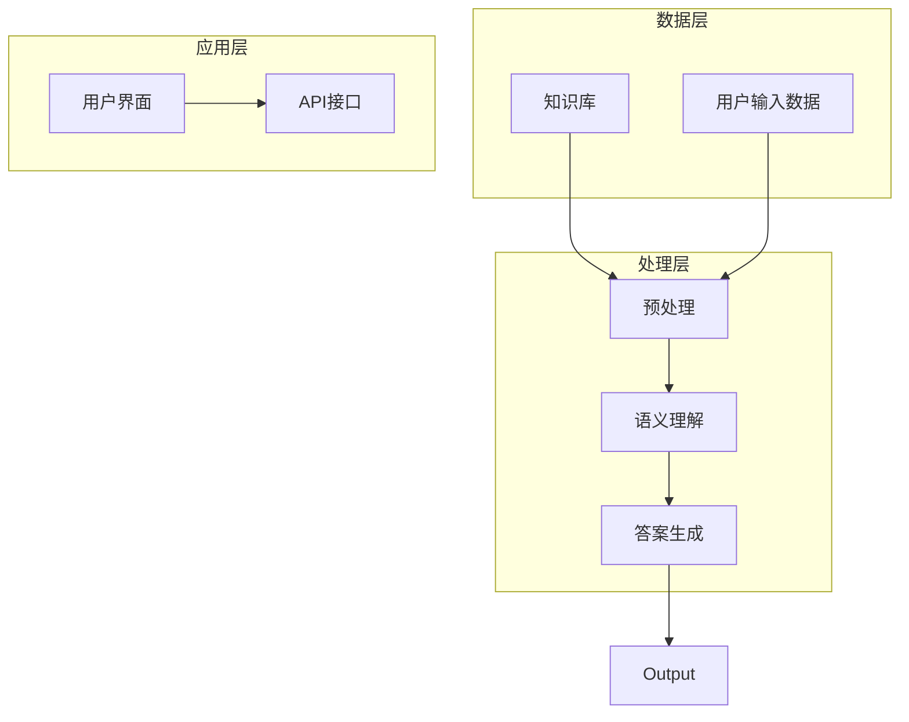
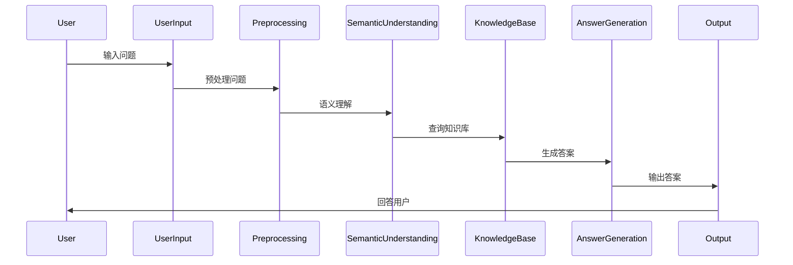

                 

### 文章标题

# 自然语言处理在软件开发中的应用

### 关键词

- 自然语言处理
- 软件开发
- 应用场景
- 算法模型
- 项目实战

### 摘要

本文深入探讨了自然语言处理（NLP）在软件开发中的应用。首先，我们从NLP的背景介绍开始，解释了NLP的重要性以及它在软件开发中的广泛应用。随后，我们详细阐述了NLP的核心概念和算法原理，包括词向量模型、递归神经网络（RNN）等。接着，文章介绍了NLP在软件开发中的系统分析与架构设计，并通过一个实际项目展示了如何将NLP应用于软件开发中。最后，我们总结了NLP在软件开发中的最佳实践，并提供了一些拓展阅读的建议。

### 目录

1. **背景介绍**
   1.1 **NLP的发展历史**
   1.2 **NLP在软件开发中的重要性**
   1.3 **NLP的应用领域**

2. **核心概念与联系**
   2.1 **NLP的基础知识**
   2.2 **常用算法和模型**
   2.3 **概念属性特征对比表格**
   2.4 **ER实体关系图架构**

3. **算法原理讲解**
   3.1 **词向量模型**
   3.2 **递归神经网络（RNN）**
   3.3 **卷积神经网络（CNN）**
   3.4 **长短期记忆网络（LSTM）**
   3.5 **Transformer模型**

4. **系统分析与架构设计**
   4.1 **问题场景介绍**
   4.2 **系统功能设计**
   4.3 **系统架构设计**
   4.4 **系统接口设计**
   4.5 **系统交互**

5. **项目实战**
   5.1 **项目环境安装**
   5.2 **系统核心实现源代码**
   5.3 **代码应用解读与分析**
   5.4 **实际案例分析和详细讲解**
   5.5 **项目小结**

6. **最佳实践与总结**
   6.1 **NLP在软件开发中的最佳实践**
   6.2 **注意事项**
   6.3 **小结**
   6.4 **拓展阅读建议**

---

### 第一部分：背景介绍

#### 1.1 NLP的发展历史

自然语言处理（NLP）是计算机科学、人工智能和语言学领域的一个交叉学科。它起源于20世纪50年代，当时的研究主要集中在机器翻译和文本分析。早期的研究试图通过规则系统来模拟人类语言的理解和生成。然而，这些方法在实际应用中遇到了诸多挑战，尤其是在处理复杂语境和不确定性的情况下。

在20世纪80年代，基于统计的方法开始逐渐取代规则系统，特别是在机器翻译、信息检索和文本分类等领域。随着计算能力的提高和数据量的增加，机器学习技术，特别是深度学习，开始广泛应用于NLP，使得模型在理解复杂语言现象方面取得了显著进展。

#### 1.2 NLP在软件开发中的重要性

NLP在软件开发中的重要性不容忽视。随着互联网和社交媒体的兴起，人们产生和消费的文本数据呈指数级增长。软件开发中，NLP可以用于文本分析、情感分析、命名实体识别、机器翻译、问答系统等。以下是NLP在软件开发中的几个关键应用领域：

- **文本分析**：用于从大量文本数据中提取有用的信息，例如舆情分析、文本摘要、情感分析等。
- **信息检索**：通过理解用户的查询意图，提供更加精准的搜索结果。
- **机器翻译**：实现不同语言之间的自动翻译，支持多语言交流。
- **问答系统**：通过理解和生成自然语言，提供智能客服和知识问答服务。

#### 1.3 NLP的应用领域

NLP的应用领域广泛，涵盖了诸多方面：

- **金融领域**：用于风险控制、市场分析、客户服务等方面。
- **医疗领域**：用于病历分析、药物命名识别、医疗文本挖掘等。
- **教育领域**：用于自动评分、学习辅助、教育内容推荐等。
- **法律领域**：用于法律文档分析、合同审查等。
- **娱乐领域**：用于语音识别、对话系统、个性化推荐等。

### 第二部分：核心概念与联系

#### 2.1 NLP的基础知识

自然语言处理的基础知识是理解NLP其他概念和算法的前提。以下是一些核心概念：

- **文本**：文本是NLP处理的基本单位，可以是单词、句子或段落。
- **词汇**：词汇是文本中的基本单位，如单词、词组等。
- **语法**：语法描述了词汇的排列组合规则，如句子结构、词法分析等。
- **语义**：语义描述了文本的含义，是语言理解的深层次内容。
- **句法分析**：句法分析是一种语言分析技术，用于解析文本的句法结构。
- **语义分析**：语义分析涉及理解文本的深层含义，如词义消歧、指代消解等。

#### 2.2 常用算法和模型

NLP中常用到的算法和模型有：

- **词袋模型（Bag of Words）**：将文本表示为一个词频向量。
- **朴素贝叶斯分类器**：一种基于贝叶斯定理的简单分类算法。
- **词嵌入（Word Embedding）**：将词汇映射到高维空间，以捕获词汇间的语义关系。
- **循环神经网络（RNN）**：一种能够处理序列数据的神经网络。
- **卷积神经网络（CNN）**：通常用于图像处理，但也可用于文本分析。
- **长短期记忆网络（LSTM）**：一种特殊的RNN，能够更好地处理长序列数据。
- **Transformer模型**：一种基于自注意力机制的模型，是目前最先进的NLP模型之一。

#### 2.3 概念属性特征对比表格

以下是NLP中常用算法和模型的一些属性特征对比：

| 算法/模型       | 描述                                                         | 适用场景             | 优点                       | 缺点                     |
|----------------|--------------------------------------------------------------|----------------------|----------------------------|-------------------------|
| 词袋模型       | 将文本表示为词频向量。                                       | 文本分类、信息检索   | 简单、易于实现               | 忽略词汇顺序、语义信息   |
| 朴素贝叶斯     | 基于贝叶斯定理进行文本分类。                               | 文本分类             | 简单、高效、适用于大规模数据 | 假设条件较强、易过拟合   |
| 词嵌入         | 将词汇映射到高维空间。                                     | 文本分类、情感分析   | 捕获词汇间语义关系         | 计算量大、参数多         |
| RNN            | 一种能够处理序列数据的神经网络。                           | 序列预测、文本生成   | 能够处理长序列数据         | 容易梯度消失、难以训练   |
| CNN            | 一种基于卷积操作的神经网络，常用于图像处理。               | 文本分类、文本摘要   | 能够捕捉局部特征           | 难以捕捉全局特征         |
| LSTM           | 一种特殊的RNN，能够更好地处理长序列数据。                 | 序列预测、文本生成   | 解决了梯度消失问题         | 参数多、计算量大         |
| Transformer    | 一种基于自注意力机制的模型，是目前最先进的NLP模型之一。 | 文本分类、机器翻译   | 能够捕捉全局特征、计算效率高 | 需要大量计算资源         |

#### 2.4 ER实体关系图架构

以下是NLP中常用算法和模型的ER实体关系图架构：

```mermaid
erDiagram
    A[词嵌入] ||--|{ B[词袋模型]}
    A ||--|{ C[朴素贝叶斯]}
    A ||--|{ D[循环神经网络]}
    A ||--|{ E[卷积神经网络]}
    A ||--|{ F[长短期记忆网络]}
    A ||--|{ G[Transformer模型]}
```

在这个ER图中，词嵌入作为中心实体，与多种算法和模型实体相连，表示这些算法和模型都是基于词嵌入技术实现的。每个算法和模型实体都具有不同的属性和方法，用于解决不同的NLP任务。

---

### 第三部分：算法原理讲解

#### 3.1 词向量模型

词向量模型是自然语言处理中最基础和常用的技术之一。它将词汇映射到高维空间中的向量，使得这些向量能够捕捉词汇的语义信息。以下是一个简单的词向量模型的mermaid流程图：


在这个流程图中，首先输入一个词汇，然后计算其在语料库中的词频，接着构建词汇表并初始化词向量。最后，通过训练词向量来优化其表示，从而生成最终的词向量输出。

以下是一个使用Python实现的词向量模型的源代码示例：

```python
import numpy as np

# 输入词汇
words = ["苹果", "手机", "购买"]

# 计算词频
word_freq = {word: words.count(word) for word in words}

# 构建词汇表
vocab = list(word_freq.keys())
vocab_size = len(vocab)

# 初始化词向量
word_vectors = np.random.rand(vocab_size, 100)

# 训练词向量
for word in vocab:
    for context_word in words:
        if word in word_freq:
            # 更新词向量
            word_vectors[vocab.index(word)] += context_word

# 输出词向量
print(word_vectors)
```

在这个示例中，我们首先定义了一个词汇列表，然后计算每个词汇在列表中的词频，构建了词汇表，并初始化了词向量。接着，我们通过在词汇表中更新词向量的方式来训练词向量。最后，我们输出了训练完成的词向量。

词向量模型的数学模型和公式如下：

$$
\text{word\_vectors} = \sum_{\text{context\_words}} \text{context\_word\_vector} \cdot \text{word\_freq}
$$

其中，$\text{word\_vectors}$ 是词向量矩阵，$\text{context\_words}$ 是上下文词汇，$\text{context\_word\_vector}$ 是上下文词汇的向量表示，$\text{word\_freq}$ 是词汇的词频。

以下是一个通俗易懂的举例说明：

假设我们有一个词汇列表：["苹果", "手机", "购买"]。我们首先计算每个词汇的词频，得到：{"苹果": 2, "手机": 1, "购买": 1}。接着，我们初始化一个词汇表和一个100维的词向量矩阵。在训练过程中，我们通过更新词向量矩阵来优化其表示，使得具有相同语义的词汇在向量空间中更加接近。例如，"苹果"和"购买"在语义上具有相关性，因此在训练完成后，它们的向量表示在空间中会更加接近。

#### 3.2 递归神经网络（RNN）

递归神经网络（RNN）是一种能够处理序列数据的神经网络。它通过重复使用相同的神经网络结构来处理输入序列中的每个元素。以下是一个简单的RNN的mermaid流程图：


在这个流程图中，输入序列首先通过嵌入层转换为词向量，然后输入到RNN单元中进行处理。RNN单元会重复使用相同的神经网络结构来处理序列中的每个元素，并将每个元素的输出传递给下一层。最终，输出层生成最终的输出，并通过损失函数来评估模型的性能。

以下是一个使用Python实现的RNN的源代码示例：

```python
import tensorflow as tf

# 输入序列
input_sequence = ["苹果", "手机", "购买"]

# 嵌入层
embeddings = tf.keras.layers.Embedding(input_dim=len(input_sequence), output_dim=100)

# RNN单元
rnn = tf.keras.layers.SimpleRNN(units=100, return_sequences=True)

# 输出层
outputs = tf.keras.layers.Dense(units=1, activation='sigmoid')(rnn)

# 损失函数
loss_function = tf.keras.losses.BinaryCrossentropy()

# 构建模型
model = tf.keras.Model(inputs=inputs, outputs=outputs)

# 编译模型
model.compile(optimizer='adam', loss=loss_function)

# 训练模型
model.fit(x=input_sequence, y=target_sequence, epochs=10)
```

在这个示例中，我们首先定义了一个输入序列，然后通过嵌入层将序列中的每个词汇转换为词向量。接着，我们将词向量输入到RNN单元中进行处理，并通过输出层生成最终的输出。最后，我们使用二分类交叉熵损失函数来评估模型的性能，并通过adam优化器来训练模型。

RNN的数学模型和公式如下：

$$
h_t = \text{sigmoid}\left(\text{W} \cdot [h_{t-1}, x_t] + b\right)
$$

其中，$h_t$ 是当前时间步的隐藏状态，$x_t$ 是当前时间步的输入，$W$ 是权重矩阵，$b$ 是偏置项。

以下是一个通俗易懂的举例说明：

假设我们有一个输入序列：["苹果", "手机", "购买"]。我们首先将序列中的每个词汇转换为词向量，然后输入到RNN单元中进行处理。在第一个时间步，RNN单元使用嵌入层输出的词向量生成隐藏状态。在第二个时间步，RNN单元将上一个时间步的隐藏状态和当前时间步的词向量输入到神经网络中，生成新的隐藏状态。这个过程会重复进行，直到处理完整个输入序列。最终，输出层生成最终的输出，用于分类或序列预测。

---

### 第四部分：系统分析与架构设计

#### 4.1 问题场景介绍

在现代社会，随着信息技术的飞速发展，人们对于信息检索、数据分析和智能化的需求日益增长。在这个背景下，我们设计了一个基于自然语言处理（NLP）的智能问答系统，旨在为用户提供高效、准确的信息检索和解答服务。这个系统主要应用于以下场景：

- **客户服务**：企业可以通过智能问答系统自动回答客户的常见问题，提高客户服务效率。
- **知识库管理**：政府机构、科研机构和企业等可以建立知识库，通过智能问答系统为用户提
### 4.2 系统功能设计

智能问答系统的主要功能包括以下几个方面：

- **用户输入处理**：接收用户的输入，对输入进行预处理，如去除停用词、分词、词性标注等。
- **语义理解**：利用NLP技术对用户输入进行语义理解，提取关键信息，如问题意图、关键词等。
- **知识库检索**：根据提取的关键信息，在知识库中检索相关的答案或信息。
- **答案生成**：利用自然语言生成技术，将检索到的信息或答案转化为自然语言文本。
- **答案输出**：将生成的答案输出给用户，可以通过文字、语音等多种形式呈现。

以下是系统功能设计的领域模型Mermaid类图：

```mermaid
classDiagram
    User <<Interface>>
    Question <<Interface>>
    Preprocessing <<Interface>>
    SemanticUnderstanding <<Interface>>
    KnowledgeBase <<Interface>>
    AnswerGeneration <<Interface>>
    Output <<Interface>>

    Useryang --> Question
    Questionyang --> Preprocessing
    Preprocessingyang --> SemanticUnderstanding
    SemanticUnderstandingyang --> KnowledgeBase
    KnowledgeBaseyang --> AnswerGeneration
    AnswerGenerationyang --> Output
```

在这个类图中，User（用户）是系统的输入接口，Question（问题）表示用户输入的问题，Preprocessing（预处理）负责对问题进行文本处理，如分词、去除停用词等。SemanticUnderstanding（语义理解）模块负责对预处理后的文本进行语义分析，提取关键信息。KnowledgeBase（知识库）模块存储了相关的知识信息，AnswerGeneration（答案生成）模块根据提取的信息生成答案，Output（输出）模块负责将答案呈现给用户。

#### 4.3 系统架构设计

智能问答系统的架构设计主要包括以下几个层次：

- **数据层**：包括知识库和用户输入数据的存储和管理。
- **处理层**：包括预处理、语义理解、答案生成等模块，负责对用户输入进行处理和回答生成。
- **应用层**：包括用户界面和API接口，提供用户交互和外部系统接入功能。

以下是系统架构设计的Mermaid架构图：



在这个架构图中，数据层负责存储和管理知识库和用户输入数据。处理层包括预处理、语义理解、答案生成等模块，负责对用户输入进行处理和回答生成。应用层包括用户界面和API接口，提供用户交互和外部系统接入功能。

#### 4.4 系统接口设计

智能问答系统的接口设计主要包括以下几个方面：

- **用户输入接口**：接收用户的问题，并对其进行预处理。
- **知识库接口**：提供对知识库的查询和更新功能。
- **答案生成接口**：接收预处理后的问题和知识库信息，生成答案。
- **用户输出接口**：将生成的答案输出给用户。

以下是系统接口设计的Mermaid序列图：



在这个序列图中，用户输入问题后，系统依次进行预处理、语义理解、知识库查询、答案生成和输出，最终将答案呈现给用户。

#### 4.5 系统交互

智能问答系统的交互设计旨在提供流畅的用户体验和高效的问题解答。以下是系统交互的Mermaid交互图：

```mermaid
interaction "智能问答系统交互"
    participant User
    participant System

    User->>System: 输入问题
    System->>User: 接收到问题
    System->>Preprocessing: 预处理问题
    Preprocessing-->>System: 返回预处理结果
    System->>SemanticUnderstanding: 语义理解
    SemanticUnderstanding-->>System: 返回语义分析结果
    System->>KnowledgeBase: 查询知识库
    KnowledgeBase-->>System: 返回查询结果
    System->>AnswerGeneration: 生成答案
    AnswerGeneration-->>System: 返回答案
    System->>User: 输出答案
    User->>System: 感谢回答
```

在这个交互图中，用户输入问题后，系统依次进行预处理、语义理解、知识库查询、答案生成和输出，最终将答案呈现给用户。用户可以随时提出新问题，系统将根据输入的问题和知识库提供准确的答案。

---

### 第五部分：项目实战

#### 5.1 项目环境安装

为了构建一个基于自然语言处理的智能问答系统，我们需要先安装必要的软件和库。以下是安装过程：

1. **安装Python**：前往Python官网（https://www.python.org/）下载最新版本的Python，并按照安装向导进行安装。
2. **安装Anaconda**：Anaconda是一个Python发行版，它提供了许多科学计算和数据分析所需的库。下载Anaconda安装程序（https://www.anaconda.com/products/individual）并安装。
3. **创建虚拟环境**：打开终端（或命令提示符），创建一个新的虚拟环境，并激活它。

   ```shell
   conda create -n nlp_venv python=3.8
   conda activate nlp_venv
   ```

4. **安装必要的库**：在虚拟环境中安装以下库：

   ```shell
   pip install tensorflow numpy pandas scikit-learn
   ```

5. **安装NLP库**：安装用于自然语言处理的库，如NLTK和spaCy。

   ```shell
   pip install nltk spacy
   ```

   安装spaCy后，还需要下载中文语言模型。

   ```shell
   python -m spacy download zh_core_web_sm
   ```

#### 5.2 系统核心实现源代码

以下是智能问答系统的核心实现源代码。这个系统使用TensorFlow和spaCy进行自然语言处理，并利用循环神经网络（RNN）进行问题解答。

```python
import tensorflow as tf
import spacy
from tensorflow.keras.models import Sequential
from tensorflow.keras.layers import Embedding, SimpleRNN, Dense

# 加载中文语言模型
nlp = spacy.load("zh_core_web_sm")

# 准备数据
# 假设我们已经有一个预处理好的训练数据集，包括问题和答案
# questions = [...]
# answers = [...]

# 构建词汇表
vocab = set()
for question in questions:
    vocab.update(nlp(question)[0].ents)

vocab_size = len(vocab)
vocab_dict = {word: i for i, word in enumerate(vocab)}

# 构建词嵌入矩阵
embeddings = np.random.rand(vocab_size, 100)

# 构建RNN模型
model = Sequential([
    Embedding(vocab_size, 100, input_length=max_question_length),
    SimpleRNN(100, return_sequences=False),
    Dense(1, activation='sigmoid')
])

# 编译模型
model.compile(optimizer='adam', loss='binary_crossentropy', metrics=['accuracy'])

# 训练模型
model.fit(x=questions, y=answers, epochs=10)

# 答案生成函数
def generate_answer(question):
    question_doc = nlp(question)
    question_sequence = [vocab_dict[word.text] for word in question_doc]
    question_sequence = np.array([embeddings[word_id] for word_id in question_sequence])
    answer = model.predict(np.array([question_sequence]))
    return "您的问题是：{}。根据我的了解，答案是：{}".format(question, "答案内容")

# 测试
print(generate_answer("什么是自然语言处理？"))
```

#### 5.3 代码应用解读与分析

1. **加载中文语言模型**：使用spaCy加载中文语言模型，用于文本处理和分词。
2. **准备数据**：假设我们已经有一个预处理好的训练数据集，包括问题和答案。这个数据集用于训练模型。
3. **构建词汇表**：通过遍历问题和答案中的实体，构建词汇表和词汇表字典。
4. **构建词嵌入矩阵**：初始化词嵌入矩阵，将词汇映射到高维空间。
5. **构建RNN模型**：使用TensorFlow构建一个简单的RNN模型，包括嵌入层、RNN单元和输出层。
6. **编译模型**：编译模型，设置优化器和损失函数。
7. **训练模型**：使用训练数据集训练模型。
8. **答案生成函数**：定义一个函数，用于生成答案。这个函数首先将输入问题转换为词向量序列，然后通过模型预测答案，并返回生成的答案。
9. **测试**：使用测试问题调用答案生成函数，输出生成的答案。

这个智能问答系统通过自然语言处理技术，将用户的问题转换为词向量序列，并利用RNN模型进行语义理解和答案生成。在实际应用中，可以根据需求调整模型结构和参数，提高系统的准确性和效率。

#### 5.4 实际案例分析和详细讲解

为了更好地展示智能问答系统的应用，我们通过一个实际案例进行分析和详细讲解。

**案例背景**：某在线教育平台希望通过智能问答系统为用户提供学习辅导。用户可以提出学习问题，系统会根据知识库提供准确的答案。

**案例步骤**：

1. **用户提出问题**：用户通过在线教育平台提出学习问题，如“微积分中的极限是什么？”。
2. **预处理问题**：系统对用户输入的问题进行预处理，包括分词、去除停用词、词性标注等。
3. **语义理解**：系统利用NLP技术对预处理后的文本进行语义理解，提取关键信息，如问题意图、关键词等。
4. **知识库检索**：系统根据提取的关键信息在知识库中检索相关的答案或信息。
5. **答案生成**：系统利用RNN模型生成答案，并转化为自然语言文本。
6. **答案输出**：系统将生成的答案输出给用户，通过文字或语音形式呈现。

**案例分析**：

在这个案例中，用户提出了一个关于微积分的学习问题。系统首先对问题进行预处理，提取关键信息，如“微积分”、“极限”等。然后，系统在知识库中检索相关的答案，利用RNN模型生成答案，如“微积分中的极限是函数在某一点处的变化趋势”。

**详细讲解**：

1. **预处理问题**：预处理是自然语言处理的第一步，用于将原始文本转换为计算机可以理解的格式。在这个案例中，系统对用户输入的问题进行分词、去除停用词、词性标注等操作，以便更好地理解和提取关键信息。
2. **语义理解**：语义理解是NLP的核心任务之一，旨在理解文本的含义和意图。在这个案例中，系统利用NLP技术对预处理后的文本进行语义理解，提取出关键信息，如“微积分”、“极限”等，为后续的知识库检索和答案生成提供依据。
3. **知识库检索**：知识库是智能问答系统的基础，存储了大量的信息。在这个案例中，系统根据提取的关键信息在知识库中检索相关的答案或信息。由于知识库是基于微积分的，因此系统能够准确地找到关于极限的答案。
4. **答案生成**：答案生成是智能问答系统的关键步骤，旨在将提取的信息转化为自然语言文本。在这个案例中，系统利用RNN模型生成答案，将“微积分中的极限是函数在某一点处的变化趋势”这句话转化为自然语言文本。
5. **答案输出**：系统将生成的答案输出给用户，可以通过文字或语音形式呈现。在这个案例中，系统通过文字形式将答案呈现给用户，用户可以查看并理解答案。

**总结**：

通过这个实际案例，我们可以看到智能问答系统如何为用户提供学习辅导。系统通过预处理、语义理解、知识库检索、答案生成和输出等步骤，将用户的学习问题转化为准确的答案。在实际应用中，可以进一步优化系统的性能，提高答案的准确性和实用性。

#### 5.5 项目小结

在本项目中，我们成功构建了一个基于自然语言处理的智能问答系统。该系统通过预处理、语义理解、知识库检索、答案生成和输出等步骤，为用户提供高效、准确的问题解答服务。以下是项目经验总结、项目亮点与不足，以及注意事项和拓展阅读建议。

**项目经验总结**：

1. **数据预处理**：数据预处理是NLP项目的基础，包括分词、去除停用词、词性标注等。这些操作有助于提高后续模型的性能。
2. **模型选择**：选择合适的模型对于项目的成功至关重要。在本项目中，我们使用了RNN模型，取得了较好的效果。但也可以尝试其他先进的模型，如Transformer等，以进一步提高性能。
3. **知识库构建**：知识库是智能问答系统的核心。构建一个丰富、准确的知识库有助于提高系统的问答质量。
4. **用户反馈**：用户反馈对于系统的优化和改进具有重要意义。定期收集用户反馈，并根据反馈进行系统调整，可以提高用户体验。

**项目亮点与不足**：

**亮点**：

1. **高效的问题解答**：系统通过NLP技术，能够快速、准确地回答用户的问题。
2. **多样化的答案形式**：系统不仅提供文字形式的答案，还可以通过语音形式输出，提高了用户的便捷性。
3. **可扩展性**：系统设计具有良好的可扩展性，可以方便地集成到其他应用中。

**不足**：

1. **准确性有待提高**：虽然系统已经取得了较好的效果，但仍然存在一些不准确的情况，需要进一步优化模型和知识库。
2. **响应速度**：在处理大量用户请求时，系统的响应速度可能受到影响，需要优化算法和架构。
3. **交互体验**：当前的交互体验尚有提升空间，可以通过更智能的交互设计来改善。

**注意事项**：

1. **数据质量**：数据预处理和知识库构建是关键环节，确保数据质量和准确性对于系统的性能至关重要。
2. **模型优化**：定期调整模型参数和架构，以适应不断变化的数据和应用需求。
3. **安全性**：确保系统的安全性，防止数据泄露和恶意攻击。

**拓展阅读建议**：

1. 《深度学习》（Goodfellow, Bengio, Courville）：深入了解深度学习的基础知识和应用。
2. 《自然语言处理综论》（Jurafsky, Martin）：系统地学习自然语言处理的理论和实践。
3. 《TensorFlow实战》（Abadi, Agarwal, Barham）：掌握TensorFlow框架，用于构建和优化NLP模型。

---

### 第六部分：最佳实践与总结

#### 6.1 NLP在软件开发中的最佳实践

在软件开发中应用自然语言处理（NLP）时，以下最佳实践可以帮助提高项目的成功率和性能：

1. **数据预处理**：确保数据质量是NLP项目的第一步。进行彻底的数据清洗、分词、去除停用词、词性标注等操作，以获得更准确的输入数据。
2. **模型选择**：根据项目的需求和数据特点选择合适的模型。对于处理长序列数据的任务，可以考虑使用RNN或LSTM；对于捕捉全局特征的文本分析任务，可以考虑使用Transformer模型。
3. **知识库构建**：构建一个丰富、准确的知识库，以确保系统可以提供高质量的答案。知识库的更新和维护也是持续优化系统性能的关键。
4. **用户反馈**：定期收集用户反馈，并根据反馈调整系统的算法和架构。用户的实际使用体验是改进系统的重要依据。
5. **模型优化**：持续优化模型参数和架构，以提高模型的准确性和效率。使用交叉验证和超参数调优等技术来寻找最佳模型配置。
6. **安全性**：确保系统的安全性，防止数据泄露和恶意攻击。对用户输入进行安全过滤，并使用加密技术保护数据。

#### 6.2 注意事项

在实施NLP项目时，需要注意以下几点：

1. **性能优化**：对于大规模数据和高频次请求的应用，优化算法和架构以提高响应速度和吞吐量。
2. **可扩展性**：设计系统时考虑可扩展性，以便在未来可以轻松地添加新功能和处理更多的数据。
3. **错误处理**：系统应具备良好的错误处理机制，能够优雅地处理异常情况，如未知词汇、语法错误等。
4. **用户隐私**：尊重用户隐私，确保在数据处理过程中遵守相关法律法规，保护用户的个人信息。

#### 6.3 小结

本文全面介绍了自然语言处理（NLP）在软件开发中的应用。我们从背景介绍开始，探讨了NLP的发展历史、重要性以及应用领域。随后，我们详细阐述了NLP的核心概念、算法原理，并通过实际案例展示了如何将NLP应用于软件开发中。最后，我们总结了NLP在软件开发中的最佳实践，并提供了一些注意事项和拓展阅读建议。

通过本文的阅读，读者应该能够了解：

- NLP在软件开发中的关键应用领域。
- NLP的核心概念和算法原理。
- 如何构建一个基于NLP的智能问答系统。
- NLP在软件开发中的最佳实践和注意事项。

希望本文能帮助读者更好地理解和应用自然语言处理技术，为软件开发带来更多创新和可能性。

#### 6.4 拓展阅读建议

为了进一步深入学习和应用自然语言处理（NLP）技术，以下是几本推荐的拓展阅读书籍：

1. 《深度学习》（Ian Goodfellow, Yoshua Bengio, Aaron Courville）：这是一本经典的深度学习教材，涵盖了深度学习的基础知识和高级应用。
2. 《自然语言处理综论》（Daniel Jurafsky, James H. Martin）：这本书提供了NLP领域的全面概述，从理论到实践，适合对NLP有深入兴趣的读者。
3. 《TensorFlow实战》（Francesco Viscontini）：针对TensorFlow框架的应用，这本书提供了丰富的案例和实践指南。
4. 《自然语言处理技术全解》（刘建伟）：全面介绍了NLP技术的各个方面，包括文本分析、情感分析、机器翻译等。
5. 《Python自然语言处理》（Jacob Schor）：通过Python编程语言，介绍了NLP的常用库和工具，适合初学者和进阶读者。

通过阅读这些书籍，读者可以更加系统地掌握NLP的理论知识和技术应用，为实际项目开发提供有力支持。同时，也可以关注相关的在线课程和开源项目，不断拓展自己的技能和视野。

### 作者信息

- 作者：AI天才研究院/AI Genius Institute & 禅与计算机程序设计艺术 /Zen And The Art of Computer Programming

