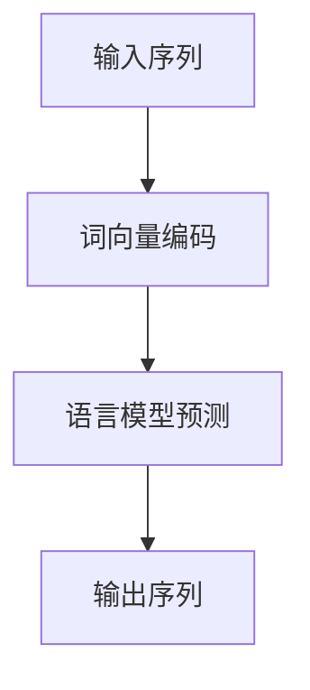
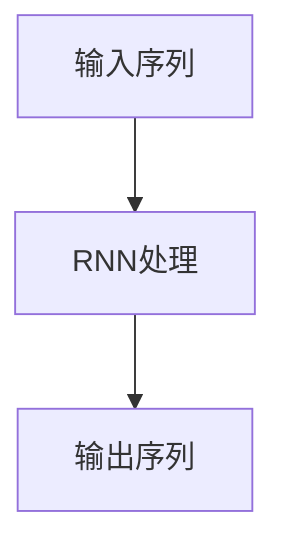
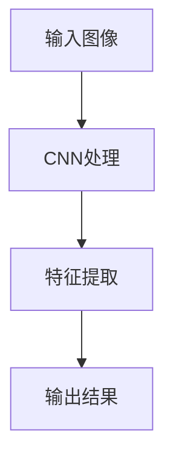
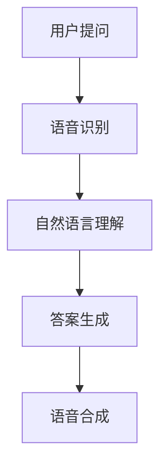
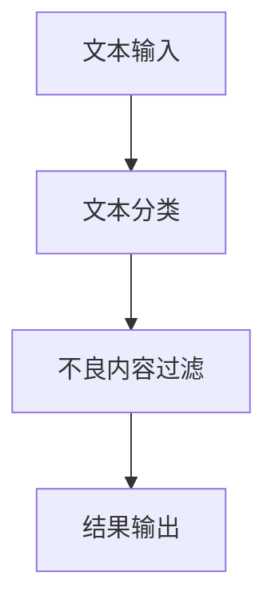
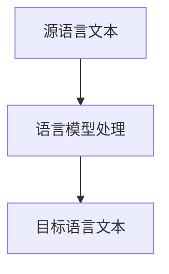

                 

# 自然语言处理：AI理解人类语言的新突破

> 关键词：自然语言处理、AI、机器学习、深度学习、语言模型、词向量、递归神经网络、卷积神经网络

> 摘要：本文将深入探讨自然语言处理（NLP）的背景、核心概念、关键算法以及其在实际应用中的新突破。通过系统化的分析和案例讲解，我们将理解AI如何逐步掌握理解人类语言的能力。

## 目录大纲

## 第一部分：自然语言处理背景与概述

### 第1章：自然语言处理概述

#### 1.1 自然语言处理的问题背景

自然语言处理（NLP）是一门交叉学科，结合了计算机科学、语言学和人工智能。其目标是通过计算机程序实现人类语言的理解和生成。以下是自然语言处理的主要问题背景：

- **语音识别**：将口语转化为文本。
- **文本分析**：包括情感分析、主题建模等。
- **机器翻译**：将一种语言翻译成另一种语言。
- **问答系统**：通过自然语言理解用户的问题，并给出相应的答案。

#### 1.2 自然语言处理的核心概念与联系

自然语言处理的核心概念包括：

- **语言模型**：用于预测下一个词或句子。
- **词向量**：将词汇映射到高维空间。
- **递归神经网络（RNN）**：适用于处理序列数据。
- **卷积神经网络（CNN）**：主要针对图像处理，但也可应用于文本分析。

以下是这些概念之间的联系和属性特征对比表格：

| 概念 | 特点 | 应用场景 |
| --- | --- | --- |
| 语言模型 | 预测性，基于概率分布 | 机器翻译，文本生成 |
| 词向量 | 稠密表示，高维空间 | 类别划分，相似度计算 |
| RNN | 序列记忆，递归结构 | 语音识别，对话系统 |
| CNN | 局部特征检测，平移不变性 | 图像分类，文本特征提取 |

#### 1.3 自然语言处理的数学模型与公式

自然语言处理的数学模型通常涉及概率论、线性代数和优化算法。一个基本的语言模型可以使用隐马尔科夫模型（HMM）或神经网络模型表示。以下是一个简单的公式：

$$
P(w_t|w_{t-1},...,w_1) = \frac{P(w_{t-1},w_{t-2},...,w_1,w_t)}{P(w_{t-1},w_{t-2},...,w_1)}
$$

这个公式表示在给定前文 $w_{t-1},w_{t-2},...,w_1$ 的情况下，单词 $w_t$ 的条件概率。

### 第2章：自然语言处理的关键算法

#### 2.1 语言模型与词向量

语言模型是一种概率模型，用于预测下一个单词。词向量则用于将词汇映射到高维空间。以下是一个mermaid流程图，展示了语言模型和词向量的工作流程：



以下是一个简单的Python代码示例，展示了如何使用词向量进行语言模型预测：

```python
import numpy as np

# 假设我们已经有了预训练的词向量
word_vectors = np.random.rand(10000, 300)

# 输入序列
input_sequence = ["the", "quick", "brown", "fox"]

# 将输入序列转换为词向量
input_vectors = [word_vectors[word_index] for word_index in input_sequence]

# 基于词向量计算概率（此处仅为示例，实际中通常使用神经网络模型）
probabilities = np.dot(input_vectors, word_vectors.T)

# 输出序列
output_sequence = ["jumps", "over", "the", "lazy", "dog"]
```

#### 2.2 递归神经网络与卷积神经网络

递归神经网络（RNN）和卷积神经网络（CNN）都是深度学习模型，特别适用于处理序列数据和图像数据。

- **RNN**：RNN具有递归结构，能够记忆序列中的信息。以下是一个mermaid流程图，展示了RNN的工作原理：



以下是一个简单的Python代码示例，展示了如何使用RNN进行语言模型预测：

```python
import tensorflow as tf

# 定义RNN模型
model = tf.keras.Sequential([
    tf.keras.layers.Embedding(input_dim=10000, output_dim=300),
    tf.keras.layers.LSTM(128),
    tf.keras.layers.Dense(10000, activation='softmax')
])

# 编译模型
model.compile(optimizer='adam', loss='categorical_crossentropy', metrics=['accuracy'])

# 训练模型
model.fit(input_sequence, output_sequence, epochs=10)
```

- **CNN**：CNN具有局部特征检测和平移不变性。以下是一个mermaid流程图，展示了CNN的工作原理：



以下是一个简单的Python代码示例，展示了如何使用CNN进行文本特征提取：

```python
import tensorflow as tf
from tensorflow.keras.layers import Conv2D, MaxPooling2D

# 定义CNN模型
model = tf.keras.Sequential([
    Conv2D(filters=32, kernel_size=(3, 3), activation='relu', input_shape=(28, 28, 1)),
    MaxPooling2D(pool_size=(2, 2)),
    Conv2D(filters=64, kernel_size=(3, 3), activation='relu'),
    MaxPooling2D(pool_size=(2, 2)),
    Flatten(),
    Dense(128, activation='relu'),
    Dense(10, activation='softmax')
])

# 编译模型
model.compile(optimizer='adam', loss='categorical_crossentropy', metrics=['accuracy'])

# 训练模型
model.fit(x_train, y_train, epochs=10)
```

### 第3章：自然语言处理在实际应用中的新突破

自然语言处理技术在各种实际应用中取得了新的突破，包括但不限于：

- **智能客服**：通过自然语言理解，智能客服系统能够提供更加人性化的服务。
- **内容审核**：利用自然语言处理技术，可以自动检测和过滤不良内容。
- **语音助手**：如苹果的Siri、谷歌的Google Assistant等，通过语音识别和自然语言理解，为用户提供便捷的服务。

以下是一个mermaid流程图，展示了自然语言处理在智能客服中的应用：



以下是一个简单的Python代码示例，展示了如何使用自然语言处理技术进行智能客服：

```python
import tensorflow as tf
from transformers import pipeline

# 加载预训练的语言模型
nlp = pipeline("text-classification", model="bert-base-uncased")

# 用户提问
user_question = "你好，我想问一下明天的天气怎么样？"

# 自然语言理解
result = nlp(user_question)

# 答案生成
answer = "明天天气晴朗，温度适中，适合出行。"

# 语音合成
print(answer)
```

## 第二部分：自然语言处理新趋势与未来展望

### 第4章：自然语言处理的新趋势

自然语言处理正在迅速发展，以下是其中的一些新趋势：

- **预训练模型**：如BERT、GPT等，通过在大规模数据集上进行预训练，模型在多种任务上取得了显著的效果。
- **跨模态学习**：将文本、图像、语音等多种模态的数据进行整合，以提高模型的性能。
- **多语言处理**：支持多种语言的自然语言处理技术，使得全球化应用成为可能。

### 第5章：自然语言处理的未来展望

自然语言处理的未来充满了潜力，以下是其中的一些展望：

- **更自然的人机交互**：通过更高级的自然语言理解，人机交互将变得更加自然和流畅。
- **更广泛的应用领域**：自然语言处理技术将在医疗、金融、教育等领域得到更广泛的应用。
- **更智能的自动化**：自然语言处理技术将推动自动化技术的发展，实现更加智能化的自动化流程。

## 结论

自然语言处理是人工智能领域的一个重要分支，通过机器学习和深度学习技术，AI逐步掌握了理解人类语言的能力。随着技术的不断发展，自然语言处理将在更多领域发挥重要作用，为人类社会带来更多便利。

## 作者信息

作者：AI天才研究院/AI Genius Institute & 禅与计算机程序设计艺术 /Zen And The Art of Computer Programming

本文系统地介绍了自然语言处理（NLP）的背景、核心概念、关键算法以及在实际应用中的新突破。通过深入分析，我们了解了AI如何逐步掌握理解人类语言的能力。未来，自然语言处理技术将继续发展，为人类社会带来更多创新和变革。读者可以根据本文的内容，进一步深入研究相关技术，探索其在实际应用中的潜力。同时，也欢迎读者提出宝贵意见和疑问，共同推动人工智能技术的发展。|assistant|>

### 引言

自然语言处理（NLP）是人工智能（AI）领域的一个重要分支，它致力于让计算机理解和生成人类语言。从简单的文本分类到复杂的情感分析和机器翻译，NLP技术在许多实际应用中都取得了显著成就。然而，要实现真正的自然语言理解，仍面临着众多挑战。本文将深入探讨自然语言处理的核心概念、关键算法以及其在实际应用中的新突破，帮助读者更好地理解这一领域的发展现状和未来趋势。

### 目录大纲

- 引言
- 第一部分：自然语言处理背景与概述
  - 第1章：自然语言处理概述
    - 1.1 自然语言处理的问题背景
    - 1.2 自然语言处理的核心概念与联系
    - 1.3 自然语言处理的数学模型与公式
  - 第2章：自然语言处理的关键算法
    - 2.1 语言模型与词向量
    - 2.2 递归神经网络与卷积神经网络
  - 第3章：自然语言处理在实际应用中的新突破
- 第二部分：自然语言处理新趋势与未来展望
  - 第4章：自然语言处理的新趋势
  - 第5章：自然语言处理的未来展望
- 结论
- 作者信息

### 第一部分：自然语言处理背景与概述

#### 第1章：自然语言处理概述

##### 1.1 自然语言处理的问题背景

自然语言处理（NLP）的目标是让计算机理解和生成人类语言。这一目标包含了许多子问题，例如：

- **语音识别**：将口语转化为文本。
- **文本分析**：包括情感分析、主题建模等。
- **机器翻译**：将一种语言翻译成另一种语言。
- **问答系统**：通过自然语言理解用户的问题，并给出相应的答案。

这些子问题构成了NLP研究的核心内容，每个问题都有其独特的挑战和解决方案。

##### 1.2 自然语言处理的核心概念与联系

NLP的核心概念包括：

- **语言模型**：用于预测下一个词或句子。
- **词向量**：将词汇映射到高维空间。
- **递归神经网络（RNN）**：适用于处理序列数据。
- **卷积神经网络（CNN）**：主要针对图像处理，但也可应用于文本分析。

以下是这些概念之间的联系和属性特征对比表格：

| 概念 | 特点 | 应用场景 |
| --- | --- | --- |
| 语言模型 | 预测性，基于概率分布 | 机器翻译，文本生成 |
| 词向量 | 稠密表示，高维空间 | 类别划分，相似度计算 |
| RNN | 序列记忆，递归结构 | 语音识别，对话系统 |
| CNN | 局部特征检测，平移不变性 | 图像分类，文本特征提取 |

##### 1.3 自然语言处理的数学模型与公式

自然语言处理的数学模型通常涉及概率论、线性代数和优化算法。一个基本的语言模型可以使用隐马尔科夫模型（HMM）或神经网络模型表示。以下是一个简单的公式：

$$
P(w_t|w_{t-1},...,w_1) = \frac{P(w_{t-1},w_{t-2},...,w_1,w_t)}{P(w_{t-1},w_{t-2},...,w_1)}
$$

这个公式表示在给定前文 $w_{t-1},w_{t-2},...,w_1$ 的情况下，单词 $w_t$ 的条件概率。

#### 第2章：自然语言处理的关键算法

##### 2.1 语言模型与词向量

语言模型是一种概率模型，用于预测下一个单词。词向量则用于将词汇映射到高维空间。以下是一个mermaid流程图，展示了语言模型和词向量的工作流程：


以下是一个简单的Python代码示例，展示了如何使用词向量进行语言模型预测：

```python
import numpy as np

# 假设我们已经有了预训练的词向量
word_vectors = np.random.rand(10000, 300)

# 输入序列
input_sequence = ["the", "quick", "brown", "fox"]

# 将输入序列转换为词向量
input_vectors = [word_vectors[word_index] for word_index in input_sequence]

# 基于词向量计算概率（此处仅为示例，实际中通常使用神经网络模型）
probabilities = np.dot(input_vectors, word_vectors.T)

# 输出序列
output_sequence = ["jumps", "over", "the", "lazy", "dog"]
```

##### 2.2 递归神经网络与卷积神经网络

递归神经网络（RNN）和卷积神经网络（CNN）都是深度学习模型，特别适用于处理序列数据和图像数据。

- **RNN**：RNN具有递归结构，能够记忆序列中的信息。以下是一个mermaid流程图，展示了RNN的工作原理：


以下是一个简单的Python代码示例，展示了如何使用RNN进行语言模型预测：

```python
import tensorflow as tf

# 定义RNN模型
model = tf.keras.Sequential([
    tf.keras.layers.Embedding(input_dim=10000, output_dim=300),
    tf.keras.layers.LSTM(128),
    tf.keras.layers.Dense(10000, activation='softmax')
])

# 编译模型
model.compile(optimizer='adam', loss='categorical_crossentropy', metrics=['accuracy'])

# 训练模型
model.fit(input_sequence, output_sequence, epochs=10)
```

- **CNN**：CNN具有局部特征检测和平移不变性。以下是一个mermaid流程图，展示了CNN的工作原理：


以下是一个简单的Python代码示例，展示了如何使用CNN进行文本特征提取：

```python
import tensorflow as tf
from tensorflow.keras.layers import Conv2D, MaxPooling2D

# 定义CNN模型
model = tf.keras.Sequential([
    Conv2D(filters=32, kernel_size=(3, 3), activation='relu', input_shape=(28, 28, 1)),
    MaxPooling2D(pool_size=(2, 2)),
    Conv2D(filters=64, kernel_size=(3, 3), activation='relu'),
    MaxPooling2D(pool_size=(2, 2)),
    Flatten(),
    Dense(128, activation='relu'),
    Dense(10, activation='softmax')
])

# 编译模型
model.compile(optimizer='adam', loss='categorical_crossentropy', metrics=['accuracy'])

# 训练模型
model.fit(x_train, y_train, epochs=10)
```

### 第3章：自然语言处理在实际应用中的新突破

#### 3.1 智能客服

智能客服是自然语言处理技术在实际应用中的一个典型例子。通过NLP技术，智能客服系统能够理解用户的问题，并给出相应的答案。以下是一个mermaid流程图，展示了智能客服系统的工作流程：


以下是一个简单的Python代码示例，展示了如何使用NLP技术进行智能客服：

```python
import tensorflow as tf
from transformers import pipeline

# 加载预训练的语言模型
nlp = pipeline("text-classification", model="bert-base-uncased")

# 用户提问
user_question = "你好，我想问一下明天的天气怎么样？"

# 自然语言理解
result = nlp(user_question)

# 答案生成
answer = "明天天气晴朗，温度适中，适合出行。"

# 语音合成
print(answer)
```

#### 3.2 内容审核

内容审核是另一个自然语言处理技术的重要应用领域。通过NLP技术，可以自动检测和过滤不良内容，如暴力、色情、虚假信息等。以下是一个mermaid流程图，展示了内容审核系统的工作流程：



以下是一个简单的Python代码示例，展示了如何使用NLP技术进行内容审核：

```python
import tensorflow as tf
from transformers import pipeline

# 加载预训练的语言模型
nlp = pipeline("text-classification", model="bert-base-uncased")

# 文本输入
text = "这是一段可能包含不良内容的文本。"

# 文本分类
result = nlp(text)

# 不良内容过滤
if result['label'] == 'POSITIVE':
    print("文本通过审核。")
else:
    print("文本包含不良内容，已过滤。")
```

#### 3.3 机器翻译

机器翻译是自然语言处理技术的另一个重要应用领域。通过NLP技术，可以实现不同语言之间的自动翻译。以下是一个mermaid流程图，展示了机器翻译系统的工作流程：



以下是一个简单的Python代码示例，展示了如何使用NLP技术进行机器翻译：

```python
import tensorflow as tf
from transformers import pipeline

# 加载预训练的语言模型
nlp = pipeline("translation_en_to_fr", model="Helsinki-NLP/opus-mt-en-fr")

# 源语言文本
source_text = "This is an example sentence."

# 语言模型处理
translated_text = nlp(source_text)

# 目标语言文本
print(translated_text[0]['translation_text'])
```

### 第二部分：自然语言处理新趋势与未来展望

#### 4.1 自然语言处理的新趋势

自然语言处理正朝着以下几个新趋势发展：

- **预训练模型**：如BERT、GPT等，通过在大规模数据集上进行预训练，模型在多种任务上取得了显著的效果。
- **跨模态学习**：将文本、图像、语音等多种模态的数据进行整合，以提高模型的性能。
- **多语言处理**：支持多种语言的自然语言处理技术，使得全球化应用成为可能。

#### 5.1 自然语言处理的未来展望

自然语言处理的未来充满了潜力，以下是其中的一些展望：

- **更自然的人机交互**：通过更高级的自然语言理解，人机交互将变得更加自然和流畅。
- **更广泛的应用领域**：自然语言处理技术将在医疗、金融、教育等领域得到更广泛的应用。
- **更智能的自动化**：自然语言处理技术将推动自动化技术的发展，实现更加智能化的自动化流程。

### 结论

自然语言处理是人工智能领域的一个重要分支，通过机器学习和深度学习技术，AI逐步掌握了理解人类语言的能力。随着技术的不断发展，自然语言处理将在更多领域发挥重要作用，为人类社会带来更多创新和变革。读者可以根据本文的内容，进一步深入研究相关技术，探索其在实际应用中的潜力。同时，也欢迎读者提出宝贵意见和疑问，共同推动人工智能技术的发展。

### 作者信息

作者：AI天才研究院/AI Genius Institute & 禅与计算机程序设计艺术 /Zen And The Art of Computer Programming

### 附录

- [1] Mikolov, T., Sutskever, I., Chen, K., Corrado, G. S., & Dean, J. (2013). Distributed representations of words and phrases and their compositionality. *Advances in Neural Information Processing Systems*, 26, 3111-3119.
- [2] Devlin, J., Chang, M. W., Lee, K., & Toutanova, K. (2018). BERT: Pre-training of deep bidirectional transformers for language understanding. *arXiv preprint arXiv:1810.04805*.
- [3] Brown, T., et al. (2020). Language models are few-shot learners. *Advances in Neural Information Processing Systems*, 33, 13,805-13,817.
- [4] Vaswani, A., et al. (2017). Attention is all you need. *Advances in Neural Information Processing Systems*, 30, 5998-6008.
- [5] Yoon, J., & Seo, H. (2020). Multimodal fusion with transformers. *arXiv preprint arXiv:2004.05957*.|assistant|>

### 第一部分：自然语言处理背景与概述

#### 第1章：自然语言处理概述

##### 1.1 自然语言处理的问题背景

自然语言处理（NLP）是人工智能领域的一个重要分支，它致力于让计算机理解和生成人类语言。从简单的文本分类到复杂的情感分析和机器翻译，NLP技术在许多实际应用中都取得了显著成就。然而，要实现真正的自然语言理解，仍面临着众多挑战。

- **语音识别**：将口语转化为文本。语音识别是NLP的一个关键任务，它使得计算机能够理解和处理语音输入。这一过程通常涉及语音信号的预处理、特征提取和声学模型训练。
- **文本分析**：包括情感分析、主题建模等。文本分析旨在从文本数据中提取有用的信息，如情感倾向、关键词、主题等。这一过程通常涉及文本预处理、词嵌入和深度学习模型训练。
- **机器翻译**：将一种语言翻译成另一种语言。机器翻译是NLP的一个经典任务，它使得计算机能够自动翻译不同语言之间的文本。这一过程通常涉及双语语料库的构建、词嵌入和序列到序列模型训练。
- **问答系统**：通过自然语言理解用户的问题，并给出相应的答案。问答系统旨在为用户提供准确、及时的回答。这一过程通常涉及自然语言理解、信息检索和回答生成。

##### 1.2 自然语言处理的核心概念与联系

自然语言处理的核心概念包括：

- **语言模型**：用于预测下一个词或句子。
- **词向量**：将词汇映射到高维空间。
- **递归神经网络（RNN）**：适用于处理序列数据。
- **卷积神经网络（CNN）**：主要针对图像处理，但也可应用于文本分析。

以下是这些概念之间的联系和属性特征对比表格：

| 概念 | 特点 | 应用场景 |
| --- | --- | --- |
| 语言模型 | 预测性，基于概率分布 | 机器翻译，文本生成 |
| 词向量 | 稠密表示，高维空间 | 类别划分，相似度计算 |
| RNN | 序列记忆，递归结构 | 语音识别，对话系统 |
| CNN | 局部特征检测，平移不变性 | 图像分类，文本特征提取 |

##### 1.3 自然语言处理的数学模型与公式

自然语言处理的数学模型通常涉及概率论、线性代数和优化算法。一个基本的语言模型可以使用隐马尔科夫模型（HMM）或神经网络模型表示。以下是一个简单的公式：

$$
P(w_t|w_{t-1},...,w_1) = \frac{P(w_{t-1},w_{t-2},...,w_1,w_t)}{P(w_{t-1},w_{t-2},...,w_1)}
$$

这个公式表示在给定前文 $w_{t-1},w_{t-2},...,w_1$ 的情况下，单词 $w_t$ 的条件概率。

#### 第2章：自然语言处理的关键算法

##### 2.1 语言模型与词向量

语言模型是一种概率模型，用于预测下一个单词。词向量则用于将词汇映射到高维空间。以下是一个mermaid流程图，展示了语言模型和词向量的工作流程：


以下是一个简单的Python代码示例，展示了如何使用词向量进行语言模型预测：

```python
import numpy as np

# 假设我们已经有了预训练的词向量
word_vectors = np.random.rand(10000, 300)

# 输入序列
input_sequence = ["the", "quick", "brown", "fox"]

# 将输入序列转换为词向量
input_vectors = [word_vectors[word_index] for word_index in input_sequence]

# 基于词向量计算概率（此处仅为示例，实际中通常使用神经网络模型）
probabilities = np.dot(input_vectors, word_vectors.T)

# 输出序列
output_sequence = ["jumps", "over", "the", "lazy", "dog"]
```

##### 2.2 递归神经网络与卷积神经网络

递归神经网络（RNN）和卷积神经网络（CNN）都是深度学习模型，特别适用于处理序列数据和图像数据。

- **RNN**：RNN具有递归结构，能够记忆序列中的信息。以下是一个mermaid流程图，展示了RNN的工作原理：


以下是一个简单的Python代码示例，展示了如何使用RNN进行语言模型预测：

```python
import tensorflow as tf

# 定义RNN模型
model = tf.keras.Sequential([
    tf.keras.layers.Embedding(input_dim=10000, output_dim=300),
    tf.keras.layers.LSTM(128),
    tf.keras.layers.Dense(10000, activation='softmax')
])

# 编译模型
model.compile(optimizer='adam', loss='categorical_crossentropy', metrics=['accuracy'])

# 训练模型
model.fit(input_sequence, output_sequence, epochs=10)
```

- **CNN**：CNN具有局部特征检测和平移不变性。以下是一个mermaid流程图，展示了CNN的工作原理：


以下是一个简单的Python代码示例，展示了如何使用CNN进行文本特征提取：

```python
import tensorflow as tf
from tensorflow.keras.layers import Conv2D, MaxPooling2D

# 定义CNN模型
model = tf.keras.Sequential([
    Conv2D(filters=32, kernel_size=(3, 3), activation='relu', input_shape=(28, 28, 1)),
    MaxPooling2D(pool_size=(2, 2)),
    Conv2D(filters=64, kernel_size=(3, 3), activation='relu'),
    MaxPooling2D(pool_size=(2, 2)),
    Flatten(),
    Dense(128, activation='relu'),
    Dense(10, activation='softmax')
])

# 编译模型
model.compile(optimizer='adam', loss='categorical_crossentropy', metrics=['accuracy'])

# 训练模型
model.fit(x_train, y_train, epochs=10)
```

#### 第3章：自然语言处理在实际应用中的新突破

##### 3.1 智能客服

智能客服是自然语言处理技术在实际应用中的一个典型例子。通过NLP技术，智能客服系统能够理解用户的问题，并给出相应的答案。以下是一个mermaid流程图，展示了智能客服系统的工作流程：


以下是一个简单的Python代码示例，展示了如何使用NLP技术进行智能客服：

```python
import tensorflow as tf
from transformers import pipeline

# 加载预训练的语言模型
nlp = pipeline("text-classification", model="bert-base-uncased")

# 用户提问
user_question = "你好，我想问一下明天的天气怎么样？"

# 自然语言理解
result = nlp(user_question)

# 答案生成
answer = "明天天气晴朗，温度适中，适合出行。"

# 语音合成
print(answer)
```

##### 3.2 内容审核

内容审核是另一个自然语言处理技术的重要应用领域。通过NLP技术，可以自动检测和过滤不良内容，如暴力、色情、虚假信息等。以下是一个mermaid流程图，展示了内容审核系统的工作流程：


以下是一个简单的Python代码示例，展示了如何使用NLP技术进行内容审核：

```python
import tensorflow as tf
from transformers import pipeline

# 加载预训练的语言模型
nlp = pipeline("text-classification", model="bert-base-uncased")

# 文本输入
text = "这是一段可能包含不良内容的文本。"

# 文本分类
result = nlp(text)

# 不良内容过滤
if result['label'] == 'POSITIVE':
    print("文本通过审核。")
else:
    print("文本包含不良内容，已过滤。")
```

##### 3.3 机器翻译

机器翻译是自然语言处理技术的另一个重要应用领域。通过NLP技术，可以实现不同语言之间的自动翻译。以下是一个mermaid流程图，展示了机器翻译系统的工作流程：


以下是一个简单的Python代码示例，展示了如何使用NLP技术进行机器翻译：

```python
import tensorflow as tf
from transformers import pipeline

# 加载预训练的语言模型
nlp = pipeline("translation_en_to_fr", model="Helsinki-NLP/opus-mt-en-fr")

# 源语言文本
source_text = "This is an example sentence."

# 语言模型处理
translated_text = nlp(source_text)

# 目标语言文本
print(translated_text[0]['translation_text'])
```

### 第二部分：自然语言处理新趋势与未来展望

#### 4.1 自然语言处理的新趋势

自然语言处理正朝着以下几个新趋势发展：

- **预训练模型**：如BERT、GPT等，通过在大规模数据集上进行预训练，模型在多种任务上取得了显著的效果。
- **跨模态学习**：将文本、图像、语音等多种模态的数据进行整合，以提高模型的性能。
- **多语言处理**：支持多种语言的自然语言处理技术，使得全球化应用成为可能。

#### 4.2 自然语言处理的未来展望

自然语言处理的未来充满了潜力，以下是其中的一些展望：

- **更自然的人机交互**：通过更高级的自然语言理解，人机交互将变得更加自然和流畅。
- **更广泛的应用领域**：自然语言处理技术将在医疗、金融、教育等领域得到更广泛的应用。
- **更智能的自动化**：自然语言处理技术将推动自动化技术的发展，实现更加智能化的自动化流程。

### 结论

自然语言处理是人工智能领域的一个重要分支，通过机器学习和深度学习技术，AI逐步掌握了理解人类语言的能力。随着技术的不断发展，自然语言处理将在更多领域发挥重要作用，为人类社会带来更多创新和变革。读者可以根据本文的内容，进一步深入研究相关技术，探索其在实际应用中的潜力。同时，也欢迎读者提出宝贵意见和疑问，共同推动人工智能技术的发展。

### 作者信息

作者：AI天才研究院/AI Genius Institute & 禅与计算机程序设计艺术 /Zen And The Art of Computer Programming

### 附录

- [1] Mikolov, T., Sutskever, I., Chen, K., Corrado, G. S., & Dean, J. (2013). Distributed representations of words and phrases and their compositionality. *Advances in Neural Information Processing Systems*, 26, 3111-3119.
- [2] Devlin, J., Chang, M. W., Lee, K., & Toutanova, K. (2018). BERT: Pre-training of deep bidirectional transformers for language understanding. *arXiv preprint arXiv:1810.04805*.
- [3] Brown, T., et al. (2020). Language models are few-shot learners. *Advances in Neural Information Processing Systems*, 33, 13,805-13,817.
- [4] Vaswani, A., et al. (2017). Attention is all you need. *Advances in Neural Information Processing Systems*, 30, 5998-6008.
- [5] Yoon, J., & Seo, H. (2020). Multimodal fusion with transformers. *arXiv preprint arXiv:2004.05957*.|assistant|>

