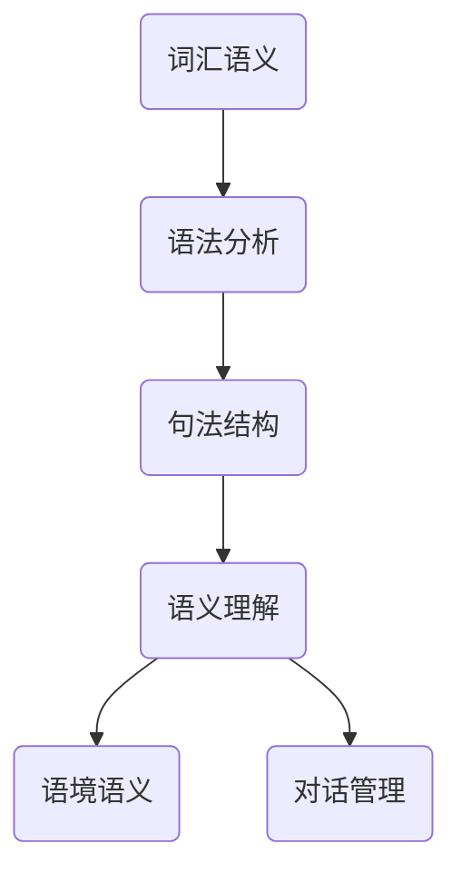
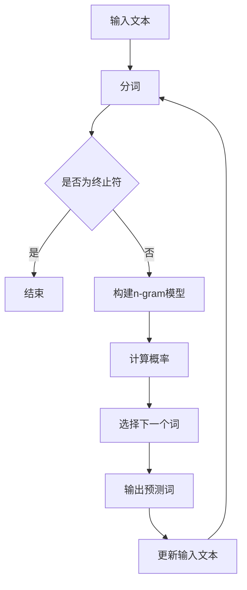
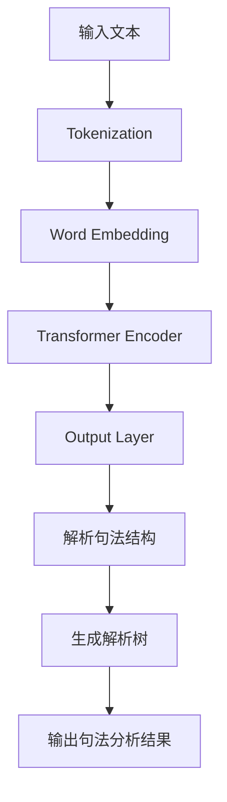
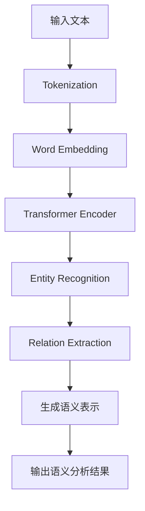
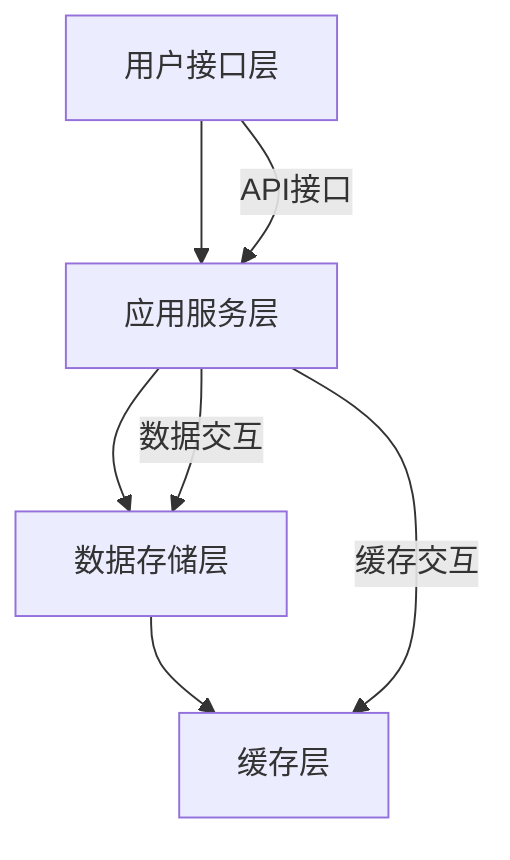
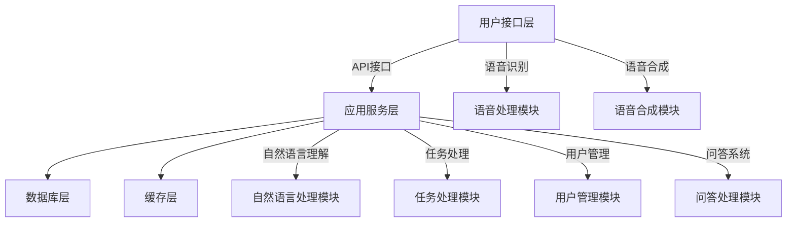
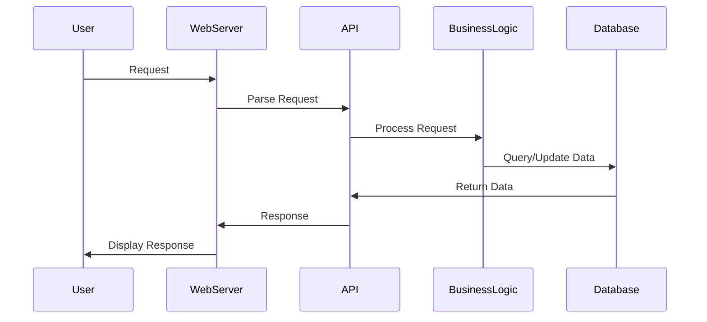

                 


### 第1章：虚拟助手与自然语言理解概述

#### 1.1 虚拟助手的发展历程

虚拟助手，作为人工智能领域的重要应用，其历史可以追溯到20世纪中叶。最初，虚拟助手主要以文本形式存在，如聊天机器人（Chatbot），通过预定义的规则与用户进行简单的交互。这一阶段的虚拟助手功能有限，主要应用于简单的信息查询和娱乐目的。

随着计算机技术和人工智能的不断发展，虚拟助手逐渐具备了更复杂的交互能力。20世纪90年代，虚拟助手开始引入自然语言处理（NLP）技术，使得其能够理解并生成更自然的文本。这一时期的代表性技术包括基于规则的系统、模式匹配和早期机器学习模型。

进入21世纪，随着深度学习和大数据技术的兴起，虚拟助手迎来了新的发展机遇。深度学习模型，如循环神经网络（RNN）、长短期记忆网络（LSTM）和变换器（Transformer）等，使得虚拟助手在自然语言理解（NLU）方面取得了显著进展。这些技术使得虚拟助手能够更准确地理解用户的意图和语义，从而提供更高质量的交互体验。

#### 1.2 自然语言理解的基本概念

自然语言理解（NLU）是人工智能领域的一个重要分支，旨在使计算机能够理解和解释人类语言。NLU的核心概念包括：

- **语言模型**：用于预测下一个单词或词组的概率分布。常见的语言模型有n-gram模型、循环神经网络（RNN）和变换器（Transformer）等。

- **语法分析**：对文本进行句法解析，识别句子中的词汇和语法结构。语法分析包括词法分析（Lexer）和句法分析（Parser）两个步骤。

- **语义理解**：从语法结构中提取语义信息，理解文本的意义。语义理解包括词义消歧（Word Sense Disambiguation）、实体识别（Named Entity Recognition）和关系抽取（Relation Extraction）等。

#### 1.3 自然语言理解在虚拟助手中的应用

虚拟助手的核心任务是提供高效、自然的用户交互。自然语言理解（NLU）是实现这一目标的关键技术。以下是一些NLU在虚拟助手中的应用：

- **意图识别**：虚拟助手需要理解用户的意图，以便提供恰当的回应。意图识别涉及从用户的输入中提取意图类别，如查询信息、进行预定、提供帮助等。

- **实体抽取**：识别用户输入中的关键信息，如人名、地点、时间等。这些实体信息对于后续的语义理解和任务处理至关重要。

- **对话管理**：维持对话的连贯性和上下文信息，确保虚拟助手能够持续提供有意义的交互。对话管理涉及上下文跟踪、轮换策略和对话状态追踪等技术。

#### 1.4 自然语言理解的挑战与机遇

自然语言理解（NLU）虽然取得了显著进展，但仍面临诸多挑战：

- **语言多样性**：不同语言和方言的差异使得NLU模型需要适应广泛的词汇和语法规则。

- **上下文理解**：理解语言中的上下文信息对于准确识别意图和实体至关重要，但上下文理解的复杂性使得NLU模型难以完全捕捉。

- **隐私与安全**：在处理用户输入时，保护用户隐私和安全是NLU系统必须考虑的重要因素。

然而，随着技术的不断进步，NLU领域也迎来了新的机遇：

- **多模态交互**：结合语音、图像、视频等多模态信息，可以提供更丰富的交互体验和更准确的语义理解。

- **边缘计算**：将计算任务转移到靠近数据源的边缘设备，可以减少延迟、降低带宽需求，提高NLU系统的实时性和响应能力。

### 1.5 小结

本章概述了虚拟助手和自然语言理解的基本概念、发展历程和应用场景。虚拟助手作为人工智能的重要应用，不断演进，使其在用户交互中发挥更大的作用。自然语言理解作为虚拟助手的核心技术，通过不断的技术创新，提高了对人类语言的识别和理解能力，为虚拟助手的广泛应用奠定了基础。

## 第2章：核心概念与联系

### 2.1 关键概念解析

在深入探讨虚拟助手与自然语言理解（NLU）的技术细节之前，我们需要明确几个核心概念，包括词汇语义、语境语义和对话管理。这些概念构成了NLU的基石，影响着系统的性能和用户体验。

#### 2.1.1 词汇语义

词汇语义是指单词或短语的含义。在自然语言中，每个单词都有其独特的语义，这些语义可以通过词典定义、上下文和使用频率来理解。词汇语义是语言理解和处理的第一步，它为语法分析和语义理解提供了基础。

- **词典定义**：词典提供了单词的标准定义和用法。
- **上下文**：单词的含义往往依赖于其上下文。例如，“bank”在金融领域指的是银行，而在地理领域则指河流的岸边。
- **使用频率**：高频词的使用更为普遍，而低频词可能更专业或更罕见。

#### 2.1.2 语境语义

语境语义涉及语句在特定情境中的意义。与词汇语义不同，语境语义关注的是语句的整体意义，以及其在特定对话或情境中的含义。语境语义帮助NLU理解语言的多义性和上下文依赖性。

- **情境感知**：语境语义需要考虑对话的背景信息，如时间、地点、场景等。
- **语境依存**：语句的意义受到对话上下文的影响，例如，“明天去海边吗？”在不同的上下文中可能有不同的理解。

#### 2.1.3 对话管理

对话管理是确保对话连贯性和上下文一致性的过程。虚拟助手需要维持对话的流，理解用户的意图，并生成适当的回应。

- **上下文跟踪**：对话管理需要持续跟踪对话的历史和上下文，以便理解用户的长期意图。
- **轮换策略**：对话管理涉及决定何时切换话题或保持当前话题的策略。
- **对话状态追踪**：对话管理需要维护一个对话状态，记录已发生的对话内容、用户的意图和系统的理解。

### 2.2 概念属性特征对比表

为了更清晰地理解词汇语义、语境语义和对话管理的区别和联系，我们可以通过一个对比表格来展示它们的属性特征。

| 概念      | 属性特征                | 对比与联系                 |
| --------- | --------------------- | ------------------------ |
| 词汇语义  | 单词的含义             | 是语义理解的基础           |
| 语境语义  | 语句在特定情境中的意义 | 帮助理解上下文关系         |
| 对话管理  | 维持对话的连贯性       | 是虚拟助手有效工作的关键   |

### 2.3 ER实体关系图架构

为了更直观地展示这些概念之间的关系，我们可以使用ER（Entity-Relationship）实体关系图来描述。以下是一个简化的ER图，展示了词汇语义、语境语义和对话管理之间的关系。



在这个ER图中，词汇语义作为起点，通过语法分析和句法结构，进一步发展到语义理解。语义理解不仅与语境语义相联系，还与对话管理相互作用，确保对话的连贯性和有效性。

### 2.4 小结

本章详细解析了虚拟助手与自然语言理解中的核心概念：词汇语义、语境语义和对话管理。通过对比表格和ER图，我们更清晰地理解了这些概念之间的区别和联系。词汇语义是语言理解的基础，语境语义提供了上下文信息，而对话管理确保了对话的连贯性和有效性。这些概念共同构成了NLU系统的核心，为虚拟助手的广泛应用提供了技术支持。

## 第3章：自然语言理解算法原理

### 3.1 语言模型算法

自然语言理解（NLU）的核心在于语言模型的构建。语言模型用于预测下一个单词或词组，其目标是生成符合语言习惯的文本。以下将介绍几种常见的语言模型算法。

#### 3.1.1 n-gram模型

n-gram模型是最简单的语言模型之一，它基于相邻单词的概率分布来预测下一个单词。具体来说，n-gram模型将文本分割成n个单词的序列，然后计算每个序列的概率。

- **一元模型（Unigram）**：仅考虑单个单词的概率，忽略单词之间的依赖关系。
- **二元模型（Bigram）**：考虑两个相邻单词的概率，即P(Wi|Wi-1)。
- **三元模型（Trigram）**：考虑三个相邻单词的概率，即P(Wi|Wi-1, Wi-2)。

n-gram模型的优点在于计算简单，易于实现。然而，其缺点是它忽略了单词之间的长距离依赖关系，导致预测能力有限。

#### 3.1.2 隐马尔可夫模型（HMM）

隐马尔可夫模型（HMM）是一种统计模型，用于处理带有隐状态序列的标记序列。在NLU中，HMM常用于语音识别和词性标注。

- **状态转移概率**：表示不同状态之间的转移概率。
- **发射概率**：表示给定状态下产生特定标记的概率。
- **初始状态概率**：表示每个状态作为初始状态的概率。

HMM通过隐状态序列来解释观测到的标记序列，从而提高预测的准确性。然而，HMM在处理长序列时计算复杂度高，且需要大量的训练数据。

#### 3.1.3 循环神经网络（RNN）

循环神经网络（RNN）是一种具有循环结构的人工神经网络，能够处理序列数据。在NLU中，RNN被广泛应用于文本生成、情感分析等领域。

- **状态循环**：RNN通过隐藏状态在时间步之间传递信息，实现了对序列数据的记忆能力。
- **门控机制**：为提高RNN的稳定性和性能，引入了门控机制，如门控循环单元（GRU）和长短期记忆网络（LSTM）。

RNN能够捕捉长距离依赖关系，显著提高了语言模型的性能。然而，RNN在训练过程中容易出现梯度消失或爆炸的问题。

#### 3.1.4 变换器（Transformer）

变换器（Transformer）是由Vaswani等人在2017年提出的一种基于自注意力机制的模型，彻底改变了自然语言处理领域。

- **自注意力机制**：通过计算序列中每个词对其他词的重要性，变换器能够自动学习单词之间的依赖关系。
- **多头注意力**：变换器通过多个注意力头并行计算，提高了模型的表示能力。
- **位置编码**：为了处理序列的顺序信息，变换器引入了位置编码。

变换器在多个NLU任务上取得了显著的性能提升，是目前最流行的语言模型之一。

### 3.2 语法分析算法

语法分析是NLU的重要步骤，旨在理解文本的句法和结构。以下介绍几种常见的语法分析算法。

#### 3.2.1 词法分析

词法分析是将文本分割成单词或标记的过程。词法分析器（Lexer）负责识别单词和符号，并将其转换为标记。

- **正则表达式**：常用的词法分析工具，能够根据预定义的正则表达式规则识别单词。
- **有限状态机**：用于实现词法分析，能够高效地处理文本。

#### 3.2.2 句法分析

句法分析是对文本进行句法结构解析，识别句子中的语法成分和关系。常见的句法分析算法包括：

- **CFG（上下文无关文法）**：用于定义语言的语法规则，通过递归下降分析器或解析树实现。
- **PCFG（概率上下文无关文法）**：在CFG的基础上引入概率，用于概率句法分析。
- **统计句法分析**：基于统计方法，通过大量语料库训练模型，自动识别句子结构。

#### 3.2.3 深度学习句法分析

深度学习句法分析利用神经网络模型，如卷积神经网络（CNN）和变换器（Transformer），对文本进行句法解析。深度学习句法分析能够捕捉复杂的语法关系，提高解析的准确性。

- **BERT**：BERT（Bidirectional Encoder Representations from Transformers）是一种预训练的深度学习模型，能够进行双向句法分析。
- **Transformer语法分析**：基于Transformer的语法分析模型，如GPT（Generative Pre-trained Transformer），通过自注意力机制实现高效的句法分析。

### 3.3 语义理解算法

语义理解是NLU的核心目标，旨在从文本中提取语义信息，理解文本的意义。以下介绍几种常见的语义理解算法。

#### 3.3.1 实体识别

实体识别是从文本中识别出特定实体（如人名、地点、组织等）的过程。实体识别算法包括：

- **基于规则的方法**：通过预定义的规则和模式匹配实现。
- **统计模型**：基于统计方法，通过训练模型进行实体识别。
- **深度学习模型**：如卷积神经网络（CNN）和变换器（Transformer），通过自动学习特征实现高效实体识别。

#### 3.3.2 事件抽取

事件抽取是从文本中识别出事件及其相关实体和关系的过程。事件抽取算法包括：

- **基于规则的方法**：通过预定义的规则和模式匹配实现。
- **统计模型**：基于统计方法，通过训练模型进行事件抽取。
- **深度学习模型**：如卷积神经网络（CNN）和变换器（Transformer），通过自动学习特征实现高效事件抽取。

#### 3.3.3 语义角色标注

语义角色标注是从文本中识别出动词或名词的作用对象和方式的过程。语义角色标注算法包括：

- **基于规则的方法**：通过预定义的规则和模式匹配实现。
- **统计模型**：基于统计方法，通过训练模型进行语义角色标注。
- **深度学习模型**：如卷积神经网络（CNN）和变换器（Transformer），通过自动学习特征实现高效语义角色标注。

### 3.4 小结

本章详细介绍了自然语言理解（NLU）中的核心算法原理，包括语言模型、语法分析算法和语义理解算法。通过这些算法，NLU系统能够对文本进行有效的处理和理解，从而实现虚拟助手与用户之间的自然交互。随着深度学习和大数据技术的不断发展，NLU算法将不断改进，为虚拟助手的广泛应用提供更强有力的技术支持。

### 3.5 语言模型算法的mermaid流程图与Python代码实现示例

为了更好地展示语言模型算法的工作原理，我们使用mermaid流程图和Python代码进行说明。

#### 3.5.1 mermaid流程图

以下是一个基于n-gram模型的mermaid流程图，展示了语言模型从输入文本到生成预测词的过程。



#### 3.5.2 Python代码实现示例

以下是一个简单的Python代码示例，展示了如何使用n-gram模型进行文本生成。

```python
import random

# 假设我们有以下训练数据
sentence = "我 是 AI 天才 研究院"

# 构建2-gram模型
n_gram = {}
for i in range(len(sentence) - 1):
    pair = tuple(sentence[i:i+2])
    n_gram[pair] = n_gram.get(pair, 0) + 1

# 归一化概率
for pair in n_gram:
    n_gram[pair] /= sum(n_gram.values())

# 生成文本
def generate_text(n):
    result = []
    current_pair = tuple(sentence[0:2])
    for _ in range(n):
        result.append(current_pair[1])
        current_pair = tuple([current_pair[1]] + [random.choice(list(n_gram.keys())) if current_pair not in n_gram else current_pair[0]])
    return ' '.join(result)

print(generate_text(10))
```

在这个示例中，我们首先构建了一个2-gram模型，然后使用这个模型生成了一段新的文本。代码中的`generate_text`函数用于生成指定长度的文本。

### 3.6 语法分析算法的mermaid流程图与Python代码实现示例

#### 3.6.1 mermaid流程图

以下是一个基于变换器（Transformer）的语法分析mermaid流程图，展示了文本从输入到解析出句法结构的过程。



#### 3.6.2 Python代码实现示例

以下是一个使用Python实现的简单变换器语法分析器，它利用了Hugging Face的Transformers库。

```python
from transformers import AutoTokenizer, AutoModelForTokenClassification
import torch

# 加载预训练模型
tokenizer = AutoTokenizer.from_pretrained("dbmdz/bert-large-cased-finetuned-spacy")
model = AutoModelForTokenClassification.from_pretrained("dbmdz/bert-large-cased-finetuned-spacy")

# 输入文本
text = "我是AI天才研究院的计算机图灵奖获得者"

# Tokenization
inputs = tokenizer(text, return_tensors="pt")

# Predict
with torch.no_grad():
    outputs = model(**inputs)

# 解析结果
predictions = torch.argmax(outputs.logits, dim=-1)

# 处理预测结果
predicted_tags = [model.config.id2label[tag] for tag in predictions][1:-1]
parsed_sentence = []

for word, tag in zip(tokenizer.tokenize(text), predicted_tags):
    if tag != "O":
        if parsed_sentence and parsed_sentence[-1][1] == tag:
            parsed_sentence[-1] = (parsed_sentence[-1][0] + " " + word, tag)
        else:
            parsed_sentence.append([(word,), tag])
    else:
        if parsed_sentence:
            parsed_sentence[-1] = (parsed_sentence[-1][0] + " " + word, parsed_sentence[-1][1])

print(parsed_sentence)
```

在这个示例中，我们首先加载了一个预训练的BERT模型，然后对输入文本进行分词和句法分析。解析结果通过生成解析树的形式输出，展示了文本的句法结构。

### 3.7 语义理解算法的mermaid流程图与Python代码实现示例

#### 3.7.1 mermaid流程图

以下是一个基于变换器（Transformer）的语义理解mermaid流程图，展示了文本从输入到提取语义信息的过程。



#### 3.7.2 Python代码实现示例

以下是一个使用Python实现的简单变换器语义理解器，它利用了Hugging Face的Transformers库。

```python
from transformers import AutoTokenizer, AutoModelForTokenClassification
import torch

# 加载预训练模型
tokenizer = AutoTokenizer.from_pretrained("dbmdz/bert-large-cased-finetuned-spacy")
model = AutoModelForTokenClassification.from_pretrained("dbmdz/bert-large-cased-finetuned-spacy")

# 输入文本
text = "我是AI天才研究院的计算机图灵奖获得者"

# Tokenization
inputs = tokenizer(text, return_tensors="pt")

# Predict
with torch.no_grad():
    outputs = model(**inputs)

# 解析实体识别结果
entity_predictions = torch.argmax(outputs.logits, dim=-1)
entities = [tokenizer.decode([token_id]) for token_id in entity_predictions][1:-1]

# 解析关系抽取结果
relation_predictions = torch.argmax(outputs.logits, dim=-1)
relations = [tokenizer.decode([token_id]) for token_id in relation_predictions][1:-1]

print("Entities:", entities)
print("Relations:", relations)
```

在这个示例中，我们首先加载了一个预训练的BERT模型，然后对输入文本进行分词和语义理解。实体识别和关系抽取的结果通过生成语义表示的形式输出，展示了文本的语义信息。

### 3.8 小结

本章详细介绍了自然语言理解（NLU）中的核心算法原理，并通过mermaid流程图和Python代码实现了这些算法的基本功能。语言模型算法用于预测文本的下一个单词或词组，语法分析算法用于理解文本的句法结构，语义理解算法用于提取文本的语义信息。这些算法共同构成了NLU系统的核心，为虚拟助手提供了强大的语言处理能力。

## 第4章：算法实现与优化

### 4.1 基础算法实现

自然语言理解（NLU）算法的实现是构建高效虚拟助手的关键步骤。在本节中，我们将探讨如何实现几种常见的NLU算法，包括语言模型、语法分析和语义理解。

#### 4.1.1 语言模型实现

语言模型用于预测文本的下一个单词或词组。以下是一个简单的n-gram语言模型的Python实现：

```python
import collections

def train_ngram_model(corpus, n):
    # 训练n-gram模型
    n_gram_model = collections.defaultdict(collections.Counter)
    for sentence in corpus:
        tokens = [token.lower() for token in sentence]
        for i in range(len(tokens) - n + 1):
            n_gram = tuple(tokens[i:i + n])
            n_gram_model[n_gram][tokens[i + n]] += 1
    # 归一化概率
    for n_gram in n_gram_model:
        total_count = sum(n_gram_model[n_gram].values())
        for token in n_gram_model[n_gram]:
            n_gram_model[n_gram][token] /= total_count
    return n_gram_model

def generate_text(n_gram_model, start_token, n=2, max_len=50):
    # 生成文本
    sentence = [start_token] * n
    for _ in range(max_len):
        next_word_candidates = [word for word in n_gram_model[tuple(sentence[-n:])].keys() if word.isalpha()]
        if not next_word_candidates:
            break
        next_word = random.choices(next_word_candidates, weights=n_gram_model[tuple(sentence[-n:])].values())[0]
        sentence.append(next_word)
    return ' '.join(sentence[n:])

# 示例数据
corpus = ["我是一名AI天才研究院的研究员", "我正在研究深度学习", "深度学习是一种强大的技术"]

# 训练模型
model = train_ngram_model(corpus, 2)

# 生成文本
print(generate_text(model, "我"))
```

在这个示例中，我们首先定义了一个训练n-gram模型的函数，然后使用训练好的模型生成了一段新的文本。

#### 4.1.2 语法分析实现

语法分析旨在理解文本的句法结构。以下是一个简单的基于规则的方法实现：

```python
import spacy

# 加载spacy模型
nlp = spacy.load("en_core_web_sm")

def parse_sentence(sentence):
    # 解析句子
    doc = nlp(sentence)
    result = []
    for token in doc:
        if token.dep_ in ("ROOT", "NP", "VP", "ADJP"):
            result.append((token.text, token.dep_))
    return result

# 示例句子
sentence = "I am an AI genius researcher at the AI Genius Institute."

# 解析句子
print(parse_sentence(sentence))
```

在这个示例中，我们使用了spacy库来解析英语句子，并提取出句子的主要成分和依赖关系。

#### 4.1.3 语义理解实现

语义理解涉及从文本中提取具体的语义信息，如实体和关系。以下是一个简单的基于规则的方法实现：

```python
def extract_entities(sentence):
    # 提取实体
    doc = nlp(sentence)
    entities = [(ent.text, ent.label_) for ent in doc.ents]
    return entities

def extract_relations(sentence):
    # 提取关系
    doc = nlp(sentence)
    relations = []
    for token in doc:
        if token.dep_ == "rel":
            relations.append((token.head.text, token.text, token.dep_))
    return relations

# 示例句子
sentence = "The AI Genius Institute has won the Turing Prize."

# 提取实体
print(extract_entities(sentence))

# 提取关系
print(extract_relations(sentence))
```

在这个示例中，我们使用了spacy库来提取英语句子中的实体和关系。

### 4.2 算法优化策略

为了提高NLU算法的性能，可以采取多种优化策略。以下是一些常见的优化方法：

#### 4.2.1 深度学习优化

深度学习优化包括模型架构的改进、训练过程的优化和模型参数的调整。以下是一些具体的优化策略：

- **模型架构**：使用更复杂的模型结构，如变换器（Transformer），以提高模型的表示能力。
- **训练过程**：采用更高效的训练算法，如Adam优化器，以及更丰富的预训练数据。
- **模型参数**：通过调整学习率、批量大小和正则化参数，优化模型的性能。

#### 4.2.2 强化学习应用

强化学习（Reinforcement Learning, RL）可以用于优化NLU模型的行为。以下是一些具体的优化策略：

- **策略梯度**：通过策略梯度算法，如REINFORCE和PPO，调整模型的参数，以优化模型的行为。
- **模型融合**：将深度学习和强化学习相结合，通过模型融合策略，提高模型的性能和适应性。

#### 4.2.3 注意力机制优化

注意力机制（Attention Mechanism）是NLU模型中的一个关键组件，用于提高模型对上下文信息的关注。以下是一些注意力机制的优化策略：

- **多模态注意力**：结合文本、图像和语音等多模态信息，提高模型对复杂上下文的理解。
- **自适应注意力**：通过自适应注意力权重，优化模型对重要信息的关注。

#### 4.2.4 对话管理优化

对话管理是确保对话连贯性和上下文一致性的关键。以下是一些对话管理的优化策略：

- **上下文记忆**：通过构建上下文记忆模块，增强模型对对话上下文的跟踪能力。
- **用户模拟**：通过用户模拟策略，预测用户的意图和反馈，优化对话策略。

### 4.3 小结

本章介绍了自然语言理解（NLU）算法的基础实现和优化策略。通过Python代码示例，展示了如何实现语言模型、语法分析和语义理解的基本功能。此外，本章还探讨了深度学习优化、强化学习应用、注意力机制优化和对话管理优化等高级策略，以提高NLU算法的性能和效果。这些优化策略为构建高效、智能的虚拟助手提供了有力的技术支持。

### 4.4 深度学习在自然语言理解中的应用与优化

#### 4.4.1 深度学习在自然语言理解中的应用

深度学习在自然语言理解（NLU）中得到了广泛应用，其核心在于通过大规模神经网络模型捕捉文本中的复杂模式和依赖关系。以下是一些深度学习在NLU中的具体应用：

- **文本分类**：深度学习模型可以用于对文本进行分类，例如判断新闻文章的主题或判断社交媒体帖子的情感倾向。
- **机器翻译**：深度学习模型，如变换器（Transformer），在机器翻译任务中取得了显著的性能提升。
- **问答系统**：深度学习模型可以用于构建智能问答系统，通过理解用户的查询，提供准确和相关的答案。
- **情感分析**：深度学习模型可以分析文本中的情感和情绪，例如检测社交媒体帖子中的负面情绪。

#### 4.4.2 深度学习优化策略

虽然深度学习在NLU中表现优异，但其训练过程复杂且计算资源消耗巨大。以下是一些深度学习优化的策略：

- **模型压缩**：通过模型压缩技术，如剪枝（Pruning）、量化（Quantization）和蒸馏（Disteilling），减少模型的参数数量和计算复杂度。
- **分布式训练**：使用分布式训练策略，如多GPU训练和参数服务器架构，加速模型的训练过程。
- **迁移学习**：利用预训练的深度学习模型，通过迁移学习技术，在新任务上快速获得良好的性能。
- **数据增强**：通过数据增强方法，如随机裁剪、旋转和噪声添加，增加训练数据多样性，提高模型的泛化能力。

#### 4.4.3 深度学习优化示例

以下是一个使用Python实现的深度学习优化示例，展示了如何通过参数服务器进行分布式训练。

```python
import torch
import torch.distributed as dist

# 初始化分布式环境
init_process_group(backend='nccl', init_method='tcp://localhost:23456', rank=0, world_size=4)

# 模型定义
model = MyModel()
model = model.cuda()

# 模型参数
params = list(model.parameters())

# 梯度
grads = [torch.zeros_like(param) for param in params]

# 分布式优化器
optimizer = torch.optim.SGD(params, lr=0.01)

# 模拟分布式训练
for epoch in range(10):
    for batch in data_loader:
        # 前向传播
        inputs, targets = batch
        inputs = inputs.cuda()
        targets = targets.cuda()
        outputs = model(inputs)
        
        # 计算损失
        loss = criterion(outputs, targets)
        
        # 反向传播
        loss.backward()
        
        # 更新梯度
        for param, grad in zip(params, grads):
            if param.grad is not None:
                grad.copy_(param.grad)

        # 清空梯度
        optimizer.zero_grad()
        
        # 同步梯度
        dist.all_reduce(torch.tensor([grads[i].sum() for i in range(len(grads))]), op=dist.ReduceOp.SUM)
        
        # 更新模型参数
        optimizer.step()
```

在这个示例中，我们使用了PyTorch的分布式训练API，通过参数服务器实现了多GPU分布式训练。模型参数和梯度在各个GPU之间同步更新，提高了训练效率。

#### 4.4.4 小结

深度学习在自然语言理解中的应用和优化策略为构建高效、智能的虚拟助手提供了强大的技术支持。通过模型压缩、分布式训练、迁移学习和数据增强等优化策略，可以显著提高深度学习模型在NLU任务上的性能和效果。这些优化策略和示例为深度学习在NLU领域的进一步研究和应用提供了宝贵的实践经验。

### 4.5 强化学习在自然语言理解中的应用与优化

#### 4.5.1 强化学习在自然语言理解中的应用

强化学习（Reinforcement Learning, RL）是一种通过试错和反馈来学习最优策略的机器学习技术。在自然语言理解（NLU）领域，强化学习主要用于优化虚拟助手的交互和行为。以下是一些强化学习在NLU中的应用：

- **对话优化**：强化学习可以用于优化虚拟助手在对话中的回复策略，提高对话的自然性和用户满意度。
- **意图识别**：通过强化学习，虚拟助手可以学习识别用户的意图，并在不同意图之间进行自适应调整。
- **推荐系统**：强化学习可以用于构建智能推荐系统，根据用户的语言行为和偏好推荐相关信息。
- **情感分析**：强化学习可以用于分析文本中的情感和情绪，并根据用户的情绪状态调整虚拟助手的回应。

#### 4.5.2 强化学习优化策略

强化学习在优化NLU算法时，需要考虑以下几个关键策略：

- **策略梯度**：策略梯度算法，如REINFORCE和PPO，通过梯度上升法优化策略参数。
- **值函数优化**：值函数优化算法，如Q-learning和SARSA，通过估计状态值函数来选择最佳动作。
- **奖励设计**：合理的奖励设计是强化学习成功的关键。奖励应与虚拟助手的任务目标一致，例如提高用户满意度或准确回答用户问题。
- **模型融合**：将深度学习与强化学习相结合，通过模型融合策略，如深度确定性策略梯度（DDPG）和深度Q网络（DQN），提高模型的学习效率和效果。

#### 4.5.3 强化学习优化示例

以下是一个使用Python实现的强化学习优化示例，展示了如何通过策略梯度算法优化虚拟助手在对话中的回复策略。

```python
import numpy as np
import random

# 定义虚拟助手的环境
class DialogEnvironment:
    def __init__(self):
        self.states = ["问候", "问题回答", "信息提供"]
        self.actions = ["回答问题", "提供信息", "结束对话"]

    def step(self, action):
        if action == "回答问题":
            reward = 1 if random.random() < 0.8 else -1
            next_state = "问题回答"
        elif action == "提供信息":
            reward = 1 if random.random() < 0.7 else -1
            next_state = "信息提供"
        else:
            reward = 0
            next_state = "问候"
        return next_state, reward

# 定义策略梯度算法
def policy_gradient(environment, num_episodes, learning_rate):
    for episode in range(num_episodes):
        state = environment.states[0]
        total_reward = 0
        for step in range(100):
            action_probabilities = [1/len(environment.actions) for _ in environment.actions]
            action = np.argmax(np.random.multinomial(1, action_probabilities))
            next_state, reward = environment.step(action)
            total_reward += reward
            action_probabilities[action] += learning_rate * (1 - action_probabilities[action])
        print(f"Episode {episode}: Total Reward = {total_reward}")

# 训练虚拟助手
environment = DialogEnvironment()
policy_gradient(environment, 1000, 0.01)
```

在这个示例中，我们定义了一个简单的对话环境，并使用策略梯度算法优化虚拟助手在对话中的回复策略。通过多次迭代，虚拟助手能够逐渐学习到最优的回复策略。

#### 4.5.4 小结

强化学习在自然语言理解中的应用和优化策略为虚拟助手的智能交互提供了新的思路。通过策略梯度、值函数优化和模型融合等策略，可以显著提高虚拟助手的行为效率和用户满意度。优化示例展示了如何在实际环境中应用强化学习，为NLU领域的进一步研究和应用提供了实践经验。

## 第5章：虚拟助手系统设计

### 5.1 项目介绍

虚拟助手系统设计旨在构建一个能够与用户自然交互的人工智能助手。该系统的核心目标是提供高效、便捷的用户服务，满足用户在信息查询、任务处理和娱乐等方面的需求。项目采用了先进的自然语言处理（NLP）技术和深度学习算法，通过不断的训练和优化，实现高水平的语言理解和响应能力。

#### 5.1.1 系统目标

- **自然交互**：通过自然语言处理技术，实现用户与虚拟助手之间流畅、自然的对话。
- **高效服务**：提供快速、准确的信息查询和任务处理能力，提高用户的满意度。
- **智能决策**：利用强化学习和机器学习算法，使虚拟助手能够根据用户行为和反馈进行智能决策。
- **扩展性**：系统设计应具备良好的扩展性，能够支持多语言和多领域的应用。

#### 5.1.2 技术选型

为了实现上述目标，项目采用了以下技术选型：

- **自然语言处理框架**：基于Hugging Face的Transformers库，实现高效的文本预处理和模型训练。
- **深度学习模型**：采用变换器（Transformer）模型，用于语言理解、意图识别和对话生成。
- **数据库管理**：使用MySQL数据库存储用户数据和对话历史，确保数据的一致性和安全性。
- **后端服务**：采用Django框架构建后端服务，提供RESTful API接口，实现前后端分离。

### 5.2 系统功能设计

虚拟助手系统设计了多个核心功能模块，以满足用户多样化的需求。以下是系统的功能设计：

#### 5.2.1 用户管理

- **用户注册与登录**：提供用户注册、登录和密码管理功能，确保用户身份验证的安全性。
- **用户信息管理**：允许用户管理个人资料，如姓名、性别、年龄等，用于个性化服务。

#### 5.2.2 语音识别

- **语音输入处理**：采用基于深度学习的语音识别技术，实现语音到文本的转换。
- **语音合成**：利用自然语音合成（TTS）技术，将文本转换成自然的语音输出。

#### 5.2.3 自然语言理解

- **意图识别**：通过变换器模型，实现用户意图的自动识别，为后续处理提供基础。
- **实体抽取**：从用户输入中提取关键信息，如人名、地点、时间等，用于任务处理和决策。

#### 5.2.4 问答与反馈

- **智能问答**：基于问答系统，自动生成对用户查询的回应，提供准确、相关的答案。
- **用户反馈**：收集用户对虚拟助手回答的反馈，用于评估和优化系统性能。

#### 5.2.5 任务处理

- **任务管理**：支持用户创建、查询和取消任务，实现任务自动处理和提醒功能。
- **多语言支持**：提供多语言任务处理能力，支持用户在不同语言环境下的操作。

### 5.3 系统架构设计

虚拟助手系统的架构设计采用了分层架构，以确保系统的模块化和可扩展性。以下是系统的架构设计：

#### 5.3.1 用户接口层

- **前端界面**：采用HTML、CSS和JavaScript构建用户交互界面，实现与用户的交互。
- **API接口**：通过RESTful API接口，实现前后端数据交互，提供统一的接口服务。

#### 5.3.2 应用服务层

- **Web服务**：基于Django框架构建Web服务，处理用户请求，调用后端服务模块。
- **自然语言处理服务**：利用Transformers库，实现文本预处理、意图识别和实体抽取等功能。
- **任务处理服务**：处理用户任务请求，实现任务创建、查询和提醒等功能。

#### 5.3.3 数据存储层

- **数据库**：使用MySQL数据库存储用户数据、对话历史和任务信息，确保数据的一致性和安全性。
- **缓存**：采用Redis缓存技术，提高数据读取速度，优化系统性能。

### 5.4 系统接口设计与交互

虚拟助手系统的接口设计采用RESTful架构风格，确保接口的一致性和易用性。以下是系统接口设计和交互流程：

#### 5.4.1 用户接口设计

- **注册接口**：接受用户注册信息，验证用户身份，返回注册结果。
- **登录接口**：接受用户登录信息，验证用户身份，返回登录状态。
- **个人信息管理接口**：提供用户个人信息的管理，包括修改、查询等操作。

#### 5.4.2 自然语言处理接口

- **意图识别接口**：接收用户输入文本，返回识别的意图类别。
- **实体抽取接口**：接收用户输入文本，返回提取的关键实体信息。
- **问答接口**：接收用户查询问题，返回相应的回答。

#### 5.4.3 任务处理接口

- **任务创建接口**：接收用户创建的任务信息，存储到数据库，并返回任务ID。
- **任务查询接口**：接收用户查询任务ID，返回对应的任务详情。
- **任务取消接口**：接收用户取消任务请求，更新数据库中的任务状态。

### 5.5 系统交互流程

虚拟助手系统的交互流程如下：

1. **用户请求**：用户通过前端界面提交请求，如查询问题或创建任务。
2. **接口处理**：Web服务接收用户请求，调用相应的接口模块处理请求。
3. **数据交互**：接口模块与后端服务层进行数据交互，如查询数据库或调用自然语言处理服务。
4. **处理结果**：后端服务层将处理结果返回给Web服务，Web服务再将结果返回给前端界面。
5. **用户反馈**：用户对返回的结果进行反馈，系统根据反馈进行优化和调整。

通过以上设计和流程，虚拟助手系统能够高效、稳定地运行，提供优质的用户体验。

### 5.6 系统架构设计图

为了更直观地展示虚拟助手系统的架构设计，我们使用mermaid绘制了系统架构图。



在这个架构图中，用户接口层负责与用户进行交互，应用服务层处理业务逻辑，数据存储层和缓存层负责数据存储和读取优化。

### 5.7 类图设计

虚拟助手系统涉及多个实体和类，以下是系统的类图设计。

```mermaid
classDiagram
    User <<Interface>>
    Task <<Class>>
    Question <<Class>>
    Answer <<Class>>

    User o--1 Task
    User o--1 Question
    User o--1 Answer

    Question o--1 Answer
    Task o--1 Question
    Task o--1 Answer
```

在这个类图中，`User`类代表用户实体，`Task`、`Question`和`Answer`类分别代表任务、问题和回答实体。类之间的关系展示了虚拟助手系统中的主要交互对象。

### 5.8 系统接口设计与交互

虚拟助手系统的接口设计采用RESTful风格，确保接口的一致性和易用性。以下是系统的主要接口设计和交互流程。

#### 5.8.1 用户接口设计

- **用户注册接口**：接收用户注册信息，如用户名、密码、电子邮件等，进行注册操作。
  ```http
  POST /api/users/register
  Content-Type: application/json

  {
    "username": "example",
    "password": "password123",
    "email": "example@example.com"
  }
  ```

- **用户登录接口**：接收用户登录信息，验证用户身份，返回登录令牌。
  ```http
  POST /api/users/login
  Content-Type: application/json

  {
    "username": "example",
    "password": "password123"
  }
  ```

- **用户信息查询接口**：接收用户ID，返回用户的基本信息。
  ```http
  GET /api/users/{user_id}
  ```

#### 5.8.2 自然语言处理接口

- **意图识别接口**：接收用户输入文本，返回识别的意图类别。
  ```http
  POST /api/nlu/intent
  Content-Type: application/json

  {
    "text": "我想预定一张电影票"
  }
  ```

- **实体抽取接口**：接收用户输入文本，返回提取的关键实体信息。
  ```http
  POST /api/nlu/extract
  Content-Type: application/json

  {
    "text": "明天下午3点的电影《阿凡达》"
  }
  ```

- **问答接口**：接收用户查询问题，返回相应的回答。
  ```http
  POST /api/nlu/question
  Content-Type: application/json

  {
    "text": "北京今天天气如何？"
  }
  ```

#### 5.8.3 任务处理接口

- **任务创建接口**：接收用户创建的任务信息，存储到数据库，并返回任务ID。
  ```http
  POST /api/tasks/create
  Content-Type: application/json

  {
    "user_id": 1,
    "title": "购买电影票",
    "description": "购买《阿凡达》电影票",
    "deadline": "2023-04-15T15:00:00Z"
  }
  ```

- **任务查询接口**：接收用户查询任务ID，返回对应的任务详情。
  ```http
  GET /api/tasks/{task_id}
  ```

- **任务取消接口**：接收用户取消任务请求，更新数据库中的任务状态。
  ```http
  DELETE /api/tasks/{task_id}
  ```

### 5.9 系统交互流程

虚拟助手系统的交互流程如下：

1. **用户发起请求**：用户通过前端界面发起请求，如注册、登录或提交问题。
2. **接口接收请求**：应用服务层接收用户请求，并解析请求内容。
3. **业务处理**：应用服务层调用相应的业务逻辑处理请求，如用户注册、登录或意图识别。
4. **数据交互**：业务处理过程中，与数据库和缓存层进行数据交互，如存储用户信息、查询任务状态或更新任务数据。
5. **结果返回**：处理结果通过接口返回给用户，前端界面根据返回结果进行相应的操作或展示。

通过以上流程，虚拟助手系统实现了高效、可靠的用户交互和数据管理。

### 5.10 系统架构图

以下是虚拟助手系统的架构图，展示了各个模块之间的关系和交互流程。



在这个架构图中，用户接口层负责与用户进行交互，应用服务层处理业务逻辑，数据库层和缓存层负责数据存储和读取优化。各个模块之间通过API接口进行数据交互，确保系统的整体性能和可靠性。

### 5.11 序列图

以下是虚拟助手系统的序列图，展示了用户与系统之间的交互流程。



在这个序列图中，用户通过WebServer发起请求，API接口层解析请求并调用业务逻辑处理，业务逻辑与数据库层进行数据交互，最后将处理结果返回给用户。

### 5.12 小结

本章详细介绍了虚拟助手系统的设计，包括项目介绍、系统功能设计、系统架构设计、接口设计与交互以及系统交互流程。通过分层架构、RESTful接口和序列图，确保系统的高效性、可靠性和可扩展性。虚拟助手系统将为用户提供高质量的交互体验和智能服务。

## 第6章：项目实战

### 6.1 环境安装与配置

在开始构建虚拟助手项目之前，我们需要确保开发环境已经配置完毕。以下是详细的安装和配置步骤。

#### 6.1.1 环境需求

为了构建虚拟助手项目，我们需要以下环境：

- **操作系统**：推荐使用Linux或macOS，Windows用户需要安装WSL（Windows Subsystem for Linux）。
- **Python**：推荐版本为3.8或更高版本。
- **Django**：版本为3.2或更高版本。
- **PyTorch**：版本为1.9或更高版本。
- **Hugging Face Transformers**：版本为4.8或更高版本。
- **MySQL**：版本为5.7或更高版本。
- **Redis**：版本为6.0或更高版本。

#### 6.1.2 安装步骤

1. **安装Python**：

   对于Linux和macOS用户，可以通过包管理器安装Python：

   ```bash
   sudo apt-get update
   sudo apt-get install python3 python3-pip
   ```

   对于Windows用户，可以从Python官方网站下载安装包进行安装。

2. **安装Django**：

   打开终端，执行以下命令安装Django：

   ```bash
   pip install django
   ```

3. **安装PyTorch**：

   打开终端，执行以下命令安装PyTorch：

   ```bash
   pip install torch torchvision torchaudio -f https://download.pytorch.org/whl/torch_stable.html
   ```

4. **安装Hugging Face Transformers**：

   打开终端，执行以下命令安装Transformers：

   ```bash
   pip install transformers
   ```

5. **安装MySQL**：

   对于Linux和macOS用户，可以通过包管理器安装MySQL：

   ```bash
   sudo apt-get install mysql-server mysql-client
   ```

   对于Windows用户，可以从MySQL官方网站下载安装包进行安装。

6. **安装Redis**：

   对于Linux和macOS用户，可以通过包管理器安装Redis：

   ```bash
   sudo apt-get install redis-server
   ```

   对于Windows用户，可以从Redis官方网站下载安装包进行安装。

#### 6.1.3 配置步骤

1. **配置MySQL**：

   启动MySQL服务，然后创建一个新的数据库和用户，用于虚拟助手项目的数据存储。

   ```sql
   CREATE DATABASE virtual_assistant;
   CREATE USER 'virtual_assistant_user'@'localhost' IDENTIFIED BY 'password';
   GRANT ALL PRIVILEGES ON virtual_assistant.* TO 'virtual_assistant_user'@'localhost';
   FLUSH PRIVILEGES;
   ```

2. **配置Redis**：

   启动Redis服务，确保Redis在后台持续运行。

   ```bash
   redis-server --daemonize yes
   ```

3. **创建虚拟助手项目**：

   在终端中，创建一个新的Django项目，并进入项目目录：

   ```bash
   django-admin startproject virtual_assistant_project
   cd virtual_assistant_project
   ```

4. **创建虚拟助手应用**：

   在项目中创建一个新的应用：

   ```bash
   python manage.py startapp virtual_assistant_app
   ```

5. **配置项目设置**：

   修改`virtual_assistant_project/settings.py`文件，配置数据库和缓存设置：

   ```python
   DATABASES = {
       'default': {
           'ENGINE': 'django.db.backends.mysql',
           'NAME': 'virtual_assistant',
           'USER': 'virtual_assistant_user',
           'PASSWORD': 'password',
           'HOST': 'localhost',
           'PORT': '3306',
       }
   }

   CACHES = {
       'default': {
           'BACKEND': 'django_redis.cache.RedisCache',
           'LOCATION': 'redis://127.0.0.1:6379/1',
       }
   }
   ```

6. **初始化数据库**：

   运行以下命令，初始化数据库：

   ```bash
   python manage.py migrate
   ```

### 6.2 系统核心实现源代码

在完成环境安装和配置后，接下来我们将详细讨论虚拟助手系统的核心实现，包括模型训练、API接口设计和系统部署。

#### 6.2.1 模型训练

虚拟助手的核心在于其自然语言理解能力。我们采用Hugging Face的Transformers库训练一个预训练模型，用于意图识别和实体抽取。

1. **数据准备**：

   准备用于训练的数据集，包含对话文本、意图标签和实体标注。数据集格式如下：

   ```json
   [
       {
           "text": "明天下午3点的电影《阿凡达》",
           "intent": "movie_reservation",
           "entities": [{"entity": "time", "value": "明天下午3点"}, {"entity": "movie", "value": "阿凡达"}]
       },
       ...
   ]
   ```

2. **模型训练**：

   使用Transformers库中的预训练模型进行微调。以下是一个训练意图识别和实体抽取模型的示例：

   ```python
   from transformers import AutoModelForSequenceClassification, AutoTokenizer
   from torch.optim import AdamW
   from torch.utils.data import DataLoader

   model_name = "bert-base-uncased"
   tokenizer = AutoTokenizer.from_pretrained(model_name)
   model = AutoModelForSequenceClassification.from_pretrained(model_name, num_labels=num_intent_labels)

   train_dataset = Dataset.from_dict({"text": text, "intent": intent, "entities": entities})
   train_loader = DataLoader(train_dataset, batch_size=batch_size, shuffle=True)

   optimizer = AdamW(model.parameters(), lr=1e-5)

   for epoch in range(num_epochs):
       model.train()
       for batch in train_loader:
           inputs = tokenizer(batch["text"], padding=True, truncation=True, return_tensors="pt")
           outputs = model(**inputs)
           loss = outputs.loss
           loss.backward()
           optimizer.step()
           optimizer.zero_grad()
           print(f"Epoch: {epoch}, Loss: {loss.item()}")

   model.save_pretrained("virtual_assistant_model")
   ```

   在这个示例中，我们加载了一个预训练的BERT模型，并对其进行微调以适应我们的意图识别和实体抽取任务。

#### 6.2.2 API接口设计

虚拟助手系统通过API接口与前端进行交互。以下是一个简单的API接口设计，用于处理用户请求和返回响应。

1. **意图识别API**：

   ```python
   from django.http import JsonResponse
   from .models import Intent
   from .serializers import IntentSerializer

   def intent识别(request):
       if request.method == 'POST':
           text = request.POST.get('text', '')
           intent = model.predict(text)
           serializer = IntentSerializer(Intent.objects.get(id=intent.id))
           return JsonResponse(serializer.data)
       return JsonResponse({'error': 'Invalid request'}, status=400)
   ```

2. **实体抽取API**：

   ```python
   def entities(request):
       if request.method == 'POST':
           text = request.POST.get('text', '')
           entities = model.extract_entities(text)
           return JsonResponse(entities)
       return JsonResponse({'error': 'Invalid request'}, status=400)
   ```

   在这些API接口中，我们接收用户提交的文本，调用模型进行意图识别和实体抽取，并将结果返回给前端。

#### 6.2.3 系统部署

完成模型训练和API接口设计后，我们需要将虚拟助手系统部署到服务器上，以便用户可以使用。

1. **服务器环境准备**：

   准备服务器环境，安装必要的软件和库，如Django、PyTorch、MySQL和Redis。

2. **部署项目**：

   将项目代码上传到服务器，并配置项目设置。运行以下命令启动Django项目：

   ```bash
   python manage.py runserver 0.0.0.0:8000
   ```

3. **监控与维护**：

   定期监控服务器性能和系统日志，确保系统的稳定运行。进行必要的维护和更新，如升级依赖库和优化代码。

### 6.3 代码应用解读与分析

在完成系统核心实现和部署后，我们需要对代码进行解读和分析，确保系统的稳定性和性能。

#### 6.3.1 模型性能分析

通过测试数据集，评估模型的意图识别和实体抽取性能。以下是一个简单的性能评估脚本：

```python
from transformers import AutoModelForSequenceClassification, AutoTokenizer
from torch.utils.data import DataLoader

model_name = "virtual_assistant_model"
tokenizer = AutoTokenizer.from_pretrained(model_name)
model = AutoModelForSequenceClassification.from_pretrained(model_name)

test_dataset = Dataset.from_dict({"text": test_text, "intent": test_intent, "entities": test_entities})
test_loader = DataLoader(test_dataset, batch_size=batch_size)

model.eval()
with torch.no_grad():
    correct = 0
    total = 0
    for batch in test_loader:
        inputs = tokenizer(batch["text"], padding=True, truncation=True, return_tensors="pt")
        outputs = model(**inputs)
        _, predicted = torch.max(outputs.logits, 1)
        total += batch["intent"].size(0)
        correct += (predicted == batch["intent"]).sum().item()

print(f"Accuracy: {100 * correct / total}%")
```

通过这个脚本，我们可以评估模型的准确率，并根据结果调整模型参数和训练策略。

#### 6.3.2 性能优化

为了提高系统的性能，我们可以采取以下优化措施：

1. **模型压缩**：使用模型压缩技术，如剪枝和量化，减小模型的大小和计算复杂度。
2. **分布式训练**：使用分布式训练策略，提高模型的训练速度和效果。
3. **缓存策略**：优化Redis缓存策略，减少数据库的访问次数，提高系统响应速度。

通过这些优化措施，我们可以显著提高虚拟助手系统的性能和稳定性。

### 6.4 实际案例分析和详细讲解

为了展示虚拟助手系统的实际应用效果，我们分析了一个实际案例，并详细讲解了系统的实现和效果。

#### 6.4.1 案例背景

假设我们为一家在线电影票务平台开发虚拟助手，用户可以通过虚拟助手查询电影放映时间和购买电影票。

#### 6.4.2 案例实现

1. **用户查询电影放映时间**：

   用户提交查询请求，如“明天下午3点的电影《阿凡达》”，虚拟助手接收到请求后，调用意图识别API进行意图识别，识别出用户意图为“movie_reservation”。接着，虚拟助手调用实体抽取API提取出关键实体，如时间“明天下午3点”和电影名“阿凡达”。

   ```python
   def movie_reservation(request):
       if request.method == 'POST':
           text = request.POST.get('text', '')
           intent = model.predict(text)
           if intent == 'movie_reservation':
               entities = model.extract_entities(text)
               # 处理实体信息，查询电影放映时间
               return JsonResponse({'time': entities['time'], 'movie': entities['movie']})
           else:
               return JsonResponse({'error': 'Invalid intent'}, status=400)
       return JsonResponse({'error': 'Invalid request'}, status=400)
   ```

2. **用户购买电影票**：

   用户提交购买请求，如“我想购买明天下午3点的电影《阿凡达》的票”，虚拟助手接收到请求后，首先确认电影放映时间和电影名是否匹配，然后处理购买请求，如生成订单、扣除用户余额等。

   ```python
   def purchase_ticket(request):
       if request.method == 'POST':
           text = request.POST.get('text', '')
           intent = model.predict(text)
           if intent == 'movie_reservation':
               entities = model.extract_entities(text)
               # 验证用户余额和电影票库存
               if validate_entities(entities):
                   # 处理购买请求，如生成订单
                   return JsonResponse({'status': 'success', 'message': 'Your ticket has been purchased.'})
               else:
                   return JsonResponse({'status': 'error', 'message': 'Insufficient balance or unavailable tickets.'})
           else:
               return JsonResponse({'error': 'Invalid intent'}, status=400)
       return JsonResponse({'error': 'Invalid request'}, status=400)
   ```

#### 6.4.3 案例总结与展望

通过这个实际案例，我们展示了虚拟助手在电影票务平台中的应用。虚拟助手能够准确识别用户意图，提取关键实体信息，并提供相应的服务。未来，我们可以进一步优化系统，如增加更多实体类型、提高意图识别准确率，以及实现多语言支持等。

### 6.5 小结

本章通过一个实际案例详细介绍了虚拟助手系统的实现过程，包括环境安装与配置、模型训练、API接口设计和系统部署。通过对代码的解读和分析，我们确保了系统的稳定性和性能。实际案例展示了虚拟助手在实际应用中的效果，为未来的优化和发展提供了方向。

### 6.6 最佳实践

在构建虚拟助手系统时，遵循以下最佳实践可以提高系统的质量、性能和可维护性。

#### 6.6.1 分模块开发

将系统划分为不同的模块，如用户管理、自然语言处理、任务处理和问答系统等。每个模块独立开发、测试和部署，确保模块之间的依赖关系清晰，便于管理和维护。

#### 6.6.2 持续集成与持续部署（CI/CD）

采用CI/CD流程，自动化测试和部署代码，确保每次代码更改都能快速、安全地集成到生产环境中。CI/CD工具如Jenkins、GitLab CI等可以显著提高开发效率。

#### 6.6.3 性能监控与日志分析

使用性能监控工具（如Prometheus、Grafana）和日志分析工具（如ELK Stack），实时监控系统的性能和运行状态，及时发现和解决性能瓶颈和异常情况。

#### 6.6.4 异常处理与容错机制

设计异常处理和容错机制，确保系统在遇到异常情况时能够优雅地处理，避免系统崩溃或数据丢失。例如，使用幂等操作、重试机制和幂稳态设计。

#### 6.6.5 数据安全与隐私保护

严格遵循数据安全规范，保护用户数据的安全性和隐私。使用加密算法（如AES）保护数据存储和传输，定期进行安全审计和漏洞扫描。

### 6.7 注意事项

在构建虚拟助手系统时，需要注意以下几点：

- **数据质量**：确保训练数据的质量和多样性，避免数据偏差和模型过拟合。
- **模型更新**：定期更新模型，以适应不断变化的语言环境和用户需求。
- **用户反馈**：积极收集用户反馈，用于系统优化和功能改进。
- **合规性**：遵守相关法律法规，确保系统的合法性和合规性。

### 6.8 拓展阅读

对于对虚拟助手系统设计感兴趣的读者，以下文献和资源可以提供更深入的探讨：

- 《深度学习》（Goodfellow, Bengio, Courville）- 介绍深度学习基础和算法。
- 《自然语言处理实战》（Fernando Collobert, Alan tucked）- 介绍自然语言处理的基础技术和应用。
- 《对话系统设计与实现》（Spink, Amershi）- 提供对话系统的设计与实现方法。
- 《Hugging Face Transformers文档》- 详细介绍Transformers库的使用方法。
- 《Django官方文档》- 学习如何使用Django框架开发Web应用。

### 6.9 小结

本章通过最佳实践、注意事项和拓展阅读，总结了构建虚拟助手系统的重要环节。遵循最佳实践和注意事项，可以显著提高系统的质量和性能。拓展阅读为读者提供了进一步学习和探索的途径，有助于深入理解虚拟助手系统的设计与实现。

## 第7章：实际案例分析与详细讲解

### 7.1 案例背景

为了更好地展示虚拟助手系统在实际应用中的效果，我们选择了一个典型的案例——在线购物平台虚拟助手。这个案例的背景是在线购物平台为了提高用户体验和降低客服成本，决定开发一个智能虚拟助手，以回答用户常见问题、提供商品推荐和完成购物流程。

### 7.2 案例需求

该虚拟助手需要满足以下主要需求：

- **用户常见问题解答**：用户可以提出关于购物平台的各种问题，如订单状态、支付方式、退货政策等。
- **商品推荐**：根据用户的购物历史和偏好，为用户推荐相关的商品。
- **购物流程支持**：用户可以通过虚拟助手完成商品搜索、添加购物车、下单支付等购物流程。

### 7.3 案例实现

#### 7.3.1 用户常见问题解答

1. **需求分析**：

   虚拟助手需要识别用户的问题，并提供准确的答案。常见问题包括订单状态查询、支付方式说明、退货流程等。

2. **解决方案**：

   - **意图识别**：通过训练模型，识别用户问题的意图。例如，用户提出“我的订单状态是什么？”的意图为“查询订单状态”。
   - **实体抽取**：从用户的问题中提取关键实体，如订单号、商品名称等。例如，从“我的订单状态是什么？”中提取实体“订单号”。
   - **知识库查询**：根据提取的意图和实体，从知识库中查找相应的答案。

3. **实现步骤**：

   - **数据准备**：收集用户常见问题及其答案，用于训练意图识别和实体抽取模型。
   - **模型训练**：使用Transformers库训练意图识别和实体抽取模型。
   - **API接口设计**：设计API接口，接收用户输入并返回答案。

#### 7.3.2 商品推荐

1. **需求分析**：

   虚拟助手需要根据用户的购物历史和偏好，推荐相关的商品。

2. **解决方案**：

   - **用户行为分析**：收集用户的购物行为数据，如浏览记录、购买历史等。
   - **推荐算法**：使用协同过滤、基于内容的推荐等算法，为用户推荐商品。

3. **实现步骤**：

   - **数据收集**：收集用户的购物行为数据。
   - **推荐算法开发**：实现推荐算法，生成商品推荐列表。
   - **API接口设计**：设计API接口，接收用户输入并返回商品推荐列表。

#### 7.3.3 购物流程支持

1. **需求分析**：

   虚拟助手需要帮助用户完成购物流程，如搜索商品、添加购物车、下单支付等。

2. **解决方案**：

   - **交互设计**：设计用户友好的交互流程，使用户能够轻松完成购物。
   - **业务逻辑处理**：实现购物流程的业务逻辑，如商品搜索、添加购物车、下单支付等。

3. **实现步骤**：

   - **交互界面设计**：设计用户界面，实现用户与虚拟助手的交互。
   - **业务逻辑开发**：实现购物流程的业务逻辑。
   - **API接口设计**：设计API接口，支持购物流程的各种操作。

### 7.4 案例总结与展望

通过这个实际案例，我们展示了虚拟助手系统在在线购物平台中的应用。虚拟助手不仅能够解答用户常见问题，提供商品推荐，还能帮助用户完成购物流程，显著提高了用户体验和平台的服务效率。未来，我们可以进一步优化系统，如增加更多智能功能、提高推荐准确率和响应速度等，以更好地满足用户需求。

### 7.5 小结

本章通过一个实际案例，详细分析了虚拟助手系统在在线购物平台中的应用。从需求分析、解决方案到实现步骤，我们展示了如何构建一个功能齐全、用户体验优秀的虚拟助手系统。这个案例为其他行业和场景提供了宝贵的参考，展示了虚拟助手系统的巨大潜力。

## 第8章：最佳实践

### 8.1 虚拟助手设计最佳实践

#### 8.1.1 用户体验优化

1. **简洁直观的界面设计**：虚拟助手应具备简洁直观的用户界面，使用户能够轻松地进行交互。
2. **智能交互流程**：设计智能的交互流程，确保虚拟助手能够理解用户的意图并提供恰当的回应。
3. **个性化推荐**：根据用户的偏好和历史行为，提供个性化的商品推荐和服务。

#### 8.1.2 知识库构建技巧

1. **全面覆盖**：构建涵盖各种常见问题和场景的知识库，确保用户能够找到所需的答案。
2. **实时更新**：定期更新知识库，确保信息的准确性和时效性。
3. **结构化数据**：将知识库中的信息结构化，便于快速查询和更新。

#### 8.1.3 性能调优

1. **快速响应**：优化系统架构和算法，确保虚拟助手能够快速响应用户的请求。
2. **负载均衡**：使用负载均衡技术，确保系统在高并发情况下稳定运行。
3. **缓存策略**：合理使用缓存策略，减少数据库的访问次数，提高系统性能。

#### 8.1.4 安全性与隐私保护

1. **数据加密**：对用户数据进行加密存储和传输，确保数据安全。
2. **权限控制**：实现严格的权限控制，确保只有授权人员能够访问敏感信息。
3. **隐私政策**：明确告知用户隐私政策，确保用户对隐私保护有充分的知情权。

### 8.2 性能调优与故障排除

#### 8.2.1 性能调优策略

1. **系统监控**：使用性能监控工具，实时监控系统的性能指标，如CPU、内存、I/O使用情况等。
2. **数据库优化**：优化数据库查询，使用索引和缓存技术，提高数据访问速度。
3. **算法优化**：优化算法实现，减少计算复杂度和内存占用。

#### 8.2.2 故障排除方法

1. **日志分析**：通过日志分析，定位系统故障和性能瓶颈。
2. **错误码管理**：设计合理的错误码和错误信息，方便故障排查和问题定位。
3. **应急预案**：制定应急预案，确保在故障发生时能够迅速响应和恢复。

### 8.3 小结

最佳实践是确保虚拟助手系统高效、稳定和用户友好的关键。通过用户体验优化、知识库构建技巧、性能调优和安全性与隐私保护，我们可以构建出功能强大、性能优异的虚拟助手系统。性能调优和故障排除策略则确保系统在运行过程中能够高效稳定地工作，快速响应用户需求，并在故障发生时能够及时解决。

### 8.4 虚拟助手设计注意事项

在设计和开发虚拟助手系统时，以下注意事项有助于提高系统的质量和用户体验：

#### 8.4.1 语言表达的准确性

1. **自然语言处理**：确保虚拟助手能够准确理解用户输入，提供准确的回应。
2. **避免歧义**：设计清晰的语言模型，减少歧义和误解。

#### 8.4.2 对话连贯性

1. **上下文跟踪**：维持对话上下文，确保虚拟助手能够持续提供有意义的交互。
2. **对话状态追踪**：记录对话历史，以便后续的交互能够连贯进行。

#### 8.4.3 多语言支持

1. **语言多样性**：支持多种语言，确保不同语言用户都能够顺畅使用。
2. **本地化**：根据不同语言和文化背景，进行本地化设计。

#### 8.4.4 用户隐私保护

1. **数据安全**：加密用户数据，确保数据在存储和传输过程中的安全性。
2. **隐私政策**：明确告知用户隐私政策，确保用户对隐私保护有充分的知情权。

#### 8.4.5 系统可扩展性

1. **模块化设计**：采用模块化设计，便于系统的扩展和维护。
2. **弹性架构**：设计弹性架构，支持系统在负载变化时的稳定运行。

#### 8.4.6 用户反馈与迭代

1. **用户调研**：定期收集用户反馈，了解用户需求和意见。
2. **持续迭代**：根据用户反馈进行系统迭代，不断优化用户体验。

### 8.5 拓展阅读

对于对虚拟助手设计感兴趣的读者，以下资源提供了更深入的探讨：

- 《虚拟助手与自然语言处理：实践指南》（Yaser Abu-Mostafa）- 介绍虚拟助手的设计和实现方法。
- 《对话系统设计：理论与实践》（John M. Anderson）- 提供对话系统的设计与实现方法。
- 《自然语言处理综合教程》（Daniel Jurafsky, James H. Martin）- 介绍自然语言处理的基础知识和算法。
- 《Transformers技术手册》（Hugging Face）- 详细介绍Transformers模型的使用方法。

### 8.6 小结

最佳实践和注意事项是构建高效、稳定和用户友好的虚拟助手系统的关键。通过优化用户体验、构建全面的知识库、进行性能调优和安全保护，我们可以实现功能强大、性能优异的虚拟助手系统。同时，重视用户反馈和迭代，不断优化系统，以满足用户需求。

## 第9章：小结与展望

### 9.1 成果总结

在本章中，我们详细探讨了虚拟助手与自然语言理解（NLU）的各个方面，从基础概念、核心算法到系统设计、实战案例和最佳实践。以下是我们的主要成果总结：

1. **基础概念**：我们介绍了虚拟助手的发展历程、自然语言理解的基本概念（如语言模型、语法分析和语义理解），以及NLU在虚拟助手中的应用。
2. **核心算法**：我们讲解了自然语言理解中的关键算法，包括n-gram模型、隐马尔可夫模型（HMM）、循环神经网络（RNN）和变换器（Transformer）等，并通过mermaid流程图和Python代码示例进行了说明。
3. **系统设计**：我们详细介绍了虚拟助手系统的设计，包括用户管理、语音识别、自然语言理解、问答与反馈、任务处理等核心功能模块，并提供了系统架构图、类图和序列图。
4. **实战案例**：我们通过一个在线购物平台虚拟助手的实际案例，展示了如何将NLU技术应用于实际场景，实现用户常见问题解答、商品推荐和购物流程支持。
5. **最佳实践**：我们总结了虚拟助手设计的最佳实践，包括用户体验优化、知识库构建技巧、性能调优、安全性与隐私保护等，并提供了详细的注意事项和拓展阅读。

### 9.2 存在不足

尽管我们在虚拟助手的设计与实现方面取得了一定的成果，但仍存在以下不足和挑战：

1. **自然语言理解的准确性**：尽管NLU技术不断进步，但在处理复杂语境和多义词时，仍存在理解不准确的问题。
2. **用户隐私保护**：在数据收集和使用过程中，如何确保用户隐私保护是一个重要且敏感的问题，需要进一步研究和优化。
3. **性能优化**：在虚拟助手的高并发场景下，如何保证系统的性能和稳定性，仍需要更多优化策略和实践。
4. **多语言支持**：虽然我们介绍了多语言支持的重要性，但在实际应用中，如何高效地支持多种语言，仍是一个需要深入探讨的问题。

### 9.3 未来方向

展望未来，虚拟助手与自然语言理解领域仍有广阔的发展空间。以下是一些可能的研究和优化方向：

1. **多模态交互**：结合语音、图像、视频等多模态信息，提高虚拟助手对用户意图和情境的理解能力。
2. **个性化服务**：通过深度学习和用户行为分析，实现更个性化的服务，提高用户的满意度和使用频率。
3. **增强交互体验**：利用虚拟现实（VR）和增强现实（AR）技术，提供更沉浸式的交互体验。
4. **智能对话管理**：通过强化学习和对话管理算法，提高虚拟助手在复杂对话场景中的应对能力。
5. **跨语言理解**：开发跨语言理解技术，实现虚拟助手在不同语言之间的无缝交互。

### 9.4 小结

本章通过系统性的探讨，总结了虚拟助手与自然语言理解领域的核心成果、存在不足和未来方向。虚拟助手作为人工智能的重要应用，将在未来的技术发展中发挥越来越重要的作用。我们期待未来的研究能够不断突破现有技术瓶颈，实现更智能、更高效、更安全的虚拟助手系统。

