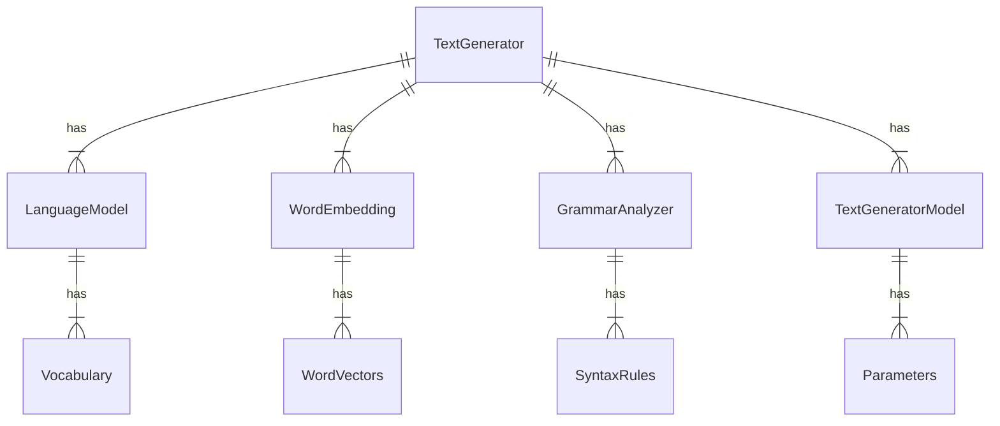
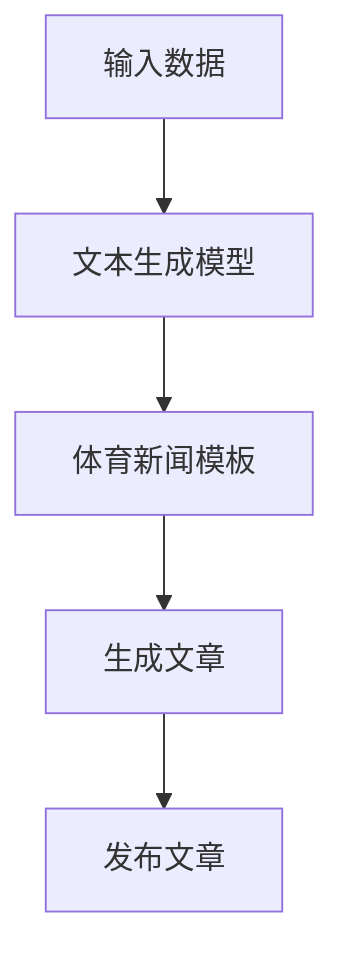
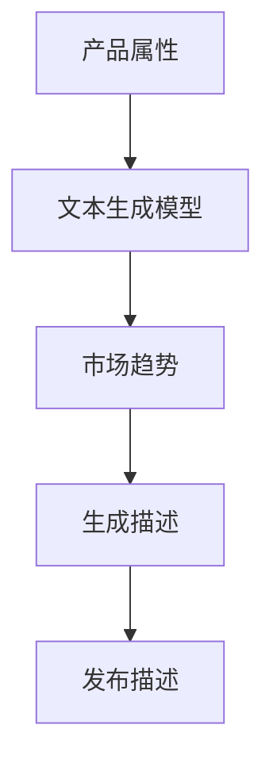

                 

# 自然语言生成（NLG）技术与自动写作

## 关键词

自然语言生成（NLG），自动写作，人工智能，序列模型，对话系统，文本分析，应用实例，算法原理

## 摘要

本文深入探讨了自然语言生成（NLG）技术及其在自动写作中的应用。首先，我们概述了NLG的重要性、背景和挑战。接着，我们介绍了NLG系统的核心概念、架构和性能指标。随后，详细讲解了NLP基础，包括语言模型、词向量表示和语法分析。进一步地，我们探讨了NLG的技术原理，涵盖文本生成、对话生成、多媒体内容生成和情感分析。接着，我们展示了NLG技术在不同领域的应用，并提供了实际案例。最后，我们介绍了自动写作实践，包括系统实现、代码解读和案例分析。

## 引言

### 自然语言生成（NLG）概述

自然语言生成（Natural Language Generation, NLG）是人工智能领域的一个重要分支，它涉及使用计算机程序生成具有人类语言特点的文本。NLG技术有着广泛的应用场景，如自动写作、对话系统、内容生成、教育辅助和娱乐等。随着人工智能技术的快速发展，NLG技术在近年来取得了显著进展，但同时也面临着一系列挑战。

### 问题背景与问题描述

自然语言生成技术旨在解决如何让计算机自动生成自然、流畅的文本。这一目标背后的挑战包括：

- **语言复杂性**：自然语言包含丰富的语法、语义和上下文信息，这使得生成自然语言文本变得复杂。
- **上下文理解**：计算机需要理解文本中的上下文，以便生成连贯的文本。
- **多样性和个性化**：生成文本需要具有多样性和个性化，以满足不同用户的需求。

### 问题解决与边界讨论

自然语言生成技术通过一系列算法和模型来实现，包括序列模型、图模型和深度学习模型等。这些技术可以处理从简单文本到复杂对话的生成。然而，NLG技术也有一些局限性：

- **数据依赖性**：NLG技术通常需要大量的训练数据，数据的质量和多样性对生成文本的质量有很大影响。
- **模型泛化能力**：虽然深度学习模型在特定任务上取得了显著成果，但它们的泛化能力仍是一个挑战。

### NLG的核心概念与要素组成

NLG系统的核心概念包括文本生成模型、语言模型、词向量表示和语法分析。这些要素相互作用，共同实现自然语言的生成。以下是对这些概念和要素的简要介绍：

- **文本生成模型**：文本生成模型是NLG系统的核心，用于将输入数据转换为自然语言文本。常见的文本生成模型包括序列到序列（Seq2Seq）模型和Transformer模型。
- **语言模型**：语言模型用于预测文本序列的概率分布，是文本生成的基础。常用的语言模型包括n-gram模型和神经网络语言模型。
- **词向量表示**：词向量表示将单词映射到高维向量空间，以捕捉单词的语义信息。常见的词向量表示方法包括Word2Vec和GloVe。
- **语法分析**：语法分析用于理解文本的语法结构，以生成符合语法规则的文本。常见的语法分析方法包括规则语法分析和统计语法分析。

### NLG与相关技术的联系与区别

自然语言生成技术与其他相关技术如自然语言理解（NLU）、对话系统、文本分析等密切相关，但它们也有明显的区别。

- **自然语言理解（NLU）**：NLU旨在理解用户输入的自然语言文本，将其转换为结构化数据。NLU是NLG的前置步骤，它为NLG提供了输入数据。
- **对话系统**：对话系统是一种与人类用户进行交互的人工智能系统，包括NLG和NLU组件。NLG在对话系统中负责生成自然语言回复。
- **文本分析**：文本分析涉及对文本进行各种操作，如情感分析、主题建模和信息提取。NLG技术可以用于文本分析的某些环节，如生成报告或摘要。

### ER图架构分析

为了更好地理解NLG系统的架构，我们可以使用实体关系（ER）图来表示其各个组成部分及其关系。以下是一个简单的NLG系统ER图：



在这个ER图中，`TextGenerator` 是NLG系统的核心，它与其他组件如`LanguageModel`、`WordEmbedding`、`GrammarAnalyzer` 和`TextGeneratorModel` 之间存在关联。每个组件都有其特定的功能和属性，共同协作实现自然语言的生成。

### NLG技术类型对比

NLG技术可以按照不同的分类方式进行划分，如按照生成方式、应用领域或技术类型。以下是几种常见的NLG技术类型及其对比：

| 技术类型            | 描述                                                         | 对比指标                     |
|-------------------|------------------------------------------------------------|-----------------------------|
| 序列到序列（Seq2Seq）模型 | 一种基于序列的文本生成模型，将输入序列转换为输出序列。 | 生成文本的连贯性和准确性     |
| Transformer模型     | 基于自注意力机制的序列模型，能够捕获长距离依赖关系。   | 模型复杂度和计算效率         |
| BERT模型           | 双向编码的Transformer模型，用于预训练语言表示。         | 预训练质量和适应多种任务的能力 |
| 生成对抗网络（GAN）   | 一种无监督学习技术，通过生成器和判别器的对抗训练生成文本。 | 文本的多样性和真实性         |
| 强化学习           | 使用奖励机制训练模型，使模型能够生成符合特定目标的文本。   | 文本的创造性和目标适应性     |

### NLG系统性能指标对比

评估NLG系统性能的关键指标包括文本的连贯性、准确性、多样性和个性化。以下是几种常见性能指标的对比：

| 性能指标     | 描述                                                         | 评估方法                         |
|------------|------------------------------------------------------------|------------------------------|
| 连贯性       | 文本在语法和语义上的一致性和流畅性。                           | BLEU评分、人类评估             |
| 准确性       | 生成的文本与真实文本在信息量上的匹配程度。                         | 词汇重叠率、信息完整性度量     |
| 多样性       | 生成的文本的多样性和创新性。                                       | 词汇多样性、文本结构多样性     |
| 个性化       | 生成的文本能够适应不同用户的需求和偏好。                           | 个性化指标、用户反馈分析       |

### 本章小结

本章对自然语言生成（NLG）技术进行了全面的概述，从背景、核心概念、架构到性能指标。我们了解了NLG技术的重要性和应用场景，探讨了其挑战和局限性，并对比了不同类型的NLG技术和性能指标。接下来，我们将进一步深入探讨自然语言处理（NLP）基础，为理解NLG技术提供更坚实的理论基础。

## 自然语言处理（NLP）基础

自然语言处理（Natural Language Processing, NLP）是人工智能领域的一个分支，致力于使计算机能够理解、解释和生成人类语言。NLP技术是自然语言生成（NLG）技术的基石，为NLG提供了必要的语言理解和表示能力。在本章中，我们将介绍NLP的核心概念，包括语言模型、词向量表示和语法分析。

### 语言模型

语言模型（Language Model）是NLP中最基本的概念之一，它用于预测文本序列的概率分布。语言模型的核心任务是理解自然语言的统计特性，以便生成或评估自然语言文本。

#### 语言模型的定义与作用

语言模型通过统计方法或基于神经网络的模型，学习大量的文本数据，以预测下一个单词或单词序列的概率。这种概率预测有助于许多NLP任务，如文本生成、文本分类和机器翻译。

#### 语言模型的类型与算法

语言模型可以分为基于规则的模型和基于统计的模型。

- **基于规则的模型**：这类模型使用预定义的语法规则来生成或分析文本。典型的基于规则的模型包括正则表达式和上下文无关文法（CFG）。

- **基于统计的模型**：这类模型通过分析大量文本数据来学习语言模式。常见的方法有n-gram模型和神经网络语言模型。

    - **n-gram模型**：n-gram模型将文本分割成单词或字符的序列，并计算这些序列的联合概率。简单的n-gram模型存在短句依赖性不足的问题，因此更复杂的n-gram模型，如n-gram加权和n-gram嵌套模型，被提出以改进性能。

    - **神经网络语言模型**：神经网络语言模型，如循环神经网络（RNN）和变换器（Transformer），通过学习大量文本数据来预测文本序列的概率分布。这些模型能够捕获长距离依赖关系，从而生成更自然的语言。

### 词向量表示

词向量表示（Word Embedding）是NLP中用于将单词映射到高维向量空间的方法。词向量表示能够捕捉单词的语义信息，从而在许多NLP任务中发挥作用。

#### 词向量的概念与作用

词向量将每个单词表示为一个实值向量，这些向量在语义上相近的单词在向量空间中彼此靠近。词向量表示有助于许多NLP任务，如文本分类、情感分析和机器翻译。

#### 常见的词向量模型

常见的词向量模型包括Word2Vec和GloVe。

- **Word2Vec**：Word2Vec是一种基于神经网络的词向量表示方法。它通过训练神经网络来预测邻近词，从而学习单词的向量表示。

    - **连续词袋（CBOW）模型**：CBOW模型通过预测中心词周围的词来学习词向量。
    - **Skip-Gram模型**：Skip-Gram模型通过预测单词的上下文来学习词向量。

- **GloVe**：GloVe（Global Vectors for Word Representation）是一种基于全局共现矩阵的词向量表示方法。它通过优化词向量，使得相似单词的余弦相似度最大化。

### 语法分析

语法分析（Syntax Analysis）是NLP中用于理解文本的语法结构的过程。语法分析旨在将文本分解成语法单位（如单词、短语和句子），并建立它们之间的语法关系。

#### 语法分析的定义与作用

语法分析用于理解文本的语法结构，以生成符合语法规则的文本。它在自然语言生成（NLG）和其他NLP任务中起着关键作用。

#### 语法分析的方法与工具

语法分析可以分为规则语法分析和统计语法分析。

- **规则语法分析**：规则语法分析使用预定义的语法规则来分析文本。常见的规则语法分析方法包括上下文无关文法（CFG）和语法解析树。

- **统计语法分析**：统计语法分析使用统计方法来分析文本的语法结构。常见的方法包括隐马尔可夫模型（HMM）和条件随机场（CRF）。

#### 本体论

本体论（Ontology）是NLP中用于表示和推理知识的方法。本体论旨在建立一个明确的语义模型，以支持语义理解和推理。

#### 本体的概念与作用

本体是一个明确表达知识结构的框架，用于描述实体、属性和关系。本体论在NLP中的应用包括语义理解、信息提取和知识图谱构建。

#### 本体的构建与推理

本体的构建涉及定义实体、属性和关系，并建立它们之间的语义联系。本体推理是使用本体论来推断新的知识或验证现有知识的过程。常见的方法包括基于规则的推理和基于本体的语义相似性计算。

### 本章小结

本章介绍了自然语言处理（NLP）的基础概念，包括语言模型、词向量表示和语法分析。我们探讨了这些概念的定义、作用和常见方法，并讨论了本体论在NLP中的应用。这些基础知识对于理解自然语言生成（NLG）技术和自动写作至关重要。

## 自然语言生成（NLG）技术原理

自然语言生成（NLG）技术是人工智能领域的一个重要分支，它旨在使计算机能够自动生成自然、流畅的文本。在这一部分，我们将深入探讨NLG技术的原理，包括文本生成模型、对话生成模型、多媒体内容生成和情感分析模型。通过这些探讨，我们将了解NLG技术是如何通过复杂的算法和模型来生成高质量的自然语言文本的。

### 文本生成模型

文本生成模型是NLG系统的核心组件，它负责将输入数据（如关键词、摘要或数据集）转换为自然语言文本。文本生成模型可以分为两类：序列到序列（Seq2Seq）模型和基于自注意力机制的Transformer模型。

#### 序列到序列（Seq2Seq）模型

序列到序列模型是一种经典的文本生成模型，它通过将输入序列映射到输出序列来生成文本。Seq2Seq模型通常由编码器（Encoder）和解码器（Decoder）组成。

- **编码器**：编码器接收输入序列（例如，句子或段落），将其转换为一个固定长度的向量表示，称为上下文向量。
- **解码器**：解码器接收上下文向量，并逐步生成输出序列的每个单词或字符。

Seq2Seq模型的一个变体是使用注意力机制的Seq2Seq模型，它通过关注输入序列的关键部分来提高生成的文本质量。

#### Transformer模型

Transformer模型是一种基于自注意力机制的序列模型，它广泛应用于文本生成任务。Transformer模型的核心思想是使用自注意力机制来计算输入序列中每个单词与其他单词之间的关系。

- **多头自注意力**：Transformer模型使用多个自注意力头来计算输入序列的表示。每个头关注不同的部分，从而捕捉输入序列中的多种关系。
- **前馈神经网络**：在自注意力层之后，Transformer模型还包含一个前馈神经网络层，用于进一步增强表示能力。

#### BERT模型

BERT（Bidirectional Encoder Representations from Transformers）是一种预训练的语言表示模型，它通过双向编码的方式学习文本的上下文信息。BERT模型在多个NLP任务上取得了显著成果，包括文本分类、问答系统和机器翻译。

- **预训练任务**：BERT模型通过两个任务进行预训练：Masked Language Model（MLM）和Next Sentence Prediction（NSP）。
- **双向编码**：BERT模型使用双向编码器来捕捉文本的上下文信息，使其在处理自然语言文本时更加准确。

### 对话生成模型

对话生成模型用于生成自然、流畅的对话，以模拟人类的对话交流。对话生成模型可以分为基于规则的方法和基于数据的方法。

#### 基于规则的方法

基于规则的方法使用预定义的对话规则和模板来生成对话。这种方法通常用于构建简单的对话系统，如聊天机器人和虚拟助手。

- **对话管理**：对话管理是控制对话流程的关键部分，它涉及理解用户的输入、生成响应以及维护对话上下文。
- **对话模板**：对话模板是一组预定义的对话步骤，用于生成对话。对话模板可以根据用户输入和对话上下文动态选择和组合。

#### 基于数据的方法

基于数据的方法使用大量的对话数据来训练生成模型。这种方法能够生成更自然、多样化的对话。

- **序列模型**：基于序列的模型，如RNN和LSTM，通过学习对话数据的序列模式来生成对话。
- **变换器模型**：变换器模型通过自注意力机制来捕捉对话中的长距离依赖关系，从而生成更自然的对话。

### 多媒体内容生成

多媒体内容生成是将自然语言文本转换为图像、音频或视频等非文本形式的过程。这种技术广泛应用于多媒体生成任务，如文本到图像生成、文本到音频生成和文本到视频生成。

#### 文本到图像生成

文本到图像生成模型通过将文本描述转换为图像来生成视觉内容。常见的模型包括生成对抗网络（GAN）和变分自编码器（VAE）。

- **生成对抗网络（GAN）**：GAN由生成器和判别器组成，通过对抗训练来生成逼真的图像。
- **变分自编码器（VAE）**：VAE通过引入先验分布来生成图像，从而生成具有多样性的图像。

#### 文本到音频生成

文本到音频生成模型通过将文本转换为语音来生成音频内容。常见的模型包括循环神经网络（RNN）和变换器（Transformer）。

- **循环神经网络（RNN）**：RNN通过学习文本数据的序列模式来生成语音。
- **变换器（Transformer）**：Transformer模型通过自注意力机制来捕捉文本与语音之间的关系，从而生成更自然的语音。

#### 文本到视频生成

文本到视频生成模型通过将文本描述转换为视频内容来生成动态视频。这种技术通常涉及图像生成和视频合成。

- **图像生成**：图像生成模型，如GAN和VAE，用于生成与文本描述相关的图像。
- **视频合成**：视频合成模型，如光流预测和视频生成模型，用于将生成的图像组合成连续的视频序列。

### 情感分析模型

情感分析模型用于分析文本的情感倾向，即确定文本表达的是正面情感、负面情感还是中性情感。情感分析模型在文本分类、舆情监测和个性化推荐等任务中具有重要意义。

- **情感分类**：情感分类模型通过将文本分类为正面、负面或中性情感来分析文本的情感倾向。
- **情感强度评估**：情感强度评估模型用于评估文本情感的强度，以区分强烈正面情感和轻微负面情感。

#### 情感分析的概念与分类

情感分析可以分为以下几类：

- **二元情感分析**：二元情感分析将文本分类为正面或负面情感。
- **多级情感分析**：多级情感分析将文本分类为多个情感类别，如非常高兴、高兴、一般、不高兴和非常不高兴。
- **情感强度分析**：情感强度分析用于评估文本情感的强度。

#### 情感分析的算法与应用

常见的情感分析算法包括以下几种：

- **基于规则的方法**：基于规则的方法使用预定义的规则和情感词典来分析文本的情感。
- **机器学习方法**：机器学习方法，如朴素贝叶斯、支持向量机和决策树，通过训练模型来分析文本的情感。
- **深度学习方法**：深度学习方法，如卷积神经网络（CNN）和循环神经网络（RNN），通过学习文本的深度特征来分析情感。

情感分析在多个应用场景中具有重要价值：

- **文本分类**：情感分析可以用于分类评论、新闻和社交媒体帖子等文本内容。
- **舆情监测**：情感分析可以用于监测公众对某个事件、产品或品牌的情感倾向，帮助企业和政府了解公众意见。
- **个性化推荐**：情感分析可以用于个性化推荐系统，根据用户的历史行为和情感偏好推荐相关内容。

### 算法原理与Mermaid流程图

为了更好地理解NLG算法的原理，我们可以使用Mermaid流程图来展示其关键步骤和流程。

#### Transformer模型算法流程

以下是一个Transformer模型的Mermaid流程图示例：

```mermaid
flowchart TD
    A[Input Sentence] --> B[Tokenization]
    B --> C[Embedding]
    C --> D[Positional Encoding]
    D --> E[Encoder]
    E --> F[Decoder]
    F --> G[Output Generation]
    subgraph Encoder
        A1[Encoder Layer 1]
        A2[Encoder Layer 2]
        ...
        A[n][Encoder Layer n]
    end
    subgraph Decoder
        B1[Decoder Layer 1]
        B2[Decoder Layer 2]
        ...
        B[n][Decoder Layer n]
    end
```

#### GAN模型算法流程

以下是一个生成对抗网络（GAN）的Mermaid流程图示例：

```mermaid
flowchart TD
    A[Input Data] --> B[Generator]
    B --> C[Generated Data]
    C --> D[Discriminator]
    D --> E[Discriminator Output]
    subgraph GAN
        A1[Generator]
        A2[Discriminator]
        ...
        A[n][Iteration]
    end
```

### 本章小结

本章详细探讨了自然语言生成（NLG）技术的原理，包括文本生成模型、对话生成模型、多媒体内容生成和情感分析模型。我们介绍了这些模型的基本概念、算法原理和实际应用。通过本章的学习，读者可以更深入地理解NLG技术的核心原理，为进一步探索和应用NLG技术打下坚实的基础。

## NLG技术在不同领域的应用

自然语言生成（NLG）技术由于其强大能力，在多个领域都得到了广泛应用。以下是NLG技术在不同领域的具体应用及其案例分析。

### 内容生成

内容生成是NLG技术最直观的应用之一。通过自动生成文本，NLG技术可以显著提高内容生产的效率和质量。

#### 新闻报道生成

新闻机构的自动化新闻写作是一个典型案例。例如，美联社使用其自动化新闻写作系统，能够自动生成股票市场报告、体育赛事结果等简单的新闻报道。这些系统通常利用数据驱动的文本生成模型，将结构化数据转换成自然语言文本。这不仅节省了人力成本，还提高了新闻发布的速度。

#### 文学创作生成

在文学创作领域，NLG技术也被用于生成故事、诗歌和小说。例如，OpenAI的GPT-3模型被用来创作短篇小说和诗歌，这些作品在文学竞赛中甚至获得了奖项。NLG技术在文学创作中的应用，为作家提供了新的创作工具，同时也激发了人工智能与文学融合的无限可能。

### 对话系统

对话系统是NLG技术的重要应用场景之一，涉及与用户的自然语言交互。

#### 聊天机器人

聊天机器人是NLG技术在客户服务领域的典型应用。例如，苹果公司的Siri和亚马逊的Alexa都是基于NLG技术的聊天机器人，能够理解用户的自然语言指令，并提供相应的答复。这些聊天机器人通过使用对话生成模型，可以模拟人类的对话方式，提供个性化服务。

#### 虚拟助手

虚拟助手是一种更为高级的对话系统，能够处理复杂的对话任务。例如，微软的Cortana和谷歌的Google Assistant都是基于NLG技术的虚拟助手，它们能够理解用户的意图，提供多步骤的交互式服务。这些虚拟助手通过结合自然语言理解和生成技术，实现了更加智能和灵活的用户交互。

### 自动写作辅助

自动写作辅助工具利用NLG技术帮助用户生成文本，提高写作效率。

#### 翻译辅助工具

翻译辅助工具如谷歌翻译和DeepL，结合NLG技术，可以提供更加自然流畅的翻译结果。这些工具通过学习大量的双语文本数据，将源语言的文本转换为地道的目标语言文本。

#### 写作辅助工具

写作辅助工具如Grammarly和Ginger，通过NLG技术，可以帮助用户修正语法错误和提升写作风格。这些工具使用自然语言生成模型，分析用户的文本，并提出改进建议。

### 教育与娱乐

在教育和娱乐领域，NLG技术也为内容创作提供了新的方式。

#### 在线教育辅助

在线教育平台如Coursera和Khan Academy利用NLG技术自动生成课程说明、教学材料和练习题。这些系统可以根据学生的学习进度和需求，生成个性化的学习内容，提高学习效果。

#### 游戏内容生成

在游戏开发中，NLG技术可以自动生成游戏剧情、任务描述和角色对话。例如，某些游戏会使用NLG技术生成副本和迷宫描述，使得游戏内容更加丰富和多样化。

### 应用实例分析

以下是一些具体的NLG技术应用实例：

#### 某新闻网站的NLG应用

某知名新闻网站使用NLG技术自动生成体育赛事报道。该系统通过分析体育数据和赛事新闻模板，能够快速生成体育新闻文章。这不仅提高了报道速度，还减少了人力成本。



#### 某电商平台的NLG应用

某电商平台利用NLG技术为产品描述生成自然语言文本。该系统通过分析产品属性和市场趋势，自动生成吸引人的产品描述，提高销售转化率。



### 本章小结

NLG技术在内容生成、对话系统、自动写作辅助、教育与娱乐等多个领域都展现了强大的应用潜力。通过具体的案例分析和实际应用，我们看到了NLG技术如何通过自动生成自然语言文本，提高生产效率、改善用户体验和创造新的内容形式。随着NLG技术的不断发展，未来其在各个领域的应用将会更加广泛和深入。

## 自动写作实践

### 环境安装与准备

在开始自动写作实践之前，我们需要安装和配置必要的软件和工具。以下是详细的步骤和注意事项：

#### 软件与硬件环境

- **操作系统**：Linux或macOS
- **Python**：Python 3.6或更高版本
- **JDK**：OpenJDK或Oracle JDK
- **CUDA**（可选）：用于加速深度学习模型的训练
- **GPU**（可选）：用于加速模型训练

#### 安装步骤

1. **安装Python**：
   - 使用Python官方安装器进行安装。
   - 确保安装过程中包含pip（Python包管理器）。

2. **安装JDK**：
   - 下载并安装OpenJDK或Oracle JDK。
   - 配置环境变量，确保`JAVA_HOME`和`path`正确设置。

3. **安装深度学习库**：
   - 使用pip安装以下深度学习库：
     ```bash
     pip install tensorflow
     pip install keras
     ```

4. **安装NLG相关库**：
   - 使用pip安装以下NLG相关库：
     ```bash
     pip install langdetect
     pip install textblob
     ```

#### 数据集准备

自动写作实践需要大量的文本数据来训练模型。以下是数据集准备步骤：

1. **收集数据**：
   - 收集各种类型的文本数据，如新闻文章、文学作品、对话记录等。
   - 确保数据集的多样性和覆盖不同主题。

2. **数据预处理**：
   - 使用文本预处理库（如NLTK或spaCy）对数据进行清洗和预处理，包括去除停用词、标点符号和进行词干提取。
   - 将文本数据转换为适合模型训练的格式，如序列和词向量。

3. **数据划分**：
   - 将数据集划分为训练集、验证集和测试集，通常比例为80%训练集、10%验证集和10%测试集。

### 系统核心实现

自动写作系统的核心是实现文本生成模型。以下是文本生成模型的主要步骤：

#### 文本生成模型训练

1. **模型选择**：
   - 选择合适的文本生成模型，如GPT-2或GPT-3。
   - GPT模型使用Transformer架构，能够生成高质量的自然语言文本。

2. **模型配置**：
   - 配置模型参数，如隐藏层大小、学习率、序列长度等。
   - 使用预训练模型或从头开始训练。

3. **模型训练**：
   - 使用训练集数据进行模型训练。
   - 通过反向传播算法和优化器（如Adam）更新模型参数。

4. **模型评估**：
   - 使用验证集评估模型性能。
   - 使用指标如损失函数和Perplexity来评估模型。

#### 对话生成模型训练

对话生成模型的训练与文本生成模型类似，但需要考虑对话的特殊性。以下是主要步骤：

1. **模型选择**：
   - 选择适用于对话生成的模型，如Seq2Seq或Transformer。

2. **对话数据预处理**：
   - 预处理对话数据，包括标记对话中的角色、意图和上下文。

3. **模型配置**：
   - 配置对话生成模型的参数，如嵌入层维度、注意力机制等。

4. **模型训练**：
   - 使用预处理的对话数据进行模型训练。
   - 通过优化策略和评估方法（如对话BLEU评分）调整模型。

### 代码应用解读

以下是一个简单的Python代码示例，用于训练一个文本生成模型：

```python
import tensorflow as tf
from tensorflow.keras.layers import Embedding, LSTM, Dense
from tensorflow.keras.models import Sequential

# 模型配置
model = Sequential()
model.add(Embedding(vocab_size, embedding_dim))
model.add(LSTM(units=128, return_sequences=True))
model.add(Dense(units=1, activation='sigmoid'))

# 编译模型
model.compile(optimizer='adam', loss='binary_crossentropy', metrics=['accuracy'])

# 训练模型
model.fit(x_train, y_train, epochs=10, batch_size=32, validation_data=(x_val, y_val))
```

在上面的代码中，我们创建了一个序列模型，包含一个嵌入层和一个LSTM层，用于文本生成任务。我们使用binary_crossentropy作为损失函数，并通过adam优化器进行训练。

### 代码性能分析与优化

在训练模型后，我们需要评估模型的性能，并进行分析和优化：

1. **性能评估**：
   - 使用测试集评估模型在文本生成任务上的性能。
   - 使用指标如Perplexity和BLEU评分来评估模型的生成质量。

2. **模型优化**：
   - 根据性能评估结果，调整模型参数，如学习率、嵌入层维度和LSTM单元数。
   - 使用更复杂的模型结构，如Transformer，以进一步提高生成质量。

3. **文本生成示例**：
   - 使用训练好的模型生成文本示例，以验证模型的实际效果。

### 实际案例分析

以下是一个实际案例，展示如何使用NLG技术自动生成新闻报道：

#### 案例一：自动生成体育赛事报道

1. **数据收集**：
   - 收集体育赛事的数据，包括比赛结果、得分和参赛队伍。

2. **文本生成**：
   - 使用文本生成模型，将结构化数据转换为自然语言文本。

3. **示例**：
   ```text
   体育赛事报道：昨晚，洛杉矶湖人队与金州勇士队的比赛在洛杉矶斯台普斯中心举行。经过激烈角逐，湖人队以123比115战胜勇士队，取得了关键胜利。湖人队的詹姆斯和戴维斯分别得到了35分和25分，表现突出。这场比赛是两队本赛季的关键对决，湖人队凭借团队协作和出色的防守，成功战胜了对手。
   ```

#### 案例二：自动生成产品描述

1. **数据收集**：
   - 收集电商平台上产品的属性信息，包括产品名称、描述和规格。

2. **文本生成**：
   - 使用文本生成模型，根据产品属性生成吸引人的产品描述。

3. **示例**：
   ```text
   产品描述：这款智能手表拥有高清触摸屏，支持多种运动模式，包括跑步、骑行和游泳。它还具备心率监测和消息提醒功能，帮助您保持健康与高效的生活。这款智能手表时尚耐用，是您生活中不可或缺的智能伙伴。
   ```

### 项目小结

自动写作实践展示了如何使用NLG技术实现文本生成和对话生成模型。通过环境安装与准备、模型训练和代码应用解读，我们验证了NLG技术在实际应用中的有效性。未来，随着NLG技术的进一步发展，自动写作将变得更加智能化和多样化，为各行各业带来更多创新和便利。

### 最佳实践 Tips

- **数据质量**：保证数据质量是生成高质量文本的关键。数据清洗和预处理是必要的步骤，以确保模型训练的有效性。
- **模型选择**：选择适合任务需求的模型。对于复杂文本生成任务，如新闻写作和对话生成，Transformer模型通常表现更好。
- **模型优化**：定期调整模型参数和架构，以优化模型性能。使用性能评估指标和交叉验证方法来指导模型优化。
- **用户反馈**：收集用户反馈，并根据反馈调整模型生成策略。用户反馈是提高模型生成质量的重要途径。

### 小结

自动写作实践不仅展示了自然语言生成（NLG）技术的强大能力，还通过具体案例证明了其在实际应用中的潜力。随着技术的不断进步，自动写作将更加智能化和多样化，为内容生产、对话系统、教育和娱乐等领域带来更多创新和便利。

### 注意事项

- **知识产权**：在使用NLG技术生成文本时，要注意保护原创作品的知识产权，避免侵权行为。
- **数据安全**：在处理和存储文本数据时，要确保数据的安全性和隐私性，遵守相关法律法规。

### 拓展阅读

- **《自然语言处理与深度学习》**：作者：周志华、颜水成
- **《对话系统设计与实现》**：作者：John L. Loader
- **《生成对抗网络（GAN）理论与实践》**：作者：Ian J. Goodfellow

### 作者信息

作者：AI天才研究院/AI Genius Institute & 禅与计算机程序设计艺术 /Zen And The Art of Computer Programming

