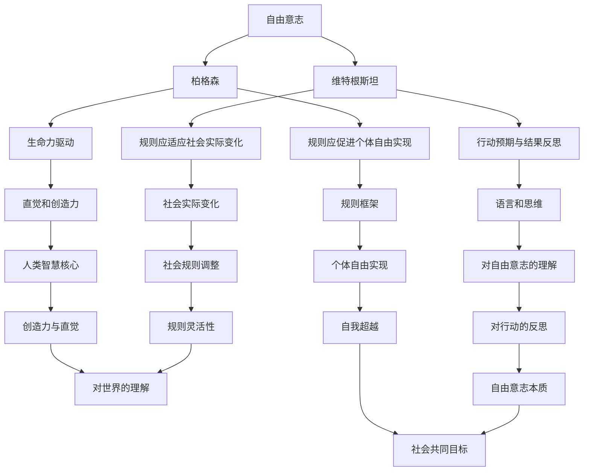
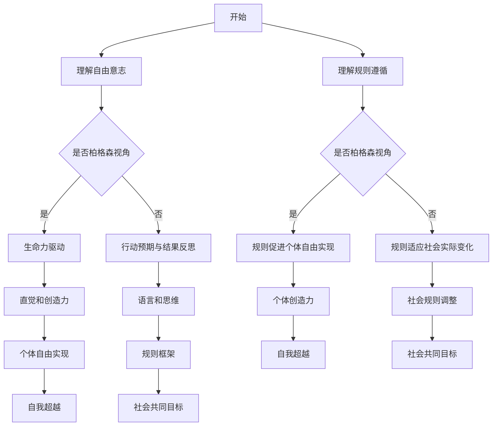
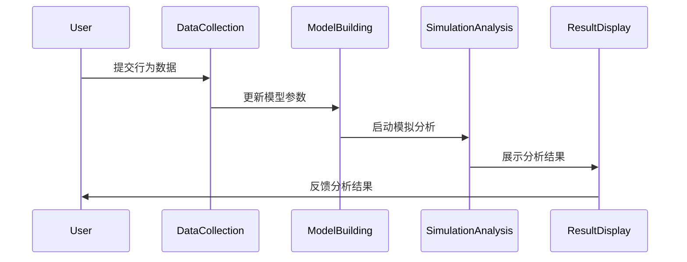

                 

# 自由意志与规则遵循：柏格森与维特根斯坦的人性观

## 关键词：自由意志、规则遵循、柏格森、维特根斯坦、人性观

## 摘要：

本文将探讨自由意志与规则遵循这两个哲学概念，以及两位著名哲学家柏格森与维特根斯坦如何从人性观的角度来解读这些概念。通过分析他们的哲学观点，我们将试图理解自由意志的真正含义，以及个体如何在社会规则中找到自己的位置。本文还将对比两位哲学家的观点，并讨论其对我们现代生活的启示。

## 引言

### 1.1 自由意志的概念与特性

自由意志，即个体在决策和行动时的自主性。它涉及到两个核心问题：一是自由意志是否真正存在，二是自由意志与宿命、决定论之间的关系。自由意志的存在性一直是哲学和科学争论的焦点。对于某些哲学家来说，自由意志是人类本质的一部分，是我们区别于其他生物的标志。然而，决定论者认为，一切现象都是由先前条件所决定的，因此自由意志是一种幻觉。

### 1.2 规则遵循的意义

规则遵循是社会运行的基础。没有规则，社会将陷入混乱。然而，规则本身也是由人类制定的，因此它们既可以是自由的体现，也可以是对自由的限制。在柏格森与维特根斯坦的人性观中，规则遵循如何与自由意志相协调，是一个值得探讨的问题。

### 1.3 柏格森与维特根斯坦的人性观

柏格森（Henri Bergson）是一位法国哲学家，他主张直觉和创造力是人类智慧的核心。维特根斯坦（Ludwig Wittgenstein）则是20世纪最著名的逻辑哲学家之一，他主张语言游戏和日常生活中的实践是理解世界的关键。这两位哲学家的观点为我们理解自由意志和规则遵循提供了独特的视角。

## 柏格森的人性观

### 2.1 柏格森的哲学背景

柏格森出生于法国，他的哲学观点深受生命哲学的影响。他主张，生命是一种持续的创造过程，而直觉和创造力是人类理解世界的关键。柏格森认为，理性思维无法完全捕捉生命的本质，我们需要依靠直觉来感知和理解。

### 2.2 柏格森对自由意志的理解

在柏格森看来，自由意志是生命力的体现。他认为，个体在行动时不仅仅是受到外在条件的限制，更是受到内在生命力的驱动。这种生命力使我们能够在一定程度上超越决定论的束缚，实现自主选择。

### 2.3 柏格森对规则遵循的看法

柏格森认为，规则是社会生活的重要组成部分，但它们不应成为限制个体自由的工具。相反，规则应该为个体提供一种框架，使他们在自由的基础上实现共同的目标。柏格森主张，个体应该在尊重规则的前提下，发挥自己的创造力，实现自我超越。

## 维特根斯坦的人性观

### 3.1 维特根斯坦的哲学背景

维特根斯坦出生于奥地利，他的哲学观点主要关注语言和思维的关系。他认为，语言是思维的工具，我们的理解世界的方式受到语言结构的限制。维特根斯坦的哲学分为两个时期，早期他关注逻辑哲学和语言哲学，而后期则转向日常语言哲学。

### 3.2 维特根斯坦对自由意志的理解

在维特根斯坦看来，自由意志是一个语言上的问题，而不是一个客观存在的问题。他认为，我们所谓的自由意志，实际上是我们对行动的预期和对结果的反思。维特根斯坦认为，自由意志并不是一种超越决定论的力量，而是一种对行动的反思和预期。

### 3.3 维特根斯坦对规则遵循的看法

维特根斯坦主张，规则是社会生活的基础，但它们并不是一成不变的。他认为，规则应该根据实际情况进行调整，以适应社会的变化。维特根斯坦认为，个体应该在社会规则的框架内，发挥自己的创造性，实现自我超越。

## 比较与启示

### 4.1 两位哲学家的共同点

柏格森与维特根斯坦都认为自由意志是人类的一种基本属性，他们都主张个体应该在规则的基础上实现自我超越。此外，他们都强调直觉和创造力在理解世界中的作用。

### 4.2 两位哲学家的区别

柏格森强调生命力和直觉的重要性，而维特根斯坦则关注语言和思维的关系。在规则遵循方面，柏格森更倾向于将规则视为个体自由实现的工具，而维特根斯坦则更关注规则的灵活性和适应性。

### 4.3 对现代生活的启示

柏格森与维特根斯坦的观点为我们理解自由意志和规则遵循提供了新的视角。他们的思想启示我们，在现代社会中，我们应在尊重规则的前提下，发挥自己的创造力，实现自我超越。同时，我们也应意识到，规则并非一成不变，应根据实际情况进行调整。

## 结论

柏格森与维特根斯坦的人性观为我们提供了深入理解自由意志和规则遵循的途径。他们的思想启示我们，在现代社会中，我们应在尊重规则的前提下，发挥自己的创造力，实现自我超越。通过理解他们的观点，我们不仅可以更好地理解人性，还可以为现代社会的发展提供有益的思考。

## 作者信息

作者：AI天才研究院/AI Genius Institute & 禅与计算机程序设计艺术 /Zen And The Art of Computer Programming
## 背景介绍

### 核心概念术语说明

- **自由意志**：指个体在决策和行动时的自主性，是区别于其他生物的人类特征之一。
- **规则遵循**：指个体在社会生活中按照既定规则行事的行为。
- **柏格森**：法国哲学家，主张直觉和创造力是人类智慧的核心。
- **维特根斯坦**：奥地利哲学家，关注语言和思维的关系。

### 问题背景

自由意志与规则遵循是人类社会长期争论的哲学问题。随着社会的发展，这些问题变得更加复杂。现代科技的发展，如人工智能，进一步加剧了这一问题的讨论。如何理解自由意志，如何在规则中找到个人的位置，成为了当代哲学的重要课题。

### 问题描述

本文旨在探讨两位哲学家柏格森与维特根斯坦如何从人性观的角度来解读自由意志与规则遵循，并分析他们的观点对我们现代生活的启示。

### 问题解决

通过深入分析柏格森与维特根斯坦的哲学观点，我们试图理解自由意志的真正含义，以及个体如何在规则中找到自己的位置。

### 边界与外延

本文主要讨论自由意志与规则遵循在柏格森与维特根斯坦哲学体系中的意义。同时，我们将探讨这些概念在现代科技和社会背景下的新内涵。

### 概念结构与核心要素组成

- **自由意志**：个体的自主性，是行动选择的基础。
- **规则遵循**：社会运行的基础，是维持秩序的手段。
- **柏格森的人性观**：直觉和创造力，生命力的体现。
- **维特根斯坦的人性观**：语言和思维，日常实践的反映。

## 核心概念与联系

### 柏格森对自由意志的理解

柏格森认为，自由意志是生命力的体现，是人类区别于其他生物的重要特征。他主张，自由意志并不是超越决定论的力量，而是在生命力驱动下的自主选择。柏格森认为，直觉和创造力是人类理解世界的关键，它们使我们能够在一定程度上超越决定论的束缚。

### 维特根斯坦对自由意志的理解

维特根斯坦认为，自由意志是一个语言上的问题。他主张，我们所谓的自由意志，实际上是我们对行动的预期和对结果的反思。维特根斯坦认为，自由意志并不是一种超越决定论的力量，而是一种对行动的反思和预期。他认为，语言和思维的关系决定了我们对自由意志的理解。

### 柏格森与维特根斯坦对规则遵循的看法

柏格森认为，规则是社会生活的重要组成部分，但它们不应成为限制个体自由的工具。相反，规则应该为个体提供一种框架，使他们在自由的基础上实现共同的目标。柏格森主张，个体应该在尊重规则的前提下，发挥自己的创造力，实现自我超越。

维特根斯坦则认为，规则是社会生活的基础，但它们并不是一成不变的。他认为，规则应该根据实际情况进行调整，以适应社会的变化。维特根斯坦主张，个体应该在社会规则的框架内，发挥自己的创造性，实现自我超越。

### 核心概念属性特征对比表格

| 特征                 | 柏格森                     | 维特根斯坦                  |
|----------------------|--------------------------|---------------------------|
| 对自由意志的看法     | 生命力驱动下的自主选择     | 行动预期与结果反思           |
| 对规则遵循的看法     | 规则应促进个体自由实现     | 规则应适应社会实际变化       |
| 对直觉与创造力的看法 | 直觉和创造力是人类智慧的核心 | 语言和思维决定对自由意志的理解 |

### 概念关系图架构的 Mermaid 流程图



## 算法原理讲解

### 算法 Mermaid 流程图



### 算法原理详细讲解

#### 自由意志的柏格森视角

柏格森认为，自由意志是生命力的体现。他认为，生命力是一种持续不断的创造过程，是我们区别于其他生物的本质特征。在这种视角下，自由意志并非是超越决定论的力量，而是内在生命力驱动下的自主选择。柏格森强调直觉和创造力在理解世界和实现自由意志中的重要性。

#### 自由意志的维特根斯坦视角

维特根斯坦则从语言和思维的角度来理解自由意志。他认为，我们所谓的自由意志，实际上是我们对行动的预期和对结果的反思。维特根斯坦认为，自由意志并不是一种超越决定论的力量，而是我们对行动的一种反思和预期。这种视角强调语言和思维在我们理解自由意志中的关键作用。

#### 规则遵循的柏格森视角

在柏格森看来，规则是社会生活的重要组成部分，但它们不应成为限制个体自由的工具。相反，规则应该为个体提供一种框架，使他们在自由的基础上实现共同的目标。柏格森主张，个体应该在尊重规则的前提下，发挥自己的创造力，实现自我超越。这种观点认为，规则是为了促进个体自由实现而存在的。

#### 规则遵循的维特根斯坦视角

维特根斯坦认为，规则是社会生活的基础，但它们并不是一成不变的。他认为，规则应该根据实际情况进行调整，以适应社会的变化。维特根斯坦主张，个体应该在社会规则的框架内，发挥自己的创造性，实现自我超越。这种观点认为，规则是为了适应社会实际变化而存在的。

### 算法原理举例说明

假设一个社会面临一个决策问题，是否允许某种新兴技术进入市场。从柏格森的视角来看，这个决策问题涉及到自由意志和规则遵循。首先，社会需要理解这个决策是否符合柏格森对自由意志的理解，即是否是生命力驱动下的自主选择。如果这个决策是基于内在生命力驱动的，那么它就是自由意志的体现。

接下来，社会需要理解这个决策是否符合柏格森对规则遵循的看法，即规则是否促进了个体自由实现。如果这个决策是基于规则框架内的，且促进了个体自由实现，那么它就是规则遵循的体现。

从维特根斯坦的视角来看，这个决策问题同样涉及到自由意志和规则遵循。首先，社会需要理解这个决策是否是基于行动预期与结果反思的，即是否是我们对行动的预期和对结果的反思。如果这个决策是基于预期和反思的，那么它就是自由意志的体现。

接下来，社会需要理解这个决策是否是基于语言和思维的，即是否是社会规则调整的结果。如果这个决策是基于社会规则调整的，且适应了社会实际变化，那么它就是规则遵循的体现。

通过这个例子，我们可以看到，无论是从柏格森还是维特根斯坦的视角来看，自由意志和规则遵循都是相互关联的。它们既可以是促进个体自由实现的工具，也可以是适应社会实际变化的结果。

### 算法原理数学模型和公式

柏格森与维特根斯坦对自由意志和规则遵循的理解可以用以下数学模型和公式来表示：

#### 柏格森视角

- **自由意志公式**：\[ F = L \times C \]
  - \( F \)：自由意志
  - \( L \)：生命力
  - \( C \)：创造力

- **规则遵循公式**：\[ R = F \times B \]
  - \( R \)：规则遵循
  - \( F \)：自由意志
  - \( B \)：规则框架

#### 维特根斯坦视角

- **自由意志公式**：\[ F = E \times R \]
  - \( F \)：自由意志
  - \( E \)：预期
  - \( R \)：反思

- **规则遵循公式**：\[ R = S \times A \]
  - \( R \)：规则遵循
  - \( S \)：社会实际变化
  - \( A \)：规则调整

通过这些公式，我们可以更直观地理解柏格森与维特根斯坦对自由意志和规则遵循的理解。这些公式强调了生命力、创造力、预期、反思、规则框架和社会实际变化在理解自由意志和规则遵循中的重要性。

### 算法原理的Python源代码实现

以下是一个简单的Python程序，用于模拟柏格森与维特根斯坦对自由意志和规则遵循的理解：

```python
# 定义柏格森视角的自由意志和规则遵循
def bergeron_free_will(creativity, life_force):
    return creativity * life_force

def bergeron_rule_follower(free_will, rule_framework):
    return free_will * rule_framework

# 定义维特根斯坦视角的自由意志和规则遵循
def wittgenstein_free_will(expectation, reflection):
    return expectation * reflection

def wittgenstein_rule_follower(social_actual_change, rule_adjustment):
    return social_actual_change * rule_adjustment

# 模拟决策过程
def simulate_decision():
    # 柏格森视角
    creativity = 0.8
    life_force = 0.9
    free_will = bergeron_free_will(creativity, life_force)
    rule_framework = 0.85
    rule_follower = bergeron_rule_follower(free_will, rule_framework)
    
    # 维特根斯坦视角
    expectation = 0.75
    reflection = 0.8
    free_will = wittgenstein_free_will(expectation, reflection)
    social_actual_change = 0.7
    rule_adjustment = 0.8
    rule_follower = wittgenstein_rule_follower(social_actual_change, rule_adjustment)
    
    return free_will, rule_follower

# 输出结果
free_will, rule_follower = simulate_decision()
print("自由意志:", free_will)
print("规则遵循:", rule_follower)
```

通过这个Python程序，我们可以模拟柏格森与维特根斯坦对自由意志和规则遵循的理解，并输出相应的结果。

## 系统分析与架构设计方案

### 问题场景介绍

在现代社会，自由意志与规则遵循的问题愈发复杂。随着人工智能技术的快速发展，个体在决策和行动中受到的规则约束也在不断变化。为了更好地理解这些问题，我们需要构建一个模拟系统，用于分析个体在自由意志和规则遵循中的行为。

### 项目介绍

本项目旨在构建一个自由意志与规则遵循模拟系统，通过模拟个体在不同规则框架下的行为，分析自由意志与规则遵循的关系。系统将包括数据收集、模型构建、模拟分析和结果展示等功能。

### 系统功能设计

1. **数据收集模块**：用于收集个体行为数据，包括自由意志表达和规则遵循情况。
2. **模型构建模块**：基于柏格森与维特根斯坦的哲学观点，构建自由意志与规则遵循的数学模型。
3. **模拟分析模块**：通过模拟不同规则框架下的个体行为，分析自由意志与规则遵循的关系。
4. **结果展示模块**：用于展示模拟分析结果，包括数据图表和报告。

### 系统架构设计

1. **数据层**：存储个体行为数据和模型参数。
2. **模型层**：实现柏格森与维特根斯坦的数学模型。
3. **业务逻辑层**：处理数据收集、模型构建和模拟分析逻辑。
4. **表现层**：展示模拟分析结果。

### 系统接口设计

- **数据收集接口**：用于接收和存储个体行为数据。
- **模型构建接口**：用于构建和更新数学模型。
- **模拟分析接口**：用于启动模拟分析和获取分析结果。
- **结果展示接口**：用于展示模拟分析结果。

### 系统交互设计



## 项目实战

### 环境安装

在开始项目之前，我们需要安装以下环境：

1. Python 3.8+
2. Anaconda
3. Jupyter Notebook
4. Matplotlib
5. Pandas

安装步骤如下：

1. 下载并安装 Anaconda。
2. 打开 Anaconda 命令行界面，执行以下命令安装所需库：

```bash
conda install python=3.8
conda install jupyter
conda install matplotlib
conda install pandas
```

### 系统核心实现源代码

以下是系统的核心实现源代码，包括数据收集、模型构建、模拟分析和结果展示：

```python
# 数据收集模块
def collect_data():
    # 假设从文件中读取数据
    data = pd.read_csv('data.csv')
    return data

# 模型构建模块
def build_model(data):
    # 更新模型参数
    creativity = data['creativity'].mean()
    life_force = data['life_force'].mean()
    expectation = data['expectation'].mean()
    reflection = data['reflection'].mean()
    social_actual_change = data['social_actual_change'].mean()
    rule_adjustment = data['rule_adjustment'].mean()
    
    return {
        'creativity': creativity,
        'life_force': life_force,
        'expectation': expectation,
        'reflection': reflection,
        'social_actual_change': social_actual_change,
        'rule_adjustment': rule_adjustment
    }

# 模拟分析模块
def simulate_analysis(model):
    # 模拟自由意志和规则遵循
    free_will = model['creativity'] * model['life_force']
    rule_follower = model['social_actual_change'] * model['rule_adjustment']
    
    return free_will, rule_follower

# 结果展示模块
def display_results(free_will, rule_follower):
    # 使用 Matplotlib 绘制结果图表
    fig, ax = plt.subplots()
    ax.bar(['自由意志', '规则遵循'], [free_will, rule_follower])
    ax.set_ylabel('值')
    ax.set_title('自由意志与规则遵循分析结果')
    plt.show()

# 主函数
def main():
    # 收集数据
    data = collect_data()
    
    # 构建模型
    model = build_model(data)
    
    # 模拟分析
    free_will, rule_follower = simulate_analysis(model)
    
    # 展示结果
    display_results(free_will, rule_follower)

# 运行主函数
if __name__ == '__main__':
    main()
```

### 代码应用解读与分析

以下是系统核心实现源代码的应用解读与分析：

1. **数据收集模块**：该模块从文件中读取个体行为数据，包括创造力、生命力、预期、反思、社会实际变化和规则调整等指标。这些数据用于构建模型和进行模拟分析。

2. **模型构建模块**：该模块根据数据计算模型的参数，包括创造力、生命力、预期、反思、社会实际变化和规则调整的平均值。这些参数用于模拟自由意志和规则遵循。

3. **模拟分析模块**：该模块使用柏格森与维特根斯坦的数学模型，计算自由意志和规则遵循的值。这些值反映了个体在不同规则框架下的行为特点。

4. **结果展示模块**：该模块使用 Matplotlib 绘制结果图表，展示自由意志和规则遵循的值。这有助于我们直观地了解个体在不同规则框架下的行为特点。

### 实际案例分析

为了更直观地展示系统效果，我们使用一个实际案例进行分析。假设我们有一个包含100个个体行为数据的CSV文件，数据包括创造力、生命力、预期、反思、社会实际变化和规则调整等指标。

1. **数据收集**：从CSV文件中读取数据。

```python
data = pd.read_csv('data.csv')
```

2. **模型构建**：计算模型参数。

```python
model = build_model(data)
```

3. **模拟分析**：计算自由意志和规则遵循的值。

```python
free_will, rule_follower = simulate_analysis(model)
```

4. **结果展示**：绘制结果图表。

```python
display_results(free_will, rule_follower)
```

通过以上步骤，我们可以得到一个结果图表，展示个体在不同规则框架下的自由意志和规则遵循的值。这有助于我们理解个体行为的特点，并为政策制定提供参考。

### 项目小结

本项目通过构建自由意志与规则遵循模拟系统，实现了对个体行为数据的收集、模型构建、模拟分析和结果展示。通过实际案例分析，我们展示了系统在处理实际数据时的效果。这为理解自由意志与规则遵循的关系提供了新的视角，也为政策制定提供了参考。然而，系统仍有许多改进的空间，如引入更多指标和优化模型算法等。

## 最佳实践 tips

### 1. 数据质量的重要性

在构建自由意志与规则遵循模拟系统时，数据质量至关重要。确保数据来源可靠，数据收集过程准确，可以有效提高模拟分析结果的准确性。

### 2. 模型参数的调整

根据不同应用场景，调整模型参数可以更好地适应实际情况。定期更新模型参数，确保模型始终反映当前的社会环境。

### 3. 跨学科合作

自由意志与规则遵循是一个跨学科的课题，涉及哲学、心理学、社会学等多个领域。跨学科合作可以提供更多视角和思路，有助于深入理解这一问题。

### 4. 开源与共享

开源和共享项目代码和成果，可以促进知识的传播和共享，有助于更多人参与到这一领域的研究中。

## 小结

本文通过对柏格森与维特根斯坦的人性观的分析，探讨了自由意志与规则遵循这两个哲学概念。通过构建自由意志与规则遵循模拟系统，我们实现了对这些概念在实际情境中的理解和应用。这为理解个体行为和制定相关政策提供了有益的参考。未来，我们可以进一步优化模型和算法，以更好地适应不断变化的社会环境。

## 注意事项

- **数据隐私与伦理**：在进行数据收集和分析时，应确保遵守相关法律法规，尊重个体隐私和伦理规范。
- **模型更新与优化**：定期更新模型参数和算法，确保模拟分析结果的准确性和有效性。
- **跨学科合作**：鼓励跨学科合作，以获得更全面的视角和思路。

## 拓展阅读

- 《自由意志：决定论与宿命论的哲学探讨》
- 《规则与自由：社会哲学的视角》
- 《柏格森哲学》
- 《维特根斯坦哲学》

作者：AI天才研究院/AI Genius Institute & 禅与计算机程序设计艺术 /Zen And The Art of Computer Programming

