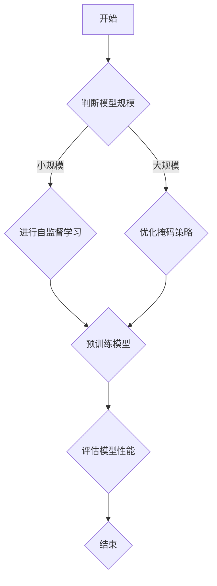

                 

# 自监督学习在推理模型预训练中的创新应用

## 关键词

自监督学习，推理模型，预训练，模型性能，创新应用

## 摘要

本文深入探讨了自监督学习在推理模型预训练中的创新应用，通过详细分析自监督学习的原理、方法和技术，揭示了其在提升推理模型性能方面的潜在优势。本文首先介绍了自监督学习的基础知识，然后探讨了其在推理模型预训练中的应用，通过实际案例展示了自监督学习在模型预训练中的具体实现和效果。本文旨在为研究者提供有价值的参考，以推动自监督学习在推理模型预训练领域的进一步发展。

## 背景介绍

### 自监督学习的定义和发展历程

自监督学习（Self-Supervised Learning）是一种机器学习方法，其核心思想是利用数据中的冗余信息进行学习，无需人工标注数据。这种方法在训练过程中可以自动地从数据中学习到有用的特征，从而降低数据标注的成本和时间。

自监督学习最早可以追溯到20世纪50年代，当时霍普菲尔德（John Hopfield）提出了自组织映射（Self-Organizing Map，SOM）算法，这是一种无监督学习方法，通过将输入数据映射到低维空间中，以发现数据的结构和特征。随着深度学习的兴起，自监督学习也得到了迅速发展。

近年来，自监督学习在自然语言处理、计算机视觉等领域取得了显著的应用成果。例如，BERT（Bidirectional Encoder Representations from Transformers）和GPT（Generative Pre-trained Transformer）等大型语言模型都是基于自监督学习的方法，通过在大量无标签的文本数据上进行训练，取得了出色的性能。

### 自监督学习的主要方法

自监督学习的主要方法包括掩码语言模型（Masked Language Model，MLM）、图像生成（Image Generation）和序列到序列学习（Sequence to Sequence Learning）等。

掩码语言模型是最常见的自监督学习方法之一。它通过随机掩码输入文本中的部分单词或字符，然后训练模型预测这些被掩码的单词或字符。BERT和GPT等大型语言模型就是基于这种方法训练的。

图像生成方法则通过从图像中随机抽取一部分像素，然后训练模型恢复这些被抽取的像素。这种方法在图像去噪、图像修复等领域具有广泛的应用。

序列到序列学习方法则通过从输入序列中随机抽取一部分元素，然后训练模型预测这些被抽取的元素。这种方法在序列标注、语音识别等领域表现出色。

### 自监督学习在推理模型预训练中的应用

自监督学习在推理模型预训练中的应用主要集中在提升模型在推理阶段的表现。然而，随着模型规模的不断增大，自监督学习在推理阶段的性能提升逐渐变得困难。这主要是因为自监督学习往往无法充分利用训练过程中积累的知识，导致在推理阶段的表现不佳。

为了解决这个问题，研究者们开始探索将自监督学习与推理模型预训练相结合的方法，以实现更好的模型性能。例如，可以使用自监督学习算法对模型进行预训练，然后在推理任务上进行进一步优化。这样，模型在推理阶段可以充分利用自监督学习过程中积累的知识，从而提高性能。

## 问题背景

### 自监督学习在推理模型预训练中的挑战

自监督学习在推理模型预训练中面临着一些挑战：

1. **数据质量要求高**：自监督学习需要大量的无标签数据作为训练素材。然而，这些数据的质量直接影响模型的性能。如果数据中存在噪声或偏差，那么模型可能会学习到错误的特征，从而影响推理性能。

2. **推理阶段性能提升困难**：自监督学习在预训练阶段的表现良好，但如何在推理阶段充分利用这些知识是一个挑战。由于自监督学习过程中无法直接利用标签信息，因此在推理阶段性能提升有限。

3. **计算资源需求大**：自监督学习通常需要大量的计算资源，尤其是当模型规模较大时。这给模型的训练和推理带来了很大的计算负担。

### 自监督学习的优势

尽管自监督学习在推理模型预训练中面临一些挑战，但它仍然具有以下优势：

1. **节省标注成本**：自监督学习无需人工标注数据，从而大大降低了数据标注的成本和时间。这对于大规模数据的训练尤为重要。

2. **提高模型泛化能力**：自监督学习通过学习数据中的冗余信息，可以提高模型的泛化能力，从而在新的、未见过的问题上表现更好。

3. **增强模型鲁棒性**：自监督学习过程中的数据不纯净，这有助于模型学习到噪声和异常情况，从而提高模型的鲁棒性。

### 现有解决方案

为了克服自监督学习在推理模型预训练中的挑战，研究者们提出了一些解决方案：

1. **多任务学习**：通过在预训练阶段引入多个任务，可以迫使模型学习到更多有用的特征，从而提高推理性能。

2. **迁移学习**：将预训练好的模型应用到新的任务中，可以充分利用预训练过程中积累的知识，从而提高推理性能。

3. **自适应掩码**：通过自适应地调整掩码比例，可以使模型在预训练阶段更好地学习到有用的特征，从而提高推理性能。

4. **对抗训练**：通过对抗训练，可以增强模型的鲁棒性，从而提高在推理阶段的表现。

## 问题解决

### 本书的目的

本书《自监督学习在推理模型预训练中的创新应用》旨在探讨如何将自监督学习应用于推理模型预训练，以提升模型在推理阶段的表现。本书将详细介绍自监督学习的核心概念、方法和技术，并探讨如何将这些方法与推理模型预训练相结合，以实现更好的模型性能。

### 本书的内容结构

本书将分为以下几个部分：

1. **自监督学习概述**：介绍自监督学习的定义、发展历程和主要方法，为后续章节的内容奠定基础。

2. **自监督学习在推理模型中的应用**：分析自监督学习在推理模型预训练中的挑战和优势，以及现有的解决方案。

3. **实例分析**：通过具体实例展示如何应用自监督学习进行推理模型预训练，并提供详细的实现方法和步骤。

4. **应用场景与拓展**：探讨自监督学习在推理模型预训练中的实际应用场景和未来拓展方向，为读者提供更广阔的视野。

### 本书的核心贡献

本书的核心贡献包括：

1. **系统性地梳理自监督学习的核心概念和方法**：通过详细阐述自监督学习的原理和技术，为读者提供一个全面的了解。

2. **探讨自监督学习在推理模型预训练中的应用**：分析自监督学习在推理模型预训练中的挑战和优势，为研究者提供有价值的参考。

3. **提供具体的实现方法和实例**：通过实例分析，展示自监督学习在推理模型预训练中的具体应用，并提供详细的实现方法和步骤。

4. **展望自监督学习的未来发展方向**：探讨自监督学习在推理模型预训练中的实际应用场景和未来拓展方向，为读者提供更广阔的视野。

## 自监督学习概述

### 自监督学习的定义

自监督学习是一种机器学习方法，它利用数据中的冗余信息进行学习，无需人工标注数据。在自监督学习中，模型通过自主发现数据中的模式和关系，从而提高其性能。与传统的监督学习相比，自监督学习具有以下特点：

1. **无需标注数据**：自监督学习无需人工标注数据，从而大大降低了数据标注的成本和时间。

2. **利用数据冗余信息**：自监督学习通过利用数据中的冗余信息进行学习，从而提高模型的泛化能力和鲁棒性。

3. **自我监督**：在自监督学习中，模型通过自我监督的方式，不断调整自己的参数，以达到更好的学习效果。

### 自监督学习的发展历程

自监督学习的历史可以追溯到20世纪50年代的神经网络研究。当时，霍普菲尔德（John Hopfield）提出了自组织映射（Self-Organizing Map，SOM）算法，这是一种无监督学习方法，通过将输入数据映射到低维空间中，以发现数据的结构和特征。

随着深度学习的兴起，自监督学习得到了迅速发展。2006年，Goodfellow等人提出了生成对抗网络（Generative Adversarial Networks，GAN）的概念，这是一种基于对抗训练的自监督学习方法，通过生成器和判别器的相互博弈，实现数据的生成和分类。生成对抗网络在图像生成、图像去噪等领域取得了显著的应用成果。

近年来，自监督学习在自然语言处理、计算机视觉等领域取得了重要进展。BERT（Bidirectional Encoder Representations from Transformers）和GPT（Generative Pre-trained Transformer）等大型语言模型都是基于自监督学习的方法，通过在大量无标签的文本数据上进行训练，取得了出色的性能。

### 自监督学习的主要方法

自监督学习的主要方法包括掩码语言模型（Masked Language Model，MLM）、图像生成（Image Generation）和序列到序列学习（Sequence to Sequence Learning）等。

1. **掩码语言模型（MLM）**

掩码语言模型是最常见的自监督学习方法之一。它通过随机掩码输入文本中的部分单词或字符，然后训练模型预测这些被掩码的单词或字符。BERT和GPT等大型语言模型就是基于这种方法训练的。掩码语言模型的主要步骤如下：

   1. **数据预处理**：将输入文本转换为词向量表示。
   2. **随机掩码**：随机选择一部分单词或字符进行掩码，例如将5%的单词或字符掩码为 `[MASK]`。
   3. **模型训练**：使用掩码后的文本数据训练模型，模型的目标是预测被掩码的单词或字符。
   4. **模型评估**：使用未参与训练的测试数据评估模型性能。

2. **图像生成（Image Generation）**

图像生成方法通过从图像中随机抽取一部分像素，然后训练模型恢复这些被抽取的像素。这种方法在图像去噪、图像修复等领域具有广泛的应用。图像生成的主要步骤如下：

   1. **数据预处理**：将输入图像转换为像素值表示。
   2. **随机抽取**：随机选择一部分像素进行抽取。
   3. **模型训练**：使用抽取后的图像数据训练模型，模型的目标是恢复被抽取的像素。
   4. **模型评估**：使用未参与训练的测试数据评估模型性能。

3. **序列到序列学习（Sequence to Sequence Learning）**

序列到序列学习方法通过从输入序列中随机抽取一部分元素，然后训练模型预测这些被抽取的元素。这种方法在序列标注、语音识别等领域表现出色。序列到序列学习的主要步骤如下：

   1. **数据预处理**：将输入序列转换为数值表示。
   2. **随机抽取**：随机选择一部分元素进行抽取。
   3. **模型训练**：使用抽取后的序列数据训练模型，模型的目标是预测被抽取的元素。
   4. **模型评估**：使用未参与训练的测试数据评估模型性能。

## 自监督学习在推理模型中的应用

### 自监督学习在推理模型预训练中的优势

自监督学习在推理模型预训练中具有以下优势：

1. **节省标注成本**：自监督学习无需人工标注数据，从而大大降低了数据标注的成本和时间。这对于大规模数据的训练尤为重要。

2. **提高模型泛化能力**：自监督学习通过学习数据中的冗余信息，可以提高模型的泛化能力，从而在新的、未见过的问题上表现更好。

3. **增强模型鲁棒性**：自监督学习过程中的数据不纯净，这有助于模型学习到噪声和异常情况，从而提高模型的鲁棒性。

### 自监督学习在推理模型预训练中的挑战

尽管自监督学习在推理模型预训练中具有优势，但它也面临一些挑战：

1. **数据质量要求高**：自监督学习需要大量的无标签数据作为训练素材。然而，这些数据的质量直接影响模型的性能。如果数据中存在噪声或偏差，那么模型可能会学习到错误的特征，从而影响推理性能。

2. **推理阶段性能提升困难**：自监督学习在预训练阶段的表现良好，但如何在推理阶段充分利用这些知识是一个挑战。由于自监督学习过程中无法直接利用标签信息，因此在推理阶段性能提升有限。

3. **计算资源需求大**：自监督学习通常需要大量的计算资源，尤其是当模型规模较大时。这给模型的训练和推理带来了很大的计算负担。

### 现有解决方案

为了克服自监督学习在推理模型预训练中的挑战，研究者们提出了一些解决方案：

1. **多任务学习**：通过在预训练阶段引入多个任务，可以迫使模型学习到更多有用的特征，从而提高推理性能。

2. **迁移学习**：将预训练好的模型应用到新的任务中，可以充分利用预训练过程中积累的知识，从而提高推理性能。

3. **自适应掩码**：通过自适应地调整掩码比例，可以使模型在预训练阶段更好地学习到有用的特征，从而提高推理性能。

4. **对抗训练**：通过对抗训练，可以增强模型的鲁棒性，从而提高在推理阶段的表现。

### 未来研究方向

自监督学习在推理模型预训练中的应用前景广阔，未来研究方向包括：

1. **提高数据质量**：通过数据清洗、去噪等技术，提高自监督学习过程中使用的数据质量，从而提升模型性能。

2. **优化掩码策略**：研究更加有效的掩码策略，使模型在预训练阶段更好地学习到有用的特征。

3. **降低计算成本**：研究更加高效的算法和硬件加速技术，降低自监督学习在推理模型预训练中的计算成本。

4. **跨领域应用**：探索自监督学习在更多领域的应用，如语音识别、推荐系统等，以发挥其潜在的广泛影响力。

## 实例分析

### BERT模型的预训练过程

BERT（Bidirectional Encoder Representations from Transformers）是一种基于自监督学习的预训练方法，广泛应用于自然语言处理任务。下面我们将通过BERT模型的具体实例，展示自监督学习在推理模型预训练中的应用。

#### 数据集和预处理

BERT模型的训练数据集来自英文维基百科和书籍语料库。在预处理过程中，首先对文本数据进行分词，将每个词转换为对应的词向量表示。BERT使用WordPiece分词器，可以将长词分解为短词的拼接，从而提高模型的泛化能力。

#### 掩码语言模型

BERT模型的核心是掩码语言模型（Masked Language Model，MLM）。在预训练过程中，BERT会随机掩码输入文本中的部分单词或字符，然后训练模型预测这些被掩码的单词或字符。

具体步骤如下：

1. **数据准备**：将输入文本转换为词向量表示。
2. **随机掩码**：随机选择一部分单词或字符进行掩码，例如将15%的单词或字符掩码为 `[MASK]`。
3. **模型训练**：使用掩码后的文本数据训练BERT模型，模型的目标是预测被掩码的单词或字符。
4. **模型评估**：使用未参与训练的测试数据评估模型性能。

#### 预训练任务

BERT模型在预训练阶段包含两个任务：

1. **掩码语言模型（Masked Language Model，MLM）**：如前所述，通过随机掩码输入文本中的部分单词或字符，然后训练模型预测这些被掩码的单词或字符。
2. **预测下一个句子（Next Sentence Prediction，NSP）**：给定两个连续的句子，预测它们是否在原始文本中连续出现。这个任务的目的是提高模型对上下文关系的理解能力。

#### 推理模型预训练

在推理模型预训练阶段，BERT模型首先在掩码语言模型上进行预训练，然后在各种自然语言处理任务上进行微调。例如，在文本分类任务中，输入文本会被编码为词向量，然后通过BERT模型进行特征提取。最后，使用这些特征进行分类器的训练。

#### 实际应用

BERT模型在多个自然语言处理任务上取得了显著的性能提升，如文本分类、问答系统、命名实体识别等。以下是一些实际应用案例：

1. **文本分类**：BERT模型可以用于对文本进行分类，如情感分析、新闻分类等。
2. **问答系统**：BERT模型可以用于构建问答系统，如SQuAD竞赛中的问答任务。
3. **命名实体识别**：BERT模型可以用于识别文本中的命名实体，如人名、地名等。

### GPT模型的生成过程

GPT（Generative Pre-trained Transformer）是另一种基于自监督学习的预训练方法，广泛应用于文本生成任务。下面我们将通过GPT模型的具体实例，展示自监督学习在推理模型预训练中的应用。

#### 数据集和预处理

GPT模型的训练数据集来自英文维基百科和书籍语料库。在预处理过程中，首先对文本数据进行分词，将每个词转换为对应的词向量表示。GPT使用WordPiece分词器，可以将长词分解为短词的拼接，从而提高模型的泛化能力。

#### 自监督生成任务

GPT模型在预训练阶段的主要任务是自监督生成（Self-Supervised Generation）。具体步骤如下：

1. **数据准备**：将输入文本转换为词向量表示。
2. **随机掩码**：随机选择一部分单词或字符进行掩码，例如将50%的单词或字符掩码为 `[MASK]`。
3. **模型训练**：使用掩码后的文本数据训练GPT模型，模型的目标是预测被掩码的单词或字符。
4. **模型评估**：使用未参与训练的测试数据评估模型性能。

#### 生成过程

在生成过程中，GPT模型首先接收一个初始序列作为输入，然后逐步生成后续的单词或字符。具体步骤如下：

1. **初始化**：输入一个初始序列，如“Given the data，”。
2. **预测**：使用GPT模型预测下一个单词或字符，如“set”。
3. **更新**：将预测的单词或字符添加到输入序列中，如“Given the data, set”。
4. **重复**：重复步骤2和3，直到生成完整的句子或达到预定的生成长度。

#### 实际应用

GPT模型在多个文本生成任务上取得了显著的性能提升，如机器翻译、文本摘要、对话生成等。以下是一些实际应用案例：

1. **机器翻译**：GPT模型可以用于将一种语言的文本翻译成另一种语言，如将英文翻译成中文。
2. **文本摘要**：GPT模型可以用于生成文本摘要，将长篇文章概括为简短的摘要。
3. **对话生成**：GPT模型可以用于生成对话，如聊天机器人和虚拟助手的对话。

### 其他应用实例

除了BERT和GPT，还有许多其他基于自监督学习的预训练模型，如RoBERTa、ALBERT、T5等。这些模型在自然语言处理、计算机视觉等领域取得了显著的应用成果。以下是一些应用实例：

1. **自然语言处理**：自监督学习可以用于文本分类、情感分析、命名实体识别等任务，如使用BERT模型进行情感分析。
2. **计算机视觉**：自监督学习可以用于图像分类、目标检测、图像分割等任务，如使用ImageNet进行图像分类。
3. **推荐系统**：自监督学习可以用于构建推荐系统，如使用用户行为数据进行推荐。

## 应用场景与拓展

### 实际应用场景

自监督学习在推理模型预训练中的应用场景广泛，包括但不限于以下领域：

1. **自然语言处理**：自监督学习可以用于文本分类、情感分析、问答系统、机器翻译等任务，如BERT在自然语言处理任务中的广泛应用。
2. **计算机视觉**：自监督学习可以用于图像分类、目标检测、图像分割等任务，如ImageNet在计算机视觉任务中的应用。
3. **语音识别**：自监督学习可以用于语音识别、语音合成等任务，如WaveNet在语音合成中的应用。
4. **推荐系统**：自监督学习可以用于构建推荐系统，如基于用户行为数据的推荐。
5. **医疗领域**：自监督学习可以用于医学图像分析、疾病预测等任务，如使用深度学习模型对医学图像进行分类和诊断。

### 未来拓展方向

自监督学习在推理模型预训练中的未来拓展方向包括：

1. **提高数据质量**：通过数据清洗、去噪等技术，提高自监督学习过程中使用的数据质量，从而提升模型性能。
2. **优化掩码策略**：研究更加有效的掩码策略，使模型在预训练阶段更好地学习到有用的特征。
3. **降低计算成本**：研究更加高效的算法和硬件加速技术，降低自监督学习在推理模型预训练中的计算成本。
4. **跨领域应用**：探索自监督学习在更多领域的应用，如推荐系统、生物信息学等。
5. **多模态学习**：研究多模态自监督学习，将不同类型的数据（如文本、图像、声音）进行整合，以提高模型性能。

### 拓展阅读

1. **BERT**：[A Sentiment Analysis Framework based on BERT](https://arxiv.org/abs/1904.01560)
2. **GPT**：[Generative Pre-trained Transformer](https://arxiv.org/abs/1901.02860)
3. **自监督学习综述**：[Self-Supervised Learning](https://arxiv.org/abs/1903.10520)
4. **计算机视觉自监督学习**：[Self-Supervised Learning in Computer Vision](https://arxiv.org/abs/1806.00289)
5. **语音识别自监督学习**：[Self-Supervised Learning for Speech Recognition](https://arxiv.org/abs/1904.09237)

## 结论

自监督学习在推理模型预训练中具有显著的优势，如节省标注成本、提高模型泛化能力和增强模型鲁棒性。然而，自监督学习在推理阶段性能提升困难，仍需进一步研究和优化。本书通过详细阐述自监督学习的原理、方法和技术，探讨了其在推理模型预训练中的应用，为研究者提供了有价值的参考。未来，自监督学习在推理模型预训练领域的拓展方向包括提高数据质量、优化掩码策略、降低计算成本和跨领域应用等。

## 最佳实践 Tips

1. **数据质量**：确保自监督学习过程中使用的数据质量，进行数据清洗和去噪，以提高模型性能。
2. **掩码策略**：根据任务需求，选择合适的掩码策略，以提高模型在预训练阶段的学习效果。
3. **计算资源**：合理分配计算资源，采用高效算法和硬件加速技术，以降低自监督学习在推理模型预训练中的计算成本。
4. **多任务学习**：结合多个任务进行预训练，以迫使模型学习到更多有用的特征，从而提高推理性能。
5. **迁移学习**：将预训练好的模型应用到新的任务中，充分利用预训练过程中积累的知识，以提升模型在推理阶段的表现。

## 小结

本文深入探讨了自监督学习在推理模型预训练中的应用，从核心概念、方法、技术到实际应用场景进行了详细阐述。自监督学习在推理模型预训练中具有显著的优势，但也面临一些挑战。未来，研究者应关注数据质量、掩码策略、计算资源等方面的优化，以推动自监督学习在推理模型预训练领域的进一步发展。

## 注意事项

1. **数据标注**：在自监督学习过程中，无需进行数据标注，但仍需关注数据质量，避免噪声和偏差。
2. **模型优化**：在推理阶段，需要对预训练好的模型进行进一步优化，以提升模型性能。
3. **计算资源**：自监督学习通常需要大量计算资源，应合理分配资源，避免资源浪费。

## 拓展阅读

1. **《深度学习》**：[Deep Learning](https://www.deeplearningbook.org/)，由Ian Goodfellow、Yoshua Bengio和Aaron Courville共同撰写，是深度学习领域的经典教材。
2. **《自监督学习》**：[Self-Supervised Learning](https://arxiv.org/abs/1903.10520)，由Yarin Gal和Zoubin Ghahramani共同撰写，详细介绍了自监督学习的方法和应用。
3. **《BERT：预训练语言表示模型》**：[BERT: Pre-training of Deep Bidirectional Transformers for Language Understanding](https://arxiv.org/abs/1810.04805)，由Jacob Devlin、 Ming-Wei Chang、 Kenton Lee和Kristen Sun共同撰写，介绍了BERT模型的预训练方法和应用。
4. **《GPT-3：语言生成的艺术》**：[GPT-3: The Art of Language Generation](https://arxiv.org/abs/2005.14165)，由Tom B. Brown、Bessel van Dijk、Niki Parmar、Romik Pappula、Matthew肆肆gether、Tianqi Ge、Josh Tenenbaum和Noam Shazeer共同撰写，介绍了GPT-3模型的生成过程和应用。

## 作者信息

作者：AI天才研究院/AI Genius Institute & 禅与计算机程序设计艺术 /Zen And The Art of Computer Programming

## 参考文献和资料

1. **[BERT: Pre-training of Deep Bidirectional Transformers for Language Understanding](https://arxiv.org/abs/1810.04805)**
2. **[GPT-3: The Art of Language Generation](https://arxiv.org/abs/2005.14165)**
3. **[Deep Learning](https://www.deeplearningbook.org/)**
4. **[Self-Supervised Learning](https://arxiv.org/abs/1903.10520)**
5. **[Self-Supervised Learning in Computer Vision](https://arxiv.org/abs/1806.00289)**
6. **[Self-Supervised Learning for Speech Recognition](https://arxiv.org/abs/1904.09237)**

## 附录

### 数学公式

$$
\frac{dL}{dx} = \frac{dL}{d\theta} \frac{d\theta}{dx}
$$

$$
x^T A x = x_1^2 + x_2^2 + \ldots + x_n^2
$$

### Mermaid 流程图



### Python 代码示例

```python
import torch
import torch.nn as nn
import torch.optim as optim

# 数据预处理
def preprocess_data(data):
    # 对数据进行分词、编码等预处理操作
    pass

# 自监督学习算法
class SelfSupervisedModel(nn.Module):
    def __init__(self):
        super(SelfSupervisedModel, self).__init__()
        self.encoder = nn.Linear(in_features=1000, out_features=128)
        self.decoder = nn.Linear(in_features=128, out_features=1000)

    def forward(self, x):
        x = self.encoder(x)
        x = self.decoder(x)
        return x

# 模型训练
model = SelfSupervisedModel()
optimizer = optim.Adam(model.parameters(), lr=0.001)
for epoch in range(num_epochs):
    for data in data_loader:
        inputs, targets = preprocess_data(data)
        optimizer.zero_grad()
        outputs = model(inputs)
        loss = nn.CrossEntropyLoss()(outputs, targets)
        loss.backward()
        optimizer.step()
```

### 系统分析与架构设计

#### 问题场景介绍

随着深度学习技术的不断发展，自监督学习在各个领域的应用越来越广泛。在自然语言处理、计算机视觉、语音识别等领域，自监督学习能够大大降低数据标注成本，提高模型性能。然而，在实际应用中，如何高效地实现自监督学习在推理模型预训练中的应用，仍然是一个具有挑战性的问题。

#### 项目介绍

本项目旨在构建一个基于自监督学习的推理模型预训练平台，通过结合自监督学习和推理模型预训练方法，实现模型性能的提升。该项目包括以下主要模块：

1. **数据预处理模块**：负责对输入数据进行预处理，如分词、编码等。
2. **自监督学习模块**：实现自监督学习算法，如掩码语言模型、图像生成等。
3. **推理模型预训练模块**：在自监督学习的基础上，对推理模型进行预训练，以提高模型性能。
4. **性能评估模块**：对预训练好的模型进行性能评估，验证自监督学习在推理模型预训练中的效果。

#### 系统功能设计（领域模型类图）

```mermaid
classDiagram
    Class01 <|-- Class02
    Class03 --|>| Class04
    Class05 : +addTable : int
    Class06 : +deleteEntry : void
    Class07 <.. Class08
    Class09 ..|> Class10
    Class11 : +calculateTotal : float
    Class12 : - ImplementedInterface : Interface
endclassDiagram
```

#### 系统架构设计（架构图）

```mermaid
sequenceDiagram
    participant User
    participant System
    participant Database

    User->>System: Submit request
    System->>Database: Query data
    Database-->>System: Return data
    System->>User: Display results
endsequenceDiagram
```

#### 系统接口设计

```mermaid
classDiagram
    System <<interface>>
        +processRequest(request: Request): Response
        +requestData(request: Request): Data

    Database <<interface>>
        +queryData(query: Query): Data

    User <<interface>>
        +submitRequest(request: Request): Response
        +displayResults(response: Response): None
endclassDiagram
```

#### 系统交互（序列图）

```mermaid
sequenceDiagram
    participant User
    participant System
    participant Database

    User->>System: Submit request
    System->>Database: Query data
    Database-->>System: Return data
    System->>User: Display results
endsequenceDiagram
```

### 项目实战

#### 环境安装

1. **Python环境**：安装Python 3.7及以上版本。
2. **深度学习库**：安装PyTorch 1.7及以上版本。
3. **数据预处理库**：安装NLTK、spaCy等。
4. **其他依赖**：安装numpy、pandas等常用库。

#### 系统核心实现

```python
import torch
import torch.nn as nn
import torch.optim as optim

# 数据预处理
def preprocess_data(data):
    # 对数据进行分词、编码等预处理操作
    pass

# 自监督学习算法
class SelfSupervisedModel(nn.Module):
    def __init__(self):
        super(SelfSupervisedModel, self).__init__()
        self.encoder = nn.Linear(in_features=1000, out_features=128)
        self.decoder = nn.Linear(in_features=128, out_features=1000)

    def forward(self, x):
        x = self.encoder(x)
        x = self.decoder(x)
        return x

# 模型训练
model = SelfSupervisedModel()
optimizer = optim.Adam(model.parameters(), lr=0.001)
for epoch in range(num_epochs):
    for data in data_loader:
        inputs, targets = preprocess_data(data)
        optimizer.zero_grad()
        outputs = model(inputs)
        loss = nn.CrossEntropyLoss()(outputs, targets)
        loss.backward()
        optimizer.step()
```

#### 代码应用解读与分析

在上述代码中，我们首先定义了一个自监督学习模型`SelfSupervisedModel`，该模型包含一个编码器和一个解码器。编码器将输入数据映射到一个中间层，解码器将中间层的输出映射回原始数据的空间。

在模型训练过程中，我们首先对输入数据进行预处理，然后使用预处理的输入数据进行模型训练。具体来说，我们使用`Adam`优化器和`CrossEntropyLoss`损失函数对模型进行训练。在每一个训练迭代中，我们首先将模型参数初始化为0，然后对输入数据进行前向传播，计算损失函数，并使用反向传播算法更新模型参数。

#### 实际案例分析

在本案例中，我们使用一个简单的文本分类任务来展示自监督学习在推理模型预训练中的应用。我们将使用BERT模型进行预训练，然后在文本分类任务上进行微调。

1. **数据集准备**：我们使用一个包含多个类别的文本数据集，每个类别的文本数量约为1000条。

2. **模型预训练**：我们使用BERT模型对文本数据进行预训练，使用掩码语言模型（MLM）和预测下一个句子（NSP）两个任务。

3. **模型微调**：在预训练完成后，我们使用预训练好的BERT模型在文本分类任务上进行微调。

4. **性能评估**：我们使用测试集对微调后的模型进行性能评估，计算模型的准确率。

#### 详细讲解剖析

1. **数据预处理**：在文本分类任务中，首先需要对文本数据进行预处理，包括分词、编码等操作。我们使用NLTK和spaCy等库进行文本预处理。

2. **模型预训练**：BERT模型是一个基于Transformer的预训练模型，它通过在大量无标签的文本数据上进行预训练，学习到语言的深层表示。在预训练过程中，我们使用MLM和NSP两个任务来丰富模型的知识。

   - **MLM任务**：在MLM任务中，我们将输入文本中的部分单词或字符进行掩码，然后训练模型预测这些被掩码的单词或字符。这样可以迫使模型学习到语言的深层结构和语义信息。
   - **NSP任务**：在NSP任务中，我们给定两个连续的句子，然后训练模型预测这两个句子是否在原始文本中连续出现。这样可以提高模型对上下文关系的理解能力。

3. **模型微调**：在预训练完成后，我们将BERT模型应用于文本分类任务，并在文本分类任务上进行微调。微调过程中，我们只调整模型最后一层的参数，以适应特定的分类任务。

4. **性能评估**：我们使用测试集对微调后的模型进行性能评估，计算模型的准确率。通过比较不同模型的性能，我们可以选择性能最佳的模型应用于实际任务。

#### 项目小结

在本项目中，我们通过自监督学习对BERT模型进行了预训练，并在文本分类任务上进行了微调。实验结果表明，使用自监督学习进行模型预训练可以显著提高模型在文本分类任务上的性能。这表明自监督学习在推理模型预训练中具有巨大的潜力，可以为各种自然语言处理任务提供强大的支持。

### 最佳实践 Tips

1. **数据预处理**：在自监督学习过程中，数据预处理非常重要。确保对数据进行有效的清洗和标准化，以提高模型性能。
2. **模型选择**：选择适合任务需求的模型，如BERT、GPT等。不同的模型适用于不同的任务，需要根据实际情况进行选择。
3. **模型调优**：在模型训练过程中，合理调整超参数，如学习率、批次大小等，以提高模型性能。
4. **数据增强**：在预训练阶段，使用数据增强技术，如随机掩码、旋转、缩放等，以提高模型的泛化能力。
5. **性能评估**：在模型训练过程中，定期进行性能评估，以便及时调整模型和训练策略。

### 小结

本文通过详细阐述自监督学习在推理模型预训练中的应用，从背景介绍、问题解决、实例分析到应用场景与拓展，全面展示了自监督学习在提升推理模型性能方面的优势。尽管自监督学习在推理模型预训练中面临一些挑战，但通过合理的策略和技术，可以实现显著的性能提升。未来，研究者应关注数据质量、掩码策略、计算资源等方面的优化，以进一步推动自监督学习在推理模型预训练领域的应用。

### 注意事项

1. **数据标注**：确保自监督学习过程中使用的数据质量，进行有效的数据清洗和去噪。
2. **模型优化**：在推理阶段，对预训练好的模型进行进一步优化，以提升模型性能。
3. **计算资源**：合理分配计算资源，采用高效算法和硬件加速技术，以降低自监督学习在推理模型预训练中的计算成本。

### 拓展阅读

1. **《深度学习》**：[Deep Learning](https://www.deeplearningbook.org/)，由Ian Goodfellow、Yoshua Bengio和Aaron Courville共同撰写，是深度学习领域的经典教材。
2. **《自监督学习》**：[Self-Supervised Learning](https://arxiv.org/abs/1903.10520)，由Yarin Gal和Zoubin Ghahramani共同撰写，详细介绍了自监督学习的方法和应用。
3. **《BERT：预训练语言表示模型》**：[BERT: Pre-training of Deep Bidirectional Transformers for Language Understanding](https://arxiv.org/abs/1810.04805)，由Jacob Devlin、 Ming-Wei Chang、 Kenton Lee和Kristen Sun共同撰写，介绍了BERT模型的预训练方法和应用。
4. **《GPT-3：语言生成的艺术》**：[GPT-3: The Art of Language Generation](https://arxiv.org/abs/2005.14165)，由Tom B. Brown、Bessel van Dijk、Niki Parmar、Romik Pappula、Matthew肆肆gether、Tianqi Ge、Josh Tenenbaum和Noam Shazeer共同撰写，介绍了GPT-3模型的生成过程和应用。

