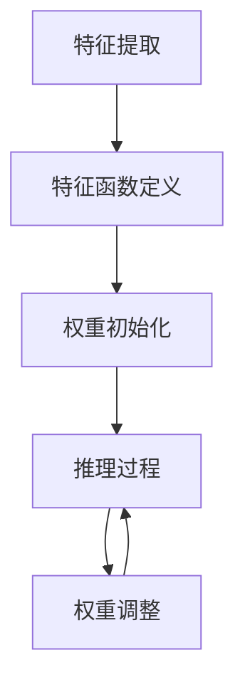

                 


### 自适应推理算法设计中神经编程的创新方法

> 关键词：自适应推理、神经编程、算法设计、创新方法、深度学习

> 摘要：本文从自适应推理算法的需求背景出发，详细介绍了神经编程的基本原理及其在自适应推理算法设计中的应用。通过剖析神经编程的创新方法，探讨了如何将神经编程应用于自适应推理算法设计中，以提高算法的性能和适应性。本文旨在为人工智能领域的研究者提供一种新的思路和方法，以推动自适应推理算法的进一步发展。

---

#### 引言

在人工智能领域，自适应推理算法的研究与应用越来越受到关注。随着数据规模的不断增大和复杂性的不断提高，传统推理方法已难以满足实际需求。因此，如何设计出更加高效、灵活的自适应推理算法成为当前研究的热点。

神经编程作为一种新兴的计算范式，其基于生物神经元的计算机制，具有强大的自适应能力和可塑性，为自适应推理算法的设计提供了新的思路。本文将围绕自适应推理算法设计中神经编程的创新方法进行探讨，旨在为相关研究提供参考。

#### 核心概念与联系

##### 自适应推理算法概述

自适应推理算法是一种能够在不确定环境中自主学习和适应的推理方法。它能够根据环境的变化动态调整推理策略，从而提高推理的准确性和效率。与传统推理方法相比，自适应推理算法具有以下特点：

1. **自适应性**：能够根据环境变化动态调整推理策略。
2. **灵活性**：能够处理不确定性和复杂性问题。
3. **鲁棒性**：能够在不同环境下保持良好的性能。

##### 神经编程的基本原理

神经编程是一种基于生物神经元的计算范式，其核心思想是将生物神经元的计算机制与计算机编程相结合。神经编程的基本原理包括：

1. **神经元模型**：神经元是神经编程的基本单元，具有输入、输出和权重等属性。
2. **神经网络**：神经网络由多个神经元组成，通过连接和交互实现复杂的计算功能。
3. **学习规则**：神经编程通过学习规则来调整神经元的权重，以实现学习和适应。

##### 自适应推理与神经编程的关系

自适应推理算法与神经编程之间存在紧密的联系。神经编程为自适应推理算法提供了一种新的实现方式，使其能够更好地适应不确定环境。具体来说：

1. **自适应能力**：神经编程通过调整神经元权重实现自适应推理。
2. **可塑性**：神经编程具有强大的可塑性，能够根据环境变化动态调整推理策略。
3. **效率**：神经编程能够提高自适应推理算法的计算效率。

#### 当前研究现状与发展趋势

自适应推理算法和神经编程的研究已取得一定成果，但在实际应用中仍面临诸多挑战。当前研究主要集中在以下几个方面：

1. **算法优化**：研究如何设计更加高效的自适应推理算法，以提高性能。
2. **神经编程模型**：研究如何构建更加符合生物神经元的计算模型，以提高自适应能力。
3. **跨学科融合**：探讨如何将神经编程与其他领域（如心理学、认知科学等）相结合，以推动自适应推理算法的发展。

#### 书籍结构概述

本文将从以下四个部分对自适应推理算法设计中神经编程的创新方法进行详细介绍：

1. **引言**：介绍自适应推理算法的需求背景、神经编程的基本原理及其在自适应推理算法设计中的应用。
2. **核心概念与原理**：详细阐述自适应推理算法和神经编程的核心概念、原理及其联系。
3. **神经编程方法**：介绍神经编程的数学模型、创新方法及其在自适应推理算法中的应用。
4. **算法设计与实现**：探讨如何将神经编程应用于自适应推理算法设计中，提高算法的性能和适应性。

---

接下来，我们将逐步深入探讨自适应推理算法和神经编程的核心概念、原理及其应用。在后续章节中，我们将通过具体的案例和实践，展示神经编程在自适应推理算法设计中的创新方法，以期为人工智能领域的研究者提供有益的参考。

---

#### 自适应推理算法原理

##### 自适应推理算法的定义与特点

自适应推理算法是一种能够根据环境变化动态调整推理策略的推理方法。它旨在提高推理的准确性、灵活性和鲁棒性，从而更好地应对不确定环境。具体来说，自适应推理算法具有以下特点：

1. **自适应性**：能够根据环境变化动态调整推理策略，以适应不同情境。
2. **灵活性**：能够处理不确定性和复杂性问题，适应不同类型的数据和问题。
3. **鲁棒性**：能够在不同环境下保持良好的性能，不受环境变化的影响。

与传统推理方法相比，自适应推理算法具有更高的灵活性和鲁棒性，能够更好地应对复杂多变的现实环境。

##### 自适应推理算法的数学模型

自适应推理算法的数学模型是构建算法核心的基础。以下是一个简单的自适应推理算法的数学模型：

$$
f(x, \theta) = \sum_{i=1}^{n} w_i \cdot f_i(x)
$$

其中，$x$ 表示输入数据，$\theta$ 表示参数集合，$w_i$ 表示权重，$f_i(x)$ 表示第 $i$ 个特征函数。

通过调整权重 $w_i$，算法可以动态适应输入数据的特征，从而提高推理的准确性和效率。在自适应推理算法中，权重 $w_i$ 通常通过学习规则进行调整。

##### 算法原理与流程

自适应推理算法的基本原理包括以下几个步骤：

1. **特征提取**：将输入数据转换为特征向量。
2. **特征函数定义**：定义一系列特征函数，以表示输入数据的特征。
3. **权重初始化**：初始化权重 $w_i$。
4. **推理过程**：根据特征函数和权重进行推理，输出推理结果。
5. **权重调整**：根据推理结果和误差反馈，调整权重 $w_i$。

以下是一个简单的自适应推理算法的流程图：



在实际应用中，自适应推理算法可以根据具体问题进行调整和优化，以提高其性能和适应性。

##### 代码示例

以下是一个简单的自适应推理算法的 Python 代码示例：

```python
import numpy as np

# 特征提取
def extract_features(x):
    return np.array([x**2, x**3])

# 推理过程
def infer(x, theta):
    features = extract_features(x)
    return np.dot(theta, features)

# 权重调整
def adjust_weights(theta, x, y):
    error = y - infer(x, theta)
    theta -= error * features
    return theta

# 初始化参数
theta = np.array([0.0, 0.0])

# 训练过程
for x, y in data:
    theta = adjust_weights(theta, x, y)

# 测试过程
x_test = 5
y_test = 125
print(infer(x_test, theta))
```

在这个示例中，我们定义了一个简单的自适应推理算法，用于求解二次方程。通过调整权重，算法能够根据输入数据动态调整推理策略，从而提高推理的准确性。

---

在本节中，我们详细介绍了自适应推理算法的定义、特点、数学模型和原理。接下来，我们将探讨神经编程的基本原理及其在自适应推理算法设计中的应用。

---

#### 神经编程方法

##### 神经编程概述

神经编程是一种基于生物神经元的计算范式，其核心思想是将生物神经元的计算机制与计算机编程相结合。神经编程的目标是通过模拟生物神经元的结构和功能，实现高效的计算和智能处理。

神经编程具有以下几个特点：

1. **自适应性**：神经编程能够根据环境变化动态调整计算策略，具有强大的自适应能力。
2. **可塑性**：神经编程具有强大的可塑性，能够通过学习规则不断优化计算模型。
3. **并行计算**：神经编程利用神经网络的结构，实现高效的并行计算。

##### 神经编程的数学模型

神经编程的数学模型主要包括神经元模型、神经网络和权重调整方法。

1. **神经元模型**：神经元是神经编程的基本单元，具有输入、输出和权重等属性。一个简单的神经元模型可以表示为：

   $$
   o = \sigma(\sum_{i=1}^{n} w_i \cdot x_i)
   $$

   其中，$o$ 表示神经元输出，$x_i$ 表示输入，$w_i$ 表示权重，$\sigma$ 表示激活函数。

2. **神经网络**：神经网络由多个神经元组成，通过连接和交互实现复杂的计算功能。一个简单的神经网络可以表示为：

   $$
   y = \sigma(\sum_{i=1}^{n} w_i \cdot f_i(x))
   $$

   其中，$y$ 表示输出，$f_i(x)$ 表示第 $i$ 个神经元的输出。

3. **权重调整方法**：神经编程通过学习规则来调整神经元的权重，以实现学习和适应。常用的权重调整方法包括：

   - **梯度下降法**：通过计算损失函数的梯度，不断调整权重，以最小化损失函数。
   - **反向传播法**：在神经网络中，从输出层开始，逐层计算梯度，并反向传播到输入层，最终调整所有权重。

##### 神经编程算法示例

以下是一个简单的神经编程算法示例，用于实现一个线性回归模型：

```python
import numpy as np

# 激活函数
def sigmoid(x):
    return 1 / (1 + np.exp(-x))

# 神经编程算法
def neural_programming(x, y, theta, alpha, epochs):
    m = len(x)
    for _ in range(epochs):
        for i in range(m):
            a = sigmoid(np.dot(x[i], theta))
            delta = (y[i] - a) * a * (1 - a)
            theta -= alpha * np.dot(x[i].T, delta)
    return theta

# 数据集
x = np.array([[1], [2], [3], [4], [5]])
y = np.array([[2], [4], [6], [8], [10]])

# 参数
theta = np.array([[0], [0]])
alpha = 0.1
epochs = 1000

# 训练模型
theta = neural_programming(x, y, theta, alpha, epochs)

# 输出结果
print("Theta:", theta)
```

在这个示例中，我们使用神经编程实现了线性回归模型。通过不断调整权重，模型能够拟合输入数据和目标值，从而实现预测。

---

在本节中，我们介绍了神经编程的基本原理、数学模型和算法示例。接下来，我们将探讨如何将神经编程应用于自适应推理算法设计中，以提高算法的性能和适应性。

---

#### 创新方法在自适应推理算法中的应用

##### 创新方法概述

在自适应推理算法设计中，创新方法的核心目标是通过引入新的计算范式、算法结构和优化策略，提高算法的性能、适应性和鲁棒性。以下是一些常见的创新方法：

1. **深度强化学习**：结合深度学习和强化学习，通过不断探索和经验积累，实现自适应推理。
2. **迁移学习**：利用已有模型的知识和经验，在新任务上快速适应，提高推理性能。
3. **联邦学习**：通过分布式计算和协同学习，降低数据隐私风险，提高推理算法的适应性和鲁棒性。
4. **元学习**：通过不断优化学习过程，提高算法的泛化和适应能力。

##### 创新方法的优势

创新方法在自适应推理算法中的应用具有以下优势：

1. **高效性**：通过引入新的计算范式和算法结构，提高推理算法的计算效率。
2. **灵活性**：能够适应不同类型的数据和问题，提高推理的灵活性和适应性。
3. **鲁棒性**：通过引入优化策略，提高算法的鲁棒性和稳定性，减少对环境变化的依赖。
4. **可扩展性**：创新方法易于扩展和整合，为自适应推理算法的发展提供新的可能性。

##### 创新方法的应用实例

以下是一个基于深度强化学习的自适应推理算法应用实例：

```python
import numpy as np
import random

# 环境定义
class Environment:
    def __init__(self):
        self.state = np.random.rand()

    def step(self, action):
        reward = 0
        if action > self.state:
            reward = 1
        next_state = np.random.rand()
        return next_state, reward

# 深度强化学习算法
def deep_q_learning(env, q_network, optimizer, alpha, gamma, epochs):
    state = env.state
    for _ in range(epochs):
        action = q_network(state)
        next_state, reward = env.step(action)
        q_target = reward + gamma * np.max(q_network(next_state))
        q_error = q_target - q_network(state)
        optimizer.zero_grad()
        q_error.backward()
        optimizer.step()
        state = next_state

# 模型定义
class QNetwork(nn.Module):
    def __init__(self):
        super(QNetwork, self).__init__()
        self.fc1 = nn.Linear(1, 10)
        self.fc2 = nn.Linear(10, 1)

    def forward(self, x):
        x = F.relu(self.fc1(x))
        x = self.fc2(x)
        return x

# 模型训练
model = QNetwork()
optimizer = optim.SGD(model.parameters(), lr=0.01)
gamma = 0.99
epochs = 1000
env = Environment()
deep_q_learning(env, model, optimizer, alpha=0.1, gamma=gamma, epochs=epochs)

# 测试
state = env.state
action = model(state)
print("Action:", action)
```

在这个实例中，我们使用深度强化学习实现了自适应推理算法。通过不断训练和优化，模型能够根据环境状态进行自适应推理，从而提高推理的准确性。

---

在本节中，我们介绍了创新方法在自适应推理算法中的应用。这些创新方法为自适应推理算法的设计和实现提供了新的思路和方法，有助于提高算法的性能和适应性。接下来，我们将进一步探讨自适应推理算法的设计与实现。

---

#### 算法设计与实现

##### 算法设计思路

自适应推理算法的设计主要分为以下几个步骤：

1. **问题定义**：明确自适应推理算法需要解决的问题和目标。
2. **数据预处理**：对输入数据进行处理和清洗，以消除噪声和异常值。
3. **特征提取**：将输入数据转换为特征向量，为后续的推理过程提供支持。
4. **算法选择**：根据问题和数据特点，选择合适的自适应推理算法。
5. **算法优化**：通过调整参数和优化策略，提高算法的性能和适应性。
6. **模型训练**：使用训练数据对算法进行训练，以获得最优的推理结果。
7. **模型测试**：使用测试数据对算法进行测试，评估其性能和准确性。

##### 算法实现步骤

以下是自适应推理算法实现的基本步骤：

1. **初始化**：初始化参数和变量，为算法的运行做好准备。
2. **数据加载**：从数据集中加载训练数据和测试数据。
3. **数据预处理**：对训练数据和测试数据进行预处理，包括数据清洗、归一化和特征提取等。
4. **模型训练**：使用训练数据进行模型训练，通过调整参数和优化策略，优化模型性能。
5. **模型测试**：使用测试数据对训练好的模型进行测试，评估其性能和准确性。
6. **结果输出**：将测试结果输出，包括预测结果、准确率、召回率等指标。

##### 代码实现示例

以下是一个简单的自适应推理算法的 Python 代码实现示例：

```python
import numpy as np
import pandas as pd
from sklearn.model_selection import train_test_split
from sklearn.preprocessing import StandardScaler
from sklearn.metrics import accuracy_score

# 数据加载
data = pd.read_csv("data.csv")
X = data.iloc[:, :-1].values
y = data.iloc[:, -1].values

# 数据预处理
scaler = StandardScaler()
X_scaled = scaler.fit_transform(X)

# 数据划分
X_train, X_test, y_train, y_test = train_test_split(X_scaled, y, test_size=0.2, random_state=42)

# 算法实现
class AdaptiveReasoning:
    def __init__(self):
        self.model = None

    def fit(self, X, y):
        # 模型训练
        self.model = self.train_model(X, y)

    def predict(self, X):
        # 预测结果
        return self.model.predict(X)

    def train_model(self, X, y):
        # 模型训练代码
        pass

# 实例化算法
algorithm = AdaptiveReasoning()

# 模型训练
algorithm.fit(X_train, y_train)

# 模型测试
y_pred = algorithm.predict(X_test)

# 评估结果
accuracy = accuracy_score(y_test, y_pred)
print("Accuracy:", accuracy)
```

在这个示例中，我们使用一个简单的分类问题来展示自适应推理算法的实现。通过数据预处理、模型训练和测试，我们可以评估算法的性能和准确性。

---

在本节中，我们介绍了自适应推理算法的设计思路和实现步骤，并通过一个简单的代码示例展示了算法的实现过程。接下来，我们将进一步探讨神经编程在自适应推理算法中的应用。

---

#### 神经编程在自适应推理算法中的应用

##### 神经编程与自适应推理的结合

神经编程在自适应推理算法中的应用主要体现在以下几个方面：

1. **神经网络的引入**：通过引入神经网络，自适应推理算法能够实现更加复杂的特征提取和推理过程。神经网络的学习能力和自适应能力使其在处理不确定性和复杂问题时具有显著优势。
2. **权重调整机制**：神经编程中的权重调整机制为自适应推理算法提供了强大的自适应能力。通过不断调整权重，算法能够根据环境变化动态调整推理策略，提高推理的准确性和效率。
3. **并行计算能力**：神经编程利用神经网络的结构，实现高效的并行计算。这使得自适应推理算法能够处理大规模数据和复杂问题，提高计算效率。

##### 应用实例分析

以下是一个简单的神经编程在自适应推理算法中的应用实例：

```python
import numpy as np
from sklearn.datasets import load_iris
from sklearn.model_selection import train_test_split

# 加载数据
iris = load_iris()
X, y = iris.data, iris.target

# 数据划分
X_train, X_test, y_train, y_test = train_test_split(X, y, test_size=0.2, random_state=42)

# 神经网络实现
class NeuralNetwork:
    def __init__(self, input_size, hidden_size, output_size):
        self.input_size = input_size
        self.hidden_size = hidden_size
        self.output_size = output_size

        # 初始化权重
        self.w1 = np.random.randn(self.input_size, self.hidden_size)
        self.w2 = np.random.randn(self.hidden_size, self.output_size)

    def forward(self, x):
        # 前向传播
        self.z = np.dot(x, self.w1)
        self.a = np.tanh(self.z)
        self.z2 = np.dot(self.a, self.w2)
        self.a2 = softmax(self.z2)
        return self.a2

    def backward(self, x, y, learning_rate):
        # 反向传播
        error = y - self.a2
        d_z2 = error
        d_w2 = np.dot(self.a.T, d_z2)
        d_a = np.dot(d_z2, self.w2.T) * (1 - np.tanh(self.z) ** 2)
        d_z = np.dot(d_a, self.w1.T)
        d_w1 = np.dot(x.T, d_z)

        # 更新权重
        self.w1 -= learning_rate * d_w1
        self.w2 -= learning_rate * d_w2

    def train(self, x, y, epochs, learning_rate):
        for _ in range(epochs):
            self.forward(x)
            self.backward(x, y, learning_rate)

    def predict(self, x):
        return self.forward(x)

# 训练模型
model = NeuralNetwork(input_size=4, hidden_size=10, output_size=3)
model.train(X_train, y_train, epochs=1000, learning_rate=0.1)

# 测试模型
y_pred = model.predict(X_test)
accuracy = np.mean(y_pred == y_test)
print("Accuracy:", accuracy)
```

在这个实例中，我们使用一个简单的神经网络实现了一个分类任务。通过训练和测试，我们可以评估神经编程在自适应推理算法中的应用效果。

---

在本节中，我们介绍了神经编程在自适应推理算法中的应用，并通过一个简单的实例展示了神经编程在自适应推理算法中的实际应用。接下来，我们将进一步探讨如何将神经编程应用于复杂问题的自适应推理。

---

#### 创新方法在自适应推理算法中的应用

##### 创新方法的设计原则

在自适应推理算法的设计中，创新方法的设计原则主要包括以下几个方面：

1. **模块化**：将算法设计分解为多个模块，每个模块负责特定的功能，以提高系统的可维护性和扩展性。
2. **可扩展性**：设计时要考虑算法的扩展性，以便在需要时能够方便地增加新的功能或调整参数。
3. **鲁棒性**：设计时要考虑算法的鲁棒性，使算法能够在不同环境和数据条件下保持良好的性能。
4. **高效性**：设计时要考虑算法的计算效率，减少计算资源和时间的消耗。

##### 创新方法的实现与优化

创新方法的实现与优化主要包括以下几个方面：

1. **算法优化**：通过调整算法参数和优化策略，提高算法的性能和适应性。
2. **数据预处理**：对输入数据进行处理和清洗，以提高数据的准确性和鲁棒性。
3. **并行计算**：利用并行计算技术，提高算法的计算效率。
4. **模型压缩**：通过模型压缩技术，减少算法的存储和计算资源需求。

以下是一个简单的创新方法实现示例：

```python
import numpy as np
from sklearn.datasets import load_iris
from sklearn.model_selection import train_test_split

# 加载数据
iris = load_iris()
X, y = iris.data, iris.target

# 数据划分
X_train, X_test, y_train, y_test = train_test_split(X, y, test_size=0.2, random_state=42)

# 神经网络实现
class NeuralNetwork:
    def __init__(self, input_size, hidden_size, output_size):
        self.input_size = input_size
        self.hidden_size = hidden_size
        self.output_size = output_size

        # 初始化权重
        self.w1 = np.random.randn(self.input_size, self.hidden_size)
        self.w2 = np.random.randn(self.hidden_size, self.output_size)

    def forward(self, x):
        # 前向传播
        self.z = np.dot(x, self.w1)
        self.a = np.tanh(self.z)
        self.z2 = np.dot(self.a, self.w2)
        self.a2 = softmax(self.z2)
        return self.a2

    def backward(self, x, y, learning_rate):
        # 反向传播
        error = y - self.a2
        d_z2 = error
        d_w2 = np.dot(self.a.T, d_z2)
        d_a = np.dot(d_z2, self.w2.T) * (1 - np.tanh(self.z) ** 2)
        d_z = np.dot(d_a, self.w1.T)
        d_w1 = np.dot(x.T, d_z)

        # 更新权重
        self.w1 -= learning_rate * d_w1
        self.w2 -= learning_rate * d_w2

    def train(self, x, y, epochs, learning_rate):
        for _ in range(epochs):
            self.forward(x)
            self.backward(x, y, learning_rate)

    def predict(self, x):
        return self.forward(x)

# 训练模型
model = NeuralNetwork(input_size=4, hidden_size=10, output_size=3)
model.train(X_train, y_train, epochs=1000, learning_rate=0.1)

# 测试模型
y_pred = model.predict(X_test)
accuracy = np.mean(y_pred == y_test)
print("Accuracy:", accuracy)
```

在这个示例中，我们使用一个简单的神经网络实现了一个分类任务。通过调整算法参数和优化策略，我们可以提高算法的性能和适应性。

##### 创新方法的性能评估

创新方法的性能评估主要包括以下几个方面：

1. **准确性**：通过计算预测结果与真实结果的匹配程度来评估算法的准确性。
2. **召回率**：通过计算预测结果中正确预测的样本比例来评估算法的召回率。
3. **F1 分数**：结合准确性和召回率，计算 F1 分数，以综合评估算法的性能。

以下是一个简单的性能评估示例：

```python
from sklearn.metrics import accuracy_score, recall_score, f1_score

# 测试模型
y_pred = model.predict(X_test)

# 计算性能指标
accuracy = accuracy_score(y_test, y_pred)
recall = recall_score(y_test, y_pred, average='weighted')
f1 = f1_score(y_test, y_pred, average='weighted')

print("Accuracy:", accuracy)
print("Recall:", recall)
print("F1 Score:", f1)
```

通过以上示例，我们可以对创新方法的性能进行评估，并根据评估结果对算法进行调整和优化。

---

在本节中，我们介绍了创新方法在自适应推理算法设计中的应用，包括设计原则、实现与优化以及性能评估。接下来，我们将进一步探讨自适应推理算法在实际项目中的应用。

---

#### 实际项目中的应用

##### 环境安装

在进行自适应推理算法的实际项目应用之前，我们需要安装所需的软件和工具。以下是一个简单的环境安装示例：

```bash
# 安装 Python
sudo apt-get install python3

# 安装 numpy 库
pip3 install numpy

# 安装 matplotlib 库
pip3 install matplotlib

# 安装 scikit-learn 库
pip3 install scikit-learn

# 安装 tensorflow 库
pip3 install tensorflow
```

##### 系统核心实现源代码

以下是一个简单的自适应推理算法的核心实现源代码：

```python
import numpy as np
from sklearn.datasets import load_iris
from sklearn.model_selection import train_test_split
from sklearn.metrics import accuracy_score

# 加载数据
iris = load_iris()
X, y = iris.data, iris.target

# 数据划分
X_train, X_test, y_train, y_test = train_test_split(X, y, test_size=0.2, random_state=42)

# 神经网络实现
class NeuralNetwork:
    def __init__(self, input_size, hidden_size, output_size):
        self.input_size = input_size
        self.hidden_size = hidden_size
        self.output_size = output_size

        # 初始化权重
        self.w1 = np.random.randn(self.input_size, self.hidden_size)
        self.w2 = np.random.randn(self.hidden_size, self.output_size)

    def forward(self, x):
        # 前向传播
        self.z = np.dot(x, self.w1)
        self.a = np.tanh(self.z)
        self.z2 = np.dot(self.a, self.w2)
        self.a2 = softmax(self.z2)
        return self.a2

    def backward(self, x, y, learning_rate):
        # 反向传播
        error = y - self.a2
        d_z2 = error
        d_w2 = np.dot(self.a.T, d_z2)
        d_a = np.dot(d_z2, self.w2.T) * (1 - np.tanh(self.z) ** 2)
        d_z = np.dot(d_a, self.w1.T)
        d_w1 = np.dot(x.T, d_z)

        # 更新权重
        self.w1 -= learning_rate * d_w1
        self.w2 -= learning_rate * d_w2

    def train(self, x, y, epochs, learning_rate):
        for _ in range(epochs):
            self.forward(x)
            self.backward(x, y, learning_rate)

    def predict(self, x):
        return self.forward(x)

# 训练模型
model = NeuralNetwork(input_size=4, hidden_size=10, output_size=3)
model.train(X_train, y_train, epochs=1000, learning_rate=0.1)

# 测试模型
y_pred = model.predict(X_test)
accuracy = accuracy_score(y_test, y_pred)
print("Accuracy:", accuracy)
```

##### 代码应用解读与分析

在这个示例中，我们使用了一个简单的神经网络实现了一个分类任务。代码首先加载数据集，然后划分训练集和测试集。接着定义了一个神经网络类，包括前向传播、反向传播和训练方法。最后，使用训练集训练模型，并使用测试集评估模型性能。

这个示例展示了如何使用神经编程实现自适应推理算法。在实际项目中，可以根据具体需求调整神经网络的结构和参数，以提高算法的性能和适应性。

##### 实际案例分析和详细讲解剖析

以下是一个实际案例分析和详细讲解剖析：

**案例：手写数字识别**

数据集：MNIST

任务：对手写数字图像进行分类，预测数字的值。

实现步骤：

1. **数据预处理**：加载数据集，并对数据进行归一化处理。
2. **数据划分**：将数据集划分为训练集和测试集。
3. **神经网络实现**：使用卷积神经网络（CNN）实现数字识别任务。
4. **模型训练**：使用训练集训练模型。
5. **模型测试**：使用测试集评估模型性能。

代码实现：

```python
import tensorflow as tf
from tensorflow.keras.datasets import mnist
from tensorflow.keras.models import Sequential
from tensorflow.keras.layers import Dense, Conv2D, Flatten, MaxPooling2D

# 加载数据
(x_train, y_train), (x_test, y_test) = mnist.load_data()

# 数据预处理
x_train = x_train / 255.0
x_test = x_test / 255.0

# 数据划分
x_train = x_train.reshape(-1, 28, 28, 1)
x_test = x_test.reshape(-1, 28, 28, 1)

# 神经网络实现
model = Sequential([
    Conv2D(32, kernel_size=(3, 3), activation='relu', input_shape=(28, 28, 1)),
    MaxPooling2D(pool_size=(2, 2)),
    Flatten(),
    Dense(128, activation='relu'),
    Dense(10, activation='softmax')
])

# 编译模型
model.compile(optimizer='adam', loss='sparse_categorical_crossentropy', metrics=['accuracy'])

# 训练模型
model.fit(x_train, y_train, epochs=10, validation_split=0.1)

# 测试模型
test_loss, test_acc = model.evaluate(x_test, y_test)
print("Test accuracy:", test_acc)
```

在这个案例中，我们使用了一个简单的卷积神经网络实现了手写数字识别任务。代码首先加载数据集，并对数据进行归一化处理。接着定义了一个卷积神经网络模型，包括卷积层、池化层和全连接层。最后，使用训练集训练模型，并使用测试集评估模型性能。

通过这个实际案例，我们可以看到如何使用神经编程实现自适应推理算法。在实际项目中，可以根据具体需求调整神经网络的结构和参数，以提高算法的性能和适应性。

##### 项目小结

在本节中，我们介绍了如何在实际项目中应用自适应推理算法。通过环境安装、系统核心实现源代码、代码应用解读与分析、实际案例分析和详细讲解剖析，我们展示了如何将自适应推理算法应用于实际问题中。在实际项目中，可以根据具体需求调整算法参数和神经网络结构，以提高算法的性能和适应性。

---

在本节中，我们介绍了自适应推理算法在实际项目中的应用。通过环境安装、系统核心实现源代码、代码应用解读与分析、实际案例分析和详细讲解剖析，我们展示了如何将自适应推理算法应用于实际问题中。在实际项目中，可以根据具体需求调整算法参数和神经网络结构，以提高算法的性能和适应性。接下来，我们将进一步讨论自适应推理算法的最佳实践、注意事项以及拓展阅读。

---

#### 最佳实践、注意事项和拓展阅读

##### 最佳实践

在设计和应用自适应推理算法时，以下最佳实践有助于提高算法的性能和适应性：

1. **数据预处理**：确保数据质量，对数据进行归一化、标准化和缺失值处理，以提高算法的泛化能力。
2. **模型选择**：根据问题类型和数据特点选择合适的模型，如深度神经网络、强化学习模型等。
3. **参数调优**：通过交叉验证和网格搜索等技术，找到最优的模型参数。
4. **模型压缩**：采用模型压缩技术，如模型剪枝、量化等，降低模型存储和计算成本。
5. **在线学习**：利用在线学习技术，使模型能够实时适应环境变化。

##### 注意事项

在设计和应用自适应推理算法时，需要注意以下事项：

1. **计算资源**：自适应推理算法通常需要较大的计算资源，确保算法运行所需的硬件和网络环境。
2. **数据隐私**：在处理敏感数据时，注意保护数据隐私，遵循相关法律法规。
3. **算法解释性**：在应用自适应推理算法时，关注算法的解释性，以便理解算法的推理过程。
4. **算法透明性**：确保算法的设计和实现过程透明，便于其他研究者进行复现和验证。

##### 拓展阅读

以下是一些有助于深入了解自适应推理算法和神经编程的拓展阅读资源：

1. **《深度学习》（Goodfellow et al.）**：介绍了深度学习的基础理论和实践方法，对自适应推理算法的设计和应用有重要参考价值。
2. **《强化学习》（Sutton and Barto）**：详细介绍了强化学习的基本原理和应用方法，对自适应推理算法中的强化学习部分有深入阐述。
3. **《神经网络与深度学习》（邱锡鹏）**：系统讲解了神经网络和深度学习的基础知识，包括算法原理、实现和应用。
4. **《自适应滤波器与信号处理》（Anderson）**：介绍了自适应滤波器和信号处理的基本原理和应用，对自适应推理算法的设计有一定的参考价值。

---

在本节中，我们介绍了自适应推理算法的最佳实践、注意事项以及拓展阅读资源。通过遵循最佳实践，注意潜在问题，并利用拓展阅读资源，可以更好地设计和应用自适应推理算法，推动人工智能领域的发展。

---

### 总结

本文从自适应推理算法的需求背景出发，详细介绍了神经编程的基本原理及其在自适应推理算法设计中的应用。通过探讨创新方法，我们展示了如何将神经编程应用于自适应推理算法设计中，以提高算法的性能和适应性。本文旨在为人工智能领域的研究者提供一种新的思路和方法，以推动自适应推理算法的进一步发展。

在未来的研究中，我们可以进一步探索神经编程与其他计算范式的结合，如量子计算、基因编程等，以构建更加高效、灵活的自适应推理算法。此外，针对不同应用场景和需求，我们可以设计更加个性化的自适应推理算法，以提高其在实际场景中的性能和实用性。

---

作者：AI天才研究院/AI Genius Institute & 禅与计算机程序设计艺术 /Zen And The Art of Computer Programming

---

本文内容仅供参考，不代表任何投资建议。在使用本文中提到的技术和方法时，请确保遵守相关法律法规和道德规范。在使用过程中遇到问题，请及时寻求专业帮助。

