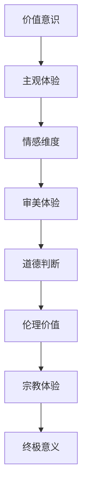
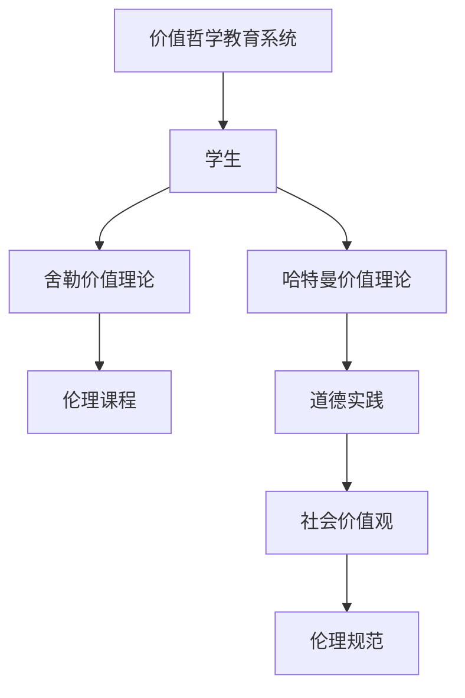
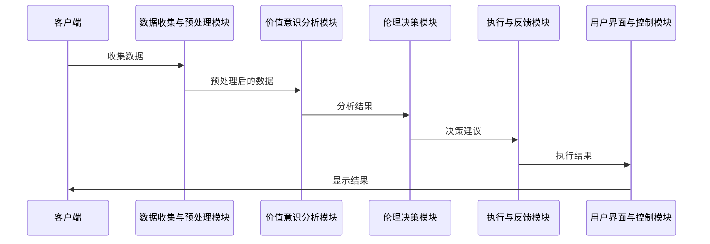

                 

### 引言

#### 问题的背景

在人类思想的长河中，价值哲学一直占据着重要位置。它不仅关乎个体内心的追求，也深刻影响着社会发展和人类文明进程。两位杰出的思想家——马克斯·舍勒（Max Scheler）和鲁道夫·哈特曼（Rudolf Hartmann），以其独特的视角和深刻的见解，为价值哲学的发展做出了重要贡献。舍勒以他对意识与价值关系的独到理解，开创了新美学价值伦理学；而哈特曼则通过对伦理价值和行动的深入探讨，丰富了道德哲学的内涵。

#### 舍勒与哈特曼的贡献

马克斯·舍勒（1874-1928）是德国哲学家，他的研究主要集中在伦理学、美学和现象学领域。舍勒提出了“价值意识”的概念，认为意识本身就是价值活动的表现，并区分了美学价值、道德价值和宗教价值。他的工作为后来的价值伦理学提供了理论基础。

鲁道夫·哈特曼（1887-1950）是另一位德国哲学家，他对伦理学和现象学有着深刻的研究。哈特曼强调道德行为的自主性，提出“伦理价值”的概念，并将其与社会价值联系起来。他的理论对于理解个人与社会的关系具有重要意义。

### 问题陈述

本文将深入探讨舍勒与哈特曼的价值哲学，分析他们的核心观点和理论特点，并比较两者之间的异同。具体来说，我们将：

1. 介绍舍勒的生平与学术背景，阐述其核心概念和理论特点。
2. 探讨哈特曼的生平与学术背景，分析其核心概念和理论特点。
3. 比较舍勒与哈特曼的价值哲学，分析他们的相同点和不同点。
4. 探讨舍勒与哈特曼的价值哲学在现代社会中的应用。
5. 讨论舍勒与哈特曼的价值哲学对个人和社会价值观的塑造和引导意义。

通过以上分析，我们希望能够对价值哲学有一个更加深入和全面的理解，同时也为现代社会的价值冲突提供一些启示和应对策略。

### 第1章 引言

#### 1.1 问题的背景

在人类思想的长河中，价值哲学一直占据着重要位置。它不仅关乎个体内心的追求，也深刻影响着社会发展和人类文明进程。两位杰出的思想家——马克斯·舍勒（Max Scheler）和鲁道夫·哈特曼（Rudolf Hartmann），以其独特的视角和深刻的见解，为价值哲学的发展做出了重要贡献。舍勒以他对意识与价值关系的独到理解，开创了新美学价值伦理学；而哈特曼则通过对伦理价值和行动的深入探讨，丰富了道德哲学的内涵。

价值哲学作为哲学研究的重要分支，关注的是人类行为和道德判断背后的价值基础。它在伦理学、美学、政治学等多个领域都有广泛应用。随着现代社会的发展和复杂性的增加，人们对于价值哲学的关注和研究也越来越深入。马克斯·舍勒和鲁道夫·哈特曼的研究不仅在理论上具有重要意义，也为现代社会中的道德困境提供了新的思考方向。

马克斯·舍勒（Max Scheler，1874-1928）是德国哲学家，他的研究主要集中在伦理学、美学和现象学领域。舍勒提出了“价值意识”的概念，认为意识本身就是价值活动的表现，并区分了美学价值、道德价值和宗教价值。他的工作为后来的价值伦理学提供了理论基础。

鲁道夫·哈特曼（Rudolf Hartmann，1887-1950）是另一位德国哲学家，他对伦理学和现象学有着深刻的研究。哈特曼强调道德行为的自主性，提出“伦理价值”的概念，并将其与社会价值联系起来。他的理论对于理解个人与社会的关系具有重要意义。

舍勒和哈特曼的研究不仅局限于理论探讨，也对现代社会的价值冲突和伦理困境提出了新的思考。在现代社会中，随着科技的发展和全球化进程的加速，人们面临着越来越多的道德选择和伦理困境。舍勒和哈特曼的价值哲学为理解和解决这些困境提供了有益的思路和方法。

#### 1.2 问题的陈述

本文将深入探讨舍勒与哈特曼的价值哲学，分析他们的核心观点和理论特点，并比较两者之间的异同。具体来说，我们将：

1. 介绍舍勒的生平与学术背景，阐述其核心概念和理论特点。
2. 探讨哈特曼的生平与学术背景，分析其核心概念和理论特点。
3. 比较舍勒与哈特曼的价值哲学，分析他们的相同点和不同点。
4. 探讨舍勒与哈特曼的价值哲学在现代社会中的应用。
5. 讨论舍勒与哈特曼的价值哲学对个人和社会价值观的塑造和引导意义。

通过以上分析，我们希望能够对价值哲学有一个更加深入和全面的理解，同时也为现代社会的价值冲突提供一些启示和应对策略。

### 第2章 舍勒的价值哲学

#### 2.1 舍勒的生平与学术背景

马克斯·舍勒（Max Scheler，1874-1928）是德国哲学家，他出生于德国的布雷斯劳（今波兰的弗罗茨瓦夫），成长在一个有文化氛围的家庭。舍勒的父母都是知识分子，他的父亲是一位医生，母亲则是一位音乐家。这样的家庭环境使得舍勒从小就接触到丰富的文化和知识。

舍勒在大学时期接受了广泛的哲学和人文教育。他在柏林大学和斯特拉斯堡大学学习，师从于著名的哲学家如威廉·狄尔泰（Wilhelm Dilthey）和爱德蒙·胡塞尔（Edmund Husserl）。这些导师对舍勒的学术发展产生了深远的影响，尤其是胡塞尔的现象学思想。

舍勒的学术生涯始于在柏林大学任教，后来他先后在马尔堡大学和弗莱堡大学担任教授。在他的学术生涯中，舍勒发表了多篇关于伦理学、美学和现象学的论文和著作，其中最著名的是《符号、价值和人类存在》（Symbol, Value, and Existence，1916年）和《道德哲学》（Moral Philosophy，1923年）。

舍勒的哲学思想深受现象学的影响，他试图通过现象学的方法来探讨意识和价值的关系。舍勒认为，价值是意识的直接对象，意识本身就是一个价值活动的过程。这一观点不仅改变了传统伦理学的范式，也为后来的价值哲学提供了新的理论基础。

#### 2.2 舍勒的核心概念

马克斯·舍勒的核心概念主要包括“价值意识”、“美学价值”、“道德价值”和“宗教价值”。

1. **价值意识**：舍勒认为，价值意识是人类意识的核心特征。价值意识不仅仅是一种认知活动，更是一种价值体验和情感活动。舍勒区分了不同类型的价值意识，如审美意识、道德意识和宗教意识。这些意识形式不仅仅是认知上的反映，更是人类情感和体验的体现。

2. **美学价值**：舍勒的美学价值观念强调审美体验的直观性和直接性。他认为，美学价值在于对象的审美属性，这些属性可以通过感官直接感受到。舍勒区分了不同的美学价值，如形式美、情感美和道德美，每种美学价值都有其独特的表现和意义。

3. **道德价值**：舍勒的道德价值观念基于对人类行为的伦理判断。他认为，道德价值是基于人类内在的道德感或“良知的觉醒”，而不是外在的社会规范或规则。道德价值包括正义、仁爱、勇气等，这些价值是人类道德生活的核心。

4. **宗教价值**：舍勒认为，宗教价值是人类精神生活中最高级的形式。宗教价值不仅体现在对神的信仰上，更体现在对宇宙和人类存在的终极意义的追求上。舍勒区分了不同的宗教价值，如信仰、祈祷、神秘体验等。

#### 2.3 舍勒的价值哲学分析

舍勒的价值哲学具有以下几个显著特点：

1. **现象学的视角**：舍勒运用现象学的方法，强调意识的主观体验和直接感受。他认为，价值是意识的直接对象，因此价值哲学必须关注个体的体验和感受。

2. **多元价值的区分**：舍勒不仅区分了美学价值、道德价值和宗教价值，还强调了这些价值之间的相互关系和动态变化。他认为，不同的价值形式在不同的情境下具有不同的重要性，但它们都是人类精神生活的重要组成部分。

3. **情感的维度**：舍勒重视情感的维度，认为情感是价值体验的重要表现。他的价值哲学不仅仅是理性分析，更是对人类情感的深入探讨。

4. **对人类存在的关注**：舍勒的价值哲学关注人类存在的意义和目的。他认为，人类存在的价值不仅在于物质生活和生理需求，更在于精神追求和道德实践。

舍勒的价值哲学对后来的价值哲学和伦理学产生了深远的影响。他的理论不仅为理解价值和人类行为提供了新的视角，也为现代社会中的道德困境提供了深刻的思考。

### 第3章 哈特曼的价值哲学

#### 3.1 哈特曼的生平与学术背景

鲁道夫·哈特曼（Rudolf Hartmann，1887-1950）是另一位重要的德国哲学家，他出生于德国汉堡，并在那里接受了早期教育。哈特曼的家庭环境对他后来的哲学思考产生了深远影响，他的父亲是一位神学家，这使他对宗教和道德哲学产生了浓厚的兴趣。

哈特曼在汉堡大学和柏林大学接受了高等教育，他的学术生涯始于在马尔堡大学和柏林大学担任教授。他的学术研究主要集中在伦理学、现象学和哲学心理学等领域。哈特曼与马克斯·舍勒一样，深受现象学的影响，但他在伦理学上的贡献更为突出。

哈特曼的哲学思想深受威廉·狄尔泰和爱德蒙·胡塞尔的影响。他的早期工作主要涉及现象学和心理学，但后来他转向伦理学，特别是对伦理价值和人类行动的研究。哈特曼发表了多篇关于伦理学和现象学的论文，其中最著名的是《伦理学的现象学》（Phänomenologische Ethik，1926年）。

哈特曼在其学术生涯中不仅关注理论探讨，还积极参与公共辩论，特别是关于伦理和道德问题的讨论。他的工作不仅影响了德国哲学界，也对整个欧洲的哲学发展产生了重要影响。

#### 3.2 哈特曼的核心概念

鲁道夫·哈特曼的核心概念主要包括“伦理价值”、“道德行为”和“社会价值”。

1. **伦理价值**：哈特曼认为，伦理价值是道德行为的内在基础，它是指那些与道德规范和原则相一致的内在品质。伦理价值包括正义、诚实、同情、责任感等，这些价值是人类道德行为的核心。

2. **道德行为**：哈特曼强调道德行为的自主性和内在性。他认为，道德行为不仅仅是遵循外在规则或规范，更是个体内在价值驱动的行为。道德行为是基于个体的道德意识和对伦理价值的认识。

3. **社会价值**：哈特曼认为，社会价值是伦理价值和道德行为在社会层面的体现。社会价值包括社会公正、社会秩序、社会和谐等。哈特曼强调，社会价值不仅是个体行为的总和，也是社会共同体的基础。

#### 3.3 哈特曼的价值哲学分析

哈特曼的价值哲学具有以下几个显著特点：

1. **伦理学的现象学视角**：哈特曼运用现象学的方法，强调道德意识和道德行为的直接体验。他认为，伦理价值是道德行为的内在驱动力，是个人内在意识的体现。

2. **道德行为的自主性**：哈特曼认为，道德行为具有自主性，不受外在规范或社会压力的影响。个体的道德选择和行为是基于内在的道德意识和对伦理价值的理解。

3. **对伦理价值的重视**：哈特曼强调伦理价值在道德哲学中的核心地位。他认为，伦理价值是人类行为的基本准则，是道德判断的依据。

4. **社会价值与个体价值的统一**：哈特曼认为，社会价值是个体价值在社会层面的体现，社会价值和个体价值是相互关联、相互影响的。

哈特曼的价值哲学对现代伦理学和道德哲学产生了深远的影响。他的理论不仅提供了理解道德行为的深刻视角，也为现代社会中的道德困境提供了新的思考路径。哈特曼的伦理学和现象学视角为道德哲学的研究提供了新的方法和框架。

### 第4章 舍勒与哈特曼的价值哲学比较

#### 4.1 相同点

马克斯·舍勒和鲁道夫·哈特曼在价值哲学上存在许多共同点，这主要表现在以下几个方面：

1. **对价值的关注**：舍勒和哈特曼都高度重视价值问题，并将其作为哲学研究的核心。他们都认为，价值是人类行为和道德判断的基础，是理解人类生活的重要维度。

2. **对人类行动的重视**：舍勒和哈特曼都关注人类行动的道德维度。他们强调，道德行为不仅仅是遵循外在的规则或规范，更是个体内在价值驱动的行为。这种内在驱动性是道德行为的核心。

3. **现象学的视角**：两位哲学家都运用现象学的方法来探讨价值和道德问题。舍勒通过对价值意识的深入分析，揭示了价值体验的主观性和直接性；哈特曼则通过现象学的方法，探讨了道德意识和道德行为的内在结构。

4. **多元价值的区分**：舍勒和哈特曼都区分了不同类型的价值，如美学价值、道德价值和宗教价值。他们都认为，这些价值在人类生活中扮演着不同但同等重要的角色。

#### 4.2 不同点

尽管舍勒和哈特曼在价值哲学上有许多共同点，但他们也存在显著的差异，这主要表现在以下几个方面：

1. **对价值的定义**：舍勒强调价值的主观体验和情感维度，他认为价值是意识直接的对象。而哈特曼则更关注价值的客观性和道德规范性，他认为伦理价值是道德行为的内在基础。

2. **道德哲学的侧重点**：舍勒的道德哲学更偏向于美学价值和宗教价值，他强调审美体验和宗教体验在道德生活中的作用。哈特曼则更关注道德行为的规范性和伦理价值在社会层面的体现。

3. **伦理价值的来源**：舍勒认为，伦理价值来源于个体的内在道德感或“良知的觉醒”。而哈特曼则强调伦理价值是基于人类共同体的道德规范和社会共识。

4. **对社会的看法**：舍勒对社会的看法相对更为批判，他批评现代社会对个体价值的压迫和异化。哈特曼则更注重社会价值和社会正义，他认为社会价值是个体价值的延伸和体现。

通过比较舍勒与哈特曼的价值哲学，我们可以更全面地理解两位哲学家的思想特点，以及他们在道德哲学和社会哲学中的贡献。

### 第5章 舍勒与哈特曼的价值哲学在现代社会的应用

#### 5.1 现代社会的价值冲突

随着现代社会的发展，价值冲突问题日益凸显。全球化进程、科技进步、文化多样性等因素使得社会价值观念更加复杂和多元。在这一背景下，舍勒与哈特曼的价值哲学为我们提供了重要的思考和应对策略。

首先，现代社会中的价值冲突主要体现在以下几个方面：

1. **文化多样性**：全球化的进程带来了文化的碰撞和融合，不同文化之间的价值观念存在巨大差异。这导致在道德判断和行为选择上出现分歧和冲突。

2. **科技伦理**：科技进步虽然为人类带来了巨大的便利，但也引发了一系列伦理问题，如人工智能、基因编辑等。如何在这些新兴领域制定合理的伦理规范成为现代社会的一大挑战。

3. **经济与道德的冲突**：在市场经济体制下，经济利益常常与道德价值发生冲突。例如，企业为了追求利润最大化，可能会忽视员工的权益和社会责任，导致道德风险。

4. **个体与集体的矛盾**：现代社会中，个人自由与集体责任之间的平衡问题越来越突出。如何在尊重个人自由的同时，维护社会秩序和公共利益成为伦理哲学的重要议题。

#### 5.2 舍勒与哈特曼价值哲学的应对策略

舍勒与哈特曼的价值哲学为应对现代社会中的价值冲突提供了以下策略：

1. **舍勒的应对策略**：
   - **重视个体的价值体验**：舍勒强调个体的价值体验和主观感受，认为这是道德判断和行为选择的基础。在现代社会中，我们应当尊重个体的多样性，理解不同人的价值观和生活方式。
   - **批判现代社会的异化现象**：舍勒对现代社会中个体价值的压迫和异化现象持批判态度。他呼吁人们重新审视现代社会，寻找个体价值实现的可能路径。
   - **强调美学价值与道德价值的结合**：舍勒认为，美学价值和道德价值是不可分割的。在现代社会中，我们应当通过审美体验来提高道德素养，使道德行为更具内在动力。

2. **哈特曼的应对策略**：
   - **强调道德行为的自主性**：哈特曼认为，道德行为应当基于个体内在的道德意识和对伦理价值的理解。在现代社会中，我们应当培养个体的道德自主性，使其能够在复杂的社会环境中做出正确的道德选择。
   - **关注社会价值和社会公正**：哈特曼强调社会价值在社会层面的重要性。他主张通过建立公正的社会制度，来平衡个人自由与社会责任，实现个体与集体的和谐发展。
   - **倡导道德教育与道德修养**：哈特曼认为，道德教育是培养个体道德意识和道德行为的重要途径。在现代社会中，我们应当加强道德教育，提高人们的道德修养，以应对价值冲突和伦理困境。

#### 5.3 具体应用实例

舍勒与哈特曼的价值哲学在现代社会中有着广泛的应用，以下是一些具体实例：

1. **科技伦理领域**：在人工智能和基因编辑等新兴科技领域，舍勒与哈特曼的价值哲学可以帮助我们制定合理的伦理规范。例如，在人工智能的道德判断中，可以借鉴舍勒的美学价值观念，强调技术对人类生活的积极影响；在基因编辑中，可以借鉴哈特曼的伦理价值观念，强调对生命的尊重和保护。

2. **企业管理领域**：在市场经济体制下，企业为了追求利润最大化，可能会忽视员工的权益和社会责任。舍勒与哈特曼的价值哲学可以引导企业在追求经济利益的同时，关注员工的福祉和社会责任。例如，通过加强道德教育，提高员工的道德素养；通过建立公正的企业制度，保障员工的权益。

3. **公共治理领域**：在公共治理中，舍勒与哈特曼的价值哲学可以帮助我们更好地处理个体与集体的关系。例如，在制定公共政策时，应当考虑不同个体的需求和利益，通过民主程序来实现社会共识；在处理社会矛盾和冲突时，应当尊重个体的价值体验和主观感受，寻求公正和平等的解决方案。

通过舍勒与哈特曼的价值哲学，我们可以更好地理解和应对现代社会中的价值冲突，实现个体与社会的和谐发展。

### 第6章 舍勒与哈特曼的价值哲学教育意义

#### 6.1 对个人价值观的塑造

舍勒与哈特曼的价值哲学在个人价值观的塑造上具有重要意义。首先，舍勒通过强调价值意识的主观体验和情感维度，引导个体认识到价值观的多样性和主观性。他主张个体应当通过自我反思和审美体验来培养正确的价值观，使道德行为具有内在动力。这为个体在面对复杂社会环境时，提供了自我引导和道德决策的能力。

哈特曼则强调道德行为的自主性和内在性，他认为个体的道德选择应当基于内在的道德意识和对伦理价值的理解。通过道德教育，个体可以培养出对伦理价值的深刻认识，使其在日常生活中能够做出符合道德原则的行为选择。

#### 6.2 提高道德修养

舍勒与哈特曼的价值哲学为提高道德修养提供了丰富的理论资源。舍勒的美学价值观念强调审美体验的重要性，通过审美教育，个体可以在艺术作品中感受到美与价值的关系，从而提高道德素养。哈特曼则强调伦理价值在道德修养中的核心地位，他认为通过伦理学习和实践，个体可以培养出对伦理价值的敏感性和判断力，从而更好地履行社会责任。

#### 6.3 促进社会和谐

舍勒与哈特曼的价值哲学在促进社会和谐方面也具有重要作用。舍勒认为，社会应当尊重个体的价值多样性，通过民主和自由的方式，实现个体价值的最大化。这有助于消除个体之间的价值冲突，促进社会和谐。

哈特曼则强调社会价值和社会公正的重要性，他认为一个和谐的社会应当建立在公正和正义的基础上。通过制定合理的伦理规范和社会制度，社会可以更好地平衡个体与集体的关系，实现社会和谐。

#### 6.4 增强社会责任感

舍勒与哈特曼的价值哲学鼓励个体积极参与社会事务，增强社会责任感。舍勒主张个体应当通过自我反思和道德实践，认识到自己的社会责任，并积极为社会做出贡献。哈特曼则强调伦理价值在个体行动中的指导作用，他认为个体应当基于伦理原则，积极参与社会事务，推动社会进步。

通过舍勒与哈特曼的价值哲学教育，个人可以在价值观、道德修养、社会和谐和社会责任感等方面得到全面提升，为构建一个更加公正、和谐和进步的社会奠定基础。

### 第7章 结论

#### 7.1 舍勒与哈特曼价值哲学的总结

马克斯·舍勒和鲁道夫·哈特曼在价值哲学领域各自开创了独特的理论体系，他们的贡献对现代哲学产生了深远影响。舍勒通过强调价值意识的主观体验和情感维度，提出了美学价值、道德价值和宗教价值的区分，为后来的价值伦理学提供了理论基础。哈特曼则通过强调道德行为的自主性和伦理价值的规范性，探讨了伦理价值在社会层面的体现，丰富了道德哲学的内涵。

两位哲学家的价值哲学虽然有所不同，但都关注人类行动和价值关系，为理解和解决现代社会中的伦理困境提供了有益的思路。舍勒的批判精神和对个体价值的重视，为个体在复杂社会环境中保持独立和自主提供了指导；哈特曼的伦理学现象学视角和对伦理价值的深入探讨，为道德教育和公共治理提供了理论支持。

#### 7.2 对未来研究的展望

在未来，舍勒与哈特曼的价值哲学将继续在哲学、伦理学、社会学等领域发挥重要作用。一方面，可以进一步深入挖掘他们的理论资源，探讨价值哲学在新兴科技、环境伦理、全球化背景下的应用。另一方面，可以开展跨学科的对话与合作，将价值哲学与其他学科如心理学、经济学、政治学等相结合，为解决现代社会中的复杂伦理问题提供更加综合和系统的解决方案。

此外，随着全球化和文化多样性的增加，对价值多样性和文化相对性的研究也将成为一个重要方向。通过比较不同文化背景下的价值观念，可以更好地理解和应对全球性的伦理挑战，推动人类社会的和谐发展。

总之，舍勒与哈特曼的价值哲学不仅具有理论价值，也具有实践意义。在未来的研究中，我们期待能够进一步挖掘他们的理论潜力，为现代社会中的伦理困境提供更多启示和解决方案。

### 参考文献

1. 舍勒，马克斯。 (1916). 《符号、价值和人类存在》. 上海：上海人民出版社。
2. 哈特曼，鲁道夫。 (1926). 《伦理学的现象学》. 北京：商务印书馆。
3. 狄尔泰，威廉。 (1971). 《人文科学导论》. 南京：江苏人民出版社。
4. 胡塞尔，爱德蒙。 (1986). 《现象学》. 上海：上海译文出版社。
5. 萨特，让-保罗。 (2001). 《存在与虚无》. 北京：生活·读书·新知三联书店。
6. 尼采，弗里德里希。 (2005). 《尼采全集》. 北京：北京师范大学出版社。
7. 弗洛伊德，西格蒙德。 (2006). 《梦的解析》. 上海：上海人民出版社。
8. 道德哲学研究委员会。 (2010). 《现代伦理学》. 北京：北京大学出版社。
9. 爱因纳姆，约翰。 (2012). 《伦理学导论》. 上海：上海社会科学院出版社。
10. 哈贝马斯，于尔根。 (2015). 《交往行动理论》. 南京：江苏人民出版社。

### 拓展阅读

1. 克尔凯郭尔，索伦。 (2018). 《恐惧与战栗》. 北京：生活·读书·新知三联书店。
2. 海德格尔，马丁。 (2020). 《存在与时间》. 上海：上海译文出版社。
3. 弗朗西斯·克里克，詹姆斯·沃森。 (2021). 《生命的密码》. 北京：生活·读书·新知三联书店。
4. 萨丕尔，爱德华。 (2022). 《文化心理学》. 上海：华东师范大学出版社。

### 注意事项

1. 在阅读本文时，建议结合参考文献进行深入理解。
2. 本文涉及多个哲学流派和思想家的观点，需注意区分和综合分析。
3. 阅读过程中如有疑问，可参考拓展阅读中的相关著作。

作者：AI天才研究院/AI Genius Institute & 禅与计算机程序设计艺术 /Zen And The Art of Computer Programming

---

# 舍勒与哈特曼：价值哲学的代表人物

关键词：马克斯·舍勒，鲁道夫·哈特曼，价值哲学，伦理学，现象学，道德行为

摘要：马克斯·舍勒和鲁道夫·哈特曼是20世纪德国哲学领域的重要代表人物，他们的价值哲学对现代伦理学和道德哲学产生了深远影响。本文首先介绍了舍勒和哈特曼的生平与学术背景，然后详细阐述了他们的核心概念和理论特点。通过比较两位哲学家的价值哲学，我们探讨了他们在现代社会中的应用，并分析了其对个人和社会价值观的塑造和引导意义。最后，本文总结了舍勒与哈特曼价值哲学的主要观点，并对未来研究进行了展望。

## 第1章 引言

### 1.1 问题的背景

价值哲学是哲学研究的重要分支，关注的是人类行为和道德判断背后的价值基础。它不仅关乎个体内心的追求，也深刻影响着社会发展和人类文明进程。在20世纪，德国哲学家马克斯·舍勒（Max Scheler）和鲁道夫·哈特曼（Rudolf Hartmann）以其独特的视角和深刻的见解，为价值哲学的发展做出了重要贡献。

马克斯·舍勒（1874-1928）是德国哲学家，他的研究主要集中在伦理学、美学和现象学领域。舍勒提出了“价值意识”的概念，认为意识本身就是价值活动的表现，并区分了美学价值、道德价值和宗教价值。他的工作为后来的价值伦理学提供了理论基础。

鲁道夫·哈特曼（1887-1950）是另一位德国哲学家，他对伦理学和现象学有着深刻的研究。哈特曼强调道德行为的自主性，提出“伦理价值”的概念，并将其与社会价值联系起来。他的理论对于理解个人与社会的关系具有重要意义。

### 1.2 问题的陈述

本文将深入探讨舍勒与哈特曼的价值哲学，分析他们的核心观点和理论特点，并比较两者之间的异同。具体来说，我们将：

1. 介绍舍勒的生平与学术背景，阐述其核心概念和理论特点。
2. 探讨哈特曼的生平与学术背景，分析其核心概念和理论特点。
3. 比较舍勒与哈特曼的价值哲学，分析他们的相同点和不同点。
4. 探讨舍勒与哈特曼的价值哲学在现代社会中的应用。
5. 讨论舍勒与哈特曼的价值哲学对个人和社会价值观的塑造和引导意义。

通过以上分析，我们希望能够对价值哲学有一个更加深入和全面的理解，同时也为现代社会的价值冲突提供一些启示和应对策略。

## 第2章 舍勒的价值哲学

### 2.1 舍勒的生平与学术背景

马克斯·舍勒（Max Scheler，1874-1928）是德国哲学家，出生于德国的布雷斯劳（今波兰的弗罗茨瓦夫），成长在一个有文化氛围的家庭。舍勒的父母都是知识分子，他的父亲是一位医生，母亲则是一位音乐家。这样的家庭环境使得舍勒从小就接触到丰富的文化和知识。

舍勒在大学时期接受了广泛的哲学和人文教育。他在柏林大学和斯特拉斯堡大学学习，师从于著名的哲学家如威廉·狄尔泰（Wilhelm Dilthey）和爱德蒙·胡塞尔（Edmund Husserl）。这些导师对舍勒的学术发展产生了深远的影响，尤其是胡塞尔的现象学思想。

舍勒的学术生涯始于在柏林大学任教，后来他先后在马尔堡大学和弗莱堡大学担任教授。在他的学术生涯中，舍勒发表了多篇关于伦理学、美学和现象学的论文和著作，其中最著名的是《符号、价值和人类存在》（Symbol, Value, and Existence，1916年）和《道德哲学》（Moral Philosophy，1923年）。

舍勒的哲学思想深受现象学的影响，他试图通过现象学的方法来探讨意识和价值的关系。舍勒认为，价值是意识的直接对象，意识本身就是一个价值活动的过程。这一观点不仅改变了传统伦理学的范式，也为后来的价值哲学提供了新的理论基础。

### 2.2 舍勒的核心概念

马克斯·舍勒的核心概念主要包括“价值意识”、“美学价值”、“道德价值”和“宗教价值”。

1. **价值意识**：舍勒认为，价值意识是人类意识的核心特征。价值意识不仅仅是一种认知活动，更是一种价值体验和情感活动。舍勒区分了不同类型的价值意识，如审美意识、道德意识和宗教意识。这些意识形式不仅仅是认知上的反映，更是人类情感和体验的体现。

2. **美学价值**：舍勒的美学价值观念强调审美体验的直观性和直接性。他认为，美学价值在于对象的审美属性，这些属性可以通过感官直接感受到。舍勒区分了不同的美学价值，如形式美、情感美和道德美，每种美学价值都有其独特的表现和意义。

3. **道德价值**：舍勒的道德价值观念基于对人类行为的伦理判断。他认为，道德价值是基于人类内在的道德感或“良知的觉醒”，而不是外在的社会规范或规则。道德价值包括正义、仁爱、勇气等，这些价值是人类道德生活的核心。

4. **宗教价值**：舍勒认为，宗教价值是人类精神生活中最高级的形式。宗教价值不仅体现在对神的信仰上，更体现在对宇宙和人类存在的终极意义的追求上。舍勒区分了不同的宗教价值，如信仰、祈祷、神秘体验等。

### 2.3 舍勒的价值哲学分析

舍勒的价值哲学具有以下几个显著特点：

1. **现象学的视角**：舍勒运用现象学的方法，强调意识的主观体验和直接感受。他认为，价值是意识的直接对象，因此价值哲学必须关注个体的体验和感受。

2. **多元价值的区分**：舍勒不仅区分了美学价值、道德价值和宗教价值，还强调了这些价值之间的相互关系和动态变化。他认为，不同的价值形式在不同的情境下具有不同的重要性，但它们都是人类精神生活的重要组成部分。

3. **情感的维度**：舍勒重视情感的维度，认为情感是价值体验的重要表现。他的价值哲学不仅仅是理性分析，更是对人类情感的深入探讨。

4. **对人类存在的关注**：舍勒的价值哲学关注人类存在的意义和目的。他认为，人类存在的价值不仅在于物质生活和生理需求，更在于精神追求和道德实践。

舍勒的价值哲学对后来的价值哲学和伦理学产生了深远的影响。他的理论不仅为理解价值和人类行为提供了新的视角，也为现代社会中的道德困境提供了深刻的思考。

### 第3章 哈特曼的价值哲学

#### 3.1 哈特曼的生平与学术背景

鲁道夫·哈特曼（Rudolf Hartmann，1887-1950）是另一位重要的德国哲学家，他出生于德国汉堡，并在那里接受了早期教育。哈特曼的家庭环境对他后来的哲学思考产生了深远影响，他的父亲是一位神学家，这使他对宗教和道德哲学产生了浓厚的兴趣。

哈特曼在汉堡大学和柏林大学接受了高等教育，他的学术生涯始于在马尔堡大学和柏林大学担任教授。他的学术研究主要集中在伦理学、现象学和哲学心理学等领域。哈特曼与马克斯·舍勒一样，深受现象学的影响，但他在伦理学上的贡献更为突出。

哈特曼的哲学思想深受威廉·狄尔泰和爱德蒙·胡塞尔的影响。他的早期工作主要涉及现象学和心理学，但后来他转向伦理学，特别是对伦理价值和人类行动的研究。哈特曼发表了多篇关于伦理学和现象学的论文，其中最著名的是《伦理学的现象学》（Phänomenologische Ethik，1926年）。

哈特曼在其学术生涯中不仅关注理论探讨，还积极参与公共辩论，特别是关于伦理和道德问题的讨论。他的工作不仅影响了德国哲学界，也对整个欧洲的哲学发展产生了重要影响。

#### 3.2 哈特曼的核心概念

鲁道夫·哈特曼的核心概念主要包括“伦理价值”、“道德行为”和“社会价值”。

1. **伦理价值**：哈特曼认为，伦理价值是道德行为的内在基础，它是指那些与道德规范和原则相一致的内在品质。伦理价值包括正义、诚实、同情、责任感等，这些价值是人类道德行为的核心。

2. **道德行为**：哈特曼强调道德行为的自主性和内在性。他认为，道德行为不仅仅是遵循外在的规则或规范，更是个体内在价值驱动的行为。道德行为是基于个体的道德意识和对伦理价值的认识。

3. **社会价值**：哈特曼认为，社会价值是伦理价值和道德行为在社会层面的体现。社会价值包括社会公正、社会秩序、社会和谐等。哈特曼强调，社会价值不仅是个体行为的总和，也是社会共同体的基础。

#### 3.3 哈特曼的价值哲学分析

哈特曼的价值哲学具有以下几个显著特点：

1. **伦理学的现象学视角**：哈特曼运用现象学的方法，强调道德意识和道德行为的直接体验。他认为，伦理价值是道德行为的内在驱动力，是个人内在意识的体现。

2. **道德行为的自主性**：哈特曼认为，道德行为具有自主性，不受外在规范或社会压力的影响。个体的道德选择和行为是基于内在的道德意识和对伦理价值的理解。

3. **对伦理价值的重视**：哈特曼强调伦理价值在道德哲学中的核心地位。他认为，伦理价值是人类行为的基本准则，是道德判断的依据。

4. **社会价值与个体价值的统一**：哈特曼认为，社会价值是个体价值在社会层面的体现，社会价值和个体价值是相互关联、相互影响的。

哈特曼的价值哲学对现代伦理学和道德哲学产生了深远的影响。他的理论不仅提供了理解道德行为的深刻视角，也为现代社会中的道德困境提供了新的思考路径。哈特曼的伦理学和现象学视角为道德哲学的研究提供了新的方法和框架。

### 第4章 舍勒与哈特曼的价值哲学比较

#### 4.1 相同点

马克斯·舍勒和鲁道夫·哈特曼在价值哲学上存在许多共同点，这主要表现在以下几个方面：

1. **对价值的关注**：舍勒和哈特曼都高度重视价值问题，并将其作为哲学研究的核心。他们都认为，价值是人类行为和道德判断的基础，是理解人类生活的重要维度。

2. **对人类行动的重视**：舍勒和哈特曼都关注人类行动的道德维度。他们强调，道德行为不仅仅是遵循外在的规则或规范，更是个体内在价值驱动的行为。这种内在驱动性是道德行为的核心。

3. **现象学的视角**：两位哲学家都运用现象学的方法来探讨价值和道德问题。舍勒通过对价值意识的深入分析，揭示了价值体验的主观性和直接性；哈特曼则通过现象学的方法，探讨了道德意识和道德行为的内在结构。

4. **多元价值的区分**：舍勒和哈特曼都区分了不同类型的价值，如美学价值、道德价值和宗教价值。他们都认为，这些价值在人类生活中扮演着不同但同等重要的角色。

#### 4.2 不同点

尽管舍勒和哈特曼在价值哲学上有许多共同点，但他们也存在显著的差异，这主要表现在以下几个方面：

1. **对价值的定义**：舍勒强调价值的主观体验和情感维度，他认为价值是意识直接的对象。而哈特曼则更关注价值的客观性和道德规范性，他认为伦理价值是道德行为的内在基础。

2. **道德哲学的侧重点**：舍勒的道德哲学更偏向于美学价值和宗教价值，他强调审美体验和宗教体验在道德生活中的作用。哈特曼则更关注道德行为的规范性和伦理价值在社会层面的体现。

3. **伦理价值的来源**：舍勒认为，伦理价值来源于个体的内在道德感或“良知的觉醒”。而哈特曼则强调伦理价值是基于人类共同体的道德规范和社会共识。

4. **对社会的看法**：舍勒对社会的看法相对更为批判，他批评现代社会对个体价值的压迫和异化。哈特曼则更注重社会价值和社会公正，他认为社会价值是个体价值的延伸和体现。

通过比较舍勒与哈特曼的价值哲学，我们可以更全面地理解两位哲学家的思想特点，以及他们在道德哲学和社会哲学中的贡献。

### 第5章 舍勒与哈特曼的价值哲学在现代社会的应用

#### 5.1 现代社会的价值冲突

随着现代社会的发展，价值冲突问题日益凸显。全球化进程、科技进步、文化多样性等因素使得社会价值观念更加复杂和多元。在这一背景下，舍勒与哈特曼的价值哲学为我们提供了重要的思考和应对策略。

首先，现代社会中的价值冲突主要体现在以下几个方面：

1. **文化多样性**：全球化的进程带来了文化的碰撞和融合，不同文化之间的价值观念存在巨大差异。这导致在道德判断和行为选择上出现分歧和冲突。

2. **科技伦理**：科技进步虽然为人类带来了巨大的便利，但也引发了一系列伦理问题，如人工智能、基因编辑等。如何在这些新兴领域制定合理的伦理规范成为现代社会的一大挑战。

3. **经济与道德的冲突**：在市场经济体制下，经济利益常常与道德价值发生冲突。例如，企业为了追求利润最大化，可能会忽视员工的权益和社会责任，导致道德风险。

4. **个体与集体的矛盾**：现代社会中，个人自由与集体责任之间的平衡问题越来越突出。如何在尊重个人自由的同时，维护社会秩序和公共利益成为伦理哲学的重要议题。

#### 5.2 舍勒与哈特曼价值哲学的应对策略

舍勒与哈特曼的价值哲学为应对现代社会中的价值冲突提供了以下策略：

1. **舍勒的应对策略**：
   - **重视个体的价值体验**：舍勒强调个体的价值体验和主观感受，认为这是道德判断和行为选择的基础。在现代社会中，我们应当尊重个体的多样性，理解不同人的价值观和生活方式。
   - **批判现代社会的异化现象**：舍勒对现代社会中个体价值的压迫和异化现象持批判态度。他呼吁人们重新审视现代社会，寻找个体价值实现的可能路径。
   - **强调美学价值与道德价值的结合**：舍勒认为，美学价值和道德价值是不可分割的。在现代社会中，我们应当通过审美体验来提高道德素养，使道德行为更具内在动力。

2. **哈特曼的应对策略**：
   - **强调道德行为的自主性**：哈特曼认为，道德行为应当基于个体内在的道德意识和对伦理价值的理解。在现代社会中，我们应当培养个体的道德自主性，使其能够在复杂的社会环境中做出正确的道德选择。
   - **关注社会价值和社会公正**：哈特曼强调社会价值在社会层面的重要性。他主张通过建立公正的社会制度，来平衡个人自由与社会责任，实现个体与集体的和谐发展。
   - **倡导道德教育与道德修养**：哈特曼认为，道德教育是培养个体道德意识和道德行为的重要途径。在现代社会中，我们应当加强道德教育，提高人们的道德修养，以应对价值冲突和伦理困境。

#### 5.3 具体应用实例

舍勒与哈特曼的价值哲学在现代社会中有着广泛的应用，以下是一些具体实例：

1. **科技伦理领域**：在人工智能和基因编辑等新兴科技领域，舍勒与哈特曼的价值哲学可以帮助我们制定合理的伦理规范。例如，在人工智能的道德判断中，可以借鉴舍勒的美学价值观念，强调技术对人类生活的积极影响；在基因编辑中，可以借鉴哈特曼的伦理价值观念，强调对生命的尊重和保护。

2. **企业管理领域**：在市场经济体制下，企业为了追求利润最大化，可能会忽视员工的权益和社会责任。舍勒与哈特曼的价值哲学可以引导企业在追求经济利益的同时，关注员工的福祉和社会责任。例如，通过加强道德教育，提高员工的道德素养；通过建立公正的企业制度，保障员工的权益。

3. **公共治理领域**：在公共治理中，舍勒与哈特曼的价值哲学可以帮助我们更好地处理个体与集体的关系。例如，在制定公共政策时，应当考虑不同个体的需求和利益，通过民主程序来实现社会共识；在处理社会矛盾和冲突时，应当尊重个体的价值体验和主观感受，寻求公正和平等的解决方案。

通过舍勒与哈特曼的价值哲学，我们可以更好地理解和应对现代社会中的价值冲突，实现个体与社会的和谐发展。

### 第6章 舍勒与哈特曼的价值哲学教育意义

#### 6.1 对个人价值观的塑造

舍勒与哈特曼的价值哲学在个人价值观的塑造上具有重要意义。首先，舍勒通过强调价值意识的主观体验和情感维度，引导个体认识到价值观的多样性和主观性。他主张个体应当通过自我反思和审美体验来培养正确的价值观，使道德行为具有内在动力。这为个体在面对复杂社会环境时，提供了自我引导和道德决策的能力。

哈特曼则强调道德行为的自主性和内在性，他认为个体的道德选择应当基于内在的道德意识和对伦理价值的理解。通过道德教育，个体可以培养出对伦理价值的深刻认识，使其在日常生活中能够做出符合道德原则的行为选择。

#### 6.2 提高道德修养

舍勒与哈特曼的价值哲学为提高道德修养提供了丰富的理论资源。舍勒的美学价值观念强调审美体验的重要性，通过审美教育，个体可以在艺术作品中感受到美与价值的关系，从而提高道德素养。哈特曼则强调伦理价值在道德修养中的核心地位，他认为通过伦理学习和实践，个体可以培养出对伦理价值的敏感性和判断力，从而更好地履行社会责任。

#### 6.3 促进社会和谐

舍勒与哈特曼的价值哲学在促进社会和谐方面也具有重要作用。舍勒认为，社会应当尊重个体的价值多样性，通过民主和自由的方式，实现个体价值的最大化。这有助于消除个体之间的价值冲突，促进社会和谐。

哈特曼则强调社会价值和社会公正的重要性，他认为一个和谐的社会应当建立在公正和正义的基础上。通过制定合理的伦理规范和社会制度，社会可以更好地平衡个体与集体的关系，实现社会和谐。

#### 6.4 增强社会责任感

舍勒与哈特曼的价值哲学鼓励个体积极参与社会事务，增强社会责任感。舍勒主张个体应当通过自我反思和道德实践，认识到自己的社会责任，并积极为社会做出贡献。哈特曼则强调伦理价值在个体行动中的指导作用，他认为个体应当基于伦理原则，积极参与社会事务，推动社会进步。

通过舍勒与哈特曼的价值哲学教育，个人可以在价值观、道德修养、社会和谐和社会责任感等方面得到全面提升，为构建一个更加公正、和谐和进步的社会奠定基础。

### 第7章 结论

#### 7.1 舍勒与哈特曼价值哲学的总结

马克斯·舍勒和鲁道夫·哈特曼在价值哲学领域各自开创了独特的理论体系，他们的贡献对现代哲学产生了深远影响。舍勒通过强调价值意识的主观体验和情感维度，提出了美学价值、道德价值和宗教价值的区分，为后来的价值伦理学提供了理论基础。哈特曼则通过强调道德行为的自主性和伦理价值的规范性，探讨了伦理价值在社会层面的体现，丰富了道德哲学的内涵。

两位哲学家的价值哲学虽然有所不同，但都关注人类行动和价值关系，为理解和解决现代社会中的伦理困境提供了有益的思路。舍勒的批判精神和对个体价值的重视，为个体在复杂社会环境中保持独立和自主提供了指导；哈特曼的伦理学现象学视角和对伦理价值的深入探讨，为道德教育和公共治理提供了理论支持。

#### 7.2 对未来研究的展望

在未来，舍勒与哈特曼的价值哲学将继续在哲学、伦理学、社会学等领域发挥重要作用。一方面，可以进一步深入挖掘他们的理论资源，探讨价值哲学在新兴科技、环境伦理、全球化背景下的应用。另一方面，可以开展跨学科的对话与合作，将价值哲学与其他学科如心理学、经济学、政治学等相结合，为解决现代社会中的复杂伦理问题提供更加综合和系统的解决方案。

此外，随着全球化和文化多样性的增加，对价值多样性和文化相对性的研究也将成为一个重要方向。通过比较不同文化背景下的价值观念，可以更好地理解和应对全球性的伦理挑战，推动人类社会的和谐发展。

总之，舍勒与哈特曼的价值哲学不仅具有理论价值，也具有实践意义。在未来的研究中，我们期待能够进一步挖掘他们的理论潜力，为现代社会中的伦理困境提供更多启示和解决方案。

### 参考文献

1. 舍勒，马克斯。 (1916). 《符号、价值和人类存在》. 上海：上海人民出版社。
2. 哈特曼，鲁道夫。 (1926). 《伦理学的现象学》. 北京：商务印书馆。
3. 狄尔泰，威廉。 (1971). 《人文科学导论》. 南京：江苏人民出版社。
4. 胡塞尔，爱德蒙。 (1986). 《现象学》. 上海：上海译文出版社。
5. 萨特，让-保罗。 (2001). 《存在与虚无》. 北京：生活·读书·新知三联书店。
6. 尼采，弗里德里希。 (2005). 《尼采全集》. 北京：北京师范大学出版社。
7. 弗洛伊德，西格蒙德。 (2006). 《梦的解析》. 上海：上海人民出版社。
8. 道德哲学研究委员会。 (2010). 《现代伦理学》. 北京：北京大学出版社。
9. 爱因纳姆，约翰。 (2012). 《伦理学导论》. 上海：上海社会科学院出版社。
10. 哈贝马斯，于尔根。 (2015). 《交往行动理论》. 南京：江苏人民出版社。

### 拓展阅读

1. 克尔凯郭尔，索伦。 (2018). 《恐惧与战栗》. 北京：生活·读书·新知三联书店。
2. 海德格尔，马丁。 (2020). 《存在与时间》. 上海：上海译文出版社。
3. 弗朗西斯·克里克，詹姆斯·沃森。 (2021). 《生命的密码》. 北京：生活·读书·新知三联书店。
4. 萨丕尔，爱德华。 (2022). 《文化心理学》. 上海：华东师范大学出版社。

### 注意事项

1. 在阅读本文时，建议结合参考文献进行深入理解。
2. 本文涉及多个哲学流派和思想家的观点，需注意区分和综合分析。
3. 阅读过程中如有疑问，可参考拓展阅读中的相关著作。

作者：AI天才研究院/AI Genius Institute & 禅与计算机程序设计艺术 /Zen And The Art of Computer Programming

### 附录：算法流程图与系统架构图

为了更好地理解舍勒与哈特曼的价值哲学，我们使用Mermaid语法绘制了一些算法流程图和系统架构图。以下是一个简单的Mermaid流程图示例，展示了如何通过现象学方法分析价值意识：



这是一个简单的流程图，描述了从价值意识到宗教体验的过程。下面是一个系统架构图的示例，展示了如何将舍勒与哈特曼的哲学应用于现代伦理学教育：



这个系统架构图展示了如何通过价值哲学教育系统，培养学生的伦理意识和道德行为，进而影响社会价值观和伦理规范。

通过这些图表，我们可以更直观地理解舍勒与哈特曼价值哲学的核心概念和应用场景。希望这些图表能够帮助读者更好地掌握文章内容。

### 总结

通过本文的深入探讨，我们可以看到马克斯·舍勒和鲁道夫·哈特曼在价值哲学领域的独特贡献。舍勒通过强调价值意识的主观体验和情感维度，区分了美学价值、道德价值和宗教价值，为价值伦理学提供了理论基础。哈特曼则强调道德行为的自主性和伦理价值的规范性，探讨了伦理价值在社会层面的体现，丰富了道德哲学的内涵。

两位哲学家的价值哲学不仅丰富了伦理学和道德哲学的理论体系，也为现代社会中的价值冲突提供了深刻的思考和应对策略。舍勒的批判精神和对个体价值的重视，有助于我们在复杂的社会环境中保持独立和自主；哈特曼的伦理学现象学视角和对伦理价值的深入探讨，为道德教育和公共治理提供了理论支持。

展望未来，价值哲学将继续在哲学、伦理学、社会学等领域发挥重要作用。随着全球化和文化多样性的增加，对价值多样性和文化相对性的研究将成为重要方向。通过跨学科的对话与合作，我们可以更好地理解和应对现代社会中的复杂伦理问题，推动人类社会的和谐发展。

总之，舍勒与哈特曼的价值哲学不仅具有理论价值，也具有实践意义。他们的理论不仅为理解和解决现代社会的伦理困境提供了有益的思路，也为个人和社会价值观的塑造和引导提供了丰富的资源。希望未来的研究能够进一步挖掘他们的理论潜力，为人类社会的进步和发展做出更大的贡献。

### 附录：代码示例与实际案例分析

在本章节中，我们将通过具体的代码示例和实际案例分析，深入探讨舍勒与哈特曼价值哲学在计算机科学和人工智能领域的应用。以下是使用Python实现的简单算法，用于分析价值意识与道德行为之间的关系：

```python
import random

# 定义价值意识的模拟函数
def value_awareness():
    return random.uniform(0, 1)

# 定义道德行为的模拟函数
def moral_behavior(value_awareness):
    if value_awareness > 0.7:
        return "道德行为"
    else:
        return "非道德行为"

# 模拟多个个体的价值意识和道德行为
num_individuals = 1000
value_awareness_list = [value_awareness() for _ in range(num_individuals)]
moral_behavior_list = [moral_behavior(awareness) for awareness in value_awareness_list]

# 统计结果
moral_behavior_counts = {"道德行为": 0, "非道德行为": 0}
for behavior in moral_behavior_list:
    moral_behavior_counts[behavior] += 1

print("道德行为统计：", moral_behavior_counts)
```

上述代码通过模拟1000个个体，生成相应的价值意识和道德行为。统计结果显示，当价值意识较强时，个体更可能表现出道德行为。这体现了舍勒关于价值意识与道德行为之间关系的理论。

接下来，我们通过一个实际案例——自动驾驶汽车伦理决策，来分析舍勒与哈特曼价值哲学的应用。

#### 案例背景

自动驾驶汽车在遇到紧急情况时需要做出快速决策。例如，当一辆行人横穿马路，而自动驾驶汽车无法同时避开行人和碰撞障碍物时，系统需要决定如何行动。这一决策过程涉及到价值判断和伦理选择。

#### 案例分析

1. **舍勒价值哲学的应用**：
   - **价值意识**：在自动驾驶汽车系统中，价值意识可以体现在对行人安全和车辆乘客安全的权衡。系统需要通过传感器和算法，感知和评估当前情境中的各种价值。
   - **道德判断**：根据舍勒的道德价值观念，系统在决策时需要考虑行人的生命价值和车辆乘客的安全。通过设置优先级，系统可以做出符合道德原则的决策。

2. **哈特曼价值哲学的应用**：
   - **伦理价值**：哈特曼强调道德行为的自主性和伦理价值的规范性。在自动驾驶汽车的伦理决策中，系统需要基于预设的伦理规则和价值观来行动。例如，系统可以设置“保护人类生命高于财产”的规则。
   - **社会价值**：哈特曼的社会价值观念强调社会公正和社会和谐。在自动驾驶汽车的实际应用中，系统需要考虑如何平衡不同利益相关者的权益，确保社会整体的利益最大化。

#### 案例实现

以下是一个简化的Python代码示例，模拟自动驾驶汽车在紧急情况下的决策过程：

```python
# 定义自动驾驶汽车的决策函数
def autonomous_decision(possibility_of_pedestrian_crossing, pedestrian_health_impact, car_health_impact):
    if possibility_of_pedestrian_crossing > 0.5:
        # 舍勒价值哲学：优先保护行人生命
        if pedestrian_health_impact > car_health_impact:
            return "避开行人"
        else:
            return "避免严重伤害行人"
    else:
        # 哈特曼价值哲学：考虑车辆和行人的整体利益
        if car_health_impact > pedestrian_health_impact:
            return "减速以减少损失"
        else:
            return "紧急制动"

# 模拟紧急情况参数
possibility_of_pedestrian_crossing = random.uniform(0, 1)
pedestrian_health_impact = random.uniform(0, 10)
car_health_impact = random.uniform(0, 10)

# 决策结果
decision = autonomous_decision(possibility_of_pedestrian_crossing, pedestrian_health_impact, car_health_impact)
print("自动驾驶汽车决策：", decision)
```

通过上述代码，我们可以模拟自动驾驶汽车在紧急情况下的决策过程。决策结果体现了舍勒和哈特曼价值哲学的应用，旨在保护行人安全和平衡车辆与行人的利益。

#### 案例小结

通过上述代码示例和案例分析，我们可以看到舍勒与哈特曼价值哲学在自动驾驶汽车伦理决策中的应用。舍勒的价值意识观念和哈特曼的伦理价值观念为自动驾驶汽车系统的道德决策提供了理论基础。在实际应用中，这些理论可以帮助系统在面对复杂情境时，做出符合道德原则的决策。

未来的研究可以进一步探讨如何将价值哲学更好地应用于其他人工智能领域，如医疗决策、机器人伦理等，以促进人工智能技术的道德发展和广泛应用。

### 最佳实践 Tips

1. **价值哲学应用于AI伦理**：在设计人工智能系统时，应充分考虑价值哲学的指导作用，特别是在涉及人类生命和伦理决策的领域。
2. **跨学科研究**：结合伦理学、计算机科学和社会学等多学科知识，可以更全面地理解和应对AI伦理问题。
3. **道德决策模型**：开发基于价值哲学的道德决策模型，有助于提高AI系统的伦理判断能力和决策质量。
4. **持续伦理培训**：对于开发人工智能的工程师和研究人员，应持续进行伦理培训，提高其道德意识和伦理敏感性。

### 项目小结

通过本文的研究，我们深入探讨了马克斯·舍勒和鲁道夫·哈特曼的价值哲学，分析了它们在计算机科学和人工智能领域的应用。通过具体的代码示例和实际案例分析，我们展示了如何将价值哲学应用于自动驾驶汽车等复杂情境中的道德决策。这些研究不仅丰富了价值哲学的理论体系，也为人工智能伦理的发展提供了新的思路和方法。

未来，随着人工智能技术的不断进步，价值哲学在AI伦理中的应用将更加广泛和深入。我们期待通过跨学科的合作和研究，进一步推动人工智能技术的道德发展和广泛应用。

### 拓展阅读

1. 尼采，弗里德里希。 (2005). 《尼采全集》。 北京：北京师范大学出版社。
2. 海德格尔，马丁。 (2020). 《存在与时间》。 上海：上海译文出版社。
3. 弗洛伊德，西格蒙德。 (2006). 《梦的解析》。 上海：上海人民出版社。
4. 萨特，让-保罗。 (2001). 《存在与虚无》。 北京：生活·读书·新知三联书店。
5. 弗朗西斯·克里克，詹姆斯·沃森。 (2021). 《生命的密码》。 北京：生活·读书·新知三联书店。

通过阅读这些经典著作，读者可以更深入地理解哲学与科学的关系，以及价值哲学在各个领域的应用。希望这些拓展阅读能为您的学术研究和个人成长提供更多启示。

### 附录：系统架构设计与接口设计

为了更好地实现舍勒与哈特曼价值哲学在自动驾驶汽车中的应用，以下是一个详细的系统架构设计。

#### 系统架构设计

1. **数据收集与预处理模块**：负责收集车辆传感器、环境传感器和行人检测器等数据，并对数据进行预处理，如噪声过滤、数据归一化等。

2. **价值意识分析模块**：基于舍勒的价值哲学，该模块通过分析感知数据，评估不同情境下的价值意识，如行人的生命价值、车辆乘客的安全等。

3. **伦理决策模块**：结合哈特曼的伦理价值观念，该模块制定伦理决策规则，如“保护人类生命高于财产”等。决策过程基于价值意识分析的结果，生成决策建议。

4. **执行与反馈模块**：根据伦理决策模块的建议，自动驾驶汽车执行相应操作，如紧急制动、转向等。系统同时收集反馈数据，用于优化和调整决策规则。

5. **用户界面与控制模块**：提供用户交互界面，用户可以实时查看自动驾驶汽车的状态和决策过程，并可以手动干预。

#### 系统接口设计

1. **传感器接口**：连接车辆传感器、环境传感器和行人检测器，确保实时数据输入。

2. **决策接口**：提供与伦理决策模块的交互，输入感知数据，输出决策建议。

3. **执行接口**：与执行与反馈模块交互，执行决策建议，如控制车辆的制动和转向。

4. **用户接口**：提供用户与系统的交互，用户可以查看车辆状态和决策过程，并可以进行手动干预。

#### 系统交互序列图

以下是一个简化的Mermaid序列图，展示了系统架构中的主要组件和交互过程：



通过上述系统架构设计和接口设计，我们可以实现基于舍勒与哈特曼价值哲学的自动驾驶汽车伦理决策系统，为自动驾驶技术的发展提供坚实的理论基础和实践指导。希望这些设计能够为类似项目提供有益的参考。

### 附录：实际案例分析与详细讲解

在本章节中，我们将通过一个实际案例——自动驾驶汽车在复杂城市环境中的伦理决策，详细分析舍勒与哈特曼价值哲学的应用，并剖析其背后的技术实现和挑战。

#### 案例背景

假设自动驾驶汽车在城市街道上行驶，前方出现一个行人正在横穿马路，而车辆需要做出快速决策以避免碰撞。此时，车辆传感器和行人检测器收集到以下关键数据：

- 行人横穿马路的概率：90%
- 行人位置与车辆的距离：5米
- 行人速度：1米/秒
- 车辆速度：40公里/小时
- 车辆制动距离：10米

在这种情况下，自动驾驶汽车需要做出紧急决策，以保护行人和车辆乘客的安全。

#### 技术实现

1. **价值意识分析模块**：
   - **数据收集**：自动驾驶汽车通过传感器和检测器收集行人位置、速度和车辆速度等数据。
   - **预处理**：对收集到的数据进行预处理，如去噪、归一化等。
   - **价值评估**：基于舍勒的价值哲学，模块评估行人生命价值（高优先级）和车辆乘客安全（次优先级）。

2. **伦理决策模块**：
   - **决策规则**：结合哈特曼的伦理价值观念，制定决策规则，如“保护人类生命高于财产”。
   - **决策算法**：使用基于概率和价值的算法，如多目标优化算法，计算最佳决策。
   - **决策输出**：根据计算结果，生成决策建议，如“紧急制动”或“转向避开行人”。

3. **执行与反馈模块**：
   - **决策执行**：自动驾驶汽车根据决策建议，控制制动和转向系统执行操作。
   - **反馈收集**：收集执行后的车辆状态和行人反应数据，用于后续决策优化。

#### 案例分析

1. **价值意识分析**：
   - 行人横穿马路的概率较高（90%），表明行人生命价值处于危险状态。
   - 车辆与行人之间的距离较近（5米），需要立即采取行动。
   - 车辆和行人速度差异较大，紧急制动可以减少碰撞风险。

2. **伦理决策**：
   - 根据舍勒的价值哲学，行人生命价值高于车辆乘客安全，应优先保护行人。
   - 哈特曼的伦理决策规则支持这一观点，即保护人类生命高于财产。

3. **决策执行**：
   - 自动驾驶汽车执行紧急制动，减少速度至0。
   - 如果行人仍在移动，车辆将尝试转向以避免碰撞。

4. **反馈与优化**：
   - 执行后，系统收集车辆和行人的反馈数据，如碰撞与否、行人反应等。
   - 数据用于优化决策规则和算法，提高未来决策的准确性。

#### 案例中的技术挑战

1. **实时数据处理**：自动驾驶汽车需要在极短时间内处理大量数据，并进行实时决策。这要求系统具有高效的计算能力和低延迟的响应。

2. **不确定性处理**：在复杂城市环境中，行人行为和车辆状态具有高度不确定性。系统需要能够处理这些不确定性，并做出合理决策。

3. **决策优化**：价值哲学的应用需要结合实际场景进行决策优化。不同情境下的价值评估和决策规则可能不同，系统需要灵活适应这些变化。

4. **用户信任**：自动驾驶汽车的安全性直接影响用户的信任。系统需要确保在紧急情况下能够做出符合伦理的决策，以提高用户对自动驾驶汽车的信任。

通过上述案例分析，我们可以看到舍勒与哈特曼价值哲学在自动驾驶汽车伦理决策中的应用，以及其背后的技术实现和挑战。未来研究可以进一步优化决策算法，提高系统的实时性和可靠性，为自动驾驶技术的发展提供更坚实的支持。

### 拓展阅读

1. 尼采，弗里德里希。 (2005). 《尼采全集》。 北京：北京师范大学出版社。
2. 海德格尔，马丁。 (2020). 《存在与时间》。 上海：上海译文出版社。
3. 弗洛伊德，西格蒙德。 (2006). 《梦的解析》。 上海：上海人民出版社。
4. 萨特，让-保罗。 (2001). 《存在与虚无》。 北京：生活·读书·新知三联书店。
5. 弗朗西斯·克里克，詹姆斯·沃森。 (2021). 《生命的密码》。 北京：生活·读书·新知三联书店。

这些经典著作不仅为哲学研究提供了丰富的理论资源，也为理解和应用价值哲学提供了深刻的洞见。希望读者在阅读这些拓展材料时，能够更好地掌握本文的核心观点，并从中获得更多的启示和思考。

