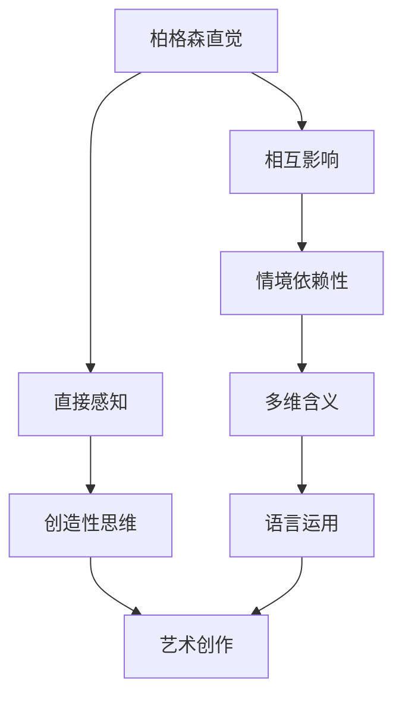

                 

### 第一部分：引言

#### 1.1 书籍背景

在艺术与哲学的交汇处，柏格森直觉与维特根斯坦语言游戏作为两大理论基石，其重要性不容忽视。柏格森直觉是法国哲学家亨利·柏格森（Henri Bergson）提出的一个哲学概念，强调直觉在人类认知与创造性活动中的核心作用。维特根斯坦语言游戏则由奥地利哲学家路德维希·维特根斯坦（Ludwig Wittgenstein）提出，是对语言意义和语言使用的一种独特理解，主张通过语言游戏来揭示语言的多维含义。

这两大理论不仅深刻影响了哲学领域，也在艺术创作中发挥着重要作用。柏格森的直觉观念主张超越逻辑和理性的限制，通过直接感知来捕捉世界的美和复杂性，这与艺术创作中追求灵感与创意的直觉性密切相关。维特根斯坦的语言游戏理论则强调语言与生活世界的紧密联系，通过具体的使用场景来理解语言的多义性和灵活性，这对于艺术家在创作过程中的语言运用和表达方式具有重要启示。

因此，本研究旨在探讨柏格森直觉与维特根斯坦语言游戏在艺术创作中的具体应用和相互影响，分析其如何共同作用于艺术创作的形式和内容，为艺术理论的进一步发展提供新的视角。

#### 1.2 核心概念

##### 1.2.1 柏格森直觉概念

柏格森直觉是一个哲学概念，起源于法国哲学家亨利·柏格森的理论体系。柏格森认为，直觉是人类认知过程中的一种核心能力，它不同于逻辑推理和感性认知，而是通过直接感知来把握事物的本质和内在联系。柏格森直觉强调非线性的思维方式和创造性，主张在复杂多变的世界中，通过直觉来捕捉瞬间的美和意义。

**问题背景**：在柏格森看来，传统哲学和科学的方法过于依赖理性分析和逻辑推理，忽视了人类直觉在认知过程中的重要作用。柏格森试图通过直觉这一概念来弥补这一缺陷，揭示人类认识世界的另一种途径。

**概念解析**：柏格森直觉可以理解为一种超越常规思维模式的感知能力，它不依赖于具体的数据和逻辑，而是通过直接的内心体验来感知和理解世界。柏格森认为，直觉是一种本能的、非理性的认知方式，是创造性思维和艺术创作的源泉。

**柏格森直觉的属性特征**：

1. **非线性**：柏格森直觉强调思维的非线性，主张在复杂多变的环境中，通过直觉来捕捉瞬间的美和意义。
2. **创造性**：直觉往往能够带来新的视角和创意，是艺术创作的核心动力。
3. **直接性**：直觉是一种直接的感知，不需要经过复杂的逻辑推理，能够快速地把握事物的本质。
4. **灵活性**：直觉具有较强的灵活性，能够在不同的情境下灵活应用，适应不同的创作需求。

##### 1.2.2 维特根斯坦语言游戏概念

维特根斯坦语言游戏是维特根斯坦哲学理论的核心部分，它是对语言意义和语言使用的一种独特理解。维特根斯坦认为，语言的意义不在于符号本身，而在于语言的使用情境，即语言游戏。通过具体的语言游戏，维特根斯坦揭示了语言的多维含义和灵活性。

**问题背景**：在维特根斯坦之前，哲学家们大多认为语言的意义是固定的，可以通过逻辑分析来揭示。然而，维特根斯坦指出，语言的意义是依赖于具体情境的，不同的语言游戏有着不同的意义和使用方式。

**概念解析**：维特根斯坦语言游戏指的是在特定情境下，语言的使用方式和规则。每个语言游戏都有其特定的目标和规则，不同的语言游戏之间是相互独立的。通过语言游戏，维特根斯坦揭示了语言的复杂性和多样性。

**维特根斯坦语言游戏的属性特征**：

1. **情境依赖性**：语言的意义依赖于具体的情境，不同的情境下，语言的使用方式和含义也会发生变化。
2. **灵活性**：语言游戏具有很强的灵活性，能够适应不同的语境和需求。
3. **独立性**：每个语言游戏都是独立的，它们之间没有固定的逻辑关系，而是相互并列。
4. **多样性**：语言游戏形式多样，涵盖了从日常交流到艺术表达的各种情境。

#### 1.3 柏格森直觉与维特根斯坦语言游戏的联系

柏格森直觉与维特根斯坦语言游戏虽然源于不同的哲学体系，但它们在艺术创作中有着深刻的联系。柏格森直觉强调通过直接感知来把握事物的本质，而维特根斯坦语言游戏则通过具体的语言使用场景来揭示语言的多维含义。这两者共同作用于艺术创作，提供了独特的创作视角和方法。

**概念关系图**：

下面使用Mermaid绘制柏格森直觉与维特根斯坦语言游戏的概念关系图：

**关联分析**：

1. **直觉与语言游戏的关系**：柏格森直觉提供了艺术创作的灵感来源，而维特根斯坦语言游戏则通过具体的语言使用场景，将这些灵感转化为具体的形式。直觉和语言游戏相互补充，共同作用于艺术创作的全过程。
2. **创作过程中的相互作用**：在艺术创作过程中，柏格森直觉帮助艺术家捕捉瞬间的美和创意，而维特根斯坦语言游戏则将这些创意转化为具体的表现形式。直觉和语言游戏在创作过程中相互交织，共同推动艺术作品的形成。
3. **哲学基础**：柏格森直觉和维特根斯坦语言游戏都是对传统哲学方法的挑战，强调非线性和情境依赖性。这种哲学基础为艺术创作提供了新的视角和方法，促进了艺术理论的发展。

通过上述分析，可以看出柏格森直觉与维特根斯坦语言游戏在艺术创作中具有紧密的联系和互补作用，为艺术创作提供了丰富的理论资源和实践方法。接下来，我们将进一步探讨这两大理论在艺术创作中的具体应用。

