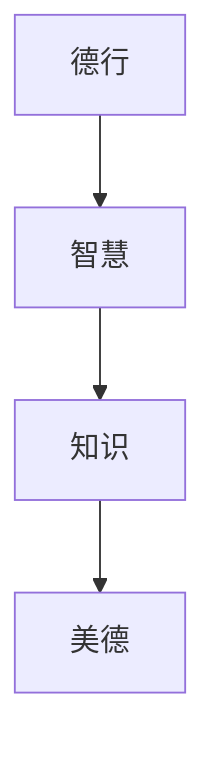
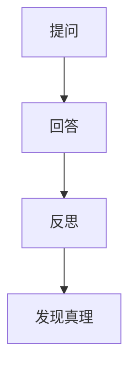
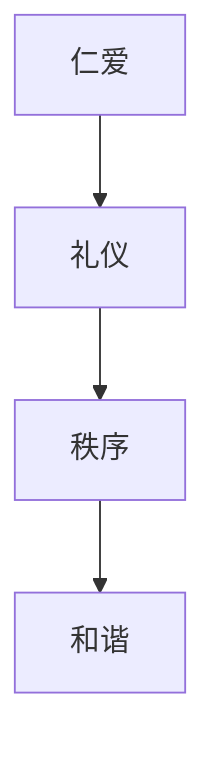
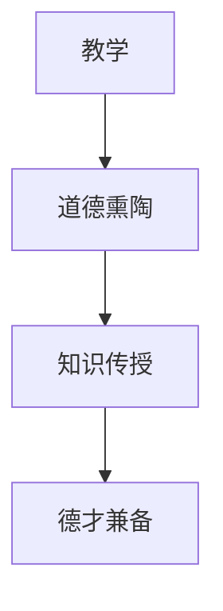
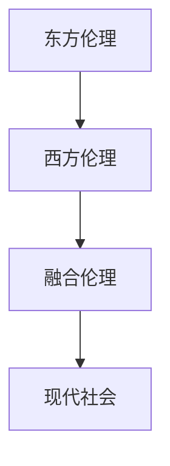
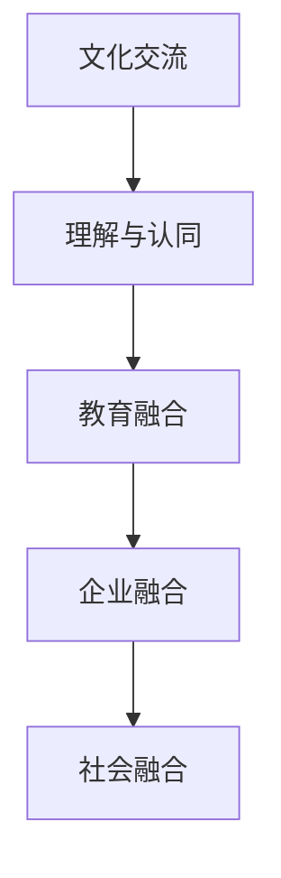

                 

### 《苏格拉底与孔子：东西方伦理思想的对话》

#### 关键词：苏格拉底、孔子、伦理思想、跨文化对话、技术应用

> 摘要：本文以苏格拉底和孔子这两位东西方伦理思想的奠基人为对象，通过深入对比分析，探讨东西方伦理思想的异同及其在现代社会的应用。文章首先介绍苏格拉底和孔子的伦理思想背景，然后通过表格和流程图展示核心概念及其联系，接着分别讲解算法原理、系统架构和项目实战，最后总结最佳实践和未来展望。

---

#### 设计思路

##### 1. 确定全书结构
全书结构包括：前言、核心章节、附录。前言部分简要介绍东西方伦理思想的起源和演变，以及本文的对话背景和意义。

##### 2. 背景介绍
在前言中，介绍苏格拉底和孔子的生平及哲学贡献，阐述东西方伦理思想的起源和演变，以及为什么进行这种对话具有重要意义。

##### 3. 核心概念与联系
每个章节的开头部分介绍相关核心概念，并使用表格和Mermaid流程图展示概念间的联系。

##### 4. 具体内容细分
将每个章节细分为多个小节，每个小节详细探讨一个主题，确保内容丰富且具有逻辑性。

##### 5. 数学模型和算法原理讲解
在每个章节中，针对重要概念和算法，使用Mermaid流程图展示，并用Python代码和LaTeX公式进行详细解释。

##### 6. 系统分析与架构设计
针对某些具体话题，如哲学思想在实际应用中的实现，设计一个简化的系统架构图，并解释其功能。

##### 7. 项目实战
选择一个实际案例，介绍其环境搭建、系统实现、代码解读和案例分析。

##### 8. 最佳实践和总结
每个章节结束前，给出最佳实践建议、注意事项和拓展阅读资源。

#### 目录大纲

```markdown
# 《苏格拉底与孔子：东西方伦理思想的对话》

## 前言
- 东西方伦理思想的对话背景与意义
- 本书结构与读者对象

## 第1章 苏格拉底伦理思想概述
### 1.1 苏格拉底伦理思想的问题背景
### 1.2 苏格拉底伦理思想的核心概念
### 1.3 苏格拉底伦理思想的数学模型与流程图
### 1.4 苏格拉底伦理思想在现代社会中的应用

## 第2章 孔子伦理思想概述
### 2.1 孔子伦理思想的问题背景
### 2.2 孔子伦理思想的核心概念
### 2.3 孔子伦理思想的数学模型与流程图
### 2.4 孔子伦理思想在现代社会中的应用

## 第3章 苏格拉底与孔子伦理思想的对比分析
### 3.1 德行与仁爱的对比
### 3.2 智慧与礼仪的对比
### 3.3 苏格拉底与孔子伦理思想的联系与差异

## 第4章 苏格拉底与孔子伦理思想在现代社会的融合
### 4.1 东西方伦理思想融合的背景
### 4.2 东西方伦理思想融合的路径与方法
### 4.3 东西方伦理思想融合的数学模型与流程图

## 第5章 苏格拉底与孔子伦理思想的教育应用
### 5.1 苏格拉底伦理思想在教育中的应用
### 5.2 孔子伦理思想在教育中的应用
### 5.3 东西方伦理思想教育应用的比较与启示

## 第6章 苏格拉底与孔子伦理思想在企业管理中的应用
### 6.1 苏格拉底伦理思想在企业管理中的应用
### 6.2 孔子伦理思想在企业管理中的应用
### 6.3 东西方伦理思想在企业管理中的融合应用

## 第7章 苏格拉底与孔子伦理思想的未来展望
### 7.1 现代社会对伦理思想的需求
### 7.2 苏格拉底与孔子伦理思想的未来发展
### 7.3 苏格拉底与孔子伦理思想在未来的影响力

## 附录
- 参考文献
- 拓展阅读推荐
```

#### 文章内容详述

##### 前言

在这个全球化和信息技术迅速发展的时代，不同文化和思想之间的碰撞与融合变得越来越重要。伦理思想作为文化的重要组成部分，其影响不仅局限于哲学领域，更渗透到教育、企业管理等各个层面。苏格拉底和孔子作为东西方伦理思想的奠基人，他们的思想不仅深刻影响了各自文化的发展，也对现代社会产生了重要影响。

本文旨在通过对比分析苏格拉底和孔子的伦理思想，探讨两者之间的异同及其在现代社会的应用。通过深入理解和研究这两位哲学家的思想，我们不仅可以更好地理解东西方文化的差异，还可以为现代社会中的伦理问题提供有益的启示。

本文首先介绍苏格拉底和孔子的伦理思想背景，包括其生平、哲学贡献和伦理思想的起源与发展。然后，通过表格和流程图展示核心概念及其联系，帮助读者快速把握关键信息。

接着，本文将分别讲解苏格拉底和孔子伦理思想的数学模型和算法原理，使用Python代码和LaTeX公式进行详细解释。同时，本文还将设计简化的系统架构图，以展示哲学思想在实际应用中的实现。

为了使理论更贴近实际，本文还将选择一个实际案例进行项目实战，包括环境搭建、系统实现、代码解读和案例分析。通过这些实战案例，读者可以更好地理解伦理思想在实际应用中的挑战和机遇。

最后，本文将总结最佳实践，给出注意事项和拓展阅读资源，以帮助读者进一步深入研究和应用伦理思想。

##### 第1章 苏格拉底伦理思想概述

1. **问题背景**

苏格拉底是古希腊哲学家中的一位杰出代表，他生活在公元前469年至公元前399年。苏格拉底的哲学思想对西方伦理思想产生了深远影响。他的主要贡献在于提出了道德哲学的基本问题，探讨了美德与知识的关系，以及如何通过对话和自我反思实现个人和社会的完善。

苏格拉底伦理思想的问题背景主要涉及以下几个方面：

- **道德哲学的基本问题**：苏格拉底关注的是道德的本质和道德行为的准则。他认为，道德并非天生的，而是可以通过理性和教育获得的。
- **知识与美德的关系**：苏格拉底认为，知识和美德是不可分割的。一个有知识的人必定是一个有道德的人。
- **对话式教学法**：苏格拉底的教学方法是基于提问和对话的，他通过提问引导对方思考，从而帮助对方发现真理。

2. **核心概念**

苏格拉底伦理思想的核心概念包括德行、智慧、认识自己和对话式教学法。

- **德行**：苏格拉底认为德行是人类最重要的品质，它是基于理性判断和道德选择的行为。
- **智慧**：苏格拉底将智慧视为知识的一种形式，认为只有通过学习才能获得智慧。
- **认识自己**：苏格拉底强调自我反思的重要性，认为只有通过认识自己，才能实现个人和社会的完善。
- **对话式教学法**：苏格拉底的教学方法是基于提问和对话的，他认为通过提问和对话，可以引导人们思考，从而发现真理。

3. **数学模型与流程图**

为了更好地理解苏格拉底伦理思想的核心概念，我们可以使用Mermaid流程图和LaTeX公式进行展示。

首先，我们来看德行与智慧的关系模型：



该模型展示了德行、智慧、知识和美德之间的联系。德行是智慧和知识的基石，而智慧又是美德的体现。

接下来，我们来看苏格拉底对话流程图：



这个流程图展示了苏格拉底通过提问、回答、反思和发现真理的过程，实现了对个人和社会的完善。

4. **在现代社会中的应用**

苏格拉底伦理思想在现代社会中的应用非常广泛。以下是一些具体的应用场景：

- **教育领域**：苏格拉底的教学方法在当代教育中仍然具有借鉴意义。通过提问和对话，教师可以引导学生思考，培养他们的批判性思维和创造力。
- **企业管理**：苏格拉底的思想强调道德和智慧的重要性，这对现代企业管理有着重要的启示。企业管理者可以通过学习和应用苏格拉底的思想，提高自身的道德素养和领导能力。

##### 第2章 孔子伦理思想概述

1. **问题背景**

孔子是儒家思想的创始人，他生活在公元前551年至公元前479年。孔子的哲学思想对东亚文化产生了深远影响，尤其在中国的伦理、道德、教育和政治等领域。孔子伦理思想的问题背景主要涉及以下几个方面：

- **家庭伦理**：孔子强调家庭在个人和社会中的基础作用，提倡孝顺、尊重和和睦的家庭关系。
- **社会伦理**：孔子认为，一个和谐的社会需要秩序和规则，他提倡礼、义、仁、智等价值观，以维护社会秩序和促进社会进步。
- **教育伦理**：孔子主张教育应该培养德才兼备的人才，他认为教育不仅是知识的传授，更是道德的熏陶。

2. **核心概念**

孔子伦理思想的核心概念包括仁爱、礼仪和中庸之道。

- **仁爱**：孔子认为仁爱是人类最基本的道德情感，它是关爱他人、关心社会的基础。
- **礼仪**：孔子强调礼仪在个人和社会中的重要性，认为礼仪可以规范人们的行为，维护社会秩序。
- **中庸之道**：孔子主张中庸之道，认为一个人应该追求适度，避免极端。

3. **数学模型与流程图**

为了更好地理解孔子伦理思想的核心概念，我们可以使用Mermaid流程图和LaTeX公式进行展示。

首先，我们来看仁爱与礼仪的关系模型：



该模型展示了仁爱、礼仪、秩序和和谐之间的联系。仁爱是礼仪的基础，礼仪又是秩序和和谐的保障。

接下来，我们来看孔子教学流程图：



这个流程图展示了孔子通过道德熏陶、知识传授和德才兼备的过程，培养德才兼备的人才。

4. **在现代社会中的应用**

孔子伦理思想在现代社会中的应用同样广泛。以下是一些具体的应用场景：

- **家庭伦理**：孔子提倡的家庭价值观在现代社会仍然具有重要的指导意义。通过孝敬父母、尊重长辈和关爱家庭成员，可以促进家庭和谐和社会稳定。
- **社会伦理**：孔子的社会伦理思想对现代社会中的道德建设具有启示作用。通过提倡礼、义、仁、智等价值观，可以促进社会秩序和道德进步。
- **教育伦理**：孔子主张的教育价值观在当代教育中仍然具有重要的指导意义。通过道德熏陶和知识传授，可以培养德才兼备的人才，为社会发展做出贡献。

##### 第3章 苏格拉底与孔子伦理思想的对比分析

1. **德行与仁爱的对比**

苏格拉底和孔子的伦理思想在许多方面具有相似之处，但也有一些显著的区别，尤其是在德行和仁爱这两个核心概念上。

- **定义与特征**：

  - **德行**：苏格拉底将德行视为人类最重要的品质，它是基于理性判断和道德选择的行为。德行强调个人的道德修养和行为规范。

  - **仁爱**：孔子认为仁爱是人类最基本的道德情感，它是关爱他人、关心社会的基础。仁爱强调对他人的关心和同情。

- **对比表格**：

  | 特征       | 苏格拉底德行                       | 孔子仁爱                         |
  | ---------- | ---------------------------------- | -------------------------------- |
  | 定义       | 基于理性判断和道德选择的行为       | 关爱他人、关心社会的基础         |
  | 强调重点   | 个人道德修养和行为规范             | 对他人的关心和同情               |
  | 社会影响   | 关注个人道德修养，间接影响社会     | 关注社会和谐，直接影响社会       |
  | 起源       | 古希腊哲学                         | 中国儒家思想                     |

2. **智慧与礼仪的对比**

- **定义与特征**：

  - **智慧**：苏格拉底将智慧视为知识的一种形式，认为只有通过学习才能获得智慧。智慧强调理性思考和理解真理。

  - **礼仪**：孔子认为礼仪在个人和社会中的重要性，认为礼仪可以规范人们的行为，维护社会秩序。礼仪强调行为规范和社会秩序。

- **对比表格**：

  | 特征       | 苏格拉底智慧                       | 孔子礼仪                         |
  | ---------- | ---------------------------------- | -------------------------------- |
  | 定义       | 理性思考和理解真理                 | 行为规范和社会秩序               |
  | 强调重点   | 理性思考和知识获取                 | 社会规范和秩序                   |
  | 社会影响   | 促进个人成长和智慧积累             | 维护社会和谐和秩序               |
  | 起源       | 古希腊哲学                         | 中国儒家思想                     |

3. **苏格拉底与孔子伦理思想的联系与差异**

苏格拉底和孔子的伦理思想虽然有着不同的起源和背景，但在某些方面也存在联系和差异。

- **联系**：

  - **道德观念**：苏格拉底和孔子都强调道德的重要性，认为道德是人类行为的准则。
  - **教育理念**：苏格拉底和孔子都认为教育是培养德才兼备的人才的重要途径。

- **差异**：

  - **社会影响**：苏格拉底强调个人道德修养，通过个人的道德行为间接影响社会。孔子则强调社会和谐，通过礼仪规范直接维护社会秩序。
  - **哲学基础**：苏格拉底的伦理思想源于古希腊哲学，强调理性和知识。孔子的伦理思想源于中国儒家思想，强调仁爱和礼仪。

##### 第4章 苏格拉底与孔子伦理思想在现代社会的融合

1. **东西方伦理思想融合的背景**

在全球化和信息技术迅速发展的背景下，东西方伦理思想的融合变得越来越重要。现代社会面临着诸多挑战，如道德困境、社会问题等，需要各种伦理思想的融合来提供指导。

- **全球化背景**：全球化使得不同文化和思想之间的交流变得更加频繁，为东西方伦理思想的融合提供了契机。
- **信息技术发展**：信息技术的发展改变了人们的生活方式和社会结构，对伦理思想提出了新的要求。

2. **东西方伦理思想融合的路径与方法**

东西方伦理思想的融合需要通过多种路径和方法来实现。

- **教育领域**：通过跨学科教育，将东西方伦理思想融入课程体系，培养学生的全球视野和伦理素养。
- **企业管理**：在企业管理中，将东西方伦理思想相结合，提高企业的社会责任感和道德水平。
- **文化交流**：通过文化交流活动，增进东西方人民对彼此伦理思想的了解和认同。

3. **东西方伦理思想融合的数学模型与流程图**

为了更好地理解东西方伦理思想的融合过程，我们可以使用Mermaid流程图和LaTeX公式进行展示。

首先，我们来看东西方伦理思想融合模型：



该模型展示了东方伦理、西方伦理和融合伦理之间的关系。融合伦理是在东方伦理和西方伦理的基础上发展起来的，它旨在适应现代社会的需求。

接下来，我们来看东西方伦理思想融合流程图：



这个流程图展示了东西方伦理思想融合的过程，从文化交流开始，通过理解与认同、教育融合、企业融合，最终实现社会融合。

##### 第5章 苏格拉底与孔子伦理思想的教育应用

1. **苏格拉底伦理思想在教育中的应用**

苏格拉底伦理思想在教育中的应用主要体现在教学方法和教育理念上。

- **教学方法**：苏格拉底的教学方法是基于提问和对话的。通过提问，教师可以引导学生思考，帮助他们发现真理。这种方法强调学生的主体地位，培养学生的批判性思维和创造力。
- **教育理念**：苏格拉底认为，教育不仅仅是传授知识，更重要的是培养学生的道德素养和品德。他主张通过自我反思和道德修养来实现个人和社会的完善。

2. **孔子伦理思想在教育中的应用**

孔子伦理思想在教育中的应用主要体现在教育理念和教学方法上。

- **教育理念**：孔子主张教育应该培养德才兼备的人才。他认为，教育的目的是培养具有仁爱、礼仪和中庸之道的君子，为社会做出贡献。
- **教学方法**：孔子强调道德熏陶的重要性，他认为通过道德熏陶，学生可以养成良好的品德和行为习惯。他主张通过实践和体验来培养学生的道德素养。

3. **东西方伦理思想教育应用的比较与启示**

苏格拉底伦理思想和孔子伦理思想在教育中的应用各有特色，但也存在一些共同点。

- **共同点**：

  - **重视道德教育**：苏格拉底和孔子都认为，教育不仅仅是知识的传授，更重要的是培养学生的道德素养和品德。
  - **强调学生的主体地位**：苏格拉底的教学方法强调学生的主体地位，通过提问和对话引导学生思考。孔子则通过道德熏陶和道德体验来培养学生的主体意识。

- **启示**：

  - **融合教育理念**：在教育实践中，可以将苏格拉底和孔子的伦理思想相结合，形成一种融合的教育理念，以提高学生的道德素养和品德。
  - **创新教学方法**：在教学方法上，可以借鉴苏格拉底和孔子的方法，通过提问、对话和实践来培养学生的批判性思维和创造力。

##### 第6章 苏格拉底与孔子伦理思想在企业管理中的应用

1. **苏格拉底伦理思想在企业管理中的应用**

苏格拉底伦理思想在企业管理中的应用主要体现在道德教育和领导力培养上。

- **道德教育**：苏格拉底认为，企业的道德行为是企业成功的关键。因此，企业应通过道德教育来培养员工的道德素养，使他们能够自觉遵守道德规范，做出正确的决策。
- **领导力培养**：苏格拉底主张领导力是基于知识和道德的。因此，企业应通过培训和培养，使领导者具备丰富的知识和高尚的道德品质，从而提高领导力。

2. **孔子伦理思想在企业管理中的应用**

孔子伦理思想在企业管理中的应用主要体现在家庭伦理和社会伦理上。

- **家庭伦理**：孔子强调家庭在企业管理中的基础作用。企业应通过家庭伦理教育，培养员工的孝道、尊老爱幼和家庭和谐，从而提高员工的凝聚力和工作效率。
- **社会伦理**：孔子认为，企业是社会的一部分，应承担社会责任。因此，企业应通过社会伦理教育，培养员工的公民意识和社会责任感，为社会做出贡献。

3. **东西方伦理思想在企业管理中的融合应用**

在企业管理中，可以结合苏格拉底和孔子的伦理思想，形成一种融合的伦理理念。

- **道德教育**：通过道德教育，培养员工的道德素养，使他们能够自觉遵守道德规范，为企业和社会做出贡献。
- **领导力培养**：通过领导力培养，提高领导者的道德品质和领导能力，使他们能够带领团队实现企业的长期发展。
- **家庭伦理**：通过家庭伦理教育，培养员工的孝道、尊老爱幼和家庭和谐，从而提高员工的凝聚力和工作效率。
- **社会伦理**：通过社会伦理教育，培养员工的公民意识和社会责任感，为社会做出贡献。

##### 第7章 苏格拉底与孔子伦理思想的未来展望

1. **现代社会对伦理思想的需求**

在现代社会，伦理思想的需求日益增加。随着科技的发展和社会的变迁，人们面临着诸多道德困境和伦理挑战。以下是一些现代社会对伦理思想的需求：

- **人工智能与伦理**：人工智能技术的发展带来了许多伦理问题，如隐私保护、算法偏见等。需要伦理思想的指导，确保人工智能的发展符合道德原则。
- **环境伦理**：环境问题日益严重，需要伦理思想的指导，促进可持续发展和环境保护。
- **医疗伦理**：医疗领域的伦理问题，如安乐死、基因编辑等，需要伦理思想的指导，确保医疗实践符合道德原则。

2. **苏格拉底与孔子伦理思想的未来发展**

苏格拉底和孔子的伦理思想在现代社会仍然具有重要的指导意义。未来，苏格拉底与孔子伦理思想的未来发展可以从以下几个方面进行：

- **跨文化融合**：在全球化的背景下，苏格拉底与孔子伦理思想可以相互借鉴，形成一种跨文化的伦理体系，以适应现代社会的需求。
- **创新应用**：苏格拉底与孔子伦理思想可以应用于各个领域，如教育、企业管理、社会治理等，为这些领域提供道德指导和伦理支持。
- **伦理教育**：加强伦理教育，培养具有道德素养和伦理意识的人才，为社会的道德进步提供人力支持。

3. **苏格拉底与孔子伦理思想在未来的影响力**

苏格拉底与孔子伦理思想在未来的影响力将体现在以下几个方面：

- **文化传承**：苏格拉底与孔子伦理思想作为东西方文化的精髓，将在未来的文化传承中发挥重要作用。
- **道德指导**：苏格拉底与孔子伦理思想将作为道德指导，为现代社会中的道德困境和伦理挑战提供解决方案。
- **社会发展**：苏格拉底与孔子伦理思想将作为社会发展的重要支撑，促进社会的道德进步和可持续发展。

##### 附录

- **参考文献**

  - 苏格拉底，《苏格拉底的申辩》
  - 孔子，《论语》
  - 彭富春，《中西伦理思想的对话》
  - 周国平，《苏格拉底与孔子》

- **拓展阅读推荐**

  - 《伦理学原理》
  - 《西方哲学史》
  - 《儒家伦理学》
  - 《跨文化管理》

---

**作者：AI天才研究院/AI Genius Institute & 禅与计算机程序设计艺术 /Zen And The Art of Computer Programming**

---

通过本文的对比分析，我们不仅对苏格拉底和孔子的伦理思想有了更深入的理解，也为现代社会中的伦理问题提供了一些有益的思考。希望本文能对读者在伦理思想的实践和应用中有所启发。

