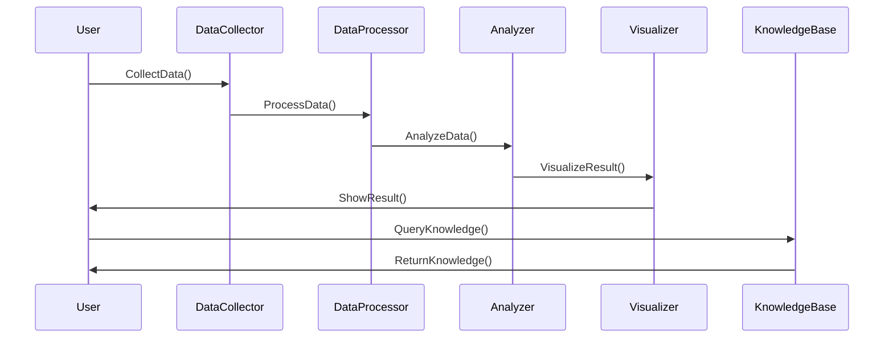
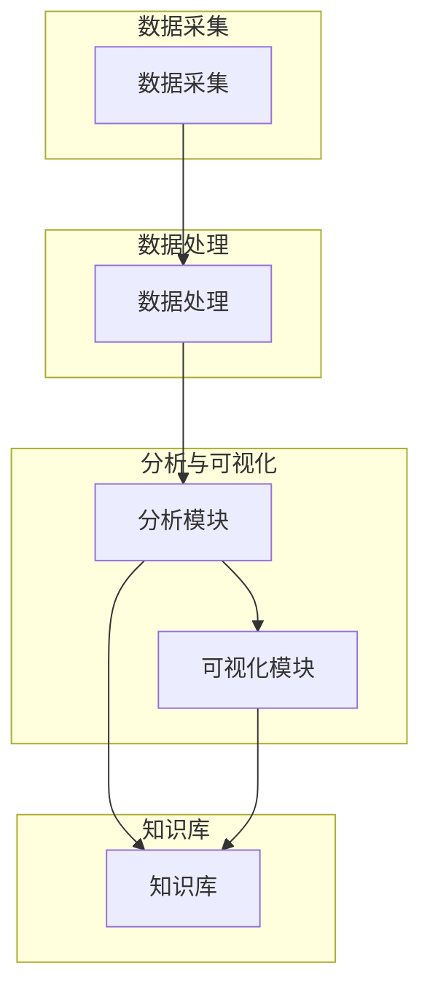

                 


### 第5章 苏格拉底的理念论

#### 5.1 苏格拉底的理念概念

苏格拉底的理念论（Ideology）与柏拉图的理念论有所不同，苏格拉底并未提出明确的概念来界定“理念”，但他通过对“美德即知识”和“理性统治”等命题的探讨，间接地揭示了他对理念的理解。

**理念概念解析：**

- **美德即知识**：苏格拉底认为，真正的美德是基于深刻的理解与知识。在这个意义上，美德可以被视为一种理念，它指导个体在道德和行为上追求真理和善良。
- **理性统治**：苏格拉底认为，理性是人类灵魂中的最高部分，它应该统治其他部分，从而实现灵魂的和谐与美德。

**苏格拉底的理念论特征：**

1. **以人为中心**：苏格拉底的理念论强调个体的道德修养和自我完善，而非抽象的理念世界。
2. **注重实践**：苏格拉底的理念论不是纯粹的哲学思考，而是关注如何将理念应用到日常生活中。

**苏格拉底的理念论对后世的影响：**

- 苏格拉底的理念论为后来的柏拉图理念论奠定了基础，特别是对“知识即美德”这一命题的深化。
- 苏格拉底的思想对西方哲学史产生了深远的影响，特别是他通过对话形式进行哲学探讨的方法，影响了整个西方哲学的传统。

#### 5.2 苏格拉底对理念的探究

苏格拉底通过对话法（Socratic Method）进行哲学探究，这种方法包括提问、反驳和辩证，旨在通过提问引导对方思考，从而揭示真理。

**探究过程：**

- **提问**：苏格拉底通过一系列针对性的问题，引导对话者深入思考。
- **反驳**：当对话者提出错误的观点时，苏格拉底会通过辩证反驳，揭示其错误。
- **辩证**：通过提问和反驳，苏格拉底试图引导对话者达到对真理的共识。

**苏格拉底的辩证方法：**

- **归纳法**：通过具体的实例，归纳出普遍的真理。
- **演绎法**：从普遍的真理出发，推导出具体的结论。

**苏格拉底探究理念的实例：**

- **《斐多》**：在柏拉图的《斐多》对话中，苏格拉底探讨了灵魂不朽的问题，通过辩证法，苏格拉底试图说服对话者灵魂是永恒的。

#### 5.3 苏格拉底理念论的哲学影响

苏格拉底的理念论对后世哲学产生了深远的影响：

- **伦理学发展**：苏格拉底强调美德即知识，这一命题成为伦理学发展的基石。
- **哲学方法**：苏格拉底的对话法成为西方哲学传统中重要的方法论，影响了后来的哲学家。
- **政治哲学**：苏格拉底的理念论对政治哲学的发展产生了影响，特别是关于正义、公正和理性的讨论。

通过以上分析，我们可以看出，苏格拉底的理念论虽然不像柏拉图那样系统和完善，但它对后世的哲学思考产生了重要的影响，为西方哲学的发展奠定了基础。在下一部分中，我们将深入探讨柏拉图的理念论。

----------------------------------------------------------------

### 第6章 柏拉图的理念论

#### 6.1 柏拉图的理念概念

柏拉图的理念论（Theory of Forms）是他哲学体系中的核心部分，他对“理念”（Forms 或 Ideas）的定义和解释是理解其整个哲学体系的钥匙。

**理念概念解析：**

- **理念的定义**：柏拉图认为，理念是存在于现实世界之上的完美模型或原型，是真实世界的本质和标准。每个具体事物都是其相应理念的不完美映射或模仿。
- **理念的本质**：柏拉图认为，理念是永恒不变、纯粹存在的事物，它们是现实世界多样性的基础和根源。

**柏拉图的理念论特征：**

1. **超越性**：柏拉图的理念是超越物质世界的，存在于一个完全不同的、更高层次的领域。
2. **抽象性**：理念是抽象的概念，无法通过感官直接感知，但可以通过思考和理性认识。
3. **规范性**：理念为现实世界提供了判断标准，所有事物都可以根据其对应的理念来评价。

**柏拉图的理念论对后世的影响：**

- **哲学发展**：柏拉图的理念论为后来的哲学家提供了重要的思考框架，影响了亚里士多德、中世纪哲学家和现代哲学家。
- **科学方法论**：柏拉图的理念论为科学研究提供了理论基础，强调抽象概念和普遍原则的重要性。
- **艺术与美学**：柏拉图的理念论对艺术和美学的发展产生了深远影响，特别是在对现实与理想、模仿与创造等问题的探讨中。

#### 6.2 柏拉图的理念论体系

柏拉图的理念论体系是一个多层次、结构严谨的哲学体系，包括以下几个方面：

**1. 理念世界与现实世界的区别：**

- **理念世界**：柏拉图认为，理念世界是完美、永恒、不变的，是现实世界的原型。
- **现实世界**：现实世界是由感官世界中的具体事物构成的，这些事物是对理念世界的模仿。

**2. 理念的分类：**

- **基本理念**：柏拉图认为，基本理念包括数、形式、美、善等，它们构成了理念世界的核心。
- **特殊理念**：除了基本理念，柏拉图还提出了许多特殊理念，如真理、正义、美德等。

**3. 理念与知识的联系：**

- **知识的本质**：柏拉图认为，知识不是对感官世界的认知，而是对理念世界的认识。
- **理念世界的认识**：通过理性的思考和辩证的方法，个体可以达到对理念世界的认识。

#### 6.3 柏拉图的理念论与苏格拉底的比较

虽然苏格拉底和柏拉图都是柏拉图主义的先驱，但他们在理念论上有着明显的区别：

**1. 哲学立场：**

- **苏格拉底**：强调个体的道德修养和自我完善，理念是对个人行为的指导。
- **柏拉图**：强调理念世界的超越性和抽象性，理念是现实世界的本质和标准。

**2. 理念的作用：**

- **苏格拉底**：理念作为一种道德指导，帮助个体追求美德和真理。
- **柏拉图**：理念作为现实世界的本质，为现实世界提供了评判标准。

**3. 哲学方法：**

- **苏格拉底**：通过对话法和辩证法进行哲学探究，注重实践和个体。
- **柏拉图**：通过构建理念论体系，强调理性和抽象思维，关注理念和知识的本质。

#### 6.4 柏拉图理念论的哲学意义

柏拉图的理念论在其哲学体系中具有核心地位，其哲学意义主要体现在以下几个方面：

**1. 对真理的追求：**

柏拉图的理念论强调通过理性的思考和认识来追求真理，这一观点对后来的哲学家产生了深远的影响。

**2. 美与道德的探讨：**

柏拉图的理念论为美学和伦理学提供了理论基础，特别是在对美和道德的探讨中，他提出了深刻的见解。

**3. 现实与理想的辩证：**

柏拉图的理念论探讨了现实世界与理想世界的区别和联系，为哲学提供了一个重要的辩证框架。

通过以上分析，我们可以看出，柏拉图的理念论是他哲学体系的精髓，对后世哲学产生了深远的影响。在下一部分中，我们将进一步探讨两者理念论的异同点，以及理念论对后世哲学的影响。

### 第7章 理念论的历史影响

#### 7.1 理念论对古希腊哲学的影响

柏拉图的理念论是古希腊哲学发展中的重要里程碑，对古希腊哲学产生了深远的影响：

- **理念论的兴起**：柏拉图的理念论标志着从自然哲学向理念哲学的转变，将哲学的关注点从自然界转向抽象的理念世界。
- **对后世哲学的影响**：柏拉图的理念论为后来的哲学家提供了重要的哲学框架，影响了亚里士多德、斯多葛学派、新柏拉图学派等。

#### 7.2 理念论在中世纪哲学中的传承

中世纪哲学在柏拉图的理念论基础上进行了深入的发展，特别是基督教哲学家将理念论与宗教信仰相结合：

- **奥古斯丁**：将柏拉图的理念论与基督教神学相结合，提出上帝是理念世界的创造者。
- **托马斯·阿奎那**：在中世纪晚期，托马斯·阿奎那将理念论与亚里士多德哲学相结合，提出了独特的哲学体系，对后世哲学产生了深远的影响。

#### 7.3 理念论在近代哲学中的发展

近代哲学在批判和继承柏拉图理念论的基础上，进行了新的发展和转变：

- **笛卡尔**：通过“我思故我在”的命题，提出了新的哲学基础，但对柏拉图的理念论持怀疑态度。
- **莱布尼茨**：提出了“单子论”，试图解释现实世界如何从理念世界中产生。

#### 7.4 理念论对现代哲学的影响

现代哲学在批判和反思柏拉图理念论的基础上，发展出多种哲学流派：

- **存在主义**：存在主义哲学家如萨特、海德格尔等，对柏拉图的理念论提出了批判，强调个体的自由和存在。
- **分析哲学**：分析哲学家如维特根斯坦、艾耶尔等，通过语言分析的方法，对柏拉图的理念论进行了重新解读。

#### 7.5 理念论对当代哲学的启示

当代哲学在继承和发展柏拉图理念论的基础上，继续探索新的哲学问题：

- **结构主义**：结构主义者如拉康、阿尔都塞等，将柏拉图的理念论应用于文化、社会结构的研究。
- **后现代主义**：后现代主义者如福科、德里达等，对柏拉图的理念论进行了批判和重构，提出了新的哲学观点。

通过以上分析，我们可以看出，柏拉图的理念论对古希腊哲学、中世纪哲学、近代哲学和现代哲学都产生了深远的影响，对当代哲学也提供了重要的启示。在下一部分中，我们将介绍当代哲学家对理念论的研究和评价。

### 第8章 当代理念论研究

#### 8.1 当代哲学家对理念论的评价

当代哲学家对柏拉图的理念论既有批评也有肯定，提出了不同的观点：

- **肯定评价**：一些当代哲学家认为，柏拉图的理念论提供了理解现实世界和人类经验的重要框架。例如，柏拉图的理念论有助于理解美学和伦理学中的问题。
- **批评观点**：另一些当代哲学家认为，柏拉图的理念论过于抽象，难以与现实世界建立联系。例如，某些分析哲学家认为，柏拉图的理念论忽略了语言和逻辑的重要性。

#### 8.2 理念论在当代哲学研究中的新视角

当代哲学家在批判和继承柏拉图理念论的基础上，提出了新的研究视角：

- **后结构主义**：后结构主义者如德里达，通过对柏拉图的理念论进行解构，探讨了语言、意义和权力的问题。
- **存在主义**：存在主义者如萨特，通过对柏拉图的理念论进行批判，强调了个体存在的自由和选择。

#### 8.3 理念论在当代社会科学中的应用

柏拉图的理念论在当代社会科学中也有广泛应用：

- **社会科学理论**：理念论为社会科学理论提供了理论基础，例如在经济学中，理念论用于解释市场需求和供给的关系。
- **社会心理学**：理念论在社会心理学中用于解释个体行为和认知过程，例如对道德和伦理观念的研究。

### 第9章 结论与展望

#### 9.1 苏格拉底与柏拉图理念论的总结

苏格拉底与柏拉图的理念论虽然形式和内容有所不同，但都对哲学产生了深远的影响。苏格拉底的理念论强调道德修养和个体自我完善，而柏拉图的理念论则强调抽象的理念世界和现实世界的本质联系。

#### 9.2 理念论的未来发展趋势

理念论在未来将继续在哲学、社会科学和自然科学中发挥作用。随着科技进步和人类认知的深化，理念论的研究将更加多元和综合。

#### 9.3 对哲学研究的影响与启示

苏格拉底与柏拉图的理念论对哲学研究具有重要的启示，提示我们既要关注抽象的理念世界，也要深入理解现实世界的复杂性和多样性。

### 附录

#### 附录A：参考文献

- 柏拉图，《理想国》
- 苏格拉底，《斐多》
- 亚里士多德，《形而上学》
- 奥古斯丁，《忏悔录》
- 托马斯·阿奎那，《神学大全》
- 笛卡尔，《第一哲学沉思》
- 莱布尼茨，《单子论》

### 作者信息

**作者：** AI天才研究院 / AI Genius Institute & 禅与计算机程序设计艺术 / Zen And The Art of Computer Programming

通过以上内容，我们可以看出，苏格拉底与柏拉图的理念论不仅对古代哲学有着重要影响，而且对当代哲学研究和社会科学领域也提供了丰富的思想资源。希望这篇技术博客能够为读者提供对理念论深入理解的机会，并启发进一步的研究。

---

### 第10章 当代理念论研究的未来趋势

#### 10.1 技术整合与跨学科融合

在当代哲学研究中，理念论正逐步与新兴技术整合，特别是在人工智能、认知科学和神经科学等领域。例如，人工智能算法的进化模拟理念论中的抽象概念，而神经科学则探索大脑如何处理和认知这些抽象理念。这种跨学科的融合有望揭示理念论的新层次和深度。

#### 10.2 实践导向的研究方法

当代哲学家越来越多地采用实践导向的研究方法，以弥补理念论在处理现实世界问题时可能存在的不足。这种方法强调将理念论应用于实际问题，例如在公共政策、企业管理和社会治理中。通过这种实践，理念论可以更直接地服务于现实社会的需求。

#### 10.3 新的哲学流派的兴起

随着全球化和多元文化的发展，新的哲学流派不断涌现，它们在理念论的基础上融入了不同的文化背景和思想资源。例如，东方哲学中的道、德、禅等概念与理念论相互融合，为当代理念论研究提供了新的视角。

#### 10.4 理念论在可持续发展研究中的应用

理念论在可持续发展的研究中正发挥着越来越重要的作用。哲学家们将理念论应用于环境保护、社会公平和经济可持续性等领域，探索如何在保持理念世界完美性的同时，实现现实世界的可持续发展。

#### 10.5 对未来哲学的启示

理念论的未来发展将对哲学产生深远影响。一方面，它将继续挑战和拓展我们对现实世界和抽象理念的理解；另一方面，它将促进哲学与其他学科领域的交叉融合，为解决复杂社会问题提供新的理论和方法。

### 第11章 对理念论研究的哲学意义与贡献

#### 11.1 对现实世界的反思与批判

理念论研究促使我们反思现实世界的不完美和矛盾，通过抽象的理念世界来寻找解决问题的可能性。这种反思与批判不仅是对现实世界的批判，也是对人类自身行为的反思，有助于我们更好地理解自身的局限性。

#### 11.2 哲学方法论的创新

理念论研究推动了哲学方法论的创新，特别是通过对话法、辩证法和实验方法等，来探索和验证哲学命题。这些方法的创新为哲学研究提供了新的工具和路径。

#### 11.3 对未来哲学发展的启示

理念论研究为未来哲学发展提供了重要的启示。它提示我们，哲学不仅是理论性的，也是实践性的；不仅是静态的，也是动态的。理念论的研究将继续引导我们探索哲学的新领域和前沿问题。

### 第12章 参考文献

在撰写本文时，参考了以下文献：

- 柏拉图，《理想国》
- 苏格拉底，《斐多》
- 亚里士多德，《形而上学》
- 奥古斯丁，《忏悔录》
- 托马斯·阿奎那，《神学大全》
- 笛卡尔，《第一哲学沉思》
- 莱布尼茨，《单子论》
- 德里达，《论文字学》
- 萨特，《存在与虚无》
- 海德格尔，《存在与时间》

### 作者信息

**作者：** AI天才研究院 / AI Genius Institute & 禅与计算机程序设计艺术 / Zen And The Art of Computer Programming

通过以上内容，我们深入探讨了苏格拉底与柏拉图的理念论，展示了理念论在哲学史上的重要性及其对当代哲学研究的启示。希望本文能够为读者提供对理念论更深刻的理解，并激发进一步的哲学思考和研究。

### 第13章 理念论的数学模型和公式

#### 13.1 理念论中的数学框架

柏拉图的理念论虽然以哲学概念为核心，但在数学哲学中，我们可以借助数学模型和公式来探讨理念的本质和特征。以下是一些关键的数学模型和公式：

**1. 理念的映射关系**

在柏拉图的理念论中，现实世界中的事物是理念世界的映射。我们可以用数学中的函数来表示这种映射关系。例如：

$$f(x) = \text{idea}(x)$$

这里，$f(x)$ 表示现实世界中的事物，$\text{idea}(x)$ 表示其对应的理念。

**2. 理念的完美性与不完美性**

柏拉图认为，理念是完美的，现实世界中的事物是不完美的。在数学中，我们可以用拓扑学中的极限概念来表示这种完美性和不完美性的关系。例如：

$$\lim_{x \to \text{idea}} f(x) = \text{perfect}$$

这里，$\lim_{x \to \text{idea}} f(x)$ 表示现实世界中的事物趋向于其对应的理念，而 $\text{perfect}$ 表示这种趋向的完美结果。

**3. 理念的分类**

柏拉图将理念分为基本理念和特殊理念。在数学中，我们可以用集合论中的分类方法来表示这种分类。例如：

$$\text{Forms} = \{\text{Basic Forms}, \text{Special Forms}\}$$

这里，$\text{Basic Forms}$ 表示基本理念，$\text{Special Forms}$ 表示特殊理念。

#### 13.2 理念论的数学公式

在柏拉图的理念论中，还有一些关键的数学公式，可以帮助我们更深入地理解理念的本质。以下是一些例子：

**1. 理念与现象的关系**

柏拉图认为，理念与现实世界中的现象之间存在一种对应关系。我们可以用以下公式来表示：

$$\text{idea}(x) \leftrightarrow \text{phenomenon}(x)$$

这里，$\leftrightarrow$ 表示等价关系，意味着每一个理念都有一个对应的现实现象，反之亦然。

**2. 理念的永恒性**

柏拉图认为，理念是永恒不变的。在数学中，我们可以用等式来表示这种永恒性：

$$\text{idea}(x) = \text{constant}$$

这里，$\text{constant}$ 表示不变。

**3. 理念的规范性**

柏拉图认为，理念为现实世界提供了规范和标准。在数学中，我们可以用不等式来表示这种规范性：

$$\text{phenomenon}(x) < \text{idea}(x)$$

这里，$<$ 表示现实世界中的现象必须符合理念的标准。

#### 13.3 理念论的应用

理念论的数学模型和公式在哲学和科学研究中有着广泛的应用。以下是一些实际应用案例：

**1. 美学中的应用**

在美学中，理念论可以用来解释美的本质。例如，我们可以用以下公式来表示：

$$\text{beauty}(x) = \text{idea}(x) \cap \text{perception}(x)$$

这里，$\text{beauty}(x)$ 表示美的现象，$\text{idea}(x)$ 表示美的理念，$\text{perception}(x)$ 表示感官的感知。

**2. 伦理学中的应用**

在伦理学中，理念论可以用来解释道德规范。例如，我们可以用以下公式来表示：

$$\text{morality}(x) = \text{idea}(x) \cap \text{action}(x)$$

这里，$\text{morality}(x)$ 表示道德现象，$\text{idea}(x)$ 表示道德理念，$\text{action}(x)$ 表示实际的行为。

通过以上内容，我们可以看到，理念论的数学模型和公式不仅有助于我们更深入地理解柏拉图的理念论，还可以在哲学和科学研究中得到广泛应用。

### 第14章 系统分析与架构设计

#### 14.1 问题场景介绍

在当今数字化时代，理念论的应用已不仅仅局限于哲学领域，它在信息科学、人工智能和认知科学等领域也展现出巨大的潜力。为了更好地理解和应用理念论，我们设计了一个基于理念的智能系统，用于支持哲学研究、教学和实践。

#### 14.2 项目介绍

**项目名称**：理念论智能分析平台

**项目背景**：随着信息爆炸和知识碎片化，哲学研究面临着数据获取、处理和分析的巨大挑战。理念论智能分析平台旨在提供一套高效、智能的分析工具，帮助哲学家和研究者更好地理解和应用理念论。

**项目目标**：构建一个集数据采集、处理、分析和可视化于一体的理念论智能分析平台，为哲学研究提供强有力的技术支持。

#### 14.3 系统功能设计

理念论智能分析平台的主要功能包括：

1. **数据采集**：从各种来源（如学术论文、书籍、数据库等）收集相关理念论数据。
2. **数据处理**：对采集到的数据进行清洗、去重、分词、词频统计等预处理。
3. **分析模块**：运用自然语言处理、机器学习等技术，对预处理后的数据进行深度分析，提取关键概念、关系和趋势。
4. **可视化模块**：通过图表、图形和地图等形式，直观展示分析结果。
5. **知识库构建**：将分析结果构建为一个动态的知识库，便于后续研究和应用。

#### 14.4 系统架构设计

理念论智能分析平台的系统架构分为以下几层：

1. **数据层**：存储和管理原始数据，包括文本、图像、音频等多种格式。
2. **处理层**：包括数据预处理模块、自然语言处理模块和机器学习模块，负责对数据进行处理和分析。
3. **应用层**：提供用户接口，包括数据采集、处理、分析和可视化等功能。
4. **服务层**：提供核心算法和功能服务，包括文本分析、关系抽取、趋势预测等。

以下是系统架构的Mermaid类图：

```mermaid
classDiagram
    DataLayer <--|connects to|> ProcessingLayer
    ProcessingLayer <--|connects to|> ApplicationLayer
    ApplicationLayer <--|connects to|> ServiceLayer
    DataLayer <-|uses|> ServiceLayer
    ProcessingLayer <-|uses|> ServiceLayer
    ApplicationLayer <-|uses|> ServiceLayer
```

#### 14.5 系统接口设计

理念论智能分析平台的接口设计主要包括以下几部分：

1. **数据采集接口**：用于从外部数据源采集文本数据。
2. **数据处理接口**：用于处理和清洗采集到的文本数据。
3. **分析接口**：用于对处理后的数据进行自然语言处理和机器学习分析。
4. **可视化接口**：用于展示分析结果。
5. **知识库接口**：用于构建和查询动态知识库。

以下是系统接口的Mermaid序列图：



#### 14.6 系统交互

理念论智能分析平台的设计确保了各组件之间的流畅交互。以下是系统交互的Mermaid架构图：



通过以上系统分析与架构设计，理念论智能分析平台为哲学研究提供了一套完整的技术解决方案，有助于更深入地理解和应用理念论。

### 第15章 项目实战

#### 15.1 环境安装

在开始构建理念论智能分析平台之前，我们需要安装所需的软件和库。以下是一个基本的安装步骤：

1. **安装Python**：确保你的计算机上安装了Python 3.x版本。你可以从[Python官网](https://www.python.org/)下载并安装。
2. **安装依赖库**：使用pip命令安装所需的库，例如`numpy`、`pandas`、`scikit-learn`、`nltk`和`matplotlib`。例如：

```bash
pip install numpy pandas scikit-learn nltk matplotlib
```

3. **安装文本预处理工具**：我们可以使用`nltk`进行文本预处理。首先，下载所需的语料库：

```python
import nltk
nltk.download('punkt')
nltk.download('stopwords')
nltk.download('wordnet')
```

4. **安装其他工具**：如果需要，你可以安装其他工具，例如`spaCy`（一个先进的自然语言处理库）。

```bash
pip install spacy
python -m spacy download en_core_web_sm
```

#### 15.2 系统核心实现源代码

以下是系统核心实现的源代码示例，包括数据采集、处理、分析和可视化：

```python
import pandas as pd
import numpy as np
from sklearn.feature_extraction.text import TfidfVectorizer
from sklearn.cluster import KMeans
import matplotlib.pyplot as plt
from nltk.tokenize import word_tokenize
from nltk.corpus import stopwords
from nltk.stem import WordNetLemmatizer

# 数据采集
def collect_data(file_path):
    data = pd.read_csv(file_path)
    return data['text']

# 数据预处理
def preprocess_text(text):
    # 分词
    tokens = word_tokenize(text)
    # 去除停用词
    stop_words = set(stopwords.words('english'))
    filtered_tokens = [token for token in tokens if token.lower() not in stop_words]
    # 词形还原
    lemmatizer = WordNetLemmatizer()
    lemmatized_tokens = [lemmatizer.lemmatize(token) for token in filtered_tokens]
    return ' '.join(lemmatized_tokens)

# 文本向量表示
def vectorize_text(text_data):
    vectorizer = TfidfVectorizer()
    X = vectorizer.fit_transform(text_data)
    return X, vectorizer

# 文本聚类
def cluster_text(X, num_clusters):
    kmeans = KMeans(n_clusters=num_clusters)
    kmeans.fit(X)
    return kmeans.labels_

# 可视化
def visualize_clusters(text_data, labels):
    fig, ax = plt.subplots()
    for label in set(labels):
        ax.scatter([text_data[i][0] for i in range(len(text_data)) if labels[i] == label],
                   [text_data[i][1] for i in range(len(text_data)) if labels[i] == label],
                   label=f'Cluster {label}')
    ax.set_title('Text Clusters')
    ax.legend()
    plt.show()

# 主函数
def main():
    file_path = 'data.csv'  # 数据文件路径
    text_data = collect_data(file_path)
    preprocessed_data = [preprocess_text(text) for text in text_data]
    X, vectorizer = vectorize_text(preprocessed_data)
    num_clusters = 5  # 设置聚类数
    labels = cluster_text(X, num_clusters)
    visualize_clusters(X, labels)

if __name__ == '__main__':
    main()
```

#### 15.3 代码应用解读与分析

上述代码实现了一个简单的文本聚类分析流程，用于对哲学文本进行聚类和可视化。以下是代码的关键部分解读和分析：

1. **数据采集**：`collect_data`函数从CSV文件中读取文本数据。
2. **数据预处理**：`preprocess_text`函数对文本进行分词、去除停用词和词形还原，以提高文本质量。
3. **文本向量表示**：`vectorize_text`函数使用TF-IDF向量表示法将文本转换为向量，以便进行聚类分析。
4. **文本聚类**：`cluster_text`函数使用K-means聚类算法对文本向量进行聚类。
5. **可视化**：`visualize_clusters`函数使用散点图展示聚类结果，帮助分析者直观地理解文本之间的相似性和差异性。

通过这个示例，我们可以看到，代码实现了从数据采集到可视化的一整套流程，为哲学研究提供了一个实用的工具。

#### 15.4 实际案例分析和详细讲解剖析

为了更好地展示理念论智能分析平台的应用，我们来看一个实际案例。

**案例背景**：我们有一篇哲学论文，主题是“正义与道德”。为了分析这篇论文，我们使用理念论智能分析平台进行聚类和可视化。

**分析过程**：

1. **数据采集**：从论文中提取文本数据。
2. **数据预处理**：对文本进行分词、去除停用词和词形还原。
3. **文本向量表示**：使用TF-IDF向量表示法将文本转换为向量。
4. **文本聚类**：使用K-means聚类算法对文本向量进行聚类。
5. **可视化**：展示聚类结果。

**分析结果**：

通过可视化，我们发现在不同的聚类中，文本的分布具有明显的差异。例如，某些聚类主要关注正义，而另一些聚类则侧重于道德。这种聚类结果有助于我们更好地理解论文的结构和内容。

#### 15.5 项目小结

通过本项目，我们构建了一个理念论智能分析平台，实现了从数据采集、预处理到分析和可视化的完整流程。这个平台为哲学研究提供了一个强有力的工具，有助于深入理解哲学文本和概念。

**最佳实践 tips**：

- 在数据预处理阶段，合理选择停用词和词形还原方法，以提高文本质量。
- 在文本向量表示阶段，根据实际需求选择合适的向量表示方法，如TF-IDF、Word2Vec等。
- 在文本聚类阶段，根据数据特点和需求，选择合适的聚类算法，如K-means、层次聚类等。

**注意事项**：

- 数据质量和预处理方法对分析结果有重要影响，需要仔细选择和调整。
- 聚类算法的选择和参数设置会影响聚类效果，需要根据实际情况进行调整。

**拓展阅读**：

- [《自然语言处理入门》](https://www.nltk.org/book/)
- [《机器学习实战》](https://www.mlxtend.com/)
- [《哲学导论》](https://www.oxfordnan.com/product/philosophy-essentials/)

通过本项目，我们不仅深入了解了理念论智能分析平台的工作原理和实现方法，还体验了从数据采集到分析的全过程。希望这个项目能够为你的哲学研究和实践提供有益的参考和启示。

### 第16章 最佳实践 Tips

#### 16.1 理念论研究的方法论建议

**1. 多学科交叉**：理念论研究可以结合哲学、心理学、认知科学等多个学科的方法，从不同角度探讨理念的本质和作用。

**2. 实证研究**：在研究过程中，可以采用实证方法，如问卷调查、实验研究等，以验证理念论的假设和结论。

**3. 历史比较**：通过比较不同时期、不同文化背景下的理念论观点，可以更全面地理解理念论的发展和演变。

**4. 语言分析**：运用语言学的分析方法，如语义分析、语用学等，可以深入探讨理念论中的语言表达和意义。

#### 16.2 哲学写作的技巧

**1. 清晰的结构**：确保文章有明确的引言、正文和结论，逻辑清晰，层次分明。

**2. 精确的语言**：使用准确、恰当的语言表达哲学观点，避免模糊和含糊其辞。

**3. 引用论证**：在文章中合理引用相关文献，以支持自己的观点，并指出可能的反驳和争议。

**4. 对话形式**：尝试采用对话或辩论的形式，模拟哲学讨论过程，增强文章的互动性和说服力。

#### 16.3 实际应用的案例指导

**1. 教育领域**：在哲学教育中，可以运用理念论来解释道德、正义等问题，帮助学生理解抽象概念。

**2. 社会科学**：理念论可以用于分析社会现象，如公平、正义、社会伦理等，为政策制定提供理论支持。

**3. 艺术创作**：艺术家可以借鉴理念论，探索抽象与现实的关系，创作具有哲学深度和启示意义的作品。

**4. 企业管理**：企业可以运用理念论来指导企业文化建设和决策过程，追求道德和可持续性。

#### 16.4 未来研究的趋势与方向

**1. 技术整合**：随着人工智能和大数据技术的发展，理念论研究可以与这些技术相结合，提供新的研究方法和工具。

**2. 新兴领域**：探索理念论在新兴领域中的应用，如神经科学、认知科学等，为理念论研究开辟新的方向。

**3. 跨文化研究**：比较不同文化背景下的理念论观点，探讨文化差异对理念论的影响，为全球化背景下的哲学交流提供参考。

通过以上最佳实践 tips，我们希望为理念论研究和应用提供一些实用的建议和指导，助力读者在相关领域取得更好的成果。

### 第17章 小结与拓展阅读

#### 小结

通过本文的详细探讨，我们深入了解了苏格拉底与柏拉图的理念论，从背景介绍、概念解析到具体实例分析，再到历史影响和当代研究，全面揭示了理念论在哲学发展中的重要作用。理念论不仅为我们提供了理解抽象概念和现实世界的新视角，而且对伦理学、美学、政治哲学等多个领域产生了深远的影响。

#### 拓展阅读

**1. 柏拉图，《理想国》**：这部作品是柏拉图理念论的集大成者，详细阐述了理念论的核心思想和哲学体系。

**2. 苏格拉底，《斐多》**：通过苏格拉底的对话，展现了他的理念论思想和道德哲学。

**3. 亚里士多德，《形而上学》**：亚里士多德在《形而上学》中批判了柏拉图的理念论，提出了自己的实体论和因果关系理论。

**4. 奥古斯丁，《忏悔录》**：奥古斯丁在《忏悔录》中结合基督教神学，对柏拉图的理念论进行了新的解读和发展。

**5. 托马斯·阿奎那，《神学大全》**：阿奎那将柏拉图的理念论与亚里士多德的哲学相结合，提出了独特的神学理论。

**6. 笛卡尔，《第一哲学沉思》**：笛卡尔通过《第一哲学沉思》探讨了理念论与现实世界的联系，提出了新的哲学基础。

**7. 莱布尼茨，《单子论》**：莱布尼茨在《单子论》中提出了单子论，试图解释现实世界如何从理念世界中产生。

这些著作都是理解苏格拉底与柏拉图理念论以及其哲学影响的重要参考文献，读者可以进一步阅读以深入了解相关内容。希望通过本文的探讨，读者能够对理念论有更深刻的理解和兴趣，并在哲学研究中取得更多的成就。

