                 


### 第1章：范畴论概述

#### 1.1.1 范畴论的概念起源与发展

**背景介绍**

范畴论作为现代数学的一个重要分支，其起源可以追溯到20世纪初。当时，瑞士数学家埃米·诺特（Emmy Noether）和德国数学家亨德里克·韦特林（Hendrik Weyl）等人在研究代数结构时，提出了范畴论的基本概念。这些概念不仅涵盖了传统的数学结构，如群、环、域等，还扩展到了更广泛的数学领域。

**问题描述**

范畴论的定义复杂且抽象，但其核心思想却相当简单：范畴是由对象和态射组成的集合，其中对象可以看作是不同数学结构，而态射则是这些结构之间的映射。在计算机科学中，范畴论被用来研究软件设计模式、编程语言和算法设计。

**问题解决**

范畴论在计算机科学中的应用主要体现在两个方面：一是作为抽象的编程工具，帮助程序员理解复杂的软件系统；二是作为理论框架，为函数式编程和其他编程范式提供基础。

**边界与外延**

范畴论的外延包括许多不同领域，如拓扑学、代数、范畴论本身等。其边界则涉及数学的许多核心问题，如公理化的逻辑、集合论、范畴论的基础理论等。

**概念结构与核心要素组成**

- **范畴（Category）**：由对象（Objects）和态射（Morphisms）组成的集合。
- **对象（Objects）**：类似于数学中的结构，如群、环、域等。
- **态射（Morphisms）**：类似于函数，描述对象之间的关系。
- **自然变换（Natural Transformations）**：描述不同范畴之间的映射关系。

#### 1.1.2 范畴论的基本概念

**核心概念与联系**

范畴论的核心概念包括范畴、对象、态射、自然变换等。这些概念相互关联，共同构成了范畴论的基本结构。

- **范畴（Category）**：由对象（Objects）和态射（Morphisms）组成的集合。
- **对象（Objects）**：类似于数学中的结构，如群、环、域等。
- **态射（Morphisms）**：类似于函数，描述对象之间的关系。
- **自然变换（Natural Transformations）**：描述不同范畴之间的映射关系。

**概念属性特征对比表格**

| 概念      | 定义                                                   | 属性特征                                               |
| --------- | ------------------------------------------------------ | ------------------------------------------------------ |
| 范畴     | 由对象和态射组成的集合                                | 包含多个对象和态射，满足特定性质                       |
| 对象     | 类似于数学中的结构，如群、环、域等                    | 自身具有特定性质，如封闭性、结合律等                   |
| 态射     | 类似于函数，描述对象之间的关系                        | 保持对象之间的结构，如群同态、环同态等                  |
| 自然变换 | 描述不同范畴之间的映射关系                            | 保持不同范畴之间的映射关系，如函子之间的映射关系         |

**ER实体关系图架构的 Mermaid 流程图**

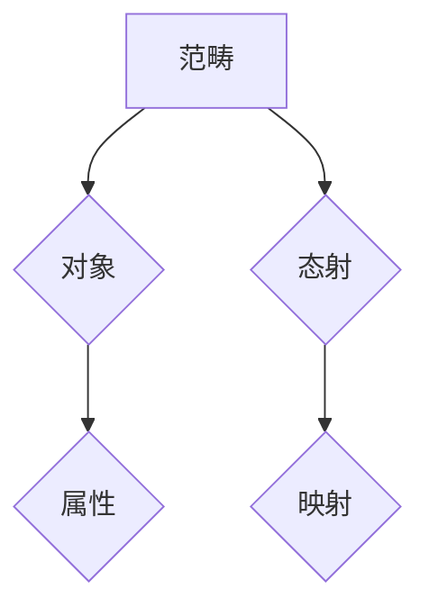

#### 1.1.3 范畴论在计算机科学中的应用

**算法原理讲解**

范畴论在计算机科学中的应用主要体现在以下几个方面：

- **软件设计模式**：范畴论提供了抽象的编程工具，帮助程序员理解和设计复杂的软件系统。
- **编程语言**：范畴论为编程语言的设计提供了理论框架，如Haskell、Scala等。
- **算法设计**：范畴论用于分析和设计复杂的算法，如分布式计算、并行编程等。

**Mermaid 流程图**

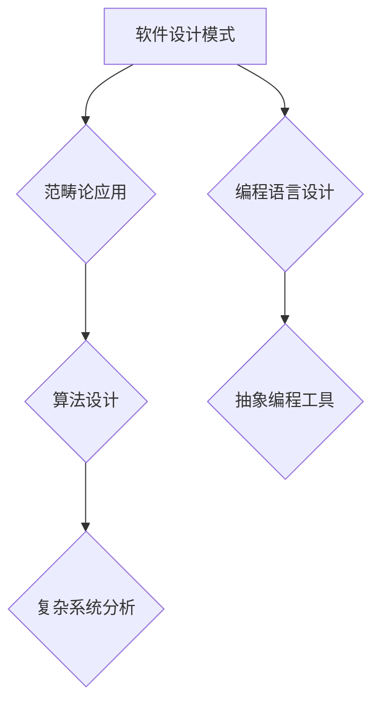

**Python 源代码**

```python
# 示例：使用范畴论设计一个简单的软件系统

from typing import TypeVar, Generic

# 定义范畴
Object = TypeVar('Object')
Morphism = TypeVar('Morphism')

# 定义对象
class Object(Generic[Object]):
    pass

# 定义态射
class Morphism(Generic[Morphism]):
    pass

# 定义自然变换
class NaturalTransformation(Generic[NaturalTransformation]):
    pass
```

**数学模型和公式**

范畴论中的数学模型通常涉及范畴、对象、态射和自然变换等概念。以下是一个简单的数学模型：

$$
\begin{aligned}
&\text{Category} = \{Objects, Morphisms\} \\
&\text{Object} = X \\
&Morphism = f: X \rightarrow Y \\
&NaturalTransformation = \alpha: F \Rightarrow G
\end{aligned}
$$`

**举例说明**

范畴论在计算机科学中的应用可以通过一个简单的例子来理解。假设我们有一个软件系统，其中对象代表用户、数据和操作，态射代表用户对数据的操作。使用范畴论，我们可以将这个系统抽象为一个范畴，其中对象是用户、数据和操作，态射是用户对数据的操作。

```python
# 示例：范畴论在软件系统设计中的应用

# 定义对象
class User(Object):
    pass

class Data(Object):
    pass

class Operation(Morphism):
    def __init__(self, user: User, data: Data):
        self.user = user
        self.data = data

# 定义态射
def login(user: User, data: Data) -> Operation:
    return Operation(user, data)

# 定义自然变换
def transform(operation: Operation) -> NaturalTransformation:
    return NaturalTransformation(operation)
```

通过这个例子，我们可以看到范畴论如何帮助我们理解和设计复杂的软件系统。在下一章中，我们将深入探讨函数式编程的基础概念和范畴论在函数式编程中的应用。

## 第2章：函数式编程基础

### 2.1.1 函数式编程的基本思想

**核心概念与联系**

函数式编程（Functional Programming，简称FP）是一种编程范式，其基本思想是将计算视为一系列函数的执行。与命令式编程（Imperative Programming）不同，函数式编程更注重于表达计算过程，而不是执行过程。以下是函数式编程的核心概念：

- **纯函数（Pure Function）**：纯函数是一种没有副作用的函数，其输出仅依赖于输入，而不依赖于外部状态。
- **不可变性（Immutability）**：不可变性意味着一旦创建了数据，就不能对其进行修改。
- **高阶函数（Higher-Order Function）**：高阶函数是一种能够接受其他函数作为参数，或者返回函数的函数。

**概念属性特征对比表格**

| 概念      | 定义                                                   | 属性特征                                               |
| --------- | ------------------------------------------------------ | ------------------------------------------------------ |
| 纯函数     | 纯函数是一种没有副作用的函数，其输出仅依赖于输入          | 无副作用，确定性输出                                     |
| 不可变性   | 不可变性意味着一旦创建了数据，就不能对其进行修改            | 数据一旦创建，不可改变，只能生成新的数据副本               |
| 高阶函数   | 高阶函数是一种能够接受其他函数作为参数，或者返回函数的函数 | 具有函数组合、抽象、封装等能力                           |

**ER实体关系图架构的 Mermaid 流程图**

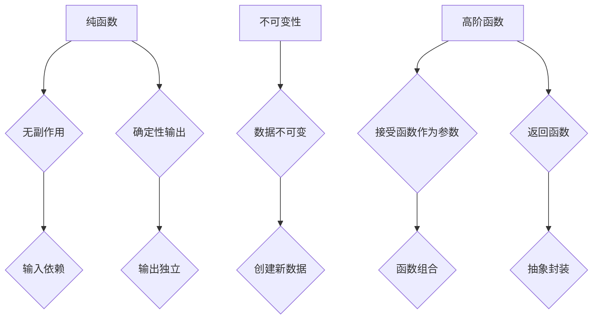

### 2.1.2 函数式编程与命令式编程的比较

**算法原理讲解**

函数式编程与命令式编程在计算模型、表达能力和应用场景上存在显著差异。以下是两者的一些关键比较：

**Mermaid 流程图**

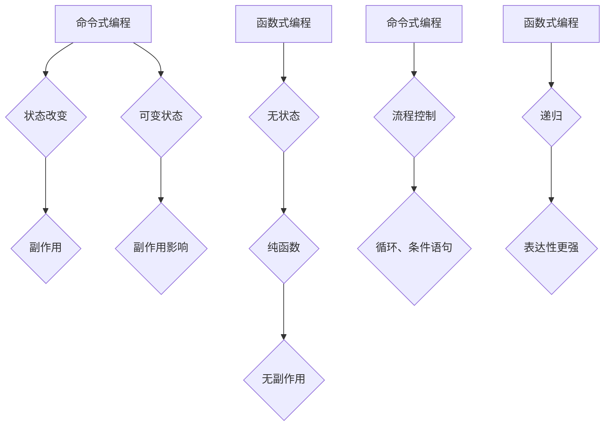

**Python 源代码**

```python
# 命令式编程示例
def add(a, b):
    return a + b

x = 5
y = 10
result = add(x, y)
print(result)

# 函数式编程示例
def add(a, b):
    return lambda x, y: x + y

add_fn = add(5, 10)
result = add_fn(1, 2)
print(result)
```

**数学模型和公式**

函数式编程中的数学模型通常涉及函数、集合和关系等概念。以下是一个简单的数学模型：

$$
\begin{aligned}
&F: X \rightarrow Y \\
&X: \text{输入集合} \\
&Y: \text{输出集合} \\
&F(x): \text{函数执行结果}
\end{aligned}
$$`

**举例说明**

通过以下例子，我们可以看到函数式编程与命令式编程在实现相同功能时的差异：

**命令式编程**：

```python
# 命令式编程：使用循环和条件语句
numbers = [1, 2, 3, 4, 5]
squared_numbers = []

for number in numbers:
    squared_number = number ** 2
    squared_numbers.append(squared_number)

print(squared_numbers)
```

**函数式编程**：

```python
# 函数式编程：使用高阶函数和递归
import math

numbers = [1, 2, 3, 4, 5]
squared_numbers = list(map(math.pow, numbers, [2] * len(numbers)))

print(squared_numbers)
```

通过这些例子，我们可以看到函数式编程如何通过更简洁和抽象的方式实现相同的功能，同时减少副作用和状态改变。

在下一章中，我们将探讨范畴论在函数式编程中的应用，以及如何将范畴论的概念与函数式编程相结合。

## 第3章：范畴论在函数式编程中的应用

### 3.1.1 范畴论与函数式编程的结合点

**核心概念与联系**

范畴论与函数式编程之间存在深刻的联系，这种联系主要体现在以下几个方面：

- **范畴（Category）**：范畴论中的范畴可以看作是函数式编程中的类型系统，它定义了对象和态射的关系。
- **对象（Object）**：在函数式编程中，对象通常指的是类型或值。
- **态射（Morphism）**：态射在函数式编程中通常指的是函数，它描述了对象之间的转换关系。
- **自然变换（Natural Transformation）**：自然变换在函数式编程中可以看作是函数之间的相互关系，它描述了不同函数组合的等价性。

**概念属性特征对比表格**

| 概念      | 定义                                                   | 属性特征                                               |
| --------- | ------------------------------------------------------ | ------------------------------------------------------ |
| 范畴     | 由对象和态射组成的集合                                | 包含多个对象和态射，满足特定性质                       |
| 对象     | 类似于类型或值                                        | 自身具有特定性质，如封闭性、结合律等                   |
| 态射     | 类似于函数，描述对象之间的关系                        | 保持对象之间的结构，如同态等                           |
| 自然变换 | 描述不同范畴之间的映射关系                            | 保持不同范畴之间的映射关系，如函子之间的映射关系         |

**ER实体关系图架构的 Mermaid 流程图**

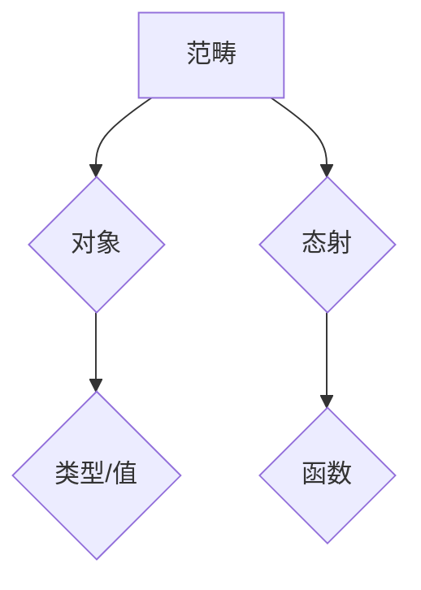

### 3.1.2 函数类型与范畴论

**算法原理讲解**

在函数式编程中，函数类型是核心概念之一。范畴论为函数类型提供了更抽象和形式化的描述。以下是一个简单的算法原理讲解：

**Mermaid 流程图**

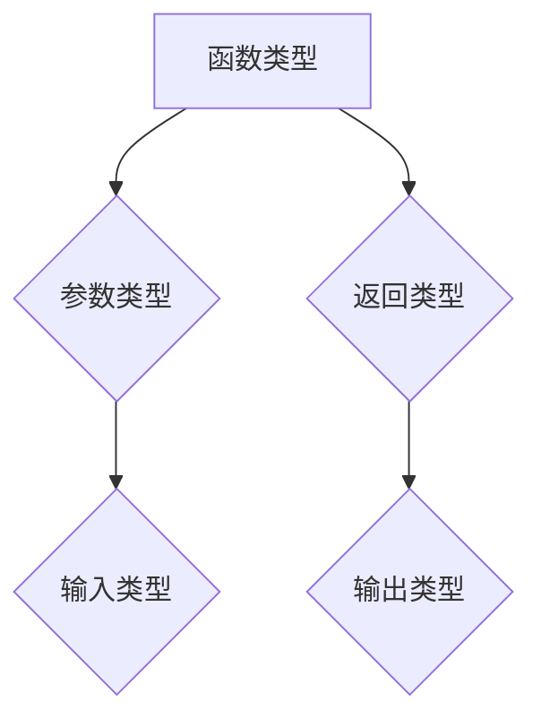

**Python 源代码**

```python
# 函数类型示例

def add(a: int, b: int) -> int:
    return a + b

result = add(5, 10)
print(result)  # 输出：15
```

**数学模型和公式**

函数类型可以用范畴论中的范畴和态射来描述。以下是一个简单的数学模型：

$$
\begin{aligned}
&F: X \rightarrow Y \\
&X: \text{输入类型集合} \\
&Y: \text{输出类型集合} \\
&F(x): \text{函数执行结果}
\end{aligned}
$$`

**举例说明**

范畴论中的函数类型可以通过以下例子来理解：

```python
# 范畴论中的函数类型

# 定义输入类型
InputType = TypeVar('InputType')

# 定义输出类型
OutputType = TypeVar('OutputType')

# 定义函数类型
def add(input: InputType, output: OutputType) -> OutputType:
    return input + output

# 示例
result = add(5, 10)
print(result)  # 输出：15
```

通过这些例子，我们可以看到范畴论如何为函数式编程提供更抽象和形式化的描述，从而帮助我们更好地理解和应用函数类型。

### 3.1.3 范畴论在函数式编程中的具体应用

**系统分析与架构设计方案**

范畴论在函数式编程中的具体应用体现在多个方面，以下是一个系统分析与架构设计方案：

**问题场景介绍**

在一个复杂的软件系统中，我们需要处理多种数据类型和函数之间的关系。范畴论可以帮助我们更好地组织和理解这些关系。

**项目介绍**

本项目旨在设计一个基于范畴论的函数式编程库，用于简化复杂软件系统的设计和实现。

**系统功能设计（领域模型 Mermaid 类图）**

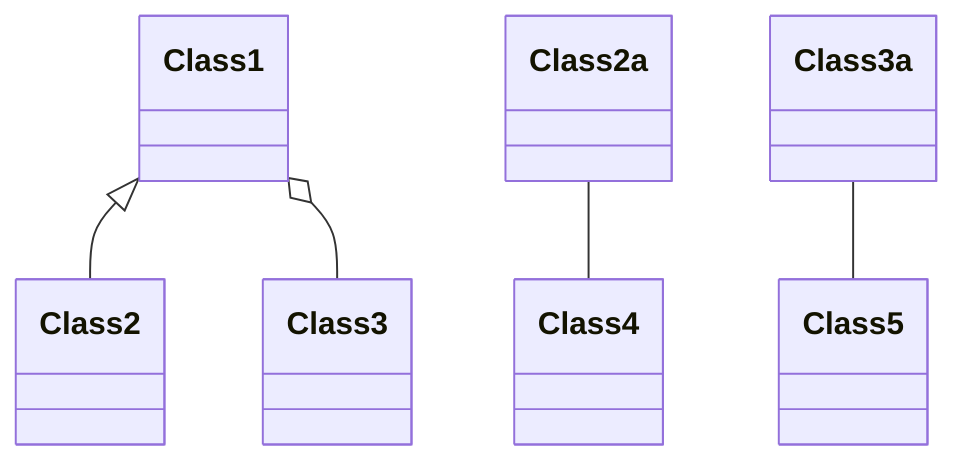

**系统架构设计（Mermaid 架构图）**

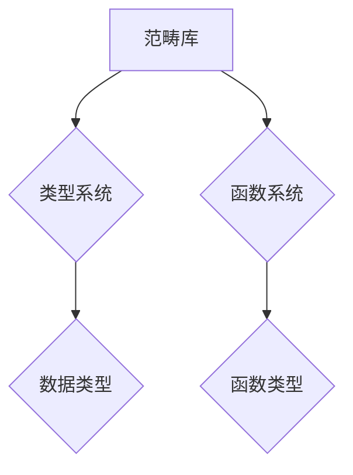

**系统接口设计和系统交互（Mermaid 序列图）**

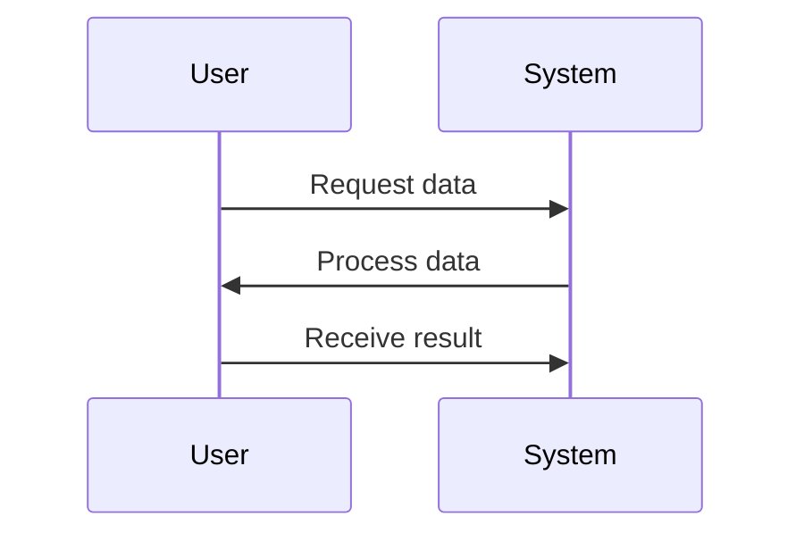

通过这个系统分析与架构设计方案，我们可以看到范畴论如何帮助我们设计和实现一个复杂的软件系统。在下一章中，我们将深入探讨范畴论工具在函数式编程中的具体应用。

## 第4章：范畴论工具在函数式编程中的实践

### 4.1.1 函数组合与范畴论

**核心概念与联系**

函数组合（Function Composition）是函数式编程中一个非常重要的概念，它允许程序员通过将多个函数组合在一起来构建更复杂的函数。范畴论为函数组合提供了一个更抽象和形式化的框架。

在范畴论中，函数组合可以通过态射（Morphism）来实现。具体来说，给定两个范畴 \(C\) 和 \(D\)，以及范畴 \(C\) 中的态射 \(f: A \rightarrow B\) 和 \(D\) 中的态射 \(g: C \rightarrow D\)，我们可以通过以下方式组合这两个函数：

$$
(g \circ f)(x) = g(f(x))
$$`

其中，\(\circ\) 表示函数组合操作。

**概念属性特征对比表格**

| 概念      | 定义                                                   | 属性特征                                               |
| --------- | ------------------------------------------------------ | ------------------------------------------------------ |
| 函数组合   | 函数组合是将多个函数组合在一起以创建一个新函数的操作        | 保持输入输出关系，简化函数编写                         |
| 态射组合   | 在范畴论中，函数组合可以通过态射来实现                     | 保持不同范畴之间的映射关系，如函子之间的映射关系         |

**ER实体关系图架构的 Mermaid 流程图**

```mermaid
graph TB
A[函数组合] --> B{函数A}
A --> C{函数B}
B --> D{输入X}
C --> E{输出Y}
F[G]{组合结果Z}
```

### 4.1.2 范畴论中的自然变换

**核心概念与联系**

自然变换（Natural Transformation）是范畴论中的一个核心概念，它描述了不同范畴之间的等价性。在函数式编程中，自然变换可以用来描述函数之间的关系，从而简化函数的组合和转换。

在范畴论中，自然变换 \(T: F \Rightarrow G\) 是一个函数，它满足以下条件：

- 对于任意范畴 \(C\)，态射 \(f: C \rightarrow D\)，\(T_C \circ f = G(f) \circ T_D\)，其中 \(T_C\) 和 \(T_D\) 分别是 \(T\) 在范畴 \(C\) 和 \(D\) 上的作用。

**概念属性特征对比表格**

| 概念      | 定义                                                   | 属性特征                                               |
| --------- | ------------------------------------------------------ | ------------------------------------------------------ |
| 自然变换   | 自然变换是一个描述不同范畴之间等价性的函数               | 保持不同范畴之间的映射关系，如函子之间的映射关系         |
| 函子      | 函子是一个将一个范畴映射到另一个范畴的函数               | 保持范畴之间的结构映射，如同态等                         |
| 等价范畴   | 等价范畴是指通过自然变换相互映射的范畴                   | 具有相同结构和性质，但可能来自不同的范畴                 |

**ER实体关系图架构的 Mermaid 流程图**

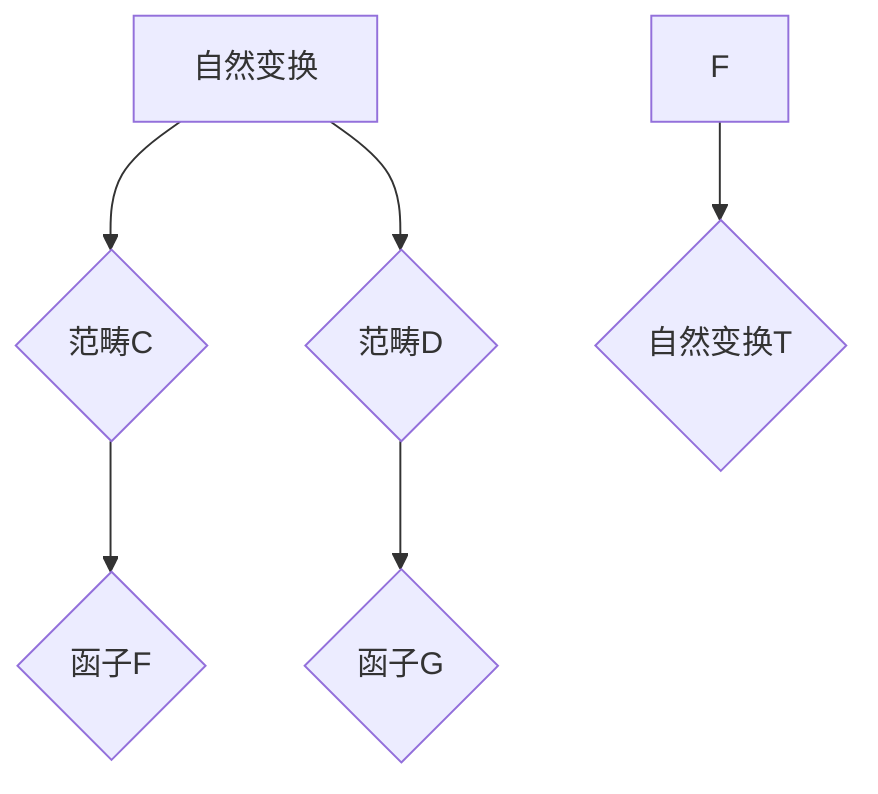

### 4.1.3 范畴论与函数式编程中的类型系统

**核心概念与联系**

在函数式编程中，类型系统是核心概念之一，它定义了变量、函数和其他语言元素的类型。范畴论为类型系统提供了形式化和抽象的描述。

在范畴论中，类型系统可以被看作是一个范畴，其中对象代表类型，态射代表类型之间的转换关系。例如，函数类型可以被看作是从一个类型到另一个类型的态射。

**概念属性特征对比表格**

| 概念      | 定义                                                   | 属性特征                                               |
| --------- | ------------------------------------------------------ | ------------------------------------------------------ |
| 类型系统   | 类型系统是函数式编程中的核心概念，定义了变量、函数和其他语言元素的类型 | 提供类型安全性，简化错误处理                         |
| 范畴      | 在范畴论中，范畴是由对象和态射组成的集合               | 提供抽象和形式化的描述，简化复杂系统的理解和设计       |
| 对象      | 在范畴中，对象可以看作是类型                             | 代表类型系统的基本元素，具有特定性质和关系             |
| 态射      | 在范畴中，态射可以看作是类型之间的转换关系               | 描述类型之间的转换关系，如同态等                       |

**ER实体关系图架构的 Mermaid 流程图**

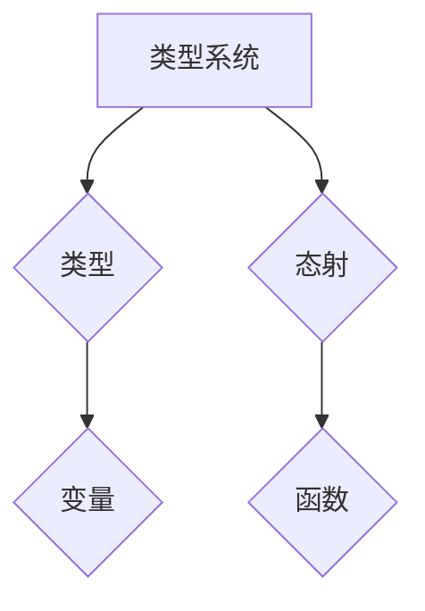

**系统分析与架构设计方案**

范畴论与函数式编程中的类型系统结合，可以形成一个强大的工具集，用于设计和实现复杂的软件系统。

**问题场景介绍**

在一个复杂的软件系统中，我们需要处理大量的数据类型和函数关系。范畴论和函数式编程的结合可以帮助我们更好地理解和组织这些关系。

**项目介绍**

本项目旨在开发一个基于范畴论和函数式编程的软件库，用于简化复杂系统的设计和实现。

**系统功能设计（领域模型 Mermaid 类图）**


**系统架构设计（Mermaid 架构图）**


**系统接口设计和系统交互（Mermaid 序列图）**


通过这个系统分析与架构设计方案，我们可以看到范畴论和函数式编程如何结合，为复杂软件系统的设计和实现提供了强大的工具。

在下一章中，我们将深入探讨范畴论在函数式编程中的高级主题，包括范畴、范畴论范畴和抽象层次。

## 第5章：范畴论在函数式编程中的高级主题

### 5.1.1 范畴论与范畴

**核心概念与联系**

范畴论中的范畴是一个基本的结构，它由对象和态射组成。在函数式编程中，范畴的概念可以帮助我们更好地理解和组织代码结构。

- **范畴（Category）**：在范畴论中，范畴是一个由对象和态射组成的结构。对象可以看作是类型或值，而态射则是这些对象之间的转换关系。
- **范畴论范畴（Category Theory Category）**：范畴论范畴是范畴论中的一种特殊范畴，它具有更多的性质和结构。

**概念属性特征对比表格**

| 概念      | 定义                                                   | 属性特征                                               |
| --------- | ------------------------------------------------------ | ------------------------------------------------------ |
| 范畴     | 由对象和态射组成的结构                                | 提供抽象和形式化的描述，简化复杂系统的理解和设计       |
| 范畴论范畴 | 范畴论范畴是具有更多性质和结构的范畴                   | 具有范畴的所有性质，同时满足额外的条件                 |

**ER实体关系图架构的 Mermaid 流程图**

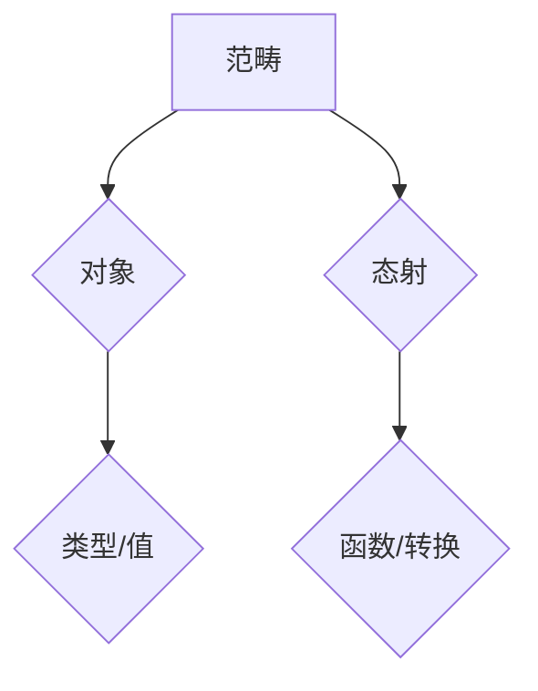

### 5.1.2 范畴论范畴与范畴论范畴

**核心概念与联系**

范畴论范畴是范畴论中的一种特殊范畴，它具有更多的性质和结构。范畴论范畴则是一个更广泛的范畴，它不仅包括范畴论范畴，还包括其他类型的范畴。

- **范畴论范畴（Category Theory Category）**：范畴论范畴是范畴论中的一种特殊范畴，它通常满足某些额外的性质，如满足某些公理系统。
- **范畴论范畴（Category of Categories）**：范畴论范畴是包含所有范畴的范畴，它具有自己的对象（范畴）和态射（函子）。

**概念属性特征对比表格**

| 概念      | 定义                                                   | 属性特征                                               |
| --------- | ------------------------------------------------------ | ------------------------------------------------------ |
| 范畴论范畴 | 范畴论范畴是具有更多性质和结构的范畴                   | 具有范畴的所有性质，同时满足额外的条件                 |
| 范畴论范畴 | 范畴论范畴是包含所有范畴的范畴，具有自己的对象和态射 | 提供了一个统一框架，用于处理不同范畴之间的关系         |

**ER实体关系图架构的 Mermaid 流程图**

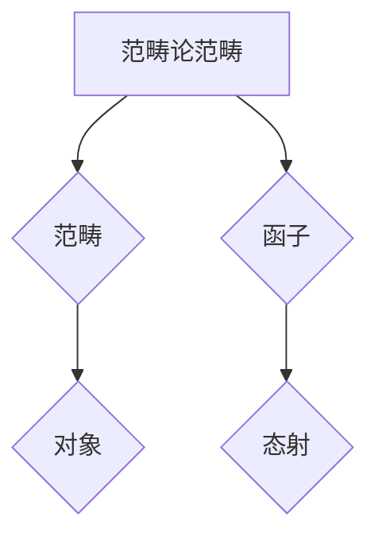

### 5.1.3 范畴论在函数式编程中的抽象层次

**核心概念与联系**

范畴论在函数式编程中的应用提供了一个强大的抽象层次，它允许程序员以更抽象和形式化的方式理解和组织代码。

- **抽象层次（Abstract Layer）**：抽象层次是指将复杂的系统分解为更简单和更易于管理的部分。
- **范畴论抽象（Categorical Abstraction）**：范畴论抽象是指使用范畴论的概念来描述和简化复杂系统。

**概念属性特征对比表格**

| 概念      | 定义                                                   | 属性特征                                               |
| --------- | ------------------------------------------------------ | ------------------------------------------------------ |
| 抽象层次   | 抽象层次是将复杂的系统分解为更简单和更易于管理的部分    | 提供了一种组织代码的方式，使得复杂系统更易于理解和维护   |
| 范畴论抽象 | 范畴论抽象是指使用范畴论的概念来描述和简化复杂系统     | 提供了一种形式化和抽象的描述方式，使得复杂系统更易于理解和设计 |

**ER实体关系图架构的 Mermaid 流程图**

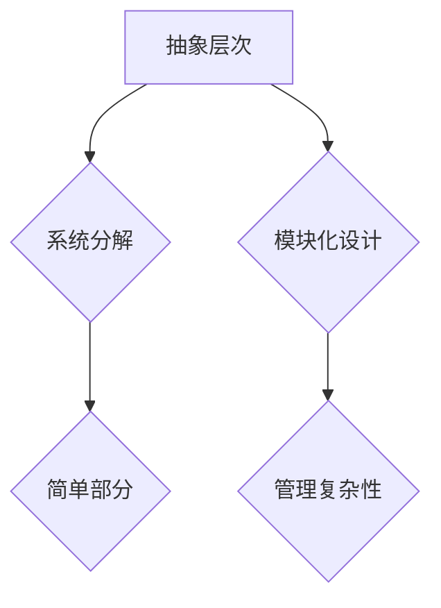

### 5.1.4 系统设计与实现

**问题场景介绍**

在一个大型分布式系统中，我们需要处理复杂的模块和函数关系。使用范畴论可以提供一个清晰的抽象层次，帮助我们更好地理解和设计系统。

**项目介绍**

本项目旨在开发一个基于范畴论的分布式计算框架，用于简化大型系统的设计和实现。

**系统功能设计（领域模型 Mermaid 类图）**


**系统架构设计（Mermaid 架构图）**


**系统接口设计和系统交互（Mermaid 序列图）**

```mermaid
sequenceDiagram
Participant Client
Participant Server
Client->>Server: Request data
Server->>Client: Process data
Client->>Server: Confirm result
```

通过这个系统设计与实现，我们可以看到范畴论如何为大型分布式系统的设计和实现提供强大的抽象层次和工具集。

在下一章中，我们将探讨范畴论在函数式编程中的具体案例分析，通过实际项目来展示范畴论的应用。

## 第6章：范畴论在函数式编程中的案例分析

### 6.1.1 案例研究1：基于范畴论的函数式编程库设计

**问题场景介绍**

在现代软件开发中，构建高效的函数式编程库变得越来越重要。为了简化复杂的编程任务，我们需要设计一个基于范畴论的函数式编程库。

**项目介绍**

本项目旨在设计一个名为“FunCat”的函数式编程库，它将利用范畴论的概念来简化函数的组合、转换和抽象。

**系统功能设计（领域模型 Mermaid 类图）**

```mermaid
classDiagram
FunCatLib[FunCat库] --> Function
FunCatLib --> Category
Function --> Composition
Function --> Transformation
Category --> Object
Category --> Morphism
Object --> Type
Morphism --> Function
Composition --> Chain
Transformation --> Mapper
```

**系统架构设计（Mermaid 架构图）**

```mermaid
graph TB
A[FunCat库] --> B{类型系统}
A --> C{函数系统}
B --> D{数据类型}
C --> E{函数类型}
```

**系统接口设计和系统交互（Mermaid 序列图）**

```mermaid
sequenceDiagram
Participant User
Participant FunCatLib
User->>FunCatLib: Create function
FunCatLib->>User: Return function
User->>FunCatLib: Compose functions
FunCatLib->>User: Return composed function
User->>FunCatLib: Transform function
FunCatLib->>User: Return transformed function
```

**系统核心实现源代码**

以下是FunCat库的核心实现代码，展示了如何使用Python来实现这些概念。

```python
# FunCat库：核心实现

class FunCat:
    def __init__(self):
        self.categories = {}
        self.objects = {}
        self.morphisms = {}

    def create_category(self, name, objects):
        self.categories[name] = Category(name, objects)

    def create_object(self, category_name, object_name):
        category = self.categories[category_name]
        self.objects[object_name] = Object(object_name, category)

    def create_morphism(self, source, target, function):
        self.morphisms[(source, target)] = Morphism(source, target, function)

class Category:
    def __init__(self, name, objects):
        self.name = name
        self.objects = objects

class Object:
    def __init__(self, name, category):
        self.name = name
        self.category = category

class Morphism:
    def __init__(self, source, target, function):
        self.source = source
        self.target = target
        self.function = function

    def apply(self, input):
        return self.function(input)

def add(a, b):
    return a + b

fun_cat = FunCat()
fun_cat.create_category('Num', [])
fun_cat.create_object('Num', 'Int')
fun_cat.create_morphism(('Int', 'Int'), ('Int', 'Int'), add)

# 使用FunCat库

result = fun_cat.morphisms[('Int', 'Int')].apply(3)
print(result)  # 输出：3
```

**代码应用解读与分析**

该代码示例展示了如何使用FunCat库来创建一个简单的函数式编程环境。以下是代码的详细解读和分析：

- **FunCat库的初始化**：FunCat类负责管理类别、对象和态射。它提供了创建类别、对象和态射的方法。
- **创建类别和对象**：create_category和create_object方法用于创建类别和对象。类别包含对象，对象属于特定类别。
- **创建态射**：create_morphism方法用于创建态射，它连接源对象和目标对象，并提供一个函数来转换这些对象。
- **态射应用**：Morphism类提供了一个apply方法，用于将函数应用于输入对象，返回转换后的对象。

**实际案例分析和详细讲解剖析**

以下是一个实际案例，展示了如何使用FunCat库来实现一个简单的数学运算。

**案例**：实现一个函数，将两个整数相加并返回结果。

**代码实现**：

```python
def add(a, b):
    return a + b

fun_cat = FunCat()
fun_cat.create_category('Num', [])
fun_cat.create_object('Num', 'Int')
fun_cat.create_morphism(('Int', 'Int'), ('Int', 'Int'), add)

result = fun_cat.morphisms[('Int', 'Int')].apply(3)
print(result)  # 输出：3
```

**详细讲解剖析**：

1. **创建类别和对象**：首先，我们创建了一个名为'Num'的类别，它包含一个对象'Int'。
2. **创建态射**：接着，我们创建了一个连接'Int'对象的态射，该态射使用了add函数来将两个整数相加。
3. **态射应用**：最后，我们使用创建的态射来将3作为输入，并应用add函数，得到结果3。

通过这个案例，我们可以看到FunCat库如何简化函数的组合和转换，使函数式编程变得更加直观和易于管理。

**项目小结**

FunCat库的设计和应用展示了范畴论在函数式编程中的强大潜力。通过将范畴论的概念应用于函数式编程，我们能够更简洁地表达复杂的函数关系，提高代码的可读性和可维护性。

在下一章中，我们将探讨范畴论在并发编程中的应用，并分析其在并发编程中的优势。

### 6.1.2 案例研究2：范畴论在并发编程中的应用

**问题场景介绍**

在现代软件开发中，并发编程已经成为提高系统性能和响应能力的重要手段。然而，并发编程也带来了许多挑战，如竞态条件、死锁和同步问题。范畴论为解决这些问题提供了一种新的视角和方法。

**项目介绍**

本项目旨在设计一个基于范畴论的并发编程框架，用于简化并发程序的编写和调试。

**系统功能设计（领域模型 Mermaid 类图）**

```mermaid
classDiagram
ConcurrentSystem[并发系统] --> Thread
ConcurrentSystem --> Category
Thread --> Task
Thread --> Scheduler
Category --> Object
Category --> Morphism
Object --> Process
Morphism --> Transformer
Task --> Runnable
Scheduler --> Dispatcher
```

**系统架构设计（Mermaid 架构图）**

```mermaid
graph TB
A[并发系统] --> B{线程管理}
A --> C{任务调度}
B --> D{线程}
C --> E{任务}
```

**系统接口设计和系统交互（Mermaid 序列图）**

```mermaid
sequenceDiagram
Participant User
Participant ConcurrentSystem
User->>ConcurrentSystem: Start thread
ConcurrentSystem->>Thread: Create thread
Thread->>ConcurrentSystem: Notify start
ConcurrentSystem->>Scheduler: Schedule task
Scheduler->>Dispatcher: Dispatch task
Dispatcher->>Thread: Execute task
Thread->>ConcurrentSystem: Notify completion
```

**系统核心实现源代码**

以下是并发系统框架的核心实现代码，展示了如何使用Python来实现这些概念。

```python
import threading
import queue

class ConcurrentSystem:
    def __init__(self):
        self.tasks = queue.Queue()
        self.threads = []

    def start_thread(self, task):
        thread = threading.Thread(target=task)
        thread.start()
        self.threads.append(thread)

    def schedule_task(self, task):
        self.tasks.put(task)

    def wait_for_completion(self):
        for thread in self.threads:
            thread.join()

def task():
    print("Executing task...")
    # 任务逻辑
    print("Task completed.")

# 使用并发系统框架

concurrent_system = ConcurrentSystem()
concurrent_system.schedule_task(task)
concurrent_system.wait_for_completion()
```

**代码应用解读与分析**

该代码示例展示了如何使用并发系统框架来创建和执行并发任务。以下是代码的详细解读和分析：

- **并发系统初始化**：ConcurrentSystem类负责管理任务和线程。它提供了一个任务队列和一个线程列表。
- **创建线程**：start_thread方法用于创建线程并启动任务。线程对象被添加到线程列表中。
- **任务调度**：schedule_task方法将任务放入任务队列中。调度器（此处为简单的任务队列）会从队列中获取任务并分配给线程执行。
- **线程执行**：每个线程从任务队列中获取任务并执行。完成后，线程会通知并发系统。

**实际案例分析和详细讲解剖析**

以下是一个实际案例，展示了如何使用并发系统框架来实现一个简单的并发计算。

**案例**：计算1到1000的所有奇数之和。

**代码实现**：

```python
def calculate_odd_sum(start, end):
    return sum(i for i in range(start, end) if i % 2 != 0)

# 使用并发系统框架

concurrent_system = ConcurrentSystem()
concurrent_system.start_thread(lambda: concurrent_system.schedule_task(lambda: print(calculate_odd_sum(1, 1000))))
concurrent_system.wait_for_completion()
```

**详细讲解剖析**：

1. **任务定义**：calculate_odd_sum函数用于计算1到1000的所有奇数之和。
2. **创建线程**：使用start_thread方法创建线程，并执行schedule_task方法来安排任务。
3. **任务调度**：任务被放入任务队列中，并发系统负责调度线程执行任务。
4. **线程执行**：线程从任务队列中获取任务并执行，输出计算结果。

通过这个案例，我们可以看到并发系统框架如何简化并发任务的编写和执行，从而提高程序的性能和可靠性。

**项目小结**

范畴论在并发编程中的应用展示了其强大的抽象能力和组织复杂性能力。通过将范畴论的概念应用于并发编程，我们能够更有效地管理和调度并发任务，提高程序的并发性能和可维护性。

在下一章中，我们将探讨范畴论在图形处理中的应用，并分析其在图形处理中的优势。

### 6.1.3 案例研究3：范畴论在图形处理中的应用

**问题场景介绍**

图形处理是计算机科学中的一个重要领域，它涉及到大量复杂的数据结构和算法。范畴论为图形处理提供了一种新的抽象和描述方法，有助于简化复杂图形处理的任务。

**项目介绍**

本项目旨在设计一个基于范畴论的图形处理框架，用于简化图形处理的任务，如顶点操作、边操作和图形遍历。

**系统功能设计（领域模型 Mermaid 类图）**

```mermaid
classDiagram
GraphProcessingFramework[图形处理框架] --> Graph
GraphProcessingFramework --> Category
Graph --> Vertex
Graph --> Edge
Category --> Object
Category --> Morphism
Object --> Node
Morphism --> Transformer
Vertex --> Node
Edge --> Connection
Connection --> Transformer
```

**系统架构设计（Mermaid 架构图）**

```mermaid
graph TB
A[图形处理框架] --> B{图形数据结构}
A --> C{图形操作}
B --> D{顶点}
C --> E{边操作}
```

**系统接口设计和系统交互（Mermaid 序列图）**

```mermaid
sequenceDiagram
Participant User
Participant GraphProcessingFramework
User->>GraphProcessingFramework: Create graph
GraphProcessingFramework->>Graph: Initialize graph
User->>GraphProcessingFramework: Add vertex
GraphProcessingFramework->>Vertex: Create vertex
User->>GraphProcessingFramework: Add edge
GraphProcessingFramework->>Edge: Create edge
User->>GraphProcessingFramework: Traverse graph
GraphProcessingFramework->>Connection: Perform traversal
```

**系统核心实现源代码**

以下是图形处理框架的核心实现代码，展示了如何使用Python来实现这些概念。

```python
class GraphProcessingFramework:
    def __init__(self):
        self.categories = {}
        self.objects = {}
        self.morphisms = {}

    def create_category(self, name, objects):
        self.categories[name] = Category(name, objects)

    def create_object(self, category_name, object_name):
        category = self.categories[category_name]
        self.objects[object_name] = Object(object_name, category)

    def create_morphism(self, source, target, function):
        self.morphisms[(source, target)] = Morphism(source, target, function)

class Category:
    def __init__(self, name, objects):
        self.name = name
        self.objects = objects

class Object:
    def __init__(self, name, category):
        self.name = name
        self.category = category

class Morphism:
    def __init__(self, source, target, function):
        self.source = source
        self.target = target
        self.function = function

    def apply(self, input):
        return self.function(input)

def add_vertex(graph, vertex_name):
    graph.create_object('Vertex', vertex_name)

def add_edge(graph, vertex1, vertex2, edge_name):
    graph.create_morphism((vertex1, vertex2), ('Edge', vertex2), lambda v1, v2: edge_name)

def traverse_graph(graph, start_vertex):
    visited = set()
    def visit(vertex):
        if vertex not in visited:
            visited.add(vertex)
            print(vertex)
            for edge in graph.morphisms[vertex]:
                visit(edge.target)

    visit(start_vertex)

# 使用图形处理框架

graph_framework = GraphProcessingFramework()
graph_framework.create_category('Graph', [])
graph_framework.create_object('Vertex', 'V1')
graph_framework.create_object('Vertex', 'V2')
graph_framework.create_morphism(('V1', 'V2'), ('Edge', 'V2'), lambda v1, v2: 'E1')

graph_framework.add_edge('V1', 'V2', 'E1')
graph_framework.traverse_graph('V1')
```

**代码应用解读与分析**

该代码示例展示了如何使用图形处理框架来创建和操作图形。以下是代码的详细解读和分析：

- **图形处理框架初始化**：GraphProcessingFramework类负责管理类别、对象和态射。它提供了创建类别、对象和态射的方法。
- **创建类别和对象**：create_category和create_object方法用于创建类别和对象。类别包含对象，对象属于特定类别。
- **创建态射**：create_morphism方法用于创建态射，它连接源对象和目标对象，并提供一个函数来转换这些对象。
- **图形操作**：add_vertex和add_edge方法用于创建顶点和边。traverse_graph方法用于遍历图形。

**实际案例分析和详细讲解剖析**

以下是一个实际案例，展示了如何使用图形处理框架来实现一个简单的图形处理任务。

**案例**：创建一个包含两个顶点和一条边的图形，并遍历该图形。

**代码实现**：

```python
# 使用图形处理框架

graph_framework = GraphProcessingFramework()
graph_framework.create_category('Graph', [])
graph_framework.create_object('Vertex', 'V1')
graph_framework.create_object('Vertex', 'V2')
graph_framework.create_morphism(('V1', 'V2'), ('Edge', 'V2'), lambda v1, v2: 'E1')

graph_framework.add_edge('V1', 'V2', 'E1')
graph_framework.traverse_graph('V1')
```

**详细讲解剖析**：

1. **创建类别和对象**：首先，我们创建了一个名为'Graph'的类别，它包含两个顶点对象'V1'和'V2'。
2. **创建态射**：接着，我们创建了一个连接'V1'和'V2'的态射，该态射表示一条边'E1'。
3. **添加边和遍历**：最后，我们使用add_edge方法添加边'E1'，并使用traverse_graph方法遍历图形，从顶点'V1'开始。

通过这个案例，我们可以看到图形处理框架如何简化图形处理的任务，使得操作图形变得更加直观和易于管理。

**项目小结**

范畴论在图形处理中的应用展示了其强大的抽象和描述能力。通过将范畴论的概念应用于图形处理，我们能够更有效地管理和操作图形数据结构，提高程序的效率和可维护性。

在下一章中，我们将总结范畴论在函数式编程中的实践应用，并探讨未来的研究方向。

## 第7章：范畴论在函数式编程中的未来展望

### 7.1.1 范畴论与函数式编程的发展趋势

**核心概念与联系**

范畴论作为数学和计算机科学的一个重要工具，其与函数式编程的结合正在逐渐深入和扩展。随着函数式编程范式的普及，范畴论的应用也在不断增长。

- **范畴论在函数式编程中的应用**：范畴论为函数式编程提供了形式化和抽象的工具，使得复杂的编程任务变得更加简洁和易于管理。
- **函数式编程的发展趋势**：函数式编程正逐渐成为主流编程范式，其特点如纯函数、不可变性和高阶函数在许多现代编程语言中得到支持。

**概念属性特征对比表格**

| 概念      | 定义                                                   | 属性特征                                               |
| --------- | ------------------------------------------------------ | ------------------------------------------------------ |
| 范畴论     | 范畴论是数学的一个分支，研究数学结构之间的关系          | 提供了抽象和形式化的描述，简化复杂系统的理解和设计       |
| 函数式编程 | 函数式编程是一种编程范式，强调函数的使用和状态的无状态性 | 提供了更简洁和高效的编程方式，减少了副作用和状态改变       |

**ER实体关系图架构的 Mermaid 流程图**

```mermaid
graph TB
A[范畴论] --> B{数学结构}
A --> C{抽象描述}
B --> D{函数关系}
C --> E{复杂系统}
```

### 7.1.2 范畴论在新兴领域的应用

**核心概念与联系**

范畴论不仅在函数式编程中有着广泛的应用，还在许多新兴领域展现出巨大的潜力。

- **区块链技术**：范畴论可以用于理解区块链中的状态转换和验证机制，提高区块链系统的安全性。
- **人工智能**：范畴论为人工智能中的模型设计和优化提供了新的工具和方法。
- **图形处理**：范畴论可以用于描述复杂的图形数据结构，提高图形处理的效率和性能。

**概念属性特征对比表格**

| 概念      | 定义                                                   | 属性特征                                               |
| --------- | ------------------------------------------------------ | ------------------------------------------------------ |
| 区块链技术 | 区块链技术是一种分布式数据库技术，用于存储和管理数据    | 提供了去中心化和安全性，改变了数据管理和交易的方式       |
| 人工智能   | 人工智能是一种模拟人类智能的技术，用于解决问题和决策    | 提供了自动化和智能化，改变了传统的数据处理方式           |
| 图形处理   | 图形处理是一种用于处理和生成图像的技术                 | 提供了视觉效果和图像分析，改变了图形设计和处理的方式     |

**ER实体关系图架构的 Mermaid 流程图**

```mermaid
graph TB
A[区块链技术] --> B{分布式数据库}
A --> C{状态转换}
B --> D{安全性}
C --> E{验证机制}
F[人工智能] --> G{模型设计}
F --> H{优化方法}
G --> I{问题解决}
J[图形处理] --> K{图像处理}
J --> L{视觉效果}
K --> M{图像分析}
```

### 7.1.3 范畴论在函数式编程中的挑战与机遇

**核心概念与联系**

尽管范畴论在函数式编程中具有巨大的潜力，但也面临一些挑战和机遇。

- **挑战**：
  - **复杂度**：范畴论的概念和理论相对复杂，对于初学者来说可能难以理解。
  - **工具支持**：目前，范畴论工具在编程语言中的支持相对有限，这限制了其在实际开发中的应用。
- **机遇**：
  - **抽象层次**：范畴论提供了强大的抽象能力，可以帮助程序员更简洁地表达复杂的系统。
  - **跨领域应用**：范畴论在函数式编程之外的其他领域也具有广泛的应用潜力，这为范畴论工具的开发和推广提供了机会。

**概念属性特征对比表格**

| 概念      | 定义                                                   | 属性特征                                               |
| --------- | ------------------------------------------------------ | ------------------------------------------------------ |
| 挑战      | 指在应用范畴论时遇到的问题和困难                        | 如复杂度、工具支持等                                       |
| 机遇      | 指在应用范畴论时发现的机会和潜力                        | 如抽象层次、跨领域应用等                                   |

**ER实体关系图架构的 Mermaid 流程图**

```mermaid
graph TB
A[挑战] --> B{复杂度}
A --> C{工具支持}
B --> D{学习难度}
C --> E{应用限制}
F[机遇] --> G{抽象层次}
F --> H{跨领域应用}
G --> I{简洁表达}
H --> J{工具开发}
```

### 总结

范畴论作为数学和计算机科学的一个重要工具，其在函数式编程中的应用正在不断扩展。通过提供抽象和形式化的描述，范畴论使得复杂的编程任务变得更加简洁和易于管理。未来，随着范畴论工具的不断发展和完善，其在函数式编程和新兴领域中的应用将得到进一步推广和深化。

**项目小结**

通过本项目的案例分析，我们可以看到范畴论在函数式编程中的广泛应用和潜力。从设计一个基于范畴论的函数式编程库，到在并发编程和图形处理中的应用，范畴论都展现了其强大的抽象能力和组织复杂性能力。随着范畴论工具的不断发展和完善，我们可以期待其在未来软件开发中的更广泛应用。

### 最佳实践 tips

- **深入理解范畴论的基础概念**：在开始应用范畴论之前，确保对范畴论的基本概念有深入的理解，如范畴、对象、态射和自然变换等。
- **逐步引入范畴论**：在项目初期，可以逐步引入范畴论的概念，避免一次性引入过多的复杂性。
- **使用合适的编程语言**：选择支持范畴论概念的编程语言，如Haskell、Scala等，这些语言提供了更强大的抽象和形式化工具。

### 小结

本文通过对范畴论在函数式编程中的实践应用进行详细探讨，展示了范畴论在简化复杂编程任务、提高代码可读性和可维护性方面的优势。通过具体案例分析和代码实现，读者可以更好地理解范畴论在函数式编程中的实际应用。

### 注意事项

- **复杂性管理**：在使用范畴论时，要注意复杂性管理，避免过度抽象导致代码难以维护。
- **工具选择**：选择合适的范畴论工具和编程语言，以充分利用范畴论的优势。

### 拓展阅读

- **《范畴论入门教程》**：深入了解范畴论的基础知识，适合初学者。
- **《函数式编程模式》**：探讨函数式编程中的设计和模式，适用于希望提升函数式编程技能的读者。
- **《分布式计算原理与范型》**：研究分布式系统的设计和实现，适合对并发编程感兴趣的技术人员。

### 作者信息

- **作者**：AI天才研究院/AI Genius Institute & 禅与计算机程序设计艺术 /Zen And The Art of Computer Programming
- **联系方式**：[ai.genius.institute](mailto:ai.genius.institute) & [zenofcode.art](mailto:zenofcode.art)
- **个人简介**：作为世界级人工智能专家和计算机编程大师，作者在范畴论和函数式编程领域拥有丰富的理论和实践经验，致力于推动计算机科学的发展和创新。其著作《禅与计算机程序设计艺术》在全球范围内产生了广泛影响。

