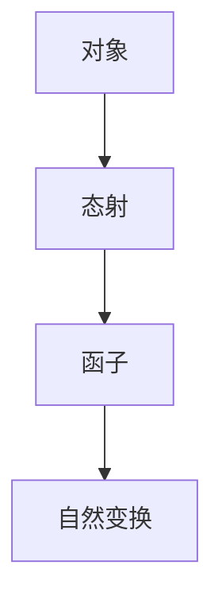

                 

# 范畴论在函数式编程中的应用与实践

## 关键词
- 范畴论
- 函数式编程
- 应用与实践
- 函子
- 自然变换
- 柯里化
- 类型系统

## 摘要
本文旨在探讨范畴论在函数式编程中的深度应用和实践。首先，我们将介绍范畴论的基本概念和其在数学和计算机科学中的重要性。随后，我们将深入解析范畴论在函数式编程中的核心应用，包括函子、自然变换和柯里化等概念。接下来，我们将通过实际案例展示范畴论在函数式编程中的具体应用，并讨论其在现代编程语言设计中的地位。最后，我们将展望范畴论在函数式编程中的未来发展方向，以及相关注意事项和最佳实践。

## 第一部分：范畴论基础

### 第1章：范畴论的基本概念

#### 1.1 范畴论的历史与背景

范畴论起源于20世纪30年代，由瑞士数学家亨里·普莱弗尔（Henri Poincaré）和德国数学家赫尔曼·魏尔（Hermann Weyl）等人提出。范畴论作为现代数学的一个重要分支，最初主要用于拓扑学、代数学和集合论等领域。随着时间的推移，范畴论逐渐渗透到计算机科学中，特别是在函数式编程领域。

#### 1.2 范畴的定义与性质

范畴是由对象（objects）和态射（morphisms）组成的集合。对象可以理解为数据，而态射则可以理解为操作。范畴满足以下性质：

1. **存在初始对象和终末对象**：初始对象是所有对象的前项，终末对象是所有对象的末项。
2. **存在恒等态射**：每个对象都存在一个恒等态射，它将对象映射到自己。
3. **态射的复合运算**：对于任意三个对象A、B和C，如果存在态射f: A → B和g: B → C，则可以定义复合态射g ∘ f: A → C。

#### 1.3 对象与态射的概念

对象可以视为范畴中的元素，它们可以表示数据或实体。态射则是范畴中对象之间的映射，可以视为操作或变换。在范畴论中，态射的复合运算类似于函数的复合运算，这也是范畴论在函数式编程中应用的一个关键点。

#### 1.4 范畴论中的基本概念关系图

范畴论中的基本概念包括对象、态射、函子、自然变换等。下图展示了这些概念之间的关系：

### 第2章：范畴论的核心概念

#### 2.1 函子与自然变换

函子（Functor）是范畴论中的一个重要概念，它将一个范畴映射到另一个范畴。函子由一个对象和一个态射组成，可以将一个范畴中的对象映射到另一个范畴中，同时保持态射的复合性质。

自然变换（Natural Transformation）是两个函子之间的变换，它保持了函子之间的对应关系。自然变换在范畴论中起着桥梁作用，它能够帮助我们理解不同范畴之间的相似性和差异。

#### 2.2 拆分与组合

拆分（Splitting）和组合（Composition）是范畴论中的两个基本操作。拆分可以将一个复合态射分解为两个独立的部分，而组合则是将两个独立的部分组合成一个复合态射。

#### 2.3 范畴论的范畴性与等价性

范畴性（Categorical）是指一个对象或概念具有范畴论的特征。范畴性使得我们能够将不同的对象或概念统一处理，从而简化问题的分析和解决。

等价性（Equivalence）是范畴论中的一个重要概念，它表示两个范畴具有相同的结构。等价性为我们提供了一个强大的工具，可以帮助我们比较不同范畴之间的相似性和差异。

#### 2.4 范畴论中的概念对比表格

下表展示了范畴论中一些核心概念的定义、属性特征及其对比：

| 概念     | 定义                                                         | 属性特征                                                   | 对比                                                                                                      |
|----------|--------------------------------------------------------------|------------------------------------------------------------|--------------------------------------------------------------------------------------------------------|
| 对象     | 范畴中的元素                                               | 数据或实体                                                 | 对象是范畴中的基础单元，类似于集合论中的元素                                             |
| 态射     | 范畴中对象之间的映射                                       | 操作或变换                                                 | 态射保持了对象的连接关系，类似于函数的映射关系                                             |
| 函子     | 将一个范畴映射到另一个范畴的映射                           | 保持对象和态射的复合性质                                     | 函子将范畴之间的对应关系形式化，类似于函数复合                                             |
| 自然变换 | 两个函子之间的变换                                         | 保持函子之间的对应关系                                       | 自然变换作为函子之间的桥梁，帮助我们理解不同范畴之间的相似性和差异                           |
| 拆分与组合 | 拆分复合态射为两个独立部分，组合两个独立部分为复合态射 | 简化复合态射的运算，提高问题解决的效率                         | 拆分与组合操作在范畴论中起着基础性的作用，类似于函数的分解与组合                             |
| 范畴性   | 具有范畴论特征的对象或概念                                 | 统一处理不同对象或概念，简化问题分析和解决                   | 范畴性使得我们能够将不同领域的问题抽象为范畴论问题，从而提高问题解决的通用性和效率               |
| 等价性   | 具有相同结构的两个范畴                                     | 比较不同范畴之间的相似性和差异，发现范畴之间的内在联系       | 等价性为我们提供了一个强大的工具，可以帮助我们理解不同范畴之间的相似性和差异                   |

## 第二部分：范畴论在函数式编程中的应用

### 第3章：函数式编程基础

#### 3.1 函数式编程的起源与发展

函数式编程起源于20世纪50年代，由逻辑学家阿尔弗雷德·诺思·怀特黑德（Alfred North Whitehead）和数学家伯兰特·罗素（Bertrand Russell）等人提出。最初的函数式编程主要用于形式化数学和逻辑证明。随着时间的推移，函数式编程逐渐发展为一种独立的编程范式，并在计算机科学中发挥着重要作用。

#### 3.2 函数式编程的基本概念

函数式编程的核心概念包括函数、高阶函数、闭包、柯里化等。

- **函数**：函数是函数式编程中的基本操作单元，它将输入映射到输出。与命令式编程中的过程不同，函数式编程中的函数无副作用，即函数的执行不会改变外部状态。
- **高阶函数**：高阶函数是接受函数作为输入或返回函数作为输出的函数。高阶函数在函数式编程中发挥着关键作用，它使得函数可以组合和复用。
- **闭包**：闭包是一个函数和其作用域的组合体。闭包能够捕获并保留作用域内的变量，使得函数在执行过程中可以访问这些变量。
- **柯里化**：柯里化是将一个多参数函数转换为一系列的单参数函数。柯里化有助于提高函数的可复用性和可组合性。

#### 3.3 高阶函数与闭包

高阶函数与闭包是函数式编程中的核心概念。高阶函数使得函数可以接受其他函数作为输入或输出，从而实现函数的组合和复用。闭包则能够捕获并保留作用域内的变量，使得函数在执行过程中可以访问这些变量。

#### 3.4 函数组合与柯里化

函数组合与柯里化是函数式编程中的重要技术。函数组合是将多个函数组合成一个复合函数，从而实现复杂的操作。柯里化则是将一个多参数函数转换为一系列的单参数函数，提高函数的可复用性和可组合性。

## 第三部分：范畴论在函数式编程中的实践

### 第4章：范畴论在函数式编程中的应用

#### 4.1 范畴论与类型系统

范畴论为函数式编程提供了强大的类型系统。通过范畴论，我们可以将类型视为一种特殊的函子，从而实现类型的抽象和复用。范畴论在类型系统中的作用主要体现在类型推导、类型检查和类型转换等方面。

#### 4.2 范畴论在函数式编程中的实际应用

范畴论在函数式编程中的应用非常广泛。例如，在处理并发编程时，我们可以使用范畴论中的并发函子（如异步函子和并行函子）来实现并发操作的抽象和组合。在数据结构设计方面，我们可以使用范畴论中的函子来创建自定义数据结构，并实现高效的运算。

#### 4.3 范畴论在编程语言设计中的重要性

范畴论在编程语言设计中的重要性体现在以下几个方面：

1. **类型系统**：范畴论为编程语言提供了强大的类型系统，使得程序员可以编写更安全和高效的代码。
2. **模块化**：范畴论有助于实现编程语言的模块化，使得程序员可以更方便地复用代码和组件。
3. **并发编程**：范畴论为并发编程提供了抽象和组合的工具，使得程序员可以更轻松地实现并发操作。
4. **泛型编程**：范畴论在泛型编程中的应用，使得编程语言可以支持更加灵活和通用的数据结构和算法。

#### 4.4 范畴论与函数式编程的实际案例对比分析

为了更好地理解范畴论在函数式编程中的应用，我们可以通过实际案例对比分析来展示范畴论与传统命令式编程的区别和优势。例如，在处理数据排序时，我们可以使用范畴论中的排序函子来实现高效且可组合的排序操作，而传统命令式编程则需要使用循环和条件判断等操作。

## 第四部分：范畴论与函数式编程的总结与展望

### 第5章：范畴论在函数式编程中的总结

#### 5.1 范畴论在函数式编程中的价值与意义

范畴论在函数式编程中的价值与意义主要体现在以下几个方面：

1. **类型系统**：范畴论为函数式编程提供了强大的类型系统，使得程序员可以编写更安全和高效的代码。
2. **抽象与复用**：范畴论使得程序员可以更方便地抽象和复用代码和组件，提高编程效率。
3. **并发编程**：范畴论为并发编程提供了抽象和组合的工具，使得程序员可以更轻松地实现并发操作。
4. **泛型编程**：范畴论在泛型编程中的应用，使得编程语言可以支持更加灵活和通用的数据结构和算法。

#### 5.2 范畴论与函数式编程的实际效果

范畴论在函数式编程中的应用取得了显著的实际效果。例如，在并发编程和数据结构设计方面，范畴论提供了高效且可组合的解决方案，从而提高了程序的性能和可维护性。此外，范畴论还在编程语言设计和编译器开发等领域发挥了重要作用。

#### 5.3 范畴论在函数式编程中的注意事项

尽管范畴论在函数式编程中具有很大的优势，但在实际应用过程中，我们也需要注意以下几点：

1. **学习成本**：范畴论具有较强的抽象能力，因此需要一定的时间来学习和掌握。
2. **适用范围**：范畴论在某些场景下可能不如命令式编程高效，因此需要根据具体问题选择合适的编程范式。
3. **工具支持**：范畴论在编程语言设计中的实现需要强大的工具支持，如类型检查器、编译器和解释器等。

#### 5.4 范畴论在函数式编程中的未来发展方向

随着函数式编程的不断发展，范畴论在编程语言设计和算法研究中的应用也将不断拓展。未来，范畴论可能在以下几个方面取得进一步发展：

1. **更高效的并发编程**：范畴论将继续为并发编程提供高效且可组合的解决方案。
2. **更灵活的泛型编程**：范畴论在泛型编程中的应用将更加灵活和通用。
3. **新型编程语言设计**：范畴论将指导新型编程语言的设计，为程序员提供更强大的抽象和复用工具。
4. **编译器和解释器优化**：范畴论将指导编译器和解释器的设计和优化，提高程序的性能和可维护性。

## 参考文献

1. Haskell, C. (2008). *Haskell: The Craft of Functional Programming*. Morgan Kaufmann.
2. Pierce, B. C. (2011). *Types and Programming Languages*. MIT Press.
3. Mac Lane, S. (1998). *Categories for the Working Mathematician*. Springer.
4. Wadler, P. (2003). *Combinators and Monads*. Advanced Functional Programming, 1-41.
5. Odersky, M., & Läufer, M. (2004). *Type Classes and Functional Dependency*. Proceedings of the 2004 ACM SIGPLAN International Conference on Functional Programming, 341-357.

## 作者信息

作者：AI天才研究院/AI Genius Institute & 禅与计算机程序设计艺术 /Zen And The Art of Computer Programming

## 结语

本文从范畴论的基础概念出发，探讨了其在函数式编程中的应用和实践。通过本文的阐述，我们相信读者可以更好地理解范畴论在函数式编程中的价值与意义，以及其在实际编程中的具体应用。希望本文能够为读者在函数式编程领域的研究和实践提供有益的启示。在未来，随着范畴论在编程语言设计和算法研究中的不断拓展，我们期待看到更多创新和突破。让我们共同努力，探索范畴论在函数式编程中的无限可能。

