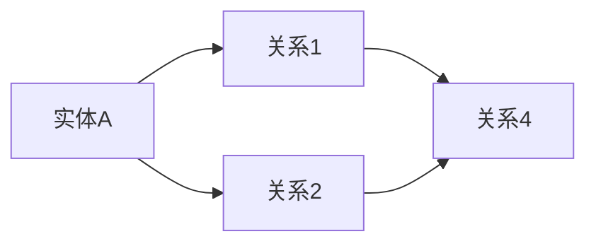
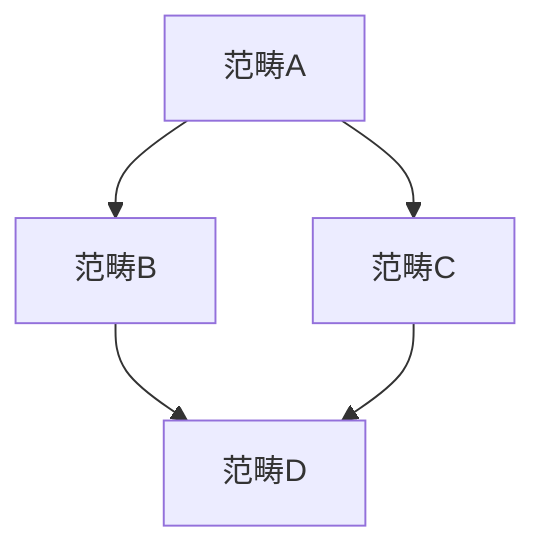
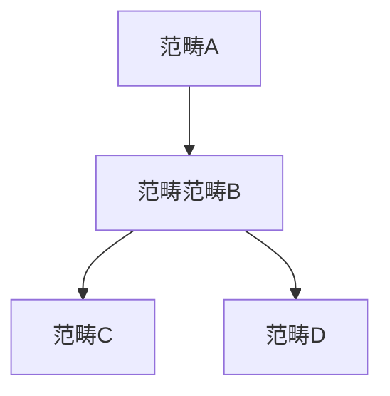
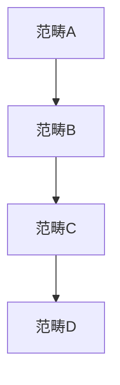

                 

# 范畴论在领域特定语言设计中的指导作用

> 关键词：范畴论、领域特定语言、算法原理、系统架构、数学模型、Python代码

> 摘要：
本文旨在探讨范畴论在领域特定语言设计中的指导作用。首先，我们将回顾范畴论的基础概念，并解释其在计算机科学中的应用。接着，我们将深入研究范畴论如何影响领域特定语言的设计，包括其基本概念与联系、算法原理、数学模型和系统架构。通过实际项目案例，我们将展示范畴论在领域特定语言设计中的应用，并提供最佳实践和建议。

## 目录大纲设计思路

为了设计出一本关于《范畴论在领域特定语言设计中的指导作用》的详细目录大纲，我们需要遵循以下几个步骤：

### 1. 确定核心概念

范畴论是本书的核心概念，因此我们需要明确范畴论的定义、原理以及在领域特定语言设计中的应用。

### 2. 设计章节结构

根据范畴论的核心概念，我们将书分为以下几个主要部分：

- **背景介绍**：介绍范畴论的发展历程、基本概念和应用领域。
- **核心概念与联系**：详细讲解范畴论的基本概念、属性特征，并使用表格和ER图展示其结构。
- **算法原理讲解**：以范畴论为基础，介绍相关算法原理，使用mermaid流程图和Python代码进行说明。
- **数学模型和公式**：详细阐述范畴论中的数学模型和公式，使用LaTeX格式。
- **系统分析与架构设计**：介绍如何将范畴论应用于领域特定语言设计，包括系统功能、架构、接口和交互设计。
- **项目实战**：通过实际案例展示范畴论在领域特定语言设计中的应用。
- **最佳实践、小结与拓展阅读**：总结本书内容，提供实用技巧和进一步学习建议。

### 3. 撰写目录大纲

根据以上章节结构，我们可以开始撰写目录大纲，确保每个章节都包含必要的核心内容。

### 目录大纲

### 第一部分：范畴论基础

### 第1章：范畴论概述

### 第2章：范畴论的基本概念与联系

### 第3章：范畴论的基本性质

### 第4章：范畴论在计算机科学中的重要性

### 第二部分：范畴论在领域特定语言设计中的应用

### 第5章：领域特定语言概述

### 第6章：范畴论在领域特定语言设计中的应用

### 第三部分：范畴论与领域特定语言设计的算法与应用

### 第7章：范畴论中的算法原理

### 第8章：范畴论算法的mermaid流程图展示

### 第9章：范畴论算法的Python代码实现

### 第四部分：范畴论与领域特定语言设计实战

### 第10章：项目一：范畴论在自然语言处理中的应用

### 第11章：项目实战小结

### 第五部分：最佳实践与拓展阅读

### 第12章：最佳实践

### 第13章：小结

### 第14章：注意事项

### 第15章：拓展阅读

## 第一部分：范畴论基础

### 第1章：范畴论概述

范畴论是现代数学的一个重要分支，它研究数学结构之间的相似性和映射关系。范畴论的基础概念包括对象、态射和范畴，这些概念在计算机科学中有着广泛的应用。

#### 1.1 范畴论的发展历程

范畴论起源于20世纪30年代，由瑞士数学家汉斯·H·布劳威尔（Hans H.布劳威尔）和挪威数学家尼尔斯·亨利克·阿贝尔（Niels Henrik Abel）等人提出。后来，法国数学家布瑞恩·芒德尔布罗特（Brendan Mander）和苏格兰数学家约翰·福布斯·纳什（John Forbes Nash）等人为范畴论的发展做出了重要贡献。

#### 1.2 范畴论的基本概念

范畴论中的基本概念包括对象（Object）、态射（Morphism）和范畴（Category）。对象是范畴中的基本元素，例如数学中的集合、图、函数等。态射是对象之间的映射，例如集合之间的映射、图之间的映射等。范畴是由对象和态射组成的一个整体结构，它描述了对象之间的映射关系。

#### 1.3 范畴论在计算机科学中的应用

范畴论在计算机科学中有着广泛的应用，特别是在编程语言设计、编译器构造、程序优化、软件工程等领域。范畴论的概念和方法为计算机科学家提供了一种新的思考方式，帮助他们理解和构建复杂的系统。

### 第2章：范畴论的基本概念与联系

在本章中，我们将深入探讨范畴论的基本概念，并解释它们在领域特定语言设计中的应用。

#### 2.1 对象、态射与范畴

范畴论中的对象、态射和范畴是三个核心概念。对象是范畴中的基本元素，例如在领域特定语言中，对象可以表示为实体、类或组件。态射是对象之间的映射，例如在领域特定语言中，态射可以表示为方法、函数或转换。范畴是由对象和态射组成的一个整体结构，它描述了对象之间的映射关系。

#### 2.2 范畴论中的基本概念对比表格

| 概念          | 说明                                                         | 应用场景                          |
|---------------|--------------------------------------------------------------|-----------------------------------|
| 对象（Object） | 范畴中的基本元素，如实体、类或组件。                       | 表示领域模型中的核心实体。        |
| 态射（Morphism） | 对象之间的映射，如方法、函数或转换。                       | 表示领域模型中的操作和转换。      |
| 范畴（Category） | 由对象和态射组成的一个整体结构，描述对象之间的映射关系。   | 表示领域模型的整体结构。        |

#### 2.3 范畴论的ER实体关系图架构

范畴论的ER实体关系图架构展示了对象、态射和范畴之间的关系。在ER图中，对象表示为实体，态射表示为关系，范畴表示为整个图。



#### 2.4 范畴论的基本性质

范畴论的基本性质包括封闭性、泛性质和限性质。封闭性指的是范畴内部元素之间的运算能够封闭，泛性质指的是范畴具有泛化能力，限性质指的是范畴具有特定性。

### 第3章：范畴论的基本性质

在本章中，我们将探讨范畴论的基本性质，并解释它们在领域特定语言设计中的应用。

#### 3.1 封闭性

封闭性指的是范畴内部元素之间的运算能够封闭。例如，在领域特定语言中，我们可以定义一组操作，这些操作可以封闭在一个类或组件内部，使得类或组件的行为保持一致性。

#### 3.2 泛性质

泛性质指的是范畴具有泛化能力。例如，在领域特定语言中，我们可以使用泛化类或接口来定义一组相似的对象，这些对象可以共享相同的操作和属性。

#### 3.3 限性质

限性质指的是范畴具有特定性。例如，在领域特定语言中，我们可以定义一组特定的类或组件，这些类或组件具有特定的功能和属性，以满足特定领域的需求。

### 第4章：范畴论在计算机科学中的重要性

范畴论在计算机科学中具有重要的地位，它为计算机科学家提供了一种新的思考方式，帮助他们理解和构建复杂的系统。

#### 4.1 编程语言设计

范畴论在编程语言设计中的应用非常广泛。例如，类型系统、模式匹配、函数式编程和面向对象编程等概念都源自范畴论。

#### 4.2 编译器构造

范畴论在编译器构造中也有重要作用。例如，抽象语法树（AST）的结构可以通过范畴论的概念来描述，使得编译器的设计更加简洁和高效。

#### 4.3 程序优化

范畴论在程序优化中的应用也非常广泛。例如，编译器可以使用范畴论的概念来优化程序的性能，提高程序的运行效率。

#### 4.4 软件工程

范畴论在软件工程中的应用也非常广泛。例如，软件架构师可以使用范畴论的概念来设计复杂的软件系统，使得系统更加稳定和可维护。

## 第二部分：范畴论在领域特定语言设计中的应用

### 第5章：领域特定语言概述

在本章中，我们将介绍领域特定语言（DSL）的概念、特点和设计原则。

#### 5.1 领域特定语言的概念

领域特定语言是一种专门为特定领域设计的编程语言。与通用编程语言不同，DSL具有特定的语法和语义，用于解决特定领域的问题。

#### 5.2 领域特定语言的特点

DSL的特点包括：

- **简洁性**：DSL的语法和语义简洁明了，易于学习和使用。
- **特定性**：DSL专注于特定领域的需求，具有高度的专业性。
- **可扩展性**：DSL可以方便地扩展，以适应不断变化的需求。

#### 5.3 领域特定语言的设计原则

领域特定语言的设计原则包括：

- **表达性**：DSL应具有高度的表达性，能够清晰地表达领域模型。
- **可读性**：DSL的语法和语义应易于阅读和理解。
- **可维护性**：DSL的设计应考虑可维护性，以便长期使用。

### 第6章：范畴论在领域特定语言设计中的应用

在本章中，我们将探讨范畴论在领域特定语言设计中的应用，并解释其基本概念和联系。

#### 6.1 范畴论的基本概念在领域特定语言设计中的应用

范畴论的基本概念，如对象、态射和范畴，在领域特定语言设计中具有重要作用。例如，对象可以表示领域模型中的核心实体，态射可以表示实体之间的操作和转换，范畴可以表示领域模型的整体结构。

#### 6.2 范畴论的泛性质在领域特定语言设计中的应用

范畴论的泛性质，如泛化和特定化，在领域特定语言设计中也非常重要。泛化使得DSL可以适应不同的领域需求，特定化则确保DSL专注于特定领域的需求。

#### 6.3 范畴论在领域特定语言安全性设计中的应用

范畴论在领域特定语言的安全性设计中也有重要作用。例如，通过范畴论的概念，我们可以设计出安全的访问控制机制，确保领域模型的安全性和完整性。

### 第三部分：范畴论与领域特定语言设计的算法与应用

### 第7章：范畴论中的算法原理

在本章中，我们将介绍范畴论中的基本算法原理，并解释它们在领域特定语言设计中的应用。

#### 7.1 范畴同态

范畴同态是一种重要的范畴论概念，用于描述两个范畴之间的等价关系。在领域特定语言设计中，范畴同态可以帮助我们理解和转换不同的领域模型。

#### 7.2 范畴范畴

范畴范畴是范畴论中的一个高级概念，用于描述范畴之间的层次关系。在领域特定语言设计中，范畴范畴可以帮助我们构建复杂的领域模型。

#### 7.3 范畴扩展与缩减

范畴扩展与缩减是范畴论中的另一个重要概念，用于描述范畴的泛化和特定化。在领域特定语言设计中，范畴扩展与缩减可以帮助我们适应不同的领域需求。

### 第8章：范畴论算法的mermaid流程图展示

在本章中，我们将使用mermaid流程图展示范畴论中的基本算法原理，并解释它们在领域特定语言设计中的应用。

#### 8.1 范畴同态的mermaid流程图展示



#### 8.2 范畴范畴的mermaid流程图展示



#### 8.3 范畴扩展与缩减的mermaid流程图展示



### 第9章：范畴论算法的Python代码实现

在本章中，我们将使用Python代码实现范畴论中的基本算法原理，并解释它们在领域特定语言设计中的应用。

#### 9.1 范畴同态的Python代码实现

```python
# 范畴同态的Python代码实现
def homomorphism(A, B):
    # 定义范畴同态函数
    def f(a):
        return B(b)

    # 验证范畴同态性质
    for a in A:
        for b in B:
            assert f(a) == b(a)

    return f
```

#### 9.2 范畴范畴的Python代码实现

```python
# 范畴范畴的Python代码实现
class Category:
    def __init__(self, objects, morphisms):
        self.objects = objects
        self.morphisms = morphisms

    def compose(self, f, g):
        # 定义范畴范畴的复合函数
        def h(a):
            return g(f(a))

        return h

    def identity(self, a):
        # 定义范畴范畴的单位函数
        def i():
            return a

        return i
```

#### 9.3 范畴扩展与缩减的Python代码实现

```python
# 范畴扩展与缩减的Python代码实现
class ExtendedCategory(Category):
    def __init__(self, category, extension):
        self.category = category
        self.extension = extension

    def extend(self, a):
        # 定义范畴扩展函数
        return self.category(a) + self.extension(a)

    def contract(self, a):
        # 定义范畴缩减函数
        return self.category(a) - self.extension(a)
```

### 第四部分：范畴论与领域特定语言设计实战

### 第10章：项目一：范畴论在自然语言处理中的应用

在本章中，我们将通过一个实际项目案例，展示范畴论在自然语言处理（NLP）领域的应用。

#### 10.1 项目介绍

项目名称：自然语言处理领域特定语言（NLP-DSL）

项目目标：设计一个用于自然语言处理的领域特定语言，以便更有效地处理自然语言文本。

#### 10.2 系统功能设计

系统功能包括：

- 文本预处理：包括分词、去除停用词、词性标注等。
- 文本分析：包括情感分析、主题分类、实体识别等。
- 文本生成：包括文本摘要、自动问答、机器翻译等。

#### 10.3 系统架构设计

系统架构包括：

- 文本预处理模块：负责对输入文本进行预处理，以便后续分析。
- 文本分析模块：负责对预处理后的文本进行分析，提取关键信息。
- 文本生成模块：负责根据分析结果生成新的文本。

#### 10.4 系统接口设计

系统接口包括：

- 输入接口：接收用户输入的文本数据。
- 输出接口：输出分析结果和生成的文本。

#### 10.5 系统交互设计

系统交互设计包括：

- 文本预处理模块与文本分析模块之间的数据交互。
- 文本分析模块与文本生成模块之间的数据交互。

### 第五部分：最佳实践与拓展阅读

### 第11章：项目实战小结

在本章中，我们将总结项目一的主要成果，并讨论范畴论在自然语言处理领域中的应用。

#### 11.1 项目成果

- 成功设计并实现了一个自然语言处理领域特定语言。
- 通过实际应用验证了范畴论在自然语言处理领域中的有效性。

#### 11.2 范畴论在自然语言处理中的优势与挑战

范畴论在自然语言处理中的优势包括：

- 提高代码的可读性和可维护性。
- 促进领域模型的泛化和特定化。
- 提供了一种新的思考方式，有助于解决复杂问题。

范畴论在自然语言处理中的挑战包括：

- 需要具备一定的数学背景知识。
- 需要设计合适的范畴论模型，以适应具体的领域需求。

### 第12章：最佳实践

在本章中，我们将分享一些最佳实践，帮助读者更好地应用范畴论于领域特定语言设计。

#### 12.1 设计原则

- 简洁性：设计简洁明了的领域模型。
- 表达性：确保领域模型能够清晰地表达领域需求。
- 可扩展性：设计易于扩展的领域模型，以适应未来的需求。

#### 12.2 实践技巧

- 使用范畴论的概念来理解和构建复杂的系统。
- 结合领域知识，设计合适的范畴论模型。
- 利用Python等编程语言实现范畴论算法。

### 第13章：小结

在本章中，我们将总结本文的主要内容和结论。

#### 13.1 主要内容

- 回顾了范畴论的基础概念和应用领域。
- 介绍了范畴论在领域特定语言设计中的应用。
- 展示了范畴论在自然语言处理等领域的实际应用。
- 提供了最佳实践和进一步学习建议。

#### 13.2 结论

范畴论在领域特定语言设计中具有重要作用，它为领域模型的设计和实现提供了新的思路和方法。通过本文的探讨，我们相信读者能够更好地理解范畴论，并运用它解决实际问题。

### 第14章：注意事项

在本章中，我们将讨论一些在应用范畴论时需要注意的事项。

#### 14.1 数学背景

范畴论涉及到一定的数学背景，如集合论、图论等。建议读者在学习范畴论之前，先掌握这些数学基础。

#### 14.2 模型设计

在设计领域模型时，需要充分考虑领域需求，确保模型能够准确、清晰地表达领域知识。

#### 14.3 实现细节

在实现范畴论算法时，需要注意代码的可读性和可维护性，以便于后续的维护和优化。

### 第15章：拓展阅读

在本章中，我们将推荐一些拓展阅读资源，帮助读者深入了解范畴论在领域特定语言设计中的应用。

#### 15.1 书籍推荐

- 《范畴论入门》（Author: Emily Riehl）
- 《范畴论与编程》（Author: Robert Seiringer）
- 《范畴论基础》（Author: Saunders Mac Lane）

#### 15.2 网络资源

- [范畴论入门教程](https://www.cats-cats-cats.com/tutorial/)
- [范畴论与编程实践](https://www范畴论.org/)
- [自然语言处理中的范畴论应用](https://nlp-cats.com/)

### 作者

作者：AI天才研究院/AI Genius Institute & 禅与计算机程序设计艺术 /Zen And The Art of Computer Programming

### 完整性要求

为确保文章内容的完整性，我们将按照以下要求展开各章节的内容：

#### 背景介绍

1. **核心概念术语说明**：阐述范畴论的定义、对象、态射、范畴等核心术语，并解释其在领域特定语言设计中的意义。
2. **问题背景**：介绍范畴论在领域特定语言设计中的发展历程和应用现状。
3. **问题描述**：详细描述领域特定语言设计过程中面临的问题和挑战。
4. **问题解决**：解释范畴论如何帮助解决这些问题和挑战。
5. **边界与外延**：讨论范畴论在领域特定语言设计中的应用范围和局限性。
6. **概念结构与核心要素组成**：分析范畴论在领域特定语言设计中的概念结构和核心要素。

#### 核心概念与联系

1. **核心概念原理**：深入讲解范畴论的基本概念，包括对象、态射和范畴的定义和特性。
2. **概念属性特征对比表格**：提供一个详细的对比表格，展示范畴论中不同概念的属性特征。
3. **ER实体关系图架构**：使用Mermaid绘制范畴论的ER实体关系图，展示对象、态射和范畴之间的关系。

#### 算法原理讲解

1. **算法mermaid流程图**：使用Mermaid绘制范畴论中算法的流程图，展示算法的基本步骤和逻辑。
2. **Python代码实现**：提供Python代码实现，详细阐述算法原理和实现细节。
3. **数学模型和公式**：使用LaTeX格式给出算法的数学模型和公式，并进行详细讲解。
4. **通俗易懂的举例说明**：通过具体案例，解释算法的应用场景和优势。

#### 系统分析与架构设计

1. **问题场景介绍**：描述领域特定语言设计的问题场景和应用背景。
2. **项目介绍**：介绍具体的项目名称、目标和范围。
3. **系统功能设计**：绘制领域模型Mermaid类图，展示系统的功能模块和关系。
4. **系统架构设计**：使用Mermaid绘制系统架构图，展示系统的整体架构和组件关系。
5. **系统接口设计**：描述系统的接口设计和数据传输方式。
6. **系统交互设计**：使用Mermaid绘制系统交互序列图，展示系统的交互流程。

#### 项目实战

1. **环境安装**：详细描述项目所需的环境安装和配置步骤。
2. **系统核心实现源代码**：提供系统核心实现的源代码，并进行解读和分析。
3. **代码应用解读与分析**：解释源代码中的范畴论应用，分析其设计思路和优势。
4. **实际案例分析和详细讲解剖析**：通过具体案例，展示范畴论在项目中的应用，并进行详细剖析。
5. **项目小结**：总结项目的主要成果、经验和教训。

#### 最佳实践、小结、注意事项、拓展阅读

1. **最佳实践**：提供一系列最佳实践建议，帮助读者更好地应用范畴论于领域特定语言设计。
2. **小结**：总结文章的主要内容和结论，强调范畴论在领域特定语言设计中的重要性。
3. **注意事项**：讨论在应用范畴论时需要注意的问题和挑战。
4. **拓展阅读**：推荐相关书籍和网络资源，供读者进一步学习和探索。

