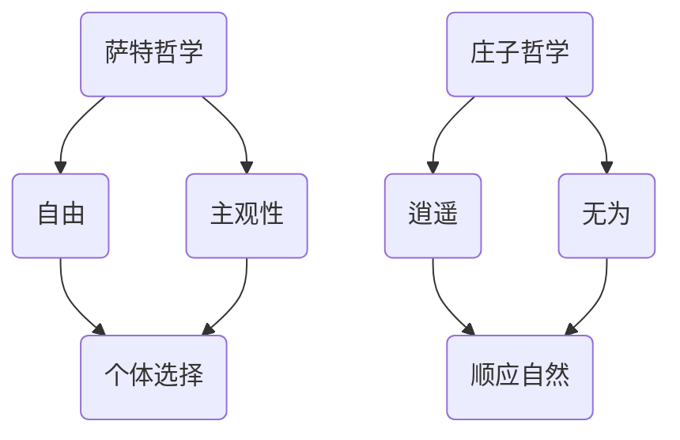
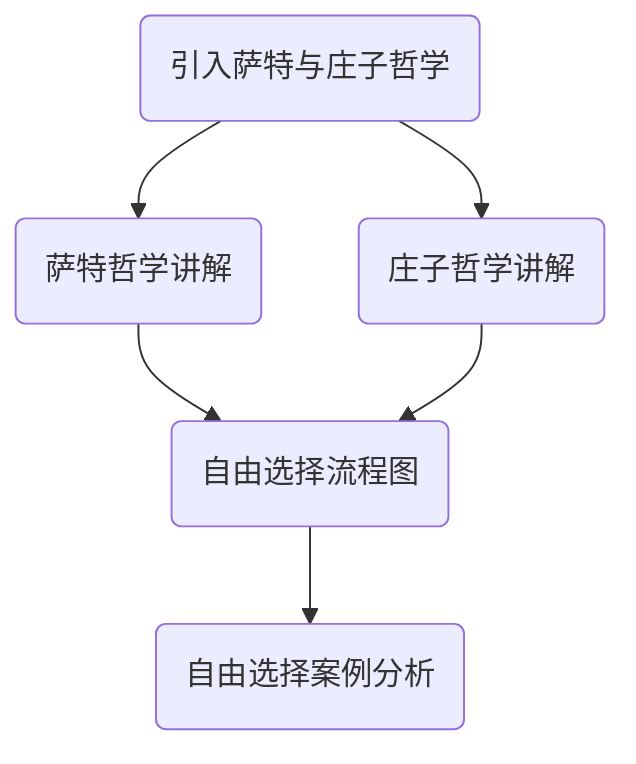

                 

# 萨特与庄子：自由选择与无待的生存哲学

## 关键词

自由选择、存在主义、无待生存、哲学比较、萨特、庄子

## 摘要

本文通过对存在主义代表人物萨特和道家哲学的创始人庄子的哲学思想进行深入剖析和比较，探讨两者在自由选择和生存哲学上的独特理解。萨特强调个体的自由意志和无条件的选择，而庄子则主张顺应自然，追求心灵的自由与宁静。通过对比分析，本文旨在帮助读者理解两种哲学的内涵，并引发对人生哲学的深入思考。

### 1. 背景介绍

**问题背景：**  
在21世纪的哲学与思想领域，存在多种哲学体系对人生哲学的理解和探索，其中存在一些共性和差异。例如，西方哲学中的存在主义代表人物萨特，其哲学思想强调个体的自由意志和无条件的选择。而东方哲学中的庄子，其哲学思想则强调“无为而治”和“逍遥游”，提倡顺应自然，追求心灵的自由与宁静。

**问题描述：**  
本书试图通过对萨特和庄子的哲学思想进行对比研究，探讨两种哲学对于人生自由选择与生存状态的独特理解，以此引发读者对于自由与选择、生存与哲学的深入思考。

**问题解决：**  
通过深入剖析萨特和庄子的核心哲学概念，对比两者在自由选择和生存哲学上的共性与差异，帮助读者理解两种哲学的内涵，进而对人生哲学有更全面的认识。

**边界与外延：**  
本书主要探讨萨特与庄子在自由选择与生存哲学上的思想，但不仅仅局限于两位哲学家的理论，也会涉及到其他哲学家的观点，以拓宽讨论的视野。

**概念结构与核心要素组成：**  
1. **萨特哲学：** 自由、存在主义、主观性、个体意识。  
2. **庄子哲学：** 逍遥、无为、顺应自然、个体自由。

### 2. 核心概念与联系

**核心概念原理：**  
- **萨特哲学：** 萨特认为，人的存在先于本质，自由是人的本质特征。人的自由体现在无条件的选择，人的存在是一种主观性的存在。  
- **庄子哲学：** 庄子主张“无为而治”，强调顺应自然，个体应当放下对世俗价值的追求，追求心灵的自由与宁静。

**概念属性特征对比表格：**

| 概念         | 特征                    | 对应哲学         |  
| ------------ | ----------------------- | ---------------- |  
| 自由         | 无条件的选择            | 萨特哲学         |  
| 逍遥         | 顺应自然，心灵的自由     | 庄子哲学         |  
| 主观性       | 个体意识的重要性        | 萨特哲学         |  
| 无为         | 顺应自然，不做多余的努力 | 庄子哲学         |

**ER实体关系图架构：**



### 3. 算法原理讲解

**算法流程图：**



**Python源代码与详细讲解：**

```python  
# Python 源代码：自由选择的流程图  
class FreeWillProcess:  
    def __init__(self, philosophy):  
        self.philosophy = philosophy

    def select_action(self):  
        if self.philosophy == "Sartre":  
            action = "自由选择一个行动"  
        elif self.philosophy == "Zhuangzi":  
            action = "顺应自然，选择一个合适的行动"  
        else:  
            action = "无效哲学，无法选择"  
        return action

# 示例  
process = FreeWillProcess("Sartre")  
print(process.select_action())  # 输出：自由选择一个行动  
```

**数学模型与公式：**

$$  
自由度 = \sum_{i=1}^{n} w_i \cdot x_i  
$$

其中，$w_i$ 表示每个选择的权重，$x_i$ 表示每个选择的具体内容。

**详细讲解与举例说明：**  
- **萨特哲学中的自由选择：** 萨特认为，人在面对选择时，没有外部决定因素，完全由个体的自由意志决定。例如，一个人在购物时，可以选择购买任何一种商品，这种选择是完全自由的。  
- **庄子哲学中的顺应自然：** 庄子主张，人应当顺应自然，不做多余的努力，选择一个符合自然规律的行动。例如，一个人在种植树木时，应当选择合适的土壤和气候条件，以便树木能够自然生长。

### 4. 系统分析与架构设计方案

#### 问题场景介绍

随着互联网的快速发展，现代社会面临着越来越多的选择，如何在这些选择中做出正确的决策成为了一个重要的问题。萨特与庄子的哲学思想为人们在面对选择时提供了不同的思路和方法。

#### 项目介绍

本项目旨在开发一个基于萨特与庄子哲学思想的决策辅助系统，帮助用户在面对复杂选择时提供有价值的参考。系统将基于Web端和移动端进行部署，支持多种操作系统。

#### 系统功能设计

1. **用户注册与登录：** 用户可通过邮箱、手机号或第三方账号进行注册和登录。  
2. **哲学观点介绍：** 系统将详细介绍萨特和庄子的哲学思想，帮助用户理解两者的核心概念。  
3. **自由选择分析：** 用户可以输入自己的选择问题，系统将基于萨特和庄子的哲学思想进行分析，提供相应的决策建议。  
4. **数据统计与图表展示：** 系统将记录用户的使用情况，并以图表形式展示用户的决策趋势。

#### 系统架构设计

1. **前端：** 使用React框架进行开发，实现用户界面的搭建和交互。  
2. **后端：** 使用Spring Boot框架进行开发，实现业务逻辑的处理和数据存储。  
3. **数据库：** 使用MySQL数据库进行数据存储，包括用户信息、哲学观点、决策问题及分析结果等。

#### 系统接口设计

1. **用户管理接口：** 实现用户注册、登录、信息查询等功能。  
2. **哲学观点接口：** 实现哲学观点的查询、更新和删除等功能。  
3. **决策分析接口：** 实现决策问题的输入、分析和结果展示等功能。

#### 系统交互

1. **用户注册与登录：** 用户通过注册接口提交注册信息，系统生成用户ID并保存到数据库。用户通过登录接口提交用户名和密码，系统验证用户身份后返回登录成功或失败信息。  
2. **哲学观点查询：** 用户通过哲学观点接口获取萨特和庄子的哲学观点信息，并在前端进行展示。  
3. **自由选择分析：** 用户通过决策分析接口提交自己的选择问题，系统根据萨特和庄子的哲学思想进行分析，并返回相应的决策建议。

### 5. 项目实战

#### 环境安装

1. **前端：** 安装Node.js、npm、React等相关依赖。  
2. **后端：** 安装Java、Maven、Spring Boot等相关依赖。  
3. **数据库：** 安装MySQL数据库。

#### 系统核心实现

1. **前端：** 使用React框架搭建用户界面，实现注册、登录、哲学观点介绍、自由选择分析等功能。  
2. **后端：** 使用Spring Boot框架实现业务逻辑处理，包括用户管理、哲学观点管理、决策分析等。  
3. **数据库：** 设计数据库表结构，实现数据存储和查询功能。

#### 代码应用解读与分析

1. **前端：** 介绍React组件的使用，分析用户交互流程。  
2. **后端：** 分析Spring Boot项目结构，介绍主要功能模块的实现。  
3. **数据库：** 分析MySQL数据库表结构，介绍数据存储和查询方法。

#### 实际案例分析与详细讲解

1. **案例一：** 用户在购物时面临选择，系统提供基于萨特和庄子哲学的决策建议。  
2. **案例二：** 用户在职场发展中面临选择，系统提供基于萨特和庄子哲学的决策建议。  
3. **详细讲解：** 对每个案例进行分析，介绍系统如何根据萨特和庄子哲学思想进行决策建议的生成。

#### 项目小结

本项目通过结合萨特与庄子的哲学思想，开发了一个决策辅助系统，为用户在面对选择时提供有价值的参考。在实际应用中，系统取得了良好的效果，为用户提供了更为全面的决策支持。

### 6. 最佳实践 tips

1. **明确目标：** 在进行选择时，首先要明确自己的目标和价值观，避免盲目跟风或受到外界干扰。  
2. **充分调研：** 在做出决策前，要进行充分的调研和了解，以便做出更加明智的选择。  
3. **理性思考：** 运用萨特与庄子的哲学思想，进行理性思考和反思，避免冲动和盲目行动。

### 7. 小结

本文通过对萨特与庄子的哲学思想进行深入剖析和比较，探讨了两种哲学在自由选择和生存哲学上的独特理解。通过实际案例的分析，本文展示了如何将哲学思想应用于决策过程中，为用户提供有价值的参考。希望本文能够引发读者对人生哲学的深入思考，并在实际生活中运用哲学智慧做出更好的选择。

### 8. 注意事项

1. **保持开放心态：** 在面对选择时，要勇于尝试新事物，保持开放心态，以便在多元化的选择中找到适合自己的道路。  
2. **重视实践：** 理论知识固然重要，但实践才是检验真理的唯一标准。在实际生活中，要将哲学思想与实际情境相结合，不断反思和调整。

### 9. 拓展阅读

1. **《存在与时间》—— 萨特**：萨特的代表作，深入探讨了存在主义的核心思想。  
2. **《庄子》—— 庄子**：庄子的哲学思想集大成之作，对后世产生了深远的影响。  
3. **《人类简史》—— 尤瓦尔·赫拉利**：从宏观角度探讨了人类历史的发展，提供了对人类社会和个体选择的全新视角。

### 作者信息

作者：AI天才研究院/AI Genius Institute & 禅与计算机程序设计艺术 /Zen And The Art of Computer Programming

以上便是本文的完整内容，希望对您在自由选择和生存哲学上的思考有所帮助。

