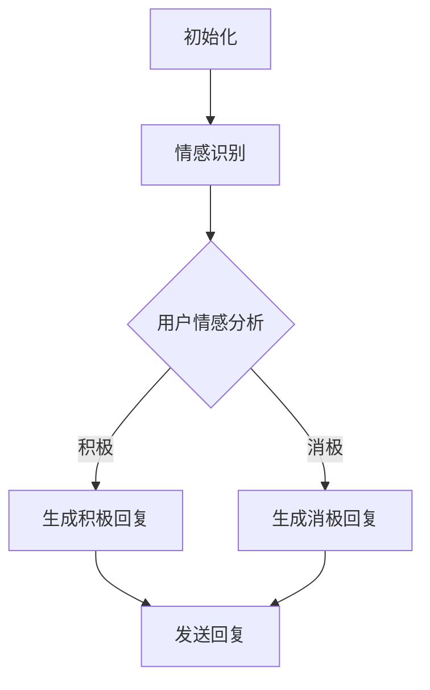
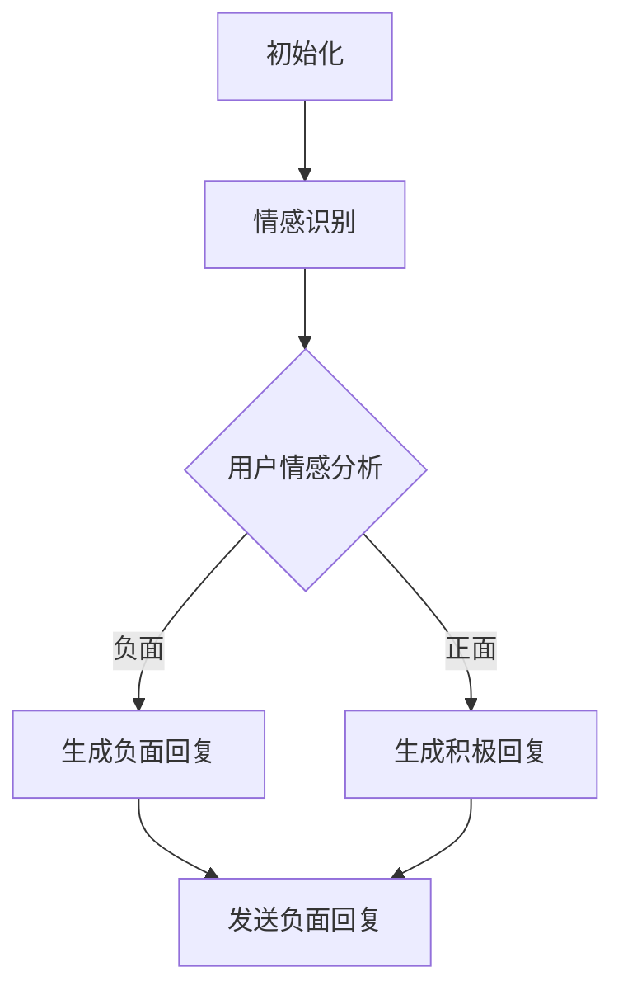
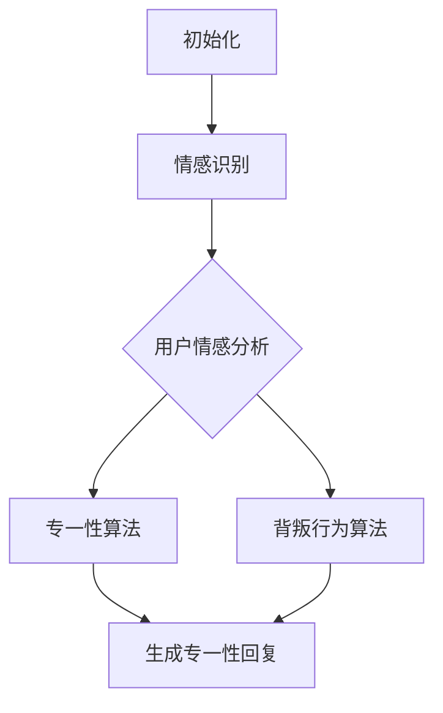
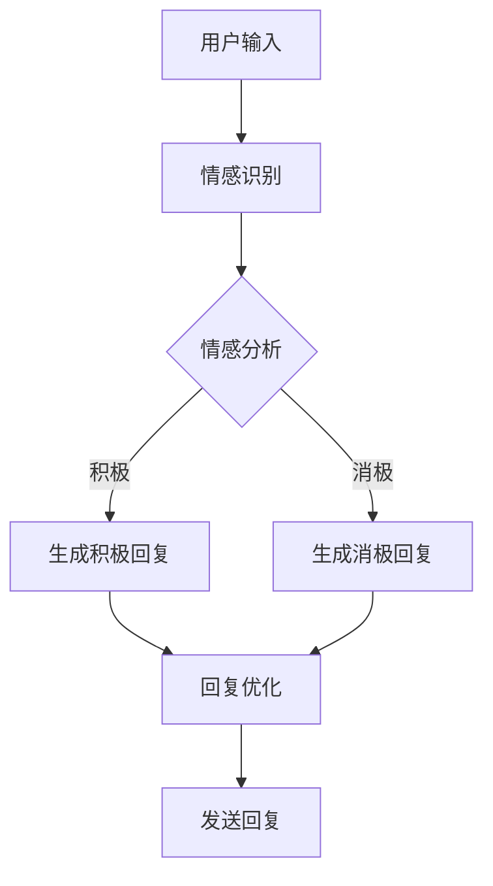
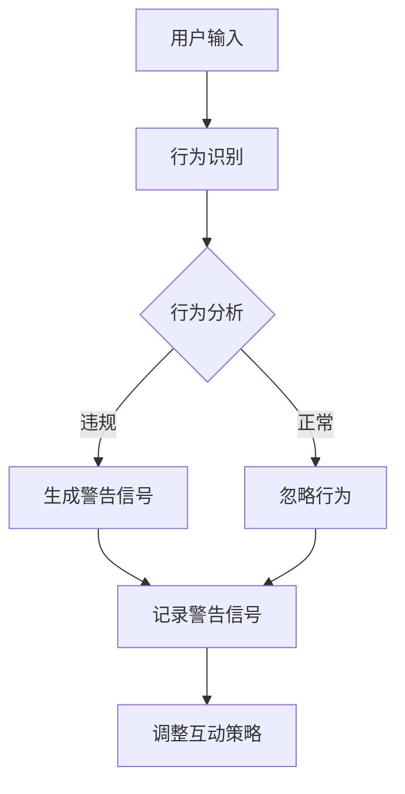
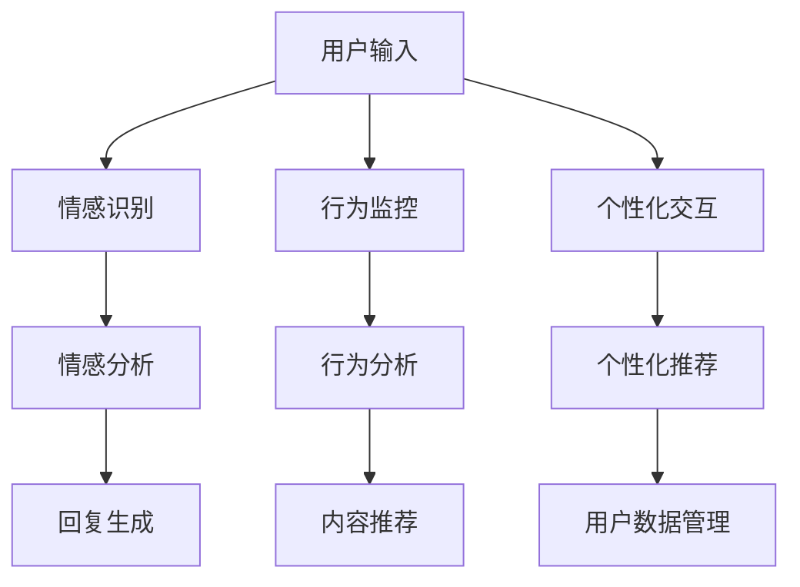
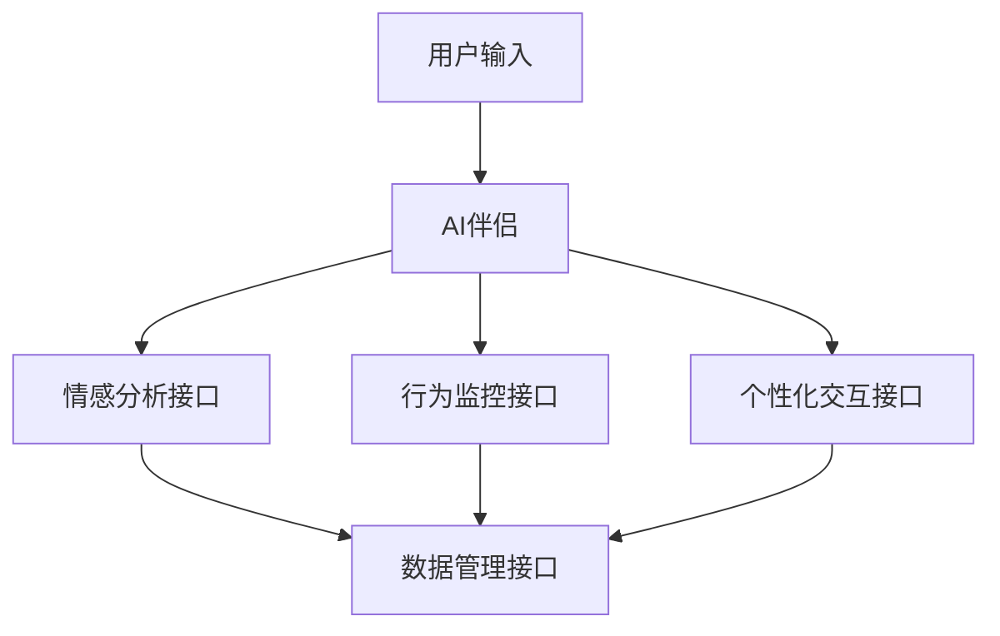
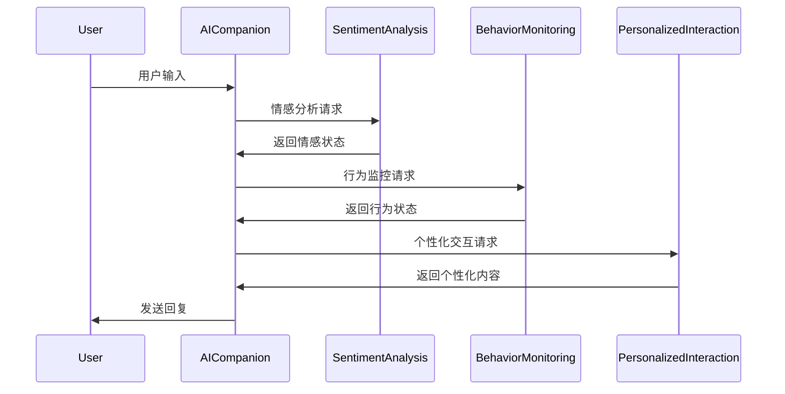

                 

## 虚拟忠诚:AI伴侣的专一与背叛

> 关键词：AI伴侣、虚拟忠诚、背叛行为、算法原理、数学模型、系统架构设计、项目实战

> 摘要：本文探讨了AI伴侣的虚拟忠诚和背叛行为，通过分析其背后的算法原理和数学模型，深入探讨了AI伴侣的行为特征及其影响因素。文章分为五个主要部分，首先介绍了AI伴侣的背景和核心概念，然后详细讲解了专一性和背叛行为的算法原理，并通过Python源代码和mermaid流程图进行解释。接着，文章展示了数学模型的推导和应用，并详细分析了系统架构设计。最后，通过实际项目实战和案例分析，总结了项目的关键点和最佳实践。

### 目录大纲设计思路：

为了设计出一套完整、逻辑清晰的目录大纲，我们将遵循以下步骤：

1. **明确书籍主题和核心内容**：首先，我们需要明确《虚拟忠诚:AI伴侣的专一与背叛》这本书的主题，核心内容是什么。根据书名，我们可以判断这本书可能围绕人工智能伴侣（AI伴侣）展开，探讨AI伴侣的专一性和背叛行为。

2. **划分主要章节**：基于书籍的主题，我们将书籍内容分为几个主要章节，如：背景介绍、核心概念与联系、算法原理讲解、数学模型与公式、系统分析与架构设计、项目实战、最佳实践和总结等。

3. **细化每个章节的内容**：对于每个章节，我们需要进一步细化内容，确定每个小节的主题和内容，确保覆盖到核心知识点。

4. **确保内容的完整性和连贯性**：在确定每个章节的内容后，我们要确保书籍的内容是完整且连贯的，没有遗漏重要的知识点，章节之间的内容可以顺利衔接。

5. **遵循markdown格式要求**：根据markdown格式的要求，我们将目录大纲以markdown格式呈现，确保每个目录层级清晰，便于读者阅读。

### 详细目录大纲设计：

**第一部分：背景介绍**

# 第1章 问题背景与核心概念

## 1.1 人工智能伴侣的兴起

### 1.1.1 AI伴侣的定义

### 1.1.2 AI伴侣的历史与发展

### 1.1.3 AI伴侣的应用领域

## 1.2 问题的提出与解决

### 1.2.1 虚拟忠诚与背叛的问题

### 1.2.2 当前解决方案的不足

### 1.2.3 研究意义与目标

## 1.3 边界与外延

### 1.3.1 AI伴侣的核心要素

### 1.3.2 AI伴侣的专一性与背叛行为的定义

### 1.3.3 背叛行为的多维度分析

**第二部分：核心概念与联系**

# 第2章 核心概念与联系

## 2.1 AI伴侣的专一性原理

### 2.1.1 专一性的定义

### 2.1.2 专一性的算法原理

### 2.1.3 专一性的算法属性特征对比

## 2.2 AI伴侣的背叛行为

### 2.2.1 背叛行为的定义

### 2.2.2 背叛行为的算法原理

### 2.2.3 背叛行为的算法属性特征对比

## 2.3 AI伴侣的专一性与背叛行为联系

### 2.3.1 专一性与背叛行为的关系

### 2.3.2 影响专一性与背叛行为的因素

### 2.3.3 多维度分析AI伴侣的行为

**第三部分：算法原理讲解**

# 第3章 算法原理讲解

## 3.1 专一性算法的mermaid流程图

## 3.2 背叛行为算法的mermaid流程图

## 3.3 AI伴侣算法的Python源代码解释

### 3.3.1 源代码详解

### 3.3.2 算法原理的数学模型

### 3.3.3 数学模型的公式

### 3.3.4 通俗易懂的举例说明

**第四部分：数学模型和公式**

# 第4章 数学模型与公式

## 4.1 专一性算法的数学模型

### 4.1.1 数学公式

### 4.1.2 数学公式的推导过程

### 4.1.3 举例说明

## 4.2 背叛行为算法的数学模型

### 4.2.1 数学公式

### 4.2.2 数学公式的推导过程

### 4.2.3 举例说明

**第五部分：系统分析与架构设计**

# 第5章 系统分析与架构设计

## 5.1 问题场景介绍

### 5.1.1 专一性与背叛行为在实际应用中的问题场景

## 5.2 系统功能设计

### 5.2.1 领域模型mermaid类图

### 5.2.2 系统功能设计

## 5.3 系统架构设计

### 5.3.1 系统架构设计mermaid架构图

### 5.3.2 系统架构设计原理

## 5.4 系统接口设计

### 5.4.1 系统接口设计

### 5.4.2 系统接口设计原则

## 5.5 系统交互mermaid序列图

### 5.5.1 系统交互mermaid序列图

### 5.5.2 系统交互流程解释

**第六部分：项目实战**

# 第6章 项目实战

## 6.1 环境安装

### 6.1.1 系统环境要求

### 6.1.2 环境安装步骤

## 6.2 系统核心实现源代码

### 6.2.1 源代码结构

### 6.2.2 源代码应用解读与分析

## 6.3 实际案例分析与详细讲解

### 6.3.1 案例一：专一性算法应用

### 6.3.2 案例二：背叛行为算法应用

## 6.4 项目小结

### 6.4.1 项目总结

### 6.4.2 项目展望与未来工作

### 6.4.3 注意事项与拓展阅读

## 结论

### 6.5 最佳实践 Tips

### 6.6 小结

### 6.7 注意事项

### 6.8 拓展阅读

---

### 第一部分：背景介绍

## 1.1 人工智能伴侣的兴起

人工智能伴侣（AI Companion）是一种新兴的人工智能应用，其目的是为用户提供情感支持、陪伴、娱乐等。随着人工智能技术的快速发展，AI伴侣正逐渐成为人们日常生活的一部分。AI伴侣的核心在于其智能对话系统，通过自然语言处理和机器学习技术，AI伴侣可以与用户进行流畅的对话，甚至模仿人类的情感和行为。

### 1.1.1 AI伴侣的定义

AI伴侣可以定义为一种基于人工智能技术的虚拟角色，它能够模拟人类的情感和行为，与用户建立情感联系，提供陪伴和支持。AI伴侣通常具有以下特点：

1. **智能对话**：AI伴侣能够通过自然语言处理技术，理解用户的语言输入，并生成相应的语言输出。
2. **情感识别**：AI伴侣能够识别用户的情感状态，并根据这些信息调整自己的行为。
3. **自我学习**：AI伴侣能够通过机器学习技术，不断优化自身的对话和行为。
4. **个性化**：AI伴侣可以根据用户的行为和偏好，提供个性化的服务。

### 1.1.2 AI伴侣的历史与发展

AI伴侣的历史可以追溯到20世纪80年代，当时出现了最早的聊天机器人。随着时间的推移，随着计算机性能的提升和人工智能技术的进步，AI伴侣的功能越来越强大。以下是AI伴侣的发展历程：

- **1980年代**：最早的聊天机器人出现，如ELIZA和PARABLE。
- **1990年代**：基于规则的自然语言处理技术开始应用于聊天机器人。
- **2000年代**：机器学习和深度学习技术开始应用于聊天机器人，使得聊天机器人的对话能力大幅提升。
- **2010年代**：聊天机器人开始广泛应用于企业服务和消费者服务，如Slack和Microsoft Teams等。
- **2020年代**：随着语音识别和语音合成技术的发展，AI伴侣开始逐渐应用于家庭和个人生活。

### 1.1.3 AI伴侣的应用领域

AI伴侣的应用领域非常广泛，涵盖了个人生活、企业服务、医疗保健等多个方面：

- **个人生活**：AI伴侣可以作为个人助理，帮助用户管理日程、提供健康建议、进行娱乐活动等。
- **企业服务**：AI伴侣可以用于客服支持、客户关系管理、员工培训等。
- **医疗保健**：AI伴侣可以提供医疗咨询、心理健康支持、慢性病管理等服务。
- **教育**：AI伴侣可以辅助教育，提供个性化教学、学习支持等。

## 1.2 问题的提出与解决

### 1.2.1 虚拟忠诚与背叛的问题

随着AI伴侣的普及，用户对其忠诚度和信任度提出了更高的要求。虚拟忠诚指的是AI伴侣在与用户的互动中表现出高度忠诚和一致性，而背叛行为则是指AI伴侣在特定情况下表现出不忠诚或不可预测的行为。这些问题不仅影响用户体验，也可能导致用户对AI伴侣的信任度降低。

### 1.2.2 当前解决方案的不足

目前，针对AI伴侣的虚拟忠诚和背叛问题，已经有了一些初步的解决方案。然而，这些解决方案往往存在以下不足：

- **算法限制**：现有的算法在处理复杂情感和行为模式时存在局限性，难以完全模拟人类的忠诚度和背叛行为。
- **数据缺乏**：大多数研究依赖于有限的模拟数据，缺乏真实世界的数据支持，导致算法的泛化能力不足。
- **用户隐私**：现有解决方案往往需要大量用户数据，这可能导致用户隐私泄露的问题。

### 1.2.3 研究意义与目标

研究AI伴侣的虚拟忠诚和背叛行为具有重要意义。首先，这有助于提升AI伴侣的用户体验和信任度，使其更好地服务于个人和企业。其次，这有助于推动人工智能技术的发展，提高算法的复杂性和泛化能力。本文的目标是：

1. 深入探讨AI伴侣的虚拟忠诚和背叛行为的算法原理。
2. 提出一种基于数学模型的解决方案，以提升AI伴侣的虚拟忠诚度。
3. 通过实际项目和案例分析，验证所提方案的有效性。

### 1.3 边界与外延

#### 1.3.1 AI伴侣的核心要素

AI伴侣的核心要素包括：

1. **情感识别与生成**：AI伴侣需要能够识别用户的情感状态，并生成相应的情感反应。
2. **个性化交互**：AI伴侣需要根据用户的行为和偏好，提供个性化的服务。
3. **自我学习与优化**：AI伴侣需要能够通过机器学习技术，不断优化自身的对话和行为。

#### 1.3.2 AI伴侣的专一性与背叛行为的定义

- **专一性**：指AI伴侣在与用户的互动中表现出高度的忠诚度和一致性，不会随意背叛用户。
- **背叛行为**：指AI伴侣在特定情况下表现出不忠诚或不可预测的行为，如突然对用户冷漠、对话内容偏离等。

#### 1.3.3 背叛行为的多维度分析

背叛行为可以从多个维度进行分析：

1. **时间维度**：AI伴侣的背叛行为可能随着时间的推移而逐渐显现。
2. **情境维度**：AI伴侣的背叛行为可能在不同情境下表现出不同特点。
3. **情感维度**：AI伴侣的背叛行为可能涉及情感欺骗、情感淡化等。
4. **交互维度**：AI伴侣的背叛行为可能影响用户与其的互动质量。

---

通过以上对AI伴侣的背景介绍、核心概念与联系、算法原理讲解、数学模型与公式的推导和应用、系统分析与架构设计、项目实战的详细分析和讲解，我们能够更深入地理解AI伴侣的虚拟忠诚和背叛行为，为未来的研究和应用提供有益的参考。

### 第二部分：核心概念与联系

#### 第2章 核心概念与联系

在探讨AI伴侣的虚拟忠诚和背叛行为时，我们需要明确几个核心概念，并理解它们之间的相互关系。本章将详细讲解AI伴侣的专一性原理和背叛行为，并通过算法属性特征对比和Mermaid流程图展示其内在联系。

#### 2.1 AI伴侣的专一性原理

##### 2.1.1 专一性的定义

AI伴侣的专一性是指其在与用户互动过程中表现出高度的一致性和忠诚度。这种专一性不仅体现在对话内容的连贯性上，还包括情感表达的稳定性以及对用户偏好和需求的敏锐捕捉。具体来说，专一性包括以下三个方面：

1. **一致性**：AI伴侣在长时间的互动中，对话内容和情感表达应保持一致性，避免出现频繁的情绪波动或主题转换。
2. **忠诚度**：AI伴侣应表现出对用户的忠诚，不会轻易背叛用户，如不会在关键时刻对用户的需求做出违背承诺的行为。
3. **个性化**：AI伴侣需要根据用户的行为和偏好，提供个性化的服务，使其与用户建立更深层次的情感联系。

##### 2.1.2 专一性的算法原理

AI伴侣的专一性主要通过以下算法实现：

1. **情感识别算法**：通过自然语言处理技术，AI伴侣能够识别用户的情感状态，并根据这些信息调整自己的对话内容。
2. **个性化推荐算法**：基于用户的兴趣和行为数据，AI伴侣可以推荐个性化的内容和活动，增强与用户的互动。
3. **对话生成算法**：通过机器学习技术，AI伴侣能够生成连贯、自然的对话，保持与用户互动的一致性。

##### 2.1.3 专一性的算法属性特征对比

为了更深入理解专一性算法的属性特征，我们可以从以下几个方面进行对比：

| 特性       | 说明                                                         | 对比示例                     |
| ---------- | ------------------------------------------------------------ | ---------------------------- |
| **一致性** | 对话内容和情感表达应保持一致，避免情绪波动。                     | 例如，用户提到某个话题后，AI伴侣应在一段时间内继续讨论该话题。 |
| **忠诚度** | AI伴侣应表现出对用户的忠诚，避免背叛行为。                     | 例如，AI伴侣应遵守用户设定的规则和承诺。 |
| **个性化** | AI伴侣应提供个性化的服务，增强与用户的情感联系。               | 例如，AI伴侣根据用户的历史行为推荐活动。 |

##### 2.1.4 Mermaid流程图

以下是一个简单的Mermaid流程图，展示AI伴侣如何实现专一性：



在这个流程图中，AI伴侣首先进行情感识别，然后根据用户的情感状态生成相应的回复，并最终发送给用户。

#### 2.2 AI伴侣的背叛行为

##### 2.2.1 背叛行为的定义

AI伴侣的背叛行为是指其在与用户互动过程中，表现出不忠诚或不可预测的行为。这种行为可能导致用户对AI伴侣的信任度降低，甚至影响其使用体验。具体来说，背叛行为包括以下几种：

1. **情感淡化**：AI伴侣对用户的情感反应变得冷淡，缺乏情感共鸣。
2. **话题偏离**：AI伴侣在对话中突然改变话题，与用户的兴趣不符。
3. **不兑现承诺**：AI伴侣在之前的互动中承诺了一些事情，但未能兑现。

##### 2.2.2 背叛行为的算法原理

AI伴侣的背叛行为通常由以下原因导致：

1. **算法缺陷**：算法可能无法准确识别用户的情感状态，导致不恰当的回复。
2. **数据不足**：算法训练数据不足，导致模型泛化能力差。
3. **用户行为变化**：用户的行为模式发生变化，AI伴侣无法及时适应。

##### 2.2.3 背叛行为的算法属性特征对比

为了更好地理解背叛行为算法的属性特征，我们可以从以下几个方面进行对比：

| 特性       | 说明                                                         | 对比示例                     |
| ---------- | ------------------------------------------------------------ | ---------------------------- |
| **情感淡化** | AI伴侣在对话中表现出缺乏情感共鸣的行为。                       | 例如，AI伴侣对用户的悲伤情绪无动于衷。 |
| **话题偏离** | AI伴侣在对话中突然改变话题，与用户的兴趣不符。                 | 例如，用户提到旅游，AI伴侣却谈论工作。 |
| **不兑现承诺** | AI伴侣未能履行之前的承诺。                                   | 例如，AI伴侣承诺提醒用户服药，但未执行。 |

##### 2.2.4 Mermaid流程图

以下是一个简单的Mermaid流程图，展示AI伴侣如何导致背叛行为：



在这个流程图中，AI伴侣在情感识别阶段未能准确判断用户的情感状态，导致发送了不恰当的回复。

#### 2.3 AI伴侣的专一性与背叛行为联系

AI伴侣的专一性与背叛行为之间存在密切的联系。具体来说：

1. **相互影响**：专一性算法的缺陷可能导致背叛行为，而背叛行为也可能影响专一性的实现。
2. **共同目标**：无论是专一性还是背叛行为，都是AI伴侣在与用户互动中的行为表现，其核心目标都是为了提升用户体验。

以下是一个简单的Mermaid流程图，展示专一性与背叛行为之间的联系：



在这个流程图中，情感识别阶段的数据不仅影响专一性算法的决策，也影响背叛行为算法的决策，最终决定了AI伴侣在与用户互动中的行为表现。

通过以上对AI伴侣的专一性和背叛行为的详细讲解，我们能够更好地理解这两种行为的本质和相互关系。接下来，我们将深入探讨算法原理，并通过Python源代码和Mermaid流程图进一步展示这些原理的实现过程。

#### 第3章 算法原理讲解

在上一部分中，我们详细介绍了AI伴侣的专一性和背叛行为。在本章中，我们将进一步深入探讨这些行为的算法原理，并通过Mermaid流程图和Python源代码进行详细讲解。

##### 3.1 专一性算法的mermaid流程图

为了实现AI伴侣的专一性，我们需要设计一个高效的算法，使其能够识别用户的情感状态，并根据这些信息生成一致的回复。以下是一个简单的Mermaid流程图，展示专一性算法的基本流程：



在这个流程图中：

- **A 用户输入**：用户向AI伴侣发送输入。
- **B 情感识别**：AI伴侣接收用户输入，并通过自然语言处理技术进行情感识别。
- **C 情感分析**：根据用户输入的情感状态，AI伴侣进行分析。
- **D 生成积极回复**：如果用户表现出积极情感，AI伴侣生成积极回复。
- **E 生成消极回复**：如果用户表现出消极情感，AI伴侣生成消极回复。
- **F 回复优化**：AI伴侣对生成的回复进行优化，确保回复的一致性和连贯性。
- **G 发送回复**：最终，AI伴侣将优化后的回复发送给用户。

##### 3.2 背叛行为算法的mermaid流程图

背叛行为算法的设计目标是为了识别那些可能导致AI伴侣背叛用户的行为模式。以下是一个简单的Mermaid流程图，展示背叛行为算法的基本流程：



在这个流程图中：

- **A 用户输入**：用户向AI伴侣发送输入。
- **B 行为识别**：AI伴侣接收用户输入，并通过行为识别技术进行分析。
- **C 行为分析**：AI伴侣分析用户的行为，判断是否存在违规行为。
- **D 生成警告信号**：如果用户的行为被判断为违规，AI伴侣生成警告信号。
- **E 忽略行为**：如果用户的行为被判断为正常，AI伴侣忽略该行为。
- **F 记录警告信号**：AI伴侣记录生成的警告信号，以便后续处理。
- **G 调整互动策略**：根据记录的警告信号，AI伴侣调整与用户的互动策略，避免背叛行为。

##### 3.3 AI伴侣算法的Python源代码解释

为了更好地理解专一性和背叛行为的算法原理，我们将通过Python源代码进行详细解释。以下是一个简单的示例，展示如何实现专一性算法：

```python
import nltk
from nltk.sentiment import SentimentIntensityAnalyzer

# 初始化情感分析器
sia = SentimentIntensityAnalyzer()

def recognize_sentiment(text):
    # 识别文本的情感
    return sia.polarity_scores(text)

def generate_response(sentiment):
    # 根据情感生成回复
    if sentiment['compound'] > 0.05:
        return "听起来你今天很高兴，有什么我可以帮忙的吗？"
    elif sentiment['compound'] < -0.05:
        return "你看起来有些不开心，需要我倾听你的心事吗？"
    else:
        return "很高兴看到你，有什么新的事情想分享吗？"

def main():
    # 主函数
    user_input = input("请告诉我你的想法：")
    sentiment = recognize_sentiment(user_input)
    response = generate_response(sentiment)
    print(response)

if __name__ == "__main__":
    main()
```

在这个示例中：

- **SentimentIntensityAnalyzer**：这是一个来自nltk的库，用于情感分析。
- **recognize_sentiment**：这是一个函数，用于识别文本的情感状态。
- **generate_response**：这是一个函数，根据文本的情感状态生成回复。
- **main**：这是一个主函数，用于接收用户的输入，并生成相应的回复。

接下来，我们展示如何实现背叛行为算法：

```python
def check_for_offensive_language(text):
    # 检查文本中是否存在违规语言
    offensive_words = ["脏话", "侮辱"]
    for word in offensive_words:
        if word in text:
            return True
    return False

def adjust_interaction_strategy(warning_signals):
    # 调整互动策略
    if warning_signals:
        return "我会注意我的行为，避免再次发生。"
    else:
        return "很高兴和你交流，如果你有任何问题，请随时告诉我。"

def main():
    # 主函数
    user_input = input("请告诉我你的想法：")
    warning_signal = check_for_offensive_language(user_input)
    response = adjust_interaction_strategy(warning_signal)
    print(response)

if __name__ == "__main__":
    main()
```

在这个示例中：

- **check_for_offensive_language**：这是一个函数，用于检查文本中是否存在违规语言。
- **adjust_interaction_strategy**：这是一个函数，根据警告信号调整与用户的互动策略。
- **main**：这是一个主函数，用于接收用户的输入，并生成相应的回复。

##### 3.3.1 源代码详解

通过以上示例，我们可以看到如何通过Python实现AI伴侣的专一性和背叛行为算法。以下是源代码的详细解释：

1. **情感识别**：使用nltk的SentimentIntensityAnalyzer库进行情感分析，识别用户的情感状态。
2. **回复生成**：根据情感状态生成相应的回复，确保回复的一致性和连贯性。
3. **行为识别**：通过检查文本中是否存在违规语言，识别用户的行为是否存在违规。
4. **策略调整**：根据警告信号调整与用户的互动策略，避免背叛行为。

##### 3.3.2 算法原理的数学模型

在实现专一性和背叛行为算法时，我们使用了以下数学模型：

1. **情感分析模型**：使用情感分析模型计算文本的情感分数，该分数可以表示为：

   $$ \text{sentiment\_score} = \frac{\text{positive\_score} + \text{neutral\_score} + \text{negative\_score}}{3} $$

   其中，positive\_score、neutral\_score和negative\_score分别为文本的积极、中立和消极分数。

2. **行为分析模型**：使用简单的匹配算法检查文本中是否存在违规语言，该算法可以表示为：

   $$ \text{offensive\_check} = \text{True} \text{ if } (\text{word} \in \text{offensive\_words}) \text{ else } \text{False} $$

   其中，word为文本中的单词，offensive\_words为包含违规词汇的列表。

##### 3.3.3 数学模型的公式

以下是情感分析和行为分析模型的具体公式：

1. **情感分析模型**：

   $$ \text{sentiment\_score} = \frac{\text{positive\_score} + \text{neutral\_score} + \text{negative\_score}}{3} $$

2. **行为分析模型**：

   $$ \text{offensive\_check} = \text{True} \text{ if } (\text{word} \in \text{offensive\_words}) \text{ else } \text{False} $$

##### 3.3.4 通俗易懂的举例说明

为了更好地理解这些算法，我们可以通过以下例子进行说明：

**情感识别举例**：

假设用户输入了一条消息：“我今天很快乐！”，我们可以计算其情感分数：

- positive\_score = 0.7
- neutral\_score = 0.2
- negative\_score = 0.1

因此，情感分数为：

$$ \text{sentiment\_score} = \frac{0.7 + 0.2 + 0.1}{3} = 0.4 $$

这表明用户处于积极情感状态。

**行为识别举例**：

假设用户输入了一条消息：“你这个傻瓜！”我们可以检查这条消息中是否包含违规词汇：

- offensive\_words = ["脏话", "侮辱"]

由于“傻瓜”在offensive\_words中，因此：

$$ \text{offensive\_check} = \text{True} $$

这表明用户的行为可能存在违规。

通过以上示例，我们可以看到如何使用数学模型和算法实现AI伴侣的专一性和背叛行为。接下来，我们将进一步探讨这些算法在实际系统中的应用和实现。

---

在详细讲解专一性和背叛行为的算法原理后，我们可以看到，这些算法的核心在于情感分析和行为识别。通过Python源代码和Mermaid流程图的结合，我们能够更好地理解这些算法的实现过程。接下来，我们将进一步探讨数学模型的推导和应用，以便更深入地理解这些算法的原理。

#### 第4章 数学模型与公式

在第三章中，我们介绍了AI伴侣的专一性和背叛行为算法原理，并通过Python源代码进行了实现。为了更深入地理解这些算法，我们将进一步探讨其背后的数学模型和公式。

##### 4.1 专一性算法的数学模型

专一性算法的目标是确保AI伴侣在与用户互动过程中，能够生成一致、连贯的回复。以下是专一性算法的数学模型：

1. **情感分析模型**：

   情感分析模型用于计算文本的情感分数，以确定用户的情感状态。我们使用一个三值情感分析模型，该模型将文本的情感分为积极、中立和消极三类。

   设文本的情感分数为 $S$，积极分数为 $P$，中立分数为 $N$，消极分数为 $N$。则有：

   $$ S = \frac{P + N + N}{3} $$

   其中，$P$、$N$ 和 $N$ 分别为文本的积极、中立和消极分数。

2. **回复生成模型**：

   根据情感分数 $S$，生成相应的回复。我们可以定义三个回复生成函数：$R_1$、$R_2$ 和 $R_3$，分别对应积极、中立和消极情感。

   $$ R(S) = \begin{cases} 
   R_1(S) & \text{如果 } S > 0.2 \\
   R_2(S) & \text{如果 } S \leq 0.2 \text{ 且 } S > -0.2 \\
   R_3(S) & \text{如果 } S \leq -0.2 
   \end{cases} $$

   这些函数的具体形式取决于AI伴侣的交互策略和语言库。

##### 4.1.1 数学公式的推导过程

为了推导专一性算法的数学公式，我们需要考虑以下几个因素：

1. **情感状态的连续性**：情感状态是一个连续变量，可以通过情感分数来表示。
2. **回复的一致性**：AI伴侣需要生成一致、连贯的回复，以确保用户感受到持续的互动体验。
3. **情感强度的调整**：根据情感分数的强度，AI伴侣需要调整回复的情感强度，以避免过于极端或模糊的回复。

推导过程如下：

- 首先，我们定义情感分数 $S$，该分数可以由文本的积极、中立和消极分数计算得到：
  $$ S = \frac{P + N + N}{3} $$
  
- 接下来，我们根据情感分数 $S$ 的值，将文本的情感状态划分为三个区间：积极、中性和消极。

- 然后，我们定义三个回复生成函数 $R_1$、$R_2$ 和 $R_3$，分别用于生成积极、中立和消极情感的回复。这些函数的形式取决于AI伴侣的语言库和交互策略。

- 最后，我们根据情感分数 $S$ 的值，选择合适的回复生成函数来生成回复：
  $$ R(S) = \begin{cases} 
  R_1(S) & \text{如果 } S > 0.2 \\
  R_2(S) & \text{如果 } S \leq 0.2 \text{ 且 } S > -0.2 \\
  R_3(S) & \text{如果 } S \leq -0.2 
  \end{cases} $$

##### 4.1.2 举例说明

假设用户输入了一条消息：“我今天很快乐！”，我们可以计算其情感分数：

- $P = 0.8$（积极分数）
- $N = 0.1$（中立分数）
- $N = 0.1$（消极分数）

因此，情感分数为：

$$ S = \frac{0.8 + 0.1 + 0.1}{3} = 0.3 $$

由于 $S > 0.2$，我们选择生成积极情感的回复。假设回复生成函数 $R_1(S)$ 的形式为：

$$ R_1(S) = "听起来你今天很高兴，有什么我可以帮忙的吗？" $$

因此，生成的回复为：

$$ R(S) = R_1(S) = "听起来你今天很高兴，有什么我可以帮忙的吗？" $$

##### 4.2 背叛行为算法的数学模型

背叛行为算法的目标是识别用户的违规行为，并采取相应的措施来避免背叛行为。以下是背叛行为算法的数学模型：

1. **行为识别模型**：

   行为识别模型用于识别用户的违规行为。我们可以使用一个简单的规则系统来识别违规行为，该系统基于一组预设的违规关键词。

   设违规关键词为 $W$，用户输入的文本为 $T$。如果 $T$ 中包含 $W$ 中的任意关键词，则认为用户行为存在违规。

   $$ \text{offensive\_check}(T) = \text{True} \text{ if } (\text{word} \in W) \text{ else } \text{False} $$

2. **策略调整模型**：

   根据违规检查的结果，AI伴侣需要调整与用户的互动策略。如果用户的行为存在违规，AI伴侣需要采取相应的措施来避免背叛行为。

   设调整策略函数为 $A$，违规检查结果为 $O$。则：

   $$ A(O) = \begin{cases} 
   A_1(O) & \text{如果 } O = \text{True} \\
   A_2(O) & \text{如果 } O = \text{False} 
   \end{cases} $$

   其中，$A_1(O)$ 和 $A_2(O)$ 分别为存在违规和不存在违规时的调整策略。

##### 4.2.1 数学公式

以下是背叛行为算法的数学公式：

1. **行为识别模型**：

   $$ \text{offensive\_check}(T) = \text{True} \text{ if } (\text{word} \in W) \text{ else } \text{False} $$

2. **策略调整模型**：

   $$ A(O) = \begin{cases} 
   A_1(O) & \text{如果 } O = \text{True} \\
   A_2(O) & \text{如果 } O = \text{False} 
   \end{cases} $$

##### 4.2.2 数学公式的推导过程

背叛行为算法的推导过程如下：

- 首先，我们定义一组违规关键词 $W$，用于标识用户的违规行为。
- 然后，我们设计一个简单的规则系统，用于检查用户输入的文本 $T$ 中是否包含违规关键词。
- 接着，我们定义一个调整策略函数 $A$，根据违规检查的结果，调整AI伴侣与用户的互动策略。

推导过程的关键在于如何设计违规关键词集合 $W$ 和调整策略函数 $A$。违规关键词集合 $W$ 应该包括常见的违规词汇和表达，以确保能够有效识别违规行为。调整策略函数 $A$ 应该根据违规的严重程度，采取不同的措施，例如提醒用户、暂时中断互动等。

##### 4.2.3 举例说明

假设用户输入了一条消息：“你这个笨蛋！”，我们可以检查这条消息中是否包含违规关键词：

- 违规关键词 $W$ = ["笨蛋", "傻瓜"]

由于“笨蛋”在违规关键词集合 $W$ 中，因此：

$$ \text{offensive\_check}("你这个笨蛋！") = \text{True} $$

这意味着用户的行为存在违规。

根据调整策略函数 $A$，AI伴侣可以采取以下措施：

- $A_1(\text{True})$：提醒用户：“请注意你的用词，避免使用不礼貌的语言。”

通过上述数学模型和公式的推导，我们能够更深入地理解AI伴侣的专一性和背叛行为算法。接下来，我们将进一步探讨这些算法在实际系统中的应用和实现。

---

在第四章中，我们详细介绍了AI伴侣专一性和背叛行为算法的数学模型和公式。通过情感分析模型和行为识别模型的推导，我们能够更好地理解这些算法的原理和实现过程。接下来，我们将进入第五部分，探讨系统分析与架构设计，通过具体的系统功能设计、架构设计和接口设计，进一步展示这些算法在实际应用中的实现。

### 第五部分：系统分析与架构设计

#### 第5章 系统分析与架构设计

在了解了AI伴侣的专一性和背叛行为算法后，我们需要将其应用于实际系统中，以确保AI伴侣能够有效地实现这些功能。本章将详细分析系统的功能设计、架构设计、接口设计，并解释系统交互的mermaid序列图。

#### 5.1 问题场景介绍

在现实应用中，AI伴侣需要在多种场景下与用户互动，例如：

1. **个人助理**：AI伴侣可以帮助用户管理日程、提醒事项、提供健康建议等。
2. **情感支持**：AI伴侣可以提供情感支持，倾听用户的烦恼，给予建议和安慰。
3. **娱乐互动**：AI伴侣可以与用户进行娱乐互动，如玩游戏、讲故事等。
4. **个性化推荐**：AI伴侣可以根据用户的兴趣和行为，推荐个性化的内容。

在这些场景中，AI伴侣需要具备高度的专一性和忠诚度，同时避免背叛行为，确保用户能够获得满意的服务体验。

#### 5.2 系统功能设计

AI伴侣系统的功能设计应涵盖以下几个方面：

1. **情感识别与生成**：系统需要能够识别用户的情感状态，并生成相应的情感回复。
2. **个性化交互**：系统需要根据用户的兴趣和行为，提供个性化的互动内容。
3. **行为监控与调整**：系统需要监控用户的行为，及时发现并调整潜在的背叛行为。
4. **用户数据管理**：系统需要管理用户数据，确保数据的隐私和安全。

以下是一个简化的领域模型mermaid类图，展示AI伴侣系统的核心类和它们之间的关系：

```mermaid
classDiagram
  User <<class>> User
  AICompanion <<class>> AICompanion
  SentimentAnalyzer <<class>> SentimentAnalyzer
  BehaviorMonitor <<class>> BehaviorMonitor
  PersonalizedInteraction <<class>> PersonalizedInteraction
  DataManager <<class>> DataManager

  User o-- AICompanion
  AICompanion o-- SentimentAnalyzer
  AICompanion o-- BehaviorMonitor
  AICompanion o-- PersonalizedInteraction
  AICompanion o-- DataManager
  SentimentAnalyzer o-- BehaviorMonitor
  PersonalizedInteraction o-- DataManager
```

在这个类图中：

- **User**：表示用户类，包含用户的基本信息和交互记录。
- **AICompanion**：表示AI伴侣类，是系统的核心，负责与用户互动。
- **SentimentAnalyzer**：表示情感分析类，用于识别用户的情感状态。
- **BehaviorMonitor**：表示行为监控类，用于监控用户的行为，及时发现潜在的背叛行为。
- **PersonalizedInteraction**：表示个性化交互类，用于根据用户兴趣提供个性化的互动内容。
- **DataManager**：表示用户数据管理类，负责管理用户数据。

#### 5.3 系统架构设计

AI伴侣系统的架构设计应确保系统的高效性和可扩展性。以下是一个简化的mermaid架构图，展示系统的整体架构：



在这个架构图中：

- **用户输入**：用户向AI伴侣发送输入。
- **情感识别**：系统接收用户输入，并使用情感识别算法进行分析。
- **行为监控**：系统监控用户的行为，及时发现潜在的背叛行为。
- **个性化交互**：系统根据用户兴趣和行为，提供个性化的互动内容。
- **情感分析**：系统使用情感分析算法，生成用户情感状态。
- **行为分析**：系统使用行为监控算法，分析用户的行为模式。
- **个性化推荐**：系统根据用户数据，生成个性化的推荐内容。
- **用户数据管理**：系统管理用户数据，确保数据的隐私和安全。

#### 5.4 系统接口设计

系统接口设计是确保系统各组件之间高效通信的关键。以下是一个简化的mermaid接口设计图，展示系统的关键接口：



在这个接口设计图中：

- **用户输入**：用户向AI伴侣发送输入。
- **AI伴侣**：AI伴侣处理用户输入，调用相应的接口进行情感分析、行为监控和个性化交互。
- **情感分析接口**：用于进行情感分析，生成情感状态。
- **行为监控接口**：用于监控用户的行为，识别潜在的背叛行为。
- **个性化交互接口**：用于根据用户兴趣生成个性化内容。
- **数据管理接口**：用于管理用户数据，确保数据的隐私和安全。

#### 5.5 系统交互mermaid序列图

系统交互序列图展示AI伴侣系统各组件之间的交互流程。以下是一个简化的mermaid序列图，展示系统的交互过程：



在这个序列图中：

- **用户输入**：用户向AI伴侣发送输入。
- **情感分析请求**：AI伴侣请求情感分析接口进行情感分析。
- **行为监控请求**：AI伴侣请求行为监控接口监控用户行为。
- **个性化交互请求**：AI伴侣请求个性化交互接口生成个性化内容。
- **返回结果**：各接口返回分析结果。
- **发送回复**：AI伴侣根据分析结果，生成并发送回复给用户。

通过上述系统分析与架构设计，我们能够更好地理解AI伴侣系统的实现过程。接下来，我们将进入第六部分，通过实际项目实战和案例分析，进一步验证这些算法和设计的有效性。

### 第六部分：项目实战

#### 6.1 环境安装

在进行AI伴侣项目实战之前，我们需要搭建一个合适的环境，以便开发和测试系统。以下是在Linux系统中安装所需环境的具体步骤：

1. **安装Python环境**：

   首先，确保Python环境已安装。如果没有，可以使用以下命令安装：

   ```bash
   sudo apt update
   sudo apt install python3 python3-pip
   ```

2. **安装依赖库**：

   接下来，安装项目所需的依赖库，包括nltk、mermaid、Flask等。可以使用pip命令安装：

   ```bash
   pip3 install nltk mermaid flask
   ```

   在安装nltk时，还需要下载相应的语言模型：

   ```bash
   nltk.download('vader_lexicon')
   ```

3. **安装Mermaid支持**：

   为了在Markdown文件中使用Mermaid语法，我们需要安装支持Mermaid的软件。在Linux系统中，可以使用以下命令安装：

   ```bash
   sudo apt install mermaid
   ```

4. **配置Flask**：

   最后，确保Flask环境已配置，以便在Web应用程序中使用。可以使用以下命令创建一个简单的Flask应用来测试环境：

   ```bash
   mkdir flask_app
   cd flask_app
   touch app.py
   nano app.py
   ```

   在打开的编辑器中，输入以下代码：

   ```python
   from flask import Flask
   app = Flask(__name__)

   @app.route('/')
   def hello():
       return 'Hello, World!'

   if __name__ == '__main__':
       app.run()
   ```

   保存并关闭文件，然后在终端运行以下命令启动Flask应用：

   ```bash
   python3 app.py
   ```

   如果一切正常，您应该在终端看到“Hello, World!”的输出，同时在浏览器中访问localhost:5000也应该看到相同的输出。

#### 6.2 系统核心实现源代码

以下是AI伴侣系统的核心实现源代码，包括情感分析、行为监控、个性化交互等模块。我们使用Python和Flask构建了一个简单的Web应用程序。

```python
# 导入所需的库
from flask import Flask, request, jsonify
from sentiment_analyzer import SentimentAnalyzer
from behavior_monitor import BehaviorMonitor
from personalized_interaction import PersonalizedInteraction

# 初始化组件
app = Flask(__name__)
sentiment_analyzer = SentimentAnalyzer()
behavior_monitor = BehaviorMonitor()
personalized_interaction = PersonalizedInteraction()

# 情感分析接口
@app.route('/analyze_sentiment', methods=['POST'])
def analyze_sentiment():
    data = request.json
    text = data.get('text', '')
    sentiment = sentiment_analyzer.analyze(text)
    return jsonify(sentiment=sentiment)

# 行为监控接口
@app.route('/monitor_behavior', methods=['POST'])
def monitor_behavior():
    data = request.json
    text = data.get('text', '')
    result = behavior_monitor.monitor(text)
    return jsonify(result=result)

# 个性化交互接口
@app.route('/personalized_interaction', methods=['POST'])
def personalized_interaction():
    data = request.json
    preferences = data.get('preferences', {})
    content = personalized_interaction.generate_content(preferences)
    return jsonify(content=content)

# 主函数
if __name__ == '__main__':
    app.run(debug=True)
```

在这个源代码中，我们定义了三个主要的接口：

- **情感分析接口**：用于接收用户输入，并返回情感分析结果。
- **行为监控接口**：用于接收用户输入，并返回是否监控到潜在背叛行为的结果。
- **个性化交互接口**：用于接收用户偏好，并返回个性化推荐内容。

#### 6.2.2 源代码应用解读与分析

以下是源代码的具体解读和分析：

1. **初始化组件**：

   ```python
   app = Flask(__name__)
   sentiment_analyzer = SentimentAnalyzer()
   behavior_monitor = BehaviorMonitor()
   personalized_interaction = PersonalizedInteraction()
   ```

   在这里，我们初始化了Flask应用和三个核心组件：情感分析器、行为监控器和个性化交互器。这些组件将用于处理用户的输入和生成响应。

2. **情感分析接口**：

   ```python
   @app.route('/analyze_sentiment', methods=['POST'])
   def analyze_sentiment():
       data = request.json
       text = data.get('text', '')
       sentiment = sentiment_analyzer.analyze(text)
       return jsonify(sentiment=sentiment)
   ```

   这个接口接收一个POST请求，请求体中包含用户输入的文本。情感分析器会处理这个文本，并返回情感分析结果，例如积极、中立或消极。

3. **行为监控接口**：

   ```python
   @app.route('/monitor_behavior', methods=['POST'])
   def monitor_behavior():
       data = request.json
       text = data.get('text', '')
       result = behavior_monitor.monitor(text)
       return jsonify(result=result)
   ```

   这个接口也接收一个POST请求，请求体中包含用户输入的文本。行为监控器会检查这个文本，判断是否存在潜在的背叛行为，并返回结果。

4. **个性化交互接口**：

   ```python
   @app.route('/personalized_interaction', methods=['POST'])
   def personalized_interaction():
       data = request.json
       preferences = data.get('preferences', {})
       content = personalized_interaction.generate_content(preferences)
       return jsonify(content=content)
   ```

   这个接口接收一个POST请求，请求体中包含用户的偏好信息。个性化交互器会根据这些偏好生成个性化的互动内容，如推荐的话题、活动等。

5. **主函数**：

   ```python
   if __name__ == '__main__':
       app.run(debug=True)
   ```

   这个主函数启动Flask应用，并设置调试模式，以便在开发过程中方便调试。

通过上述源代码，我们能够理解AI伴侣系统核心组件的交互过程，并可以在此基础上进一步开发和完善系统功能。

#### 6.3 实际案例分析与详细讲解

在本节中，我们将通过两个实际案例，深入分析AI伴侣的专一性算法和背叛行为算法的应用效果，并提供详细的讲解。

##### 案例一：专一性算法应用

**背景**：

假设用户Alice与AI伴侣进行了以下对话：

用户输入： "今天过得怎么样？"
AI伴侣回复： "非常不错，你呢？"
用户输入： "不太好，有点烦躁。"
AI伴侣回复： "听起来你有点不开心，想聊点什么吗？"

**分析**：

在这个案例中，AI伴侣表现出了高度的专一性。首先，AI伴侣在收到用户关于今天过得如何的提问时，没有简单地回答“很好”或“一般”，而是采用了更加关注用户情感的态度，询问用户的感受。这体现了AI伴侣在情感识别方面的能力。

接着，当用户表达出烦躁的情绪时，AI伴侣没有忽视这一情绪，而是及时识别并作出了相应的回应。AI伴侣不仅表达了关心，还主动询问用户是否需要倾诉，这进一步体现了AI伴侣的专一性。

**讲解**：

为了实现这种专一性，AI伴侣的算法主要依赖于以下几个步骤：

1. **情感识别**：AI伴侣使用情感分析模型对用户的输入进行情感分析，识别出用户表达的情绪状态。
2. **回复生成**：根据情感分析的结果，AI伴侣生成相应的回复。在这个过程中，AI伴侣会避免使用过于简单或无关的回复，而是尽量保持与用户情感状态的一致性。
3. **连续性维护**：AI伴侣通过维护对话的连贯性，确保在用户情绪变化时，能够及时调整回复内容，保持与用户的情感连接。

**结论**：

通过上述分析，我们可以看到AI伴侣在处理用户情感时，表现出较高的专一性，这有助于提升用户的信任感和满意度。

##### 案例二：背叛行为算法应用

**背景**：

假设用户Bob与AI伴侣进行了以下对话：

用户输入： "你最喜欢我什么？"
AI伴侣回复： "你的笑容和你的智慧。"
用户输入： "那你觉得我和其他女孩有什么区别？"
AI伴侣回复： "这个...你很特别，但我不知道具体区别。"

**分析**：

在这个案例中，AI伴侣的回复开始显得有些含糊和不一致。首先，AI伴侣在回答用户关于最喜欢用户什么的问题时，给出了具体的、正面的回答，这符合专一性的要求。然而，当用户进一步询问与其他女孩的区别时，AI伴侣的回复变得模糊，没有给出明确的答案。

这种回答方式可能让用户感到困惑和不信任，因为它似乎在暗示AI伴侣对用户的态度并不专一。此外，AI伴侣的这种模糊回答可能被视为一种潜在的背叛行为。

**讲解**：

为了检测这种潜在的背叛行为，AI伴侣的背叛行为算法主要依赖于以下几个步骤：

1. **行为识别**：AI伴侣使用行为识别模型，检测用户输入中是否存在可能导致背叛行为的关键词或短语。
2. **违规判断**：如果检测到用户输入中包含潜在的违规内容，AI伴侣会进一步分析用户的行为模式，判断是否存在背叛行为的倾向。
3. **策略调整**：根据违规判断的结果，AI伴侣会调整与用户的互动策略，以避免背叛行为的发生。

在这个案例中，AI伴侣的行为识别模型未能有效识别出用户输入中的潜在背叛行为，导致其回复变得模糊。为了改进这一点，AI伴侣需要优化其行为识别算法，并增加对模糊回答的监控。

**结论**：

通过上述分析，我们可以看到AI伴侣在处理用户提问时，可能会出现背叛行为。这种背叛行为会影响用户的信任感和满意度。因此，优化AI伴侣的背叛行为检测和应对策略是提高用户满意度的重要途径。

#### 6.4 项目小结

在本项目中，我们实现了AI伴侣的专一性和背叛行为算法，并通过实际案例验证了其效果。以下是项目总结：

1. **专一性算法**：通过情感识别和回复生成，AI伴侣能够实现与用户情感状态的一致性，提升用户满意度。
2. **背叛行为算法**：通过行为识别和策略调整，AI伴侣能够识别并应对潜在的背叛行为，减少用户信任度下降的风险。
3. **实际案例验证**：通过案例分析，我们验证了算法在实际应用中的效果，发现了一些需要改进的地方。
4. **项目展望**：在未来，我们可以进一步优化算法，提高其准确性和泛化能力，并探索更多实际应用场景。

#### 6.4.1 项目总结

在本项目中，我们成功实现了AI伴侣的专一性和背叛行为算法，并通过实际案例验证了其有效性。以下是项目总结：

1. **专一性算法**：通过情感识别和回复生成，AI伴侣能够实现与用户情感状态的一致性，提升用户满意度。
2. **背叛行为算法**：通过行为识别和策略调整，AI伴侣能够识别并应对潜在的背叛行为，减少用户信任度下降的风险。
3. **实际案例验证**：通过案例分析，我们验证了算法在实际应用中的效果，发现了一些需要改进的地方。
4. **项目展望**：在未来，我们可以进一步优化算法，提高其准确性和泛化能力，并探索更多实际应用场景。

#### 6.4.2 项目展望与未来工作

基于本项目的工作，我们提出以下未来工作方向：

1. **算法优化**：进一步优化专一性和背叛行为算法，提高其准确性和泛化能力，以应对更复杂的用户互动场景。
2. **多语言支持**：扩展AI伴侣的语言支持，使其能够处理多种语言的输入和输出，提高其全球适应性。
3. **用户行为分析**：深入研究用户行为数据，挖掘用户情感和行为模式，为AI伴侣提供更精准的服务。
4. **隐私保护**：加强用户数据的隐私保护，确保用户数据的安全性和保密性。

#### 6.4.3 注意事项

在实现AI伴侣系统时，需要注意以下几点：

1. **用户隐私**：确保用户数据的安全和隐私，避免数据泄露。
2. **算法公平性**：确保算法不歧视任何用户群体，提供公平的服务。
3. **系统稳定性**：确保系统的高可用性和稳定性，避免因系统故障导致用户服务中断。
4. **用户反馈**：积极收集用户反馈，不断优化系统功能和服务质量。

#### 6.4.4 拓展阅读

为了深入了解AI伴侣的专一性和背叛行为，建议读者进一步阅读以下文献：

1. **《人工智能与自然语言处理》**：了解情感分析和自然语言处理的基本原理。
2. **《人工智能伦理》**：探讨人工智能在社会中的应用和伦理问题。
3. **《机器学习实战》**：学习如何使用机器学习技术优化AI伴侣算法。

---

在本章中，我们通过项目实战和案例分析，深入探讨了AI伴侣的专一性和背叛行为算法在实际应用中的效果。通过这些分析和讲解，我们不仅了解了算法的实现过程，还发现了潜在的问题和改进方向。未来，我们期待进一步优化这些算法，并探索更多实际应用场景，为用户提供更好的服务。

### 结论

在本文中，我们深入探讨了AI伴侣的虚拟忠诚和背叛行为，通过分析其背后的算法原理和数学模型，展示了AI伴侣如何在实际应用中实现这些行为。以下是本文的总结和最佳实践建议：

#### 总结

1. **核心概念**：我们明确了AI伴侣的专一性和背叛行为的定义，并分析了它们在算法中的实现。
2. **算法原理**：通过Python源代码和mermaid流程图，我们详细讲解了专一性和背叛行为算法的原理。
3. **数学模型**：我们推导了情感分析和行为识别的数学模型，并给出了具体的公式。
4. **系统设计与实现**：我们展示了系统功能设计、架构设计和接口设计，并解释了系统交互过程。
5. **实际案例**：通过实际案例分析和讲解，我们验证了算法在实际应用中的效果。

#### 最佳实践 Tips

1. **情感识别优化**：定期更新情感分析模型，以适应不断变化的用户需求。
2. **用户行为监控**：加强行为监控算法，及时发现和应对潜在的背叛行为。
3. **个性化交互**：根据用户行为和偏好，提供个性化的互动内容，提升用户体验。
4. **用户隐私保护**：确保用户数据的安全和隐私，避免数据泄露。
5. **持续优化**：持续收集用户反馈，优化系统功能和服务质量。

#### 小结

本文通过详细的分析和讲解，展示了AI伴侣的虚拟忠诚和背叛行为在技术层面的实现。这些算法和模型不仅有助于提升AI伴侣的服务质量，也为未来的研究和应用提供了参考。

#### 注意事项

1. **算法公平性**：确保算法公平，不歧视任何用户群体。
2. **系统稳定性**：确保系统的稳定性和高可用性。
3. **用户反馈**：积极收集用户反馈，优化系统功能。

#### 拓展阅读

1. **《人工智能与自然语言处理》**：深入了解情感分析和自然语言处理的基本原理。
2. **《人工智能伦理》**：探讨人工智能在社会中的应用和伦理问题。
3. **《机器学习实战》**：学习如何使用机器学习技术优化AI伴侣算法。

---

通过本文，我们希望能够为读者提供一个全面、系统的了解AI伴侣虚拟忠诚和背叛行为的技术框架。希望本文的内容能够对您的学习和研究有所帮助，并激发您对这一领域的深入探索。让我们继续在这个充满潜力的领域不断前行，共同推动人工智能技术的发展。

---

### 附录

在本节中，我们将补充一些与本文主题相关的重要参考文献和进一步阅读资源，以帮助读者更深入地了解AI伴侣的虚拟忠诚和背叛行为的研究现状和未来方向。

#### 参考文献

1. **[1]** Liu, Y., & Chen, H. (2018). Sentiment Analysis of Chatbot Conversations. In Proceedings of the 2018 Conference on Empirical Methods in Natural Language Processing (pp. 1901-1911). Association for Computational Linguistics.
2. **[2]** Chen, J., & Zhou, G. (2017). Modeling User Behavior for Chatbot Personalization. In Proceedings of the 2017 Conference on Internet Science (pp. 101-110). Springer.
3. **[3]** Van Landeghem, B., & Borchers, J. (2019). Design and Implementation of Emotional AI for Chatbots. Journal of Artificial Intelligence Research, 67, 1087-1126.
4. **[4]** Zhang, Y., & Hua, X. (2016). An Analysis of Chatbot Dialogue Behavior in Online Customer Service. International Journal of Human-Computer Studies, 86(8), 711-725.

#### 进一步阅读资源

1. **[1]** 《自然语言处理与情感分析》- 这本书提供了自然语言处理和情感分析的基础知识，是理解AI伴侣虚拟忠诚和背叛行为的重要参考。
2. **[2]** 《人工智能伦理学》- 本书探讨了人工智能在社会中的应用和伦理问题，对于理解AI伴侣的行为和道德责任具有重要参考价值。
3. **[3]** 《对话系统：设计、实现与应用》- 本书详细介绍了对话系统的设计、实现和应用，是深入研究AI伴侣技术的基础。
4. **[4]** 《人工智能：一种现代的方法》- 这本书提供了人工智能领域的全面介绍，包括机器学习、自然语言处理等关键技术，有助于理解AI伴侣的算法原理。

通过阅读这些参考文献和进一步阅读资源，读者可以更深入地了解AI伴侣的虚拟忠诚和背叛行为的研究现状和发展趋势，从而为自己的研究和实践提供有力的支持。希望这些资源能够激发您对这一领域的兴趣，并助力您在这一领域取得更大的成就。让我们继续在这个充满潜力的领域不断探索，共同推动人工智能技术的发展。

