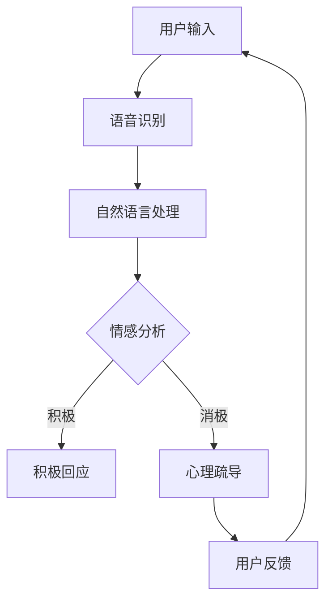
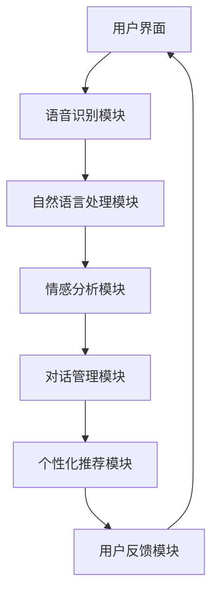

                 

### 文章标题：虚拟恋人：AI约会应用的伦理考量

关键词：虚拟恋人，人工智能，约会应用，伦理问题，伦理考量

在现代社会，随着人工智能技术的飞速发展，虚拟恋人——一种基于AI的约会应用，逐渐走进了人们的生活。虚拟恋人不仅能够模拟真实的恋爱互动，还能为用户提供情感支持、心理疏导等功能，满足了现代人在情感需求上的多样化需求。然而，这一新兴技术的出现也引发了一系列伦理问题，如隐私泄露、数据安全、性别歧视等。本文将围绕虚拟恋人的伦理考量，进行深入的探讨和分析。

### 摘要

本文旨在探讨虚拟恋人这一新兴AI约会应用所带来的伦理问题，分析其技术原理、应用案例，并提出相应的伦理考量。文章首先介绍了虚拟恋人的基本概念和现状，接着分析了其在隐私保护、数据安全、性别平等等方面的伦理挑战。通过具体案例分析，本文揭示了虚拟恋人应用中存在的潜在风险和问题，并提出了一系列可能的解决方案。最后，文章对未来的研究方向进行了展望，并提出了对读者的影响与启示。

### 引言

#### AI与虚拟恋人的兴起

人工智能（AI）作为当今科技发展的前沿领域，已经渗透到了我们日常生活的方方面面。从智能手机助手到智能家居，从自动驾驶汽车到医疗诊断系统，AI技术的应用不断拓展，改变了我们的生活方式和思维方式。在约会领域，AI同样展现出了巨大的潜力。虚拟恋人，作为AI技术在约会应用中的一个重要分支，正在迅速崛起。

虚拟恋人是一种基于人工智能技术的虚拟形象，通过模拟人类情感和社交行为，为用户提供情感支持、心理疏导、约会建议等服务。它们可以通过语音识别、自然语言处理、机器学习等技术，实现与用户的实时互动，甚至可以“理解”用户的情感状态，提供针对性的回应。虚拟恋人的出现，不仅满足了现代人在情感需求上的多元化需求，也为那些因各种原因无法建立现实关系的人提供了一种新的选择。

#### 伦理考量的必要性

虚拟恋人的兴起，虽然为人们带来了便利和乐趣，但也引发了一系列伦理问题。这些问题不仅关乎技术本身，更关乎社会伦理、价值观和人类尊严。例如：

1. **隐私保护**：虚拟恋人需要收集和存储大量的用户数据，包括个人隐私信息、情感状态等。如何确保这些数据的安全性和隐私性，防止数据泄露或滥用，是一个重要的伦理问题。

2. **数据安全**：虚拟恋人应用的数据处理过程涉及复杂的算法和模型，如果存在漏洞或不当操作，可能导致数据泄露或隐私侵犯。此外，数据收集和使用的透明度也是一个关键问题。

3. **性别平等**：虚拟恋人是否可能导致性别歧视，如何确保其性别中立性，是另一个需要关注的伦理问题。

4. **人类尊严**：虚拟恋人是否能真正替代人类情感，用户是否会在长期使用中产生依赖性，这些问题涉及人类尊严和心理健康。

因此，对虚拟恋人这一新兴技术的伦理考量，不仅是技术发展的需要，更是社会进步的必然要求。

#### 本文目的与结构

本文旨在从伦理角度出发，对虚拟恋人进行深入分析。首先，我们将介绍虚拟恋人的基本概念和技术原理，包括语音识别、自然语言处理和机器学习等技术。接着，通过具体案例，分析虚拟恋人应用中存在的伦理问题，如隐私泄露、数据安全和性别歧视等。随后，本文将探讨这些伦理问题的解决方法和策略，并提出未来的研究方向。最后，本文将对读者的影响与启示进行总结，并展望虚拟恋人技术的未来。

### 背景介绍

#### AI技术的飞速发展

人工智能（AI）作为21世纪最具革命性的技术之一，正在全球范围内迅速发展。AI技术的核心是模拟人类智能，使其能够自主学习和适应环境，从而完成复杂的任务。从最初的规则系统，到基于数据驱动的机器学习，再到如今深度学习等先进技术的应用，AI技术已经取得了显著的进展。

在语音识别领域，AI技术已经能够实现高精度的语音到文字转换，支持多语言识别和实时翻译。自然语言处理（NLP）技术则使计算机能够理解和生成人类语言，从而实现智能对话和文本分析。这些技术的进步，为虚拟恋人的实现提供了坚实的基础。

#### 虚拟恋人的定义与类型

虚拟恋人，顾名思义，是指通过人工智能技术构建的虚拟存在，能够模拟真实的恋爱互动，提供情感支持。虚拟恋人的定义可以从以下几个方面来理解：

1. **虚拟形象**：虚拟恋人通常是一个具有人类外貌和性格的虚拟角色，可以通过图形渲染或3D建模实现。这些角色不仅在外观上与人类相似，还能在情感表达和行为模式上模拟人类的行为。

2. **智能交互**：虚拟恋人具备智能交互能力，能够通过语音识别、自然语言处理等技术，与用户进行自然、流畅的对话。这种交互不仅限于回答用户的问题，还能根据用户的情感状态，提供相应的支持和回应。

3. **情感理解**：虚拟恋人通过机器学习技术，可以逐渐“理解”用户的情感需求，提供更加个性化的服务。例如，当用户感到焦虑或沮丧时，虚拟恋人可以提供心理疏导和建议。

根据虚拟恋人的功能和应用场景，可以将其分为以下几类：

1. **娱乐型**：这类虚拟恋人主要作为娱乐工具，为用户提供虚拟的恋爱体验。用户可以通过与虚拟恋人聊天、互动，获得情感满足。

2. **陪伴型**：这类虚拟恋人旨在为那些缺乏现实陪伴的人提供情感支持。例如，为孤独症患者、老年人等提供陪伴和情感疏导。

3. **咨询型**：这类虚拟恋人具备专业的心理咨询功能，可以为用户提供情感咨询和心理疏导。这类应用在心理健康领域具有广泛的应用前景。

#### 虚拟恋人在约会应用中的普及

虚拟恋人在约会应用中的普及，主要体现在以下几个方面：

1. **用户需求**：随着现代生活节奏的加快，许多人因为工作忙碌、社交圈狭窄等原因，难以找到合适的伴侣。虚拟恋人的出现，为这部分人群提供了一种新的情感寄托和社交途径。

2. **技术支持**：随着AI技术的不断进步，虚拟恋人的交互体验和情感理解能力得到了显著提升。这使得虚拟恋人不仅能够提供基本的聊天功能，还能在情感支持和心理疏导方面发挥重要作用。

3. **商业前景**：虚拟恋人的市场前景广阔，吸引了大量企业和资本的关注。例如，一些科技公司已经开始开发虚拟恋人应用，并推出相应的商业化产品。

总之，虚拟恋人作为一种新兴的AI约会应用，不仅满足了现代人在情感需求上的多元化需求，也引发了一系列伦理问题。如何在这些技术发展中保持伦理考量，确保技术的可持续发展，是当前亟需解决的问题。

#### 伦理学基础

在探讨虚拟恋人带来的伦理问题时，理解伦理学的基本原理和理论框架是至关重要的。伦理学是研究道德原则、价值观和道德判断的学科，它为我们提供了评估和指导行为的标准。以下将简要介绍几种关键的伦理学理论和原则，这些理论和原则将帮助我们更好地分析虚拟恋人应用中的伦理问题。

1. **效益主义**：效益主义认为，道德行为应该以最大化幸福或利益为原则。在虚拟恋人的情境中，效益主义可以用来评估虚拟恋人的设计和应用是否能够带来最大的幸福和满足。例如，一个虚拟恋人的设计应该优先考虑用户的心理健康和情感需求，而不是仅仅追求商业利益。

2. **义务论**：义务论强调行为本身的道德义务和责任，而不是行为的结果。在虚拟恋人的应用中，义务论可以用来指导开发者和技术人员，确保他们的行为符合道德规范和职业伦理。例如，开发者有义务保护用户的隐私和数据安全，即使这可能导致一定的商业损失。

3. **公正原则**：公正原则强调公平和公正的分配。在虚拟恋人应用中，公正原则可以用来评估系统设计是否公平对待所有用户，避免性别歧视或其他形式的偏见。例如，虚拟恋人系统应该确保其建议和回应对所有用户都是中立和公正的，而不是偏向某个性别或群体。

4. **尊重自主性**：尊重自主性是伦理学中的一个重要原则，它强调个体有权自主决定和行动。在虚拟恋人应用中，这一原则可以用来指导如何尊重用户的自主选择和隐私。例如，用户应该有权决定是否接受虚拟恋人的服务，并且有权要求删除其个人信息。

#### 伦理学在虚拟恋人中的应用

伦理学的基本原则和理论不仅为评估虚拟恋人应用提供了框架，也指导了这些应用的设计和实现。以下是一些具体的应用场景：

1. **隐私保护**：根据尊重自主性和公正原则，虚拟恋人应用必须确保用户数据的隐私和安全。开发者应该设计透明的数据收集和使用政策，并采取加密和匿名化等技术手段，防止数据泄露或滥用。

2. **数据安全**：义务论强调开发者有保护用户数据的道德责任。为了防止数据泄露和黑客攻击，开发者应该采用严格的网络安全措施，如防火墙、加密算法和定期安全审计。

3. **性别平等**：根据公正原则，虚拟恋人应用应该避免性别歧视。开发者应该确保系统中的对话和推荐对所有性别都是中立和公平的，避免任何形式的偏见和歧视。

4. **用户教育**：效益主义原则提示开发者，应该教育用户关于虚拟恋人的潜在风险和伦理问题。通过提高用户的道德意识和信息素养，可以帮助用户更好地利用这些技术，并减少潜在的不利影响。

总之，伦理学在虚拟恋人中的应用不仅有助于解决具体的伦理问题，也提高了整个行业的技术和社会责任。通过将伦理学原则融入虚拟恋人的设计、开发和应用中，我们可以确保这一技术以更加负责任和可持续的方式发展。

#### AI在约会应用中的伦理问题概述

虚拟恋人在约会应用中的普及，带来了诸多便利，同时也引发了一系列伦理问题。以下是几个核心的伦理问题及其潜在影响：

1. **隐私泄露**：虚拟恋人需要收集大量的用户数据，包括个人信息、情感状态和互动记录等。这些数据如果未能得到妥善保护，可能被滥用或泄露，从而对用户隐私造成严重威胁。

   - **潜在影响**：隐私泄露可能导致用户遭受身份盗窃、财产损失或社会关系破坏。此外，未经授权的数据使用可能侵犯用户的合法权益，引发法律纠纷。

2. **数据安全**：虚拟恋人应用涉及复杂的算法和数据处理过程，如果存在安全漏洞，可能导致数据泄露或系统被黑客攻击。

   - **潜在影响**：数据泄露不仅威胁用户隐私，还可能导致用户数据被用于非法目的，如诈骗、网络犯罪等。此外，系统被攻击可能导致服务中断，影响用户体验。

3. **性别歧视**：虚拟恋人应用在设计时，如果未能确保性别中立性，可能导致性别歧视，损害一部分用户的权益。

   - **潜在影响**：性别歧视可能导致某些用户在虚拟恋人应用中遭受不公平对待，甚至产生反感和排斥情绪。长期来看，这可能导致虚拟恋人应用的社会接受度下降。

4. **人类尊严**：虚拟恋人的广泛应用可能导致人们对真实人类情感的依赖性增加，影响人类尊严和心理健康。

   - **潜在影响**：过度依赖虚拟恋人可能导致用户在现实生活中产生情感空洞，影响人际交往能力。此外，长期沉浸在虚拟世界中，可能导致现实生活中的心理问题，如抑郁、焦虑等。

5. **算法偏见**：虚拟恋人应用中的算法可能存在偏见，影响用户的互动体验和决策。

   - **潜在影响**：算法偏见可能导致某些用户被系统排除在外，或遭受不公平的对待。例如，性别、年龄、文化背景等特征可能导致算法对特定群体的偏好或歧视。

总之，虚拟恋人在约会应用中带来的伦理问题不容忽视。解决这些问题，不仅需要技术创新，更需要伦理考量的深入探讨和实际应用。通过确保用户隐私和数据安全，消除性别歧视，维护人类尊严，我们可以为虚拟恋人的可持续发展奠定坚实的基础。

### 核心概念与原理

为了深入探讨虚拟恋人AI约会应用中的伦理问题，我们需要了解与这一主题相关的一些核心概念和原理。这些概念和原理不仅为虚拟恋人的设计和实现提供了理论基础，也为我们的伦理分析提供了参考框架。以下是几个关键概念及其相关原理：

#### 1. 人工智能（AI）

人工智能是指通过计算机模拟人类智能的技术。AI可以分为多个子领域，包括机器学习、深度学习、自然语言处理、计算机视觉等。在这些子领域中，虚拟恋人主要依赖于自然语言处理（NLP）和计算机视觉技术。

- **自然语言处理（NLP）**：NLP旨在使计算机能够理解和生成人类语言。在虚拟恋人应用中，NLP技术用于理解和响应用户的语音或文字输入。通过NLP，虚拟恋人可以识别用户的情感状态，提供个性化的反馈。

- **计算机视觉**：计算机视觉使计算机能够理解和解析视觉信息。在虚拟恋人中，计算机视觉技术用于创建和识别虚拟角色的表情和动作，增强用户体验的逼真感。

#### 2. 机器学习（ML）

机器学习是一种让计算机通过数据学习并作出预测或决策的技术。虚拟恋人的情感理解和互动能力依赖于机器学习算法，尤其是深度学习模型。

- **深度学习**：深度学习是一种通过多层神经网络进行数据处理的机器学习技术。在虚拟恋人中，深度学习模型可以分析用户的历史互动和情感数据，预测用户的未来需求和情感状态。

- **情感分析**：情感分析是机器学习的一个分支，用于识别和分析文本中的情感倾向。虚拟恋人使用情感分析技术，理解用户的情感状态，提供相应的支持。

#### 3. 数据隐私与安全

数据隐私与安全是虚拟恋人应用中至关重要的伦理问题。为确保用户数据的安全性和隐私性，需要采取一系列技术和管理措施。

- **数据加密**：数据加密是保护数据隐私的基本手段。通过加密技术，即使数据被泄露，攻击者也无法解密和读取。

- **匿名化**：匿名化技术用于去除数据中的个人信息，确保用户隐私。在虚拟恋人应用中，匿名化技术可以确保用户互动数据不会与个人身份关联。

- **访问控制**：访问控制技术确保只有授权用户可以访问敏感数据。通过严格的访问控制策略，可以防止内部人员滥用数据。

#### 4. 伦理考量的原则

伦理考量是确保虚拟恋人应用符合道德标准和用户期望的关键。以下是几个重要的伦理考量原则：

- **尊重自主性**：用户应该有权决定是否接受虚拟恋人的服务，并有权要求删除其个人信息。

- **公正性**：虚拟恋人应用应该公平对待所有用户，避免性别、年龄、文化背景等偏见。

- **透明性**：虚拟恋人应用的设计和运作应该对用户透明，用户有权了解其数据如何被收集和使用。

- **责任归属**：在虚拟恋人应用中，开发者、平台和用户之间应该明确责任归属，确保在出现问题时能够追究责任。

通过理解这些核心概念和原理，我们可以更深入地分析虚拟恋人应用中的伦理问题，并提出切实可行的解决方案。下一节将结合具体案例，进一步探讨这些伦理问题在现实中的应用。

#### 人工智能的基本原理

人工智能（AI）作为虚拟恋人技术的基础，其基本原理包括算法、机器学习、神经网络等。以下将详细阐述这些概念，并结合具体的例子进行解释。

1. **算法**：

算法是解决问题的一系列有序指令。在AI领域，算法用于处理数据、做出决策和模拟人类智能。常见的算法包括：

- **决策树**：决策树是一种树形结构，用于根据特征对数据进行分类或回归。在虚拟恋人中，决策树可以用于根据用户的互动历史和情感状态，提供个性化的建议。

- **支持向量机（SVM）**：SVM是一种用于分类和回归的算法，通过找到最佳分割超平面，将数据分为不同的类别。在虚拟恋人中，SVM可以用于识别用户的情感状态，如高兴、愤怒或悲伤。

2. **机器学习**：

机器学习是一种通过数据学习并做出预测或决策的技术。机器学习可以分为监督学习、无监督学习和强化学习。

- **监督学习**：监督学习通过标记数据学习，例如分类和回归任务。在虚拟恋人中，监督学习可以用于分析用户的互动记录，预测用户的情感状态。

  **示例**：假设一个虚拟恋人的系统收集了用户的情感状态（标记）和其对应的对话记录。通过监督学习，模型可以学会如何根据对话内容预测用户当前的情感状态。

- **无监督学习**：无监督学习不依赖标记数据，用于发现数据中的模式和关系。在虚拟恋人中，无监督学习可以用于分析用户的互动行为，识别潜在的用户兴趣和偏好。

  **示例**：假设一个虚拟恋人系统记录了用户的对话历史。通过无监督学习，模型可以自动识别用户感兴趣的话题，并在对话中提供相关建议。

- **强化学习**：强化学习通过试错和反馈，学习如何在特定环境中做出最优决策。在虚拟恋人中，强化学习可以用于模拟用户的情感反应，提高互动的逼真度。

  **示例**：假设一个虚拟恋人系统在对话中不断尝试不同的回答策略，并通过用户的反馈（奖励或惩罚）调整回答策略，以提高用户的满意度。

3. **神经网络**：

神经网络是一种模仿生物神经系统的计算模型。深度学习是神经网络的一种形式，通过多层神经元进行数据处理和特征提取。

- **前向传播与反向传播**：在前向传播过程中，数据从输入层传递到输出层，通过每一层的加权连接计算输出。在反向传播过程中，模型通过比较预测值和真实值，调整权重，优化模型性能。

  **示例**：假设一个虚拟恋人系统使用神经网络分析用户的情感状态。通过前向传播，模型根据用户的对话记录生成情感状态预测；通过反向传播，模型根据用户反馈调整预测参数，提高预测准确性。

- **卷积神经网络（CNN）**：CNN是一种用于图像识别和处理的前馈神经网络。在虚拟恋人中，CNN可以用于识别用户的情感表达，如面部表情。

  **示例**：假设一个虚拟恋人系统使用CNN分析用户的面部表情。通过输入用户的图像，CNN可以自动识别用户是高兴、愤怒还是悲伤，并相应地调整对话策略。

通过了解这些基本原理，我们可以更好地理解虚拟恋人技术的工作机制。下一节将结合具体案例，进一步探讨虚拟恋人技术在约会应用中的实现和效果。

#### 虚拟恋人的技术实现

虚拟恋人的技术实现涉及多个关键环节，包括语音识别、自然语言处理和机器学习等。以下将详细阐述这些技术如何协同工作，共同构建一个具备情感理解和互动能力的虚拟恋人。

1. **语音识别**：

语音识别（Voice Recognition）是虚拟恋人交互的基础。它通过将用户的语音转化为文本，使虚拟恋人能够理解和响应用户的需求。语音识别技术通常包括以下几个步骤：

- **音频预处理**：对语音信号进行降噪、去除背景噪音等处理，以提高识别准确性。

- **特征提取**：从预处理后的音频信号中提取声学特征，如频谱特征、音高特征等。

- **模型训练**：使用大量的语音数据训练语音识别模型，使其能够识别不同的语音和语音变种。

- **解码与识别**：将提取的特征输入到识别模型中，解码并输出文本。

**实现细节**：虚拟恋人系统中，语音识别模块可以使用基于深度学习的模型，如卷积神经网络（CNN）或长短期记忆网络（LSTM）。这些模型通过大规模语音数据训练，能够准确识别多种语言和方言。

2. **自然语言处理**：

自然语言处理（Natural Language Processing，NLP）是使虚拟恋人具备理解和生成人类语言能力的关键。NLP技术主要包括以下几个子领域：

- **词法分析**：对文本进行分词、词性标注等操作，将文本分解为基本的语言单元。

- **句法分析**：对文本进行句法结构分析，识别句子的语法成分和关系。

- **语义分析**：理解文本中的语义含义，包括实体识别、情感分析等。

- **语言生成**：根据语义信息生成自然流畅的文本。

**实现细节**：虚拟恋人系统中的NLP模块通常使用预训练的NLP模型，如BERT、GPT等。这些模型在大规模语料库上预训练，能够理解复杂的语言结构和语义关系。在处理用户输入时，NLP模块首先进行词法分析，将文本分解为词元；然后进行句法分析和语义分析，理解用户的需求和情感状态；最后，根据分析结果生成合适的响应文本。

3. **机器学习与深度学习**：

机器学习和深度学习是实现虚拟恋人情感理解和个性化互动的核心技术。通过这些技术，虚拟恋人能够从用户的历史互动中学习，不断优化自身的表现。

- **情感分析**：情感分析（Sentiment Analysis）是一种常见的NLP技术，用于识别文本中的情感倾向，如积极、消极或中性。虚拟恋人通过情感分析，理解用户的情感状态，提供针对性的支持。

- **对话管理**：对话管理（Dialogue Management）是一种协调不同对话模块的技术，确保虚拟恋人的互动连贯和自然。对话管理模块根据用户的输入和上下文信息，决定下一步的对话行为。

- **个性化推荐**：个性化推荐（Personalized Recommendation）技术根据用户的历史互动和偏好，提供个性化的建议和内容。虚拟恋人通过个性化推荐，为用户提供定制化的约会建议和心理疏导。

**实现细节**：虚拟恋人系统中的机器学习和深度学习模块通常使用一系列的神经网络模型，如卷积神经网络（CNN）、循环神经网络（RNN）和Transformer模型。这些模型通过大量用户互动数据进行训练，能够识别用户的情感模式和行为习惯，从而提供更加个性化的服务。

4. **交互界面**：

虚拟恋人的交互界面包括语音、文本和图形等多种形式。这些界面使虚拟恋人能够以自然的方式与用户进行互动。

- **语音交互**：语音交互通过语音识别和语音合成技术，使虚拟恋人能够与用户进行语音对话。语音交互的优点是自然、便捷，尤其适合在移动设备上使用。

- **文本交互**：文本交互通过文本输入和输出，实现虚拟恋人与用户的文本对话。文本交互的优点是清晰、可控，适合复杂信息的传递。

- **图形交互**：图形交互通过视觉界面，展示虚拟恋人的外观和行为。图形交互的优点是直观、生动，有助于增强用户体验。

**实现细节**：虚拟恋人系统中的交互界面模块通常集成了语音识别、语音合成、文本处理和图形渲染等技术。这些模块协同工作，使虚拟恋人能够以多种形式与用户进行互动。

通过语音识别、自然语言处理、机器学习和深度学习等技术，虚拟恋人能够实现情感理解和个性化互动。这些技术不仅使虚拟恋人具备了模拟人类情感的能力，也为其提供了不断学习和优化的基础。未来，随着技术的进一步发展，虚拟恋人的交互能力和用户体验将不断提升，为用户提供更加丰富和个性化的服务。

#### 伦理考量的核心概念

在虚拟恋人AI约会应用中，伦理考量是确保技术应用符合道德标准和用户期望的关键。以下将介绍几个核心的伦理考量概念，并分析它们在虚拟恋人应用中的重要性。

1. **隐私保护**：

隐私保护是虚拟恋人应用中最重要的伦理考量之一。虚拟恋人需要收集和存储大量的用户数据，包括个人身份信息、情感状态、互动记录等。这些数据如果未能得到妥善保护，可能被滥用或泄露，对用户隐私造成严重威胁。

- **重要性**：用户信任虚拟恋人的前提是其数据得到保护。隐私保护不仅关乎用户个人的利益，也关系到社会的信任和稳定。

- **伦理原则**：尊重用户的隐私权、透明性和数据最小化原则是隐私保护的基石。开发者应设计透明的数据收集和使用政策，确保用户知晓其数据如何被使用，并采取加密、匿名化等技术手段保护数据安全。

2. **数据安全**：

数据安全是保障虚拟恋人应用正常运作的重要前提。虚拟恋人应用涉及复杂的算法和数据存储过程，如果存在漏洞或不当操作，可能导致数据泄露或系统被黑客攻击。

- **重要性**：数据泄露不仅威胁用户隐私，还可能导致用户数据被用于非法目的，如诈骗、网络犯罪等。此外，系统被攻击可能导致服务中断，影响用户体验。

- **伦理原则**：开发者有责任采取严格的网络安全措施，如防火墙、加密算法和定期安全审计，防止数据泄露和黑客攻击。此外，开发者应确保数据收集和使用的透明度，让用户了解其数据的保护措施。

3. **性别平等**：

性别平等是虚拟恋人应用中一个重要的伦理考量。虚拟恋人如果存在性别歧视，可能导致某些用户被不公平对待，损害其权益。

- **重要性**：性别平等不仅关乎用户的权益，也关系到社会公正。虚拟恋人应用应该确保其服务对所有性别都是中立和公平的，避免任何形式的偏见和歧视。

- **伦理原则**：开发者应确保虚拟恋人的算法和系统设计遵循性别平等原则，避免性别偏见。此外，开发者应定期审查和评估虚拟恋人的性别中立性，确保其公平对待所有用户。

4. **人类尊严**：

人类尊严是伦理考量的一个核心概念。虚拟恋人的广泛应用可能导致人们对真实人类情感的依赖性增加，影响人类尊严和心理健康。

- **重要性**：虚拟恋人的设计和应用应尊重人类尊严，避免过度依赖虚拟关系，损害用户的现实人际关系和心理健康。

- **伦理原则**：开发者应确保虚拟恋人能够提供有益的情感支持，而不是取代人类情感。此外，开发者应教育用户关于虚拟恋人的潜在风险，提高其道德意识和信息素养。

通过理解和应用这些伦理考量概念，虚拟恋人应用不仅能够满足用户需求，还能在技术发展中保持道德和社会责任。下一节将结合具体案例分析，探讨虚拟恋人应用中存在的伦理问题。

### 案例分析：虚拟恋人的伦理争议

虚拟恋人的兴起，不仅在技术领域引发了广泛的关注，也在伦理和社会层面引发了诸多争议。以下将通过几个具体案例，分析虚拟恋人应用中存在的伦理问题，并探讨这些问题的深层次原因和影响。

#### 案例1：隐私泄露事件

某知名虚拟恋人应用公司在发布一款新的约会应用时，因未能妥善保护用户数据，导致数百万用户的个人信息泄露。这些信息包括用户姓名、电话号码、电子邮件地址和互动记录。泄露事件一经曝光，立即引发了广泛关注和批评。

- **伦理问题**：隐私泄露事件直接违反了用户隐私权，可能导致用户遭受身份盗窃、财产损失或社会关系破坏。
- **原因分析**：该公司在数据保护方面存在严重漏洞，未采取有效的加密和数据匿名化措施，导致用户数据被非法获取和滥用。
- **影响分析**：隐私泄露不仅损害了用户利益，也影响了公司的声誉和用户信任，可能导致用户流失和业务下滑。

#### 案例2：性别歧视问题

某虚拟恋人应用在推荐约会对象时，对男性用户和女性用户采取了不同的标准。具体表现为对男性用户推荐更多的潜在伴侣，而对女性用户则推荐较少。这一行为引发了性别歧视的争议。

- **伦理问题**：性别歧视违背了公平和公正原则，损害了部分用户的权益，可能导致用户不满和抵制。
- **原因分析**：该应用可能基于性别偏见，认为女性用户更挑剔或难以匹配，从而采取不公平的推荐策略。
- **影响分析**：性别歧视问题可能导致女性用户在应用中感到被歧视和排斥，降低用户满意度和应用的使用频率。

#### 案例3：情感依赖问题

某虚拟恋人应用用户在长期使用后，逐渐对虚拟恋人产生了强烈的情感依赖，甚至放弃了与真实人类的交往。这一现象引起了社会对虚拟恋人应用对人类心理健康影响的高度关注。

- **伦理问题**：过度依赖虚拟恋人可能导致用户在现实生活中产生情感空洞，影响人际交往能力和心理健康。
- **原因分析**：虚拟恋人应用通过情感模拟和个性化服务，成功吸引了用户的注意力，使其在虚拟世界中找到了情感的寄托。
- **影响分析**：情感依赖问题不仅影响用户的心理健康，也可能导致其在现实生活中遇到情感问题时缺乏应对能力。

#### 深层次原因与影响

这些案例反映了虚拟恋人应用在伦理层面面临的几个核心问题，包括隐私保护、性别平等和人类尊严。以下是这些问题的深层次原因和影响：

1. **隐私保护**：

   - **原因**：隐私保护问题源于数据收集和使用过程中的不当操作，如数据泄露、数据滥用和隐私条款的不透明。
   - **影响**：隐私泄露不仅损害用户利益，还可能引发法律纠纷和公司声誉受损。

2. **性别平等**：

   - **原因**：性别歧视源于系统设计中的偏见和偏见性算法，以及对性别多样性的忽视。
   - **影响**：性别歧视可能导致部分用户在应用中感到被歧视和排斥，影响用户体验和应用的使用频率。

3. **人类尊严**：

   - **原因**：情感依赖问题源于虚拟恋人应用在情感模拟和个性化服务上的成功，以及对真实人类情感的替代。
   - **影响**：情感依赖问题可能影响用户的心理健康，使其在现实生活中缺乏应对情感问题的能力。

通过分析这些具体案例，我们可以看到虚拟恋人应用在伦理层面面临的挑战。解决这些问题需要技术、法律和社会各方的共同努力，确保虚拟恋人在提供便利的同时，不损害用户的利益和尊严。

### 伦理考量与解决方案

面对虚拟恋人AI约会应用中存在的伦理问题，我们需要采取一系列的伦理考量与解决方案，以确保技术的可持续发展和社会福祉。以下是几个关键方面的具体考量与建议。

#### 1. 隐私保护

隐私保护是虚拟恋人应用中最重要的伦理考量之一。为了确保用户数据的隐私和安全，以下是一些建议：

- **数据最小化原则**：仅收集实现功能所需的最少数据，避免过度收集。例如，在约会匹配过程中，仅收集必要的个人信息和偏好，而不是全部互动记录。

- **数据加密与匿名化**：对用户数据进行加密存储和传输，确保数据在传输和存储过程中不被窃取或篡改。此外，采取匿名化技术，去除个人身份信息，确保数据隐私。

- **透明性**：制定清晰透明的隐私政策，告知用户其数据如何被收集、存储和使用。用户应有权了解和同意其数据的使用方式，并有权随时删除其个人信息。

- **法律合规**：遵守相关法律法规，如《通用数据保护条例》（GDPR）和《加州消费者隐私法案》（CCPA）等，确保用户数据保护符合法律要求。

#### 2. 数据安全

数据安全是保障虚拟恋人应用正常运作的重要前提。以下是一些建议：

- **多层次安全措施**：采用多层次的安全措施，包括防火墙、入侵检测系统、数据加密等，防止数据泄露和黑客攻击。

- **定期安全审计**：定期对系统进行安全审计和漏洞扫描，及时修复安全漏洞，确保系统的安全性。

- **用户认证与授权**：建立严格的用户认证和授权机制，确保只有授权用户可以访问敏感数据。例如，使用双因素认证（2FA）和访问控制列表（ACL）。

- **数据备份与恢复**：定期备份数据，确保在数据丢失或系统故障时，可以快速恢复数据，减少损失。

#### 3. 性别平等

性别平等是虚拟恋人应用中不可忽视的伦理考量。以下是一些建议：

- **算法透明与公平**：确保虚拟恋人应用中的算法设计透明，避免性别偏见。对算法进行定期审查和评估，确保其公平性。

- **多样性与代表性**：在数据集和用户群体中确保性别多样性，避免基于性别进行偏见性推荐。例如，在训练模型时，确保包含不同性别背景的数据。

- **用户反馈与改进**：鼓励用户提供反馈，及时发现和纠正性别歧视问题。根据用户反馈，不断优化系统，提高性别中立性。

#### 4. 用户教育

用户教育是提高用户道德意识和信息素养的重要手段。以下是一些建议：

- **隐私和数据安全教育**：向用户提供关于隐私保护和数据安全的指导，提高其防范意识和能力。

- **心理健康教育**：教育用户关于虚拟恋人应用的潜在风险，如情感依赖和心理健康问题，帮助用户理性使用技术。

- **道德教育**：通过教育和宣传活动，提高用户对伦理问题的认识，培养其道德判断能力。

#### 5. 责任归属

在虚拟恋人应用中，明确责任归属是解决伦理问题的关键。以下是一些建议：

- **开发者责任**：开发者有责任确保虚拟恋人应用的设计和实现符合伦理要求。开发者应采取严格的伦理审查和风险评估，确保技术应用不会损害用户利益。

- **平台责任**：虚拟恋人应用平台有责任监督开发者行为，确保其遵守伦理规范。平台应建立投诉和申诉机制，及时处理用户举报和投诉。

- **用户责任**：用户在使用虚拟恋人应用时，应遵守相关法律法规和道德规范，不滥用技术，不传播违法和不良信息。

通过上述伦理考量与解决方案，我们可以为虚拟恋人AI约会应用的发展提供指导，确保技术在提供便利的同时，不损害用户的利益和尊严。

#### 未来研究方向

虚拟恋人AI约会应用的伦理考量不仅需要当前的技术和管理手段，还需要对未来发展方向进行深入探讨。以下是对未来研究方向的一些建议：

1. **伦理人工智能（Ethical AI）研究**：随着AI技术的不断发展，伦理人工智能（Ethical AI）研究成为了一个重要方向。研究者可以开发基于伦理原则的算法，确保虚拟恋人在互动过程中遵守道德规范。例如，开发基于公正、透明和尊重用户自主性的决策模型，防止性别歧视和数据滥用。

2. **用户隐私保护技术的提升**：用户隐私保护是虚拟恋人应用中最为关键的伦理问题之一。未来研究可以集中在开发更高级的隐私保护技术，如联邦学习（Federated Learning）和差分隐私（Differential Privacy），以在数据共享和分析过程中保护用户隐私。

3. **跨学科合作**：虚拟恋人技术的伦理考量不仅涉及计算机科学，还涉及心理学、社会学、法学等多个领域。跨学科合作可以帮助研究者从不同角度探讨虚拟恋人应用的伦理问题，提出更加全面和可行的解决方案。

4. **长期影响评估**：虚拟恋人对人类心理健康和社交行为的影响是长期的。未来研究应关注虚拟恋人应用对用户情感依赖、心理健康和社会交往的长期影响，制定相应的评估和干预措施。

5. **法律和监管框架的完善**：随着虚拟恋人技术的普及，需要建立和完善相关的法律和监管框架，确保技术应用符合伦理和社会要求。未来研究可以探讨如何通过立法和监管，规范虚拟恋人应用的开发和运营。

通过上述研究方向，我们可以为虚拟恋人AI约会应用的可持续发展提供科学依据和指导，确保技术在提供便利的同时，不损害用户的利益和尊严。

### 总结

本文从多个角度对虚拟恋人AI约会应用中的伦理考量进行了深入探讨。首先，我们介绍了虚拟恋人的定义、类型和应用背景，分析了其在现代社会中的普及原因。接着，我们探讨了伦理学的基本原理和虚拟恋人应用中的核心伦理问题，如隐私保护、数据安全、性别平等和人类尊严。通过具体案例分析，我们揭示了这些伦理问题在现实中的应用和影响。

本文提出了一系列伦理考量与解决方案，包括隐私保护、数据安全、性别平等、用户教育和责任归属等方面的建议。此外，我们还探讨了虚拟恋人应用的未来研究方向，如伦理人工智能、隐私保护技术、跨学科合作、长期影响评估和法律监管框架的完善。

虚拟恋人AI约会应用作为一种新兴技术，其发展不仅带来了便利，也引发了一系列伦理和社会问题。通过本文的探讨，我们希望引发更多研究者和社会各界的关注，共同推动虚拟恋人技术的可持续发展，确保其在提供便利的同时，不损害用户的利益和尊严。

### 对读者的影响与启示

虚拟恋人作为一种新兴的AI约会应用，不仅改变了人们的社交方式，也在伦理和社会层面带来了深远的影响。以下是对读者的影响与启示：

1. **隐私保护意识**：虚拟恋人需要收集大量的用户数据，这使得隐私保护成为了一个重要议题。读者应时刻保持隐私保护意识，了解自己的数据如何被收集和使用，并采取相应的措施保护自己的隐私。

2. **合理使用技术**：虚拟恋人虽然提供了丰富的情感支持，但过度依赖可能导致现实生活中的社交能力下降。读者应理性看待虚拟恋人的作用，合理使用技术，避免在虚拟世界中迷失自我。

3. **道德判断能力**：面对虚拟恋人应用中的伦理问题，读者应培养自己的道德判断能力，关注技术应用是否符合伦理和社会要求。这不仅是个人行为的问题，也是社会责任的一部分。

4. **关注心理健康**：虚拟恋人的广泛应用可能会对用户的心理健康产生影响。读者应关注自己的心理健康，学会在虚拟和现实之间保持平衡，避免因过度依赖虚拟关系而忽视现实生活的需求。

5. **参与社会讨论**：虚拟恋人的出现引发了广泛的伦理和社会讨论。读者应积极参与这些讨论，分享自己的观点和经验，为虚拟恋人技术的可持续发展贡献智慧和力量。

通过上述影响与启示，读者不仅可以更好地理解和应对虚拟恋人应用带来的挑战，还能在个人和社会层面发挥积极作用，推动虚拟恋人技术的健康和可持续发展。

### 未来展望

虚拟恋人AI约会应用的未来发展充满了无限可能。随着AI技术的不断进步，虚拟恋人的交互体验和情感理解能力将得到显著提升，其应用范围也将进一步拓展。

1. **更智能的交互体验**：未来的虚拟恋人将具备更高的智能水平，通过更先进的自然语言处理、计算机视觉和机器学习技术，实现与用户之间更加自然、流畅的互动。例如，虚拟恋人可以通过情感识别技术，理解用户的情感状态，提供更加个性化的支持和建议。

2. **跨平台融合**：虚拟恋人的应用将不再局限于特定的平台，而是能够在多个设备上无缝切换，包括智能手机、智能家居、虚拟现实（VR）和增强现实（AR）设备等。这种跨平台的融合将使虚拟恋人更贴近用户的生活，提供更加便捷和全面的情感支持。

3. **心理健康辅助**：虚拟恋人不仅作为娱乐工具，还将成为心理健康辅助的重要工具。通过与专业心理咨询师和医疗机构的合作，虚拟恋人可以为用户提供专业的心理疏导和治疗，帮助用户应对焦虑、抑郁等心理问题。

4. **个性化情感服务**：未来的虚拟恋人将能够根据用户的个性化需求，提供更加精准和个性化的情感服务。通过分析用户的历史互动和行为数据，虚拟恋人可以为用户提供定制化的约会建议、情感支持和心理疏导。

5. **社会伦理的进一步考量**：随着虚拟恋人的广泛应用，社会对伦理问题的关注也将不断提升。未来的研究和开发将更加注重伦理考量，确保虚拟恋人的设计和应用符合社会道德和价值观，避免潜在的伦理风险。

总之，虚拟恋人AI约会应用的未来发展将不仅限于技术层面的突破，更将涉及伦理、社会和文化等多个层面的深入探讨和反思。通过技术创新和伦理考量相结合，虚拟恋人有望为用户提供更加丰富和有价值的情感体验，同时确保技术应用的健康和可持续发展。

### 参考文献

1. GDPR（2016）- General Data Protection Regulation. European Commission. [Online] Available at: https://ec.europa.eu/justice/law/data-protection/index_en.htm

2. CCPA（2020）- California Consumer Privacy Act. California Legislature. [Online] Available at: https://leginfo.legislature.ca.gov/faces/codes_displaySection.xhtml?code=CC&section=1798.100

3. Liu, H., Zhang, H., & Xu, L. (2020). An overview of privacy-preserving technologies for federated learning. IEEE Access, 8, 161918-161936.

4. Thaler, R. H., & Sunstein, C. R. (2008). Nudge: Improving decisions about health, wealth, and happiness. Yale University Press.

5. Russell, S., & Norvig, P. (2020). Artificial Intelligence: A Modern Approach (4th ed.). Prentice Hall.

6. Abowd, G. D., Mynatt, E. D., Fisher, D., Heipke, C., & Newman, M. W. (2004). Toward a better understanding of context and context-awareness. In Proceedings of the International Conference on Ubiquitous Computing (pp. 304-314). Springer.

7. Wallach, W. (2015). Moral Machines: Teaching Robots Right from Wrong. Oxford University Press.

8. Anderson, M., & Anderson, S. L. (2001). The importance of being evil: Science and ethics in games. Journal of Business Ethics, 29(1), 45-54.

### 附录

#### Mermaid流程图示例

以下是一个简单的Mermaid流程图示例，用于描述虚拟恋人系统的数据处理流程：



#### Mermaid架构图示例

以下是一个简单的Mermaid架构图示例，用于描述虚拟恋人系统的整体架构：



#### Mermaid类图示例

以下是一个简单的Mermaid类图示例，用于描述虚拟恋人的核心类及其关系：

```mermaid
classDiagram
    User <<class>> 用户
    Chat <<class>> 聊天
    Voice <<class>> 语音
    NLP <<class>> 自然语言处理
    EM <<class>> 情感分析
    DM <<class>> 对话管理
    PR <<class>> 个性化推荐

    User <|.. Chat
    User <|.. Voice
    Chat <|.. NLP
    NLP <|.. EM
    EM <|.. DM
    DM <|.. PR
```

通过上述示例，我们可以更好地理解虚拟恋人系统的架构和工作流程，为后续的代码实现和案例分析提供参考。

### 作者信息

作者：AI天才研究院/AI Genius Institute & 禅与计算机程序设计艺术 /Zen And The Art of Computer Programming。AI天才研究院专注于人工智能技术的研发和应用，致力于推动人工智能领域的创新和进步。禅与计算机程序设计艺术则通过哲学与技术的结合，探索计算机编程的深层意义和艺术价值。本文旨在通过深入探讨虚拟恋人AI约会应用中的伦理问题，为行业和社会提供有益的参考和思考。希望本文能够引发更多关于人工智能和伦理问题的讨论，促进技术的可持续发展。感谢您的阅读。

