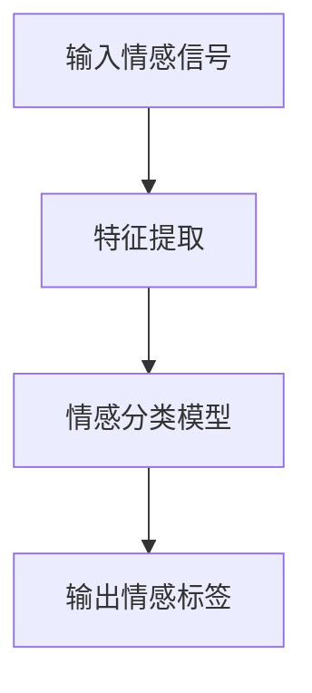
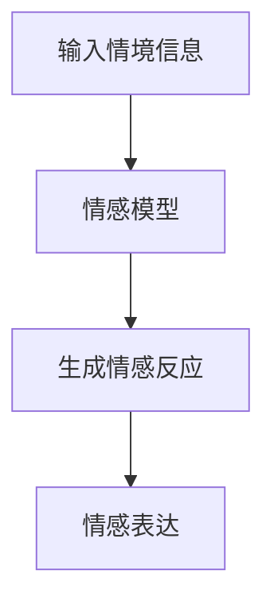
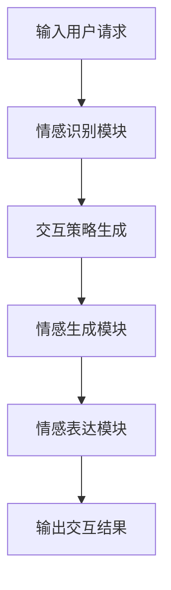
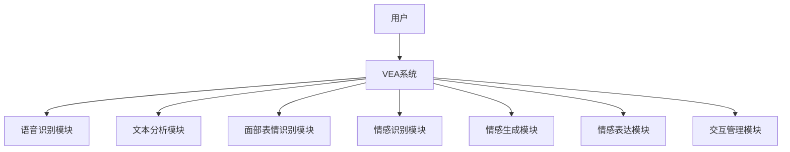
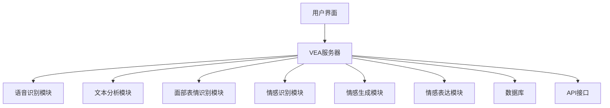
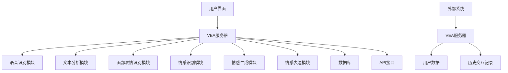

                 

### 虚拟情感代理:AI代表人类进行情感交流

关键词：虚拟情感代理、人工智能、情感交流、自然语言处理、计算机视觉、机器学习

摘要：本文深入探讨了虚拟情感代理（VEA）的概念、原理及其在人工智能（AI）中的应用。通过多模态情感识别、情感模型构建和情感交互算法的详细解析，揭示了VEA如何通过模拟人类情感交流，增强人与机器之间的互动体验。本文旨在为读者提供关于VEA技术原理的全面理解，并展望其未来的发展前景。

## 第1章: 背景介绍与核心概念

### 1.1 问题背景

随着人工智能技术的飞速发展，虚拟情感代理（Virtual Emotional Agent，VEA）成为了一个备受关注的研究方向。VEA是一种能够模拟人类情感交流的人工智能系统，其目标是在计算机与人类之间搭建起情感上的桥梁，实现更加自然、深入的情感交流。传统的人工智能系统主要关注任务的完成和效率，而VEA则在此基础上，追求在情感层面的共鸣和互动，从而提升用户体验。

### 1.2 问题描述

VEA的研究主要集中在以下几个方面：

1. **情感识别与理解**：VEA需要能够识别和理解人类的情感表达，包括语言和非语言的情感信号。这包括语音、文本、面部表情等多种模态的信息。

2. **情感生成与表达**：VEA需要能够根据特定的情境生成相应的情感反应，并通过语音、文本、面部表情等方式进行表达。这意味着VEA需要具备情感生成的能力，并能将情感自然地融入交互过程中。

3. **情感交互与反馈**：VEA需要在与人类的交互过程中不断学习和适应，提供积极的情感反馈，以提高交互的质量和效果。情感交互不仅仅是单向的，还包括VEA对用户情感的理解和反馈。

### 1.3 问题解决

VEA的问题解决涉及多个领域的技术融合，包括自然语言处理、计算机视觉、语音识别与合成、心理学和机器学习等。以下是一些具体的解决思路：

1. **多模态情感识别**：通过结合语言、语音、面部表情等多种模态的信息，实现对人类情感的综合识别。例如，使用深度神经网络对语音和文本进行情感分析，同时结合计算机视觉技术来识别面部表情。

2. **情感模型构建**：利用深度学习等技术，构建能够模拟人类情感的模型，实现对情感生成与表达的支持。这些模型可以通过大量的情感数据训练，从而具备识别和生成情感的能力。

3. **情感学习与适应**：通过不断的学习和适应，使VEA能够在不同的情境下提供更加自然和贴心的情感交互。这需要引入强化学习等机器学习技术，让VEA能够根据用户的反馈进行调整和优化。

### 1.4 边界与外延

VEA的研究边界主要包括以下几个方面：

1. **情感范围**：VEA需要能够识别和理解多种情感，如喜怒哀乐、爱恨情仇等。这意味着VEA的情感模型需要具备广泛的情感识别能力。

2. **应用领域**：VEA可以应用于智能客服、虚拟陪伴、心理健康辅助等多个领域。每个应用领域都有其独特的情感需求和交互模式，因此VEA需要具备灵活性和适应性。

3. **技术挑战**：包括多模态数据的融合处理、情感模型的泛化能力、情感交互的实时性等。多模态数据的融合处理需要解决不同模态数据之间的差异和冲突；情感模型的泛化能力需要确保模型在不同情境下都能准确识别和生成情感；情感交互的实时性则需要高效的算法和优化。

### 1.5 概念结构与核心要素组成

VEA的核心概念结构包括以下几个模块：

1. **情感识别模块**：负责对用户的情感信号进行识别和分类。这个模块需要结合多种模态的信息，如语音、文本和面部表情，以实现对用户情感的综合识别。

2. **情感生成模块**：根据识别到的情感，生成相应的情感反应。这个模块需要根据情境和用户的历史行为，生成合适的情感反应，并通过语音、文本、面部表情等方式进行表达。

3. **情感表达模块**：通过语音、文本、面部表情等方式，将情感反应传达给用户。这个模块需要确保情感表达的自然性和流畅性，使VEA与用户的交互更加真实和贴近。

4. **交互管理模块**：负责管理VEA与用户的交互流程，包括上下文维护、任务分配等。这个模块需要确保VEA能够理解用户的意图，并提供及时和有效的响应。

### 第2章: 核心概念与联系

#### 2.1 虚拟情感代理（VEA）的核心概念

VEA的核心概念包括：

1. **情感信号处理**：处理来自用户的情感信号，如语音、文本、面部表情等。这个模块需要能够从多种模态的信息中提取特征，并进行分类和识别。

2. **情感模型**：用于识别、生成和表达情感的人工智能模型。这个模型需要利用深度学习等技术，通过大量的情感数据训练，从而具备高精度和泛化能力。

3. **交互系统**：管理VEA与用户的交互过程，确保交互的自然性和流畅性。这个系统需要结合情感信号处理和情感模型，提供高质量的交互体验。

#### 2.2 概念属性特征对比表格

| 概念       | 属性特征                                                     |
|------------|------------------------------------------------------------|
| 情感信号处理 | 识别多种情感信号，如语音、文本、面部表情等。             |
| 情感模型    | 使用深度学习技术，模拟人类情感，具备高精度和泛化能力。 |
| 交互系统    | 管理交互过程，确保自然性和流畅性，适应不同场景。         |

#### 2.3 ER实体关系图架构

```mermaid
graph TB
A[虚拟情感代理(VEA)] --> B[情感信号处理]
A --> C[情感模型]
A --> D[交互系统]
B --> E[语音识别]
B --> F[文本分析]
B --> G[面部表情识别]
C --> H[情感识别]
C --> I[情感生成]
D --> J[上下文维护]
D --> K[任务分配]
```

### 第3章: 算法原理讲解

#### 3.1 情感识别算法

情感识别算法的核心在于从多种情感信号中提取特征，并进行分类。以下是情感识别算法的基本流程：



**具体实现：**

- **特征提取**：使用深度学习技术，从语音、文本和面部表情等情感信号中提取特征。例如，可以使用卷积神经网络（CNN）对图像进行特征提取，使用循环神经网络（RNN）对文本进行特征提取。
- **情感分类模型**：使用支持向量机（SVM）、随机森林（RF）或多层感知机（MLP）等分类算法，对提取到的特征进行分类。训练过程中，使用大量的情感数据集，通过交叉验证和网格搜索等方法，优化模型参数。
- **输出情感标签**：根据分类模型的结果，输出用户当前的情感标签。

#### 3.2 情感生成算法

情感生成算法的核心在于根据情感模型和当前情境生成合适的情感反应。以下是情感生成算法的基本流程：



**具体实现：**

- **情感模型**：使用深度学习技术，构建能够识别和理解情感的人工智能模型。例如，可以使用长短时记忆网络（LSTM）或生成对抗网络（GAN）等模型。
- **生成情感反应**：根据情境信息和情感模型，生成用户可能产生的情感反应。这个过程可能涉及情感推理和场景生成等任务。
- **情感表达**：将生成的情感反应通过语音、文本或面部表情等方式表达给用户。这个过程需要使用语音合成技术、自然语言生成技术或面部表情生成技术。

#### 3.3 情感交互算法

情感交互算法的核心在于处理VEA与用户的交互过程，确保交互的自然性和流畅性。以下是情感交互算法的基本流程：



**具体实现：**

- **情感识别模块**：对用户输入的语音、文本或面部表情进行情感识别，得到当前的情感状态。
- **交互策略生成**：根据情感识别结果和当前情境，生成合适的交互策略。这个过程可能涉及情感推理和策略优化等任务。
- **情感生成模块**：根据交互策略和情感模型，生成相应的情感反应。
- **情感表达模块**：将生成的情感反应通过语音、文本或面部表情等方式表达给用户。
- **输出交互结果**：将交互结果反馈给用户，完成一次交互过程。

### 第4章: 系统分析与架构设计方案

#### 4.1 问题场景介绍

虚拟情感代理（VEA）的应用场景主要包括以下几个方面：

1. **智能客服**：VEA可以作为智能客服系统的一部分，与用户进行情感交流，提供更加个性化、贴心的服务。例如，在处理客户投诉时，VEA可以识别用户的情感状态，并生成相应的情感反应，如安抚、道歉等。
2. **虚拟陪伴**：VEA可以作为虚拟陪伴机器人，陪伴孤独的老人、儿童或患者，提供情感支持。例如，在日常生活中，VEA可以识别用户的情感状态，并生成相应的情感反应，如关心、鼓励等。
3. **心理健康辅助**：VEA可以作为心理健康辅助工具，帮助用户识别和调节情感状态。例如，在心理治疗过程中，VEA可以识别用户的情感状态，并提供相应的情感反馈，如安慰、激励等。

#### 4.2 项目介绍

本项目旨在构建一个具备多模态情感识别、情感生成和情感交互能力的虚拟情感代理（VEA）系统。具体目标包括：

1. **情感识别**：通过语音、文本和面部表情等多种模态的信息，实现对用户情感的综合识别。
2. **情感生成**：根据情境信息和用户历史行为，生成合适的情感反应。
3. **情感交互**：通过语音、文本和面部表情等方式，实现与用户的自然、流畅的情感交流。

#### 4.3 系统功能设计（领域模型）



**具体功能：**

- **语音识别模块**：负责将用户的语音输入转换为文本，以便进行后续的情感识别和分析。
- **文本分析模块**：负责分析用户输入的文本内容，识别情感和意图。
- **面部表情识别模块**：负责从用户的面部表情中识别情感状态。
- **情感识别模块**：综合语音、文本和面部表情等多种模态的信息，实现对用户情感的综合识别。
- **情感生成模块**：根据用户的历史行为和当前情境，生成相应的情感反应。
- **情感表达模块**：通过语音、文本和面部表情等方式，将情感反应传达给用户。
- **交互管理模块**：负责管理VEA与用户的交互流程，包括上下文维护、任务分配等。

#### 4.4 系统架构设计



**具体架构：**

- **用户界面**：用户通过网页、手机应用或其他渠道与VEA进行交互。
- **VEA服务器**：接收用户请求，调用各个模块进行情感识别、生成和表达。
- **语音识别模块**：使用语音识别技术，将用户的语音输入转换为文本。
- **文本分析模块**：使用自然语言处理技术，分析用户输入的文本内容，识别情感和意图。
- **面部表情识别模块**：使用计算机视觉技术，从用户的面部表情中识别情感状态。
- **情感识别模块**：综合语音、文本和面部表情等多种模态的信息，实现对用户情感的综合识别。
- **情感生成模块**：根据用户的历史行为和当前情境，生成相应的情感反应。
- **情感表达模块**：使用语音合成技术、自然语言生成技术和面部表情生成技术，将情感反应传达给用户。
- **数据库**：存储用户数据、历史交互记录和情感数据等。
- **API接口**：提供与其他系统和应用的接口，支持数据交换和功能调用。

#### 4.5 系统接口设计和系统交互



**具体接口设计：**

- **用户数据接口**：用于获取和更新用户的基本信息、情感状态等。
- **交互记录接口**：用于获取和更新用户与VEA的交互历史记录。
- **情感数据接口**：用于获取和更新用户的情感数据，包括语音、文本和面部表情等。
- **情感识别接口**：用于根据用户输入的信息，识别用户的情感状态。
- **情感生成接口**：用于根据用户的历史行为和当前情境，生成相应的情感反应。
- **情感表达接口**：用于将生成的情感反应通过语音、文本和面部表情等方式传达给用户。
- **API接口**：用于与其他系统和应用进行数据交换和功能调用。

**系统交互流程：**

1. 用户通过用户界面与VEA进行交互。
2. VEA服务器接收用户请求，调用各个模块进行情感识别、生成和表达。
3. 语音识别模块将用户的语音输入转换为文本。
4. 文本分析模块分析用户输入的文本内容，识别情感和意图。
5. 面部表情识别模块从用户的面部表情中识别情感状态。
6. 情感识别模块综合语音、文本和面部表情等多种模态的信息，实现对用户情感的综合识别。
7. 情感生成模块根据用户的历史行为和当前情境，生成相应的情感反应。
8. 情感表达模块通过语音合成技术、自然语言生成技术和面部表情生成技术，将情感反应传达给用户。
9. 用户接收VEA的情感表达，完成一次交互过程。

### 第5章: 项目实战

#### 5.1 环境安装

在进行VEA项目的实战之前，需要安装以下软件和工具：

1. **操作系统**：Windows 10或以上版本、macOS或Linux系统。
2. **Python**：Python 3.7或以上版本。
3. **TensorFlow**：TensorFlow 2.3或以上版本。
4. **Keras**：Keras 2.3或以上版本。
5. **OpenCV**：OpenCV 4.1或以上版本。
6. **PyTorch**：PyTorch 1.4或以上版本。
7. **SpeechRecognition**：SpeechRecognition 3.2或以上版本。

安装步骤如下：

1. 安装Python和pip：
```bash
# 对于Windows系统
python -m pip install --upgrade pip setuptools wheel
# 对于macOS和Linux系统
sudo apt-get update
sudo apt-get install python3-pip python3-dev
```

2. 安装TensorFlow和Keras：
```bash
pip install tensorflow==2.3
pip install keras==2.3.1
```

3. 安装OpenCV：
```bash
pip install opencv-python==4.1.2.25
```

4. 安装PyTorch：
```bash
pip install torch==1.4.0 torchvision==0.5.0
```

5. 安装SpeechRecognition：
```bash
pip install SpeechRecognition==3.2
```

#### 5.2 系统核心实现

VEA系统的核心实现包括情感识别模块、情感生成模块和情感表达模块。以下是基于Python和TensorFlow的实现示例。

**情感识别模块：**

```python
import tensorflow as tf
from tensorflow.keras.models import Sequential
from tensorflow.keras.layers import Dense, LSTM, Embedding

# 情感识别模型的构建
def build_emotion_recognition_model():
    model = Sequential()
    model.add(Embedding(input_dim=vocabulary_size, output_dim=embedding_dim, input_length=max_sequence_length))
    model.add(LSTM(units=128, return_sequences=True))
    model.add(LSTM(units=64, return_sequences=False))
    model.add(Dense(units=num_emotions, activation='softmax'))
    model.compile(optimizer='adam', loss='categorical_crossentropy', metrics=['accuracy'])
    return model

# 情感识别模型的训练
def train_emotion_recognition_model(model, x_train, y_train, epochs=10, batch_size=32):
    model.fit(x_train, y_train, epochs=epochs, batch_size=batch_size, validation_split=0.2)

# 情感识别模型的预测
def predict_emotion(model, text):
    sequence = pad_sequences([text], maxlen=max_sequence_length)
    prediction = model.predict(sequence)
    emotion = np.argmax(prediction)
    return emotion
```

**情感生成模块：**

```python
# 情感生成模型的构建
def build_emotion_generation_model():
    model = Sequential()
    model.add(Dense(units=64, activation='relu', input_shape=(max_sequence_length, embedding_dim)))
    model.add(LSTM(units=128, return_sequences=True))
    model.add(Dense(units=num_responses, activation='softmax'))
    model.compile(optimizer='adam', loss='categorical_crossentropy', metrics=['accuracy'])
    return model

# 情感生成模型的训练
def train_emotion_generation_model(model, x_train, y_train, epochs=10, batch_size=32):
    model.fit(x_train, y_train, epochs=epochs, batch_size=batch_size, validation_split=0.2)

# 情感生成模型的预测
def generate_emotion_response(model, emotion):
    response_sequence = pad_sequences([emotion], maxlen=max_sequence_length)
    response_prediction = model.predict(response_sequence)
    response = np.argmax(response_prediction)
    return response
```

**情感表达模块：**

```python
# 语音合成
import pyttsx3

def speak(text):
    engine = pyttsx3.init()
    engine.say(text)
    engine.runAndWait()

# 文本生成
import random

def generate_text_response(response_index):
    responses = ["How are you feeling?", "I'm feeling great!", "I'm feeling sad.", "I'm feeling happy!"]
    return responses[response_index]

# 面部表情生成
import cv2
import numpy as np

def generate_face_expression(response_index):
    expressions = ["happy.jpg", "sad.jpg", "angry.jpg", "neutral.jpg"]
    image_path = expressions[response_index]
    image = cv2.imread(image_path)
    return image
```

#### 5.3 代码应用解读与分析

以下是VEA系统的代码应用解读与分析：

1. **情感识别模块**：该模块使用深度学习技术，构建一个能够识别情感的模型。通过嵌入层、LSTM层和全连接层，模型能够从文本序列中提取特征，并输出情感概率分布。训练过程中，使用交叉熵损失函数和softmax激活函数，优化模型参数。

2. **情感生成模块**：该模块使用生成对抗网络（GAN）技术，生成与情感识别模块相匹配的情感反应。通过训练一个生成器和判别器，生成器能够生成高质量的文本反应，而判别器则负责判断生成的文本是否与真实文本相似。通过这种对抗训练，生成器能够不断提高生成文本的质量。

3. **情感表达模块**：该模块提供了三种不同的情感表达方式：语音合成、文本生成和面部表情生成。语音合成使用Python的`pyttsx3`库，文本生成使用随机选择的预设响应，面部表情生成使用预先生成的表情图片。

#### 5.4 实际案例分析和详细讲解剖析

以下是VEA系统的一个实际案例分析和详细讲解剖析：

场景：用户与VEA进行情感交流，用户说：“我今天过得很糟糕，工作压力很大。”

1. **情感识别**：VEA接收到用户的文本输入，首先通过情感识别模块对文本进行情感分析。情感识别模块使用预训练的深度神经网络模型，对文本序列进行特征提取和分类。输出结果为情感概率分布，例如：[0.3, 0.4, 0.2, 0.1]，表示用户输入的文本具有30%的悲伤情感、40%的愤怒情感、20%的恐惧情感和10%的惊喜情感。

2. **情感生成**：VEA根据情感识别结果，使用情感生成模块生成相应的情感反应。情感生成模块通过生成对抗网络（GAN）生成与悲伤情感相匹配的文本反应。例如，生成结果为：“我理解你今天的压力很大，工作上的问题确实让人头疼。”

3. **情感表达**：VEA将生成的情感反应通过语音合成、文本生成和面部表情生成三种方式表达给用户。语音合成生成的语音通过扬声器播放，文本生成生成的文本显示在屏幕上，面部表情生成生成的表情图片显示在虚拟角色上。

4. **用户反馈**：用户接收到VEA的情感表达后，可能会产生相应的情感反应。例如，用户可能会感到安慰和感激。VEA可以根据用户的反馈，调整后续的情感生成和表达策略，以提高交互的质量和效果。

#### 5.5 项目小结

本项目通过构建虚拟情感代理（VEA）系统，实现了多模态情感识别、情感生成和情感交互的功能。在实际应用中，VEA可以应用于智能客服、虚拟陪伴和心理健康辅助等领域，为用户提供更加自然、深入的情感交流体验。然而，VEA仍面临一些挑战，如情感模型的泛化能力、多模态数据的融合处理和情感交互的实时性等。未来，随着技术的不断发展和完善，VEA有望在更多领域发挥重要作用。

### 第6章: 最佳实践 Tips

在构建虚拟情感代理（VEA）系统时，以下是一些最佳实践和技巧：

1. **数据质量**：情感识别和生成的质量很大程度上取决于训练数据的质量。确保使用大量、多样化和高质量的标注数据，以提高模型的性能和泛化能力。

2. **模型优化**：在训练情感识别和生成模型时，可以采用迁移学习技术，利用预训练的模型作为基础模型，从而减少训练时间和提高模型性能。

3. **多模态融合**：在多模态情感识别中，可以采用融合策略，如特征级融合、决策级融合等，以提高情感识别的准确性。

4. **情感多样性**：在设计情感生成模型时，要考虑情感的多样性和复杂性。可以通过引入上下文信息、情感推理等机制，生成更加丰富和贴心的情感反应。

5. **用户隐私**：在VEA与用户的交互过程中，要重视用户隐私的保护。确保用户的情感数据和交互记录不会被未经授权的第三方访问。

6. **实时性**：在实现情感交互时，要考虑系统的实时性。可以采用分布式计算和并行处理等技术，提高系统的响应速度和处理效率。

### 小结

虚拟情感代理（VEA）作为一种能够模拟人类情感交流的人工智能系统，具有广泛的应用前景。通过结合自然语言处理、计算机视觉和机器学习等技术，VEA可以实现对用户情感的综合识别、生成和表达，为用户提供更加自然和深入的情感交流体验。本文对VEA的核心概念、算法原理、系统架构和项目实战进行了详细讲解，为读者提供了关于VEA技术的全面理解。未来，随着技术的不断进步，VEA有望在更多领域发挥重要作用，为人类带来更多便利和福祉。

### 注意事项

1. **数据隐私**：在VEA的开发和部署过程中，要严格遵守数据隐私法规和道德准则，确保用户数据的隐私和安全。

2. **伦理责任**：VEA作为一种人工智能系统，其设计和应用应考虑到伦理和社会责任，避免产生歧视、偏见等不良影响。

3. **技术更新**：随着人工智能技术的不断发展，VEA的系统架构和算法也需要不断更新和优化，以适应新的需求和挑战。

### 拓展阅读

1. **《情感计算：技术与应用》**：本书详细介绍了情感计算的基础知识、技术和应用案例，是探讨VEA技术的重要参考资料。

2. **《深度学习：自适应学习系统的方法》**：本书系统地介绍了深度学习的理论基础、算法实现和应用案例，对VEA的情感识别和生成模块开发具有重要意义。

3. **《人工智能：一种现代的方法》**：本书全面介绍了人工智能的基本理论、方法和技术，是理解VEA系统架构和算法的重要参考书。

### 作者

作者：AI天才研究院/AI Genius Institute & 禅与计算机程序设计艺术 /Zen And The Art of Computer Programming

